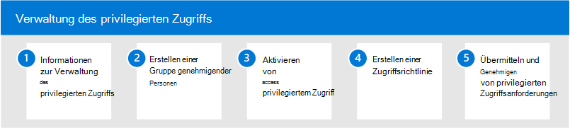

# Privileged Access Management in Microsoft 365Privileged access management in Microsoft 365

Der ständige Zugriff einiger Benutzer auf vertrauliche Informationen oder kritische Netzwerkkonfigurationseinstellungen in Microsoft Exchange Online ist ein potenzieller Weg für gefährdete Konten oder interne Bedrohungsaktivitäten.Having standing access by some users to sensitive information or critical network configuration settings in Microsoft Exchange Online is a potential pathway for compromised accounts or internal threat activities. Die Verwaltung des privilegierten Zugriffs schützt Ihre Organisation vor Verstößen und trägt dazu bei, bewährte Compliancemethoden zu erfüllen, indem der ständige Zugriff auf vertrauliche Daten oder der Zugriff auf kritische Konfigurationseinstellungen eingeschränkt wird.Privileged access management helps protect your organization from breaches and helps to meet compliance best practices by limiting standing access to sensitive data or access to critical configuration settings. Anstelle von Administratoren mit ständigem Zugriff werden Just-in-Time-Zugriffsregeln für Aufgaben implementiert, die erhöhte Berechtigungen benötigen.Instead of administrators having constant access, just-in-time access rules are implemented for tasks that need elevated permissions. Wenn Sie die Verwaltung privilegierter Zugriffe für Exchange Online in Microsoft 365 aktivieren, kann Ihre Organisation ohne ständige Berechtigungen arbeiten und eine Schutzebene gegen ständige Sicherheitsrisiken im Administrativen Zugriff bereitstellen.Enabling privileged access management for Exchange Online in Microsoft 365 allows your organization to operate with zero standing privileges and provide a layer of defense against standing administrative access vulnerabilities.

## Konfigurieren der Verwaltung des privilegierten Zugriffs für Microsoft 365Configure privileged access management for Microsoft 365

Verwenden Sie die folgenden Schritte, um die Verwaltung privilegierter Zugriffe für Ihre Organisation zu konfigurieren:Use the following steps to configure privileged access management for your organization:

1. Informationen zur [Verwaltung privilegierter Zugriffe](privileged-access-management-overview.md) in Microsoft 365Learn about [privileged access management](privileged-access-management-overview.md) in Microsoft 365
2. Erstellen der [Gruppe einer genehmigende Benutzer](privileged-access-management-configuration.md#step-1-create-an-approvers-group)Create an [approver's group](privileged-access-management-configuration.md#step-1-create-an-approvers-group)
3. Aktivieren [der Verwaltung des privilegierten Zugriffs](privileged-access-management-configuration.md#step-2-enable-privileged-access)Enable [privileged access management](privileged-access-management-configuration.md#step-2-enable-privileged-access)
4. Erstellen einer [Zugriffsrichtlinie](privileged-access-management-configuration.md#step-3-create-an-access-policy)Create an [access policy](privileged-access-management-configuration.md#step-3-create-an-access-policy)
5. Übermitteln/Genehmigen von [Privilegierten Zugriffsanforderungen](privileged-access-management-configuration.md#step-4-submitapprove-privileged-access-requests)Submit/approve [privileged access requests](privileged-access-management-configuration.md#step-4-submitapprove-privileged-access-requests)

## Weitere Informationen zur Verwaltung privilegierter ZugriffeMore information about privileged access management

- [Häufig gestellte Fragen zur Verwaltung privilegierter ZugriffeFrequently asked questions about privileged access management](privileged-access-management-overview.md#frequently-asked-questions)