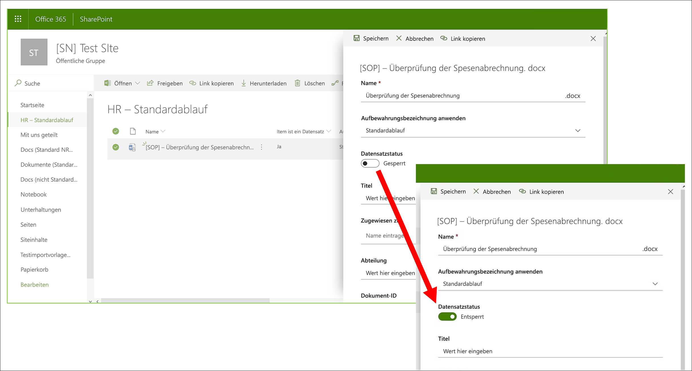
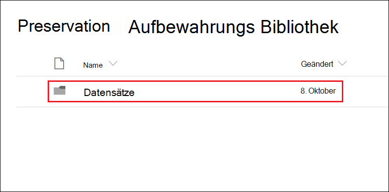

# Versionsverwaltung zur Aktualisierung von Datensätzen verwenden, die in Microsoft Office SharePoint Online oder OneDrive gespeichert sindUse record versioning to update records stored in SharePoint or OneDrive

>*[Microsoft 365-Lizenzierungsleitfaden für Sicherheit und Compliance](/office365/servicedescriptions/microsoft-365-service-descriptions/microsoft-365-tenantlevel-services-licensing-guidance/microsoft-365-security-compliance-licensing-guidance).**[Microsoft 365 licensing guidance for security & compliance](/office365/servicedescriptions/microsoft-365-service-descriptions/microsoft-365-tenantlevel-services-licensing-guidance/microsoft-365-security-compliance-licensing-guidance).*

>[!NOTE] 
> Da regulatorische Datensätze die Bearbeitung blockieren, ist die Versionsverwaltung für diese Datensätze nicht verfügbar.Because regulatory records block editing, record versioning is not available for regulatory records.

Die Möglichkeit, ein Dokument als [Datensatz](records-management.md#records) zu markieren und Aktionen einzuschränken, die für den Datensatz ausgeführt werden können, ist ein wesentliches Ziel jeder Datensatzverwaltungslösung.The ability to mark a document as a [record](records-management.md#records) and restrict actions that can be performed on the record is an essential goal for any records management solution. Möglicherweise ist jedoch auch eine Zusammenarbeit erforderlich, damit Benutzer nachfolgende Versionen erstellen können.However, collaboration might also be needed for people to create subsequent versions.

Beispielsweise können Sie einen Kaufvertrag als Datensatz markieren, müssen dann jedoch den Vertrag mit neuen Bedingungen aktualisieren und die neueste Version als neuen Datensatz markieren, während die vorherige Datensatzversion beibehalten wird.For example, you might mark a sales contract as a record, but then need to update the contract with new terms and mark the latest version as a new record while still retaining the previous record version. Bei diesen Szenarien unterstützt SharePoint und OneDrive die *Versionsverwaltung für Datensätze*.For these types of scenarios, SharePoint and OneDrive support *record versioning*. OneNote-Notizbuchordner unterstützen keine Datensatzversionsverwaltung.OneNote notebook folders don't support record versioning.

Wenn Sie die Datensatzversionsverwaltung verwenden möchten, [bezeichnen Sie zunächst das Dokument markieren es als Datensatz](declare-records.md).To use record versioning, you first [label the document and mark it as a record](declare-records.md). Zu diesem Zeitpunkt wird neben der Aufbewahrungsbezeichnung eine Dokumenteigenschaft mit dem Namen *Datensatzstatus* angezeigt, und der anfängliche Datensatzstatus ist **Gesperrt**.At this point, a document property, called *Record status* is displayed next to the retention label, and the initial record status is **Locked**. 

Sie können jetzt Folgendes tun:You can now do the following things:

  - **Bearbeiten und speichern Sie einzelne Versionen des Dokuments kontinuierlich als Datensätze, indem Sie die Eigenschaft Datensatzstatus entsperren und sperren.****Continually edit and retain individual versions of the document as records, by unlocking and locking the Record status property.** Nur wenn die Eigenschaft **Datensatzstatus** auf **Gesperrt** gesetzt ist, wird eine neue Version des Datensatzes beibehalten.Only when the **Record status** property is set to **Locked** is a new version of the record retained. Durch das Umschalten zwischen gesperrt und entsperrt wird das Risiko verringert, dass unnötige Versionen und Kopien des Dokuments aufbewahrt werden.This toggle of locked and unlocked reduces the risk of retaining unnecessary versions and copies of the document.

  - **Lassen Sie die Datensätze automatisch in einem in-situ-Datensatzrepository speichern, das sich in der Websitesammlung befindet.****Have the records automatically stored in an in-place records repository located within the site collection.** Jede Websitesammlung in SharePoint und OneDrive bewahrt Inhalte in ihrer Aufbewahrungsspeicherbibliothek auf.Each site collection in SharePoint and OneDrive preserves content in its Preservation Hold library. Datensatzversionen werden im Ordner „Datensätze“ in dieser Bibliothek gespeichert.Record versions are stored in the Records folder in this library.

  - **Verwalten Sie ein erneuerndes Dokument, das alle Versionen enthält.****Maintain an evergreen document that contains all versions.** Standardmäßig enthält jedes SharePoint- und OneDrive-Dokument einen Versionsverlauf, der im Element „Menü“ zur Verfügung steht.By default, each SharePoint and OneDrive document has a version history available on the item menu. In diesem Versionsverlauf können Sie leicht sehen, welche Versionen Datensätze sind und diese Dokumente anzeigen.In this version history, you can easily see which versions are records and view those documents.

> [!TIP]
> Wenn Sie die Datensatzversionierung mit einer Aufbewahrungsbezeichnung verwenden, das eine Löschaktion umfasst, empfiehlt es sich, auch die Aufbewahrungseinstellung so zu konfigurieren, dass der **Aufbewahrungszeitraum darauf basiert** werden **wann Elemente bezeichnet wurden**.When you use record versioning with a retention label that has a delete action, consider configuring the retention setting **Start the retention period based on:** to be **When items were labeled**. Mit dieser Bezeichnungseinstellung wird der Beginn des Aufbewahrungszeitraums für jede neue Datensatzversion zurückgesetzt, wodurch sichergestellt wird, dass ältere Versionen vor neueren Versionen gelöscht werden.With this label setting, the start of the retention period is reset for each new record version, which ensures that older versions will be deleted before newer versions.

Die Datensatzversionsverwaltung ist automatisch für alle Dokumente verfügbar, deren Aufbewahrungsbezeichnung das Element als Datensatz kennzeichnet.Record versioning is automatically available for any document that has a retention label that marks the item as a record. Wenn ein Benutzer die Dokumenteigenschaften im Detailbereich anzeigt, kann er den **Datensatzstatus** von **Gesperrt** auf **Entsperrt** umschalten.When a user views the document properties by using the details pane, they can toggle the **Record status** from **Locked** to **Unlocked**. Diese Aktion erstellt einen Datensatz im Ordner "Datensätze" in dem permanenten Dokumentarchiv, in dem er sich für den Rest seiner Aufbewahrungsdauer befindet.This action creates a record in the Records folder in the Preservation Hold library, where it resides for the remainder of its retention period. 

Während das Dokument entsperrt ist, kann jeder Benutzer mit Standardbearbeitungsberechtigungen die Datei bearbeiten.While the document is unlocked, any user with standard edit permissions can edit the file. Benutzer können die Datei jedoch nicht löschen, da es sich immer noch um einen Datensatz handelt.However, users can't delete the file, because it's still a record. Wenn die Bearbeitung abgeschlossen ist, kann ein Benutzer den **Datensatzstatus** von **Entsperrt** auf **Gesperrt** umschalten, wodurch weitere Änderungen in diesem Status verhindert werden.When editing is complete, a  user can then toggle the **Record status** from **Unlocked** to **Locked**, which prevents further edits while in this status.
  

## Sperren und Entsperren eines DatensatzesLocking and unlocking a record

Nachdem eine Aufbewahrungsbezeichnung, die den Inhalt als Datensatz kennzeichnet, auf ein Dokument angewendet wurde, kann jeder Benutzer mit Beitragsberechtigungen oder einer engeren Berechtigungsstufe einen Datensatz entsperren oder einen entsperrten Datensatz sperren.After a retention label that marks content as a record is applied to a document, any user with Contribute permissions or a narrower permission level can unlock a record or lock an unlocked record.
  

Wenn ein Benutzer einen Datensatz entsperrt, werden die folgenden Aktionen ausgeführt:When a user unlocks a record, the following actions occur:

1. Wenn für die aktuelle Websitesammlung kein Permanentes Dokumentarchiv vorhanden ist, wird eine erstellt.If the current site collection doesn't have a Preservation Hold library, one is created.

2. Wenn das permanente Dokumentarchiv nicht über einen Datensatzordner verfügt, wird einer erstellt.If the Preservation Hold library doesn't have a Records folder, one is created.

3. Eine **Kopieren in**-Aktion kopiert die neueste Version des Dokuments in den Ordner „Datensätze“.A **Copy to** action copies the latest version of the document to the Records folder. Die Aktion **Kopieren in** ist nur für die neueste Version und für keine früheren Versionen wirksam.The **Copy to** action includes only the latest version and no prior versions. Dieses kopierte Dokument wird jetzt als Datensatzversion des Dokuments betrachtet, und der Dateiname hat das Format: \[Titel GUID Version\#\]This copied document is now considered a record version of the document, and its file name has the format: \[Title GUID Version\#\]

4. Die im Ordner "Datensätze" erstellte Kopie wird dem Versionsverlauf des Originaldokuments hinzugefügt. In dieser Version wird das Wort **Datensatz** im Kommentarfeld angezeigt.The copy created in the Records folder is added to the version history of the original document, and this version shows the word **Record** in the comments field.

5. Das Originaldokument ist eine neue Version, die bearbeitet, aber nicht gelöscht werden kann.The original document is a new version that can be edited, but not deleted. In der Spalte Dokumentbibliothek **Element ist ein Datensatz** wird weiterhin der Wert **Ja** angezeigt, da das Dokument weiterhin ein Datensatz ist, auch wenn es jetzt bearbeitet werden kann.The document library column **Item is a Record** still shows the **Yes** value because the document is still a record, even if it can now be edited.

Wenn ein Benutzer einen Datensatz sperrt, kann das ursprüngliche Dokument erneut nicht bearbeitet werden.When a user locks a record, the original document again can't be edited. Es handelt sich aber um die Aktion zum Entsperren eines Datensatzes, der eine Version in den Ordner „Datensätze“ in dem permanenten Dokumentarchiv kopiert.But it is the action of unlocking a record that copies a version to the Records folder in the Preservation Hold library.

## DatensatzversionenRecord versions

Jedes Mal, wenn ein Benutzer einen Datensatz entsperrt, wird die aktuelle Version in das permanente Dokumentarchiv kopiert, und diese Version enthält den Wert **Datensatz** im Feld **Kommentare** des Versionsverlaufs.Each time a user unlocks a record, the latest version is copied to the Preservation Hold library, and that version contains the value of **Record** in the **Comments** field of the version history.
  

Um den Versionsverlauf anzuzeigen, wählen Sie ein Dokument in der Dokumentbibliothek aus, und klicken Sie dann im Element „Menü“ auf **Versionsverlauf**.To view the version history, select a document in the document library and then click **Version history** in the item menu.

## Speicherort von DatensätzenWhere records are stored

Die Datensätze werden im Ordner „Datensätze“ in dem permanenten Dokumentarchiv auf der Website auf oberster Ebene in der Websitesammlung gespeichert.Records are stored in the Records folder in the Preservation Hold library in the top-level site in the site collection. Wählen Sie in der linken Navigation auf der Site der obersten Ebene die Option **Siteinhalte** \> **Permanentes Dokumentarchiv**.In the left navigation on the top-level site, choose **Site contents** \> **Preservation Hold Library**.
  

  

Weitere Informationen zur Funktionsweise des permanenten Dokumentarchivs finden Sie unter [Funktionsweise der Aufbewahrung für SharePoint und OneDrive](retention-policies-sharepoint.md#how-retention-works-for-sharepoint-and-onedrive).For more information about how the Preservation Hold library works, see [How retention works for SharePoint and OneDrive](retention-policies-sharepoint.md#how-retention-works-for-sharepoint-and-onedrive).

## Durchsuchen des Überwachungsprotokolls nach Ereignissen für die VersionsverwaltungSearching the audit log for record versioning events

Die Aktionen zum Sperren und Entsperren von Datensätzen werden im Überwachungsprotokoll protokolliert.The actions of locking and unlocking records are logged in the audit log. Wählen Sie unter **Datei- und Seitenaktivitäten** die Optionen **Datensatzstatus in „Gesperrt“ geändert** und **Datensatzstatus in „Entsperrt“ geändert** aus.From **File and page activities**, select **Changed record status to locked** and **Changed record status to unlocked**.

Weitere Informationen für die Suche nach diesen Ereignissen finden Sie unter [Durchsuchen des Überwachungsprotokolls im Security & Compliance Center](search-the-audit-log-in-security-and-compliance.md#file-and-page-activities).For more information about searching for these events, see [Search the audit log in the Security & Compliance Center](search-the-audit-log-in-security-and-compliance.md#file-and-page-activities).

## Weitere SchritteNext steps

Weitere von der Datensatzverwaltung unterstützte Szenarien finden Sie unter [Häufige Szenarios für die Datensatzverwaltung](get-started-with-records-management.md#common-scenarios-for-records-management).For other scenarios supported by records management, see [Common scenarios for records management](get-started-with-records-management.md#common-scenarios-for-records-management).