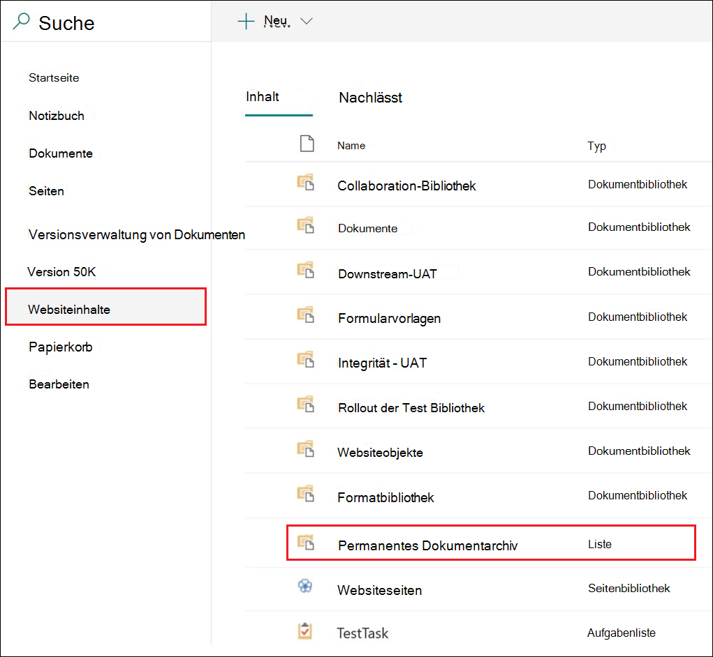

# Versionsverwaltung zur Aktualisierung von Datensätzen verwenden, die in Microsoft Office SharePoint Online oder OneDrive gespeichert sind

>*[Microsoft 365-Lizenzierungsleitfaden für Sicherheit und Compliance](https://aka.ms/ComplianceSD).*

>[!NOTE] 
> Da regulatorische Datensätze die Bearbeitung blockieren, ist die Versionsverwaltung für diese Datensätze nicht verfügbar.

Die Möglichkeit, ein Dokument als [Datensatz](records-management.md#records) zu markieren und Aktionen einzuschränken, die für den Datensatz ausgeführt werden können, ist ein wesentliches Ziel jeder Datensatzverwaltungslösung. Möglicherweise ist jedoch auch eine Zusammenarbeit erforderlich, damit Benutzer nachfolgende Versionen erstellen können.

Beispielsweise können Sie einen Kaufvertrag als Datensatz markieren, müssen dann jedoch den Vertrag mit neuen Bedingungen aktualisieren und die neueste Version als neuen Datensatz markieren, während die vorherige Datensatzversion beibehalten wird. Bei diesen Szenarien unterstützt SharePoint und OneDrive die *Versionsverwaltung für Datensätze*. OneNote-Notizbuchordner unterstützen keine Datensatzversionsverwaltung.

Wenn Sie die Datensatzversionsverwaltung verwenden möchten, [bezeichnen Sie zunächst das Dokument markieren es als Datensatz](declare-records.md). Zu diesem Zeitpunkt wird neben der Aufbewahrungsbezeichnung eine Dokumenteigenschaft mit dem Namen *Datensatzstatus* angezeigt, und der anfängliche Datensatzstatus ist **Gesperrt**. 

Sie können jetzt Folgendes tun:

  - **Bearbeiten und speichern Sie einzelne Versionen des Dokuments kontinuierlich als Datensätze, indem Sie die Eigenschaft Datensatzstatus entsperren und sperren.** Nur wenn die Eigenschaft **Datensatzstatus** auf **Gesperrt** gesetzt ist, wird eine neue Version des Datensatzes beibehalten. Durch das Umschalten zwischen gesperrt und entsperrt wird das Risiko verringert, dass unnötige Versionen und Kopien des Dokuments aufbewahrt werden.

  - **Lassen Sie die Datensätze automatisch in einem in-situ-Datensatzrepository speichern, das sich in der Websitesammlung befindet.** Jede Websitesammlung in SharePoint und OneDrive bewahrt Inhalte in ihrer Aufbewahrungsspeicherbibliothek auf. Datensatzversionen werden im Ordner „Datensätze“ in dieser Bibliothek gespeichert.

  - **Verwalten Sie ein erneuerndes Dokument, das alle Versionen enthält.** Standardmäßig enthält jedes SharePoint- und OneDrive-Dokument einen Versionsverlauf, der im Element „Menü“ zur Verfügung steht. In diesem Versionsverlauf können Sie leicht sehen, welche Versionen Datensätze sind und diese Dokumente anzeigen.

Die Datensatzversionsverwaltung ist automatisch für alle Dokumente verfügbar, deren Aufbewahrungsbezeichnung das Element als Datensatz kennzeichnet. Wenn ein Benutzer die Dokumenteigenschaften im Detailbereich anzeigt, kann er den **Datensatzstatus** von **Gesperrt** auf **Entsperrt** umschalten. Diese Aktion erstellt einen Datensatz im Ordner "Datensätze" in dem permanenten Dokumentarchiv, in dem er sich für den Rest seiner Aufbewahrungsdauer befindet. 

Während das Dokument entsperrt ist, kann jeder Benutzer mit Standardbearbeitungsberechtigungen die Datei bearbeiten. Benutzer können die Datei jedoch nicht löschen, da es sich immer noch um einen Datensatz handelt. Wenn die Bearbeitung abgeschlossen ist, kann ein Benutzer den **Datensatzstatus** von **Entsperrt** auf **Gesperrt** umschalten, wodurch weitere Änderungen in diesem Status verhindert werden.
  

## Sperren und Entsperren eines Datensatzes

Nachdem eine Aufbewahrungsbezeichnung, die den Inhalt als Datensatz kennzeichnet, auf ein Dokument angewendet wurde, kann jeder Benutzer mit Beitragsberechtigungen oder einer engeren Berechtigungsstufe einen Datensatz entsperren oder einen entsperrten Datensatz sperren.
  

Wenn ein Benutzer einen Datensatz entsperrt, werden die folgenden Aktionen ausgeführt:

1. Wenn für die aktuelle Websitesammlung kein Permanentes Dokumentarchiv vorhanden ist, wird eine erstellt.

2. Wenn das permanente Dokumentarchiv nicht über einen Datensatzordner verfügt, wird einer erstellt.

3. Eine **Kopieren in**-Aktion kopiert die neueste Version des Dokuments in den Ordner „Datensätze“. Die Aktion **Kopieren in** ist nur für die neueste Version und für keine früheren Versionen wirksam. Dieses kopierte Dokument wird jetzt als Datensatzversion des Dokuments betrachtet, und der Dateiname hat das Format: \[Titel GUID Version\#\]

4. Die im Ordner "Datensätze" erstellte Kopie wird dem Versionsverlauf des Originaldokuments hinzugefügt. In dieser Version wird das Wort **Datensatz** im Kommentarfeld angezeigt.

5. Das Originaldokument ist eine neue Version, die bearbeitet, aber nicht gelöscht werden kann. In der Spalte Dokumentbibliothek **Element ist ein Datensatz** wird weiterhin der Wert **Ja** angezeigt, da das Dokument weiterhin ein Datensatz ist, auch wenn es jetzt bearbeitet werden kann.

Wenn ein Benutzer einen Datensatz sperrt, kann das ursprüngliche Dokument erneut nicht bearbeitet werden. Es handelt sich aber um die Aktion zum Entsperren eines Datensatzes, der eine Version in den Ordner „Datensätze“ in dem permanenten Dokumentarchiv kopiert.

## Datensatzversionen

Jedes Mal, wenn ein Benutzer einen Datensatz entsperrt, wird die aktuelle Version in den Ordner Datensätze in dem permanenten Dokumentarchiv kopiert, und diese Version enthält den Wert **Datensatz** im Feld **Kommentare** des Versionsverlaufs.
  

Um den Versionsverlauf anzuzeigen, wählen Sie ein Dokument in der Dokumentbibliothek aus, und klicken Sie dann im Element „Menü“ auf **Versionsverlauf**.

## Speicherort von Datensätzen

Die Datensätze werden im Ordner „Datensätze“ in dem permanenten Dokumentarchiv auf der Website auf oberster Ebene in der Websitesammlung gespeichert. Wählen Sie in der linken Navigation auf der Site der obersten Ebene die Option **Siteinhalte** \> **Permanentes Dokumentarchiv**.
  

  

Das permanente Dokumentarchiv ist nur für Websitesammlungsadministratoren sichtbar. Außerdem ist das permanente Dokumentarchiv nicht standardmäßig vorhanden. Er wird nur erstellt, wenn Inhalte, die einer Aufbewahrungsbezeichnung oder einer Aufbewahrungsrichtlinie unterliegen, zum ersten Mal in der Websitesammlung gelöscht werden.

## Durchsuchen des Überwachungsprotokolls nach Ereignissen für die Versionsverwaltung

Die Aktionen zum Sperren und Entsperren von Datensätzen werden im Überwachungsprotokoll protokolliert. Sie können nach den spezifischen Aktivitäten **Datensatzstatus auf „gesperrt“ geändert** und **Datensatzstatus auf „entsperrt“ geändert** suchen, die sich im Abschnitt **Datei- und Seitenaktivitäten** auf der Dropdownliste **Aktivitäten** auf der Seite **Überprüfungsprotokoll durchsuchen** im Security & Compliance Center befinden.
  

Weitere Informationen zum Durchsuchen dieser Ereignisse finden Sie im Abschnitt „Datei- und Seitenaktivitäten“ im [Durchsuchen des Überwachungsprotokolls im Security & Compliance Center](search-the-audit-log-in-security-and-compliance.md#file-and-page-activities).

## Weitere Schritte

Weitere von der Datensatzverwaltung unterstützte Szenarien finden Sie unter [Häufige Szenarios für die Datensatzverwaltung](get-started-with-records-management.md#common-scenarios-for-records-management).
