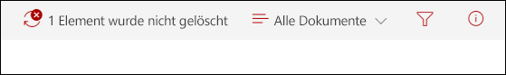

# Mehr zur Datensatzverwaltung

>*[Microsoft 365-Lizenzierungsleitfaden für Sicherheit und Compliance](https://aka.ms/ComplianceSD).*

Organisationen aller Art benötigen eine Datensatzverwaltungslösung, um gesetzliche, rechtliche sowie unternehmenskritische Datensätze in ihren Unternehmensdaten zu verwalten. Die Datensatzverwaltung in Microsoft 365 unterstützt eine Organisation bei der Verwaltung ihrer gesetzlichen Verpflichtungen, bietet die Möglichkeit, die Einhaltung von Vorschriften nachzuweisen und erhöht die Effizienz bei der regelmäßigen Disposition von Elementen, die nicht mehr aufbewahrt werden müssen oder nicht mehr von Wert oder für Geschäftszwecke erforderlich sind.

Verwenden Sie die folgenden Funktionen zur Unterstützung Ihrer Datensatzverwaltungslösung in Microsoft 365:

- **Bezeichnen von Inhalt als Datensatz** Erstellen und Konfigurieren von Aufbewahrungsbezeichnungen zum Kennzeichen von Inhalten als [Datensatz](#records), die von Benutzern oder automatisch durch das Identifizieren vertraulicher Informationen, Stichwörter oder Inhaltstypen angewendet werden können.

- **Migrieren und verwalten Sie Ihre Aufbewahrungsanforderungen mit dem Dateiplan**. Mithilfe eines [Dateiplans](file-plan-manager.md) können Sie einen vorhandenen Aufbewahrungsplan in Microsoft 365 integrieren oder einen neuen Plan für verbesserte Verwaltungsfunktionen erstellen.

- **Konfigurieren Sie Einstellungen für Aufbewahrungs-und Löschvorgänge mit der Aufbewahrungsbezeichnung**. Konfigurieren Sie [Aufbewahrungsbezeichnungen](retention.md#retention-labels), bei denen die Aufbewahrungszeiträume und Aktionen auf zahlreichen Faktoren basieren, z. B. dem Datum der letzten Änderung oder dem Erstellungsdatum.

- **Starten Sie verschiedene Aufbewahrungszeiträume beim Auftreten eines Ereignisses** mit [ereignisbasierter Aufbewahrung](event-driven-retention.md).

- **Überprüfen und validieren Sie die Disposition** mit [Dispositionsüberprüfungen](disposition.md#disposition-reviews) und Nachweis der [Eintragslöschung](disposition.md#disposition-of-records).

- **Exportieren Sie Informationen zu allen Elementen**, die mit der [Exportoption](disposition.md#filter-and-export-the-views) verworfen wurden.

- **Legen Sie spezifische Berechtigungen für Datensatzverwalterfunktionen in Ihrer Organisation fest**, um [über den richtigen Zugriff zu verfügen](../security/office-365-security/permissions-in-the-security-and-compliance-center.md).

Mit diesen Funktionen können Sie die Aufbewahrungspläne Ihrer Organisation und die Anforderungen in eine Lösung für die Datensatzverwaltung integrieren, mit der Aufbewahrung, Deklaration von Datensätzen und Disposition zur Unterstützung des gesamten Inhaltslebenszyklus verwaltet werden.

Zusätzlich zur Onlinedokumentation können Sie sich bei Bedarf die [Webinaraufzeichnung](https://aka.ms/MIPC/Video-RecordsManagementWebinar) für die Datensatzverwaltung anhören und das zugehörige [Deck mit häufig gestellten Fragen](https://aka.ms/MIPC/Blog-RecordsManagementWebinar) herunterladen.

## Datensätze

Wenn Inhalt als Datensatz markiert ist:

- Die Elemente werden hinsichtlich der [zulässigen oder blockierten Aktionen](#compare-restrictions-for-what-actions-are-allowed-or-blocked) eingeschränkt.

- Andere Aktivitäten in Verbindung mit dem Element werden protokolliert.

- Sie haben einen Verfügungsnachweis, wenn die Elemente am Ende ihrer Aufbewahrungsfrist gelöscht werden.

Verwenden Sie [Aufbewahrungsbezeichnungen](retention.md#retention-labels), um Inhalte als Datensätze zu kennzeichnen. Sie können diese Bezeichnungen entweder veröffentlichen, damit Benutzer und Administratoren sie manuell auf Inhalte anwenden können, oder diese Bezeichnungen automatisch auf Inhalte anwenden, die Sie als Datensatz markieren möchten.

Durch die Verwendung von Aufbewahrungsbezeichnungen zum Markieren von Inhalten als Datensätze können Sie eine einzige und konsistente Strategie für die Verwaltung von Datensätzen in Ihrer Microsoft 365-Umgebung implementieren.

### Vergleichen Sie die Einschränkungen für die zulässigen oder blockierten Aktionen

Verwenden Sie die folgende Tabelle, um zu ermitteln, welche Einschränkungen für den Inhalt durch das Anwenden einer Standardaufbewahrungsbezeichnung und von Aufbewahrungsbezeichnungen, die den Inhalt als Datensatz kennzeichnen, gelten. 

Eine standardmäßige Aufbewahrungsbezeichnung verfügt über Aufbewahrungseinstellungen und Aktionen, markiert Inhalte aber nicht als Datensatz.

>[!NOTE] 
> Der Vollständigkeit halber enthält die Tabelle Spalten für einen gesperrten und entsperrten Datensatz, die für SharePoint und OneDrive gelten, jedoch nicht für Exchange. Die Möglichkeit zum Sperren und Entsperren eines Datensatzes verwendet die [Datensatzversionsverwaltung](record-versioning.md), die für Exchange-Elemente nicht unterstützt wird. Für alle Exchange-Elemente, die als Datensatz markiert sind, ist das Verhalten der Spalte **Datensatz gesperrt** und der Spalte **Datensatz entsperrt** nicht relevant.

|Aktion| Aufbewahrungsbezeichnung |Datensatz – gesperrt| Datensatz – entsperrt|
|:-----|:-----|:-----|:-----|:-----|
|Inhalt bearbeiten|Zulässig | **Gesperrt** | Zulässig|
|Bearbeiten Sie Eigenschaften, einschließlich Umbenennen|Allowed |Zulässig | Allowed|
|Löschen|Zulässig 1 |**Gesperrt** | **Gesperrt**|
|Kopie|Allowed |Zulässig | Allowed|
|Innerhalb eines Containers bewegen2|Allowed |Zulässig | Allowed|
|Über Container hinweg bewegen 2|Zulässig |Zulässig, wenn nie entsperrt | Zulässig|
|Öffnen/Lesen|Allowed |Zulässig | Allowed|
|Ändern der Bezeichnung|Zulässig |Zulässig – nur Container-Administrator | Zulässig – nur Container-Administrator|
|Bezeichnung entfernen|Zulässig |Zulässig – nur Container-Administrator | Zulässig – nur Container-Administrator|

Fußnoten:

1 Unterstützt von OneDrive und Exchange durch Aufbewahren einer Kopie an einem gesicherten Ort, jedoch blockiert von SharePoint.

Nachricht, die ein Benutzer sieht, wenn er versucht, ein beschriftetes Dokument in SharePoint zu löschen:

2 Zu den Containern gehören SharePoint-Dokumentbibliotheken und Exchange-Postfächer.

## Weitere Schritte

Siehe [Erste Schritte mit der Datensatzverwaltung](get-started-with-records-management.md).

Mehr zu Inhalte als Datensatz markieren finden Sie unter [Datensätze mithilfe von Aufbewahrungsbezeichnungen deklarieren](declare-records.md).
