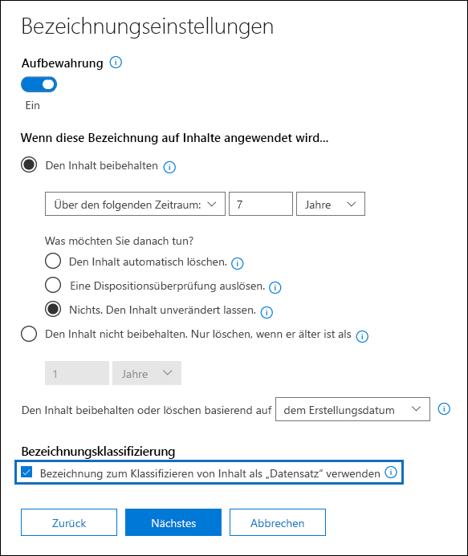

# Übersicht über die Datensätze

Die Verwaltung von Datensätzen in Microsoft 365 hilft einer Organisation bei der Einhaltung Ihrer Unternehmensrichtlinien, gesetzlicher und regulatorischer Verpflichtungen bei gleichzeitiger Verringerung der Risiken und der gesetzlichen Haftung.

Auf hoher Ebene bedeutet die Kennzeichnung von Inhalten als Datensätze Folgendes:

- Das Element wird unveränderlich (ein Datensatz kann nicht geändert oder gelöscht werden).

- Andere Aktivitäten in Verbindung mit dem Element werden protokolliert.

- Datensätze werden gelöscht, wenn der festgelegte Aufbewahrungszeitraum endet.

Sie können [Aufbewahrungsbezeichnungen](labels.md) verwenden, um Inhalte als Datensätze zu kennzeichnen. Nachdem Sie Aufbewahrungsbezeichnungen zum Kennzeichnen von Datensätzen erstellt haben, können Sie diese Bezeichnungen entweder [veröffentlichen](labels.md#how-retention-labels-work-with-retention-label-policies) (sodass Benutzer Sie dazu verwenden können, Inhalte als Datensätze zu kennzeichnen) oder sie [automatisch auf Inhalte anwenden](labels.md#applying-a-retention-label-automatically-based-on-conditions), die Sie als Datensatz kennzeichnen möchten. Mithilfe von Bezeichnungen können Sie eine einzige, einheitliche Strategie zur Datensatzverwaltung überall in Office 365 implementieren, während andere Features der Datensatzverwaltung, z. B. das Datenarchiv, nur für SharePoint Online-Inhalte gelten.

Beachten Sie im Hinblick auf Aufbewahrungsbezeichnungen die folgenden Punkte:

  - **Die Bezeichnungen sind unveränderlich.** Eine Aufbewahrungsbezeichnung, die Inhalte als Datensatz kennzeichnet, kann neben SharePoint und OneDrive for Business auch auf Exchange-Inhalte angewendet werden. Allerdings ist die [Versionsverwaltung der Bezeichnung](#record-versioning) nur in SharePoint und OneDrive und nicht für Exchange verfügbar.

    In Exchange sind Inhalte, die als Datensatz gekennzeichnet sind, bis zum endgültigen Löschen unveränderlich. Wenn ein Exchange-Element als Datensatz bezeichnet wird, geschehen vier Dinge:

    - Das Element kann nicht endgültig gelöscht werden.

    - Das Element kann nicht bearbeitet werden.

    - Die Bezeichnung kann nicht geändert werden.

    - Die Bezeichnung kann nicht entfernt werden.

  - **Datensätze und Ordner.** Sie können eine Aufbewahrungsbezeichnung auf einen Ordner in Exchange, SharePoint und OneDrive anwenden. Wenn ein Ordner als Datensatz bezeichnet wird und Sie ein Element in den Ordner verschieben, wird das Element als Datensatz bezeichnet. Wenn Sie das Element aus dem Ordner verschieben, bleibt es weiterhin als Datensatz gekennzeichnet.

    Wenn Sie die Datensatzkennzeichnung eines Ordners (in SharePoint und OneDrive), in eine Aufbewahrungskennzeichnung abändern, die den Inhalt nicht als Datensatz deklariert, behalten die Elemente im Ordner trotzdem ihre bestehende Datensatzkennzeichnung.

    Weitere Informationen zum Anwenden von Datensatzkennzeichnungen auf SharePoint- und OneDrive-Ordner finden Sie unter [Anwenden einer Aufbewahrungsbezeichnung auf alle Inhalte in einer Bibliothek, einem Ordner oder einer Dokumentenmappe in SharePoint](labels.md#applying-a-default-retention-label-to-all-content-in-a-sharepoint-library-folder-or-document-set).

  - **Datensätze können nicht gelöscht werden**. Wenn ein Benutzer versucht, einen Datensatz in Exchange zu löschen, wird das Element in den Ordner „Wiederherstellbare Elemente“ verschoben, entsprechend der Beschreibung in [Funktionsweise einer Aufbewahrungsrichtlinie mit Inhalten am Speicherort](retention-policies.md#content-in-mailboxes-and-public-folders).

    Wenn ein Benutzer versucht, einen Datensatz in SharePoint zu löschen, wird eine Fehlermeldung angezeigt, dass das Element nicht gelöscht wurde und in der Bibliothek verbleibt.

    

    Wenn ein Benutzer versucht, einen Datensatz in OneDrive zu löschen, wird das Element in das permanentes Dokumentarchiv verschoben, entsprechend der Beschreibung in  [Funktionsweise einer Aufbewahrungsrichtlinie mit Inhalten am Speicherort](retention-policies.md#content-in-onedrive-accounts-and-sharepoint-sites).

  - **Datensatzbezeichnungen können nicht entfernt werden.** Sobald eine Datensatzbezeichnung auf ein Element angewendet wurde, kann nur der Administrator dieses Speicherorts (beispielsweise ein Websitesammlungsadministrator einer SharePoint-Website) diese Datensatzbezeichnung entfernen.

## Verwenden von Aufbewahrungsbezeichnungen zum Kennzeichnen von Datensätzen

Wenn Sie eine Aufbewahrungsbezeichnung erstellen, haben Sie die Möglichkeit, die Aufbewahrungsbezeichnung zum Kennzeichnen des Inhalts als Datensatz zu verwenden. Wenn Sie Inhalte als Datensatz kennzeichnen möchten, müssen Sie die folgenden Schritte ausführen:

1. Erstellen einer Aufbewahrungsbezeichnung. Wechseln Sie im Microsoft 365 Compliance Center zu **Records Management-** \> **Dateiplan**. Klicken Sie auf der Seite **Dateiplan** auf **Eine Bezeichnung erstellen**.

2. Wählen Sie auf der Seite **Bezeichnungseinstellungen** im Assistenten die Option aus, mit der die Aufbewahrungsbezeichnung Inhalte als Datensatz kennzeichnen soll. 

   

3. [Veröffentlichen](labels.md#how-retention-labels-work-with-retention-label-policies) Sie oder [wenden Sie](labels.md#applying-a-retention-label-automatically-based-on-conditions) die Aufbewahrungsbezeichnung auf SharePoint-Websites und/ oder OneDrive-Konten automatisch an. 

### Anwenden einer Aufbewahrungsbezeichnung auf Inhalte

Bei Exchange kann jeder Benutzer mit Schreibzugriff auf das Postfach eine Datensatzbezeichnung auf eine E-Mail-Nachricht anwenden. Bei Inhalten auf SharePoint und OneDrive kann jeder Benutzer in der Standardgruppe "Mitglieder" (Berechtigungsstufe "Mitwirken") eine Datensatzbezeichnung auf Inhalte anwenden. Nur der Websitesammlungsadministrator kann diese Datensatzbezeichnung entfernen oder ändern, nachdem sie angewendet wurde. Wie zuvor erläutert, kann eine Aufbewahrungsbezeichnung, die Inhalte als Datensatz kennzeichnet, automatisch auf Inhalte angewendet werden.

Es sieht so aus, als ob eine Datensatzbezeichnung auf ein Dokument auf einer SharePoint-Website oder ein OneDrive-Konto angewendet wurde.
  

:::image type="content" source="media/recordversioning7.png" alt-text="Detailbereich für ein als Datensatz markiertes Dokument":::

## Datensatzversionsverwaltung

Ein wesentlicher Bestandteil der Datensatzverwaltung ist die Möglichkeit, ein Dokument als Datensatz zu kennzeichnen und den Datensatz unveränderlich zu halten. Gleichzeitig wird durch die Datensatzunveränderlichkeit die Zusammenarbeit am Dokument verhindert, wenn andere Benutzer eine spätere Version erstellen müssen. Sie können z. B. einen Kaufvertrag als Datensatz kennzeichnen, den Vertrag dann aber mit neuen Bedingungen aktualisieren und die neueste Version als neuen Datensatz kennzeichnen, während die vorherige Datensatzversion weiterhin beibehalten wird. Bei diesen Szenarien unterstützt SharePoint Online und OneDrive for Business jetzt die *Versionsverwaltung für Datensätze*. OneNote-Notizbuchordner werden nicht unterstützt.

Wenn Sie die Datensatzversionsverwaltung verwenden möchten, müssen Sie im ersten Schritt das Microsoft 365 Compliance Center verwenden, um Aufbewahrungsbezeichnungen zu erstellen und zu veröffentlichen, die Datensätze für alle SharePoint-Websites und/ oder OneDrive-Konten kennzeichnen oder auf bestimmten SharePoint-Websites und/ oder OneDrive-Konten veröffentlichen. Der nächste Schritt besteht darin, eine veröffentlichte Aufbewahrungsdatenbezeichnung für einen Datensatz auf ein Dokument anzuwenden. Wenn dies erfolgt ist, wird neben der Aufbewahrungsbezeichnung eine Dokumenteigenschaft mit dem Namen *Datensatzstatus* angezeigt, und der ursprüngliche Datensatzstatus wird **Gesperrt** sein. An dieser Stelle können Sie die folgenden Aktionen durchführen:

  - **Sie können einzelne Versionen des Dokuments kontinuierlich bearbeiten und als Datensätze kennzeichnen, indem Sie die Eigenschaft „Datensatzstatus“ ordnungsgemäß entsperren und sperren.** Nur die als Datensätze gekennzeichneten Versionen bleiben erhalten, wenn die Eigenschaft **Datensatzstatus** auf **Gesperrt** gestellt ist. Dadurch wird das Risiko verringert, dass nicht benötigte Versionen und Kopien des Dokuments aufbewahrt werden.

  - **Lassen Sie die Datensätze automatisch in einem in-situ-Datensatzrepository speichern, das sich in der Websitesammlung befindet.** Jede Websitesammlung in SharePoint und OneDrive bewahrt Inhalte in ihrer Aufbewahrungsspeicherbibliothek auf. Datensatzversionen werden im Ordner „Datensätze“ in dieser Bibliothek gespeichert.

  - **Verwalten Sie ein erneuerndes Dokument, das alle Versionen enthält.** Standardmäßig enthält jedes SharePoint- und OneDrive-Dokument einen Versionsverlauf, der im Element „Menü“ zur Verfügung steht. In diesem Versionsverlauf können Sie leicht sehen, welche Versionen Datensätze sind und diese Dokumente anzeigen.

Die Datensatzversionsverwaltung steht für alle Dokumente mit einer Aufbewahrungsbezeichnung , die das Element als Datensatz kennzeichnet, automatisch zur Verfügung. Wenn ein Benutzer die Dokumenteigenschaften über den Detailbereich anzeigt, wechselt er **Datensatzstatus** von **Gesperrt** zu **Entsperrt**. Dieser einzelne Klick erstellt einen Datensatz im Ordner „Datensätze des permanenten Dokumentenarchiv, in dem er sich für den Rest des Aufbewahrungszeitraums befindet. Während das Dokument entsperrt ist, kann jeder Benutzer mit Berechtigungen die Datei bearbeiten. Benutzer können die Datei jedoch nicht löschen, weil Sie als gekennzeichneter Datensatz betrachtet wird. Nachdem die erforderlichen Änderungen vorgenommen wurden, kann der Benutzer den **Datensatzstatus** von **Entsperrt** auf **Gesperrt**wechseln, sodass das Dokument erneut als Datensatz gekennzeichnet wird und nicht bearbeitet werden kann.
  

:::image type="content" source="media/recordversioning8.png" alt-text="Datensatzstatus-Eigenschaft in einem Dokument, das als Datensatz gekennzeichnet ist":::

> [!NOTE]
> Für die Datensatzversionsverwaltung ist eine Office 365 Enterprise E5-Lizenz für jeden Benutzer erforderlich, der die Berechtigung zum Bearbeiten von Inhalten hat, die in einer SharePoint-Website oder in einem OneDrive-Konto als Datensatz gekennzeichnet wurden. Benutzer, die schreibgeschützten Zugriff haben, benötigen keine Lizenz.

### Sperren und Entsperren eines Datensatzes

Nachdem einem Dokument eine Datensatzbezeichnung zugeordnet wurde, kann jeder Benutzer in der Standardgruppe „Mitglieder“ (Berechtigungsstufe „Mitwirken“) einen Datensatz entsperren oder einen entsperrten Datensatz sperren.
  

:::image type="content" source="media/recordversioning9.png" alt-text="Der Datensatzstatus zeigt, dass das Datensatzdokument entsperrt ist":::

Wenn ein Benutzer einen Datensatz entsperrt, werden die folgenden Aktionen ausgeführt:

1. Wenn für die aktuelle Websitesammlung kein Permanentes Dokumentarchiv vorhanden ist, wird eine erstellt.

2. Wenn das permanente Dokumentarchiv nicht über einen Datensatzordner verfügt, wird einer erstellt.

3. Eine **Kopieren in**-Aktion kopiert die neueste Version des Dokuments in den Ordner „Datensätze“. Die Aktion **Kopieren in** ist nur für die neueste Version und für keine früheren Versionen wirksam. Dieses kopierte Dokument wird jetzt als Datensatzversion des Dokuments betrachtet, und der Dateiname hat das Format: \[Titel GUID Version\#\]

4. Die Kopie, die im Ordner „Datensätze“ erstellt wurde, wurde dem Versionsverlauf des ursprünglichen Dokuments hinzugefügt, und diese Version zeigt das Wort **Datensatz** im Feld „Kommentare“.

5. Bei dem Originaldokument handelt es sich um eine neue Version, die bearbeitet (aber nicht gelöscht) werden kann. Die Dokumentbibliothekspalte **Element ist ein Datensatz** weist weiterhin den Wert **Ja** auf, weil das Dokument noch als Datensatz betrachtet wird, selbst wenn es jetzt bearbeitet werden kann.

Wenn ein Benutzer einen Datensatz sperrt, kann das ursprüngliche Dokument erneut nicht bearbeitet werden. Es handelt sich aber um die Aktion zum Entsperren eines Datensatzes, der eine Version in den Ordner „Datensätze“ in dem permanenten Dokumentarchiv kopiert.

### Datensatzversionen

Jedes Mal, wenn ein Benutzer einen Datensatz entsperrt, wird die aktuelle Version in den Ordner Datensätze in dem permanenten Dokumentarchiv kopiert, und diese Version enthält den Wert **Datensatz** im Feld **Kommentare** des Versionsverlaufs.
  

:::image type="content" source="media/recordversioning10.png" alt-text="Datensatz, der in dem permanenten Dokumentarchiv angezeigt wird":::

Um den Versionsverlauf anzuzeigen, wählen Sie ein Dokument in der Dokumentbibliothek aus, und klicken Sie dann im Element „Menü“ auf **Versionsverlauf**.

### Speicherort von Datensätzen

Die Datensätze werden im Ordner „Datensätze“ in dem permanenten Dokumentarchiv auf der Website auf oberster Ebene in der Websitesammlung gespeichert. Wählen Sie in der linken Navigationsleiste auf der Website auf oberster Ebene **Websiteinhalte** \> **Permanentes Dokumentarchiv** aus.
  

:::image type="content" source="media/recordversioning11.png" alt-text="Permanentes Dokumentarchiv":::

  

:::image type="content" source="media/recordversioning12.png" alt-text="Datensatzordner in dem permanenten Dokumentarchiv":::

Das permanente Dokumentarchiv ist nur für Websitesammlungsadministratoren sichtbar. Außerdem ist das permanente Dokumentarchiv nicht standardmäßig vorhanden. Er wird nur erstellt, wenn Inhalte, die einer Aufbewahrungsbezeichnung oder einer Aufbewahrungsrichtlinie unterliegen, zum ersten Mal in der Websitesammlung gelöscht werden.

### Durchsuchen des Überwachungsprotokolls nach Ereignissen für die Versionsverwaltung

Die Aktionen zum Sperren und Entsperren von Datensätzen werden im Office 365-Überwachungsprotokoll protokolliert. Sie können nach den spezifischen Aktivitäten **Datensatzstatus auf „gesperrt“ geändert** und **Datensatzstatus auf „entsperrt“ geändert** suchen, die sich im Abschnitt **Datei- und Seitenaktivitäten** auf der Dropdownliste **Aktivitäten** auf der Seite **Überprüfungsprotokoll durchsuchen** im Security & Compliance Center befinden.
  

:::image type="content" source="media/recordversioning13.png" alt-text="Durchsuchen des Überwachungsprotokolls nach Ereignissen für die Versionsverwaltung":::

Weitere Informationen zum Durchsuchen dieser Ereignisse finden Sie im Abschnitt „Datei- und Seitenaktivitäten“ im [Durchsuchen des Überwachungsprotokolls im Security & Compliance Center](search-the-audit-log-in-security-and-compliance.md#file-and-page-activities).
