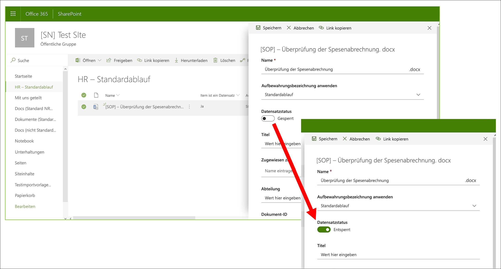

# Informationen zu DatensätzenLearn about records

>*[Microsoft 365-Lizenzierungsleitfaden für Sicherheit und Compliance](https://aka.ms/ComplianceSD).**[Microsoft 365 licensing guidance for security & compliance](https://aka.ms/ComplianceSD).*

Die Verwaltung von Datensätzen in Microsoft 365 hilft Ihrer Organisation bei der Einhaltung von Unternehmensrichtlinien und gesetzlichen oder regulatorischer Verpflichtungen bei gleichzeitiger Verringerung der Risiken und der gesetzlichen Haftung.Managing records in Microsoft 365 helps your organization comply with corporate policies and legal or regulatory obligations, while also reducing risk and legal liability.

Wenn Inhalt als Datensatz markiert ist:When content is marked as a record:

- Die Elemente werden hinsichtlich der [zulässigen oder blockierten Aktionen](#compare-restrictions-for-what-actions-are-allowed-or-blocked) eingeschränkt.Restrictions are placed on the items in terms of what [actions are allowed or blocked](#compare-restrictions-for-what-actions-are-allowed-or-blocked).

- Andere Aktivitäten in Verbindung mit dem Element werden protokolliert.Additional activities about the item are logged.

- Sie haben einen Verfügungsnachweis, wenn die Elemente am Ende ihrer Aufbewahrungsfrist gelöscht werden.You have proof of disposition when the items are deleted at the end of their retention period.

Verwenden Sie [Aufbewahrungsbezeichnungen](retention.md#retention-labels), um Inhalte als Datensätze zu kennzeichnen.You use [retention labels](retention.md#retention-labels) to mark content as a record. Sie können diese Bezeichnungen entweder veröffentlichen, damit Benutzer und Administratoren sie manuell auf Inhalte anwenden können, oder diese Bezeichnungen automatisch auf Inhalte anwenden, die Sie als Datensatz markieren möchten.You can either publish those labels so that users and administrators can manually apply them to content, or auto-apply those labels to content that you want to mark as a record.

Durch die Verwendung von Aufbewahrungsbezeichnungen zum Markieren von Inhalten als Datensätze können Sie eine einzige und konsistente Strategie für die Verwaltung von Datensätzen in Ihrer Microsoft 365-Umgebung implementieren.By using retention labels to mark content as records, you can implement a single and consistent strategy for managing records across your Microsoft 365 environment.

## Vergleichen Sie die Einschränkungen für die zulässigen oder blockierten AktionenCompare restrictions for what actions are allowed or blocked

Verwenden Sie die folgende Tabelle, um zu ermitteln, welche Einschränkungen für den Inhalt durch das Anwenden einer Standardaufbewahrungsbezeichnung und von Aufbewahrungsbezeichnungen, die den Inhalt als Datensatz kennzeichnen, gelten.Use the following table to identify what restrictions are placed on content as a result of applying a standard retention label, and retention labels that mark content as a record. 

Eine Standardaufbewahrungsbezeichnung kann Daten speichern, ohne den Inhalt als Datensatz zu markieren.A standard retention label has the configuration to retain data without marking content as a record.

>[!NOTE] 
> Der Vollständigkeit halber enthält die Tabelle Spalten für einen gesperrten und entsperrten Datensatz, die für SharePoint und OneDrive gelten, jedoch nicht für Exchange.For completeness, the table includes columns for a locked and unlocked record, which is applicable to SharePoint and OneDrive, but not Exchange. Die Möglichkeit zum Sperren und Entsperren eines Datensatzes verwendet die [Datensatzversionsverwaltung](#record-versioning), die für Exchange-Elemente nicht unterstützt wird.The ability to lock and unlock a record uses [record versioning](#record-versioning) that isn't supported for Exchange items. Für alle Exchange-Elemente, die als Datensatz markiert sind, ist das Verhalten der Spalte **Datensatz gesperrt** und der Spalte **Datensatz entsperrt** nicht relevant.So for all Exchange items that are marked as a record, the behavior maps to the **Record - locked** column, and the **Record - unlocked column** is not relevant.

|AktionAction| AufbewahrungsbezeichnungRetention label |Datensatz – gesperrtRecord - locked| Datensatz – entsperrtRecord - unlocked|
|:-----|:-----|:-----|:-----|:-----|
|Inhalt bearbeitenEdit contents|ZulässigAllowed | **Gesperrt****Blocked** | ZulässigAllowed|
|Bearbeiten Sie Eigenschaften, einschließlich UmbenennenEdit properties, including rename|AllowedAllowed |ZulässigAllowed | AllowedAllowed|
|LöschenDelete|Zulässig 1Allowed 1 |**Gesperrt****Blocked** | **Gesperrt****Blocked**|
|KopieCopy|AllowedAllowed |ZulässigAllowed | AllowedAllowed|
|Innerhalb eines Containers bewegen2Move within container 2|AllowedAllowed |ZulässigAllowed | AllowedAllowed|
|Über Container hinweg bewegen 2Move across containers 2|ZulässigAllowed |Zulässig, wenn nie entsperrtAllowed if never unlocked | ZulässigAllowed|
|Öffnen/LesenOpen/Read|AllowedAllowed |ZulässigAllowed | AllowedAllowed|
|Ändern der BezeichnungChange label|ZulässigAllowed |Zulässig – nur Container-AdministratorAllowed - container admin only | Zulässig – nur Container-AdministratorAllowed - container admin only|
|Bezeichnung entfernenRemove label|ZulässigAllowed |Zulässig – nur Container-AdministratorAllowed - container admin only | Zulässig – nur Container-AdministratorAllowed - container admin only|

Fußnoten:Footnotes:

1 Unterstützt von OneDrive und Exchange durch Aufbewahren einer Kopie an einem gesicherten Ort, jedoch blockiert von SharePoint.1 Supported by OneDrive and Exchange by retaining a copy in a secured location, but blocked by SharePoint.

Nachricht, die ein Benutzer sieht, wenn er versucht, ein beschriftetes Dokument in SharePoint zu löschen:Message a user sees if they try to delete a labeled document in SharePoint:

2 Zu den Containern gehören SharePoint-Dokumentbibliotheken und Exchange-Postfächer.2 Containers include SharePoint document libraries and Exchange mailboxes.

## Verwenden von Aufbewahrungsbezeichnungen zum Kennzeichnen von DatensätzenUsing retention labels to declare records

Wenn Sie eine Aufbewahrungsbezeichnung erstellen, können Sie die Aufbewahrungsbezeichnung dazu verwenden, Inhalte als Datensatz zu kennzeichnen:When you create a retention label, you have the option to use the retention label to mark the content as a record:

1. Wechseln Sie im Microsoft 365 Compliance Center zu **Records Management-** \> **Dateiplan**.In the Microsoft 365 compliance center, go to **Records Management** \> **File Plan**. Wählen Sie von der Seite **Dateiplan** **Eine Bezeichnung erstellen**.On the **File plan** page, select **Create a label**.

2. Wählen Sie auf der Seite **Bezeichnungseinstellungen** im Assistenten die Option zum Klassifizieren von Inhalten als Datensatz aus.On the **Label settings** page in the wizard, choose the option to classify content as a record.
    
   

3. Wenden Sie die Aufbewahrungsbezeichnung nach Bedarf auf SharePoint- oder OneDrive-Dokumente und Exchange-E-Mails an.Apply the retention label to SharePoint or OneDrive documents and Exchange emails, as needed. Für Anweisungen:For instructions:
    
    - [Erstellen von Aufbewahrungsbezeichnungen und Anwenden in AppsCreate retention labels and apply them in apps](create-apply-retention-labels.md)
    
    - [Automatisches Anwenden einer Aufbewahrungsbezeichnung auf InhalteApply a retention label to content automatically](apply-retention-labels-automatically.md)

### Anwenden der konfigurierten Aufbewahrungsbezeichnung auf InhalteApplying the configured retention label to content

Wenn Aufbewahrungsbezeichnungen, die Inhalte als Datensatz markieren, Benutzern zur Verfügung gestellt werden, um sie in Apps anzuwenden:When retention labels that mark content as a record are made available for users to apply them in apps:

- Bei Exchange kann jeder Benutzer mit Schreibzugriff auf das Postfach diese Bezeichnung anwenden.For Exchange, any user with write-access to the mailbox can apply these labels. 
- Bei SharePoint und OneDrive kann jeder Benutzer in der Standardgruppe "Mitglieder" (Berechtigungsstufe "Beitrag") diese Bezeichnung anwenden.For SharePoint and OneDrive, any user in the default Members group (the Contribute permission level) can apply these labels.

Beispiel für ein Dokument, das mithilfe einer Aufbewahrungsbezeichnung als Datensatz markiert wurde:Example of a document marked as record by using a retention label:

## DatensatzversionsverwaltungRecord versioning

Die Möglichkeit, ein Dokument als Datensatz zu markieren und Aktionen einzuschränken, die für den Datensatz ausgeführt werden können, ist ein wesentliches Ziel jeder Datensatzverwaltungslösung.The ability to mark a document as a record and restrict actions that can be performed on the record is an essential goal for any records management solution. Möglicherweise ist jedoch auch eine Zusammenarbeit erforderlich, damit Benutzer nachfolgende Versionen erstellen können.However, collaboration might also be needed for people to create subsequent versions.

Beispielsweise können Sie einen Kaufvertrag als Datensatz markieren, müssen dann jedoch den Vertrag mit neuen Bedingungen aktualisieren und die neueste Version als neuen Datensatz markieren, während die vorherige Datensatzversion beibehalten wird.For example, you might mark a sales contract as a record, but then need to update the contract with new terms and mark the latest version as a new record while still retaining the previous record version. Bei diesen Szenarien unterstützt SharePoint und OneDrive die *Versionsverwaltung für Datensätze*.For these types of scenarios, SharePoint and OneDrive support *record versioning*. OneNote-Notizbuchordner unterstützen keine Datensatzversionsverwaltung.OneNote notebook folders don't support record versioning.

Um die Datensatzversionsverwaltung zu verwenden, beschriften Sie zuerst das Dokument und markieren Sie es als Datensatz.To use record versioning, first label the document and mark it as a record. Zu diesem Zeitpunkt wird neben der Aufbewahrungsbezeichnung eine Dokumenteigenschaft mit dem Namen *Datensatzstatus* angezeigt, und der anfängliche Datensatzstatus ist **Gesperrt**.At this point, a document property, called *Record status* is displayed next to the retention label, and the initial record status is **Locked**. 

Sie können jetzt Folgendes tun:You can now do the following things:

  - **Bearbeiten und speichern Sie einzelne Versionen des Dokuments kontinuierlich als Datensätze, indem Sie die Eigenschaft Datensatzstatus entsperren und sperren.****Continually edit and retain individual versions of the document as records, by unlocking and locking the Record status property.** Nur wenn die Eigenschaft **Datensatzstatus** auf **Gesperrt** gesetzt ist, wird eine neue Version des Datensatzes beibehalten.Only when the **Record status** property is set to **Locked** is a new version of the record retained. Durch das Umschalten zwischen gesperrt und entsperrt wird das Risiko verringert, dass unnötige Versionen und Kopien des Dokuments aufbewahrt werden.This toggle of locked and unlocked reduces the risk of retaining unnecessary versions and copies of the document.

  - **Lassen Sie die Datensätze automatisch in einem in-situ-Datensatzrepository speichern, das sich in der Websitesammlung befindet.****Have the records automatically stored in an in-place records repository located within the site collection.** Jede Websitesammlung in SharePoint und OneDrive bewahrt Inhalte in ihrer Aufbewahrungsspeicherbibliothek auf.Each site collection in SharePoint and OneDrive preserves content in its Preservation Hold library. Datensatzversionen werden im Ordner „Datensätze“ in dieser Bibliothek gespeichert.Record versions are stored in the Records folder in this library.

  - **Verwalten Sie ein erneuerndes Dokument, das alle Versionen enthält.****Maintain an evergreen document that contains all versions.** Standardmäßig enthält jedes SharePoint- und OneDrive-Dokument einen Versionsverlauf, der im Element „Menü“ zur Verfügung steht.By default, each SharePoint and OneDrive document has a version history available on the item menu. In diesem Versionsverlauf können Sie leicht sehen, welche Versionen Datensätze sind und diese Dokumente anzeigen.In this version history, you can easily see which versions are records and view those documents.

Die Datensatzversionsverwaltung ist automatisch für alle Dokumente verfügbar, deren Aufbewahrungsbezeichnung das Element als Datensatz kennzeichnet.Record versioning is automatically available for any document that has a retention label that marks the item as a record. Wenn ein Benutzer die Dokumenteigenschaften im Detailbereich anzeigt, kann er den **Datensatzstatus** von **Gesperrt** auf **Entsperrt** umschalten.When a user views the document properties by using the details pane, they can toggle the **Record status** from **Locked** to **Unlocked**. Diese Aktion erstellt einen Datensatz im Ordner "Datensätze" in dem permanenten Dokumentarchiv, in dem er sich für den Rest seiner Aufbewahrungsdauer befindet.This action creates a record in the Records folder in the Preservation Hold library, where it resides for the remainder of its retention period. 

Während das Dokument entsperrt ist, kann jeder Benutzer mit Standardbearbeitungsberechtigungen die Datei bearbeiten.While the document is unlocked, any user with standard edit permissions can edit the file. Benutzer können die Datei jedoch nicht löschen, da es sich immer noch um einen Datensatz handelt.However, users can't delete the file, because it's still a record. Wenn die Bearbeitung abgeschlossen ist, kann ein Benutzer den **Datensatzstatus** von **Entsperrt** auf **Gesperrt** umschalten, wodurch weitere Änderungen in diesem Status verhindert werden.When editing is complete, a  user can then toggle the **Record status** from **Unlocked** to **Locked**, which prevents further edits while in this status.
  

### Sperren und Entsperren eines DatensatzesLocking and unlocking a record

Nachdem eine Aufbewahrungsbezeichnung, die den Inhalt als Datensatz kennzeichnet, auf ein Dokument angewendet wurde, kann jeder Benutzer mit Beitragsberechtigungen oder einer engeren Berechtigungsstufe einen Datensatz entsperren oder einen entsperrten Datensatz sperren.After a retention label that marks content as a record is applied to a document, any user with Contribute permissions or a narrower permission level can unlock a record or lock an unlocked record.
  

Wenn ein Benutzer einen Datensatz entsperrt, werden die folgenden Aktionen ausgeführt:When a user unlocks a record, the following actions occur:

1. Wenn für die aktuelle Websitesammlung kein Permanentes Dokumentarchiv vorhanden ist, wird eine erstellt.If the current site collection doesn't have a Preservation Hold library, one is created.

2. Wenn das permanente Dokumentarchiv nicht über einen Datensatzordner verfügt, wird einer erstellt.If the Preservation Hold library doesn't have a Records folder, one is created.

3. Eine **Kopieren in**-Aktion kopiert die neueste Version des Dokuments in den Ordner „Datensätze“.A **Copy to** action copies the latest version of the document to the Records folder. Die Aktion **Kopieren in** ist nur für die neueste Version und für keine früheren Versionen wirksam.The **Copy to** action includes only the latest version and no prior versions. Dieses kopierte Dokument wird jetzt als Datensatzversion des Dokuments betrachtet, und der Dateiname hat das Format: \[Titel GUID Version\#\]This copied document is now considered a record version of the document, and its file name has the format: \[Title GUID Version\#\]

4. Die im Ordner "Datensätze" erstellte Kopie wird dem Versionsverlauf des Originaldokuments hinzugefügt. In dieser Version wird das Wort **Datensatz** im Kommentarfeld angezeigt.The copy created in the Records folder is added to the version history of the original document, and this version shows the word **Record** in the comments field.

5. Das Originaldokument ist eine neue Version, die bearbeitet, aber nicht gelöscht werden kann.The original document is a new version that can be edited, but not deleted. In der Spalte Dokumentbibliothek **Element ist ein Datensatz** wird weiterhin der Wert **Ja** angezeigt, da das Dokument weiterhin ein Datensatz ist, auch wenn es jetzt bearbeitet werden kann.The document library column **Item is a Record** still shows the **Yes** value because the document is still a record, even if it can now be edited.

Wenn ein Benutzer einen Datensatz sperrt, kann das ursprüngliche Dokument erneut nicht bearbeitet werden.When a user locks a record, the original document again can't be edited. Es handelt sich aber um die Aktion zum Entsperren eines Datensatzes, der eine Version in den Ordner „Datensätze“ in dem permanenten Dokumentarchiv kopiert.But it is the action of unlocking a record that copies a version to the Records folder in the Preservation Hold library.

### DatensatzversionenRecord versions

Jedes Mal, wenn ein Benutzer einen Datensatz entsperrt, wird die aktuelle Version in den Ordner Datensätze in dem permanenten Dokumentarchiv kopiert, und diese Version enthält den Wert **Datensatz** im Feld **Kommentare** des Versionsverlaufs.Each time a user unlocks a record, the latest version is copied to the Records folder in the Preservation Hold library, and that version contains the value of **Record** in the **Comments** field of the version history.
  

Um den Versionsverlauf anzuzeigen, wählen Sie ein Dokument in der Dokumentbibliothek aus, und klicken Sie dann im Element „Menü“ auf **Versionsverlauf**.To view the version history, select a document in the document library and then click **Version history** in the item menu.

### Speicherort von DatensätzenWhere records are stored

Die Datensätze werden im Ordner „Datensätze“ in dem permanenten Dokumentarchiv auf der Website auf oberster Ebene in der Websitesammlung gespeichert.Records are stored in the Records folder in the Preservation Hold library in the top-level site in the site collection. Wählen Sie in der linken Navigation auf der Site der obersten Ebene die Option **Siteinhalte** \> **Permanentes Dokumentarchiv**.In the left navigation on the top-level site, choose **Site contents** \> **Preservation Hold Library**.
  

  

Das permanente Dokumentarchiv ist nur für Websitesammlungsadministratoren sichtbar.The Preservation Hold library is visible only to site collection admins. Außerdem ist das permanente Dokumentarchiv nicht standardmäßig vorhanden.Also, the Preservation Hold library doesn't exist by default. Er wird nur erstellt, wenn Inhalte, die einer Aufbewahrungsbezeichnung oder einer Aufbewahrungsrichtlinie unterliegen, zum ersten Mal in der Websitesammlung gelöscht werden.It's created only when content subject to a retention label or retention policy is deleted for the first time in the site collection.

### Durchsuchen des Überwachungsprotokolls nach Ereignissen für die VersionsverwaltungSearching the audit log for record versioning events

Die Aktionen zum Sperren und Entsperren von Datensätzen werden im Überwachungsprotokoll protokolliert.The actions of locking and unlocking records are logged in the audit log. Sie können nach den spezifischen Aktivitäten **Datensatzstatus auf „gesperrt“ geändert** und **Datensatzstatus auf „entsperrt“ geändert** suchen, die sich im Abschnitt **Datei- und Seitenaktivitäten** auf der Dropdownliste **Aktivitäten** auf der Seite **Überprüfungsprotokoll durchsuchen** im Security & Compliance Center befinden.You can search for the specific activities **Changed record status to locked** and **Changed record status to unlocked**, which are located in the **File and page activities** section in the **Activities** dropdown list on the **Audit log search** page in the security and compliance center.
  

Weitere Informationen zum Durchsuchen dieser Ereignisse finden Sie im Abschnitt „Datei- und Seitenaktivitäten“ im [Durchsuchen des Überwachungsprotokolls im Security & Compliance Center](search-the-audit-log-in-security-and-compliance.md#file-and-page-activities).For more information about searching for these events, see the "File and page activities" section in [Search the audit log in the Security & Compliance Center](search-the-audit-log-in-security-and-compliance.md#file-and-page-activities).

## Nächste SchritteNext steps

Wenn Sie noch keine Aufbewahrungsbezeichnungen für die Datensatzverwaltung besitzen, lesen Sie [Erste Schritte mit Aufbewahrungsrichtlinien und Aufbewahrungsbezeichnungen](get-started-with-retention.md).If you don't yet have retention labels to use for records management, see [Get started with retention policies and retention labels](get-started-with-retention.md).

Informationen zur Löschung von Datensätzen finden Sie unter [Löschen von Inhalten](disposition.md).To learn about disposition of records, see [Disposing of content](disposition.md).
