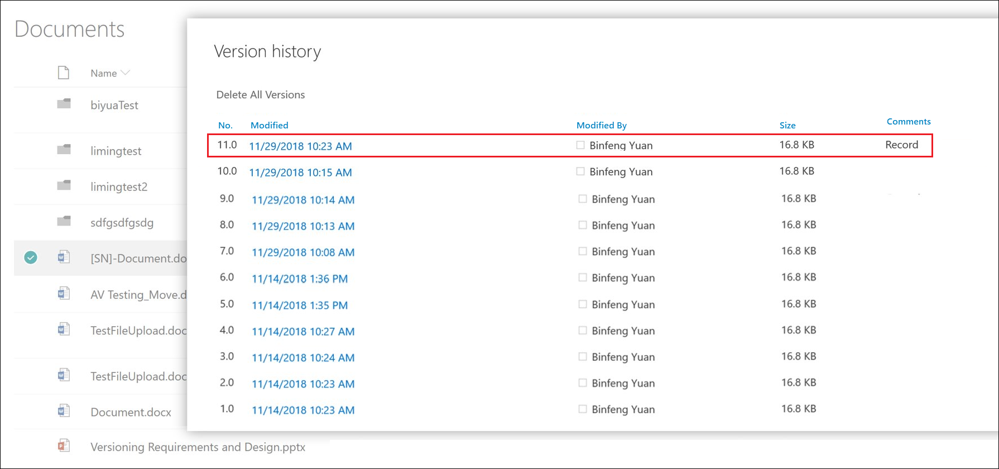
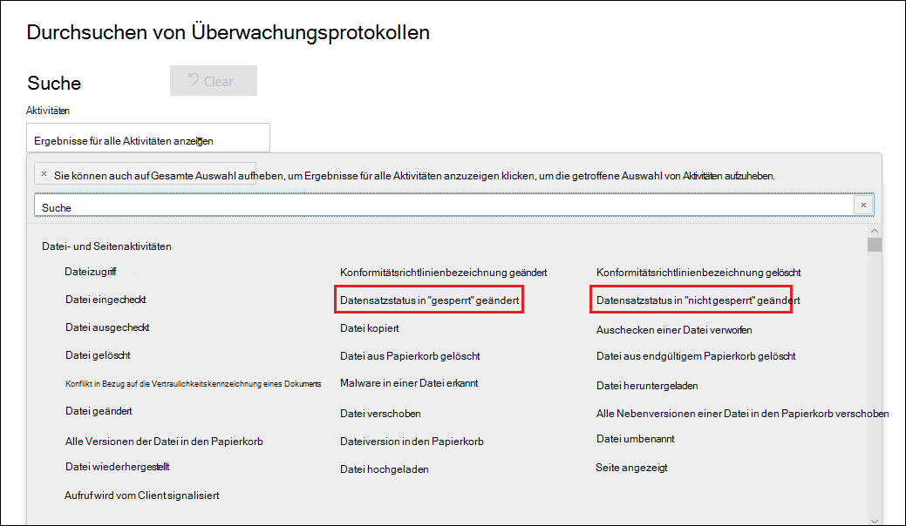

# Übersicht über die DatensätzeOverview of records

>*[Microsoft 365-Lizenzierungsleitfaden für Sicherheit und Compliance](https://aka.ms/ComplianceSD).**[Microsoft 365 licensing guidance for security & compliance](https://aka.ms/ComplianceSD).*

Die Verwaltung von Datensätzen in Microsoft 365 hilft einer Organisation bei der Einhaltung Ihrer Unternehmensrichtlinien, gesetzlicher und regulatorischer Verpflichtungen bei gleichzeitiger Verringerung der Risiken und der gesetzlichen Haftung.Managing records in Microsoft 365 helps an organization comply with their corporate policies, legal and regulatory obligations while reducing risk and legal liability.

Auf hoher Ebene bedeutet die Kennzeichnung von Inhalten als Datensätze Folgendes:At a high level, declaring content as a record means that:

- Das Element wird unveränderlich (ein Datensatz kann nicht geändert oder gelöscht werden).The item becomes immutable (a record can't be modified or deleted)

- Andere Aktivitäten in Verbindung mit dem Element werden protokolliert.Additional activities about the item are logged

- Datensätze werden gelöscht, wenn der festgelegte Aufbewahrungszeitraum endet.Records are disposed of after their stated retention period is past

Sie können [Aufbewahrungsbezeichnungen](labels.md) verwenden, um Inhalte als Datensätze zu kennzeichnen.You can use [retention labels](labels.md) to classify content as a record. Nachdem Sie Aufbewahrungsbezeichnungen zum Kennzeichnen von Datensätzen erstellt haben, können Sie diese Bezeichnungen entweder [veröffentlichen](labels.md#how-retention-labels-work-with-retention-label-policies) (sodass Benutzer Sie dazu verwenden können, Inhalte als Datensätze zu kennzeichnen) oder sie [automatisch auf Inhalte anwenden](labels.md#applying-a-retention-label-automatically-based-on-conditions), die Sie als Datensatz kennzeichnen möchten.After you create retention labels that declare records, you can either [publish](labels.md#how-retention-labels-work-with-retention-label-policies) those labels (so that users can use them to classify content as records) or [auto-apply those labels](labels.md#applying-a-retention-label-automatically-based-on-conditions) to content that you want to classify as a record. Mithilfe von Bezeichnungen können Sie eine einzige, einheitliche Strategie zur Datensatzverwaltung überall in Office 365 implementieren, während andere Features der Datensatzverwaltung, z. B. das Datenarchiv, nur für SharePoint Online-Inhalte gelten.By using retention labels to declare records, you can implement a single, consistent records-management strategy across all of Office 365, whereas other records-management features such as the Record Center apply only to content in SharePoint Online.

Beachten Sie im Hinblick auf Aufbewahrungsbezeichnungen die folgenden Punkte:Keep the following things in mind about records:

  - **Die Bezeichnungen sind unveränderlich.****Records are immutable.** Eine Aufbewahrungsbezeichnung, die Inhalte als Datensatz kennzeichnet, kann neben SharePoint und OneDrive for Business auch auf Exchange-Inhalte angewendet werden.A retention label that declares content as a record can be applied to content in Exchange, in addition to SharePoint and OneDrive for Business. Allerdings ist die [Versionsverwaltung der Bezeichnung](#record-versioning) nur in SharePoint und OneDrive und nicht für Exchange verfügbar.However, [record versioning](#record-versioning) is available only in SharePoint and OneDrive, and not for Exchange.

    In Exchange sind Inhalte, die als Datensatz gekennzeichnet sind, bis zum endgültigen Löschen unveränderlich.In Exchange, content labeled as a record is immutable until its final deletion. Wenn ein Exchange-Element als Datensatz bezeichnet wird, geschehen vier Dinge:When an Exchange item is labeled as a record, four things happen:

    - Das Element kann nicht endgültig gelöscht werden.The item can't be permanently deleted.

    - Das Element kann nicht bearbeitet werden.The item can't be edited.

    - Die Bezeichnung kann nicht geändert werden.The label can't be changed.

    - Die Bezeichnung kann nicht entfernt werden.The label can't be removed.

  - **Datensätze und Ordner.****Records and folders.** Sie können eine Aufbewahrungsbezeichnung auf einen Ordner in Exchange, SharePoint und OneDrive anwenden.You can apply a retention label to a folder in Exchange, SharePoint, and OneDrive. Wenn ein Ordner als Datensatz bezeichnet wird und Sie ein Element in den Ordner verschieben, wird das Element als Datensatz bezeichnet.If a folder is labeled as a record, and you move an item into the folder, the item is labeled as a record. Wenn Sie das Element aus dem Ordner verschieben, bleibt es weiterhin als Datensatz gekennzeichnet.When you move the item out of the folder, the item remains labeled as a record.

    Wenn Sie die Datensatzkennzeichnung eines Ordners (in SharePoint und OneDrive), in eine Aufbewahrungskennzeichnung abändern, die den Inhalt nicht als Datensatz deklariert, behalten die Elemente im Ordner trotzdem ihre bestehende Datensatzkennzeichnung.Also, if you change the record label that's applied to a folder (in SharePoint and OneDrive) to a retention label that does not declare content as a record, then items in the folder keep their existing  record label.

    Weitere Informationen zum Anwenden von Datensatzkennzeichnungen auf SharePoint- und OneDrive-Ordner finden Sie unter [Anwenden einer Aufbewahrungsbezeichnung auf alle Inhalte in einer Bibliothek, einem Ordner oder einer Dokumentenmappe in SharePoint](labels.md#applying-a-default-retention-label-to-all-content-in-a-sharepoint-library-folder-or-document-set).For more information about applying retention labels to SharePoint and OneDrive folders, see [Applying a default retention label to all content in a SharePoint library, folder, or document set](labels.md#applying-a-default-retention-label-to-all-content-in-a-sharepoint-library-folder-or-document-set).

  - **Datensätze können nicht gelöscht werden**.**Records can't be deleted**. Wenn ein Benutzer versucht, einen Datensatz in Exchange zu löschen, wird das Element in den Ordner „Wiederherstellbare Elemente“ verschoben, entsprechend der Beschreibung in [Funktionsweise einer Aufbewahrungsrichtlinie mit Inhalten am Speicherort](retention-policies.md#content-in-mailboxes-and-public-folders).If a user attempts to delete a record in Exchange, the item is moved to the Recoverable Items folder as described in [How a retention policy works with content in place](retention-policies.md#content-in-mailboxes-and-public-folders).

    Wenn ein Benutzer versucht, einen Datensatz in SharePoint zu löschen, wird eine Fehlermeldung angezeigt, dass das Element nicht gelöscht wurde und in der Bibliothek verbleibt.If a user attempts to delete a record in a SharePoint, an error is displayed say that the item wasn't deleted, and remains in the library.

    

    Wenn ein Benutzer versucht, einen Datensatz in OneDrive zu löschen, wird das Element in das permanente Dokumentarchiv verschoben, entsprechend der Beschreibung in [Funktionsweise einer Aufbewahrungsrichtlinie mit Inhalten am Speicherort](retention-policies.md#content-in-onedrive-accounts-and-sharepoint-sites).If a user attempts to delete a record in OneDrive, the item is moved to the Preservation Hold library as described in [How a retention policy works with content in place](retention-policies.md#content-in-onedrive-accounts-and-sharepoint-sites).

  - **Datensatzbezeichnungen können nicht entfernt werden.****Records labels can't be removed.** Sobald eine Datensatzbezeichnung auf ein Element angewendet wurde, kann nur der Administrator dieses Speicherorts (beispielsweise ein Websitesammlungsadministrator einer SharePoint-Website) diese Datensatzbezeichnung entfernen.Once a record label has been applied to an item, only the admin of that location (for example, a site collection admin of a SharePoint site) can remove that record label.

## Verwenden von Aufbewahrungsbezeichnungen zum Kennzeichnen von DatensätzenUsing retention labels to declare records

Wenn Sie eine Aufbewahrungsbezeichnung erstellen, haben Sie die Möglichkeit, die Aufbewahrungsbezeichnung zum Kennzeichnen des Inhalts als Datensatz zu verwenden.When you create a retention label, you have the option to use the retention label to classify the content as a record. Führen Sie die folgenden Schritte aus, um Inhalt als Datensatz zu deklarieren:To declare content as a record, follow these steps:

1. Erstellen einer Aufbewahrungsbezeichnung.Create a retention label. Wechseln Sie im Microsoft 365 Compliance Center zu **Records Management-** \> **Dateiplan**.In the Microsoft 365 compliance center, go to **Records Management** \> **File Plan**. Klicken Sie auf der Seite **Dateiplan** auf **Eine Bezeichnung erstellen**.On the **File plan** page, click  **Create a label**.

2. Wählen Sie auf der Seite **Bezeichnungseinstellungen** im Assistenten die Option aus, mit der die Aufbewahrungsbezeichnung Inhalte als Datensatz kennzeichnen soll.On the **Label settings** page in the wizard, choose the option to set the retention label to declare content as a record. 

   

3. [Veröffentlichen](labels.md#how-retention-labels-work-with-retention-label-policies) Sie oder [wenden Sie](labels.md#applying-a-retention-label-automatically-based-on-conditions) die Aufbewahrungsbezeichnung auf SharePoint-Websites und/ oder OneDrive-Konten automatisch an.[Publish](labels.md#how-retention-labels-work-with-retention-label-policies) or [auto-apply](labels.md#applying-a-retention-label-automatically-based-on-conditions) the retention label to SharePoint sites and/or OneDrive accounts.

### Anwenden einer Aufbewahrungsbezeichnung auf InhalteApplying a retention label to content

Bei Exchange kann jeder Benutzer mit Schreibzugriff auf das Postfach eine Datensatzbezeichnung auf eine E-Mail-Nachricht anwenden.For Exchange, any user with write-access to the mailbox can apply a record label to an email message. Bei Inhalten auf SharePoint und OneDrive kann jeder Benutzer in der Standardgruppe "Mitglieder" (Berechtigungsstufe "Mitwirken") eine Datensatzbezeichnung auf Inhalte anwenden.For content in SharePoint and OneDrive, any user in the default Members group (the Contribute permission level) can apply a record label to content. Nur der Websitesammlungsadministrator kann diese Datensatzbezeichnung entfernen oder ändern, nachdem sie angewendet wurde.Only a site collection admin can remove or change that record label after it's been applied. Wie zuvor erläutert, kann eine Aufbewahrungsbezeichnung, die Inhalte als Datensatz kennzeichnet, automatisch auf Inhalte angewendet werden.As previously explained, a retention label that classifies content as a record can be auto-applied to content.

Es sieht so aus, als ob eine Datensatzbezeichnung auf ein Dokument auf einer SharePoint-Website oder ein OneDrive-Konto angewendet wurde.Here's what this looks like when a record label is applied to a document on a SharePoint site or OneDrive account.
  

## DatensatzversionsverwaltungRecord versioning

Ein wesentlicher Bestandteil der Datensatzverwaltung ist die Möglichkeit, ein Dokument als Datensatz zu kennzeichnen und den Datensatz unveränderlich zu halten.An essential part of records management is the ability to declare a document as a record and have that record be immutable. Gleichzeitig wird durch die Datensatzunveränderlichkeit die Zusammenarbeit am Dokument verhindert, wenn andere Benutzer eine spätere Version erstellen müssen.At the same time, record immutability prevents collaboration on the document if people need to create subsequent versions. Sie können z. B. einen Kaufvertrag als Datensatz kennzeichnen, den Vertrag dann aber mit neuen Bedingungen aktualisieren und die neueste Version als neuen Datensatz kennzeichnen, während die vorherige Datensatzversion weiterhin beibehalten wird.For example, you might declare a sales contract as a record, but then need to update the contract with new terms and declare the latest version as a new record while still retaining the previous record version. Bei diesen Szenarien unterstützt SharePoint Online und OneDrive for Business jetzt die *Versionsverwaltung für Datensätze*.For these types of scenarios, SharePoint Online and OneDrive for Business now support *record versioning*. OneNote-Notizbuchordner werden nicht unterstützt.OneNote notebook folders are not supported.

Wenn Sie die Datensatzversionsverwaltung verwenden möchten, müssen Sie im ersten Schritt das Microsoft 365 Compliance Center verwenden, um Aufbewahrungsbezeichnungen zu erstellen und zu veröffentlichen, die Datensätze für alle SharePoint-Websites und/ oder OneDrive-Konten kennzeichnen oder auf bestimmten SharePoint-Websites und/ oder OneDrive-Konten veröffentlichen.To use record versioning, the first step is to use the Microsoft 365 compliance center to create and publish retention labels that declare records to all SharePoint sites and/or OneDrive accounts, or publish them to specific SharePoint sites and/or OneDrive accounts. Der nächste Schritt besteht darin, eine veröffentlichte Aufbewahrungsdatenbezeichnung für einen Datensatz auf ein Dokument anzuwenden.The next step is to apply a published retention record label to a document. Wenn dies erfolgt ist, wird neben der Aufbewahrungsbezeichnung eine Dokumenteigenschaft mit dem Namen *Datensatzstatus* angezeigt, und der ursprüngliche Datensatzstatus wird **Gesperrt** sein.When this is done, a document property, called *Record status* is displayed next to the retention label, and the initial record status will be **Locked**. An dieser Stelle können Sie die folgenden Aktionen durchführen:At this point, you can do the following things:

  - **Sie können einzelne Versionen des Dokuments kontinuierlich bearbeiten und als Datensätze kennzeichnen, indem Sie die Eigenschaft „Datensatzstatus“ ordnungsgemäß entsperren und sperren.****Continually edit and declare individual versions of the document as records, by unlocking and locking the Record status property.** Nur die als Datensätze gekennzeichneten Versionen bleiben erhalten, wenn die Eigenschaft **Datensatzstatus** auf **Gesperrt** gestellt ist.Only the versions declared as records are retained when the **Record status** property is set to **Locked**. Dadurch wird das Risiko verringert, dass nicht benötigte Versionen und Kopien des Dokuments aufbewahrt werden.This reduces the risk of retaining unnecessary versions and copies of the document.

  - **Lassen Sie die Datensätze automatisch in einem in-situ-Datensatzrepository speichern, das sich in der Websitesammlung befindet.****Have the records automatically stored in an in-place records repository located within the site collection.** Jede Websitesammlung in SharePoint und OneDrive bewahrt Inhalte in ihrer Aufbewahrungsspeicherbibliothek auf.Each site collection in SharePoint and OneDrive preserves content in its Preservation Hold library. Datensatzversionen werden im Ordner „Datensätze“ in dieser Bibliothek gespeichert.Record versions are stored in the Records folder in this library.

  - **Verwalten Sie ein erneuerndes Dokument, das alle Versionen enthält.****Maintain an evergreen document that contains all versions.** Standardmäßig enthält jedes SharePoint- und OneDrive-Dokument einen Versionsverlauf, der im Element „Menü“ zur Verfügung steht.By default, each SharePoint and OneDrive document has a version history available on the item menu. In diesem Versionsverlauf können Sie leicht sehen, welche Versionen Datensätze sind und diese Dokumente anzeigen.In this version history, you can easily see which versions are records and view those documents.

Die Datensatzversionsverwaltung steht für alle Dokumente mit einer Aufbewahrungsbezeichnung , die das Element als Datensatz kennzeichnet, automatisch zur Verfügung.Record versioning is automatically available for any document that has a retention label that declares the item as a record. Wenn ein Benutzer die Dokumenteigenschaften über den Detailbereich anzeigt, wechselt er **Datensatzstatus** von **Gesperrt** zu **Entsperrt**.When a user views the document properties through the details pane, they toggle the **Record status** from **Locked** to **Unlocked**. Dieser einzelne Klick erstellt einen Datensatz im Ordner „Datensätze des permanenten Dokumentenarchiv, in dem er sich für den Rest des Aufbewahrungszeitraums befindet.This single click creates a record in the Records folder in the Preservation Hold library, where it resides for the remainder of its retention period. Während das Dokument entsperrt ist, kann jeder Benutzer mit Berechtigungen die Datei bearbeiten.While the document is unlocked, any user with permissions can edit the file. Benutzer können die Datei jedoch nicht löschen, weil Sie als gekennzeichneter Datensatz betrachtet wird.However, users can't delete the file, because it's considered a declared record. Nachdem die erforderlichen Änderungen vorgenommen wurden, kann der Benutzer den **Datensatzstatus** von **Entsperrt** auf **Gesperrt**wechseln, sodass das Dokument erneut als Datensatz gekennzeichnet wird und nicht bearbeitet werden kann.After the necessary changes are made, the user can then toggle the **Record status** from **Unlocked** to **Locked**, so that the document is again declared a record and can't be edited.
  

> [!NOTE]
> Für die Datensatzversionsverwaltung ist eine Office 365 Enterprise E5-Lizenz für jeden Benutzer erforderlich, der die Berechtigung zum Bearbeiten von Inhalten hat, die in einer SharePoint-Website oder in einem OneDrive-Konto als Datensatz gekennzeichnet wurden.Record versioning requires an Office 365 Enterprise E5 license for each user who has permissions to edit content that's been declared a record in a SharePoint site or OneDrive account. Benutzer, die schreibgeschützten Zugriff haben, benötigen diese Lizenz nicht.Users who have read-only access don't require this license.

### Sperren und Entsperren eines DatensatzesLocking and unlocking a record

Nachdem einem Dokument eine Datensatzbezeichnung zugeordnet wurde, kann jeder Benutzer in der Berechtigung "Mitwirken" oder einer engeren Berechtigungsstufe einen Datensatz entsperren oder einen entsperrten Datensatz sperren.After a record label is assigned to a document, any user with Contribute permissions or a narrower permission level can unlock a record or lock an unlocked record.
  

Wenn ein Benutzer einen Datensatz entsperrt, werden die folgenden Aktionen ausgeführt:When a user unlocks a record, the following actions occur:

1. Wenn für die aktuelle Websitesammlung kein Permanentes Dokumentarchiv vorhanden ist, wird eine erstellt.If the current site collection doesn't have a Preservation Hold library, one is created.

2. Wenn das permanente Dokumentarchiv nicht über einen Datensatzordner verfügt, wird einer erstellt.If the Preservation Hold library doesn't have a Records folder, one is created.

3. Eine **Kopieren in**-Aktion kopiert die neueste Version des Dokuments in den Ordner „Datensätze“.A **Copy to** action copies the latest version of the document to the Records folder. Die Aktion **Kopieren in** ist nur für die neueste Version und für keine früheren Versionen wirksam.The **Copy to** action includes only the latest version and no prior versions. Dieses kopierte Dokument wird jetzt als Datensatzversion des Dokuments betrachtet, und der Dateiname hat das Format: \[Titel GUID Version\#\]This copied document is now considered a record version of the document, and its file name has the format: \[Title GUID Version\#\]

4. Die Kopie, die im Ordner „Datensätze“ erstellt wurde, wurde dem Versionsverlauf des ursprünglichen Dokuments hinzugefügt, und diese Version zeigt das Wort **Datensatz** im Feld „Kommentare“.The copy created in the Records folder added to the version history of the original document, and this version shows the word **Record** in the comments field.

5. Bei dem Originaldokument handelt es sich um eine neue Version, die bearbeitet (aber nicht gelöscht) werden kann.The original document is a new version that can be edited (but not deleted). Die Dokumentbibliothekspalte **Element ist ein Datensatz** weist weiterhin den Wert **Ja** auf, weil das Dokument noch als Datensatz betrachtet wird, selbst wenn es jetzt bearbeitet werden kann.The document library column **Item is a Record** still shows the **Yes** value because the document is still considered a record, even if it can now be edited.

Wenn ein Benutzer einen Datensatz sperrt, kann das ursprüngliche Dokument erneut nicht bearbeitet werden.When a user locks a record, the original document again can't be edited. Es handelt sich aber um die Aktion zum Entsperren eines Datensatzes, der eine Version in den Ordner „Datensätze“ in dem permanenten Dokumentarchiv kopiert.But it is the action of unlocking a record that copies a version to the Records folder in the Preservation Hold library.

### DatensatzversionenRecord versions

Jedes Mal, wenn ein Benutzer einen Datensatz entsperrt, wird die aktuelle Version in den Ordner Datensätze in dem permanenten Dokumentarchiv kopiert, und diese Version enthält den Wert **Datensatz** im Feld **Kommentare** des Versionsverlaufs.Each time a user unlocks a record, the latest version is copied to the Records folder in the Preservation Hold library, and that version contains the value of **Record** in the **Comments** field of the version history.
  

Um den Versionsverlauf anzuzeigen, wählen Sie ein Dokument in der Dokumentbibliothek aus, und klicken Sie dann im Element „Menü“ auf **Versionsverlauf**.To view the version history, select a document in the document library and then click **Version history** in the item menu.

### Speicherort von DatensätzenWhere records are stored

Die Datensätze werden im Ordner „Datensätze“ in dem permanenten Dokumentarchiv auf der Website auf oberster Ebene in der Websitesammlung gespeichert.Records are stored in the Records folder in the Preservation Hold library in the top-level site in the site collection. Wählen Sie in der linken Navigationsleiste auf der Website auf oberster Ebene **Websiteinhalte** \> **Permanentes Dokumentarchiv** aus.In the left nav on the top-level site, choose **Site contents** \> **Preservation Hold Library**.
  

  

Das permanente Dokumentarchiv ist nur für Websitesammlungsadministratoren sichtbar.The Preservation Hold library is visible only to site collection admins. Außerdem ist das permanente Dokumentarchiv nicht standardmäßig vorhanden.Also, the Preservation Hold library doesn't exist by default. Er wird nur erstellt, wenn Inhalte, die einer Aufbewahrungsbezeichnung oder einer Aufbewahrungsrichtlinie unterliegen, zum ersten Mal in der Websitesammlung gelöscht werden.It's created only when content subject to a retention label or retention policy is deleted for the first time in the site collection.

### Durchsuchen des Überwachungsprotokolls nach Ereignissen für die VersionsverwaltungSearching the audit log for record versioning events

Die Aktionen zum Sperren und Entsperren von Datensätzen werden im Office 365-Überwachungsprotokoll protokolliert.The actions of locking and unlocking records are logged in the Office 365 audit log. Sie können nach den spezifischen Aktivitäten **Datensatzstatus auf „gesperrt“ geändert** und **Datensatzstatus auf „entsperrt“ geändert** suchen, die sich im Abschnitt **Datei- und Seitenaktivitäten** auf der Dropdownliste **Aktivitäten** auf der Seite **Überprüfungsprotokoll durchsuchen** im Security & Compliance Center befinden.You can search for the specific activities **Changed record status to locked** and **Changed record status to unlocked**, which are located in the **File and page activities** section in the **Activities** dropdown list on the **Audit log search** page in the security and compliance center.
  

Weitere Informationen zum Durchsuchen dieser Ereignisse finden Sie im Abschnitt „Datei- und Seitenaktivitäten“ im [Durchsuchen des Überwachungsprotokolls im Security & Compliance Center](search-the-audit-log-in-security-and-compliance.md#file-and-page-activities).For more information about searching for these events, see the "File and page activities" section in [Search the audit log in the Security & Compliance Center](search-the-audit-log-in-security-and-compliance.md#file-and-page-activities).
