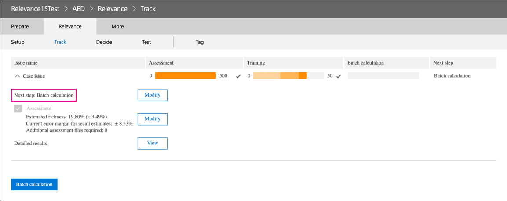

# Rente des Relevanzmoduls in Advanced eDiscovery

Am 10. März 2021 wird das Relevanzmodul in Advanced eDiscovery. Diese Rente bedeutet, dass Organisationen keinen Zugriff mehr auf das Relevanzmodul haben (indem sie zu Relevanz des Überprüfungssatzs in einem Advanced eDiscovery-Fall verwalten) oder auf vorhandene Relevanzmodelle  >   zugreifen können. Das aktuelle Relevanzmodul, das eingestellt wird, wird in Q2 CY 2021 durch eine neue Vorhersagecodierungslösung ersetzt. Mit dieser neuen Funktionalität können Organisationen ihre eigenen Vorhersagecodierungsmodelle in einem einfacheren und intuitiveren Workflow erstellen.

Zur Vorbereitung auf diese bevorstehende Rente wird empfohlen, dass Organisationen, die das Relevanzmodul verwenden, die Ausgabe ihres Modells vor dem Fälligkeitsdatum exportieren, indem sie eine Batchberechnung für alle vorhandenen Modelle ausführen. Alle Relevanzbewertung aus Ihrem Modell wird dauerhaft im entsprechenden Überprüfungssatz gespeichert und kann beim Exportieren von Dokumenten darauf zugegriffen werden. Relevanzwerte werden auch als Metadaten in der Ladedatei beibehalten. Darüber hinaus können Sie inhalte im Bewertungssatz weiterhin basierend auf der Relevanzbewertung filtern und auf alle Metadaten zugreifen, die von Ihren Relevanzmodellen erzeugt werden.

## Vollständige nicht fertige Modelle

Für alle noch nicht abgeschlossenen Relevanzmodelle müssen Sie die Bewertung, Schulung und Batchberechnung abschließen, damit Sie das Modell auf die Dokumente in einem Überprüfungssatz anwenden können. Wenn Sie die Batchberechnung abschließen, werden die Informationen nach dem Fälligkeitsdatum des Relevanzmoduls beibehalten.

Hier sind die Schritte zum Abschließen noch nicht abgeschlossener Modelle:

1. Trainieren Sie Ihr Modell, bis es stabilisiert und für die Batchberechnung bereit ist. Weitere [Informationen finden Sie unter Tagging and Relevance training](tagging-and-relevance-training-in-advanced-ediscovery.md).

   Der folgende Screenshot zeigt ein Modul, das für eine Batchberechnung bereit ist. Beachten Sie, dass die Bewertung und Schulung abgeschlossen ist, und der nächste Schritt besteht in der Ausführung der Batchberechnung.

   

2. Führen Sie die Batchberechnung aus. Weitere [Informationen finden Sie unter Performing Batch calculation](track-relevance-analysis-in-advanced-ediscovery.md#performing-batch-calculation).

3. Überprüfen Sie, ob die Batchberechnung erfolgreich war. Weitere [Informationen finden Sie unter Batch calculation results](track-relevance-analysis-in-advanced-ediscovery.md#batch-calculation-results).

Wenden Sie sich an den Microsoft-Support, um Hilfe beim Abschließen noch nicht abgeschlossener Relevanzmodelle zu erhalten.
