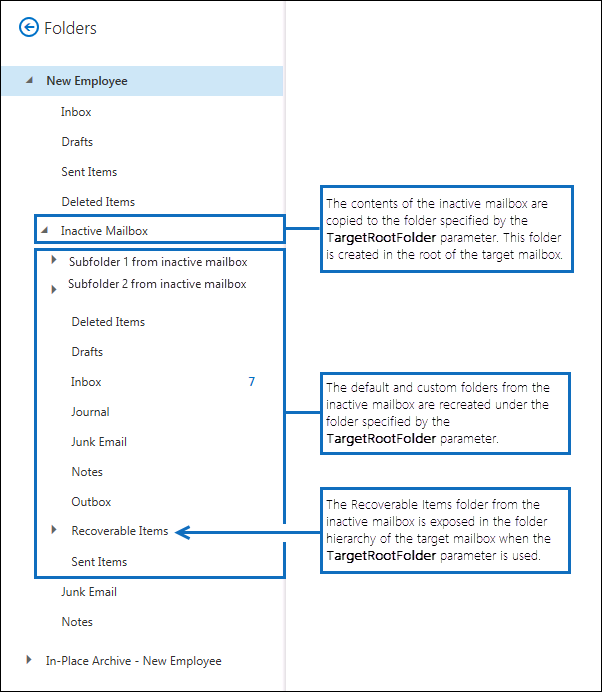

# <a name="restore-an-inactive-mailbox"></a>Rückspeichern eines inaktiven Postfachs

Ein inaktives Postfach (eine Art vorläufig gelöschtes Postfach) wird verwendet, um die E-Mails eines ehemaligen Mitarbeiters aufzubewahren, nachdem dieser die Organisation verlassen hat. Wenn ein anderer Mitarbeiter die Zuständigkeiten des ehemaligen Mitarbeiters übernimmt oder dieser Mitarbeiter in Ihre Organisation zurückkehrt, gibt es zwei Möglichkeiten, den Inhalt des inaktiven Postfachs wieder für einen Benutzer verfügbar zu machen:

- **Rückspeichern eines inaktiven Postfachs** Wenn ein anderer Mitarbeiter die Zuständigkeiten des ehemaligen Mitarbeiters übernimmt oder ein anderer Benutzer Zugriff auf die Inhalte des inaktiven Postfachs benötigt, können Sie den Inhalt des inaktiven Postfachs in ein vorhandenes Postfach rückspeichern (oder ihn mit diesem zusammenführen). Sie können auch das Archiv aus einem inaktiven Postfach rückspeichern. Nach dem Rückspeichern bleibt das inaktive Postfach als ein solches erhalten. In diesem Thema werden die Verfahren zum Rückspeichern eines inaktiven Postfachs beschrieben.

- **Wiederherstellen eines inaktiven Postfachs** Wenn der ehemalige Mitarbeiter in Ihre Organisation zurückkehrt oder ein neuer Mitarbeiter eingestellt wird, der die Zuständigkeiten des ehemaligen Mitarbeiters übernimmt, können Sie den Inhalt des inaktiven Postfachs wiederherstellen. Bei dieser Methode wird das inaktive Postfach in ein neues Postfach mit dem Inhalt des inaktiven Postfachs umgewandelt. Nach der Wiederherstellung ist das inaktive Postfach nicht mehr vorhanden. Die schrittweisen Verfahren finden Sie unter [Recover an inactive mailbox in Office 365](recover-an-inactive-mailbox.md).

Im Abschnitt [Weitere Informationen](#more-information) in diesem Artikel finden Sie weitere Informationen zu den Unterschieden zwischen dem Wiederherstellen und Wiederherstellen eines inaktiven Postfachs.

> [!NOTE]
> Sie können ein inaktives Postfach, das mit einem automatisch erweiternden Archiv konfiguriert ist, nicht wiederherstellen oder wiederherstellen. Wenn Sie Daten aus einem inaktiven Postfach mit einem automatisch erweiternden Archiv wiederherstellen müssen, verwenden Sie die Inhaltssuche, um die Daten aus dem Postfach zu exportieren und dann in ein anderes Postfach zu importieren. Anweisungen finden Sie in den folgenden Themen:
>
> - [Inhaltssuche](content-search.md)
> - [Exportieren von Inhaltssuchergebnissen](export-search-results.md)

## <a name="requirements-to-restore-an-inactive-mailbox"></a>Anforderungen zum Wiederherstellen eines inaktiven Postfachs

- Zum Rückspeichern eines inaktiven Postfachs müssen Sie Exchange Online PowerShell verwenden. Das Exchange Admin Center (EAC) kann hierfür nicht verwendet werden. Schrittweise Anleitungen finden Sie unter [Herstellen einer Verbindung mit Exchange Online PowerShell](/powershell/exchange/connect-to-exchange-online-powershell).

- Führen Sie den folgenden Befehl in Exchange Online PowerShell aus, um Identitätsinformationen für die inaktiven Postfächer in Ihrer Organisation zu erhalten.

  ```powershell
  Get-Mailbox -InactiveMailboxOnly | Format-List Name,DistinguishedName,ExchangeGuid,PrimarySmtpAddress
  ```

  Verwenden Sie die von diesem Befehl zurückgegebenen Informationen zum Rückspeichern eines bestimmten inaktiven Postfachs.

- Weitere Informationen zu inaktiven Postfächern finden Sie unter [Inactive mailboxes in Office 365](inactive-mailboxes-in-office-365.md).

## <a name="restore-inactive-mailboxes"></a>Wiederherstellen inaktiver Postfächer

Verwenden Sie das Cmdlet **New-MailboxRestoreRequest** mit den Parametern  _SourceMailbox_ und  _TargetMailbox_, um den Inhalt eines inaktiven Postfachs in ein vorhandenes Postfach rückzuspeichern. Weitere Informationen zu diesem Cmdlet finden Sie unter [New-MailboxRestoreRequest](/powershell/module/exchange/new-mailboxrestorerequest).

1. Erstellen Sie eine Variable, die die Eigenschaften des inaktiven Postfachs enthält.

   ```powershell
   $InactiveMailbox = Get-Mailbox -InactiveMailboxOnly -Identity <identity of inactive mailbox>
   ```

   > [!IMPORTANT]
   > Verwenden Sie im vorherigen Befehl den Wert der Eigenschaft **DistinguishedName** oder **ExchangeGUID** zum Identifizieren des inaktiven Postfachs. Diese Eigenschaften sind für jedes Postfach in Ihrer Organisation eindeutig, wobei ein aktives und ein inaktives Postfach die gleiche primäre SMTP-Adresse haben können.

2. Speichern Sie den Inhalt des inaktiven Postfachs in ein vorhandenes Postfach zurück. Die Inhalte des inaktiven Postfachs (Quellpostfachs) werden in den entsprechenden Ordnern im vorhandenen Postfach (Zielpostfach) zusammengeführt.

   ```powershell
   New-MailboxRestoreRequest -SourceMailbox $InactiveMailbox.DistinguishedName -TargetMailbox newemployee@contoso.com -AllowLegacyDNMismatch
   ```

   Alternativ können Sie einen übergeordneten Ordner im Zielpostfach angeben, in den die Inhalte aus dem inaktiven Postfach rückgespeichert werden sollen. Wenn der angegebene Zielordner oder die angegebene Zielordnerstruktur nicht bereits im Zielpostfach vorhanden ist, wird es bzw. sie während des Rückspeichervorgangs erstellt.

   Im folgenden Beispiel werden Postfachelemente und Unterordner aus einem inaktiven Postfach in die übergeordnete Ordnerstruktur des Zielpostfachs in einen Ordner namens "Inactive Mailbox" kopiert.

   ```powershell
   New-MailboxRestoreRequest -SourceMailbox $InactiveMailbox.DistinguishedName -TargetMailbox newemployee@contoso.com -TargetRootFolder "Inactive Mailbox" -AllowLegacyDNMismatch
   ```

## <a name="restore-the-archive-from-an-inactive-mailbox"></a>Rückspeichern des Archivs aus einem inaktiven Postfach

Wenn ein inaktives Postfach ein Archivpostfach enthält, können Sie es auch im Archivpostfach eines vorhandenen Postfachs rückspeichern. Zum Wiederherstellen des Archivs aus einem inaktiven Postfach müssen Sie die _Optionen SourceIsArchive_ und _TargetIsArchive_ zu dem Befehl hinzufügen, der zum Wiederherstellen eines inaktiven Postfachs verwendet wird.

1. Erstellen Sie eine Variable, die die Eigenschaften des inaktiven Postfachs enthält.

   ```powershell
   $InactiveMailbox = Get-Mailbox -InactiveMailboxOnly -Identity <identity of inactive mailbox>
   ```

   > [!NOTE]
   > Verwenden Sie im vorherigen Befehl den Wert der Eigenschaft **DistinguishedName** oder **ExchangeGUID** zum Identifizieren des inaktiven Postfachs. Diese Eigenschaften sind für jedes Postfach in Ihrer Organisation eindeutig, wobei ein aktives und ein inaktives Postfach die gleiche primäre SMTP-Adresse haben können.

2. Speichern Sie den Inhalt des Archivs aus dem inaktiven Postfach (Quellarchiv) in das Archiv eines vorhandenen Postfachs (Zielarchiv) zurück. Im folgenden Beispiel wird der Inhalt aus dem Quellarchiv in einen Ordner namens "Inactive Mailbox" im Archiv des Zielpostfachs kopiert.

   ```powershell
   New-MailboxRestoreRequest -SourceMailbox $InactiveMailbox.DistinguishedName -SourceIsArchive -TargetMailbox newemployee@contoso.com -TargetIsArchive -TargetRootFolder "Inactive Mailbox Archive" -AllowLegacyDNMismatch
   ```

## <a name="more-information"></a>Weitere Informationen

- **Was ist der Hauptunterschied zwischen dem Wiederherstellen und Wiederherstellen eines inaktiven Postfachs?** Wenn Sie ein inaktives Postfach wiederherstellen, wird das Postfach im Wesentlichen in ein neues Postfach konvertiert, der Inhalt und die Ordnerstruktur des inaktiven Postfachs werden beibehalten, und das Postfach ist mit einem neuen Benutzerkonto verknüpft. Nach der Wiederherstellung ist das inaktive Postfach nicht mehr vorhanden, und alle Änderungen an den Inhalten im neuen Postfach wirken sich auf den Inhalt aus, der ursprünglich im inaktiven Postfach gespeichert war. Wenn Sie hingegen ein inaktives Postfach wiederherstellen, werden die Inhalte lediglich in ein anderes Postfach kopiert. Das inaktive Postfach bleibt erhalten und bleibt ein inaktives Postfach. Änderungen an den Inhalten im Zielpostfach wirken sich nicht auf den ursprünglichen Inhalt im inaktiven Postfach aus. Das inaktive Postfach kann weiterhin mithilfe des Inhaltssuchtools durchsucht [werden,](content-search.md)seine Inhalte können in einem anderen Postfach wiederhergestellt oder später wiederhergestellt oder gelöscht werden.

- **Wie suchen Sie nach inaktiven Postfächern?** Zum Abrufen einer Liste der inaktiven Postfächer in Ihrer Organisation und Anzeigen von Informationen, die für das Rückspeichern eines inaktiven Postfachs nützlich sind, können Sie den folgenden Befehl ausführen.

  ```powershell
  Get-Mailbox -InactiveMailboxOnly | Format-List Name,PrimarySMTPAddress,DistinguishedName,ExchangeGUID,LegacyExchangeDN,ArchiveStatus
  ```

- **Verwenden Sie ein Aufbewahrungsverfahren oder Microsoft 365 Aufbewahrungsrichtlinie, um inaktive Postfachinhalte zu behalten.** Wenn Sie den Status eines inaktiven Postfachs beibehalten möchten, nachdem [](create-a-litigation-hold.md) es wiederhergestellt wurde, können Sie das Zielpostfach im Prozessaufbewahrungsverfahren platzieren oder eine Microsoft 365-Aufbewahrungsrichtlinie anwenden, bevor Sie das [inaktive](retention.md) Postfach wiederherstellen. Dies verhindert das dauerhafte Löschen von Elementen aus dem inaktiven Postfach, nachdem sie in das Zielpostfach rückgespeichert wurden.

- **Aktivieren Sie das Anhalten der Aufbewahrungszeit für das Zielpostfach, ehe Sie ein inaktives Postfach rückspeichern.** Das Postfachelemente in einem inaktiven Postfach alt sein können, sollten Sie das Aktivieren des Anhaltens der Aufbewahrungszeit für das Zielpostfach erwägen, bevor Sie ein inaktives Postfach rückspeichern. Wenn Sie für ein Postfach das Anhalten der Aufbewahrungszeit aktivieren, wird die zugewiesene Aufbewahrungsrichtlinie so lange nicht verarbeitet, bis das Anhalten der Aufbewahrungszeit aufgehoben wird oder der entsprechende Zeitraum abgelaufen ist. Dadurch erhält der Besitzer der Zielpostfachs Zeit zum Verwalten alter Nachrichten aus dem inaktiven Postfach. Andernfalls löscht die Aufbewahrungsrichtlinie möglicherweise alte Elemente (oder verschiebt Elemente in das Archivpostfach, sofern aktiviert), die basierend auf den für das Zielpostfach konfigurierten Aufbewahrungseinstellungen abgelaufen sind. Weitere Informationen finden Sie unter [Place a mailbox on retention hold in Exchange Online](/exchange/security-and-compliance/messaging-records-management/mailbox-retention-hold).

- **Welche Funktion hat die Option „AllowLegacyDNMismatch"?** In den vorherigen Beispielen zum Rückspeichern eines inaktiven Postfachs wird die Option **AllowLegacyDNMismatch** verwendet, um das Rückspeichern des inaktiven Postfachs in ein anderes Zielpostfach zu erlauben. Ziel eines typischen Rückspeicherszenarios ist das Rückspeichern von Inhalten, bei denen das Quell- und Zielpostfach identisch sind. Standardmäßig prüft das Cmdlet **New-MailboxRestoreRequest** daher, ob der Wert der Eigenschaft **LegacyExchangeDN** für das Quell- und Zielpostfach identisch ist. Durch diese Prüfung wird vermieden, dass Sie versehentlich ein Quellpostfach im falschen Zielpostfach rückspeichern. Wenn Sie versuchen, ein inaktives Postfach ohne die Option **AllowLegacyDNMismatch** rückzuspeichern, kann es zu einem Fehler kommen, wenn das Quell- und Zielpostfach unterschiedliche Werte für die Eigenschaft **LegacyExchangeDN** aufweisen.

- **Sie können andere Parameter mit dem Cmdlet "New-MailboxRestoreRequest" verwenden, um verschiedene Rückspeicherszenarien für inaktive Postfächer zu implementieren.** Sie können beispielsweise den folgenden Befehl ausführen, um das Archiv aus dem inaktiven Postfach im primären Postfach des Zielpostfachs rückzuspeichern.

  ```powershell
  New-MailboxRestoreRequest -SourceMailbox <inactive mailbox> -SourceIsArchive -TargetMailbox <target mailbox> -TargetRootFolder "Inactive Mailbox Archive" -AllowLegacyDNMismatch
  ```

  Mit dem folgenden Befehl können auch das inaktive primäre Postfach im Archiv des Zielpostfachs rückspeichern.

  ```powershell
  New-MailboxRestoreRequest -SourceMailbox <inactive mailbox> -TargetMailbox <target mailbox> -TargetIsArchive -TargetRootFolder "Inactive Mailbox" -AllowLegacyDNMismatch
  ```

- **Welche Funktion hat der Parameter "TargetRootFolder"?** Wie bereits erläutert, können Sie den Parameter **TargetRootFolder** verwenden, um einen Ordner in der oberen Ebene der Ordnerstruktur (den Stammordner) im Zielpostfach anzugeben, in den der Inhalt des inaktiven Postfachs rückgespeichert werden soll. Wenn Sie diesen Parameter nicht verwenden, werden Postfachelemente aus dem inaktiven Postfach in den entsprechenden Standardordnern des Zielpostfachs zusammengeführt, und benutzerdefinierte Ordner werden im Stammverzeichnis des Zielpostfachs neu erstellt. Die folgenden Abbildungen veranschaulichen die Unterschiede zwischen Verwendung oder Nichtverwendung des Parameters **TargetRootFolder**.

  **Ordnerhierarchie im Zielpostfach, wenn der Parameter "TargetRootFolder" nicht verwendet wird**

  

  **Ordnerhierarchie im Zielpostfach, wenn der Parameter "TargetRootFolder" verwendet wird**

  