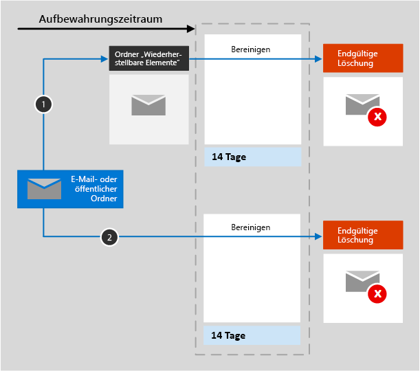

# Informationen zu Aufbewahrungsrichtlinien für ExchangeLearn about retention policies for Exchange

Die Informationen in diesem Artikel ergänzen den Beitrag [Informationen zu Aufbewahrungsrichtlinien](retention-policies.md) um spezifische Angaben für Exchange.The information in this article supplements [Learn about retention policies](retention-policies.md) because it has information that's specific to Exchange.

## Funktionsweise einer Aufbewahrungsrichtlinie mit Exchange-SpeicherortenHow a retention policy works with Exchange locations

Für die E-Mails, den Kalender und andere Elemente eines Benutzers wird eine Aufbewahrungsrichtlinie auf Postfachebene angewendet.For a user's mail, calendar, and other items, a retention policy is applied at the level of a mailbox.

Für einen öffentlichen Ordner wird eine Aufbewahrungsrichtlinie auf Ordnerebene angewendet, nicht auf Postfachebene.For a public folder, a retention policy is applied at the folder level, not the mailbox level. 

Sowohl Postfächer als auch öffentliche Ordner verwenden den Ordner "Wiederherstellbare Elemente" zum Aufbewahren von Elementen.Both a mailbox and a public folder use the Recoverable Items folder to retain items. Nur Personen, denen eDiscovery-Berechtigungen zugewiesen wurden, können Elemente im Ordner "Wiederherstellbare Elemente" eines anderen Benutzers anzeigen.Only people who have been assigned eDiscovery permissions can view items in another user's Recoverable Items folder.
  
Standardmäßig wird eine Nachricht, die von einem Benutzer aus einem anderen Ordner als dem Ordner "Gelöschte Elemente" gelöscht wird, in den Ordner "Gelöschte Elemente" verschoben.When a person deletes a message in a folder other than the Deleted Items folder, by default, the message moves to the Deleted Items folder. Wenn ein Benutzer ein Element im Ordner "Gelöschte Elemente" löscht, wird es in den Ordner "Wiederherstellbare Elemente" verschoben.When a person deletes an item in the Deleted Items folder, the message is moved to the Recoverable Items folder. Ein Benutzer kann ein Element jedoch auch mittels UMSCHALT+ENTF aus einem Ordner löschen. Dadurch wird der Ordner "Gelöschte Elemente" umgangen und das Element direkt in den Ordner "Wiederherstellbare Elemente" verschoben.However, a user can soft-delete an item (SHIFT+DELETE) in any folder, which bypasses the Deleted Items folder and moves the item directly to the Recoverable Items folder.
  
Wenn Sie eine Aufbewahrungsrichtlinie auf einen Exchange-Speicherort anwenden, wertet ein Zeitgeberauftrag regelmäßig die Elemente im Ordner "Wiederherstellbare Elemente" aus.When you apply a retention policy to an Exchange location, a timer job periodically evaluates items in the Recoverable Items folder. Wenn ein Element nicht mindestens die Regeln einer Aufbewahrungsrichtlinie erfüllt, wird es dauerhaft (endgültig) aus dem Ordner "Wiederherstellbare Elemente" gelöscht.If an item doesn't match the rules of at least one retention policy, the item is permanently deleted (also called hard deleted) from the Recoverable Items folder.

Der Zeitgeberauftrag kann bis zu sieben Tage für die Ausführung benötigen, und der Exchange-Speicherort muss mindestens 10 MB umfassen.The timer job can take up to 7 days to run and the Exchange location must contain at least 10 MB.
  
Wenn ein Benutzer versucht, Eigenschaften eines Postfachelements zu ändern – zum Beispiel Betreff, Text, Anhänge, Sender und Empfänger oder Sende- bzw. Empfangsdatum einer Nachricht – wird eine Kopie des ursprünglichen Elements im Ordner "Wiederherstellbare Elemente" gespeichert, bevor die Änderung übernommen wird.When a user attempts to change properties of a mailbox item—such as the subject, body, attachments, senders and recipients, or date sent or received for a message—a copy of the original item is saved to the Recoverable Items folder before the change is committed. Diese Aktion findet für alle nachfolgenden Änderungen statt.This action happens for each subsequent change. Am Ende des Aufbewahrungszeitraums werden Kopien im Ordner "Wiederherstellbare Elemente" endgültig gelöscht.At the end of the retention period, copies in the Recoverable Items folder are permanently deleted.

Nachdem einem Postfach oder einem öffentlichen Ordner eine Aufbewahrungsrichtlinie zugewiesen wurde, sind die Inhaltspfade davon abhängig, ob die Aufbewahrungseinstellungen die Aufbewahrung und das Löschen, die reine Aufbewahrung oder das reine Löschen vorgeben.After a retention policy is assigned to a mailbox or public folder, the paths the content takes depend on whether the retention settings are to retain and delete, to retain only, or delete only.

Wenn die Aufbewahrungseinstellungen das Aufbewahren und Löschen vorgeben:When the retention settings are to retain and delete:

1. **Wenn das Element während des Aufbewahrungszeitraums vom Benutzer geändert oder dauerhaft gelöscht wird** (entweder UMSCHALT+ENTF oder aus "Gelöschte Elemente" gelöscht), wird es in den Ordner "Wiederherstellbare Elemente" verschoben (oder im Fall der Bearbeitung kopiert).**If the item is modified or permanently deleted** by the user (either SHIFT+DELETE or deleted from Deleted Items) during the retention period: The item is moved (or copied, in the case of edit) to the Recoverable Items folder. Dort wird in regelmäßigen Abständen ein Zeitgeberauftrag ausgeführt, der Elemente identifiziert, deren Aufbewahrungszeitraum abgelaufen ist. Diese Elemente werden innerhalb von vierzehn Tagen nach Ende des Aufbewahrungszeitraums dauerhaft gelöscht.There, a timer job runs periodically and identifies items whose retention period has expired, and these items are permanently deleted within 14 days of the end of the retention period. Beachten Sie, dass 14 Tage die Standardeinstellung ist, die aber auf bis zu 30 Tage festgelegt werden kann.Note that 14 days is the default setting, but it can be configured up to 30 days.
    
2. **Wenn das Element während des Aufbewahrungszeitraums nicht geändert oder gelöscht wird**, wird derselbe Prozess in regelmäßigen Abständen für alle Ordner im Postfach ausgeführt, und es werden Elemente identifiziert, deren Aufbewahrungszeitraum abgelaufen ist. Diese Elemente werden innerhalb von 14 Tagen nach Ende des Aufbewahrungszeitraums dauerhaft gelöscht.**If the item is not modified or deleted** during the retention period: The same process runs periodically on all folders in the mailbox and identifies items whose retention period has expired, and these items are permanently deleted within 14 days of the end of the retention period. Beachten Sie, dass 14 Tage die Standardeinstellung ist, die aber auf bis zu 30 Tage festgelegt werden kann.Note that 14 days is the default setting, but it can be configured up to 30 days. 

Wenn die Aufbewahrungseinstellungen das reine Aufbewahren oder das reine Löschen vorgeben, stellen die Inhaltspfade Varianten von "Aufbewahren und Löschen" dar:When the retention settings are retain-only, or delete-only, the contents paths are variations of retain and delete:

### Inhaltspfade für Aufbewahrungseinstellungen für reine AufbewahrungContent paths for retain-only retention settings

1. **Wenn das Element während des Aufbewahrungszeitraums geändert oder gelöscht wird**: Eine Kopie des ursprünglichen Elements wird im Ordner „Wiederherstellbare Elemente“ erstellt und bis zum Ende des Aufbewahrungszeitraums aufbewahrt, wo dann die Kopie im Ordner „Wiederherstellbare Elemente“ innerhalb von 14 Tagen nach Ablauf des Elements endgültig gelöscht wird.**If the item is modified or deleted** during the retention period: A copy of the original item is created in the Recoverable Items folder and retained until the end of the retention period, when the copy in the Recoverable Items folder is permanently deleted within 14 days after the item expires. 

2. **Wenn das Element während des Aufbewahrungszeitraums nicht geändert oder gelöscht wird**: Weder vor noch nach dem Aufbewahrungszeitraum passiert etwas. Das Element verbleibt an seinem Ursprungsort.**If the item is not modified or deleted** during the retention period: Nothing happens before and after the retention period; the item remains in its original location.

### Inhaltspfade für Aufbewahrungseinstellungen für reines LöschenContent paths for delete-only retention settings

1. **Wenn das Element während des festgelegte Zeitraums nicht gelöscht wird**, wird es am Ende des in der Aufbewahrungsrichtlinie festgelegten Zeitraums in den Ordner "Wiederherstellbare Elemente" verschoben.**If the item is not deleted** during the configured period: At the end of the configured period in the retention policy, the item is moved to the Recoverable items folder. 

2. **Wenn das Element während des festgelegten Zeitraums gelöscht wird**, wird es sofort in den Ordner "Wiederherstellbare Elemente" verschoben.**If the item is deleted** during the configured period: The item is immediately moved to the Recoverable items folder. Wenn ein Benutzer das Element dort löscht oder den Ordner „Wiederherstellbare Elemente“ leert, wird das Element endgültig gelöscht.If a user deletes the item from there or empties the Recoverable items folder, the item is permanently deleted. Andernfalls wird das Element endgültig gelöscht, nachdem es 14 Tage im Ordner „Wiederherstellbare Elemente“ aufbewahrt wurde.Otherwise, the item is permanently deleted after being in the Recoverable items folder for 14 days. 

## Ausschließen von bestimmten Typen von Exchange-Elementen aus einer AufbewahrungsrichtlinieExcluding specific types of Exchange items from a retention policy

Unter Verwendung von PowerShell können Sie bestimmte Exchange-Elementtypen aus einer Aufbewahrungsrichtlinie ausschließen.By using PowerShell, you can exclude specific types of Exchange items from a retention policy. Sie können z. B. Voicemailnachrichten, Chatunterhaltungen und andere Skype for Business Online-Inhalte in Postfächern ausschließen.For example, you can exclude voicemail messages, IM conversations, and other Skype for Business Online content in mailboxes. Sie können auch Kalender-, Notiz- und Aufgabenelemente ausschließen.You can also exclude calendar, note, and task items. Diese Funktion steht nur über PowerShell zur Verfügung. Sie ist nicht verfügbar, wenn Sie eine Aufbewahrungsrichtlinie mithilfe des Assistenten im Microsoft 365 Compliance Center erstellen.This capability is available only by using PowerShell; it's not available when you create a retention policy by using the wizard in the Microsoft 365 compliance center.
  
Wenn Sie die ausgewählten Typen für Exchange-Elemente in einer Aufbewahrungsrichtlinie ausschließen möchten, verwenden Sie den Parameter `ExcludedItemClasses` mit den Cmdlets `New-RetentionComplianceRule` und `Set-RetentionComplianceRule`.To exclude your selected types for Exchange items in a retention policy, use the  `ExcludedItemClasses` parameter with the  `New-RetentionComplianceRule` and  `Set-RetentionComplianceRule` cmdlets.

### Wenn ein Benutzer die Organisation verlässtWhen a user leaves the organization 

Wenn ein Benutzer Ihre Organisation verlässt und sein Postfach in einer Aufbewahrungsrichtlinie enthalten ist, wird das Postfach zu einem inaktiven Postfach, wenn das Office 365-Konto des Benutzers gelöscht wird.If a user leaves your organization and the user's mailbox is included in a retention policy, the mailbox becomes an inactive mailbox when the user's Office 365 account is deleted. Die Inhalte eines inaktiven Postfachs unterliegen weiterhin jeglicher Aufbewahrungsrichtlinie, die dem Postfach zugewiesen wurde, bevor es inaktiv wurde, und die Inhalte sind für eDiscovery-Suchen verfügbar.The contents of an inactive mailbox are still subject to any retention policy that was placed on the mailbox before it was made inactive, and the contents are available to an eDiscovery search. Weitere Informationen finden Sie unter [Inaktive Postfächer in Exchange Online](inactive-mailboxes-in-office-365.md).For more information, see [Inactive mailboxes in Exchange Online](inactive-mailboxes-in-office-365.md). 

## Konfigurieren einer Aufbewahrungsrichtlinie für ExchangeHow to configure a retention policy for Exchange

Siehe [Erstellen und Konfigurieren von Aufbewahrungsrichtlinien](create-retention-policies.md).See [Create and configure retention policies](create-retention-policies.md).

Wählen Sie auf der Seite **Speicherorte auswählen** des Assistenten eine der folgenden Optionen aus:For the **Choose locations** page of the wizard, select one of the following options:

- **Richtlinie nur auf Inhalte in Exchange-E-Mails, öffentlichen Ordnern, Office 365-Gruppen, OneDrive und SharePoint-Dokumenten anwenden****Apply policy only to content in Exchange email, public folders, Office 365 groups, OneDrive and SharePoint documents**

- **Bestimmte Speicherorte auswählen** > **Exchange-E-Mail** und **Öffentliche Exchange-Ordner****Let me choose specific locations** > **Exchange email** and **Exchange public folders**

