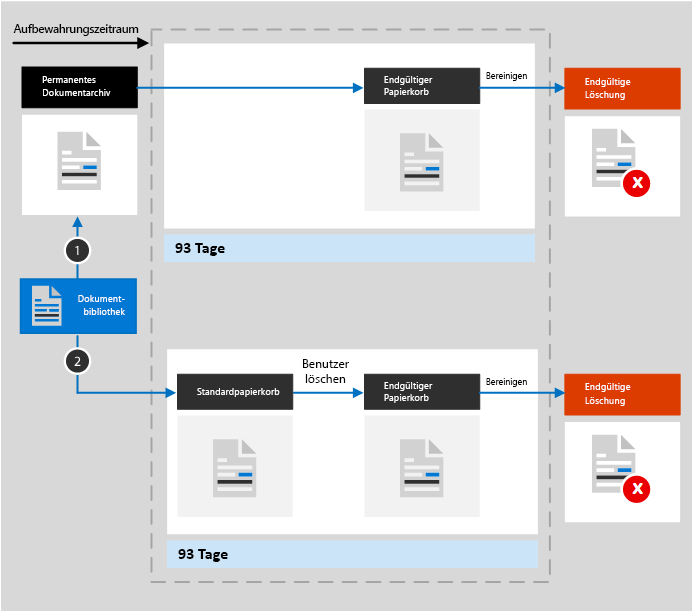

# Informationen zur Aufbewahrung für SharePoint und OneDrive

>*[Microsoft 365-Lizenzierungsleitfaden für Sicherheit und Compliance](https://aka.ms/ComplianceSD).*

Die Informationen in diesem Artikel ergänzen den Beitrag [Informationen zur Aufbewahrung](retention.md) um spezifische Angaben für SharePoint und OneDrive.

## Wie die Aufbewahrung für SharePoint und OneDrive funktioniert

Zur Unterstützung der Aufbewahrung erstellen SharePoint und OneDrive ein permanentes Dokumentenarchiv, sofern es noch nicht vorhanden ist. Sie können diese Bibliothek auf der Seite **Websiteinhalte** der Website auf oberster Ebene der Websitesammlung anzeigen. Die meisten Benutzer können das permanente Dokumentarchiv nicht anzeigen, da es nur für Websitesammlungsadministratoren sichtbar ist.
  
Wenn jemand versucht, ein Dokument zu ändern oder zu löschen, das den Aufbewahrungseinstellungen unterliegt, wird geprüft, ob der Inhalt seit der Anwendung der Aufbewahrungseinstellungen geändert wurde. Wenn dies die erste Änderung seit Anwendung der Aufbewahrungseinstellungen ist, wird der Inhalt in das permanente Dokumentarchiv kopiert. Dies ermöglicht dem Benutzer das Ändern oder Löschen des ursprünglichen Inhalts. Jeder Inhalt in einer Websitesammlung kann unabhängig von den Aufbewahrungseinstellungen in das permanente Dokumentenarchiv kopiert werden.
  
Ein Zeitgeberauftrag bereinigt in regelmäßigen Abständen das permanente Dokumentarchiv. Dieser vergleicht sämtliche Inhalte im permanenten Dokumentarchiv mit allen Abfragen, die von den Aufbewahrungseinstellungen für diese Inhalte verwendet werden. Inhalte, die älter als die darin konfigurierte Aufbewahrungszeit sind, werden aus dem permanenten Dokumentarchiv sowie vom ursprünglichen Speicherort gelöscht, sofern sie dort noch vorhanden sind. Dieser Zeitgeberauftrag wird alle sieben Tage ausgeführt, was bedeutet, dass es bis zu sieben Tage dauern kann, bis Inhalte gelöscht werden.
  
Dieses Verhalten gilt für Inhalte, die bei Anwendung der Aufbewahrungseinstellungen vorhanden sind. Außerdem werden für Aufbewahrungsrichtlinien alle neuen Inhalte, die erstellt oder der Websitesammlung hinzugefügt werden, nachdem sie in die Richtlinie eingeschlossen wurden, auch nach dem Löschen aufbewahrt. Neue Inhalte werden jedoch nicht bei der ersten Bearbeitung in das permanente Dokumentarchiv kopiert, sondern nur, wenn sie gelöscht werden. Wenn Sie alle Versionen einer Datei aufbewahren möchten, müssen Sie die [Versionsverwaltung](#how-retention-works-with-document-versions-in-a-site-collection) aktivieren.
  
Ein Benutzer erhält eine Fehlermeldung, wenn er versucht, Bibliotheken, Listen, Ordner oder Websites zu löschen, für die eine Aufbewahrungsrichtlinie gilt. Ein Benutzer kann einen Ordner löschen, wenn er zuerst Dateien im Ordner verschiebt oder löscht, die der Richtlinie unterliegen. Außerdem wird das permanente Dokumentarchiv in dieser Phase erstellt und nicht, wenn Sie eine Aufbewahrungsrichtlinie erstellen oder eine Aufbewahrungsbezeichnung anwenden. Zum Testen Ihrer Aufbewahrung müssen Sie daher zuerst ein Dokument in einer Website bearbeiten oder löschen, die einer Aufbewahrungsrichtlinie unterliegt oder auf die Aufbewahrungsbezeichnungen angewendet werden, und dann zum permanenten Dokumentarchiv wechseln, um die aufbewahrte Kopie anzuzeigen.
  
Nachdem auf Inhalte in einem OneDrive-Konto oder einer SharePoint-Site Aufbewahrungseinstellungen angewendet wurden, sind die Inhaltspfade davon abhängig, ob die Aufbewahrungseinstellungen der Aufbewahrung und dem Löschen, der reinen Aufbewahrung oder dem reinen Löschen dienen.

Wenn die Aufbewahrungseinstellung das Aufbewahren und Löschen vorgibt:

  
1. **Wenn der Inhalt während des Aufbewahrungszeitraums geändert oder gelöscht wird**, wird eine Kopie des ursprünglichen Inhalts in der beim Zuweisen der Richtlinie vorhandenen Form im permanenten Dokumentarchiv erstellt. Dort ermittelt der Zeitgeberauftrag Elemente, deren Aufbewahrungszeitraum abgelaufen ist. Diese Elemente werden in den endgültigen Papierkorb verschoben, von wo sie nach Ablauf von 93 Tagen endgültig gelöscht werden. Der endgültige Papierkorb wird den Endbenutzern nicht angezeigt (sie sehen nur den Standardpapierkorb), Websitesammlungsadministratoren können hingegen dessen Inhalte anzeigen und wiederherstellen.

    > [!NOTE]
    > Um versehentlichem Datenverlust vorzubeugen, werden Inhalte nicht mehr dauerhaft aus dem permanenten Dokumentarchiv gelöscht. Stattdessen werden Inhalte nur aus dem Papierkorb dauerhaft gelöscht, sodass nun sämtliche Inhalte aus dem permanenten Dokumentarchiv den endgültigen Papierkorb durchlaufen werden.
    
2. **Wenn der Inhalt während des Aufbewahrungszeitraums nicht geändert oder gelöscht wird**, wird er vom Zeitgeberauftrag am Ende des Aufbewahrungszeitraums in den Standardpapierkorb verschoben. Wenn ein Benutzer den Inhalt dort löscht oder diesen Papierkorb leert (auch als Aufräumen bekannt), wird das Dokument in den endgültigen Papierkorb verschoben. Der Standard- und der endgültige Papierkorb umfassen zusammen einen Aufbewahrungszeitraum von 93 Tagen. Am Ende dieser 93 Tage wird das Dokument dauerhaft von seinem jeweiligen Aufbewahrungsort gelöscht, entweder im Standard- oder im endgültigen Papierkorb. Der Papierkorb ist nicht indiziert und daher für die Suche nicht verfügbar. Eine eDiscovery-Suche kann daher keinen Inhalt des Papierkorbs finden, um für diesen eine Aufbewahrungspflicht festzulegen.

Wenn die Aufbewahrungseinstellungen das reine Aufbewahren oder das reine Löschen vorgeben, stellen die Inhaltspfade Varianten von "Aufbewahren und Löschen" dar:

### Inhaltspfade für Aufbewahrungseinstellungen für reine Aufbewahrung

1. **Wenn der Inhalt während des Aufbewahrungszeitraums geändert oder gelöscht wird**: Eine Kopie des ursprünglichen Dokuments wird im permanenten Dokumentarchiv erstellt und bis zum Ende des Aufbewahrungszeitraums aufbewahrt, wo dann die Kopie im permanenten Dokumentarchiv in den endgültigen Papierkorb verschoben und nach 93 Tagen endgültig gelöscht wird.

2. **Wenn der Inhalt während des Aufbewahrungszeitraums nicht geändert oder gelöscht wird**: Weder vor noch nach dem Aufbewahrungszeitraum passiert etwas. Das Dokument verbleibt an seinem Ursprungsort.

### Inhaltspfade für Aufbewahrungseinstellungen für reines Löschen

1. **Wenn der Inhalt während des festgelegten Zeitraums gelöscht wird**: Das Dokument wird in den Standardpapierkorb verschoben. Wenn ein Benutzer das Dokument dort löscht oder diesen Papierkorb leert, wird das Dokument in den endgültigen Papierkorb verschoben. Der Standard- und der endgültige Papierkorb umfassen zusammen einen Aufbewahrungszeitraum von 93 Tagen. Am Ende dieser 93 Tage wird das Dokument dauerhaft von seinem jeweiligen Aufbewahrungsort gelöscht, entweder im Standard- oder im endgültigen Papierkorb. Wenn der Inhalt während des festgelegten Zeitraums geändert wird, folgt er nach Ablauf dieses Zeitraums demselben Löschpfad.

2. **Wenn der Inhalt während des festgelegten Zeitraums nicht gelöscht wird**: Das Dokument wird am Ende des in der Aufbewahrungsrichtlinie festgelegten Zeitraums in den Standardpapierkorb verschoben. Wenn ein Benutzer das Dokument dort löscht oder diesen Papierkorb leert (auch als Bereinigen bekannt), wird das Dokument in den endgültigen Papierkorb verschoben. Der Standard- und der endgültige Papierkorb umfassen zusammen einen Aufbewahrungszeitraum von 93 Tagen. Am Ende dieser 93 Tage wird das Dokument dauerhaft von seinem jeweiligen Aufbewahrungsort gelöscht, entweder im Standard- oder im endgültigen Papierkorb. Der Papierkorb ist nicht indiziert und daher für die Suche nicht verfügbar. Eine eDiscovery-Suche kann daher keinen Inhalt des Papierkorbs finden, um für diesen eine Aufbewahrungspflicht festzulegen.

## Funktionsweise der Aufbewahrung mit Dokumentversionen in einer Websitesammlung

Die Versionsverwaltung ist ein Feature aller Dokumentbibliotheken in SharePoint und in OneDrive. Standardmäßig werden bei der Versionsverwaltung mindestens 500 Hauptversionen beibehalten, Sie können diese Beschränkung jedoch erhöhen. Weitere Informationen finden Sie unter [Aktivieren und Konfigurieren der Versionsverwaltung für eine Liste oder Bibliothek](https://support.office.com/article/1555d642-23ee-446a-990a-bcab618c7a37) und [So funktioniert die Versionsverwaltung in Listen und Bibliotheken](https://support.microsoft.com/office/how-versioning-works-in-lists-and-libraries-0f6cd105-974f-44a4-aadb-43ac5bdfd247).
  
Die Einstellung für reine Aufbewahrung behält alle Versionen eines Dokuments in einer SharePoint-Websitesammlung oder einem OneDrive-Konto bei. Wenn ein Dokument, das einer Einstellung für die reine Aufbewahrung untersteht, zum ersten Mal bearbeitet wird, wird eine Version des ursprünglichen Dokuments in das permanente Dokumentarchiv kopiert und dort aufbewahrt. Wenn ein Dokument, das einer Einstellung für die reine Aufbewahrung untersteht, gelöscht wird, werden alle bestehenden Versionen in das permanente Dokumentarchiv kopiert. Vorrausetzung hierfür ist, dass die Versionsverwaltung aktiviert sein muss. Jede Version eines Dokuments im permanenten Dokumentarchiv bleibt in ihrem jeweiligen Aufbewahrungszeitraum als eigenständiges Element bestehen:
  
- Wenn der Aufbewahrungszeitraum darauf basiert, wann der Inhalt erstellt wurde, verfügt jede Version über das gleiche Ablaufdatum wie das ursprüngliche Dokument. Das ursprüngliche Dokument und dessen Versionen werden alle gleichzeitig ablaufen.

- Wenn der Aufbewahrungszeitraum darauf basiert, wann der Inhalt zuletzt geändert wurde, verfügt jede Version über ein eigenes Ablaufdatum basierend auf dem Zeitpunkt der Änderung des ursprünglichen Dokuments, aus der diese Version hervorgegangen ist. Die ursprünglichen Dokumente und deren Versionen laufen unabhängig voneinander ab.

> [!NOTE]
> Aufbewahrte Versionen von SharePoint- und OneDrive-Dokumenten lassen sich nicht mithilfe von eDiscovery-Tools durchsuchen.

Bei Elementen, die einer Aufbewahrungsrichtlinie (oder einer Aufbewahrung für juristische Zwecke) unterliegen, werden die Einschränkungen der Versionsverwaltung für die Dokumentbibliothek ignoriert, bis der Aufbewahrungszeitraum des Dokuments beendet ist. In diesem Szenario werden alte Versionen nicht automatisch gelöscht und Benutzer können Versionen nicht löschen.

Das ist bei Aufbewahrungsbezeichnungen nicht der Fall, wenn Seite keiner Aufbewahrungsrichtlinie unterliegt. Stattdessen werden die Einschränkungen der Versionsverwaltung berücksichtigt, sodass ältere Versionen automatisch gelöscht und durch neuere Versionen ersetzt werden. Benutzer werden jedoch immer noch daran gehindert, Versionen zu löschen.

## Wenn ein Benutzer die Organisation verlässt

**SharePoint**:

Wenn ein Benutzer Ihre Organisation verlässt, sind Inhalte, die von ihm erstellt wurden, nicht betroffen, weil SharePoint als eine Zusammenarbeitsumgebung betrachtet wird, im Gegensatz zu dem Postfach oder dem OneDrive-Konto des Benutzers.

**OneDrive**:

Wenn ein Benutzer Ihre Organisation verlässt, bleiben alle Dateien, für die eine Aufbewahrungsrichtlinie gilt oder die Aufbewahrungsbezeichnungen aufweisen, für die Dauer der Richtlinie oder Bezeichnung erhalten. Während dieses Zeitraums bleibt der gesamte Freigabezugriff aufrecht. Nach Ablauf des Aufbewahrungszeitraums wird der Inhalt in den Papierkorb der Websitesammlung verschoben, wo er nur für den Administrator zugänglich sein wird. Wenn ein Dokument durch eine Aufbewahrungsbezeichnung als Eintrag gekennzeichnet ist, wird das Dokument erst gelöscht, wenn der Aufbewahrungszeitraum abgelaufen ist. Danach wird der Inhalt endgültig gelöscht.

## Konfigurationsleitfaden

Wenn Sie die Konfiguration der Datenaufbewahrung in Microsoft 365 zum ersten Mal durchführen möchten, lesen Sie [Erste Schritte mit Aufbewahrungsrichtlinien und Aufbewahrungsbezeichnungen](get-started-with-retention.md).

Wenn Sie eine Aufbewahrungsrichtlinie oder Aufbewahrungsbezeichnung für Exchange konfigurieren möchten, lesen Sie die folgenden Anweisungen:
- [Erstellen und Konfigurieren von Aufbewahrungsrichtlinien](create-retention-policies.md)
- [Erstellen von Aufbewahrungsbezeichnungen und Anwenden in Apps](create-apply-retention-labels.md)
- [Automatisches Anwenden einer Aufbewahrungsbezeichnung auf Inhalte](apply-retention-labels-automatically.md)
