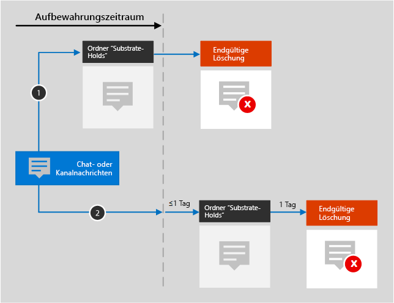

# Informationen zu Aufbewahrungsrichtlinien für Microsoft Teams.Learn about retention policies for Microsoft Teams

>*[Microsoft 365-Lizenzierungsleitfaden für Sicherheit und Compliance](https://aka.ms/ComplianceSD).**[Microsoft 365 licensing guidance for security & compliance](https://aka.ms/ComplianceSD).*

Die Informationen in diesem Artikel ergänzen den Beitrag [Informationen zu Aufbewahrungsrichtlinien](retention-policies.md) um spezifische Angaben für Microsoft Teams.The information in this article supplements [Learn about retention policies](retention-policies.md) because it has information that's specific to Microsoft Teams.

## Funktionsweise einer Aufbewahrungsrichtlinie mit Microsoft TeamsHow a retention policy works with Microsoft Teams

Sie können eine Aufbewahrungsrichtlinie für Chats und Kanalnachrichten in Microsoft Teams verwenden.You can use a retention policy to retain chats and channel messages in Teams. Microsoft Teams-Chats werden in einem verborgenen Ordner im Postfach jedes Benutzers gespeichert, der am Chat teilnimmt, und Microsoft Teams-Kanalnachrichten werden in einem ähnlichen verborgenen Ordner im Gruppenpostfach für das Team gespeichert.Teams chats are stored in a hidden folder in the mailbox of each user included in the chat, and Teams channel messages are stored in a similar hidden folder in the group mailbox for the team. 

Es ist wichtig zu verstehen, dass Microsoft Teams einen Azure-Chatdienst verwendet, der diese Daten ebenfalls speichert, und standardmäßig werden die Daten von diesem Dienst unbefristet gespeichert.It's important to understand that Teams uses an Azure-powered chat service that also stores this data, and by default this service stores the data indefinitely. Aus diesem Grund wird dringend empfohlen, zum Aufbewahren und Löschen von Microsoft Teams-Daten den Microsoft Teams-Speicherort zu verwenden.For this reason, we strongly recommend that you use the Teams locations to retain and delete Teams data. Wenn der Teams-Speicherort verwendet wird, werden die Daten sowohl aus den Exchange-Postfächern als auch aus dem zugrunde liegenden Azure-Chatdienst endgültig gelöscht.Using the Teams locations will permanently delete data from both the Exchange mailboxes and the underlying Azure-powered chat service. Weitere Informationen hierzu finden Sie unter [Sicherheit und Compliance in Microsoft Teams](https://go.microsoft.com/fwlink/?linkid=871258), insbesondere im Abschnitt [Information Protection-Architektur](https://docs.microsoft.com/MicrosoftTeams/security-compliance-overview#information-protection-architecture).For more information, see [Security and compliance in Microsoft Teams](https://go.microsoft.com/fwlink/?linkid=871258) and specifically, the [Information Protection Architecture](https://docs.microsoft.com/MicrosoftTeams/security-compliance-overview#information-protection-architecture) section.

Aufbewahrungsrichtlinien, die für Benutzer- oder Gruppenpostfächer konfiguriert sind, wirken sich nicht auf Microsoft Teams-Chats und -Kanalnachrichten aus.Teams chats and channel messages are not affected by retention policies that are configured for user or group mailboxes. Obwohl Microsoft Teams-Chats und -Kanalnachrichten in Exchange gespeichert sind, werden diese Microsoft Teams-Daten nur von einer Aufbewahrungsrichtlinie eingeschlossen, die für die Speicherorte von **Microsoft Teams-Kanalnachrichten** und **Microsoft Teams-Chats** konfiguriert ist.Even though Teams chats and channel messages are stored in Exchange, this Teams data is included only by a retention policy that's configured for the **Teams channel messages** and **Teams chats** locations.

> [!NOTE]
> Wenn eine aktive Aufbewahrungsrichtlinie, durch die Microsoft Teams-Daten aufbewahrt werden, Benutzer einbezieht, und Sie ein Postfach eines in diese Richtlinie einbezogenen Benutzers löschen, wird es in ein [inaktives Postfach](inactive-mailboxes-in-office-365.md) konvertiert, damit die Teams-Daten aufbewahrt werden.If a user is included in an active retention policy that retains Teams data and you a delete a mailbox of a user who is included in this policy, to retain the Teams data, the mailbox is converted into an [inactive mailbox](inactive-mailboxes-in-office-365.md). Wenn diese Microsoft Teams-Daten für den Benutzer nicht aufbewahrt werden müssen, schließen Sie das Benutzerkonto aus der Aufbewahrungsrichtlinie aus, bevor Sie das Postfach löschen.If you don't need to retain this Teams data for the user, exclude the user account from the retention policy before you delete their mailbox.

Nachdem eine Aufbewahrungsrichtlinie für Chat- oder Kanalnachrichten konfiguriert wurde, sind die Inhaltspfade davon abhängig, ob die Aufbewahrungsrichtlinie der Aufbewahrung und dem Löschen, der reinen Aufbewahrung oder dem reinen Löschen dient.After a retention policy is configured for chat and channel messages, the paths the content takes depend on whether the retention policy is to retain and delete, to retain only, or delete only.

Wenn die Aufbewahrungsrichtlinie dem Aufbewahren und Löschen dient:When the retention policy is to retain and delete:

1. **Wenn eine Chat- oder Kanalnachricht während des Aufbewahrungszeitraums vom Benutzer geändert oder gelöscht wird**, wird die Nachricht in den Ordner "SubstrateHolds" (ein ausgeblendeter Ordner in jedem Benutzer- oder Gruppenpostfach) verschoben bzw. bei Änderungen kopiert und bis zum Ablauf des Aufbewahrungszeitraums dort gespeichert.**If a chat or channel message is modified or deleted** by the user during the retention period, the message is moved (or copied, in the case of edit) to the SubstrateHolds folder (which is a hidden folder in every user or group mailbox) and is stored in this folder until the retention period expires. Nachrichten werden am Tag des Ablaufs des Aufbewahrungszeitraums dauerhaft gelöscht.Messages are permanently deleted on the day the retention period expires.

2. **Wenn eine Chat- oder Kanalnachricht während des Aufbewahrungszeitraums nicht gelöscht wird**, wird die Nachricht innerhalb eines Tages nach Ablauf des Aufbewahrungszeitraums in den Ordner "SubstrateHolds" verschoben (dies erfolgt innerhalb 0 bis 24 Stunden).**If a chat or channel message isn't deleted** during the retention period, the message is moved to the SubstrateHolds folder within one day after the retention period expires (it takes from 0 to 24 hours). Die Nachricht wird einen Tag, nachdem sie in den Ordner "SubstrateHolds" verschoben wurde, dauerhaft gelöscht.The message is permanently deleted one day after it is moved to the SubstrateHolds folder. 

> [!NOTE]
> Nachrichten im Ordner "SubstrateHolds" können mit eDiscovery-Tools durchsucht werden.Messages in the SubstrateHolds folder are searchable by eDiscovery tools. Nachdem eine Nachricht dauerhaft gelöscht wurde, wird sie nicht mehr in eDiscovery-Suchen zurückgegeben.After a message is permanently deleted, it won't be returned in an eDiscovery search.

Wenn die Aufbewahrungsrichtlinie dem reinen Aufbewahren oder dem reinen Löschen dient, stellen die Inhaltspfade Varianten von Aufbewahren und Löschen dar.When the retention policy is retain-only, or delete-only, the content's paths are variations of retain and delete.

### Inhaltspfade für rein aufbewahrende AufbewahrungsrichtlinienContent paths for retain-only retention policy

1. **Wenn eine Chat- oder Kanalnachricht während des Aufbewahrungszeitraums geändert oder gelöscht wird**: Eine Kopie der ursprünglichen Nachricht wird im Ordner "SubstrateHolds" erstellt und bis zum Ende des Aufbewahrungszeitraums aufbewahrt, wo dann die Kopie im Ordner "SubstrateHolds" einen Tag nach Ablauf des Elements endgültig gelöscht wird.**If a chat or channel message is modified or deleted** during the retention period: A copy of the original message is created in the SubstrateHolds folder and retained until the end of the retention period, when the copy in the SubstrateHolds folder is permanently deleted one day after the item expires. 

2. **Wenn das Element während des Aufbewahrungszeitraums nicht geändert oder gelöscht wird**: Weder vor noch nach dem Aufbewahrungszeitraum passiert etwas. Die Nachricht verbleibt an ihrem Ursprungsort.**If the item is not modified or deleted** during the retention period: Nothing happens before and after the retention period; the message remains in its original location.

### Inhaltspfade für Aufbewahrungsrichtlinien für reines LöschenContent paths for delete-only retention policy

1. **Wenn die Nachricht während des Aufbewahrungszeitraums nicht gelöscht wird**: Die Nachricht wird am Ende des Aufbewahrungszeitraums in den Ordner "SubstrateHolds" verschoben.**If the message is not deleted** during the retention period: At the end of the retention period, the message is moved to the SubstrateHolds folder. 

2. **Wenn das Element während des Aufbewahrungszeitraums vom Benutzer gelöscht wird**, wird das Element sofort in den Ordner "SubstrateHolds" verschoben.**If the item is deleted by the user** during the period, the item is immediately moved to the SubstrateHolds folder. Wenn ein Benutzer die Nachricht dort löscht oder den Ordner "SubstrateHolds" leert, wird sie endgültig gelöscht.If a user deletes the message from there or empties the SubstrateHolds folder, the item is permanently deleted. Andernfalls wird die Nachricht einen Tag, nachdem sie sich im Ordner "SubstrateHolds" befindet, dauerhaft gelöscht.Otherwise, the message is permanently deleted one day after being in the SubstrateHolds folder.

## Interop-Chats in Skype for Business und Microsoft TeamsSkype for Business and Teams interop chats

Der gleiche Ablauf gilt für Interop-Chats in Skype for Business Online und Microsoft Teams.The same flow works for Skype for Business and Teams interop chats. Wenn ein Skype for Business Online-Chat in Microsoft Teams eintrifft, wird er zu einer Nachricht in einem Teams-Chatthread und in das entsprechende Postfach aufgenommen.When a Skype for Business chat comes into Teams, it becomes a message in a Teams chat thread and is ingested into the appropriate mailbox. Aufbewahrungsrichtlinien für Microsoft Teams löschen diese Nachrichten aus dem Microsoft Teams-Thread.Teams retention policies will delete these messages from the Teams thread. 

Wenn jedoch der Unterhaltungsverlauf für Skype for Business Online aktiviert ist, und dieser Verlauf von der Skype for Business Online-Clientseite aus in einem Postfach gespeichert wird, werden diese Chatdaten nicht von einer Aufbewahrungsrichtlinie für Microsoft Teams verarbeitet.However, if conversation history is turned on for Skype for Business and from the Skype for Business client side that history is being saved into a mailbox, that chat data isn't handled by a Teams retention policy.

## Dateien in Microsoft TeamsFiles in Teams

In Microsoft Teams werden in einem Chat freigegebene Dateien im OneDrive-Konto des Benutzers gespeichert, der sie freigegeben hat.In Teams, files that are shared in chat are stored in the OneDrive account of the user who shared the file. In Kanäle hochgeladene Dateien werden auf der SharePoint-Website für das Team gespeichert.Files that are uploaded to channels are stored in the SharePoint site for the team. Dies bedeutet, dass Sie zum Beibehalten oder Löschen von Dateien in Teams eine oder mehrere Aufbewahrungsrichtlinien konfigurieren müssen, die auf OneDrive und SharePoint angewendet werden, zusätzlich zu den Aufbewahrungsrichtlinien, die Sie für Teams konfigurieren.This means that to retain or delete files in Teams, you must configure one or more retention policies that apply to OneDrive and SharePoint in addition to any retention policies you configure for Teams. Weitere Informationen zur Funktionsweise von Aufbewahrungsrichtlinien für diese Speicherorte finden Sie unter [Informationen zu Aufbewahrungsrichtlinien für SharePoint und OneDrive](retention-policies-sharepoint.md).For more information about how retention policies work for these locations, see [Learn about retention policies for SharePoint and OneDrive](retention-policies-sharepoint.md).

> [!NOTE]
> Eine Aufbewahrungsrichtlinie, die Microsoft Teams-Kanalnachrichten oder -Chats einschließt, kann nur Microsoft Teams-Speicherorte umfassen.A retention policy that includes Teams channel messages or Teams chats can only include Teams locations. Um diese Dateien in Microsoft Teams aufbewahren oder löschen zu können, müssen Sie also eine separate Aufbewahrungsrichtlinie erstellen.So to retain or delete these files in Teams, you must create a separate retention policy.
> 
> Wenn Sie eine Aufbewahrungsrichtlinie nur auf die Dateien eines bestimmten Teams anwenden möchten, können Sie die SharePoint-Website für das Team und die OneDrive-Konten der Benutzer im Team auswählen.If you want to apply a retention policy to the files of just a specific team, you can choose the SharePoint site for the Team, and the OneDrive accounts of users in the Team.

Es kann vorkommen, dass eine Aufbewahrungsrichtlinie, die auf SharePoint oder OneDrive angewendet wird, eine Datei löscht, auf die in einer Microsoft Teams Chat- oder Kanalnachricht verwiesen wird, bevor diese Nachrichten gelöscht werden.It's possible that a retention policy that's applied to SharePoint or OneDrive could delete a file that's referenced in a Teams chat or channel message before those messages get deleted. In diesem Szenario scheint die Datei in der Microsoft Teams-Nachricht weiterhin auf, aber wenn Benutzer auf die Datei klicken, wird der Fehler "Datei nicht gefunden" angezeigt.In this scenario, the file will still show up in the Teams message, but when users click the file, they'll get a "File not found" error. Dieses Verhalten gilt nicht für Aufbewahrungsrichtlinien. Dies kann auch passieren, wenn ein Benutzer eine Datei aus SharePoint oder OneDrive manuell löscht.This behavior isn't specific to retention policies and could also happen if a user manually deletes a file from SharePoint or OneDrive.

## Besprechungen und externe BenutzerMeetings and external users

Kanal-Besprechungsnachrichten werden auf die gleiche Weise wie Kanalnachrichten gespeichert, wählen Sie für diese Daten also den Speicherort **Teams-Kanalnachrichten** aus, wenn Sie Ihre Aufbewahrungsrichtlinie konfigurieren.Channel meeting messages are stored the same way as channel messages, so for this data, select the **Teams channel messages** location when you configure your retention policy.

Spontane Besprechungsnachrichten werden auf die gleiche Weise wie Gruppenchatnachrichten gespeichert, wählen Sie für diese Daten also den Speicherort **Teams-Chats** aus, wenn Sie Ihre Aufbewahrungsrichtlinie konfigurieren.Impromptu meeting messages are stored in the same way as group chat messages, so for this data, select the **Teams chats** location when you configure your retention policy.

Wenn externe Benutzer in eine von Ihrer Organisation gehosteten Besprechung einbezogen werden:When external users are included in a meeting that your organization hosts:

- Wenn ein externer Benutzer über ein Gastkonto in Ihrem Mandanten beitritt, verfügt er über ein Schattenpostfach, das u. U. der Aufbewahrungsrichtlinie Ihrer Organisation für Microsoft Teams unterliegt.If an external user joins by using a guest account in your tenant, this user has a shadow mailbox that can be subject to your organization's retention policy for Teams. Alle Nachrichten aus der Besprechung werden sowohl im Postfach der Benutzer als auch im Schattenpostfach gespeichert.Any messages from the meeting are stored in both your users' mailbox and the shadow mailbox. 

- Wenn ein externer Benutzer über ein Konto einer anderen Microsoft 365-Organisation beitritt, können Ihre Aufbewahrungsrichtlinien keine Nachrichten für diesen Benutzer löschen, weil sie im Postfach dieses Benutzers in einem anderen Mandanten gespeichert sind.If an external user joins by using an account from another Microsoft 365 organization, your retention policies can't delete messages for this user because they are stored in that user's mailbox in another tenant. Hinsichtlich der selben Besprechung können Ihre Aufbewahrungsrichtlinien jedoch Nachrichten für Ihre Benutzer löschen.For the same meeting however, your retention policies can delete messages for your users.

## Wenn ein Benutzer die Organisation verlässtWhen a user leaves the organization 

Wenn ein Benutzer Ihre Organisation verlässt und das Office 365-Konto gelöscht wird, werden Ihre Chatnachrichten, die der Aufbewahrung unterliegen, in einem inaktiven Postfach gespeichert.If a user leaves your organization and their Office 365 account is deleted, their chat messages that are subject to retention are stored in an inactive mailbox. Die Chatnachrichten unterliegenweiterhin der Aufbewahrungsrichtlinie, die dem Benutzer zugewiesen wurde, bevor sein Postfach inaktiv wurde, und die Inhalte sind für eine eDiscovery-Suche verfügbar.The chat messages remain subject to any retention policy that was placed on the user before their mailbox was made inactive, and the contents are available to an eDiscovery search. Weitere Informationen finden Sie unter [Inaktive Postfächer in Exchange Online](inactive-mailboxes-in-office-365.md).For more information, see [Inactive mailboxes in Exchange Online](inactive-mailboxes-in-office-365.md). 

Wenn der Benutzer Dateien in Teams gespeichert hat, lesen Sie den Abschnitt [Äquivalent](retention-policies-sharepoint.md#when-a-user-leaves-the-organization) für SharePoint und OneDrive.If the user stored any files in Teams, see the [equivalent section](retention-policies-sharepoint.md#when-a-user-leaves-the-organization) for SharePoint and OneDrive.

## EinschränkungenLimitations

Wir arbeiten kontinuierlich an der Verbesserung der Aufbewahrungsfunktionen in Microsoft Teams.We're continuously working on optimizing retention functionality in Teams. In der Zwischenzeit gibt es einige Beschränkungen, die Sie beachten müssen:In the meantime, here are a few limitations to be aware of:
  
- **Microsoft Teams erfordert eine separate Aufbewahrungsrichtlinie**.**Teams requires a separate retention policy**. Wenn Sie eine Aufbewahrungsrichtlinie erstellen und den Microsoft Teams-Speicherort aktivieren, werden alle anderen Speicherorte deaktiviert.When you create a retention policy and toggle on the Teams locations, all other locations toggle off. Eine Aufbewahrungsrichtlinie, die Microsoft Teams umfasst, darf nur Microsoft Teams und keine anderen Speicherorte betreffen.A retention policy that includes Teams can include only Teams and no other locations.

- **Microsoft Teams ist nicht in einer organisationsweiten Richtlinie eingeschlossen**.**Teams isn't included in an org-wide policy**. Wenn Sie eine organisationsweite Richtlinie erstellen, ist Microsoft Teams nicht eingeschlossen, da es eine separate Aufbewahrungsrichtlinie erfordert.If you create an org-wide policy, Teams isn't included because it requires a separate retention policy.

- **Microsoft Teams unterstützt nicht die erweiterte Archivierung**.**Teams doesn't support advanced retention**. Wenn Sie beim Erstellen einer Aufbewahrungsrichtlinie die [erweiterten Einstellungen zum Ermitteln von Inhalten, die bestimmte Bedingungen erfüllen](create-retention-policies.md#advanced-settings-to-identify-content-that-meets-specific-conditions), auswählen, sind die Microsoft Teams-Speicherorte nicht verfügbar.When you create a retention policy, if you choose the [Advanced settings to identify content that meets specific conditions](create-retention-policies.md#advanced-settings-to-identify-content-that-meets-specific-conditions), the Teams locations are not available. Derzeit gilt die Aufbewahrung in Microsoft Teams für alle Chat- und Kanalnachrichteninhalte, wenn Sie diese Speicherorte auswählen.Currently, retention in Teams applies to all the chat and channel message content when you select those locations.

- **Wenn Sie eine Aufbewahrungsrichtlinie für Microsoft Teams-Kanalnachrichten konfigurieren, werden Microsoft Teams-Nachrichten in privaten Kanälen nicht einbezogen**.**Teams messages in private channels aren't included when you configure a retention policy for Teams channel messages**. Nachrichten von privaten Kanälen werden für Benutzer stattdessen als Gruppenchats mit der Option **Microsoft Teams-Chats** eingeschlossen.Instead, messages from private channels are included for the users as group chats with the **Teams chats** option. 
    
- **Es kann bis zu drei Tage dauern, bis abgelaufene Nachrichten in Microsoft Teams gelöscht sind**.**Teams may take up to three days to clean up expired messages**. Eine auf Microsoft Teams angewendete Aufbewahrungsrichtlinie löscht Chat- und Kanalnachrichten, wenn der entsprechende Aufbewahrungszeitraum abgelaufen ist.A retention policy applied to Teams will delete chat and channel messages when the retention period expires. Es kann jedoch bis zu drei Tage dauern, bis diese Nachrichten bereinigt und dauerhaft gelöscht sind.However, it may take up to three days to clean up these messages and permanently delete them. Außerdem können Chat- und Kanalnachrichten mit eDiscovery-Tools nach Ablauf des Aufbewahrungszeitraums und nach deren dauerhafter Löschung durchsucht werden.Also, chat and channel messages will be searchable with eDiscovery tools during the time after the retention period expires and when messages are permanently deleted.
    
   > [!NOTE]
   > Es stimmte zwar, dass eine Aufbewahrungsrichtlinie keine Microsoft Teams-Inhalte löschen konnte, die weniger als 30 Tage alt waren, wir haben diese Einschränkung jedoch aufgehoben.It used to be true that a retention policy couldn't delete Teams content that's less than 30 days old, but we've removed this limitation. Jetzt kann der Aufbewahrungszeitraum für Microsoft Teams-Inhalte eine beliebige Anzahl von Tagen umfassen, auch nur einen einzigen Tag.Now the retention period for Teams content can be any number of days you choose and as short as one day. Bei einem Aufbewahrungszeitraum von nur einem Tag dauert es bis zu drei Tage nach Ablauf dieses Zeitraums, bevor Nachrichten endgültig gelöscht werden.If you do have a retention period of one day, it will take up to three days after the retention period expires before messages are permanently deleted.

- **Falsche Anzeige in Outlook**.**Incorrect display issue in Outlook**. Wenn Sie Aufbewahrungsrichtlinien für Skype- oder Microsoft Teams-Speicherorte erstellen, wird eine dieser Richtlinien als Standard-Ordnerrichtlinie angezeigt, wenn ein Benutzer die Eigenschaften eines Postfachordners im Outlook Desktop-Client einsieht.If you create retention policies for Skype or Teams locations, one of those policies is shown as the default folder policy when a user views the properties of a mailbox folder in the Outlook desktop client. Hierbei handelt es sich um ein Anzeigeproblem in Outlook und [ein bekanntes Problem](https://support.microsoft.com/help/4491013/outlook-client-displays-teams-or-skype-for-business-retention-policies).This is an incorrect display issue in Outlook and [a known issue](https://support.microsoft.com/help/4491013/outlook-client-displays-teams-or-skype-for-business-retention-policies). Als Standard-Ordnerrichtlinie sollte die Aufbewahrungsrichtlinie für Postfächer, die für den Ordner gilt, angezeigt werden.What should be displayed as the default folder policy is the mailbox retention policy that's applied to the folder. Die Aufbewahrungsrichtlinie für Skype oder Microsoft Teams wird nicht auf das Postfach des Benutzers angewendet.The Skype or Teams retention policy is not applied to the user's mailbox.

- **Konfigurationsprobleme**:**Configuration issues**:
    - Wenn Sie für den Speicherort **Microsoft Teams-Kanalnachrichten** die Option **Teams auswählen** auswählen, werden möglicherweise Office 365-Gruppen angezeigt, die nicht auch Teams sind.When you select **Choose teams** for the **Teams channel messages** location, you might see Office 365 groups that aren't also teams. Wählen Sie diese Gruppen nicht aus.Don't select these groups.
    
    - Wenn Sie **Benutzer auswählen** für den Speicherort \*\* Teams-Chats\*\* auswählen, werden möglicherweise Gäste und Nicht Postfachbenutzer angezeigt.When you select **Choose users** for the **Teams chats** location, you might see guests and non-mailbox users. Aufbewahrungsrichtlinien sind nicht auf diese Benutzer ausgerichtet, deshalb sollten Sie sie nicht auswählen.Retention policies aren't designed for these users, so don't select them.

## Konfigurieren einer Aufbewahrungsrichtlinie für Microsoft TeamsHow to configure a retention policy for Microsoft Teams

Folgen Sie den Anweisungen für das [Erstellen und Konfigurieren von Aufbewahrungsrichtlinien](create-retention-policies.md), und wählen Sie im Assistenten auf der Seite **Speicherorte wählen** eine der folgenden Optionen aus:Follow the instructions for [Create and configure retention policies](create-retention-policies.md) and for the **Choose locations** page of the wizard, select the following options:

- **Bestimmte Speicherorte auswählen** > **Microsoft Teams-Nachrichten** und **Microsoft Teams-Chats****Let me choose specific locations** > **Teams channel messages** and **Teams chats**

Eine für Microsoft Teams geltende Aufbewahrungsrichtlinie kann eine [Aufbewahrungssperre](retention-policies.md#use-preservation-lock-to-comply-with-regulatory-requirements) anwenden, die u. U. aus rechtlichen Gründen erforderlich ist.A retention policy that applies to Teams can use [Preservation Lock](retention-policies.md#use-preservation-lock-to-comply-with-regulatory-requirements), which might be required for regulatory reasons.

## Verwandte InformationenRelated information

[Aufbewahrungsrichtlinien in Microsoft TeamsRetention policies in Microsoft Teams](https://docs.microsoft.com/microsoftteams/retention-policies)
