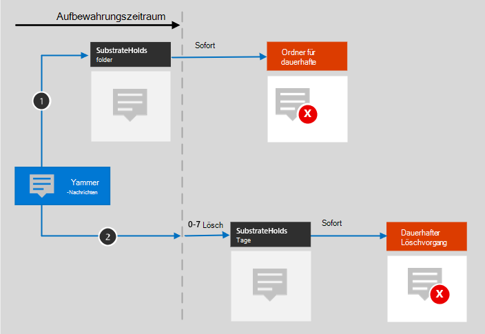

# Informationen zur Aufbewahrung für YammerLearn about retention for Yammer

>*[Microsoft 365-Lizenzierungsleitfaden für Sicherheit und Compliance](https://aka.ms/ComplianceSD).**[Microsoft 365 licensing guidance for security & compliance](https://aka.ms/ComplianceSD).*

> [!NOTE]
> Dieses Feature befindet sich in Vorschau und ist noch nicht für alle Kunden verfügbar.This feature is in preview and not yet available for all customers.

Die Informationen in diesem Artikel ergänzen den Beitrag [Informationen zu Aufbewahrungsrichtlinien](retention.md), da er spezifische Angaben für Yammer beinhaltet.The information in this article supplements [Learn about retention](retention.md) because it has information that's specific to Yammer.

Informationen zu anderen Arbeitsbereichen finden Sie unter:For other workloads, see:

- [Informationen zur Aufbewahrung für SharePoint und OneDriveLearn about retention for SharePoint and OneDrive](retention-policies-sharepoint.md)
- [Informationen zur Aufbewahrung für Microsoft TeamsLearn about retention for Microsoft Teams](retention-policies-teams.md)
- [Informationen zur Aufbewahrung für ExchangeLearn about retention for Exchange](retention-policies-exchange.md)

## Lieferumfang für Aufbewahrung und LöschungWhat's included for retention and deletion

Die folgenden Yammer-Elemente können mithilfe von Aufbewahrungsrichtlinien für Yammer beibehalten oder gelöscht werden: Community-Nachrichten und private Nachrichten.The following Yammer items can be retained and deleted by using retention policies for Yammer: Community messages and private messages.

Reaktionen von anderen Personen in der Form von Emoticons sind in diesen Nachrichten nicht enthalten.Reactions from others in the form of emoticons are not included in these messages.

## Funktionsweise einer Aufbewahrungsrichtlinie mit YammerHow retention works with Yammer

Sie können eine Aufbewahrungsrichtlinie zum Aufbewahren und Löschen von Communitynachrichten und privaten Nachrichten in Yammer verwenden.You can use a retention policy to retain and delete community messages and private messages in Yammer. Private Nachrichten werden in einem verborgenen Ordner im Postfach jedes Benutzers gespeichert, der in die Nachricht eingebunden ist, und Communitynachrichten werden in einem ähnlichen verborgenen Ordner im Gruppenpostfach für die Community gespeichert.Private messages are stored in a hidden folder in the mailbox of each user included in the message, and community messages are stored in a similar hidden folder in the group mailbox for the community.

Aufbewahrungsrichtlinien, die für Benutzer- oder Gruppenpostfächer konfiguriert sind, wirken sich nicht auf Yammer-Nachrichten aus.Yammer messages are not affected by retention policies that are configured for user or group mailboxes. Obwohl Yammer-Nachrichten in Exchange gespeichert sind, werden diese Yammer-Daten nur von einer Aufbewahrungsrichtlinie eingeschlossen, die für die Speicherorte **Yammer-Communitynachrichten** und **Private Yammer-Nachrichten** konfiguriert ist.Even though Yammer messages are stored in Exchange, this Yammer data is included only by a retention policy that's configured for the **Yammer community messages** and **Yammer private messages** locations.

> [!NOTE]
> Wenn eine aktive Aufbewahrungsrichtlinie, durch die Yammer-Daten aufbewahrt werden, Benutzer einbezieht, und Sie ein Postfach eines in diese Richtlinie einbezogenen Benutzers löschen, wird es in ein [inaktives Postfach](inactive-mailboxes-in-office-365.md) konvertiert, damit die Yammer-Daten aufbewahrt werden.If a user is included in an active retention policy that retains Yammer data and you a delete a mailbox of a user who is included in this policy, to retain the Yammer data, the mailbox is converted into an [inactive mailbox](inactive-mailboxes-in-office-365.md). Wenn diese Yammer-Daten für den Benutzer nicht aufbewahrt werden müssen, schließen Sie das Benutzerkonto aus der Aufbewahrungsrichtlinie aus, bevor Sie das Postfach löschen.If you don't need to retain this Yammer data for the user, exclude the user account from the retention policy before you delete their mailbox.

Nachdem eine Aufbewahrungsrichtlinie für Yammer-Nachrichten konfiguriert wurde, wertet ein Zeitgeberauftrag des Exchange-Dienstes regelmäßig Elemente im verborgenen Ordner aus, in dem diese Yammer-Nachrichten gespeichert sind.After a retention policy is configured for Yammer messages, a timer job from the Exchange service periodically evaluates items in the hidden folder where these Yammer messages are stored. Die Ausführung des Zeitgeberauftrags dauert bis zu sieben Tage.The timer job takes up to seven days to run. Wenn die Aufbewahrungszeit für die Elemente abgelaufen ist, werden sie in den Ordner "SubstrateHolds" verschoben, einen versteckten Ordner, der sich in jedem Benutzer- oder Gruppenpostfach befindet, um "vorläufig gelöschte" Elemente zu speichern, bevor sie endgültig gelöscht werden.When these items have expired their retention period, they are moved to the SubstrateHolds folder—a hidden folder that's in every user or group mailbox to store "soft-deleted" items before they are permanently deleted.

Nachdem eine Aufbewahrungsrichtlinie für Yammer-Nachrichten konfiguriert wurde, sind die Inhaltspfade davon abhängig, ob die Aufbewahrungsrichtlinie das Aufbewahren und dann Löschen, nur das Aufbewahren oder nur das Löschen vorsieht.After a retention policy is configured for Yammer messages, the paths the content takes depend on whether the retention policy is to retain and then delete, to retain only, or delete only.

Wenn die Aufbewahrungsrichtlinie dem Aufbewahren und dann Löschen dient:When the retention policy is to retain and then delete:

Zu den zwei Pfaden im Diagramm:For the two paths in the diagram:

1. **Wenn eine Yammer-Nachricht während des Aufbewahrungszeitraums vom Benutzer bearbeitet oder gelöscht wird**, wird die Originalnachricht sofort in den Ordner "SubstrateHolds" kopiert (falls bearbeitet) oder verschoben (falls gelöscht).**If a Yammer message is edited or deleted** by the user during the retention period, the original message is immediately copied (if edited) or moved (if deleted) to the SubstrateHolds folder. Die Nachricht wird dort bis zum Ablauf des Aufbewahrungszeitraums gespeichert und dann sofort endgültig gelöscht.The message is stored there until the retention period expires and then the message is immediately permanently deleted.

2. **Wenn eine Yammer-Nachricht nicht gelöscht wird** und für aktuelle Nachrichten nach der Bearbeitung: Die Nachrichten werden nach Ablauf des Aufbewahrungszeitraums in den Ordner "SubstrateHolds" verschoben.**If a Yammer message is not deleted** and for current messages after editing, the message is moved to the SubstrateHolds folder after the retention period expires. Dieser Vorgang dauert bis zu sieben Tage ab dem Ablaufdatum.This action takes up to seven days from the expiry date. Wenn sich die Nachricht im Ordner "SubstrateHolds" befindet, wird sie sofort endgültig gelöscht.When the message is in the SubstrateHolds folder, it is then immediately permanently deleted. 

> [!NOTE]
> Nachrichten im Ordner SubstrateHolds können mit eDiscovery-Tools durchsucht werden.Messages in the SubstrateHolds folder are searchable by eDiscovery tools. Solange Nachrichten nicht endgültig gelöscht sind (im Ordner SubstrateHolds), bleiben sie mit eDiscovery-Tools durchsuchbar.Until messages are permanently deleted (in the SubstrateHolds folder), they remain searchable by eDiscovery tools.

Wenn die Aufbewahrungsrichtlinie dem reinen Aufbewahren oder dem reinen Löschen dient, stellen die Inhaltspfade Varianten von Aufbewahren und Löschen dar.When the retention policy is retain-only, or delete-only, the content's paths are variations of retain and delete.

### Inhaltspfade für rein aufbewahrende AufbewahrungsrichtlinienContent paths for retain-only retention policy

1. **Wenn Yammer-Nachricht bearbeitet oder gelöscht wird**: Eine Kopie der Originalnachricht wird sofort im Ordner "SubstrateHolds" erstellt und dort bis zum Ablauf des Aufbewahrungszeitraums aufbewahrt.**If a Yammer message is edited or deleted**: A copy of the original message is immediately created in the SubstrateHolds folder and retained there until the retention period expires. Anschließend wird die Nachricht sofort dauerhaft aus dem Ordner "SubstrateHolds" gelöscht.Then the message is immediately permanently deleted from the SubstrateHolds folder.

2. **Wenn die Yammer-Nachricht nicht geändert oder gelöscht wird** und für aktuelle Nachrichten nach der Bearbeitung während des Aufbewahrungszeitraums: Vor und nach dem Aufbewahrungszeitraum geschieht nichts; die Nachricht wird an ihrem ursprünglichen Ort belassen.**If the Yammer message is not modified or deleted** and for current messages after editing during the retention period: Nothing happens before and after the retention period; the message remains in its original location.

### Inhaltspfade für Aufbewahrungsrichtlinien für reines LöschenContent paths for delete-only retention policy

1. **Wenn die Yammer-Nachricht während des Aufbewahrungszeitraums nicht gelöscht wird**: Die Nachricht wird am Ende des Aufbewahrungszeitraums in den Ordner "SubstrateHolds" verschoben.**If the Yammer message is not deleted** during the retention period: At the end of the retention period, the message is moved to the SubstrateHolds folder. Dieser Vorgang dauert bis zu sieben Tage ab dem Ablaufdatum.This action takes up to seven days from the expiry date. Anschließend wird die Nachricht sofort dauerhaft aus dem Ordner "SubstrateHolds" gelöscht.Then the message is immediately permanently deleted from the SubstrateHolds folder.

2. **Wenn die Yammer-Nachricht während des Zeitraums vom Benutzer gelöscht wird**, wird das Element sofort in den Ordner "SubstrateHolds" verschoben, wo es sofort endgültig gelöscht wird.**If the Yammer message is deleted by the user** during the period, the item is immediately moved to the SubstrateHolds folder where it is immediately permanently deleted.

## Nachrichten und externe BenutzerMessages and external users

Standardmäßig gilt eine Aufbewahrungsrichtlinie für private Yammer-Nachrichten für alle Benutzer in Ihrer Organisation, jedoch nicht für externe Benutzer.By default, a retention policy for Yammer private messages applies to all users in your organization, but not external users. Sie können eine Aufbewahrungsrichtlinie auf externe Benutzer anwenden, indem Sie die Option **Benutzer auswählen** verwenden und die fraglichen Konten angeben.You can apply a retention policy to external users if you use the **Choose user** and specify their account. 

Zurzeit werden Azure-B2B-Gastbenutzer nicht unterstützt.At this time, Azure B2B guest users are not supported.

## Wenn ein Benutzer die Organisation verlässtWhen a user leaves the organization 

Wenn ein Benutzer Ihre Organisation verlässt und sein Microsoft 365-Konto gelöscht wird, werden seine privaten Yammer-Nachrichten, die der Aufbewahrung unterliegen, in einem inaktiven Postfach gespeichert.If a user leaves your organization and their Microsoft 365 account is deleted, their Yammer private messages that are subject to retention are stored in an inactive mailbox. Die Nachrichten unterliegen weiterhin jeder Aufbewahrungsrichtlinie, die dem Benutzer zugewiesen wurde, bevor sein Postfach inaktiv wurde, und die Inhalte sind für eine eDiscovery-Suche verfügbar.These messages remain subject to any retention policy that was placed on the user before their mailbox was made inactive, and the contents are available to an eDiscovery search. Weitere Informationen finden Sie unter [Inaktive Postfächer in Exchange Online](inactive-mailboxes-in-office-365.md).For more information, see [Inactive mailboxes in Exchange Online](inactive-mailboxes-in-office-365.md). 

Wenn der Benutzer Dateien in Yammer gespeichert hat, lesen Sie den [entsprechenden Abschnitt](retention-policies-sharepoint.md#when-a-user-leaves-the-organization) für SharePoint und OneDrive.If the user stored any files in Yammer, see the [equivalent section](retention-policies-sharepoint.md#when-a-user-leaves-the-organization) for SharePoint and OneDrive.

## EinschränkungenLimitations

Yammer-Aufbewahrungsrichtlinien befinden sich derzeit in der Vorschau, und wir arbeiten kontinuierlich an der Optimierung der Aufbewahrungsfunktionen.Yammer retention policies are currently in preview and we're continuously working on optimizing retention functionality. Es gibt folgende Einschränkungen, die Sie bei der Aufbewahrung von Yammer-Community-Nachrichten und privaten Nachrichten beachten sollten:In the meantime, be aware of the following limitation when you use retention for Yammer community messages and private messages:

- Wenn Sie **Benutzer auswählen** für den Speicherort **Private Yammer-Nachrichten** auswählen, werden möglicherweise Gäste und Nicht-Postfachbenutzer angezeigt.When you select **Choose users** for the **Yammer private messages** location, you might see guests and non-mailbox users. Aufbewahrungsrichtlinien sind nicht auf diese Benutzer ausgerichtet, deshalb sollten Sie sie nicht auswählen.Retention policies aren't designed for these users, so don't select them.

## KonfigurationsleitfadenConfiguration guidance

Wenn Sie die Konfiguration der Datenaufbewahrung in Microsoft 365 zum ersten Mal durchführen möchten, lesen Sie [Erste Schritte mit Aufbewahrungsrichtlinien und Aufbewahrungsbezeichnungen](get-started-with-retention.md).If you're new to configuring retention in Microsoft 365, see [Get started with retention policies and retention labels](get-started-with-retention.md).

Wenn Sie startklar für die Erstellung einer Aufbewahrungsrichtlinie für Yammer sind, lesen Sie [Erstellen und Konfigurieren von Aufbewahrungsrichtlinien](create-retention-policies.md).If you're ready to configure a retention policy for Yammer, see [Create and configure retention policies](create-retention-policies.md).
