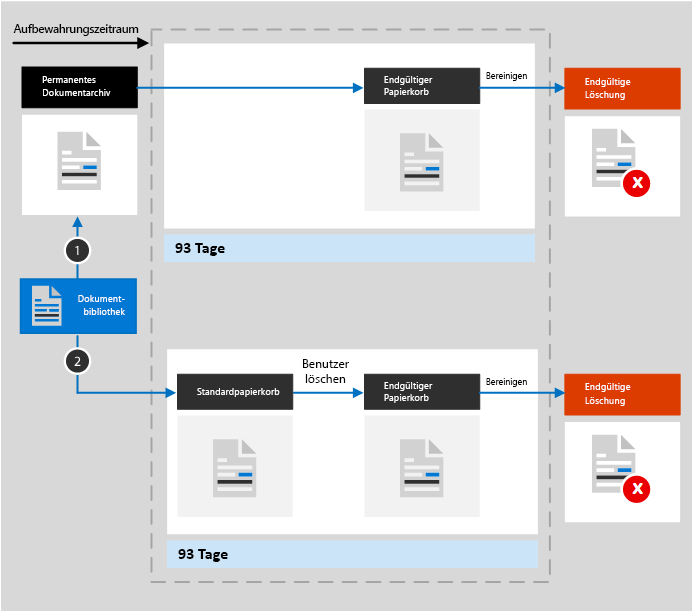
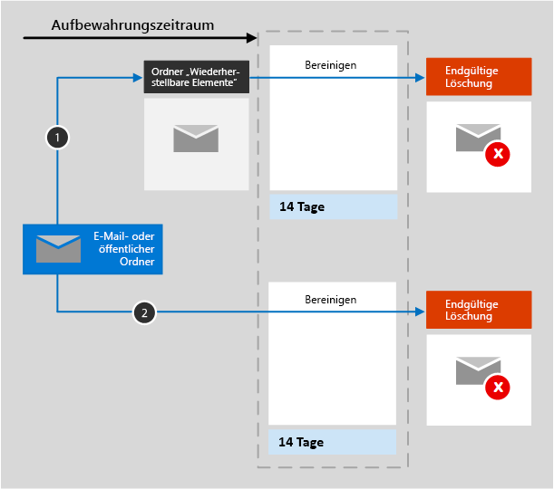
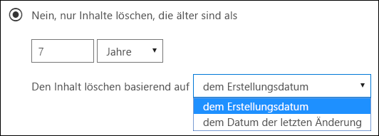
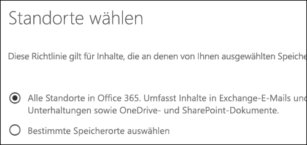
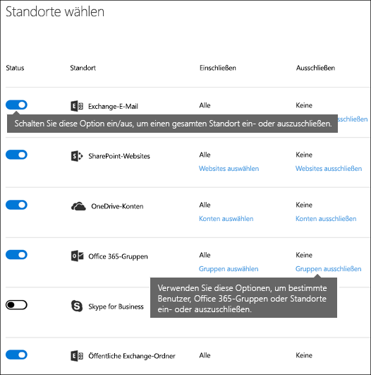
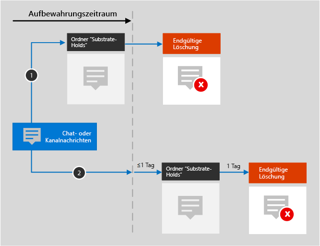
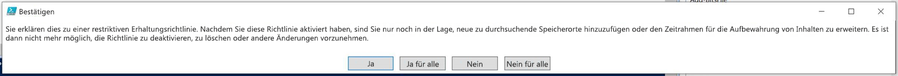

# Übersicht über AufbewahrungsrichtlinienOverview of retention policies

In den meisten Organisationen nimmt die Menge und Komplexität der Daten täglich zu – E-Mails, Dokumente, Chatnachrichten usw. Eine effektive Verwaltung bzw. Governance dieser Informationen ist wichtig, da Sie:For most organizations, the volume and complexity of their data is increasing daily — email, documents, instant messages, and more. Effectively managing or governing this information is important because you need to:
  
- **branchenspezifische Vorschriften und interne Richtlinien einhalten müssen**, nach denen Inhalte für eine bestimmte Mindestdauer aufzubewahren sind – z. B. müssen Sie gemäß dem Sarbanes-Oxley Act möglicherweise bestimmte Arten von Inhalten über sieben Jahre lang aufbewahren.**Comply proactively with industry regulations and internal policies** that require you to retain content for a minimum period of time — for example, the Sarbanes-Oxley Act might require you to retain certain types of content for seven years. 
    
- **das Risiko bei Rechtsstreitigkeiten oder einer Sicherheitsverletzung reduzieren müssen**, indem Sie alte Inhalte, die Sie nicht mehr aufbewahren müssen, endgültig löschen.**Reduce your risk in the event of litigation or a security breach** by permanently deleting old content that you're no longer required to keep. 
    
- **Ihrer Organisation dabei helfen müssen, effektiven Wissensaustausch zu betreiben und agiler zu werden**, indem Sie sicherstellen, dass die Benutzer nur mit Inhalten arbeiten, die aktuell und für sie relevant sind.**Help your organization to share knowledge effectively and be more agile** by ensuring that your users work only with content that's current and relevant to them. 
    
Eine Aufbewahrungsrichtlinie kann Ihnen dabei helfen, alle diese Ziele zu erreichen. Das Verwalten von Inhalten macht häufig zwei Aktionen erforderlich:A retention policy can help you achieve all of these goals. Managing content commonly requires two actions:
  
- **Aufbewahrung** von Inhalten, sodass sie nicht vor dem Ende des Aufbewahrungszeitraums dauerhaft gelöscht werden**Retaining** content so that it can't be permanently deleted before the end of the retention period. 
    
- **Endgültiges Löschen** von Inhalten am Ende des Aufbewahrungszeitraums.**Deleting** content permanently at the end of the retention period. 
    
Mit einer Aufbewahrungsrichtlinie können Sie:With a retention policy, you can:
  
- proaktiv entscheiden, ob Inhalte aufbewahrt, gelöscht oder beides, also aufbewahrt und dann gelöscht werden sollen.Decide proactively whether to retain content, delete content, or both — retain and then delete the content.
    
- eine einzelne Richtlinie auf die gesamte Organisation oder auf bestimmte Speicherorte oder Benutzer anwenden.Apply a single policy to the entire organization or specific locations or users.
    
- eine Richtlinie auf alle Inhalte oder auf bestimmte Kriterien erfüllende Inhalte anwenden, z. B. auf Inhalte, die bestimmte Schlüsselwörter oder [bestimmte Arten von vertraulichen Informationen](what-the-sensitive-information-types-look-for.md) enthalten.Apply a policy to all content or content meeting certain conditions, such as content containing specific keywords or [specific types of sensitive information](what-the-sensitive-information-types-look-for.md).
    
Wenn Inhalte einer permanenten Richtlinie unterliegen, können Benutzer den Inhalt weiterhin bearbeiten und verwenden, als hatte sich nichts geändert, da der Inhalt an seinem ursprünglichen Speicherort beibehalten wird. Falls Inhalte, die der Richtlinie unterliegen, jedoch bearbeitet oder gelöscht werden, wird eine Kopie an einem sicheren Standort gespeichert, an dem sie beibehalten wird, solange die Richtlinie gilt.When content is subject to a retention policy, people can continue to edit and work with the content as if nothing's changed because the content is retained in place, in its original location. But if someone edits or deletes content that's subject to the policy, a copy is saved to a secure location where it's retained while the policy is in effect.
  
Schließlich müssen einige Organisationen Vorschriften einhalten, wie zum Beispiel die Rule 17a-4 der Securities and Exchange Commission (SEC), nach der eine Aufbewahrungsrichtlinie nach dem Aktivieren nicht deaktiviert oder weniger restriktiv eingestellt werden darf. Um diese Anforderung zu erfüllen, können Sie die Erhaltungssperre verwenden. Nachdem eine Richtlinie gesperrt wurde, kann niemand (auch nicht ein Administrator) die Richtlinie deaktivieren oder weniger restriktiv einstellen.Finally, some organizations have to comply with regulations such as Securities and Exchange Commission (SEC) Rule 17a-4, which requires that after a retention policy is turned on, it cannot be turned off or made less restrictive. To meet this requirement, you can use Preservation Lock. After a policy's been locked, no one (including an administrator) can turn off the policy or make it less restrictive.
  
Sie erstellen und verwalten Aufbewahrungsrichtlinien auf der:You create and manage retention policies on the:

- Seite **Richtlinien** im [Microsoft 365 Compliance Center](https://compliance.microsoft.com/).**Policies** page in the [Microsoft 365 compliance center](https://compliance.microsoft.com/).
- Seite **Aufbewahrung** unter **Informationsgovernance** im [Office 365 Security&amp; Compliance Center](https://protection.office.com/).**Retention** page under **Information governance** in the [Office 365 Security &amp; Compliance Center](https://protection.office.com/).
  
## Funktionsweise einer Aufbewahrungsrichtlinie mit InhaltenHow a retention policy works with content in place

Wenn Sie einen Speicherort, z. B. eine Website oder ein Postfach in eine Aufbewahrungsrichtlinie einschließen, verbleibt der Inhalt an seinem ursprünglichen Speicherort. Benutzer können weiter mit ihren Dokumenten oder E-Mails arbeiten, als ob sich nichts geändert hätte. Wenn sie jedoch Inhalte bearbeiten oder löschen, die von der Richtlinie abgedeckt sind, wird eine Kopie des Inhalts in seinem Zustand zum Zeitpunkt der Anwendung der Richtlinie beibehalten.When you include a location such as a site or mailbox in a retention policy, the content remains in its original location. People can continue to work with their documents or mail as if nothing's changed. But if they edit or delete content that's included in the policy, a copy of the content as it existed when you applied the policy is retained.
  
Für SharePoint-Websitesammlungen wird eine Kopie des ursprünglichen Inhalts im permanenten Dokumentarchiv beibehalten, wenn Benutzer diesen bearbeiten oder löschen. Bei E-Mails und öffentlichen Ordnern wird die Kopie im Ordner „Wiederherstellbare Elemente“ aufbewahrt. Diese sicheren Speicherorte und die aufbewahrten Inhalte werden den meisten Benutzern nicht angezeigt. Mit einer Aufbewahrungsrichtlinie müssen Benutzer nicht einmal wissen, dass ihre Inhalte der Richtlinie unterliegen.For SharePoint site collections, a copy of the original content is retained in the Preservation Hold library when users edit or delete it. For email and public folders, the copy is retained in the Recoverable Items folder. These secure locations and the retained content are not visible to most people. With a retention policy, people do not even need to know that their content is subject to the policy.
  
Hinweise:Notes:
  
- Teams (Chat)-Inhalte werden in Exchange gespeichert und die Richtlinie basierend auf dem Nachrichtentyp (E-Mail oder Unterhaltung) angewendet.Teams (chat) content is stored in Exchange, where the policy is applied based on message type (email or conversation).
    
- Eine auf eine Office 365-Gruppe angewendete Aufbewahrungsrichtlinie umfasst sowohl das Gruppenpostfach als auch die Website.A retention policy applied to an Office 365 group includes both the group mailbox and site.

- Das permanente Dokumentarchiv verbraucht Speicherkontingent für die Website.The Preservation Hold library consumes storage quota for the site.
    
### Inhalte in OneDrive-Konten und SharePoint-WebsitesContent in OneDrive accounts and SharePoint sites

Eine Aufbewahrungsrichtlinie wird auf der Ebene einer Websitesammlung angewendet.A retention policy is applied at the level of a site collection. Wenn Sie eine SharePoint-Websitesammlung oder ein OneDrive-Konto in eine Aufbewahrungsrichtlinie einschließen, wird ein permanentes Dokumentarchiv erstellt, sofern nicht bereits ein solches vorhanden ist.When you include a SharePoint site collection or OneDrive account in a retention policy, a Preservation Hold library is created, if one doesn't exist. Sie können diese Bibliothek auf der Seite **Websiteinhalte** der Website auf oberster Ebene der Websitesammlung anzeigen.You can view this library on the **Site contents** page in the top-level site of the site collection. Die meisten Benutzer können das permanente Dokumentarchiv nicht anzeigen, da es nur für Websitesammlungsadministratoren sichtbar ist.Most users can't view the Preservation Hold library because it's visible only to site collection administrators.
  
Wenn ein Benutzer versucht, den Inhalt einer Website, die einer Aufbewahrungsrichtlinie unterliegt, zu ändern oder zu löschen, überprüft die Aufbewahrungsrichtlinie zunächst, ob der Inhalt seit Anwendung der Richtlinie geändert wurde.If a person attempts to change or delete content in a site that's subject to a retention policy, first the policy checks whether the content's been changed since the policy was applied. Wenn dies die erste Änderung seit Anwendung der Richtlinie ist, kopiert die Aufbewahrungsrichtlinie den Inhalt in das permanente Dokumentarchiv und ermöglicht dem Benutzer anschließend das Ändern oder Löschen des ursprünglichen Inhalts.If this is the first change since the policy was applied, the retention policy copies the content to the Preservation Hold library, and then allows the person to change or delete the original content. Alle Inhalte der Websitesammlung können auch dann in das permanente Dokumentarchiv kopiert werden, wenn der Inhalt der Abfrage, die von der Aufbewahrungsrichtlinie verwendet wird, nicht entspricht.Any content in the site collection can be copied to the Preservation Hold library, even if the content does not match the query used by the retention policy.
  
In diesem Fall bereinigt ein Zeitgeberauftrag das permanente Dokumentarchiv.Then a timer job cleans up the Preservation Hold library. Der Zeitgeberauftrag wird in regelmäßigen Abständen ausgeführt und vergleicht sämtliche Inhalte im permanenten Dokumentarchiv mit allen Abfragen, die von den Aufbewahrungsrichtlinien für die Website verwendet werden.The timer job runs periodically and compares all content in the Preservation Hold library to all queries used by the retention policies on the site. Fall der Inhalt nicht mindestens einer der Abfragen entspricht, löscht der Zeitgeberauftrag den Inhalt dauerhaft aus dem permanenten Dokumentarchiv.Unless content matches at least one of the queries, the timer job permanently deletes the content from the Preservation Hold library.
  
Das gilt auch für Inhalte, die bei Anwendung der Aufbewahrungsrichtlinien vorhanden sind. Außerdem werden alle neuen Inhalte, die erstellt oder der Websitesammlung hinzugefügt werden, nachdem sie in die Richtlinie eingeschlossen wurden, auch nach dem Löschen beibehalten. Neue Inhalte werden allerdings nicht bei der ersten Bearbeitung in das permanente Dokumentarchiv kopiert, sondern nur, wenn sie gelöscht werden. Um alle Versionen einer Dateien beizubehalten, müssen Sie die Versionsverwaltung aktivieren – siehe dazu den nachstehenden Abschnitt zur Versionsverwaltung.The previous applies to content that exists when the retention policy is applied. In addition, any new content that's created or added to the site collection after it was included in the policy will be retained after deletion. However, new content isn't copied to the Preservation Hold library the first time it's edited, only when it's deleted. To retain all versions of a file, you need to turn on versioning — see the below section on versioning.
  
Beachten Sie, dass ein Benutzer eine Fehlermeldung erhält, wenn er versucht, Bibliotheken, Listen, Ordner oder Websites zu löschen, für die eine Aufbewahrungsrichtlinie gilt.Note that a user receives an error if they try to delete a library, list, folder, or site that's subject to a retention policy. Ein Benutzer kann einen Ordner löschen, wenn er zuerst Dateien im Ordner verschiebt oder löscht, die der Richtlinie unterliegen.A user can delete a folder if they first move or delete any files in the folder that are subject to the policy. Außerdem wird das permanente Dokumentarchiv nur erstellt, sobald das erste Element in das Archiv kopiert werden muss, und nicht, wenn Sie die Aufbewahrungsrichtlinie erstellen.Also, the Preservation Hold library is created only when the first item needs to be copied to the library and not when you create the retention policy. Zum Testen Ihrer Richtlinie müssen Sie daher zuerst ein Dokument in einer Website bearbeiten oder löschen, die der Richtlinie unterliegt, und dann zum permanenten Dokumentarchiv gehen, um die aufbewahrte Kopie anzuzeigen.Therefore, to test your policy, you first need to edit or delete a document in a site subject to the policy, and then browse to the Preservation Hold library to view the retained copy.
  
Nachdem einem OneDrive-Konto oder einer SharePoint-Website eine Aufbewahrungsrichtlinie zugewiesen wurde, können Inhalte einem von zwei Pfaden folgen:After a retention policy is assigned to a OneDrive account or SharePoint site, content can follow one of two paths:

  
1. **Wenn der Inhalt während des Aufbewahrungszeitraums geändert oder gelöscht wird**, wird eine Kopie des ursprünglichen Inhalts in der beim Zuweisen der Richtlinie vorhandenen Form im permanenten Dokumentarchiv erstellt.**If the content is modified or deleted** during the retention period, a copy of the original content as it existed when the retention policy was assigned is created in the Preservation Hold library. Dort wird in regelmäßigen Abständen ein Zeitgeberauftrag ausgeführt, der Elemente identifiziert, deren Aufbewahrungszeitraum abgelaufen ist. Diese Elemente werden in den endgültigen Papierkorb verschoben, von wo sie nach Ablauf von 93 Tagen dauerhaft gelöscht werden.There, a timer job runs periodically and identifies items whose retention period has expired, and those items are moved to the second-stage Recycle Bin, where they're permanently deleted at the end of 93 days. Der endgültige Papierkorb wird den Endbenutzern nicht angezeigt (sie sehen nur den Standardpapierkorb), Websitesammlungsadministratoren können hingegen dessen Inhalte anzeigen und wiederherstellen.The second-stage Recycle Bin is not visible to end users (only the first-stage Recycle Bin is), but site collection admins can view and restore content from there.

    > [!NOTE]
    > Wir haben kürzlich die Art und Weise, wie Inhalte aus dem permanenten Dokumentarchiv gelöscht werden, geändert.We've recently changed how content is deleted from the Preservation Hold library. Um versehentlichem Datenverlust vorzubeugen, werden Inhalte nicht mehr dauerhaft aus dem permanenten Dokumentarchiv gelöscht.To help prevent inadvertent data loss, we no longer permanently delete content from the Preservation Hold library. Stattdessen werden Inhalte nur aus dem Papierkorb dauerhaft gelöscht, sodass nun sämtliche Inhalte aus dem permanenten Dokumentarchiv den endgültigen Papierkorb durchlaufen werden.Instead, we permanently delete content only from the Recycle Bin, so all content from the Preservation Hold library now goes through the second-stage Recycle Bin.
    
2. **Wenn der Inhalt während des Aufbewahrungszeitraums nicht geändert oder gelöscht wird**, wird er am Ende des Aufbewahrungszeitraums in den Standardpapierkorb verschoben.**If the content is not modified or deleted** during the retention period, it's moved to the first-stage Recycle Bin at the end of the retention period. Wenn ein Benutzer den Inhalt dort löscht oder diesen Papierkorb leert (auch als Aufräumen bekannt), wird das Dokument in den endgültigen Papierkorb verschoben.If a user deletes the content from there or empties this Recycle Bin (also known as purging), the document is moved to the second-stage Recycle Bin. Der Standard- und der endgültige Papierkorb umfassen zusammen einen Aufbewahrungszeitraum von 93 Tagen. Am Ende dieser 93 Tage wird das Dokument dauerhaft von seinem jeweiligen Aufbewahrungsort gelöscht, entweder im Standard- oder im endgültigen Papierkorb.A 93-day retention period spans both the first- and second-stage recycle bins. At the end of 93 days, the document is permanently deleted from wherever it resides, in either the first- or second-stage Recycle Bin. Der Papierkorb wird nicht indiziert und somit werden Inhalte bei Suchvorgängen dort nicht gefunden.The Recycle Bin is not indexed and therefore searches do not find content there. Das bedeutet, dass ein eDiscovery-Archiv keine Inhalte im Papierkorb finden kann, um diese zu archivieren.This means that an eDiscovery hold can't locate any content in the Recycle Bin to hold it. 
    
### Inhalte in Postfächern und öffentlichen OrdnernContent in mailboxes and public folders

Für die E-Mails, den Kalender und andere Elemente eines Benutzers wird eine Aufbewahrungsrichtlinie auf Postfachebene angewendet. Für einen öffentlichen Ordner wird eine Aufbewahrungsrichtlinie auf Ordnerebene angewendet, nicht auf Postfachebene. Ein Postfach und ein öffentlicher Ordner verwenden beide den Order „Wiederherstellbare Elemente“, um Elemente beizubehalten. Nur Personen, denen eDiscovery-Berechtigungen zugewiesen wurden, können den Ordner „Wiederherstellbare Elemente“ eines anderen Benutzers anzeigen.For a user's mail, calendar, and other items, a retention policy is applied at the level of a mailbox. For a public folder, a retention policy is applied at the folder level, not the mailbox level. Both a mailbox and a public folder use the Recoverable Items folder to retain items. Only people whom have been assigned eDiscovery permissions can view items in another user's Recoverable Items folder.
  
Standardmäßig wird eine Nachricht, die von einem Benutzer aus einem anderen Ordner als dem Ordner "Gelöschte Elemente" gelöscht wird, in den Ordner "Gelöschte Elemente" verschoben. Wenn ein Benutzer ein Element aus dem Ordner "Gelöschte Elemente" löscht, wird die Nachricht in den Ordner "Wiederherstellbare Elemente" verschoben. Außerdem kann ein Benutzer ein Element in einem Ordner mit UMSCHALT+ENTF löschen. Auf diese Weise wird der Ordner "Gelöschte Elemente" umgangen und das Element direkt in den Ordner "Wiederherstellbare Elemente" verschoben.By default, when a person deletes a message in a folder other than the Deleted Items folder, the message is moved to the Deleted Items folder. When a person deletes an item in the Deleted Items folder, the message is moved to the Recoverable Items folder. In addition, a person can soft delete an item (SHIFT+DELETE) in any folder, which bypasses the Deleted Items folder and moves the item directly to the Recoverable Items folder.
  
Ein Prozess bewertet die Elemente im Ordner "Wiederherstellbare Elemente" in regelmäßigen Abständen. Wenn ein Element den Regeln mindestens einer Aufbewahrungsrichtlinie nicht entspricht, wird das Element endgültig aus dem Ordner "Wiederherstellbare Elemente" gelöscht (wird auch als endgültiges Löschen bezeichnet).A process periodically evaluates items in the Recoverable Items folder. If an item doesn't match the rules of at least one retention policy, the item is permanently deleted (also called hard deleted) from the Recoverable Items folder.
  
Wenn ein Benutzer versucht, bestimmte Eigenschaften eines Postfachelements zu ändern – zum Beispiel Betreff, Text, Anhänge, Sender und Empfänger oder Sende- bzw. Empfangsdatum einer Nachricht – wird eine Kopie des ursprünglichen Elements im Ordner "Wiederherstellbare Elemente" gespeichert, bevor die Änderung übernommen wird.When a person attempts to change certain properties of a mailbox item — such as the subject, body, attachments, senders and recipients, or date sent or received for a message — a copy of the original item is saved to the Recoverable Items folder before the change is committed. Diese Aktion findet für alle nachfolgenden Änderungen statt.This action happens for each subsequent change. Am Ende des Aufbewahrungszeitraums werden Kopien im Ordner "Wiederherstellbare Elemente" endgültig gelöscht.At the end of the retention period, copies in the Recoverable Items folder are permanently deleted.
  
Wenn ein Benutzer das Unternehmen verlässt und sein Postfach von einer Aufbewahrungsrichtlinie abgedeckt ist, wird das Postfach ein inaktives Postfach, sobald das Office 365-Konto des Benutzers gelöscht wird. Die Inhalte eines inaktiven Postfachs unterliegen weiterhin der Aufbewahrungsrichtlinie, die dem Postfach zugewiesen wurde, bevor es inaktiv wurde, und die Inhalte sind über eine eDiscovery-Suche verfügbar. Weitere Informationen finden Sie unter [Inaktive Postfächer in Exchange Online](inactive-mailboxes-in-office-365.md).If a user leaves your organization, and their mailbox is included in a retention policy, the mailbox becomes an inactive mailbox when the user's Office 365 account is deleted. The contents of an inactive mailbox are still subject to any retention policy that was placed on the mailbox before it was made inactive, and the contents are available to an eDiscovery search. For more information, see [Inactive mailboxes in Exchange Online](inactive-mailboxes-in-office-365.md).
  
Nachdem einem Postfach oder einem öffentlichen Ordner eine Aufbewahrungsrichtlinie zugewiesen wurde, können Inhalte einem von zwei Pfaden folgen:After a retention policy is assigned to a mailbox or public folder, content can follow one of two paths:

1. **Wenn das Element während des Aufbewahrungszeitraums vom Benutzer geändert oder dauerhaft gelöscht wird** (entweder per UMSCHALT + ENTF oder aus gelöschte Elemente gelöscht), wird das Element in den Ordner "Wiederherstellbare Elemente" verschoben (oder, im Fall der Bearbeitung, kopiert). Dort wird in regelmäßigen Abständen ein Vorgang ausgeführt, der Elemente identifiziert, deren Aufbewahrungszeitraum abgelaufen ist, und diese Elemente werden innerhalb von 14 Tagen nach Ende des Aufbewahrungszeitraums dauerhaft gelöscht. Beachten Sie, dass die Standardeinstellung 14 Tage beträgt, aber es können auch 30 Tage eingestellt werden.**If the item is modified or permanently deleted** by the user (either SHIFT+DELETE or deleted from Deleted Items) during the retention period, the item is moved (or copied, in the case of edit) to the Recoverable Items folder. There, a process runs periodically and identifies items whose retention period has expired, and these items are permanently deleted within 14 days of the end of the retention period. Note that 14 days is the default setting, but it can be configured up to 30 days.
    
2. **Wenn das Element während des Aufbewahrungszeitraums nicht geändert oder gelöscht wird**, wird derselbe Prozess in regelmäßigen Abständen für alle Ordner im Postfach ausgeführt, und es werden Elemente identifiziert, deren Aufbewahrungszeitraum abgelaufen ist. Diese Elemente werden innerhalb von 14 Tagen nach Ende des Aufbewahrungszeitraums dauerhaft gelöscht.**If the item is not modified or deleted** during the retention period, the same process runs periodically on all folders in the mailbox and identifies items whose retention period has expired, and these items are permanently deleted within 14 days of the end of the retention period. Beachten Sie, dass 14 Tage die Standardeinstellung ist, die aber auf bis zu 30 Tage festgelegt werden kann.Note that 14 days is the default setting, but it can be configured up to 30 days. 
    
## Funktionsweise einer Aufbewahrungsrichtlinie mit Dokumentversion in einer WebsitesammlungHow a retention policy works with document versions in a site collection

Die Versionsverwaltung ist ein Feature aller Dokumentbibliotheken in SharePoint Online und in OneDrive for Business.Versioning is a feature of all document libraries in SharePoint Online and OneDrive for Business. Standardmäßig werden bei der Versionsverwaltung mindestens 500 Hauptversionen beibehalten, Sie können diese Beschränkung jedoch erhöhen.By default, versioning retains a minimum of 500 major versions, though you can increase this limit. Weitere Informationen finden Sie unter [Aktivieren und Konfigurieren der Versionsverwaltung für eine Liste oder Bibliothek](https://support.office.com/article/1555d642-23ee-446a-990a-bcab618c7a37).For more information, see [Enable and configure versioning for a list or library](https://support.office.com/article/1555d642-23ee-446a-990a-bcab618c7a37).
  
Eine Aufbewahrungsregelung (Aufbewahrungsrichtlinie, im Rahmen derer Inhalte nicht einfach nur gelöscht sondern auch aufbewahrt werden können) umfasst alle Versionen eines Dokuments in einer SharePoint-Websitesammlung oder einem OneDrive-Konto.A retain policy (retention policy that retains content instead of delete-only) retains all versions of a document in a SharePoint site collection or OneDrive account. Jedes Mal, wenn ein Dokument, das einer Aufbewahrungsregelung untersteht, bearbeitet wird, wird die bestehende Version des Dokuments in das permanente Dokumentarchiv kopiert und dort aufbewahrt.Each time a document subject to a hold or retain policy is edited, a version is copied to the Preservation Hold library. Jedes Mal, wenn ein Dokument, das einer Aufbewahrungsregelung untersteht, gelöscht wird, werden alle bestehenden Versionen in das permanente Dokumentarchiv kopiert. Vorrausetzung hierfür ist, dass die Versionsverwaltung aktiviert sein muss.Each time a document subject to a hold or retain policy is deleted, all versions are copied to the Preservation Hold library if versioning is enabled. Jede Version eines Dokuments im permanenten Dokumentarchiv bleibt in ihrem jeweiligen Aufbewahrungszeitraum als eigenständiges Element bestehen:Each version of a document in the Preservation Hold library exists as a separate item with its own retention period:
  
- Wenn die Aufbewahrungsrichtlinie darauf basiert, wann der Inhalt erstellt wurde, verfügt jede Version über das gleiche Ablaufdatum wie das ursprüngliche Dokument. Das ursprüngliche Dokument und dessen Versionen laufen gleichzeitig ab.If the retention policy is based on when the content was created, each version has the same expiration date as the original document. The original document and its versions all expire at the same time.
    
- Wenn die Aufbewahrungsrichtlinie darauf basiert, wann der Inhalt zuletzt geändert wurde, verfügt jede Version über ein eigenes Ablaufdatum basierend auf dem Zeitpunkt der Änderung des ursprünglichen Dokuments, aus der diese Version hervorgegangen ist. Die Originaldokumente und deren Versionen laufen unabhängig voneinander ab.If the retention policy is based on when the content was last modified, each version has its own expiration date based on when the original document was modified to create that version. The original documents and its versions expire independently of each other.

> [!NOTE]
> Aufbewahrte Versionen von SharePoint- und OneDrive-Dokumenten lassen sich nicht mithilfe von eDiscovery-Tools durchsuchen.The preserved versions of SharePoint and OneDrive documents are not searchable by eDiscovery tools.

## Aufbewahren von Inhalten für einen bestimmten ZeitraumRetaining content for a specific period of time

Mit einer Aufbewahrungsrichtlinie können Sie Inhalte zeitlich unbegrenzt oder für eine bestimmte Anzahl von Tagen, Monaten oder Jahren aufbewahren.With a retention policy, you can retain content indefinitely or for a specific number of days, months, or years. Die Dauer der Aufbewahrung von Inhalten wird anhand des Alters der Inhalte und nicht anhand des Anwendungsdatums der Aufbewahrungsrichtlinie berechnet.The duration for how long content is retained is calculated from the age of the content, not from when the retention policy is applied. Sie können auswählen, ob das Alter auf dem Erstellungsdatum des Inhalts oder (bei OneDrive und SharePoint) auf dem Datum der letzten Änderung basiert.You can choose whether the age is based on when the content was created or (for OneDrive and SharePoint) when it was last modified.
  
Wenn Sie Inhalte einer Websitesammlung beispielsweise nach ihrer letzten Änderung sieben Jahre lang aufbewahren möchten und ein Dokument in dieser Websitesammlung sechs Jahre lang nicht geändert wurde, wird das Dokument nur noch ein weiteres Jahr aufbewahrt, falls es nicht geändert wird. Falls das Dokument wieder geändert wird, wird das Alter des Dokuments anhand des neuen Datums der letzten Änderung berechnet und weitere sieben Jahre lang aufbewahrt.For example, if you want to retain content in a site collection for seven years since it was last modified, and a document in that site collection hasn't been modified in six years, the document will be retained for only another year if it's not modified. If the document is edited again, the age of the document is calculated from the new last modified date, and it will be retained for another seven years.
  
Ebenso wird, wenn Sie Inhalte in einem Postfach für sieben Jahre aufbewahren möchten, und eine Nachricht wurde vor sechs Jahren gesendet, die Nachricht nur noch ein Jahr lang aufbewahrt. Bei Exchange-Inhalten basiert das Alter immer auf dem Empfangs- oder Sendedatum (diese sind identisch). Das Aufbewahren von Inhalten basierend auf ihrer letzten Änderung gilt nur für Websiteinhalte in OneDrive und SharePoint.Similarly, if you want to retain content in a mailbox for seven years, and a message was sent six years ago, the message will be retained for only one year. For Exchange content, the age is always based on the date received or sent (they are the same). Retaining content based on when it was last modified applies only to site content in OneDrive and SharePoint.
  
Sie können wählen, ob der Inhalt am Ende des Aufbewahrungszeitraums dauerhaft gelöscht werden soll.You can choose whether you want the content to be permanently deleted at the end of the retention period. Mithilfe einer Aufbewahrungsrichtlinie können auch alte Inhalte gelöscht werden, ohne sie aufzubewahren.A retention policy can also delete old content without retaining it. Informationen dazu finden Sie im nächsten Abschnitt.See the next section.
  

  
## Löschen von Inhalten, die ein bestimmtes Alter überschritten habenDeleting content that's older than a specific age

Eine Aufbewahrungsrichtlinie kann Inhalte sowohl aufbewahren und dann löschen, oder alte Inhalte löschen, ohne sie aufzubewahren.A retention policy can both retain and then delete content, or delete old content without retaining it.
  
Wenn Ihre Aufbewahrungsrichtlinie Inhalte löscht, ist es wichtig, zu wissen, dass der für eine Aufbewahrungsrichtlinie festgelegte Zeitraum jedes Mal berechnet wird, wenn der betreffende Inhalt erstellt oder geändert wird.If your retention policy deletes content, it's important to understand that the time period specified for a retention policy is calculated from the time when the content was created or modified, not the time since the policy was assigned.
  

  
Nehmen wir zum Beispiel an, dass Sie eine Aufbewahrungsrichtlinie erstellen, nach der Inhalte nach drei Jahren gelöscht werden, und diese Aufbewahrungsrichtlinie dann allen OneDrive-Konten zuweisen, die viele Inhalte enthalten, die vor vier oder fünf Jahren erstellt wurden. In einem solchen Fall werden viele der Inhalte schon bald nach der ersten Zuweisung der Aufbewahrungsrichtlinie gelöscht. Daher kann **eine Aufbewahrungsrichtlinie, nach der Inhalte gelöscht werden, wesentliche Auswirkungen auf Ihre Inhalte haben**.For example, suppose that you create a retention policy that deletes content after three years, and then assign that policy to all OneDrive accounts, which contain a lot of content that was created four or five years ago. In this case, a lot of content will be deleted soon after assigning the retention policy for the first time. For this reason, **a retention policy that deletes content can have a considerable impact on your content**. 
  
Daher sollten Sie vor dem erstmaligen Zuweisen einer Richtlinie zu einer Websitesammlung zunächst das Alter des vorhandenen Inhalts und die möglichen Auswirkungen der Richtlinie auf diesen Inhalt bedenken. Sie können außerdem vor dem Zuweisen die Benutzer über die neue Richtlinie informieren, um ihnen Zeit zur Auswertung der möglichen Auswirkungen zu geben. Beachten Sie, dass folgende Warnung erscheint, wenn Sie die Einstellungen für Ihre Aufbewahrungsrichtlinie prüfen, bevor Sie sie erstellen.Therefore, before you assign a retention policy to a site collection for the first time, you should first consider the age of the existing content and how the policy may impact that content. You may also want to communicate the new policy to your users before assigning it, to give them time to assess the possible impact. Note this warning that appears when you review the settings for your retention policy just before creating it.
  

  
## Erweiterte Einstellungen, nach denen eine Richtlinie nur auf Inhalte angewendet wird, die bestimmte Bedingungen erfüllen.Advanced settings that apply a policy only to content that meets certain conditions

Eine Aufbewahrungsrichtlinie kann für alle Inhalte an den von ihr abgedeckten Speicherorten gelten, oder Sie können auswählen, eine Aufbewahrungsrichtlinie nur auf Inhalte anzuwenden, die bestimmte Stichwörter oder [bestimmte Arten von vertraulichen Informationen](what-the-sensitive-information-types-look-for.md) enthalten.A retention policy can apply to all content in the locations that it includes, or you can choose to apply a retention policy only to content that contains specific keywords or [specific types of sensitive information](what-the-sensitive-information-types-look-for.md).
  

  
### Aufbewahren von Inhalten, die bestimmte Stichwörter enthaltenRetain content that contains specific keywords

Sie können eine Aufbewahrungsrichtlinie ausschließlich auf Inhalte anwenden, die bestimmte Kriterien erfüllen, und dann Aufbewahrungsaktionen nur für diese Inhalte ausführen. Die verfügbaren Bedingungen unterstützen jetzt das Anwenden einer Aufbewahrungsrichtlinie auf Inhalte, die bestimmte Wörter oder Ausdrücke enthalten. Sie können Ihre Abfrage mithilfe von Suchoperatoren wie UND, ODER und NICHT verfeinern. Weitere Informationen zu diesen Operatoren finden Sie unter [Stichwortabfragen und Suchbedingungen für die Inhaltssuche](keyword-queries-and-search-conditions.md).You can apply a retention policy only to content that satisfies certain conditions, and then take retention actions on just that content. The conditions available now support applying a retention policy to content that contains specific words or phrases. You can refine your query by using search operators like AND, OR, and NOT. For more information on these operators, see [Keyword queries and search conditions for Content Search](keyword-queries-and-search-conditions.md).
  
Unterstützung für das Hinzufügen durchsuchbarer Eigenschaften (z. B. **Betreff:**) wird in Kürze verfügbar sein.Support for adding searchable properties (for example, **subject:**) is coming soon.
  
Die abfragebasierte Aufbewahrung verwendet den Suchindex, um Inhalte zu identifizieren.Query-based retention uses the search index to identify content.
  

  
### Aufbewahren von Inhalten, die vertrauliche Informationen enthaltenRetain content that contains sensitive information

Sie können eine Aufbewahrungsrichtlinie auch nur auf Inhalte anwenden, die [bestimmte Arten von vertraulichen Informationen](what-the-sensitive-information-types-look-for.md) enthalten. Sie können z. B. eindeutige Aufbewahrungsanforderungen nur auf Inhalte, die personenbezogene Informationen (PII) wie Steuernummern, Sozialversicherungsnummern oder Reisepassnummern enthalten, anwenden.You can also apply a retention policy only to content that contains [specific types of sensitive information](what-the-sensitive-information-types-look-for.md). For example, you can choose to apply unique retention requirements only to content that contains personally identifiable information (PII) such as taxpayer identification numbers, social security numbers, or passport numbers.
  

  
Hinweise:Notes:
  
- Die erweiterte Aufbewahrung für vertrauliche Informationen gilt nicht für öffentliche Exchange-Ordner oder Skype for Business, da diese Speicherorte keine vertraulichen Informationstypen unterstützen.Advanced retention for sensitive information doesn't apply to Exchange public folders or Skype for Business because those locations don't support sensitive information types.
    
- Sie sollten wissen, dass in Exchange Online E-Mail-Flussregeln (auch als Transportregeln bezeichnet) zum Identifizieren vertraulicher Informationen verwendet werden, sodass dies nur bei Nachrichten während der Übertragung funktioniert, jedoch nicht für alle Elemente, die bereits in einem Postfach gespeichert sind. Für Exchange Online bedeutet dies, dass mit einer Aufbewahrungsrichtlinie nur für Nachrichten, die **nach** der Richtlinienaktivierung für das Postfach empfangen werden, vertrauliche Informationen identifiziert und Aufbewahrungsaktionen ausgeführt werden können.(Beachten Sie, dass die im vorherigen Abschnitt beschriebene abfragebasierte Aufbewahrung diese Einschränkung nicht aufweist, da zum Identifizieren von Inhalten der Suchindex verwendet wird.)You should understand that Exchange Online uses mail flow rules (also known as transport rules) to identify sensitive information, so this works only on messages in transit — not on all items already stored in a mailbox. For Exchange Online, this means that a retention policy can identify sensitive information and take retention actions only on messages that are received **after** the policy is applied to the mailbox. (Note that query-based retention described in the previous section doesn't have this limitation because it uses the search index to identify content.) 
    
## Anwenden einer Aufbewahrungsrichtlinie auf eine gesamte Organisation oder bestimmte SpeicherorteApplying a retention policy to an entire organization or specific locations

Sie können eine Aufbewahrungsrichtlinie ganz einfach auf eine gesamte Organisation, ganze Speicherorte oder nur auf bestimmte Speicherorte oder Benutzer anwenden.You can easily apply a retention policy to an entire organization, entire locations, or only to specific locations or users.
  
### Organisationsweite RichtlinieOrg-wide policy

Eines der leistungsstärksten Features einer Aufbewahrungsrichtlinie ist, dass sie standardmäßig für Speicherorte in ganz Office 365 gilt, einschließlich:One of the most powerful features of a retention policy is that by default it applies to locations across Office 365, including:
  
- Exchange-E-MailExchange email
    
- SharePoint-WebsitesammlungenSharePoint site collections
    
- OneDrive-KontenOneDrive accounts
    
- Office 365-Gruppen (gilt für Inhalte in Postfach, Website, Dokumenten der Gruppe.Office 365 groups (applies to content in the group's mailbox, site, and documents. Unterstützung für Inhalte in Planner, Yammer, CRM Microsoft Teams, PowerBI, Stream, Exchange und SharePoint-Teamwebsites wird in Kürze zur Verfügung stehen.)Support for content in Planner, Yammer, CRM Microsoft Teams, PowerBI, Stream, Exchange, and SharePoint Team Sites is coming soon.)
    
- Öffentliche Exchange-OrdnerExchange public folders
    

  
Weitere wichtige Features einer organisationsweiten Aufbewahrungsrichtlinie sind:Other important features of an org-wide retention policy include:
  
- Es gibt keine Beschränkung für die Anzahl der Postfächer oder Websites, die in der Richtlinie enthalten sein können.There is no limit to the number of mailboxes or sites the policy can include.
    
- Bei Exchange erben alle neuen Postfächer, die nach der Anwendung der Richtlinie erstellt werden, die Richtlinie automatisch.For Exchange, any new mailbox created after the policy is applied will automatically inherit the policy.
  
### Eine Richtlinie, die für ganze Speicherorte giltA policy that applies to entire locations

Beim Auswählen von Speicherorten können Sie einen ganzen Speicherort (z. B. Exchange-E-Mail- oder OneDrive-Konten) problemlos ein- oder ausschließen.When you choose locations, you can easily include or exclude an entire location, such as Exchange email or OneDrive accounts. Hierzu müssen Sie den **Status** des entsprechenden Speicherorts aktivieren oder deaktivieren.To do so, toggle the **Status** of that location on or off. 
  
Wie auch bei organisationsweiten Richtlinien gilt, dass wenn eine Richtlinie für eine beliebige Kombination aus ganzen Speicherorten gilt, es keine Beschränkung für die Anzahl der Postfächer oder Websites gibt, die in der Richtlinie enthalten sein können. Wenn eine Richtlinie z. B. alle Exchange-E-Mail-Konten und alle SharePoint-Websites umfasst, werden alle Websites und Postfächer einbezogen, ganz gleich, wie viele es sind. Und bei Exchange erben alle neuen Postfächer, die erstellt werden, nachdem die Richtlinie angewendet wurde, die Richtlinie automatisch.Like an org-wide policy, if a policy applies to any combination of entire locations, there is no limit to the number of mailboxes or sites the policy can include. For example, if a policy includes all Exchange email and all SharePoint sites, all sites and mailboxes will be included, no matter how many. And for Exchange, any new mailbox created after the policy is applied will automatically inherit the policy.
 

  
### Eine Richtlinie mit bestimmten eingeschlossenen oder ausgeschlossenen ElementenA policy with specific inclusions or exclusions

Sie können eine Aufbewahrungsrichtlinie auch auf bestimmte Benutzer, Office 365-Gruppen, oder Websites anwenden. Schalten Sie zu diesem Zweck den **Status** des entsprechenden Speicherorts an und verwenden Sie dann die Links, um bestimmte Benutzer, Office 365-Gruppen oder Websites ein- oder auszuschließen.You can also apply a retention policy to specific users, Office 365 groups, or sites. To do so, toggle the **Status** of that location on, and then use the links to include or exclude specific users, Office 365 groups, or sites. 
  
Beachten Sie jedoch, dass die folgenden Grenzwerte für Aufbewahrungsrichtlinien gelten, die mehr als 1.000 bestimmte Speicherorte ein- oder ausschließt:However, note that the following limits exist for a retention policy that includes or excludes over 1,000 specific locations:
  
- Eine Aufbewahrungsrichtlinie kann nicht mehr als 1.000 Postfächer und 100 Websitesammlungen umfassen.Such a retention policy can contain no more than 1,000 mailboxes and 100 site collections.
    
- Ein Mandant kann nicht mehr als 10.000 Aufbewahrungsrichtlinien umfassen.A tenant can contain no more than 10,000 retention policies.
    
Beachten Sie, dass Sie diese Grenzwerte überschreiten können, indem Sie entweder eine organisationsübergreifende Richtlinie oder eine Richtlinie, die für ganze Speicherorte gilt, anwenden.Although these limits exist, understand that you can get over these limits by applying either an org-wide policy or a policy that applies to entire locations.
  
### Skype-SpeicherorteSkype locations

Im Gegensatz zu Exchange-E-Mails kann der Status des Skype-Speicherorts nicht einfach aktiviert werden, um alle Benutzer einzuschließen. Sie können diesen Speicherort jedoch aktivieren und dann manuell die Benutzer auswählen, deren Unterhaltungen Sie aufbewahren möchten.Unlike Exchange email, you can't toggle the status of the Skype location on to include all users, but you can turn on that location and then manually choose the users whose conversations you want to retain.
  
Wenn Sie Skype for Business-Benutzer auswählen, können Sie schnell alle Benutzer hinzufügen, indem Sie in der Spaltenüberschrift das Feld **Name** auswählen.When you choose Skype for Business users, you can quickly include all users by selecting the **Name** box in the column header. Es ist jedoch wichtig zu wissen, dass jeder Benutzer als ein bestimmtes eingeschlossenes Element in der Richtlinie zählt.However, it's important to understand that each user counts as a specific inclusion in the policy. Wenn Sie also mehr als 1.000 Benutzer einschließen, gelten die im vorherigen Abschnitt angegebenen Grenzwerte.Therefore, if you include over 1,000 users, the limits noted in the previous section apply. Wenn hier alle Skype-Benutzer ausgewählt werden, entspricht dies nicht dem standardmäßigen Einschließen aller Skype-Benutzer mithilfe einer organisationsübergreifenden Richtlinie.Selecting all Skype users here is not the same as if an org-wide policy were able to include all Skype users by default. 
  

  
Beachten Sie, dass **Aufgezeichnete Unterhaltungen**, ein Ordner in Outlook, ein Feature ist, das nichts mit Skype-Archivierung zu tun hat. **Aufgezeichnete Unterhaltungen** kann vom Endbenutzer deaktiviert werden, Archivierung für Skype erfolgt jedoch durch das Speichern einer Kopie von Skype-Verbindungen in einem ausgeblendeten Ordner, auf den der Benutzer nicht zugreifen kann, der aber für eDiscovery verfügbar ist.Note that **Conversation History**, a folder in Outlook, is a feature that has nothing to do with Skype archiving. **Conversation History** can be turned off by the end user, but archiving for Skype is done by storing a copy of Skype conversations in a hidden folder that is inaccessible to the user but available to eDiscovery.

### Team-SpeicherorteTeams locations

Sie können eine Aufbewahrungsrichtlinie nutzen, um Chats und Kanalnachrichten in Teams aufzubewahren. Teams-Chats sind in einem ausgeblendeten Ordner im Postfach jedes Benutzers im Chat enthalten, und Teams-Kanalnachrichten werden in einem ähnlichen ausgeblendeten Ordner im Gruppenpostfach des Teams gespeichert. Es ist jedoch wichtig zu wissen, dass Teams einen von Azure unterstützten Chat-Dienst nutzt, der diese Daten ebenfalls speichert, und dieser Dienst speichert die Daten standardmäßig auf unbestimmte Zeit. Aus diesem Grund wird dringend empfohlen, dass Sie den Teams-Speicherort nutzen, um Teams-Daten aufzubewahren und zu löschen. Durch die Nutzung des Teams-Speicherorts werden Daten aus den Exchange-Postfächern und dem zugrunde liegenden von Azure unterstützten Chat-Dienst endgültig gelöscht. Weitere Informationen finden Sie unter [Übersicht über Sicherheit und Compliance in Microsoft Teams](https://go.microsoft.com/fwlink/?linkid=871258).You can use a retention policy to retain chats and channel messages in Teams. Teams chats are stored in a hidden folder in the mailbox of each user included in the chat, and Teams channel messages are stored in a similar hidden folder in the group mailbox for the team. However, it's important to understand that Teams uses an Azure-powered chat service that also stores this data, and by default this service stores the data forever. For this reason, we strongly recommend that you use the Teams location to retain and delete Teams data. Using the Teams location will permanently delete data from both the Exchange mailboxes and the underlying Azure-powered chat service. For more information, see [Overview of security and compliance in Microsoft Teams](https://go.microsoft.com/fwlink/?linkid=871258).
  
Aufbewahrungsrichtlinien, die auf Benutzer- oder Gruppenpostfächer in den Speicherorten von Exchange oder Office 365-Gruppen angewendet wurden, wirken sich nicht auf Microsoft Teams-Chats und -Kanalnachrichten aus.Teams chats and channel messages are not affected by retention policies applied to user or group mailboxes in the Exchange or Office 365 groups locations. Auch wenn Microsoft Teams-Chats und -Kanalnachrichten in Exchange gespeichert werden, sind sie nur von Aufbewahrungsrichtlinien betroffen, die auf den Teams-Speicherort angewendet werden.Even though Teams chats and channel messages are stored in Exchange, they're affected only by a retention policy that's applied to the Teams location.

> [!NOTE]
> Wenn ein Benutzer in eine aktive Aufbewahrungsrichtlinie zur Aufbewahrung von Teams-Daten einbezogen ist, dann ist das Löschen des Postfachs dieses Benutzers nicht erlaubt, da die Speicherung der Daten beibehalten werden muss.If a user is included in an active retention policy that retains Teams data, then deleting a mailbox of such a user is not allowed since the storage of the data needs to be retained. Wenn Sie ein Postfach eines solchen Benutzers löschen möchten, muss der Administrator den Benutzer zuerst von der Aufbewahrungsrichtlinie ausschließen.To delete a mailbox of such a user, the admin needs to exclude the user from the retention policy first.
  
Nachdem einem Team eine Aufbewahrungsrichtlinie zugewiesen wurde, können Chat- und Kanalnachrichten einem von zwei Pfaden folgen:After a retention policy is assigned to a team, chat and channel messages can follow one of two paths:

1. **Wenn eine Chat- oder Kanalnachricht während des Aufbewahrungszeitraums vom Benutzer geändert oder gelöscht wird**, wird die Nachricht in den Ordner "SubstrateHolds" (ein ausgeblendeter Ordner in jedem Benutzer- oder Gruppenpostfach) verschoben bzw. bei Änderungen kopiert und bis zum Ablauf des Aufbewahrungszeitraums dort gespeichert.**If a chat or channel message is modified or deleted** by the user during the retention period, the message is moved (or copied, in the case of edit) to the SubstrateHolds folder (which is a hidden folder in every user or group mailbox) and is stored in this folder until the retention period expires. Nachrichten werden am Tag des Ablaufs des Aufbewahrungszeitraums dauerhaft gelöscht.Messages are permanently deleted on the day the retention period expires.

2. **Wenn eine Chat- oder Kanalnachricht während des Aufbewahrungszeitraums nicht gelöscht wird**, wird die Nachricht innerhalb eines Tages nach Ablauf des Aufbewahrungszeitraums in den Ordner "SubstrateHolds" verschoben (dies erfolgt innerhalb 0 bis 24 Stunden).**If a chat or channel message isn't deleted** during the retention period, the message is moved to the SubstrateHolds folder within one day after the retention period expires (it takes from 0 to 24 hours). Die Nachricht wird einen Tag, nachdem sie in den Ordner "SubstrateHolds" verschoben wurde, dauerhaft gelöscht.The message is permanently deleted one day after it is moved to the SubstrateHolds folder. 

> [!NOTE]
> Nachrichten im Ordner "SubstrateHolds" können mit eDiscovery-Tools durchsucht werden.Messages in the SubstrateHolds folder are searchable by eDiscovery tools. Nachdem eine Nachricht dauerhaft gelöscht wurde, wird sie nicht mehr in eDiscovery-Suchen zurückgegeben.After a message is permanently deleted, it won't be returned in an eDiscovery search.

Wir arbeiten kontinuierlich an der Optimierung der Aufbewahrungsfunktionen in Microsoft Teams und planen, in den kommenden Monaten neue Features bereitzustellen.We're continuously working on optimizing retention functionality in Teams, and we plan to release new features in the coming months. In der Zwischenzeit gibt es einige Beschränkungen, die Sie beachten müssen:In the meantime, here are a few limitations to be aware of:
  
- **Microsoft Teams erfordern eine separate Aufbewahrungsrichtlinie**.**Teams require a separate retention policy**. Wenn Sie eine Aufbewahrungsrichtlinie erstellen und den Teams-Speicherort aktivieren, werden alle anderen Speicherorte deaktiviert.When you create a retention policy and toggle on the Teams location, all other locations toggle off. Eine Aufbewahrungsrichtlinie, die Microsoft Teams umfasst, darf nur Teams und keine anderen Speicherorte betreffen.A retention policy that includes Teams can include only Teams and no other locations. 
    
- **Microsoft Teams ist nicht in einer organisationsweiten Richtlinie eingeschlossen**.**Teams aren't included in an org-wide policy**. Wenn Sie eine organisationsweite Richtlinie erstellen, ist Microsoft Teams nicht eingeschlossen, da es eine separate Aufbewahrungsrichtlinie erfordert.If you create an org-wide policy, Teams are not included because they require a separate retention policy. 
    
- **Microsoft Teams unterstützt nicht die erweiterte Archivierung**.**Teams doesn't support advanced retention**. Wenn Sie eine Aufbewahrungsrichtlinie erstellen und die [Erweiterten Einstellungen auswählen, nach denen eine Richtlinie nur auf Inhalte angewendet wird, die bestimmten Kriterien entsprechen](#advanced-settings-that-apply-a-policy-only-to-content-that-meets-certain-conditions), ist der Teams-Speicherort nicht verfügbar.When you create a retention policy, if you choose the [Advanced settings that apply a policy only to content that meets certain conditions](#advanced-settings-that-apply-a-policy-only-to-content-that-meets-certain-conditions), the Teams location is not available. Derzeit betrifft die Aufbewahrung in Microsoft Teams alle Chat- und Kanalnachrichteninhalte.At this time, retention in Teams applies to all of the chat and channel message content. 

- **Microsoft Teams-Inhalte in privaten Kanälen werden nicht unterstützt**.**Teams content in private channels isn't supported**. Zu diesem Zeitpunkt gelten für Microsoft Teams erstellte Aufbewahrungsrichtlinien nicht für Nachrichten in privaten Kanälen.At this time, retention policies created for Teams don't apply to private channel messages. Nur Nachrichten in Standardkanälen unterliegen einer für Microsoft Teams erstellten Aufbewahrungsrichtlinie.Only messages in standard channels are subject to a retention policy created for Teams. Die Unterstützung von Aufbewahrungsrichtlinien für private Kanäle wird in Kürze verfügbar sein.Support for retention policies for private channels is coming soon. 
    
- **Es kann bis zu drei Tage dauern, bis abgelaufene Nachrichten in Microsoft Teams gelöscht sind**.**Teams may take up to three days to clean up expired messages**. Eine auf Microsoft Teams angewendete Aufbewahrungsrichtlinie löscht Chat- und Kanalnachrichten, wenn der entsprechende Aufbewahrungszeitraum abgelaufen ist.A retention policy applied to Teams will delete chat and channel messages when the retention period expires. Es kann jedoch bis zu drei Tage dauern, bis diese Nachrichten bereinigt und dauerhaft gelöscht sind.However, it may take up to three days to clean up these messages and permanently delete them. Außerdem können Chat- und Kanalnachrichten mit eDiscovery-Tools nach Ablauf des Aufbewahrungszeitraums und nach deren dauerhafter Löschung durchsucht werden.Also, chat and channel messages will be searchable with eDiscovery tools during the time after the retention period expires and when messages are permanently deleted.

   > [!NOTE]
   > Es stimmte zwar, dass eine Aufbewahrungsrichtlinie keine Microsoft Teams-Inhalte löschen konnte, die weniger als 30 Tage alt waren, wir haben diese Einschränkung jedoch aufgehoben.It used to be true that a retention policy couldn't delete Teams content that's less than 30 days old, but we've removed this limitation. Jetzt kann der Aufbewahrungszeitraum für Microsoft Teams-Inhalte eine beliebige Anzahl von Tagen umfassen, auch nur einen einzigen Tag.Now the retention period for Teams content can be any number of days you choose and as short as one day. Bei einem Aufbewahrungszeitraum von nur einem Tag dauert es bis zu drei Tage nach Ablauf dieses Zeitraums, bevor Nachrichten endgültig gelöscht werden.If you do have a retention period of one day, it will take up to three days after the retention period expires before messages are permanently deleted.
    
In einem Team werden in einem Chat freigegebene Dateien im OneDrive-Konto des Benutzers gespeichert, der sie freigegeben hat.In a Team, files that are shared in chat are stored in the OneDrive account of the user who shared the file. In Kanäle hochgeladene Dateien werden auf der SharePoint-Website für das Team gespeichert.Files that are uploaded into channels are stored in the SharePoint site for the Team. Wenn Sie also Dateien in einem Team behalten oder löschen möchten, müssen Sie eine Aufbewahrungsrichtlinie erstellen, die insbesondere auf die SharePoint- und OneDrive-Speicherorte angewendet wird.Therefore, to retain or delete files in a Team, you need to create a retention policy that applies to the SharePoint and OneDrive locations specifically. Wenn Sie eine Richtlinie nur auf die Dateien eines bestimmten Teams anwenden möchten, können Sie die SharePoint-Website für das Team und die OneDrive-Konten der Benutzer im Team auswählen.If you want to apply a policy to the files of just a specific team, you can choose the SharePoint site for the Team and the OneDrive accounts of users in the Team.
  
Eine Aufbewahrungsrichtlinie, die für Teams gilt, kann die [Erhaltungssperre](#locking-a-retention-policy) nutzen.A retention policy that applies to Teams can use [Preservation Lock](#locking-a-retention-policy).
  

  
> [!NOTE]
> Wenn Sie Aufbewahrungsrichtlinien für Skype- oder Microsoft Teams-Speicherorte in Ihrer Organisation erstellen, wird eine dieser Richtlinien als Standard-Ordnerrichtlinie angezeigt, wenn ein Benutzer die Eigenschaften eines Postfachordners im Outlook Desktop-Client einsieht.If you create retention policies for Skype or Teams locations in your organization, one of those policies is shown as the default folder policy when a user views the properties of a mailbox folder in the Outlook desktop client. Hierbei handelt es sich um ein Anzeigeproblem in Outlook und [ein bekanntes Problem](https://support.microsoft.com/help/4491013/outlook-client-displays-teams-or-skype-for-business-retention-policies).This is an incorrect display issue in Outlook and [a known issue](https://support.microsoft.com/help/4491013/outlook-client-displays-teams-or-skype-for-business-retention-policies). Als Standard-Ordnerrichtlinie sollte die Aufbewahrungsrichtlinie für Postfächer, die für den Ordner gilt, angezeigt werden.What should be displayed as the default folder policy is the mailbox retention policy that's applied to the folder. Die Aufbewahrungsrichtlinie für Skype oder Microsoft Teams wird nicht auf das Postfach des Benutzers angewendet.The Skype or Teams retention policy is not applied to the user's mailbox.  

### Speicherorte von Office 365-GruppenOffice 365 groups locations

Wenn Sie Inhalte für eine Office 365-Gruppe behalten möchten, müssen Sie den Speicherort der Office 365-Gruppen verwenden.To retain content for an Office 365 group, you need to use the Office 365 groups location. Obwohl eine Office 365-Gruppe über ein Exchange-Postfach verfügt, schließt eine Aufbewahrungsrichtlinie, die den gesamten Exchange-Speicherort umfasst, keine Inhalte in Office 365-Gruppenpostfächern ein.Even though an Office 365 group has an Exchange mailbox, a retention policy that includes the entire Exchange location won't include content in Office 365 group mailboxes. Eine auf eine Office 365-Gruppe angewendete Aufbewahrungsrichtlinie umfasst sowohl das Gruppenpostfach als auch die Website.A retention policy applied to an Office 365 group includes both the group mailbox and site. Eine auf eine Office 365-Gruppe angewendete Aufbewahrungsrichtlinie schützt die Ressourcen, die von einer Office 365-Gruppe erstellt wurde. Das umfasst ggf. auch Microsoft Teams.A retention policy applied to an Office 365 group protects the resources created by an Office 365 group, which would include Microsoft Teams.

Außerdem ist es nicht möglich, den Exchange-Speicherort für den Ein- oder Ausschluss eines bestimmten Gruppenpostfachs zu verwenden.In addition, it's not possible to use the Exchange location to include or exclude a specific group mailbox. Obwohl der Exchange-Speicherort zunächst die Auswahl eines Gruppenpostfachs zulässt, erhalten Sie beim Versuch, die Aufbewahrungsrichtlinie zu speichern, die Fehlermeldung, dass "RemoteGroupMailbox" keine gültige Auswahl für den Exchange-Speicherort ist.Although the Exchange location initially allows a group mailbox to be selected, when you try to save the retention policy, you receive an error that "RemoteGroupMailbox" is not a valid selection for the Exchange location. 

## Ausschließen von bestimmten Typen von Exchange-Elementen aus einer AufbewahrungsrichtlinieExcluding specific types of Exchange items from a retention policy
Indem Sie PowerShell verwenden, können Sie bestimmte Typen von Exchange-Elementen aus einer Aufbewahrungsrichtlinie ausschließen. Sie können z. B. Sprachnachrichten, Chatnachrichten und andere Skype for Business Online-Inhalte in Postfächern ausschließen. Sie können auch Kalender-, Notiz- und Aufgabenelemente ausschließen. Diese Funktion ist nur mit PowerShell verfügbar. Es ist nicht auf der Benutzeroberfläche verfügbar, wenn Sie eine Aufbewahrungsrichtlinie erstellen.By using PowerShell, you can exclude specific types of Exchange items from a retention policy. For example, you can exclude voicemail messages, IM conversations, and other Skype for Business Online content in mailboxes. You can also exclude calendar, note, and task items. This capability is available only by using PowerShell; it's not available in the UI when you create a retention policy.
  
Zu diesem Zweck verwenden Sie den `ExcludedItemClasses` Parameter von der `New-RetentionComplianceRule` und `Set-RetentionComplianceRule` Cmdlets. Weitere Informationen zu PowerShell finden Sie weiter unten im Abschnitt [Die PowerShell-Cmdlets für Aufbewahrungsrichtlinien finden](#find-the-powershell-cmdlets-for-retention-policies).To do this, use the  `ExcludedItemClasses` parameter of the  `New-RetentionComplianceRule` and  `Set-RetentionComplianceRule` cmdlets. For more information about PowerShell, see the below section [Find the PowerShell cmdlets for retention policies](#find-the-powershell-cmdlets-for-retention-policies).

## Sperren einer AufbewahrungsrichtlinieLocking a retention policy
Einige Organisationen müssen Regeln einhalten, die von Behörden definiert werden, wie zum Beispiel die Rule 17a-4 der Securities And Exchange Commission (SEC), die erfordert, dass eine Aufbewahrungsrichtlinie nach dem Aktivieren nicht deaktiviert oder weniger restriktiv eingestellt werden kann. Mit der Aufbewahrungssperre können Sie die Richtlinie sperren, sodass niemand – auch nicht der Administrator – die Richtlinie deaktivieren oder weniger restriktiv einstellen kann.Some organizations may need to comply with rules defined by regulatory bodies such as the Securities and Exchange Commission (SEC) Rule 17a-4, which requires that after a retention policy is turned on, it cannot be turned off or made less restrictive. With Preservation Lock, you can lock the policy so that no one — including the administrator — can turn off the policy or make it less restrictive.
  
Nach dem Sperren einer Richtlinie kann sie von niemandem deaktiviert werden. Außerdem können keine Speicherorte aus der Richtlinie entfernt werden. Darüber hinaus ist es nicht möglich, Inhalte zu ändern oder zu löschen, die während des Aufbewahrungszeitraums der Richtlinie unterliegen. Nach dem Sperren der Richtlinie können Sie die Richtlinie nur ändern, indem Sie Inhalte hinzufügen oder die Dauer verlängern. Eine gesperrte Richtlinie kann vergrößert oder verlängert werden kann, kann jedoch nicht verkleinert oder deaktiviert werden.After a policy's been locked, no one can turn it off or remove locations from the policy. And it's not possible to modify or delete content that's subject to the policy during the retention period. After the policy's been locked, the only ways you can modify the retention policy are by adding locations to it or extending its duration. A locked policy can be increased or extended, but it can't be reduced or turned off.
  
Aus diesem Grund müssen Sie sich vor der Sperrung einer Aufbewahrungsrichtlinie **unbedingt** einen genauen Überblick über die Compliance-Anforderungen Ihrer Organisation verschaffen. Sie **dürfen eine Richtlinie auf keinen Fall sperren**, bevor Sie sich absolut sicher sind, dass dies notwendig ist.Therefore, before you lock a retention policy, it's **critical** that you understand your organization's compliance requirements, and that **you do not lock a policy** until you're certain that's what you need.

### Sperren einer Aufbewahrungsrichtlinie mit PowerShellLock a retention policy by using PowerShell
  
Sie können eine Aufbewahrungsrichtlinie nur mithilfe von PowerShell sperren.You can lock a retention policy only by using PowerShell.

Stellen Sie [zunächst eine Verbindung mit Office 365 Security & Compliance Center PowerShell her](https://docs.microsoft.com/powershell/exchange/office-365-scc/connect-to-scc-powershell/connect-to-scc-powershell?view=exchange-ps).First, [connect to Office 365 Security & Compliance Center PowerShell](https://docs.microsoft.com/powershell/exchange/office-365-scc/connect-to-scc-powershell/connect-to-scc-powershell?view=exchange-ps).

Führen Sie dann zum Anzeigen einer Liste von Aufbewahrungsrichtlinien und Suchen nach dem Namen der Richtlinie, die Sie sperren möchten, den Befehl `Get-RetentionCompliancePolicy` aus.Second, to view a list of your retention policies and find the name of the policy that you want to lock, run `Get-RetentionCompliancePolicy`.

Um eine Aufbewahrungssperre zu einer Aufbewahrungsrichtlinie hinzuzufügen, führen Sie den Befehl `Set-RetentionCompliancePolicy` aus, und legen Sie dabei den `RestrictiveRetention`-Parameter auf „true“ fest.Third, to place a Preservation Lock on the retention policy, run `Set-RetentionCompliancePolicy` with the `RestrictiveRetention` parameter set to true. Zum Beispiel:For example:

`Set-RetentionCompliancePolicy -Identity “<Name of Policy>” – RestrictiveRetention $true`

Nachdem Sie das Cmdlet ausgeführt haben, werden Sie zur Bestätigung aufgefordert. Wählen Sie **Ja für alle** aus.After you run that cmdlet, you see a confirmation prompt. Choose **Yes to All**.

Eine Aufbewahrungssperre wird jetzt zur Aufbewahrungsrichtlinie hinzugefügt.A Preservation Lock is now placed on the retention policy. Wenn Sie `Get-RetentionCompliancePolicy`ausführen, legen Sie den Parameter `RestrictiveRetention`auf "true" fest.If you run `Get-RetentionCompliancePolicy`, the `RestrictiveRetention` parameter is set to true. Zum Beispiel:For example:

`Get-RetentionCompliancePolicy -Identity “<Name of Policy>” |Fl`

  
## Aufheben einer AufbewahrungsrichtlinieReleasing a retention policy

Sie können eine Aufbewahrungsrichtlinie jederzeit deaktivieren oder löschen.You can turn off or delete a retention policy at any time. In diesem Fall werden bis dahin im permanentes Dokumentarchiv aufbewahrte SharePoint- oder OneDrive-Inhalte nicht sofort und dauerhaft gelöscht.When you do so, any SharePoint or OneDrive content that's being retained in the Preservation Hold library is not immediately and permanently deleted. Um versehentlichem Datenverlust vorzubeugen, gibt es nun eine Nachfrist von 30 Tagen, während der der Inhaltsablauf für diese Richtlinie im permanenten Dokumentarchiv nicht eintritt, sodass Sie Inhalte ggf. wiederherstellen können.Instead, to help prevent inadvertent data loss, there is a 30-day grace period, during which content expiration for that policy does not happen in the Preservation Hold library, so that you can restore any content from there, if needed. Sie können die Aufbewahrungsrichtlinie auch während der Nachfrist erneut aktivieren. In diesem Fall werden keine in Zusammenhang mit dieser Richtlinie stehenden Inhalte gelöscht.You can also turn on the retention policy again during the grace period, and no content will be deleted for that policy.

Diese 30-tägige Nachfrist in SharePoint und OneDrive entspricht dem 30-tägigen Anhalten der Aufbewahrungszeit in Exchange.This 30-day grace period in SharePoint and OneDrive corresponds to the 30-day delay hold in Exchange. Weitere Informationen finden Sie unter [Verwalten von Postfächern mit angehaltener Aufbewahrungszeit](identify-a-hold-on-an-exchange-online-mailbox.md#managing-mailboxes-on-delay-hold).For more information, see [Managing mailboxes on delay hold](identify-a-hold-on-an-exchange-online-mailbox.md#managing-mailboxes-on-delay-hold).

## Die Grundsätze der Aufbewahrung, oder was hat Vorrang?The principles of retention, or what takes precedence?

Es ist möglich oder sogar wahrscheinlich, dass auf Inhalte mehrere Aufbewahrungsrichtlinien angewendet werden, die jeweils mit einer anderen Aktion (aufbewahren, löschen oder beides) und einem anderen Aufbewahrungszeitraum verbunden sind. Was hat Vorrang? Ganz allgemein sei gesagt, dass Sie sich sicher sein können, dass Inhalte, die aufgrund einer Richtlinie aufbewahrt werden müssen, nicht von einer anderen Richtlinie dauerhaft gelöscht werden können.It's possible or even likely that content might have several retention policies applied to it, each with a different action (retain, delete, or both) and retention period. What takes precedence? At the highest level, rest assured that content being retained by one policy can't be permanently deleted by another policy.
  

  
Um zu verstehen, wie verschiedene Aufbewahrungsrichtlinien auf Inhalte angewendet werden, sollten Sie diese Grundsätze der Aufbewahrung beachten:To understand how different retention policies are applied to content, keep these principles of retention in mind:
  
1. **Aufbewahrung hat Vorrang vor Löschen.****Retention wins over deletion.** Nehmen wir einmal an, eine Aufbewahrungsrichtlinie gibt an, dass Exchange-E-Mails nach drei Jahren gelöscht werden sollen, und eine andere Aufbewahrungsrichtlinie gibt an, dass Exchange-E-Mails fünf Jahre aufbewahrt und dann gelöscht werden sollen.Suppose that one retention policy says to delete Exchange email after three years, but another retention policy says to retain Exchange email for five years and then delete it. Alle Inhalte werden, sobald sie drei Jahre alt sind, gelöscht und für den Benutzer ausgeblendet, aber immer noch im Ordner "Wiederherstellbare Elemente" aufbewahrt, bis der Inhalt fünf Jahre alt ist, und dann dauerhaft gelöscht.Any content that reaches three years old will be deleted and hidden from the users' view, but still retained in the Recoverable Items folder until the content reaches five years old, when it is permanently deleted. 
    
2. **Der längste Aufbewahrungszeitraum hat Vorrang.****The longest retention period wins.** Wenn Inhalte mehreren Aufbewahrungsrichtlinien unterliegen, bleiben diese bis zum Ende des längsten Aufbewahrungszeitraums erhalten.If content is subject to multiple policies that retain content, it will be retained until the end of the longest retention period. 
    
3. **Explizite Einbindung hat Vorrang vor impliziter Einbindung.****Explicit inclusion wins over implicit inclusion.** Das bedeutet Folgendes:This means: 
    
    1. Wenn eine Bezeichnung mit Einstellungen für die Aufbewahrung von einem Benutzer manuell einem Element, z. B. einer Exchange-E-Mail oder einem OneDrive-Dokument, zugewiesen wird, hat diese Bezeichnung sowohl Vorrang vor einer Richtlinie, die auf Website- oder Postfachebene zugewiesen wurde, als auch vor einer Standardbezeichnung, die von der Dokumentbibliothek zugewiesen wurde.If a label with retention settings is manually assigned by a user to an item, such as an Exchange email or OneDrive document, that label takes precedence over both a policy assigned at the site or mailbox level and a default label assigned by the document library. Wenn beispielsweise die explizite Bezeichnung eine Aufbewahrung über zehn Jahre angibt, die der Website zugewiesene Richtlinie jedoch eine Aufbewahrung über nur fünf Jahre angibt, hat die Bezeichnung Vorrang.For example, if the explicit label says to retain for 10 years, but the policy assigned to the site says to retain for only five years, the label takes precedence. Automatisch zugewiesene Bezeichnungen werden als implizit und nicht explizit angesehen, da sie von Office 365 automatisch angewendet werden.Auto-applied labels are considered implicit, not explicit, because they're applied automatically by Office 365.
    
    2. Wenn eine Aufbewahrungsrichtlinie einen bestimmten Speicherort wie das Postfach oder OneDrive for Business-Konto eines bestimmten Benutzers umfasst, hat diese Richtlinie Vorrang vor einer anderen Aufbewahrungsrichtlinie, die für alle Postfächer oder OneDrive for Business-Konten von Benutzern gilt, aber nicht das Postfach dieses Benutzers speziell einschließt.If a retention policy includes a specific location, such as a specific user's mailbox or OneDrive for Business account, that policy takes precedence over another retention policy that applies to all users' mailboxes or OneDrive for Business accounts but doesn't specifically include that user's mailbox.
    
4. \*\*Der kürzeste Löschzeitraum hat Vorrang. \*\* Ebenso gilt, dass wenn Inhalte mehreren Aufbewahrungsrichtlinien zur Löschung (ohne Aufbewahrung) unterliegen, sie am Ende des kürzesten Aufbewahrungszeitraums gelöscht werden.**The shortest deletion period wins.** Similarly, if content's subject to multiple policies that delete content (with no retention), it will be deleted at the end of the shortest retention period. 
    
Beachten Sie: Wenn die Regeln, die von allen Richtlinien oder Kennzeichnungen angewendet werden, auf einer Ebene identisch sind, bewegt sich der Fluss nach unten zur nächsten Ebene, wo entschieden wird, welche Regel Vorrang hat.Understand that the principles of retention work as a tie-breaking flow from top to bottom: If the rules applied by all policies or labels are the same at one level, the flow moves down to the next level to determine precedence for which rule is applied.
  
Schließlich kann keine Aufbewahrungsrichtlinie oder Kennzeichnung einen Inhalt dauerhaft löschen, der für eDiscovery gesperrt ist. Wenn die Sperre aufgehoben wird, kommt der Inhalt wieder für den oben beschriebenen Bereinigungsprozess infrage.Finally, a retention policy or label cannot permanently delete any content that's on hold for eDiscovery. When the hold is released, the content again becomes eligible for the cleanup process described above.
  
## Verwenden einer Aufbewahrungsrichtlinie anstelle dieser FeaturesUse a retention policy instead of these features

Eine einzelne Aufbewahrungsrichtlinie kann problemlos auf eine gesamte Organisation und Speicherorte in Office 365 angewendet werden. Dazu gehören Exchange Online, SharePoint Online, OneDrive for Business und Office 365-Gruppen.A single retention policy can easily apply to an entire organization and locations across Office 365, including Exchange Online, SharePoint Online, OneDrive for Business, and Office 365 groups. Wenn Inhalte an einer beliebigen Stelle in Office 365 aufbewahrt oder gelöscht werden müssen, empfiehlt sich die Verwendung einer Aufbewahrungsrichtlinie.If you need to retain or delete content anywhere in Office 365, we recommend that you use a retention policy. (Sie können auch Bezeichnungen mit Aufbewahrungseinstellungen verwenden.(You can also use labels with retention settings. Weitere Informationen finden Sie unter [Übersicht über Bezeichnungen](labels.md).)For more information, see [Overview of labels](labels.md).)
  
Es gibt mehrere andere Features, die zuvor zum Aufbewahren oder Löschen von Inhalten in Office 365 verwendet wurden.There are several other features that have previously been used to retain or delete content in Office 365. Diese sind nachfolgend aufgeführt.These are listed below. Diese Features funktionieren weiterhin Seite an Seite mit Aufbewahrungsrichtlinien und -bezeichnungen.These features will continue to work side by side with retention policies and retention labels. Auf lange Sicht wird im Hinblick auf Informationsgovernance jedoch empfohlen, eine Aufbewahrungsrichtlinie oder Bezeichnungen anstelle dieser Features zu verwenden.But moving forward, for information governance, we recommend that you use a retention policy or labels instead of all of these features. Eine Aufbewahrungsrichtlinie ist das einzige Feature, mit dem Inhalte in Office 365 übergreifend aufbewahrt und gelöscht werden können.A retention policy is the only feature that can both retain and delete content across Office 365.
  
### Exchange OnlineExchange Online

- [Verwalten von eDiscovery-Fällen im Office 365 Security &amp; Compliance Center](https://support.office.com/article/edea80d6-20a7-40fb-b8c4-5e8c8395f6da) (eDiscovery-Sperre)[Manage eDiscovery cases in the Office 365 Security &amp; Compliance Center](https://support.office.com/article/edea80d6-20a7-40fb-b8c4-5e8c8395f6da) (eDiscovery hold) 
    
- [In-Situ-Speicher und Beweissicherungsverfahren](https://go.microsoft.com/fwlink/?linkid=846124) (eDiscovery-Sperre)[In-Place Hold and Litigation Hold](https://go.microsoft.com/fwlink/?linkid=846124) (eDiscovery hold) 

- [Identifizieren des Haltebereichs für ein Exchange Online-PostfachHow to identify the type of hold placed on an Exchange Online mailbox](identify-a-hold-on-an-exchange-online-mailbox.md)
    
- [Aufbewahrungstags und Aufbewahrungsrichtlinien](https://go.microsoft.com/fwlink/?linkid=846125), auch bekannt als [Messaging-Datensatzverwaltung](https://go.microsoft.com/fwlink/?linkid=846126) (Nur Löschen)[Retention tags and retention policies](https://go.microsoft.com/fwlink/?linkid=846125), also known as [messaging records management (MRM)](https://go.microsoft.com/fwlink/?linkid=846126) (Deletion only) 
    
### SharePoint Online und OneDrive for BusinessSharePoint Online and OneDrive for Business

- [Verwalten von eDiscovery-Fällen im Office 365 Security &amp; Compliance Center](https://support.office.com/article/edea80d6-20a7-40fb-b8c4-5e8c8395f6da) (eDiscovery-Sperre)[Manage eDiscovery cases in the Office 365 Security &amp; Compliance Center](https://support.office.com/article/edea80d6-20a7-40fb-b8c4-5e8c8395f6da) (eDiscovery hold) 
    
- [Hinzufügen von Inhalten zu einem Fall und temporäres Sperren von Quellen im eDiscovery Center](https://support.office.com/article/54d70de9-1ec2-4325-84f3-aeb588554479) (eDiscovery-Sperre)[Add content to a case and place sources on hold in the eDiscovery Center](https://support.office.com/article/54d70de9-1ec2-4325-84f3-aeb588554479) (eDiscovery hold) 
    
- [Übersicht über Dokumentlöschrichtlinien](https://support.office.com/article/55e8d858-f278-482b-a198-2e62d6a2e6e5) (Nur Löschen)[Overview of document deletion policies](https://support.office.com/article/55e8d858-f278-482b-a198-2e62d6a2e6e5) (Deletion only) 
    
- [Konfiguration von Datensatzverwaltung in situ](https://support.office.com/article/7707a878-780c-4be6-9cb0-9718ecde050a) (Aufbewahrung)[Configuring in place records management](https://support.office.com/article/7707a878-780c-4be6-9cb0-9718ecde050a) (Retention) 
    
- [Verwenden von Richtlinien für das Schließen und Löschen von Websites](https://support.office.com/article/a8280d82-27fd-48c5-9adf-8a5431208ba5) (Nur Löschen)[Use policies for site closure and deletion](https://support.office.com/article/a8280d82-27fd-48c5-9adf-8a5431208ba5) (Deletion only) 
    
- [Informationsverwaltungsrichtlinien](intro-to-info-mgmt-policies.md) (Nur Löschen)[Information management policies](intro-to-info-mgmt-policies.md) (Deletion only) 
    
Wenn Sie bisher eines der eDiscovery-Archive zum Zwecke der Informationsgovernance verwendet haben, sollten Sie stattdessen eine Aufbewahrungsrichtlinie für proaktive Compliance verwenden.If you've previously used any of the eDiscovery holds for the purpose of information governance, you should instead use a retention policy for proactive compliance. Verwenden Sie einen Haltebereich nur für eDiscovery.You should use a hold only for eDiscovery.
  
### Aufbewahrungsrichtlinien setzen Informationsverwaltungsrichtlinien außer KraftRetention policies override information management policies

In SharePoint-Websites verwenden Sie für die Aufbewahrung von Inhalten möglicherweise [Informationsverwaltungsrichtlinien](intro-to-info-mgmt-policies.md).In SharePoint sites, you may be using [information management policies](intro-to-info-mgmt-policies.md) to retain content. Wenn Sie eine Aufbewahrungsrichtlinie auf eine Website anwenden, die für eine Liste oder Bibliothek bereits Inhaltstyp- oder Informationsverwaltungsrichtlinien verwendet, werden diese Richtlinien ignoriert, während die Aufbewahrungsrichtlinie angewendet wird.If you apply a retention policy to a site that already uses content type policies or information management policies for a list or library, those policies are ignored while the retention policy is in effect. 
  
## Was ist aus den Erhaltungsrichtlinien geworden?What happened to preservation policies?

Wenn Sie bisher eine Erhaltungsrichtlinie verwendet haben, wurde diese Richtlinie automatisch in eine Aufbewahrungsrichtlinie umgewandelt, bei der nur die Aufbewahrungsaktion verwendet wird – mit der Richtlinie werden keine Inhalte gelöscht.If you were using a preservation policy, that policy has been automatically converted to a retention policy that uses only the retain action — the policy won't delete content. Die Erhaltungsrichtlinie funktioniert weiterhin und erhält Ihre Inhalte, ohne dass Sie Änderungen vornehmen müssen.The preservation policy continues to work and preserve your content without requiring any changes from you. Sie finden diese Richtlinien auf der Seite **Richtlinien** im [Microsoft 365 Compliance Center](https://compliance.microsoft.com/) oder auf der Seite **Aufbewahrung** unter **Informationsgovernance** im [Security&amp; Compliance Center](https://protection.office.com/).You can find these policies on the **Policies** page in the [Microsoft 365 compliance center](https://compliance.microsoft.com/), or on the **Retention** page under **Information governance** in the [Security &amp; Compliance Center](https://protection.office.com/). Sie können eine Erhaltungsrichtlinie bearbeiten, um den Aufbewahrungszeitraum zu ändern, jedoch keine anderen Änderungen vornehmen, z. B. keine Speicherorte hinzufügen oder entfernen.You can edit a preservation policy to change the retention period, but you can't make other changes, such as adding or removing locations. 
  
## BerechtigungenPermissions

Die Mitglieder Ihres Complianceteams, die Aufbewahrungsrichtlinien erstellen sollen, benötigen Berechtigungen für das [Security&amp; Compliance Center](https://protection.office.com/).Members of your compliance team who will create retention policies need permissions to the [Security &amp; Compliance Center](https://protection.office.com/). Standardmäßig hat Ihr Mandantenadministrator Zugriff auf diesen Speicherort und kann anderen Personen den Zugriff auf das [Security &amp; Compliance Center](https://protection.office.com/) gewähren, ohne ihnen alle Berechtigungen eines Mandantenadministrators zu geben. Zu diesem Zweck wird empfohlen, dass Sie zur Seite **Berechtigungen** des [Security &amp; Compliance Centers](https://protection.office.com/) gehen, die Rollengruppe **Compliance-Administrator** bearbeiten und dieser Rollengruppe Mitglieder hinzufügen.By default, your tenant admin has access to this location and can give compliance officers and other people access to the [Security &amp; Compliance Center](https://protection.office.com/), without giving them all the permissions of a tenant admin. To do this, we recommend that you go to the **Permissions** page of the [Security &amp; Compliance Center](https://protection.office.com/), edit the **Compliance Administrator** role group, and add members to that role group. 
  
Weitere Informationen finden Sie unter [Gewähren des Zugriffs auf das Office 365 Security & Compliance Center](/security/office-365-security/grant-access-to-the-security-and-compliance-center).For more information, see [Give users access to the Office 365 Security & Compliance Center](/security/office-365-security/grant-access-to-the-security-and-compliance-center). 

Diese Berechtigungen sind nur erforderlich, um eine Aufbewahrungsrichtlinie zu erstellen und anzuwenden. Für die Richtlinienerzwingung ist kein Zugriff auf den Inhalt erforderlich.These permissions are required only to create and apply a retention policy. Policy enforcement does not require access to the content.
  
## Die PowerShell-Cmdlets für Aufbewahrungsrichtlinien findenFind the PowerShell cmdlets for retention policies

Wenn Sie die Cmdlets für Aufbewahrungsrichtlinien verwenden möchten, müssen Sie:To use the retention policy cmdlets, you need to:
  
1. [Eine Verbindung zum Office 365 Security &amp; Compliance Center mithilfe von Remote-PowerShell herstellenConnect to the Office 365 Security &amp; Compliance Center using remote PowerShell](https://go.microsoft.com/fwlink/?LinkID=799771&amp;clcid=0x409)
    
2. Diese [Office 365 Security &amp; Compliance Center-Cmdlets nutzen](https://go.microsoft.com/fwlink/?LinkID=799772&amp;clcid=0x409)Use these [Office 365 Security &amp; Compliance Center cmdlets](https://go.microsoft.com/fwlink/?LinkID=799772&amp;clcid=0x409)
    
## Weitere InformationenMore information

- [Übersicht über BezeichnungenOverview of labels](labels.md)
- [SharePoint Online-BeschränkungenSharePoint Online Limits](https://docs.microsoft.com/office365/servicedescriptions/sharepoint-online-service-description/sharepoint-online-limits)
- [Limits und Spezifikationen für Microsoft TeamsLimits and specifications for Microsoft Teams](https://docs.microsoft.com/microsoftteams/limits-specifications-teams) 
    
