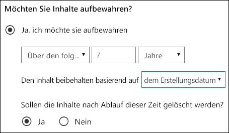
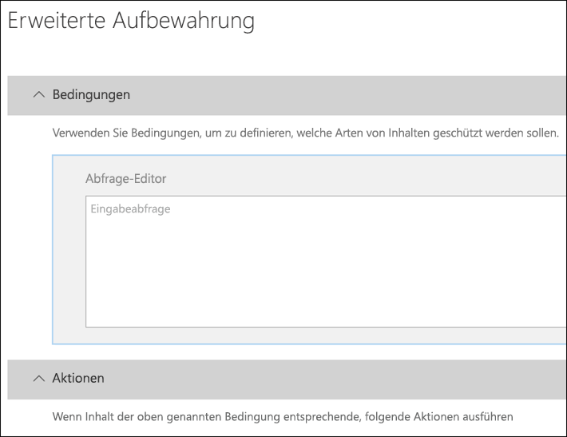
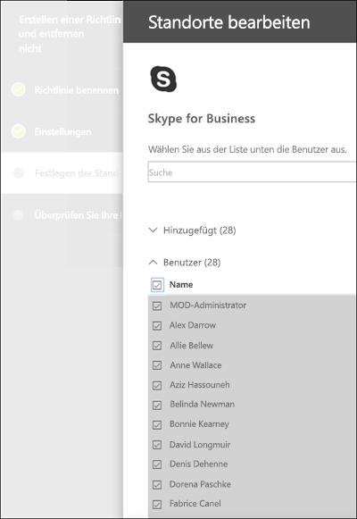
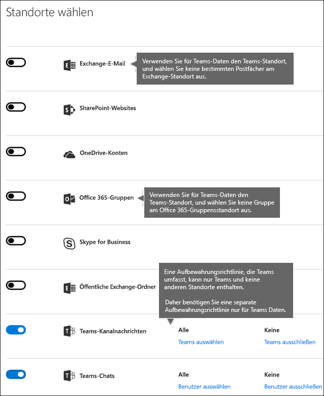
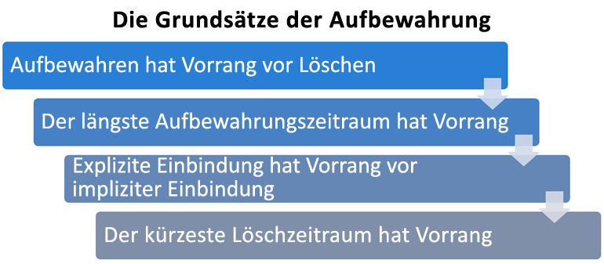

# Übersicht über Aufbewahrungsrichtlinien

In den meisten Organisationen nimmt die Menge und Komplexität der Daten täglich zu – E-Mails, Dokumente, Chatnachrichten usw. Eine effektive Verwaltung bzw. Governance dieser Informationen ist wichtig, da Sie:
  
- **branchenspezifische Vorschriften und interne Richtlinien einhalten müssen**, nach denen Inhalte für eine bestimmte Mindestdauer aufzubewahren sind – z. B. müssen Sie gemäß dem Sarbanes-Oxley Act möglicherweise bestimmte Arten von Inhalten über sieben Jahre lang aufbewahren. 
    
- **das Risiko bei Rechtsstreitigkeiten oder einer Sicherheitsverletzung reduzieren müssen**, indem Sie alte Inhalte, die Sie nicht mehr aufbewahren müssen, endgültig löschen. 
    
- **Ihrer Organisation dabei helfen müssen, effektiven Wissensaustausch zu betreiben und agiler zu werden**, indem Sie sicherstellen, dass die Benutzer nur mit Inhalten arbeiten, die aktuell und für sie relevant sind. 
    
Eine Aufbewahrungsrichtlinie kann Ihnen dabei helfen, alle diese Ziele zu erreichen. Das Verwalten von Inhalten macht häufig zwei Aktionen erforderlich:
  
- **Aufbewahrung** von Inhalten, sodass sie nicht vor dem Ende des Aufbewahrungszeitraums dauerhaft gelöscht werden 
    
- **Endgültiges Löschen** von Inhalten am Ende des Aufbewahrungszeitraums. 
    
Mit einer Aufbewahrungsrichtlinie können Sie:
  
- proaktiv entscheiden, ob Inhalte aufbewahrt, gelöscht oder beides, also aufbewahrt und dann gelöscht werden sollen.
    
- eine einzelne Richtlinie auf die gesamte Organisation oder auf bestimmte Speicherorte oder Benutzer anwenden.
    
- eine Richtlinie auf alle Inhalte oder auf bestimmte Kriterien erfüllende Inhalte anwenden, z. B. auf Inhalte, die bestimmte Schlüsselwörter oder [bestimmte Arten von vertraulichen Informationen](what-the-sensitive-information-types-look-for.md) enthalten.
    
Wenn Inhalte einer permanenten Richtlinie unterliegen, können Benutzer den Inhalt weiterhin bearbeiten und verwenden, als hatte sich nichts geändert, da der Inhalt an seinem ursprünglichen Speicherort beibehalten wird. Falls Inhalte, die der Richtlinie unterliegen, jedoch bearbeitet oder gelöscht werden, wird eine Kopie an einem sicheren Standort gespeichert, an dem sie beibehalten wird, solange die Richtlinie gilt.
  
Schließlich müssen einige Organisationen Vorschriften einhalten, wie zum Beispiel die Rule 17a-4 der Securities and Exchange Commission (SEC), nach der eine Aufbewahrungsrichtlinie nach dem Aktivieren nicht deaktiviert oder weniger restriktiv eingestellt werden darf. Um diese Anforderung zu erfüllen, können Sie die Erhaltungssperre verwenden. Nachdem eine Richtlinie gesperrt wurde, kann niemand (auch nicht ein Administrator) die Richtlinie deaktivieren oder weniger restriktiv einstellen.
  
Sie erstellen und verwalten Aufbewahrungsrichtlinien auf der:

- Seite **Richtlinien** im [Microsoft 365 Compliance Center](https://compliance.microsoft.com/).
- Seite **Aufbewahrung** unter **Informationsgovernance** im [Office 365 Security&amp; Compliance Center](https://protection.office.com/).
  
## Funktionsweise einer Aufbewahrungsrichtlinie mit Inhalten

Wenn Sie einen Speicherort, z. B. eine Website oder ein Postfach in eine Aufbewahrungsrichtlinie einschließen, verbleibt der Inhalt an seinem ursprünglichen Speicherort. Benutzer können weiter mit ihren Dokumenten oder E-Mails arbeiten, als ob sich nichts geändert hätte. Wenn sie jedoch Inhalte bearbeiten oder löschen, die von der Richtlinie abgedeckt sind, wird eine Kopie des Inhalts in seinem Zustand zum Zeitpunkt der Anwendung der Richtlinie beibehalten.
  
Für SharePoint-Websitesammlungen wird eine Kopie des ursprünglichen Inhalts im permanenten Dokumentarchiv beibehalten, wenn Benutzer diesen bearbeiten oder löschen. Bei E-Mails und öffentlichen Ordnern wird die Kopie im Ordner „Wiederherstellbare Elemente“ aufbewahrt. Diese sicheren Speicherorte und die aufbewahrten Inhalte werden den meisten Benutzern nicht angezeigt. Mit einer Aufbewahrungsrichtlinie müssen Benutzer nicht einmal wissen, dass ihre Inhalte der Richtlinie unterliegen.
  
Hinweise:
  
- Teams (Chat)-Inhalte werden in Exchange gespeichert und die Richtlinie basierend auf dem Nachrichtentyp (E-Mail oder Unterhaltung) angewendet.
    
- Eine auf eine Office 365-Gruppe angewendete Aufbewahrungsrichtlinie umfasst sowohl das Gruppenpostfach als auch die Website.

- Das permanente Dokumentarchiv verbraucht Speicherkontingent für die Website.
    
### Inhalte in OneDrive-Konten und SharePoint-Websites

Eine Aufbewahrungsrichtlinie wird auf der Ebene einer Websitesammlung angewendet. Wenn Sie eine SharePoint-Websitesammlung oder ein OneDrive-Konto in eine Aufbewahrungsrichtlinie einschließen, wird ein permanentes Dokumentarchiv erstellt, sofern nicht bereits ein solches vorhanden ist. Sie können diese Bibliothek auf der Seite **Websiteinhalte** der Website auf oberster Ebene der Websitesammlung anzeigen. Die meisten Benutzer können das permanente Dokumentarchiv nicht anzeigen, da es nur für Websitesammlungsadministratoren sichtbar ist.
  
Wenn ein Benutzer versucht, den Inhalt einer Website, die einer Aufbewahrungsrichtlinie unterliegt, zu ändern oder zu löschen, überprüft die Aufbewahrungsrichtlinie zunächst, ob der Inhalt seit Anwendung der Richtlinie geändert wurde. Wenn dies die erste Änderung seit Anwendung der Richtlinie ist, kopiert die Aufbewahrungsrichtlinie den Inhalt in das permanente Dokumentarchiv und ermöglicht dem Benutzer anschließend das Ändern oder Löschen des ursprünglichen Inhalts. Alle Inhalte der Websitesammlung können auch dann in das permanente Dokumentarchiv kopiert werden, wenn der Inhalt der Abfrage, die von der Aufbewahrungsrichtlinie verwendet wird, nicht entspricht.
  
In diesem Fall bereinigt ein Zeitgeberauftrag das permanente Dokumentarchiv. Der Zeitgeberauftrag wird in regelmäßigen Abständen ausgeführt und vergleicht sämtliche Inhalte im permanenten Dokumentarchiv mit allen Abfragen, die von den Aufbewahrungsrichtlinien für die Website verwendet werden. Fall der Inhalt nicht mindestens einer der Abfragen entspricht, löscht der Zeitgeberauftrag den Inhalt dauerhaft aus dem permanenten Dokumentarchiv.
  
Das gilt auch für Inhalte, die bei Anwendung der Aufbewahrungsrichtlinien vorhanden sind. Außerdem werden alle neuen Inhalte, die erstellt oder der Websitesammlung hinzugefügt werden, nachdem sie in die Richtlinie eingeschlossen wurden, auch nach dem Löschen beibehalten. Neue Inhalte werden allerdings nicht bei der ersten Bearbeitung in das permanente Dokumentarchiv kopiert, sondern nur, wenn sie gelöscht werden. Um alle Versionen einer Dateien beizubehalten, müssen Sie die Versionsverwaltung aktivieren – siehe dazu den nachstehenden Abschnitt zur Versionsverwaltung.
  
Beachten Sie, dass ein Benutzer eine Fehlermeldung erhält, wenn er versucht, Bibliotheken, Listen, Ordner oder Websites zu löschen, für die eine Aufbewahrungsrichtlinie gilt. Ein Benutzer kann einen Ordner löschen, wenn er zuerst Dateien im Ordner verschiebt oder löscht, die der Richtlinie unterliegen. Außerdem wird das permanente Dokumentarchiv nur erstellt, sobald das erste Element in das Archiv kopiert werden muss, und nicht, wenn Sie die Aufbewahrungsrichtlinie erstellen. Zum Testen Ihrer Richtlinie müssen Sie daher zuerst ein Dokument in einer Website bearbeiten oder löschen, die der Richtlinie unterliegt, und dann zum permanenten Dokumentarchiv gehen, um die aufbewahrte Kopie anzuzeigen.
  
Nachdem einem OneDrive-Konto oder einer SharePoint-Website eine Aufbewahrungsrichtlinie zugewiesen wurde, können Inhalte einem von zwei Pfaden folgen:

  
1. **Wenn der Inhalt während des Aufbewahrungszeitraums geändert oder gelöscht wird**, wird eine Kopie des ursprünglichen Inhalts in der beim Zuweisen der Richtlinie vorhandenen Form im permanenten Dokumentarchiv erstellt. Dort wird in regelmäßigen Abständen ein Zeitgeberauftrag ausgeführt, der Elemente identifiziert, deren Aufbewahrungszeitraum abgelaufen ist. Diese Elemente werden in den endgültigen Papierkorb verschoben, von wo sie nach Ablauf von 93 Tagen dauerhaft gelöscht werden. Der endgültige Papierkorb wird den Endbenutzern nicht angezeigt (sie sehen nur den Standardpapierkorb), Websitesammlungsadministratoren können hingegen dessen Inhalte anzeigen und wiederherstellen.

    > [!NOTE]
    > Wir haben kürzlich die Art und Weise, wie Inhalte aus dem permanenten Dokumentarchiv gelöscht werden, geändert. Um versehentlichem Datenverlust vorzubeugen, werden Inhalte nicht mehr dauerhaft aus dem permanenten Dokumentarchiv gelöscht. Stattdessen werden Inhalte nur aus dem Papierkorb dauerhaft gelöscht, sodass nun sämtliche Inhalte aus dem permanenten Dokumentarchiv den endgültigen Papierkorb durchlaufen werden.
    
2. **Wenn der Inhalt während des Aufbewahrungszeitraums nicht geändert oder gelöscht wird**, wird er am Ende des Aufbewahrungszeitraums in den Standardpapierkorb verschoben. Wenn ein Benutzer den Inhalt dort löscht oder diesen Papierkorb leert (auch als Aufräumen bekannt), wird das Dokument in den endgültigen Papierkorb verschoben. Der Standard- und der endgültige Papierkorb umfassen zusammen einen Aufbewahrungszeitraum von 93 Tagen. Am Ende dieser 93 Tage wird das Dokument dauerhaft von seinem jeweiligen Aufbewahrungsort gelöscht, entweder im Standard- oder im endgültigen Papierkorb. Der Papierkorb wird nicht indiziert und somit werden Inhalte bei Suchvorgängen dort nicht gefunden. Das bedeutet, dass ein eDiscovery-Archiv keine Inhalte im Papierkorb finden kann, um diese zu archivieren. 
    
### Inhalte in Postfächern und öffentlichen Ordnern

Für die E-Mails, den Kalender und andere Elemente eines Benutzers wird eine Aufbewahrungsrichtlinie auf Postfachebene angewendet. Für einen öffentlichen Ordner wird eine Aufbewahrungsrichtlinie auf Ordnerebene angewendet, nicht auf Postfachebene. Ein Postfach und ein öffentlicher Ordner verwenden beide den Order „Wiederherstellbare Elemente“, um Elemente beizubehalten. Nur Personen, denen eDiscovery-Berechtigungen zugewiesen wurden, können den Ordner „Wiederherstellbare Elemente“ eines anderen Benutzers anzeigen.
  
Standardmäßig wird eine Nachricht, die von einem Benutzer aus einem anderen Ordner als dem Ordner "Gelöschte Elemente" gelöscht wird, in den Ordner "Gelöschte Elemente" verschoben. Wenn ein Benutzer ein Element aus dem Ordner "Gelöschte Elemente" löscht, wird die Nachricht in den Ordner "Wiederherstellbare Elemente" verschoben. Außerdem kann ein Benutzer ein Element in einem Ordner mit UMSCHALT+ENTF löschen. Auf diese Weise wird der Ordner "Gelöschte Elemente" umgangen und das Element direkt in den Ordner "Wiederherstellbare Elemente" verschoben.
  
Ein Prozess bewertet die Elemente im Ordner "Wiederherstellbare Elemente" in regelmäßigen Abständen. Wenn ein Element den Regeln mindestens einer Aufbewahrungsrichtlinie nicht entspricht, wird das Element endgültig aus dem Ordner "Wiederherstellbare Elemente" gelöscht (wird auch als endgültiges Löschen bezeichnet).
  
Wenn ein Benutzer versucht, bestimmte Eigenschaften eines Postfachelements zu ändern – zum Beispiel Betreff, Text, Anhänge, Sender und Empfänger oder Sende- bzw. Empfangsdatum einer Nachricht – wird eine Kopie des ursprünglichen Elements im Ordner "Wiederherstellbare Elemente" gespeichert, bevor die Änderung übernommen wird. Diese Aktion findet für alle nachfolgenden Änderungen statt. Am Ende des Aufbewahrungszeitraums werden Kopien im Ordner "Wiederherstellbare Elemente" endgültig gelöscht.
  
Wenn ein Benutzer das Unternehmen verlässt und sein Postfach von einer Aufbewahrungsrichtlinie abgedeckt ist, wird das Postfach ein inaktives Postfach, sobald das Office 365-Konto des Benutzers gelöscht wird. Die Inhalte eines inaktiven Postfachs unterliegen weiterhin der Aufbewahrungsrichtlinie, die dem Postfach zugewiesen wurde, bevor es inaktiv wurde, und die Inhalte sind über eine eDiscovery-Suche verfügbar. Weitere Informationen finden Sie unter [Inaktive Postfächer in Exchange Online](inactive-mailboxes-in-office-365.md).
  
Nachdem einem Postfach oder einem öffentlichen Ordner eine Aufbewahrungsrichtlinie zugewiesen wurde, können Inhalte einem von zwei Pfaden folgen:

1. **Wenn das Element während des Aufbewahrungszeitraums vom Benutzer geändert oder dauerhaft gelöscht wird** (entweder per UMSCHALT + ENTF oder aus gelöschte Elemente gelöscht), wird das Element in den Ordner "Wiederherstellbare Elemente" verschoben (oder, im Fall der Bearbeitung, kopiert). Dort wird in regelmäßigen Abständen ein Vorgang ausgeführt, der Elemente identifiziert, deren Aufbewahrungszeitraum abgelaufen ist, und diese Elemente werden innerhalb von 14 Tagen nach Ende des Aufbewahrungszeitraums dauerhaft gelöscht. Beachten Sie, dass die Standardeinstellung 14 Tage beträgt, aber es können auch 30 Tage eingestellt werden.
    
2. **Wenn das Element während des Aufbewahrungszeitraums nicht geändert oder gelöscht wird**, wird derselbe Prozess in regelmäßigen Abständen für alle Ordner im Postfach ausgeführt, und es werden Elemente identifiziert, deren Aufbewahrungszeitraum abgelaufen ist. Diese Elemente werden innerhalb von 14 Tagen nach Ende des Aufbewahrungszeitraums dauerhaft gelöscht. Beachten Sie, dass 14 Tage die Standardeinstellung ist, die aber auf bis zu 30 Tage festgelegt werden kann. 
    
## Funktionsweise einer Aufbewahrungsrichtlinie mit Dokumentversion in einer Websitesammlung

Die Versionsverwaltung ist ein Feature aller Dokumentbibliotheken in SharePoint Online und in OneDrive for Business. Standardmäßig werden bei der Versionsverwaltung mindestens 500 Hauptversionen beibehalten, Sie können diese Beschränkung jedoch erhöhen. Weitere Informationen finden Sie unter [Aktivieren und Konfigurieren der Versionsverwaltung für eine Liste oder Bibliothek](https://support.office.com/article/1555d642-23ee-446a-990a-bcab618c7a37).
  
Eine Aufbewahrungsregelung (Aufbewahrungsrichtlinie, im Rahmen derer Inhalte nicht einfach nur gelöscht sondern auch aufbewahrt werden können) umfasst alle Versionen eines Dokuments in einer SharePoint-Websitesammlung oder einem OneDrive-Konto. Jedes Mal, wenn ein Dokument, das einer Aufbewahrungsregelung untersteht, bearbeitet wird, wird die bestehende Version des Dokuments in das permanente Dokumentarchiv kopiert und dort aufbewahrt. Jedes Mal, wenn ein Dokument, das einer Aufbewahrungsregelung untersteht, gelöscht wird, werden alle bestehenden Versionen in das permanente Dokumentarchiv kopiert. Vorrausetzung hierfür ist, dass die Versionsverwaltung aktiviert sein muss. Jede Version eines Dokuments im permanenten Dokumentarchiv bleibt in ihrem jeweiligen Aufbewahrungszeitraum als eigenständiges Element bestehen:
  
- Wenn die Aufbewahrungsrichtlinie darauf basiert, wann der Inhalt erstellt wurde, verfügt jede Version über das gleiche Ablaufdatum wie das ursprüngliche Dokument. Das ursprüngliche Dokument und dessen Versionen laufen gleichzeitig ab.
    
- Wenn die Aufbewahrungsrichtlinie darauf basiert, wann der Inhalt zuletzt geändert wurde, verfügt jede Version über ein eigenes Ablaufdatum basierend auf dem Zeitpunkt der Änderung des ursprünglichen Dokuments, aus der diese Version hervorgegangen ist. Die Originaldokumente und deren Versionen laufen unabhängig voneinander ab.

> [!NOTE]
> Aufbewahrte Versionen von SharePoint- und OneDrive-Dokumenten lassen sich nicht mithilfe von eDiscovery-Tools durchsuchen.

## Aufbewahren von Inhalten für einen bestimmten Zeitraum

Mit einer Aufbewahrungsrichtlinie können Sie Inhalte zeitlich unbegrenzt oder für eine bestimmte Anzahl von Tagen, Monaten oder Jahren aufbewahren. Die Dauer der Aufbewahrung von Inhalten wird anhand des Alters der Inhalte und nicht anhand des Anwendungsdatums der Aufbewahrungsrichtlinie berechnet. Sie können auswählen, ob das Alter auf dem Erstellungsdatum des Inhalts oder (bei OneDrive und SharePoint) auf dem Datum der letzten Änderung basiert.
  
Wenn Sie Inhalte einer Websitesammlung beispielsweise nach ihrer letzten Änderung sieben Jahre lang aufbewahren möchten und ein Dokument in dieser Websitesammlung sechs Jahre lang nicht geändert wurde, wird das Dokument nur noch ein weiteres Jahr aufbewahrt, falls es nicht geändert wird. Falls das Dokument wieder geändert wird, wird das Alter des Dokuments anhand des neuen Datums der letzten Änderung berechnet und weitere sieben Jahre lang aufbewahrt.
  
Ebenso wird, wenn Sie Inhalte in einem Postfach für sieben Jahre aufbewahren möchten, und eine Nachricht wurde vor sechs Jahren gesendet, die Nachricht nur noch ein Jahr lang aufbewahrt. Bei Exchange-Inhalten basiert das Alter immer auf dem Empfangs- oder Sendedatum (diese sind identisch). Das Aufbewahren von Inhalten basierend auf ihrer letzten Änderung gilt nur für Websiteinhalte in OneDrive und SharePoint.
  
Sie können wählen, ob der Inhalt am Ende des Aufbewahrungszeitraums dauerhaft gelöscht werden soll. Mithilfe einer Aufbewahrungsrichtlinie können auch alte Inhalte gelöscht werden, ohne sie aufzubewahren. Informationen dazu finden Sie im nächsten Abschnitt.
  

  
## Löschen von Inhalten, die ein bestimmtes Alter überschritten haben

Eine Aufbewahrungsrichtlinie kann Inhalte sowohl aufbewahren und dann löschen, oder alte Inhalte löschen, ohne sie aufzubewahren.
  
Wenn Ihre Aufbewahrungsrichtlinie Inhalte löscht, ist es wichtig, zu wissen, dass der für eine Aufbewahrungsrichtlinie festgelegte Zeitraum jedes Mal berechnet wird, wenn der betreffende Inhalt erstellt oder geändert wird.
  

  
Nehmen wir zum Beispiel an, dass Sie eine Aufbewahrungsrichtlinie erstellen, nach der Inhalte nach drei Jahren gelöscht werden, und diese Aufbewahrungsrichtlinie dann allen OneDrive-Konten zuweisen, die viele Inhalte enthalten, die vor vier oder fünf Jahren erstellt wurden. In einem solchen Fall werden viele der Inhalte schon bald nach der ersten Zuweisung der Aufbewahrungsrichtlinie gelöscht. Daher kann **eine Aufbewahrungsrichtlinie, nach der Inhalte gelöscht werden, wesentliche Auswirkungen auf Ihre Inhalte haben**. 
  
Daher sollten Sie vor dem erstmaligen Zuweisen einer Richtlinie zu einer Websitesammlung zunächst das Alter des vorhandenen Inhalts und die möglichen Auswirkungen der Richtlinie auf diesen Inhalt bedenken. Sie können außerdem vor dem Zuweisen die Benutzer über die neue Richtlinie informieren, um ihnen Zeit zur Auswertung der möglichen Auswirkungen zu geben. Beachten Sie, dass folgende Warnung erscheint, wenn Sie die Einstellungen für Ihre Aufbewahrungsrichtlinie prüfen, bevor Sie sie erstellen.
  

  
## Erweiterte Einstellungen, nach denen eine Richtlinie nur auf Inhalte angewendet wird, die bestimmte Bedingungen erfüllen.

Eine Aufbewahrungsrichtlinie kann für alle Inhalte an den von ihr abgedeckten Speicherorten gelten, oder Sie können auswählen, eine Aufbewahrungsrichtlinie nur auf Inhalte anzuwenden, die bestimmte Stichwörter oder [bestimmte Arten von vertraulichen Informationen](what-the-sensitive-information-types-look-for.md) enthalten.
  

  
### Aufbewahren von Inhalten, die bestimmte Stichwörter enthalten

Sie können eine Aufbewahrungsrichtlinie ausschließlich auf Inhalte anwenden, die bestimmte Kriterien erfüllen, und dann Aufbewahrungsaktionen nur für diese Inhalte ausführen. Die verfügbaren Bedingungen unterstützen jetzt das Anwenden einer Aufbewahrungsrichtlinie auf Inhalte, die bestimmte Wörter oder Ausdrücke enthalten. Sie können Ihre Abfrage mithilfe von Suchoperatoren wie UND, ODER und NICHT verfeinern. Weitere Informationen zu diesen Operatoren finden Sie unter [Stichwortabfragen und Suchbedingungen für die Inhaltssuche](keyword-queries-and-search-conditions.md).
  
Unterstützung für das Hinzufügen durchsuchbarer Eigenschaften (z. B. **Betreff:**) wird in Kürze verfügbar sein.
  
Die abfragebasierte Aufbewahrung verwendet den Suchindex, um Inhalte zu identifizieren.
  

  
### Aufbewahren von Inhalten, die vertrauliche Informationen enthalten

Sie können eine Aufbewahrungsrichtlinie auch nur auf Inhalte anwenden, die [bestimmte Arten von vertraulichen Informationen](what-the-sensitive-information-types-look-for.md) enthalten. Sie können z. B. eindeutige Aufbewahrungsanforderungen nur auf Inhalte, die personenbezogene Informationen (PII) wie Steuernummern, Sozialversicherungsnummern oder Reisepassnummern enthalten, anwenden.
  

  
Hinweise:
  
- Die erweiterte Aufbewahrung für vertrauliche Informationen gilt nicht für öffentliche Exchange-Ordner oder Skype for Business, da diese Speicherorte keine vertraulichen Informationstypen unterstützen.
    
- Sie sollten wissen, dass in Exchange Online E-Mail-Flussregeln (auch als Transportregeln bezeichnet) zum Identifizieren vertraulicher Informationen verwendet werden, sodass dies nur bei Nachrichten während der Übertragung funktioniert, jedoch nicht für alle Elemente, die bereits in einem Postfach gespeichert sind. Für Exchange Online bedeutet dies, dass mit einer Aufbewahrungsrichtlinie nur für Nachrichten, die **nach** der Richtlinienaktivierung für das Postfach empfangen werden, vertrauliche Informationen identifiziert und Aufbewahrungsaktionen ausgeführt werden können.(Beachten Sie, dass die im vorherigen Abschnitt beschriebene abfragebasierte Aufbewahrung diese Einschränkung nicht aufweist, da zum Identifizieren von Inhalten der Suchindex verwendet wird.) 
    
## Anwenden einer Aufbewahrungsrichtlinie auf eine gesamte Organisation oder bestimmte Speicherorte

Sie können eine Aufbewahrungsrichtlinie ganz einfach auf eine gesamte Organisation, ganze Speicherorte oder nur auf bestimmte Speicherorte oder Benutzer anwenden.
  
### Organisationsweite Richtlinie

Eines der leistungsstärksten Features einer Aufbewahrungsrichtlinie ist, dass sie standardmäßig für Speicherorte in ganz Office 365 gilt, einschließlich:
  
- Exchange-E-Mail
    
- SharePoint-Websitesammlungen
    
- OneDrive-Konten
    
- Office 365-Gruppen (gilt für Inhalte in Postfach, Website, Dokumenten der Gruppe. Unterstützung für Inhalte in Planner, Yammer, CRM Microsoft Teams, PowerBI, Stream, Exchange und SharePoint-Teamwebsites wird in Kürze zur Verfügung stehen.)
    
- Öffentliche Exchange-Ordner
    

  
Weitere wichtige Features einer organisationsweiten Aufbewahrungsrichtlinie sind:
  
- Es gibt keine Beschränkung für die Anzahl der Postfächer oder Websites, die in der Richtlinie enthalten sein können.
    
- Bei Exchange erben alle neuen Postfächer, die nach der Anwendung der Richtlinie erstellt werden, die Richtlinie automatisch.
  
### Eine Richtlinie, die für ganze Speicherorte gilt

Beim Auswählen von Speicherorten können Sie einen ganzen Speicherort (z. B. Exchange-E-Mail- oder OneDrive-Konten) problemlos ein- oder ausschließen. Hierzu müssen Sie den **Status** des entsprechenden Speicherorts aktivieren oder deaktivieren. 
  
Wie auch bei organisationsweiten Richtlinien gilt, dass wenn eine Richtlinie für eine beliebige Kombination aus ganzen Speicherorten gilt, es keine Beschränkung für die Anzahl der Postfächer oder Websites gibt, die in der Richtlinie enthalten sein können. Wenn eine Richtlinie z. B. alle Exchange-E-Mail-Konten und alle SharePoint-Websites umfasst, werden alle Websites und Postfächer einbezogen, ganz gleich, wie viele es sind. Und bei Exchange erben alle neuen Postfächer, die erstellt werden, nachdem die Richtlinie angewendet wurde, die Richtlinie automatisch.
 

  
### Eine Richtlinie mit bestimmten eingeschlossenen oder ausgeschlossenen Elementen

Sie können eine Aufbewahrungsrichtlinie auch auf bestimmte Benutzer, Office 365-Gruppen, oder Websites anwenden. Schalten Sie zu diesem Zweck den **Status** des entsprechenden Speicherorts an und verwenden Sie dann die Links, um bestimmte Benutzer, Office 365-Gruppen oder Websites ein- oder auszuschließen. 
  
Beachten Sie jedoch, dass die folgenden Grenzwerte für Aufbewahrungsrichtlinien gelten, die mehr als 1.000 bestimmte Speicherorte ein- oder ausschließt:
  
- Eine Aufbewahrungsrichtlinie kann nicht mehr als 1.000 Postfächer und 100 Websitesammlungen umfassen.
    
- Ein Mandant kann nicht mehr als 10.000 Aufbewahrungsrichtlinien umfassen.
    
Beachten Sie, dass Sie diese Grenzwerte überschreiten können, indem Sie entweder eine organisationsübergreifende Richtlinie oder eine Richtlinie, die für ganze Speicherorte gilt, anwenden.
  
### Skype-Speicherorte

Im Gegensatz zu Exchange-E-Mails kann der Status des Skype-Speicherorts nicht einfach aktiviert werden, um alle Benutzer einzuschließen. Sie können diesen Speicherort jedoch aktivieren und dann manuell die Benutzer auswählen, deren Unterhaltungen Sie aufbewahren möchten.
  
Wenn Sie Skype for Business-Benutzer auswählen, können Sie schnell alle Benutzer hinzufügen, indem Sie in der Spaltenüberschrift das Feld **Name** auswählen. Es ist jedoch wichtig zu wissen, dass jeder Benutzer als ein bestimmtes eingeschlossenes Element in der Richtlinie zählt. Wenn Sie also mehr als 1.000 Benutzer einschließen, gelten die im vorherigen Abschnitt angegebenen Grenzwerte. Wenn hier alle Skype-Benutzer ausgewählt werden, entspricht dies nicht dem standardmäßigen Einschließen aller Skype-Benutzer mithilfe einer organisationsübergreifenden Richtlinie. 
  

  
Beachten Sie, dass **Aufgezeichnete Unterhaltungen**, ein Ordner in Outlook, ein Feature ist, das nichts mit Skype-Archivierung zu tun hat. **Aufgezeichnete Unterhaltungen** kann vom Endbenutzer deaktiviert werden, Archivierung für Skype erfolgt jedoch durch das Speichern einer Kopie von Skype-Verbindungen in einem ausgeblendeten Ordner, auf den der Benutzer nicht zugreifen kann, der aber für eDiscovery verfügbar ist.

### Team-Speicherorte

Sie können eine Aufbewahrungsrichtlinie nutzen, um Chats und Kanalnachrichten in Teams aufzubewahren. Teams-Chats sind in einem ausgeblendeten Ordner im Postfach jedes Benutzers im Chat enthalten, und Teams-Kanalnachrichten werden in einem ähnlichen ausgeblendeten Ordner im Gruppenpostfach des Teams gespeichert. Es ist jedoch wichtig zu wissen, dass Teams einen von Azure unterstützten Chat-Dienst nutzt, der diese Daten ebenfalls speichert, und dieser Dienst speichert die Daten standardmäßig auf unbestimmte Zeit. Aus diesem Grund wird dringend empfohlen, dass Sie den Teams-Speicherort nutzen, um Teams-Daten aufzubewahren und zu löschen. Durch die Nutzung des Teams-Speicherorts werden Daten aus den Exchange-Postfächern und dem zugrunde liegenden von Azure unterstützten Chat-Dienst endgültig gelöscht. Weitere Informationen finden Sie unter [Übersicht über Sicherheit und Compliance in Microsoft Teams](https://go.microsoft.com/fwlink/?linkid=871258).
  
Aufbewahrungsrichtlinien, die auf Benutzer- oder Gruppenpostfächer in den Speicherorten von Exchange oder Office 365-Gruppen angewendet wurden, wirken sich nicht auf Microsoft Teams-Chats und -Kanalnachrichten aus. Auch wenn Microsoft Teams-Chats und -Kanalnachrichten in Exchange gespeichert werden, sind sie nur von Aufbewahrungsrichtlinien betroffen, die auf den Teams-Speicherort angewendet werden.

> [!NOTE]
> Wenn ein Benutzer in eine aktive Aufbewahrungsrichtlinie zur Aufbewahrung von Teams-Daten einbezogen ist, dann ist das Löschen des Postfachs dieses Benutzers nicht erlaubt, da die Speicherung der Daten beibehalten werden muss. Wenn Sie ein Postfach eines solchen Benutzers löschen möchten, muss der Administrator den Benutzer zuerst von der Aufbewahrungsrichtlinie ausschließen.
  
Nachdem einem Team eine Aufbewahrungsrichtlinie zugewiesen wurde, können Chat- und Kanalnachrichten einem von zwei Pfaden folgen:

1. **Wenn eine Chat- oder Kanalnachricht während des Aufbewahrungszeitraums vom Benutzer geändert oder gelöscht wird**, wird die Nachricht in den Ordner "SubstrateHolds" (ein ausgeblendeter Ordner in jedem Benutzer- oder Gruppenpostfach) verschoben bzw. bei Änderungen kopiert und bis zum Ablauf des Aufbewahrungszeitraums dort gespeichert. Nachrichten werden am Tag des Ablaufs des Aufbewahrungszeitraums dauerhaft gelöscht.

2. **Wenn eine Chat- oder Kanalnachricht während des Aufbewahrungszeitraums nicht gelöscht wird**, wird die Nachricht innerhalb eines Tages nach Ablauf des Aufbewahrungszeitraums in den Ordner "SubstrateHolds" verschoben (dies erfolgt innerhalb 0 bis 24 Stunden). Die Nachricht wird einen Tag, nachdem sie in den Ordner "SubstrateHolds" verschoben wurde, dauerhaft gelöscht. 

> [!NOTE]
> Nachrichten im Ordner "SubstrateHolds" können mit eDiscovery-Tools durchsucht werden. Nachdem eine Nachricht dauerhaft gelöscht wurde, wird sie nicht mehr in eDiscovery-Suchen zurückgegeben.

Wir arbeiten kontinuierlich an der Optimierung der Aufbewahrungsfunktionen in Microsoft Teams und planen, in den kommenden Monaten neue Features bereitzustellen. In der Zwischenzeit gibt es einige Beschränkungen, die Sie beachten müssen:
  
- **Microsoft Teams erfordern eine separate Aufbewahrungsrichtlinie**. Wenn Sie eine Aufbewahrungsrichtlinie erstellen und den Teams-Speicherort aktivieren, werden alle anderen Speicherorte deaktiviert. Eine Aufbewahrungsrichtlinie, die Microsoft Teams umfasst, darf nur Teams und keine anderen Speicherorte betreffen. 
    
- **Microsoft Teams ist nicht in einer organisationsweiten Richtlinie eingeschlossen**. Wenn Sie eine organisationsweite Richtlinie erstellen, ist Microsoft Teams nicht eingeschlossen, da es eine separate Aufbewahrungsrichtlinie erfordert. 
    
- **Microsoft Teams unterstützt nicht die erweiterte Archivierung**. Wenn Sie eine Aufbewahrungsrichtlinie erstellen und die [Erweiterten Einstellungen auswählen, nach denen eine Richtlinie nur auf Inhalte angewendet wird, die bestimmten Kriterien entsprechen](#advanced-settings-that-apply-a-policy-only-to-content-that-meets-certain-conditions), ist der Teams-Speicherort nicht verfügbar. Derzeit betrifft die Aufbewahrung in Microsoft Teams alle Chat- und Kanalnachrichteninhalte. 

- **Microsoft Teams-Inhalte in privaten Kanälen werden nicht unterstützt**. Zu diesem Zeitpunkt gelten für Microsoft Teams erstellte Aufbewahrungsrichtlinien nicht für Nachrichten in privaten Kanälen. Nur Nachrichten in Standardkanälen unterliegen einer für Microsoft Teams erstellten Aufbewahrungsrichtlinie. Die Unterstützung von Aufbewahrungsrichtlinien für private Kanäle wird in Kürze verfügbar sein. 
    
- **Es kann bis zu drei Tage dauern, bis abgelaufene Nachrichten in Microsoft Teams gelöscht sind**. Eine auf Microsoft Teams angewendete Aufbewahrungsrichtlinie löscht Chat- und Kanalnachrichten, wenn der entsprechende Aufbewahrungszeitraum abgelaufen ist. Es kann jedoch bis zu drei Tage dauern, bis diese Nachrichten bereinigt und dauerhaft gelöscht sind. Außerdem können Chat- und Kanalnachrichten mit eDiscovery-Tools nach Ablauf des Aufbewahrungszeitraums und nach deren dauerhafter Löschung durchsucht werden.

   > [!NOTE]
   > Es stimmte zwar, dass eine Aufbewahrungsrichtlinie keine Microsoft Teams-Inhalte löschen konnte, die weniger als 30 Tage alt waren, wir haben diese Einschränkung jedoch aufgehoben. Jetzt kann der Aufbewahrungszeitraum für Microsoft Teams-Inhalte eine beliebige Anzahl von Tagen umfassen, auch nur einen einzigen Tag. Bei einem Aufbewahrungszeitraum von nur einem Tag dauert es bis zu drei Tage nach Ablauf dieses Zeitraums, bevor Nachrichten endgültig gelöscht werden.
    
In einem Team werden in einem Chat freigegebene Dateien im OneDrive-Konto des Benutzers gespeichert, der sie freigegeben hat. In Kanäle hochgeladene Dateien werden auf der SharePoint-Website für das Team gespeichert. Wenn Sie also Dateien in einem Team behalten oder löschen möchten, müssen Sie eine Aufbewahrungsrichtlinie erstellen, die insbesondere auf die SharePoint- und OneDrive-Speicherorte angewendet wird. Wenn Sie eine Richtlinie nur auf die Dateien eines bestimmten Teams anwenden möchten, können Sie die SharePoint-Website für das Team und die OneDrive-Konten der Benutzer im Team auswählen.
  
Eine Aufbewahrungsrichtlinie, die für Teams gilt, kann die [Erhaltungssperre](#locking-a-retention-policy) nutzen.
  

  
> [!NOTE]
> Wenn Sie Aufbewahrungsrichtlinien für Skype- oder Microsoft Teams-Speicherorte in Ihrer Organisation erstellen, wird eine dieser Richtlinien als Standard-Ordnerrichtlinie angezeigt, wenn ein Benutzer die Eigenschaften eines Postfachordners im Outlook Desktop-Client einsieht. Hierbei handelt es sich um ein Anzeigeproblem in Outlook und [ein bekanntes Problem](https://support.microsoft.com/help/4491013/outlook-client-displays-teams-or-skype-for-business-retention-policies). Als Standard-Ordnerrichtlinie sollte die Aufbewahrungsrichtlinie für Postfächer, die für den Ordner gilt, angezeigt werden. Die Aufbewahrungsrichtlinie für Skype oder Microsoft Teams wird nicht auf das Postfach des Benutzers angewendet.  

### Speicherorte von Office 365-Gruppen

Wenn Sie Inhalte für eine Office 365-Gruppe behalten möchten, müssen Sie den Speicherort der Office 365-Gruppen verwenden. Obwohl eine Office 365-Gruppe über ein Exchange-Postfach verfügt, schließt eine Aufbewahrungsrichtlinie, die den gesamten Exchange-Speicherort umfasst, keine Inhalte in Office 365-Gruppenpostfächern ein. Eine auf eine Office 365-Gruppe angewendete Aufbewahrungsrichtlinie umfasst sowohl das Gruppenpostfach als auch die Website. Eine auf eine Office 365-Gruppe angewendete Aufbewahrungsrichtlinie schützt die Ressourcen, die von einer Office 365-Gruppe erstellt wurde. Das umfasst ggf. auch Microsoft Teams.

Außerdem ist es nicht möglich, den Exchange-Speicherort für den Ein- oder Ausschluss eines bestimmten Gruppenpostfachs zu verwenden. Obwohl der Exchange-Speicherort zunächst die Auswahl eines Gruppenpostfachs zulässt, erhalten Sie beim Versuch, die Aufbewahrungsrichtlinie zu speichern, die Fehlermeldung, dass "RemoteGroupMailbox" keine gültige Auswahl für den Exchange-Speicherort ist. 

## Ausschließen von bestimmten Typen von Exchange-Elementen aus einer Aufbewahrungsrichtlinie
Indem Sie PowerShell verwenden, können Sie bestimmte Typen von Exchange-Elementen aus einer Aufbewahrungsrichtlinie ausschließen. Sie können z. B. Sprachnachrichten, Chatnachrichten und andere Skype for Business Online-Inhalte in Postfächern ausschließen. Sie können auch Kalender-, Notiz- und Aufgabenelemente ausschließen. Diese Funktion ist nur mit PowerShell verfügbar. Es ist nicht auf der Benutzeroberfläche verfügbar, wenn Sie eine Aufbewahrungsrichtlinie erstellen.
  
Zu diesem Zweck verwenden Sie den `ExcludedItemClasses` Parameter von der `New-RetentionComplianceRule` und `Set-RetentionComplianceRule` Cmdlets. Weitere Informationen zu PowerShell finden Sie weiter unten im Abschnitt [Die PowerShell-Cmdlets für Aufbewahrungsrichtlinien finden](#find-the-powershell-cmdlets-for-retention-policies).

## Sperren einer Aufbewahrungsrichtlinie
Einige Organisationen müssen Regeln einhalten, die von Behörden definiert werden, wie zum Beispiel die Rule 17a-4 der Securities And Exchange Commission (SEC), die erfordert, dass eine Aufbewahrungsrichtlinie nach dem Aktivieren nicht deaktiviert oder weniger restriktiv eingestellt werden kann. Mit der Aufbewahrungssperre können Sie die Richtlinie sperren, sodass niemand – auch nicht der Administrator – die Richtlinie deaktivieren oder weniger restriktiv einstellen kann.
  
Nach dem Sperren einer Richtlinie kann sie von niemandem deaktiviert werden. Außerdem können keine Speicherorte aus der Richtlinie entfernt werden. Darüber hinaus ist es nicht möglich, Inhalte zu ändern oder zu löschen, die während des Aufbewahrungszeitraums der Richtlinie unterliegen. Nach dem Sperren der Richtlinie können Sie die Richtlinie nur ändern, indem Sie Inhalte hinzufügen oder die Dauer verlängern. Eine gesperrte Richtlinie kann vergrößert oder verlängert werden kann, kann jedoch nicht verkleinert oder deaktiviert werden.
  
Aus diesem Grund müssen Sie sich vor der Sperrung einer Aufbewahrungsrichtlinie **unbedingt** einen genauen Überblick über die Compliance-Anforderungen Ihrer Organisation verschaffen. Sie **dürfen eine Richtlinie auf keinen Fall sperren**, bevor Sie sich absolut sicher sind, dass dies notwendig ist.

### Sperren einer Aufbewahrungsrichtlinie mit PowerShell
  
Sie können eine Aufbewahrungsrichtlinie nur mithilfe von PowerShell sperren.

Stellen Sie [zunächst eine Verbindung mit Office 365 Security & Compliance Center PowerShell her](https://docs.microsoft.com/powershell/exchange/office-365-scc/connect-to-scc-powershell/connect-to-scc-powershell?view=exchange-ps).

Führen Sie dann zum Anzeigen einer Liste von Aufbewahrungsrichtlinien und Suchen nach dem Namen der Richtlinie, die Sie sperren möchten, den Befehl `Get-RetentionCompliancePolicy` aus.

Um eine Aufbewahrungssperre zu einer Aufbewahrungsrichtlinie hinzuzufügen, führen Sie den Befehl `Set-RetentionCompliancePolicy` aus, und legen Sie dabei den `RestrictiveRetention`-Parameter auf „true“ fest. Zum Beispiel:

`Set-RetentionCompliancePolicy -Identity “<Name of Policy>” – RestrictiveRetention $true`

Nachdem Sie das Cmdlet ausgeführt haben, werden Sie zur Bestätigung aufgefordert. Wählen Sie **Ja für alle** aus.

Eine Aufbewahrungssperre wird jetzt zur Aufbewahrungsrichtlinie hinzugefügt. Wenn Sie `Get-RetentionCompliancePolicy`ausführen, legen Sie den Parameter `RestrictiveRetention`auf "true" fest. Zum Beispiel:

`Get-RetentionCompliancePolicy -Identity “<Name of Policy>” |Fl`

  
## Aufheben einer Aufbewahrungsrichtlinie

Sie können eine Aufbewahrungsrichtlinie jederzeit deaktivieren oder löschen. In diesem Fall werden bis dahin im permanentes Dokumentarchiv aufbewahrte SharePoint- oder OneDrive-Inhalte nicht sofort und dauerhaft gelöscht. Um versehentlichem Datenverlust vorzubeugen, gibt es nun eine Nachfrist von 30 Tagen, während der der Inhaltsablauf für diese Richtlinie im permanenten Dokumentarchiv nicht eintritt, sodass Sie Inhalte ggf. wiederherstellen können. Sie können die Aufbewahrungsrichtlinie auch während der Nachfrist erneut aktivieren. In diesem Fall werden keine in Zusammenhang mit dieser Richtlinie stehenden Inhalte gelöscht.

Diese 30-tägige Nachfrist in SharePoint und OneDrive entspricht dem 30-tägigen Anhalten der Aufbewahrungszeit in Exchange. Weitere Informationen finden Sie unter [Verwalten von Postfächern mit angehaltener Aufbewahrungszeit](identify-a-hold-on-an-exchange-online-mailbox.md#managing-mailboxes-on-delay-hold).

## Die Grundsätze der Aufbewahrung, oder was hat Vorrang?

Es ist möglich oder sogar wahrscheinlich, dass auf Inhalte mehrere Aufbewahrungsrichtlinien angewendet werden, die jeweils mit einer anderen Aktion (aufbewahren, löschen oder beides) und einem anderen Aufbewahrungszeitraum verbunden sind. Was hat Vorrang? Ganz allgemein sei gesagt, dass Sie sich sicher sein können, dass Inhalte, die aufgrund einer Richtlinie aufbewahrt werden müssen, nicht von einer anderen Richtlinie dauerhaft gelöscht werden können.
  

  
Um zu verstehen, wie verschiedene Aufbewahrungsrichtlinien auf Inhalte angewendet werden, sollten Sie diese Grundsätze der Aufbewahrung beachten:
  
1. **Aufbewahrung hat Vorrang vor Löschen.** Nehmen wir einmal an, eine Aufbewahrungsrichtlinie gibt an, dass Exchange-E-Mails nach drei Jahren gelöscht werden sollen, und eine andere Aufbewahrungsrichtlinie gibt an, dass Exchange-E-Mails fünf Jahre aufbewahrt und dann gelöscht werden sollen. Alle Inhalte werden, sobald sie drei Jahre alt sind, gelöscht und für den Benutzer ausgeblendet, aber immer noch im Ordner "Wiederherstellbare Elemente" aufbewahrt, bis der Inhalt fünf Jahre alt ist, und dann dauerhaft gelöscht. 
    
2. **Der längste Aufbewahrungszeitraum hat Vorrang.** Wenn Inhalte mehreren Aufbewahrungsrichtlinien unterliegen, bleiben diese bis zum Ende des längsten Aufbewahrungszeitraums erhalten. 
    
3. **Explizite Einbindung hat Vorrang vor impliziter Einbindung.** Das bedeutet Folgendes: 
    
    1. Wenn eine Bezeichnung mit Einstellungen für die Aufbewahrung von einem Benutzer manuell einem Element, z. B. einer Exchange-E-Mail oder einem OneDrive-Dokument, zugewiesen wird, hat diese Bezeichnung sowohl Vorrang vor einer Richtlinie, die auf Website- oder Postfachebene zugewiesen wurde, als auch vor einer Standardbezeichnung, die von der Dokumentbibliothek zugewiesen wurde. Wenn beispielsweise die explizite Bezeichnung eine Aufbewahrung über zehn Jahre angibt, die der Website zugewiesene Richtlinie jedoch eine Aufbewahrung über nur fünf Jahre angibt, hat die Bezeichnung Vorrang. Automatisch zugewiesene Bezeichnungen werden als implizit und nicht explizit angesehen, da sie von Office 365 automatisch angewendet werden.
    
    2. Wenn eine Aufbewahrungsrichtlinie einen bestimmten Speicherort wie das Postfach oder OneDrive for Business-Konto eines bestimmten Benutzers umfasst, hat diese Richtlinie Vorrang vor einer anderen Aufbewahrungsrichtlinie, die für alle Postfächer oder OneDrive for Business-Konten von Benutzern gilt, aber nicht das Postfach dieses Benutzers speziell einschließt.
    
4. **Der kürzeste Löschzeitraum hat Vorrang. ** Ebenso gilt, dass wenn Inhalte mehreren Aufbewahrungsrichtlinien zur Löschung (ohne Aufbewahrung) unterliegen, sie am Ende des kürzesten Aufbewahrungszeitraums gelöscht werden. 
    
Beachten Sie: Wenn die Regeln, die von allen Richtlinien oder Kennzeichnungen angewendet werden, auf einer Ebene identisch sind, bewegt sich der Fluss nach unten zur nächsten Ebene, wo entschieden wird, welche Regel Vorrang hat.
  
Schließlich kann keine Aufbewahrungsrichtlinie oder Kennzeichnung einen Inhalt dauerhaft löschen, der für eDiscovery gesperrt ist. Wenn die Sperre aufgehoben wird, kommt der Inhalt wieder für den oben beschriebenen Bereinigungsprozess infrage.
  
## Verwenden einer Aufbewahrungsrichtlinie anstelle dieser Features

Eine einzelne Aufbewahrungsrichtlinie kann problemlos auf eine gesamte Organisation und Speicherorte in Office 365 angewendet werden. Dazu gehören Exchange Online, SharePoint Online, OneDrive for Business und Office 365-Gruppen. Wenn Inhalte an einer beliebigen Stelle in Office 365 aufbewahrt oder gelöscht werden müssen, empfiehlt sich die Verwendung einer Aufbewahrungsrichtlinie. (Sie können auch Bezeichnungen mit Aufbewahrungseinstellungen verwenden. Weitere Informationen finden Sie unter [Übersicht über Bezeichnungen](labels.md).)
  
Es gibt mehrere andere Features, die zuvor zum Aufbewahren oder Löschen von Inhalten in Office 365 verwendet wurden. Diese sind nachfolgend aufgeführt. Diese Features funktionieren weiterhin Seite an Seite mit Aufbewahrungsrichtlinien und -bezeichnungen. Auf lange Sicht wird im Hinblick auf Informationsgovernance jedoch empfohlen, eine Aufbewahrungsrichtlinie oder Bezeichnungen anstelle dieser Features zu verwenden. Eine Aufbewahrungsrichtlinie ist das einzige Feature, mit dem Inhalte in Office 365 übergreifend aufbewahrt und gelöscht werden können.
  
### Exchange Online

- [Verwalten von eDiscovery-Fällen im Office 365 Security &amp; Compliance Center](https://support.office.com/article/edea80d6-20a7-40fb-b8c4-5e8c8395f6da) (eDiscovery-Sperre) 
    
- [In-Situ-Speicher und Beweissicherungsverfahren](https://go.microsoft.com/fwlink/?linkid=846124) (eDiscovery-Sperre) 

- [Identifizieren des Haltebereichs für ein Exchange Online-Postfach](identify-a-hold-on-an-exchange-online-mailbox.md)
    
- [Aufbewahrungstags und Aufbewahrungsrichtlinien](https://go.microsoft.com/fwlink/?linkid=846125), auch bekannt als [Messaging-Datensatzverwaltung](https://go.microsoft.com/fwlink/?linkid=846126) (Nur Löschen) 
    
### SharePoint Online und OneDrive for Business

- [Verwalten von eDiscovery-Fällen im Office 365 Security &amp; Compliance Center](https://support.office.com/article/edea80d6-20a7-40fb-b8c4-5e8c8395f6da) (eDiscovery-Sperre) 
    
- [Hinzufügen von Inhalten zu einem Fall und temporäres Sperren von Quellen im eDiscovery Center](https://support.office.com/article/54d70de9-1ec2-4325-84f3-aeb588554479) (eDiscovery-Sperre) 
    
- [Übersicht über Dokumentlöschrichtlinien](https://support.office.com/article/55e8d858-f278-482b-a198-2e62d6a2e6e5) (Nur Löschen) 
    
- [Konfiguration von Datensatzverwaltung in situ](https://support.office.com/article/7707a878-780c-4be6-9cb0-9718ecde050a) (Aufbewahrung) 
    
- [Verwenden von Richtlinien für das Schließen und Löschen von Websites](https://support.office.com/article/a8280d82-27fd-48c5-9adf-8a5431208ba5) (Nur Löschen) 
    
- [Informationsverwaltungsrichtlinien](intro-to-info-mgmt-policies.md) (Nur Löschen) 
    
Wenn Sie bisher eines der eDiscovery-Archive zum Zwecke der Informationsgovernance verwendet haben, sollten Sie stattdessen eine Aufbewahrungsrichtlinie für proaktive Compliance verwenden. Verwenden Sie einen Haltebereich nur für eDiscovery.
  
### Aufbewahrungsrichtlinien setzen Informationsverwaltungsrichtlinien außer Kraft

In SharePoint-Websites verwenden Sie für die Aufbewahrung von Inhalten möglicherweise [Informationsverwaltungsrichtlinien](intro-to-info-mgmt-policies.md). Wenn Sie eine Aufbewahrungsrichtlinie auf eine Website anwenden, die für eine Liste oder Bibliothek bereits Inhaltstyp- oder Informationsverwaltungsrichtlinien verwendet, werden diese Richtlinien ignoriert, während die Aufbewahrungsrichtlinie angewendet wird. 
  
## Was ist aus den Erhaltungsrichtlinien geworden?

Wenn Sie bisher eine Erhaltungsrichtlinie verwendet haben, wurde diese Richtlinie automatisch in eine Aufbewahrungsrichtlinie umgewandelt, bei der nur die Aufbewahrungsaktion verwendet wird – mit der Richtlinie werden keine Inhalte gelöscht. Die Erhaltungsrichtlinie funktioniert weiterhin und erhält Ihre Inhalte, ohne dass Sie Änderungen vornehmen müssen. Sie finden diese Richtlinien auf der Seite **Richtlinien** im [Microsoft 365 Compliance Center](https://compliance.microsoft.com/) oder auf der Seite **Aufbewahrung** unter **Informationsgovernance** im [Security&amp; Compliance Center](https://protection.office.com/). Sie können eine Erhaltungsrichtlinie bearbeiten, um den Aufbewahrungszeitraum zu ändern, jedoch keine anderen Änderungen vornehmen, z. B. keine Speicherorte hinzufügen oder entfernen. 
  
## Berechtigungen

Die Mitglieder Ihres Complianceteams, die Aufbewahrungsrichtlinien erstellen sollen, benötigen Berechtigungen für das [Security&amp; Compliance Center](https://protection.office.com/). Standardmäßig hat Ihr Mandantenadministrator Zugriff auf diesen Speicherort und kann anderen Personen den Zugriff auf das [Security &amp; Compliance Center](https://protection.office.com/) gewähren, ohne ihnen alle Berechtigungen eines Mandantenadministrators zu geben. Zu diesem Zweck wird empfohlen, dass Sie zur Seite **Berechtigungen** des [Security &amp; Compliance Centers](https://protection.office.com/) gehen, die Rollengruppe **Compliance-Administrator** bearbeiten und dieser Rollengruppe Mitglieder hinzufügen. 
  
Weitere Informationen finden Sie unter [Gewähren des Zugriffs auf das Office 365 Security & Compliance Center](/security/office-365-security/grant-access-to-the-security-and-compliance-center). 

Diese Berechtigungen sind nur erforderlich, um eine Aufbewahrungsrichtlinie zu erstellen und anzuwenden. Für die Richtlinienerzwingung ist kein Zugriff auf den Inhalt erforderlich.
  
## Die PowerShell-Cmdlets für Aufbewahrungsrichtlinien finden

Wenn Sie die Cmdlets für Aufbewahrungsrichtlinien verwenden möchten, müssen Sie:
  
1. [Eine Verbindung zum Office 365 Security &amp; Compliance Center mithilfe von Remote-PowerShell herstellen](https://go.microsoft.com/fwlink/?LinkID=799771&amp;clcid=0x409)
    
2. Diese [Office 365 Security &amp; Compliance Center-Cmdlets nutzen](https://go.microsoft.com/fwlink/?LinkID=799772&amp;clcid=0x409)
    
## Weitere Informationen

- [Übersicht über Bezeichnungen](labels.md)
- [SharePoint Online-Beschränkungen](https://docs.microsoft.com/office365/servicedescriptions/sharepoint-online-service-description/sharepoint-online-limits)
- [Limits und Spezifikationen für Microsoft Teams](https://docs.microsoft.com/microsoftteams/limits-specifications-teams) 
    
