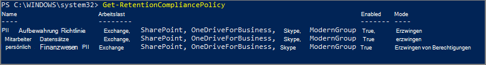
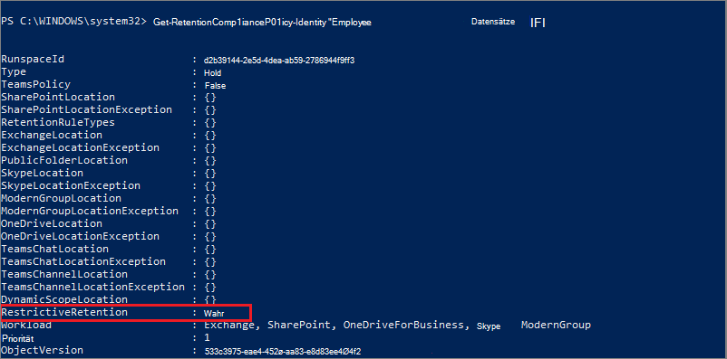

# <a name="use-preservation-lock-to-restrict-changes-to-retention-policies-and-retention-label-policies"></a><span data-ttu-id="dd3cc-103">Verwenden der Erhaltungssperre zum Einschränken von Änderungen an Aufbewahrungsrichtlinien und Aufbewahrungsbezeichnungsrichtlinien</span><span class="sxs-lookup"><span data-stu-id="dd3cc-103">Use Preservation Lock to restrict changes to retention policies and retention label policies</span></span>

><span data-ttu-id="dd3cc-104">*[Microsoft 365-Lizenzierungsleitfaden für Sicherheit und Compliance](https://aka.ms/ComplianceSD).*</span><span class="sxs-lookup"><span data-stu-id="dd3cc-104">*[Microsoft 365 licensing guidance for security & compliance](https://aka.ms/ComplianceSD).*</span></span>

<span data-ttu-id="dd3cc-105">Die Erhaltungssperre sperrt eine Aufbewahrungsrichtlinie oder eine Aufbewahrungsbezeichnungsrichtlinie, sodass niemand – auch nicht ein globaler Administrator – die Richtlinie deaktivieren, löschen oder weniger restriktiv einstellen kann.</span><span class="sxs-lookup"><span data-stu-id="dd3cc-105">Preservation Lock locks a retention policy or retention label policy so that no one—including a global admin—can turn off the policy, delete the policy, or make it less restrictive.</span></span> <span data-ttu-id="dd3cc-106">Diese Konfiguration könnte aufgrund behördlicher Vorschriften erforderlich sein und kann zum Schutz vor übel gesinnten Administratoren beitragen.</span><span class="sxs-lookup"><span data-stu-id="dd3cc-106">This configuration might be needed for regulatory requirements and can help safeguard against rogue administrators.</span></span>

<span data-ttu-id="dd3cc-107">Wenn eine Aufbewahrungsrichtlinie gesperrt ist, hat dies zur Folge:</span><span class="sxs-lookup"><span data-stu-id="dd3cc-107">When a policy for retention is locked:</span></span>

- <span data-ttu-id="dd3cc-108">Keiner kann sie ausschalten</span><span class="sxs-lookup"><span data-stu-id="dd3cc-108">No one can turn it off</span></span>
- <span data-ttu-id="dd3cc-109">Speicherorte können hinzugefügt, aber nicht entfernt werden</span><span class="sxs-lookup"><span data-stu-id="dd3cc-109">Locations can be added but not removed</span></span>
- <span data-ttu-id="dd3cc-110">Der Aufbewahrungszeitraum kann verlängert, jedoch nicht verringert werden.</span><span class="sxs-lookup"><span data-stu-id="dd3cc-110">You can extend a retention period but not decrease it</span></span>

<span data-ttu-id="dd3cc-111">Zusammenfassend kann man sagen, dass eine gesperrte Richtlinie erweitert oder verlängert, jedoch nicht reduziert oder deaktiviert werden kann.</span><span class="sxs-lookup"><span data-stu-id="dd3cc-111">In summary, a locked policy can be increased or extended, but it can't be reduced or turned off.</span></span>
  
> [!IMPORTANT]
> <span data-ttu-id="dd3cc-112">Bevor Sie eine Aufbewahrungsrichtlinie oder einen Aufbewahrungsbezeichnungsrichtlinie sperren, ist es wichtig, dass Sie die Auswirkungen kennen und überlegen, ob dies für Ihre Organisation erforderlich ist.</span><span class="sxs-lookup"><span data-stu-id="dd3cc-112">Before you lock a retention policy or retention label policy, it's critical that you understand the impact and confirm whether it's required for your organization.</span></span> <span data-ttu-id="dd3cc-113">Es könnte beispielsweise zur Erfüllung behördlicher Vorschriften erforderlich sein.</span><span class="sxs-lookup"><span data-stu-id="dd3cc-113">For example, it might be needed to meet regulatory requirements.</span></span> <span data-ttu-id="dd3cc-114">Administratoren können diese Richtlinien nicht mehr deaktivieren oder löschen, nachdem die Erhaltungssperre auf sie angewendet wurde.</span><span class="sxs-lookup"><span data-stu-id="dd3cc-114">Administrators won't be able to disable or delete these policies after the preservation lock is applied.</span></span>

<span data-ttu-id="dd3cc-115">Konfigurieren Sie die Erhaltungssperre, nachdem Sie eine [Aufbewahrungsrichtlinie](create-retention-policies.md) oder eine Aufbewahrungsbezeichnungsrichtlinie erstellt haben, die Sie [veröffentlichen](create-apply-retention-labels.md) oder die [automatisch angewendet wird](apply-retention-labels-automatically.md).</span><span class="sxs-lookup"><span data-stu-id="dd3cc-115">Configure Preservation Lock after you've created a [retention policy](create-retention-policies.md), or a retention label policy that you [publish](create-apply-retention-labels.md) or [auto-apply](apply-retention-labels-automatically.md).</span></span> 

## <a name="how-to-lock-a-retention-policy-or-retention-label-policy"></a><span data-ttu-id="dd3cc-116">So sperren Sie eine Aufbewahrungsrichtlinie oder Aufbewahrungsbezeichnungsrichtlinie</span><span class="sxs-lookup"><span data-stu-id="dd3cc-116">How to lock a retention policy or retention label policy</span></span>

<span data-ttu-id="dd3cc-117">Sie müssen PowerShell verwenden, wenn eine Erhaltungssperre angewendet werden soll.</span><span class="sxs-lookup"><span data-stu-id="dd3cc-117">You must use PowerShell if you need to use Preservation Lock.</span></span> <span data-ttu-id="dd3cc-118">Da Administratoren nach dem Anwenden dieser Sperre eine Richtlinie für die Aufbewahrung nicht mehr deaktivieren oder löschen können, kann dieses Feature nicht über die Benutzeroberfläche aktiviert werden, um eine unbeabsichtigte Konfiguration zu verhindern.</span><span class="sxs-lookup"><span data-stu-id="dd3cc-118">Because administrators can't disable or delete a policy for retention after this lock is applied, enabling this feature is not available in the UI to safeguard against accidental configuration.</span></span>

<span data-ttu-id="dd3cc-119">Alle Richtlinien für die Aufbewahrung und mit beliebiger Konfiguration unterstützen die Aufbewahrungssperre.</span><span class="sxs-lookup"><span data-stu-id="dd3cc-119">All policies for retention and with any configuration support Preservation Lock.</span></span>

1. <span data-ttu-id="dd3cc-120">[Stellen Sie eine Verbindung mit der Security & Compliance Center PowerShell her](https://docs.microsoft.com/powershell/exchange/connect-to-scc-powershell).</span><span class="sxs-lookup"><span data-stu-id="dd3cc-120">[Connect to Security & Compliance Center PowerShell](https://docs.microsoft.com/powershell/exchange/connect-to-scc-powershell).</span></span>

2. <span data-ttu-id="dd3cc-121">Führen Sie zum Suchen nach dem Namen der Richtlinie, die Sie sperren möchten, den Befehl [Get-RetentionCompliancePolicy](https://docs.microsoft.com/powershell/module/exchange/get-retentioncompliancepolicy) aus.</span><span class="sxs-lookup"><span data-stu-id="dd3cc-121">Find the name of the policy that you want to lock by running [Get-RetentionCompliancePolicy](https://docs.microsoft.com/powershell/module/exchange/get-retentioncompliancepolicy).</span></span> <span data-ttu-id="dd3cc-122">Zum Beispiel:</span><span class="sxs-lookup"><span data-stu-id="dd3cc-122">For example:</span></span>
    
   

3. <span data-ttu-id="dd3cc-124">Um eine Aufbewahrungssperre auf Ihre Aufbewahrungsrichtlinie anzuwenden, führen Sie das Cmdlet [Set-RetentionCompliancePolicy](https://docs.microsoft.com/powershell/module/exchange/set-retentioncompliancepolicy) mit dem Namen der Richtlinie aus, und legen Sie den Parameter *RestrictiveRetention* auf „true“ fest:</span><span class="sxs-lookup"><span data-stu-id="dd3cc-124">To place a Preservation Lock on your policy, run the [Set-RetentionCompliancePolicy](https://docs.microsoft.com/powershell/module/exchange/set-retentioncompliancepolicy) cmdlet with the name of the policy, and the *RestrictiveRetention* parameter set to true:</span></span>
    
    ```powershell
    Set-RetentionCompliancePolicy -Identity "<Name of Policy>" –RestrictiveRetention $true
    ```
    
    <span data-ttu-id="dd3cc-125">Zum Beispiel:</span><span class="sxs-lookup"><span data-stu-id="dd3cc-125">For example:</span></span>
    
    
    
     <span data-ttu-id="dd3cc-127">Wenn Sie dazu aufgefordert werden, lesen und bestätigen Sie die Einschränkungen, die in dieser Konfiguration enthalten sind, indem Sie **J** eingeben:</span><span class="sxs-lookup"><span data-stu-id="dd3cc-127">When prompted, read and acknowledge the restrictions that come with this configuration by entering **Y** :</span></span>
    
   

<span data-ttu-id="dd3cc-129">Eine Aufbewahrungssperre wird jetzt auf die Richtlinie angewendet.</span><span class="sxs-lookup"><span data-stu-id="dd3cc-129">A Preservation Lock is now placed on the policy.</span></span> <span data-ttu-id="dd3cc-130">Führen Sie `Get-RetentionCompliancePolicy` zur Bestätigung erneut aus, geben Sie aber den Namen der Richtlinie an, und zeigen Sie die Richtlinienparameter an:</span><span class="sxs-lookup"><span data-stu-id="dd3cc-130">To confirm, run `Get-RetentionCompliancePolicy` again, but specify the policy name and display the policy parameters:</span></span>

```powershell
Get-RetentionCompliancePolicy -Identity "<Name of Policy>" |Fl
```

<span data-ttu-id="dd3cc-131">Sie sollten sehen, dass **RestrictiveRetention** auf **True** festgelegt wurde.</span><span class="sxs-lookup"><span data-stu-id="dd3cc-131">You should see **RestrictiveRetention** is set to **True**.</span></span> <span data-ttu-id="dd3cc-132">Zum Beispiel:</span><span class="sxs-lookup"><span data-stu-id="dd3cc-132">For example:</span></span>



## <a name="see-also"></a><span data-ttu-id="dd3cc-134">Weitere Informationen</span><span class="sxs-lookup"><span data-stu-id="dd3cc-134">See also</span></span>

[<span data-ttu-id="dd3cc-135">Ressourcen, die Sie bei der Einhaltung behördlicher Vorschriften für Informationsgovernance und Datensatzverwaltung unterstützen</span><span class="sxs-lookup"><span data-stu-id="dd3cc-135">Resources to help you meet regulatory requirements for information governance and records management</span></span>](retention-regulatory-requirements.md)
