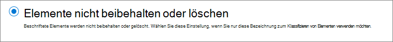
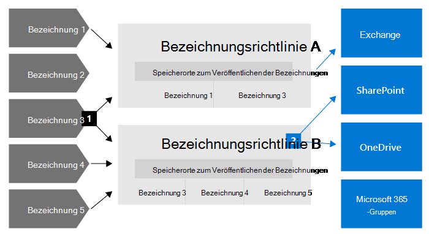
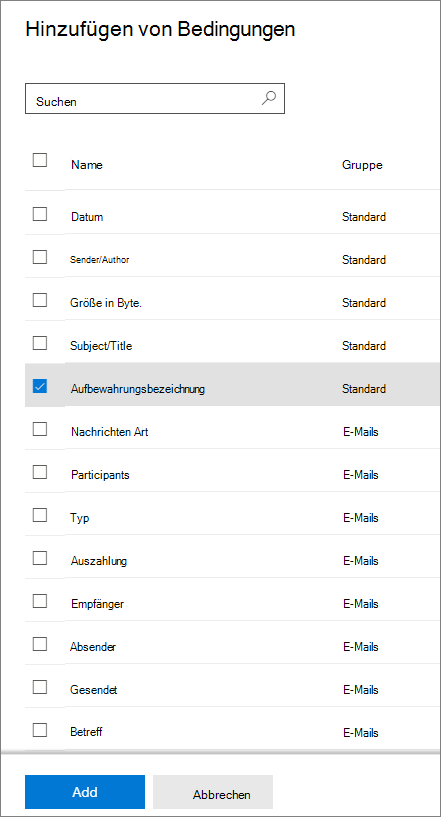
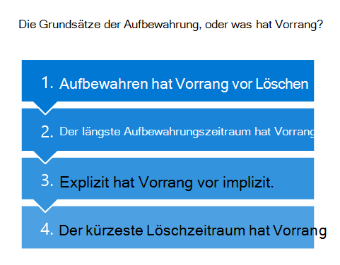

# Informationen zu Aufbewahrungsrichtlinien und Aufbewahrungsbezeichnungen

>*[Microsoft 365-Lizenzierungsleitfaden für Sicherheit und Compliance](https://aka.ms/ComplianceSD).*

> [!NOTE]
> Wenn Nachrichten über Aufbewahrungsrichtlinien in Ihren Apps angezeigt werden, wenden Sie sich an Ihre IT-Abteilung, um zu erfahren, wie diese für Sie konfiguriert wurden. Wenn es sich bei diesen Nachrichten um Teams-Chat- oder Kanalnachrichten handelt, ziehen Sie [Teams-Nachrichten über Aufbewahrungsrichtlinien](https://support.microsoft.com/office/teams-messages-about-retention-policies-c151fa2f-1558-4cf9-8e51-854e925b483b) zurate.
>
> Die Informationen auf dieser Seite richten sich an IT-Administratoren, die aus Compliancegründen Aufbewahrungsrichtlinien und -bezeichnungen erstellen können.

In den meisten Organisationen nimmt die Menge und Komplexität der Daten täglich zu – E-Mails, Dokumente, Chatnachrichten usw. Eine effektive Verwaltung bzw. Governance dieser Informationen ist wichtig, da Sie:
  
- **branchenspezifische Vorschriften und interne Richtlinien einhalten müssen**, nach denen Inhalte für eine bestimmte Mindestdauer aufzubewahren sind – z. B. müssen Sie gemäß dem Sarbanes-Oxley Act möglicherweise bestimmte Arten von Inhalten sieben Jahre lang aufbewahren. 

- **das Risiko bei Rechtsstreitigkeiten oder einer Sicherheitsverletzung reduzieren müssen**, indem Sie alte Inhalte, die Sie nicht mehr aufbewahren müssen, endgültig löschen. 
    
- **Ihrer Organisation dabei helfen müssen, effektiven Wissensaustausch zu betreiben und agiler zu werden**, indem Sie sicherstellen, dass die Benutzer nur mit Inhalten arbeiten, die aktuell und für sie relevant sind. 
    
Die Aufbewahrungseinstellungen, die Sie konfigurieren, können Ihnen helfen, all diese Ziele zu erreichen. Zum Verwalten von Inhalten sind häufig zwei Aktionen erforderlich:
  
- **Aufbewahrung** von Inhalten, sodass sie nicht vor dem Ende des Aufbewahrungszeitraums dauerhaft gelöscht werden 
    
- **Endgültiges Löschen** von Inhalten am Ende des Aufbewahrungszeitraums. 
    

Mit diesen beiden Aufbewahrungsaktionen können Sie Aufbewahrungseinstellungen für die folgenden Ergebnisse konfigurieren:

- Nur Aufbewahren: Aufbewahren von Inhalten für immer oder für einen bestimmten Zeitraum.
- Nur Löschen: Löscht Inhalte nach einem bestimmten Zeitraum.
- Aufbewahren und Löschen: Inhalte für einen bestimmten Zeitraum aufbewahren und dann löschen.

Diese Aufbewahrungseinstellungen arbeiten mit bereits vorhandenen Inhalten und ersparen Ihnen den zusätzlichen Aufwand für die Erstellung und Konfiguration von zusätzlichem Speicherplatz, wenn Sie Inhalte aus Compliancegründen aufbewahren müssen. Außerdem müssen Sie keine benutzerdefinierten Prozesse implementieren, um diese Daten zu kopieren und zu synchronisieren.

## Funktionsweise von Aufbewahrungseinstellungen bei vorhandenem Inhalt

Wenn einem Inhalt Aufbewahrungseinstellungen zugewiesen sind, bleibt dieser Inhalt an seinem ursprünglichen Speicherort. Die Benutzer können weiterhin mit ihren Dokumenten oder E-Mails arbeiten, als ob sich nichts geändert hätte. Wenn aber Inhalte bearbeitet oder gelöscht werden, die in die Aufbewahrungsrichtlinie einbezogen sind, wird eine Kopie des Inhalts automatisch aufbewahrt.
  
- Für SharePoint-und OneDrive-Websites: Die Kopie wird im **Permanenten Dokumentarchiv** aufbewahrt.

- Für Exchange-Postfächer: Die Kopie wird im Ordner **Wiederherstellbare Elemente** aufbewahrt. 

- Für Teams- und Chatnachrichten: Die Kopie wird in einem verborgenen Ordner namens **SubstrateHolds** als Unterordner im Exchange-Ordner **Wiederherstellbare Objekte** aufbewahrt.

> [!NOTE]
> Das permanente Dokumentarchiv verbraucht Speicherplatz, der nicht vom Speicherkontingent für die Website ausgenommen ist. Möglicherweise müssen Sie den Speicherplatz erhöhen, wenn Sie Aufbewahrungseinstellungen für SharePoint und Microsoft 365-Gruppen verwenden.
> 
Diese sicheren Speicherorte und die aufbewahrten Inhalte sind für die meisten Benutzer nicht sichtbar. In den meisten Fällen müssen die Benutzer gar nicht wissen, dass ihre Inhalte Aufbewahrungseinstellungen unterliegen.

Ausführlichere Informationen zur Funktionsweise von Aufbewahrungseinstellungen mit unterschiedlichen Workloads finden Sie in den folgenden Artikeln:

- [Informationen zur Aufbewahrung für SharePoint und OneDrive](retention-policies-sharepoint.md)
- [Informationen zur Aufbewahrung für Microsoft Teams](retention-policies-teams.md)
- [Informationen zur Aufbewahrung für Yammer](retention-policies-yammer.md)
- [Informationen zur Aufbewahrung für Exchange](retention-policies-exchange.md)

## Aufbewahrungsrichtlinien und Aufbewahrungsbezeichnungen

Verwenden Sie zum Zuweisen der Aufbewahrungseinstellungen auf Inhalte **Aufbewahrungsrichtlinien** und **Aufbewahrungsrichtlinien mit Bezeichnungsrichtlinien**. Sie können nur eine dieser Methoden verwenden oder kombinieren.

Verwenden Sie eine Aufbewahrungsrichtlinie, um dieselben Aufbewahrungseinstellungen für Inhalte auf einer Website- oder Postfachebene zuzuweisen, und verwenden Sie eine Aufbewahrungsbezeichnung, um Aufbewahrungseinstellungen auf Elementebene (Ordner, Dokument, E-Mail) zuzuweisen.

Wenn beispielsweise alle Dokumente auf einer SharePoint-Website fünf Jahre lang aufbewahrt werden sollen, ist es effizienter, dies mit einer Aufbewahrungsrichtlinie zu tun, als alle Dokumente auf dieser Website mit derselben Aufbewahrungsbezeichnung anzuwenden. Wenn jedoch einige Dokumente auf dieser Website fünf Jahre lang aufbewahrt werden sollen und andere für zehn Jahre, kann dies in einer Aufbewahrungsrichtlinie nicht erfolgen. Wenn Sie Aufbewahrungseinstellungen auf Elementebene angeben müssen, verwenden Sie Aufbewahrungsbezeichnungen. 

Im Gegensatz zu Aufbewahrungsrichtlinien bleiben die Aufbewahrungseinstellungen von Aufbewahrungsbezeichnungen mit dem Inhalt erhalten, wenn dieser an einen anderen Speicherort innerhalb des Microsoft 365-Mandanten verschoben wird. Darüber hinaus haben Aufbewahrungsbezeichnungen die folgenden Funktionen, die von den Aufbewahrungsrichtlinien nicht unterstützt werden: 
 
- Optionen zum Starten des Aufbewahrungszeitraums ab dem Zeitpunkt, ab dem die Inhalte bezeichnet wurden, statt anhand des Inhaltsalters oder dem Datum der letzten Änderung.

- Verwenden Sie [trainierbare Klassifizierer](classifier-learn-about.md), um die zu bezeichnenden Inhalte zu identifizieren.

- Wenden Sie eine Standardbezeichnung für SharePoint-Dokumente an.

- Unterstützen Sie die [Überprüfung der Disposition](disposition-reviews.md) , um den Inhalt zu überprüfen, bevor er endgültig gelöscht wird.

- Kennzeichnen Sie den Inhalt als [Datensatz](records-management.md#records) als Teil der Bezeichnungseinstellungen und haben Sie immer einen  [Nachweis über die Disposition](disposition.md#disposition-of-records) , wenn der Inhalt am Ende seines Aufbewahrungszeitraums gelöscht wird.

### Aufbewahrungsrichtlinien

Aufbewahrungsrichtlinien können auf die folgenden Speicherorte angewendet werden:
- Exchange-E-Mail
- SharePoint-Website
- OneDrive-Konten
- Microsoft 365-Gruppen
- Skype for Business
- Öffentliche Exchange-Ordner
- Teams-Kanalnachrichten
- Teams-Chats
- Nachrichten in der Yammer-Community
- Private Nachrichten in Yammer

Sie können eine einzelne Richtlinie sehr effizient auf mehrere Speicherorte oder auf bestimmte Speicherorte oder Benutzer anwenden.

Als Beginn des Aufbewahrungszeitraums können Sie auswählen, wann der Inhalt erstellt wurde oder – nur unterstützt für Dateien und die SharePoint-, OneDrive- und Microsoft 365-Gruppen-Speicherorte – wann der Inhalt zuletzt geändert wurde.

Elemente erben die Aufbewahrungseinstellungen aus ihren Containern, die in der Aufbewahrungsrichtlinie angegeben sind. Wenn sie dann aus diesem Container verschoben werden, wird, sofern die Richtlinie für die Beibehaltung von Inhalten konfiguriert ist, eine Kopie des jeweiligen Elements am gesicherten Speicherort des Workloads beibehalten. Allerdings bleiben die Einstellungen für die Aufbewahrung nicht zusammen mit dem Inhalt an seinem neuen Speicherort erhalten. Verwenden Sie in diesem Fall Aufbewahrungsbezeichnungen anstelle von Aufbewahrungsrichtlinien.

### Aufbewahrungsbezeichnungen

Verwenden Sie Aufbewahrungsbezeichnungen für unterschiedliche Inhaltstypen, für die unterschiedliche Aufbewahrungseinstellungen erforderlich sind. Beispiel:
  
- Steuerformulare, die für einen bestimmten Zeitraum aufbewahrt werden müssen. 
    
- Pressematerialien, die nach dem Erreichen eines bestimmten Alters dauerhaft gelöscht werden müssen. 
    
- Im Wettbewerb stehende Forschungen, die für einen bestimmten Zeitraum aufbewahrt und dann endgültig gelöscht werden müssen. 
    
- Arbeitsvisa, die als Datensatz gekennzeichnet werden müssen, damit sie nicht bearbeitet oder gelöscht werden. 
    
In all diesen Fällen können Sie mit Hilfe von Aufbewahrungsbzeichnungen Aufbewahrungseinstellungen für die Governance-Kontrolle auf der Elementebene (Dokument oder E-Mail) anwenden.
  
Mit Aufbewahrungsbezeichnungen können Sie Folgendes:
  
- **Personen in Ihrer Organisation die Möglichkeit zum manuellen Anwenden einer Aufbewahrungsbezeichnung bieten**, und zwar auf Inhalte in Outlook und Outlook im Web, OneDrive, SharePoint und Microsoft 365-Gruppen. Benutzer wissen häufig am besten, mit welcher Art von Inhalten sie arbeiten, sodass sie diese klassifizieren und die entsprechenden Aufbewahrungseinstellungen anwenden lassen können. 
    
- **Sie können Aufbewahrungsbezeichnungen automatisch** auf Inhalt anwenden, wenn er bestimmten Bedingungen entspricht: 
    - Der Inhalt enthält bestimmte vertrauliche Informationen.
    - Der Inhalt enthält bestimmte Stichwörter, die einer von Ihnen erstellten Abfrage entsprechen.
    - Musterübereinstimmungen für eine trainierbare Klassifizierung.

- **Beginnen Sie den Aufbewahrungszeitraum ab dem Zeitpunkt der Bezeichnung des Inhalts** für Dokumente auf SharePoint-Websites und in OneDrive-Konten sowie für E-Mail-Elemente mit Ausnahme von Kalenderelementen. Wenn Sie eine Aufbewahrungsbezeichnung mit dieser Konfiguration auf ein Kalenderelement aufbringen, beginnt der Aufbewahrungszeitraum ab dem Zeitpunkt, an dem es gesendet wird.

- **Starten des Aufbewahrungszeitraums, wenn ein Ereignis auftritt**, z. B. Mitarbeiter, die das Unternehmen verlassen oder Verträge ablaufen.

- **Wenden Sie eine Standardaufbewahrungsbezeichnung auf eine Dokumentbibliothek, einen Ordner oder eine Dokumentenmappe** in SharePoint an, sodass alle an diesem Speicherort gespeicherten Dokumente mit der Standardaufbewahrungsbezeichnung versehen werden.

Aufbewahrungsbezeichnungen unterstützen darüber hinaus die [Datensatzverwaltung](records-management.md) für E-Mails und Dokumente in Microsoft 365-Apps und -Diensten. Sie können eine Aufbewahrungsbezeichnung verwenden, um Elemente als Datensätze zu kennzeichnen. Wenn dies geschieht und der Inhalt in Microsoft 365 bleibt, legt die Bezeichnung weitere Einschränkungen für die Inhalte fest, die aus rechtlichen Gründen möglicherweise erforderlich sind. Weitere Informationen finden Sie unter [Vergleichen Sie die Einschränkungen für die zulässigen oder blockierten Aktionen](records-management.md#compare-restrictions-for-what-actions-are-allowed-or-blocked).

Aufbewahrungsbezeichnungen bleiben im Gegensatz zu [Vertraulichkeitsbezeichnungen](sensitivity-labels.md) nicht erhalten, wenn der Inhalt außerhalb von Microsoft 365 verschoben wird.

Für die Anzahl der Aufbewahrungsbezeichnungen, die für einen Mandanten unterstützt werden, gibt es keine Beschränkung. Es werden jedoch maximal 10.000 Richtlinien für einen Mandanten unterstützt. Dazu gehören die Richtlinien, mit denen die Bezeichnungen angewendet werden (Aufbewahrungsbezeichnungsrichtlinien und automatische Aufbewahrungsrichtlinien), sowie Aufbewahrungsrichtlinien.

#### Klassifizieren von Inhalten ohne Anwendung von Aktionen

Obwohl der Hauptzweck von Aufbewahrungsbezeichnungen darin besteht, Inhalte beizubehalten oder zu löschen, können Sie auch Aufbewahrungsbezeichnungen verwenden, ohne die Aufbewahrung oder andere Aktionen einzuschalten. In diesem Fall können Sie eine Aufbewahrungsbezeichnung einfach als Beschriftung verwenden, ohne irgendwelche Aktionen zu erzwingen.
  
Sie können z. B. eine Aufbewahrungsbezeichnung mit dem Namen "Später überprüfen" ohne Aktionen erstellen und anwenden und dann diese Bezeichnung verwenden, um diesen Inhalt später wiederzufinden.
  

#### Verwenden einer Aufbewahrungsbezeichnung als Bedingung in einer DLP-Richtlinie

Sie können eine Aufbewahrungsbezeichnung als Bedingung in einer DLP-Richtlinie für Dokumente in SharePoint angeben. Konfigurieren Sie beispielsweise eine DLP-Richtlinie, um zu verhindern, dass Dokumente außerhalb der Organisation freigegeben werden, wenn auf sie eine bestimmte Aufbewahrungsbezeichnung angewendet wurde.

Weitere Informationen finden Sie unter [Verwenden einer Aufbewahrungsbezeichnung als Bedingung in einer DLP-Richtlinie](data-loss-prevention-policies.md#using-a-retention-label-as-a-condition-in-a-dlp-policy).

#### Aufbewahrungsbezeichnungen und Richtlinien, die sie anwenden

Wenn Sie Aufbewahrungsbezeichnungen veröffentlichen, sind diese in einer **Aufbewahrungsbezeichnungsrichtlinie** enthalten, sodass Administratoren und Benutzer sie auf Inhalte anwenden können. Betrachten Sie das folgende Diagramm:

1. Eine einzelne Aufbewahrungsbezeichnung kann in mehrere Aufbewahrungsbezeichnungsrichtlinien einbezogen werden.

2. Aufbewahrungsbezeichnungsrichtlinien geben die Speicherorte zum Veröffentlichen der Aufbewahrungsbezeichnungen an. Mehrere Aufbewahrungsbezeichnungsrichtlinien können den gleichen Speicherort einbeziehen.

Sie können auch eine oder mehrere **Aufbewahrungsbezeichnungsrichtlinien für die automatische Anwendung** mit jeweils einer einzelnen Aufbewahrungsbezeichnung erstellen. Bei dieser Richtlinie wird automatisch eine Aufbewahrungsbezeichnung angebracht, wenn die Bedingungen, die Sie in der Richtlinie angeben, erfüllt sind.

#### Aufbewahrungsbezeichnungsrichtlinien und Speicherorte

Verschiedene Arten von Aufbewahrungsbezeichnungen können an verschiedenen Speicherorten veröffentlicht werden, je nach Funktion der Aufbewahrungsbezeichnung.
  
| Wenn für die Aufbewahrungsbezeichnung Folgendes gilt: | Anwendungsmöglichkeit der Bezeichnungsrichtlinie |
|:-----|:-----|
|Veröffentlicht für Administratoren und Endbenutzer    |Exchange, SharePoint, OneDrive, Microsoft 365-Gruppen    |
|Basierend auf Typen vertraulicher Informationen oder trainierbaren Klassifizierer automatisch angewendet    |Exchange (nur alle Postfächer), SharePoint, OneDrive    |
|basieren auf einer Abfrage automatisch angewendet    |Exchange, SharePoint, OneDrive, Microsoft 365-Gruppen    |
   
In Exchange werden Bezeichnungen, die automatisch angewendet werden können, nur auf neu gesendete Nachrichten (in Übertragung begriffene Daten) angewendet, und nicht auf alle Elemente, die sich derzeit im Postfach befinden (ruhende Daten). Außerdem können automatisch angewendete Aufbewahrungsbezeichnungen für vertrauliche Informationstypen und trainierbare Klassifizierer auf alle Postfächer angewendet werden; Sie können keine bestimmten Postfächer auswählen.
  
Öffentliche Exchange-Ordner, Skype-, Teams- und Yammer-Nachrichten unterstützen keine Aufbewahrungsbezeichnungen. Zum Aufbewahren und Löschen von Containern an diesen Speicherorten verwenden Sie stattdessen Aufbewahrungsrichtlinien.

#### Jeweils nur eine Aufbewahrungsbezeichnung

Auf eine E-Mail-Nachricht oder ein Dokument kann jeweils nur eine einzige Aufbewahrungsbezeichnung angewendet werden. Eine Aufbewahrungsbezeichnung kann von einem Endbenutzer oder Administrator [manuell](create-apply-retention-labels.md#manually-apply-retention-labels) angewendet werden, oder Sie verwenden eine der folgenden Methoden:

- [Automatisch angewendete Bezeichnungsrichtlinie](apply-retention-labels-automatically.md)
- [Dokumentverständnismodells für SharePoint Syntex](https://docs.microsoft.com/microsoft-365/contentunderstanding/apply-a-retention-label-to-a-model)
- [Standardbezeichnung für SharePoint](create-apply-retention-labels.md#applying-a-default-retention-label-to-all-content-in-a-sharepoint-library-folder-or-document-set) oder [Outlook](create-apply-retention-labels.md#applying-a-default-retention-label-to-an-outlook-folder)
- [Outlook-Regeln](create-apply-retention-labels.md#automatically-applying-a-retention-label-to-email-by-using-rules)

Für standardmäßige Aufbewahrungsbezeichnungen (sie markieren keine Elemente als einen [Eintrag oder einen behördlichen Eintrag](records-management.md#records)):

- Administratoren und Endbenutzer können eine vorhandene Aufbewahrungsbezeichnung, die auf Inhalte angewendet wird, manuell ändern oder entfernen. 

- Wenn bereits eine Aufbewahrungsbezeichnung für Inhalte vorhanden ist, wird die vorhandene Bezeichnung nicht automatisch entfernt oder durch eine andere Aufbewahrungsbezeichnung mit einer möglichen Ausnahme ersetzt: die vorhandene Bezeichnung wurde als Standardbezeichnung angewendet.
    
    Weitere Informationen zum Bezeichnungsverhalten, wenn es mit einer Standardbezeichnung angewendet wird:
    - Standardbezeichnung für SharePoint: [Bezeichnungsverhalten, wenn Sie eine Standardbezeichnung für SharePoint verwenden](create-apply-retention-labels.md#label-behavior-when-you-use-a-default-label-for-sharepoint)
    - Standardbezeichnung für Outlook: [Anwenden einer Standardaufbewahrungsbezeichnung auf einen Outlook-Ordner](create-apply-retention-labels.md#applying-a-default-retention-label-to-an-outlook-folder)

- Wenn es mehrere automatisch angewendete Bezeichnungsrichtlinien gibt, die eine Aufbewahrungsbezeichnung anwenden könnten, und der Inhalt die Bedingungen mehrerer Richtlinien erfüllt, wird die Aufbewahrungsbezeichnung für die älteste automatisch angewendete Bezeichnungsrichtlinie (nach Erstellungsdatum) angewendet.

Wenn Aufbewahrungsbezeichnungen die Elemente als Eintrag oder als behördlichen Eintrag bezeichnen, werden diese Bezeichnungen niemals automatisch geändert. Nur Administratoren für den Container können Aufbewahrungsbezeichnungen manuell ändern oder entfernen, die Elemente als Eintrag, aber nicht als behördliche Einträge kennzeichnen. Weitere Informationen finden Sie unter [Vergleichen Sie die Einschränkungen für die zulässigen oder blockierten Aktionen](records-management.md#compare-restrictions-for-what-actions-are-allowed-or-blocked).

#### Überwachen von Aufbewahrungsbezeichnungen

Verwenden Sie im Microsoft 365 Compliance Center **Datenklassifizierung** > **Übersicht**, um zu überwachen, wie Ihre Aufbewahrungsbezeichnungen in Ihrem Mandanten verwendet werden und um festzustellen, wo sich Ihre bezeichneten Elemente befinden. Weitere Informationen, einschließlich wichtiger Voraussetzungen, finden Sie unter [Kennen Sie Ihre Daten – Überblick über die Datenklassifizierung](data-classification-overview.md).

Sie können dann mit dem [Inhalts-Explorer](data-classification-content-explorer.md) und dem [Aktivitäten-Explorer](data-classification-activity-explorer.md) in die Details gehen.

> [!TIP]
>Erwägen Sie die Verwendung einiger anderer Einblicke in die Datenklassifizierung, wie trainierbare Klassifikatoren und sensible Informationstypen, um Inhalte zu identifizieren, die Sie möglicherweise beibehalten oder löschen oder als Datensätze verwalten müssen.

Das Office 365 Security & Compliance Center verfügt über die entsprechenden Übersichtsinformationen für Aufbewahrungsbezeichnungen aus dem **Informationsgovernance** > **Dashboard** sowie ausführlichere Informationen aus dem **Informationsgovernance** > **Bezeichnungsaktivitäten-Explorer**. Weitere Informationen zum Überwachen von Aufbewahrungsbezeichnungen von diesem älteren Admin Center finden Sie in der folgenden Dokumentation:
- [Anzeigen der Datengovernanceberichte](view-the-data-governance-reports.md)
- [Erste Schritte mit Datenklassifizierung](data-classification-overview.md).
- [Anzeigen der Bezeichnungsaktivität für Dokumente](view-label-activity-for-documents.md)

#### Verwenden der Inhaltssuche zum Suchen des gesamten Inhalts mit einer bestimmten Aufbewahrungsbezeichnung

Nachdem die Aufbewahrungsbezeichnungen auf die Inhalte entweder von Benutzern oder automatisch angewendet wurden, können Sie mit der Inhaltssuche alle Elemente finden, auf die eine bestimmte Aufbewahrungsbezeichnung angewendet wurde.

Wenn Sie eine Inhaltssuche erstellen, wählen Sie die Bedingung **Aufbewahrungsbezeichnung** aus, und geben Sie den vollständigen Namen der Aufbewahrungsbezeichnung oder einen Teil des Bezeichnungsnamens ein und verwenden Sie einen Platzhalter. Weitere Informationen finden Sie unter [Stichwortabfragen und Suchbedingungen für die Inhaltssuche](keyword-queries-and-search-conditions.md).
  

## Vergleich der Funktionen für Aufbewahrungsrichtlinien und Aufbewahrungsbezeichnungen

Mithilfe der folgenden Tabelle können Sie anhand der Funktionen feststellen, ob Sie eine Aufbewahrungsrichtlinie oder eine Aufbewahrungsbezeichnung verwenden sollten.

|Funktion|Aufbewahrungsrichtlinie |Aufbewahrungsbezeichnung|
|:-----|:-----|:-----|:-----|
|Aufbewahrungsbezeichnungen, die aufbewahrt und dann gelöscht, nur aufbewahrt oder nur gelöscht werden können |Ja |Ja |
|Unterstützte Workloads:  – Exchange  – SharePoint  – OneDrive  – Microsoft 365-Gruppen  – Skype for Business  – Teams – Yammer|  Ja   Ja   Ja   Ja   Ja   Ja   Ja |   Ja, ausgenommen öffentliche Ordner   Ja   Ja   Ja   Nein   Nein   Nein |
|Aufbewahrung automatisch angewendet | Ja | Ja |
|Aufbewahrung basierend auf Bedingungen angewendet   - Typen vertraulicher Informationen, KQL-Abfragen und -Stichwörter, trainierbare Klassifizierungsmerkmale| Nein | Ja |
|Aufbewahrung manuell angewendet | Nein | Ja |
|Benutzeroberfläche-Anwesenheitsinformationen für Endbenutzer | Nein | Ja |
|Wird beibehalten, wenn der Inhalt verschoben wird | Nein | Ja, innerhalb Ihres Microsoft 365-Mandanten |
|Deklarieren eines Elements als Datensatz| Nein | Ja |
|Beginnen Sie den Aufbewahrungszeitraum, wenn er mit einer Bezeichnung versehen ist oder auf einem Ereignis basiert | Nein | Ja |
|Dispositionsüberprüfung | Nein| Ja |
|Dispositionsnachweise von bis zu 7 Jahren | Nein |Ja, wenn Element als ein Datensatz deklariert ist|
|Administratoraktivitäten überwachen| Ja | Ja|
|Identifizierung von Elementen, die der Aufbewahrung unterliegen:   – Inhaltssuche   – Datenklassifizierungsseite, Inhalts-Explorer, Aktivitäts-Explorer |   Nein   Nein |   Ja   Ja|

Beachten Sie, dass Sie sowohl Aufbewahrungsrichtlinien als auch Aufbewahrungsbezeichnungen als ergänzende Aufbewahrungsmethoden verwenden können. Beispiel:

1. Sie erstellen und konfigurieren eine Aufbewahrungsrichtlinie, die Inhalte fünf Jahre nach ihrer letzten Änderung automatisch löscht, und wenden die Richtlinie auf alle OneDrive-Konten an.

2. Sie erstellen und konfigurieren eine Aufbewahrungsbezeichnung, die Inhalte für immer behält, und fügen diese einer Bezeichnungsrichtlinie hinzu, die Sie für alle OneDrive-Konten veröffentlichen. Sie erklären den Benutzern, wie Sie diese Bezeichnung manuell auf bestimmte Dokumente anwenden, die von der automatischen Löschung ausgeschlossen werden sollen, wenn sie nach fünf Jahren nicht geändert werden.

Weitere Informationen darüber, wie Aufbewahrungsrichtlinien und Aufbewahrungsbezeichnungen zusammenwirken und wie man ihr kombiniertes Ergebnis bestimmt, finden Sie im nächsten Abschnitt, in dem die Prinzipien der Aufbewahrung erläutert werden und was Vorrang hat.

## Die Grundsätze der Aufbewahrung, oder was hat Vorrang?

Im Gegensatz zu Aufbewahrungsbezeichnungen können mehrere Aufbewahrungsrichtlinien auf dieselben Inhalte angewendet werden. Jede Aufbewahrungsrichtlinie kann zu einer Aufbewahrungsaktion und einer Löschaktion führen. Außerdem kann das betreffende Element diesen Aktionen auch über eine Aufbewahrungsbezeichnung unterzogen werden.

Wenn Elemente in diesem Szenario von mehreren Aufbewahrungseinstellungen betroffen sein sollten, die u. U. miteinander in Konflikt stehen, was hat dann Vorrang im Hinblick auf das Ergebnis?

Die Antwort lautet nicht, dass eine Aufbewahrungsrichtlinie oder Aufbewahrungsbezeichnung vor anderen Vorrang hat, sondern hängt davon ab, wie lange ein Element aufbewahrt wird (sofern zutreffend), und wann ein Element gelöscht wird (sofern zutreffend). Diese beiden Aktionen werden unabhängig voneinander aus allen Aufbewahrungseinstellungen ermittelt, die für ein Element gelten.

So kann beispielsweise ein Element einer Aufbewahrungsrichtlinie unterliegen, die für eine reine Löschaktion konfiguriert ist, und einer anderen Aufbewahrungsrichtlinie, die für die Aufbewahrung und Löschung konfiguriert ist. Demzufolge hat dieses Element also nur eine Aufbewahrungsaktion, aber zwei Löschaktionen. Zwischen Aufbewahrungs- und Löschaktionen könnte ein Konflikt bestehen, und die beiden Löschaktionen könnten sich widersprechende Datumsangaben haben. Um das Ergebnis zu bestimmen, müssen Sie die Prinzipien der Aufbewahrung anwenden.

Ganz allgemein gilt, dass die Aufbewahrung immer Vorrang vor der Löschung hat, und danach der längste Aufbewahrungszeitraum. Diese beiden einfachen Regeln entscheiden immer, wie lange ein Element beibehalten wird.

Wann ein Element gelöscht wird, hängt von ein paar weiteren Faktoren ab. Die Löschaktion aufgrund einer Aufbewahrungsbezeichnung hat beispielsweise immer Vorrang vor einer aufgrund einer Aufbewahrungsrichtlinie.

Verwenden Sie den folgenden Ablauf, um die Aufbewahrungs- und Löschergebnisse für ein einzelnes Element zu verstehen. Dabei fungiert jede Ebene als Unterbrechung für Konflikte, von oben nach unten. Wenn das Ergebnis durch die erste Ebene bestimmt wird, weil es keine weiteren Konflikte gibt, ist es nicht nötig, zur nächsten Ebene vorzurücken, und so weiter.

> [!IMPORTANT]
> Falls Sie Aufbewahrungsbezeichnungen verwenden: Bevor Sie diesen Ablauf verwenden, um das Ergebnis mehrerer Aufbewahrungseinstellungen für dasselbe Element zu ermitteln, sollten sie darüber Bescheid wissen, [welche Aufbewahrungsbezeichnung angewendet wird](#only-one-retention-label-at-a-time).

  
Erläuterung der vier verschiedenen Ebenen:
  
1. **Aufbewahrung hat Vorrang vor Löschen.** Inhalt wird nicht dauerhaft gelöscht, wenn für ihn zusätzlich Aufbewahrungseinstellungen gelten.  
    
    Beispiel: Eine E-Mail unterliegt einer Aufbewahrungsrichtlinie für Exchange, die so konfiguriert ist, dass Elemente nach drei Jahren gelöscht werden. Außerdem gilt für das Element eine Aufbewahrungsbezeichnung, wonach dieses für fünf Jahre aufbewahrt werden muss.
    
    Die E-Mail-Nachricht wird fünf Jahre lang aufbewahrt, da diese Aufbewahrungsaktion Vorrang vor der Löschung hat. Die E-Mail-Nachricht wird aufgrund der verzögerten Löschung am Ende der fünf Jahre gelöscht.

2. **Der längste Aufbewahrungszeitraum hat Vorrang.** Inhalte, die mehreren Aufbewahrungsrichtlinien mit unterschiedlichen Aufbewahrungszeiträumen unterliegen, werden bis zum Ende des längsten Aufbewahrungszeitraums aufbewahrt.
    
    Beispiel: Dokumente auf der Marketing-SharePoint-Website unterliegen zwei Aufbewahrungsrichtlinien. Die erste sieht vor, dass alle Elemente auf SharePoint-Websites für fünf Jahre aufbewahrt werden müssen. Die zweite Aufbewahrungsrichtlinie sieht für bestimmte SharePoint-Websites vor, dass Elemente für 10 Jahre aufbewahrt werden.
    
    Dokumente auf dieser Marketing-SharePoint-Website werden 10 Jahre lang aufbewahrt, da es sich hierbei um den längsten Aufbewahrungszeitraum handelt.

3. **Explizit hat Vorrang vor implizit.** Wird beim Bestimmen, wann Elemente gelöscht werden, angewendet: 
    
    1. Eine Aufbewahrungsbezeichnung (wie auch immer angewendet) gibt im Gegensatz zu Aufbewahrungsrichtlinien eine explizite Aufbewahrung vor, da die Aufbewahrungseinstellungen auf ein einzelnes Element angewendet werden, und nicht implizit aus einem Container zugeordnet werden. Dies bedeutet, dass eine Löschaktion aufgrund einer Aufbewahrungsbezeichnung immer Vorrang vor einer Löschaktion aufgrund einer Aufbewahrungsrichtlinie hat.
        
        Beispiel: Ein Dokument unterliegt zwei Aufbewahrungsrichtlinien, die eine Löschung nach fünf bzw. zehn Jahren vorsehen, sowie einer Aufbewahrungsbezeichnung, die die Löschung nach sieben Jahren vorsieht.
        
        Das Dokument wird nach sieben Jahren gelöscht, weil die von der Aufbewahrungsbezeichnung vorgesehene Löschung Vorrang hat.
    
    2. Wenn nur Aufbewahrungsrichtlinien vorliegen: Wenn für einen Speicherort eine Aufbewahrungsrichtlinie gilt, die auf bestimmte Elemente (z. B. bestimmte Benutzer für Exchange-E-Mails) beschränkt ist, hat diese Aufbewahrungsrichtlinie Vorrang vor Aufbewahrungsrichtlinien ohne Bereichseinschränkung für den gleichen Speicherort.
        
        Bei Aufbewahrungsrichtlinien ohne Bereichseinschränkung wird ein Speicherort ausgewählt, ohne bestimmte Instanzen anzugeben. **Exchange-E-Mail** mit der Standardeinstellung **Alle Empfänger** ist beispielsweise eine Aufbewahrungsrichtlinie ohne Bereichseinschränkung. Oder **SharePoint-Websites** mit der Standardeinstellung **Alle Websites**. Auf dieser Ebene sind Aufbewahrungsrichtlinien, die auf einen bestimmten Bereich beschränkt sind, gleichrangig.
        
        Beispiel 1: Eine E-Mail-Nachricht unterliegt zwei Aufbewahrungsrichtlinien. Die erste Aufbewahrungsrichtlinie ist nicht auf einen Bereich beschränkt und sieht die Löschung von Elementen nach zehn Jahren vor. Die zweite gilt nur für bestimmte Postfächer und sieht die Löschung der Elemente nach fünf Jahren vor.
        
        Die E-Mail-Nachricht wird nach fünf Jahren gelöscht, weil die Löschung durch die Aufbewahrungsrichtlinie mit Bereichseinschränkung Vorrang vor der uneingeschränkten Aufbewahrungsrichtlinie hat.
        
        Beispiel 2: Ein Dokument im OneDrive-Konto eines Benutzers unterliegt zwei Aufbewahrungsrichtlinien. Die erste gilt für das OneDrive-Konto dieses Benutzers und sieht eine Löschung nach 10 Jahren vor. Die zweite Aufbewahrungsrichtlinie gilt für das OneDrive-Konto dieses Benutzers und sieht eine Löschung nach sieben Jahren vor.
        
        Wann dieses Dokument gelöscht wird, kann auf dieser Ebene nicht bestimmt werden, da beide Aufbewahrungsrichtlinien auf einen Bereich beschränkt sind.

4. **Der kürzeste Zeitraum bis zur Löschungen hat Vorrang.** Wird beim Bestimmen, wann Elemente durch Aufbewahrungsrichtlinien gelöscht werden, angewendet, wenn das Ergebnis nicht auf der vorherigen Ebene ermittelt werden kann: Inhalte werden am Ende des kürzesten Aufbewahrungszeitraums gelöscht.
    
    Beispiel: Ein Dokument im OneDrive-Konto eines Benutzers unterliegt zwei Aufbewahrungsrichtlinien. Die erste gilt für das OneDrive-Konto dieses Benutzers und sieht eine Löschung nach 10 Jahren vor. Die zweite Aufbewahrungsrichtlinie gilt für das OneDrive-Konto dieses Benutzers und sieht eine Löschung nach sieben Jahren vor.
    
    Dieses Dokument wird nach sieben Jahren gelöscht, da es sich hierbei um den kürzesten Aufbewahrungszeitraum für diese beiden auf einen Bereich beschränkten Aufbewahrungsrichtlinien handelt.

Beachten Sie, dass auch für Elemente, die einer eDiscovery-Archivierung unterliegen, der erste Grundsatz für die Aufbewahrung gilt. Sie können durch keine Aufbewahrungsrichtlinie oder Aufbewahrungsbezeichnung gelöscht werden. Wenn die Archivierung aufgehoben wird, gelten für sie weiterhin die Aufbewahrungsgrundsätze. So könnten sie dann beispielsweise einer noch nicht abgelaufenen Aufbewahrung oder einer verzögerten Löschung unterzogen werden.

Komplexere Beispiele mit einer Kombination aus Aufbewahrung und Löschung:

1. Für ein Element gelten die folgenden Aufbewahrungseinstellungen:
    
    - Eine Aufbewahrungsrichtlinie für reines Löschen nach fünf Jahren
    - Eine Aufbewahrungsrichtlinie, die eine dreijährige Aufbewahrung und die anschließende Löschung vorsieht
    - Eine Aufbewahrungsbezeichnung für die reine Aufbewahrung für sieben Jahre
    
    **Ergebnis**: Das Element wird sieben Jahre lang aufbewahrt, da die Aufbewahrung Vorrang vor der Löschung hat, und sieben Jahre der längste Aufbewahrungszeitraum sind. Am Ende dieses Aufbewahrungszeitraums wird das Element gelöscht, da die von den Aufbewahrungsrichtlinien vorgesehene Löschung während der Aufbewahrung des Elements verzögert wurde.
    
    Obwohl die beiden Aufbewahrungsrichtlinien unterschiedliche Termine für die Löschaktionen haben, kann das Element frühestens am Ende des längsten Aufbewahrungszeitraums gelöscht werden, der über beide Löschtermine hinausgeht. In diesem Beispiel gibt es für die Löschdaten keinen Konflikt zu klären, so dass alle Konflikte von der zweiten Ebene gelöst werden.

2.  Für ein Element gelten die folgenden Aufbewahrungseinstellungen:
    
    - Eine nicht auf einen Bereich beschränkte Aufbewahrungsrichtlinie für reines Löschen nach 10 Jahren
    - Eine bereichsbezogene Aufbewahrungsrichtlinie, die eine fünfjährige Aufbewahrung und die anschließende Löschung vorsieht
    - Eine Aufbewahrungsbezeichnung, die eine dreijährige Aufbewahrung und die anschließende Löschung vorsieht
    
    **Ergebnis**: Das Element wird fünf Jahre lang aufbewahrt, weil das die längste Aufbewahrungsfrist ist. Am Ende dieses Aufbewahrungszeitraums wird das Element gelöscht, da die von der Aufbewahrungsbezeichnung vorgesehene Löschung nach drei Jahren während der Aufbewahrung des Elements verzögert wurde. Das Löschen aus Aufbewahrungsbezeichnungen hat Vorrang vor dem Löschen aus allen Aufbewahrungsrichtlinien. In diesem Beispiel werden alle Konflikte durch die dritte Ebene geklärt.

## Verwenden der Erhaltungssperre zum Einschränken von Änderungen an Richtlinien

Einige Organisationen müssen möglicherweise Regeln einhalten, die von Behörden definiert werden, wie zum Beispiel die Richtlinie 17a-4 der Securities And Exchange Commission (SEC), die vorgibt, dass eine Aufbewahrungsrichtlinie nach ihrem Aktivieren nicht deaktiviert oder weniger restriktiv eingestellt werden kann. 

Die Erhaltungssperre stellt sicher, dass Ihre Organisation solchen behördlichen Vorschriften gerecht werden kann, da hierdurch eine Aufbewahrungsrichtlinie oder eine Aufbewahrungsbezeichnungsrichtlinie gesperrt wird, sodass niemand – auch nicht ein Administrator – die Richtlinie deaktivieren, löschen oder weniger restriktiv einstellen kann.
  
Die Erhaltungssperre wird angewendet, nachdem die Aufbewahrungsrichtlinie oder Aufbewahrungsbezeichnungsrichtlinie erstellt wurde. Weitere Informationen und Anweisungen finden Sie unter [Verwenden der Erhaltungssperre zum Einschränken von Änderungen an Aufbewahrungsrichtlinien und Aufbewahrungsbezeichnungsrichtlinien](retention-preservation-lock.md).

## Aufheben einer Richtlinie für die Aufbewahrung

Sofern eine Aufbewahrungsrichtlinie keiner Erhaltungssperre unterliegt, können Sie sie jederzeit löschen. Dadurch werden die zuvor angewendeten Aufbewahrungseinstellungen effektiv deaktiviert. Sie können die Richtlinie auch beibehalten, jedoch den Ortsstatus zu "Aus" ändern.
 
In beiden Fällen werden bis dahin im permanenten Dokumentarchiv aufbewahrte SharePoint- oder OneDrive-Inhalte nicht sofort und dauerhaft gelöscht. Um versehentlichem Datenverlust vorzubeugen, gibt es nun eine Nachfrist von 30 Tagen, während der der Inhaltsablauf für diese Richtlinie im permanenten Dokumentarchiv nicht eintritt, sodass Sie Inhalte ggf. wiederherstellen können. Darüber hinaus können Sie diese Inhalte während der Nachfrist nicht manuell löschen.

Sie können den Ortssatus während der Nachfrist wieder aktivieren. Dann werden keine unter diese Richtlinie fallenden Inhalte gelöscht.

Diese 30-tägige Nachfrist in SharePoint und OneDrive entspricht dem 30-tägigen Anhalten der Aufbewahrungszeit in Exchange. Weitere Informationen finden Sie unter [Verwalten von Postfächern mit angehaltener Aufbewahrungszeit](identify-a-hold-on-an-exchange-online-mailbox.md#managing-mailboxes-on-delay-hold).

## Prüfung der Aufbewahrungskonfiguration

Administratoraktionen für Aufbewahrungsrichtlinien und Aufbewahrungsbezeichnungen werden im Überwachungsprotokoll gespeichert, wenn [Überwachung aktiviert](turn-audit-log-search-on-or-off.md) ist. So wird beispielsweise ein Überwachungsereignis erstellt, wenn eine Aufbewahrungsrichtlinie oder -bezeichnung erstellt, konfiguriert oder gelöscht wird. Die vollständige Liste finden Sie unter [ Aufbewahrungsrichtlinie und Aufbewahrungsbezeichnungsaktivitäten](search-the-audit-log-in-security-and-compliance.md#retention-policy-and-retention-label-activities).

## PowerShell-Cmdlets für Aufbewahrungsrichtlinien und Aufbewahrungsbezeichnungen

Um die Cmdlets für die Aufbewahrun zu verwenden, müssen Sie zunächst [eine Verbindung zu Office 365 Security & Compliance Center PowerShell herstellen](https://docs.microsoft.com/powershell/exchange/connect-to-scc-powershell). Verwenden Sie dann eines der folgenden Cmdlets:

- [Get-ComplianceTag](https://docs.microsoft.com/powershell/module/exchange/get-compliancetag)

- [New-ComplianceTag](https://docs.microsoft.com/powershell/module/exchange/new-compliancetag)

- [Remove-ComplianceTag](https://docs.microsoft.com/powershell/module/exchange/remove-compliancetag)

- [Set-ComplianceTag](https://docs.microsoft.com/powershell/module/exchange/set-compliancetag)

- [Enable-ComplianceTagStorage](https://docs.microsoft.com/powershell/module/exchange/enable-compliancetagstorage)

- [Get-ComplianceTagStorage](https://docs.microsoft.com/powershell/module/exchange/get-compliancetagstorage)

- [Get-RetentionCompliancePolicy](https://docs.microsoft.com/powershell/module/exchange/get-retentioncompliancepolicy)

- [New-RetentionCompliancePolicy](https://docs.microsoft.com/powershell/module/exchange/new-retentioncompliancepolicy)

- [Remove-RetentionCompliancePolicy](https://docs.microsoft.com/powershell/module/exchange/remove-retentioncompliancepolicy)

- [Set-RetentionCompliancePolicy](https://docs.microsoft.com/powershell/module/exchange/set-retentioncompliancepolicy)

- [Get-RetentionComplianceRule](https://docs.microsoft.com/powershell/module/exchange/get-retentioncompliancerule)

- [New-RetentionComplianceRule](https://docs.microsoft.com/powershell/module/exchange/new-retentioncompliancerule)

- [Remove-RetentionComplianceRule](https://docs.microsoft.com/powershell/module/exchange/remove-retentioncompliancerule)

- [Set-RetentionComplianceRule](https://docs.microsoft.com/powershell/module/exchange/set-retentioncompliancerule)

## Verwenden von Aufbewahrungsrichtlinien und Aufbewahrungsbezeichnungen oder eDiscovery-Aufbewahrung

Aufbewahrungseinstellungen und [Haltebereiche, die Sie mit einem eDiscovery-Fall erstellen](create-ediscovery-holds.md), können zwar beide verhindern, dass Daten dauerhaft gelöscht werden, wurden aber für unterschiedliche Szenarien entwickelt.  Mithilfe des folgenden Leitfadens können Sie die Unterschiede nachvollziehen, und entscheiden, welches Sie benutzen möchten:

- Aufbewahrungseinstellungen, die Sie in Aufbewahrungsrichtlinien festlegen, und Aufbewahrungsbezeichnungen sollen eine langfristige Strategie zur Informationsgovernance sicherstellen, und Daten zur Einhaltung von Compliance-Anforderungen aufbewahren oder löschen. Der Anwendungsbereich ist üblicherweise breit, wobei der Hauptfokus jedoch auf dem Speicherort und dem Inhalt liegt als auf einzelnen Benutzern. Der Beginn und das Ende des Aufbewahrungszeitraums sind konfigurierbar. Sie haben auch die Möglichkeit, Inhalte automatisch zu löschen, ohne dass zusätzlich ein Administrator eingreifen muss.

- eDiscovery-Haltebereiche (entweder Core eDiscovery oder Advanced eDiscovery-Fälle) sind für eine begrenzte Dauer vorgesehen, um Daten für eine rechtliche Untersuchung aufzubewahren. Der Bereich ist spezifisch, der Fokus liegt auf Inhalten, deren Besitzer identifizierte Benutzer sind. Der Beginn und das Ende des Aufbewahrungszeitraums sind nicht konfigurierbar, sondern hängen von den Aktionen des einzelnen Administrators ab. Es gibt keine Option, Inhalte automatisch zu löschen, wenn der Haltebereich freigegeben wird.

Zusammenfassender Vergleich der Aufbewahrung mit Haltebereichen:

|Überlegungen|Aufbewahrung |eDiscovery-Haltebereiche|
|:-----|:-----|:-----|:-----|
|Geschäftliche Anforderung: |Compliance |Rechtliche Hinweise |
|Zeitbereich: |Langfristig |Kurzfristig |
|Fokus: |Breit, inhaltsbasiert |Spezifisch, benutzerbasiert |
|Konfigurierbares Start-und Enddatum: |Ja |Nein |
|Löschen von Inhalten: |Ja (optional) |Nein |
|Verwaltungskosten: |Niedrig |Hoch |

Wenn Inhalte sowohl Aufbewahrungseinstellungen als auch einem eDiscovery-Haltebereich unterliegen, hat die Aufbewahrung von Inhalten für den eDiscovery-Haltebereich immer Vorrang. Auf diese Art und Weise erstrecken sich die [Prinzipien der Aufbewahrung](#the-principles-of-retention-or-what-takes-precedence) auch auf eDiscovery-Haltebereiche, da Daten aufbewahrt werden, bis ein Administrator manuell die Sperre aufhebt. Trotz dieser Rangfolge sollten Sie eDiscovery-Haltebereiche nicht für die langfristige Informationsgovernance verwenden. Falls Ihnen das automatische Löschen von Daten Sorgen bereitet, können Sie Aufbewahrungseinstellungen so konfigurieren, dass Elemente dauerhaft beibehalten werden, oder die [Löschungsprüfung](disposition.md#disposition-reviews) mit Aufbewahrungsbezeichnungen verwenden.

Wenn Sie ältere eDiscovery-Tools für die Aufbewahrung Ihrer Daten verwenden, sollten Sie sich die folgenden Ressourcen anschauen:

- Exchange: 
    - [In-Situ-Speicher und Beweissicherungsverfahren](https://go.microsoft.com/fwlink/?linkid=846124)
    - [Identifizieren des Haltebereichs für ein Exchange Online-Postfach](https://docs.microsoft.com/microsoft-365/compliance/identify-a-hold-on-an-exchange-online-mailbox)

- SharePoint und OneDrive: 
    - [Hinzufügen von Inhalten zu einem Fall und temporäres Sperren von Quellen im eDiscovery Center](https://docs.microsoft.com/SharePoint/governance/add-content-to-a-case-and-place-sources-on-hold-in-the-ediscovery-center)

- [Einstellung älterer eDiscovery-Tools](legacy-ediscovery-retirement.md)

## Verwenden von Aufbewahrungsrichtlinien und Aufbewahrungsbezeichnungen anstelle älterer Features

Wenn Sie Inhalte in Microsoft 365 für die Informationsverwaltung proaktiv aufbewahren oder löschen müssen, empfehlen wir Ihnen die Verwendung von Aufbewahrungsrichtlinien und Aufbewahrungsbezeichnungen anstelle der folgenden älteren Features.

Wenn Sie derzeit diese älteren Features verwenden, werden sie weiterhin Seite an Seite mit den Aufbewahrungsrichtlinien und Aufbewahrungsbezeichnungen arbeiten. Es wird jedoch empfohlen, in Zukunft stattdessen Aufbewahrungsrichtlinien und -bezeichnungen zu verwenden. Sie bieten einen einzigen Mechanismus, um die Aufbewahrung und Löschung von Inhalten in Microsoft 365 zentral zu verwalten.

**Ältere Features von Exchange Online:**

- [Aufbewahrungstags und Aufbewahrungsrichtlinien](https://go.microsoft.com/fwlink/?linkid=846125), auch bekannt als [Messaging-Datensatzverwaltung](https://go.microsoft.com/fwlink/?linkid=846126) (Nur Löschen)

**Ältere Features von SharePoint und OneDrive:**

- [Richtlinien zum Löschen von Dokumenten](https://support.office.com/article/Create-a-document-deletion-policy-in-SharePoint-Server-2016-4fe26e19-4849-4eb9-a044-840ab47458ff) (nur Löschvorgang)
    
- [Konfigurieren der direkten Datensatzverwaltung](https://support.office.com/article/7707a878-780c-4be6-9cb0-9718ecde050a) (nur Aufbewahrung) 
    
- [Verwenden von Richtlinien für das Schließen und Löschen von Websites](https://support.microsoft.com/de-DE/office/use-policies-for-site-closure-and-deletion-a8280d82-27fd-48c5-9adf-8a5431208ba5) (Nur Löschen)
    
- [Informationsverwaltungsrichtlinien](intro-to-info-mgmt-policies.md) (Nur Löschen)
     
Wenn Sie SharePoint-Websites für Inhaltstyprichtlinien oder Informationsverwaltungsrichtlinien so konfiguriert haben, dass Inhalte für eine Liste oder Bibliothek aufbewahrt werden, werden diese Richtlinien ignoriert, während eine Aufbewahrungsrichtlinie in Kraft ist. 

## Verwandte Informationen

- [SharePoint Online-Beschränkungen](https://docs.microsoft.com/office365/servicedescriptions/sharepoint-online-service-description/sharepoint-online-limits)
- [Limits und Spezifikationen für Microsoft Teams](https://docs.microsoft.com/microsoftteams/limits-specifications-teams) 
- [Ressourcen, die Sie bei der Einhaltung behördlicher Vorschriften für Informationsgovernance und Datensatzverwaltung unterstützen](retention-regulatory-requirements.md)

## Konfigurationsleitfaden

Wenn Sie bereit sind, Aufbewahrungsrichtlinien zu erstellen, lesen Sie [Erstellen und Konfigurieren von Aufbewahrungsrichtlinien](create-retention-policies.md).

Erstellen und Anwenden von Aufbewahrungsbezeichnungen:
- [Erstellen von Aufbewahrungsbezeichnungen und Anwenden in Apps](create-apply-retention-labels.md)
- [Automatisches Anwenden einer Aufbewahrungsbezeichnung auf Inhalte](apply-retention-labels-automatically.md)

