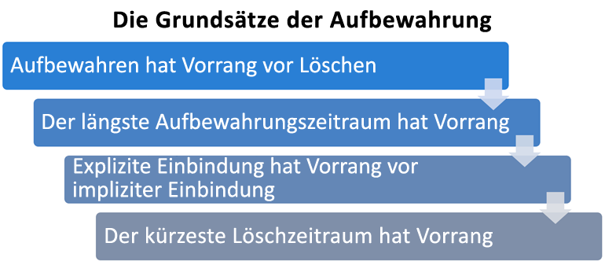

# Informationen zu Aufbewahrungsrichtlinien und AufbewahrungsbezeichnungenLearn about retention policies and retention labels

>*[Microsoft 365-Lizenzierungsleitfaden für Sicherheit und Compliance](https://aka.ms/ComplianceSD).**[Microsoft 365 licensing guidance for security & compliance](https://aka.ms/ComplianceSD).*

In den meisten Organisationen nimmt die Menge und Komplexität der Daten täglich zu – E-Mails, Dokumente, Chatnachrichten usw. Eine effektive Verwaltung bzw. Governance dieser Informationen ist wichtig, da Sie:For most organizations, the volume and complexity of their data is increasing daily—email, documents, instant messages, and more. Effectively managing or governing this information is important because you need to:
  
- **branchenspezifische Vorschriften und interne Richtlinien einhalten müssen**, nach denen Inhalte für eine bestimmte Mindestdauer aufzubewahren sind – z. B. müssen Sie gemäß dem Sarbanes-Oxley Act möglicherweise bestimmte Arten von Inhalten sieben Jahre lang aufbewahren.**Comply proactively with industry regulations and internal policies** that require you to retain content for a minimum period of time—for example, the Sarbanes-Oxley Act might require you to retain certain types of content for seven years. 
- **das Risiko bei Rechtsstreitigkeiten oder einer Sicherheitsverletzung reduzieren müssen**, indem Sie alte Inhalte, die Sie nicht mehr aufbewahren müssen, endgültig löschen.**Reduce your risk in the event of litigation or a security breach** by permanently deleting old content that you're no longer required to keep. 
    
- **Ihrer Organisation dabei helfen müssen, effektiven Wissensaustausch zu betreiben und agiler zu werden**, indem Sie sicherstellen, dass die Benutzer nur mit Inhalten arbeiten, die aktuell und für sie relevant sind.**Help your organization to share knowledge effectively and be more agile** by ensuring that your users work only with content that's current and relevant to them. 
    
Die Aufbewahrungseinstellungen, die Sie konfigurieren, können Ihnen helfen, all diese Ziele zu erreichen.Retention settings that you configure can help you achieve all these goals. Zum Verwalten von Inhalten sind häufig zwei Aktionen erforderlich:Managing content commonly requires two actions:
  
- **Aufbewahrung** von Inhalten, sodass sie nicht vor dem Ende des Aufbewahrungszeitraums dauerhaft gelöscht werden**Retaining** content so that it can't be permanently deleted before the end of the retention period. 
    
- **Endgültiges Löschen** von Inhalten am Ende des Aufbewahrungszeitraums.**Deleting** content permanently at the end of the retention period. 
    

Mit diesen beiden Aufbewahrungsaktionen können Sie Aufbewahrungseinstellungen für die folgenden Ergebnisse konfigurieren:With these two retention actions, you can configure retention settings for the following outcomes:

- Nur Aufbewahren: Aufbewahren von Inhalten für immer oder für einen bestimmten Zeitraum.Retain-only: Retain content forever or for a specified period of time.
- Nur Löschen: Löscht Inhalte nach einem bestimmten Zeitraum.Delete-only: Delete content after a specified period of time.
- Aufbewahren und Löschen: Inhalte für einen bestimmten Zeitraum aufbewahren und dann löschen.Retain and then delete: Retain content for a specified period of time and then delete it.

Diese Aufbewahrungseinstellungen arbeiten mit bereits vorhandenen Inhalten und ersparen Ihnen den zusätzlichen Aufwand für die Erstellung und Konfiguration von zusätzlichem Speicherplatz, wenn Sie Inhalte aus Compliancegründen aufbewahren müssen.These retention settings work with content in place that saves you the additional overheads of creating and configuring additional storage when you need to retain content for compliance reasons. Außerdem müssen Sie keine benutzerdefinierten Prozesse implementieren, um diese Daten zu kopieren und zu synchronisieren.In addition, you don't need to implement customized processes to copy and synchronize this data.

## Funktionsweise von Aufbewahrungseinstellungen bei vorhandenem InhaltHow retention settings work with content in place

Wenn einem Inhalt Aufbewahrungseinstellungen zugewiesen sind, bleibt dieser Inhalt an seinem ursprünglichen Speicherort.When content has retention settings assigned to it, that content remains in its original location. Die Benutzer können weiterhin mit ihren Dokumenten oder E-Mails arbeiten, als ob sich nichts geändert hätte.People can continue to work with their documents or mail as if nothing's changed. Wenn aber Inhalte bearbeitet oder gelöscht werden, die in die Aufbewahrungsrichtlinie einbezogen sind, wird eine Kopie des Inhalts automatisch so aufbewahrt, wie er zum Zeitpunkt der Anwendung der Aufbewahrungseinstellungen vorhanden war.But if they edit or delete content that's included in the retention policy, a copy of the content is automatically retained as it existed when you applied the retention settings.
  
- Für SharePoint-und OneDrive-Websites: Die Kopie wird im **Permanenten Dokumentarchiv** aufbewahrt.For SharePoint and OneDrive sites: The copy is retained in the **Preservation Hold** library.

- Für Exchange-Postfächer: Die Kopie wird im Ordner **Wiederherstellbare Elemente** aufbewahrt.For Exchange mailboxes: The copy is retained in the **Recoverable Items** folder. 

- Für Teams-Kanal- und -Chatnachrichten: Die Kopie wird in einem verborgenen Ordner innerhalb des Exchange-Ordners **Wiederherstellbare Elemente** aufbewahrt.For Teams channel and chat messages: The copy is retained in a hidden folder within the Exchange **Recoverable Items** folder.

> [!NOTE]
> Das permanente Dokumentarchiv verbraucht Speicherplatz, der nicht vom Speicherkontingent für die Website ausgenommen ist.The Preservation Hold library consumes storage that isn't exempt from a site's storage quota. Möglicherweise müssen Sie den Speicherplatz erhöhen, wenn Sie Aufbewahrungseinstellungen für SharePoint und Microsoft 365-Gruppen verwenden.You might need to increase your storage when you use retention settings for SharePoint and Microsoft 365 groups.
> 
Diese sicheren Speicherorte und die aufbewahrten Inhalte sind für die meisten Benutzer nicht sichtbar.These secure locations and the retained content are not visible to most people. In den meisten Fällen müssen die Benutzer gar nicht wissen, dass ihre Inhalte Aufbewahrungseinstellungen unterliegen.In most cases, people do not even need to know that their content is subject to retention settings.

Ausführlichere Informationen zur Funktionsweise von Aufbewahrungseinstellungen mit unterschiedlichen Workloads finden Sie in den folgenden Artikeln:For more detailed information about how retention settings work for different workloads, see the following articles:

- [Informationen zur Aufbewahrung für SharePoint und OneDriveLearn about retention for SharePoint and OneDrive](retention-policies-sharepoint.md)
- [Informationen zur Aufbewahrung für Microsoft TeamsLearn about retention for Microsoft Teams](retention-policies-teams.md)
- [Informationen zur Aufbewahrung für ExchangeLearn about retention for Exchange](retention-policies-exchange.md)

## Aufbewahrungsrichtlinien und AufbewahrungsbezeichnungenRetention policies and retention labels

Sie können sowohl Aufbewahrungsrichtlinien als auch Aufbewahrungsbezeichnungen verwenden, um Ihre Aufbewahrungseinstellungen den Inhalten zuzuweisen.You can use both retention policies and retention labels to assign your retention settings to content. 

Verwenden Sie eine Aufbewahrungsrichtlinie, um dieselben Aufbewahrungseinstellungen für Inhalte auf einer Website- oder Postfachebene zuzuweisen, und verwenden Sie eine Aufbewahrungsbezeichnung, um Aufbewahrungseinstellungen auf Elementebene (Ordner, Dokument, E-Mail) zuzuweisen.Use a retention policy to assign the same retention settings for content at a site or mailbox level, and use a retention label to assign retention settings at an item level (folder, document, email).

Wenn beispielsweise alle Dokumente auf einer SharePoint-Website fünf Jahre lang aufbewahrt werden sollen, ist es effizienter, dies mit einer Aufbewahrungsrichtlinie zu tun, als alle Dokumente auf dieser Website mit derselben Aufbewahrungsbezeichnung anzuwenden.For example, if all documents in a SharePoint site should be retained for five years, it's more efficient to do this with a retention policy than apply the same retention label to all documents in that site. Wenn jedoch einige Dokumente auf dieser Website fünf Jahre lang aufbewahrt werden sollen und andere für zehn Jahre, kann dies in einer Aufbewahrungsrichtlinie nicht erfolgen.However, if some documents in that site should be retained for five years and others retained for ten years, a retention policy wouldn't be able to do this. Wenn Sie Aufbewahrungseinstellungen auf Elementebene angeben müssen, verwenden Sie Aufbewahrungsbezeichnungen.When you need to specify retention settings at the item level, use retention labels. 

Im Gegensatz zu Aufbewahrungsrichtlinien bleiben die Aufbewahrungseinstellungen von Aufbewahrungsbezeichnungen mit dem Inhalt erhalten, wenn dieser kopiert oder an einen anderen Microsoft 365-Speicherort verschoben wird.Unlike retention policies, retention settings from retention labels persist with the content if it’s copied or moved to a different Microsoft 365 location. Darüber hinaus haben Aufbewahrungsbezeichnungen die folgenden Funktionen, die von den Aufbewahrungsrichtlinien nicht unterstützt werden:In addition, retention labels have the following capabilities that retention policies don't support: 
 
- Optionen zum Starten des Aufbewahrungszeitraums ab dem Zeitpunkt, ab dem die Inhalte bezeichnet wurden, statt anhand des Inhaltsalters oder dem Datum der letzten Änderung.Options to start the retention period from when the content was labeled or based on an event, in addition to the age of the content or when it was last modified.

- Verwenden Sie [trainierbare Klassifizierer](classifier-getting-started-with.md), um die zu bezeichnenden Inhalte zu identifizieren.Use [trainable classifiers](classifier-getting-started-with.md) to identify content to label.

- Wenden Sie eine Standardbezeichnung für SharePoint-Dokumente an.Apply a default label for SharePoint documents.

- Unterstützen Sie die [Überprüfung der Disposition](disposition-reviews.md) , um den Inhalt zu überprüfen, bevor er endgültig gelöscht wird.Support [disposition review](disposition-reviews.md) to review the content before it's permanently deleted.

- Kennzeichnen Sie den Inhalt als [Datensatz](records.md) als Teil der Bezeichnungseinstellungen und haben Sie immer einen  [Nachweis über die Disposition](disposition.md#disposition-of-records) , wenn der Inhalt am Ende seines Aufbewahrungszeitraums gelöscht wird.Mark the content as a [record](records.md) as part of the label settings, and always have [proof of disposition](disposition.md#disposition-of-records) when content is deleted at the end of its retention period.

### AufbewahrungsrichtlinienRetention policies

Aufbewahrungsrichtlinien können auf die folgenden Speicherorte angewendet werden:Retention policies can be applied to the following locations:
- Exchange-E-MailExchange email
- SharePoint-WebsiteSharePoint site
- OneDrive-KontenOneDrive accounts
- Microsoft 365-GruppenMicrosoft 365 groups
- Skype for BusinessSkype for Business
- Öffentliche Exchange-OrdnerExchange public folders
- Teams-KanalnachrichtenTeams channel messages
- Teams-ChatsTeams chats

Sie können eine einzelne Richtlinie sehr effizient auf mehrere Speicherorte oder auf bestimmte Speicherorte oder Benutzer anwenden.You can very efficiently apply a single policy to multiple locations, or to specific locations or users.
    
Sie können eine Richtlinie auch auf alle Inhalte anwenden oder auf Inhalte, die bestimmte Bedingungen erfüllen, wie z. B. Inhalte, die Schlüsselwörter oder [vertrauliche Informationstypen](sensitive-information-type-entity-definitions.md) enthalten.You can also apply a policy to all content or to content when it meets specific conditions, such as content that contains keywords or [sensitive information types](sensitive-information-type-entity-definitions.md).

#### Verwenden der Erhaltungssperre zur Einhaltung gesetzlicher VorschriftenUse Preservation Lock to comply with regulatory requirements

Einige Organisationen müssen möglicherweise Regeln einhalten, die von Behörden definiert werden, wie zum Beispiel die Richtlinie 17a-4 der Securities And Exchange Commission (SEC), die vorgibt, dass eine Aufbewahrungsrichtlinie nach dem Aktivieren nicht deaktiviert oder weniger restriktiv eingestellt werden kann.Some organizations might need to comply with rules defined by regulatory bodies such as the Securities and Exchange Commission (SEC) Rule 17a-4, which requires that after a retention policy is turned on, it cannot be turned off or made less restrictive. 

Die Erhaltungssperre stellt sicher, dass Ihre Organisation solchen gesetzlichen Vorschriften gerecht werden kann, da hierdurch eine Aufbewahrungsrichtlinie gesperrt wird, sodass niemand – auch nicht der Administrator – die Richtlinie deaktivieren, löschen oder weniger restriktiv einstellen kann.Preservation Lock ensures your organization can meet such regulatory requirements because it locks a retention policy so that no one—including the administrator—can turn off the policy, delete the policy, or make it less restrictive.
  
Das Sperren einer Aufbewahrungsrichtlinie bewirkt Folgendes:When a retention policy is locked:

- Niemand kann sie deaktivierenNo one can it turn off
- Speicherorte können hinzugefügt, aber nicht entfernt werdenLocations can be added but not removed
- Inhalte, die der Richtlinie unterliegen, können während des Aufbewahrungszeitraums weder geändert noch gelöscht werden.Content subject to the policy can't be modified or deleted during the retention period
- Sie können den Aufbewahrungszeitraum verlängern, ihn jedoch nicht verringern.You can extend a retention period but not decrease it

Zusammenfassend kann man sagen, dass eine gesperrte Richtlinie erweitert oder verlängert, jedoch nicht reduziert oder deaktiviert werden kann.In summary, a locked retention policy can be increased or extended, but it can't be reduced or turned off.
  
> [!IMPORTANT]
> Bevor Sie eine Aufbewahrungsrichtlinie sperren, ist es wichtig, dass Sie die Auswirkungen kennen und überlegen, ob dies zur Erfüllung der regulatorischen Anforderungen durch Ihre Organisation erforderlich ist.Before you lock a retention policy, it's critical that you understand the impact and confirm whether it's required for your organization to meet regulatory requirements. Administratoren können eine Aufbewahrungsrichtlinie nicht mehr deaktivieren oder löschen, nachdem die Erhaltungssperre angewendet wurde.Administrators won't be able to disable or delete a retention policy after the preservation lock is applied.

#### Aufheben einer AufbewahrungsrichtlinieReleasing a retention policy

Wenn eine Aufbewahrungsrichtlinie keiner Erhaltungssperre unterliegt, können Sie sie jederzeit deaktivieren oder löschen.Providing your retention policy doesn't have a Preservation Lock, you can turn off or delete a retention policy at any time. 

In diesem Fall werden bis dahin im permanentes Dokumentarchiv aufbewahrte SharePoint- oder OneDrive-Inhalte nicht sofort und dauerhaft gelöscht.When you do so, any SharePoint or OneDrive content that's being retained in the Preservation Hold library is not immediately and permanently deleted. Um versehentlichem Datenverlust vorzubeugen, gibt es nun eine Nachfrist von 30 Tagen, während der der Inhaltsablauf für diese Richtlinie im permanenten Dokumentarchiv nicht eintritt, sodass Sie Inhalte ggf. wiederherstellen können.Instead, to help prevent inadvertent data loss, there is a 30-day grace period, during which content expiration for that policy does not happen in the Preservation Hold library, so that you can restore any content from there, if needed. Darüber hinaus können Sie diese Inhalte während der Nachfrist nicht manuell löschen.Additionally, you can't manually delete this content during the grace period.

Sie können die Aufbewahrungsrichtlinie während der Nachfrist erneut aktivieren. In diesem Fall werden keine in Zusammenhang mit dieser Richtlinie stehenden Inhalte gelöscht.You can turn on the retention policy again during the grace period, and no content will be deleted for that policy.

Diese 30-tägige Nachfrist in SharePoint und OneDrive entspricht dem 30-tägigen Anhalten der Aufbewahrungszeit in Exchange.This 30-day grace period in SharePoint and OneDrive corresponds to the 30-day delay hold in Exchange. Weitere Informationen finden Sie unter [Verwalten von Postfächern mit angehaltener Aufbewahrungszeit](identify-a-hold-on-an-exchange-online-mailbox.md#managing-mailboxes-on-delay-hold).For more information, see [Managing mailboxes on delay hold](identify-a-hold-on-an-exchange-online-mailbox.md#managing-mailboxes-on-delay-hold).

### AufbewahrungsbezeichnungenRetention labels

Verwenden Sie Aufbewahrungsbezeichnungen für unterschiedliche Inhaltstypen, für die unterschiedliche Aufbewahrungseinstellungen erforderlich sind.Use retention labels for different types of content that require different retention settings. Beispiel:For example:
  
- Steuerformulare, die für einen bestimmten Zeitraum aufbewahrt werden müssen.Tax forms that need to be retained for a minimum period of time. 
    
- Pressematerialien, die nach dem Erreichen eines bestimmten Alters dauerhaft gelöscht werden müssen.Press materials that need to be permanently deleted when they reach a specific age. 
    
- Im Wettbewerb stehende Forschungen, die für einen bestimmten Zeitraum aufbewahrt und dann endgültig gelöscht werden müssen.Competitive research that needs to be retained for a specific period and then permanently deleted. 
    
- Arbeitsvisa, die als Datensatz gekennzeichnet werden müssen, damit sie nicht bearbeitet oder gelöscht werden.Work visas that must be marked as a record so that they can't be edited or deleted. 
    
In all diesen Fällen können Sie mit Hilfe von Aufbewahrungsbzeichnungen Aufbewahrungseinstellungen für die Governance-Kontrolle auf der Elementebene (Dokument oder E-Mail) anwenden.In all these cases, retention labels let you apply retention settings for governance control at the item level (document or email).
  
Mit Aufbewahrungsbezeichnungen können Sie Folgendes:With retention labels, you can:
  
- **Personen in Ihrer Organisation die Möglichkeit zum manuellen Anwenden einer Aufbewahrungsbezeichnung bieten**, und zwar auf Inhalte in Outlook und Outlook im Web, OneDrive, SharePoint und Microsoft 365-Gruppen.**Enable people in your organization to apply a retention label manually** to content in Outlook and Outlook on the web, OneDrive, SharePoint, and Microsoft 365 groups. Benutzer wissen häufig am besten, mit welcher Art von Inhalten sie arbeiten, sodass sie diese klassifizieren und die entsprechenden Aufbewahrungseinstellungen anwenden lassen können.Users often know best what type of content they're working with, so they can classify it and have the appropriate retention settings applied. 
    
- **Sie können Aufbewahrungsbezeichnungen automatisch** auf Inhalt anwenden, wenn er bestimmten Bedingungen entspricht:**Apply retention labels to content automatically** if it matches specific conditions, such as when the content contains: 
    - Der Inhalt enthält bestimmte vertrauliche Informationen.Specific types of sensitive information.
    - Der Inhalt enthält bestimmte Stichwörter, die einer von Ihnen erstellten Abfrage entsprechen.Specific keywords that match a query you create.
    - Musterübereinstimmungen für eine trainierbare Klassifizierung.Pattern matches for a trainable classifier.

- **Beginnen Sie den Aufbewahrungszeitraum ab dem Zeitpunkt der Bezeichnung des Inhalts** für Dokumente auf SharePoint-Websites und in OneDrive-Konten sowie für E-Mail-Elemente mit Ausnahme von Kalenderelementen.**Start the retention period from when the content was labeled** for documents in SharePoint sites and OneDrive accounts, and to email items with the exception of calendar items. Wenn Sie eine Aufbewahrungsbezeichnung mit dieser Konfiguration auf ein Kalenderelement aufbringen, beginnt der Aufbewahrungszeitraum ab dem Zeitpunkt, an dem es gesendet wird.If you apply a retention label with this configuration to a calendar item, the retention period starts from when it is sent.

- **Starten des Aufbewahrungszeitraums, wenn ein Ereignis auftritt**, z. B. Mitarbeiter, die das Unternehmen verlassen oder Verträge ablaufen.**Start the retention period when an event occurs**, such as employees leave the organization, or contracts expire.

- **Wenden Sie eine Standardaufbewahrungsbezeichnung auf eine Dokumentbibliothek, einen Ordner oder eine Dokumentenmappe** in SharePoint an, sodass alle an diesem Speicherort gespeicherten Dokumente mit der Standardaufbewahrungsbezeichnung versehen werden.**Apply a default retention label to a document library, folder, or document set** in SharePoint, so that all documents that are stored in that location inherit the default retention label.

Aufbewahrungsbezeichnungen unterstützen darüber hinaus die [Datensatzverwaltung](records-management.md) für E-Mails und Dokumente in Microsoft 365-Apps und -Diensten.Additionally, retention labels support [records management](records-management.md) for email and documents across Microsoft 365 apps and services. Sie können Aufbewahrungsbezeichnungen verwenden, um Inhalte als Datensätze zu kennzeichnen.You can use a retention label to classify content as a record. Wenn dies geschieht und der Inhalt in Microsoft 365 bleibt, legt die Bezeichnung weitere Einschränkungen für die Inhalte fest, die aus rechtlichen Gründen möglicherweise erforderlich sind.When this happens and the content remains in Microsoft 365, the label places further restrictions on the content that might be needed for regulatory reasons. Weitere Informationen, einschließlich eines Vergleichs der zulässigen oder blockierten Aktionen, finden Sie unter [Informationen zu Datensätzen](records.md).For more information, including a comparison of the actions allowed or blocked, see [Learn about records](records.md).

Aufbewahrungsbezeichnungen bleiben im Gegensatz zu [Vertraulichkeitsbezeichnungen](sensitivity-labels.md) nicht erhalten, wenn der Inhalt außerhalb von Microsoft 365 verschoben wird.Retention labels, unlike [sensitivity labels](sensitivity-labels.md), do not persist if the content is moved outside Microsoft 365.

Für die Anzahl der Aufbewahrungsbezeichnungen, die für einen Mandanten unterstützt werden, gibt es keine Beschränkung.There is no limit to the number of retention labels that are supported for a tenant. Es werden jedoch maximal 10.000 Richtlinien für einen Mandanten unterstützt. Dazu gehören die Richtlinien, mit denen die Bezeichnungen angewendet werden (Aufbewahrungsbezeichnungsrichtlinien und automatische Aufbewahrungsrichtlinien), sowie Aufbewahrungsrichtlinien.However, 10,000 is the maximum number of policies that are supported for a tenant and these include the policies that apply the labels (retention label policies and auto-apply retention policies), as well as retention policies.

#### Klassifizieren von Inhalten ohne Anwendung von AktionenClassifying content without applying any actions

Obwohl der Hauptzweck von Aufbewahrungsbezeichnungen darin besteht, Inhalte beizubehalten oder zu löschen, können Sie auch Aufbewahrungsbezeichnungen verwenden, ohne die Aufbewahrung oder andere Aktionen einzuschalten.Although the main purpose of retention labels is to retain or delete content, you can also use retention labels without turning on any retention or other actions. In diesem Fall können Sie eine Aufbewahrungsbezeichnung einfach als Beschriftung verwenden, ohne irgendwelche Aktionen zu erzwingen.In this case, you can use a retention label simply as a text label, without enforcing any actions.
  
Sie können z. B. eine Aufbewahrungsbezeichnung mit dem Namen "Später überprüfen" ohne Aktionen erstellen und anwenden und dann diese Bezeichnung verwenden, um diesen Inhalt später wiederzufinden.For example, you can create and apply a retention label named "Review later" with no actions, and then use that label to find that content later.
  

#### Verwenden einer Aufbewahrungsbezeichnung als Bedingung in einer DLP-RichtlinieUsing a retention label as a condition in a DLP policy

Sie können eine Aufbewahrungsbezeichnung als Bedingung in einer DLP-Richtlinie für Dokumente in SharePoint angeben.You can specify a retention label as a condition in a data loss prevention (DLP) policy for documents in SharePoint. Konfigurieren Sie beispielsweise eine DLP-Richtlinie, um zu verhindern, dass Dokumente außerhalb der Organisation freigegeben werden, wenn auf sie eine bestimmte Aufbewahrungsbezeichnung angewendet wurde.For example, configure a DLP policy to prevent documents from being shared outside the organization if they have a specified retention label applied to it.

Weitere Informationen finden Sie unter [Verwenden einer Aufbewahrungsbezeichnung als Bedingung in einer DLP-Richtlinie](data-loss-prevention-policies.md#using-a-retention-label-as-a-condition-in-a-dlp-policy).For more information, see [Using a retention label as a condition in a DLP policy](data-loss-prevention-policies.md#using-a-retention-label-as-a-condition-in-a-dlp-policy).

#### Aufbewahrungsbezeichnungen und Richtlinien, die sie anwendenRetention labels and policies that apply them

Aufbewahrungsbezeichnungen sind unabhängige, wieder verwendbare Bausteine.Retention labels are independent, reusable building blocks. Der Hauptzweck der Aufbewahrungsbezeichnungsrichtlinie besteht darin, eine Reihe von Aufbewahrungsbezeichnungen zu gruppieren und die Orte anzugeben, an denen die Bezeichnungen angezeigt werden sollen.The primary purpose of a retention label policy is to group a set of retention labels and specify the locations where you want those labels to appear. Dann können Administratoren und Benutzer diese Bezeichnungen auf Inhalte an diesen Speicherorten anwenden.Then, admins and users can apply those labels to content in those locations.
  

  
Wenn Sie Aufbewahrungsbezeichnungen veröffentlichen, sind diese in einer Aufbewahrungsbezeichnungsrichtlinie enthalten, sodass Administratoren und Benutzer sie auswählen können:When you publish retention labels, they're included in a retention label policy that make them available for admins and users to select:

- Eine einzelne Aufbewahrungsbezeichnung kann in mehrere Aufbewahrungsbezeichnungsrichtlinien einbezogen werden.A single retention label can be included in many retention label policies.

- Aufbewahrungsbezeichnungsrichtlinien geben die Speicherorte zum Veröffentlichen der Aufbewahrungsbezeichnungen an.Retention label policies specify the locations to publish the retention labels.

- Ein einzelner Ort kann auch in viele Aufbewahrungsbezeichnungsrichtlinien einbezogen werden.A single location can also be included in many retention label policies.

Zusätzlich zu den Aufbewahrungsbezeichnungsrichtlinien können Sie auch eine oder mehrere Richtlinien für die automatische Anwendung erstellen, jede mit einer einzelnen Aufbewahrungsbezeichnung.In addition to retention label policies, you can also create one or more auto-apply policies, each with a single retention label. Bei dieser Richtlinie wird automatisch eine Aufbewahrungsbezeichnung angebracht, wenn die Bedingungen, die Sie in der Richtlinie angeben, erfüllt sind.With this policy, a retention label is automatically applied when conditions that you specify in the policy are met. 

#### Aufbewahrungsbezeichnungsrichtlinien und SpeicherorteRetention label policies and locations

Verschiedene Arten von Aufbewahrungsbezeichnungen können an verschiedenen Speicherorten veröffentlicht werden, je nach Funktion der Aufbewahrungsbezeichnung.Different types of retention labels can be published to different locations, depending on what the retention label does.
  
| Wenn für die Aufbewahrungsbezeichnung Folgendes gilt:If the retention label is… | Anwendungsmöglichkeit der BezeichnungsrichtlinieThen the label policy can be applied to… |
|:-----|:-----|
|Veröffentlicht für Administratoren und EndbenutzerPublished to admins and end users    |Exchange, SharePoint, OneDrive, Microsoft 365-GruppenExchange, SharePoint, OneDrive, Microsoft 365 Groups    |
|Basierend auf Typen vertraulicher Informationen oder trainierbaren Klassifizierer automatisch angewendetAuto-applied based on sensitive information types or trainable classifiers    |Exchange (nur alle Postfächer), SharePoint, OneDriveExchange (all mailboxes only), SharePoint, OneDrive    |
|basieren auf einer Abfrage automatisch angewendetAuto-applied based on a query    |Exchange, SharePoint, OneDrive, Microsoft 365-GruppenExchange, SharePoint, OneDrive, Microsoft 365 Groups    |
   
In Exchange werden automatisch angewendete Bezeichnungen nur auf neu gesendete Nachrichten (in Übertragung begriffene Daten) angewendet, und nicht auf alle Elemente, die sich derzeit im Postfach befinden (ruhende Daten).In Exchange, auto-apply retention labels are applied only to messages newly sent (data in transit), not to all items currently in the mailbox (data at rest). Außerdem können automatisch angewendete Aufbewahrungsbezeichnungen für vertrauliche Informationstypen und trainierbare Klassifizierer auf alle Postfächer angewendet werden; Sie können keine bestimmten Postfächer auswählen.Also, auto-apply retention labels for sensitive information types and trainable classifiers apply to all mailboxes; you can't select specific mailboxes.
  
Öffentliche Exchange-Ordner, Skype- und Teams-Kanalnachrichten und -Chats unterstützen keine Aufbewahrungskennzeichnungen.Exchange public folders, Skype, and Teams channel messages and chats do not support retention labels. Zum Aufbewahren und Löschen von Containern an diesen Speicherorten verwenden Sie stattdessen Aufbewahrungsrichtlinien.To retain and delete contain from these locations, use retention policies instead.

#### Jeweils nur eine AufbewahrungsbezeichnungOnly one retention label at a time

Eine E-Mail-Nachricht oder ein Dokument kann jeweils nur über eine Aufbewahrungsbezeichnung verfügen:An email or document can have only a single retention label assigned to it at a time:
  
- Aufbewahrungsbezeichnungen, die von den Administratoren oder den Endbenutzern manuell zugewiesen wurden, können entfernt oder geändert werden.For retention labels assigned manually by admins or end users, people can remove or change the retention label that's assigned.
    
- Wenn dem Inhalt eine automatisch anwendbare Bezeichnung zugewiesen ist, kann diese Bezeichnung durch eine veröffentlichte Aufbewahrungsbezeichnung ersetzt werden.If content has an auto-apply label assigned, this label can be replaced by a published retention label.
    
- Wenn dem Inhalt eine Bezeichnung für die veröffentlichte Aufbewahrung zugewiesen wurde, kann diese nicht durch eine automatische anwendbare Bezeichnung ersetzt werden.If content has a published retention label assigned, an auto-apply label cannot replace it.
    
- Wenn es mehrere Regeln gibt, durch die eine Bezeichnung automatisch zugewiesen wird, und ein Inhalt die Bedingungen verschiedener Regeln erfüllt, wird die Aufbewahrungsbezeichnung für die älteste Regel angewendet.If there are multiple rules that assign an auto-apply label and content meets the conditions of multiple rules, the retention label for the oldest rule is assigned.
    
Um zu verstehen, wie und warum eine Aufbewahrungsbezeichnung und nicht eine andere angewendet wird, ist es hilfreich, den Unterschied zwischen der expliziten und der impliziten Zuweisung einer Bezeichnung nachzuvollziehen:To understand how and why one retention label is applied rather than another, it's helpful to understand the difference between explicitly assign a label, and implicitly assigned a label:

- Aufbewahrungsbezeichnungen, die von einer Bezeichnungsrichtlinie angewendet werden, werden explizit zugewiesenRetention labels applied from a label policy are explicitly assigned
- Aufbewahrungsbezeichnungen, die automatisch von einer automatisch anwendbaren Richtlinie angewendet werden, werden implizit zugewiesenRetention labels applied automatically from an auto-apply policy are implicitly assigned

Eine explizit zugewiesene Aufbewahrungsbezeichnung hat Vorrang vor einer implizit zugewiesenen.An explicitly assigned retention label takes precedence over an implicitly assigned retention label. Weitere Informationen finden Sie im Abschnitt [Die Grundsätze der Aufbewahrung, oder was hat Vorrang?](retention.md#the-principles-of-retention-or-what-takes-precedence) auf dieser Seite.For more information, see the [The principles of retention, or what takes precedence?](retention.md#the-principles-of-retention-or-what-takes-precedence) section on this page.

#### Verwenden der Inhaltssuche zum Suchen des gesamten Inhalts, auf den eine bestimmte Aufbewahrungsbezeichnung angewendet wurdeUsing Content Search to find all content with a specific retention label applied to it

Nachdem die Aufbewahrungsbezeichnungen den Inhalten entweder von Benutzern oder automatisch zugewiesen wurden, können Sie mit der Inhaltssuche alle Inhalte finden, die mit einer bestimmten Aufbewahrungsbezeichnung klassifiziert sind.After retention labels are assigned to content, either by users or auto-applied, you can use content search to find all content that's classified with a specific retention label.
  
Wenn Sie eine Inhaltssuche erstellen, wählen Sie die Bedingung **Aufbewahrungsbezeichnung** aus, und geben Sie den vollständigen Namen der Aufbewahrungsbezeichnung oder einen Teil des Bezeichnungsnamens ein und verwenden Sie einen Platzhalter.When you create a content search, choose the **Retention label** condition, and then enter the complete retention label name or part of the label name and use a wildcard. Weitere Informationen finden Sie unter [Stichwortabfragen und Suchbedingungen für die Inhaltssuche](keyword-queries-and-search-conditions.md).For more information, see [Keyword queries and search conditions for Content Search](keyword-queries-and-search-conditions.md).
  

## Vergleich der Funktionen für Aufbewahrungsrichtlinien und AufbewahrungsbezeichnungenCompare capabilities for retention policies and retention labels

Mithilfe der folgenden Tabelle können Sie anhand der Funktionen feststellen, ob Sie eine Aufbewahrungsrichtlinie oder eine Aufbewahrungsbezeichnung verwenden sollten.Use the following table to help you identify whether to use a retention policy or retention label, based on capabilities.

|FunktionCapability|AufbewahrungsrichtlinieRetention policy |AufbewahrungsbezeichnungRetention label|
|:-----|:-----|:-----|:-----|
|Aufbewahrungsbezeichnungen, die aufbewahrt und dann gelöscht, nur aufbewahrt oder nur gelöscht werden könnenRetention settings that can retain and then delete, retain-only, or delete-only |JaYes |JaYes |
|Unterstützte Workloads:Workloads supported:  – Exchange- Exchange  – SharePoint- SharePoint  – OneDrive- OneDrive  – Microsoft 365-Gruppen- Microsoft 365 groups  – Skype for Business- Skype for Business  – Teams- Teams|  JaYes   JaYes   JaYes   JaYes   JaYes   JaYes |   Ja, ausgenommen öffentliche OrdnerYes, except public folders   JaYes   JaYes   JaYes   NeinNo   NeinNo  |
|Aufbewahrung automatisch angewendetRetention applied automatically | JaYes | JaYes |
|Aufbewahrung manuell angewendetRetention applied manually | NeinNo | JaYes |
|Benutzeroberfläche-Anwesenheitsinformationen für EndbenutzerUI presence for end users | NeinNo | JaYes |
|Wird beibehalten, wenn der Inhalt verschoben wirdPersists if the content is moved | NeinNo | Ja, innerhalb Microsoft 365Yes, within Microsoft 365 |
|Deklarieren eines Elements als DatensatzDeclare item as a record| NeinNo | JaYes |
|Beginnen Sie den Aufbewahrungszeitraum, wenn er mit einer Bezeichnung versehen ist oder auf einem Ereignis basiertStart the retention period when labeled or based on an event | NeinNo | JaYes |
|DispositionsüberprüfungDisposition review | NeinNo| JaYes |
|Dispositionsnachweise von bis zu 7 JahrenProof of disposition for up to 7 years | NeinNo |Ja, wenn Element als ein Datensatz deklariert istYes, when item is declared a record|
|Identifizierung von Elementen, die der Aufbewahrung unterliegen:Identify items subject to retention:   – Inhaltssuche- Content Search   – Datenklassifizierungsseite, Inhalts-Explorer, Aktivitäts-Explorer- Data classification page, content explorer, activity explorer |   NeinNo   NeinNo |   JaYes   JaYes|

Beachten Sie, dass Sie sowohl Aufbewahrungsrichtlinien als auch Aufbewahrungsbezeichnungen als ergänzende Aufbewahrungsmethoden verwenden können.Note that you can use both retention policies and retention labels as complementary retention methods. Beispiel:For example:

1. Sie erstellen und konfigurieren eine Aufbewahrungsrichtlinie, die Inhalte fünf Jahre nach ihrer letzten Änderung automatisch löscht, und wenden die Richtlinie auf alle OneDrive-Konten an.You create and configure a retention policy that automatically deletes content five years after it's last modified, and apply the policy to all OneDrive accounts.

2. Sie erstellen und konfigurieren eine Aufbewahrungsbezeichnung, die Inhalte für immer behält, und fügen diese einer Bezeichnungsrichtlinie hinzu, die Sie für alle OneDrive-Konten veröffentlichen.You create and configure a retention label that keeps content forever and add this to a label policy that you publish to all OneDrive accounts. Sie erklären den Benutzern, wie Sie diese Bezeichnung manuell auf bestimmte Dokumente anwenden, die von der automatischen Löschung ausgeschlossen werden sollen, wenn sie nach fünf Jahren nicht geändert werden.You explain to users how to manually apply this label to specific documents that should be excluded from automatic deletion if not modified after five years.

Weitere Informationen darüber, wie Aufbewahrungsrichtlinien und Aufbewahrungsbezeichnungen zusammenwirken und wie man ihr kombiniertes Ergebnis bestimmt, finden Sie im nächsten Abschnitt, in dem die Prinzipien der Aufbewahrung erläutert werden und was Vorrang hat.For more information about how retention policies and retention labels work together and how to determine their combined outcome, see the next section that explains the principles of retention and what takes precedence.

## Die Grundsätze der Aufbewahrung, oder was hat Vorrang?The principles of retention, or what takes precedence?

Es ist möglich oder sogar wahrscheinlich, dass auf Inhalte mehrere Aufbewahrungsrichtlinien und Aufbewahrungsbezeichnungen angewendet werden, die jeweils eine andere Aktion (Aufbewahren, Löschen oder beides, also zuerst Aufbewahren und dann Löschen) sowie einen anderen Aufbewahrungszeitraum vorgeben.It's possible or even likely that content might have several retention policies and retention labels applied to it, each with a different action (retain, delete, or retain and then delete) and retention period. Doch was hat Vorrang?What takes precedence? 

Auf einer hohen Ebene können Sie sicher sein, dass die Aufbewahrung immer Vorrang vor der Löschung hat, und dann der längste Aufbewahrungszeitraum hat Vorrang.At a high level, you can be assured that retention always takes precedence over deletion, and then the longest retention period wins. 

Es gibt jedoch noch ein paar weitere Faktoren, die man in die Mischung einfließen lassen sollte. Verwenden Sie also den folgenden Ablauf, um das Ergebnis zu verstehen, bei dem jede Ebene von oben nach unten als Entscheidungskriterium fungiert: Wenn das Ergebnis durch die erste Ebene bestimmt wird, besteht keine Notwendigkeit, zur nächsten Ebene überzugehen, und so weiter.However, there are a few more factors to throw into the mix, so use the following flow to understand the outcome where each level acts as a tie-breaker from top to bottom: If the outcome is determined by the first level, there's no need to progress to the next level, and so on. Nur wenn das Ergebnis nicht durch die Regeln für die Ebene bestimmt werden kann, geht der Fluss auf die nächste Ebene hinunter, um das Ergebnis zu bestimmen, für das die Aufbewahrungseinstellungen Vorrang haben.Only if the outcome can't be determined by the rules for the level does the flow move down to the next level to determine the outcome for which retention settings take precedence.

  
Erläuterung der vier verschiedenen Ebenen:Explanation for the four different levels:
  
1. **Aufbewahrung hat Vorrang vor Löschen.****Retention wins over deletion.** Nehmen wir einmal an, eine Aufbewahrungsrichtlinie ist so konfiguriert, dass Exchange-E-Mails nach drei Jahren gelöscht werden sollen, während eine andere Aufbewahrungsrichtlinie vorgibt, dass Exchange-E-Mails fünf Jahre aufbewahrt und dann gelöscht werden sollen.Suppose that one retention policy is configured to delete Exchange email after three years, but another retention policy is configured to retain Exchange email for five years and then delete it. Alle Inhalte werden, sobald sie drei Jahre alt sind, gelöscht und für den Benutzer ausgeblendet, aber immer noch im Ordner "Wiederherstellbare Elemente" aufbewahrt, bis der Inhalt fünf Jahre alt ist, und dann dauerhaft gelöscht.Any content that reaches three years old will be deleted and hidden from the users' view, but still retained in the Recoverable Items folder until the content reaches five years old, when it is permanently deleted. 
2. **Der längste Aufbewahrungszeitraum hat Vorrang.****The longest retention period wins.** Inhalte, die mehreren Aufbewahrungsrichtlinien mit unterschiedlichen Aufbewahrungszeiträumen unterliegen, werden bis zum Ende des längsten Aufbewahrungszeitraums aufbewahrt.If content is subject to multiple retention settings that retain content for different periods of time, the content will be retained until the end of the longest retention period.
    
3. **Explizite Einbindung hat Vorrang vor impliziter Einbindung.****Explicit inclusion wins over implicit inclusion.** Das bedeutet Folgendes:This means: 
    
    1. Wenn eine Aufbewahrungsbezeichnung mit Einstellungen für die Aufbewahrung von einem Benutzer manuell einem Element, z. B. einer Exchange-E-Mail oder einem OneDrive-Dokument, zugewiesen wird, hat diese Aufbewahrungsbezeichnung sowohl Vorrang vor einer Aufbewahrungsrichtlinie, die auf Website- oder Postfachebene zugewiesen wurde, als auch vor einer Standard-Aufbewahrungsbezeichnung, die der Dokumentbibliothek zugewiesen wurde.If a retention label with retention settings is manually assigned by a user to an item, such as an Exchange email or OneDrive document, that retention label takes precedence over both a retention policy assigned at the site or mailbox level and a default retention label assigned to the document library. Wenn beispielsweise die explizite Aufbewahrungsbezeichnung eine Aufbewahrung von Inhalten über zehn Jahre vorgibt, die der Website zugewiesene Aufbewahrungsrichtlinie hingegen eine Aufbewahrung von Inhalten über nur fünf Jahre, hat die Aufbewahrungsbezeichnung Vorrang.For example, if the explicit retention label is configured to retain content for ten years, but a retention policy assigned to the site is configured to retain content for only five years, the retention label takes precedence. Automatisch angewendete Bezeichnungen werden als implizit und nicht explizit angesehen, da sie von Microsoft 365 automatisch angewendet werden.Auto-applied retention labels are considered implicit rather than explicit, because they're applied automatically by Microsoft 365.
    
    2. Wenn eine Aufbewahrungsrichtlinie einen bestimmten Speicherort wie das Postfach oder OneDrive-Konto eines bestimmten Benutzers umfasst, hat diese Richtlinie Vorrang vor einer anderen Aufbewahrungsrichtlinie, die für alle Postfächer oder OneDrive-Konten von Benutzern gilt, aber nicht das Postfach dieses Benutzers speziell einschließt.If a retention policy includes a specific location, such as a specific user's mailbox or OneDrive account, that retention policy takes precedence over another retention policy that applies to all users' mailboxes or OneDrive accounts but doesn't specifically include that user's mailbox.
    
4. **Der kürzeste Zeitraum für Löschungen hat Vorrang.****The shortest deletion period wins.** Ebenso gilt, dass wenn Inhalte mehreren Aufbewahrungseinstellungen zur Löschung (ohne Aufbewahrung) unterliegen, sie am Ende des kürzesten Aufbewahrungszeitraums gelöscht werden.Similarly, if content is subject to multiple retention settings that delete content without a retention period, that content will be deleted at the end of the shortest retention period. 

Inhalt, der für eDiscovery gesperrt ist, kann nicht dauerhaft aufgrund einer Aufbewahrungsrichtlinie oder -bezeichnung gelöscht werden.Finally, a retention policy or retention label cannot permanently delete any content that's on hold for eDiscovery. Wenn die Sperre aufgehoben wird, ist der Inhalt wieder für den Bereinigungsprozess an den gesicherten Speicherorten für den Workload geeignet.When that hold is released, the content again becomes eligible for the cleanup process in the secured locations for the workload.

## PowerShell-Cmdlets für Aufbewahrungsrichtlinien und AufbewahrungsbezeichnungenPowerShell cmdlets for retention policies and retention labels

Um die Cmdlets für die Aufbewahrun zu verwenden, müssen Sie zunächst [eine Verbindung zu Office 365 Security & Compliance Center PowerShell herstellen](https://docs.microsoft.com/powershell/exchange/office-365-scc/connect-to-scc-powershell/connect-to-scc-powershell).To use the retention cmdlets, you must first [connect to the Office 365 Security & Compliance Center PowerShell](https://docs.microsoft.com/powershell/exchange/office-365-scc/connect-to-scc-powershell/connect-to-scc-powershell). Verwenden Sie dann eines der folgenden Cmdlets:Then, use any of the following cmdlets:

- [Get-ComplianceTagGet-ComplianceTag](https://docs.microsoft.com/powershell/module/exchange/get-compliancetag)

- [New-ComplianceTagNew-ComplianceTag](https://docs.microsoft.com/powershell/module/exchange/new-compliancetag)

- [Remove-ComplianceTagRemove-ComplianceTag](https://docs.microsoft.com/powershell/module/exchange/remove-compliancetag)

- [Set-ComplianceTagSet-ComplianceTag](https://docs.microsoft.com/powershell/module/exchange/set-compliancetag)

- [Enable-ComplianceTagStorageEnable-ComplianceTagStorage](https://docs.microsoft.com/powershell/module/exchange/enable-compliancetagstorage)

- [Get-ComplianceTagStorageGet-ComplianceTagStorage](https://docs.microsoft.com/powershell/module/exchange/get-compliancetagstorage)

- [Get-RetentionCompliancePolicyGet-RetentionCompliancePolicy](https://docs.microsoft.com/powershell/module/exchange/get-retentioncompliancepolicy)

- [New-RetentionCompliancePolicyNew-RetentionCompliancePolicy](https://docs.microsoft.com/powershell/module/exchange/new-retentioncompliancepolicy)

- [Remove-RetentionCompliancePolicyRemove-RetentionCompliancePolicy](https://docs.microsoft.com/powershell/module/exchange/remove-retentioncompliancepolicy)

- [Set-RetentionCompliancePolicySet-RetentionCompliancePolicy](https://docs.microsoft.com/powershell/module/exchange/set-retentioncompliancepolicy)

- [Get-RetentionComplianceRuleGet-RetentionComplianceRule](https://docs.microsoft.com/powershell/module/exchange/get-retentioncompliancerule)

- [New-RetentionComplianceRuleNew-RetentionComplianceRule](https://docs.microsoft.com/powershell/module/exchange/new-retentioncompliancerule)

- [Remove-RetentionComplianceRuleRemove-RetentionComplianceRule](https://docs.microsoft.com/powershell/module/exchange/remove-retentioncompliancerule)

- [Set-RetentionComplianceRuleSet-RetentionComplianceRule](https://docs.microsoft.com/powershell/module/exchange/set-retentioncompliancerule)

## Verwenden von Aufbewahrungsrichtlinien und Aufbewahrungsbezeichnungen anstelle älterer FeaturesUse retention policies and retention labels instead of older features

Wenn Sie Inhalte in Microsoft 365 für die Informationsverwaltung proaktiv aufbewahren oder löschen müssen, empfehlen wir Ihnen die Verwendung von Aufbewahrungsrichtlinien und Aufbewahrungsbezeichnungen anstelle der folgenden älteren Features.If you need to proactively retain or delete content in Microsoft 365 for information governance, we recommend that you use retention policies and retention labels instead of the following older features. 
  
Wenn Sie derzeit diese älteren Features verwenden, werden sie weiterhin Seite an Seite mit den Aufbewahrungsrichtlinien und Aufbewahrungsbezeichnungen arbeiten.If you currently use these older features, they will continue to work side-by-side with retention policies and retention labels. Es wird jedoch empfohlen, in Zukunft stattdessen Aufbewahrungsrichtlinien und -bezeichnungen zu verwenden.However, we recommend that going forward, you use retention policies and retention labels instead. Sie bieten einen einzigen Mechanismus, um die Aufbewahrung und Löschung von Inhalten in Microsoft 365 zentral zu verwalten.They provide you with a single mechanism to centrally manage both retention and deletion of content across Microsoft 365.

**Ältere Features von Exchange Online:****Older features from Exchange Online:**

- [In-Situ-Speicher und Beweissicherungsverfahren](https://go.microsoft.com/fwlink/?linkid=846124) (eDiscovery-Sperre)[In-Place Hold and Litigation Hold](https://go.microsoft.com/fwlink/?linkid=846124) (eDiscovery hold) 

- [Identifizieren des Haltebereichs für ein Exchange Online-PostfachHow to identify the type of hold placed on an Exchange Online mailbox](identify-a-hold-on-an-exchange-online-mailbox.md)
    
- [Aufbewahrungstags und Aufbewahrungsrichtlinien](https://go.microsoft.com/fwlink/?linkid=846125), auch bekannt als [Messaging-Datensatzverwaltung](https://go.microsoft.com/fwlink/?linkid=846126) (Nur Löschen)[Retention tags and retention policies](https://go.microsoft.com/fwlink/?linkid=846125), also known as [messaging records management (MRM)](https://go.microsoft.com/fwlink/?linkid=846126) (deletion only)
    
Siehe auch [Einstellung älterer eDiscovery-Tools](legacy-ediscovery-retirement.md).See also [Retirement of legacy eDiscovery tools](legacy-ediscovery-retirement.md).

**Ältere Features von SharePoint und OneDrive:****Older features from SharePoint and OneDrive:**

- [Hinzufügen von Inhalten zu einem Fall und temporäres Sperren von Quellen im eDiscovery Center](https://docs.microsoft.com/SharePoint/governance/add-content-to-a-case-and-place-sources-on-hold-in-the-ediscovery-center) (eDiscovery-Sperre)[Add content to a case and place sources on hold in the eDiscovery Center](https://docs.microsoft.com/SharePoint/governance/add-content-to-a-case-and-place-sources-on-hold-in-the-ediscovery-center) (eDiscovery hold) 
    
- [Richtlinien zum Löschen von Dokumenten](https://support.office.com/article/Create-a-document-deletion-policy-in-SharePoint-Server-2016-4fe26e19-4849-4eb9-a044-840ab47458ff) (nur Löschvorgang)[Document deletion policies](https://support.office.com/article/Create-a-document-deletion-policy-in-SharePoint-Server-2016-4fe26e19-4849-4eb9-a044-840ab47458ff) (deletion only)
    
- [Konfigurieren der direkten Datensatzverwaltung](https://support.office.com/article/7707a878-780c-4be6-9cb0-9718ecde050a) (nur Aufbewahrung)[Configuring in place records management](https://support.office.com/article/7707a878-780c-4be6-9cb0-9718ecde050a) (retention only) 
    
- [Verwenden von Richtlinien für das Schließen und Löschen von Websites](https://support.microsoft.com/de-DE/office/use-policies-for-site-closure-and-deletion-a8280d82-27fd-48c5-9adf-8a5431208ba5) (Nur Löschen)[Use policies for site closure and deletion](https://support.microsoft.com/de-DE/office/use-policies-for-site-closure-and-deletion-a8280d82-27fd-48c5-9adf-8a5431208ba5) (deletion only) 
    
- [Informationsverwaltungsrichtlinien](intro-to-info-mgmt-policies.md) (Nur Löschen)[Information management policies](intro-to-info-mgmt-policies.md) (deletion only)
     
Wenn Sie bisher eines der eDiscovery-Archive zum Zwecke der Informationsgovernance verwendet haben, sollten Sie für proaktive Compliance stattdessen eine Aufbewahrungsrichtlinie verwenden.If you've previously used any of the eDiscovery holds for the purpose of information governance, for proactive compliance, use a retention policy instead. Verwenden Sie eDiscovery nur für Archive.Use eDiscovery for holds only.
  
### Aufbewahrungsrichtlinien und SharePoint-Inhaltstyprichtlinien oder InformationsverwaltungsrichtlinienRetention policies and SharePoint content type policies or information management policies

Wenn Sie SharePoint-Websites für Inhaltstyprichtlinien oder Informationsverwaltungsrichtlinien so konfiguriert haben, dass Inhalte für eine Liste oder Bibliothek aufbewahrt werden, werden diese Richtlinien ignoriert, während eine Aufbewahrungsrichtlinie in Kraft ist.If you have configured SharePoint sites for content type policies or information management policies to retain content for a list or library, those policies are ignored while a retention policy is in effect. 

## Verwandte InformationenRelated information

- [SharePoint Online-BeschränkungenSharePoint Online Limits](https://docs.microsoft.com/office365/servicedescriptions/sharepoint-online-service-description/sharepoint-online-limits)
- [Limits und Spezifikationen für Microsoft TeamsLimits and specifications for Microsoft Teams](https://docs.microsoft.com/microsoftteams/limits-specifications-teams) 
- [Einhaltung der SEC-Richtlinie 17a-4Comply with SEC Rule 17a-4](use-exchange-online-to-comply-with-sec-rule-17a-4.md)

## Nächste SchritteNext steps

Wenn Sie bereit sind, Aufbewahrungsrichtlinien zu erstellen, lesen Sie [Erstellen und Konfigurieren von Aufbewahrungsrichtlinien](create-retention-policies.md).If you are ready to create retention policies, see [Create and configure retention policies](create-retention-policies.md).

Erstellen und Anwenden von Aufbewahrungsbezeichnungen:To create and apply retention labels:
- [Erstellen von Aufbewahrungsbezeichnungen und Anwenden in AppsCreate retention labels and apply them in apps](create-apply-retention-labels.md)
- [Automatisches Anwenden einer Aufbewahrungsbezeichnung auf InhalteApply a retention label to content automatically](apply-retention-labels-automatically.md)

