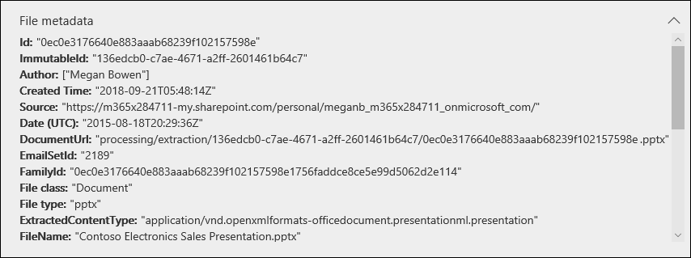

# Überprüfen von NachweisdatenReview the data in evidence

Die Daten in einem in einer Daten Untersuchung festgelegten Beweis sind eine Momentaufnahme der Suchergebnisse, die Sie gesammelt und dem Beweissatz hinzugefügt haben.The data in an evidence set in a data investigation is a snapshot of the search results that you collected and added to the evidence set. Wenn Sie Suchergebnisse zu beweisen hinzufügen, wird ein Prozess ausgelöst, um Dateien, Metadaten und Text aus den Elementen zu extrahieren, die von der Suche zurückgegeben werden.When you add search results to evidence, a process is triggered to extract files, metadata, and text from the items returned by the search. Anschließend erstellt das Tool Daten Untersuchungen (Vorschau) einen neuen Index (durch einen Prozess mit dem Namen *Advanced Indexing*) aller Daten und fügt einen auf der Registerkarte **Beweise** festgelegten Beweis hinzu.Then the Data Investigations (Preview) tool then builds a new index (by a process called *Advanced indexing*) of all the data and adds to an evidence set on the **Evidence** tab. 

Bei zeitkritischen Untersuchungen können Sie dadurch die Umgebung schnell enthalten, indem Sie die tatsächlichen verschütteten oder bösartigen Daten löschen, die sich in der at-ursprünglichen Datenquelle befinden, und gleichzeitig das erneute Erstellen von Beweisen in einer isolierten Umgebung, in diesem Fall die Daten, die in den Beweissatz kopiert werden, untersuchen.For time-sensitive investigations, this allows you to quickly contain the environment by deleting the actual spilled or malicious data located in the at original data source, while at the same time allowing you to investigate the re-created evidence in a quarantined environment, which in this case is the data copied to the evidence set). Nachdem die Beweise gesammelt und dem Beweissatz hinzugefügt wurden, können Sie einzelne Dokumente in ihrem systemeigenen Format, im Text Format oder in einem fast systemeigenen Format überprüfen, das Sie zum Beschriften und redact von Dokumenten verwenden können.After the evidence is collected and added to the evidence set, you can review individual documents in their native format, text format, or a near-native format that you can use to annotate and redact documents. Darüber hinaus können Sie Abfragen ausführen, um die festgelegten Daten nach Zeitbereich, Dateitypen, Datenbesitzern und vielen anderen Eigenschaften und Suchbedingungen einzuschränken.Additionally, you can run queries to narrow the data set by time range, file types, data owners, and many other properties and search conditions. Beispielsweise können Sie mithilfe der Autoren-, Absender-oder Empfängerbedingungen schnell erkennen, welche Personen an dem Vorfall beteiligt sind und ob Daten aus Ihrer Organisation für externe Benutzer freigegeben wurden.For example, by using the Author, Sender, or Recipient conditions, you can quickly identify the people are involved in the incident and if any data from your organization has been shared with external users. Weitere Informationen zum Durchsuchen von Daten in einem Beweis Sätze finden Sie unter [Abfragen der Daten in Evidence](evidence-query.md).For more information about searching through data in an evidence set, see [Query the data in evidence](evidence-query.md).

Um Dokumente zu gruppieren und weitere Unterstützung für Ihre Überprüfung zu erhalten, wählen Sie auf der Registerkarte **Beweise** einen Beweissatz aus, und klicken Sie dann auf **Beweise verwalten**.To group documents and get more assistance for your review, select an evidence set on the **Evidence** tab, and then click **Manage evidence**. Klicken Sie in der **Analyse** Kachel auf **Analyse für die gesamte Gruppe neu erstellen**.In the **Analytics** tile, click **Rebuild analytics for the whole set**. Dadurch werden erweiterte Analysen wie doppelte Erkennung, e-Mail-Threading und Design Analyse ausgeführt.This will run advanced analytics such as duplicate detection, email threading, and theme analysis. Anschließend können Sie die allgemeinen Themen der Daten anzeigen und auch Dokumente per e-Mail-Threads, in der Nähe von Duplikaten und genaue Duplikate organisieren, um Ihre Untersuchung zu unterstützen.Afterwards, you can see the general themes of the data and also organize documents by email threads, near duplicates, and exact duplicates to help your investigation. Weitere Informationen finden Sie unter [Ausführen von Analysen, um schneller zu untersuchen](run-analytics-to-investigate-faster.md).For more information, see [Run analytics to investigate faster](run-analytics-to-investigate-faster.md).

## Anzeigen von Dokumenten in EvidenceView documents in evidence

Mit den Daten Ermittlungen (Preview) können Sie Inhalte in verschiedenen Viewern anzeigen, wobei jeder Betrachter einen anderen Zweck hat.Data Investigations (Preview) allows you to display content in several different viewers, with each viewer having a different purpose. Diese Viewer sind:These viewers are:

- DateimetadatenFile metadata
- Systemeigene AnsichtNative view
- Text AnsichtText view
- Ansicht mit Anmerkungen versehenAnnotate view

Um auf einen dieser Viewer zuzugreifen, wählen Sie einfach ein Dokument in einem Beweissatzes aus.To access any of these viewers, just select a document in an evidence set.

## DateimetadatenFile metadata

In dieser Ansicht werden verschiedene Metadaten-Eigenschaften angezeigt, die mit dem ausgewählten Dokument verknüpft sind.This view displays various metadata properties associated with the selected document. Sie können diese Ansicht aktivieren und deaktivieren, indem Sie auf **Datei Metadaten**klicken.You can toggle this view on and off by clicking **File metadata**. Wenn Sie ein Dokument überprüfen, können Sie die Datei Metadaten anzeigen und sich immer noch zwischen den verschiedenen Viewern ändern.When reviewing a document, you can view the file metadata and still change between the different viewers.

Im folgenden finden Sie ein Beispiel für die Datei Metadaten für ein Dokument.Here's an example of the file metadata for a document. Weitere Informationen zu den Metadaten-Feldern finden Sie unter [Document Metadata fields in Data Investigations (Preview)](document-metadata-fields.md).For more information about the metadata fields, see [Document metadata fields in Data Investigations (Preview)](document-metadata-fields.md).

## Systemeigene AnsichtNative view

Der systemeigene Viewer zeigt die genaueste Ansicht eines Dokuments im systemeigenen Format an.The Native viewer displays the most accurate view of a document in it's native format. Native View wird für Hunderte von Dateitypen unterstützt und ist für die Anzeige von Dokumenten in der wahrsten nativen Umgebung möglich.Native view is supported for hundreds of file types and is meant to display documents in the truest native experience possible. Für Microsoft Office Dateien verwendet der systemeigene Viewer die Webversion von Office-Apps.For Microsoft Office files, the Native viewer uses the web version of Office apps. Auf diese Weise können Sie Inhalte wie Kommentare in verschiedenen Office-Dokumenten, Formeln und ausgeblendeten Zeilen/Spalten in Excel und die Notizenansicht in PowerPoint anzeigen.This allows you to view content such as comments in different Office documents, formulas and hidden rows/columns in Excel, and the Notes view in PowerPoint.

## Text AnsichtText view

Der Text Betrachter bietet eine Ansicht des extrahierten Texts einer Datei.The Text viewer provides a view of the extracted text of a file. Eingebettete Bilder und Formatierungen werden ignoriert, aber diese Ansicht ist sehr nützlich, wenn Sie versuchen, den Inhalt eines Dokuments schnell zu überprüfen und zu verstehen.It ignores any embedded images and formatting, but this view is very useful if you're trying to quickly review and understand the content in a document. Die Text Ansicht umfasst auch die folgenden Features:Text view also includes these features:

  - Ein Leistungsindikator, der das verweisen auf bestimmte Teile eines Dokuments erleichtert.A line counter, which makes it easier to reference specific portions of a document.

  - Hervorheben von Suchtreffern, die Begriffe im Dokument sowie auf der Bildlaufleiste hervorhebenSearch hit highlighting that highlight terms in the document as well as on the scrollbar

  - Eine diff-Ansicht bietet eine Vergleichsansicht, in der die Textunterschiede beim Anzeigen von Dokumenten mithilfe des Bereichs **nahe Duplikate** hervorgehoben werden.A diff view provides a comparison view that highlights the text differences when viewing documents using the **Near duplicates** panel.

**Beispiel für einen Leistungsindikator und eine Hervorhebung von Suchtreffern in Text und ScrollBar****Example of line counter and search hit highlighting in text and scrollbar**

**Beispiel für die diff-Ansicht****Example of the diff view**

## Ansicht mit Anmerkungen versehenAnnotate view

Die Ansicht Anmerkungen enthält Features, mit denen Sie während des Überprüfungsprozesses Markup für ein Dokument anwenden können. Dazu gehören die folgenden Tools:The Annotate view provides features that allow you to apply markup on a document during the review process; this  includes these tools:

  - **Area-Aktionen** – Sie können ein deckendes Feld im Dokument zeichnen, in dem vertrauliche Inhalte ausgeblendet werden.**Area redactions** – You can draw an opaque box on the document that hides sensitive content.

  - **Bleistift** – Sie können frei Handzeichen für ein Dokument freigeben, um die Aufmerksamkeit auf bestimmte Teile des Inhalts zu lenken.**Pencil** – You can free-hand draw on a document to bring attention to certain portions of the content

  - **Anmerkungen auswählen** – Sie können Anmerkungen in einem Dokument auswählen und löschen.**Select annotations** - You can select and delete annotations in a document.

  - **Anmerkungs Transparenz umschalten** – Sie können die Transparenz von Anmerkungen umschalten (zwischen opak und halbtransparent), damit Sie den Inhalt hinter der Anmerkung anzeigen können.**Toggle annotation transparency** – You can toggle the transparency of annotations (between opaque and semi-transparent)so you can view the content behind the annotation. Dies umfasst das Umschalten der Transparenz von Bleistift Anmerkungen und-Aktionen.This includes toggling the transparency of pencil annotations and redactions.

Die anmerkungsansicht bietet auch die folgende Navigationsfunktionalität:The Annotate view also provides the following navigation functionality:

  - **Vorherige Seite**, **Nächste Seite**, und **Navigieren Sie zu Seiten** Navigationssteuerelementen, die für mehrseitige Dokumente verwendet werden sollen.**Previous page**, **Next page**, and **Go to page** - Navigation controls to use for multi-page documents.

  - **Zoom** – erhöht oder verkleinert die Größe von Dokumenten in der Ansicht Anmerkungen.**Zoom** – Increases or decreases the size of documents in Annotate view.

  - **Drehen** – Dokumente im Uhrzeigersinn drehen.**Rotate** – Rotate documents clockwise.

  - **Suche** – suchen Sie nach Stichwörtern in einem Dokument, und verwenden Sie dann die vorherigen und nächsten Steuerelemente, um die Treffer (die hervorgehoben werden) im Dokument anzuzeigen.**Search** – Search for keywords in a document, and then use Previous and Next controls to view the hits (which are highlighted) within the document.

**Beispiel für die Ansicht "anmerken"****Example of Annotate view**

> [!NOTE]
> Anmerkungen werden auf eine Kopie des Dokuments angewendet, die dem Beweissatz hinzugefügt wurde.Annotations are applied to a copy of the document that was added to the evidence set. Die ursprünglichen Dokumente im Live-Dienst werden nicht kommentiert.The original documents in the live service aren't annotated.
