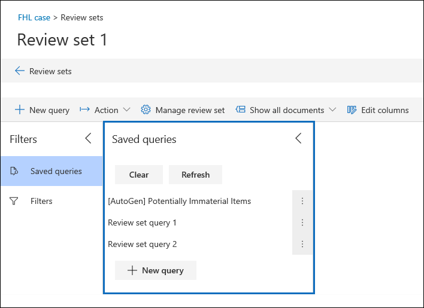
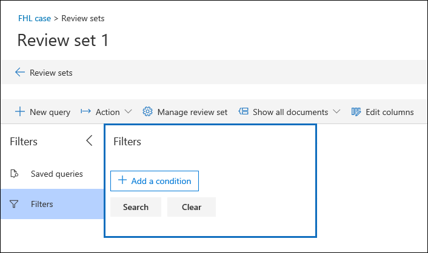

# Abfragen der Daten in einem PrüfdateisatzQuery the data in a review set

In den meisten Fällen ist es hilfreich, die Daten in einer Überprüfungsgruppe tiefer zu analysieren und diese Daten zu organisieren, um eine effizientere Überprüfung zu ermöglichen.In most cases, it will be useful to be able to dig deeper into the data in a review set and organize that data to facilitate a more efficient review. Mithilfe von Abfragen in einem Überprüfungs Satz können Sie sich auf eine Teilmenge von Dokumenten konzentrieren, die die Kriterien ihrer Überprüfung erfüllen.Using Queries in a review set helps you focus on a subset of documents that meet the criteria of your review.

## Erstellen und Durchführen einer Abfrage in einem Überprüfungs SatzesCreating and running a query in a review set

Klicken Sie zum Erstellen und Ausführen einer Abfrage für die Dokumente in einem Prüfdateisatz auf **Neue Abfrage** im Prüfdateisatz.To create and run a query on the documents in a review set, click **New query** in the review set. Nachdem Sie die Abfrage benannt und die Bedingungen definiert haben, klicken Sie auf **Speichern** , um die Abfrage zu speichern und auszuführen.After you name your query and define the conditions, click **Save** to save and run the query. Wenn Sie eine zuvor gespeicherte Abfrage ausführen möchten, klicken Sie auf eine gespeicherte Abfrage.To run a query that has been previously saved, click a saved query.

## Erstellen einer Überprüfungs Sätze-AbfrageBuilding a review set query

Sie können eine Abfrage erstellen, indem Sie eine Kombination aus Konditions Karten und Abfragesprache in der Konditions Karte Stichwörter verwenden.You can build a query by using a combination of condition cards and query language in the Keywords condition card. Sie können auch Bedingungs Karten zusammen als Block (eine *Bedingungsgruppe*) gruppieren, um eine komplexere Abfrage zu erstellen.You can also group condition cards together as a block (called a *condition group*) to build a more complex query. Eine Liste und Beschreibung der Metadaten-Eigenschaften, die Sie durchsuchen können, finden Sie unter [Dokumentmetadatenfeldern in Advanced eDiscovery](document-metadata-fields-in-Advanced-eDiscovery.md).For a list and description of metadata properties that you can search, see [Document metadata fields in Advanced eDiscovery](document-metadata-fields-in-Advanced-eDiscovery.md).

### Konditions KartenCondition cards

Jedes durchsuchbare Feld in einem Überprüfungs-Datensatz verfügt über eine entsprechende Bedingungs Karte, die Sie zum Erstellen Ihrer Abfrage verwenden können.Every searchable field in a review set has a corresponding condition card that you can use to build your query.

Es gibt mehrere Arten von Konditions Karten:There are multiple types of condition cards:

- FREETEXT: eine FREETEXT-Bedingungs Karte wird für Textfelder wie Betreff verwendet.Freetext: A freetext condition card is used for text fields such as subject. Sie können mehrere Suchbegriffe auflisten, indem Sie Sie durch ein Komma voneinander trennen.You can list multiple search terms by separating them out with a comma.

- Datum: eine Datums-Konditions Karte wird für Datumsfelder wie Datum der letzten Änderung verwendet.Date: A date condition card is used for date fields such as last modified date.

- Suchoptionen: eine Bedingungs Karte für Suchoptionen enthält eine Liste der möglichen Werte für das jeweilige Feld im Überprüfungs.Search options: A search options condition card will provide a list of possible values for the particular field in your review set. Dies wird für Felder wie Absender verwendet, bei denen eine begrenzte Anzahl möglicher Werte in ihrer Überprüfungsgruppe vorhanden ist.This is used for fields, such as sender, where there is a finite number of possible values in your review set.

- Stichwort: eine Keyword-Bedingungs Karte ist eine bestimmte Instanz der FREETEXT-Konditions Karte, mit der Sie nach Begriffen suchen oder KQL-ähnliche Abfragesprache in verwenden können.Keyword: A keyword condition card is a specific instance of freetext condition card that you can use to search for terms, or use KQL-like query language in. Weitere Details finden Sie weiter unten.See below for more detail.

### AbfragespracheQuery language

Zusätzlich zu den Konditions Karten können Sie eine KQL-ähnliche Abfragesprache in der Stichwörter Karte verwenden, um Ihre Abfrage zu erstellen.In addition to condition cards, you can use a KQL-like query language in the Keywords card to build your query. Die Abfragesprache für Review-Mengen Abfragen unterstützt Standard boolesche Operatoren wie **and**, **or**, **Not**und **near**.The query language for review set queries supports standard Boolean operators, such as **AND**, **OR**, **NOT**, and **NEAR**. Außerdem wird ein Platzhalter mit einem einzelnen Zeichen (?) und ein mehr stelliger Platzhalter (\*) unterstützt.It also supports a single-character wildcard (?) and a multi-character wildcard (\*).

## Verwenden von FilternUsing filters

Zusätzlich zu den Abfragen, die Sie speichern können, können Sie mithilfe von Filtersätzen für eine Überprüfungs Satz Abfrage schnell zusätzliche Bedingungen anwenden.In addition to queries that you can save, you can use review set filters to quickly apply additional conditions to a review set query. Auf diese Weise können Sie die durch eine Prüfdateisatz-Abfrage angezeigten Ergebnisse weiter verfeinern.This helps you further refine the results displayed by a review set query.

Filter unterscheiden sich in zwei wichtigen Punkten von Abfragen:Filters differ from queries in two significant ways:

- Filter sind vorübergehend.Filters are transient. Sie bleiben außerhalb der vorhandenen Sitzung bestehen.They don't persist beyond the existing session. Mit anderen Worten: Sie können einen Filter nicht speichern.In other words, you can't save a filter. Abfragen werden in der Überprüfungsgruppe gespeichert und greifen beim Öffnen des Überprüfungs Satzes auf diese zu.Queries are saved to the review set, and access them whenever open the review set.

- Filter sind immer additiv.Filters are always additive. Filter werden zusätzlich zur aktuellen Prüfdateisatz-Abfrage angewendet.Filters are applied in addition to the current review set query. Durch das Anwenden einer anderen Abfrage werden die von der aktuellen Abfrage zurückgegebenen Ergebnisse ersetzt.Applying a different query will replace the results returned by the current query.
