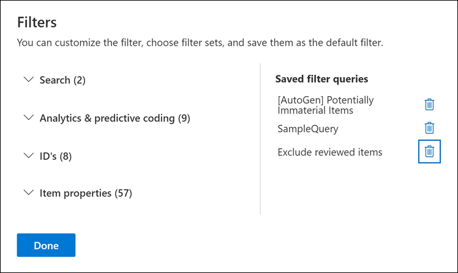

# Abfragen und Filtern von Inhalten in einem Prüfdateisatz

In den meisten Fällen ist es hilfreich, sich eingehender mit den Inhalten in einem Prüfdateisatz zu befassen und sie zu organisieren, um eine effizientere Überprüfung zu ermöglichen. Mithilfe von Filtern und Abfragen in einem Prüfdateisatz können Sie sich auf eine Teilmenge von Dokumenten konzentrieren, die den Kriterien Ihrer Rezension entsprechen.

## Standardfilter

In einem Prüfdateisatz gibt es fünf Standardfilter, die im Prüfdateisatz vorinstalliert sind:

- Schlüsselwörter
- Datum
- Absender/Autor
- Betreff/Titel
- Tags

Klicken Sie auf jeden Filter, um ihn zu erweitern und einen Wert zuzuweisen. Klicken Sie außerhalb des Filters, um den Filter automatisch auf den Prüfdateisatz anzuwenden. Der folgende Screenshot zeigt den Datumsfilter, der so konfiguriert ist, dass Dokumente innerhalb eines Datumsbereichs angezeigt werden.

## Hinzufügen oder Entfernen von Filtern

Um Filter hinzuzufügen oder zu entfernen, die für den Prüfdateisatz angezeigt werden, wählen Sie **Filter** aus, um den Filterbereich zu öffnen, der auf einer Flyoutseite angezeigt wird. 

Die verfügbaren Filter sind in vier Abschnitten unterteilt:

- **Suche:** Filter, die unterschiedliche Suchfunktionen bereitstellen.

- **Analyse & vorhersagebasierte Codierung:** Filter für Eigenschaften, die generiert und zu Dokumenten hinzugefügt werden, wenn Sie das **Dokument & E-Mail-Analyseauftrag** ausführen oder Modelle für die Vorhersagecodierung verwenden.

- **IDs:** Filtert nach allen ID-Eigenschaften von Dokumenten.

- **Elementeigenschaften:** Filter für Dokumenteigenschaften. 

Erweitern Sie jeden Abschnitt, und wählen Oder deaktivieren Sie Filter, um sie im Filtersatz hinzuzufügen oder zu entfernen. Wenn Sie einen Filter hinzufügen, wird er im Filtersatz angezeigt. 

> [!NOTE]
> Wenn Sie einen Abschnitt im Filterbereich erweitern, werden Sie feststellen, dass die Standardfiltertypen ausgewählt sind. Sie können diese ausgewählt lassen oder die Auswahl aufheben und sie aus dem Filtersatz entfernen. 

## Filtertypen

Jedes durchsuchbare Feld in einem Prüfdateisatz verfügt über einen entsprechenden Filter, den Sie für Filterelemente verwenden können, die auf einem bestimmten Feld basieren.

Es gibt mehrere Filtertypen:

- **Freetext:** Auf Textfelder wie "Subject" wird ein Freitextfilter angewendet. Sie können mehrere Suchbegriffe auflisten, indem Sie sie durch ein Komma trennen.

- **Datum:** Ein Datumsfilter wird für Datumsfelder wie "Datum der letzten Änderung" verwendet.

- **Suchoptionen:** Ein Suchoptionenfilter stellt eine Liste möglicher Werte (jeder Wert wird mit einem Kontrollkästchen angezeigt, das Sie auswählen können) für bestimmte Felder in der Rezension bereit. Dieser Filter wird für Felder wie "Sender" verwendet, in denen eine begrenzte Anzahl möglicher Werte im Prüfdateisatz vorhanden ist.

- **Schlüsselwort:** Eine Schlüsselwortbedingung ist eine bestimmte Instanz der Freitextbedingung, die Sie verwenden können, um nach Begriffen zu suchen. Sie können auch KQL-ähnliche Abfragesprache in diesem Filtertyp verwenden. Weitere Informationen finden Sie in den Abschnitten "Abfragesprache" und "Erweiterter Abfrage-Generator" in diesem Thema.

## Einschließen und Ausschließen von Filterbeziehungen

Sie haben die Möglichkeit, die Ein- und Ausschließen-Beziehung für einen bestimmten Filter zu ändern. Im Tag-Filter können Sie beispielsweise Elemente ausschließen, die mit einem bestimmten Tag markiert sind, indem Sie im Dropdownfilter **"Gleich"** auswählen. 

## Speichern von Filtern als Abfragen

Nachdem Sie mit Ihren Filtern zufrieden sind, können Sie die Filterkombination als Filterabfrage speichern. Auf diese Weise können Sie den Filter in zukünftigen Überprüfungssitzungen anwenden.

Wählen Sie zum Speichern eines Filters **die Option "Abfrage speichern"** aus, und nennen Sie sie. Sie oder andere Prüfer können zuvor gespeicherte Filterabfragen ausführen, indem Sie die Dropdownliste **"Gespeicherte Filterabfragen"** und eine Filterabfrage auswählen, die auf Prüfdateisatzdokumente angewendet werden soll. 

Um eine Filterabfrage zu löschen, öffnen Sie den Filterbereich, und wählen Sie neben der Abfrage das Papierkorbsymbol aus.

## Abfragesprache

Zusätzlich zur Verwendung von Filtern können Sie auch eine KQL-ähnliche Abfragesprache im Filter "Schlüsselwörter" verwenden, um die Suchabfrage für den Prüfdateisatz zu erstellen. Die Abfragesprache für Überprüfungssatzabfragen unterstützt standardmäßige boolesche Operatoren wie **AND**, **OR**, **NOT** und **NEAR**. Es unterstützt auch einen einstelligen Platzhalter (?) und einen mehrstelligen Platzhalter (*).

## Erweiterter Abfrage-Generator

Sie können auch erweiterte Abfragen erstellen, um nach Dokumenten in einem Prüfdateisatz zu suchen.

1. Öffnen Sie den Filterbereich, wählen Sie **Filter** aus, und erweitern Sie den **Suchabschnitt.**

  

2. Wählen Sie den **KQL-Filter** aus, und klicken Sie auf **"Abfrage-Generator öffnen".**

   In diesem Bereich können Sie komplexe KQL-Abfragen mithilfe des Abfrage-Generators erstellen. Sie können Bedingungen hinzufügen oder Bedingungsgruppen hinzufügen, die aus mehreren Bedingungen bestehen, die logisch durch **AND-** oder **OR-Beziehungen** verbunden sind.

   
