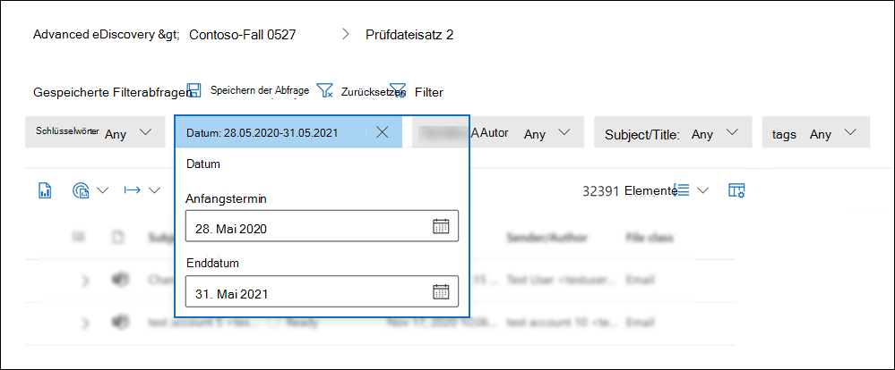
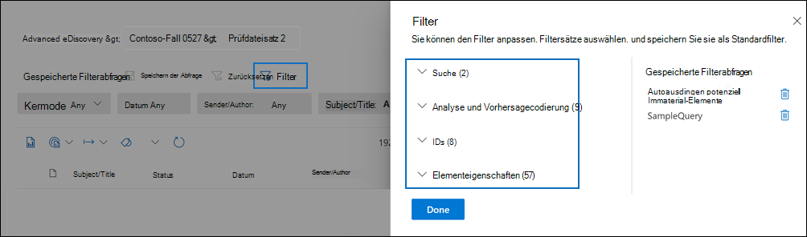
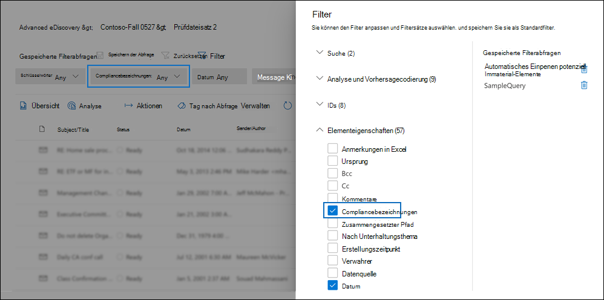
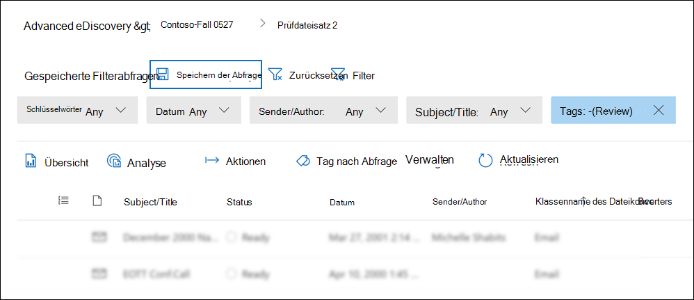
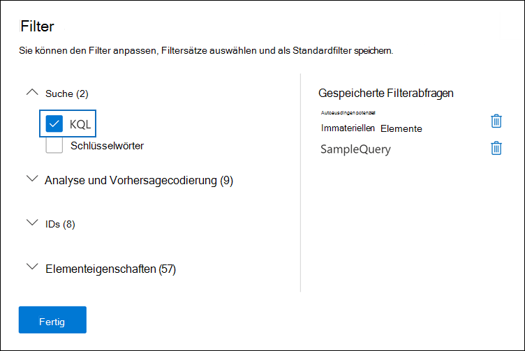
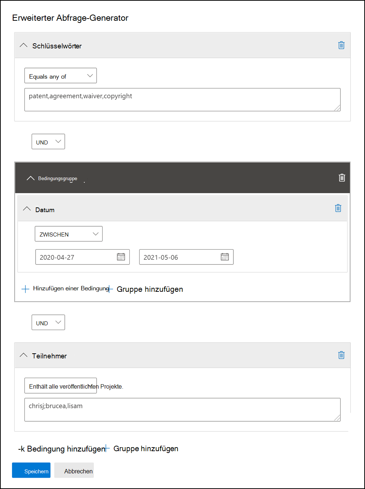

# Abfragen und Filtern von Inhalten in einem PrüfdateisatzQuery and filter content in a review set

In den meisten Fällen ist es hilfreich, sich eingehender mit den Inhalten in einem Prüfdateisatz zu befassen und sie zu organisieren, um eine effizientere Überprüfung zu ermöglichen.In most cases, it will be useful to dig deeper into the content in a review set and organize it to facilitate a more efficient review. Mithilfe von Filtern und Abfragen in einem Prüfdateisatz können Sie sich auf eine Teilmenge von Dokumenten konzentrieren, die den Kriterien Ihrer Rezension entsprechen.Using filters and queries in a review set helps you focus on a subset of documents that meet the criteria of your review.

## StandardfilterDefault filters

In einem Prüfdateisatz gibt es fünf Standardfilter, die im Prüfdateisatz vorinstalliert sind:In a review set, there are five default filters that are pre-loaded in the review set:

- SchlüsselwörterKeywords
- DatumDate
- Absender/AutorSender/Author
- Betreff/TitelSubject/Title
- TagsTags

Klicken Sie auf jeden Filter, um ihn zu erweitern und einen Wert zuzuweisen.Click each filter to expand it and assign a value. Klicken Sie außerhalb des Filters, um den Filter automatisch auf den Prüfdateisatz anzuwenden.Click outside the filter to automatically apply the filter to the review set. Der folgende Screenshot zeigt den Datumsfilter, der so konfiguriert ist, dass Dokumente innerhalb eines Datumsbereichs angezeigt werden.The following screenshot shows the Date filter configured to show documents within a date range.

## Hinzufügen oder Entfernen von FilternAdd or remove filters

Um Filter hinzuzufügen oder zu entfernen, die für den Prüfdateisatz angezeigt werden, wählen Sie **Filter** aus, um den Filterbereich zu öffnen, der auf einer Flyoutseite angezeigt wird.To add or remove filters that are displayed for the review set, select **Filters** to open the filter panel, which is displayed on a flyout page. 

Die verfügbaren Filter sind in vier Abschnitten unterteilt:The available filters are organized in four sections:

- **Suche:** Filter, die unterschiedliche Suchfunktionen bereitstellen.**Search**: Filters that provide different search capabilities.

- **Analyse & vorhersagebasierte Codierung:** Filter für Eigenschaften, die generiert und zu Dokumenten hinzugefügt werden, wenn Sie das **Dokument & E-Mail-Analyseauftrag** ausführen oder Modelle für die Vorhersagecodierung verwenden.**Analytics & predictive coding**: Filters for properties generated and added to documents when you run the **Document & email analytic** job or use predictive coding models.

- **IDs:** Filtert nach allen ID-Eigenschaften von Dokumenten.**IDs**: Filters for all ID properties of documents.

- **Elementeigenschaften:** Filter für Dokumenteigenschaften.**Item properties**: Filters for document properties. 

Erweitern Sie jeden Abschnitt, und wählen Oder deaktivieren Sie Filter, um sie im Filtersatz hinzuzufügen oder zu entfernen.Expand each section and select or deselect filters to add or remove them in the filter set. Wenn Sie einen Filter hinzufügen, wird er im Filtersatz angezeigt.When you add a filter, it's displayed in the filter set. 

> [!NOTE]
> Wenn Sie einen Abschnitt im Filterbereich erweitern, werden Sie feststellen, dass die Standardfiltertypen ausgewählt sind.When you expand a section in the filter panel, you'll notice that the default filter types are selected. Sie können diese ausgewählt lassen oder die Auswahl aufheben und sie aus dem Filtersatz entfernen.You can keep these selected or deselect them and removed them from the filter set. 

## FiltertypenFilter types

Jedes durchsuchbare Feld in einem Prüfdateisatz verfügt über einen entsprechenden Filter, den Sie für Filterelemente verwenden können, die auf einem bestimmten Feld basieren.Every searchable field in a review set has a corresponding filter that you can use for filter items based on a specific field.

Es gibt mehrere Filtertypen:There are multiple types of filters:

- **Freetext:** Auf Textfelder wie "Subject" wird ein Freitextfilter angewendet.**Freetext**: A freetext filter is applied to text fields such as "Subject". Sie können mehrere Suchbegriffe auflisten, indem Sie sie durch ein Komma trennen.You can list multiple search terms by separating them with a comma.

- **Datum:** Ein Datumsfilter wird für Datumsfelder wie "Datum der letzten Änderung" verwendet.**Date**: A date filter is used for date fields such as "Last modified date".

- **Suchoptionen:** Ein Suchoptionenfilter stellt eine Liste möglicher Werte (jeder Wert wird mit einem Kontrollkästchen angezeigt, das Sie auswählen können) für bestimmte Felder in der Rezension bereit.**Search options**: A search options filter provides a list of possible values (each value is displayed with a checkbox that you can select) for particular fields in the review. Dieser Filter wird für Felder wie "Sender" verwendet, in denen eine begrenzte Anzahl möglicher Werte im Prüfdateisatz vorhanden ist.This filter is used for fields, such as "Sender", where there is a finite number of possible values in the review set.

- **Schlüsselwort:** Eine Schlüsselwortbedingung ist eine bestimmte Instanz der Freitextbedingung, die Sie verwenden können, um nach Begriffen zu suchen.**Keyword**: A keyword condition is a specific instance of freetext condition that you can use to search for terms. Sie können auch KQL-ähnliche Abfragesprache in diesem Filtertyp verwenden.You can also use KQL-like query language in this type of filter. Weitere Informationen finden Sie in den Abschnitten "Abfragesprache" und "Erweiterter Abfrage-Generator" in diesem Thema.For more information, see the Query language and Advanced query builder sections in this topic.

## Einschließen und Ausschließen von FilterbeziehungenInclude and exclude filter relationships

Sie haben die Möglichkeit, die Ein- und Ausschließen-Beziehung für einen bestimmten Filter zu ändern.You have the option to change the include and exclude relationship for a particular filter. Im Tag-Filter können Sie beispielsweise Elemente ausschließen, die mit einem bestimmten Tag markiert sind, indem Sie im Dropdownfilter **"Gleich"** auswählen.For example, in the Tag filter, you can exclude items that are tagged with a particular tag by selecting **Equals none of** in the dropdown filter. 

## Speichern von Filtern als AbfragenSave filters as queries

Nachdem Sie mit Ihren Filtern zufrieden sind, können Sie die Filterkombination als Filterabfrage speichern.After you are satisfied with your filters, you can save the filter combination as a filter query. Auf diese Weise können Sie den Filter in zukünftigen Überprüfungssitzungen anwenden.This lets you apply the filter in the future review sessions.

Wählen Sie zum Speichern eines Filters **die Option "Abfrage speichern"** aus, und nennen Sie sie.To save a filter, select **Save the query** and name it. Sie oder andere Prüfer können zuvor gespeicherte Filterabfragen ausführen, indem Sie die Dropdownliste **"Gespeicherte Filterabfragen"** und eine Filterabfrage auswählen, die auf Prüfdateisatzdokumente angewendet werden soll.You or other reviewers can run previously saved filter queries by selecting the **Saved filter queries** dropdown and selecting a filter query to apply to review set documents. 

Um eine Filterabfrage zu löschen, öffnen Sie den Filterbereich, und wählen Sie neben der Abfrage das Papierkorbsymbol aus.To delete a filter query, open the filter panel and select the trashcan icon next to the query.

## AbfragespracheQuery language

Zusätzlich zur Verwendung von Filtern können Sie auch eine KQL-ähnliche Abfragesprache im Filter "Schlüsselwörter" verwenden, um die Suchabfrage für den Prüfdateisatz zu erstellen.In addition to using filters, you can also use a KQL-like query language in the Keywords filter to build your review set search query. Die Abfragesprache für Überprüfungssatzabfragen unterstützt standardmäßige boolesche Operatoren wie **AND**, **OR**, **NOT** und **NEAR**.The query language for review set queries supports standard Boolean operators, such as **AND**, **OR**, **NOT**, and **NEAR**. Es unterstützt auch einen einstelligen Platzhalter (?) und einen mehrstelligen Platzhalter (\*).It also supports a single-character wildcard (?) and a multi-character wildcard (\*).

## Erweiterter Abfrage-GeneratorAdvanced query builder

Sie können auch erweiterte Abfragen erstellen, um nach Dokumenten in einem Prüfdateisatz zu suchen.You can also build more advanced queries to search for documents in a review set.

1. Öffnen Sie den Filterbereich, wählen Sie **Filter** aus, und erweitern Sie den **Suchabschnitt.**Open the filter panel, select **Filters**, and expand the **Search** section.

  

2. Wählen Sie den **KQL-Filter** aus, und klicken Sie auf **"Abfrage-Generator öffnen".**Select the **KQL** filter and click **Open query builder**.

   In diesem Bereich können Sie komplexe KQL-Abfragen mithilfe des Abfrage-Generators erstellen.In this panel, you can create complex KQL queries by using the query builder. Sie können Bedingungen hinzufügen oder Bedingungsgruppen hinzufügen, die aus mehreren Bedingungen bestehen, die logisch durch **AND-** oder **OR-Beziehungen** verbunden sind.You can add conditions or add condition groups that are made up of multiple conditions that are logically connected by **AND** or **OR** relationships.

   
