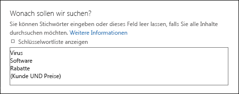
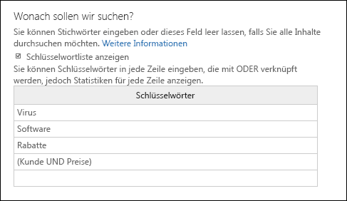
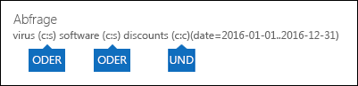

# <a name="run-a-content-search-in-the-security--compliance-center"></a><span data-ttu-id="75f46-103">Ausführen einer Inhaltssuche im Security & Compliance Center</span><span class="sxs-lookup"><span data-stu-id="75f46-103">Run a Content Search in the Security & Compliance Center</span></span>

<span data-ttu-id="75f46-104">Sie können das eDiscovery-Tool für die Inhaltssuche im Security #a0 Compliance Center verwenden, um nach Elementen wie e-Mails, Dokumenten und Chat Unterhaltungen in Ihrer Office 365 Organisation zu suchen.</span><span class="sxs-lookup"><span data-stu-id="75f46-104">You can use the Content Search eDiscovery tool in the Security & Compliance Center to search for items such as email, documents, and instant messaging conversations in your Office 365 organization.</span></span> <span data-ttu-id="75f46-105">Mithilfe dieses Tools können Sie nach Elementen in folgenden Office 365-Diensten suchen:</span><span class="sxs-lookup"><span data-stu-id="75f46-105">Use this tool to search for items in these Office 365 services:</span></span>
  
- <span data-ttu-id="75f46-106">Exchange-Postfächer und öffentliche Ordner</span><span class="sxs-lookup"><span data-stu-id="75f46-106">Exchange Online mailboxes and public folders</span></span>
    
- <span data-ttu-id="75f46-107">SharePoint Online-und OneDrive für Unternehmen-Websites</span><span class="sxs-lookup"><span data-stu-id="75f46-107">SharePoint Online and OneDrive for Business sites</span></span>
    
- <span data-ttu-id="75f46-108">Skype for Business-Unterhaltungen</span><span class="sxs-lookup"><span data-stu-id="75f46-108">Skype for Business conversations</span></span>
    
- <span data-ttu-id="75f46-109">Microsoft Teams</span><span class="sxs-lookup"><span data-stu-id="75f46-109">Microsoft Teams</span></span> 
    
- <span data-ttu-id="75f46-110">Office 365-Gruppen</span><span class="sxs-lookup"><span data-stu-id="75f46-110">Office 365 Groups</span></span>
    
<span data-ttu-id="75f46-111">Die Inhaltssuche ist ein neues eDiscovery-Such Tool mit neuen und verbesserten Skalierungs-und Leistungsfunktionen.</span><span class="sxs-lookup"><span data-stu-id="75f46-111">Content Search is a new eDiscovery search tool with new and improved scaling and performance capabilities.</span></span> <span data-ttu-id="75f46-112">Verwenden Sie die Inhaltssuche, um sehr umfangreiche eDiscovery-suchen auszuführen.</span><span class="sxs-lookup"><span data-stu-id="75f46-112">Use Content Search to run very large eDiscovery searches.</span></span> <span data-ttu-id="75f46-113">Sie können alle Postfächer, alle öffentlichen Exchange-Ordner und alle SharePoint Online Websites und OneDrive für Unternehmen Konten in einer einzigen Inhaltssuche durchsuchen.</span><span class="sxs-lookup"><span data-stu-id="75f46-113">You can search all mailboxes, all Exchange public folders, and all SharePoint Online sites and OneDrive for Business accounts in a single Content Search.</span></span> <span data-ttu-id="75f46-114">Es gibt keine Beschränkungen für die Anzahl der inhaltsspeicherorte, die Sie durchsuchen können.</span><span class="sxs-lookup"><span data-stu-id="75f46-114">There are no limits on the number of content locations that you can search.</span></span> <span data-ttu-id="75f46-115">Außerdem gibt es keine Beschränkungen für die Anzahl der Suchvorgänge, die gleichzeitig ausgeführt werden können.</span><span class="sxs-lookup"><span data-stu-id="75f46-115">There are also no limits on the number of searches that can run at the same time.</span></span> <span data-ttu-id="75f46-116">Nachdem Sie eine Inhaltssuche ausgeführt haben, werden die Anzahl der inhaltsspeicherorte und die geschätzte Anzahl der Suchergebnisse im Detailbereich auf der Seite **Inhaltssuche** angezeigt.</span><span class="sxs-lookup"><span data-stu-id="75f46-116">After you run a Content Search, the number of content locations and an estimated number of search results are displayed in the details pane on the **Content search** page.</span></span> <span data-ttu-id="75f46-117">Nachdem Sie eine Suche ausgeführt haben, können Sie eine Vorschau der Ergebnisse anzeigen, Schlüsselwort Statistiken für eine oder mehrere Suchvorgänge abrufen, die Inhaltssuche Massen bearbeiten und die Ergebnisse auf einen lokalen Computer exportieren.</span><span class="sxs-lookup"><span data-stu-id="75f46-117">After you run a search you can preview the results, get keyword statistics for one or more searches, bulk-edit content searches, and export the results to a local computer.</span></span> 
  
 <span data-ttu-id="75f46-118">**Inhalt**</span><span class="sxs-lookup"><span data-stu-id="75f46-118">**Contents**</span></span>
  
[<span data-ttu-id="75f46-119">Create a search</span><span class="sxs-lookup"><span data-stu-id="75f46-119">Create a search</span></span>](run-a-content-search-in-the-security-and-compliance-center.md#create)
  
[<span data-ttu-id="75f46-120">Exportieren der Suchergebnisse</span><span class="sxs-lookup"><span data-stu-id="75f46-120">Export search results</span></span>](run-a-content-search-in-the-security-and-compliance-center.md#export)
  
[<span data-ttu-id="75f46-121">Preview search results</span><span class="sxs-lookup"><span data-stu-id="75f46-121">Preview search results</span></span>](run-a-content-search-in-the-security-and-compliance-center.md#preview)
  
[<span data-ttu-id="75f46-122">Update search results</span><span class="sxs-lookup"><span data-stu-id="75f46-122">Update search results</span></span>](run-a-content-search-in-the-security-and-compliance-center.md#restart)
  
[<span data-ttu-id="75f46-123">Edit a search</span><span class="sxs-lookup"><span data-stu-id="75f46-123">Edit a search</span></span>](run-a-content-search-in-the-security-and-compliance-center.md#edit)
  
[<span data-ttu-id="75f46-124">Retry a search</span><span class="sxs-lookup"><span data-stu-id="75f46-124">Retry a search</span></span>](run-a-content-search-in-the-security-and-compliance-center.md#retry)
  

  
## <a name="before-you-begin"></a><span data-ttu-id="75f46-125">Bevor Sie beginnen:</span><span class="sxs-lookup"><span data-stu-id="75f46-125">Before you begin</span></span>

- <span data-ttu-id="75f46-126">Informationen und Anleitungen zum Erstellen von Suchabfragen und zum Verwenden von booleschen Suchoperatoren finden Sie unter [Keyword-Abfragen und Suchbedingungen für die Inhaltssuche](keyword-queries-and-search-conditions.md).</span><span class="sxs-lookup"><span data-stu-id="75f46-126">For information and guidance about building search queries and using Boolean search operators, see [Keyword queries and search conditions for Content Search](keyword-queries-and-search-conditions.md).</span></span> <span data-ttu-id="75f46-127">Dieser Artikel enthält auch Informationen zum Suchen nach vertraulichen Informationstypen und zum Suchen nach Inhalten, die für Personen innerhalb und außerhalb Ihrer Organisation freigegeben sind.</span><span class="sxs-lookup"><span data-stu-id="75f46-127">This article also contains information about searching for sensitive information types and searching for content that's shared with people inside and outside of your organization.</span></span>
    
- <span data-ttu-id="75f46-128">Wenn Sie Zugriff auf die Seite für die **Inhaltssuche** haben möchten, um Suchergebnisse durchzuführen und eine Vorschau anzuzeigen und zu exportieren, müssen ein Administrator, ein Compliance Officer oder ein eDiscovery-Manager Mitglied der Rollengruppe "eDiscovery-Manager" im Security #a0 Compliance Center sein.</span><span class="sxs-lookup"><span data-stu-id="75f46-128">To have access to the **Content search** page to perform searches and preview and export search results, an administrator, compliance officer, or eDiscovery manager must be a member of the eDiscovery Manager role group in the Security & Compliance Center.</span></span> <span data-ttu-id="75f46-129">Sie müssen keine zusätzlichen Suchberechtigungen in Exchange Online, SharePoint Online oder für OneDrive für Unternehmen Websites zuweisen.</span><span class="sxs-lookup"><span data-stu-id="75f46-129">You don't have to assign additional search permissions in Exchange Online, SharePoint Online, or for OneDrive for Business sites.</span></span> <span data-ttu-id="75f46-130">Weitere Informationen finden Sie unter [Zuweisen von eDiscovery-Berechtigungen im Office 365 Security #a0 Compliance Center](assign-ediscovery-permissions.md).</span><span class="sxs-lookup"><span data-stu-id="75f46-130">For more information, see [Assign eDiscovery permissions in the Office‍ 365 Security & Compliance Center](assign-ediscovery-permissions.md).</span></span>
    
- <span data-ttu-id="75f46-131">Es gibt Beschränkungen, die auf die Inhaltssuche angewendet werden, um die Integrität und Qualität von Diensten zu gewährleisten, die Office 365 Organisationen bereitgestellt werden.</span><span class="sxs-lookup"><span data-stu-id="75f46-131">There are limits applied to Content Search to maintain the health and quality of services provided to Office 365 organizations.</span></span> <span data-ttu-id="75f46-132">In den meisten Fällen können diese Grenzwerte nicht geändert werden, Sie sollten die Werte jedoch beachten, damit Sie die Grenzen bei der Planung, beim Ausführen und bei der Problembehandlung von Suchvorgängen berücksichtigen können.</span><span class="sxs-lookup"><span data-stu-id="75f46-132">In most cases, you can't modify these limits, but you should be aware of them so that you can take these limits into consideration when planning, running, and troubleshooting searches.</span></span> <span data-ttu-id="75f46-133">Weitere Informationen finden Sie unter [Grenzwerte für die Suche im Security #a0 Compliance Center](limits-for-content-search.md).</span><span class="sxs-lookup"><span data-stu-id="75f46-133">For more information, see [Limits for Search in the Security & Compliance Center](limits-for-content-search.md).</span></span>
    
- <span data-ttu-id="75f46-134">Lesen Sie den Abschnitt Geschätzte Suchzeiten basierend auf der Anzahl von Postfächern, die in einer einzelnen Inhaltssuche durchsucht werden.</span><span class="sxs-lookup"><span data-stu-id="75f46-134">See the  section for estimated search times based on the number of mailboxes that are searched in a single Content Search.</span></span> 
    
- <span data-ttu-id="75f46-135">Wie bereits erwähnt, können Sie die Inhaltssuche verwenden, um nach Inhalten in Office 365 Gruppen und Microsoft Teams zu suchen.</span><span class="sxs-lookup"><span data-stu-id="75f46-135">As previously stated, you can use Content Search to search for content in Office 365 Groups and Microsoft Teams.</span></span> <span data-ttu-id="75f46-136">Dies bedeutet, dass Sie das Gruppenpostfach, den freigegebenen Kalender und die SharePoint-Websites durchsuchen können, die einer Office 365 Gruppe und einem Microsoft-Team zugeordnet sind.</span><span class="sxs-lookup"><span data-stu-id="75f46-136">This means you can search the group mailbox, shared calendar, and SharePoint sites associated with an Office 365 Group and a Microsoft Team.</span></span> <span data-ttu-id="75f46-137">Darüber hinaus können Sie die Kanal Unterhaltungen in einem Microsoft-Team durchsuchen.</span><span class="sxs-lookup"><span data-stu-id="75f46-137">Additionally, you can search the channel conversations in a Microsoft Team.</span></span> <span data-ttu-id="75f46-138">Informationen zu Office 365 Gruppen und Microsoft Teams finden Sie unter:</span><span class="sxs-lookup"><span data-stu-id="75f46-138">For information about Office 365 Groups and Microsoft Teams, see:</span></span>
    
  - [<span data-ttu-id="75f46-139">Weitere Informationen zu Office 365-Gruppen</span><span class="sxs-lookup"><span data-stu-id="75f46-139">Learn about Office 365 groups</span></span>](https://support.office.com/article/b565caa1-5c40-40ef-9915-60fdb2d97fa2)
    
  - [<span data-ttu-id="75f46-140">Hilfe zu Microsoft Teams</span><span class="sxs-lookup"><span data-stu-id="75f46-140">Microsoft Teams help</span></span>](https://support.office.com/article/23156c0c-2c6e-49dd-8b7b-7c564b76508c)
    
    <span data-ttu-id="75f46-141">Im Abschnitt finden Sie Tipps zum Suchen nach Inhalten in Office 365 Gruppen und Microsoft Teams.</span><span class="sxs-lookup"><span data-stu-id="75f46-141">See the  section for tips on searching for content in Office 365 Groups and Microsoft Teams.</span></span> 
    
[<span data-ttu-id="75f46-142">Return to top</span><span class="sxs-lookup"><span data-stu-id="75f46-142">Return to top</span></span>](run-a-content-search-in-the-security-and-compliance-center.md#top)
  
## <a name="create-a-search"></a><span data-ttu-id="75f46-143">Erstellen einer Suche</span><span class="sxs-lookup"><span data-stu-id="75f46-143">Create a search</span></span>
<span data-ttu-id="75f46-144"><a name="create"> </a></span><span class="sxs-lookup"><span data-stu-id="75f46-144"></span></span>

1. <span data-ttu-id="75f46-145">Wechseln Sie zu [https://protection.office.com](https://protection.office.com).</span><span class="sxs-lookup"><span data-stu-id="75f46-145">Go to [https://protection.office.com](https://protection.office.com).</span></span>
    
2. <span data-ttu-id="75f46-146">Melden Sie sich bei Office 365 mit Ihrem Geschäfts-, Schul- oder Unikonto an.</span><span class="sxs-lookup"><span data-stu-id="75f46-146">Sign in to Office 365 using your work or school account.</span></span>
    
3. <span data-ttu-id="75f46-147">Klicken Sie im linken Bereich des Security #a0 Compliance Centers auf **Such** \> **Inhaltssuche**.</span><span class="sxs-lookup"><span data-stu-id="75f46-147">In the left pane of the Security & Compliance Center, click **Search** \> **Content search**.</span></span>
    
4. <span data-ttu-id="75f46-148">Klicken Sie auf **Neu**.</span><span class="sxs-lookup"><span data-stu-id="75f46-148">Click **New**.</span></span>
    
5. <span data-ttu-id="75f46-149">Geben Sie auf der Seite **Neue Suche** einen Namen für die Inhaltssuche ein.</span><span class="sxs-lookup"><span data-stu-id="75f46-149">On the **New search** page, type a name for the Content Search.</span></span> <span data-ttu-id="75f46-150">Dieser Name muss in der Organisation eindeutig sein.</span><span class="sxs-lookup"><span data-stu-id="75f46-150">This name has to be unique in your organization.</span></span> 
    
6. <span data-ttu-id="75f46-151">Wählen Sie die inhaltsspeicherorte aus, die Sie durchsuchen möchten.</span><span class="sxs-lookup"><span data-stu-id="75f46-151">Choose the content locations that you want to search.</span></span> <span data-ttu-id="75f46-152">Sie können Postfächer, Websites und öffentliche Ordner in derselben Suche durchsuchen.</span><span class="sxs-lookup"><span data-stu-id="75f46-152">You can search mailboxes, sites, and public folders in the same search.</span></span>
    
    
  
1. <span data-ttu-id="75f46-154">**Überall suchen** Wählen Sie diese Option aus, um alle inhaltsspeicherorte in Ihrer Organisation zu durchsuchen.</span><span class="sxs-lookup"><span data-stu-id="75f46-154">**Search everywhere**Select this option to search all content locations in your organization.</span></span> <span data-ttu-id="75f46-155">Wenn Sie diese Option auswählen, können Sie auswählen, dass alle Postfächer durchsucht werden sollen (einschließlich inaktiver Postfächer und der Postfächer für alle Office 365 Gruppen und Microsoft Teams), alle SharePoint-und OneDrive für Unternehmen-Websites (die die Websites für alle Office 365 Gruppen enthalten und Microsoft Teams) und alle öffentlichen Ordner.</span><span class="sxs-lookup"><span data-stu-id="75f46-155">When you select this option, you can choose to search all mailboxes (including inactive mailboxes and the mailboxes for all Office 365 Groups and Microsoft Teams), all SharePoint and OneDrive for Business sites (which includes the sites for all Office 365 groups and Microsoft Teams), and all public folders.</span></span>
    
    
  
2. <span data-ttu-id="75f46-157">**Benutzerdefinierte Standortauswahl** Wählen Sie diese Option aus, um die Postfächer und Websites auszuwählen, die Sie durchsuchen möchten.</span><span class="sxs-lookup"><span data-stu-id="75f46-157">**Custom location selection**Select this option to select the mailboxes and sites that you want to search.</span></span> <span data-ttu-id="75f46-158">Wenn Sie diese Option auswählen, haben Sie die Flexibilität, alle inhaltsspeicherorte für einen bestimmten Dienst zu durchsuchen (beispielsweisedurch Suchen aller Exchange-Postfächer), oder Sie können bestimmte inhaltsspeicherorte für einen Office 365 Dienst durchsuchen.</span><span class="sxs-lookup"><span data-stu-id="75f46-158">If you choose this option, you have flexibility to search all content locations for a specific service (such as searching all Exchange mailboxes) or you can search specific content locations for an Office 365 service.</span></span>
    
    <span data-ttu-id="75f46-159">Beachten Sie beim Hinzufügen von Inhaltsspeicherorten zur Suche Folgendes:</span><span class="sxs-lookup"><span data-stu-id="75f46-159">Keep the following in mind when adding content locations to search:</span></span>
    
    <span data-ttu-id="75f46-160">**Postfächer**</span><span class="sxs-lookup"><span data-stu-id="75f46-160">**Mailboxes**</span></span>
    
  - <span data-ttu-id="75f46-161">Wenn Sie auf Add-Symbol](media/ITPro-EAC-AddIcon.gif) **Hinzufügen** to specify mailboxes to search, the mailbox picker that's displayed is empty.</span></span> <span data-ttu-id="75f46-162">Dies ist beabsichtigt, um die Leistung zu verbessern.</span><span class="sxs-lookup"><span data-stu-id="75f46-162">This is by design to enhance performance.</span></span> <span data-ttu-id="75f46-163">Wenn Sie dieser Liste Empfänger hinzufügen möchten, geben Sie einen Namen (mindestens 3 Zeichen) in das Suchfeld ein, \*\*\*\*auf Suchsymbol suchen.</span><span class="sxs-lookup"><span data-stu-id="75f46-163">To add recipients to this list, type a name (a minimum of 3 characters) in the search box and click **Search**.</span></span>
    
  - <span data-ttu-id="75f46-164">Sie können inaktive Postfächer und Verteilergruppen zur Liste der zu durchsuchenden Postfächer hinzufügen.</span><span class="sxs-lookup"><span data-stu-id="75f46-164">You can add inactive mailboxes and distribution groups to the list of mailboxes to search.</span></span> <span data-ttu-id="75f46-165">Bei Verteilergruppen werden die Postfächer der Gruppenmitglieder durchsucht.</span><span class="sxs-lookup"><span data-stu-id="75f46-165">For distribution groups, the mailboxes of group members are searched.</span></span> <span data-ttu-id="75f46-166">Beachten Sie, dass dynamische Verteilergruppen nicht unterstützt werden.</span><span class="sxs-lookup"><span data-stu-id="75f46-166">Note that dynamic distribution groups aren't supported.</span></span>
    
  - <span data-ttu-id="75f46-167">Um eine Liste der inaktiven Postfächer in Ihrer Organisation abzurufen, führen Sie in Exchange Online PowerShell den Befehl `Get-Mailbox -InactiveMailboxOnly` aus.</span><span class="sxs-lookup"><span data-stu-id="75f46-167">To get a list of the inactive mailboxes in your organization, run the command  `Get-Mailbox -InactiveMailboxOnly` in Exchange Online PowerShell.</span></span> <span data-ttu-id="75f46-168">Alternativ können Sie im Security & Compliance Center zu **Data governance**\> **Aufbewahrung** wechseln, und dann auf **Weitere** \> **Inaktive Postfächer** klicken.</span><span class="sxs-lookup"><span data-stu-id="75f46-168">Alternatively, you can go to **Data governance** \> **Retention** in the Security & Compliance Center, and then click **More** \> **Inactive mailboxes**.</span></span>
    
  - <span data-ttu-id="75f46-169">Sie können auch das Postfach hinzufügen, das einer Office 365 Gruppe oder einem Microsoft-Team zugeordnet ist.</span><span class="sxs-lookup"><span data-stu-id="75f46-169">You can also add the mailbox that's associated with an Office 365 Group or a Microsoft Team.</span></span> <span data-ttu-id="75f46-170">In diesem Fall wird nur das Gruppen-oder Team Postfach durchsucht; die Postfächer der Gruppe oder der Teammitglieder werden nicht durchsucht.</span><span class="sxs-lookup"><span data-stu-id="75f46-170">In this case, only the group or team mailbox is searched; the mailboxes of the group or team members aren't searched.</span></span> <span data-ttu-id="75f46-171">Um diese zu durchsuchen, müssen sie eigens zur Suche hinzugefügt werden.</span><span class="sxs-lookup"><span data-stu-id="75f46-171">To search them, you have to specifically add them to the search.</span></span>
    
  - <span data-ttu-id="75f46-172">Wenn Sie keine Postfächer für die Suche einbeziehen möchten, wählen Sie **bestimmte Postfächer für die Suche auswählen**aus, aber fügen Sie der Liste kein Postfach hinzu.</span><span class="sxs-lookup"><span data-stu-id="75f46-172">If you don't want to include any mailboxes to the search, select **Choose specific mailboxes to search**, but don't add a mailbox to the list.</span></span>
    
    <span data-ttu-id="75f46-173">**Websites**</span><span class="sxs-lookup"><span data-stu-id="75f46-173">**Sites**</span></span>
    
  - <span data-ttu-id="75f46-174">Klicken \*\*\*\* -Symbol hinzufügen, um der Suche Websites hinzuzufügen.</span><span class="sxs-lookup"><span data-stu-id="75f46-174">Click **Add** to add sites to the search.</span></span> <span data-ttu-id="75f46-175">Geben Sie die URL für jede Website ein, die Sie durchsuchen möchten.</span><span class="sxs-lookup"><span data-stu-id="75f46-175">Type the URL for each site that you want to search.</span></span> <span data-ttu-id="75f46-176">Das Inhalts Such Tool überprüft die URL und fügt Sie dann der Liste der zu durchsuchenden Websites hinzu.</span><span class="sxs-lookup"><span data-stu-id="75f46-176">The Content Search tool will validate the URL, and then add it to the list of sites to search.</span></span> 
    
  - <span data-ttu-id="75f46-177">Sie können die SharePoint-Datei hinzufügen, die einer Office 365 Gruppe oder einem Microsoft-Team zugeordnet ist.</span><span class="sxs-lookup"><span data-stu-id="75f46-177">You can add the SharePoint that's associated with an Office 365 Group or a Microsoft Team.</span></span> <span data-ttu-id="75f46-178">Im Abschnitt finden Sie Anleitungen dazu, wie Sie die URL für die Gruppe oder das Team finden.</span><span class="sxs-lookup"><span data-stu-id="75f46-178">See the  section for guidance about how to find the URL for group or team.</span></span> 
    
  - <span data-ttu-id="75f46-179">Wenn Sie keine Websites in eine Suche einbeziehen möchten, wählen Sie **bestimmte Websites für die Suche auswählen**aus, aber fügen Sie der Liste keine Website hinzu.</span><span class="sxs-lookup"><span data-stu-id="75f46-179">If you don't want to include any sites in a search, select **Choose specific sites to search**, but don't add a site to the list.</span></span>
    
    <span data-ttu-id="75f46-180">**Öffentliche Ordner**</span><span class="sxs-lookup"><span data-stu-id="75f46-180">**Public folders**</span></span>
    
    <span data-ttu-id="75f46-181">Bei öffentlichen Ordnern können Sie alle öffentlichen Ordner in Ihrer Exchange Online Organisation durchsuchen oder keine öffentlichen Ordner durchsuchen.</span><span class="sxs-lookup"><span data-stu-id="75f46-181">For public folders, you can choose to search all public folders in your Exchange Online organization or not search any public folders.</span></span>
    
7. <span data-ttu-id="75f46-182">Klicken Sie dann auf **Weiter**.</span><span class="sxs-lookup"><span data-stu-id="75f46-182">Click **Next**.</span></span>
    
8. <span data-ttu-id="75f46-183">Auf der Seite **Neue Suche** können Sie Schlüsselwörter und Bedingungen zum Erstellen der Suchabfrage hinzufügen.</span><span class="sxs-lookup"><span data-stu-id="75f46-183">On the **New search** page, you can add keywords and conditions to create the search query.</span></span> 
    
    
  
1. <span data-ttu-id="75f46-185">Geben Sie im Feld unter **Wonach sollen wir für Sie suchen?** eine Suchabfrage ein.</span><span class="sxs-lookup"><span data-stu-id="75f46-185">In the box under **What do you want us to look for?**, type a search query in the box.</span></span> <span data-ttu-id="75f46-186">Sie können Schlüsselwörter, Nachrichteneigenschaften wie das Sende- und Empfangsdatum oder Dokumenteigenschaften wie Dateinamen oder das Datum angeben, an dem ein Dokument zuletzt geändert wurde.</span><span class="sxs-lookup"><span data-stu-id="75f46-186">You can specify keywords, message properties such as sent and received dates, or document properties such as file names or the date that a document was last changed.</span></span> <span data-ttu-id="75f46-187">Sie können komplexere Abfragen verwenden, die einen booleschen Operator verwenden, beispielsweise **and**, **or**, **Not**, **near**oder **ONEAR**.</span><span class="sxs-lookup"><span data-stu-id="75f46-187">You can use a more complex queries that use a Boolean operator, such as **AND**, **OR**, **NOT**, **NEAR**, or **ONEAR**.</span></span> <span data-ttu-id="75f46-188">Sie können auch nach vertraulichen Informationen (z. B. Sozialversicherungsnummern) in Dokumenten oder nach Dokumenten suchen, die extern freigegeben wurden.</span><span class="sxs-lookup"><span data-stu-id="75f46-188">You can also search for sensitive information (such as social security numbers) in documents, or search for documents that have been shared externally.</span></span> <span data-ttu-id="75f46-189">Wenn Sie das Feld Schlüsselwort leer lassen, werden alle Inhalte, die sich an den angegebenen Inhaltsspeicherorten befinden, in die Suchergebnisse eingeschlossen.</span><span class="sxs-lookup"><span data-stu-id="75f46-189">If you leave the keyword box empty, all content located in the specified content locations will be included in the search results.</span></span> 
    
2. <span data-ttu-id="75f46-190">Sie können auf das Kontrollkästchen **Keyword-Liste anzeigen** und in jeder Zeile ein Stichwort eingeben.</span><span class="sxs-lookup"><span data-stu-id="75f46-190">You can click the **Show keyword list** checkbox and the type a keyword in each row.</span></span> <span data-ttu-id="75f46-191">Wenn Sie dies tun, werden die Schlüsselwörter für jede Zeile durch den **or** -Operator in der erstellten Suchabfrage miteinander verbunden.</span><span class="sxs-lookup"><span data-stu-id="75f46-191">If you do this, the keywords on each row are connected by the **OR** operator in the search query that's created.</span></span> 
    
    
  
    <span data-ttu-id="75f46-193">Gründe für die Verwendung der Schlüsselwortliste</span><span class="sxs-lookup"><span data-stu-id="75f46-193">Why use the keyword list?</span></span> <span data-ttu-id="75f46-194">Sie können Statistiken abrufen, die zeigen, wie viele Elemente den einzelnen Schlüsselwörtern entsprechen.</span><span class="sxs-lookup"><span data-stu-id="75f46-194">You can get statistics that show how many items match each keyword.</span></span> <span data-ttu-id="75f46-195">Dadurch können Sie schnell erkennen, welche Schlüsselwörter am effektivsten (und am wenigsten effektiv) sind.</span><span class="sxs-lookup"><span data-stu-id="75f46-195">This can help you quickly identify which keywords are the most (and least) effective.</span></span> <span data-ttu-id="75f46-196">Sie können auch einen (in Klammern eingeschlossenen) Schlüsselwortausdruck in einer Zeile verwenden.</span><span class="sxs-lookup"><span data-stu-id="75f46-196">You can also use a keyword phrase (surrounded by parentheses) in a row.</span></span> <span data-ttu-id="75f46-197">Weitere Informationen zu Suchstatistiken finden Sie unter [Anzeigen der Schlüsselwortstatistik für Inhaltssuchergebnisse](view-keyword-statistics-for-content-search.md).</span><span class="sxs-lookup"><span data-stu-id="75f46-197">For more information about search statistics, see [View keyword statistics for Content Search results](view-keyword-statistics-for-content-search.md).</span></span>
    
    <span data-ttu-id="75f46-198">Im Abschnitt finden Sie Anleitungen zur Verwendung der Stichwortliste.</span><span class="sxs-lookup"><span data-stu-id="75f46-198">See the  section for guidance on using the keyword list.</span></span> 
    
3. <span data-ttu-id="75f46-199">Klicken Sie auf **Abfrage für Tippfehler überprüfen** , um Ihre Abfrage auf nicht unterstützte Zeichen und boolesche Operatoren zu überprüfen, die möglicherweise nicht groß geschrieben werden.</span><span class="sxs-lookup"><span data-stu-id="75f46-199">Click **Check query for typos** to check your query for unsupported characters and for Boolean operators that might not be capitalized.</span></span> <span data-ttu-id="75f46-200">Nicht unterstützte Zeichen sind häufig ausgeblendet und verursachen in der Regel einen Suchfehler, oder es werden unerwartete Ergebnisse zurückgegeben.</span><span class="sxs-lookup"><span data-stu-id="75f46-200">Unsupported characters are often hidden and typically cause a search error or return unintended results.</span></span> <span data-ttu-id="75f46-201">Weitere Informationen zu den nicht unterstützten Zeichen, nach denen gesucht wird, finden Sie unter [Überprüfen der Inhaltssuchabfrage auf Fehler](check-your-content-search-query-for-errors.md).</span><span class="sxs-lookup"><span data-stu-id="75f46-201">For more information about the unsupported characters that are checked, see [Check your Content Search query for errors](check-your-content-search-query-for-errors.md).</span></span>
    
4. <span data-ttu-id="75f46-202">Fügen Sie unter **Bedingungen**einer Suchabfrage Bedingungen hinzu, um eine Suche einzuschränken und eine verfeinerte Ergebnismenge zurückzugeben.</span><span class="sxs-lookup"><span data-stu-id="75f46-202">Under **Conditions**, add conditions to a search query to narrow a search and return a more refined set of results.</span></span> <span data-ttu-id="75f46-203">Jede Bedingung fügt eine Klausel zu der KQL-Suchabfrage hinzu, die beim Starten der Suche erstellt und ausgeführt wird.</span><span class="sxs-lookup"><span data-stu-id="75f46-203">Each condition adds a clause to the KQL search query that is created and run when you start the search.</span></span> <span data-ttu-id="75f46-204">Eine Bedingung ist durch **AND**-Operator logisch mit der (im Schlüsselwortfeld angegebenen) Schlüsselwortabfrage verbunden.</span><span class="sxs-lookup"><span data-stu-id="75f46-204">A condition is logically connected to the keyword query (specified in the keyword box) by the **AND** operator.</span></span> <span data-ttu-id="75f46-205">Dies bedeutet, dass Elemente sowohl die Schlüsselwortabfrage als auch die Bedingung erfüllen muss, damit sie in die Suchergebnisse aufgenommen werden.</span><span class="sxs-lookup"><span data-stu-id="75f46-205">That means that items have to satisfy both the keyword query and the condition to be included in the results.</span></span> <span data-ttu-id="75f46-206">Auf diese Weise können Sie Ihre Ergebnisse mit Bedingungen eingrenzen.</span><span class="sxs-lookup"><span data-stu-id="75f46-206">This is how conditions help to narrow your results.</span></span> 
    
||
|:-----|
|<span data-ttu-id="75f46-207">Weitere Informationen zum Erstellen einer Suchabfrage und zum Verwenden von Bedingungen finden Sie unter [Keyword-Abfragen und Suchbedingungen für die Inhaltssuche ](keyword-queries-and-search-conditions.md).</span><span class="sxs-lookup"><span data-stu-id="75f46-207">For more information about creating a search query and using conditions, see [Keyword queries and search conditions for Content Search ](keyword-queries-and-search-conditions.md).</span></span> |
   
9. <span data-ttu-id="75f46-208">Klicken Sie auf **Suche**, um die Sucheinstellungen zu speichern und die Suche zu starten.</span><span class="sxs-lookup"><span data-stu-id="75f46-208">Click **Search** to save the search settings and start the search.</span></span> 
    
    <span data-ttu-id="75f46-209">Die Suche wird gestartet.</span><span class="sxs-lookup"><span data-stu-id="75f46-209">The search is started.</span></span> <span data-ttu-id="75f46-210">Wenn die Suche abgeschlossen ist, werden die folgenden Informationen im Detailbereich angezeigt.</span><span class="sxs-lookup"><span data-stu-id="75f46-210">When the search is completed, the following information is displayed in the details pane.</span></span>
    
    
  
1. <span data-ttu-id="75f46-212">Das Datum und die Uhrzeit der letzten Ausführung der Suche.</span><span class="sxs-lookup"><span data-stu-id="75f46-212">The date and time that the search was last run.</span></span>
    
2. <span data-ttu-id="75f46-213">Die Anzahl (und Gesamtgröße) der gefundenen Elemente, die mit der Suchabfrage übereinstimmten.</span><span class="sxs-lookup"><span data-stu-id="75f46-213">The number (and total size) of items that were found that matched the search query.</span></span> <span data-ttu-id="75f46-214">Beispiele für Elementtypen sind e-Mail-Nachrichten, Kalenderelemente und Dokumente.</span><span class="sxs-lookup"><span data-stu-id="75f46-214">Examples of item types include email messages, calendar items, and documents.</span></span> <span data-ttu-id="75f46-215">Wenn ein Element mehrere Instanzen eines Schlüsselworts enthält, nach dem gesucht wird, wird es nur einmal in der Gesamtanzahl der Elemente gezählt.</span><span class="sxs-lookup"><span data-stu-id="75f46-215">If an item contains multiple instances of a keyword that is being searched for, it's only counted once in the total number of items.</span></span> <span data-ttu-id="75f46-216">Wenn Sie beispielsweise nach Wörtern "Stock" oder "Tip" suchen und eine e-Mail-Nachricht drei Instanzen des Wortes "Stock" enthält, wird Sie nur einmal im **Element** Feld gezählt.</span><span class="sxs-lookup"><span data-stu-id="75f46-216">For example, if you're searching for words "stock" or "tip" and an email message contains three instances of the word "stock", it's only counted once in the **Items** field.</span></span> 
    
3. <span data-ttu-id="75f46-217">Die Anzahl und Gesamtgröße von nicht indizierten Elementen in den durchsuchten Inhaltsspeicherorten.</span><span class="sxs-lookup"><span data-stu-id="75f46-217">The number and total size of unindexed items in the content locations that were searched.</span></span> <span data-ttu-id="75f46-218">Die Anzahl nicht indizierter Elemente, die den Suchkriterien nicht entsprechen, werden in die Suchstatistiken einbezogen, die im Detailbereich angezeigt werden.</span><span class="sxs-lookup"><span data-stu-id="75f46-218">The number of unindexed items that don't meet the search criteria will be included in the search statistics displayed in the details pane.</span></span> <span data-ttu-id="75f46-219">Wenn ein nicht indiziertes Element mit der Suchabfrage übereinstimmt (da andere Nachrichten-oder Dokumenteigenschaften die Suchkriterien erfüllen), wird es nicht in die geschätzte Anzahl nicht indexierter Elemente aufgenommen.</span><span class="sxs-lookup"><span data-stu-id="75f46-219">If an unindexed item matches the search query (because other message or document properties meet the search criteria), it won't be included in the estimated number of unindexed items.</span></span> <span data-ttu-id="75f46-220">Wenn ein nicht indiziertes Element jedoch durch die Suchkriterien ausgeschlossen wird, wird es nicht in die Schätzung nicht indexierter Elemente einbezogen.</span><span class="sxs-lookup"><span data-stu-id="75f46-220">However, if an unindexed item is excluded by the search criteria, it won't be included in the estimate of unindexed items.</span></span>
    
4. <span data-ttu-id="75f46-221">Die Anzahl der einzelnen Inhaltsverzeichnis Typen, die durchsucht wurden.</span><span class="sxs-lookup"><span data-stu-id="75f46-221">The number of each type of content location that was searched.</span></span> <span data-ttu-id="75f46-222">Beachten Sie bei Postfächern, dass Archivpostfächer in der Gesamtzahl der durchsuchten Postfächer enthalten sind.</span><span class="sxs-lookup"><span data-stu-id="75f46-222">For mailboxes, note that archive mailboxes are included in the total number of mailboxes that were searched.</span></span> <span data-ttu-id="75f46-223">Im vorherigen Beispiel wurden vier Benutzerpostfächer durchsucht, und das Archivpostfach für jeden dieser Benutzer ist aktiviert.</span><span class="sxs-lookup"><span data-stu-id="75f46-223">In the previous example, four user mailboxes were searched and the archive mailbox for each of these users is enabled.</span></span> <span data-ttu-id="75f46-224">Deshalb werden in den Suchstatistiken acht Postfächer zitiert.</span><span class="sxs-lookup"><span data-stu-id="75f46-224">That's why eight mailboxes are cited in the search statistics.</span></span>
    
5. <span data-ttu-id="75f46-225">Links zur Vorschau der Suchergebnisse oder zum erneuten Ausführen der Suche, um die Suchstatistiken zu aktualisieren.</span><span class="sxs-lookup"><span data-stu-id="75f46-225">Links to preview the search results or run the search again to update the search statistics.</span></span>
    
    <span data-ttu-id="75f46-226">Klicken Sie bei Bedarf \*\*\*\* aktualisieren, um die Informationen im Detailbereich für die ausgewählte Suche zu aktualisieren.</span><span class="sxs-lookup"><span data-stu-id="75f46-226">If necessary, click **Refresh** to update the information in the details pane for the selected search.</span></span> 
    
[<span data-ttu-id="75f46-227">Return to top</span><span class="sxs-lookup"><span data-stu-id="75f46-227">Return to top</span></span>](run-a-content-search-in-the-security-and-compliance-center.md#top)
  
## <a name="export-search-results"></a><span data-ttu-id="75f46-228">Exportieren der Suchergebnisse</span><span class="sxs-lookup"><span data-stu-id="75f46-228">Export search results</span></span>
<span data-ttu-id="75f46-229"><a name="export"> </a></span><span class="sxs-lookup"><span data-stu-id="75f46-229"></span></span>

<span data-ttu-id="75f46-230">Nachdem eine Suche erfolgreich ausgeführt wurde, können Sie die Suchergebnisse auf einen lokalen Computer exportieren.</span><span class="sxs-lookup"><span data-stu-id="75f46-230">After a search is successfully run, you can export the search results to a local computer.</span></span> <span data-ttu-id="75f46-231">Wenn Sie E-Mail-Ergebnisse exportieren, werden diese als PST-Dateien auf Ihren Computer heruntergeladen.</span><span class="sxs-lookup"><span data-stu-id="75f46-231">When you export email results, they're downloaded to your computer as PST files.</span></span> <span data-ttu-id="75f46-232">Wenn Sie Inhalte aus SharePoint und OneDrive für Unternehmen Websites exportieren, werden Kopien von systemeigenen Office-Dokumenten exportiert.</span><span class="sxs-lookup"><span data-stu-id="75f46-232">When you export content from SharePoint and OneDrive for Business sites, copies of native Office documents are exported.</span></span> <span data-ttu-id="75f46-233">Es gibt auch zusätzliche Dokumente und Berichte, die in den exportierten Suchergebnissen enthalten sind.</span><span class="sxs-lookup"><span data-stu-id="75f46-233">There are also additional documents and reports that are included with the exported search results.</span></span> <span data-ttu-id="75f46-234">Weitere Informationen finden Sie unter [Exportieren von Suchergebnissen aus dem Security #a0 Compliance Center](export-search-results.md).</span><span class="sxs-lookup"><span data-stu-id="75f46-234">For more information, see [Export search results from the Security & Compliance Center](export-search-results.md).</span></span>
  
## <a name="preview-search-results"></a><span data-ttu-id="75f46-235">Vorschau von Suchergebnissen anzeigen</span><span class="sxs-lookup"><span data-stu-id="75f46-235">Preview search results</span></span>
<span data-ttu-id="75f46-236"><a name="preview"> </a></span><span class="sxs-lookup"><span data-stu-id="75f46-236"></span></span>

<span data-ttu-id="75f46-237">Nachdem die Suche erfolgreich abgeschlossen wurde, können Sie eine Vorschau der Suchergebnisse anzeigen.</span><span class="sxs-lookup"><span data-stu-id="75f46-237">After a search is successfully completed, you can preview the search results.</span></span> <span data-ttu-id="75f46-238">Im Zusammenhang mit dem Anzeigen von Inhaltssuchergebnissen in der Vorschau gibt es einige Einschränkungen.</span><span class="sxs-lookup"><span data-stu-id="75f46-238">There are a number of limits related to previewing Content Search results.</span></span> <span data-ttu-id="75f46-239">Weitere Informationen finden Sie unter [Grenzwerte für die Suche im Security #a0 Compliance Center](limits-for-content-search.md).</span><span class="sxs-lookup"><span data-stu-id="75f46-239">For more information, see [Limits for Search in the Security & Compliance Center](limits-for-content-search.md).</span></span> <span data-ttu-id="75f46-240">Beachten Sie, dass nicht indizierte Elemente für die Vorschau nicht verfügbar sind.</span><span class="sxs-lookup"><span data-stu-id="75f46-240">Note that unindexed items aren't available for previewing.</span></span>
  
1. <span data-ttu-id="75f46-241">Wählen Sie auf der Seite **Inhaltssuche** eine Suche aus.</span><span class="sxs-lookup"><span data-stu-id="75f46-241">On the **Content search** page, select a search.</span></span> 
    
2. <span data-ttu-id="75f46-p128">Klicken Sie im Detailbereich unter **Ergebnisse** auf **Vorschau der Suchergebnisse anzeigen**. Die Seite **Vorschau der Suchergebnisse anzeigen** wird geöffnet und enthält eine Liste der Suchergebnisse.</span><span class="sxs-lookup"><span data-stu-id="75f46-p128">In the details pane, under **Results**, click **Preview search results**. The **Preview search results** page opens, and contains a list of the search result items.</span></span> 
    
    <span data-ttu-id="75f46-244">Sie können auf eine Spaltenüberschrift klicken, um die Ergebnisse basierend auf Betreff, Typ, Absender oder dem Datum zu sortieren, an dem ein Element im Quellpostfach empfangen wurde.</span><span class="sxs-lookup"><span data-stu-id="75f46-244">You can click a column header to sort the results based on subject, type, sender, or the date an item was received in the source mailbox.</span></span>
    
3. <span data-ttu-id="75f46-245">Klicken Sie auf ein Element, um es anzuzeigen.</span><span class="sxs-lookup"><span data-stu-id="75f46-245">Click an item to preview.</span></span>
    
    <span data-ttu-id="75f46-246">Das Element wird im Vorschaufenster geöffnet.</span><span class="sxs-lookup"><span data-stu-id="75f46-246">The item is opened in the preview pane.</span></span>
    
4. <span data-ttu-id="75f46-247">Wenn für den Dateityp weder die Vorschau noch das Herunterladen einer Kopie des Dokuments unterstützt wird, können Sie auf **Ursprüngliche Datei herunterladen**, um sie auf den lokalen Computer herunterzuladen.</span><span class="sxs-lookup"><span data-stu-id="75f46-247">If a file type isn't supported for preview or to download a copy of a document, you can click **Download original file** to download it to your local computer.</span></span> <span data-ttu-id="75f46-248">Bei ASPX-Webseiten ist die URL der Seite eingeschlossen, Sie haben möglicherweise jedoch keine Berechtigungen zum Zugriff auf die Seite.</span><span class="sxs-lookup"><span data-stu-id="75f46-248">For .aspx Web pages, the URL for the page is included though you might not have permissions to access the page.</span></span> 
    
> [!NOTE]
> <span data-ttu-id="75f46-249">Wenn Sie die Suchergebnisse einer Suche, die vor mehr als sieben Tagen ausgeführt wurde, in der Vorschau anzeigen, werden Sie aufgefordert, die Suchergebnisse zu aktualisieren.</span><span class="sxs-lookup"><span data-stu-id="75f46-249">If you preview the search results for a search that was last run more than 7 days ago, you will be prompted to update the search results.</span></span> <span data-ttu-id="75f46-250">Die Suche wird erneut ausgeführt, um die aktuellsten Ergebnisse abzurufen, die die Suchabfrage erfüllen.</span><span class="sxs-lookup"><span data-stu-id="75f46-250">The search is rerun to get the most current results that meet the search query.</span></span> 
  
### <a name="file-types-that-can-be-previewed"></a><span data-ttu-id="75f46-251">Dateitypen, die in der Vorschau angezeigt werden können</span><span class="sxs-lookup"><span data-stu-id="75f46-251">File types that can be previewed</span></span>

<span data-ttu-id="75f46-252">Unterstützte Dateitypen können im Vorschaufenster angezeigt werden.</span><span class="sxs-lookup"><span data-stu-id="75f46-252">You can preview supported file types in the preview pane.</span></span> <span data-ttu-id="75f46-253">Wenn ein Dateityp nicht unterstützt wird, müssen Sie eine Kopie der Datei auf den lokalen Computer herunterladen, um Sie anzuzeigen.</span><span class="sxs-lookup"><span data-stu-id="75f46-253">If a file type isn't supported, you'll have to download a copy of the file to your local computer to view it.</span></span> <span data-ttu-id="75f46-254">Die folgenden Dateitypen werden unterstützt und können in der Vorschau auf der **Suchergebnis** Seite angezeigt werden.</span><span class="sxs-lookup"><span data-stu-id="75f46-254">The following file types are supported and can be previewed on the **Preview search results** page.</span></span> 
  
- <span data-ttu-id="75f46-255">.TXT, .HTML, .MHTML</span><span class="sxs-lookup"><span data-stu-id="75f46-255">.txt, .html, .mhtml</span></span>
    
- <span data-ttu-id="75f46-256">.EML</span><span class="sxs-lookup"><span data-stu-id="75f46-256">.eml</span></span>
    
- <span data-ttu-id="75f46-257">.DOC, .DOCX, .DOCM</span><span class="sxs-lookup"><span data-stu-id="75f46-257">.doc, .docx, .docm</span></span>
    
- <span data-ttu-id="75f46-258">.PPTM, .PPTX</span><span class="sxs-lookup"><span data-stu-id="75f46-258">.pptm, .pptx</span></span>
    
- <span data-ttu-id="75f46-259">.PDF</span><span class="sxs-lookup"><span data-stu-id="75f46-259">.pdf</span></span>
    
<span data-ttu-id="75f46-260">Darüber hinaus werden die folgenden Dateicontainer Typen unterstützt.</span><span class="sxs-lookup"><span data-stu-id="75f46-260">Additionally, the following file container types are supported.</span></span> <span data-ttu-id="75f46-261">Eine Liste der Dateien in einem Container können Sie im Vorschaubereich anzeigen.</span><span class="sxs-lookup"><span data-stu-id="75f46-261">You can view the list of files in the container in the preview pane.</span></span>
  
- <span data-ttu-id="75f46-262">.ZIP</span><span class="sxs-lookup"><span data-stu-id="75f46-262">.zip</span></span>
    
- <span data-ttu-id="75f46-263">.GZIP</span><span class="sxs-lookup"><span data-stu-id="75f46-263">.gzip</span></span>
    
[<span data-ttu-id="75f46-264">Return to top</span><span class="sxs-lookup"><span data-stu-id="75f46-264">Return to top</span></span>](run-a-content-search-in-the-security-and-compliance-center.md#top)
  
## <a name="update-search-results"></a><span data-ttu-id="75f46-265">Aktualisieren von Suchergebnissen</span><span class="sxs-lookup"><span data-stu-id="75f46-265">Update search results</span></span>
<span data-ttu-id="75f46-266"><a name="restart"> </a></span><span class="sxs-lookup"><span data-stu-id="75f46-266"></span></span>

<span data-ttu-id="75f46-267">Wenn Sie die Ergebnisse einer vorhandenen Inhaltssuche aktualisieren, wird die Suchabfrage an allen angegebenen Inhaltsspeicherorten erneut ausgeführt.</span><span class="sxs-lookup"><span data-stu-id="75f46-267">When you update the results of an existing Content Search, the search query is rerun on all specified content locations.</span></span> <span data-ttu-id="75f46-268">Der offensichtliche Grund, die Suchergebnisse zu aktualisieren, besteht darin, die neuesten Daten abzurufen.</span><span class="sxs-lookup"><span data-stu-id="75f46-268">The obvious reason to update search results is to get the most recent data.</span></span>
  
1. <span data-ttu-id="75f46-269">Wählen Sie auf der Seite **Inhaltssuche** die Suche aus, für die Sie die Ergebnisse aktualisieren möchten.</span><span class="sxs-lookup"><span data-stu-id="75f46-269">On the **Content search** page, select the search that you want to update the results for.</span></span> 
    
2. <span data-ttu-id="75f46-270">Klicken Sie im Detailbereich unter **Ergebnisse** auf **Suchergebnisse aktualisieren**.</span><span class="sxs-lookup"><span data-stu-id="75f46-270">In the details pane, under **Results**, click **Update search results**.</span></span>
    
    <span data-ttu-id="75f46-271">Es wird eine Statusmeldung angezeigt, dass die Ergebnisse abgerufen werden.</span><span class="sxs-lookup"><span data-stu-id="75f46-271">A status messages is displayed saying that the results are being retrieved.</span></span> <span data-ttu-id="75f46-272">Wenn die Suche abgeschlossen ist, werden die aktualisierten Informationen unter **Ergebnisse** im Detailbereich angezeigt.</span><span class="sxs-lookup"><span data-stu-id="75f46-272">When the search is finished, updated information is displayed under **Results** in the details pane.</span></span> <span data-ttu-id="75f46-273">Beachten Sie, dass das Datum im Feld **Durchsucht am** im Detailbereich auf das aktuelle Datum und die Uhrzeit aktualisiert wird.</span><span class="sxs-lookup"><span data-stu-id="75f46-273">Note that the date in the **Searched on** field in the details pane is updated to the current date and time.</span></span> <span data-ttu-id="75f46-274">Wenn Sie die Informationen in der Liste der Inhalts suchen aktualisieren möchten **, klicken**auf Aktualisierungssymbol aktualisieren.</span><span class="sxs-lookup"><span data-stu-id="75f46-274">To refresh the information in the list of Content Searches, click **Refresh**.</span></span>
    
[<span data-ttu-id="75f46-275">Return to top</span><span class="sxs-lookup"><span data-stu-id="75f46-275">Return to top</span></span>](run-a-content-search-in-the-security-and-compliance-center.md#top)
  
## <a name="edit-a-search"></a><span data-ttu-id="75f46-276">Bearbeiten einer Suche</span><span class="sxs-lookup"><span data-stu-id="75f46-276">Edit a search</span></span>
<span data-ttu-id="75f46-277"><a name="edit"> </a></span><span class="sxs-lookup"><span data-stu-id="75f46-277"></span></span>

<span data-ttu-id="75f46-278">Sie können die Quellpostfächer und die Suchabfrage für eine vorhandene Inhaltssuche ändern.</span><span class="sxs-lookup"><span data-stu-id="75f46-278">You can change the source mailboxes and the search query for an existing Content Search.</span></span>
  
1. <span data-ttu-id="75f46-279">Wählen Sie auf der Seite **Inhaltssuche** eine Suche aus.</span><span class="sxs-lookup"><span data-stu-id="75f46-279">On the **Content search** page, select a search.</span></span> 
    
2. <span data-ttu-id="75f46-280">Klicken Sie im Detailbereich unter **Abfrage** auf **Suche bearbeiten**.</span><span class="sxs-lookup"><span data-stu-id="75f46-280">In the details pane, under **Query**, click **Edit search**.</span></span>
    
3. <span data-ttu-id="75f46-281">Auf der Seite **Speicherorte** können Sie die zu durchsuchenden Postfächer, Gruppen, SharePoint-Websites oder OneDrive für Unternehmen Websites ändern.</span><span class="sxs-lookup"><span data-stu-id="75f46-281">On the **Locations** page, you can change which mailboxes, groups, SharePoint sites, or OneDrive for Business sites to search.</span></span> <span data-ttu-id="75f46-282">Sie können auch alle öffentlichen Ordner in Exchange durchsuchen oder auswählen.</span><span class="sxs-lookup"><span data-stu-id="75f46-282">You can also select (or un-select) to search all public folders in Exchange.</span></span> 
    
4. <span data-ttu-id="75f46-283">Auf der Seite **Abfrage** können Sie die Suchabfrage bearbeiten.</span><span class="sxs-lookup"><span data-stu-id="75f46-283">On the **Query** page, you can edit the search query.</span></span> 
    
5. <span data-ttu-id="75f46-284">Um die überarbeitete Suche zu starten, klicken Sie auf der Seite **Quellen** oder **Speicherorte** auf **Suchen** .</span><span class="sxs-lookup"><span data-stu-id="75f46-284">To start the revised search, click **Search** on either the **Sources** or **Locations** page.</span></span> 
    
    <span data-ttu-id="75f46-285">Die überarbeitete Suche wird gestartet.</span><span class="sxs-lookup"><span data-stu-id="75f46-285">The revised search is started.</span></span> <span data-ttu-id="75f46-286">Wenn die Suche abgeschlossen ist, werden die geschätzten Ergebnisse für die überarbeitete Suche im Detailbereich angezeigt.</span><span class="sxs-lookup"><span data-stu-id="75f46-286">When the search is completed, the estimated results for the revised search are displayed in the details pane.</span></span>
    
## <a name="retry-a-search"></a><span data-ttu-id="75f46-287">Erneutes Ausführen einer Suche</span><span class="sxs-lookup"><span data-stu-id="75f46-287">Retry a search</span></span>
<span data-ttu-id="75f46-288"><a name="retry"> </a></span><span class="sxs-lookup"><span data-stu-id="75f46-288"></span></span>

<span data-ttu-id="75f46-289">Wenn bei einer Suche Fehler zurückgegeben werden, müssen Sie nicht alle inhaltsspeicherorte erneut durchsuchen.</span><span class="sxs-lookup"><span data-stu-id="75f46-289">If a search returns any errors, you don't have to re-search all of the content locations.</span></span> <span data-ttu-id="75f46-290">Sie können die Suche erneut ausführen, sodass nur die gescheiterten inhaltsspeicherorte erneut durchsucht werden.</span><span class="sxs-lookup"><span data-stu-id="75f46-290">You can rerun the search so that only the content locations that failed are search again.</span></span> <span data-ttu-id="75f46-291">Zum erneuten Durchsuchen aller inhaltsspeicherorte können Sie die Suchergebnisse aktualisieren.</span><span class="sxs-lookup"><span data-stu-id="75f46-291">To re-search all content locations, you can update the search results.</span></span>
  
1. <span data-ttu-id="75f46-292">Wählen Sie auf der Seite **Inhaltssuche** die Suche aus, die die inhaltsspeicherorte enthält, die Sie erneut durchsuchen möchten.</span><span class="sxs-lookup"><span data-stu-id="75f46-292">On the **Content search** page, select the search that contains the content locations that you want to re-search.</span></span> 
    
2. <span data-ttu-id="75f46-293">Klicken Sie im Detailbereich unter **Fehler** auf **Suche wiederholen**.</span><span class="sxs-lookup"><span data-stu-id="75f46-293">In the details pane, under **Error**, click **Retry search**.</span></span>
    
    <span data-ttu-id="75f46-294">Es wird eine Statusmeldung angezeigt, dass die Ergebnisse abgerufen werden.</span><span class="sxs-lookup"><span data-stu-id="75f46-294">A status messages is displayed saying that the results are being retrieved.</span></span> <span data-ttu-id="75f46-295">Wenn die Suche abgeschlossen ist, werden im Detailbereich unter **Ergebnisse** die aktualisierten Informationen angezeigt.</span><span class="sxs-lookup"><span data-stu-id="75f46-295">When the search is complete, updated information is displayed under **Results** in the details pane.</span></span> <span data-ttu-id="75f46-296">Beachten Sie, dass das Datum im Feld **Durchsucht am** im Detailbereich auf das aktuelle Datum und die Uhrzeit aktualisiert wird.</span><span class="sxs-lookup"><span data-stu-id="75f46-296">Note that the date in the **Searched on** field in the details pane is updated to the current date and time.</span></span> <span data-ttu-id="75f46-297">Wenn Sie die Informationen in der Liste der Suchvorgänge aktualisieren möchten **, klicken Sie**aktualisieren.</span><span class="sxs-lookup"><span data-stu-id="75f46-297">To refresh the information in the list of searches, click **Refresh**.</span></span>
    
[<span data-ttu-id="75f46-298">Nach oben</span><span class="sxs-lookup"><span data-stu-id="75f46-298">Return to top</span></span>](run-a-content-search-in-the-security-and-compliance-center.md#top)
  
## <a name="more-information"></a><span data-ttu-id="75f46-299">Weitere Informationen</span><span class="sxs-lookup"><span data-stu-id="75f46-299">More information</span></span>
<span data-ttu-id="75f46-300"><a name="moreinfo"> </a></span><span class="sxs-lookup"><span data-stu-id="75f46-300"></span></span>

<span data-ttu-id="75f46-301">Hier finden Sie weitere Informationen zu Inhalts suchen.</span><span class="sxs-lookup"><span data-stu-id="75f46-301">Here's more information about Content Searches.</span></span>
  
[<span data-ttu-id="75f46-302">Grenzwerte und Leistung</span><span class="sxs-lookup"><span data-stu-id="75f46-302">Limits and performance</span></span>](#limits-and-performance)
  
[<span data-ttu-id="75f46-303">Nicht indizierte Elemente</span><span class="sxs-lookup"><span data-stu-id="75f46-303">Unindexed items</span></span>](#unindexed-items) 
 
[<span data-ttu-id="75f46-304">Microsoft Teams und Office 365 Gruppen</span><span class="sxs-lookup"><span data-stu-id="75f46-304">Microsoft Teams and Office 365 Groups</span></span>](#microsoft-teams-and-office-365-groups)
  
[<span data-ttu-id="75f46-305">OneDrive for Business</span><span class="sxs-lookup"><span data-stu-id="75f46-305">OneDrive for Business</span></span>](#onedrive-for-business)
  
[<span data-ttu-id="75f46-306">Suchabfragen</span><span class="sxs-lookup"><span data-stu-id="75f46-306">Search queries</span></span>](#search-queries)
  
[<span data-ttu-id="75f46-307">Durchsuchen von inaktiven Postfächern</span><span class="sxs-lookup"><span data-stu-id="75f46-307">Searching inactive mailboxes</span></span>](#searching-inactive-mailboxes)
  
[<span data-ttu-id="75f46-308">Sonstiges</span><span class="sxs-lookup"><span data-stu-id="75f46-308">Miscellaneous</span></span>](#miscellaneous)
  
[<span data-ttu-id="75f46-309">Return to top</span><span class="sxs-lookup"><span data-stu-id="75f46-309">Return to top</span></span>](#before-you-begin)
  
### <a name="limits-and-performance"></a><span data-ttu-id="75f46-310">Grenzwerte und Leistung</span><span class="sxs-lookup"><span data-stu-id="75f46-310">Limits and performance</span></span>
  
- <span data-ttu-id="75f46-311">Eine Beschreibung der Grenzwerte, die auf das Feature für die Inhaltssuche angewendet werden, finden Sie unter [Grenzwerte für die Suche im Security #a0 Compliance Center](limits-for-content-search.md).</span><span class="sxs-lookup"><span data-stu-id="75f46-311">For a description of the limits that are applied to the Content Search feature, see [Limits for Search in the Security & Compliance Center](limits-for-content-search.md).</span></span>
    
- <span data-ttu-id="75f46-312">Microsoft sammelt Leistungsdaten für alle Inhaltssuchen, die von Office 365-Organisationen durchgeführt werden.</span><span class="sxs-lookup"><span data-stu-id="75f46-312">Microsoft collects performance information for Content Searches run by all Office 365 organizations.</span></span> <span data-ttu-id="75f46-313">Obwohl sich die Komplexität einer Suchabfrage negativ auf die Suchzeiten auswirken kann, ist die Anzahl der durchsuchten Postfächer der Faktor, der die Suchdauer am stärksten beeinflusst.</span><span class="sxs-lookup"><span data-stu-id="75f46-313">While the complexity of the search query can impact search times, the biggest factor that affects how long searches take is the number of mailboxes searched.</span></span> <span data-ttu-id="75f46-314">Microsoft bietet zwar keine Vereinbarung zum Servicelevel (Service Level Agreement, SLA) für Suchzeiten an, in der folgenden Tabelle werden jedoch durchschnittliche Suchzeiten für eine Inhaltssuche basierend auf der Anzahl der in die Suche einbezogenen Postfächer angegeben.</span><span class="sxs-lookup"><span data-stu-id="75f46-314">Although Microsoft doesn't provide a Service Level Agreement for search times, the following table lists average search times for a Content Search based on the number of mailboxes included in the search.</span></span>
    
|<span data-ttu-id="75f46-315">**Anzahl Postfächer**</span><span class="sxs-lookup"><span data-stu-id="75f46-315">**Number of mailboxes**</span></span>|<span data-ttu-id="75f46-316">**Durchschnittliche Suchzeit**</span><span class="sxs-lookup"><span data-stu-id="75f46-316">**Average search time**</span></span>|
|:-----|:-----|
|<span data-ttu-id="75f46-317">100</span><span class="sxs-lookup"><span data-stu-id="75f46-317">100</span></span>  <br/> |<span data-ttu-id="75f46-318">30 Sekunden</span><span class="sxs-lookup"><span data-stu-id="75f46-318">30 seconds</span></span>  <br/> |
|<span data-ttu-id="75f46-319">1.000</span><span class="sxs-lookup"><span data-stu-id="75f46-319">1,000</span></span>  <br/> |<span data-ttu-id="75f46-320">45 Sekunden</span><span class="sxs-lookup"><span data-stu-id="75f46-320">45 seconds</span></span>  <br/> |
|<span data-ttu-id="75f46-321">10.000</span><span class="sxs-lookup"><span data-stu-id="75f46-321">10,000</span></span>  <br/> |<span data-ttu-id="75f46-322">4 Minuten</span><span class="sxs-lookup"><span data-stu-id="75f46-322">4 minutes</span></span>  <br/> |
|<span data-ttu-id="75f46-323">25.000</span><span class="sxs-lookup"><span data-stu-id="75f46-323">25,000</span></span>  <br/> |<span data-ttu-id="75f46-324">10 Minuten</span><span class="sxs-lookup"><span data-stu-id="75f46-324">10 minutes</span></span>  <br/> |
|<span data-ttu-id="75f46-325">50.000</span><span class="sxs-lookup"><span data-stu-id="75f46-325">50,000</span></span>  <br/> |<span data-ttu-id="75f46-326">20 Minuten</span><span class="sxs-lookup"><span data-stu-id="75f46-326">20 minutes</span></span>  <br/> |
|<span data-ttu-id="75f46-327">100.000</span><span class="sxs-lookup"><span data-stu-id="75f46-327">100,000</span></span>  <br/> |<span data-ttu-id="75f46-328">25 Minuten</span><span class="sxs-lookup"><span data-stu-id="75f46-328">25 minutes</span></span>  <br/> |
   
  
### <a name="unindexed-items"></a><span data-ttu-id="75f46-329">Nicht indizierte Elemente</span><span class="sxs-lookup"><span data-stu-id="75f46-329">Unindexed items</span></span>
  
- <span data-ttu-id="75f46-330">Wie bereits erläutert, sind nicht indizierte Elemente in durchsuchten Inhaltsspeicherorten in den geschätzten Suchergebnissen enthalten.</span><span class="sxs-lookup"><span data-stu-id="75f46-330">As previously explained, unindexed items in content locations that are searched are included in the estimated search results.</span></span> <span data-ttu-id="75f46-331">Wenn ein nicht indiziertes Element mit der Suchabfrage übereinstimmt (da andere Nachrichten-oder Dokumenteigenschaften die Suchkriterien erfüllen), wird es nicht in die geschätzte Anzahl nicht indexierter Elemente aufgenommen.</span><span class="sxs-lookup"><span data-stu-id="75f46-331">If an unindexed item matches the search query (because other message or document properties meet the search criteria), it won't be included in the estimated number of unindexed items.</span></span> <span data-ttu-id="75f46-332">Wenn ein nicht indiziertes Element durch die Suchkriterien ausgeschlossen wird, wird es auch nicht in die geschätzte Anzahl nicht indexierter Elemente eingeschlossen.</span><span class="sxs-lookup"><span data-stu-id="75f46-332">If an unindexed item is excluded by the search criteria, it also won't be included in the estimated number of unindexed items.</span></span> <span data-ttu-id="75f46-333">Weitere Informationen finden Sie unter nicht [indizierte Elemente in der Inhaltssuche](https://go.microsoft.com/fwlink/p/?LinkId=780739).</span><span class="sxs-lookup"><span data-stu-id="75f46-333">For more information, see [Unindexed items in Content Search](https://go.microsoft.com/fwlink/p/?LinkId=780739).</span></span>
    

  
### <a name="microsoft-teams-and-office-365-groups"></a><span data-ttu-id="75f46-334">Microsoft Teams und Office 365 Gruppen</span><span class="sxs-lookup"><span data-stu-id="75f46-334">Microsoft Teams and Office 365 Groups</span></span>
  
- <span data-ttu-id="75f46-335">Microsoft Teams sind auf Office 365 Gruppen aufgebaut.</span><span class="sxs-lookup"><span data-stu-id="75f46-335">Microsoft Teams are built on Office 365 Groups.</span></span> <span data-ttu-id="75f46-336">Daher ist die Suche sehr ähnlich.</span><span class="sxs-lookup"><span data-stu-id="75f46-336">Therefore, searching them is very similar.</span></span> <span data-ttu-id="75f46-337">Beachten Sie die folgenden Punkte, wenn Sie in Microsoft Teams und Office 365-Gruppen nach Inhalten suchen.</span><span class="sxs-lookup"><span data-stu-id="75f46-337">Keep the following things in mind when searching for content in Microsoft Teams and Office 365 Groups.</span></span>
    
  - <span data-ttu-id="75f46-338">Um nach Inhalten zu suchen, die sich in Microsoft Teams und Office 365 Gruppen befinden, müssen Sie das Postfach und die SharePoint-Website angeben, die einem Team oder einer Gruppe zugeordnet sind.</span><span class="sxs-lookup"><span data-stu-id="75f46-338">To search for content located in Microsoft Teams and Office 365 Groups, you have to specify the mailbox and SharePoint site that are associated with a team or group.</span></span>
    
  - <span data-ttu-id="75f46-339">Führen Sie das Cmdlet **Get-Unifiedgroup** in Exchange Online aus, um Eigenschaften für ein Microsoft-Team oder eine Office 365 Gruppe anzuzeigen.</span><span class="sxs-lookup"><span data-stu-id="75f46-339">Run the **Get-UnifiedGroup** cmdlet in Exchange Online to view properties for a Microsoft Team or an Office 365 Group.</span></span> <span data-ttu-id="75f46-340">Dies ist eine gute Möglichkeit zum Abrufen der URL der einem Team oder einer Gruppe zugeordneten Website.</span><span class="sxs-lookup"><span data-stu-id="75f46-340">This is a good way to get the URL for the site that's associated with a team or a group.</span></span> <span data-ttu-id="75f46-341">Mit dem folgenden Befehl werden z. B. ausgewählte Eigenschaften für die Office 365-Gruppe „Geschäftsleitung“ angezeigt:</span><span class="sxs-lookup"><span data-stu-id="75f46-341">For example, the following command displays selected properties for an Office 365 Group named Senior Leadership Team:</span></span> 
    
  ```powershell
  Get-UnifiedGroup "Senior Leadership Team" | FL DisplayName,Alias,PrimarySmtpAddress,SharePointSiteUrl
  DisplayName            : Senior Leadership Team
  Alias                  : seniorleadershipteam
  PrimarySmtpAddress     : seniorleadershipteam@contoso.onmicrosoft.com
  SharePointSiteUrl      : https://contoso.sharepoint.com/sites/seniorleadershipteam
  
  ```

    > [!NOTE]
    > <span data-ttu-id="75f46-342">Zum Ausführen des **Get-UnifiedGroup**-Cmdlets müssen Sie über die Rolle "Empfänger (nur Anzeige)" in Exchange Online verfügen oder ein Mitglied einer Rollengruppe sein, der die Rolle "Empfänger (nur Anzeige)" zugewiesen wurde.</span><span class="sxs-lookup"><span data-stu-id="75f46-342">To run the **Get-UnifiedGroup** cmdlet, you have to be assigned the View-Only Recipients role in Exchange Online or be a member of a role group that's assigned the View-Only Recipients role.</span></span> 
  
  - <span data-ttu-id="75f46-343">Wenn das Postfach eines Benutzers durchsucht wird, werden alle Microsoft Teams oder Office 365 Gruppen, in denen der Benutzer Mitglied ist, nicht durchsucht.</span><span class="sxs-lookup"><span data-stu-id="75f46-343">When a user's mailbox is searched, any Microsoft Team or Office 365 Group that the user is a member of won't be searched.</span></span> <span data-ttu-id="75f46-344">Wenn Sie ein Microsoft-Team oder eine Office 365 Gruppe durchsuchen, wird auf ähnliche Weise nur das Gruppenpostfach und die von Ihnen angegebene Gruppen Website durchsucht. die Postfächer und OneDrive für Unternehmen Konten von Gruppenmitgliedern werden nur durchsucht, wenn Sie Sie explizit der Suche hinzugefügt haben.</span><span class="sxs-lookup"><span data-stu-id="75f46-344">Similarly, when you search a Microsoft Team or an Office 365 Group, only the group mailbox and group site that you specify is searched; the mailboxes and OneDrive for Business accounts of group members aren't searched unless you explicitly add them to the search.</span></span>
    
  - <span data-ttu-id="75f46-345">Wenn Sie eine Liste der Mitglieder eines Microsoft-Teams oder einer Office 365 Gruppe erhalten möchten, können Sie die Eigenschaften auf der Seite " **Start \> Gruppen** " im Microsoft 365 Admin Center anzeigen.</span><span class="sxs-lookup"><span data-stu-id="75f46-345">To get a list of the members of a Microsoft Team or an Office 365 Group, you can view the properties on the **Home \> Groups** page in the Microsoft 365 admin center.</span></span> <span data-ttu-id="75f46-346">Alternativ können Sie den folgenden Befehl in Exchange Online-PowerShell ausführen:</span><span class="sxs-lookup"><span data-stu-id="75f46-346">Alternatively, you can run the following command in Exchange Online PowerShell:</span></span> 
    
  ```powershell
  Get-UnifiedGroupLinks <group or team name> -LinkType Members | FL DisplayName,PrimarySmtpAddress 
  ```

    > [!NOTE]
    > <span data-ttu-id="75f46-347">Zum Ausführen des **Get-UnifiedGroupLinks**-Cmdlets müssen Sie über die Rolle "Empfänger (nur Anzeige)" in Exchange Online verfügen oder ein Mitglied einer Rollengruppe sein, der die Rolle "Empfänger (nur Anzeige)" zugewiesen wurde.</span><span class="sxs-lookup"><span data-stu-id="75f46-347">To run the **Get-UnifiedGroupLinks** cmdlet, you have to be assigned the View-Only Recipients role in Exchange Online or be a member of a role group that's assigned the View-Only Recipients role.</span></span> 
  
  - <span data-ttu-id="75f46-348">Unterhaltungen, die Teil eines Microsoft Teams-Kanals sind, werden in dem Postfach gespeichert, das dem Microsoft-Team zugeordnet ist.</span><span class="sxs-lookup"><span data-stu-id="75f46-348">Conversations that are part of a Microsoft Teams channel are stored in the mailbox that's associated with the Microsoft Team.</span></span> <span data-ttu-id="75f46-349">Gleichermaßen werden Dateien, die Teammitglieder in einem Kanal freigeben, auf der SharePoint-Website des Teams gespeichert.</span><span class="sxs-lookup"><span data-stu-id="75f46-349">Similarly, files that team members share in a channel are stored on the team's SharePoint site.</span></span> <span data-ttu-id="75f46-350">Daher müssen Sie das Microsoft Team-Postfach und die SharePoint-Website als Inhaltsspeicherort hinzufügen, um Unterhaltungen und Dateien in einem Kanal zu durchsuchen.</span><span class="sxs-lookup"><span data-stu-id="75f46-350">Therefore, you have to add the Microsoft Team mailbox and SharePoint site as a content location to search conversations and files in a channel.</span></span>
    
  - 
    
    <span data-ttu-id="75f46-351">Alternativ werden Unterhaltungen, die Teil der Chat Liste in Microsoft Teams sind, im Exchange Online Postfach der Benutzer gespeichert, die an dem Chat teilnehmen.</span><span class="sxs-lookup"><span data-stu-id="75f46-351">Alternatively, conversations that are part of the Chat list in Microsoft Teams are stored in the Exchange Online mailbox of the users who participate in the chat.</span></span> <span data-ttu-id="75f46-352">Und in Chatunterhaltungen freigegebene Dateien werden im OneDrive for Business-Konto des Benutzers gespeichert, der die Datei freigibt.</span><span class="sxs-lookup"><span data-stu-id="75f46-352">And files that a user shares in Chat conversations are stored in the OneDrive for Business account of the user who shares the file.</span></span> <span data-ttu-id="75f46-353">Daher müssen Sie die Postfächer und OneDrive for Business-Konten der jeweiligen Benutzer als Inhaltsspeicherorte hinzufügen, um Unterhaltungen und Dateien in der Chatliste zu durchsuchen.</span><span class="sxs-lookup"><span data-stu-id="75f46-353">Therefore, you have to add the individual user mailboxes and OneDrive for Business accounts as content locations to search conversations and files in the Chat list.</span></span>
    
    > [!NOTE]
    > <span data-ttu-id="75f46-354">Benutzer, die an Unterhaltungen teilnehmen, die Teil der Chat Liste in Microsoft Teams sind, müssen über ein Exchange Onlinees (Cloud-basiertes) Postfach verfügen, damit Sie Chat Unterhaltungen durchsuchen können.</span><span class="sxs-lookup"><span data-stu-id="75f46-354">Users who participate in conversations that are part of the Chat list in Microsoft Teams must have an Exchange Online (cloud-based) mailbox in order for you to search chat conversations.</span></span> <span data-ttu-id="75f46-355">Das liegt daran, dass Unterhaltungen, die Teil der Chat Liste sind, in den cloudbasierten Postfächern der Chat Teilnehmer gespeichert werden.</span><span class="sxs-lookup"><span data-stu-id="75f46-355">That's because conversations that are part of the Chat list are stored in the cloud-based mailboxes of the chat participants.</span></span> <span data-ttu-id="75f46-356">Wenn ein Chat Teilnehmer kein Exchange Online Postfach hat, können Sie keine Chat Unterhaltungen durchsuchen.</span><span class="sxs-lookup"><span data-stu-id="75f46-356">If a chat participant doesn't have an Exchange Online mailbox, you won't be able to search chat conversations.</span></span> <span data-ttu-id="75f46-357">Beispielsweise können Benutzer mit einem lokalen Postfach in einer Exchange-hybridbereitstellung an Unterhaltungen teilnehmen, die Teil der Chat Liste in Microsoft Teams sind.</span><span class="sxs-lookup"><span data-stu-id="75f46-357">For example, in an Exchange hybrid deployment, users with an on-premises mailbox might be able to participate in conversations that are part of the Chat list in Microsoft Teams.</span></span> <span data-ttu-id="75f46-358">In diesem Fall können Inhalte aus diesen Unterhaltungen jedoch nicht durchsucht werden, da die Benutzer keine cloudbasierten Postfächer haben.</span><span class="sxs-lookup"><span data-stu-id="75f46-358">However in this case, content from these conversation aren't searchable because the users don't have cloud-based mailboxes.</span></span> 
  
  - <span data-ttu-id="75f46-359">Jeder Microsoft-Team-oder Team Kanal enthält ein wiki für die Notizen und die Zusammenarbeit.</span><span class="sxs-lookup"><span data-stu-id="75f46-359">Every Microsoft Team or team channel contains a Wiki for note-taking and collaboration.</span></span> <span data-ttu-id="75f46-360">Die Wiki-Inhalte werden automatisch in einer Datei im MHT-Format gespeichert.</span><span class="sxs-lookup"><span data-stu-id="75f46-360">The Wiki content is automatically saved to a file with a .mht format.</span></span> <span data-ttu-id="75f46-361">Diese Datei wird in der Dokumentbibliothek für Wiki-Daten auf der SharePoint-Website des Teams gespeichert.</span><span class="sxs-lookup"><span data-stu-id="75f46-361">This file is stored in the Teams Wiki Data document library on the team's SharePoint site.</span></span> <span data-ttu-id="75f46-362">Sie können das Tool für die Inhaltssuche zum Durchsuchen des Wikis verwenden, indem Sie die SharePoint-Website des Teams als den zu durchsuchenden Inhaltsspeicherort angeben.</span><span class="sxs-lookup"><span data-stu-id="75f46-362">You can use the Content Search tool to search the Wiki by specifying the team's SharePoint site as the content location to search.</span></span> 
    
    > [!NOTE]
    > <span data-ttu-id="75f46-363">Die Funktion zum Durchsuchen des Wikis nach einem Microsoft-Team oder-Kanal (wenn Sie die SharePoint-Website des Teams durchsuchen) wurde am 22. Juni 2017 veröffentlicht.</span><span class="sxs-lookup"><span data-stu-id="75f46-363">The capability to search the Wiki for a Microsoft Team or Channel (when you search the team's SharePoint site) was released on June 22, 2017.</span></span> <span data-ttu-id="75f46-364">Es können Wiki-Seiten, die an diesem Datum oder später gespeichert oder aktualisiert wurden, durchsucht werden.</span><span class="sxs-lookup"><span data-stu-id="75f46-364">Wiki pages that were saved or updated on that date or after are available to be searched.</span></span> <span data-ttu-id="75f46-365">Wiki-Seiten, die das letzte Mal vor diesem Datum gespeichert oder aktualisiert wurden, sind nicht für die Suche verfügbar.</span><span class="sxs-lookup"><span data-stu-id="75f46-365">Wiki pages last saved or updated before that date aren't available for search.</span></span> 
  
### <a name="onedrive-for-business"></a><span data-ttu-id="75f46-366">OneDrive for Business</span><span class="sxs-lookup"><span data-stu-id="75f46-366">OneDrive for Business</span></span>
  
- <span data-ttu-id="75f46-367">Informationen zum Sammeln einer Liste der URLs für die OneDrive für Unternehmen Websites in Ihrer Organisation finden Sie unter [Erstellen einer Liste aller OneDrive-Standorte in Ihrer Organisation](https://support.office.com/article/8e200cb2-c768-49cb-88ec-53493e8ad80a).</span><span class="sxs-lookup"><span data-stu-id="75f46-367">To collect a list of the URLs for the OneDrive for Business sites in your organization, see [Create a list of all OneDrive locations in your organization](https://support.office.com/article/8e200cb2-c768-49cb-88ec-53493e8ad80a).</span></span> <span data-ttu-id="75f46-368">Das Skript in diesem Artikel erstellt eine Textdatei, die eine Liste aller OneDrive für Unternehmen Websites enthält.</span><span class="sxs-lookup"><span data-stu-id="75f46-368">The script in this article creates a text file that contains a list of all OneDrive for Business sites.</span></span> <span data-ttu-id="75f46-369">Um dieses Skript auszuführen, müssen Sie die SharePoint Online-Verwaltungsshell installieren und verwenden.</span><span class="sxs-lookup"><span data-stu-id="75f46-369">To run this script, you'll have to install and use the SharePoint Online Management Shell.</span></span> <span data-ttu-id="75f46-370">Stellen Sie sicher, dass Sie die URL für die mysite-Domäne Ihrer Organisation an jede OneDrive für Unternehmen Website anfügen, die Sie durchsuchen möchten.</span><span class="sxs-lookup"><span data-stu-id="75f46-370">Be sure to append the URL for your organization's MySite domain to each OneDrive for Business site that you want to search.</span></span> <span data-ttu-id="75f46-371">Dies ist die Domäne, die alle OneDrive für Unternehmen enthält. Beispiel: `https://contoso-my.sharepoint.com`.</span><span class="sxs-lookup"><span data-stu-id="75f46-371">This is the domain that contains all your OneDrive for Business; for example,  `https://contoso-my.sharepoint.com`.</span></span> <span data-ttu-id="75f46-372">Hier ist ein Beispiel für eine URL für die OneDrive für Unternehmen Website eines Benutzers: `https://contoso-my.sharepoint.com/personal/sarad_contoso_onmicrosoft.com`.</span><span class="sxs-lookup"><span data-stu-id="75f46-372">Here's an example of a URL for a user's OneDrive for Business site:  `https://contoso-my.sharepoint.com/personal/sarad_contoso_onmicrosoft.com`.</span></span>
    

### <a name="search-queries"></a><span data-ttu-id="75f46-373">Suchabfragen</span><span class="sxs-lookup"><span data-stu-id="75f46-373">Search queries</span></span>
  
- <span data-ttu-id="75f46-374">Beachten Sie beim Erstellen einer Suchabfrage die folgenden Aspekte, wenn Sie die Stichwortliste verwenden.</span><span class="sxs-lookup"><span data-stu-id="75f46-374">Keeping the following things in mind when using the keyword list to create a search query.</span></span>
    
  - <span data-ttu-id="75f46-375">Sie müssen das Kontrollkästchen **Stichwortliste anzeigen** aktivieren und dann jedes Schlüsselwort in eine separate Zeile eingeben, um eine Suchabfrage zu erstellen, wobei die Schlüsselwörter (oder Schlüsselwortausdrücke) in jeder Zeile durch den Operator **OR** verbunden sind.</span><span class="sxs-lookup"><span data-stu-id="75f46-375">You have to select the **Show keyword list** checkbox and then type each keyword in a separate row to create a search query where the keywords (or keyword phrases) in each row are connected by the **OR** operator.</span></span> <span data-ttu-id="75f46-376">Wenn Sie einfach eine Liste mit Stichwörtern in das Feld Stichwort einfügen oder die **Eingabe** Taste drücken, nachdem Sie ein Stichwort eingegeben haben, wird Sie nicht durch den Operator **oder** verbunden.</span><span class="sxs-lookup"><span data-stu-id="75f46-376">If you just paste a list of keywords in the keyword box or press the **Enter** key after typing a keyword, they won't be connected by the **OR** operator.</span></span> <span data-ttu-id="75f46-377">Im folgenden finden Sie ein falsches und korrektes Beispiel für das Hinzufügen einer Liste von Schlüsselwörtern.</span><span class="sxs-lookup"><span data-stu-id="75f46-377">Here are incorrect and correct example of adding a list of keywords.</span></span> 
    
    <span data-ttu-id="75f46-378">**Falsch**</span><span class="sxs-lookup"><span data-stu-id="75f46-378">**Incorrect**</span></span>
    
    
  
    <span data-ttu-id="75f46-380">**Richtig**</span><span class="sxs-lookup"><span data-stu-id="75f46-380">**Correct**</span></span>
    
    
  
  - <span data-ttu-id="75f46-382">Sie können auch eine Liste von Schlüsselwörtern oder Keyword-Phrasen in einer Excel-Datei oder einer nur-Text-Datei vorbereiten und dann die Liste in die Stichwortliste kopieren und einfügen.</span><span class="sxs-lookup"><span data-stu-id="75f46-382">You can also prepare a list of keywords or keyword phrases in an Excel file or a plain text file, and then copy and paste your list in to the keyword list.</span></span> <span data-ttu-id="75f46-383">Zu diesem Zweck müssen Sie das Kontrollkästchen **Schlüsselwortliste anzeigen** aktivieren.</span><span class="sxs-lookup"><span data-stu-id="75f46-383">To do this, you have to select the **Show keyword list** check box.</span></span> <span data-ttu-id="75f46-384">Klicken Sie dann auf die erste Zeile in der Schlüsselwortliste, und fügen Sie Ihre Liste ein.</span><span class="sxs-lookup"><span data-stu-id="75f46-384">Then, click the first row in the keyword list and paste your list.</span></span> <span data-ttu-id="75f46-385">Jede Zeile aus der Excel-oder Textdatei wird in in die separate Zeile in der Schlüsselwortliste eingefügt.</span><span class="sxs-lookup"><span data-stu-id="75f46-385">Each line from the Excel or text file will be pasted in to separate row in the keyword list.</span></span> 
    
  - <span data-ttu-id="75f46-386">Nachdem Sie eine Abfrage mithilfe der Stichwortliste erstellt haben, sollten Sie die Suchabfrage Syntax (im Detailbereich der ausgewählten Suche) überprüfen, um die beabsichtigte Suchabfrage zu machen.</span><span class="sxs-lookup"><span data-stu-id="75f46-386">After you create a query using the keyword list, it's a good idea to verify the search query syntax (in the details pane of the selected search) to make the search query is what you intended.</span></span> <span data-ttu-id="75f46-387">In der Suchabfrage, die im Detailbereich unter **Abfrage** angezeigt wird, sind die Schlüsselwörter durch den Text **(c:s)** voneinander getrennt.</span><span class="sxs-lookup"><span data-stu-id="75f46-387">In the search query that's displayed under **Query** in the details pane, the keywords are separated by the text **(c:s)**.</span></span> <span data-ttu-id="75f46-388">Dies deutet darauf hin, dass die Schlüsselwörter durch den **or** -Operator verbunden sind.</span><span class="sxs-lookup"><span data-stu-id="75f46-388">This indicates that the keywords are connected by the **OR** operator.</span></span> <span data-ttu-id="75f46-389">Wenn Ihre Suchabfrage Bedingungen enthält, sind die Schlüsselwörter und die Bedingungen entsprechend durch den Text **(c:c)** voneinander getrennt.</span><span class="sxs-lookup"><span data-stu-id="75f46-389">Similarly, if your search query includes conditions, the keywords and the conditions are separated by the text **(c:c)**.</span></span> <span data-ttu-id="75f46-390">Dies deutet darauf hin, dass die Schlüsselwörter durch den **and-** Operator mit den Bedingungen verbunden sind.</span><span class="sxs-lookup"><span data-stu-id="75f46-390">This indicates that the keywords are connected to the conditions by the **AND** operator.</span></span> <span data-ttu-id="75f46-391">Es folgt ein Beispiel für die (im Bereich "Details" angezeigte) Suchabfrage, die sich ergibt, wenn Sie die Schlüsselwortliste und eine Bedingung verwenden.</span><span class="sxs-lookup"><span data-stu-id="75f46-391">Here's an example of the search query (displayed in the Details pane) that results when using the keyword list and a condition.</span></span> 
    
    
  
  - <span data-ttu-id="75f46-393">Wenn Sie über eine Suchabfrage verfügen, die Stichwörter für nicht englische Zeichen (beispielsweise chinesische Zeichen) enthält, müssen Sie möglicherweise das Cmdlet " **ComplianceSearch** " verwenden, um die Language-Eigenschaft für die Inhaltssuche zu konfigurieren.</span><span class="sxs-lookup"><span data-stu-id="75f46-393">If you have a search query that contains keywords for non-English characters (such as Chinese characters), you might have to use the **Set-ComplianceSearch** cmdlet to configure the language property for the content search.</span></span> <span data-ttu-id="75f46-394">Wenn Sie eine Inhaltssuche mithilfe der GUI im Security #a0 Compliance Center erstellen, ist die Standardsprache neutral.</span><span class="sxs-lookup"><span data-stu-id="75f46-394">When you create a content search using the GUI in the Security & Compliance Center, the default language is neutral.</span></span> 
    
    <span data-ttu-id="75f46-395">Woran erkennen Sie, dass Sie die Spracheinstellung für eine Inhaltssuche ändern müssen?</span><span class="sxs-lookup"><span data-stu-id="75f46-395">How can you tell if you need to change the language setting for a content search?</span></span> <span data-ttu-id="75f46-396">Wenn Sie bestimmte inhaltsspeicherorte enthalten, die nicht englische Zeichen sind, die Sie suchen, aber die Suche keine Ergebnisse zurückgibt, ist die Spracheinstellung möglicherweise die Ursache.</span><span class="sxs-lookup"><span data-stu-id="75f46-396">If you're certain content locations contain the non-English characters you're searching for, but the search returns no results, the language setting might be the cause.</span></span>
    
    <span data-ttu-id="75f46-397">Um die Spracheinstellung für eine vorhandene Inhaltssuche zu ändern, führen Sie den folgenden Befehl in Security #a0 Compliance Center PowerShell aus:</span><span class="sxs-lookup"><span data-stu-id="75f46-397">To change the language setting for an existing content search, run the following command in Security & Compliance Center PowerShell:</span></span>
    
  ```powershell
  Set-ComplianceSearch <name of content search> -Language <culture code value>
  ```

    <span data-ttu-id="75f46-398">Um beispielsweise die Spracheinstellung in Chinesisch zu ändern, verwenden `zh-CN` Sie den Wert für Kulturcode.</span><span class="sxs-lookup"><span data-stu-id="75f46-398">For example, to change the language setting to Chinese, you would use  `zh-CN` for the culture code value.</span></span> <span data-ttu-id="75f46-399">Nachdem Sie die Spracheinstellung geändert haben, müssen Sie die Suche erneut ausführen.</span><span class="sxs-lookup"><span data-stu-id="75f46-399">After you change the language setting, you'll have to re-run the search.</span></span> <span data-ttu-id="75f46-400">Eine Liste der möglichen Kulturcode Werte finden Sie unter [CultureInfo-Klasse](https://go.microsoft.com/fwlink/p/?LinkID=184859).</span><span class="sxs-lookup"><span data-stu-id="75f46-400">For a list of possible culture code values, see [CultureInfo Class](https://go.microsoft.com/fwlink/p/?LinkID=184859).</span></span> <span data-ttu-id="75f46-401">Für die Inhaltssuche wird empfohlen, dass Sie zweiteilige Kulturcodes für den Wert der Spracheinstellung verwenden. Beispiel: `ja-JP` und nicht `ja`.</span><span class="sxs-lookup"><span data-stu-id="75f46-401">For content searches, we recommend that you use two-part culture codes for the value of the language setting; for example,  `ja-JP` and not  `ja`.</span></span>
    

### <a name="searching-inactive-mailboxes"></a><span data-ttu-id="75f46-402">Durchsuchen von inaktiven Postfächern</span><span class="sxs-lookup"><span data-stu-id="75f46-402">Searching inactive mailboxes</span></span>
  
<span data-ttu-id="75f46-403">Wie bereits erwähnt, können Sie inaktive Postfächer in einer Inhaltssuche durchsuchen.</span><span class="sxs-lookup"><span data-stu-id="75f46-403">As previously stated, you can search inactive mailboxes in a content search.</span></span> <span data-ttu-id="75f46-404">Folgende Dinge sollten beim Durchsuchen inaktiver Postfächer beachtet werden:</span><span class="sxs-lookup"><span data-stu-id="75f46-404">Here are a few things to keep in mind when searching inactive mailboxes.</span></span>
  
- <span data-ttu-id="75f46-405">Wenn eine Inhaltssuche ein Benutzerpostfach enthält und dieses Postfach dann inaktiv gemacht wird, wird durch die Inhaltssuche weiterhin das inaktive Postfach durchsucht, wenn Sie die Suche erneut ausführen, nachdem Sie inaktiv geworden ist.</span><span class="sxs-lookup"><span data-stu-id="75f46-405">If a content search includes a user mailbox and that mailbox is then made inactive, the content search will continue to search the inactive mailbox when you re-run the search after it becomes inactive.</span></span>
    
- <span data-ttu-id="75f46-406">In einigen Fällen verfügt ein Benutzer möglicherweise über ein aktives Postfach und ein inaktives Postfach mit der gleichen SMTP-Adresse.</span><span class="sxs-lookup"><span data-stu-id="75f46-406">In some cases, a user may have an active mailbox and an inactive mailbox that have the same SMTP address.</span></span> <span data-ttu-id="75f46-407">In diesem Fall wird nur das bestimmte Postfach durchsucht, das Sie als Speicherort für eine Inhaltssuche ausgewählt haben.</span><span class="sxs-lookup"><span data-stu-id="75f46-407">In this case, only the specific mailbox that you select as a location for a content search will be searched.</span></span> <span data-ttu-id="75f46-408">Wenn Sie also das Postfach eines Benutzers zu einer Suche hinzufügen, können Sie nicht davon ausgehen, dass sowohl die aktiven als auch die inaktiven Postfächer durchsucht werden. nur das Postfach, das Sie explizit zur Suche hinzufügen, wird durchsucht.</span><span class="sxs-lookup"><span data-stu-id="75f46-408">In other words, if you add a user's mailbox to a search, you can't assume that both their active and inactive mailboxes will be searched; only the mailbox that you explicitly add to the search will be searched.</span></span>
    
- <span data-ttu-id="75f46-409">Es wird dringend empfohlen, die Verwendung der gleichen SMTP-Adresse für ein aktives und ein inaktives Postfach zu vermeiden.</span><span class="sxs-lookup"><span data-stu-id="75f46-409">We strongly recommend that you avoid having an active mailbox and inactive mailbox with the same SMTP address.</span></span> <span data-ttu-id="75f46-410">Wenn Sie die SMTP-Adresse, die derzeit einem inaktiven Postfach zugewiesen ist, wieder verwenden müssen, wird empfohlen, das inaktive Postfach wiederherzustellen oder den Inhalt eines inaktiven Postfachs in einem aktiven Postfach (oder im Archiv eines aktiven Postfachs) wiederherzustellen, und löschen Sie dann die inaktives Postfach.</span><span class="sxs-lookup"><span data-stu-id="75f46-410">If you need to reuse the SMTP address that is currently assigned to an inactive mailbox, we recommend that you recover the inactive mailbox or restore the contents of an inactive mailbox to an active mailbox (or the archive of an active mailbox), and then delete the inactive mailbox.</span></span> <span data-ttu-id="75f46-411">Weitere Informationen hierzu finden Sie in einem der folgenden Beiträge:</span><span class="sxs-lookup"><span data-stu-id="75f46-411">For more information, see one of the following topics:</span></span>
    
  - [<span data-ttu-id="75f46-412">Wiederherstellen eines inaktiven Postfachs in Office 365</span><span class="sxs-lookup"><span data-stu-id="75f46-412">Recover an inactive mailbox in Office 365</span></span>](recover-an-inactive-mailbox.md)
    
  - [<span data-ttu-id="75f46-413">Rückspeichern eines inaktiven Postfachs in Office 365</span><span class="sxs-lookup"><span data-stu-id="75f46-413">Restore an inactive mailbox in Office 365</span></span>](restore-an-inactive-mailbox.md)
    
  - [<span data-ttu-id="75f46-414">Löschen eines inaktiven Postfachs in Office 365</span><span class="sxs-lookup"><span data-stu-id="75f46-414">Delete an inactive mailbox in Office 365</span></span>](delete-an-inactive-mailbox.md)
    
### <a name="miscellaneous"></a><span data-ttu-id="75f46-415">Sonstiges</span><span class="sxs-lookup"><span data-stu-id="75f46-415">Miscellaneous</span></span>
  
- <span data-ttu-id="75f46-416">Auf der Seite " **Inhaltssuche** " im Security #a0 Compliance Center erstellte Inhalts Suchvorgänge werden auf der Seite **in- &amp; situ-eDiscovery-Aufbewahrungs** Dienst im Exchange Admin Center nicht angezeigt.</span><span class="sxs-lookup"><span data-stu-id="75f46-416">Content searches created on the **Content search** page in the Security & Compliance Center aren't displayed on the **In-Place eDiscovery &amp; Hold** page in the Exchange admin center.</span></span> <span data-ttu-id="75f46-417">Dies liegt daran, dass die Architektur der Inhaltssuche und die im Security #a0 Compliance Center erstellten Suchobjekte völlig anders sind als das in-Place-eDiscovery-Feature in Exchange Online.</span><span class="sxs-lookup"><span data-stu-id="75f46-417">This is because the Content Search architecture and the search objects created in the Security & Compliance Center are completely different than the In-Place eDiscovery feature in Exchange Online.</span></span> 
    
    <span data-ttu-id="75f46-418">Aus demselben Grund werden auf der Seite " **Inhaltssuche** " erstellte Suchvorgänge auf der Seite " **Suchen** " eines eDiscovery-Falls im Security #a0 Compliance Center nicht angezeigt.</span><span class="sxs-lookup"><span data-stu-id="75f46-418">For the same reason, searches created on the **Content search** page aren't displayed on the **Searches** page of an eDiscovery case in the Security & Compliance Center.</span></span> 
    
- <span data-ttu-id="75f46-419">Was ist der Unterschied zwischen dem Neustarten einer Suche und dem Wiederholen einer Suche?</span><span class="sxs-lookup"><span data-stu-id="75f46-419">What is the difference between restarting and retrying a search?</span></span> <span data-ttu-id="75f46-420">Wenn Sie eine Suche neu starten, werden alle in der Suche angegebenen inhaltsspeicherorte in einer neuen Vorschau Suche erneut durchsucht.</span><span class="sxs-lookup"><span data-stu-id="75f46-420">When you restart a search, all content locations that are specified in the search are searched again in a new preview search.</span></span> <span data-ttu-id="75f46-421">Wenn Sie jedoch eine Suche wiederholen, werden erneut die inhaltsspeicherorte durchsucht, bei denen bei der letzten Ausführung der Suche ein Fehler aufgetreten ist.</span><span class="sxs-lookup"><span data-stu-id="75f46-421">However, when you retry a search, only the content locations that failed when the search was last run are searched again.</span></span>
   

