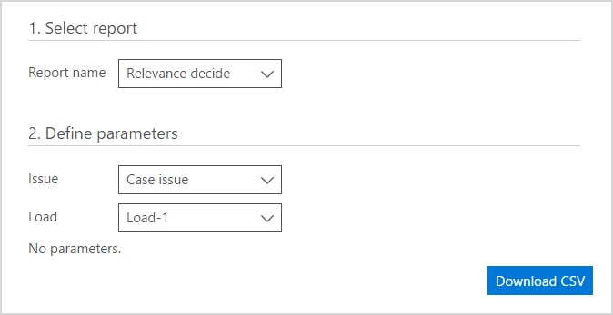

# Ausführen von Berichten in Advanced eDiscovery (klassisch)

> [!NOTE]
> Für Advanced eDiscovery ist ein Office 365 E3-Abonnement mit dem Add-On für erweiterte Compliance oder ein E5-Abonnement für Ihre Organisation erforderlich. Wenn Sie nicht über diesen Plan verfügen und Advanced eDiscovery ausprobieren möchten, können Sie sich [für eine Testversion von Office 365 Enterprise E5 anmelden](https://go.microsoft.com/fwlink/p/?LinkID=698279). 
  
In diesem Thema wird beschrieben, wie Sie Berichte in Advanced eDiscovery ausführen.
  
## Ausführung von Berichten

Sie können eine CSV-Datei mit einem Bericht für den ausgewählten Prozess herunterladen.
  
1. Wählen Sie auf der Registerkarte **Berichte** eine Option aus der Liste **Berichtsname** aus. Wählen Sie aus drei **Berichtsnamens** Optionen: **Relevanz entscheiden**, **Themenliste** oder **markierte Dateien**aus.
    
    
  
2. Verfügbare Parameter und Sortier-und Filteroptionen können abhängig vom ausgewählten Bericht festgelegt werden. 
    
3. Klicken Sie auf **CSV herunterladen**. Der angeforderte Bericht wird generiert und heruntergeladen.
    
## Siehe auch

[Advanced eDiscovery (Classic)](office-365-advanced-ediscovery.md)
