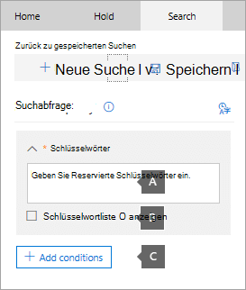
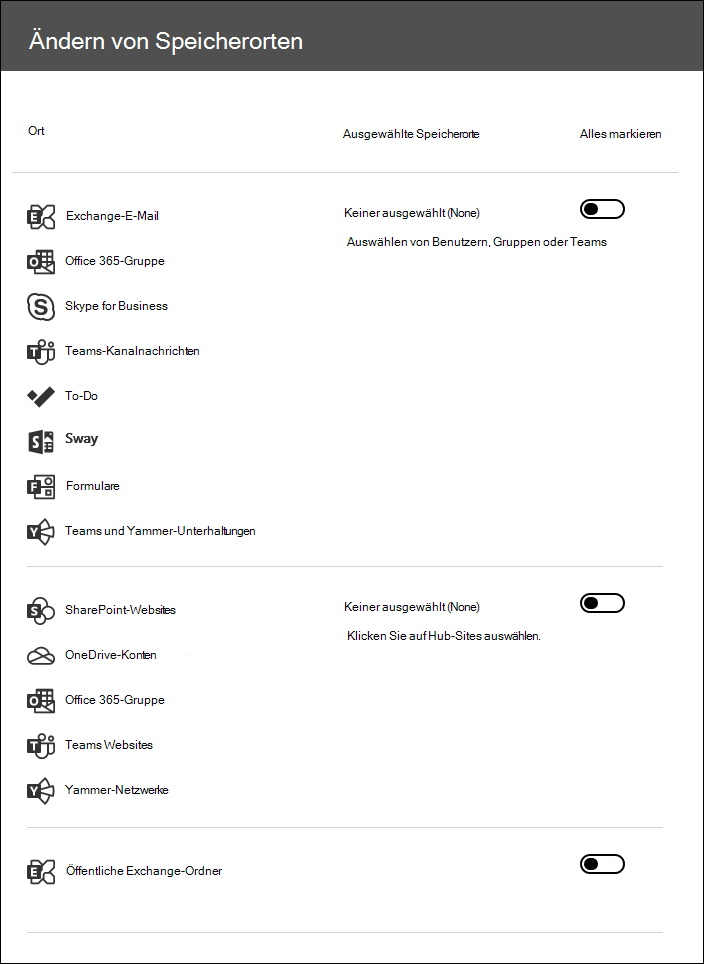

# Suchen nach Inhalten in einem zentralen eDiscovery-FallSearch for content in a Core eDiscovery case

Nachdem ein zentraler eDiscovery-Fall erstellt wurde und Personen mit Interesse im Fall in der Warteschleife gespeichert wurden, können Sie eine oder mehrere Suchen nach Inhalten erstellen und ausführen, die für den Fall relevant sind.After a Core eDiscovery case is created and people of interest in the case are placed on hold, you can create and run one or more searches for content relevant to the case. Suchvorgänge im Zusammenhang mit einem zentralen eDiscovery-Fall werden nicht auf der Seite **Inhaltssuche** im Microsoft 365 Compliance Center aufgeführt.Searches associated with a Core eDiscovery case aren't listed on the **Content search** page in the Microsoft 365 compliance center. Diese Suchvorgänge werden auf der Seite **Suchvorgänge** im Kern eDiscover-Fall aufgeführt, dem die Suchvorgänge zugeordnet sind.These searches are listed on the **Searches** page of the Core eDiscover case the searches are associated with. Dies bedeutet auch, dass Suchvorgängen, die einem Fall zugeordnet sind, nur von Fall Mitgliedern zugegriffen werden kann.This also means that searches associated with a case can only be accessed by case members.

So erstellen Sie eine zentrale eDiscovery-Suche:To create a Core eDiscovery search:
  
1. Wechseln Sie [https://compliance.microsoft.com](https://compliance.microsoft.com) zu, und melden Sie sich mit den Anmeldeinformationen für das Benutzerkonto an, dem die entsprechenden eDiscovery-Berechtigungen zugewiesen wurden.Go to [https://compliance.microsoft.com](https://compliance.microsoft.com) and sign in using the credentials for user account that has been assigned the appropriate eDiscovery permissions.

2. Klicken Sie im linken Navigationsbereich des Microsoft 365 Compliance Center auf **Alle anzeigen**, und klicken Sie dann auf **eDiscovery > Kern**.In the left navigation pane of the Microsoft 365 compliance center, click **Show all**, and then click **eDiscovery > Core**.

3. Wählen Sie auf der **zentralen eDiscovery** -Seite den Fall aus, dass Sie eine zugeordnete Suche erstellen möchten, und klicken Sie dann auf **Groß-/Kleinschreibung öffnen**.On the **Core eDiscovery** page, select the case that you want to create an associated search, and then click **Open case**.

4. Klicken Sie auf der **Start** Seite für den Fall auf die Registerkarte **Suchen** .On the **Home** page for the case, click the **Searches** tab.
  
5. Klicken Sie auf der Seite **Suchen** auf **neue Suche**.On the **Search** page, click **New search**.

6. Auf der Seite **Neue Suche** können Sie Schlüsselwörter und Bedingungen zum Erstellen der Suchabfrage hinzufügen.On the **New search** page, you can add keywords and conditions to create the search query. 

    
  
   a.a. Sie können Schlüsselwörter, Nachrichteneigenschaften wie gesendete und empfangene Datumsangaben oder Dokumenteigenschaften angeben, beispielsweise Dateinamen oder das Datum, an dem ein Dokument zuletzt geändert wurde.You can specify keywords, message properties, such as sent and received dates, or document properties, such as file names or the date that a document was last changed. Sie können komplexere Abfragen verwenden, die einen booleschen Operator verwenden, beispielsweise **and**, **or**, **Not**, **near**oder **ONEAR**.You can use more complex queries that use a Boolean operator, such as **AND**, **OR**, **NOT**, **NEAR**, or **ONEAR**. Sie können auch nach vertraulichen Informationen (z. B. Sozialversicherungsnummern) in Dokumenten oder nach Dokumenten suchen, die extern freigegeben wurden.You can also search for sensitive information (such as social security numbers) in documents, or search for documents that have been shared externally. Wenn Sie das Feld Schlüsselwort leer lassen, werden alle Inhalte, die sich an den angegebenen Inhaltsspeicherorten befinden, in die Suchergebnisse eingeschlossen.If you leave the keyword box empty, all content located in the specified content locations will be included in the search results.

   b.b. Sie können auf das Kontrollkästchen **Schlüsselwortliste anzeigen** und in jede Zeile ein Stichwort eingeben.You can click the **Show keyword list** check box and the type a keyword in each row. Wenn Sie dies tun, werden die Schlüsselwörter für jede Zeile durch den **or** -Operator in der erstellten Suchabfrage miteinander verbunden.If you do this, the keywords on each row are connected by the **OR** operator in the search query that's created. Sie können maximal 20 Stichwörter für die Liste eingeben.You can enter a maximum of 20 keywords to the list.

    
  
    Gründe für die Verwendung der SchlüsselwortlisteWhy use the keyword list? Sie können Statistiken abrufen, die zeigen, wie viele Elemente den einzelnen Schlüsselwörtern entsprechen.You can get statistics that show how many items match each keyword. Dadurch können Sie schnell erkennen, welche Schlüsselwörter am effektivsten (und am wenigsten effektiv) sind.This can help you quickly identify which keywords are the most (and least) effective. Sie können auch einen (in Klammern eingeschlossenen) Schlüsselwortausdruck in einer Zeile verwenden.You can also use a keyword phrase (surrounded by parentheses) in a row. Weitere Informationen zu Suchstatistiken finden Sie unter [Anzeigen der Schlüsselwortstatistik für Inhaltssuchergebnisse](view-keyword-statistics-for-content-search.md).For more information about search statistics, see [View keyword statistics for Content Search results](view-keyword-statistics-for-content-search.md).

    Weitere Informationen zur Verwendung der Liste Stichwörter finden Sie unter [Erstellen einer Suchabfrage](content-search.md#building-a-search-query).For more information about using the keywords list, see [Building a search query](content-search.md#building-a-search-query).

   c.c. Sie können auf **Bedingungen** klicken und einer Suchabfrage Bedingungen hinzufügen, um eine Suche einzuschränken und eine verfeinerte Ergebnisgruppe zurückzugeben.You can click **Conditions** and add conditions to a search query to narrow a search and return a more refined set of results. Jede Bedingung fügt eine Klausel zu der KQL-Suchabfrage hinzu, die beim Starten der Suche erstellt und ausgeführt wird.Each condition adds a clause to the KQL search query that is created and run when you start the search. Eine Bedingung ist durch **AND**-Operator logisch mit der (im Schlüsselwortfeld angegebenen) Schlüsselwortabfrage verbunden.A condition is logically connected to the keyword query (specified in the keyword box) by the **AND** operator. Das bedeutet, dass Elemente sowohl die Keyword-Abfrage als auch jede Bedingung erfüllen müssen, um in die Ergebnisse einbezogen zu werden.That means that items have to satisfy both the keyword query and each condition to be included in the results. Auf diese Weise können die Suchergebnisse mithilfe von Bedingungen weiter eingegrenzt werden.This is how conditions help to narrow your results.

    Weitere Informationen zum Erstellen einer Suchabfrage sowie zur Verwendung von Bedingungen finden Sie unter [Keyword queries for Content Search](keyword-queries-and-search-conditions.md).For more information about creating a search query and using conditions, see [Keyword queries for Content Search](keyword-queries-and-search-conditions.md).

7. Wählen Sie unter **Standorte: Aufbewahrungsorte**die inhaltsspeicherorte aus, die Sie durchsuchen möchten.Under **Locations: locations on hold**, choose the content locations that you want to search. Sie können Postfächer, Websites und öffentliche Ordner in derselben Suche durchsuchen.You can search mailboxes, sites, and public folders in the same search.

    
  
    - **Alle Standorte**.**All locations**. Wählen Sie diese Option aus, um alle inhaltsspeicherorte in Ihrer Organisation zu durchsuchen.Select this option to search all content locations in your organization. Wenn Sie diese Option auswählen, können Sie auswählen, dass alle Exchange-Postfächer durchsucht werden sollen (einschließlich der Postfächer für alle Microsoft Teams, Jammer Gruppen und Office 365 Gruppen), alle SharePoint-und OneDrive für Unternehmen-Websites (einschließlich der Websites für alle Microsoft Teams, Jammer Gruppen und Office 365 Gruppen) sowie aller öffentlichen Ordner.When you select this option, you can choose to search all Exchange mailboxes (which includes the mailboxes for all Microsoft Teams, Yammer Groups, and Office 365 Groups), all SharePoint and OneDrive for Business sites (which includes the sites for all Microsoft Teams, Yammer Groups, and Office 365 Groups), and all public folders.
    
    - **Alle Aufbewahrungsorte**.**All locations on hold**. Wählen Sie diese Option aus, um alle inhaltsspeicherorte zu durchsuchen, die in der Anfrage für eDiscovery gespeichert wurden.Select this option to search all the content locations that have been placed on eDiscovery hold in the case. Wenn die Groß-/Kleinschreibung mehrere Haltestatus enthält, werden die inhaltsspeicherorte aus allen Haltebereichen durchsucht.If the case contains multiple holds, the content locations from all holds will be searched. Wenn ein Inhaltsspeicherort in einem abfragebasierten Speicherplatz gefunden wurde, werden beim Ausführen der Inhaltssuche, die Sie in diesem Schritt erstellen, nur die Elemente durchsucht, die in der Warteschleife gespeichert sind.Additionally, if a content location was placed on a query-based hold, only the items that are on hold will be searched when you run the content search that you're creating in this step. Wenn beispielsweise ein Benutzer auf Abfrage basiertem Case Hold gesetzt wurde, der Elemente aufrecht erhält, die vor einem bestimmten Datum gesendet oder erstellt wurden, werden nur diese Elemente durchsucht.For example, if a user was placed on query-based case hold that preserves items that were sent or created before a specific date, only those items would be searched. Dies wird erreicht, indem die Case Hold-Abfrage und die Inhalts Suchabfrage durch einen **and-** Operator verbunden werden.This is accomplished by connecting the case hold query and the content search query by an **AND** operator. Weitere Informationen finden Sie unter [Suchorte in eDiscovery Hold](create-ediscovery-holds.md#search-locations-on-ediscovery-hold).For more information, see [Search locations on eDiscovery hold](create-ediscovery-holds.md#search-locations-on-ediscovery-hold).
    
    - **Bestimmte Standorte**.**Specific locations**. Wählen Sie diese Option aus, um die Postfächer und Websites auszuwählen, die Sie durchsuchen möchten.Select this option to select the mailboxes and sites that you want to search. Wenn Sie diese Option auswählen und auf **ändern**klicken, wird eine Liste der Speicherorte angezeigt.When you select this option and click **Modify**, a list of locations appears. Sie können auswählen, ob Sie einen oder alle Benutzer, Gruppen, Teams oder Website Standorte durchsuchen möchten.You can choose to search any or all users, groups, teams, or site locations. Sie können auch die öffentlichen Ordner in Ihrer Organisation durchsuchen.You can also search the public folders in your organization.
    
      
  
     Wenn Sie diese Option auswählen und einen beliebigen Inhaltsspeicherort durchsuchen, wird keine Abfrage von einem abfragebasierten Aufbewahrungs Fall auf die Suchabfrage angewendet.If you select this option and search any content location that's on hold, any query from a query-based case hold won't be applied to the search query. In anderen Worten wird der gesamte Inhalt durchsucht, und nicht nur der Inhalt, der von einem abfragebasierten Aufbewahrungsplatz beibehalten wird.In other words, all content is searched, not just the content that's preserved by a query-based case hold.

8. Nachdem Sie die zu durchsuchenden inhaltsspeicherorte ausgewählt haben, klicken Sie auf **Fertig** und dann auf **Speichern**.After you select the content locations to search, click **Done** and then click **Save**.

9. Klicken Sie auf der Seite **neue Suche** auf **& ausführen speichern** , und geben Sie dann einen Namen für die Suche ein.On the **New search** page, click **Save & run** and then type a name for the search. Suchvorgänge im Zusammenhang mit einem zentralen eDiscovery-Fall müssen Namen enthalten, die innerhalb Ihrer Office 365 Organisation eindeutig sind.Searches associated with a Core eDiscovery case must have names that are unique within your Office 365 organization.

10. Klicken Sie auf **Speichern** , um die Sucheinstellungen zu speichern und die Suche zu starten.Click **Save** to save the search settings and start the search.

  Wenn die Suche abgeschlossen ist, können Sie eine Vorschau der Suchergebnisse anzeigen.After the search is completed, you can preview the search results. Klicken Sie bei Bedarf auf der Seite **Suchvorgänge** auf **Aktualisieren** , um die in der Liste erstellte Suche anzuzeigen.If necessary, click **Refresh** on the **Searches** page to display the search you created in the list.

11. Klicken Sie auf die Suche, um die Flyout-Seite anzuzeigen, die Statistiken zur Suche enthält, und um andere Aufgaben wie das Anzeigen von Suchstatistiken und das Exportieren der Suchergebnisse auszuführen.Click the search to display the flyout page, which contains statistics about the search and to perform other tasks such as viewing search statistics and exporting the search results.

## Weitere Informationen zum Durchsuchen von InhaltsspeicherortenMore information about searching content locations

- Wenn Sie auf **Benutzer, Gruppen oder Teams auswählen** klicken, um die zu durchsuchenden Postfächer anzugeben, ist die angezeigte Post Fachauswahl leer.When you click **Choose users, groups, or teams** to specify mailboxes to search, the mailbox picker that's displayed is empty. Dies ist beabsichtigt, um die Leistung zu verbessern.This is by design to enhance performance. Klicken Sie zum Hinzufügen von Empfängern zu dieser Liste auf **Benutzer, Gruppen oder Teams auswählen**, geben Sie einen Namen (mindestens 3 Zeichen) in das Suchfeld ein, aktivieren Sie das Kontrollkästchen neben dem Namen, und klicken Sie dann auf **auswählen**.To add recipients to this list, click **Choose users, groups, or teams**, type a name (a minimum of 3 characters) in the search box, select the check box next to the name, and then click **Choose**.

- Sie können inaktive Postfächer, Microsoft Teams, Jammer Gruppen, Office 365 Gruppen und Verteilergruppen zur Liste der zu durchsuchenden Postfächer hinzufügen.You can add inactive mailboxes, Microsoft Teams, Yammer Groups, Office 365 Groups, and distribution groups to the list of mailboxes to search. Dynamische Verteilergruppen werden nicht unterstützt.Dynamic distribution groups aren't supported. Wenn Sie Microsoft Teams, Jammer Gruppen oder Office 365 Gruppen hinzufügen, wird das Gruppen-oder Team Postfach durchsucht. die Postfächer der Gruppenmitglieder werden nicht durchsucht.If you add Microsoft Teams, Yammer Groups, or Office 365 Groups, the group or team mailbox is searched; the mailboxes of the group members aren't searched.

- Klicken Sie zum Hinzufügen von Websites auf **Websites auswählen**, dann auf **Websites erneut auswählen** , und geben Sie dann die URL für jede Website ein, die Sie durchsuchen möchten.To add sites click **Choose sites**, click **Choose sites** again, and then type the URL for each site that you want to search. Sie können auch die URL für die SharePoint-Website für ein Microsoft-Team, eine Jammer Gruppe oder eine Office 365 Gruppe hinzufügen.You can also add the URL for the SharePoint site for a Microsoft Team, a Yammer Group, or an Office 365 Group.
