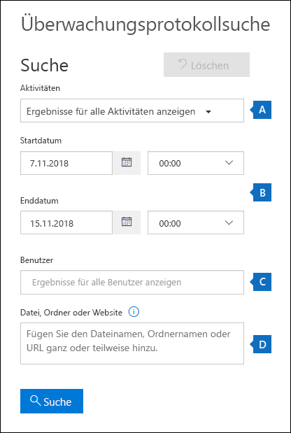

# <a name="search-the-audit-log-in-the-compliance-center"></a>Durchsuchen des Überwachungsprotokolls im Compliance-Center

Wollen Sie herausfinden, ob ein Benutzer ein bestimmtes Dokument angezeigt oder ein Element aus seinem Postfach gelöscht hat? Dann verwenden Sie das Microsoft 365 Compliance Center, um das einheitliche Überwachungsprotokoll zu durchsuchen und Benutzer- und Administratoraktivitäten aus Ihrer Organisation anzuzeigen. Warum ein einheitliches Überwachungsprotokoll? Weil Sie in Microsoft 365 nach den folgenden Arten von [Benutzer- und Verwaltungsaktivitäten](#audited-activities) suchen können:

- Benutzeraktivitäten in SharePoint Online und OneDrive for Business

- Benutzeraktivitäten in Exchange Online (Postfachüberwachungsprotokollierung)

- Administratoraktivitäten in SharePoint Online

- Administratoraktivitäten in Azure Active Directory (der Verzeichnisdienst für Microsoft 365)

- Administratoraktivitäten in Exchange Online (Exchange-Administratorüberwachungsprotokollierung)

- eDiscovery-Aktivitäten im Security und Compliance Center

- Aktivitäten von Benutzern und Administratoren in Power BI

- Aktivitäten von Benutzern und Administratoren in Microsoft Teams

- Aktivitäten von Benutzern und Administratoren in Dynamics 365

- Aktivitäten von Benutzern und Administratoren in Yammer

- Aktivitäten von Benutzern und Administratoren in Microsoft Power Automate

- Aktivitäten von Benutzern und Administratoren in Microsoft Stream

- Aktivitäten von Analysten und Administratoren in Microsoft Workplace Analytics

- Aktivitäten von Benutzern und Administratoren in Microsoft Power Apps

- Aktivitäten von Benutzern und Administratoren in Microsoft Forms

- Benutzer- und Administratoraktivität für Vertraulichkeitsbezeichnungen für Websites, die SharePoint Online oder Microsoft Teams verwenden

## <a name="requirements-to-search-the-audit-log"></a>Voraussetzungen für die Durchsuchung des Überwachungsprotokolls

Lesen Sie die folgenden Punkte, bevor Sie mit dem Durchsuchen des Überwachungsprotokolls beginnen.

- Sie (oder ein anderer Administrator) müssen zuerst die Überwachungsprotokollierung aktivieren, bevor Sie mit dem Durchsuchen des Überwachungsprotokolls beginnen können. Zum Aktivieren klicken Sie **Überwachung aktivieren** auf der Seite **Durchsuchen des Überwachungsprotokolls** im Security und Compliance Center. (Wenn Sie diesen Link nicht sehen, wurde die Überwachungsprotokollierung für Ihre Organisation bereits aktiviert.) Daraufhin teilt Ihnen eine Meldung mit, dass das Überwachungsprotokoll vorbereitet wird und Sie in ein paar Stunden nach Abschluss der Vorbereitung eine Suche durchführen können. Dieser Vorgang ist nur einmal erforderlich. For more information, see [Turn audit log search on or off](turn-audit-log-search-on-or-off.md).

  > [!NOTE]
  > Wir sind dabei, die Überwachung standardmäßig zu aktivieren. Bis dahin können Sie diese Option gemäß der obigen Beschreibung aktivieren.

- Ihnen wurde in Exchange Online eine entweder die Rolle „Überwachungsprotokolle nur anzeigen“ oder „Überwachungsprotokolle“ zugewiesen, um das Überwachungsprotokoll zu durchsuchen. Standardmäßig sind diese Rollen im Exchange Admin Center zugewiesen den Rollengruppen „Complianceverwaltung“ und „Organisationsverwaltung“ auf der Seite **Berechtigungen** . Bitte beachten Sie, dass globale Administratoren in Office 365 und Microsoft 365 automatisch Mitglieder der Verwaltungsrollengruppe „Organisationsverwaltung“ in Exchange Online sind. Damit ein Benutzer die Möglichkeit hat, das Überwachungsprotokoll mit minimalen Rechten zu durchsuchen, können Sie in Exchange Online eine benutzerdefinierte Rollengruppe erstellen, ihr die Rollen "Überwachungsprotokolle nur anzeigen" oder "Überwachungsprotokolle" hinzufügen und den Benutzer dann als Mitglied der neuen Rollengruppe hinzufügen. Weitere Informationen finden Sie unter [Verwalten von Rollengruppen in Exchange Online](https://go.microsoft.com/fwlink/p/?LinkID=730688).

  > [!IMPORTANT]
  > Wenn Sie einem Benutzer auf der Seite **Berechtigungen** im Security and Compliance Center die Rolle „Überwachungsprotokolle nur anzeigen“ oder „Überwachungsprotokolle“ zuweisen, kann er das Überwachungsprotokoll nicht durchsuchen. Sie müssen die Berechtigungen in Exchange Online zuweisen. Der Grund dafür ist, dass es sich bei dem zugrundeliegenden Cmdlet, das für die Durchsuchung des Überwachungsprotokolls verwendet wird, um ein Exchange Online-Cmdlet handelt.

- Wenn eine überwachte Aktivität von einem Benutzer oder Administrator ausgeführt wird, wird ein Überwachungsdatensatz erstellt und im Überwachungsprotokoll Ihrer Organisation gespeichert. Die Zeitdauer, die ein Überwachungsdatensatz aufbewahrt (und im Überwachungsprotokoll durchsuchbar) ist, hängt von Ihrem Office 365- oder Microsoft 365 Enterprise-Abonnement und insbesondere vom Lizenztyp ab, der bestimmten Benutzern zugewiesen ist.

  - Für Benutzer mit einer Office 365 E5- oder Microsoft 365 E5-Lizenz (oder für Benutzer mit einer Lizenz für Microsoft 365 E5 Compliance oder Microsoft 365 E5 eDiscovery und Überwachung) werden Überwachungsdatensätze für Azure Active Directory-, Exchange- und SharePoint-Aktivitäten standardmäßig ein Jahr lang aufbewahrt. Organisationen können auch Aufbewahrungsrichtlinien für Überwachungsprotokolle erstellen, um Überwachungsdatensätze für Aktivitäten in anderen Diensten bis zu ein Jahr lang aufzubewahren. Weitere Informationen finden Sie unter [Verwalten der Aufbewahrungsrichtlinien für Überwachungsprotokolle](audit-log-retention-policies.md).

    > [!NOTE]
    > Wenn Ihre Organisation am privaten Vorschauprogramm für die einjährige Aufbewahrung von Überwachungsdatensätzen teilgenommen hat, wird die Aufbewahrungsdauer für Überwachungsdatensätze, die vor dem Datum des Rollouts zur allgemeinen Verfügbarkeit generiert wurden, nicht zurückgesetzt.

  - Für Benutzer mit anderen Lizenzen (nicht-E5-Lizenzen) für Office 365 oder Microsoft 365 werden Überwachungseinträge 90 Tage lang aufbewahrt. Eine Liste der Office 365- und Microsoft 365-Abonnements, die die einheitliche Überwachungsprotokollierung unterstützen, finden Sie in der [Dienstbeschreibung für das Security & Compliance Center](https://docs.microsoft.com/office365/servicedescriptions/office-365-platform-service-description/office-365-securitycompliance-center).

    > [!NOTE]
    > Die Überwachung von Postfächern ist zwar standardmäßig aktiviert, möglicherweise stellen Sie aber fest, dass Postfachüberwachungsereignisse für einige Benutzer beim Durchsuchen von Überwachungsprotokollen im Security & Compliance Center oder über die Office 365-Verwaltungsaktivitäts-API nicht zu finden sind. Weitere Informationen finden Sie unter [Weitere Informationen zur Postfachüberwachungsprotokollierung](enable-mailbox-auditing.md#more-information).

- Wenn Sie die Überwachungsprotokollsuche für Ihre Organisation deaktivieren möchten, können Sie in der mit Ihrer Exchange Online-Organisation verbundenen Remote-PowerShell den folgenden Befehl ausführen:

  ```powershell
  Set-AdminAuditLogConfig -UnifiedAuditLogIngestionEnabled $false
  ```

    Um die Überwachungssuche wieder zu aktivieren, können Sie den folgenden Befehl in der Exchange Online-PowerShell ausführen:

  ```powershell
  Set-AdminAuditLogConfig -UnifiedAuditLogIngestionEnabled $true
  ```

  Weitere Informationen finden Sie unter [Deaktivieren der Überwachungsprotokollsuche](turn-audit-log-search-on-or-off.md).

- Wie bereits gesagt, handelt es sich bei dem zugrundeliegenden Cmdlet zum Durchsuchen des Überwachungsprotokolls um ein Exchange Online-Cmdlet namens **Search-UnifiedAuditLog** . Das bedeutet, dass Sie anstelle der Seite **Überwachungsprotokollsuche** im Security and Compliance Center dieses Cmdlet zum Durchsuchen des Überwachungsprotokolls verwenden können. Sie müssen dieses Cmdlet in der Remote-PowerShell ausführen, die mit Ihrer Exchange Online-Organisation verbunden ist. Weitere Informationen finden Sie unter [Search-UnifiedAuditLog](https://go.microsoft.com/fwlink/p/?linkid=834776).

  Informationen zum Exportieren der vom **Search-UnifiedAuditLog** -Cmdlet zurückgegebenen Suchergebnisse in eine CSV-Datei finden Sie im Abschnitt „Tipps zum Exportieren, konfigurieren und Anzeigen des Überwachungsprotokolls“ in [Exportieren und Anzeigen des Überwachungsprotokolls](export-view-audit-log-records.md#tips-for-exporting-and-viewing-the-audit-log).

- Wenn Sie programmgesteuert Daten aus dem Überwachungsprotokoll herunterladen möchten, empfehlen wir die Verwendung der Office 365-Verwaltungsaktivitäts-API anstelle eines PowerShell-Skripts. Die Office 365-Verwaltungsaktivitäts-API ist ein REST-Webdienst, den Sie beim Entwickeln von Lösungen zur Überwachung von Vorgängen, der Sicherheit und Compliance für Ihre Organisation verwenden können. Weitere Informationen finden Sie in der [Referenz der Office 365-Verwaltungsaktivitäts-API](https://docs.microsoft.com/office/office-365-management-api/office-365-management-activity-api-reference).

- Nach dem Auftreten eines Ereignisses kann es bis zu 30 Minuten oder sogar bis zu 24 Stunden dauern, bis der entsprechende Überwachungsprotokolleintrag in den Ergebnissen der Überwachungsprotokollsuche angezeigt wird. Aus der folgenden Tabelle geht die Zeit hervor, die für die unterschiedlichen Dienste in Office 365 benötigt wird.

  |Microsoft 365-Dienst oder -Feature|30 Minuten|24 Stunden|
  |:-----|:-----:|:-----:|
  |Advanced Threat Protection und Threat Intelligence|||
  |Azure Active Directory (Benutzeranmeldungen)|||
  |Azure Active Directory (Administratorereignisse)|||
  |Verhinderung von Datenverlust|||
  |Dynamics 365 CRM|||
  |eDiscovery|||
  |Exchange Online|||
  |Microsoft Power Automate|||
  |Microsoft Project|||
  |Microsoft Stream|||
  |Microsoft Teams|||
  |Power-Apps|||
  |Power BI|||
  |Security & Compliance Center|||
  |Vertraulichkeitsbezeichnungen|||
  |SharePoint Online und OneDrive for Business|||
  |Workplace Analytics|||
  |Yammer||||
  |Microsoft Forms||
  ||||

- Azure Active Directory (Azure AD) ist der Verzeichnisdienst von Office 365. Das vereinheitlichte Überwachungsprotokoll enthält Benutzer-, Gruppen-, Anwendungs-, Domänen- und Verzeichnisaktivitäten, die im Microsoft 365 Admin Center oder im Azure-Verwaltungsportal ausgeführt wurden. Eine vollständige Liste der Azure AD-Ereignisse finden Sie unter [Azure Active Directory-Überwachungsberichtsereignisse](https://go.microsoft.com/fwlink/p/?LinkID=616549).

- Die Überwachungsprotokollierung für Power BI ist standardmäßig nicht aktiviert. Wenn Sie im Überwachungsprotokoll nach Power BI-Aktivitäten suchen möchten, müssen Sie die Überwachung für das Power BI-Verwaltungsportal aktivieren. Anweisungen hierzu finden Sie im Abschnitt "Überwachungsprotokolle" im [Power BI-Verwaltungsportal](https://docs.microsoft.com/power-bi/service-admin-portal#audit-logs).

## <a name="search-the-audit-log"></a>Durchsuchen des Überwachungsprotokolls

Nachfolgend ist der Prozess zum Durchsuchen des Überwachungsprotokolls in Office 365 dargestellt. 

[Schritt 1: Durchführen einer Überwachungsprotokollsuche](#step-1-run-an-audit-log-search)

[Schritt 2: Anzeigen der Suchergebnisse](#step-2-view-the-search-results)

[Schritt 3: Filtern der Suchergebnisse](#step-3-filter-the-search-results)

[Schritt 4: Exportieren der Suchergebnisse in eine Datei](#step-4-export-the-search-results-to-a-file)

### <a name="step-1-run-an-audit-log-search"></a>Schritt 1: Durchführen einer Überwachungsprotokollsuche

1. Wechseln Sie zu [https://protection.office.com](https://protection.office.com).

    > [!TIP]
    > Verwenden Sie eine private Browsersitzung (keine gewöhnliche Sitzung) für den Zugriff auf das Security and Compliance Center, weil dadurch die Verwendung Ihrer Anmeldeinformationen verhindert wird. Um ein InPrivate-Browserfenster in Internet Explorer oder in Microsoft Edge zu öffnen, drücken Sie einfach STRG+UMSCHALT+P. Drücken Sie STRG+UMSCHALT+N, um eine private Browsersitzung in Google Chrome (ein sogenanntes „Inkognito-Fenster“) zu öffnen.

2. Melden Sie sich mit Ihrem Geschäfts-, Schul- oder Unikonto an.

3. Klicken Sie im Security & Compliance Center im linken links auf **Suchen** und dann auf **Überwachungsprotokollsuche** .

    Die Seite **Überwachungsprotokollsuche** wird angezeigt.

    

    > [!NOTE]
    > Sie müssen zuerst die Überwachungsprotokollierung aktivieren, bevor Sie eine Überwachungsprotokollsuche durchführen können. Wenn der Link zu **Aufzeichnung von Benutzer- und Administratoraktivitäten starten** angezeigt wird, klicken Sie darauf, um die Überwachung zu aktivieren. Wird dieser Link nicht angezeigt, wurde die Überprüfung für Ihre Organisation bereits aktiviert.

4. Konfigurieren Sie die folgenden Suchkriterien: 

   1. **Aktivitäten** : Klicken Sie auf die Dropdownliste, um die Aktivitäten anzuzeigen, nach denen Sie suchen können. Benutzer- und Verwaltungsaktivitäten sind in Gruppen verwandter Aktivitäten organisiert. Sie können bestimmte Aktivitäten auswählen oder auf den Namen der Aktivitätsgruppe klicken, um alle Aktivitäten in der Gruppe auszuwählen. Sie können auch auf eine ausgewählte Aktivität klicken, um die Auswahl aufzuheben. Nachdem Sie die Suche ausgeführt haben, werden nur die Überwachungsprotokolleinträge für die ausgewählten Aktivitäten angezeigt. Durch Auswahl von **Ergebnisse für alle Aktivitäten anzeigen** werden Ergebnisse für alle Aktivitäten angezeigt, die von dem ausgewählten Benutzer oder der ausgewählten Benutzergruppe ausgeführt wurden.

      Es werden mehr als 100 Benutzer- und Administratoraktivitäten im Überwachungsprotokoll erfasst. Klicken Sie beim Thema dieses Artikels auf die Registerkarte **Überwachte Aktivitäten** , um die Beschreibungen der einzelnen Aktivitäten in den verschiedenen Diensten anzuzeigen.

   1. **Startdatum** und **Enddatum** : Standardmäßig sind die letzten sieben Tage ausgewählt. Wählen Sie einen Datums- und Uhrzeitbereich aus, um die Ereignisse anzuzeigen, die innerhalb dieses Zeitraums aufgetreten sind. Das Datum und die Uhrzeit werden im UTC-Format (Coordinated Universal Time) angezeigt. Der maximale Datumsbereich, den Sie angeben können, umfasst 90 Tage. Es wird ein Fehler angezeigt, wenn der ausgewählte Datumsbereich mehr als 90 Tage umfasst.

      > [!TIP]
      > Wenn Sie den maximalen Datumsbereich von 90 Tagen verwenden, wählen Sie den aktuellen Zeitpunkt für das **Startdatum** aus. Andernfalls wird eine Fehlermeldung angezeigt, in der mitgeteilt wird, dass das Startdatum vor dem Enddatum liegt. Wenn Sie die Überwachung innerhalb der letzten 90 Tage aktiviert haben, kann der maximale Datumsbereich nicht vor dem Datum beginnen, an dem die Überwachung aktiviert wurde.

   1. **Benutzer** : Klicken Sie in dieses Feld, und wählen Sie dann einen oder mehrere Benutzer aus, für die Suchergebnisse angezeigt werden sollen. In der Liste der Ergebnisse werden die Überwachungsprotokolleinträge für die ausgewählte Aktivität angezeigt, die von den Benutzern ausgeführt wurde, die Sie in diesem Feld ausgewählt haben. Lassen Sie dieses Feld leer, um die Einträge für alle Benutzer (und Dienstkonten) in Ihrer Organisation zurückzugeben.

   1. **Datei, Ordner oder Website** : Geben Sie einen Datei- oder Ordnernamen ganz oder teilweise ein, um nach Aktivitäten für die Datei oder den Ordner zu suchen, die bzw. der das angegebene Schlüsselwort enthält. Sie können auch die URL einer Datei oder eines Ordners verwenden. Wenn Sie eine URL verwenden wollen, geben Sie unbedingt den vollständigen URL-Pfad ein. Falls Sie nur einen Teil der URL eingeben, verwenden Sie bitte keine Sonder- oder Leerzeichen.

      Lassen Sie dieses Feld leer, um Einträge für alle Dateien und Ordner in Ihrer Organisation zurückzugeben.

      > [!TIP]
      >
      > - Wenn Sie nach allen Aktivitäten im Zusammenhang mit einer **Website** suchen, fügen Sie das Platzhaltersymbol (\*) hinter die URL ein, um alle Einträge für diese Website zurückzugeben, z. b. `"https://contoso-my.sharepoint.com/personal*"`.
      >
      > - Wenn Sie nach allen Aktivitäten im Zusammenhang mit einer **Datei** suchen, fügen Sie das Platzhaltersymbol (\*) vor dem Dateinamen ein, um alle Einträge für diese Datei zurückzugeben, z. b. `"*Customer_Profitability_Sample.csv"`.

5. Klicken Sie auf **Suchen** , um die Suche anhand der Suchkriterien auszuführen. 

   Die Suchergebnisse werden geladen und nach wenigen Augenblicken unter **Ergebnisse** angezeigt. Nach Abschluss der Suche wird die Anzahl der gefundenen Ergebnisse angezeigt. Im Bereich **Ergebnisse** werden maximal 5.000 Ereignisse in Schritten von jeweils 150 Ereignissen angezeigt. Wenn mehr als 5.000 Ereignisse die Suchkriterien erfüllen, werden die aktuellsten 5.000 Ereignisse angezeigt.

   

#### <a name="tips-for-searching-the-audit-log"></a>Tipps zum Suchen im Überwachungsprotokoll

- Durch Klicken auf den Aktivitätsnamen können Sie bestimmte Aktivitäten auswählen, nach denen gesucht werden soll. Sie können auch auf den Gruppennamen klicken, um nach allen Aktivitäten in einer Gruppe (z. B. **Datei- und Ordneraktivitäten** ) zu suchen. Wenn eine Aktivität ausgewählt ist, können Sie darauf klicken, um die Auswahl aufzuheben. Sie können auch das Suchfeld verwenden, um die Aktivitäten anzuzeigen, die das von Ihnen eingegebene Schlüsselwort enthalten.

  

- Sie müssen **Ergebnisse für alle Aktivitäten anzeigen** in der Liste **Aktivitäten** auswählen, um Einträge aus dem Exchange-Administrator-Überwachungsprotokoll anzuzeigen. Bei Ereignissen aus diesem Überwachungsprotokoll wird der Name eines Cmdlets (z. B. **Set-Mailbox** ) in der Spalte **Aktivität** unter den Ergebnissen angezeigt. Um weitere Informationen zu erhalten, klicken Sie auf die Registerkarte **überwachte Aktivitäten** in diesem Thema, und dann auf **Exchange-Administratoraktivitäten** .

  Ebenso gibt es einige Überwachungsaktivitäten, für die in der Liste **Aktivitäten** kein entsprechendes Element enthalten ist. Wenn Sie den Namen des Vorgangs für diese Aktivitäten kennen, können Sie nach allen Aktivitäten suchen und die Ergebnisse dann filtern, indem Sie den Vorgangsnamen in das Feld für die Spalte **Aktivität** eingeben. Weitere Informationen zum Filtern der Ergebnisse finden Sie unter [Schritt 3: Suchergebnisse filtern](#step-3-filter-the-search-results).

- Klicken Sie auf **Auswahl aufheben** , um die aktuelle Auswahl von Suchkriterien aufzuheben. Der Datumsbereich wird auf die Standardeinstellung für die letzten sieben Tage zurückgesetzt. Sie können auch auf **Gesamte Auswahl aufheben, um Ergebnisse für alle Aktivitäten anzuzeigen** klicken, um die getroffene Auswahl von Aktivitäten aufzuheben.

- Wenn 5,000 Ergebnisse gefunden werden, können Sie wahrscheinlich davon ausgehen, dass mehr als 5.000 Ereignisse die Suchkriterien erfüllen. Sie können entweder die Suchkriterien verfeinern und die Suche erneut durchführen, damit weniger Ergebnisse zurückgegeben werden, oder Sie können alle Suchergebnisse exportieren, indem Sie **Ergebnisse exportieren** \> **Alle Ergebnisse herunterladen** auswählen.

### <a name="step-2-view-the-search-results"></a>Schritt 2: Anzeigen der Suchergebnisse

Die Ergebnisse einer Überwachungsprotokollsuche werden unter **Ergebnisse** auf der Seite **Überwachungsprotokollsuche** angezeigt. Wie bereits erwähnt werden maximal 5.000 Ereignisse (ggf. die 5.000 neuesten Ereignisse) in Schritten von 150 Ereignissen angezeigt. Zum Anzeigen weiterer Ereignisse können Sie die Bildlaufleiste im Bereich **Ergebnisse** verwenden oder **UMSCHALT+ENDE** drücken, um die nächsten 150 Ereignisse anzuzeigen.

Die Ergebnisse enthalten die folgenden Informationen zu den einzelnen Ereignissen, die bei der Suche zurückgegeben werden:

- **Datum** : Das Datum und die Uhrzeit (im UTC-Format), zu der das Ereignis auftrat.

- **IP-Adresse** : Die IP-Adresse des Geräts, das verwendet wurde, als die Aktivität protokolliert wurde. Die IP-Adresse wird im Adressformat IPv4 oder IPv6 angezeigt.

   > [!NOTE]
  > Bei einigen Diensten ist der in diesem Feld angezeigte Wert möglicherweise die IP-Adresse einer vertrauenswürdigen Anwendung (z. B. Office in den Web-Apps), die anstelle eines Benutzers in den Dienst einruft und nicht die IP-Adresse des Geräts, das von der Person, die die Aktivität ausgeführt hat, verwendet wird. Außerdem wird bei Administratoraktivitäten (oder von einem Systemkonto ausgeführte Aktivitäten) für Azure Active Directory-bezogene Ereignisse die IP-Adresse nicht protokolliert, und der in diesem Feld angezeigte Wert ist `null`.

- **Benutzer** : Der Benutzer (oder das Dienstkonto), der die Aktion ausführte, durch die das Ereignis ausgelöst wurde.

- **Aktivität** : Die vom Benutzer ausgeführte Aktivität. Dieser Wert entspricht den Aktivitäten, die Sie in der Dropdownliste **Aktivitäten** ausgewählt haben. Bei einem Ereignis aus dem Exchange-Administratorüberwachungsprotokoll ist der Wert in dieser Spalte ein Exchange-Cmdlet.

- **Element** : Das Objekt, das als Ergebnis der entsprechenden Aktivität erstellt oder geändert wurde. Dies kann z. B. die Datei sein, die angezeigt oder geändert wurde, oder das Benutzerkonto, das aktualisiert wurde. Nicht alle Aktivitäten haben in dieser Spalte einen Wert.

- **Detail** : Zusätzliche Informationen zu einer Aktivität. Auch hier weisen nicht alle Aktivitäten einen Wert auf.

> [!TIP]
> Klicken Sie unter **Ergebnisse** auf eine Spaltenüberschrift, um die Ergebnisse zu sortieren. Sie können die Ergebnisse aufsteigend (von A nach Z) oder absteigend (von Z nach A) sortieren. Klicken Sie auf die Überschrift **Datum** , um die Ergebnisse vom ältesten zum neuesten oder vom neuesten zum ältesten zu sortieren.

#### <a name="view-the-details-for-a-specific-event"></a>Anzeigen der Details zu einem bestimmten Ereignis

Sie können weitere Details zu einem Ereignis anzeigen, indem Sie in der Liste der Suchergebnisse auf den Ereigniseintrag klicken. Daraufhin wird die Seite **Details** mit detaillierten Eigenschaften des Ereigniseintrags angezeigt. Die angezeigten Eigenschaften sind von dem Dienst abhängig, in dem das Ereignis eintritt. Zum Anzeigen weiterer Details klicken Sie auf **Weitere Informationen** . Beschreibungen finden Sie in [Detaillierte Eigenschaften im Überwachungsprotokoll](detailed-properties-in-the-office-365-audit-log.md).


### <a name="step-3-filter-the-search-results"></a>Schritt 3: Filtern der Suchergebnisse

Zusätzlich zur Sortierung können Sie die Ergebnisse einer Überwachungsprotokollsuche auch filtern. Dies ist eine sehr hilfreiche Funktion, mit der Sie schnell die Ergebnisse für einen bestimmten Benutzer oder eine bestimmte Aktivität filtern können. Sie können zuerst eine breite Suche erstellen und dann die Ergebnisse schnell filtern, um nur bestimmte Ereignisse anzuzeigen. Anschließend können Sie die Suchkriterien einschränken und die Suche erneut durchführen, um eine kleinere, kompaktere Gruppe von Ergebnissen zurückzugeben.

So filtern Sie die Ergebnisse:

1. Führen Sie eine Überwachungsprotokollsuche aus.

2. Sobald die Ergebnisse angezeigt werden, klicken Sie auf **Ergebnisse filtern** .

   Unter den einzelnen Spaltenüberschriften werden Felder für Schlüsselwörter angezeigt.

3. Klicken Sie auf eines der Felder unter einer Spaltenüberschrift, und geben Sie abhängig von der Spalte ein Wort oder einen Ausdruck ein, nach dem Sie filtern möchten. Die Ergebnisse werden dynamisch angepasst und die Ereignisse angezeigt, die den Filterkriterien entsprechen.

   

4. Zum Löschen eines Filters klicken Sie auf das **X** im Filterfeld oder auf **Filterung ausblenden** .

> [!TIP]
> Zum Anzeigen von Ereignissen aus dem Exchange-Administratorüberwachungsprotokoll geben Sie einen Bindestrich ( **-** ) in das Filterfeld **Aktivität** ein. Dadurch werden Cmdlet-Namen angezeigt, die in der Spalte **Aktivität** für Exchange-Administratorereignisse angegeben sind. Anschließend können Sie die Cmdlet-Namen alphabetisch sortieren.

### <a name="step-4-export-the-search-results-to-a-file"></a>Schritt 4: Exportieren der Suchergebnisse in eine Datei

Sie können die Ergebnisse einer Überwachungsprotokollsuche in eine Datei mit kommagetrennten Werten (CSV) auf Ihren lokalen Computer exportieren. Sie können diese Datei in Microsoft Excel öffnen und Funktionen wie das Suchen, Sortieren, Filtern und Teilen einer einzelnen Spalte (die Zellen mit mehreren Eigenschaften enthält) in mehrere Spalten verwenden.

1. Führen Sie eine Überwachungsprotokollsuche aus, und bearbeiten Sie dann die Suchkriterien, bis Sie die gewünschten Ergebnisse erhalten.

2. Klicken Sie auf **Ergebnisse exportieren** , und wählen Sie eine der folgenden Optionen aus:

   - **Geladene Ergebnisse speichern** : Wählen Sie diese Option aus, um nur die Einträge zu exportieren, die unter **Ergebnisse** auf der Seite **Überwachungsprotokollsuche** angezeigt werden. Die heruntergeladene CSV-Datei enthält dieselben Spalten (und Daten), die auch auf der Seite angezeigt werden (Datum, Benutzer, Aktivität, Element und Details). Eine zusätzliche Spalte (mit dem Namen **Mehr** ) wird in die CSV-Datei aufgenommen und enthält weitere Informationen aus dem Überwachungsprotokolleintrag. Da Sie dieselben Ergebnisse exportieren, die auf der Seite **Überwachungsprotokollsuche** geladen werden (und angezeigt werden können), werden maximal 5.000 Einträge exportiert.

   - **Alle Ergebnisse herunterladen** : Wählen Sie diese Option aus, um alle Einträge aus dem Überwachungsprotokoll zu exportieren, die den Suchkriterien entsprechen. Wenn Sie eine große Menge von Suchergebnissen exportieren möchten, wählen Sie diese Option aus, um zusätzlich zu den 5.000 Ergebnissen, die auf der Seite **Überwachungsprotokollsuche** angezeigt werden können, alle Einträge aus dem Überwachungsprotokoll herunterzuladen. Mit dieser Option werden die unformatierten Daten aus dem Überwachungsprotokoll in eine CSV-Datei heruntergeladen, und es sind zusätzliche Informationen aus dem Überwachungsprotokolleintrag in einer Spalte mit dem Namen **AuditData** enthalten. Bei Auswahl dieser Exportoption kann das Herunterladen der Datei etwas länger dauern, da die Datei möglicherweise wesentlich größer als diejenige ist, die bei Auswahl einer anderen Option heruntergeladen wird.

     > [!IMPORTANT]
     > Aus seiner einzigen Suche in einer Protokolldatei können Sie maximal 50.000 Einträge in eine CSV-Datei herunterladen. Wenn 50.000 Einträge in die CSV-Datei heruntergeladen werden, können Sie wahrscheinlich davon ausgehen, dass mehr als 50.000 Ereignisse die Suchkriterien erfüllen. Wenn Sie mehr als diesen Grenzwert exportieren möchten, versuchen Sie es mit einem Datenbereich, um die Anzahl der Einträge im Überwachungsprotokoll zu verringern. Möglicherweise müssen Sie mehrere Suchläufe mit kleineren Datumsbereichen durchführen, um mehr als 50.000 Einträge zu exportieren.

3. Nachdem Sie eine Exportoption ausgewählt haben, wird eine Meldung am unteren Rand des Fensters angezeigt, in der Sie aufgefordert werden, die CSV-Datei zu öffnen, sie im Ordner "Downloads" oder in einem bestimmten Ordner zu speichern.

#### <a name="more-information-about-exporting-and-viewing-audit-log-search-results"></a>Weitere Informationen zum Exportieren von Ergebnissen der Überwachungsprotokollsuche

- Wenn Sie alle Suchergebnisse herunterladen, enthält die CSV-Datei eine Spalte mit dem Namen **AuditData** , die zusätzliche Informationen zu jedem Ereignis enthält. Die Daten in dieser Spalte bestehen aus einem JSON-Objekt, das mehrere Eigenschaften aus den Überwachungsprotokolldaten enthält. Jedes *Eigenschaft:Wert* -Paar im JSON-Objekt wird durch ein Komma getrennt. Sie können das JSON-Transformationstool im Power Query-Editor in Excel verwenden, um die Spalte **AuditData** in mehrere Spalten aufzuteilen, sodass jede Eigenschaft im JSON-Objekt eine eigene Spalte besitzt. Dadurch können Sie nach einer oder mehreren dieser Eigenschaften sortieren und filtern. Schrittweise Anleitungen zum Transformieren des JSON-Objekts mit dem Power Query-Editor finden Sie unter [Exportieren, konfigurieren und Anzeigen von Überwachungsprotokolldaten](export-view-audit-log-records.md).

  Nachdem Sie die Spalte **AuditData** aufgeteilt haben, können Sie die Spalte **Aktionen** filtern, um die detaillierten Eigenschaften eines bestimmten Aktivitätstyps anzuzeigen.

- Mit der Option **Alle Ergebnisse herunterladen** werden die unformatierten Daten aus dem Überwachungsprotokoll in eine CSV-Datei heruntergeladen. Diese Datei enthält andere Spaltennamen (CreationDate, UserIds, Operation, AuditData) als die Datei, die bei Auswahl der Option **Geladene Ergebnisse speichern** heruntergeladen wird. Die Werte in den beiden CSV-Dateien können für dieselbe Aktivität ebenfalls unterschiedlich sein. So kann die Aktivität in der Spalte **Aktion** in der CSV-Datei einen anderen Wert als die „benutzerfreundliche“ Version aufweisen, die in der Spalte **Aktivität** auf der Seite **Überwachungsprotokollsuche** angezeigt wird. Ein Beispiel wäre „MailboxLogin“ im Vergleich zu „am Postfach angemeldeter Benutzer“.

- Wenn Sie alle Ergebnisse einer Suchabfrage herunterladen, die Ereignisse aus verschiedenen Diensten umfasst, enthält die Spalte **AuditData** in der CSV-Datei unterschiedliche Eigenschaften, je nachdem, in welchem Dienst die Aktion ausgeführt wurde. Beispielsweise umfassen Einträge aus Azure AD-Überwachungsprotokollen eine Eigenschaft namens **ResultStatus** , die angibt, ob die Aktion erfolgreich war. Diese Eigenschaft ist bei Ereignissen in SharePoint nicht enthalten. SharePoint-Ereignisse weisen hingegen eine Eigenschaft auf, die die Website-URL für Aktivitäten im Zusammenhang mit Dateien und Ordnern angibt. Um diese Abweichungen möglichst gering zu halten, sollten Sie verschiedene Suchen verwenden, um die Ergebnisse für Aktivitäten aus einzelnen Diensten zu exportieren.

  Eine Beschreibung vieler Eigenschaften, die in der Spalte **AuditData** in der CSV-Datei aufgelistet sind, wenn Sie alle Ergebnisse herunterladen, sowie Informationen zu den Diensten, bei denen die einzelnen Eigenschaften verwendet werden, finden Sie unter [Detaillierte Eigenschaften im Überwachungsprotokoll](detailed-properties-in-the-office-365-audit-log.md).

## <a name="audited-activities"></a>Überwachte Aktivitäten

In den Tabellen in diesem Abschnitt sind die Aktivitäten beschrieben, die in Office 365 überwacht werden. Sie können nach diesen Ereignissen suchen, indem Sie das Überwachungsprotokoll im Security and Compliance Center durchsuchen.

In diesen Tabellen werden verwandte Aktivitäten oder die Aktivitäten eines bestimmten Diensts gruppiert. Die Tabellen enthalten den „benutzerfreundlichen“ Anzeigenamen, der in der Dropdownliste **Aktivitäten** angezeigt wird, sowie den Namen des zugehörigen Vorgangs, der in den Detailinformationen eines Überwachungsdatensatzes und in der CSV-Datei erscheint, wenn Sie Ihre Suchergebnisse exportieren. Beschreibungen der Detailinformationen finden Sie in [Detaillierte Eigenschaften im Überwachungsprotokoll](detailed-properties-in-the-office-365-audit-log.md).

Klicken Sie auf einen der folgenden Links, um zu einer bestimmten Tabelle zu gelangen.

:::row:::
    :::column:::
        [Datei- und Seitenaktivitäten](#file-and-page-activities)
    :::column-end:::
    :::column:::
        [Ordneraktivitäten](#folder-activities)
    :::column-end:::
    :::column:::
        [SharePoint-Listen Aktivitäten](#sharepoint-list-activities)
    :::column-end:::
:::row-end:::

:::row:::
    :::column:::
        [Freigabe- und Zugriffsanforderungsaktivitäten](#sharing-and-access-request-activities)
    :::column-end:::
    :::column:::
        [Synchronisierungsaktivitäten](#synchronization-activities)
    :::column-end:::
    :::column:::
        [Websiteberechtigungsaktivitäten](#site-permissions-activities)
    :::column-end:::
:::row-end:::

:::row:::
    :::column:::
        [Websiteverwaltungsaktivitäten](#site-administration-activities)
    :::column-end:::
    :::column:::
        [Exchange-Postfachaktivitäten](#exchange-mailbox-activities)
    :::column-end:::
    :::column:::
        [Benutzerverwaltungsaktivitäten](#user-administration-activities)
    :::column-end:::
:::row-end:::

:::row:::
    :::column:::
        [Azure AD-Gruppenverwaltungsaktivitäten](#azure-ad-group-administration-activities)
    :::column-end:::
    :::column:::
        [Anwendungsverwaltungsaktivitäten](#application-administration-activities)
    :::column-end:::
    :::column:::
        [Rollenverwaltungsaktivitäten](#role-administration-activities)
    :::column-end:::
:::row-end:::

:::row:::
    :::column:::
        [Verzeichnisverwaltungsaktivitäten](#directory-administration-activities)
    :::column-end:::
    :::column:::
        [eDiscovery-Aktivitäten](#ediscovery-activities)
    :::column-end:::
    :::column:::
        [Advanced eDiscovery-Aktivitäten](#advanced-ediscovery-activities)
    :::column-end:::
:::row-end:::

:::row:::
    :::column:::
        [Power BI-Aktivitäten](#power-bi-activities)
    :::column-end:::
    :::column:::
        [Microsoft Workplace Analytics](#microsoft-workplace-analytics-activities)
    :::column-end:::
    :::column:::
        [Microsoft Teams-Aktivitäten](#microsoft-teams-activities)
    :::column-end:::
:::row-end:::

:::row:::
    :::column:::
        [Microsoft Teams-Aktivitäten im Gesundheitswesen](#microsoft-teams-healthcare-activities)
    :::column-end:::
    :::column:::
        [Microsoft Teams Schichten-Aktivitäten](#microsoft-teams-shifts-activities)
    :::column-end:::
    :::column:::
        [Yammer-Aktivitäten](#yammer-activities)
    :::column-end:::
:::row-end:::

:::row:::
    :::column:::
        [Microsoft Power Automate-Aktivitäten](#microsoft-power-automate-activities)
    :::column-end:::
    :::column:::
        [Microsoft Power Apps-Aktivitäten](#microsoft-power-apps-activities)
    :::column-end:::
    :::column:::
        [Microsoft Stream-Aktivitäten](#microsoft-stream-activities)
    :::column-end:::
:::row-end:::

:::row:::
    :::column:::
        [Inhaltsexplorer-Aktivitäten](#content-explorer-activities)
    :::column-end:::
    :::column:::
        [Quarantäneaktivitäten](#quarantine-activities)
    :::column-end:::
    :::column:::
        [Microsoft Forms-Aktivitäten](#microsoft-forms-activities)
    :::column-end:::
:::row-end:::

:::row:::
    :::column:::
        [Vertraulichkeitsbezeichnungsaktivitäten](#sensitivity-label-activities)
    :::column-end:::
    :::column:::
        [Aufbewahrungsrichtlinie und Aufbewahrungsbezeichnungsaktivitäten](#retention-policy-and-retention-label-activities)
    :::column-end:::
    :::column:::
        [Exchange-Administratoraktivitäten](#exchange-admin-audit-log)
    :::column-end:::
:::row-end:::

### <a name="file-and-page-activities"></a>Datei- und Seitenaktivitäten

In der folgenden Tabelle sind die Datei- und Seitenaktivitäten in SharePoint Online und OneDrive for Business beschrieben.

|Anzeigename|Vorgang|Beschreibung|
|:-----|:-----|:-----|
|Dateizugriff|FileAccessed|Der Benutzer oder das Systemkonto greift auf eine Datei zu.|
|(kein)|FileAccessedExtended|Dies bezieht sich auf die Aktivität "Dateizugriff" (FileAccessed). Wenn dieselbe Person während eines längeren Zeitraums (bis zu drei Stunden) ständig auf eine Datei zugreift, wird ein FileAccessedExtended-Ereignis protokolliert. <br/><br/> Die Protokollierung von FileAccessedExtended-Ereignissen dient dazu, die Anzahl von FileAccessed-Ereignissen zu verringern, die beim ständigen Zugriff auf eine Datei protokolliert werden. Auf diese Weise lässt sich der Stördatenverkehr von mehreren FileAccessed-Einträgen besser reduzieren, bei denen die Benutzeraktivität im Wesentlichen identisch ist, sodass Sie sich auf das ursprüngliche (und wichtigere) FileAccessed-Ereignis konzentrieren können.|
|Geänderte Aufbewahrungsbezeichnung für eine Datei|ComplianceSettingChanged|Eine Aufbewahrungsbezeichnung wurde auf ein Dokument angewendet oder daraus entfernt. Dieses Ereignis wird ausgelöst, wenn eine Aufbewahrungsbezeichnung manuell oder automatisch auf eine Nachricht angewendet wird.|
|Datensatzstatus in "gesperrt" geändert|LockRecord|Der Datensatzstatus einer Aufbewahrungsbezeichnung, die ein Dokument als Datensatz klassifiziert, wurde gesperrt. Dies bedeutet, dass das Dokument nicht geändert oder gelöscht werden kann. Nur Benutzer, denen mindestens die Berechtigung „Mitwirkender“ für eine Website zugewiesen ist, können den Datensatzstatus eines Dokuments ändern.|
|Datensatzstatus in "nicht gesperrt" geändert|UnlockRecord|Der Datensatzstatus einer Aufbewahrungsbezeichnung, die ein Dokument als Datensatz klassifiziert, wurde entsperrt. Dies bedeutet, dass das Dokument geändert oder gelöscht werden kann. Nur Benutzer, denen mindestens die Berechtigung „Mitwirkender“ für eine Website zugewiesen ist, können den Datensatzstatus eines Dokuments ändern.|
|Datei eingecheckt|FileCheckedIn|Der Benutzer checkt ein Dokument ein, das er aus einer Dokumentbibliothek ausgecheckt hat.|
|Datei ausgecheckt|FileCheckedOut|Der Benutzer checkt ein Dokument aus, das sich in einer Dokumentbibliothek befindet. Benutzer können alle Dokumente, die für sie freigegeben wurden, auschecken oder ändern.|
|Datei kopiert|FileCopied|Der Benutzer kopiert ein Dokument von einer Website. Die kopierte Datei kann in einem anderen Ordner auf der Website gespeichert werden.|
|Datei gelöscht|FileDeleted|Der Benutzer löscht ein Dokument von einer Website.|
|Datei aus Papierkorb gelöscht|FileDeletedFirstStageRecycleBin|Der Benutzer löscht eine Datei aus dem Papierkorb einer Website.|
|Datei aus endgültigem Papierkorb gelöscht|FileDeletedSecondStageRecycleBin|Der Benutzer löscht eine Datei aus dem endgültigen Papierkorb einer Website.|
|Konformitätsrichtlinienbezeichnung gelöscht|ComplianceRecordDelete|Ein als Datensatz gekennzeichnetes Dokument wurde gelöscht. Ein Dokument wird als Datensatz betrachtet, wenn eine Aufbewahrungsbezeichnung, die Inhalte als Datensatz kennzeichnet, auf das Dokument angewendet wird.|
|Konflikt in Bezug auf die Vertraulichkeitskennzeichnung eines Dokuments|DocumentSensitivityMismatchDetected|Der Benutzer lädt ein Dokument auf eine Website hoch, die mit einer Vertraulichkeitsbezeichnung geschützt ist, und das Dokument weist eine Vertraulichkeitsbezeichnung mit höherer Priorität als die Vertraulichkeitsbezeichnung der Website auf. So wird beispielsweise ein Dokument, das als vertraulich bezeichnet wird, auf eine Website hochgeladen, die mit "Allgemein" bezeichnet ist. <br/><br/> Dieses Ereignis wird nicht ausgelöst, wenn die auf ein Dokument angewendete Vertraulichkeitsbezeichnung eine niedrigere Priorität hat als die auf die Website angewendete Vertraulichkeitsbezeichnung. So wird beispielsweise ein Dokument, das als Allgemein bezeichnet wird, auf eine Website hochgeladen, die mit Vertraulich bezeichnet ist. Weitere Informationen über die Priorität von Vertraulichkeitsbezeichnungen finden Sie unter [Priorität der Bezeichnungen (Reihenfolge wesentlich)](sensitivity-labels.md#label-priority-order-matters).|
|Malware in einer Datei erkannt|FileMalwareDetected|Der SharePoint-Virenschutz erkennt Schadsoftware in einer Datei.|
|Auschecken einer Datei verworfen|FileCheckOutDiscarded|Der Benutzer verwirft eine ausgecheckte Datei. Das bedeutet, dass alle Änderungen, die an der Datei vorgenommen wurden, während sie ausgecheckt war, verworfen und nicht in der Version des Dokuments in der Dokumentbibliothek gespeichert werden.|
|Datei heruntergeladen|FileDownloaded|Der Benutzer lädt ein Dokument von einer Website herunter.|
|Datei geändert|FileModified|Der Benutzer oder das Systemkonto ändert den Inhalt oder die Eigenschaften eines Dokuments auf einer Website.|
|(keine)|FileModifiedExtended|Dies bezieht sich auf die Aktivität "Datei geändert" (FileModified). Wenn dieselbe Person während eines längeren Zeitraums (bis zu 3 Stunden) eine Datei ständig ändert, wird ein FileModifiedExtended-Ereignis protokolliert. <br/><br/> Die Protokollierung von FileModifiedExtended-Ereignissen dient dazu, die Anzahl von FileModified-Ereignissen zu verringern, die bei ständiger Änderung einer Datei protokolliert werden. Auf diese Weise lässt sich der Stördatenverkehr von mehreren FileModified-Einträgen besser reduzieren, bei denen die Benutzeraktivität im Wesentlichen identisch ist, sodass Sie sich auf das ursprüngliche (und wichtigere) FileModified-Ereignis konzentrieren können.|
|Datei verschoben|FileMoved|Der Benutzer verschiebt ein Dokument von seinem aktuellen Speicherort auf einer Website an einen neuen Speicherort.|
|(keine)|FilePreviewed|Ein Benutzer zeigt eine Vorschau einer Datei auf einer SharePoint- oder OneDrive for Business-Website an. Diese Ereignisse treten in der Regel in großem Umfang basierend auf einer einzelnen Aktivität auf, z. B. der Anzeige einer Bildergalerie.|
|Suchabfrage durchgeführt|SearchQueryPerformed|Der Benutzer oder das Systemkonto nimmt eine Suche auf einer SharePoint- oder OneDrive for Business-Website vor. Einige häufige Szenarien, in denen ein Dienstkonto eine Suchabfrage ausführt, umfassen das Anwenden einer eDiscovery-Sperre und einer Aufbewahrungsrichtlinie auf Websites und OneDrive-Konten, und das automatische Anwenden von Aufbewahrungs- oder Vertraulichkeitsbezeichnungen auf Websiteinhalte.|
|Alle Nebenversionen einer Datei in den Papierkorb verschoben|FileVersionsAllMinorsRecycled|Benutzer löscht alle Nebenversionen aus dem Versionsverlauf einer Datei. Die gelöschten Versionen werden in den Papierkorb der Website verschoben.|
|Alle Versionen der Datei in den Papierkorb|FileVersionsAllRecycled|Benutzer löscht alle Versionen aus dem Versionsverlauf einer Datei. Die gelöschten Versionen werden in den Papierkorb der Website verschoben.|
|Dateiversion in den Papierkorb|FileVersionRecycled|Benutzer löscht eine Version aus dem Versionsverlauf einer Datei. Die gelöschte Version wird in den Papierkorb der Website verschoben.|
|Datei umbenannt|FileRenamed|Der Benutzer benennt ein Dokument auf einer Website um.|
|Datei wiederhergestellt|FileRestored|Der Benutzer stellt ein Dokument aus dem Papierkorb einer Website wieder her.|
|Datei hochgeladen|FileUploaded|Der Benutzer lädt ein Dokument in einen Ordner auf einer Website hoch.|
|Seite angezeigt|PageViewed|Der Benutzer zeigt eine Seite auf einer Website an. Dieser Vorgang schließt nicht das Verwenden eines Webbrowsers zum Anzeigen von in Dokumentbibliotheken gespeicherten Dateien ein.|
|(keine)|PageViewedExtended|Dies bezieht sich auf die Aktivität "Seite angezeigt" (PageViewed). Wenn dieselbe Person während eines längeren Zeitraums (bis zu 3 Stunden) eine Webseite ständig anzeigt, wird ein PageViewedExtended-Ereignis protokolliert. <br/><br/> Die Protokollierung von PageViewedExtended-Ereignissen dient dazu, die Anzahl von PageViewed-Ereignissen zu verringern, die beim ständigen Anzeigen einer Seite protokolliert werden. Auf diese Weise lässt sich der Stördatenverkehr von mehreren PageViewed-Einträgen besser reduzieren, bei denen die Benutzeraktivität im Wesentlichen identisch ist, sodass Sie sich auf das ursprüngliche (und wichtigere) PageViewed-Ereignis konzentrieren können.|
|Aufruf wird vom Client signalisiert|ClientViewSignaled|Ein Benutzerclient (z. B. eine Website oder einer mobile App) hat signalisiert, dass die angegebene Seite vom Benutzer aufgerufen wurde. Diese Aktivität wird häufig nach einem PagePrefetched-Ereignis für eine Seite protokolliert. <br/><br/>**Hinweis** : Da ClientViewSignaled-Ereignisse vom Client und nicht vom Server signalisiert werden, ist es möglich, dass das Ereignis nicht vom Server protokolliert wird und daher im Überwachungsprotokoll nicht auftaucht. Es ist auch möglich, dass die Informationen im Überwachungsdatensatz möglicherweise nicht zuverlässig sind. Da die Identität des Benutzers aber durch das Token überprüft wird, mit dem das Signal erstellt wurde, ist die im entsprechenden Überwachungsdatensatz aufgelistete Identität des Benutzers korrekt. |
|(keine)|PagePrefetched|Der Client eines Benutzers (beispielsweise eine Website oder eine Mobile App) hat die angegebene Seite angefordert, um die Leistung zu verbessern, wenn der Benutzer zu ihr navigiert. Dieses Ereignis wird protokolliert, um anzugeben, dass der Seiteninhalt für den Client des Benutzers bereitgestellt wurden. Dieses Ereignis ist kein definitiver Hinweis darauf, dass der Benutzer zu der Seite navigiert ist. <br/><br/> Wenn der Seiteninhalt vom Client (gemäß der Anforderung des Benutzers) gerendert wird, sollte ein ClientViewSignaled-Ereignis generiert werden. Nicht alle Clients unterstützen Prefetches, und daher werden einige möglicherweise stattdessen als PageViewed-Ereignisse protokolliert.|
||||

#### <a name="frequently-asked-questions-about-fileaccessed-and-filepreviewed-events"></a>Häufig gestellte Fragen zu den Ereignissen „FileAccessed“ und „FilePreviewed“

**Könnten Nicht-Benutzer-Aktivitäten FilePreviewed-Überwachungsdatensätze auslösen, die einen Benutzer-Agent wie „OneDriveMpc-Transform_Thumbnail“ enthalten?**

Wir kennen keine Szenarien, in denen Nicht-Benutzer-Aktionen Ereignisse wie dieses generieren. Benutzeraktionen wie das Öffnen einer Benutzerprofilkarte (durch Klicken auf den Namen oder die E-Mail-Adresse in einer Nachricht in Outlook im Web) würden ähnliche Ereignisse generieren.

**Werden Aufrufe von „OneDriveMpc-Transform_Thumbnail“ immer absichtlich vom Benutzer ausgelöst?**

Nein. Es kann jedoch vorkommen, dass ähnliche Ereignisse als Ergebnis eines Browser-Pre-Fetch protokolliert werden.

**Wenn wir ein FilePreviewed-Ereignis sehen, das von einer bei Microsoft registrierten IP-Adresse stammt, bedeutet dies, dass die Vorschau auf dem Bildschirm des Benutzergeräts angezeigt wurde?**

Nein. Das Ereignis könnte als Ergebnis eines Browser-Pre-Fetch protokolliert worden sein.

**Gibt es Szenarien, in denen ein Benutzer, der die Vorschau eines Dokuments anzeigt, FileAccessed-Ereignisse generiert?**

Sowohl das „FilePreviewed“- als auch das „FileAccessed“-Ereignis weist darauf hin, dass der Aufruf eines Benutzers das Lesen der Datei ausgelöst hat (oder das Lesen des Renderings einer Miniaturansicht der Datei). Diese Ereignisse sind zwar dazu gedacht, sich an der Vorschau- bzw. Zugriffs-Absicht zu orientieren, doch die Ereignisunterscheidung ist keine Garantie für die Absicht des Benutzers.

#### <a name="the-appsharepoint-user-in-audit-records"></a>Der "app\@sharepoint"-Benutzer in Überwachungsdatensätzen

Ihnen ist möglicherweise aufgefallen, dass in Überwachungsdatensätzen für einige Dateiaktivitäten (und andere SharePoint-bezogene Aktivitäten) der Benutzer, der die Aktivität ausgeführt hat (in den Feldern "Benutzer" und "Benutzer-ID" aufgeführt), als "app@sharepoint" angegeben ist. Dies weist darauf hin, dass es sich bei dem "Benutzer", der die Aktivität ausgeführt hat, um eine Anwendung handelt. In diesem Fall hatte die Anwendung in SharePoint die Berechtigung erhalten, organisationsweite Aktionen (z. B. das Durchsuchen einer SharePoint-Website oder eines OneDrive-Kontos) im Auftrag eines Benutzers, Administrators oder Dienstes auszuführen. Dieser Vorgang zur Erteilung von Berechtigungen für eine Anwendung heißt " *Nur SharePoint-App* -Zugriff". Dies weist darauf hin, dass die Authentifizierung, die SharePoint zum Ausführen einer Aktion präsentiert wurde, von einer Anwendung anstelle eines Benutzers vorgenommen wurde. Dies ist der Grund, warum in manchen Überwachungsdatensätzen der "app@sharepoint"-Benutzer angegeben wird. Weitere Informationen finden Sie unter [Gewähren des "Nur SharePoint-App"-Zugriffs](https://docs.microsoft.com/sharepoint/dev/solution-guidance/security-apponly-azureacs).

"app@sharepoint" wird beispielsweise häufig als Benutzer bei Ereignissen wie ausgeführte Suchabfragen und Dateizugriffe angegeben. Der Grund dafür ist, dass eine Anwendung mit "Nur SharePoint-App"-Zugriff in Ihrer Organisation Suchabfragen ausführt und auf Dateien zugreift, wenn Aufbewahrungsrichtlinien auf Websites und OneDrive-Konten angewendet werden.

Nachstehend sind einige weitere Szenarien aufgeführt, in denen "app@sharepoint" als Benutzer, der eine Aktivität ausgeführt hat, in einem Überwachungsprotokoll angegeben werden kann:

- Microsoft 365-Gruppen Wenn ein Benutzer oder Administrator eine neue Gruppe erstellt, werden Überwachungsdatensätze für die Erstellung einer Websitesammlung, das Aktualisieren von Listen und das Hinzufügen von Mitgliedern zu einer SharePoint-Gruppe generiert. Diese Aufgaben werden von einer Anwendung im Namen des Benutzers ausgeführt, der die Gruppe erstellt hat.

- Microsoft Teams. Bei der Erstellung eines Teams werden ähnlich wie bei Microsoft 365-Gruppen Überwachungsdatensätze für die Erstellung einer Websitesammlung, das Aktualisieren von Listen und das Hinzufügen von Mitgliedern zu einer SharePoint-Gruppe generiert.

- Compliance-Features. Wenn ein Administrator Compliance-Features implementiert, z. B. Aufbewahrungsrichtlinien, eDiscovery-Aufbewahrungsvorgaben und automatisch angewendete Vertraulichkeitsbezeichnungen.

In diesen und weiteren Szenarios werden Sie außerdem feststellen, dass mehrere Überwachungsdatensätze mit "app@sharepoint" als angegebenen Benutzer innerhalb eines sehr kurzen Zeitrahmens erstellt wurden, häufig innerhalb weniger Sekunden. Dies bedeutet ebenfalls, dass sie wahrscheinlich von demselben vom benutzerinitiierten Vorgang ausgelöst wurden. Die Felder "ApplicationDisplayName" und "EventData" im Überwachungsdatensatz helfen Ihnen möglicherweise, das Szenario oder den Dienst zu ermitteln, durch das/den dieses Ereignis ausgelöst wurde.

### <a name="folder-activities"></a>Ordneraktivitäten

In der folgenden Tabelle sind die Ordneraktivitäten in SharePoint Online und OneDrive for Business beschrieben. Wie zuvor erläutert, wird in den Überwachungsdatensätzen für einige SharePoint-Aktivitäten angegeben, dass der "app@sharepoint"-Benutzer die Aktion im Auftrag des Benutzers oder Administrators ausgeführt hat, der die Aktion initiiert hat. Weitere Informationen finden Sie unter [Der "app\@sharepoint"-Benutzer in Überwachungsdatensätzen](#the-appsharepoint-user-in-audit-records).

|Anzeigename|Vorgang|Beschreibung|
|:-----|:-----|:-----|
|Ordner kopiert|FolderCopied|Ein Benutzer in SharePoint oder OneDrive for Business kopiert einen Ordner von einer Website zu einer anderen.|
|Ordner erstellt|FolderCreated|Der Benutzer erstellt einen Ordner auf einer Website.|
|Ordner gelöscht|FolderDeleted|Der Benutzer löscht einen Ordner von einer Website.|
|Ordner aus Papierkorb gelöscht|FolderDeletedFirstStageRecycleBin|Der Benutzer löscht einen Ordner aus dem Papierkorb auf einer Website.|
|Ordner aus endgültigem Papierkorb gelöscht|FolderDeletedSecondStageRecycleBin|Der Benutzer löscht einen Ordner aus dem endgültigen Papierkorb auf einer Website.|
|Ordner geändert|FolderModified|Der Benutzer ändert einen Ordner auf einer Website. Dies schließt das Ändern der Ordnermetadaten, beispielsweise das Ändern von Tags und Eigenschaften, ein.|
|Ordner verschoben|FolderMoved|Der Benutzer verschiebt einen Ordner an eine andere Position auf einer Website.|
|Ordner umbenannt|FolderRenamed|Der Benutzer benennt einen Ordner auf einer Website um.|
|Ordner wiederhergestellt|FolderRestored|Der Benutzer stellt einen gelöschten Ordner aus dem Papierkorb auf einer Website wieder her.|
||||

### <a name="sharepoint-list-activities"></a>SharePoint-Listen Aktivitäten

In der folgenden Tabelle sind die Aktivitäten im Zusammenhang mit der Interaktion zwischen Benutzern und Listenelementen in SharePoint Online beschrieben. Wie zuvor erläutert, wird in den Überwachungsdatensätzen für einige SharePoint-Aktivitäten angegeben, dass der "app@sharepoint"-Benutzer die Aktion im Auftrag des Benutzers oder Administrators ausgeführt hat, der die Aktion initiiert hat. Weitere Informationen finden Sie unter [Der "app\@sharepoint"-Benutzer in Überwachungsdatensätzen](#the-appsharepoint-user-in-audit-records).

|Anzeigename|Vorgang|Beschreibung|
|:-----|:-----|:-----|
|Liste erstellt|ListCreated|Ein Benutzer hat eine SharePoint-Liste erstellt.|
|Listenspalte erstellt|ListColumnCreated|Ein Benutzer hat eine Listenspalte in einer SharePoint-Liste erstellt. Eine Listenspalte ist eine Spalte, die mit einer oder mehreren SharePoint-Listen verbunden ist.|
|Listeninhaltstyp erstellt|ListContentTypeCreated|Ein Benutzer hat einen Listeninhaltstyp erstellt. Eine Listeninhaltstyp ist ein Inhaltstyp, der mit einer oder mehreren SharePoint-Listen verbunden ist.|
|Listenelement erstellt|ListItemCreated|Ein Benutzer hat ein Element in einer vorhandenen SharePoint-Liste erstellt.|
|Websitespalte erstellt|SiteColumnCreated|Ein Benutzer hat eine Websitespalte in einer SharePoint-Liste erstellt. Eine Websitespalte ist eine Spalte, die keiner Liste angefügt ist. Eine Websitespalte ist auch eine Metadatenstruktur, die von jeder Liste in einem bestimmten Web verwendet werden kann.|
|Websiteinhaltstyp erstellt|Site ContentTypeCreated|Ein Benutzer hat einen Websiteinhaltstyp erstellt. Bei einem Websiteinhaltstyp handelt es sich um einen Inhaltstyp, der mit der übergeordneten Website verknüpft ist.|
|Liste gelöscht|ListDeleted|Ein Benutzer hat eine SharePoint-Liste gelöscht.|
|Listenspalte gelöscht|ListColumnDeleted|Ein Benutzer hat eine SharePoint-Listenspalte gelöscht.|
|Listeninhaltstyp gelöscht|ListContentTypeDeleted|Ein Benutzer hat einen Listeninhaltstyp gelöscht.|
|Listenelement gelöscht|ListItemDeleted|Ein Benutzer hat ein Listenelement einer SharePoint-Liste gelöscht.|
|Websitespalte gelöscht|SiteColumnDeleted|Ein Benutzer hat eine Websitespalte in einer SharePoint-Liste gelöscht.|
|Websiteinhaltstyp gelöscht|SiteContentTypeDeleted|Ein Benutzer hat einen Websiteinhaltstyp gelöscht.|
|Listenelement in den Papierkorb verschoben|ListItemRecycled|Ein Benutzer hat ein SharePoint-Listenelement in den Papierkorb verschoben.|
|Liste wiederhergestellt|ListRestored|Ein Benutzer hat eine SharePoint-Liste aus dem Papierkorb wiederhergestellt.|
|Listenelement wiederhergestellt|ListItemRestored|Ein Benutzer hat ein SharePoint-Listenelement aus dem Papierkorb wiederhergestellt.|
|Liste aktualisiert|ListUpdated|Ein Benutzer hat eine SharePoint-Liste aktualisiert, indem er eine oder mehrere Eigenschaften geändert hat.|
|Listenspalte aktualisiert|ListColumnUpdated|Ein Benutzer hat eine SharePoint-Listenspalte durch Ändern einer oder mehrerer Eigenschaften aktualisiert.|
|Listeninhaltstyp aktualisiert|ListContentTypeUpdated|Ein Benutzer hat einen Listeninhaltstyp aktualisiert, indem er eine oder mehrere Eigenschaften geändert hat.|
|Listenelement aktualisiert|ListItemUpdated|Ein Benutzer hat ein SharePoint-Listenelement aktualisiert, indem er eine oder mehrere Eigenschaften geändert hat.|
|Websitespalte aktualisiert|SiteColumnUpdated|Ein Benutzer hat eine SharePoint-Websitespalte durch Ändern einer oder mehrerer Eigenschaften aktualisiert.|
|Websiteinhaltstyp aktualisiert|SiteContentTypeUpdated|Ein Benutzer hat einen Websiteinhaltstyp aktualisiert, indem er eine oder mehrere Eigenschaften geändert hat.|
||||

### <a name="sharing-and-access-request-activities"></a>Freigabe- und Zugriffsanforderungsaktivitäten 

In der folgenden Tabelle sind die Freigabe- und Zugriffsanforderungsaktivitäten in SharePoint Online und OneDrive for Business beschrieben. Bei Freigabeereignissen gibt die Spalte **Details** unter **Ergebnisse** den Namen des Benutzers oder der Gruppe an, für den oder die das Element freigegeben wurde. Außerdem wird angegeben, ob dieser Benutzer oder diese Gruppe Mitglied oder Gast in Ihrer Organisation ist. Weitere Informationen finden Sie unter [Verwenden der Freigabeüberwachung im Überwachungsprotokoll](use-sharing-auditing.md).

> [!NOTE]
> Benutzer können je nach der Eigenschaft „UserType“ des Benutzerobjekts entweder *Mitglieder* oder *Gäste* sein. Ein Mitglied ist normalerweise ein Mitarbeiter, ein Gast ist ein Kooperationspartner außerhalb der Organisation. Wenn ein Benutzer eine Freigabeeinladung akzeptiert (und nicht bereits Mitglied Ihrer Organisation ist), wird im Verzeichnis Ihrer Organisation ein Gastkonto für diesen Benutzer erstellt. Nachdem der Gastbenutzer über ein Konto in Ihrem Verzeichnis verfügt, können Ressourcen unmittelbar mit ihm geteilt werden (ohne vorherige Einladung).

|Anzeigename|Vorgang|Beschreibung|
|:-----|:-----|:-----|
|Berechtigungsstufe zu Websitesammlung hinzugefügt|PermissionLevelAdded|Eine Berechtigungsstufe wurde zu einer Websitesammlung hinzugefügt.|
|Zugriffsanforderung akzeptiert|AccessRequestAccepted|Eine Zugriffsanforderung für eine Website, einen Ordner oder ein Dokument wurde akzeptiert, und dem anfordernden Benutzer wurde der Zugriff gewährt.|
|Akzeptierte Freigabeeinladung|SharingInvitationAccepted|Der Benutzer (Mitglied oder Gast) hat eine Freigabeeinladung akzeptiert, und der Zugriff auf die Ressource wurde gewährt. Dieses Ereignis enthält Informationen zu dem eingeladenen Benutzer sowie die E-Mail-Adresse, die für die Annahme der Einladung verwendet wurde (bei Adressen können unterschiedlich sein). Diese Aktivität wird häufig von einem zweiten Ereignis begleitet, das beschreibt, in welcher Weise dem Benutzer der Zugriff auf die Ressource gewährt wurde, beispielsweise in dem der Benutzer einer Gruppe hinzugefügt wurde, die Zugriff auf die Ressource hat.|
|Freigabeeinladung gesperrt|SharingInvitationBlocked|Eine von einem Benutzer in Ihrer Organisation gesendete Freigabeeinladung wird aufgrund einer Richtlinie für externe Freigabe blockiert, die die externe Freigabe auf Basis der Domäne des Empfängers zulässt oder verweigert. In diesem Fall wurde die Freigabeeinladung blockiert, weil: <br/> Die Domäne des Zielbenutzers nicht in der Liste der zulässigen Domänen enthalten ist. <br/> Oder: <br/> Die Domäne des Zielbenutzers in der Liste der blockierten Domänen enthalten ist. <br/> Weitere Informationen zum Zulassen oder Blockieren externer Freigaben basierend auf Domänen finden Sie unter [Eingeschränkte Domänenfreigabe in SharePoint Online und OneDrive for Business](https://docs.microsoft.com/sharepoint/restricted-domains-sharing).|
|Zugriffsanforderung erstellt|AccessRequestCreated|Der Benutzer fordert Zugriff auf eine Website, einen Ordner oder ein Dokument an, für deren Zugriff er über keine Berechtigungen verfügt.|
|Unternehmensweit teilbarer Link erstellt |CompanyLinkCreated|Ein Benutzer hat einen unternehmensweit teilbaren Link zu einer Ressource erstellt. Unternehmensweite Links können nur von Mitgliedern Ihrer Organisation verwendet werden. Sie können nicht von Gästen genutzt werden.|
|Anonymer Link erstellt|AnonymousLinkCreated|Ein Benutzer hat einen anonymen Link zu eine Ressource erstellt. Jeder, der über diesen Link verfügt, kann auf die Ressource zugreifen, ohne sich authentifizieren zu müssen.|
|Sicherer Link erstellt|SecureLinkCreated|Für dieses Element wurde ein sicherer Freigabelink erstellt.|
|Freigabeeinladung erstellt|SharingInvitationCreated|Ein Benutzer hat eine Ressource in SharePoint Online oder OneDrive for Business mit einem Benutzer geteilt, der sich nicht im Verzeichnis Ihrer Organisation befindet.|
|Sicherer Link gelöscht|SecureLinkDeleted|Ein sicherer Freigabelink wurde gelöscht.|
|Zugriffsanforderung verweigert |AccessRequestDenied|Eine Zugriffsanforderung auf eine Website, einen Ordner oder ein Dokument wurde verweigert.|
|Unternehmensweit teilbarer Link entfernt|CompanyLinkRemoved|Ein Benutzer hat einen unternehmensweit teilbaren zu einer Ressource entfernt. Der Link kann nicht mehr für den Zugriff auf die Ressource verwendet werden.|
|Anonymer Link entfernt|AnonymousLinkRemoved|Ein Benutzer hat einen anonymen Link zu eine Ressource entfernt. Der Link kann nicht mehr für den Zugriff auf die Ressource verwendet werden.|
|Datei, Ordner oder Website freigegeben|SharingSet|Ein Benutzer (Mitglied oder Gast) hat eine Datei, einen Ordner oder eine Website in SharePoint oder OneDrive for Business mit einem Benutzer im Verzeichnis Ihrer Organisation geteilt. Der Wert in der Spalte **Detail** für diese Aktivität gibt den Namen des Benutzers an, mit dem die Ressource geteilt wurde, und ob es sich bei diesem Benutzer um ein Mitglied oder einen Gast handelt. <br/><br/> Diese Aktivität wird häufig von einem zweiten Ereignis begleitet, das beschreibt, in welcher Weise dem Benutzer der Zugriff auf die Ressource gewährt wurde. So kann beispielsweise der Benutzer einer Gruppe hinzugefügt werden, die Zugriff auf die Ressource hat.|
|Zugriffsanforderung aktualisiert|AccessRequestUpdated|Eine Zugriffsanforderung für ein Element wurde aktualisiert.|
|Anonymer Link aktualisiert |AnonymousLinkUpdated|Ein Benutzer hat einen anonymen Link zu eine Ressource aktualisiert. Das aktualisierte Feld wird beim Exportieren der Suchergebnisse in die EventData-Eigenschaft eingeschlossen.|
|Freigabeeinladung aktualisiert|SharingInvitationUpdated|Eine externe Freigabeeinladung wurde aktualisiert.|
|Anonymer Link verwendet|AnonymousLinkUsed|Ein anonymer Benutzer hat über einen anonymen Link auf eine Ressource zugegriffen. Die Identität des Benutzers ist möglicherweise nicht bekannt, Sie können jedoch andere Details wie die IP-Adresse des Benutzers anzeigen.|
|Freigabe von Datei, Ordner oder Website aufgehoben|SharingRevoked|Ein Benutzer (Mitglied oder Gast) hat die Freigabe einer Datei, eines Ordners oder einer Website aufgehoben, die oder der zuvor mit einem anderen Benutzer geteilt wurde.|
|Unternehmensweit teilbarer Link verwendet|CompanyLinkUsed|Ein Benutzer hat über einen unternehmensweit teilbaren Link auf eine Ressource zugegriffen.|
|Sicherer Link verwendet|SecureLinkUsed|Ein Benutzer hat einen sicheren Link verwendet.|
|Benutzer zu sicherem Link hinzugefügt|AddedToSecureLink|Ein Benutzer wurde der Liste der Entitäten hinzugefügt, die einen sicheren Freigabelink verwenden können.|
|Benutzer wurde aus „sicherer Link“ entfernt|RemovedFromSecureLink|Ein Benutzer wurde von der Liste der Entitäten entfernt, die einen sicheren Freigabelink verwenden können.|
|Freigabeeinladung zurückgezogen|SharingInvitationRevoked|Ein Benutzer hat eine Freigabeeinladung zu einer Ressource zurückgezogen. |
||||

### <a name="synchronization-activities"></a>Synchronisierungsaktivitäten

In der folgenden Tabelle sind die Dateisychronisierungsaktivitäten in SharePoint Online und OneDrive for Business beschrieben.

|Anzeigename|Vorgang|Beschreibung|
|:-----|:-----|:-----|
|Computer zum Synchronisieren von Dateien zugelassen|ManagedSyncClientAllowed|Der Benutzer richtet erfolgreich eine Synchronisierungsbeziehung mit einer Website ein. Die Synchronisierungsbeziehung ist erfolgreich, da der Computer des Benutzers Mitglied einer Domäne ist, die zur Liste der Domänen, die in Ihrer Organisation auf Dokumentbibliotheken zugreifen können (auch *Liste der sicheren Empfänger* genannt), hinzugefügt wurde. <br/><br/> Weitere Informationen zu dieser Funktion finden Sie unter [Verwenden von Windows PowerShell-Cmdlets zum Aktivieren der OneDrive-Synchronisierung für Domänen, die in der Liste der sicheren Empfänger enthalten sind](https://go.microsoft.com/fwlink/p/?LinkID=534609).|
|Computer für Synchronisieren von Dateien blockiert|UnmanagedSyncClientBlocked|Der Benutzer versucht, eine Synchronisierungsbeziehung mit einer Website von einem Computer aus einzurichten, der kein Mitglied der Domäne Ihrer Organisation ist oder ein Mitglied einer Domäne ist, die nicht zur Liste der Domänen (auch *Liste der sicheren Empfänger* genannt), die auf Dokumentbibliotheken in Ihrer Organisation zugreifen können, hinzugefügt wurde. Die Synchronisierungsbeziehung ist nicht zulässig, und der Computer des Benutzers ist für das Synchronisieren, Herunterladen oder Hochladen von Dateien der Dokumentbibliothek gesperrt. <br/><br/> Informationen zu dieser Funktion finden Sie unter [Verwenden von Windows PowerShell-Cmdlets zum Aktivieren der OneDrive-Synchronisierung für Domänen, die in der Liste der sicheren Empfänger enthalten sind](https://go.microsoft.com/fwlink/p/?LinkID=534609).|
|Dateien auf Computer heruntergeladen|FileSyncDownloadedFull|Der Benutzer richtet eine Synchronisierungsbeziehung ein und lädt zum ersten Mal erfolgreich Dateien aus einer Dokumentbibliothek auf seinen Computer herunter.|
|Dateiänderungen auf Computer heruntergeladen|FileSyncDownloadedPartial|Der Benutzer lädt erfolgreich alle Änderungen an Dateien aus der Dokumentbibliothek herunter. Diese Aktivität gibt an, dass alle Änderungen, die an Dateien in der Dokumentbibliothek vorgenommen wurden, auf den Computer des Benutzers heruntergeladen wurden. Es wurden nur Änderungen heruntergeladen, da die Dokumentbibliothek zuvor vom Benutzer heruntergeladen wurde (wie durch die Aktivität **Dateien auf Computer heruntergeladen** angegeben).|
|Dateien in Dokumentbibliothek hochgeladen|FileSyncUploadedFull|Der Benutzer richtet eine Synchronisierungsbeziehung ein und lädt zum ersten Mal erfolgreich Dateien von seinem Computer in eine Dokumentbibliothek hoch.|
|Dateiänderungen in Dokumentbibliothek hochgeladen|FileSyncUploadedPartial|Der Benutzer lädt erfolgreich Änderungen an Dateien in eine Dokumentbibliothek hoch. Dieses Ereignis gibt an, dass alle Änderungen, die an der lokalen Version einer Datei aus einer Dokumentbibliothek vorgenommen wurden, erfolgreich in die Dokumentbibliothek geladen werden. Es werden nur Änderungen hochgeladen, da diese Dateien zuvor vom Benutzer hochgeladen wurden (wie durch die Aktivität **Dateien in Dokumentbibliothek hochgeladen** angegeben).|
||||

### <a name="site-permissions-activities"></a>Websiteberechtigungsaktivitäten

In der folgenden Tabelle sind die Ereignisse im Zusammenhang mit dem Zuweisen von Berechtigungen in SharePoint und der Verwendung von Gruppen zum Gewähren (und Widerrufen) des Zugriffs auf Websites aufgelistet. Wie zuvor erläutert, wird in den Überwachungsdatensätzen für einige SharePoint-Aktivitäten angegeben, dass der "app@sharepoint"-Benutzer die Aktion im Auftrag des Benutzers oder Administrators ausgeführt hat, der die Aktion initiiert hat. Weitere Informationen finden Sie unter [Der "app\@sharepoint"-Benutzer in Überwachungsdatensätzen](#the-appsharepoint-user-in-audit-records).

|Anzeigename|Vorgang|Beschreibung|
|:-----|:-----|:-----|
|Websitesammlungsadministrator hinzugefügt|SiteCollectionAdminAdded|Der Websitesammlungsadministrator oder -besitzer fügt eine Person als Websitesammlungsadministrator für eine Website hinzu. Websitesammlungsadministratoren verfügen über Vollzugriff für die Websitesammlung und alle Unterwebsites. Diese Aktivität wird ebenfalls protokolliert, wenn ein Administrator sich selbst Zugriff auf das OneDrive-Konto eines Benutzers gewährt (durch Bearbeiten des Benutzerprofils im SharePoint Admin Center oder [mithilfe des Microsoft 365 Admin Centers](https://docs.microsoft.com/office365/admin/add-users/get-access-to-and-back-up-a-former-user-s-data)).|
|Benutzer oder Gruppe zu SharePoint-Gruppe hinzugefügt|AddedToGroup|Ein Benutzer hat ein Mitglied oder einen Gast zu einer SharePoint-Gruppe hinzugefügt. Dies kann eine beabsichtigte Aktion oder das Ergebnis einer anderen Aktivität wie eines Freigabeereignisses gewesen sein.|
|Vererbung der Berechtigungsstufe unterbrochen|PermissionLevelsInheritanceBroken|Ein Element wurde geändert, sodass es die Berechtigungsstufen nicht mehr vom übergeordneten Element erbt.|
|Vererbung der Freigabe unterbrochen|SharingInheritanceBroken|Ein Element wurde geändert, sodass es die Freigabeberechtigung nicht mehr vom übergeordneten Element erbt.|
|Gruppe erstellt|GroupAdded|Der Websiteadministrator oder -besitzer erstellt eine Gruppe für eine Website oder führt eine Aufgabe aus, die zur Erstellung einer Gruppe führt. Wenn ein Benutzer beispielsweise zum ersten Mal einen Link zum Freigeben einer Datei erstellt, wird eine Systemgruppe zur OneDrive for Business-Website hinzugefügt. Dieses Ereignis kann auch dadurch entstehen, dass ein Benutzer einen Link mit Bearbeitungsberechtigungen für eine freigegebene Datei erstellt.|
|Gruppe gelöscht|GroupRemoved|Der Benutzer löscht eine Gruppe von einer Website.|
|Zugriffsanforderungseinstellungen geändert|WebRequestAccessModified|Die Einstellungen für die Zugriffsanforderungseinstellungen wurden auf einer-Website geändert.|
|Einstellung „Mitglieder können teilen“ geändert|WebMembersCanShareModified|Die Einstellung **Mitglieder können freigeben** wurde auf einer Website geändert.|
|Berechtigungsstufe in Websitesammlung geändert|PermissionLevelModified|Eine Berechtigungsstufe in einer Websitesammlung wurde geändert.|
|Websiteberechtigungen geändert|SitePermissionsModified|Der Websiteadministrator oder -besitzer (oder das Systemkonto) ändert die Berechtigungsstufe, die einer Gruppe auf einer Website zugeordnet ist. Diese Aktivität wird ebenfalls protokolliert, wenn alle Berechtigungen für eine Gruppe entfernt werden. <br/><br/> **Hinweis:** Dieser Vorgang ist in SharePoint Online veraltet. Um verwandte Ereignisse zu finden, können Sie nach anderen Aktivitäten im Zusammenhang mit Berechtigungen suchen, z. B. **Websitesammlungsadministrator hinzugefügt** , **Benutzer oder Gruppe zu SharePoint-Gruppe hinzugefügt** , **Benutzer darf Gruppen erstellen** , **Gruppe erstellt** oder **Gruppe gelöscht** .|
|Berechtigungsstufe aus einer Websitesammlung gelöscht|PermissionLevelRemoved|Eine Berechtigungsstufe wurde aus einer Websitesammlung gelöscht.|
|Websitesammlungsadministrator entfernt|SiteCollectionAdminRemoved|Der Websitesammlungsadministrator oder -besitzer entfernt eine Person als Websitesammlungsadministrator für eine Website. Diese Aktivität wird ebenfalls protokolliert, wenn ein Administrator sich selbst von der Liste der Websitesammlungsadministratoren eines OneDrive-Kontos eines Benutzers entfernt (durch Bearbeiten des Benutzerprofils im SharePoint Admin Center).  Um diese Aktivität in den Suchergebnissen des Überwachungsprotokolls zurückzugeben, müssen Sie nach allen Aktivitäten suchen.|
|Benutzer oder Gruppe aus SharePoint-Gruppe entfernt|RemovedFromGroup|Ein Benutzer hat ein Mitglied oder einen Gast aus einer SharePoint-Gruppe entfernt. Dies kann eine beabsichtigte Aktion oder das Ergebnis einer anderen Aktivität wie dem Aufheben einer Freigabe gewesen sein.|
|Website-Administratorberechtigungen angefordert|SiteAdminChangeRequest|Der Benutzer fordert an, als Websitesammlungsadministrator für eine Websitesammlung hinzugefügt zu werden. Websitesammlungsadministratoren verfügen über Vollzugriff für die Websitesammlung und alle Unterwebsites.|
|Vererbung der Freigabe wiederhergestellt|SharingInheritanceReset|Eine Änderung wurde vorgenommen, sodass ein Element die Freigabeberechtigung vom übergeordneten Element erbt.|
|Gruppe aktualisiert|GroupUpdated|Der Websiteadministrator oder -besitzer ändert die Einstellungen einer Gruppe für eine Website. Dazu kann das Ändern des Gruppennamens, das Anzeigen oder Bearbeiten der Gruppenmitgliedschaft und die Art der Verarbeitung von Mitgliedsanträgen gehören.|
||||

### <a name="site-administration-activities"></a>Websiteverwaltungsaktivitäten

Die folgende Tabelle enthält die Ereignisse, die aus Websiteverwaltungsaufgaben in SharePoint Online resultieren. Wie zuvor erläutert, wird in den Überwachungsdatensätzen für einige SharePoint-Aktivitäten angegeben, dass der "app@sharepoint"-Benutzer die Aktion im Auftrag des Benutzers oder Administrators ausgeführt hat, der die Aktion initiiert hat. Weitere Informationen finden Sie unter [Der "app\@sharepoint"-Benutzer in Überwachungsdatensätzen](#the-appsharepoint-user-in-audit-records).

|Anzeigename|Vorgang|Beschreibung|
|:-----|:-----|:-----|
|Zulässigen Datenspeicherort festgelegt|AllowedDataLocationAdded|Ein SharePoint- oder globaler Administrator hat einen zulässigen Datenspeicherort in einer Multi-Geo-Umgebung hinzugefügt.|
|Ausgenommener Benutzer-Agent hinzugefügt|ExemptUserAgentSet|Ein SharePoint- oder globaler Administrator hat einen Benutzer-Agent zu der Liste der ausgenommenen Benutzer-Agents im SharePoint Admin Center hinzugefügt.|
|Geografischer Standort-Administrator hinzugefügt|GeoAdminAdded|Ein SharePoint- oder globaler Administrator hat einen Benutzer als Geo-Administrator eines Standorts hinzugefügt.|
|Benutzer das Erstellen von Gruppen gestattet|AllowGroupCreationSet|Der Websiteadministrator oder -besitzer fügt eine Berechtigungsstufe zu einer Website hinzu, die einem Benutzer, dem diese Berechtigung zugewiesen wird, das Erstellen einer Gruppe für diese Website gestattet. |
|Verschiebung der Websitegeografie abgebrochen|SiteGeoMoveCancelled|Ein SharePoint- oder globaler Administrator bricht erfolgreich eine Verschiebung der SharePoint-oder OneDrive-Websitegeografie ab. Mit der Multi-Geo-Funktion kann eine Organisation mehrere Microsoft-Rechenzentrumregionen, so genannte Geos, umfassen. Weitere Informationen finden Sie unter [Multi-Geo-Funktionen in OneDrive und SharePoint Online](https://go.microsoft.com/fwlink/?linkid=860840).|
|Freigaberichtlinie geändert|SharingPolicyChanged|Ein SharePoint- oder globaler Administrator hat eine SharePoint-Freigaberichtlinie mithilfe des Microsoft 365 Admin-Portals, des SharePoint Admin Portals oder der SharePoint Online Management Shell geändert. Alle Änderungen an den Einstellungen der Freigaberichtlinie in Ihrer Organisation werden protokolliert. Die geänderte Richtlinie wird im Feld **ModifiedProperties** in den Detailinformationen des Ereignisdatensatzes aufgeführt.|
|Zugriffsrichtlinie des Geräts geändert|DeviceAccessPolicyChanged|Ein SharePoint- oder globaler Administrator hat die Richtlinie für nicht verwaltete Geräte in Ihrer Organisation geändert. Diese Richtlinie steuert den Zugriff auf SharePoint, OneDrive und Microsoft 365 von Geräten, die Ihrer Organisation nicht beigetreten sind. Zum Konfigurieren dieser Richtlinie ist ein Enterprise Mobility + Security-Abonnement erforderlich. Weitere Informationen finden Sie unter [Steuern des Zugriffs von nicht verwalteten Geräten](https://docs.microsoft.com/sharepoint/control-access-from-unmanaged-devices).|
|Ausgenommene Benutzer-Agents geändert|CustomizeExemptUsers|Ein SharePoint- oder globaler Administrator hat die Liste der ausgenommenen Benutzer-Agents im SharePoint Admin Center angepasst. Sie können festlegen, welche Benutzer-Agents vom Empfangen einer gesamten Webseite zum Indizieren ausgenommen werden sollen. Dies bedeutet: Wenn ein Benutzer-Agent, den Sie als ausgenommen Benutzer festgelegt haben, auf ein InfoPath-Formular stößt, wird das Formular als XML-Datei und nicht als komplette Webseite zurückgegeben. Dadurch wird die Indizierung von InfoPath-Formularen beschleunigt.|
|Netzwerkzugriffsrichtlinie geändert|NetworkAccessPolicyChanged|Ein SharePoint- oder globaler Administrator hat die standortbasierte Zugriffsrichtlinie (auch als „Grenze des vertrauenswürdigen Netzwerks“ bezeichnet) im SharePoint Admin Center oder mithilfe der SharePoint PowerShell geändert. Dieser Richtlinientyp steuert, wer basierend auf von Ihnen festgelegten autorisierten IP-Adressbereichen Zugriff auf SharePoint- und OneDrive-Ressourcen in Ihrer Organisation hat. Weitere Informationen finden Sie unter [Steuern des Zugriffs auf SharePoint Online- und OneDrive-Daten auf der Grundlage von definierten Netzwerkspeicherorten](https://docs.microsoft.com/sharepoint/control-access-based-on-network-location).|
|Verschiebung der Websitegeografie abgeschlossen|SiteGeoMoveCompleted|Eine von einem globalen Administrator in Ihrer Organisation angesetzte Verschiebung der Websitegeografie wurde erfolgreich abgeschlossen. Mit der Multi-Geo-Funktion kann eine Organisation mehrere Microsoft-Rechenzentrumregionen, so genannte Geos, umfassen. Weitere Informationen finden Sie unter [Multi-Geo-Funktionen in OneDrive und SharePoint Online in Office 365](https://go.microsoft.com/fwlink/?linkid=860840).|
|Senden-an-Verbindung erstellt|SendToConnectionAdded|Ein SharePoint- oder globaler Administrator erstellt eine neue Senden-an-Verbindung auf der Verwaltungsseite für Datensätze im SharePoint Admin Center. Mit einer Senden-an-Verbindung werden die Einstellungen für ein Dokumentrepository oder ein Datenarchiv festgelegt. Wenn Sie eine Senden-an-Verbindung erstellen, kann eine Inhaltsorganisation Dokumente an den angegebenen Speicherort übermitteln.|
|Websitesammlung erstellt|SiteCollectionCreated|Ein SharePoint- oder globaler Administrator erstellt eine Websitesammlung in Ihrer SharePoint Online-Organisation, oder ein Benutzer stellt seine OneDrive for Business-Website bereit.|
|Verwaiste Hub-Website gelöscht|HubSiteOrphanHubDeleted|Ein SharePoint- oder globaler Administrator hat eine verwaiste Hub-Website gelöscht. Es handelt sich dabei um eine Hub-Website, der keine Websites zugeordnet sind. Ein verwaister Hub ist wahrscheinlich durch den Löschvorgang der ursprünglichen Hub-Website entstanden.|
|Senden-an-Verbindung gelöscht|SendToConnectionRemoved|Ein SharePoint- oder globaler Administrator löscht eine Senden-an-Verbindung auf der Verwaltungsseite für Datensätze im SharePoint Admin Center.|
|Website gelöscht|SiteDeleted|Der Websiteadministrator löscht eine Website.|
|Dokumentvorschau aktiviert|PreviewModeEnabledSet|Der Websiteadministrator aktiviert die Dokumentvorschau für eine Website.|
|Älterer Workflow aktiviert|LegacyWorkflowEnabledSet|Der Websiteadministrator oder -besitzer fügt den SharePoint 2013-Workflowaufgaben-Inhaltstyp zur Website hinzu. Globale Administratoren können ebenfalls Workflows für die gesamte Organisation im SharePoint Admin Center aktivieren.|
|Office on Demand aktiviert|OfficeOnDemandSet|Der Websiteadministrator aktiviert Office on Demand, wodurch Benutzer auf die neueste Version von Office-Desktopanwendungen zugreifen können. Office on Demand wird im SharePoint Admin Center aktiviert und erfordert ein Microsoft 365-Abonnement, bei dem alle Office-Anwendungen installiert werden.|
|Ergebnisquelle für Personensuchen aktiviert|PeopleResultsScopeSet|Der Websiteadministrator erstellt die Ergebnisquelle für Personensuchen für eine Website.|
|RSS-Feeds aktiviert|NewsFeedEnabledSet|Der Websiteadministrator oder -besitzer aktiviert RSS-Feeds für eine Website. Globale Administratoren können RSS-Feeds für die gesamte Organisation im SharePoint Admin Center aktivieren.|
|Website mit Hub-Website verbunden|HubSiteJoined|Der Besitzer einer Website verknüpft seine Website mit einer Hub-Website.|
|Hub-Website registriert|HubSiteRegistered|Ein SharePoint- oder globaler Administrator erstellt eine Hub-Website. Das Ergebnis: Die Website ist als Hub-Website registriert.|
|Zulässigen Datenspeicherort entfernt|AllowedDataLocationDeleted|Ein SharePoint- oder globaler Administrator hat einen zulässigen Datenspeicherort aus einer Multi-Geo-Umgebung entfernt.|
|Geografischer Standort-Administrator entfernt|GeoAdminDeleted|Ein SharePoint- oder globaler Administrator hat einen Benutzer als Geo-Administrator eines Standorts entfernt.|
|Website umbenannt|SiteRenamed|Der Websiteadministrator oder -besitzer benennt eine Website um.|
|Verschiebung der Websitegeografie geplant|SiteGeoMoveScheduled|Ein SharePoint- oder globaler Administrator plant erfolgreich eine Verschiebung der SharePoint-oder OneDrive-Websitegeografie. Mit der Multi-Geo-Funktion kann eine Organisation mehrere Microsoft-Rechenzentrumregionen, so genannte Geos, umfassen. Weitere Informationen finden Sie unter [Multi-Geo-Funktionen in OneDrive und SharePoint Online in Office 365](https://go.microsoft.com/fwlink/?linkid=860840).|
|Hostwebsite festgelegt|HostSiteSet|Ein SharePoint- oder globaler Administrator ändert die vorgesehene Website zum Hosten persönlicher oder OneDrive for Business-Websites.|
|Ein Speicherkontingent für einen geografischen Standort wurde konfiguriert|GeoQuotaAllocated|Ein SharePoint- oder globaler Administrator hat einen zulässigen Datenspeicherort in einer Multi-Geo-Umgebung konfiguriert.|
|Website von der Hub-Website gelöst|HubSiteUnjoined|Der Besitzer einer Website löst seine Website von einer Hub-Website.|
|Registrierung einer Hub-Website entfernt|HubSiteUnregistered|Ein SharePoint- oder globaler Administrator hat die Registrierung seiner Website als Hub-Website entfernt. Wenn die Registrierung einer Hub-Website aufgehoben wird, funktioniert sie nicht mehr als Hub-Website.|
||||

### <a name="exchange-mailbox-activities"></a>Exchange-Postfachaktivitäten

In der folgenden Tabelle sind die Aktivitäten aufgelistet, die von der Postfachüberwachungsprotokollierung erfasst werden können. Postfachaktivitäten, die vom Besitzer des Postfachs, einem delegierten Benutzer oder einem Administrator ausgeführt werden, werden automatisch für bis zu 90 Tage im Überwachungsprotokoll protokolliert. Ein Administrator kann die Postfachüberwachungsprotokollierung für alle Benutzer in Ihrer Organisation deaktivieren. In diesem Fall werden für alle Benutzer Postfachaktivitäten nicht protokolliert. Weitere Informationen finden Sie unter [Postfachüberwachungen verwalten](enable-mailbox-auditing.md).

 Sie können auch mithilfe des Cmdlets [Search-MailboxAuditLog in Exchange Online PowerShell](https://docs.microsoft.com/powershell/module/exchange/search-mailboxauditlog) nach Postfachaktivitäten suchen.

|Anzeigename|Vorgang|Beschreibung|
|:-----|:-----|:-----|
|Zugegriffene Postfachelemente|MailItemsAccessed|Nachrichten wurden gelesen oder es wurde im Postfach darauf zugegriffen. Überwachungsdatensätze für diese Aktivität werden auf eine von zwei Arten ausgelöst: Wenn ein E-Mail-Client (wie z.Bb. Outlook) einen Bindungsvorgang für Nachrichten ausführt oder wenn E-Mail-Protokolle (wie Exchange ActiveSync oder IMAP) Elemente in einem E-Mail-Ordner synchronisieren. Diese Aktivität wird nur für Benutzer mit einer Office 365- oder Microsoft 365 E5-Lizenz protokolliert. Die Analyse von Überwachungsdatensätzen für diese Aktivität ist hilfreich bei der Untersuchung eines kompromittierten E-Mail-Kontos. Weitere Informationen finden Sie im Abschnitt "Zugriff auf wichtige Ereignisse für Untersuchungen" in [Erweiterte Überwachung](advanced-audit.md#access-to-crucial-events-for-investigations). |
|Postfachberechtigungen für Stellvertretung hinzugefügt|AddMailboxPermissionsAddMailboxPermissions|Ein Administrator hat einem Benutzer die Postfachberechtigung „FullAccess“ für das Postfach einer anderen Person zugewiesen (auch „Stellvertretung“ genannt). Die Berechtigung "FullAccess" erlaubt der Stellvertretung, das Postfach der anderen Person zu öffnen sowie den Inhalt des Postfachs zu lesen und zu verwalten.|
|Benutzer mit Stellvertretungszugriff auf den Kalenderordner hinzugefügt oder entfernt|UpdateCalendarDelegation|Ein Benutzer wurde als Stellvertretung für den Kalender eines anderen Benutzers hinzugefügt oder entfernt. Der Stellvertretungszugriff gibt anderen Personen in der gleichen Organisation die Berechtigung zum Verwalten des Kalenders des Postfachbesitzers.|
|Berechtigungen für Ordner hinzugefügt|AddFolderPermissions|Eine Ordnerberechtigung wurde hinzugefügt. Ordnerberechtigungen steuern, welche Benutzer in Ihrer Organisation auf Ordner in einem Postfach zugreifen können und welche Nachrichten sich in diesen Ordnern befinden.|
|Nachrichten in anderen Ordner kopiert|Copy|Eine Nachricht wurde in einen anderen Ordner kopiert.|
|Erstelltes Postfachelement|Erstellen|Ein Element wird im „Kalender“, in den „Kontakten“, den „Notizen“ oder im „Aufgabenordner“ des Postfachs erstellt. Ein Beispiel: Es wird eine neue Besprechungsanfrage erstellt. Beachten Sie, dass das Erstellen, Senden oder Empfangen einer Nachricht nicht überwacht wird. Auch das Erstellen eines Postfachordners wird nicht überwacht.|
|Neue Posteingangsregel in der Outlook Web App erstellt|New-InboxRule|Ein Postfachbesitzer oder ein anderer Benutzer mit Zugriff auf das Postfach hat in der Outlook Web App eine Posteingangsregel erstellt.|
|Nachrichten aus Ordner „Gelöschte Elemente“ gelöscht|SoftDelete|Eine Nachricht wurde dauerhaft gelöscht oder aus dem Ordner „Gelöschte Objekte“ gelöscht. Diese Elemente werden in den Ordner "Wiederherstellbare Elemente" verschoben. Nachrichten werden auch in den Ordner „Wiederherstellbare Elemente“ verschoben, wenn ein Benutzer diese auswählt und **UMSCHALT+ENTF** drückt.|
|Nachricht als Datensatz klassifiziert|ApplyRecordLabel|Eine Nachricht wurde als Datensatz klassifiziert. Dies geschieht, wenn eine Aufbewahrungsbezeichnung, die Inhalte als Datensatz klassifiziert, manuell oder automatisch auf eine Nachricht angewendet wird.|
|Nachrichten in anderen Ordner verschoben|Move|Eine Nachricht wurde in einen anderen Ordner verschoben.|
|Nachrichten in Ordner "Gelöschte Elemente" verschoben|MoveToDeletedItems|Eine Nachricht wurde gelöscht und in den Ordner "Gelöschte Elemente" verschoben.|
|Ordnerberechtigung geändert|UpdateFolderPermissions|Eine Ordnerberechtigung wurde geändert. Ordnerberechtigungen steuern, welche Benutzer in Ihrer Organisation auf Postfachordner und die Nachrichten in diesen Ordnern zugreifen können.|
|Posteingangsregel in Outlook Web App geändert|Set-InboxRule|Ein Postfachbesitzer oder ein anderer Benutzer mit Zugriff auf das Postfach hat in der Outlook Web App eine Posteingangsregel geändert.|
|Nachrichten aus Postfach gelöscht|HardDelete|Eine Nachricht wurde aus dem Ordner "Wiederherstellbare Elemente" gelöscht (dauerhaft aus dem Postfach entfernt).|
|Postfachberechtigungen für Stellvertretung entfernt|Remove-MailboxPermission|Ein Administrator hat die Berechtigung „FullAccess“ (die einer Stellvertretung zugewiesen wurde) aus dem Postfach einer Person entfernt. Nachdem die Berechtigung „FullAccess“ entfernt wurde, kann die Stellvertretung das Postfach der anderen Person nicht mehr öffnen und nicht mehr auf Inhalte in dem Postfach zugreifen.|
|Ordnerberechtigung entfernt|RemoveFolderPermissions|Eine Ordnerberechtigung wurde entfernt. Ordnerberechtigungen steuern, welche Benutzer in Ihrer Organisation auf Ordner in einem Postfach zugreifen können und welche Nachrichten sich in diesen Ordnern befinden.|
|Nachricht mit Berechtigungen vom Typ "Senden als" gesendet|SendAs|Eine Nachricht wurde unter Verwendung der SendAs-Berechtigung gesendet. Das bedeutet, dass ein anderer Benutzer die Nachricht so gesendet hat, dass sie vom Postfachbesitzer zu kommen scheint.|
|Nachricht mit Berechtigungen vom Typ "Senden im Auftrag von" gesendet|SendOnBehalf|Eine Nachricht wurde unter Verwendung der SendOnBehalf-Berechtigung gesendet. Das bedeutet, dass ein anderer Benutzer die Nachricht im Namen des Postfachbesitzers gesendet hat. Bei der Nachricht ist für den Empfänger angegeben, in wessen Auftrag die Nachricht gesendet wurde und wer die Nachricht tatsächlich gesendet hat.|
|Posteingangsregeln des Outlook-Clients aktualisiert|UpdateInboxRules|Ein Postfachbesitzer oder ein anderer Benutzer mit Zugriff auf das Postfach hat im Outlook-Client eine Posteingangsregel geändert.|
|Nachricht aktualisiert|Update|Eine Nachricht oder ihre Eigenschaften wurden geändert.|
|Benutzer am Postfach angemeldet|MailboxLogin|Der Benutzer hat sich bei seinem Postfach angemeldet.|
|Nachricht als Datensatz bezeichnen||Ein Benutzer hat eine Aufbewahrungsbezeichnung auf eine E-Mail-Nachricht angewendet, und diese Bezeichnung ist so konfiguriert, dass das Element als Datensatz gekennzeichnet wird. |
||||

### <a name="user-administration-activities"></a>Benutzerverwaltungsaktivitäten

In der folgenden Tabelle sind Benutzerverwaltungsaktivitäten aufgelistet, die protokolliert werden, wenn ein Administrator ein Benutzerkonto über das Microsoft 365 Admin Center oder das Azure-Verwaltungsportal hinzufügt oder ändert.

|Aktivität|Vorgang|Beschreibung|
|:-----|:-----|:-----|
|Benutzer hinzugefügt|Benutzer hinzufügen|Ein Benutzerkonto wurde erstellt.|
|Benutzerlizenz geändert|Benutzerlizenz ändern|Die einem Benutzer zugewiesene Lizenz wurde geändert. Wenn Sie feststellen möchten, welche Lizenzen geändert wurden, sehen Sie sich die entsprechende Aktivität **Benutzer aktualisiert** an.|
|Benutzerkennwort geändert|Benutzerkennwort ändern|Ein Benutzer ändert sein Kennwort. Das Zurücksetzen von Kennwörtern durch den Benutzer muss (für alle oder ausgewählte Benutzer) in Ihrer Organisation aktiviert sein, damit Benutzer ihr Kennwort zurücksetzen können. Sie können die Aktivitäten im Zusammenhang mit dem Zurücksetzen von Kennwörtern durch den Benutzer auch in Azure Active Directory überwachen. Weitere Informationen finden Sie unter [Berichtsoptionen für die Azure AD-Kennwortverwaltung](https://docs.microsoft.com/azure/active-directory/authentication/howto-sspr-reporting).
|Benutzer gelöscht|Benutzer löschen|Ein Benutzerkonto wurde gelöscht.|
|Benutzerkennwort zurücksetzen|Benutzerkennwort zurücksetzen|Der Administrator setzt das Kennwort für einen Benutzer zurück.|
|Eigenschaft festgelegt, die einen Benutzer zur Kennwortänderung zwingt|Erzwungene Änderung des Benutzerkennworts festgelegt|Der Administrator hat die Eigenschaft festgelegt, die einen Benutzer dazu zwingt, sein Kennwort bei der nächsten Anmeldung bei Office 365 zu ändern.|
|Lizenzeigenschaften festgelegt|Lizenzeigenschaften festgelegt|Der Administrator ändert die Eigenschaften einer Lizenz, die einem Benutzer zugewiesen ist.|
|Benutzer aktualisiert|Benutzer aktualisieren|Ein Administrator ändert eine oder mehrere Eigenschaften eines Benutzerkontos. Eine Liste der Benutzereigenschaften, die aktualisiert werden können, finden Sie im Abschnitt "Aktualisieren von Benutzerattributen" unter [Azure Active Directory-Überwachungsberichtsereignisse](https://go.microsoft.com/fwlink/p/?LinkID=616549).|
||||

### <a name="azure-ad-group-administration-activities"></a>Azure Active Directory-Gruppenverwaltungsaktivitäten

In der nachstehenden Tabelle werden die Gruppenverwaltungsaktivitäten aufgeführt, die protokolliert werden, wenn ein Administrator oder ein Benutzer eine Microsoft 365-Gruppe erstellt oder ändert, oder aber wenn ein Administrator eine Sicherheitsgruppe über das Microsoft 365 Admin Center oder das Azure-Verwaltungsportal erstellt. Weitere Informationen zu Gruppen in Office 365 finden Sie unter [Anzeigen, Erstellen und Löschen von Gruppen im Office 365 Admin Center](https://docs.microsoft.com/microsoft-365/admin/create-groups/create-groups).

|Anzeigename|Vorgang|Beschreibung|
|:-----|:-----|:-----|
|Gruppe hinzugefügt|Gruppe hinzufügen|Eine Gruppe wurde erstellt.|
|Mitglied zur Gruppe hinzugefügt|Mitglied zu Gruppe hinzufügen|Ein Mitglied wurde zu einer Gruppe hinzugefügt.|
|Gruppe gelöscht|Gruppe löschen|Eine Gruppe wurde gelöscht.|
|Mitglied aus Gruppe entfernt|Mitglied aus Gruppe entfernen|Ein Mitglied wurde aus einer Gruppe entfernt.|
|Gruppe aktualisiert|Gruppe aktualisieren|Eine Eigenschaft einer Gruppe wurde geändert.|
||||

### <a name="application-administration-activities"></a>Anwendungsverwaltungsaktivitäten

In der folgenden Tabelle sind Anwendungsverwaltungsaktivitäten aufgelistet, die protokolliert werden, wenn ein Administrator eine in Azure AD registrierte Anwendung hinzufügt oder ändert. Jede Anwendung, die Azure AD zur Authentifizierung verwendet, muss im Verzeichnis registriert sein.

|Anzeigename|Vorgang|Beschreibung|
|:-----|:-----|:-----|
|Delegierungseintrag hinzugefügt|Delegierungseintrag hinzufügen|Eine Authentifizierungsberechtigung für eine Anwendung in Azure AD wurde erstellt/gewährt.|
|Dienstprinzipal hinzugefügt|Dienstprinzipal hinzufügen|Eine Anwendung wurde in Azure AD registriert. Eine Anwendung wird durch einen Dienstprinzipal im Verzeichnis dargestellt.|
|Anmeldeinformationen für einen Dienstprinzipal hinzugefügt |Dienstprinzipal-Anmeldeinformationen hinzufügen|Anmeldeinformationen für einen Dienstprinzipal in Azure AD wurden hinzugefügt. Ein Dienstprinzipal stellt eine Anwendung im Verzeichnis dar.|
|Delegierungseintrag entfernt|Delegierungseintrag entfernen|Eine Authentifizierungsberechtigung für eine Anwendung in Azure AD wurde entfernt.|
|Dienstprinzipal aus dem Verzeichnis entfernt|Dienstprinzipal entfernen|Eine Anwendung wurde aus Azure AD gelöscht oder ihre Registrierung aufgehoben. Eine Anwendung wird durch einen Dienstprinzipal im Verzeichnis dargestellt.|
|Anmeldeinformationen aus einem Dienstprinzipal entfernt |Dienstprinzipal-Anmeldeinformationen entfernen|Anmeldeinformationen für einen Dienstprinzipal in Azure AD wurden entfernt. Ein Dienstprinzipal stellt eine Anwendung im Verzeichnis dar.|
|Delegierungseintrag festgelegt|Delegierungseintrag festgelegt|Eine Authentifizierungsberechtigung für eine Anwendung in Azure AD wurde aktualisiert.|
||||

### <a name="role-administration-activities"></a>Rollenverwaltungsaktivitäten

In der folgenden Tabelle sind Azure AD-Rollenverwaltungsaktivitäten aufgelistet, die protokolliert werden, wenn ein Administrator Administratorrollen im Microsoft 365 Admin Center oder im Azure-Verwaltungsportal verwaltet.

|Anzeigename|Vorgang|Beschreibung|
|:-----|:-----|:-----|
|Mitglied zu Rolle hinzugefügt|Rollenmitglied zu Rolle hinzufügen|Ein Benutzer wurde einer Administratorrolle in Microsoft 365 hinzugefügt.|
|Benutzer aus einer Directory-Rolle entfernt|Rollenmitglied aus Rolle entfernen|Ein Benutzer wurde aus einer Administratorrolle in Microsoft 365 entfernt.|
|Kontaktinformationen für Unternehmen festgelegt|Kontaktinformationen für Unternehmen festgelegt|Die Kontakteinstellungen auf Unternehmensebene für Ihre Organisation wurden aktualisiert. Dies umfasst E-Mail-Adressen für Nachrichten in Bezug auf Abonnements, die von Microsoft 365 gesendet werden, sowie technische Benachrichtigungen zu Diensten.|
||||

### <a name="directory-administration-activities"></a>Verzeichnisverwaltungsaktivitäten

In der folgenden Tabelle sind Aktivitäten in Bezug auf Verzeichnisse und Domänen in Azure AD aufgelistet, die protokolliert werden, wenn ein Administrator seine Organisation im Microsoft 365 Admin Center oder im Azure-Verwaltungsportal verwaltet.

|Anzeigename|Vorgang|Beschreibung|
|:-----|:-----|:-----|
|Domäne zu Unternehmen hinzugefügt|Domäne zu Unternehmen hinzufügen|Es wurde eine Domäne zu Ihrer Organisation hinzugefügt.|
|Partner zum Verzeichnis hinzugefügt|Partner zu Unternehmen hinzufügen|Es wurde ein Partner (delegierter Administrator) zu Ihrer Organisation hinzugefügt.|
|Domäne aus Unternehmen entfernt|Domäne aus Unternehmen entfernen|Es wurde eine Domäne aus Ihrer Organisation entfernt.|
|Partner aus dem Verzeichnis entfernt|Partner aus Unternehmen entfernen|Es wurde ein Partner (delegierter Administrator) aus Ihrer Organisation entfernt.|
|Unternehmensinformationen festgelegen|Unternehmensinformationen festgelegen|Die Unternehmensinformationen für Ihre Organisation wurden aktualisiert. Dies umfasst E-Mail-Adressen für Nachrichten in Bezug auf Abonnements, die von Microsoft 365 gesendet werden, sowie technische Benachrichtigungen zu Microsoft 365-Diensten.|
|Domänenauthentifizierung festgelegt|Domänenauthentifizierung festgelegt|Die Einstellung der Domänenauthentifizierung für Ihre Organisation wurde geändert.|
|Verbundeinstellungen für eine Domäne aktualisiert|Verbundeinstellungen für Domäne festlegen|Die Verbundeinstellungen (externe Freigabe) für Ihre Organisation wurden geändert.|
|Kennwortrichtlinie festlegen|Kennwortrichtlinie festlegen|Die Längen- und Zeicheneinschränkungen für Benutzerkennwörter in Ihrer Organisation wurden geändert.|
|Azure AD-Synchronisierung aktiviert|DirSyncEnabled-Flag für Unternehmen festlegen|Die Eigenschaft, die ein Verzeichnis für die Azure AD-Synchronisierungsdienste aktiviert, wurde festgelegt.|
|Domäne aktualisiert|Domäne aktualisieren|Die Einstellungen einer Domäne in Ihrer Organisation wurden aktualisiert.|
|Domäne überprüft|Domäne überprüfen|Es wurde überprüft, ob Ihre Organisation der Besitzer der Domäne ist.|
|Domäne mit E-Mail-Prüfung überprüft|Domäne mit E-Mail-Prüfung überprüfen|Es wurde eine E-Mail-Prüfung verwendet, um zu überprüfen, ob Ihre Organisation der Besitzer der Domäne ist.|
||||

### <a name="ediscovery-activities"></a>eDiscovery-Aktivitäten

Inhaltssuche und mit eDiscovery zusammenhängende Aktivitäten, die im Security and Compliance Center oder durch Ausführen der entsprechenden PowerShell-Cmdlets durchgeführt werden, werden im Überwachungsprotokoll protokolliert. Hierzu gehören unter anderem folgende Aktivitäten:

- Erstellen und Verwalten von eDiscovery-Fällen

- Erstellen, Starten und Bearbeiten von Inhaltssuchen

- Durchführen von Aktionen bei der Inhaltssuche, wie Vorschau, Exportieren und Löschen von Suchergebnissen

- Konfigurieren von Berechtigungsfiltern für die Inhaltssuche

- Verwalten der eDiscovery-Administratorrolle

Eine Liste und eine detaillierte Beschreibung der eDiscovery-Aktivitäten, die protokolliert werden, finden Sie unter [Suchen nach eDiscovery-Aktivitäten im Überwachungsprotokoll](search-for-ediscovery-activities-in-the-audit-log.md).

> [!NOTE]
> Es dauert bis zu 30 Minuten, bis die Ereignisse, die aus den unter **eDiscovery-Aktivitäten** und **Advanced eDiscovery-Aktivitäten** in der Dropdownliste **Aktivitäten** aufgeführten Aktivitäten resultieren, in den Suchergebnissen angezeigt werden. Im Gegensatz dazu dauert es bis zu 24 Stunden, bis die entsprechenden Ereignisse aus eDiscovery-Cmdlet-Aktivitäten in der Liste der Suchergebnisse angezeigt werden.

### <a name="advanced-ediscovery-activities"></a>Advanced eDiscovery-Aktivitäten

Sie können das Überwachungsprotokoll auch in Advanced eDiscovery nach Aktivitäten durchsuchen. Eine Beschreibung dieser Aktivitäten finden Sie unter „Advanced eDiscovery-Aktivitäten“ in [Suchen nach eDiscovery-Aktivitäten im Überwachungsprotokoll](search-for-ediscovery-activities-in-the-audit-log.md#advanced-ediscovery-activities).

### <a name="power-bi-activities"></a>Power BI-Aktivitäten

Sie können das Überwachungsprotokoll nach Aktivitäten in Power BI durchsuchen. Informationen zu Power BI-Aktivitäten finden Sie im Abschnitt „durch Power BI-Aktivitäten überwachte Aktivitäten“ unter [Verwenden der Überwachung innerhalb Ihrer Organisation](https://docs.microsoft.com/power-bi/service-admin-auditing#activities-audited-by-power-bi).

Die Überwachungsprotokollierung für Power BI ist standardmäßig nicht aktiviert. Wenn Sie im Überwachungsprotokoll nach Power BI-Aktivitäten suchen möchten, müssen Sie die Überwachung für das Power BI-Verwaltungsportal aktivieren. Anweisungen hierzu finden Sie im Abschnitt "Überwachungsprotokolle" im [Power BI-Verwaltungsportal](https://docs.microsoft.com/power-bi/service-admin-portal#audit-logs).

### <a name="microsoft-workplace-analytics-activities"></a>Microsoft Workplace Analytics-Aktivitäten

Workplace Analytics bietet einen Einblick in die Zusammenarbeit von Gruppen innerhalb Ihrer Organisation. In der folgenden Tabelle sind die Aktivitäten aufgeführt, die von Benutzern ausgeführt wurden, denen die Administrator- oder Analystenrolle in Workplace Analytics zugeordnet ist. Benutzern, denen die Rolle des Analysten zugewiesen ist, haben Vollzugriff auf alle Dienstfunktionen und können das Produkt für Analysen verwenden. Benutzer, denen die Administratorrolle zugewiesen wurde, können Datenschutzeinstellungen und Systemstandardwerte konfigurieren sowie Organisationsdaten in Workplace Analytics vorbereiten, hochladen und überprüfen. Weitere Informationen finden Sie unter [Workplace Analytics](https://docs.microsoft.com/workplace-analytics/index-orig).

|Anzeigename|Vorgang|Beschreibung|
|:-----|:-----|:-----|
|Auf OData-Link zugegriffen|AccessedOdataLink|Analyst hat auf für eine Abfrage auf den OData-Link zugegriffen.|
|Abfrage abgebrochen|CanceledQuery|Ein Analyst hat eine laufende Abfrage abgebrochen.|
|Besprechungsausschluss erstellt|MeetingExclusionCreated|Ein Analytiker hat eine Ausschlussregel Besprechungen erstellt.|
|Ergebnis gelöscht|DeletedResult|Ein Analyst hat ein Abfrageergebnis gelöscht.|
|Bericht heruntergeladen|DownloadedReport|Ein Analyst hat eine Abfrageergebnisdatei heruntergeladen.|
|Abfrage ausgeführt|ExecutedQuery|Ein Analyst hat eine Abfrage ausgeführt.|
|Datenzugriffseinstellungen aktualisiert|UpdatedDataAccessSetting|Ein Administrator hat die Datenzugriffseinstellungen aktualisiert.|
|Datenschutzeinstellung aktualisiert|UpdatedPrivacySetting|Ein Administrator hat die Datenschutzeinstellungen aktualisiert, z. B. die minimale Gruppengröße.|
|Organisationsdaten hochgeladen|UploadedOrgData|Ein Administrator hat eine Organisationsdatendatei hochgeladen.|
|Explore angezeigt|ViewedExplore|Ein Analyst hat Visualisierungen in einer oder mehreren Explore-Registerkarten angezeigt.|
||||

### <a name="microsoft-teams-activities"></a>Microsoft Teams-Aktivitäten

Sie können das Überwachungsprotokoll nach Aktivitäten in Microsoft Teams durchsuchen. Microsoft Teams ist ein Arbeitsbereich in Office 365, der das Chatten ermöglicht. Hier werden die Unterhaltungen, Besprechungen, Dateien und Notizen eines Teams an einem Ort zusammengeführt. Eine Beschreibung der-App-Aktivitäten für Schicht-Aktivitäten finden Sie unter [Durchsuchen des Überwachungsprotokolls nach Ereignissen in Microsoft Teams](https://docs.microsoft.com/microsoftteams/audit-log-events#teams-activities).

### <a name="microsoft-teams-healthcare-activities"></a>Microsoft Teams-Aktivitäten im Gesundheitswesen

Wenn Ihre Organisation die [Patientenanwendung](https://docs.microsoft.com/MicrosoftTeams/expand-teams-across-your-org/healthcare/patients-app-overview) in Microsoft Teams verwendet, können Sie das Überwachungsprotokoll nach Aktivitäten im Zusammenhang mit der Patienten-App durchsuchen. Wenn Ihre Umgebung so konfiguriert ist, dass die Patienten-App unterstützt wird, steht in der Auswahlliste **Aktivitäten** eine weitere Aktivitätsgruppe für diese Aktivitäten zur Verfügung.


Eine Beschreibung der Patienten-App-Aktivitäten finden Sie unter [Überwachungsprotokolle für die Patienten-App](https://docs.microsoft.com/MicrosoftTeams/expand-teams-across-your-org/healthcare/patients-audit).

### <a name="microsoft-teams-shifts-activities"></a>Microsoft Teams Schichten-Aktivitäten

Wenn Ihre Organisation die App Schichten in Microsoft Teams verwendet, können Sie das Überwachungsprotokoll nach Aktivitäten im Zusammenhang mit der Schichten-App durchsuchen. Wenn Ihre Umgebung so konfiguriert ist, dass die Schichten-App unterstützt wird, steht in der Auswahlliste **Aktivitäten** eine weitere Aktivitätsgruppe für diese Aktivitäten zur Verfügung.

Eine Beschreibung der-App-Aktivitäten für Schicht-Aktivitäten finden Sie unter [Durchsuchen des Überwachungsprotokolls nach Ereignissen in Microsoft Teams](https://docs.microsoft.com/microsoftteams/audit-log-events#shifts-in-teams-activities).

### <a name="yammer-activities"></a>Yammer-Aktivitäten

In der folgenden Tabelle sind die in Yammer von Benutzern und Administratoren ausgeführten Aktivitäten aufgelistet, die im Überwachungsprotokoll protokolliert werden. Zur Rückgabe von Yammer-Aktivitäten aus dem Überwachungsprotokoll müssen Sie in der Liste **Aktivitäten** den Eintrag **Ergebnisse für alle Aktivitäten anzeigen** auswählen. Verwenden Sie die Datumsbereichsfelder und die Liste **Benutzer** , um die Suchergebnisse einzuschränken.

|Anzeigename|Vorgang|Beschreibung|
|:-----|:-----|:-----|
|Datenaufbewahrungsrichtlinie geändert|SoftDeleteSettingsUpdated|Ein bestätigter Administrator ändert die Einstellung der Aufbewahrungsrichtlinie für Netzwerkdaten in "Endgültig Löschen" oder "Vorläufig Löschen". Dieser Vorgang kann nur von bestätigten Administratoren ausgeführt werden.|
|Netzwerkkonfiguration geändert|NetworkConfigurationUpdated|Ein Netzwerk- oder bestätigter Administrator ändert die Konfiguration des Yammer-Netzwerks. Dies schließt das Festlegen des Intervalls zum Exportieren von Daten und das Aktivieren von Chats ein.|
|Netzwerkprofileinstellungen geändert|ProcessProfileFields|Ein Netzwerk- oder bestätigter Administrator ändert die Informationen, die für die Netzwerkbenutzer in den Mitgliedsprofilen angezeigt werden.|
|Modus für private Inhalte geändert|SupervisorAdminToggled|Ein bestätigter Administrator aktiviert oder deaktiviert den *Modus "Privater Inhalt"* . In diesem Modus kann ein Administrator die Beiträge in privaten Gruppen und die zwischen einzelnen Benutzern (oder Benutzergruppen) ausgetauschten privaten Nachrichten anzeigen. Dieser Vorgang kann nur von bestätigten Administratoren ausgeführt werden.|
|Sicherheitskonfiguration geändert|NetworkSecurityConfigurationUpdated|Ein bestätigter Administrator aktualisiert die Sicherheitskonfiguration des Yammer-Netzwerks. Dies schließt das Festlegen von Kennwortablaufrichtlinien und Einschränkungen für IP-Adressen ein. Dieser Vorgang kann nur von bestätigten Administratoren ausgeführt werden.|
|Datei erstellt|FileCreated|Ein Benutzer lädt eine Datei hoch.|
|Gruppe erstellt|GroupCreation|Der Benutzer erstellt eine Gruppe.|
|Gruppe gelöscht|GroupDeletion|Eine Gruppe wird in Yammer gelöscht.|
|Nachricht gelöscht|MessageDeleted|Ein Benutzer löscht eine Nachricht.|
|Datei heruntergeladen|FileDownloaded|Ein Benutzer lädt eine Datei herunter.|
|Daten exportiert|DataExport|Ein bestätigter Administrator exportiert Yammer-Netzwerkdaten. Dieser Vorgang kann nur von bestätigten Administratoren ausgeführt werden.|
|Datei freigegeben|FileShared|Ein Benutzer gibt eine Datei für einen anderen Benutzer frei.|
|Netzwerkbenutzer gesperrt|NetworkUserSuspended|Ein Netzwerk- oder bestätigter Administrator sperrt (deaktiviert) einen Benutzer in Yammer.|
|Benutzer gesperrt|UserSuspension|Ein Benutzerkonto wird gesperrt (deaktiviert).|
|Dateibeschreibung aktualisiert|FileUpdateDescription|Ein Benutzer ändert die Beschreibung einer Datei.|
|Dateiname aktualisiert|FileUpdateName|Ein Benutzer ändert den Namen einer Datei.|
|Datei angezeigt|FileVisited|Ein Benutzer zeigt eine Datei an.|
||||

### <a name="microsoft-power-automate-activities"></a>Microsoft Power Automate-Aktivitäten

Sie können das Überwachungsprotokoll nach Aktivitäten in Power Automate (früher Microsoft Flow) durchsuchen. Diese Aktivitäten umfassen das Erstellen, Bearbeiten und Löschen von Flows sowie das Ändern von Flow-Berechtigungen. Informationen zum Überwachen von Power Automate-Aktivitäten finden Sie im Blog [Microsoft Flow audit events now available in Security & Compliance Center](https://flow.microsoft.com/blog/security-and-compliance-center) (Microsoft Flow-Überwachungsereignissen jetzt im Security and Compliance Center verfügbar).

### <a name="microsoft-power-apps-activities"></a>Microsoft Power Apps-Aktivitäten

Sie können das Überwachungsprotokoll nach Aktivitäten in Microsoft Power Apps durchsuchen. Diese Aktivitäten umfassen das Erstellen, Starten und Veröffentlichen einer App. Das Zuweisen von Berechtigungen zu Apps wird ebenfalls überwacht. Eine Beschreibung aller Power Apps-Aktivitäten finden Sie unter [Aktivitätsprotokollierung für Power Apps](https://docs.microsoft.com/power-platform/admin/logging-powerapps#what-events-are-audited).

### <a name="microsoft-stream-activities"></a>Microsoft Stream-Aktivitäten

Sie können das Überwachungsprotokoll nach Aktivitäten in Microsoft Stream durchsuchen. Diese Aktivitäten umfassen Videoaktivitäten, die von Benutzern ausgeführt werden, Gruppenkanalaktivitäten und Administratoraktivitäten, beispielsweisedas Verwalten von Benutzern und Organisationseinstellungen sowie das Exportieren von Berichten. Eine Beschreibung dieser Aktivitäten finden Sie im Abschnitt "Aktionen, die in Stream protokolliert werden" in den [Überwachungsprotokollen in Microsoft Stream](https://docs.microsoft.com/stream/audit-logs#actions-logged-in-stream).

### <a name="content-explorer-activities"></a>Inhaltsexplorer-Aktivitäten

Die folgende Tabelle enthält die Aktivitäten im Inhaltsexplorer, die im Überwachungsprotokoll protokolliert werden. Inhaltsexplorer, auf den über das Tool für Datenklassifizierungen im Microsoft 365 Compliance Center zugegriffen wird. Weitere Informationen finden Sie unter [Verwenden des Daten Inhaltsexplorers zur Datenklassifizierung](data-classification-content-explorer.md).

|Anzeigename|Vorgang|Beschreibung|
|:-----|:-----|:-----|
|Element, auf das zugegriffen wird|LabelContentExplorerAccessedItem|Ein Administrator (oder ein Benutzer, der Mitglied der Rollengruppe "Inhaltsexplorer-Content Viewer" ist) verwendet den Inhaltsexplorer, um eine E-Mail-Nachricht oder ein SharePoint/OneDrive-Dokument anzuzeigen.|
||||

### <a name="quarantine-activities"></a>Quarantäneaktivitäten

In der nachstehenden Tabelle sind die Quarantäneaktivitäten aufgeführt, nach denen Sie im Überwachungsprotokoll suchen können. Weitere Informationen zur Quarantäne finden Sie unter [In Quarantäne stellen von E-Mail-Nachrichten in Office 365](../security/office-365-security/quarantine-email-messages.md).

|Anzeigename|Vorgang|Beschreibung|
|:-----|:-----|:-----|
|Gelöschte Quarantänenachricht|QuarantineDelete|Ein Benutzer hat eine E-Mail-Nachricht gelöscht, die als schädlich eingestuft wurde.|
|Exportierte Quarantänenachricht|QuarantineExport|Ein Benutzer hat eine E-Mail-Nachricht exportiert, die als schädlich eingestuft wurde.|
|In der Vorschau angezeigte Quarantänenachricht|QuarantinePreview|Ein Benutzer hat eine Vorschau einer E-Mail-Nachricht angezeigt, die als schädlich eingestuft wurde.|
|Veröffentlichte Quarantänenachricht|QuarantineRelease|Ein Benutzer hat eine E-Mail-Nachricht, die als schädlich eingestuft wurde, aus der Quarantäne veröffentlicht.|
|Angezeigte Kopfzeile einer Nachricht in der Quarantäne|QuarantineViewHeader|Ein Benutzer hat die Kopfzeile einer E-Mail-Nachricht angezeigt, die als schädlich eingestuft wurde.|
||||

### <a name="microsoft-forms-activities"></a>Microsoft Forms-Aktivitäten

In der folgenden Tabelle sind die in Microsoft Forms von Benutzern und Administratoren ausgeführten Aktivitäten aufgelistet, die im Überwachungsprotokoll protokolliert werden. Microsoft Forms ist ein Formular-/Quiz-/Umfrage-Tool zum Sammeln von Daten für Analysen. 

Wo nachstehend in den Beschreibungen erwähnt, enthalten einige Vorgänge zusätzliche Aktivitätsparameter.

> [!NOTE]
> Wenn eine Forms-Aktivität durch einen Mitautor oder anonymen Antwortenden ausgeführt wird, wird sie etwas anders protokolliert. Weitere Informationen hierzu finden Sie im Abschnitt [Forms-Aktivitäten, die von Mitautoren und anonymen Antwortenden durchgeführt werden](#forms-activities-performed-by-coauthors-and-anonymous-responders).

|Anzeigename|Vorgang|Beschreibung|
|:-----|:-----|:-----|
|Ersteller Kommentar|CreateComment|Der Formularbesitzer fügt Kommentare oder Bewertungen zu einem Quiz hinzu.|
|Erstelltes Formular|CreateForm|Der Besitzer erstellt ein neues Formular.|
|Bearbeitetes Formular|EditForm|Der Formularbesitzer bearbeitet ein Formular, indem er eine Frage erstellt, entfernt oder bearbeitet. <br><br>Eigenschaft EditOperation: Zeichenfolge gibt den Namen des Bearbeitungsvorgangs an. Mögliche Vorgänge sind: CreateQuestion, CreateQuestionChoice, DeleteQuestion, DeleteQuestionChoice, DeleteFormImage, DeleteQuestionImage, UpdateQuestion, UpdateQuestionChoice, UploadFormImage/Bing/Onedrive, UploadQuestionImage und ChangeTheme.  <br><br>Die meisten Vorgangsnamen sind selbsterklärend. <br><br>FormImage enthält jede Stelle in Formularen, an der Benutzer ein Bild hochladen können, z. B. in einer Abfrage oder als Hintergrunddesign.|
|Formular verschoben|MoveForm|Der Formularbesitzer verschiebt ein Formular. <br><br>Eigenschaft DestinationUserId: Zeichenfolge gibt die Benutzer-ID der Person an, die das Formular verschoben hat. Eigenschafts NewFormId: Zeichenfolge ist die neue ID für das neu kopierte Formular.|
|Gelöschtes Formular|DeleteForm|Der Formularbesitzer löscht ein Formular. Dazu gehören SoftDelete (Löschoption wird verwendet, Formular wird in den Papierkorb verschoben) und HardDelete (Papierkorb wird geleert).|
|Angezeigtes Formular (Entwurfszeit)|ViewForm|Der Formularbesitzer öffnet ein vorhandenes Formular für die Bearbeitung.|
|Formular in der Vorschau|PreviewForm|Der Formularbesitzer zeigt ein Formular mit der Vorschaufunktion an.|
|Exportiertes Formular|ExportForm|Der Formularbesitzer exportiert Ergebnisse nach Excel. <br><br>Eigenschaft ExportFormat: Zeichenfolge gibt an, ob die Excel-Datei heruntergeladen wurde oder online verfügbar ist.|
|Freigabe von Formularkopie zulassen|AllowShareFormForCopy|Der Formularbesitzer erstellt einen Vorlagen-Link, um das Formular für andere Benutzer freizugeben. Dieses Ereignis wird protokolliert, wenn der Formularbesitzer klickt, um eine Vorlagen-URL zu generieren.|
|Freigabe von Formularkopie nicht zulassen|DisallowShareFormForCopy|Der Formularbesitzer löscht den Vorlagen-Link.|
|Formular-Koautor hinzugefügt|AddFormCoauthor|Ein Benutzer verwendet einen Link für die Zusammenarbeit, um beim Entwerfen/Anzeigen von Antworten zu helfen. Dieses Ereignis wird protokolliert, wenn ein Benutzer eine URL für die Zusammenarbeit verwendet (nicht, wenn die URL für die Zusammenarbeit zum ersten Mal generiert wird).|
|Formular-Koautor entfernt|RemoveFormCoauthor|Der Formularbesitzer löscht einen Link für die Zusammenarbeit.|
|Angezeigte Antwortseite|ViewRuntimeForm|Der Benutzer hat eine Antwortseite für die Anzeige geöffnet. Dieses Ereignis wird protokolliert, und zwar unabhängig davon, ob der Benutzer eine Antwort absendet oder nicht.|
|Erstellte Antwort|CreateResponse|Ähnlich wie beim Empfang einer neuen Antwort.  Ein Benutzer hat eine Antwort auf ein Formular gesendet. <br><br>Eigenschaft ResponseId: Zeichenfolge und Eigenschaft ResponderId: Zeichenfolge gibt an, welches Ergebnis angezeigt wird. <br><br>Bei einem anonymen Responder ist die ResponderId-Eigenschaft Null.|
|Aktualisierte Antwort|UpdateResponse|Der Formularbesitzer hat einen Kommentar oder eine Bewertung für ein Quiz aktualisiert. <br><br>Eigenschaft ResponseId: Zeichenfolge und Eigenschaft ResponderId: Zeichenfolge gibt an, welches Ergebnis angezeigt wird. <br><br>Bei einem anonymen Responder ist die ResponderId-Eigenschaft Null.|
|Alle Antworten gelöscht|DeleteAllResponses|Der Formularbesitzer löscht alle Antwortdaten.|
|Gelöschte Antwort|DeleteResponse|Der Formularbesitzer löscht eine Antwort. <br><br>Eigenschaft ResponseId: Zeichenfolge gibt die gelöschte Antwort an.|
|Angezeigte Antworten|ViewResponses|Der Formularbesitzer zeigt die aggregierte Liste der Antworten an. <br><br>Property ViewType: Zeichenfolge gibt an, ob der Formularbesitzer das Detail oder Aggregat anzeigt.|
|Angezeigte Antwort|ViewResponse|Der Formularbesitzer zeigt eine bestimmte Antwort an. <br><br>Eigenschaft ResponseId: Zeichenfolge und Eigenschaft ResponderId: Zeichenfolge gibt an, welches Ergebnis angezeigt wird. <br><br>Bei einem anonymen Responder ist die ResponderId-Eigenschaft Null.|
|Erstellter Zusammenfassungs-Link|GetSummaryLink|Der Formularbesitzer erstellt einen Zusammenfassungs-Link, um Ergebnisse freizugeben.|
|Gelöschte Zusammenfassungs-Link|DeleteSummaryLink|Der Formularbesitzer löscht den Link für die Zusammenfassungsergebnisse.|
|Aktualisierter Phishing-Status von Formularen|UpdatePhishingStatus|Dieses Ereignis wird protokolliert, wenn der detaillierte Wert des internen Sicherheitsstatus geändert wurde, und zwar unabhängig davon, ob dadurch der endgültige Sicherheitsstatus geändert wurde (z. B. Formular ist nun Geschlossen oder Geöffnet). Dies bedeutet, dass Sie möglicherweise doppelte Ereignisse ohne eine endgültige Sicherheitsstatusänderung sehen können.|
|Versendete Forms-Pro-Einladung|ProInvitation|Der Benutzer klickt, um eine Pro-Testversion zu aktivieren.|
|Aktualisierte Formulareinstellung|UpdateFormSetting|Der Formularbesitzer aktualisiert eine Formulareinstellung. <br><br>Eigenschaft FormSettingName: Zeichenfolge gibt den Namen und neuen Wert der Einstellung an.|
|Aktualisierte Benutzereinstellung|UpdateUserSetting|Der Formularbesitzer aktualisiert eine Benutzereinstellung. <br><br>Eigenschaft UserSettingName: Zeichenfolge gibt den Namen und neuen Wert der Einstellung an.|
|Aufgelistete Formulare|ListForms|Der Formularbesitzer zeigt eine Liste der Formulare an. <br><br>Property ViewType: Zeichenfolge gibt an, welche Ansicht der Besitzer betrachtet: Alle Formulare, Mit mir geteilt oder Gruppenformulare.|
|Gesendete Antwort|SubmitResponse|Ein Benutzer sendet eine Antwort auf ein Formular. <br><br>Eigenschaft IsInternalForm: Boolescher Wert gibt an, ob der Responder der gleichen Organisation angehört wie der Formularbesitzer.|
||||

#### <a name="forms-activities-performed-by-coauthors-and-anonymous-responders"></a>Formular-Aktivitäten, die von Koautoren und anonym Antwortenden durchgeführt werden

Forms unterstützt die Zusammenarbeit beim Entwerfen von Formularen und Analysieren von Antworten. Ein Mitwirkender an einem Formular wird als *Koautor* bezeichnet. Koautoren können alles erledigen, was der Besitzer eines Formulars tun kann, außer das Löschen oder Verschieben eines Formulars. Forms ermöglichen Ihnen außerdem, ein Formular zu erstellen, auf das anonym geantwortet werden kann. Dies bedeutet, dass der Antwortende nicht bei Ihrer Organisation angemeldet sein muss, um auf ein Formular zu antworten. 

In der folgenden Tabelle sind die Überwachungsaktivitäten und die Informationen im Überwachungsdatensatz für Aktivitäten beschrieben, die von Koautoren und anonym Antwortenden ausgeführt wurden.

|Aktivitätstyp|Interner oder externer Benutzer|Protokollierte Benutzer-ID|Angemeldet bei Organisation|Forms-Benutzertyp|
|:-----|:-----|:-----|:-----|:-----|
|Gemeinsame Dokumenterstellung|Intern|UPN|Organisation des Formularbesitzers|Koautor|
|Gemeinsame Dokumenterstellung|Extern|UPN<br>|Organisation des Koautors<br>|Koautor|
|Gemeinsame Dokumenterstellung|Extern|`urn:forms:coauthor#a0b1c2d3@forms.office.com`<br>(Der zweite Teil der ID ist ein Hash, der sich für unterschiedliche Benutzer unterscheidet.)|Organisation des Formularbesitzers<br>|Koautor|
|Antwortaktivitäten|Extern|UPN<br>|Organisation des Antwortenden<br>|Responder|
|Antwortaktivitäten|Extern|`urn:forms:external#a0b1c2d3@forms.office.com`<br>(Der zweite Teil der Benutzer-ID ist ein Hash, der sich für unterschiedliche Benutzer unterscheidet.)|Organisation des Formularbesitzers|Antwortender|
|Antwortaktivitäten|Anonym|`urn:forms:anonymous#a0b1c2d3@forms.office.com`<br>(Der zweite Teil der Benutzer-ID ist ein Hash, der sich für unterschiedliche Benutzer unterscheidet.)|Organisation des Formularbesitzers|Antwortender|
||||

### <a name="sensitivity-label-activities"></a>Vertraulichkeitsbezeichnungsaktivitäten

In der folgenden Tabelle sind Ereignisse aufgelistet, die sich aus Bezeichnungsaktivitäten für SharePoint Online- und Teams-Websites ergeben.

|Anzeigename|Vorgang|Beschreibung|
|:-----|:-----|:-----|
|Vertraulichkeitsbezeichnung wurde auf Website angewendet|SensitivityLabelApplied|Auf eine SharePoint- oder Teams-Website wurde eine Vertraulichkeitsbezeichnung angewendet.|
|Vertraulichkeitsbezeichnung wurde von Website entfernt|SensitivityLabelRemoved|Von einer SharePoint- oder Teams-Website wurde eine Vertraulichkeitsbezeichnung entfernt.|
|Vertraulichkeitsbezeichnung wurde auf Datei angewendet|FileSensitivityLabelApplied|Unter Verwendung von Office im Web oder einer Richtlinie zur automatischen Kennzeichnung wurde eine Vertraulichkeitsbezeichnung auf ein Dokument angewendet.|
|Auf Datei angewendete Vertraulichkeitsbezeichnung wurde geändert|FileSensitivityLabelChanged|Unter Verwendung von Office im Web oder einer Richtlinie zur automatischen Kennzeichnung wurde eine abweichende Vertraulichkeitsbezeichnung auf ein Dokument angewendet.|
|Vertraulichkeitsbezeichnung wurde von Datei entfernt|FileSensitivityLabelRemoved|Unter Verwendung von Office im Web oder einer Richtlinie zur automatischen Kennzeichnung wurde eine Vertraulichkeitsbezeichnung eines Dokuments entfernt.|
||||

### <a name="retention-policy-and-retention-label-activities"></a>Aufbewahrungsrichtlinie und Aufbewahrungsbezeichnungsaktivitäten

|Anzeigename|Vorgang|Beschreibung|
|:-----|:-----|:-----|
| Einstellungen für eine Aufbewahrungsrichtlinie konfiguriert |NewRetentionComplianceRule |Der Administrator hat die Aufbewahrungseinstellungen für eine neue Aufbewahrungsrichtlinie konfiguriert. Die Aufbewahrungseinstellungen umfassen, wie lange Elemente aufbewahrt werden und was mit Elementen geschieht, wenn die Aufbewahrungsfrist abläuft (z. B. Elemente löschen, Elemente aufbewahren oder Elemente aufbewahren und anschließend löschen). Diese Aktivität entspricht auch dem Ausführen des Cmdlets [New-RetentionComplianceRule](https://docs.microsoft.com/powershell/module/exchange/new-retentioncompliancerule).|
| Aufbewahrungsbezeichnung erstellt |NewComplianceTag |Der Administrator hat eine neue Aufbewahrungsbezeichnung erstellt.|
| Aufbewahrungsrichtlinie erstellt |NewRetentionCompliancePolicy|Der Administrator hat eine neue Aufbewahrungsrichtlinie erstellt.|
| Einstellungen für eine Aufbewahrungsrichtlinie gelöscht| RemoveRetentionComplianceRule<br/>| Der Administrator hat die Konfigurationseinstellungen einer Aufbewahrungsrichtlinie gelöscht. Höchstwahrscheinlich wird diese Aktivität protokolliert, wenn ein Administrator eine Aufbewahrungsrichtlinie löscht oder das Cmdlet [Remove-RetentionComplianceRule](https://docs.microsoft.com/powershell/module/exchange/Remove-RetentionComplianceRule) ausführt.|
| Aufbewahrungsbezeichnung gelöscht |RemoveComplianceTag | Der Administrator hat eine Aufbewahrungsbezeichnung gelöscht.|
| Aufbewahrungsrichtlinie gelöscht |RemoveRetentionCompliancePolicy<br/> |Der Administrator hat eine Aufbewahrungsrichtlinie gelöscht. |
| Option "Regulatorischer Datensatz" für Aufbewahrungsbezeichnungen aktiviert<br/> |SetRestrictiveRetentionUI |Der Administrator hat das Cmdlet [Set-RegulatoryComplianceUI](https://docs.microsoft.com/powershell/module/exchange/set-regulatorycomplianceui) ausgeführt, sodass ein Administrator die Option für die Benutzeroberflächenkonfiguration für eine Aufbewahrungsbezeichnung auswählen kann, um Inhalte als regulatorischen Datensatz zu kennzeichnen.|
| Einstellungen für eine Aufbewahrungsrichtlinie aktualisiert | SetRetentionComplianceRule | Der Administrator hat die Aufbewahrungseinstellungen für eine vorhandene Aufbewahrungsrichtlinie geändert. Die Aufbewahrungseinstellungen umfassen, wie lange Elemente aufbewahrt werden und was mit Elementen geschieht, wenn die Aufbewahrungsfrist abläuft (z. B. Elemente löschen, Elemente aufbewahren oder Elemente aufbewahren und anschließend löschen). Diese Aktivität entspricht auch dem Ausführen des Cmdlets [Set-RetentionComplianceRule](https://docs.microsoft.com/powershell/module/exchange/set-retentioncompliancerule). |
| Aufbewahrungsbezeichnung aktualisiert |SetComplianceTag  | Der Administrator hat eine vorhandene Aufbewahrungsbezeichnung aktualisiert.|
| Aufbewahrungsrichtlinie aktualisiert |SetRetentionCompliancePolicy |Der Administrator hat eine vorhandene Aufbewahrungsrichtlinie aktualisiert. Updates, die dieses Ereignis auslösen, sind beispielsweise das Hinzufügen oder Ausschließen von Inhaltsspeicherorten, auf die die Aufbewahrungsrichtlinie angewendet ist.|

### <a name="exchange-admin-audit-log"></a>Exchange-Administratorüberwachungsprotokoll

Mit der Exchange-Administratorüberwachungsprotokollierung, die in Office 365 standardmäßig aktiviert ist, wird ein Ereignis im Überwachungsprotokoll erfasst, wenn ein Administrator (oder ein Benutzer, dem Administratorrechte zugewiesen wurden) eine Änderung in Ihrer Exchange Online-Organisation vornimmt. Änderungen, die im Exchange Admin Center oder durch Ausführen eines Cmdlets in der Exchange Online PowerShell vorgenommen werden, werden im Exchange-Administratorüberwachungsprotokoll erfasst. Cmdlets, die mit den Verben **Get-** , **Search-** oder **Test-** beginnen, werden nicht Überwachungsprotokoll protokolliert. Ausführlichere Informationen zur Administratorüberwachungsprotokollierung in Exchange finden Sie unter [Administratorüberwachungsprotokollierung](https://go.microsoft.com/fwlink/p/?LinkID=619225).

> [!IMPORTANT]
> Einige Exchange Online-Cmdlets, die nicht im Exchange-administratorüberwachungsprotokoll (oder im Überwachungsprotokoll) protokolliert sind. Viele dieser Cmdlets beziehen sich auf die Verwaltung des Exchange Online-Diensts und werden vom Personal des Microsoft-Rechenzentrums oder Dienstkonten ausgeführt. Diese Cmdlets werden nicht protokolliert, weil die große Anzahl von Überwachungsereignissen zu großem „Rauschen“ führen würde. Wenn ein Exchange Online-Cmdlet vorhanden ist, das nicht überwacht wird, senden Sie uns bitte einen Vorschlag an das [ Security & Compliance User Voice-Forum](https://office365.uservoice.com/forums/289138-office-365-security-compliance), und fordern Sie an, dass es für die Überwachung aktiviert wird. Sie können auch einen Desing Change Request (DCR) an den Microsoft-Support senden.

Nachfolgend finden Sie einige Tipps für die Suche nach Exchange-Administratoraktivitäten beim Durchsuchen des Überwachungsprotokolls:

- Zur Rückgabe von Einträgen aus dem Exchange-Administratorüberwachungsprotokoll müssen Sie **Ergebnisse für alle Aktivitäten anzeigen** in der Liste **Aktivitäten** auswählen. Verwenden Sie die Felder für Datumsbereiche und die Liste **Benutzer** , um die Suchergebnisse auf Cmdlets zu begrenzen, die von einem bestimmten Exchange-Administrator innerhalb eines bestimmten Zeitraums ausgeführt wurden.

- Zum Anzeigen von Ereignissen aus dem Exchange-Administratorüberwachungsprotokoll filtern Sie die Suchergebnisse, und geben Sie einen Bindestrich ( **--** ) in das Filterfeld **Aktivität** ein. Dadurch werden Cmdlet-Namen angezeigt, die in der Spalte **Aktivität** für Exchange-Administratorereignisse angegeben sind. Anschließend können Sie die Cmdlet-Namen alphabetisch sortieren.

  

- Um Informationen darüber zu erhalten, welches Cmdlet ausgeführt wurde, welche Parameter und Parameterwerte verwendet wurden und welche Objekte betroffen waren, können Sie die Suchergebnisse exportieren, indem Sie die Option **Alle Ergebnisse herunterladen** auswählen. Weiter Informationen findn Sie unter[Exportieren, Konfigurieren und Anzeigen von Überwachungsprotokoll-Datensätzen](export-view-audit-log-records.md).

- Sie können auch den Befehl `Search-UnifiedAuditLog -RecordType ExchangeAdmin` in der Exchange Online PowerShell verwenden, um nur Überwachungsdatensätze aus dem Exchange-Administratorüberwachungsprotokoll zurückzugeben. Nach der Ausführung eines Exchange-Cmdlet kann es bis zu 30 Minuten dauern, bis der entsprechende Überwachungsprotokolleintrag in den Suchergebnissen zurückgegeben wird. Weitere Informationen finden Sie unter [Search-UnifiedAuditLog](https://docs.microsoft.com/powershell/module/exchange/search-unifiedauditlog). Informationen zum Exportieren der vom **Search-UnifiedAuditLog** -Cmdlet zurückgegebenen Suchergebnisse in eine CSV-Datei finden Sie im Abschnitt „Tipps zum Exportieren, konfigurieren und Anzeigen des Überwachungsprotokolls“ in [Exportieren und Anzeigen des Überwachungsprotokolls](export-view-audit-log-records.md#tips-for-exporting-and-viewing-the-audit-log).

- Sie können Ereignisse auch im Exchange Admin Center anzeigen, oder durch Ausführen von **Search-AdminAuditLog** in der Exchange Online PowerShell. Dies ist eine gute Möglichkeit, um gezielt nach Aktivitäten zu suchen, die von Exchange Online-Administratoren durchgeführt wurden. Weitere Anweisungen finden Sie in:

  - [Anzeigen des Administratorüberwachungsprotokolls](https://technet.microsoft.com/library/dn342832%28v=exchg.150%29.aspx)

  - [Search-AdminAuditLog](https://docs.microsoft.com/powershell/module/exchange/search-adminauditlog)

   Bitte denken Sie daran, dass dieselben Exchange-Administratoraktivitäten sowohl im Exchange-Administratorüberwachungsprotokoll als auch im Überwachungsprotokoll protokolliert werden.

## <a name="frequently-asked-questions"></a>Häufig gestellte Fragen

**Welche verschiedenen Microsoft 365-Dienste werden zur Zeit überwacht?**

Die am häufigsten verwendeten Dienste wie Exchange Online, SharePoint Online, OneDrive for Business, Azure Active Directory, Microsoft Teams, Dynamics 365, Advanced Threat Protection und Power BI werden überwacht. Eine Liste der Dienste mit Überwachung finden Sie [am Anfang dieses Artikels ](search-the-audit-log-in-security-and-compliance.md).

**Welche Aktivitäten werden vom Überwachungsdienst in Office 365 überwacht?**

Im Abschnitt [überwachte Aktivitäten](#audited-activities) in diesem Artikel finden Sie eine Liste inklusive Beschreibung der überwachten Aktivitäten.

**Wie lange dauert es, bis ein Überwachungsdatensatz nach einem Ereignis verfügbar ist?**

Die meisten Überwachungsdaten sind innerhalb von 30 Minuten verfügbar, aber es kann bis zu 24 Stunden nach einem Ereignis dauern, bis der entsprechende Überwachungsprotokolleintrag in den Suchergebnissen angezeigt wird. Sehen Sie sich die Tabelle im Abschnitt [Voraussetzungen für die Durchsuchung des Überwachungsprotokolls](#requirements-to-search-the-audit-log) dieses Artikels an, in der die Zeit angezeigt wird, die für die Verfügbarkeit von Ereignissen in den verschiedenen Diensten benötigt wird.

**Wie lange werden die Überwachungseinträge aufbewahrt?**

Wie bereits erläutert, werden Überwachungseinträge für Aktivitäten, die von Benutzern mit einer Office 365 E5- oder Microsoft E5-Lizenz (oder Benutzern mit einer Microsoft 365 E5-Add-On-Lizenz) durchgeführt wurden, ein Jahr lang aufbewahrt. Bei allen anderen Abonnements, die die einheitliche Überwachungsprotokollierung unterstützen, werden Überwachungseinträge 90 Tage lang aufbewahrt.

**Kann ich programmgesteuert auf die Überwachungsdaten zugreifen?**

Ja. Die Office 365-Verwaltungsaktivitäts-API dient zum programmgesteuerten Abrufen der Überwachungsprotokolle.  Informationen zum Einstieg finden Sie unter [Erste Schritte mit der Office 365-Verwaltungsaktivitäts-API](https://docs.microsoft.com/office/office-365-management-api/get-started-with-office-365-management-apis).

**Gibt es andere Möglichkeiten zum Abrufen von Überwachungsprotokollen außer der Verwendung des Security and Compliance Centers oder der Office 365-Verwaltungsaktivitäts-API?**

Nein. Dies sind die einzigen beiden Möglichkeiten zum Abrufen von Daten aus dem Überwachungsdienst.

**Muss ich die Überwachung in jedem Dienst, für den ich Überwachungsprotokolle erfassen möchte, einzeln aktivieren?**

In den meisten Diensten ist die Überwachung standardmäßig aktiviert, nachdem Sie die Überwachung für Ihre Organisation aktiviert haben (wie im Abschnitt [Voraussetzungen für die Durchsuchung des Überwachungsprotokolls](#requirements-to-search-the-audit-log) in diesem Artikel beschrieben wird).

**Unterstützt der Überwachungsdienst die Deduplizierung von Datensätzen?**

Nein. Die Überwachungsdienst-Pipeline arbeitet nahezu in Echtzeit und kann daher keine Deduplizierung unterstützen.

**Wird der Datenaustausch über alle Regionen hinweg überwacht?**

Nein. Zurzeit stellen wir Audit-Pipelines in den Regionen NA (Nordamerika), EMEA (Europa, Naher Osten und Afrika) und APAC (Asien-Pazifik) bereit. Es kann jedoch vorkommen, dass die Daten zum Lastenausgleich und nur während Livewebsiteproblemen zwischen den Regionen übertragen werden. Bei solchen Aktivitäten werden die Daten bei der Übertragung verschlüsselt.

**Sind die Überwachungsdaten verschlüsselt?**

Überwachungsdaten werden in Exchange-Postfächern (ruhende Daten) in derselben Region gespeichert, in der die einheitlichen Überwachungspipeline bereitgestellt wird. Ruhende Postfachdaten werden durch Exchange nicht verschlüsselt. Bei der Verschlüsselung auf Dienstebene werden jedoch alle Postfachdaten verschlüsselt, da Exchange-Server in Microsoft-Rechenzentren über BitLocker verschlüsselt werden. Weitere Informationen finden Sie unter [Office 365-Verschlüsselung in Skype for Business, OneDrive for Business, SharePoint Online und Exchange Online](office-365-encryption-for-skype-onedrive-sharepoint-and-exchange.md).

E-Mail- Daten werden während der Übertragung jedoch immer verschlüsselt.
