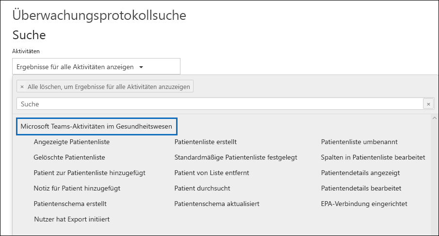

# <a name="search-the-audit-log-in-the-compliance-center"></a><span data-ttu-id="f2a57-103">Durchsuchen des Überwachungsprotokolls im Compliance-Center</span><span class="sxs-lookup"><span data-stu-id="f2a57-103">Search the audit log in the compliance center</span></span>

<span data-ttu-id="f2a57-104">Wollen Sie herausfinden, ob ein Benutzer ein bestimmtes Dokument angezeigt oder ein Element aus seinem Postfach gelöscht hat?</span><span class="sxs-lookup"><span data-stu-id="f2a57-104">Need to find if a user viewed a specific document or purged an item from their mailbox?</span></span> <span data-ttu-id="f2a57-105">Dann verwenden Sie das Microsoft 365 Compliance Center, um das einheitliche Überwachungsprotokoll zu durchsuchen und Benutzer- und Administratoraktivitäten aus Ihrer Organisation anzuzeigen.</span><span class="sxs-lookup"><span data-stu-id="f2a57-105">If so, you can use the Microsoft 365 compliance center to search the unified audit log to view user and administrator activity in your organization.</span></span> <span data-ttu-id="f2a57-106">Warum ein einheitliches Überwachungsprotokoll?</span><span class="sxs-lookup"><span data-stu-id="f2a57-106">Why a unified audit log?</span></span> <span data-ttu-id="f2a57-107">Weil Sie in Microsoft 365 nach den folgenden Arten von [Benutzer- und Verwaltungsaktivitäten](#audited-activities) suchen können:</span><span class="sxs-lookup"><span data-stu-id="f2a57-107">Because you can search for the following types of [user and admin activity](#audited-activities) in Microsoft 365:</span></span>

- <span data-ttu-id="f2a57-108">Benutzeraktivitäten in SharePoint Online und OneDrive for Business</span><span class="sxs-lookup"><span data-stu-id="f2a57-108">User activity in SharePoint Online and OneDrive for Business</span></span>

- <span data-ttu-id="f2a57-109">Benutzeraktivitäten in Exchange Online (Postfachüberwachungsprotokollierung)</span><span class="sxs-lookup"><span data-stu-id="f2a57-109">User activity in Exchange Online (Exchange mailbox audit logging)</span></span>

- <span data-ttu-id="f2a57-110">Administratoraktivitäten in SharePoint Online</span><span class="sxs-lookup"><span data-stu-id="f2a57-110">Admin activity in SharePoint Online</span></span>

- <span data-ttu-id="f2a57-111">Administratoraktivitäten in Azure Active Directory (der Verzeichnisdienst für Microsoft 365)</span><span class="sxs-lookup"><span data-stu-id="f2a57-111">Admin activity in Azure Active Directory (the directory service for Microsoft 365)</span></span>

- <span data-ttu-id="f2a57-112">Administratoraktivitäten in Exchange Online (Exchange-Administratorüberwachungsprotokollierung)</span><span class="sxs-lookup"><span data-stu-id="f2a57-112">Admin activity in Exchange Online (Exchange admin audit logging)</span></span>

- <span data-ttu-id="f2a57-113">eDiscovery-Aktivitäten im Security und Compliance Center</span><span class="sxs-lookup"><span data-stu-id="f2a57-113">eDiscovery activities in the security and compliance center</span></span>

- <span data-ttu-id="f2a57-114">Aktivitäten von Benutzern und Administratoren in Power BI</span><span class="sxs-lookup"><span data-stu-id="f2a57-114">User and admin activity in Power BI</span></span>

- <span data-ttu-id="f2a57-115">Aktivitäten von Benutzern und Administratoren in Microsoft Teams</span><span class="sxs-lookup"><span data-stu-id="f2a57-115">User and admin activity in Microsoft Teams</span></span>

- <span data-ttu-id="f2a57-116">Aktivitäten von Benutzern und Administratoren in Dynamics 365</span><span class="sxs-lookup"><span data-stu-id="f2a57-116">User and admin activity in Dynamics 365</span></span>

- <span data-ttu-id="f2a57-117">Aktivitäten von Benutzern und Administratoren in Yammer</span><span class="sxs-lookup"><span data-stu-id="f2a57-117">User and admin activity in Yammer</span></span>

- <span data-ttu-id="f2a57-118">Aktivitäten von Benutzern und Administratoren in Microsoft Power Automate</span><span class="sxs-lookup"><span data-stu-id="f2a57-118">User and admin activity in Microsoft Power Automate</span></span>

- <span data-ttu-id="f2a57-119">Aktivitäten von Benutzern und Administratoren in Microsoft Stream</span><span class="sxs-lookup"><span data-stu-id="f2a57-119">User and admin activity in Microsoft Stream</span></span>

- <span data-ttu-id="f2a57-120">Aktivitäten von Analysten und Administratoren in Microsoft Workplace Analytics</span><span class="sxs-lookup"><span data-stu-id="f2a57-120">Analyst and admin activity in Microsoft Workplace Analytics</span></span>

- <span data-ttu-id="f2a57-121">Aktivitäten von Benutzern und Administratoren in Microsoft Power Apps</span><span class="sxs-lookup"><span data-stu-id="f2a57-121">User and admin activity in Microsoft Power Apps</span></span>

- <span data-ttu-id="f2a57-122">Aktivitäten von Benutzern und Administratoren in Microsoft Forms</span><span class="sxs-lookup"><span data-stu-id="f2a57-122">User and admin activity in Microsoft Forms</span></span>

- <span data-ttu-id="f2a57-123">Benutzer- und Administratoraktivität für Vertraulichkeitsbezeichnungen für Websites, die SharePoint Online oder Microsoft Teams verwenden</span><span class="sxs-lookup"><span data-stu-id="f2a57-123">User and admin activity for sensitivity labels for sites that use SharePoint Online or Microsoft Teams</span></span>

## <a name="requirements-to-search-the-audit-log"></a><span data-ttu-id="f2a57-124">Voraussetzungen für die Durchsuchung des Überwachungsprotokolls</span><span class="sxs-lookup"><span data-stu-id="f2a57-124">Requirements to search the audit log</span></span>

<span data-ttu-id="f2a57-125">Lesen Sie die folgenden Punkte, bevor Sie mit dem Durchsuchen des Überwachungsprotokolls beginnen.</span><span class="sxs-lookup"><span data-stu-id="f2a57-125">Be sure to read the following items before you start searching the audit log.</span></span>

- <span data-ttu-id="f2a57-126">Die Überwachungsprotokollsuche ist für Microsoft 365- und Office 365 Enterprise-Organisationen standardmäßig aktiviert.</span><span class="sxs-lookup"><span data-stu-id="f2a57-126">Audit log search is turned on by default for Microsoft 365 and Office 365 enterprise organizations.</span></span> <span data-ttu-id="f2a57-127">Das schließt Organisationen mit E3/G3- oder E5/G5-Abonnements ein.</span><span class="sxs-lookup"><span data-stu-id="f2a57-127">This includes organizations with E3/G3 or E5/G5 subscriptions.</span></span> <span data-ttu-id="f2a57-128">Zur Überprüfung, dass die Überwachungsprotokollsuche aktiviert ist, können Sie den folgenden Befehl in der Exchange Online-PowerShell ausführen:</span><span class="sxs-lookup"><span data-stu-id="f2a57-128">To verify that audit log search is turned on, you can run the following command in Exchange Online PowerShell:</span></span>

  ```powershell
  Get-AdminAuditLogConfig | FL UnifiedAuditLogIngestionEnabled
  ```
  <span data-ttu-id="f2a57-129">Der Wert `True` für die Eigenschaft *UnifiedLogIngestionEnabled* gibt an, dass die Überwachungsprotokollsuche aktiviert ist.</span><span class="sxs-lookup"><span data-stu-id="f2a57-129">The value of `True` for the *UnifiedAuditLogIngestionEnabled* property indicates that audit log search is turned on.</span></span> <span data-ttu-id="f2a57-130">Weitere Informationen finden Sie unter [Aktivieren und Deaktivieren der Überwachungsprotokollsuche](turn-audit-log-search-on-or-off.md).</span><span class="sxs-lookup"><span data-stu-id="f2a57-130">For more information, see [Turn audit log search on or off](turn-audit-log-search-on-or-off.md).</span></span>

- <span data-ttu-id="f2a57-131">Ihnen wurde in Exchange Online eine entweder die Rolle „Überwachungsprotokolle nur anzeigen“ oder „Überwachungsprotokolle“ zugewiesen, um das Überwachungsprotokoll zu durchsuchen.</span><span class="sxs-lookup"><span data-stu-id="f2a57-131">You have to be assigned the View-Only Audit Logs or Audit Logs role in Exchange Online to search the audit log.</span></span> <span data-ttu-id="f2a57-132">Standardmäßig sind diese Rollen im Exchange Admin Center zugewiesen den Rollengruppen „Complianceverwaltung“ und „Organisationsverwaltung“ auf der Seite **Berechtigungen**.</span><span class="sxs-lookup"><span data-stu-id="f2a57-132">By default, these roles are assigned to the Compliance Management and Organization Management role groups on the **Permissions** page in the Exchange admin center.</span></span> <span data-ttu-id="f2a57-133">Bitte beachten Sie, dass globale Administratoren in Office 365 und Microsoft 365 automatisch Mitglieder der Verwaltungsrollengruppe „Organisationsverwaltung“ in Exchange Online sind.</span><span class="sxs-lookup"><span data-stu-id="f2a57-133">Note global administrators in Office 365 and Microsoft 365 are automatically added as members of the Organization Management role group in Exchange Online.</span></span> <span data-ttu-id="f2a57-134">Damit ein Benutzer die Möglichkeit hat, das Überwachungsprotokoll mit minimalen Rechten zu durchsuchen, können Sie in Exchange Online eine benutzerdefinierte Rollengruppe erstellen, ihr die Rollen "Überwachungsprotokolle nur anzeigen" oder "Überwachungsprotokolle" hinzufügen und den Benutzer dann als Mitglied der neuen Rollengruppe hinzufügen.</span><span class="sxs-lookup"><span data-stu-id="f2a57-134">To give a user the ability to search the audit log with the minimum level of privileges, you can create a custom role group in Exchange Online, add the View-Only Audit Logs or Audit Logs role, and then add the user as a member of the new role group.</span></span> <span data-ttu-id="f2a57-135">Weitere Informationen finden Sie unter [Verwalten von Rollengruppen in Exchange Online](https://go.microsoft.com/fwlink/p/?LinkID=730688).</span><span class="sxs-lookup"><span data-stu-id="f2a57-135">For more information, see [Manage role groups in Exchange Online](https://go.microsoft.com/fwlink/p/?LinkID=730688).</span></span>

  > [!IMPORTANT]
  > <span data-ttu-id="f2a57-136">Wenn Sie einem Benutzer auf der Seite **Berechtigungen** im Security and Compliance Center die Rolle „Überwachungsprotokolle nur anzeigen“ oder „Überwachungsprotokolle“ zuweisen, kann er das Überwachungsprotokoll nicht durchsuchen.</span><span class="sxs-lookup"><span data-stu-id="f2a57-136">If you assign a user the View-Only Audit Logs or Audit Logs role on the **Permissions** page in the Security & Compliance Center, they won't be able to search the audit log.</span></span> <span data-ttu-id="f2a57-137">Sie müssen die Berechtigungen in Exchange Online zuweisen.</span><span class="sxs-lookup"><span data-stu-id="f2a57-137">You have to assign the permissions in Exchange Online.</span></span> <span data-ttu-id="f2a57-138">Der Grund dafür ist, dass es sich bei dem zugrundeliegenden Cmdlet, das für die Durchsuchung des Überwachungsprotokolls verwendet wird, um ein Exchange Online-Cmdlet handelt.</span><span class="sxs-lookup"><span data-stu-id="f2a57-138">This is because the underlying cmdlet used to search the audit log is an Exchange Online cmdlet.</span></span>

- <span data-ttu-id="f2a57-139">Wenn eine überwachte Aktivität von einem Benutzer oder Administrator ausgeführt wird, wird ein Überwachungsdatensatz erstellt und im Überwachungsprotokoll Ihrer Organisation gespeichert.</span><span class="sxs-lookup"><span data-stu-id="f2a57-139">When an audited activity is performed by a user or admin, an audit record is generated and stored in the audit log for your organization.</span></span> <span data-ttu-id="f2a57-140">Die Zeitdauer, die ein Überwachungsdatensatz aufbewahrt (und im Überwachungsprotokoll durchsuchbar) ist, hängt von Ihrem Office 365- oder Microsoft 365 Enterprise-Abonnement und insbesondere vom Lizenztyp ab, der bestimmten Benutzern zugewiesen ist.</span><span class="sxs-lookup"><span data-stu-id="f2a57-140">The length of time that an audit record is retained (and searchable in the audit log) depends on your Office 365 or Microsoft 365 Enterprise subscription, and specifically the type of the license that is assigned to specific users.</span></span>

  - <span data-ttu-id="f2a57-141">Für Benutzer mit einer Office 365 E5- oder Microsoft 365 E5-Lizenz (oder für Benutzer mit einer Lizenz für Microsoft 365 E5 Compliance oder Microsoft 365 E5 eDiscovery und Überwachung) werden Überwachungsdatensätze für Azure Active Directory-, Exchange- und SharePoint-Aktivitäten standardmäßig ein Jahr lang aufbewahrt.</span><span class="sxs-lookup"><span data-stu-id="f2a57-141">For users assigned an Office 365 E5 or Microsoft 365 E5 license (or users with a Microsoft 365 E5 Compliance or Microsoft 365 E5 eDiscovery and Audit add-on license), audit records for Azure Active Directory, Exchange, and SharePoint activity are retained for one year by default.</span></span> <span data-ttu-id="f2a57-142">Organisationen können auch Aufbewahrungsrichtlinien für Überwachungsprotokolle erstellen, um Überwachungsdatensätze für Aktivitäten in anderen Diensten bis zu ein Jahr lang aufzubewahren.</span><span class="sxs-lookup"><span data-stu-id="f2a57-142">Organizations can also create audit log retention policies to retain audit records for activities in other services for up to one year.</span></span> <span data-ttu-id="f2a57-143">Weitere Informationen finden Sie unter [Verwalten der Aufbewahrungsrichtlinien für Überwachungsprotokolle](audit-log-retention-policies.md).</span><span class="sxs-lookup"><span data-stu-id="f2a57-143">For more information, see [Manage audit log retention policies](audit-log-retention-policies.md).</span></span>

    > [!NOTE]
    > <span data-ttu-id="f2a57-144">Wenn Ihre Organisation am privaten Vorschauprogramm für die einjährige Aufbewahrung von Überwachungsdatensätzen teilgenommen hat, wird die Aufbewahrungsdauer für Überwachungsdatensätze, die vor dem Datum des Rollouts zur allgemeinen Verfügbarkeit generiert wurden, nicht zurückgesetzt.</span><span class="sxs-lookup"><span data-stu-id="f2a57-144">If your organization participated in the private preview program for the one-year retention of audit records, the retention duration for audit records that were generated before the general availability rollout date will not be reset.</span></span>

  - <span data-ttu-id="f2a57-145">Für Benutzer mit anderen Lizenzen (nicht-E5-Lizenzen) für Office 365 oder Microsoft 365 werden Überwachungseinträge 90 Tage lang aufbewahrt.</span><span class="sxs-lookup"><span data-stu-id="f2a57-145">For users assigned any other (non-E5) Office 365 or Microsoft 365 license, audit records are retained for 90 days.</span></span> <span data-ttu-id="f2a57-146">Eine Liste der Office 365- und Microsoft 365-Abonnements, die die einheitliche Überwachungsprotokollierung unterstützen, finden Sie in der [Dienstbeschreibung für das Security & Compliance Center](https://docs.microsoft.com/office365/servicedescriptions/office-365-platform-service-description/office-365-securitycompliance-center).</span><span class="sxs-lookup"><span data-stu-id="f2a57-146">For a list of Office 365 and Microsoft 365 subscriptions that support unified audit logging, see [the security and compliance center service description](https://docs.microsoft.com/office365/servicedescriptions/office-365-platform-service-description/office-365-securitycompliance-center).</span></span>

    > [!NOTE]
    > <span data-ttu-id="f2a57-147">Die Überwachung von Postfächern ist zwar standardmäßig aktiviert, möglicherweise stellen Sie aber fest, dass Postfachüberwachungsereignisse für einige Benutzer beim Durchsuchen von Überwachungsprotokollen im Security & Compliance Center oder über die Office 365-Verwaltungsaktivitäts-API nicht zu finden sind.</span><span class="sxs-lookup"><span data-stu-id="f2a57-147">Even when mailbox auditing on by default is turned on, you might notice that mailbox audit events for some users aren't found in audit log searches in the Security & Compliance Center or via the Office 365 Management Activity API.</span></span> <span data-ttu-id="f2a57-148">Weitere Informationen finden Sie unter [Weitere Informationen zur Postfachüberwachungsprotokollierung](enable-mailbox-auditing.md#more-information).</span><span class="sxs-lookup"><span data-stu-id="f2a57-148">For more information, see [More information about mailbox audit logging](enable-mailbox-auditing.md#more-information).</span></span>

- <span data-ttu-id="f2a57-149">Wenn Sie die Überwachungsprotokollsuche für Ihre Organisation deaktivieren möchten, können Sie in der mit Ihrer Exchange Online-Organisation verbundenen Remote-PowerShell den folgenden Befehl ausführen:</span><span class="sxs-lookup"><span data-stu-id="f2a57-149">If you want to turn off audit log search for your organization, you can run the following command in remote PowerShell connected to your Exchange Online organization:</span></span>

  ```powershell
  Set-AdminAuditLogConfig -UnifiedAuditLogIngestionEnabled $false
  ```

    <span data-ttu-id="f2a57-150">Um die Überwachungssuche wieder zu aktivieren, können Sie den folgenden Befehl in der Exchange Online-PowerShell ausführen:</span><span class="sxs-lookup"><span data-stu-id="f2a57-150">To turn on audit search again, you can run the following command in Exchange Online PowerShell:</span></span>

  ```powershell
  Set-AdminAuditLogConfig -UnifiedAuditLogIngestionEnabled $true
  ```

  <span data-ttu-id="f2a57-151">Weitere Informationen finden Sie unter [Deaktivieren der Überwachungsprotokollsuche](turn-audit-log-search-on-or-off.md).</span><span class="sxs-lookup"><span data-stu-id="f2a57-151">For more information, see [Turn off audit log search](turn-audit-log-search-on-or-off.md).</span></span>

- <span data-ttu-id="f2a57-152">Wie bereits gesagt, handelt es sich bei dem zugrundeliegenden Cmdlet zum Durchsuchen des Überwachungsprotokolls um ein Exchange Online-Cmdlet namens **Search-UnifiedAuditLog**.</span><span class="sxs-lookup"><span data-stu-id="f2a57-152">As previously stated, the underlying cmdlet used to search the audit log is an Exchange Online cmdlet, which is **Search-UnifiedAuditLog**.</span></span> <span data-ttu-id="f2a57-153">Das bedeutet, dass Sie anstelle der Seite **Überwachungsprotokollsuche** im Security and Compliance Center dieses Cmdlet zum Durchsuchen des Überwachungsprotokolls verwenden können.</span><span class="sxs-lookup"><span data-stu-id="f2a57-153">That means you can use this cmdlet to search the audit log instead of using the **Audit log search** page in the Security & Compliance Center.</span></span> <span data-ttu-id="f2a57-154">Sie müssen dieses Cmdlet in der Remote-PowerShell ausführen, die mit Ihrer Exchange Online-Organisation verbunden ist.</span><span class="sxs-lookup"><span data-stu-id="f2a57-154">You have to run this cmdlet in remote PowerShell connected to your Exchange Online organization.</span></span> <span data-ttu-id="f2a57-155">Weitere Informationen finden Sie unter [Search-UnifiedAuditLog](https://go.microsoft.com/fwlink/p/?linkid=834776).</span><span class="sxs-lookup"><span data-stu-id="f2a57-155">For more information, see [Search-UnifiedAuditLog](https://go.microsoft.com/fwlink/p/?linkid=834776).</span></span>

  <span data-ttu-id="f2a57-156">Informationen zum Exportieren der vom **Search-UnifiedAuditLog**-Cmdlet zurückgegebenen Suchergebnisse in eine CSV-Datei finden Sie im Abschnitt „Tipps zum Exportieren, konfigurieren und Anzeigen des Überwachungsprotokolls“ in [Exportieren und Anzeigen des Überwachungsprotokolls](export-view-audit-log-records.md#tips-for-exporting-and-viewing-the-audit-log).</span><span class="sxs-lookup"><span data-stu-id="f2a57-156">For information about exporting the search results returned by the **Search-UnifiedAuditLog** cmdlet to a CSV file, see the "Tips for exporting and viewing the audit log" section in [Export, configure, and view audit log records](export-view-audit-log-records.md#tips-for-exporting-and-viewing-the-audit-log).</span></span>

- <span data-ttu-id="f2a57-157">Wenn Sie programmgesteuert Daten aus dem Überwachungsprotokoll herunterladen möchten, empfehlen wir die Verwendung der Office 365-Verwaltungsaktivitäts-API anstelle eines PowerShell-Skripts.</span><span class="sxs-lookup"><span data-stu-id="f2a57-157">If you want to programmatically download data from the audit log, we recommend that you use the Office 365 Management Activity API instead of using a PowerShell script.</span></span> <span data-ttu-id="f2a57-158">Die Office 365-Verwaltungsaktivitäts-API ist ein REST-Webdienst, den Sie beim Entwickeln von Lösungen zur Überwachung von Vorgängen, der Sicherheit und Compliance für Ihre Organisation verwenden können.</span><span class="sxs-lookup"><span data-stu-id="f2a57-158">The Office 365 Management Activity API is a REST web service that you can use to develop operations, security, and compliance monitoring solutions for your organization.</span></span> <span data-ttu-id="f2a57-159">Weitere Informationen finden Sie in der [Referenz der Office 365-Verwaltungsaktivitäts-API](https://docs.microsoft.com/office/office-365-management-api/office-365-management-activity-api-reference).</span><span class="sxs-lookup"><span data-stu-id="f2a57-159">For more information, see [Office 365 Management Activity API reference](https://docs.microsoft.com/office/office-365-management-api/office-365-management-activity-api-reference).</span></span>

- <span data-ttu-id="f2a57-160">Nach dem Auftreten eines Ereignisses kann es bis zu 30 Minuten oder sogar bis zu 24 Stunden dauern, bis der entsprechende Überwachungsprotokolleintrag in den Ergebnissen der Überwachungsprotokollsuche angezeigt wird.</span><span class="sxs-lookup"><span data-stu-id="f2a57-160">It can take up to 30 minutes or up to 24 hours after an event occurs for the corresponding audit log record to be returned in the results of an audit log search.</span></span> <span data-ttu-id="f2a57-161">Aus der folgenden Tabelle geht die Zeit hervor, die für die unterschiedlichen Dienste in Office 365 benötigt wird.</span><span class="sxs-lookup"><span data-stu-id="f2a57-161">The following table shows the time it takes for the different services in Office 365.</span></span>

  |<span data-ttu-id="f2a57-162">Microsoft 365-Dienst oder -Feature</span><span class="sxs-lookup"><span data-stu-id="f2a57-162">Microsoft 365 service or feature</span></span>|<span data-ttu-id="f2a57-163">30 Minuten</span><span class="sxs-lookup"><span data-stu-id="f2a57-163">30 minutes</span></span>|<span data-ttu-id="f2a57-164">24 Stunden</span><span class="sxs-lookup"><span data-stu-id="f2a57-164">24 hours</span></span>|
  |:-----|:-----:|:-----:|
  |<span data-ttu-id="f2a57-165">Defender für Office 365 und Threat Intelligence</span><span class="sxs-lookup"><span data-stu-id="f2a57-165">Defender for Office 365 and Threat Intelligence</span></span>|||
  |<span data-ttu-id="f2a57-167">Azure Active Directory (Benutzeranmeldungen)</span><span class="sxs-lookup"><span data-stu-id="f2a57-167">Azure Active Directory (user login events)</span></span>|||
  |<span data-ttu-id="f2a57-169">Azure Active Directory (Administratorereignisse)</span><span class="sxs-lookup"><span data-stu-id="f2a57-169">Azure Active Directory (admin events)</span></span>|||
  |<span data-ttu-id="f2a57-171">Verhinderung von Datenverlust</span><span class="sxs-lookup"><span data-stu-id="f2a57-171">Data Loss Prevention</span></span>|||
  |<span data-ttu-id="f2a57-173">Dynamics 365 CRM</span><span class="sxs-lookup"><span data-stu-id="f2a57-173">Dynamics 365 CRM</span></span>|||
  |<span data-ttu-id="f2a57-175">eDiscovery</span><span class="sxs-lookup"><span data-stu-id="f2a57-175">eDiscovery</span></span>|||
  |<span data-ttu-id="f2a57-177">Exchange Online</span><span class="sxs-lookup"><span data-stu-id="f2a57-177">Exchange Online</span></span>|||
  |<span data-ttu-id="f2a57-179">Microsoft Power Automate</span><span class="sxs-lookup"><span data-stu-id="f2a57-179">Microsoft Power Automate</span></span>|||
  |<span data-ttu-id="f2a57-181">Microsoft Project</span><span class="sxs-lookup"><span data-stu-id="f2a57-181">Microsoft Project</span></span>|||
  |<span data-ttu-id="f2a57-183">Microsoft Stream</span><span class="sxs-lookup"><span data-stu-id="f2a57-183">Microsoft Stream</span></span>|||
  |<span data-ttu-id="f2a57-185">Microsoft Teams</span><span class="sxs-lookup"><span data-stu-id="f2a57-185">Microsoft Teams</span></span>|||
  |<span data-ttu-id="f2a57-187">Power-Apps</span><span class="sxs-lookup"><span data-stu-id="f2a57-187">Power Apps</span></span>|||
  |<span data-ttu-id="f2a57-189">Power BI</span><span class="sxs-lookup"><span data-stu-id="f2a57-189">Power BI</span></span>|||
  |<span data-ttu-id="f2a57-191">Security & Compliance Center</span><span class="sxs-lookup"><span data-stu-id="f2a57-191">Security & Compliance Center</span></span>|||
  |<span data-ttu-id="f2a57-193">Vertraulichkeitsbezeichnungen</span><span class="sxs-lookup"><span data-stu-id="f2a57-193">Sensitivity labels</span></span>|||
  |<span data-ttu-id="f2a57-195">SharePoint Online und OneDrive for Business</span><span class="sxs-lookup"><span data-stu-id="f2a57-195">SharePoint Online and OneDrive for Business</span></span>|||
  |<span data-ttu-id="f2a57-197">Workplace Analytics</span><span class="sxs-lookup"><span data-stu-id="f2a57-197">Workplace Analytics</span></span>|||
  |<span data-ttu-id="f2a57-199">Yammer</span><span class="sxs-lookup"><span data-stu-id="f2a57-199">Yammer</span></span>||||
  |<span data-ttu-id="f2a57-201">Microsoft Forms</span><span class="sxs-lookup"><span data-stu-id="f2a57-201">Microsoft Forms</span></span>||
  ||||

- <span data-ttu-id="f2a57-203">Azure Active Directory (Azure AD) ist der Verzeichnisdienst von Office 365.</span><span class="sxs-lookup"><span data-stu-id="f2a57-203">Azure Active Directory (Azure AD) is the directory service for Office 365.</span></span> <span data-ttu-id="f2a57-204">Das vereinheitlichte Überwachungsprotokoll enthält Benutzer-, Gruppen-, Anwendungs-, Domänen- und Verzeichnisaktivitäten, die im Microsoft 365 Admin Center oder im Azure-Verwaltungsportal ausgeführt wurden.</span><span class="sxs-lookup"><span data-stu-id="f2a57-204">The unified audit log contains user, group, application, domain, and directory activities performed in the Microsoft 365 admin center or in the Azure management portal.</span></span> <span data-ttu-id="f2a57-205">Eine vollständige Liste der Azure AD-Ereignisse finden Sie unter [Azure Active Directory-Überwachungsberichtsereignisse](https://go.microsoft.com/fwlink/p/?LinkID=616549).</span><span class="sxs-lookup"><span data-stu-id="f2a57-205">For a complete list of Azure AD events, see [Azure Active Directory Audit Report Events](https://go.microsoft.com/fwlink/p/?LinkID=616549).</span></span>

- <span data-ttu-id="f2a57-206">Die Überwachungsprotokollierung für Power BI ist standardmäßig nicht aktiviert.</span><span class="sxs-lookup"><span data-stu-id="f2a57-206">Audit logging for Power BI isn't enabled by default.</span></span> <span data-ttu-id="f2a57-207">Wenn Sie im Überwachungsprotokoll nach Power BI-Aktivitäten suchen möchten, müssen Sie die Überwachung für das Power BI-Verwaltungsportal aktivieren.</span><span class="sxs-lookup"><span data-stu-id="f2a57-207">To search for Power BI activities in the audit log, you have to enable auditing in the Power BI admin portal.</span></span> <span data-ttu-id="f2a57-208">Anweisungen hierzu finden Sie im Abschnitt "Überwachungsprotokolle" im [Power BI-Verwaltungsportal](https://docs.microsoft.com/power-bi/service-admin-portal#audit-logs).</span><span class="sxs-lookup"><span data-stu-id="f2a57-208">For instructions, see the "Audit logs" section in [Power BI admin portal](https://docs.microsoft.com/power-bi/service-admin-portal#audit-logs).</span></span>

## <a name="search-the-audit-log"></a><span data-ttu-id="f2a57-209">Durchsuchen des Überwachungsprotokolls</span><span class="sxs-lookup"><span data-stu-id="f2a57-209">Search the audit log</span></span>

> [!NOTE]
> <span data-ttu-id="f2a57-210">Ein Problem mit Azure AD-Aktivitäten ist aufgetreten, bei dem es im Überwachungsprotokoll-Suchtool vom 22. Oktober 2020 zum 6. November 2020 nicht zur Verfügung stand.</span><span class="sxs-lookup"><span data-stu-id="f2a57-210">There was an issue with Azure AD activities being unavailable in the audit log search tool from October 22, 2020 to November 6, 2020.</span></span> <span data-ttu-id="f2a57-211">Diese Aktivitäten umfassen Azure AD-Benutzerverwaltungs-, Gruppenverwaltungs-, Anwendungsverwaltungs-, Rollenverwaltungs- und Verzeichnisverwaltungsaktivitäten.</span><span class="sxs-lookup"><span data-stu-id="f2a57-211">These activites include Azure AD user administration activities, group administration activities, application administration activities, role administration activities, and directory administration activities.</span></span> <span data-ttu-id="f2a57-212">Die fehlenden Ereignisse für den Wirkungszeitraum werden während der nächsten Tage zur Verfügung stehen und es wird erwartet, dass es beim 20. November 2020 abgeschlossen sein wird.</span><span class="sxs-lookup"><span data-stu-id="f2a57-212">The missing events for the period of impact will be available over the next few days, and is expected to take no later than November 20, 2020 to complete.</span></span> <span data-ttu-id="f2a57-213">In einigen Fällen können Kunden doppelte Ereignisdaten für Ereignisse bemerken, die zwischen dem 26. Oktober 2020 und dem 5. November 2020 generiert wurden.</span><span class="sxs-lookup"><span data-stu-id="f2a57-213">In some cases, customers might notice duplicate event data for events generated between October 26, 2020 and November 05, 2020.</span></span>
    
<span data-ttu-id="f2a57-214">Nachfolgend ist der Prozess zum Durchsuchen des Überwachungsprotokolls in Office 365 dargestellt. </span><span class="sxs-lookup"><span data-stu-id="f2a57-214">Here's the process for searching the audit log in Office 365.</span></span>

[<span data-ttu-id="f2a57-215">Schritt 1: Durchführen einer Überwachungsprotokollsuche</span><span class="sxs-lookup"><span data-stu-id="f2a57-215">Step 1: Run an audit log search</span></span>](#step-1-run-an-audit-log-search)

[<span data-ttu-id="f2a57-216">Schritt 2: Anzeigen der Suchergebnisse</span><span class="sxs-lookup"><span data-stu-id="f2a57-216">Step 2: View the search results</span></span>](#step-2-view-the-search-results)

[<span data-ttu-id="f2a57-217">Schritt 3: Filtern der Suchergebnisse</span><span class="sxs-lookup"><span data-stu-id="f2a57-217">Step 3: Filter the search results</span></span>](#step-3-filter-the-search-results)

[<span data-ttu-id="f2a57-218">Schritt 4: Exportieren der Suchergebnisse in eine Datei</span><span class="sxs-lookup"><span data-stu-id="f2a57-218">Step 4: Export the search results to a file</span></span>](#step-4-export-the-search-results-to-a-file)

### <a name="step-1-run-an-audit-log-search"></a><span data-ttu-id="f2a57-219">Schritt 1: Durchführen einer Überwachungsprotokollsuche</span><span class="sxs-lookup"><span data-stu-id="f2a57-219">Step 1: Run an audit log search</span></span>

1. <span data-ttu-id="f2a57-220">Wechseln Sie zu [https://protection.office.com](https://protection.office.com).</span><span class="sxs-lookup"><span data-stu-id="f2a57-220">Go to [https://protection.office.com](https://protection.office.com).</span></span>

    > [!TIP]
    > <span data-ttu-id="f2a57-221">Verwenden Sie eine private Browsersitzung (keine gewöhnliche Sitzung) für den Zugriff auf das Security and Compliance Center, weil dadurch die Verwendung Ihrer Anmeldeinformationen verhindert wird.</span><span class="sxs-lookup"><span data-stu-id="f2a57-221">Use a private browsing session (not a regular session) to access the Security & Compliance Center because this will prevent the credential that you are currently logged on with from being used.</span></span> <span data-ttu-id="f2a57-222">Um ein InPrivate-Browserfenster in Internet Explorer oder in Microsoft Edge zu öffnen, drücken Sie einfach STRG+UMSCHALT+P.</span><span class="sxs-lookup"><span data-stu-id="f2a57-222">To open an InPrivate Browsing session in Internet Explorer or Microsoft Edge, just press CTRL+SHIFT+P.</span></span> <span data-ttu-id="f2a57-223">Drücken Sie STRG+UMSCHALT+N, um eine private Browsersitzung in Google Chrome (ein sogenanntes „Inkognito-Fenster“) zu öffnen.</span><span class="sxs-lookup"><span data-stu-id="f2a57-223">To open a private browsing session in Google Chrome (called an incognito window), press CTRL+SHIFT+N.</span></span>

2. <span data-ttu-id="f2a57-224">Melden Sie sich mit Ihrem Geschäfts-, Schul- oder Unikonto an.</span><span class="sxs-lookup"><span data-stu-id="f2a57-224">Sign in using your work or school account.</span></span>

3. <span data-ttu-id="f2a57-225">Klicken Sie im Security & Compliance Center im linken links auf **Suchen** und dann auf **Überwachungsprotokollsuche**.</span><span class="sxs-lookup"><span data-stu-id="f2a57-225">In the left pane of the Security & Compliance Center, click **Search**, and then click **Audit log search**.</span></span>

    <span data-ttu-id="f2a57-226">Die Seite **Überwachungsprotokollsuche** wird angezeigt.</span><span class="sxs-lookup"><span data-stu-id="f2a57-226">The **Audit log search** page is displayed.</span></span>

    

    > [!NOTE]
    > <span data-ttu-id="f2a57-228">Sie müssen zuerst die Überwachungsprotokollierung aktivieren, bevor Sie eine Überwachungsprotokollsuche durchführen können.</span><span class="sxs-lookup"><span data-stu-id="f2a57-228">You have to first turn on audit logging before you can run an audit log search.</span></span> <span data-ttu-id="f2a57-229">Wenn der Link zu **Aufzeichnung von Benutzer- und Administratoraktivitäten starten** angezeigt wird, klicken Sie darauf, um die Überwachung zu aktivieren.</span><span class="sxs-lookup"><span data-stu-id="f2a57-229">If the **Start recording user and admin activity** link is displayed, click it to turn on auditing.</span></span> <span data-ttu-id="f2a57-230">Wird dieser Link nicht angezeigt, wurde die Überprüfung für Ihre Organisation bereits aktiviert.</span><span class="sxs-lookup"><span data-stu-id="f2a57-230">If you don't see this link, auditing has already been turned on for your organization.</span></span>

4. <span data-ttu-id="f2a57-231">Konfigurieren Sie die folgenden Suchkriterien: </span><span class="sxs-lookup"><span data-stu-id="f2a57-231">Configure the following search criteria:</span></span>

   1. <span data-ttu-id="f2a57-232">**Aktivitäten**: Klicken Sie auf die Dropdownliste, um die Aktivitäten anzuzeigen, nach denen Sie suchen können.</span><span class="sxs-lookup"><span data-stu-id="f2a57-232">**Activities**: Click the drop-down list to display the activities that you can search for.</span></span> <span data-ttu-id="f2a57-233">Benutzer- und Verwaltungsaktivitäten sind in Gruppen verwandter Aktivitäten organisiert.</span><span class="sxs-lookup"><span data-stu-id="f2a57-233">User and admin activities are organized into groups of related activities.</span></span> <span data-ttu-id="f2a57-234">Sie können bestimmte Aktivitäten auswählen oder auf den Namen der Aktivitätsgruppe klicken, um alle Aktivitäten in der Gruppe auszuwählen.</span><span class="sxs-lookup"><span data-stu-id="f2a57-234">You can select specific activities or you can click the activity group name to select all activities in the group.</span></span> <span data-ttu-id="f2a57-235">Sie können auch auf eine ausgewählte Aktivität klicken, um die Auswahl aufzuheben.</span><span class="sxs-lookup"><span data-stu-id="f2a57-235">You can also click a selected activity to clear the selection.</span></span> <span data-ttu-id="f2a57-236">Nachdem Sie die Suche ausgeführt haben, werden nur die Überwachungsprotokolleinträge für die ausgewählten Aktivitäten angezeigt.</span><span class="sxs-lookup"><span data-stu-id="f2a57-236">After you run the search, only the audit log entries for the selected activities are displayed.</span></span> <span data-ttu-id="f2a57-237">Durch Auswahl von **Ergebnisse für alle Aktivitäten anzeigen** werden Ergebnisse für alle Aktivitäten angezeigt, die von dem ausgewählten Benutzer oder der ausgewählten Benutzergruppe ausgeführt wurden.</span><span class="sxs-lookup"><span data-stu-id="f2a57-237">Selecting **Show results for all activities** displays results for all activities performed by the selected user or group of users.</span></span>

      <span data-ttu-id="f2a57-238">Es werden mehr als 100 Benutzer- und Administratoraktivitäten im Überwachungsprotokoll erfasst.</span><span class="sxs-lookup"><span data-stu-id="f2a57-238">Over 100 user and admin activities are logged in the audit log.</span></span> <span data-ttu-id="f2a57-239">Klicken Sie beim Thema dieses Artikels auf die Registerkarte **Überwachte Aktivitäten**, um die Beschreibungen der einzelnen Aktivitäten in den verschiedenen Diensten anzuzeigen.</span><span class="sxs-lookup"><span data-stu-id="f2a57-239">Click the **Audited activities** tab at the topic of this article to see the descriptions of every activity in each of the different services.</span></span>

   1. <span data-ttu-id="f2a57-240">**Startdatum** und **Enddatum**: Standardmäßig sind die letzten sieben Tage ausgewählt.</span><span class="sxs-lookup"><span data-stu-id="f2a57-240">**Start date** and **End date**: The last seven days are selected by default.</span></span> <span data-ttu-id="f2a57-241">Wählen Sie einen Datums- und Uhrzeitbereich aus, um die Ereignisse anzuzeigen, die innerhalb dieses Zeitraums aufgetreten sind.</span><span class="sxs-lookup"><span data-stu-id="f2a57-241">Select a date and time range to display the events that occurred within that period.</span></span> <span data-ttu-id="f2a57-242">Das Datum und die Uhrzeit werden im UTC-Format (Coordinated Universal Time) angezeigt.</span><span class="sxs-lookup"><span data-stu-id="f2a57-242">The date and time are presented in Coordinated Universal Time (UTC) format.</span></span> <span data-ttu-id="f2a57-243">Der maximale Datumsbereich, den Sie angeben können, umfasst 90 Tage.</span><span class="sxs-lookup"><span data-stu-id="f2a57-243">The maximum date range that you can specify is 90 days.</span></span> <span data-ttu-id="f2a57-244">Es wird ein Fehler angezeigt, wenn der ausgewählte Datumsbereich mehr als 90 Tage umfasst.</span><span class="sxs-lookup"><span data-stu-id="f2a57-244">An error is displayed if the selected date range is greater than 90 days.</span></span>

      > [!TIP]
      > <span data-ttu-id="f2a57-245">Wenn Sie den maximalen Datumsbereich von 90 Tagen verwenden, wählen Sie den aktuellen Zeitpunkt für das **Startdatum** aus.</span><span class="sxs-lookup"><span data-stu-id="f2a57-245">If you're using the maximum date range of 90 days, select the current time for the **Start date**.</span></span> <span data-ttu-id="f2a57-246">Andernfalls wird eine Fehlermeldung angezeigt, in der mitgeteilt wird, dass das Startdatum vor dem Enddatum liegt.</span><span class="sxs-lookup"><span data-stu-id="f2a57-246">Otherwise, you'll receive an error saying that the start date is earlier than the end date.</span></span> <span data-ttu-id="f2a57-247">Wenn Sie die Überwachung innerhalb der letzten 90 Tage aktiviert haben, kann der maximale Datumsbereich nicht vor dem Datum beginnen, an dem die Überwachung aktiviert wurde.</span><span class="sxs-lookup"><span data-stu-id="f2a57-247">If you've turned on auditing within the last 90 days, the maximum date range can't start before the date that auditing was turned on.</span></span>

   1. <span data-ttu-id="f2a57-248">**Benutzer**: Klicken Sie in dieses Feld, und wählen Sie dann einen oder mehrere Benutzer aus, für die Suchergebnisse angezeigt werden sollen.</span><span class="sxs-lookup"><span data-stu-id="f2a57-248">**Users**: Click in this box and then select one or more users to display search results for.</span></span> <span data-ttu-id="f2a57-249">In der Liste der Ergebnisse werden die Überwachungsprotokolleinträge für die ausgewählte Aktivität angezeigt, die von den Benutzern ausgeführt wurde, die Sie in diesem Feld ausgewählt haben.</span><span class="sxs-lookup"><span data-stu-id="f2a57-249">The audit log entries for the selected activity performed by the users you select in this box are displayed in the list of results.</span></span> <span data-ttu-id="f2a57-250">Lassen Sie dieses Feld leer, um die Einträge für alle Benutzer (und Dienstkonten) in Ihrer Organisation zurückzugeben.</span><span class="sxs-lookup"><span data-stu-id="f2a57-250">Leave this box blank to return entries for all users (and service accounts) in your organization.</span></span>

   1. <span data-ttu-id="f2a57-251">**Datei, Ordner oder Website**: Geben Sie einen Datei- oder Ordnernamen ganz oder teilweise ein, um nach Aktivitäten für die Datei oder den Ordner zu suchen, die bzw. der das angegebene Schlüsselwort enthält.</span><span class="sxs-lookup"><span data-stu-id="f2a57-251">**File, folder, or site**: Type some or all of a file or folder name to search for activity related to the file of folder that contains the specified keyword.</span></span> <span data-ttu-id="f2a57-252">Sie können auch die URL einer Datei oder eines Ordners verwenden.</span><span class="sxs-lookup"><span data-stu-id="f2a57-252">You can also specify a URL of a file or folder.</span></span> <span data-ttu-id="f2a57-253">Wenn Sie eine URL verwenden wollen, geben Sie unbedingt den vollständigen URL-Pfad ein. Falls Sie nur einen Teil der URL eingeben, verwenden Sie bitte keine Sonder- oder Leerzeichen.</span><span class="sxs-lookup"><span data-stu-id="f2a57-253">If you use a URL, be sure the type the full URL path or if you type a portion of the URL, don't include any special characters or spaces.</span></span>

      <span data-ttu-id="f2a57-254">Lassen Sie dieses Feld leer, um Einträge für alle Dateien und Ordner in Ihrer Organisation zurückzugeben.</span><span class="sxs-lookup"><span data-stu-id="f2a57-254">Leave this box blank to return entries for all files and folders in your organization.</span></span>

      > [!TIP]
      >
      > - <span data-ttu-id="f2a57-255">Wenn Sie nach allen Aktivitäten im Zusammenhang mit einer **Website** suchen, fügen Sie das Platzhaltersymbol (\*) hinter die URL ein, um alle Einträge für diese Website zurückzugeben, z. b. `"https://contoso-my.sharepoint.com/personal*"`.</span><span class="sxs-lookup"><span data-stu-id="f2a57-255">If you're looking for all activities related to a **site**, add the wildcard symbol (\*) after the URL to return all entries for that site; for example, `"https://contoso-my.sharepoint.com/personal*"`.</span></span>
      >
      > - <span data-ttu-id="f2a57-256">Wenn Sie nach allen Aktivitäten im Zusammenhang mit einer **Datei** suchen, fügen Sie das Platzhaltersymbol (\*) vor dem Dateinamen ein, um alle Einträge für diese Datei zurückzugeben, z. b. `"*Customer_Profitability_Sample.csv"`.</span><span class="sxs-lookup"><span data-stu-id="f2a57-256">If you're looking for all activities related to a **file**, add the wildcard symbol (\*) before the file name to return all entries for that file; for example, `"*Customer_Profitability_Sample.csv"`.</span></span>

5. <span data-ttu-id="f2a57-257">Klicken Sie auf **Suchen**, um die Suche anhand der Suchkriterien auszuführen. </span><span class="sxs-lookup"><span data-stu-id="f2a57-257">Click **Search** to run the search using your search criteria.</span></span>

   <span data-ttu-id="f2a57-258">Die Suchergebnisse werden geladen und nach wenigen Augenblicken unter **Ergebnisse** angezeigt.</span><span class="sxs-lookup"><span data-stu-id="f2a57-258">The search results are loaded, and after a few moments they are displayed under **Results**.</span></span> <span data-ttu-id="f2a57-259">Nach Abschluss der Suche wird die Anzahl der gefundenen Ergebnisse angezeigt.</span><span class="sxs-lookup"><span data-stu-id="f2a57-259">When the search is finished, the number of results found is displayed.</span></span> <span data-ttu-id="f2a57-260">Im Bereich **Ergebnisse** werden maximal 5.000 Ereignisse in Schritten von jeweils 150 Ereignissen angezeigt.</span><span class="sxs-lookup"><span data-stu-id="f2a57-260">A maximum of 5,000 events will be displayed in the **Results** pane in increments of 150 events.</span></span> <span data-ttu-id="f2a57-261">Wenn mehr als 5.000 Ereignisse die Suchkriterien erfüllen, werden die aktuellsten 5.000 Ereignisse angezeigt.</span><span class="sxs-lookup"><span data-stu-id="f2a57-261">If more than 5,000 events meet the search criteria, the most recent 5,000 events are displayed.</span></span>

   

#### <a name="tips-for-searching-the-audit-log"></a><span data-ttu-id="f2a57-263">Tipps zum Suchen im Überwachungsprotokoll</span><span class="sxs-lookup"><span data-stu-id="f2a57-263">Tips for searching the audit log</span></span>

- <span data-ttu-id="f2a57-264">Durch Klicken auf den Aktivitätsnamen können Sie bestimmte Aktivitäten auswählen, nach denen gesucht werden soll.</span><span class="sxs-lookup"><span data-stu-id="f2a57-264">You can select specific activities to search for by clicking the activity name.</span></span> <span data-ttu-id="f2a57-265">Sie können auch auf den Gruppennamen klicken, um nach allen Aktivitäten in einer Gruppe (z. B. **Datei- und Ordneraktivitäten**) zu suchen.</span><span class="sxs-lookup"><span data-stu-id="f2a57-265">Or you can search for all activities in a group (such as **File and folder activities**) by clicking the group name.</span></span> <span data-ttu-id="f2a57-266">Wenn eine Aktivität ausgewählt ist, können Sie darauf klicken, um die Auswahl aufzuheben.</span><span class="sxs-lookup"><span data-stu-id="f2a57-266">If an activity is selected, you can click it to cancel the selection.</span></span> <span data-ttu-id="f2a57-267">Sie können auch das Suchfeld verwenden, um die Aktivitäten anzuzeigen, die das von Ihnen eingegebene Schlüsselwort enthalten.</span><span class="sxs-lookup"><span data-stu-id="f2a57-267">You can also use the search box to display the activities that contain the keyword that you type.</span></span>

  

- <span data-ttu-id="f2a57-269">Sie müssen **Ergebnisse für alle Aktivitäten anzeigen** in der Liste **Aktivitäten** auswählen, um Einträge aus dem Exchange-Administrator-Überwachungsprotokoll anzuzeigen.</span><span class="sxs-lookup"><span data-stu-id="f2a57-269">You have to select **Show results for all activities** in the **Activities** list to display events from the Exchange admin audit log.</span></span> <span data-ttu-id="f2a57-270">Bei Ereignissen aus diesem Überwachungsprotokoll wird der Name eines Cmdlets (z. B. **Set-Mailbox**) in der Spalte **Aktivität** unter den Ergebnissen angezeigt.</span><span class="sxs-lookup"><span data-stu-id="f2a57-270">Events from this audit log display a cmdlet name (for example, **Set-Mailbox**) in the **Activity** column in the results.</span></span> <span data-ttu-id="f2a57-271">Um weitere Informationen zu erhalten, klicken Sie auf die Registerkarte **überwachte Aktivitäten** in diesem Thema, und dann auf **Exchange-Administratoraktivitäten**.</span><span class="sxs-lookup"><span data-stu-id="f2a57-271">For more information, click the **Audited activities** tab in this topic and then click **Exchange admin activities**.</span></span>

  <span data-ttu-id="f2a57-272">Ebenso gibt es einige Überwachungsaktivitäten, für die in der Liste **Aktivitäten** kein entsprechendes Element enthalten ist.</span><span class="sxs-lookup"><span data-stu-id="f2a57-272">Similarly, there are some auditing activities that don't have a corresponding item in the **Activities** list.</span></span> <span data-ttu-id="f2a57-273">Wenn Sie den Namen des Vorgangs für diese Aktivitäten kennen, können Sie nach allen Aktivitäten suchen und die Ergebnisse dann filtern, indem Sie den Vorgangsnamen in das Feld für die Spalte **Aktivität** eingeben.</span><span class="sxs-lookup"><span data-stu-id="f2a57-273">If you know the name of the operation for these activities, you can search for all activities, then filter the results by typing the name of the operation in the box for the **Activity** column.</span></span> <span data-ttu-id="f2a57-274">Weitere Informationen zum Filtern der Ergebnisse finden Sie unter [Schritt 3: Suchergebnisse filtern](#step-3-filter-the-search-results).</span><span class="sxs-lookup"><span data-stu-id="f2a57-274">See [Step 3: Filter the search results](#step-3-filter-the-search-results) for more information about filtering the results.</span></span>

- <span data-ttu-id="f2a57-275">Klicken Sie auf **Auswahl aufheben**, um die aktuelle Auswahl von Suchkriterien aufzuheben.</span><span class="sxs-lookup"><span data-stu-id="f2a57-275">Click **Clear** to clear the current search criteria.</span></span> <span data-ttu-id="f2a57-276">Der Datumsbereich wird auf die Standardeinstellung für die letzten sieben Tage zurückgesetzt.</span><span class="sxs-lookup"><span data-stu-id="f2a57-276">The date range returns to the default of the last seven days.</span></span> <span data-ttu-id="f2a57-277">Sie können auch auf **Gesamte Auswahl aufheben, um Ergebnisse für alle Aktivitäten anzuzeigen** klicken, um die getroffene Auswahl von Aktivitäten aufzuheben.</span><span class="sxs-lookup"><span data-stu-id="f2a57-277">You can also click **Clear all to show results for all activities** to cancel all selected activities.</span></span>

- <span data-ttu-id="f2a57-278">Wenn 5,000 Ergebnisse gefunden werden, können Sie wahrscheinlich davon ausgehen, dass mehr als 5.000 Ereignisse die Suchkriterien erfüllen.</span><span class="sxs-lookup"><span data-stu-id="f2a57-278">If 5,000 results are found, you can probably assume that there are more than 5,000 events that met the search criteria.</span></span> <span data-ttu-id="f2a57-279">Sie können entweder die Suchkriterien verfeinern und die Suche erneut durchführen, damit weniger Ergebnisse zurückgegeben werden, oder Sie können alle Suchergebnisse exportieren, indem Sie **Ergebnisse exportieren** \> **Alle Ergebnisse herunterladen** auswählen.</span><span class="sxs-lookup"><span data-stu-id="f2a57-279">You can either refine the search criteria and rerun the search to return fewer results, or you can export all of the search results by selecting **Export results** \> **Download all results**.</span></span>

### <a name="step-2-view-the-search-results"></a><span data-ttu-id="f2a57-280">Schritt 2: Anzeigen der Suchergebnisse</span><span class="sxs-lookup"><span data-stu-id="f2a57-280">Step 2: View the search results</span></span>

<span data-ttu-id="f2a57-281">Die Ergebnisse einer Überwachungsprotokollsuche werden unter **Ergebnisse** auf der Seite **Überwachungsprotokollsuche** angezeigt.</span><span class="sxs-lookup"><span data-stu-id="f2a57-281">The results of an audit log search are displayed under **Results** on the **Audit log search** page.</span></span> <span data-ttu-id="f2a57-282">Wie bereits erwähnt werden maximal 5.000 Ereignisse (ggf. die 5.000 neuesten Ereignisse) in Schritten von 150 Ereignissen angezeigt.</span><span class="sxs-lookup"><span data-stu-id="f2a57-282">As previously stated a maximum of 5,000 (newest) events are displayed in increments of 150 events.</span></span> <span data-ttu-id="f2a57-283">Zum Anzeigen weiterer Ereignisse können Sie die Bildlaufleiste im Bereich **Ergebnisse** verwenden oder **UMSCHALT+ENDE** drücken, um die nächsten 150 Ereignisse anzuzeigen.</span><span class="sxs-lookup"><span data-stu-id="f2a57-283">To display more events you can use the scroll bar in the **Results** pane or you can press **Shift + End** to display the next 150 events.</span></span>

<span data-ttu-id="f2a57-284">Die Ergebnisse enthalten die folgenden Informationen zu den einzelnen Ereignissen, die bei der Suche zurückgegeben werden:</span><span class="sxs-lookup"><span data-stu-id="f2a57-284">The results contain the following information about each event returned by the search:</span></span>

- <span data-ttu-id="f2a57-285">**Datum**: Das Datum und die Uhrzeit (im UTC-Format), zu der das Ereignis auftrat.</span><span class="sxs-lookup"><span data-stu-id="f2a57-285">**Date**: The date and time (in UTC format) when the event occurred.</span></span>

- <span data-ttu-id="f2a57-286">**IP-Adresse**: Die IP-Adresse des Geräts, das verwendet wurde, als die Aktivität protokolliert wurde.</span><span class="sxs-lookup"><span data-stu-id="f2a57-286">**IP address**: The IP address of the device that was used when the activity was logged.</span></span> <span data-ttu-id="f2a57-287">Die IP-Adresse wird im Adressformat IPv4 oder IPv6 angezeigt.</span><span class="sxs-lookup"><span data-stu-id="f2a57-287">The IP address is displayed in either an IPv4 or IPv6 address format.</span></span>

   > [!NOTE]
  > <span data-ttu-id="f2a57-288">Bei einigen Diensten ist der in diesem Feld angezeigte Wert möglicherweise die IP-Adresse einer vertrauenswürdigen Anwendung (z. B. Office in den Web-Apps), die anstelle eines Benutzers in den Dienst einruft und nicht die IP-Adresse des Geräts, das von der Person, die die Aktivität ausgeführt hat, verwendet wird.</span><span class="sxs-lookup"><span data-stu-id="f2a57-288">For some services, the value displayed in this field might be the IP address for a trusted application (for example, Office on the web apps) calling into the service on behalf of a user and not the IP address of the device used by person who performed the activity.</span></span> <span data-ttu-id="f2a57-289">Außerdem wird bei Administratoraktivitäten (oder von einem Systemkonto ausgeführte Aktivitäten) für Azure Active Directory-bezogene Ereignisse die IP-Adresse nicht protokolliert, und der in diesem Feld angezeigte Wert ist `null`.</span><span class="sxs-lookup"><span data-stu-id="f2a57-289">Also, for admin activity (or activity performed by a system account) for Azure Active Directory-related events, the IP address isn't logged and the value displayed in this field is `null`.</span></span>

- <span data-ttu-id="f2a57-290">**Benutzer**: Der Benutzer (oder das Dienstkonto), der die Aktion ausführte, durch die das Ereignis ausgelöst wurde.</span><span class="sxs-lookup"><span data-stu-id="f2a57-290">**User**: The user (or service account) who performed the action that triggered the event.</span></span>

- <span data-ttu-id="f2a57-291">**Aktivität**: Die vom Benutzer ausgeführte Aktivität.</span><span class="sxs-lookup"><span data-stu-id="f2a57-291">**Activity**: The activity performed by the user.</span></span> <span data-ttu-id="f2a57-292">Dieser Wert entspricht den Aktivitäten, die Sie in der Dropdownliste **Aktivitäten** ausgewählt haben.</span><span class="sxs-lookup"><span data-stu-id="f2a57-292">This value corresponds to the activities that you selected in the **Activities** drop down list.</span></span> <span data-ttu-id="f2a57-293">Bei einem Ereignis aus dem Exchange-Administratorüberwachungsprotokoll ist der Wert in dieser Spalte ein Exchange-Cmdlet.</span><span class="sxs-lookup"><span data-stu-id="f2a57-293">For an event from the Exchange admin audit log, the value in this column is an Exchange cmdlet.</span></span>

- <span data-ttu-id="f2a57-294">**Element**: Das Objekt, das als Ergebnis der entsprechenden Aktivität erstellt oder geändert wurde.</span><span class="sxs-lookup"><span data-stu-id="f2a57-294">**Item**: The object that was created or modified as a result of the corresponding activity.</span></span> <span data-ttu-id="f2a57-295">Dies kann z. B. die Datei sein, die angezeigt oder geändert wurde, oder das Benutzerkonto, das aktualisiert wurde.</span><span class="sxs-lookup"><span data-stu-id="f2a57-295">For example, the file that was viewed or modified or the user account that was updated.</span></span> <span data-ttu-id="f2a57-296">Nicht alle Aktivitäten haben in dieser Spalte einen Wert.</span><span class="sxs-lookup"><span data-stu-id="f2a57-296">Not all activities have a value in this column.</span></span>

- <span data-ttu-id="f2a57-297">**Detail**: Zusätzliche Informationen zu einer Aktivität.</span><span class="sxs-lookup"><span data-stu-id="f2a57-297">**Detail**: Additional information about an activity.</span></span> <span data-ttu-id="f2a57-298">Auch hier weisen nicht alle Aktivitäten einen Wert auf.</span><span class="sxs-lookup"><span data-stu-id="f2a57-298">Again, not all activities have a value.</span></span>

> [!TIP]
> <span data-ttu-id="f2a57-299">Klicken Sie unter **Ergebnisse** auf eine Spaltenüberschrift, um die Ergebnisse zu sortieren.</span><span class="sxs-lookup"><span data-stu-id="f2a57-299">Click a column header under **Results** to sort the results.</span></span> <span data-ttu-id="f2a57-300">Sie können die Ergebnisse aufsteigend (von A nach Z) oder absteigend (von Z nach A) sortieren. Klicken Sie auf die Überschrift **Datum**, um die Ergebnisse vom ältesten zum neuesten oder vom neuesten zum ältesten zu sortieren.</span><span class="sxs-lookup"><span data-stu-id="f2a57-300">You can sort the results from A to Z or Z to A. Click the **Date** header to sort the results from oldest to newest or newest to oldest.</span></span>

#### <a name="view-the-details-for-a-specific-event"></a><span data-ttu-id="f2a57-301">Anzeigen der Details zu einem bestimmten Ereignis</span><span class="sxs-lookup"><span data-stu-id="f2a57-301">View the details for a specific event</span></span>

<span data-ttu-id="f2a57-302">Sie können weitere Details zu einem Ereignis anzeigen, indem Sie in der Liste der Suchergebnisse auf den Ereigniseintrag klicken.</span><span class="sxs-lookup"><span data-stu-id="f2a57-302">You can view more details about an event by clicking the event record in the list of search results.</span></span> <span data-ttu-id="f2a57-303">Daraufhin wird die Seite **Details** mit detaillierten Eigenschaften des Ereigniseintrags angezeigt.</span><span class="sxs-lookup"><span data-stu-id="f2a57-303">A **Details** page is displayed that contains the detailed properties from the event record.</span></span> <span data-ttu-id="f2a57-304">Die angezeigten Eigenschaften sind von dem Dienst abhängig, in dem das Ereignis eintritt.</span><span class="sxs-lookup"><span data-stu-id="f2a57-304">The properties that are displayed depend on the service in which the event occurs.</span></span> <span data-ttu-id="f2a57-305">Zum Anzeigen weiterer Details klicken Sie auf **Weitere Informationen**.</span><span class="sxs-lookup"><span data-stu-id="f2a57-305">To display these details, click **More information**.</span></span> <span data-ttu-id="f2a57-306">Beschreibungen finden Sie in [Detaillierte Eigenschaften im Überwachungsprotokoll](detailed-properties-in-the-office-365-audit-log.md).</span><span class="sxs-lookup"><span data-stu-id="f2a57-306">For descriptions, see [Detailed properties in the audit log](detailed-properties-in-the-office-365-audit-log.md).</span></span>


### <a name="step-3-filter-the-search-results"></a><span data-ttu-id="f2a57-308">Schritt 3: Filtern der Suchergebnisse</span><span class="sxs-lookup"><span data-stu-id="f2a57-308">Step 3: Filter the search results</span></span>

<span data-ttu-id="f2a57-309">Zusätzlich zur Sortierung können Sie die Ergebnisse einer Überwachungsprotokollsuche auch filtern.</span><span class="sxs-lookup"><span data-stu-id="f2a57-309">In addition to sorting, you can also filter the results of an audit log search.</span></span> <span data-ttu-id="f2a57-310">Dies ist eine sehr hilfreiche Funktion, mit der Sie schnell die Ergebnisse für einen bestimmten Benutzer oder eine bestimmte Aktivität filtern können.</span><span class="sxs-lookup"><span data-stu-id="f2a57-310">This is a great feature that can help you quickly filter the results for a specific user or activity.</span></span> <span data-ttu-id="f2a57-311">Sie können zuerst eine breite Suche erstellen und dann die Ergebnisse schnell filtern, um nur bestimmte Ereignisse anzuzeigen.</span><span class="sxs-lookup"><span data-stu-id="f2a57-311">You can initially create a wide search and then quickly filter the results to see specific events.</span></span> <span data-ttu-id="f2a57-312">Anschließend können Sie die Suchkriterien einschränken und die Suche erneut durchführen, um eine kleinere, kompaktere Gruppe von Ergebnissen zurückzugeben.</span><span class="sxs-lookup"><span data-stu-id="f2a57-312">Then you can narrow the search criteria and rerun the search to return a smaller, more concise set of results.</span></span>

<span data-ttu-id="f2a57-313">So filtern Sie die Ergebnisse:</span><span class="sxs-lookup"><span data-stu-id="f2a57-313">To filter the results:</span></span>

1. <span data-ttu-id="f2a57-314">Führen Sie eine Überwachungsprotokollsuche aus.</span><span class="sxs-lookup"><span data-stu-id="f2a57-314">Run an audit log search.</span></span>

2. <span data-ttu-id="f2a57-315">Sobald die Ergebnisse angezeigt werden, klicken Sie auf **Ergebnisse filtern**.</span><span class="sxs-lookup"><span data-stu-id="f2a57-315">When the results are displayed, click **Filter results**.</span></span>

   <span data-ttu-id="f2a57-316">Unter den einzelnen Spaltenüberschriften werden Felder für Schlüsselwörter angezeigt.</span><span class="sxs-lookup"><span data-stu-id="f2a57-316">Keyword boxes are displayed under each column header.</span></span>

3. <span data-ttu-id="f2a57-317">Klicken Sie auf eines der Felder unter einer Spaltenüberschrift, und geben Sie abhängig von der Spalte ein Wort oder einen Ausdruck ein, nach dem Sie filtern möchten.</span><span class="sxs-lookup"><span data-stu-id="f2a57-317">Click one of the boxes under a column header and type a word or phrase, depending on the column you're filtering on.</span></span> <span data-ttu-id="f2a57-318">Die Ergebnisse werden dynamisch angepasst und die Ereignisse angezeigt, die den Filterkriterien entsprechen.</span><span class="sxs-lookup"><span data-stu-id="f2a57-318">The results will dynamically readjust to display the events that match your filter.</span></span>

   

4. <span data-ttu-id="f2a57-320">Zum Löschen eines Filters klicken Sie auf das **X** im Filterfeld oder auf **Filterung ausblenden**.</span><span class="sxs-lookup"><span data-stu-id="f2a57-320">To clear a filter, click the **X** in the filter box or click **Hide filtering**.</span></span>

> [!TIP]
> <span data-ttu-id="f2a57-321">Zum Anzeigen von Ereignissen aus dem Exchange-Administratorüberwachungsprotokoll geben Sie einen Bindestrich (**-**) in das Filterfeld **Aktivität** ein.</span><span class="sxs-lookup"><span data-stu-id="f2a57-321">To display events from the Exchange admin audit log, type a **-** (dash) in the **Activity** filter box.</span></span> <span data-ttu-id="f2a57-322">Dadurch werden Cmdlet-Namen angezeigt, die in der Spalte **Aktivität** für Exchange-Administratorereignisse angegeben sind.</span><span class="sxs-lookup"><span data-stu-id="f2a57-322">This will display cmdlet names, which are displayed in the **Activity** column for Exchange admin events.</span></span> <span data-ttu-id="f2a57-323">Anschließend können Sie die Cmdlet-Namen alphabetisch sortieren.</span><span class="sxs-lookup"><span data-stu-id="f2a57-323">Then you can sort the cmdlet names in alphabetical order.</span></span>

### <a name="step-4-export-the-search-results-to-a-file"></a><span data-ttu-id="f2a57-324">Schritt 4: Exportieren der Suchergebnisse in eine Datei</span><span class="sxs-lookup"><span data-stu-id="f2a57-324">Step 4: Export the search results to a file</span></span>

<span data-ttu-id="f2a57-325">Sie können die Ergebnisse einer Überwachungsprotokollsuche in eine Datei mit kommagetrennten Werten (CSV) auf Ihren lokalen Computer exportieren.</span><span class="sxs-lookup"><span data-stu-id="f2a57-325">You can export the results of an audit log search to a comma-separated value (CSV) file on your local computer.</span></span> <span data-ttu-id="f2a57-326">Sie können diese Datei in Microsoft Excel öffnen und Funktionen wie das Suchen, Sortieren, Filtern und Teilen einer einzelnen Spalte (die Zellen mit mehreren Eigenschaften enthält) in mehrere Spalten verwenden.</span><span class="sxs-lookup"><span data-stu-id="f2a57-326">You can open this file in Microsoft Excel and use features such as search, sorting, filtering, and splitting a single column (that contains multiple properties) into multiple columns.</span></span>

1. <span data-ttu-id="f2a57-327">Führen Sie eine Überwachungsprotokollsuche aus, und bearbeiten Sie dann die Suchkriterien, bis Sie die gewünschten Ergebnisse erhalten.</span><span class="sxs-lookup"><span data-stu-id="f2a57-327">Run an audit log search, and then revise the search criteria until you have the desired results.</span></span>

2. <span data-ttu-id="f2a57-328">Klicken Sie auf **Ergebnisse exportieren**, und wählen Sie eine der folgenden Optionen aus:</span><span class="sxs-lookup"><span data-stu-id="f2a57-328">Click **Export results** and select one of the following options:</span></span>

   - <span data-ttu-id="f2a57-329">**Geladene Ergebnisse speichern**: Wählen Sie diese Option aus, um nur die Einträge zu exportieren, die unter **Ergebnisse** auf der Seite **Überwachungsprotokollsuche** angezeigt werden.</span><span class="sxs-lookup"><span data-stu-id="f2a57-329">**Save loaded results**: Choose this option to export only the entries that are displayed under **Results** on the **Audit log search** page.</span></span> <span data-ttu-id="f2a57-330">Die heruntergeladene CSV-Datei enthält dieselben Spalten (und Daten), die auch auf der Seite angezeigt werden (Datum, Benutzer, Aktivität, Element und Details).</span><span class="sxs-lookup"><span data-stu-id="f2a57-330">The CSV file that is downloaded contains the same columns (and data) displayed on the page (Date, User, Activity, Item, and Details).</span></span> <span data-ttu-id="f2a57-331">Eine zusätzliche Spalte (mit dem Namen **Mehr**) wird in die CSV-Datei aufgenommen und enthält weitere Informationen aus dem Überwachungsprotokolleintrag.</span><span class="sxs-lookup"><span data-stu-id="f2a57-331">An extra column (named **More**) is included in the CSV file that contains more information from the audit log entry.</span></span> <span data-ttu-id="f2a57-332">Da Sie dieselben Ergebnisse exportieren, die auf der Seite **Überwachungsprotokollsuche** geladen werden (und angezeigt werden können), werden maximal 5.000 Einträge exportiert.</span><span class="sxs-lookup"><span data-stu-id="f2a57-332">Because you're exporting the same results that are loaded (and viewable) on the **Audit log search** page, a maximum of 5,000 entries are exported.</span></span>

   - <span data-ttu-id="f2a57-333">**Alle Ergebnisse herunterladen**: Wählen Sie diese Option aus, um alle Einträge aus dem Überwachungsprotokoll zu exportieren, die den Suchkriterien entsprechen.</span><span class="sxs-lookup"><span data-stu-id="f2a57-333">**Download all results**: Choose this option to export all entries from the audit log that meet the search criteria.</span></span> <span data-ttu-id="f2a57-334">Wenn Sie eine große Menge von Suchergebnissen exportieren möchten, wählen Sie diese Option aus, um zusätzlich zu den 5.000 Ergebnissen, die auf der Seite **Überwachungsprotokollsuche** angezeigt werden können, alle Einträge aus dem Überwachungsprotokoll herunterzuladen.</span><span class="sxs-lookup"><span data-stu-id="f2a57-334">For a large set of search results, choose this option to download all entries from the audit log in addition to the 5,000 audit records that can be displayed on the **Audit log search** page.</span></span> <span data-ttu-id="f2a57-335">Mit dieser Option werden die unformatierten Daten aus dem Überwachungsprotokoll in eine CSV-Datei heruntergeladen, und es sind zusätzliche Informationen aus dem Überwachungsprotokolleintrag in einer Spalte mit dem Namen **AuditData** enthalten.</span><span class="sxs-lookup"><span data-stu-id="f2a57-335">This option downloads the raw data from the audit log to a CSV file, and contains additional information from the audit log entry in a column named **AuditData**.</span></span> <span data-ttu-id="f2a57-336">Bei Auswahl dieser Exportoption kann das Herunterladen der Datei etwas länger dauern, da die Datei möglicherweise wesentlich größer als diejenige ist, die bei Auswahl einer anderen Option heruntergeladen wird.</span><span class="sxs-lookup"><span data-stu-id="f2a57-336">It may take longer to download the file if you choose this export option because the file may be much larger than the one that's downloaded if you choose the other option.</span></span>

     > [!IMPORTANT]
     > <span data-ttu-id="f2a57-337">Aus seiner einzigen Suche in einer Protokolldatei können Sie maximal 50.000 Einträge in eine CSV-Datei herunterladen.</span><span class="sxs-lookup"><span data-stu-id="f2a57-337">You can download a maximum of 50,000 entries to a CSV file from a single audit log search.</span></span> <span data-ttu-id="f2a57-338">Wenn 50.000 Einträge in die CSV-Datei heruntergeladen werden, können Sie wahrscheinlich davon ausgehen, dass mehr als 50.000 Ereignisse die Suchkriterien erfüllen.</span><span class="sxs-lookup"><span data-stu-id="f2a57-338">If 50,000 entries are downloaded to the CSV file, you can probably assume there are more than 50,000 events that met the search criteria.</span></span> <span data-ttu-id="f2a57-339">Wenn Sie mehr als diesen Grenzwert exportieren möchten, versuchen Sie es mit einem Datenbereich, um die Anzahl der Einträge im Überwachungsprotokoll zu verringern.</span><span class="sxs-lookup"><span data-stu-id="f2a57-339">To export more than this limit, try using a date range to reduce the number of audit log entries.</span></span> <span data-ttu-id="f2a57-340">Möglicherweise müssen Sie mehrere Suchläufe mit kleineren Datumsbereichen durchführen, um mehr als 50.000 Einträge zu exportieren.</span><span class="sxs-lookup"><span data-stu-id="f2a57-340">You might have to run multiple searches with smaller date ranges to export more than 50,000 entries.</span></span>

3. <span data-ttu-id="f2a57-341">Nachdem Sie eine Exportoption ausgewählt haben, wird eine Meldung am unteren Rand des Fensters angezeigt, in der Sie aufgefordert werden, die CSV-Datei zu öffnen, sie im Ordner "Downloads" oder in einem bestimmten Ordner zu speichern.</span><span class="sxs-lookup"><span data-stu-id="f2a57-341">After you select an export option, a message is displayed at the bottom of the window that prompts you to open the CSV file, save it to the Downloads folder, or save it to a specific folder.</span></span>

#### <a name="more-information-about-exporting-and-viewing-audit-log-search-results"></a><span data-ttu-id="f2a57-342">Weitere Informationen zum Exportieren von Ergebnissen der Überwachungsprotokollsuche</span><span class="sxs-lookup"><span data-stu-id="f2a57-342">More information about exporting and viewing audit log search results</span></span>

- <span data-ttu-id="f2a57-343">Wenn Sie alle Suchergebnisse herunterladen, enthält die CSV-Datei eine Spalte mit dem Namen **AuditData**, die zusätzliche Informationen zu jedem Ereignis enthält.</span><span class="sxs-lookup"><span data-stu-id="f2a57-343">If you download all search results, the CSV file contains a column named **AuditData**, which contains additional information about each event.</span></span> <span data-ttu-id="f2a57-344">Die Daten in dieser Spalte bestehen aus einem JSON-Objekt, das mehrere Eigenschaften aus den Überwachungsprotokolldaten enthält.</span><span class="sxs-lookup"><span data-stu-id="f2a57-344">The data in this column consists of a JSON object that contains multiple properties from the audit log record.</span></span> <span data-ttu-id="f2a57-345">Jedes *Eigenschaft:Wert*-Paar im JSON-Objekt wird durch ein Komma getrennt.</span><span class="sxs-lookup"><span data-stu-id="f2a57-345">Each *property:value* pair in the JSON object is separated by a comma.</span></span> <span data-ttu-id="f2a57-346">Sie können das JSON-Transformationstool im Power Query-Editor in Excel verwenden, um die Spalte **AuditData** in mehrere Spalten aufzuteilen, sodass jede Eigenschaft im JSON-Objekt eine eigene Spalte besitzt.</span><span class="sxs-lookup"><span data-stu-id="f2a57-346">You can use the JSON transform tool in the Power Query Editor in Excel to split **AuditData** column into multiple columns so that each property in the JSON object has its own column.</span></span> <span data-ttu-id="f2a57-347">Dadurch können Sie nach einer oder mehreren dieser Eigenschaften sortieren und filtern.</span><span class="sxs-lookup"><span data-stu-id="f2a57-347">This lets you sort and filter on one or more of these properties.</span></span> <span data-ttu-id="f2a57-348">Schrittweise Anleitungen zum Transformieren des JSON-Objekts mit dem Power Query-Editor finden Sie unter [Exportieren, konfigurieren und Anzeigen von Überwachungsprotokolldaten](export-view-audit-log-records.md).</span><span class="sxs-lookup"><span data-stu-id="f2a57-348">For step-by-step instructions using the Power Query Editor to transform the JSON object, see [Export, configure, and view audit log records](export-view-audit-log-records.md).</span></span>

  <span data-ttu-id="f2a57-349">Nachdem Sie die Spalte **AuditData** aufgeteilt haben, können Sie die Spalte **Aktionen** filtern, um die detaillierten Eigenschaften eines bestimmten Aktivitätstyps anzuzeigen.</span><span class="sxs-lookup"><span data-stu-id="f2a57-349">After you split the **AuditData** column, you can filter on the **Operations** column to display the detailed properties for a specific type of activity.</span></span>

- <span data-ttu-id="f2a57-350">Mit der Option **Alle Ergebnisse herunterladen** werden die unformatierten Daten aus dem Überwachungsprotokoll in eine CSV-Datei heruntergeladen.</span><span class="sxs-lookup"><span data-stu-id="f2a57-350">The **Download all results** option downloads the raw data from the audit log to a CSV file.</span></span> <span data-ttu-id="f2a57-351">Diese Datei enthält andere Spaltennamen (CreationDate, UserIds, Operation, AuditData) als die Datei, die bei Auswahl der Option **Geladene Ergebnisse speichern** heruntergeladen wird.</span><span class="sxs-lookup"><span data-stu-id="f2a57-351">This file contains different column names (CreationDate, UserIds, Operation, AuditData) than the file that's downloaded if you select the **Save loaded results** option.</span></span> <span data-ttu-id="f2a57-352">Die Werte in den beiden CSV-Dateien können für dieselbe Aktivität ebenfalls unterschiedlich sein.</span><span class="sxs-lookup"><span data-stu-id="f2a57-352">The values in the two different CSV files for the same activity may also be different.</span></span> <span data-ttu-id="f2a57-353">So kann die Aktivität in der Spalte **Aktion** in der CSV-Datei einen anderen Wert als die „benutzerfreundliche“ Version aufweisen, die in der Spalte **Aktivität** auf der Seite **Überwachungsprotokollsuche** angezeigt wird.</span><span class="sxs-lookup"><span data-stu-id="f2a57-353">For example, the activity in the **Action** column in the CSV file and may have a different value than the "user-friendly" name that's displayed in the **Activity** column on the **Audit log search** page.</span></span> <span data-ttu-id="f2a57-354">Ein Beispiel wäre „MailboxLogin“ im Vergleich zu „am Postfach angemeldeter Benutzer“.</span><span class="sxs-lookup"><span data-stu-id="f2a57-354">For example, MailboxLogin vs. User signed in to mailbox.</span></span>

- <span data-ttu-id="f2a57-355">Wenn Sie alle Ergebnisse einer Suchabfrage herunterladen, die Ereignisse aus verschiedenen Diensten umfasst, enthält die Spalte **AuditData** in der CSV-Datei unterschiedliche Eigenschaften, je nachdem, in welchem Dienst die Aktion ausgeführt wurde.</span><span class="sxs-lookup"><span data-stu-id="f2a57-355">When you download all results from a search query that contains events from different services, the **AuditData** column in the CSV file contains different properties depending on which service the action was performed in.</span></span> <span data-ttu-id="f2a57-356">Beispielsweise umfassen Einträge aus Azure AD-Überwachungsprotokollen eine Eigenschaft namens **ResultStatus**, die angibt, ob die Aktion erfolgreich war.</span><span class="sxs-lookup"><span data-stu-id="f2a57-356">For example, entries from Exchange and Azure AD audit logs include a property named **ResultStatus** that indicates if the action was successful or not.</span></span> <span data-ttu-id="f2a57-357">Diese Eigenschaft ist bei Ereignissen in SharePoint nicht enthalten.</span><span class="sxs-lookup"><span data-stu-id="f2a57-357">This property isn't included for events in SharePoint.</span></span> <span data-ttu-id="f2a57-358">SharePoint-Ereignisse weisen hingegen eine Eigenschaft auf, die die Website-URL für Aktivitäten im Zusammenhang mit Dateien und Ordnern angibt.</span><span class="sxs-lookup"><span data-stu-id="f2a57-358">Similarly, SharePoint events have a property that identifies the site URL for file and folder-related activities.</span></span> <span data-ttu-id="f2a57-359">Um diese Abweichungen möglichst gering zu halten, sollten Sie verschiedene Suchen verwenden, um die Ergebnisse für Aktivitäten aus einzelnen Diensten zu exportieren.</span><span class="sxs-lookup"><span data-stu-id="f2a57-359">To mitigate this behavior, consider using different searches to export the results for activities from a single service.</span></span>

  <span data-ttu-id="f2a57-360">Eine Beschreibung vieler Eigenschaften, die in der Spalte **AuditData** in der CSV-Datei aufgelistet sind, wenn Sie alle Ergebnisse herunterladen, sowie Informationen zu den Diensten, bei denen die einzelnen Eigenschaften verwendet werden, finden Sie unter [Detaillierte Eigenschaften im Überwachungsprotokoll](detailed-properties-in-the-office-365-audit-log.md).</span><span class="sxs-lookup"><span data-stu-id="f2a57-360">For a description of many of the properties that are listed in the **AuditData** column in the CSV file when you download all results, and the service each one applies to, see [Detailed properties in the audit log](detailed-properties-in-the-office-365-audit-log.md).</span></span>

## <a name="audited-activities"></a><span data-ttu-id="f2a57-361">Überwachte Aktivitäten</span><span class="sxs-lookup"><span data-stu-id="f2a57-361">Audited activities</span></span>

<span data-ttu-id="f2a57-362">In den Tabellen in diesem Abschnitt sind die Aktivitäten beschrieben, die in Office 365 überwacht werden.</span><span class="sxs-lookup"><span data-stu-id="f2a57-362">The tables in this section describe the activities that are audited in Office 365.</span></span> <span data-ttu-id="f2a57-363">Sie können nach diesen Ereignissen suchen, indem Sie das Überwachungsprotokoll im Security and Compliance Center durchsuchen.</span><span class="sxs-lookup"><span data-stu-id="f2a57-363">You can search for these events by searching the audit log in the security and compliance center.</span></span>

<span data-ttu-id="f2a57-364">In diesen Tabellen werden verwandte Aktivitäten oder die Aktivitäten eines bestimmten Diensts gruppiert.</span><span class="sxs-lookup"><span data-stu-id="f2a57-364">These tables group related activities or the activities from a specific service.</span></span> <span data-ttu-id="f2a57-365">Die Tabellen enthalten den „benutzerfreundlichen“ Anzeigenamen, der in der Dropdownliste **Aktivitäten** angezeigt wird, sowie den Namen des zugehörigen Vorgangs, der in den Detailinformationen eines Überwachungsdatensatzes und in der CSV-Datei erscheint, wenn Sie Ihre Suchergebnisse exportieren.</span><span class="sxs-lookup"><span data-stu-id="f2a57-365">The tables include the friendly name that's displayed in the **Activities** drop-down list and the name of the corresponding operation that appears in the detailed information of an audit record and in the CSV file when you export the search results.</span></span> <span data-ttu-id="f2a57-366">Beschreibungen der Detailinformationen finden Sie in [Detaillierte Eigenschaften im Überwachungsprotokoll](detailed-properties-in-the-office-365-audit-log.md).</span><span class="sxs-lookup"><span data-stu-id="f2a57-366">For descriptions of the detailed information, see [Detailed properties in the audit log](detailed-properties-in-the-office-365-audit-log.md).</span></span>

<span data-ttu-id="f2a57-367">Klicken Sie auf einen der folgenden Links, um zu einer bestimmten Tabelle zu gelangen.</span><span class="sxs-lookup"><span data-stu-id="f2a57-367">Click one of the following links to go to a specific table.</span></span>

:::row:::
    :::column:::
        [<span data-ttu-id="f2a57-368">Datei- und Seitenaktivitäten</span><span class="sxs-lookup"><span data-stu-id="f2a57-368">File and page activities</span></span>](#file-and-page-activities)
    :::column-end:::
    :::column:::
        [<span data-ttu-id="f2a57-369">Ordneraktivitäten</span><span class="sxs-lookup"><span data-stu-id="f2a57-369">Folder activities</span></span>](#folder-activities)
    :::column-end:::
    :::column:::
        [<span data-ttu-id="f2a57-370">SharePoint-Listen Aktivitäten</span><span class="sxs-lookup"><span data-stu-id="f2a57-370">SharePoint list activities</span></span>](#sharepoint-list-activities)
    :::column-end:::
:::row-end:::

:::row:::
    :::column:::
        [<span data-ttu-id="f2a57-371">Freigabe- und Zugriffsanforderungsaktivitäten</span><span class="sxs-lookup"><span data-stu-id="f2a57-371">Sharing and access request activities</span></span>](#sharing-and-access-request-activities)
    :::column-end:::
    :::column:::
        [<span data-ttu-id="f2a57-372">Synchronisierungsaktivitäten</span><span class="sxs-lookup"><span data-stu-id="f2a57-372">Synchronization activities</span></span>](#synchronization-activities)
    :::column-end:::
    :::column:::
        [<span data-ttu-id="f2a57-373">Websiteberechtigungsaktivitäten</span><span class="sxs-lookup"><span data-stu-id="f2a57-373">Site permissions activities</span></span>](#site-permissions-activities)
    :::column-end:::
:::row-end:::

:::row:::
    :::column:::
        [<span data-ttu-id="f2a57-374">Websiteverwaltungsaktivitäten</span><span class="sxs-lookup"><span data-stu-id="f2a57-374">Site administration activities</span></span>](#site-administration-activities)
    :::column-end:::
    :::column:::
        [<span data-ttu-id="f2a57-375">Exchange-Postfachaktivitäten</span><span class="sxs-lookup"><span data-stu-id="f2a57-375">Exchange mailbox activities</span></span>](#exchange-mailbox-activities)
    :::column-end:::
    :::column:::
        [<span data-ttu-id="f2a57-376">Benutzerverwaltungsaktivitäten</span><span class="sxs-lookup"><span data-stu-id="f2a57-376">User administration activities</span></span>](#user-administration-activities)
    :::column-end:::
:::row-end:::

:::row:::
    :::column:::
        [<span data-ttu-id="f2a57-377">Azure AD-Gruppenverwaltungsaktivitäten</span><span class="sxs-lookup"><span data-stu-id="f2a57-377">Azure AD group administration activities</span></span>](#azure-ad-group-administration-activities)
    :::column-end:::
    :::column:::
        [<span data-ttu-id="f2a57-378">Anwendungsverwaltungsaktivitäten</span><span class="sxs-lookup"><span data-stu-id="f2a57-378">Application administration activities</span></span>](#application-administration-activities)
    :::column-end:::
    :::column:::
        [<span data-ttu-id="f2a57-379">Rollenverwaltungsaktivitäten</span><span class="sxs-lookup"><span data-stu-id="f2a57-379">Role administration activities</span></span>](#role-administration-activities)
    :::column-end:::
:::row-end:::

:::row:::
    :::column:::
        [<span data-ttu-id="f2a57-380">Verzeichnisverwaltungsaktivitäten</span><span class="sxs-lookup"><span data-stu-id="f2a57-380">Directory administration activities</span></span>](#directory-administration-activities)
    :::column-end:::
    :::column:::
        [<span data-ttu-id="f2a57-381">eDiscovery-Aktivitäten</span><span class="sxs-lookup"><span data-stu-id="f2a57-381">eDiscovery activities</span></span>](#ediscovery-activities)
    :::column-end:::
    :::column:::
        [<span data-ttu-id="f2a57-382">Advanced eDiscovery-Aktivitäten</span><span class="sxs-lookup"><span data-stu-id="f2a57-382">Advanced eDiscovery activities</span></span>](#advanced-ediscovery-activities)
    :::column-end:::
:::row-end:::

:::row:::
    :::column:::
        [<span data-ttu-id="f2a57-383">Power BI-Aktivitäten</span><span class="sxs-lookup"><span data-stu-id="f2a57-383">Power BI activities</span></span>](#power-bi-activities)
    :::column-end:::
    :::column:::
        [<span data-ttu-id="f2a57-384">Microsoft Workplace Analytics</span><span class="sxs-lookup"><span data-stu-id="f2a57-384">Microsoft Workplace Analytics</span></span>](#microsoft-workplace-analytics-activities)
    :::column-end:::
    :::column:::
        [<span data-ttu-id="f2a57-385">Microsoft Teams-Aktivitäten</span><span class="sxs-lookup"><span data-stu-id="f2a57-385">Microsoft Teams activities</span></span>](#microsoft-teams-activities)
    :::column-end:::
:::row-end:::

:::row:::
    :::column:::
        [<span data-ttu-id="f2a57-386">Microsoft Teams-Aktivitäten im Gesundheitswesen</span><span class="sxs-lookup"><span data-stu-id="f2a57-386">Microsoft Teams Healthcare activities</span></span>](#microsoft-teams-healthcare-activities)
    :::column-end:::
    :::column:::
        [<span data-ttu-id="f2a57-387">Microsoft Teams Schichten-Aktivitäten</span><span class="sxs-lookup"><span data-stu-id="f2a57-387">Microsoft Teams Shifts activities</span></span>](#microsoft-teams-shifts-activities)
    :::column-end:::
    :::column:::
        [<span data-ttu-id="f2a57-388">Yammer-Aktivitäten</span><span class="sxs-lookup"><span data-stu-id="f2a57-388">Yammer activities</span></span>](#yammer-activities)
    :::column-end:::
:::row-end:::

:::row:::
    :::column:::
        [<span data-ttu-id="f2a57-389">Microsoft Power Automate-Aktivitäten</span><span class="sxs-lookup"><span data-stu-id="f2a57-389">Microsoft Power Automate activities</span></span>](#microsoft-power-automate-activities)
    :::column-end:::
    :::column:::
        [<span data-ttu-id="f2a57-390">Microsoft Power Apps-Aktivitäten</span><span class="sxs-lookup"><span data-stu-id="f2a57-390">Microsoft Power Apps activities</span></span>](#microsoft-power-apps-activities)
    :::column-end:::
    :::column:::
        [<span data-ttu-id="f2a57-391">Microsoft Stream-Aktivitäten</span><span class="sxs-lookup"><span data-stu-id="f2a57-391">Microsoft Stream activities</span></span>](#microsoft-stream-activities)
    :::column-end:::
:::row-end:::

:::row:::
    :::column:::
        [<span data-ttu-id="f2a57-392">Inhaltsexplorer-Aktivitäten</span><span class="sxs-lookup"><span data-stu-id="f2a57-392">Content explorer activities</span></span>](#content-explorer-activities)
    :::column-end:::
    :::column:::
        [<span data-ttu-id="f2a57-393">Quarantäneaktivitäten</span><span class="sxs-lookup"><span data-stu-id="f2a57-393">Quarantine activities</span></span>](#quarantine-activities)
    :::column-end:::
    :::column:::
        [<span data-ttu-id="f2a57-394">Microsoft Forms-Aktivitäten</span><span class="sxs-lookup"><span data-stu-id="f2a57-394">Microsoft Forms activities</span></span>](#microsoft-forms-activities)
    :::column-end:::
:::row-end:::

:::row:::
    :::column:::
        [<span data-ttu-id="f2a57-395">Vertraulichkeitsbezeichnungsaktivitäten</span><span class="sxs-lookup"><span data-stu-id="f2a57-395">Sensitivity label activities</span></span>](#sensitivity-label-activities)
    :::column-end:::
    :::column:::
        [<span data-ttu-id="f2a57-396">Aufbewahrungsrichtlinie und Aufbewahrungsbezeichnungsaktivitäten</span><span class="sxs-lookup"><span data-stu-id="f2a57-396">Retention policy and retention label activities</span></span>](#retention-policy-and-retention-label-activities)
    :::column-end:::
    :::column:::
        [<span data-ttu-id="f2a57-397">Exchange-Administratoraktivitäten</span><span class="sxs-lookup"><span data-stu-id="f2a57-397">Exchange admin activities</span></span>](#exchange-admin-audit-log)
    :::column-end:::
:::row-end:::

### <a name="file-and-page-activities"></a><span data-ttu-id="f2a57-398">Datei- und Seitenaktivitäten</span><span class="sxs-lookup"><span data-stu-id="f2a57-398">File and page activities</span></span>

<span data-ttu-id="f2a57-399">In der folgenden Tabelle sind die Datei- und Seitenaktivitäten in SharePoint Online und OneDrive for Business beschrieben.</span><span class="sxs-lookup"><span data-stu-id="f2a57-399">The following table describes the file and page activities in SharePoint Online and OneDrive for Business.</span></span>

|<span data-ttu-id="f2a57-400">Anzeigename</span><span class="sxs-lookup"><span data-stu-id="f2a57-400">Friendly name</span></span>|<span data-ttu-id="f2a57-401">Vorgang</span><span class="sxs-lookup"><span data-stu-id="f2a57-401">Operation</span></span>|<span data-ttu-id="f2a57-402">Beschreibung</span><span class="sxs-lookup"><span data-stu-id="f2a57-402">Description</span></span>|
|:-----|:-----|:-----|
|<span data-ttu-id="f2a57-403">Dateizugriff</span><span class="sxs-lookup"><span data-stu-id="f2a57-403">Accessed file</span></span>|<span data-ttu-id="f2a57-404">FileAccessed</span><span class="sxs-lookup"><span data-stu-id="f2a57-404">FileAccessed</span></span>|<span data-ttu-id="f2a57-405">Der Benutzer oder das Systemkonto greift auf eine Datei zu.</span><span class="sxs-lookup"><span data-stu-id="f2a57-405">User or system account accesses a file.</span></span>|
|<span data-ttu-id="f2a57-406">(kein)</span><span class="sxs-lookup"><span data-stu-id="f2a57-406">(none)</span></span>|<span data-ttu-id="f2a57-407">FileAccessedExtended</span><span class="sxs-lookup"><span data-stu-id="f2a57-407">FileAccessedExtended</span></span>|<span data-ttu-id="f2a57-408">Dies bezieht sich auf die Aktivität "Dateizugriff" (FileAccessed).</span><span class="sxs-lookup"><span data-stu-id="f2a57-408">This is related to the "Accessed file" (FileAccessed) activity.</span></span> <span data-ttu-id="f2a57-409">Wenn dieselbe Person während eines längeren Zeitraums (bis zu drei Stunden) ständig auf eine Datei zugreift, wird ein FileAccessedExtended-Ereignis protokolliert.</span><span class="sxs-lookup"><span data-stu-id="f2a57-409">A FileAccessedExtended event is logged when the same person continually accesses a file for an extended period (up to 3 hours).</span></span> <br/><br/> <span data-ttu-id="f2a57-410">Die Protokollierung von FileAccessedExtended-Ereignissen dient dazu, die Anzahl von FileAccessed-Ereignissen zu verringern, die beim ständigen Zugriff auf eine Datei protokolliert werden.</span><span class="sxs-lookup"><span data-stu-id="f2a57-410">The purpose of logging FileAccessedExtended events is to reduce the number of FileAccessed events that are logged when a file is continually accessed.</span></span> <span data-ttu-id="f2a57-411">Auf diese Weise lässt sich der Stördatenverkehr von mehreren FileAccessed-Einträgen besser reduzieren, bei denen die Benutzeraktivität im Wesentlichen identisch ist, sodass Sie sich auf das ursprüngliche (und wichtigere) FileAccessed-Ereignis konzentrieren können.</span><span class="sxs-lookup"><span data-stu-id="f2a57-411">This helps reduce the noise of multiple FileAccessed records for what is essentially the same user activity, and lets you focus on the initial (and more important) FileAccessed event.</span></span>|
|<span data-ttu-id="f2a57-412">Geänderte Aufbewahrungsbezeichnung für eine Datei</span><span class="sxs-lookup"><span data-stu-id="f2a57-412">Changed retention label for a file</span></span>|<span data-ttu-id="f2a57-413">ComplianceSettingChanged</span><span class="sxs-lookup"><span data-stu-id="f2a57-413">ComplianceSettingChanged</span></span>|<span data-ttu-id="f2a57-414">Eine Aufbewahrungsbezeichnung wurde auf ein Dokument angewendet oder daraus entfernt.</span><span class="sxs-lookup"><span data-stu-id="f2a57-414">A retention label was applied to or removed from a document.</span></span> <span data-ttu-id="f2a57-415">Dieses Ereignis wird ausgelöst, wenn eine Aufbewahrungsbezeichnung manuell oder automatisch auf eine Nachricht angewendet wird.</span><span class="sxs-lookup"><span data-stu-id="f2a57-415">This event is triggered when a retention label is manually or automatically applied to a message.</span></span>|
|<span data-ttu-id="f2a57-416">Datensatzstatus in "gesperrt" geändert</span><span class="sxs-lookup"><span data-stu-id="f2a57-416">Changed record status to locked</span></span>|<span data-ttu-id="f2a57-417">LockRecord</span><span class="sxs-lookup"><span data-stu-id="f2a57-417">LockRecord</span></span>|<span data-ttu-id="f2a57-418">Der Datensatzstatus einer Aufbewahrungsbezeichnung, die ein Dokument als Datensatz klassifiziert, wurde gesperrt.</span><span class="sxs-lookup"><span data-stu-id="f2a57-418">The record status of a retention label that classifies a document as a record was locked.</span></span> <span data-ttu-id="f2a57-419">Dies bedeutet, dass das Dokument nicht geändert oder gelöscht werden kann.</span><span class="sxs-lookup"><span data-stu-id="f2a57-419">This means the document can't be modified or deleted.</span></span> <span data-ttu-id="f2a57-420">Nur Benutzer, denen mindestens die Berechtigung „Mitwirkender“ für eine Website zugewiesen ist, können den Datensatzstatus eines Dokuments ändern.</span><span class="sxs-lookup"><span data-stu-id="f2a57-420">Only users assigned at least the contributor permission for a site can change the record status of a document.</span></span>|
|<span data-ttu-id="f2a57-421">Datensatzstatus in "nicht gesperrt" geändert</span><span class="sxs-lookup"><span data-stu-id="f2a57-421">Changed record status to unlocked</span></span>|<span data-ttu-id="f2a57-422">UnlockRecord</span><span class="sxs-lookup"><span data-stu-id="f2a57-422">UnlockRecord</span></span>|<span data-ttu-id="f2a57-423">Der Datensatzstatus einer Aufbewahrungsbezeichnung, die ein Dokument als Datensatz klassifiziert, wurde entsperrt.</span><span class="sxs-lookup"><span data-stu-id="f2a57-423">The record status of a retention label that classifies a document as a record was unlocked.</span></span> <span data-ttu-id="f2a57-424">Dies bedeutet, dass das Dokument geändert oder gelöscht werden kann.</span><span class="sxs-lookup"><span data-stu-id="f2a57-424">This means that the document can be modified or deleted.</span></span> <span data-ttu-id="f2a57-425">Nur Benutzer, denen mindestens die Berechtigung „Mitwirkender“ für eine Website zugewiesen ist, können den Datensatzstatus eines Dokuments ändern.</span><span class="sxs-lookup"><span data-stu-id="f2a57-425">Only users assigned at least the contributor permission for a site can change the record status of a document.</span></span>|
|<span data-ttu-id="f2a57-426">Datei eingecheckt</span><span class="sxs-lookup"><span data-stu-id="f2a57-426">Checked in file</span></span>|<span data-ttu-id="f2a57-427">FileCheckedIn</span><span class="sxs-lookup"><span data-stu-id="f2a57-427">FileCheckedIn</span></span>|<span data-ttu-id="f2a57-428">Der Benutzer checkt ein Dokument ein, das er aus einer Dokumentbibliothek ausgecheckt hat.</span><span class="sxs-lookup"><span data-stu-id="f2a57-428">User checks in a document that they checked out from a document library.</span></span>|
|<span data-ttu-id="f2a57-429">Datei ausgecheckt</span><span class="sxs-lookup"><span data-stu-id="f2a57-429">Checked out file</span></span>|<span data-ttu-id="f2a57-430">FileCheckedOut</span><span class="sxs-lookup"><span data-stu-id="f2a57-430">FileCheckedOut</span></span>|<span data-ttu-id="f2a57-431">Der Benutzer checkt ein Dokument aus, das sich in einer Dokumentbibliothek befindet.</span><span class="sxs-lookup"><span data-stu-id="f2a57-431">User checks out a document located in a document library.</span></span> <span data-ttu-id="f2a57-432">Benutzer können alle Dokumente, die für sie freigegeben wurden, auschecken oder ändern.</span><span class="sxs-lookup"><span data-stu-id="f2a57-432">Users can check out and make changes to documents that have been shared with them.</span></span>|
|<span data-ttu-id="f2a57-433">Datei kopiert</span><span class="sxs-lookup"><span data-stu-id="f2a57-433">Copied file</span></span>|<span data-ttu-id="f2a57-434">FileCopied</span><span class="sxs-lookup"><span data-stu-id="f2a57-434">FileCopied</span></span>|<span data-ttu-id="f2a57-435">Der Benutzer kopiert ein Dokument von einer Website.</span><span class="sxs-lookup"><span data-stu-id="f2a57-435">User copies a document from a site.</span></span> <span data-ttu-id="f2a57-436">Die kopierte Datei kann in einem anderen Ordner auf der Website gespeichert werden.</span><span class="sxs-lookup"><span data-stu-id="f2a57-436">The copied file can be saved to another folder on the site.</span></span>|
|<span data-ttu-id="f2a57-437">Datei gelöscht</span><span class="sxs-lookup"><span data-stu-id="f2a57-437">Deleted file</span></span>|<span data-ttu-id="f2a57-438">FileDeleted</span><span class="sxs-lookup"><span data-stu-id="f2a57-438">FileDeleted</span></span>|<span data-ttu-id="f2a57-439">Der Benutzer löscht ein Dokument von einer Website.</span><span class="sxs-lookup"><span data-stu-id="f2a57-439">User deletes a document from a site.</span></span>|
|<span data-ttu-id="f2a57-440">Datei aus Papierkorb gelöscht</span><span class="sxs-lookup"><span data-stu-id="f2a57-440">Deleted file from recycle bin</span></span>|<span data-ttu-id="f2a57-441">FileDeletedFirstStageRecycleBin</span><span class="sxs-lookup"><span data-stu-id="f2a57-441">FileDeletedFirstStageRecycleBin</span></span>|<span data-ttu-id="f2a57-442">Der Benutzer löscht eine Datei aus dem Papierkorb einer Website.</span><span class="sxs-lookup"><span data-stu-id="f2a57-442">User deletes a file from the recycle bin of a site.</span></span>|
|<span data-ttu-id="f2a57-443">Datei aus endgültigem Papierkorb gelöscht</span><span class="sxs-lookup"><span data-stu-id="f2a57-443">Deleted file from second-stage recycle bin</span></span>|<span data-ttu-id="f2a57-444">FileDeletedSecondStageRecycleBin</span><span class="sxs-lookup"><span data-stu-id="f2a57-444">FileDeletedSecondStageRecycleBin</span></span>|<span data-ttu-id="f2a57-445">Der Benutzer löscht eine Datei aus dem endgültigen Papierkorb einer Website.</span><span class="sxs-lookup"><span data-stu-id="f2a57-445">User deletes a file from the second-stage recycle bin of a site.</span></span>|
|<span data-ttu-id="f2a57-446">Gelöschte Datei als Datensatz gekennzeichnet</span><span class="sxs-lookup"><span data-stu-id="f2a57-446">Deleted file marked as a record</span></span>|<span data-ttu-id="f2a57-447">RecordDelete</span><span class="sxs-lookup"><span data-stu-id="f2a57-447">RecordDelete</span></span>|<span data-ttu-id="f2a57-448">Ein als Datensatz gekennzeichnetes Dokument oder eine als Datensatz gekennzeichnete E-Mail wurde gelöscht.</span><span class="sxs-lookup"><span data-stu-id="f2a57-448">A document or email that was marked as a record was deleted.</span></span> <span data-ttu-id="f2a57-449">Ein Element wird als Datensatz betrachtet, wenn eine Aufbewahrungsbezeichnung, die Elemente als Datensatz kennzeichnet, auf das Element angewendet wird.</span><span class="sxs-lookup"><span data-stu-id="f2a57-449">An item is considered a record when a retention label that marks items as a record is applied to content.</span></span>|
|<span data-ttu-id="f2a57-450">Konflikt in Bezug auf die Vertraulichkeitskennzeichnung eines Dokuments</span><span class="sxs-lookup"><span data-stu-id="f2a57-450">Detected document sensitivity mismatch</span></span>|<span data-ttu-id="f2a57-451">DocumentSensitivityMismatchDetected</span><span class="sxs-lookup"><span data-stu-id="f2a57-451">DocumentSensitivityMismatchDetected</span></span>|<span data-ttu-id="f2a57-452">Der Benutzer lädt ein Dokument auf eine Website hoch, die mit einer Vertraulichkeitsbezeichnung geschützt ist, und das Dokument weist eine Vertraulichkeitsbezeichnung mit höherer Priorität als die Vertraulichkeitsbezeichnung der Website auf.</span><span class="sxs-lookup"><span data-stu-id="f2a57-452">User uploads a document to a site that's protected with a sensitivity label and the document has a higher priority sensitivity label than the sensitivity label applied to the site.</span></span> <span data-ttu-id="f2a57-453">So wird beispielsweise ein Dokument, das als vertraulich bezeichnet wird, auf eine Website hochgeladen, die mit "Allgemein" bezeichnet ist.</span><span class="sxs-lookup"><span data-stu-id="f2a57-453">For example, a document labeled Confidential is uploaded to a site labeled General.</span></span> <br/><br/> <span data-ttu-id="f2a57-454">Dieses Ereignis wird nicht ausgelöst, wenn die auf ein Dokument angewendete Vertraulichkeitsbezeichnung eine niedrigere Priorität hat als die auf die Website angewendete Vertraulichkeitsbezeichnung.</span><span class="sxs-lookup"><span data-stu-id="f2a57-454">This event isn't triggered if the document has a lower priority sensitivity label than the sensitivity label applied to the site.</span></span> <span data-ttu-id="f2a57-455">So wird beispielsweise ein Dokument, das als Allgemein bezeichnet wird, auf eine Website hochgeladen, die mit Vertraulich bezeichnet ist.</span><span class="sxs-lookup"><span data-stu-id="f2a57-455">For example, a document labeled General is uploaded to a site labeled Confidential.</span></span> <span data-ttu-id="f2a57-456">Weitere Informationen über die Priorität von Vertraulichkeitsbezeichnungen finden Sie unter [Priorität der Bezeichnungen (Reihenfolge wesentlich)](sensitivity-labels.md#label-priority-order-matters).</span><span class="sxs-lookup"><span data-stu-id="f2a57-456">For more information about sensitivity label priority, see [Label priority (order matters)](sensitivity-labels.md#label-priority-order-matters).</span></span>|
|<span data-ttu-id="f2a57-457">Malware in einer Datei erkannt</span><span class="sxs-lookup"><span data-stu-id="f2a57-457">Detected malware in file</span></span>|<span data-ttu-id="f2a57-458">FileMalwareDetected</span><span class="sxs-lookup"><span data-stu-id="f2a57-458">FileMalwareDetected</span></span>|<span data-ttu-id="f2a57-459">Der SharePoint-Virenschutz erkennt Schadsoftware in einer Datei.</span><span class="sxs-lookup"><span data-stu-id="f2a57-459">SharePoint anti-virus engine detects malware in a file.</span></span>|
|<span data-ttu-id="f2a57-460">Auschecken einer Datei verworfen</span><span class="sxs-lookup"><span data-stu-id="f2a57-460">Discarded file checkout</span></span>|<span data-ttu-id="f2a57-461">FileCheckOutDiscarded</span><span class="sxs-lookup"><span data-stu-id="f2a57-461">FileCheckOutDiscarded</span></span>|<span data-ttu-id="f2a57-p160">Der Benutzer verwirft eine ausgecheckte Datei. Das bedeutet, dass alle Änderungen, die an der Datei vorgenommen wurden, während sie ausgecheckt war, verworfen und nicht in der Version des Dokuments in der Dokumentbibliothek gespeichert werden.</span><span class="sxs-lookup"><span data-stu-id="f2a57-p160">User discards (or undoes) a checked out file. That means any changes they made to the file when it was checked out are discarded, and not saved to the version of the document in the document library.</span></span>|
|<span data-ttu-id="f2a57-464">Datei heruntergeladen</span><span class="sxs-lookup"><span data-stu-id="f2a57-464">Downloaded file</span></span>|<span data-ttu-id="f2a57-465">FileDownloaded</span><span class="sxs-lookup"><span data-stu-id="f2a57-465">FileDownloaded</span></span>|<span data-ttu-id="f2a57-466">Der Benutzer lädt ein Dokument von einer Website herunter.</span><span class="sxs-lookup"><span data-stu-id="f2a57-466">User downloads a document from a site.</span></span>|
|<span data-ttu-id="f2a57-467">Datei geändert</span><span class="sxs-lookup"><span data-stu-id="f2a57-467">Modified file</span></span>|<span data-ttu-id="f2a57-468">FileModified</span><span class="sxs-lookup"><span data-stu-id="f2a57-468">FileModified</span></span>|<span data-ttu-id="f2a57-469">Der Benutzer oder das Systemkonto ändert den Inhalt oder die Eigenschaften eines Dokuments auf einer Website.</span><span class="sxs-lookup"><span data-stu-id="f2a57-469">User or system account modifies the content or the properties of a document on a site.</span></span>|
|<span data-ttu-id="f2a57-470">(keine)</span><span class="sxs-lookup"><span data-stu-id="f2a57-470">(none)</span></span>|<span data-ttu-id="f2a57-471">FileModifiedExtended</span><span class="sxs-lookup"><span data-stu-id="f2a57-471">FileModifiedExtended</span></span>|<span data-ttu-id="f2a57-472">Dies bezieht sich auf die Aktivität "Datei geändert" (FileModified).</span><span class="sxs-lookup"><span data-stu-id="f2a57-472">This is related to the "Modified file" (FileModified) activity.</span></span> <span data-ttu-id="f2a57-473">Wenn dieselbe Person während eines längeren Zeitraums (bis zu 3 Stunden) eine Datei ständig ändert, wird ein FileModifiedExtended-Ereignis protokolliert.</span><span class="sxs-lookup"><span data-stu-id="f2a57-473">A FileModifiedExtended event is logged when the same person continually modifies a file for an extended period (up to 3 hours).</span></span> <br/><br/> <span data-ttu-id="f2a57-474">Die Protokollierung von FileModifiedExtended-Ereignissen dient dazu, die Anzahl von FileModified-Ereignissen zu verringern, die bei ständiger Änderung einer Datei protokolliert werden.</span><span class="sxs-lookup"><span data-stu-id="f2a57-474">The purpose of logging FileModifiedExtended events is to reduce the number of FileModified events that are logged when a file is continually modified.</span></span> <span data-ttu-id="f2a57-475">Auf diese Weise lässt sich der Stördatenverkehr von mehreren FileModified-Einträgen besser reduzieren, bei denen die Benutzeraktivität im Wesentlichen identisch ist, sodass Sie sich auf das ursprüngliche (und wichtigere) FileModified-Ereignis konzentrieren können.</span><span class="sxs-lookup"><span data-stu-id="f2a57-475">This helps reduce the noise of multiple FileModified records for what is essentially the same user activity, and lets you focus on the initial (and more important) FileModified event.</span></span>|
|<span data-ttu-id="f2a57-476">Datei verschoben</span><span class="sxs-lookup"><span data-stu-id="f2a57-476">Moved file</span></span>|<span data-ttu-id="f2a57-477">FileMoved</span><span class="sxs-lookup"><span data-stu-id="f2a57-477">FileMoved</span></span>|<span data-ttu-id="f2a57-478">Der Benutzer verschiebt ein Dokument von seinem aktuellen Speicherort auf einer Website an einen neuen Speicherort.</span><span class="sxs-lookup"><span data-stu-id="f2a57-478">User moves a document from its current location on a site to a new location.</span></span>|
|<span data-ttu-id="f2a57-479">(keine)</span><span class="sxs-lookup"><span data-stu-id="f2a57-479">(none)</span></span>|<span data-ttu-id="f2a57-480">FilePreviewed</span><span class="sxs-lookup"><span data-stu-id="f2a57-480">FilePreviewed</span></span>|<span data-ttu-id="f2a57-481">Ein Benutzer zeigt eine Vorschau einer Datei auf einer SharePoint- oder OneDrive for Business-Website an.</span><span class="sxs-lookup"><span data-stu-id="f2a57-481">User previews files on a SharePoint or OneDrive for Business site.</span></span> <span data-ttu-id="f2a57-482">Diese Ereignisse treten in der Regel in großem Umfang basierend auf einer einzelnen Aktivität auf, z. B. der Anzeige einer Bildergalerie.</span><span class="sxs-lookup"><span data-stu-id="f2a57-482">These events typically occur in high volumes based on a single activity, such as viewing an image gallery.</span></span>|
|<span data-ttu-id="f2a57-483">Suchabfrage durchgeführt</span><span class="sxs-lookup"><span data-stu-id="f2a57-483">Performed search query</span></span>|<span data-ttu-id="f2a57-484">SearchQueryPerformed</span><span class="sxs-lookup"><span data-stu-id="f2a57-484">SearchQueryPerformed</span></span>|<span data-ttu-id="f2a57-485">Der Benutzer oder das Systemkonto nimmt eine Suche auf einer SharePoint- oder OneDrive for Business-Website vor.</span><span class="sxs-lookup"><span data-stu-id="f2a57-485">User or system account performs a search in SharePoint or OneDrive for Business.</span></span> <span data-ttu-id="f2a57-486">Einige häufige Szenarien, in denen ein Dienstkonto eine Suchabfrage ausführt, umfassen das Anwenden einer eDiscovery-Sperre und einer Aufbewahrungsrichtlinie auf Websites und OneDrive-Konten, und das automatische Anwenden von Aufbewahrungs- oder Vertraulichkeitsbezeichnungen auf Websiteinhalte.</span><span class="sxs-lookup"><span data-stu-id="f2a57-486">Some common scenarios where a service account performs a search query include applying an eDiscovery holds and retention policy to sites and OneDrive accounts, and auto-applying retention or sensitivity labels to site content.</span></span>|
|<span data-ttu-id="f2a57-487">Alle Nebenversionen einer Datei in den Papierkorb verschoben</span><span class="sxs-lookup"><span data-stu-id="f2a57-487">Recycled all minor versions of file</span></span>|<span data-ttu-id="f2a57-488">FileVersionsAllMinorsRecycled</span><span class="sxs-lookup"><span data-stu-id="f2a57-488">FileVersionsAllMinorsRecycled</span></span>|<span data-ttu-id="f2a57-489">Benutzer löscht alle Nebenversionen aus dem Versionsverlauf einer Datei.</span><span class="sxs-lookup"><span data-stu-id="f2a57-489">User deletes all minor versions from the version history of a file.</span></span> <span data-ttu-id="f2a57-490">Die gelöschten Versionen werden in den Papierkorb der Website verschoben.</span><span class="sxs-lookup"><span data-stu-id="f2a57-490">The deleted versions are moved to the site's recycle bin.</span></span>|
|<span data-ttu-id="f2a57-491">Alle Versionen der Datei in den Papierkorb</span><span class="sxs-lookup"><span data-stu-id="f2a57-491">Recycled all versions of file</span></span>|<span data-ttu-id="f2a57-492">FileVersionsAllRecycled</span><span class="sxs-lookup"><span data-stu-id="f2a57-492">FileVersionsAllRecycled</span></span>|<span data-ttu-id="f2a57-493">Benutzer löscht alle Versionen aus dem Versionsverlauf einer Datei.</span><span class="sxs-lookup"><span data-stu-id="f2a57-493">User deletes all versions from the version history of a file.</span></span> <span data-ttu-id="f2a57-494">Die gelöschten Versionen werden in den Papierkorb der Website verschoben.</span><span class="sxs-lookup"><span data-stu-id="f2a57-494">The deleted versions are moved to the site's recycle bin.</span></span>|
|<span data-ttu-id="f2a57-495">Dateiversion in den Papierkorb</span><span class="sxs-lookup"><span data-stu-id="f2a57-495">Recycled version of file</span></span>|<span data-ttu-id="f2a57-496">FileVersionRecycled</span><span class="sxs-lookup"><span data-stu-id="f2a57-496">FileVersionRecycled</span></span>|<span data-ttu-id="f2a57-497">Benutzer löscht eine Version aus dem Versionsverlauf einer Datei.</span><span class="sxs-lookup"><span data-stu-id="f2a57-497">User deletes a version from the version history of a file.</span></span> <span data-ttu-id="f2a57-498">Die gelöschte Version wird in den Papierkorb der Website verschoben.</span><span class="sxs-lookup"><span data-stu-id="f2a57-498">The deleted version is moved to the site's recycle bin.</span></span>|
|<span data-ttu-id="f2a57-499">Datei umbenannt</span><span class="sxs-lookup"><span data-stu-id="f2a57-499">Renamed file</span></span>|<span data-ttu-id="f2a57-500">FileRenamed</span><span class="sxs-lookup"><span data-stu-id="f2a57-500">FileRenamed</span></span>|<span data-ttu-id="f2a57-501">Der Benutzer benennt ein Dokument auf einer Website um.</span><span class="sxs-lookup"><span data-stu-id="f2a57-501">User renames a document on a site.</span></span>|
|<span data-ttu-id="f2a57-502">Datei wiederhergestellt</span><span class="sxs-lookup"><span data-stu-id="f2a57-502">Restored file</span></span>|<span data-ttu-id="f2a57-503">FileRestored</span><span class="sxs-lookup"><span data-stu-id="f2a57-503">FileRestored</span></span>|<span data-ttu-id="f2a57-504">Der Benutzer stellt ein Dokument aus dem Papierkorb einer Website wieder her.</span><span class="sxs-lookup"><span data-stu-id="f2a57-504">User restores a document from the recycle bin of a site.</span></span>|
|<span data-ttu-id="f2a57-505">Datei hochgeladen</span><span class="sxs-lookup"><span data-stu-id="f2a57-505">Uploaded file</span></span>|<span data-ttu-id="f2a57-506">FileUploaded</span><span class="sxs-lookup"><span data-stu-id="f2a57-506">FileUploaded</span></span>|<span data-ttu-id="f2a57-507">Der Benutzer lädt ein Dokument in einen Ordner auf einer Website hoch.</span><span class="sxs-lookup"><span data-stu-id="f2a57-507">User uploads a document to a folder on a site.</span></span>|
|<span data-ttu-id="f2a57-508">Seite angezeigt</span><span class="sxs-lookup"><span data-stu-id="f2a57-508">Viewed page</span></span>|<span data-ttu-id="f2a57-509">PageViewed</span><span class="sxs-lookup"><span data-stu-id="f2a57-509">PageViewed</span></span>|<span data-ttu-id="f2a57-510">Der Benutzer zeigt eine Seite auf einer Website an.</span><span class="sxs-lookup"><span data-stu-id="f2a57-510">User views a page on a site.</span></span> <span data-ttu-id="f2a57-511">Dieser Vorgang schließt nicht das Verwenden eines Webbrowsers zum Anzeigen von in Dokumentbibliotheken gespeicherten Dateien ein.</span><span class="sxs-lookup"><span data-stu-id="f2a57-511">This doesn't include using a Web browser to view files located in a document library.</span></span>|
|<span data-ttu-id="f2a57-512">(keine)</span><span class="sxs-lookup"><span data-stu-id="f2a57-512">(none)</span></span>|<span data-ttu-id="f2a57-513">PageViewedExtended</span><span class="sxs-lookup"><span data-stu-id="f2a57-513">PageViewedExtended</span></span>|<span data-ttu-id="f2a57-514">Dies bezieht sich auf die Aktivität "Seite angezeigt" (PageViewed).</span><span class="sxs-lookup"><span data-stu-id="f2a57-514">This is related to the "Viewed page" (PageViewed) activity.</span></span> <span data-ttu-id="f2a57-515">Wenn dieselbe Person während eines längeren Zeitraums (bis zu 3 Stunden) eine Webseite ständig anzeigt, wird ein PageViewedExtended-Ereignis protokolliert.</span><span class="sxs-lookup"><span data-stu-id="f2a57-515">A PageViewedExtended event is logged when the same person continually views a web page for an extended period (up to 3 hours).</span></span> <br/><br/> <span data-ttu-id="f2a57-516">Die Protokollierung von PageViewedExtended-Ereignissen dient dazu, die Anzahl von PageViewed-Ereignissen zu verringern, die beim ständigen Anzeigen einer Seite protokolliert werden.</span><span class="sxs-lookup"><span data-stu-id="f2a57-516">The purpose of logging PageViewedExtended events is to reduce the number of PageViewed events that are logged when a page is continually viewed.</span></span> <span data-ttu-id="f2a57-517">Auf diese Weise lässt sich der Stördatenverkehr von mehreren PageViewed-Einträgen besser reduzieren, bei denen die Benutzeraktivität im Wesentlichen identisch ist, sodass Sie sich auf das ursprüngliche (und wichtigere) PageViewed-Ereignis konzentrieren können.</span><span class="sxs-lookup"><span data-stu-id="f2a57-517">This helps reduce the noise of multiple PageViewed records for what is essentially the same user activity, and lets you focus on the initial (and more important) PageViewed event.</span></span>|
|<span data-ttu-id="f2a57-518">Aufruf wird vom Client signalisiert</span><span class="sxs-lookup"><span data-stu-id="f2a57-518">View signaled by client</span></span>|<span data-ttu-id="f2a57-519">ClientViewSignaled</span><span class="sxs-lookup"><span data-stu-id="f2a57-519">ClientViewSignaled</span></span>|<span data-ttu-id="f2a57-520">Ein Benutzerclient (z. B. eine Website oder einer mobile App) hat signalisiert, dass die angegebene Seite vom Benutzer aufgerufen wurde.</span><span class="sxs-lookup"><span data-stu-id="f2a57-520">A user's client (such as website or mobile app) has signaled that the indicated page has been viewed by the user.</span></span> <span data-ttu-id="f2a57-521">Diese Aktivität wird häufig nach einem PagePrefetched-Ereignis für eine Seite protokolliert.</span><span class="sxs-lookup"><span data-stu-id="f2a57-521">This activity is often logged following a PagePrefetched event for a page.</span></span> <br/><br/><span data-ttu-id="f2a57-522">**Hinweis**: Da ClientViewSignaled-Ereignisse vom Client und nicht vom Server signalisiert werden, ist es möglich, dass das Ereignis nicht vom Server protokolliert wird und daher im Überwachungsprotokoll nicht auftaucht.</span><span class="sxs-lookup"><span data-stu-id="f2a57-522">**NOTE**: Because ClientViewSignaled events are signaled by the client, rather than the server, it's possible the event may not be logged by the server and therefore may not appear in the audit log.</span></span> <span data-ttu-id="f2a57-523">Es ist auch möglich, dass die Informationen im Überwachungsdatensatz möglicherweise nicht zuverlässig sind.</span><span class="sxs-lookup"><span data-stu-id="f2a57-523">It's also possible that information in the audit record may not be trustworthy.</span></span> <span data-ttu-id="f2a57-524">Da die Identität des Benutzers aber durch das Token überprüft wird, mit dem das Signal erstellt wurde, ist die im entsprechenden Überwachungsdatensatz aufgelistete Identität des Benutzers korrekt.</span><span class="sxs-lookup"><span data-stu-id="f2a57-524">However, because the user's identity is validated by the token used to create the signal, the user's identity listed in the corresponding audit record is accurate.</span></span> |
|<span data-ttu-id="f2a57-525">(keine)</span><span class="sxs-lookup"><span data-stu-id="f2a57-525">(none)</span></span>|<span data-ttu-id="f2a57-526">PagePrefetched</span><span class="sxs-lookup"><span data-stu-id="f2a57-526">PagePrefetched</span></span>|<span data-ttu-id="f2a57-527">Der Client eines Benutzers (beispielsweise eine Website oder eine Mobile App) hat die angegebene Seite angefordert, um die Leistung zu verbessern, wenn der Benutzer zu ihr navigiert.</span><span class="sxs-lookup"><span data-stu-id="f2a57-527">A user's client (such as website or mobile app) has requested the indicated page to help improve performance if the user browses to it.</span></span> <span data-ttu-id="f2a57-528">Dieses Ereignis wird protokolliert, um anzugeben, dass der Seiteninhalt für den Client des Benutzers bereitgestellt wurden.</span><span class="sxs-lookup"><span data-stu-id="f2a57-528">This event is logged to indicate that the page content has been served to the user's client.</span></span> <span data-ttu-id="f2a57-529">Dieses Ereignis ist kein definitiver Hinweis darauf, dass der Benutzer zu der Seite navigiert ist.</span><span class="sxs-lookup"><span data-stu-id="f2a57-529">This event isn't a definitive indication that the user navigated to the page.</span></span> <br/><br/> <span data-ttu-id="f2a57-530">Wenn der Seiteninhalt vom Client (gemäß der Anforderung des Benutzers) gerendert wird, sollte ein ClientViewSignaled-Ereignis generiert werden.</span><span class="sxs-lookup"><span data-stu-id="f2a57-530">When the page content is rendered by the client (as per the user's request) a ClientViewSignaled event should be generated.</span></span> <span data-ttu-id="f2a57-531">Nicht alle Clients unterstützen Prefetches, und daher werden einige möglicherweise stattdessen als PageViewed-Ereignisse protokolliert.</span><span class="sxs-lookup"><span data-stu-id="f2a57-531">Not all clients support indicating a pre-fetch, and therefore some pre-fetched activities might instead be logged as PageViewed events.</span></span>|
||||

#### <a name="frequently-asked-questions-about-fileaccessed-and-filepreviewed-events"></a><span data-ttu-id="f2a57-532">Häufig gestellte Fragen zu den Ereignissen „FileAccessed“ und „FilePreviewed“</span><span class="sxs-lookup"><span data-stu-id="f2a57-532">Frequently asked questions about FileAccessed and FilePreviewed events</span></span>

<span data-ttu-id="f2a57-533">**Könnten Nicht-Benutzer-Aktivitäten FilePreviewed-Überwachungsdatensätze auslösen, die einen Benutzer-Agent wie „OneDriveMpc-Transform_Thumbnail“ enthalten?**</span><span class="sxs-lookup"><span data-stu-id="f2a57-533">**Could any non-user activities trigger FilePreviewed audit records that contain a user agent like "OneDriveMpc-Transform_Thumbnail"?**</span></span>

<span data-ttu-id="f2a57-534">Wir kennen keine Szenarien, in denen Nicht-Benutzer-Aktionen Ereignisse wie dieses generieren.</span><span class="sxs-lookup"><span data-stu-id="f2a57-534">We aren't aware of scenarios where non-user actions generate events like these.</span></span> <span data-ttu-id="f2a57-535">Benutzeraktionen wie das Öffnen einer Benutzerprofilkarte (durch Klicken auf den Namen oder die E-Mail-Adresse in einer Nachricht in Outlook im Web) würden ähnliche Ereignisse generieren.</span><span class="sxs-lookup"><span data-stu-id="f2a57-535">User actions like opening a user profile card (by clicking their name or email address in a message in Outlook on the web) would generate similar events.</span></span>

<span data-ttu-id="f2a57-536">**Werden Aufrufe von „OneDriveMpc-Transform_Thumbnail“ immer absichtlich vom Benutzer ausgelöst?**</span><span class="sxs-lookup"><span data-stu-id="f2a57-536">**Are calls to the OneDriveMpc-Transform_Thumbnail always intentionally being triggered by the user?**</span></span>

<span data-ttu-id="f2a57-537">Nein.</span><span class="sxs-lookup"><span data-stu-id="f2a57-537">No.</span></span> <span data-ttu-id="f2a57-538">Es kann jedoch vorkommen, dass ähnliche Ereignisse als Ergebnis eines Browser-Pre-Fetch protokolliert werden.</span><span class="sxs-lookup"><span data-stu-id="f2a57-538">But similar events can be logged as a result of browser pre-fetch.</span></span>

<span data-ttu-id="f2a57-539">**Wenn wir ein FilePreviewed-Ereignis sehen, das von einer bei Microsoft registrierten IP-Adresse stammt, bedeutet dies, dass die Vorschau auf dem Bildschirm des Benutzergeräts angezeigt wurde?**</span><span class="sxs-lookup"><span data-stu-id="f2a57-539">**If we see a FilePreviewed event coming from a Microsoft-registered IP address, does that mean that the preview was displayed on the screen of the user's device?**</span></span>

<span data-ttu-id="f2a57-540">Nein.</span><span class="sxs-lookup"><span data-stu-id="f2a57-540">No.</span></span> <span data-ttu-id="f2a57-541">Das Ereignis könnte als Ergebnis eines Browser-Pre-Fetch protokolliert worden sein.</span><span class="sxs-lookup"><span data-stu-id="f2a57-541">The event might have been logged as a result of browser pre-fetch.</span></span>

<span data-ttu-id="f2a57-542">**Gibt es Szenarien, in denen ein Benutzer, der die Vorschau eines Dokuments anzeigt, FileAccessed-Ereignisse generiert?**</span><span class="sxs-lookup"><span data-stu-id="f2a57-542">**Are there scenarios where a user previewing a document generates FileAccessed events?**</span></span>

<span data-ttu-id="f2a57-543">Sowohl das „FilePreviewed“- als auch das „FileAccessed“-Ereignis weist darauf hin, dass der Aufruf eines Benutzers das Lesen der Datei ausgelöst hat (oder das Lesen des Renderings einer Miniaturansicht der Datei).</span><span class="sxs-lookup"><span data-stu-id="f2a57-543">Both the FilePreviewed and FileAccessed events indicate that a user's call led to a read of the file (or a read of a thumbnail rendering of the file).</span></span> <span data-ttu-id="f2a57-544">Diese Ereignisse sind zwar dazu gedacht, sich an der Vorschau- bzw. Zugriffs-Absicht zu orientieren, doch die Ereignisunterscheidung ist keine Garantie für die Absicht des Benutzers.</span><span class="sxs-lookup"><span data-stu-id="f2a57-544">While these events are intended to align with preview vs. access intention, the event distinction isn't a guarantee of the user's intent.</span></span>

#### <a name="the-appsharepoint-user-in-audit-records"></a><span data-ttu-id="f2a57-545">Der "app\@sharepoint"-Benutzer in Überwachungsdatensätzen</span><span class="sxs-lookup"><span data-stu-id="f2a57-545">The app\@sharepoint user in audit records</span></span>

<span data-ttu-id="f2a57-546">Ihnen ist möglicherweise aufgefallen, dass in Überwachungsdatensätzen für einige Dateiaktivitäten (und andere SharePoint-bezogene Aktivitäten) der Benutzer, der die Aktivität ausgeführt hat (in den Feldern "Benutzer" und "Benutzer-ID" aufgeführt), als "app@sharepoint" angegeben ist.</span><span class="sxs-lookup"><span data-stu-id="f2a57-546">In audit records for some file activities (and other SharePoint-related activities), you may notice the user who performed the activity (identified in the User and UserId fields) is app@sharepoint.</span></span> <span data-ttu-id="f2a57-547">Dies weist darauf hin, dass es sich bei dem "Benutzer", der die Aktivität ausgeführt hat, um eine Anwendung handelt.</span><span class="sxs-lookup"><span data-stu-id="f2a57-547">This indicates that the "user" who performed the activity was an application.</span></span> <span data-ttu-id="f2a57-548">In diesem Fall hatte die Anwendung in SharePoint die Berechtigung erhalten, organisationsweite Aktionen (z. B. das Durchsuchen einer SharePoint-Website oder eines OneDrive-Kontos) im Auftrag eines Benutzers, Administrators oder Dienstes auszuführen.</span><span class="sxs-lookup"><span data-stu-id="f2a57-548">In this case, the application was granted permissions in SharePoint to perform organization-wide actions (such as search a SharePoint site or OneDrive account) on behalf of a user, admin, or service.</span></span> <span data-ttu-id="f2a57-549">Dieser Vorgang zur Erteilung von Berechtigungen für eine Anwendung heißt "*Nur SharePoint-App*-Zugriff".</span><span class="sxs-lookup"><span data-stu-id="f2a57-549">This process of giving permissions to an application is called *SharePoint App-Only* access.</span></span> <span data-ttu-id="f2a57-550">Dies weist darauf hin, dass die Authentifizierung, die SharePoint zum Ausführen einer Aktion präsentiert wurde, von einer Anwendung anstelle eines Benutzers vorgenommen wurde.</span><span class="sxs-lookup"><span data-stu-id="f2a57-550">This indicates that the authentication presented to SharePoint to perform an action was made by an application, instead of a user.</span></span> <span data-ttu-id="f2a57-551">Dies ist der Grund, warum in manchen Überwachungsdatensätzen der "app@sharepoint"-Benutzer angegeben wird.</span><span class="sxs-lookup"><span data-stu-id="f2a57-551">This is why the app@sharepoint user is identified in certain audit records.</span></span> <span data-ttu-id="f2a57-552">Weitere Informationen finden Sie unter [Gewähren des "Nur SharePoint-App"-Zugriffs](https://docs.microsoft.com/sharepoint/dev/solution-guidance/security-apponly-azureacs).</span><span class="sxs-lookup"><span data-stu-id="f2a57-552">For more information, see [Grant access using SharePoint App-Only](https://docs.microsoft.com/sharepoint/dev/solution-guidance/security-apponly-azureacs).</span></span>

<span data-ttu-id="f2a57-553">"app@sharepoint" wird beispielsweise häufig als Benutzer bei Ereignissen wie ausgeführte Suchabfragen und Dateizugriffe angegeben.</span><span class="sxs-lookup"><span data-stu-id="f2a57-553">For example, app@sharepoint is often identified as the user for "Performed search query" and "Accessed file" events.</span></span> <span data-ttu-id="f2a57-554">Der Grund dafür ist, dass eine Anwendung mit "Nur SharePoint-App"-Zugriff in Ihrer Organisation Suchabfragen ausführt und auf Dateien zugreift, wenn Aufbewahrungsrichtlinien auf Websites und OneDrive-Konten angewendet werden.</span><span class="sxs-lookup"><span data-stu-id="f2a57-554">That's because an application with SharePoint App-Only access in your organization performs search queries and accesses files when applying retention policies to sites and OneDrive accounts.</span></span>

<span data-ttu-id="f2a57-555">Nachstehend sind einige weitere Szenarien aufgeführt, in denen "app@sharepoint" als Benutzer, der eine Aktivität ausgeführt hat, in einem Überwachungsprotokoll angegeben werden kann:</span><span class="sxs-lookup"><span data-stu-id="f2a57-555">Here are a few other scenarios where app@sharepoint may be identified in an audit record as the user who performed an activity:</span></span>

- <span data-ttu-id="f2a57-556">Microsoft 365-Gruppen</span><span class="sxs-lookup"><span data-stu-id="f2a57-556">Microsoft 365 Groups.</span></span> <span data-ttu-id="f2a57-557">Wenn ein Benutzer oder Administrator eine neue Gruppe erstellt, werden Überwachungsdatensätze für die Erstellung einer Websitesammlung, das Aktualisieren von Listen und das Hinzufügen von Mitgliedern zu einer SharePoint-Gruppe generiert.</span><span class="sxs-lookup"><span data-stu-id="f2a57-557">When a user or admin creates a new group, audit records are generated for creating a site collection, updating lists, and adding members to a SharePoint group.</span></span> <span data-ttu-id="f2a57-558">Diese Aufgaben werden von einer Anwendung im Namen des Benutzers ausgeführt, der die Gruppe erstellt hat.</span><span class="sxs-lookup"><span data-stu-id="f2a57-558">These tasks are performed an application on behalf of the user who created the group.</span></span>

- <span data-ttu-id="f2a57-559">Microsoft Teams.</span><span class="sxs-lookup"><span data-stu-id="f2a57-559">Microsoft Teams.</span></span> <span data-ttu-id="f2a57-560">Bei der Erstellung eines Teams werden ähnlich wie bei Microsoft 365-Gruppen Überwachungsdatensätze für die Erstellung einer Websitesammlung, das Aktualisieren von Listen und das Hinzufügen von Mitgliedern zu einer SharePoint-Gruppe generiert.</span><span class="sxs-lookup"><span data-stu-id="f2a57-560">Similar to Microsoft 365 Groups, audit records are generated for creating a site collection, updating lists, and adding members to a SharePoint group when a team is created.</span></span>

- <span data-ttu-id="f2a57-561">Compliance-Features.</span><span class="sxs-lookup"><span data-stu-id="f2a57-561">Compliance features.</span></span> <span data-ttu-id="f2a57-562">Wenn ein Administrator Compliance-Features implementiert, z. B. Aufbewahrungsrichtlinien, eDiscovery-Aufbewahrungsvorgaben und automatisch angewendete Vertraulichkeitsbezeichnungen.</span><span class="sxs-lookup"><span data-stu-id="f2a57-562">When an admin implements compliance features, such as retention policies, eDiscovery holds, and auto-applying sensitivity labels.</span></span>

<span data-ttu-id="f2a57-563">In diesen und weiteren Szenarios werden Sie außerdem feststellen, dass mehrere Überwachungsdatensätze mit "app@sharepoint" als angegebenen Benutzer innerhalb eines sehr kurzen Zeitrahmens erstellt wurden, häufig innerhalb weniger Sekunden.</span><span class="sxs-lookup"><span data-stu-id="f2a57-563">In these and other scenarios, you'll also notice that multiple audit records with app@sharepoint as the specified user were created within a short time frame, often within a few seconds of each other.</span></span> <span data-ttu-id="f2a57-564">Dies bedeutet ebenfalls, dass sie wahrscheinlich von demselben vom benutzerinitiierten Vorgang ausgelöst wurden.</span><span class="sxs-lookup"><span data-stu-id="f2a57-564">This also indicates they were probably triggered by the same user-initiated task.</span></span> <span data-ttu-id="f2a57-565">Die Felder "ApplicationDisplayName" und "EventData" im Überwachungsdatensatz helfen Ihnen möglicherweise, das Szenario oder den Dienst zu ermitteln, durch das/den dieses Ereignis ausgelöst wurde.</span><span class="sxs-lookup"><span data-stu-id="f2a57-565">Also, the ApplicationDisplayName and EventData fields in the audit record may help you identify the scenario or application that triggered the event.</span></span>

### <a name="folder-activities"></a><span data-ttu-id="f2a57-566">Ordneraktivitäten</span><span class="sxs-lookup"><span data-stu-id="f2a57-566">Folder activities</span></span>

<span data-ttu-id="f2a57-567">In der folgenden Tabelle sind die Ordneraktivitäten in SharePoint Online und OneDrive for Business beschrieben.</span><span class="sxs-lookup"><span data-stu-id="f2a57-567">The following table describes the folder activities in SharePoint Online and OneDrive for Business.</span></span> <span data-ttu-id="f2a57-568">Wie zuvor erläutert, wird in den Überwachungsdatensätzen für einige SharePoint-Aktivitäten angegeben, dass der "app@sharepoint"-Benutzer die Aktion im Auftrag des Benutzers oder Administrators ausgeführt hat, der die Aktion initiiert hat.</span><span class="sxs-lookup"><span data-stu-id="f2a57-568">As previously explained, audit records for some SharePoint activities will indicate the app@sharepoint user performed the activity of behalf of the user or admin who initiated the action.</span></span> <span data-ttu-id="f2a57-569">Weitere Informationen finden Sie unter [Der "app\@sharepoint"-Benutzer in Überwachungsdatensätzen](#the-appsharepoint-user-in-audit-records).</span><span class="sxs-lookup"><span data-stu-id="f2a57-569">For more information, see [The app\@sharepoint user in audit records](#the-appsharepoint-user-in-audit-records).</span></span>

|<span data-ttu-id="f2a57-570">Anzeigename</span><span class="sxs-lookup"><span data-stu-id="f2a57-570">Friendly name</span></span>|<span data-ttu-id="f2a57-571">Vorgang</span><span class="sxs-lookup"><span data-stu-id="f2a57-571">Operation</span></span>|<span data-ttu-id="f2a57-572">Beschreibung</span><span class="sxs-lookup"><span data-stu-id="f2a57-572">Description</span></span>|
|:-----|:-----|:-----|
|<span data-ttu-id="f2a57-573">Ordner kopiert</span><span class="sxs-lookup"><span data-stu-id="f2a57-573">Copied folder</span></span>|<span data-ttu-id="f2a57-574">FolderCopied</span><span class="sxs-lookup"><span data-stu-id="f2a57-574">FolderCopied</span></span>|<span data-ttu-id="f2a57-575">Ein Benutzer in SharePoint oder OneDrive for Business kopiert einen Ordner von einer Website zu einer anderen.</span><span class="sxs-lookup"><span data-stu-id="f2a57-575">User copies a folder from a site to another location in SharePoint or OneDrive for Business.</span></span>|
|<span data-ttu-id="f2a57-576">Ordner erstellt</span><span class="sxs-lookup"><span data-stu-id="f2a57-576">Created folder</span></span>|<span data-ttu-id="f2a57-577">FolderCreated</span><span class="sxs-lookup"><span data-stu-id="f2a57-577">FolderCreated</span></span>|<span data-ttu-id="f2a57-578">Der Benutzer erstellt einen Ordner auf einer Website.</span><span class="sxs-lookup"><span data-stu-id="f2a57-578">User creates a folder on a site.</span></span>|
|<span data-ttu-id="f2a57-579">Ordner gelöscht</span><span class="sxs-lookup"><span data-stu-id="f2a57-579">Deleted folder</span></span>|<span data-ttu-id="f2a57-580">FolderDeleted</span><span class="sxs-lookup"><span data-stu-id="f2a57-580">FolderDeleted</span></span>|<span data-ttu-id="f2a57-581">Der Benutzer löscht einen Ordner von einer Website.</span><span class="sxs-lookup"><span data-stu-id="f2a57-581">User deletes a folder from a site.</span></span>|
|<span data-ttu-id="f2a57-582">Ordner aus Papierkorb gelöscht</span><span class="sxs-lookup"><span data-stu-id="f2a57-582">Deleted folder from recycle bin</span></span>|<span data-ttu-id="f2a57-583">FolderDeletedFirstStageRecycleBin</span><span class="sxs-lookup"><span data-stu-id="f2a57-583">FolderDeletedFirstStageRecycleBin</span></span>|<span data-ttu-id="f2a57-584">Der Benutzer löscht einen Ordner aus dem Papierkorb auf einer Website.</span><span class="sxs-lookup"><span data-stu-id="f2a57-584">User deletes a folder from the recycle bin on a site.</span></span>|
|<span data-ttu-id="f2a57-585">Ordner aus endgültigem Papierkorb gelöscht</span><span class="sxs-lookup"><span data-stu-id="f2a57-585">Deleted folder from second-stage recycle bin</span></span>|<span data-ttu-id="f2a57-586">FolderDeletedSecondStageRecycleBin</span><span class="sxs-lookup"><span data-stu-id="f2a57-586">FolderDeletedSecondStageRecycleBin</span></span>|<span data-ttu-id="f2a57-587">Der Benutzer löscht einen Ordner aus dem endgültigen Papierkorb auf einer Website.</span><span class="sxs-lookup"><span data-stu-id="f2a57-587">User deletes a folder from the second-stage recycle bin on a site.</span></span>|
|<span data-ttu-id="f2a57-588">Ordner geändert</span><span class="sxs-lookup"><span data-stu-id="f2a57-588">Modified folder</span></span>|<span data-ttu-id="f2a57-589">FolderModified</span><span class="sxs-lookup"><span data-stu-id="f2a57-589">FolderModified</span></span>|<span data-ttu-id="f2a57-590">Der Benutzer ändert einen Ordner auf einer Website.</span><span class="sxs-lookup"><span data-stu-id="f2a57-590">User modifies a folder on a site.</span></span> <span data-ttu-id="f2a57-591">Dies schließt das Ändern der Ordnermetadaten, beispielsweise das Ändern von Tags und Eigenschaften, ein.</span><span class="sxs-lookup"><span data-stu-id="f2a57-591">This includes changing the folder metadata, such as changing tags and properties.</span></span>|
|<span data-ttu-id="f2a57-592">Ordner verschoben</span><span class="sxs-lookup"><span data-stu-id="f2a57-592">Moved folder</span></span>|<span data-ttu-id="f2a57-593">FolderMoved</span><span class="sxs-lookup"><span data-stu-id="f2a57-593">FolderMoved</span></span>|<span data-ttu-id="f2a57-594">Der Benutzer verschiebt einen Ordner an eine andere Position auf einer Website.</span><span class="sxs-lookup"><span data-stu-id="f2a57-594">User moves a folder to a different location on a site.</span></span>|
|<span data-ttu-id="f2a57-595">Ordner umbenannt</span><span class="sxs-lookup"><span data-stu-id="f2a57-595">Renamed folder</span></span>|<span data-ttu-id="f2a57-596">FolderRenamed</span><span class="sxs-lookup"><span data-stu-id="f2a57-596">FolderRenamed</span></span>|<span data-ttu-id="f2a57-597">Der Benutzer benennt einen Ordner auf einer Website um.</span><span class="sxs-lookup"><span data-stu-id="f2a57-597">User renames a folder on a site.</span></span>|
|<span data-ttu-id="f2a57-598">Ordner wiederhergestellt</span><span class="sxs-lookup"><span data-stu-id="f2a57-598">Restored folder</span></span>|<span data-ttu-id="f2a57-599">FolderRestored</span><span class="sxs-lookup"><span data-stu-id="f2a57-599">FolderRestored</span></span>|<span data-ttu-id="f2a57-600">Der Benutzer stellt einen gelöschten Ordner aus dem Papierkorb auf einer Website wieder her.</span><span class="sxs-lookup"><span data-stu-id="f2a57-600">User restores a deleted folder from the recycle bin on a site.</span></span>|
||||

### <a name="sharepoint-list-activities"></a><span data-ttu-id="f2a57-601">SharePoint-Listen Aktivitäten</span><span class="sxs-lookup"><span data-stu-id="f2a57-601">SharePoint list activities</span></span>

<span data-ttu-id="f2a57-602">In der folgenden Tabelle sind die Aktivitäten im Zusammenhang mit der Interaktion zwischen Benutzern und Listenelementen in SharePoint Online beschrieben.</span><span class="sxs-lookup"><span data-stu-id="f2a57-602">The following table describes activities related to when users interact with lists and list items in SharePoint Online.</span></span> <span data-ttu-id="f2a57-603">Wie zuvor erläutert, wird in den Überwachungsdatensätzen für einige SharePoint-Aktivitäten angegeben, dass der "app@sharepoint"-Benutzer die Aktion im Auftrag des Benutzers oder Administrators ausgeführt hat, der die Aktion initiiert hat.</span><span class="sxs-lookup"><span data-stu-id="f2a57-603">As previously explained, audit records for some SharePoint activities will indicate the app@sharepoint user performed the activity of behalf of the user or admin who initiated the action.</span></span> <span data-ttu-id="f2a57-604">Weitere Informationen finden Sie unter [Der "app\@sharepoint"-Benutzer in Überwachungsdatensätzen](#the-appsharepoint-user-in-audit-records).</span><span class="sxs-lookup"><span data-stu-id="f2a57-604">For more information, see [The app\@sharepoint user in audit records](#the-appsharepoint-user-in-audit-records).</span></span>

|<span data-ttu-id="f2a57-605">Anzeigename</span><span class="sxs-lookup"><span data-stu-id="f2a57-605">Friendly name</span></span>|<span data-ttu-id="f2a57-606">Vorgang</span><span class="sxs-lookup"><span data-stu-id="f2a57-606">Operation</span></span>|<span data-ttu-id="f2a57-607">Beschreibung</span><span class="sxs-lookup"><span data-stu-id="f2a57-607">Description</span></span>|
|:-----|:-----|:-----|
|<span data-ttu-id="f2a57-608">Liste erstellt</span><span class="sxs-lookup"><span data-stu-id="f2a57-608">Created list</span></span>|<span data-ttu-id="f2a57-609">ListCreated</span><span class="sxs-lookup"><span data-stu-id="f2a57-609">ListCreated</span></span>|<span data-ttu-id="f2a57-610">Ein Benutzer hat eine SharePoint-Liste erstellt.</span><span class="sxs-lookup"><span data-stu-id="f2a57-610">A user created a SharePoint list.</span></span>|
|<span data-ttu-id="f2a57-611">Listenspalte erstellt</span><span class="sxs-lookup"><span data-stu-id="f2a57-611">Created list column</span></span>|<span data-ttu-id="f2a57-612">ListColumnCreated</span><span class="sxs-lookup"><span data-stu-id="f2a57-612">ListColumnCreated</span></span>|<span data-ttu-id="f2a57-613">Ein Benutzer hat eine Listenspalte in einer SharePoint-Liste erstellt.</span><span class="sxs-lookup"><span data-stu-id="f2a57-613">A user created a SharePoint list column.</span></span> <span data-ttu-id="f2a57-614">Eine Listenspalte ist eine Spalte, die mit einer oder mehreren SharePoint-Listen verbunden ist.</span><span class="sxs-lookup"><span data-stu-id="f2a57-614">A list column is a column that's attached to one or more SharePoint lists.</span></span>|
|<span data-ttu-id="f2a57-615">Listeninhaltstyp erstellt</span><span class="sxs-lookup"><span data-stu-id="f2a57-615">Created list content type</span></span>|<span data-ttu-id="f2a57-616">ListContentTypeCreated</span><span class="sxs-lookup"><span data-stu-id="f2a57-616">ListContentTypeCreated</span></span>|<span data-ttu-id="f2a57-617">Ein Benutzer hat einen Listeninhaltstyp erstellt.</span><span class="sxs-lookup"><span data-stu-id="f2a57-617">A user created a list content type.</span></span> <span data-ttu-id="f2a57-618">Eine Listeninhaltstyp ist ein Inhaltstyp, der mit einer oder mehreren SharePoint-Listen verbunden ist.</span><span class="sxs-lookup"><span data-stu-id="f2a57-618">A list content type is a content type that's attached to one or more SharePoint lists.</span></span>|
|<span data-ttu-id="f2a57-619">Listenelement erstellt</span><span class="sxs-lookup"><span data-stu-id="f2a57-619">Created list item</span></span>|<span data-ttu-id="f2a57-620">ListItemCreated</span><span class="sxs-lookup"><span data-stu-id="f2a57-620">ListItemCreated</span></span>|<span data-ttu-id="f2a57-621">Ein Benutzer hat ein Element in einer vorhandenen SharePoint-Liste erstellt.</span><span class="sxs-lookup"><span data-stu-id="f2a57-621">A user created an item in an existing SharePoint list.</span></span>|
|<span data-ttu-id="f2a57-622">Websitespalte erstellt</span><span class="sxs-lookup"><span data-stu-id="f2a57-622">Created site column</span></span>|<span data-ttu-id="f2a57-623">SiteColumnCreated</span><span class="sxs-lookup"><span data-stu-id="f2a57-623">SiteColumnCreated</span></span>|<span data-ttu-id="f2a57-624">Ein Benutzer hat eine Websitespalte in einer SharePoint-Liste erstellt.</span><span class="sxs-lookup"><span data-stu-id="f2a57-624">A user created a SharePoint site column.</span></span> <span data-ttu-id="f2a57-625">Eine Websitespalte ist eine Spalte, die keiner Liste angefügt ist.</span><span class="sxs-lookup"><span data-stu-id="f2a57-625">A site column is a column that isn't attached to a list.</span></span> <span data-ttu-id="f2a57-626">Eine Websitespalte ist auch eine Metadatenstruktur, die von jeder Liste in einem bestimmten Web verwendet werden kann.</span><span class="sxs-lookup"><span data-stu-id="f2a57-626">A site column is also a metadata structure that can be used by any list in a given web.</span></span>|
|<span data-ttu-id="f2a57-627">Websiteinhaltstyp erstellt</span><span class="sxs-lookup"><span data-stu-id="f2a57-627">Created site content type</span></span>|<span data-ttu-id="f2a57-628">Site ContentTypeCreated</span><span class="sxs-lookup"><span data-stu-id="f2a57-628">Site ContentType Created</span></span>|<span data-ttu-id="f2a57-629">Ein Benutzer hat einen Websiteinhaltstyp erstellt.</span><span class="sxs-lookup"><span data-stu-id="f2a57-629">A user created a site content type.</span></span> <span data-ttu-id="f2a57-630">Bei einem Websiteinhaltstyp handelt es sich um einen Inhaltstyp, der mit der übergeordneten Website verknüpft ist.</span><span class="sxs-lookup"><span data-stu-id="f2a57-630">A site content type is a content type that's attached to the parent site.</span></span>|
|<span data-ttu-id="f2a57-631">Liste gelöscht</span><span class="sxs-lookup"><span data-stu-id="f2a57-631">Deleted list</span></span>|<span data-ttu-id="f2a57-632">ListDeleted</span><span class="sxs-lookup"><span data-stu-id="f2a57-632">ListDeleted</span></span>|<span data-ttu-id="f2a57-633">Ein Benutzer hat eine SharePoint-Liste gelöscht.</span><span class="sxs-lookup"><span data-stu-id="f2a57-633">A user deleted a SharePoint list.</span></span>|
|<span data-ttu-id="f2a57-634">Listenspalte gelöscht</span><span class="sxs-lookup"><span data-stu-id="f2a57-634">Deleted list column</span></span>|<span data-ttu-id="f2a57-635">ListColumnDeleted</span><span class="sxs-lookup"><span data-stu-id="f2a57-635">List Column Deleted</span></span>|<span data-ttu-id="f2a57-636">Ein Benutzer hat eine SharePoint-Listenspalte gelöscht.</span><span class="sxs-lookup"><span data-stu-id="f2a57-636">A user deleted a SharePoint list column.</span></span>|
|<span data-ttu-id="f2a57-637">Listeninhaltstyp gelöscht</span><span class="sxs-lookup"><span data-stu-id="f2a57-637">Deleted list content type</span></span>|<span data-ttu-id="f2a57-638">ListContentTypeDeleted</span><span class="sxs-lookup"><span data-stu-id="f2a57-638">ListContentTypeDeleted</span></span>|<span data-ttu-id="f2a57-639">Ein Benutzer hat einen Listeninhaltstyp gelöscht.</span><span class="sxs-lookup"><span data-stu-id="f2a57-639">A user deleted a list content type.</span></span>|
|<span data-ttu-id="f2a57-640">Listenelement gelöscht</span><span class="sxs-lookup"><span data-stu-id="f2a57-640">Deleted list item</span></span>|<span data-ttu-id="f2a57-641">ListItemDeleted</span><span class="sxs-lookup"><span data-stu-id="f2a57-641">List Item Deleted</span></span>|<span data-ttu-id="f2a57-642">Ein Benutzer hat ein Listenelement einer SharePoint-Liste gelöscht.</span><span class="sxs-lookup"><span data-stu-id="f2a57-642">A user deleted a SharePoint list item.</span></span>|
|<span data-ttu-id="f2a57-643">Websitespalte gelöscht</span><span class="sxs-lookup"><span data-stu-id="f2a57-643">Deleted site column</span></span>|<span data-ttu-id="f2a57-644">SiteColumnDeleted</span><span class="sxs-lookup"><span data-stu-id="f2a57-644">SiteColumnDeleted</span></span>|<span data-ttu-id="f2a57-645">Ein Benutzer hat eine Websitespalte in einer SharePoint-Liste gelöscht.</span><span class="sxs-lookup"><span data-stu-id="f2a57-645">A user deleted a SharePoint site column.</span></span>|
|<span data-ttu-id="f2a57-646">Websiteinhaltstyp gelöscht</span><span class="sxs-lookup"><span data-stu-id="f2a57-646">Deleted site content type</span></span>|<span data-ttu-id="f2a57-647">SiteContentTypeDeleted</span><span class="sxs-lookup"><span data-stu-id="f2a57-647">SiteContentTypeDeleted</span></span>|<span data-ttu-id="f2a57-648">Ein Benutzer hat einen Websiteinhaltstyp gelöscht.</span><span class="sxs-lookup"><span data-stu-id="f2a57-648">A user deleted a site content type.</span></span>|
|<span data-ttu-id="f2a57-649">Listenelement in den Papierkorb verschoben</span><span class="sxs-lookup"><span data-stu-id="f2a57-649">Recycled list item</span></span>|<span data-ttu-id="f2a57-650">ListItemRecycled</span><span class="sxs-lookup"><span data-stu-id="f2a57-650">ListItemRecycled</span></span>|<span data-ttu-id="f2a57-651">Ein Benutzer hat ein SharePoint-Listenelement in den Papierkorb verschoben.</span><span class="sxs-lookup"><span data-stu-id="f2a57-651">A user moved a SharePoint list item to the Recycle Bin.</span></span>|
|<span data-ttu-id="f2a57-652">Liste wiederhergestellt</span><span class="sxs-lookup"><span data-stu-id="f2a57-652">Restored list</span></span>|<span data-ttu-id="f2a57-653">ListRestored</span><span class="sxs-lookup"><span data-stu-id="f2a57-653">ListRestored</span></span>|<span data-ttu-id="f2a57-654">Ein Benutzer hat eine SharePoint-Liste aus dem Papierkorb wiederhergestellt.</span><span class="sxs-lookup"><span data-stu-id="f2a57-654">A user restored a SharePoint list from the Recycle Bin.</span></span>|
|<span data-ttu-id="f2a57-655">Listenelement wiederhergestellt</span><span class="sxs-lookup"><span data-stu-id="f2a57-655">Restored list item</span></span>|<span data-ttu-id="f2a57-656">ListItemRestored</span><span class="sxs-lookup"><span data-stu-id="f2a57-656">ListItemRestored</span></span>|<span data-ttu-id="f2a57-657">Ein Benutzer hat ein SharePoint-Listenelement aus dem Papierkorb wiederhergestellt.</span><span class="sxs-lookup"><span data-stu-id="f2a57-657">A user restored a SharePoint list item from the Recycle Bin.</span></span>|
|<span data-ttu-id="f2a57-658">Liste aktualisiert</span><span class="sxs-lookup"><span data-stu-id="f2a57-658">Updated list</span></span>|<span data-ttu-id="f2a57-659">ListUpdated</span><span class="sxs-lookup"><span data-stu-id="f2a57-659">ListUpdated</span></span>|<span data-ttu-id="f2a57-660">Ein Benutzer hat eine SharePoint-Liste aktualisiert, indem er eine oder mehrere Eigenschaften geändert hat.</span><span class="sxs-lookup"><span data-stu-id="f2a57-660">A user updated a SharePoint list by modifying one or more properties.</span></span>|
|<span data-ttu-id="f2a57-661">Listenspalte aktualisiert</span><span class="sxs-lookup"><span data-stu-id="f2a57-661">Updated list column</span></span>|<span data-ttu-id="f2a57-662">ListColumnUpdated</span><span class="sxs-lookup"><span data-stu-id="f2a57-662">ListColumnUpdated</span></span>|<span data-ttu-id="f2a57-663">Ein Benutzer hat eine SharePoint-Listenspalte durch Ändern einer oder mehrerer Eigenschaften aktualisiert.</span><span class="sxs-lookup"><span data-stu-id="f2a57-663">A user updated a SharePoint list column by modifying one or more properties.</span></span>|
|<span data-ttu-id="f2a57-664">Listeninhaltstyp aktualisiert</span><span class="sxs-lookup"><span data-stu-id="f2a57-664">Updated list content type</span></span>|<span data-ttu-id="f2a57-665">ListContentTypeUpdated</span><span class="sxs-lookup"><span data-stu-id="f2a57-665">ListContentTypeUpdated</span></span>|<span data-ttu-id="f2a57-666">Ein Benutzer hat einen Listeninhaltstyp aktualisiert, indem er eine oder mehrere Eigenschaften geändert hat.</span><span class="sxs-lookup"><span data-stu-id="f2a57-666">A user updated a list content type by modifying one or more properties.</span></span>|
|<span data-ttu-id="f2a57-667">Listenelement aktualisiert</span><span class="sxs-lookup"><span data-stu-id="f2a57-667">Updated list item</span></span>|<span data-ttu-id="f2a57-668">ListItemUpdated</span><span class="sxs-lookup"><span data-stu-id="f2a57-668">ListItemUpdated</span></span>|<span data-ttu-id="f2a57-669">Ein Benutzer hat ein SharePoint-Listenelement aktualisiert, indem er eine oder mehrere Eigenschaften geändert hat.</span><span class="sxs-lookup"><span data-stu-id="f2a57-669">A user updated a SharePoint list item by modifying one or more properties.</span></span>|
|<span data-ttu-id="f2a57-670">Websitespalte aktualisiert</span><span class="sxs-lookup"><span data-stu-id="f2a57-670">Updated site column</span></span>|<span data-ttu-id="f2a57-671">SiteColumnUpdated</span><span class="sxs-lookup"><span data-stu-id="f2a57-671">SiteColumnUpdated</span></span>|<span data-ttu-id="f2a57-672">Ein Benutzer hat eine SharePoint-Websitespalte durch Ändern einer oder mehrerer Eigenschaften aktualisiert.</span><span class="sxs-lookup"><span data-stu-id="f2a57-672">A user updated a SharePoint site column by modifying one or more properties.</span></span>|
|<span data-ttu-id="f2a57-673">Websiteinhaltstyp aktualisiert</span><span class="sxs-lookup"><span data-stu-id="f2a57-673">Updated site content type</span></span>|<span data-ttu-id="f2a57-674">SiteContentTypeUpdated</span><span class="sxs-lookup"><span data-stu-id="f2a57-674">SiteContentTypeUpdated</span></span>|<span data-ttu-id="f2a57-675">Ein Benutzer hat einen Websiteinhaltstyp aktualisiert, indem er eine oder mehrere Eigenschaften geändert hat.</span><span class="sxs-lookup"><span data-stu-id="f2a57-675">A user updated a site content type by modifying one or more properties.</span></span>|
||||

### <a name="sharing-and-access-request-activities"></a><span data-ttu-id="f2a57-676">Freigabe- und Zugriffsanforderungsaktivitäten </span><span class="sxs-lookup"><span data-stu-id="f2a57-676">Sharing and access request activities</span></span>

<span data-ttu-id="f2a57-677">In der folgenden Tabelle sind die Freigabe- und Zugriffsanforderungsaktivitäten in SharePoint Online und OneDrive for Business beschrieben.</span><span class="sxs-lookup"><span data-stu-id="f2a57-677">The following table describes the user sharing and access request activities in SharePoint Online and OneDrive for Business.</span></span> <span data-ttu-id="f2a57-678">Bei Freigabeereignissen gibt die Spalte **Details** unter **Ergebnisse** den Namen des Benutzers oder der Gruppe an, für den oder die das Element freigegeben wurde. Außerdem wird angegeben, ob dieser Benutzer oder diese Gruppe Mitglied oder Gast in Ihrer Organisation ist.</span><span class="sxs-lookup"><span data-stu-id="f2a57-678">For sharing events, the **Detail** column under **Results** identifies the name of the user or group the item was shared with and whether that user or group is a member or guest in your organization.</span></span> <span data-ttu-id="f2a57-679">Weitere Informationen finden Sie unter [Verwenden der Freigabeüberwachung im Überwachungsprotokoll](use-sharing-auditing.md).</span><span class="sxs-lookup"><span data-stu-id="f2a57-679">For more information, see [Use sharing auditing in the audit log](use-sharing-auditing.md).</span></span>

> [!NOTE]
> <span data-ttu-id="f2a57-680">Benutzer können je nach der Eigenschaft „UserType“ des Benutzerobjekts entweder *Mitglieder* oder *Gäste* sein.</span><span class="sxs-lookup"><span data-stu-id="f2a57-680">Users can be either  *members*  or  *guests*  based on the UserType property of the user object.</span></span> <span data-ttu-id="f2a57-681">Ein Mitglied ist normalerweise ein Mitarbeiter, ein Gast ist ein Kooperationspartner außerhalb der Organisation.</span><span class="sxs-lookup"><span data-stu-id="f2a57-681">A member is usually an employee, and a guest is usually a collaborator outside of your organization.</span></span> <span data-ttu-id="f2a57-682">Wenn ein Benutzer eine Freigabeeinladung akzeptiert (und nicht bereits Mitglied Ihrer Organisation ist), wird im Verzeichnis Ihrer Organisation ein Gastkonto für diesen Benutzer erstellt.</span><span class="sxs-lookup"><span data-stu-id="f2a57-682">When a user accepts a sharing invitation (and isn't already part of your organization), a guest account is created for them in your organization's directory.</span></span> <span data-ttu-id="f2a57-683">Nachdem der Gastbenutzer über ein Konto in Ihrem Verzeichnis verfügt, können Ressourcen unmittelbar mit ihm geteilt werden (ohne vorherige Einladung).</span><span class="sxs-lookup"><span data-stu-id="f2a57-683">Once the guest user has an account in your directory, resources may be shared directly with them (without requiring an invitation).</span></span>

|<span data-ttu-id="f2a57-684">Anzeigename</span><span class="sxs-lookup"><span data-stu-id="f2a57-684">Friendly name</span></span>|<span data-ttu-id="f2a57-685">Vorgang</span><span class="sxs-lookup"><span data-stu-id="f2a57-685">Operation</span></span>|<span data-ttu-id="f2a57-686">Beschreibung</span><span class="sxs-lookup"><span data-stu-id="f2a57-686">Description</span></span>|
|:-----|:-----|:-----|
|<span data-ttu-id="f2a57-687">Berechtigungsstufe zu Websitesammlung hinzugefügt</span><span class="sxs-lookup"><span data-stu-id="f2a57-687">Added permission level to site collection</span></span>|<span data-ttu-id="f2a57-688">PermissionLevelAdded</span><span class="sxs-lookup"><span data-stu-id="f2a57-688">PermissionLevelAdded</span></span>|<span data-ttu-id="f2a57-689">Eine Berechtigungsstufe wurde zu einer Websitesammlung hinzugefügt.</span><span class="sxs-lookup"><span data-stu-id="f2a57-689">A permission level was added to a site collection.</span></span>|
|<span data-ttu-id="f2a57-690">Zugriffsanforderung akzeptiert</span><span class="sxs-lookup"><span data-stu-id="f2a57-690">Accepted access request</span></span>|<span data-ttu-id="f2a57-691">AccessRequestAccepted</span><span class="sxs-lookup"><span data-stu-id="f2a57-691">AccessRequestAccepted</span></span>|<span data-ttu-id="f2a57-692">Eine Zugriffsanforderung für eine Website, einen Ordner oder ein Dokument wurde akzeptiert, und dem anfordernden Benutzer wurde der Zugriff gewährt.</span><span class="sxs-lookup"><span data-stu-id="f2a57-692">An access request to a site, folder, or document was accepted and the requesting user has been granted access.</span></span>|
|<span data-ttu-id="f2a57-693">Akzeptierte Freigabeeinladung</span><span class="sxs-lookup"><span data-stu-id="f2a57-693">Accepted sharing invitation</span></span>|<span data-ttu-id="f2a57-694">SharingInvitationAccepted</span><span class="sxs-lookup"><span data-stu-id="f2a57-694">SharingInvitationAccepted</span></span>|<span data-ttu-id="f2a57-695">Der Benutzer (Mitglied oder Gast) hat eine Freigabeeinladung akzeptiert, und der Zugriff auf die Ressource wurde gewährt.</span><span class="sxs-lookup"><span data-stu-id="f2a57-695">User (member or guest) accepted a sharing invitation and was granted access to a resource.</span></span> <span data-ttu-id="f2a57-696">Dieses Ereignis enthält Informationen zu dem eingeladenen Benutzer sowie die E-Mail-Adresse, die für die Annahme der Einladung verwendet wurde (bei Adressen können unterschiedlich sein).</span><span class="sxs-lookup"><span data-stu-id="f2a57-696">This event includes information about the user who was invited and the email address that was used to accept the invitation (they could be different).</span></span> <span data-ttu-id="f2a57-697">Diese Aktivität wird häufig von einem zweiten Ereignis begleitet, das beschreibt, in welcher Weise dem Benutzer der Zugriff auf die Ressource gewährt wurde, beispielsweise in dem der Benutzer einer Gruppe hinzugefügt wurde, die Zugriff auf die Ressource hat.</span><span class="sxs-lookup"><span data-stu-id="f2a57-697">This activity is often accompanied by a second event that describes how the user was granted access to the resource, for example, adding the user to a group that has access to the resource.</span></span>|
|<span data-ttu-id="f2a57-698">Freigabeeinladung gesperrt</span><span class="sxs-lookup"><span data-stu-id="f2a57-698">Blocked sharing invitation</span></span>|<span data-ttu-id="f2a57-699">SharingInvitationBlocked</span><span class="sxs-lookup"><span data-stu-id="f2a57-699">SharingInvitationBlocked</span></span>|<span data-ttu-id="f2a57-700">Eine von einem Benutzer in Ihrer Organisation gesendete Freigabeeinladung wird aufgrund einer Richtlinie für externe Freigabe blockiert, die die externe Freigabe auf Basis der Domäne des Empfängers zulässt oder verweigert.</span><span class="sxs-lookup"><span data-stu-id="f2a57-700">A sharing invitation sent by a user in your organization is blocked because of an external sharing policy that either allows or denies external sharing based on the domain of the target user.</span></span> <span data-ttu-id="f2a57-701">In diesem Fall wurde die Freigabeeinladung blockiert, weil:</span><span class="sxs-lookup"><span data-stu-id="f2a57-701">In this case, the sharing invitation was blocked because:</span></span> <br/> <span data-ttu-id="f2a57-702">Die Domäne des Zielbenutzers nicht in der Liste der zulässigen Domänen enthalten ist.</span><span class="sxs-lookup"><span data-stu-id="f2a57-702">The target user's domain isn't included in the list of allowed domains.</span></span> <br/> <span data-ttu-id="f2a57-703">Oder:</span><span class="sxs-lookup"><span data-stu-id="f2a57-703">Or</span></span> <br/> <span data-ttu-id="f2a57-704">Die Domäne des Zielbenutzers in der Liste der blockierten Domänen enthalten ist.</span><span class="sxs-lookup"><span data-stu-id="f2a57-704">The target user's domain is included in the list of blocked domains.</span></span> <br/> <span data-ttu-id="f2a57-705">Weitere Informationen zum Zulassen oder Blockieren externer Freigaben basierend auf Domänen finden Sie unter [Eingeschränkte Domänenfreigabe in SharePoint Online und OneDrive for Business](https://docs.microsoft.com/sharepoint/restricted-domains-sharing).</span><span class="sxs-lookup"><span data-stu-id="f2a57-705">For more information about allowing or blocking external sharing based on domains, see [Restricted domains sharing in SharePoint Online and OneDrive for Business](https://docs.microsoft.com/sharepoint/restricted-domains-sharing).</span></span>|
|<span data-ttu-id="f2a57-706">Zugriffsanforderung erstellt</span><span class="sxs-lookup"><span data-stu-id="f2a57-706">Created access request</span></span>|<span data-ttu-id="f2a57-707">AccessRequestCreated</span><span class="sxs-lookup"><span data-stu-id="f2a57-707">AccessRequestCreated</span></span>|<span data-ttu-id="f2a57-708">Der Benutzer fordert Zugriff auf eine Website, einen Ordner oder ein Dokument an, für deren Zugriff er über keine Berechtigungen verfügt.</span><span class="sxs-lookup"><span data-stu-id="f2a57-708">User requests access to a site, folder, or document they don't have permissions to access.</span></span>|
|<span data-ttu-id="f2a57-709">Unternehmensweit teilbarer Link erstellt </span><span class="sxs-lookup"><span data-stu-id="f2a57-709">Created a company shareable link</span></span>|<span data-ttu-id="f2a57-710">CompanyLinkCreated</span><span class="sxs-lookup"><span data-stu-id="f2a57-710">CompanyLinkCreated</span></span>|<span data-ttu-id="f2a57-711">Ein Benutzer hat einen unternehmensweit teilbaren Link zu einer Ressource erstellt.</span><span class="sxs-lookup"><span data-stu-id="f2a57-711">User created a company-wide link to a resource.</span></span> <span data-ttu-id="f2a57-712">Unternehmensweite Links können nur von Mitgliedern Ihrer Organisation verwendet werden.</span><span class="sxs-lookup"><span data-stu-id="f2a57-712">company-wide links can only be used by members in your organization.</span></span> <span data-ttu-id="f2a57-713">Sie können nicht von Gästen genutzt werden.</span><span class="sxs-lookup"><span data-stu-id="f2a57-713">They can't be used by guests.</span></span>|
|<span data-ttu-id="f2a57-714">Anonymer Link erstellt</span><span class="sxs-lookup"><span data-stu-id="f2a57-714">Created an anonymous link</span></span>|<span data-ttu-id="f2a57-715">AnonymousLinkCreated</span><span class="sxs-lookup"><span data-stu-id="f2a57-715">AnonymousLinkCreated</span></span>|<span data-ttu-id="f2a57-716">Ein Benutzer hat einen anonymen Link zu eine Ressource erstellt.</span><span class="sxs-lookup"><span data-stu-id="f2a57-716">User created an anonymous link to a resource.</span></span> <span data-ttu-id="f2a57-717">Jeder, der über diesen Link verfügt, kann auf die Ressource zugreifen, ohne sich authentifizieren zu müssen.</span><span class="sxs-lookup"><span data-stu-id="f2a57-717">Anyone with this link can access the resource without having to be authenticated.</span></span>|
|<span data-ttu-id="f2a57-718">Sicherer Link erstellt</span><span class="sxs-lookup"><span data-stu-id="f2a57-718">Created secure link</span></span>|<span data-ttu-id="f2a57-719">SecureLinkCreated</span><span class="sxs-lookup"><span data-stu-id="f2a57-719">SecureLinkCreated</span></span>|<span data-ttu-id="f2a57-720">Für dieses Element wurde ein sicherer Freigabelink erstellt.</span><span class="sxs-lookup"><span data-stu-id="f2a57-720">A secure sharing link was created to this item.</span></span>|
|<span data-ttu-id="f2a57-721">Freigabeeinladung erstellt</span><span class="sxs-lookup"><span data-stu-id="f2a57-721">Created sharing invitation</span></span>|<span data-ttu-id="f2a57-722">SharingInvitationCreated</span><span class="sxs-lookup"><span data-stu-id="f2a57-722">SharingInvitationCreated</span></span>|<span data-ttu-id="f2a57-723">Ein Benutzer hat eine Ressource in SharePoint Online oder OneDrive for Business mit einem Benutzer geteilt, der sich nicht im Verzeichnis Ihrer Organisation befindet.</span><span class="sxs-lookup"><span data-stu-id="f2a57-723">User shared a resource in SharePoint Online or OneDrive for Business with a user who isn't in your organization's directory.</span></span>|
|<span data-ttu-id="f2a57-724">Sicherer Link gelöscht</span><span class="sxs-lookup"><span data-stu-id="f2a57-724">Deleted secure link</span></span>|<span data-ttu-id="f2a57-725">SecureLinkDeleted</span><span class="sxs-lookup"><span data-stu-id="f2a57-725">SecureLinkDeleted</span></span>|<span data-ttu-id="f2a57-726">Ein sicherer Freigabelink wurde gelöscht.</span><span class="sxs-lookup"><span data-stu-id="f2a57-726">A secure sharing link was deleted.</span></span>|
|<span data-ttu-id="f2a57-727">Zugriffsanforderung verweigert </span><span class="sxs-lookup"><span data-stu-id="f2a57-727">Denied access request</span></span>|<span data-ttu-id="f2a57-728">AccessRequestDenied</span><span class="sxs-lookup"><span data-stu-id="f2a57-728">AccessRequestDenied</span></span>|<span data-ttu-id="f2a57-729">Eine Zugriffsanforderung auf eine Website, einen Ordner oder ein Dokument wurde verweigert.</span><span class="sxs-lookup"><span data-stu-id="f2a57-729">An access request to a site, folder, or document was denied.</span></span>|
|<span data-ttu-id="f2a57-730">Unternehmensweit teilbarer Link entfernt</span><span class="sxs-lookup"><span data-stu-id="f2a57-730">Removed a company shareable link</span></span>|<span data-ttu-id="f2a57-731">CompanyLinkRemoved</span><span class="sxs-lookup"><span data-stu-id="f2a57-731">CompanyLinkRemoved</span></span>|<span data-ttu-id="f2a57-732">Ein Benutzer hat einen unternehmensweit teilbaren zu einer Ressource entfernt.</span><span class="sxs-lookup"><span data-stu-id="f2a57-732">User removed a company-wide link to a resource.</span></span> <span data-ttu-id="f2a57-733">Der Link kann nicht mehr für den Zugriff auf die Ressource verwendet werden.</span><span class="sxs-lookup"><span data-stu-id="f2a57-733">The link can no longer be used to access the resource.</span></span>|
|<span data-ttu-id="f2a57-734">Anonymer Link entfernt</span><span class="sxs-lookup"><span data-stu-id="f2a57-734">Removed an anonymous link</span></span>|<span data-ttu-id="f2a57-735">AnonymousLinkRemoved</span><span class="sxs-lookup"><span data-stu-id="f2a57-735">AnonymousLinkRemoved</span></span>|<span data-ttu-id="f2a57-736">Ein Benutzer hat einen anonymen Link zu eine Ressource entfernt.</span><span class="sxs-lookup"><span data-stu-id="f2a57-736">User removed an anonymous link to a resource.</span></span> <span data-ttu-id="f2a57-737">Der Link kann nicht mehr für den Zugriff auf die Ressource verwendet werden.</span><span class="sxs-lookup"><span data-stu-id="f2a57-737">The link can no longer be used to access the resource.</span></span>|
|<span data-ttu-id="f2a57-738">Datei, Ordner oder Website freigegeben</span><span class="sxs-lookup"><span data-stu-id="f2a57-738">Shared file, folder, or site</span></span>|<span data-ttu-id="f2a57-739">SharingSet</span><span class="sxs-lookup"><span data-stu-id="f2a57-739">SharingSet</span></span>|<span data-ttu-id="f2a57-740">Ein Benutzer (Mitglied oder Gast) hat eine Datei, einen Ordner oder eine Website in SharePoint oder OneDrive for Business mit einem Benutzer im Verzeichnis Ihrer Organisation geteilt.</span><span class="sxs-lookup"><span data-stu-id="f2a57-740">User (member or guest) shared a file, folder, or site in SharePoint or OneDrive for Business with a user in your organization's directory.</span></span> <span data-ttu-id="f2a57-741">Der Wert in der Spalte **Detail** für diese Aktivität gibt den Namen des Benutzers an, mit dem die Ressource geteilt wurde, und ob es sich bei diesem Benutzer um ein Mitglied oder einen Gast handelt.</span><span class="sxs-lookup"><span data-stu-id="f2a57-741">The value in the **Detail** column for this activity identifies the name of the user the resource was shared with and whether this user is a member or a guest.</span></span> <br/><br/> <span data-ttu-id="f2a57-742">Diese Aktivität wird häufig von einem zweiten Ereignis begleitet, das beschreibt, in welcher Weise dem Benutzer der Zugriff auf die Ressource gewährt wurde.</span><span class="sxs-lookup"><span data-stu-id="f2a57-742">This activity is often accompanied by a second event that describes how the user was granted access to the resource.</span></span> <span data-ttu-id="f2a57-743">So kann beispielsweise der Benutzer einer Gruppe hinzugefügt werden, die Zugriff auf die Ressource hat.</span><span class="sxs-lookup"><span data-stu-id="f2a57-743">For example, adding the user to a group that has access to the resource.</span></span>|
|<span data-ttu-id="f2a57-744">Zugriffsanforderung aktualisiert</span><span class="sxs-lookup"><span data-stu-id="f2a57-744">Updated access request</span></span>|<span data-ttu-id="f2a57-745">AccessRequestUpdated</span><span class="sxs-lookup"><span data-stu-id="f2a57-745">AccessRequestUpdated</span></span>|<span data-ttu-id="f2a57-746">Eine Zugriffsanforderung für ein Element wurde aktualisiert.</span><span class="sxs-lookup"><span data-stu-id="f2a57-746">An access request to an item was updated.</span></span>|
|<span data-ttu-id="f2a57-747">Anonymer Link aktualisiert </span><span class="sxs-lookup"><span data-stu-id="f2a57-747">Updated an anonymous link</span></span>|<span data-ttu-id="f2a57-748">AnonymousLinkUpdated</span><span class="sxs-lookup"><span data-stu-id="f2a57-748">AnonymousLinkUpdated</span></span>|<span data-ttu-id="f2a57-749">Ein Benutzer hat einen anonymen Link zu eine Ressource aktualisiert.</span><span class="sxs-lookup"><span data-stu-id="f2a57-749">User updated an anonymous link to a resource.</span></span> <span data-ttu-id="f2a57-750">Das aktualisierte Feld wird beim Exportieren der Suchergebnisse in die EventData-Eigenschaft eingeschlossen.</span><span class="sxs-lookup"><span data-stu-id="f2a57-750">The updated field is included in the EventData property when you export the search results.</span></span>|
|<span data-ttu-id="f2a57-751">Freigabeeinladung aktualisiert</span><span class="sxs-lookup"><span data-stu-id="f2a57-751">Updated sharing invitation</span></span>|<span data-ttu-id="f2a57-752">SharingInvitationUpdated</span><span class="sxs-lookup"><span data-stu-id="f2a57-752">SharingInvitationUpdated</span></span>|<span data-ttu-id="f2a57-753">Eine externe Freigabeeinladung wurde aktualisiert.</span><span class="sxs-lookup"><span data-stu-id="f2a57-753">An external sharing invitation was updated.</span></span>|
|<span data-ttu-id="f2a57-754">Anonymer Link verwendet</span><span class="sxs-lookup"><span data-stu-id="f2a57-754">Used an anonymous link</span></span>|<span data-ttu-id="f2a57-755">AnonymousLinkUsed</span><span class="sxs-lookup"><span data-stu-id="f2a57-755">AnonymousLinkUsed</span></span>|<span data-ttu-id="f2a57-756">Ein anonymer Benutzer hat über einen anonymen Link auf eine Ressource zugegriffen.</span><span class="sxs-lookup"><span data-stu-id="f2a57-756">An anonymous user accessed a resource by using an anonymous link.</span></span> <span data-ttu-id="f2a57-757">Die Identität des Benutzers ist möglicherweise nicht bekannt, Sie können jedoch andere Details wie die IP-Adresse des Benutzers anzeigen.</span><span class="sxs-lookup"><span data-stu-id="f2a57-757">The user's identity might be unknown, but you can get other details such as the user's IP address.</span></span>|
|<span data-ttu-id="f2a57-758">Freigabe von Datei, Ordner oder Website aufgehoben</span><span class="sxs-lookup"><span data-stu-id="f2a57-758">Unshared file, folder, or site</span></span>|<span data-ttu-id="f2a57-759">SharingRevoked</span><span class="sxs-lookup"><span data-stu-id="f2a57-759">SharingRevoked</span></span>|<span data-ttu-id="f2a57-760">Ein Benutzer (Mitglied oder Gast) hat die Freigabe einer Datei, eines Ordners oder einer Website aufgehoben, die oder der zuvor mit einem anderen Benutzer geteilt wurde.</span><span class="sxs-lookup"><span data-stu-id="f2a57-760">User (member or guest) unshared a file, folder, or site that was previously shared with another user.</span></span>|
|<span data-ttu-id="f2a57-761">Unternehmensweit teilbarer Link verwendet</span><span class="sxs-lookup"><span data-stu-id="f2a57-761">Used a company shareable link</span></span>|<span data-ttu-id="f2a57-762">CompanyLinkUsed</span><span class="sxs-lookup"><span data-stu-id="f2a57-762">CompanyLinkUsed</span></span>|<span data-ttu-id="f2a57-763">Ein Benutzer hat über einen unternehmensweit teilbaren Link auf eine Ressource zugegriffen.</span><span class="sxs-lookup"><span data-stu-id="f2a57-763">User accessed a resource by using a company-wide link.</span></span>|
|<span data-ttu-id="f2a57-764">Sicherer Link verwendet</span><span class="sxs-lookup"><span data-stu-id="f2a57-764">Used secure link</span></span>|<span data-ttu-id="f2a57-765">SecureLinkUsed</span><span class="sxs-lookup"><span data-stu-id="f2a57-765">SecureLinkUsed</span></span>|<span data-ttu-id="f2a57-766">Ein Benutzer hat einen sicheren Link verwendet.</span><span class="sxs-lookup"><span data-stu-id="f2a57-766">A user used a secure link.</span></span>|
|<span data-ttu-id="f2a57-767">Benutzer zu sicherem Link hinzugefügt</span><span class="sxs-lookup"><span data-stu-id="f2a57-767">User added to secure link</span></span>|<span data-ttu-id="f2a57-768">AddedToSecureLink</span><span class="sxs-lookup"><span data-stu-id="f2a57-768">AddedToSecureLink</span></span>|<span data-ttu-id="f2a57-769">Ein Benutzer wurde der Liste der Entitäten hinzugefügt, die einen sicheren Freigabelink verwenden können.</span><span class="sxs-lookup"><span data-stu-id="f2a57-769">A user was added to the list of entities who can use a secure sharing link.</span></span>|
|<span data-ttu-id="f2a57-770">Benutzer wurde aus „sicherer Link“ entfernt</span><span class="sxs-lookup"><span data-stu-id="f2a57-770">User removed from secure link</span></span>|<span data-ttu-id="f2a57-771">RemovedFromSecureLink</span><span class="sxs-lookup"><span data-stu-id="f2a57-771">RemovedFromSecureLink</span></span>|<span data-ttu-id="f2a57-772">Ein Benutzer wurde von der Liste der Entitäten entfernt, die einen sicheren Freigabelink verwenden können.</span><span class="sxs-lookup"><span data-stu-id="f2a57-772">A user was removed from the list of entities who can use a secure sharing link.</span></span>|
|<span data-ttu-id="f2a57-773">Freigabeeinladung zurückgezogen</span><span class="sxs-lookup"><span data-stu-id="f2a57-773">Withdrew sharing invitation</span></span>|<span data-ttu-id="f2a57-774">SharingInvitationRevoked</span><span class="sxs-lookup"><span data-stu-id="f2a57-774">SharingInvitationRevoked</span></span>|<span data-ttu-id="f2a57-775">Ein Benutzer hat eine Freigabeeinladung zu einer Ressource zurückgezogen. </span><span class="sxs-lookup"><span data-stu-id="f2a57-775">User withdrew a sharing invitation to a resource.</span></span>|
||||

### <a name="synchronization-activities"></a><span data-ttu-id="f2a57-776">Synchronisierungsaktivitäten</span><span class="sxs-lookup"><span data-stu-id="f2a57-776">Synchronization activities</span></span>

<span data-ttu-id="f2a57-777">In der folgenden Tabelle sind die Dateisychronisierungsaktivitäten in SharePoint Online und OneDrive for Business beschrieben.</span><span class="sxs-lookup"><span data-stu-id="f2a57-777">The following table lists file synchronization activities in SharePoint Online and OneDrive for Business.</span></span>

|<span data-ttu-id="f2a57-778">Anzeigename</span><span class="sxs-lookup"><span data-stu-id="f2a57-778">Friendly name</span></span>|<span data-ttu-id="f2a57-779">Vorgang</span><span class="sxs-lookup"><span data-stu-id="f2a57-779">Operation</span></span>|<span data-ttu-id="f2a57-780">Beschreibung</span><span class="sxs-lookup"><span data-stu-id="f2a57-780">Description</span></span>|
|:-----|:-----|:-----|
|<span data-ttu-id="f2a57-781">Computer zum Synchronisieren von Dateien zugelassen</span><span class="sxs-lookup"><span data-stu-id="f2a57-781">Allowed computer to sync files</span></span>|<span data-ttu-id="f2a57-782">ManagedSyncClientAllowed</span><span class="sxs-lookup"><span data-stu-id="f2a57-782">ManagedSyncClientAllowed</span></span>|<span data-ttu-id="f2a57-783">Der Benutzer richtet erfolgreich eine Synchronisierungsbeziehung mit einer Website ein.</span><span class="sxs-lookup"><span data-stu-id="f2a57-783">User successfully establishes a sync relationship with a site.</span></span> <span data-ttu-id="f2a57-784">Die Synchronisierungsbeziehung ist erfolgreich, da der Computer des Benutzers Mitglied einer Domäne ist, die zur Liste der Domänen, die in Ihrer Organisation auf Dokumentbibliotheken zugreifen können (auch *Liste der sicheren Empfänger* genannt), hinzugefügt wurde.</span><span class="sxs-lookup"><span data-stu-id="f2a57-784">The sync relationship is successful because the user's computer is a member of a domain that's been added to the list of domains (called the *safe recipients list*) that can access document libraries in your organization.</span></span> <br/><br/> <span data-ttu-id="f2a57-785">Weitere Informationen zu dieser Funktion finden Sie unter [Verwenden von Windows PowerShell-Cmdlets zum Aktivieren der OneDrive-Synchronisierung für Domänen, die in der Liste der sicheren Empfänger enthalten sind](https://go.microsoft.com/fwlink/p/?LinkID=534609).</span><span class="sxs-lookup"><span data-stu-id="f2a57-785">For more information about this feature, see [Use Windows PowerShell cmdlets to enable OneDrive sync for domains that are on the safe recipients list](https://go.microsoft.com/fwlink/p/?LinkID=534609).</span></span>|
|<span data-ttu-id="f2a57-786">Computer für Synchronisieren von Dateien blockiert</span><span class="sxs-lookup"><span data-stu-id="f2a57-786">Blocked computer from syncing files</span></span>|<span data-ttu-id="f2a57-787">UnmanagedSyncClientBlocked</span><span class="sxs-lookup"><span data-stu-id="f2a57-787">UnmanagedSyncClientBlocked</span></span>|<span data-ttu-id="f2a57-788">Der Benutzer versucht, eine Synchronisierungsbeziehung mit einer Website von einem Computer aus einzurichten, der kein Mitglied der Domäne Ihrer Organisation ist oder ein Mitglied einer Domäne ist, die nicht zur Liste der Domänen (auch *Liste der sicheren Empfänger* genannt), die auf Dokumentbibliotheken in Ihrer Organisation zugreifen können, hinzugefügt wurde.</span><span class="sxs-lookup"><span data-stu-id="f2a57-788">User tries to establish a sync relationship with a site from a computer that isn't a member of your organization's domain or is a member of a domain that hasn't been added to the list of domains (called the  *safe recipients list)*  that can access document libraries in your organization.</span></span> <span data-ttu-id="f2a57-789">Die Synchronisierungsbeziehung ist nicht zulässig, und der Computer des Benutzers ist für das Synchronisieren, Herunterladen oder Hochladen von Dateien der Dokumentbibliothek gesperrt.</span><span class="sxs-lookup"><span data-stu-id="f2a57-789">The sync relationship is not allowed, and the user's computer is blocked from syncing, downloading, or uploading files on a document library.</span></span> <br/><br/> <span data-ttu-id="f2a57-790">Informationen zu dieser Funktion finden Sie unter [Verwenden von Windows PowerShell-Cmdlets zum Aktivieren der OneDrive-Synchronisierung für Domänen, die in der Liste der sicheren Empfänger enthalten sind](https://go.microsoft.com/fwlink/p/?LinkID=534609).</span><span class="sxs-lookup"><span data-stu-id="f2a57-790">For information about this feature, see [Use Windows PowerShell cmdlets to enable OneDrive sync for domains that are on the safe recipients list](https://go.microsoft.com/fwlink/p/?LinkID=534609).</span></span>|
|<span data-ttu-id="f2a57-791">Dateien auf Computer heruntergeladen</span><span class="sxs-lookup"><span data-stu-id="f2a57-791">Downloaded files to computer</span></span>|<span data-ttu-id="f2a57-792">FileSyncDownloadedFull</span><span class="sxs-lookup"><span data-stu-id="f2a57-792">FileSyncDownloadedFull</span></span>|<span data-ttu-id="f2a57-793">Der Benutzer richtet eine Synchronisierungsbeziehung ein und lädt zum ersten Mal erfolgreich Dateien aus einer Dokumentbibliothek auf seinen Computer herunter.</span><span class="sxs-lookup"><span data-stu-id="f2a57-793">User establishes a sync relationship and successfully downloads files for the first time to their computer from a document library.</span></span>|
|<span data-ttu-id="f2a57-794">Dateiänderungen auf Computer heruntergeladen</span><span class="sxs-lookup"><span data-stu-id="f2a57-794">Downloaded file changes to computer</span></span>|<span data-ttu-id="f2a57-795">FileSyncDownloadedPartial</span><span class="sxs-lookup"><span data-stu-id="f2a57-795">FileSyncDownloadedPartial</span></span>|<span data-ttu-id="f2a57-796">Der Benutzer lädt erfolgreich alle Änderungen an Dateien aus der Dokumentbibliothek herunter.</span><span class="sxs-lookup"><span data-stu-id="f2a57-796">User successfully downloads any changes to files from a document library.</span></span> <span data-ttu-id="f2a57-797">Diese Aktivität gibt an, dass alle Änderungen, die an Dateien in der Dokumentbibliothek vorgenommen wurden, auf den Computer des Benutzers heruntergeladen wurden.</span><span class="sxs-lookup"><span data-stu-id="f2a57-797">This activity indicates that any changes that were made to files in the document library were downloaded to the user's computer.</span></span> <span data-ttu-id="f2a57-798">Es wurden nur Änderungen heruntergeladen, da die Dokumentbibliothek zuvor vom Benutzer heruntergeladen wurde (wie durch die Aktivität **Dateien auf Computer heruntergeladen** angegeben).</span><span class="sxs-lookup"><span data-stu-id="f2a57-798">Only changes were downloaded because the document library was previously downloaded by the user (as indicated by the **Downloaded files to computer** activity).</span></span>|
|<span data-ttu-id="f2a57-799">Dateien in Dokumentbibliothek hochgeladen</span><span class="sxs-lookup"><span data-stu-id="f2a57-799">Uploaded files to document library</span></span>|<span data-ttu-id="f2a57-800">FileSyncUploadedFull</span><span class="sxs-lookup"><span data-stu-id="f2a57-800">FileSyncUploadedFull</span></span>|<span data-ttu-id="f2a57-801">Der Benutzer richtet eine Synchronisierungsbeziehung ein und lädt zum ersten Mal erfolgreich Dateien von seinem Computer in eine Dokumentbibliothek hoch.</span><span class="sxs-lookup"><span data-stu-id="f2a57-801">User establishes a sync relationship and successfully uploads files for the first time from their computer to a document library.</span></span>|
|<span data-ttu-id="f2a57-802">Dateiänderungen in Dokumentbibliothek hochgeladen</span><span class="sxs-lookup"><span data-stu-id="f2a57-802">Uploaded file changes to document library</span></span>|<span data-ttu-id="f2a57-803">FileSyncUploadedPartial</span><span class="sxs-lookup"><span data-stu-id="f2a57-803">FileSyncUploadedPartial</span></span>|<span data-ttu-id="f2a57-804">Der Benutzer lädt erfolgreich Änderungen an Dateien in eine Dokumentbibliothek hoch.</span><span class="sxs-lookup"><span data-stu-id="f2a57-804">User successfully uploads changes to files on a document library.</span></span> <span data-ttu-id="f2a57-805">Dieses Ereignis gibt an, dass alle Änderungen, die an der lokalen Version einer Datei aus einer Dokumentbibliothek vorgenommen wurden, erfolgreich in die Dokumentbibliothek geladen werden.</span><span class="sxs-lookup"><span data-stu-id="f2a57-805">This event indicates that any changes made to the local version of a file from a document library are successfully uploaded to the document library.</span></span> <span data-ttu-id="f2a57-806">Es werden nur Änderungen hochgeladen, da diese Dateien zuvor vom Benutzer hochgeladen wurden (wie durch die Aktivität **Dateien in Dokumentbibliothek hochgeladen** angegeben).</span><span class="sxs-lookup"><span data-stu-id="f2a57-806">Only changes are uploaded because those files were previously uploaded by the user (as indicated by the **Uploaded files to document library** activity).</span></span>|
||||

### <a name="site-permissions-activities"></a><span data-ttu-id="f2a57-807">Websiteberechtigungsaktivitäten</span><span class="sxs-lookup"><span data-stu-id="f2a57-807">Site permissions activities</span></span>

<span data-ttu-id="f2a57-808">In der folgenden Tabelle sind die Ereignisse im Zusammenhang mit dem Zuweisen von Berechtigungen in SharePoint und der Verwendung von Gruppen zum Gewähren (und Widerrufen) des Zugriffs auf Websites aufgelistet.</span><span class="sxs-lookup"><span data-stu-id="f2a57-808">The following table lists events related to assigning permissions in SharePoint and using groups to give (and revoke) access to sites.</span></span> <span data-ttu-id="f2a57-809">Wie zuvor erläutert, wird in den Überwachungsdatensätzen für einige SharePoint-Aktivitäten angegeben, dass der "app@sharepoint"-Benutzer die Aktion im Auftrag des Benutzers oder Administrators ausgeführt hat, der die Aktion initiiert hat.</span><span class="sxs-lookup"><span data-stu-id="f2a57-809">As previously explained, audit records for some SharePoint activities will indicate the app@sharepoint user performed the activity of behalf of the user or admin who initiated the action.</span></span> <span data-ttu-id="f2a57-810">Weitere Informationen finden Sie unter [Der "app\@sharepoint"-Benutzer in Überwachungsdatensätzen](#the-appsharepoint-user-in-audit-records).</span><span class="sxs-lookup"><span data-stu-id="f2a57-810">For more information, see [The app\@sharepoint user in audit records](#the-appsharepoint-user-in-audit-records).</span></span>

|<span data-ttu-id="f2a57-811">Anzeigename</span><span class="sxs-lookup"><span data-stu-id="f2a57-811">Friendly name</span></span>|<span data-ttu-id="f2a57-812">Vorgang</span><span class="sxs-lookup"><span data-stu-id="f2a57-812">Operation</span></span>|<span data-ttu-id="f2a57-813">Beschreibung</span><span class="sxs-lookup"><span data-stu-id="f2a57-813">Description</span></span>|
|:-----|:-----|:-----|
|<span data-ttu-id="f2a57-814">Websitesammlungsadministrator hinzugefügt</span><span class="sxs-lookup"><span data-stu-id="f2a57-814">Added site collection admin</span></span>|<span data-ttu-id="f2a57-815">SiteCollectionAdminAdded</span><span class="sxs-lookup"><span data-stu-id="f2a57-815">SiteCollectionAdminAdded</span></span>|<span data-ttu-id="f2a57-816">Der Websitesammlungsadministrator oder -besitzer fügt eine Person als Websitesammlungsadministrator für eine Website hinzu.</span><span class="sxs-lookup"><span data-stu-id="f2a57-816">Site collection administrator or owner adds a person as a site collection administrator for a site.</span></span> <span data-ttu-id="f2a57-817">Websitesammlungsadministratoren verfügen über Vollzugriff für die Websitesammlung und alle Unterwebsites.</span><span class="sxs-lookup"><span data-stu-id="f2a57-817">Site collection administrators have full control permissions for the site collection and all subsites.</span></span> <span data-ttu-id="f2a57-818">Diese Aktivität wird ebenfalls protokolliert, wenn ein Administrator sich selbst Zugriff auf das OneDrive-Konto eines Benutzers gewährt (durch Bearbeiten des Benutzerprofils im SharePoint Admin Center oder [mithilfe des Microsoft 365 Admin Centers](https://docs.microsoft.com/office365/admin/add-users/get-access-to-and-back-up-a-former-user-s-data)).</span><span class="sxs-lookup"><span data-stu-id="f2a57-818">This activity is also logged when an admin gives themselves access to a user's OneDrive account (by editing the user profile in the SharePoint admin center or by [using the Microsoft 365 admin center](https://docs.microsoft.com/office365/admin/add-users/get-access-to-and-back-up-a-former-user-s-data)).</span></span>|
|<span data-ttu-id="f2a57-819">Benutzer oder Gruppe zu SharePoint-Gruppe hinzugefügt</span><span class="sxs-lookup"><span data-stu-id="f2a57-819">Added user or group to SharePoint group</span></span>|<span data-ttu-id="f2a57-820">AddedToGroup</span><span class="sxs-lookup"><span data-stu-id="f2a57-820">AddedToGroup</span></span>|<span data-ttu-id="f2a57-821">Ein Benutzer hat ein Mitglied oder einen Gast zu einer SharePoint-Gruppe hinzugefügt.</span><span class="sxs-lookup"><span data-stu-id="f2a57-821">User added a member or guest to a SharePoint group.</span></span> <span data-ttu-id="f2a57-822">Dies kann eine beabsichtigte Aktion oder das Ergebnis einer anderen Aktivität wie eines Freigabeereignisses gewesen sein.</span><span class="sxs-lookup"><span data-stu-id="f2a57-822">This might have been an intentional action or the result of another activity, such as a sharing event.</span></span>|
|<span data-ttu-id="f2a57-823">Vererbung der Berechtigungsstufe unterbrochen</span><span class="sxs-lookup"><span data-stu-id="f2a57-823">Broke permission level inheritance</span></span>|<span data-ttu-id="f2a57-824">PermissionLevelsInheritanceBroken</span><span class="sxs-lookup"><span data-stu-id="f2a57-824">PermissionLevelsInheritanceBroken</span></span>|<span data-ttu-id="f2a57-825">Ein Element wurde geändert, sodass es die Berechtigungsstufen nicht mehr vom übergeordneten Element erbt.</span><span class="sxs-lookup"><span data-stu-id="f2a57-825">An item was changed so that it no longer inherits permission levels from its parent.</span></span>|
|<span data-ttu-id="f2a57-826">Vererbung der Freigabe unterbrochen</span><span class="sxs-lookup"><span data-stu-id="f2a57-826">Broke sharing inheritance</span></span>|<span data-ttu-id="f2a57-827">SharingInheritanceBroken</span><span class="sxs-lookup"><span data-stu-id="f2a57-827">SharingInheritanceBroken</span></span>|<span data-ttu-id="f2a57-828">Ein Element wurde geändert, sodass es die Freigabeberechtigung nicht mehr vom übergeordneten Element erbt.</span><span class="sxs-lookup"><span data-stu-id="f2a57-828">An item was changed so that it no longer inherits sharing permissions from its parent.</span></span>|
|<span data-ttu-id="f2a57-829">Gruppe erstellt</span><span class="sxs-lookup"><span data-stu-id="f2a57-829">Created group</span></span>|<span data-ttu-id="f2a57-830">GroupAdded</span><span class="sxs-lookup"><span data-stu-id="f2a57-830">GroupAdded</span></span>|<span data-ttu-id="f2a57-831">Der Websiteadministrator oder -besitzer erstellt eine Gruppe für eine Website oder führt eine Aufgabe aus, die zur Erstellung einer Gruppe führt.</span><span class="sxs-lookup"><span data-stu-id="f2a57-831">Site administrator or owner creates a group for a site, or performs a task that results in a group being created.</span></span> <span data-ttu-id="f2a57-832">Wenn ein Benutzer beispielsweise zum ersten Mal einen Link zum Freigeben einer Datei erstellt, wird eine Systemgruppe zur OneDrive for Business-Website hinzugefügt.</span><span class="sxs-lookup"><span data-stu-id="f2a57-832">For example, the first time a user creates a link to share a file, a system group is added to the user's OneDrive for Business site.</span></span> <span data-ttu-id="f2a57-833">Dieses Ereignis kann auch dadurch entstehen, dass ein Benutzer einen Link mit Bearbeitungsberechtigungen für eine freigegebene Datei erstellt.</span><span class="sxs-lookup"><span data-stu-id="f2a57-833">This event can also be a result of a user creating a link with edit permissions to a shared file.</span></span>|
|<span data-ttu-id="f2a57-834">Gruppe gelöscht</span><span class="sxs-lookup"><span data-stu-id="f2a57-834">Deleted group</span></span>|<span data-ttu-id="f2a57-835">GroupRemoved</span><span class="sxs-lookup"><span data-stu-id="f2a57-835">GroupRemoved</span></span>|<span data-ttu-id="f2a57-836">Der Benutzer löscht eine Gruppe von einer Website.</span><span class="sxs-lookup"><span data-stu-id="f2a57-836">User deletes a group from a site.</span></span>|
|<span data-ttu-id="f2a57-837">Zugriffsanforderungseinstellungen geändert</span><span class="sxs-lookup"><span data-stu-id="f2a57-837">Modified access request setting</span></span>|<span data-ttu-id="f2a57-838">WebRequestAccessModified</span><span class="sxs-lookup"><span data-stu-id="f2a57-838">WebRequestAccessModified</span></span>|<span data-ttu-id="f2a57-839">Die Einstellungen für die Zugriffsanforderungseinstellungen wurden auf einer-Website geändert.</span><span class="sxs-lookup"><span data-stu-id="f2a57-839">The access request settings were modified on a site.</span></span>|
|<span data-ttu-id="f2a57-840">Einstellung „Mitglieder können teilen“ geändert</span><span class="sxs-lookup"><span data-stu-id="f2a57-840">Modified 'Members Can Share' setting</span></span>|<span data-ttu-id="f2a57-841">WebMembersCanShareModified</span><span class="sxs-lookup"><span data-stu-id="f2a57-841">WebMembersCanShareModified</span></span>|<span data-ttu-id="f2a57-842">Die Einstellung **Mitglieder können freigeben** wurde auf einer Website geändert.</span><span class="sxs-lookup"><span data-stu-id="f2a57-842">The **Members Can Share** setting was modified on a site.</span></span>|
|<span data-ttu-id="f2a57-843">Berechtigungsstufe in Websitesammlung geändert</span><span class="sxs-lookup"><span data-stu-id="f2a57-843">Modified permission level on a site collection</span></span>|<span data-ttu-id="f2a57-844">PermissionLevelModified</span><span class="sxs-lookup"><span data-stu-id="f2a57-844">PermissionLevelModified</span></span>|<span data-ttu-id="f2a57-845">Eine Berechtigungsstufe in einer Websitesammlung wurde geändert.</span><span class="sxs-lookup"><span data-stu-id="f2a57-845">A permission level was changed on a site collection.</span></span>|
|<span data-ttu-id="f2a57-846">Websiteberechtigungen geändert</span><span class="sxs-lookup"><span data-stu-id="f2a57-846">Modified site permissions</span></span>|<span data-ttu-id="f2a57-847">SitePermissionsModified</span><span class="sxs-lookup"><span data-stu-id="f2a57-847">SitePermissionsModified</span></span>|<span data-ttu-id="f2a57-848">Der Websiteadministrator oder -besitzer (oder das Systemkonto) ändert die Berechtigungsstufe, die einer Gruppe auf einer Website zugeordnet ist.</span><span class="sxs-lookup"><span data-stu-id="f2a57-848">Site administrator or owner (or system account) changes the permission level that is assigned to a group on a site.</span></span> <span data-ttu-id="f2a57-849">Diese Aktivität wird ebenfalls protokolliert, wenn alle Berechtigungen für eine Gruppe entfernt werden.</span><span class="sxs-lookup"><span data-stu-id="f2a57-849">This activity is also logged if all permissions are removed from a group.</span></span> <br/><br/> <span data-ttu-id="f2a57-850">**Hinweis:** Dieser Vorgang ist in SharePoint Online veraltet.</span><span class="sxs-lookup"><span data-stu-id="f2a57-850">**NOTE**: This operation has been deprecated in SharePoint Online.</span></span> <span data-ttu-id="f2a57-851">Um verwandte Ereignisse zu finden, können Sie nach anderen Aktivitäten im Zusammenhang mit Berechtigungen suchen, z. B. **Websitesammlungsadministrator hinzugefügt**, **Benutzer oder Gruppe zu SharePoint-Gruppe hinzugefügt**, **Benutzer darf Gruppen erstellen**, **Gruppe erstellt** oder **Gruppe gelöscht**.</span><span class="sxs-lookup"><span data-stu-id="f2a57-851">To find related events, you can search for other permission-related activities such as **Added site collection admin**, **Added user or group to SharePoint group**, **Allowed user to create groups**, **Created group**, and **Deleted group.**</span></span>|
|<span data-ttu-id="f2a57-852">Berechtigungsstufe aus einer Websitesammlung gelöscht</span><span class="sxs-lookup"><span data-stu-id="f2a57-852">Removed permission level from site collection</span></span>|<span data-ttu-id="f2a57-853">PermissionLevelRemoved</span><span class="sxs-lookup"><span data-stu-id="f2a57-853">PermissionLevelRemoved</span></span>|<span data-ttu-id="f2a57-854">Eine Berechtigungsstufe wurde aus einer Websitesammlung gelöscht.</span><span class="sxs-lookup"><span data-stu-id="f2a57-854">A permission level was removed from a site collection.</span></span>|
|<span data-ttu-id="f2a57-855">Websitesammlungsadministrator entfernt</span><span class="sxs-lookup"><span data-stu-id="f2a57-855">Removed site collection admin</span></span>|<span data-ttu-id="f2a57-856">SiteCollectionAdminRemoved</span><span class="sxs-lookup"><span data-stu-id="f2a57-856">SiteCollectionAdminRemoved</span></span>|<span data-ttu-id="f2a57-857">Der Websitesammlungsadministrator oder -besitzer entfernt eine Person als Websitesammlungsadministrator für eine Website.</span><span class="sxs-lookup"><span data-stu-id="f2a57-857">Site collection administrator or owner removes a person as a site collection administrator for a site.</span></span> <span data-ttu-id="f2a57-858">Diese Aktivität wird ebenfalls protokolliert, wenn ein Administrator sich selbst von der Liste der Websitesammlungsadministratoren eines OneDrive-Kontos eines Benutzers entfernt (durch Bearbeiten des Benutzerprofils im SharePoint Admin Center).</span><span class="sxs-lookup"><span data-stu-id="f2a57-858">This activity is also logged when an admin removes themselves from the list of site collection administrators for a user's OneDrive account (by editing the user profile in the SharePoint admin center).</span></span>  <span data-ttu-id="f2a57-859">Um diese Aktivität in den Suchergebnissen des Überwachungsprotokolls zurückzugeben, müssen Sie nach allen Aktivitäten suchen.</span><span class="sxs-lookup"><span data-stu-id="f2a57-859">To return this activity in the audit log search results, you have to search for all activities.</span></span>|
|<span data-ttu-id="f2a57-860">Benutzer oder Gruppe aus SharePoint-Gruppe entfernt</span><span class="sxs-lookup"><span data-stu-id="f2a57-860">Removed user or group from SharePoint group</span></span>|<span data-ttu-id="f2a57-861">RemovedFromGroup</span><span class="sxs-lookup"><span data-stu-id="f2a57-861">RemovedFromGroup</span></span>|<span data-ttu-id="f2a57-862">Ein Benutzer hat ein Mitglied oder einen Gast aus einer SharePoint-Gruppe entfernt.</span><span class="sxs-lookup"><span data-stu-id="f2a57-862">User removed a member or guest from a SharePoint group.</span></span> <span data-ttu-id="f2a57-863">Dies kann eine beabsichtigte Aktion oder das Ergebnis einer anderen Aktivität wie dem Aufheben einer Freigabe gewesen sein.</span><span class="sxs-lookup"><span data-stu-id="f2a57-863">This might have been an intentional action or the result of another activity, such as an unsharing event.</span></span>|
|<span data-ttu-id="f2a57-864">Website-Administratorberechtigungen angefordert</span><span class="sxs-lookup"><span data-stu-id="f2a57-864">Requested site admin permissions</span></span>|<span data-ttu-id="f2a57-865">SiteAdminChangeRequest</span><span class="sxs-lookup"><span data-stu-id="f2a57-865">SiteAdminChangeRequest</span></span>|<span data-ttu-id="f2a57-866">Der Benutzer fordert an, als Websitesammlungsadministrator für eine Websitesammlung hinzugefügt zu werden.</span><span class="sxs-lookup"><span data-stu-id="f2a57-866">User requests to be added as a site collection administrator for a site collection.</span></span> <span data-ttu-id="f2a57-867">Websitesammlungsadministratoren verfügen über Vollzugriff für die Websitesammlung und alle Unterwebsites.</span><span class="sxs-lookup"><span data-stu-id="f2a57-867">Site collection administrators have full control permissions for the site collection and all subsites.</span></span>|
|<span data-ttu-id="f2a57-868">Vererbung der Freigabe wiederhergestellt</span><span class="sxs-lookup"><span data-stu-id="f2a57-868">Restored sharing inheritance</span></span>|<span data-ttu-id="f2a57-869">SharingInheritanceReset</span><span class="sxs-lookup"><span data-stu-id="f2a57-869">SharingInheritanceReset</span></span>|<span data-ttu-id="f2a57-870">Eine Änderung wurde vorgenommen, sodass ein Element die Freigabeberechtigung vom übergeordneten Element erbt.</span><span class="sxs-lookup"><span data-stu-id="f2a57-870">A change was made so that an item inherits sharing permissions from its parent.</span></span>|
|<span data-ttu-id="f2a57-871">Gruppe aktualisiert</span><span class="sxs-lookup"><span data-stu-id="f2a57-871">Updated group</span></span>|<span data-ttu-id="f2a57-872">GroupUpdated</span><span class="sxs-lookup"><span data-stu-id="f2a57-872">GroupUpdated</span></span>|<span data-ttu-id="f2a57-873">Der Websiteadministrator oder -besitzer ändert die Einstellungen einer Gruppe für eine Website.</span><span class="sxs-lookup"><span data-stu-id="f2a57-873">Site administrator or owner changes the settings of a group for a site.</span></span> <span data-ttu-id="f2a57-874">Dazu kann das Ändern des Gruppennamens, das Anzeigen oder Bearbeiten der Gruppenmitgliedschaft und die Art der Verarbeitung von Mitgliedsanträgen gehören.</span><span class="sxs-lookup"><span data-stu-id="f2a57-874">This can include changing the group's name, who can view or edit the group membership, and how membership requests are handled.</span></span>|
||||

### <a name="site-administration-activities"></a><span data-ttu-id="f2a57-875">Websiteverwaltungsaktivitäten</span><span class="sxs-lookup"><span data-stu-id="f2a57-875">Site administration activities</span></span>

<span data-ttu-id="f2a57-876">Die folgende Tabelle enthält die Ereignisse, die aus Websiteverwaltungsaufgaben in SharePoint Online resultieren.</span><span class="sxs-lookup"><span data-stu-id="f2a57-876">The following table lists events that result from site administration tasks in SharePoint Online.</span></span> <span data-ttu-id="f2a57-877">Wie zuvor erläutert, wird in den Überwachungsdatensätzen für einige SharePoint-Aktivitäten angegeben, dass der "app@sharepoint"-Benutzer die Aktion im Auftrag des Benutzers oder Administrators ausgeführt hat, der die Aktion initiiert hat.</span><span class="sxs-lookup"><span data-stu-id="f2a57-877">As previously explained, audit records for some SharePoint activities will indicate the app@sharepoint user performed the activity of behalf of the user or admin who initiated the action.</span></span> <span data-ttu-id="f2a57-878">Weitere Informationen finden Sie unter [Der "app\@sharepoint"-Benutzer in Überwachungsdatensätzen](#the-appsharepoint-user-in-audit-records).</span><span class="sxs-lookup"><span data-stu-id="f2a57-878">For more information, see [The app\@sharepoint user in audit records](#the-appsharepoint-user-in-audit-records).</span></span>

|<span data-ttu-id="f2a57-879">Anzeigename</span><span class="sxs-lookup"><span data-stu-id="f2a57-879">Friendly name</span></span>|<span data-ttu-id="f2a57-880">Vorgang</span><span class="sxs-lookup"><span data-stu-id="f2a57-880">Operation</span></span>|<span data-ttu-id="f2a57-881">Beschreibung</span><span class="sxs-lookup"><span data-stu-id="f2a57-881">Description</span></span>|
|:-----|:-----|:-----|
|<span data-ttu-id="f2a57-882">Zulässigen Datenspeicherort festgelegt</span><span class="sxs-lookup"><span data-stu-id="f2a57-882">Added allowed data location</span></span>|<span data-ttu-id="f2a57-883">AllowedDataLocationAdded</span><span class="sxs-lookup"><span data-stu-id="f2a57-883">AllowedDataLocationAdded</span></span>|<span data-ttu-id="f2a57-884">Ein SharePoint- oder globaler Administrator hat einen zulässigen Datenspeicherort in einer Multi-Geo-Umgebung hinzugefügt.</span><span class="sxs-lookup"><span data-stu-id="f2a57-884">A SharePoint or global administrator added an allowed data location in a multi-geo environment.</span></span>|
|<span data-ttu-id="f2a57-885">Ausgenommener Benutzer-Agent hinzugefügt</span><span class="sxs-lookup"><span data-stu-id="f2a57-885">Added exempt user agent</span></span>|<span data-ttu-id="f2a57-886">ExemptUserAgentSet</span><span class="sxs-lookup"><span data-stu-id="f2a57-886">ExemptUserAgentSet</span></span>|<span data-ttu-id="f2a57-887">Ein SharePoint- oder globaler Administrator hat einen Benutzer-Agent zu der Liste der ausgenommenen Benutzer-Agents im SharePoint Admin Center hinzugefügt.</span><span class="sxs-lookup"><span data-stu-id="f2a57-887">A SharePoint or global administrator added a user agent to the list of exempt user agents in the SharePoint admin center.</span></span>|
|<span data-ttu-id="f2a57-888">Geografischer Standort-Administrator hinzugefügt</span><span class="sxs-lookup"><span data-stu-id="f2a57-888">Added geo location admin</span></span>|<span data-ttu-id="f2a57-889">GeoAdminAdded</span><span class="sxs-lookup"><span data-stu-id="f2a57-889">GeoAdminAdded</span></span>|<span data-ttu-id="f2a57-890">Ein SharePoint- oder globaler Administrator hat einen Benutzer als Geo-Administrator eines Standorts hinzugefügt.</span><span class="sxs-lookup"><span data-stu-id="f2a57-890">A SharePoint or global administrator added a user as a geo admin of a location.</span></span>|
|<span data-ttu-id="f2a57-891">Benutzer das Erstellen von Gruppen gestattet</span><span class="sxs-lookup"><span data-stu-id="f2a57-891">Allowed user to create groups</span></span>|<span data-ttu-id="f2a57-892">AllowGroupCreationSet</span><span class="sxs-lookup"><span data-stu-id="f2a57-892">AllowGroupCreationSet</span></span>|<span data-ttu-id="f2a57-893">Der Websiteadministrator oder -besitzer fügt eine Berechtigungsstufe zu einer Website hinzu, die einem Benutzer, dem diese Berechtigung zugewiesen wird, das Erstellen einer Gruppe für diese Website gestattet. </span><span class="sxs-lookup"><span data-stu-id="f2a57-893">Site administrator or owner adds a permission level to a site that allows a user assigned that permission to create a group for that site.</span></span>|
|<span data-ttu-id="f2a57-894">Verschiebung der Websitegeografie abgebrochen</span><span class="sxs-lookup"><span data-stu-id="f2a57-894">Canceled site geo move</span></span>|<span data-ttu-id="f2a57-895">SiteGeoMoveCancelled</span><span class="sxs-lookup"><span data-stu-id="f2a57-895">SiteGeoMoveCancelled</span></span>|<span data-ttu-id="f2a57-896">Ein SharePoint- oder globaler Administrator bricht erfolgreich eine Verschiebung der SharePoint-oder OneDrive-Websitegeografie ab.</span><span class="sxs-lookup"><span data-stu-id="f2a57-896">A SharePoint or global administrator successfully cancels a SharePoint or OneDrive site geo move.</span></span> <span data-ttu-id="f2a57-897">Mit der Multi-Geo-Funktion kann eine Organisation mehrere Microsoft-Rechenzentrumregionen, so genannte Geos, umfassen.</span><span class="sxs-lookup"><span data-stu-id="f2a57-897">The Multi-Geo capability lets an organization span multiple Microsoft datacenter geographies, which are called geos.</span></span> <span data-ttu-id="f2a57-898">Weitere Informationen finden Sie unter [Multi-Geo-Funktionen in OneDrive und SharePoint Online](https://go.microsoft.com/fwlink/?linkid=860840).</span><span class="sxs-lookup"><span data-stu-id="f2a57-898">For more information, see [Multi-Geo Capabilities in OneDrive and SharePoint Online](https://go.microsoft.com/fwlink/?linkid=860840).</span></span>|
|<span data-ttu-id="f2a57-899">Freigaberichtlinie geändert</span><span class="sxs-lookup"><span data-stu-id="f2a57-899">Changed a sharing policy</span></span>|<span data-ttu-id="f2a57-900">SharingPolicyChanged</span><span class="sxs-lookup"><span data-stu-id="f2a57-900">SharingPolicyChanged</span></span>|<span data-ttu-id="f2a57-901">Ein SharePoint- oder globaler Administrator hat eine SharePoint-Freigaberichtlinie mithilfe des Microsoft 365 Admin-Portals, des SharePoint Admin Portals oder der SharePoint Online Management Shell geändert.</span><span class="sxs-lookup"><span data-stu-id="f2a57-901">A SharePoint or global administrator changed a SharePoint sharing policy by using the Microsoft 365 admin portal, SharePoint admin portal, or SharePoint Online Management Shell.</span></span> <span data-ttu-id="f2a57-902">Alle Änderungen an den Einstellungen der Freigaberichtlinie in Ihrer Organisation werden protokolliert.</span><span class="sxs-lookup"><span data-stu-id="f2a57-902">Any change to the settings in the sharing policy in your organization will be logged.</span></span> <span data-ttu-id="f2a57-903">Die geänderte Richtlinie wird im Feld **ModifiedProperties** in den Detailinformationen des Ereignisdatensatzes aufgeführt.</span><span class="sxs-lookup"><span data-stu-id="f2a57-903">The policy that was changed is identified in the **ModifiedProperties** field in the detailed properties of the event record.</span></span>|
|<span data-ttu-id="f2a57-904">Zugriffsrichtlinie des Geräts geändert</span><span class="sxs-lookup"><span data-stu-id="f2a57-904">Changed device access policy</span></span>|<span data-ttu-id="f2a57-905">DeviceAccessPolicyChanged</span><span class="sxs-lookup"><span data-stu-id="f2a57-905">DeviceAccessPolicyChanged</span></span>|<span data-ttu-id="f2a57-906">Ein SharePoint- oder globaler Administrator hat die Richtlinie für nicht verwaltete Geräte in Ihrer Organisation geändert.</span><span class="sxs-lookup"><span data-stu-id="f2a57-906">A SharePoint or global administrator changed the unmanaged devices policy for your organization.</span></span> <span data-ttu-id="f2a57-907">Diese Richtlinie steuert den Zugriff auf SharePoint, OneDrive und Microsoft 365 von Geräten, die Ihrer Organisation nicht beigetreten sind.</span><span class="sxs-lookup"><span data-stu-id="f2a57-907">This policy controls access to SharePoint, OneDrive, and Microsoft 365 from devices that aren't joined to your organization.</span></span> <span data-ttu-id="f2a57-908">Zum Konfigurieren dieser Richtlinie ist ein Enterprise Mobility + Security-Abonnement erforderlich.</span><span class="sxs-lookup"><span data-stu-id="f2a57-908">Configuring this policy requires an Enterprise Mobility + Security subscription.</span></span> <span data-ttu-id="f2a57-909">Weitere Informationen finden Sie unter [Steuern des Zugriffs von nicht verwalteten Geräten](https://docs.microsoft.com/sharepoint/control-access-from-unmanaged-devices).</span><span class="sxs-lookup"><span data-stu-id="f2a57-909">For more information, see [Control access from unmanaged devices](https://docs.microsoft.com/sharepoint/control-access-from-unmanaged-devices).</span></span>|
|<span data-ttu-id="f2a57-910">Ausgenommene Benutzer-Agents geändert</span><span class="sxs-lookup"><span data-stu-id="f2a57-910">Changed exempt user agents</span></span>|<span data-ttu-id="f2a57-911">CustomizeExemptUsers</span><span class="sxs-lookup"><span data-stu-id="f2a57-911">CustomizeExemptUsers</span></span>|<span data-ttu-id="f2a57-912">Ein SharePoint- oder globaler Administrator hat die Liste der ausgenommenen Benutzer-Agents im SharePoint Admin Center angepasst.</span><span class="sxs-lookup"><span data-stu-id="f2a57-912">A SharePoint or global administrator customized the list of exempt user agents in the SharePoint admin center.</span></span> <span data-ttu-id="f2a57-913">Sie können festlegen, welche Benutzer-Agents vom Empfangen einer gesamten Webseite zum Indizieren ausgenommen werden sollen.</span><span class="sxs-lookup"><span data-stu-id="f2a57-913">You can specify which user agents to exempt from receiving an entire web page to index.</span></span> <span data-ttu-id="f2a57-914">Dies bedeutet: Wenn ein Benutzer-Agent, den Sie als ausgenommen Benutzer festgelegt haben, auf ein InfoPath-Formular stößt, wird das Formular als XML-Datei und nicht als komplette Webseite zurückgegeben.</span><span class="sxs-lookup"><span data-stu-id="f2a57-914">This means when a user agent you've specified as exempt encounters an InfoPath form, the form will be returned as an XML file, instead of an entire web page.</span></span> <span data-ttu-id="f2a57-915">Dadurch wird die Indizierung von InfoPath-Formularen beschleunigt.</span><span class="sxs-lookup"><span data-stu-id="f2a57-915">This makes indexing InfoPath forms faster.</span></span>|
|<span data-ttu-id="f2a57-916">Netzwerkzugriffsrichtlinie geändert</span><span class="sxs-lookup"><span data-stu-id="f2a57-916">Changed network access policy</span></span>|<span data-ttu-id="f2a57-917">NetworkAccessPolicyChanged</span><span class="sxs-lookup"><span data-stu-id="f2a57-917">NetworkAccessPolicyChanged</span></span>|<span data-ttu-id="f2a57-918">Ein SharePoint- oder globaler Administrator hat die standortbasierte Zugriffsrichtlinie (auch als „Grenze des vertrauenswürdigen Netzwerks“ bezeichnet) im SharePoint Admin Center oder mithilfe der SharePoint PowerShell geändert.</span><span class="sxs-lookup"><span data-stu-id="f2a57-918">A SharePoint or global administrator changed the location-based access policy (also called a trusted network boundary) in the SharePoint admin center or by using SharePoint Online PowerShell.</span></span> <span data-ttu-id="f2a57-919">Dieser Richtlinientyp steuert, wer basierend auf von Ihnen festgelegten autorisierten IP-Adressbereichen Zugriff auf SharePoint- und OneDrive-Ressourcen in Ihrer Organisation hat.</span><span class="sxs-lookup"><span data-stu-id="f2a57-919">This type of policy controls who can access SharePoint and OneDrive resources in your organization based on authorized IP address ranges that you specify.</span></span> <span data-ttu-id="f2a57-920">Weitere Informationen finden Sie unter [Steuern des Zugriffs auf SharePoint Online- und OneDrive-Daten auf der Grundlage von definierten Netzwerkspeicherorten](https://docs.microsoft.com/sharepoint/control-access-based-on-network-location).</span><span class="sxs-lookup"><span data-stu-id="f2a57-920">For more information, see [Control access to SharePoint Online and OneDrive data based on network location](https://docs.microsoft.com/sharepoint/control-access-based-on-network-location).</span></span>|
|<span data-ttu-id="f2a57-921">Verschiebung der Websitegeografie abgeschlossen</span><span class="sxs-lookup"><span data-stu-id="f2a57-921">Completed site geo move</span></span>|<span data-ttu-id="f2a57-922">SiteGeoMoveCompleted</span><span class="sxs-lookup"><span data-stu-id="f2a57-922">SiteGeoMoveCompleted</span></span>|<span data-ttu-id="f2a57-923">Eine von einem globalen Administrator in Ihrer Organisation angesetzte Verschiebung der Websitegeografie wurde erfolgreich abgeschlossen.</span><span class="sxs-lookup"><span data-stu-id="f2a57-923">A site geo move that was scheduled by a global administrator in your organization was successfully completed.</span></span> <span data-ttu-id="f2a57-924">Mit der Multi-Geo-Funktion kann eine Organisation mehrere Microsoft-Rechenzentrumregionen, so genannte Geos, umfassen.</span><span class="sxs-lookup"><span data-stu-id="f2a57-924">The Multi-Geo capability lets an organization span multiple Microsoft datacenter geographies, which are called geos.</span></span> <span data-ttu-id="f2a57-925">Weitere Informationen finden Sie unter [Multi-Geo-Funktionen in OneDrive und SharePoint Online in Office 365](https://go.microsoft.com/fwlink/?linkid=860840).</span><span class="sxs-lookup"><span data-stu-id="f2a57-925">For more information, see [Multi-Geo Capabilities in OneDrive and SharePoint Online in Office 365](https://go.microsoft.com/fwlink/?linkid=860840).</span></span>|
|<span data-ttu-id="f2a57-926">Senden-an-Verbindung erstellt</span><span class="sxs-lookup"><span data-stu-id="f2a57-926">Created Sent To connection</span></span>|<span data-ttu-id="f2a57-927">SendToConnectionAdded</span><span class="sxs-lookup"><span data-stu-id="f2a57-927">SendToConnectionAdded</span></span>|<span data-ttu-id="f2a57-928">Ein SharePoint- oder globaler Administrator erstellt eine neue Senden-an-Verbindung auf der Verwaltungsseite für Datensätze im SharePoint Admin Center.</span><span class="sxs-lookup"><span data-stu-id="f2a57-928">A SharePoint or global administrator creates a new Send To connection on the Records management page in the SharePoint admin center.</span></span> <span data-ttu-id="f2a57-929">Mit einer Senden-an-Verbindung werden die Einstellungen für ein Dokumentrepository oder ein Datenarchiv festgelegt.</span><span class="sxs-lookup"><span data-stu-id="f2a57-929">A Send To connection specifies settings for a document repository or a records center.</span></span> <span data-ttu-id="f2a57-930">Wenn Sie eine Senden-an-Verbindung erstellen, kann eine Inhaltsorganisation Dokumente an den angegebenen Speicherort übermitteln.</span><span class="sxs-lookup"><span data-stu-id="f2a57-930">When you create a Send To connection, a Content Organizer can submit documents to the specified location.</span></span>|
|<span data-ttu-id="f2a57-931">Websitesammlung erstellt</span><span class="sxs-lookup"><span data-stu-id="f2a57-931">Created site collection</span></span>|<span data-ttu-id="f2a57-932">SiteCollectionCreated</span><span class="sxs-lookup"><span data-stu-id="f2a57-932">SiteCollectionCreated</span></span>|<span data-ttu-id="f2a57-933">Ein SharePoint- oder globaler Administrator erstellt eine Websitesammlung in Ihrer SharePoint Online-Organisation, oder ein Benutzer stellt seine OneDrive for Business-Website bereit.</span><span class="sxs-lookup"><span data-stu-id="f2a57-933">A SharePoint or global administrator creates a site collection in your SharePoint Online organization or a user provisions their OneDrive for Business site.</span></span>|
|<span data-ttu-id="f2a57-934">Verwaiste Hub-Website gelöscht</span><span class="sxs-lookup"><span data-stu-id="f2a57-934">Deleted orphaned hub site</span></span>|<span data-ttu-id="f2a57-935">HubSiteOrphanHubDeleted</span><span class="sxs-lookup"><span data-stu-id="f2a57-935">HubSiteOrphanHubDeleted</span></span>|<span data-ttu-id="f2a57-936">Ein SharePoint- oder globaler Administrator hat eine verwaiste Hub-Website gelöscht. Es handelt sich dabei um eine Hub-Website, der keine Websites zugeordnet sind.</span><span class="sxs-lookup"><span data-stu-id="f2a57-936">A SharePoint or global administrator deleted an orphan hub site, which is a hub site that doesn't have any sites associated with it.</span></span> <span data-ttu-id="f2a57-937">Ein verwaister Hub ist wahrscheinlich durch den Löschvorgang der ursprünglichen Hub-Website entstanden.</span><span class="sxs-lookup"><span data-stu-id="f2a57-937">An orphaned hub is likely caused by the deletion of the original hub site.</span></span>|
|<span data-ttu-id="f2a57-938">Senden-an-Verbindung gelöscht</span><span class="sxs-lookup"><span data-stu-id="f2a57-938">Deleted Sent To connection</span></span>|<span data-ttu-id="f2a57-939">SendToConnectionRemoved</span><span class="sxs-lookup"><span data-stu-id="f2a57-939">SendToConnectionRemoved</span></span>|<span data-ttu-id="f2a57-940">Ein SharePoint- oder globaler Administrator löscht eine Senden-an-Verbindung auf der Verwaltungsseite für Datensätze im SharePoint Admin Center.</span><span class="sxs-lookup"><span data-stu-id="f2a57-940">A SharePoint or global administrator deletes a Send To connection on the Records management page in the SharePoint admin center.</span></span>|
|<span data-ttu-id="f2a57-941">Website gelöscht</span><span class="sxs-lookup"><span data-stu-id="f2a57-941">Deleted site</span></span>|<span data-ttu-id="f2a57-942">SiteDeleted</span><span class="sxs-lookup"><span data-stu-id="f2a57-942">SiteDeleted</span></span>|<span data-ttu-id="f2a57-943">Der Websiteadministrator löscht eine Website.</span><span class="sxs-lookup"><span data-stu-id="f2a57-943">Site administrator deletes a site.</span></span>|
|<span data-ttu-id="f2a57-944">Dokumentvorschau aktiviert</span><span class="sxs-lookup"><span data-stu-id="f2a57-944">Enabled document preview</span></span>|<span data-ttu-id="f2a57-945">PreviewModeEnabledSet</span><span class="sxs-lookup"><span data-stu-id="f2a57-945">PreviewModeEnabledSet</span></span>|<span data-ttu-id="f2a57-946">Der Websiteadministrator aktiviert die Dokumentvorschau für eine Website.</span><span class="sxs-lookup"><span data-stu-id="f2a57-946">Site administrator enables document preview for a site.</span></span>|
|<span data-ttu-id="f2a57-947">Älterer Workflow aktiviert</span><span class="sxs-lookup"><span data-stu-id="f2a57-947">Enabled legacy workflow</span></span>|<span data-ttu-id="f2a57-948">LegacyWorkflowEnabledSet</span><span class="sxs-lookup"><span data-stu-id="f2a57-948">LegacyWorkflowEnabledSet</span></span>|<span data-ttu-id="f2a57-949">Der Websiteadministrator oder -besitzer fügt den SharePoint 2013-Workflowaufgaben-Inhaltstyp zur Website hinzu.</span><span class="sxs-lookup"><span data-stu-id="f2a57-949">Site administrator or owner adds the SharePoint 2013 Workflow Task content type to the site.</span></span> <span data-ttu-id="f2a57-950">Globale Administratoren können ebenfalls Workflows für die gesamte Organisation im SharePoint Admin Center aktivieren.</span><span class="sxs-lookup"><span data-stu-id="f2a57-950">Global administrators can also enable work flows for the entire organization in the SharePoint admin center.</span></span>|
|<span data-ttu-id="f2a57-951">Office on Demand aktiviert</span><span class="sxs-lookup"><span data-stu-id="f2a57-951">Enabled Office on Demand</span></span>|<span data-ttu-id="f2a57-952">OfficeOnDemandSet</span><span class="sxs-lookup"><span data-stu-id="f2a57-952">OfficeOnDemandSet</span></span>|<span data-ttu-id="f2a57-953">Der Websiteadministrator aktiviert Office on Demand, wodurch Benutzer auf die neueste Version von Office-Desktopanwendungen zugreifen können.</span><span class="sxs-lookup"><span data-stu-id="f2a57-953">Site administrator enables Office on Demand, which lets users access the latest version of Office desktop applications.</span></span> <span data-ttu-id="f2a57-954">Office on Demand wird im SharePoint Admin Center aktiviert und erfordert ein Microsoft 365-Abonnement, bei dem alle Office-Anwendungen installiert werden.</span><span class="sxs-lookup"><span data-stu-id="f2a57-954">Office on Demand is enabled in the SharePoint admin center and requires a Microsoft 365 subscription that includes full, installed Office applications.</span></span>|
|<span data-ttu-id="f2a57-955">Ergebnisquelle für Personensuchen aktiviert</span><span class="sxs-lookup"><span data-stu-id="f2a57-955">Enabled result source for People Searches</span></span>|<span data-ttu-id="f2a57-956">PeopleResultsScopeSet</span><span class="sxs-lookup"><span data-stu-id="f2a57-956">PeopleResultsScopeSet</span></span>|<span data-ttu-id="f2a57-957">Der Websiteadministrator erstellt die Ergebnisquelle für Personensuchen für eine Website.</span><span class="sxs-lookup"><span data-stu-id="f2a57-957">Site administrator creates the result source for People Searches for a site.</span></span>|
|<span data-ttu-id="f2a57-958">RSS-Feeds aktiviert</span><span class="sxs-lookup"><span data-stu-id="f2a57-958">Enabled RSS feeds</span></span>|<span data-ttu-id="f2a57-959">NewsFeedEnabledSet</span><span class="sxs-lookup"><span data-stu-id="f2a57-959">NewsFeedEnabledSet</span></span>|<span data-ttu-id="f2a57-960">Der Websiteadministrator oder -besitzer aktiviert RSS-Feeds für eine Website.</span><span class="sxs-lookup"><span data-stu-id="f2a57-960">Site administrator or owner enables RSS feeds for a site.</span></span> <span data-ttu-id="f2a57-961">Globale Administratoren können RSS-Feeds für die gesamte Organisation im SharePoint Admin Center aktivieren.</span><span class="sxs-lookup"><span data-stu-id="f2a57-961">Global administrators can enable RSS feeds for the entire organization in the SharePoint admin center.</span></span>|
|<span data-ttu-id="f2a57-962">Website mit Hub-Website verbunden</span><span class="sxs-lookup"><span data-stu-id="f2a57-962">Joined site to hub site</span></span>|<span data-ttu-id="f2a57-963">HubSiteJoined</span><span class="sxs-lookup"><span data-stu-id="f2a57-963">HubSiteJoined</span></span>|<span data-ttu-id="f2a57-964">Der Besitzer einer Website verknüpft seine Website mit einer Hub-Website.</span><span class="sxs-lookup"><span data-stu-id="f2a57-964">A site owner associates their site with a hub site.</span></span>|
|<span data-ttu-id="f2a57-965">Hub-Website registriert</span><span class="sxs-lookup"><span data-stu-id="f2a57-965">Registered hub site</span></span>|<span data-ttu-id="f2a57-966">HubSiteRegistered</span><span class="sxs-lookup"><span data-stu-id="f2a57-966">HubSiteRegistered</span></span>|<span data-ttu-id="f2a57-967">Ein SharePoint- oder globaler Administrator erstellt eine Hub-Website.</span><span class="sxs-lookup"><span data-stu-id="f2a57-967">A SharePoint or global administrator creates a hub site.</span></span> <span data-ttu-id="f2a57-968">Das Ergebnis: Die Website ist als Hub-Website registriert.</span><span class="sxs-lookup"><span data-stu-id="f2a57-968">The results are that the site is registered to be a hub site.</span></span>|
|<span data-ttu-id="f2a57-969">Zulässigen Datenspeicherort entfernt</span><span class="sxs-lookup"><span data-stu-id="f2a57-969">Removed allowed data location</span></span>|<span data-ttu-id="f2a57-970">AllowedDataLocationDeleted</span><span class="sxs-lookup"><span data-stu-id="f2a57-970">AllowedDataLocationDeleted</span></span>|<span data-ttu-id="f2a57-971">Ein SharePoint- oder globaler Administrator hat einen zulässigen Datenspeicherort aus einer Multi-Geo-Umgebung entfernt.</span><span class="sxs-lookup"><span data-stu-id="f2a57-971">A SharePoint or global administrator removed an allowed data location in a multi-geo environment.</span></span>|
|<span data-ttu-id="f2a57-972">Geografischer Standort-Administrator entfernt</span><span class="sxs-lookup"><span data-stu-id="f2a57-972">Removed geo location admin</span></span>|<span data-ttu-id="f2a57-973">GeoAdminDeleted</span><span class="sxs-lookup"><span data-stu-id="f2a57-973">GeoAdminDeleted</span></span>|<span data-ttu-id="f2a57-974">Ein SharePoint- oder globaler Administrator hat einen Benutzer als Geo-Administrator eines Standorts entfernt.</span><span class="sxs-lookup"><span data-stu-id="f2a57-974">A SharePoint or global administrator removed a user as a geo admin of a location.</span></span>|
|<span data-ttu-id="f2a57-975">Website umbenannt</span><span class="sxs-lookup"><span data-stu-id="f2a57-975">Renamed site</span></span>|<span data-ttu-id="f2a57-976">SiteRenamed</span><span class="sxs-lookup"><span data-stu-id="f2a57-976">SiteRenamed</span></span>|<span data-ttu-id="f2a57-977">Der Websiteadministrator oder -besitzer benennt eine Website um.</span><span class="sxs-lookup"><span data-stu-id="f2a57-977">Site administrator or owner renames a site</span></span>|
|<span data-ttu-id="f2a57-978">Verschiebung der Websitegeografie geplant</span><span class="sxs-lookup"><span data-stu-id="f2a57-978">Scheduled site geo move</span></span>|<span data-ttu-id="f2a57-979">SiteGeoMoveScheduled</span><span class="sxs-lookup"><span data-stu-id="f2a57-979">SiteGeoMoveScheduled</span></span>|<span data-ttu-id="f2a57-980">Ein SharePoint- oder globaler Administrator plant erfolgreich eine Verschiebung der SharePoint-oder OneDrive-Websitegeografie.</span><span class="sxs-lookup"><span data-stu-id="f2a57-980">A SharePoint or global administrator successfully schedules a SharePoint or OneDrive site geo move.</span></span> <span data-ttu-id="f2a57-981">Mit der Multi-Geo-Funktion kann eine Organisation mehrere Microsoft-Rechenzentrumregionen, so genannte Geos, umfassen.</span><span class="sxs-lookup"><span data-stu-id="f2a57-981">The Multi-Geo capability lets an organization span multiple Microsoft datacenter geographies, which are called geos.</span></span> <span data-ttu-id="f2a57-982">Weitere Informationen finden Sie unter [Multi-Geo-Funktionen in OneDrive und SharePoint Online in Office 365](https://go.microsoft.com/fwlink/?linkid=860840).</span><span class="sxs-lookup"><span data-stu-id="f2a57-982">For more information, see [Multi-Geo Capabilities in OneDrive and SharePoint Online in Office 365](https://go.microsoft.com/fwlink/?linkid=860840).</span></span>|
|<span data-ttu-id="f2a57-983">Hostwebsite festgelegt</span><span class="sxs-lookup"><span data-stu-id="f2a57-983">Set host site</span></span>|<span data-ttu-id="f2a57-984">HostSiteSet</span><span class="sxs-lookup"><span data-stu-id="f2a57-984">HostSiteSet</span></span>|<span data-ttu-id="f2a57-985">Ein SharePoint- oder globaler Administrator ändert die vorgesehene Website zum Hosten persönlicher oder OneDrive for Business-Websites.</span><span class="sxs-lookup"><span data-stu-id="f2a57-985">A SharePoint or global administrator changes the designated site to host personal or OneDrive for Business sites.</span></span>|
|<span data-ttu-id="f2a57-986">Ein Speicherkontingent für einen geografischen Standort wurde konfiguriert</span><span class="sxs-lookup"><span data-stu-id="f2a57-986">Set storage quota for geo location</span></span>|<span data-ttu-id="f2a57-987">GeoQuotaAllocated</span><span class="sxs-lookup"><span data-stu-id="f2a57-987">GeoQuotaAllocated</span></span>|<span data-ttu-id="f2a57-988">Ein SharePoint- oder globaler Administrator hat einen zulässigen Datenspeicherort in einer Multi-Geo-Umgebung konfiguriert.</span><span class="sxs-lookup"><span data-stu-id="f2a57-988">A SharePoint or global administrator configured the storage quota for a geo location in a multi-geo environment.</span></span>|
|<span data-ttu-id="f2a57-989">Website von der Hub-Website gelöst</span><span class="sxs-lookup"><span data-stu-id="f2a57-989">Unjoined site from hub site</span></span>|<span data-ttu-id="f2a57-990">HubSiteUnjoined</span><span class="sxs-lookup"><span data-stu-id="f2a57-990">HubSiteUnjoined</span></span>|<span data-ttu-id="f2a57-991">Der Besitzer einer Website löst seine Website von einer Hub-Website.</span><span class="sxs-lookup"><span data-stu-id="f2a57-991">A site owner disassociates their site from a hub site.</span></span>|
|<span data-ttu-id="f2a57-992">Registrierung einer Hub-Website entfernt</span><span class="sxs-lookup"><span data-stu-id="f2a57-992">Unregistered hub site</span></span>|<span data-ttu-id="f2a57-993">HubSiteUnregistered</span><span class="sxs-lookup"><span data-stu-id="f2a57-993">HubSiteUnregistered</span></span>|<span data-ttu-id="f2a57-994">Ein SharePoint- oder globaler Administrator hat die Registrierung seiner Website als Hub-Website entfernt.</span><span class="sxs-lookup"><span data-stu-id="f2a57-994">A SharePoint or global administrator unregisters a site as a hub site.</span></span> <span data-ttu-id="f2a57-995">Wenn die Registrierung einer Hub-Website aufgehoben wird, funktioniert sie nicht mehr als Hub-Website.</span><span class="sxs-lookup"><span data-stu-id="f2a57-995">When a hub site is unregistered, it no longer functions as a hub site.</span></span>|
||||

### <a name="exchange-mailbox-activities"></a><span data-ttu-id="f2a57-996">Exchange-Postfachaktivitäten</span><span class="sxs-lookup"><span data-stu-id="f2a57-996">Exchange mailbox activities</span></span>

<span data-ttu-id="f2a57-997">In der folgenden Tabelle sind die Aktivitäten aufgelistet, die von der Postfachüberwachungsprotokollierung erfasst werden können.</span><span class="sxs-lookup"><span data-stu-id="f2a57-997">The following table lists the activities that can be logged by mailbox audit logging.</span></span> <span data-ttu-id="f2a57-998">Postfachaktivitäten, die vom Besitzer des Postfachs, einem delegierten Benutzer oder einem Administrator ausgeführt werden, werden automatisch für bis zu 90 Tage im Überwachungsprotokoll protokolliert.</span><span class="sxs-lookup"><span data-stu-id="f2a57-998">Mailbox activities performed by the mailbox owner, a delegated user, or an administrator are automatically logged in the audit log for up to 90 days.</span></span> <span data-ttu-id="f2a57-999">Ein Administrator kann die Postfachüberwachungsprotokollierung für alle Benutzer in Ihrer Organisation deaktivieren.</span><span class="sxs-lookup"><span data-stu-id="f2a57-999">It's possible for an admin to turn off mailbox audit logging for all users in your organization.</span></span> <span data-ttu-id="f2a57-1000">In diesem Fall werden für alle Benutzer Postfachaktivitäten nicht protokolliert.</span><span class="sxs-lookup"><span data-stu-id="f2a57-1000">In this case, no mailbox actions for any user are logged.</span></span> <span data-ttu-id="f2a57-1001">Weitere Informationen finden Sie unter [Postfachüberwachungen verwalten](enable-mailbox-auditing.md).</span><span class="sxs-lookup"><span data-stu-id="f2a57-1001">For more information, see [Manage mailbox auditing](enable-mailbox-auditing.md).</span></span>

 <span data-ttu-id="f2a57-1002">Sie können auch mithilfe des Cmdlets [Search-MailboxAuditLog in Exchange Online PowerShell](https://docs.microsoft.com/powershell/module/exchange/search-mailboxauditlog) nach Postfachaktivitäten suchen.</span><span class="sxs-lookup"><span data-stu-id="f2a57-1002">You can also search for mailbox activities by using the [Search-MailboxAuditLog](https://docs.microsoft.com/powershell/module/exchange/search-mailboxauditlog) cmdlet in Exchange Online PowerShell.</span></span>

|<span data-ttu-id="f2a57-1003">Anzeigename</span><span class="sxs-lookup"><span data-stu-id="f2a57-1003">Friendly name</span></span>|<span data-ttu-id="f2a57-1004">Vorgang</span><span class="sxs-lookup"><span data-stu-id="f2a57-1004">Operation</span></span>|<span data-ttu-id="f2a57-1005">Beschreibung</span><span class="sxs-lookup"><span data-stu-id="f2a57-1005">Description</span></span>|
|:-----|:-----|:-----|
|<span data-ttu-id="f2a57-1006">Zugegriffene Postfachelemente</span><span class="sxs-lookup"><span data-stu-id="f2a57-1006">Accessed mailbox items</span></span>|<span data-ttu-id="f2a57-1007">MailItemsAccessed</span><span class="sxs-lookup"><span data-stu-id="f2a57-1007">MailItemsAccessed</span></span>|<span data-ttu-id="f2a57-1008">Nachrichten wurden gelesen oder es wurde im Postfach darauf zugegriffen.</span><span class="sxs-lookup"><span data-stu-id="f2a57-1008">Messages were read or accessed in mailbox.</span></span> <span data-ttu-id="f2a57-1009">Überwachungsdatensätze für diese Aktivität werden auf eine von zwei Arten ausgelöst: Wenn ein E-Mail-Client (wie z.Bb. Outlook) einen Bindungsvorgang für Nachrichten ausführt oder wenn E-Mail-Protokolle (wie Exchange ActiveSync oder IMAP) Elemente in einem E-Mail-Ordner synchronisieren.</span><span class="sxs-lookup"><span data-stu-id="f2a57-1009">Audit records for this activity are triggered in one of two ways: when a mail client (such as Outlook) performs a bind operation on messages or when mail protocols (such as Exchange ActiveSync or IMAP) sync items in a mail folder.</span></span> <span data-ttu-id="f2a57-1010">Diese Aktivität wird nur für Benutzer mit einer Office 365- oder Microsoft 365 E5-Lizenz protokolliert.</span><span class="sxs-lookup"><span data-stu-id="f2a57-1010">This activity is only logged for users with an Office 365 or Microsoft 365 E5 license.</span></span> <span data-ttu-id="f2a57-1011">Die Analyse von Überwachungsdatensätzen für diese Aktivität ist hilfreich bei der Untersuchung eines kompromittierten E-Mail-Kontos.</span><span class="sxs-lookup"><span data-stu-id="f2a57-1011">Analyzing audit records for this activity is useful when investigating compromised email account.</span></span> <span data-ttu-id="f2a57-1012">Weitere Informationen finden Sie im Abschnitt "Zugriff auf wichtige Ereignisse für Untersuchungen" in [Erweiterte Überwachung](advanced-audit.md#access-to-crucial-events-for-investigations).</span><span class="sxs-lookup"><span data-stu-id="f2a57-1012">For more information, see the "Access to crucial events for investigations" section in [Advanced Audit](advanced-audit.md#access-to-crucial-events-for-investigations).</span></span> |
|<span data-ttu-id="f2a57-1013">Postfachberechtigungen für Stellvertretung hinzugefügt</span><span class="sxs-lookup"><span data-stu-id="f2a57-1013">Added delegate mailbox permissions</span></span>|<span data-ttu-id="f2a57-1014">AddMailboxPermissionsAddMailboxPermissions</span><span class="sxs-lookup"><span data-stu-id="f2a57-1014">AddMailboxPermissions</span></span>|<span data-ttu-id="f2a57-1015">Ein Administrator hat einem Benutzer die Postfachberechtigung „FullAccess“ für das Postfach einer anderen Person zugewiesen (auch „Stellvertretung“ genannt).</span><span class="sxs-lookup"><span data-stu-id="f2a57-1015">An administrator assigned the FullAccess mailbox permission to a user (known as a delegate) to another person's mailbox.</span></span> <span data-ttu-id="f2a57-1016">Die Berechtigung "FullAccess" erlaubt der Stellvertretung, das Postfach der anderen Person zu öffnen sowie den Inhalt des Postfachs zu lesen und zu verwalten.</span><span class="sxs-lookup"><span data-stu-id="f2a57-1016">The FullAccess permission allows the delegate to open the other person's mailbox, and read and manage the contents of the mailbox.</span></span>|
|<span data-ttu-id="f2a57-1017">Benutzer mit Stellvertretungszugriff auf den Kalenderordner hinzugefügt oder entfernt</span><span class="sxs-lookup"><span data-stu-id="f2a57-1017">Added or removed user with delegate access to calendar folder</span></span>|<span data-ttu-id="f2a57-1018">UpdateCalendarDelegation</span><span class="sxs-lookup"><span data-stu-id="f2a57-1018">UpdateCalendarDelegation</span></span>|<span data-ttu-id="f2a57-1019">Ein Benutzer wurde als Stellvertretung für den Kalender eines anderen Benutzers hinzugefügt oder entfernt.</span><span class="sxs-lookup"><span data-stu-id="f2a57-1019">A user was added or removed as a delegate to the calendar of another user's mailbox.</span></span> <span data-ttu-id="f2a57-1020">Der Stellvertretungszugriff gibt anderen Personen in der gleichen Organisation die Berechtigung zum Verwalten des Kalenders des Postfachbesitzers.</span><span class="sxs-lookup"><span data-stu-id="f2a57-1020">Calendar delegation gives someone else in the same organization permissions to manage the mailbox owner's calendar.</span></span>|
|<span data-ttu-id="f2a57-1021">Berechtigungen für Ordner hinzugefügt</span><span class="sxs-lookup"><span data-stu-id="f2a57-1021">Added permissions to folder</span></span>|<span data-ttu-id="f2a57-1022">AddFolderPermissions</span><span class="sxs-lookup"><span data-stu-id="f2a57-1022">AddFolderPermissions</span></span>|<span data-ttu-id="f2a57-1023">Eine Ordnerberechtigung wurde hinzugefügt.</span><span class="sxs-lookup"><span data-stu-id="f2a57-1023">A folder permission was added.</span></span> <span data-ttu-id="f2a57-1024">Ordnerberechtigungen steuern, welche Benutzer in Ihrer Organisation auf Ordner in einem Postfach zugreifen können und welche Nachrichten sich in diesen Ordnern befinden.</span><span class="sxs-lookup"><span data-stu-id="f2a57-1024">Folder permissions control which users in your organization can access folders in a mailbox and the messages located in those folders.</span></span>|
|<span data-ttu-id="f2a57-1025">Nachrichten in anderen Ordner kopiert</span><span class="sxs-lookup"><span data-stu-id="f2a57-1025">Copied messages to another folder</span></span>|<span data-ttu-id="f2a57-1026">Copy</span><span class="sxs-lookup"><span data-stu-id="f2a57-1026">Copy</span></span>|<span data-ttu-id="f2a57-1027">Eine Nachricht wurde in einen anderen Ordner kopiert.</span><span class="sxs-lookup"><span data-stu-id="f2a57-1027">A message was copied to another folder.</span></span>|
|<span data-ttu-id="f2a57-1028">Erstelltes Postfachelement</span><span class="sxs-lookup"><span data-stu-id="f2a57-1028">Created mailbox item</span></span>|<span data-ttu-id="f2a57-1029">Erstellen</span><span class="sxs-lookup"><span data-stu-id="f2a57-1029">Create</span></span>|<span data-ttu-id="f2a57-1030">Ein Element wird im „Kalender“, in den „Kontakten“, den „Notizen“ oder im „Aufgabenordner“ des Postfachs erstellt.</span><span class="sxs-lookup"><span data-stu-id="f2a57-1030">An item is created in the Calendar, Contacts, Notes, or Tasks folder in the mailbox.</span></span> <span data-ttu-id="f2a57-1031">Ein Beispiel: Es wird eine neue Besprechungsanfrage erstellt.</span><span class="sxs-lookup"><span data-stu-id="f2a57-1031">For example, a new meeting request is created.</span></span> <span data-ttu-id="f2a57-1032">Beachten Sie, dass das Erstellen, Senden oder Empfangen einer Nachricht nicht überwacht wird.</span><span class="sxs-lookup"><span data-stu-id="f2a57-1032">Creating, sending, or receiving a message isn't audited.</span></span> <span data-ttu-id="f2a57-1033">Auch das Erstellen eines Postfachordners wird nicht überwacht.</span><span class="sxs-lookup"><span data-stu-id="f2a57-1033">Also, creating a mailbox folder is not audited.</span></span>|
|<span data-ttu-id="f2a57-1034">Neue Posteingangsregel in der Outlook Web App erstellt</span><span class="sxs-lookup"><span data-stu-id="f2a57-1034">Created new inbox rule in Outlook web app</span></span>|<span data-ttu-id="f2a57-1035">New-InboxRule</span><span class="sxs-lookup"><span data-stu-id="f2a57-1035">New-InboxRule</span></span>|<span data-ttu-id="f2a57-1036">Ein Postfachbesitzer oder ein anderer Benutzer mit Zugriff auf das Postfach hat in der Outlook Web App eine Posteingangsregel erstellt.</span><span class="sxs-lookup"><span data-stu-id="f2a57-1036">A mailbox owner or other user with access to the mailbox created an inbox rule in the Outlook web app.</span></span>|
|<span data-ttu-id="f2a57-1037">Nachrichten aus Ordner „Gelöschte Elemente“ gelöscht</span><span class="sxs-lookup"><span data-stu-id="f2a57-1037">Deleted messages from Deleted Items folder</span></span>|<span data-ttu-id="f2a57-1038">SoftDelete</span><span class="sxs-lookup"><span data-stu-id="f2a57-1038">SoftDelete</span></span>|<span data-ttu-id="f2a57-1039">Eine Nachricht wurde dauerhaft gelöscht oder aus dem Ordner „Gelöschte Objekte“ gelöscht.</span><span class="sxs-lookup"><span data-stu-id="f2a57-1039">A message was permanently deleted or deleted from the Deleted Items folder.</span></span> <span data-ttu-id="f2a57-1040">Diese Elemente werden in den Ordner "Wiederherstellbare Elemente" verschoben.</span><span class="sxs-lookup"><span data-stu-id="f2a57-1040">These items are moved to the Recoverable Items folder.</span></span> <span data-ttu-id="f2a57-1041">Nachrichten werden auch in den Ordner „Wiederherstellbare Elemente“ verschoben, wenn ein Benutzer diese auswählt und **UMSCHALT+ENTF** drückt.</span><span class="sxs-lookup"><span data-stu-id="f2a57-1041">Messages are also moved to the Recoverable Items folder when a user selects it and presses **Shift+Delete**.</span></span>|
|<span data-ttu-id="f2a57-1042">Nachricht als Datensatz klassifiziert</span><span class="sxs-lookup"><span data-stu-id="f2a57-1042">Labeled message as a record</span></span>|<span data-ttu-id="f2a57-1043">ApplyRecordLabel</span><span class="sxs-lookup"><span data-stu-id="f2a57-1043">ApplyRecordLabel</span></span>|<span data-ttu-id="f2a57-1044">Eine Nachricht wurde als Datensatz klassifiziert.</span><span class="sxs-lookup"><span data-stu-id="f2a57-1044">A message was classified as a record.</span></span> <span data-ttu-id="f2a57-1045">Dies geschieht, wenn eine Aufbewahrungsbezeichnung, die Inhalte als Datensatz klassifiziert, manuell oder automatisch auf eine Nachricht angewendet wird.</span><span class="sxs-lookup"><span data-stu-id="f2a57-1045">This occurs when a retention label that classifies content as a record is manually or automatically applied to a message.</span></span>|
|<span data-ttu-id="f2a57-1046">Nachrichten in anderen Ordner verschoben</span><span class="sxs-lookup"><span data-stu-id="f2a57-1046">Moved messages to another folder</span></span>|<span data-ttu-id="f2a57-1047">Move</span><span class="sxs-lookup"><span data-stu-id="f2a57-1047">Move</span></span>|<span data-ttu-id="f2a57-1048">Eine Nachricht wurde in einen anderen Ordner verschoben.</span><span class="sxs-lookup"><span data-stu-id="f2a57-1048">A message was moved to another folder.</span></span>|
|<span data-ttu-id="f2a57-1049">Nachrichten in Ordner "Gelöschte Elemente" verschoben</span><span class="sxs-lookup"><span data-stu-id="f2a57-1049">Moved messages to Deleted Items folder</span></span>|<span data-ttu-id="f2a57-1050">MoveToDeletedItems</span><span class="sxs-lookup"><span data-stu-id="f2a57-1050">MoveToDeletedItems</span></span>|<span data-ttu-id="f2a57-1051">Eine Nachricht wurde gelöscht und in den Ordner "Gelöschte Elemente" verschoben.</span><span class="sxs-lookup"><span data-stu-id="f2a57-1051">A message was deleted and moved to the Deleted Items folder.</span></span>|
|<span data-ttu-id="f2a57-1052">Ordnerberechtigung geändert</span><span class="sxs-lookup"><span data-stu-id="f2a57-1052">Modified folder permission</span></span>|<span data-ttu-id="f2a57-1053">UpdateFolderPermissions</span><span class="sxs-lookup"><span data-stu-id="f2a57-1053">UpdateFolderPermissions</span></span>|<span data-ttu-id="f2a57-1054">Eine Ordnerberechtigung wurde geändert.</span><span class="sxs-lookup"><span data-stu-id="f2a57-1054">A folder permission was changed.</span></span> <span data-ttu-id="f2a57-1055">Ordnerberechtigungen steuern, welche Benutzer in Ihrer Organisation auf Postfachordner und die Nachrichten in diesen Ordnern zugreifen können.</span><span class="sxs-lookup"><span data-stu-id="f2a57-1055">Folder permissions control which users in your organization can access mailbox folders and the messages in the folder.</span></span>|
|<span data-ttu-id="f2a57-1056">Posteingangsregel in Outlook Web App geändert</span><span class="sxs-lookup"><span data-stu-id="f2a57-1056">Modified inbox rule from Outlook web app</span></span>|<span data-ttu-id="f2a57-1057">Set-InboxRule</span><span class="sxs-lookup"><span data-stu-id="f2a57-1057">Set-InboxRule</span></span>|<span data-ttu-id="f2a57-1058">Ein Postfachbesitzer oder ein anderer Benutzer mit Zugriff auf das Postfach hat in der Outlook Web App eine Posteingangsregel geändert.</span><span class="sxs-lookup"><span data-stu-id="f2a57-1058">A mailbox owner or other user with access to the mailbox modified an inbox rule using the Outlook web app.</span></span>|
|<span data-ttu-id="f2a57-1059">Nachrichten aus Postfach gelöscht</span><span class="sxs-lookup"><span data-stu-id="f2a57-1059">Purged messages from the mailbox</span></span>|<span data-ttu-id="f2a57-1060">HardDelete</span><span class="sxs-lookup"><span data-stu-id="f2a57-1060">HardDelete</span></span>|<span data-ttu-id="f2a57-1061">Eine Nachricht wurde aus dem Ordner "Wiederherstellbare Elemente" gelöscht (dauerhaft aus dem Postfach entfernt).</span><span class="sxs-lookup"><span data-stu-id="f2a57-1061">A message was purged from the Recoverable Items folder (permanently deleted from the mailbox).</span></span>|
|<span data-ttu-id="f2a57-1062">Postfachberechtigungen für Stellvertretung entfernt</span><span class="sxs-lookup"><span data-stu-id="f2a57-1062">Removed delegate mailbox permissions</span></span>|<span data-ttu-id="f2a57-1063">Remove-MailboxPermission</span><span class="sxs-lookup"><span data-stu-id="f2a57-1063">Remove-MailboxPermission</span></span>|<span data-ttu-id="f2a57-1064">Ein Administrator hat die Berechtigung „FullAccess“ (die einer Stellvertretung zugewiesen wurde) aus dem Postfach einer Person entfernt.</span><span class="sxs-lookup"><span data-stu-id="f2a57-1064">An administrator removed the FullAccess permission (that was assigned to a delegate) from a person's mailbox.</span></span> <span data-ttu-id="f2a57-1065">Nachdem die Berechtigung „FullAccess“ entfernt wurde, kann die Stellvertretung das Postfach der anderen Person nicht mehr öffnen und nicht mehr auf Inhalte in dem Postfach zugreifen.</span><span class="sxs-lookup"><span data-stu-id="f2a57-1065">After the FullAccess permission is removed, the delegate can't open the other person's mailbox or access any content in it.</span></span>|
|<span data-ttu-id="f2a57-1066">Ordnerberechtigung entfernt</span><span class="sxs-lookup"><span data-stu-id="f2a57-1066">Removed permissions from folder</span></span>|<span data-ttu-id="f2a57-1067">RemoveFolderPermissions</span><span class="sxs-lookup"><span data-stu-id="f2a57-1067">RemoveFolderPermissions</span></span>|<span data-ttu-id="f2a57-1068">Eine Ordnerberechtigung wurde entfernt.</span><span class="sxs-lookup"><span data-stu-id="f2a57-1068">A folder permission was removed.</span></span> <span data-ttu-id="f2a57-1069">Ordnerberechtigungen steuern, welche Benutzer in Ihrer Organisation auf Ordner in einem Postfach zugreifen können und welche Nachrichten sich in diesen Ordnern befinden.</span><span class="sxs-lookup"><span data-stu-id="f2a57-1069">Folder permissions control which users in your organization can access folders in a mailbox and the messages located in those folders.</span></span>|
|<span data-ttu-id="f2a57-1070">Gesendete Nachricht</span><span class="sxs-lookup"><span data-stu-id="f2a57-1070">Sent message</span></span>|<span data-ttu-id="f2a57-1071">Senden</span><span class="sxs-lookup"><span data-stu-id="f2a57-1071">Send</span></span>|<span data-ttu-id="f2a57-1072">Eine Nachricht wurde gesendet, beantwortet oder weitergeleitet.</span><span class="sxs-lookup"><span data-stu-id="f2a57-1072">A message was sent, replied to or forwarded.</span></span> <span data-ttu-id="f2a57-1073">Diese Aktivität wird nur für Benutzer mit einer Office 365- oder Microsoft 365 E5-Lizenz protokolliert.</span><span class="sxs-lookup"><span data-stu-id="f2a57-1073">This activity is only logged for users with an Office 365 or Microsoft 365 E5 license.</span></span> <span data-ttu-id="f2a57-1074">Weitere Informationen finden Sie im Abschnitt "Zugriff auf wichtige Ereignisse für Untersuchungen" in [Erweiterte Überwachung](advanced-audit.md#access-to-crucial-events-for-investigations).</span><span class="sxs-lookup"><span data-stu-id="f2a57-1074">For more information, see the "Access to crucial events for investigations" section in [Advanced Audit](advanced-audit.md#access-to-crucial-events-for-investigations).</span></span>|
|<span data-ttu-id="f2a57-1075">Nachricht mit Berechtigungen vom Typ "Senden als" gesendet</span><span class="sxs-lookup"><span data-stu-id="f2a57-1075">Sent message using Send As permissions</span></span>|<span data-ttu-id="f2a57-1076">SendAs</span><span class="sxs-lookup"><span data-stu-id="f2a57-1076">SendAs</span></span>|<span data-ttu-id="f2a57-1077">Eine Nachricht wurde unter Verwendung der SendAs-Berechtigung gesendet.</span><span class="sxs-lookup"><span data-stu-id="f2a57-1077">A message was sent using the SendAs permission.</span></span> <span data-ttu-id="f2a57-1078">Das bedeutet, dass ein anderer Benutzer die Nachricht so gesendet hat, dass sie vom Postfachbesitzer zu kommen scheint.</span><span class="sxs-lookup"><span data-stu-id="f2a57-1078">This means that another user sent the message as though it came from the mailbox owner.</span></span>|
|<span data-ttu-id="f2a57-1079">Nachricht mit Berechtigungen vom Typ "Senden im Auftrag von" gesendet</span><span class="sxs-lookup"><span data-stu-id="f2a57-1079">Sent message using Send On Behalf permissions</span></span>|<span data-ttu-id="f2a57-1080">SendOnBehalf</span><span class="sxs-lookup"><span data-stu-id="f2a57-1080">SendOnBehalf</span></span>|<span data-ttu-id="f2a57-1081">Eine Nachricht wurde unter Verwendung der SendOnBehalf-Berechtigung gesendet.</span><span class="sxs-lookup"><span data-stu-id="f2a57-1081">A message was sent using the SendOnBehalf permission.</span></span> <span data-ttu-id="f2a57-1082">Das bedeutet, dass ein anderer Benutzer die Nachricht im Namen des Postfachbesitzers gesendet hat.</span><span class="sxs-lookup"><span data-stu-id="f2a57-1082">This means that another user sent the message on behalf of the mailbox owner.</span></span> <span data-ttu-id="f2a57-1083">Bei der Nachricht ist für den Empfänger angegeben, in wessen Auftrag die Nachricht gesendet wurde und wer die Nachricht tatsächlich gesendet hat.</span><span class="sxs-lookup"><span data-stu-id="f2a57-1083">The message indicates to the recipient whom the message was sent on behalf of and who actually sent the message.</span></span>|
|<span data-ttu-id="f2a57-1084">Posteingangsregeln des Outlook-Clients aktualisiert</span><span class="sxs-lookup"><span data-stu-id="f2a57-1084">Updated inbox rules from Outlook client</span></span>|<span data-ttu-id="f2a57-1085">UpdateInboxRules</span><span class="sxs-lookup"><span data-stu-id="f2a57-1085">UpdateInboxRules</span></span>|<span data-ttu-id="f2a57-1086">Ein Postfachbesitzer oder ein anderer Benutzer mit Zugriff auf das Postfach hat im Outlook-Client eine Posteingangsregel geändert.</span><span class="sxs-lookup"><span data-stu-id="f2a57-1086">A mailbox owner or other user with access to the mailbox modified an inbox rule in the Outlook client.</span></span>|
|<span data-ttu-id="f2a57-1087">Nachricht aktualisiert</span><span class="sxs-lookup"><span data-stu-id="f2a57-1087">Updated message</span></span>|<span data-ttu-id="f2a57-1088">Update</span><span class="sxs-lookup"><span data-stu-id="f2a57-1088">Update</span></span>|<span data-ttu-id="f2a57-1089">Eine Nachricht oder ihre Eigenschaften wurden geändert.</span><span class="sxs-lookup"><span data-stu-id="f2a57-1089">A message or its properties was changed.</span></span>|
|<span data-ttu-id="f2a57-1090">Benutzer am Postfach angemeldet</span><span class="sxs-lookup"><span data-stu-id="f2a57-1090">User signed in to mailbox</span></span>|<span data-ttu-id="f2a57-1091">MailboxLogin</span><span class="sxs-lookup"><span data-stu-id="f2a57-1091">MailboxLogin</span></span>|<span data-ttu-id="f2a57-1092">Der Benutzer hat sich bei seinem Postfach angemeldet.</span><span class="sxs-lookup"><span data-stu-id="f2a57-1092">The user signed in to their mailbox.</span></span>|
|<span data-ttu-id="f2a57-1093">Nachricht als Datensatz bezeichnen</span><span class="sxs-lookup"><span data-stu-id="f2a57-1093">Label message as a record</span></span>||<span data-ttu-id="f2a57-1094">Ein Benutzer hat eine Aufbewahrungsbezeichnung auf eine E-Mail-Nachricht angewendet, und diese Bezeichnung ist so konfiguriert, dass das Element als Datensatz gekennzeichnet wird.</span><span class="sxs-lookup"><span data-stu-id="f2a57-1094">A user applied a retention label to an email message and that label is configured to mark the item as a record.</span></span> |
||||

### <a name="user-administration-activities"></a><span data-ttu-id="f2a57-1095">Benutzerverwaltungsaktivitäten</span><span class="sxs-lookup"><span data-stu-id="f2a57-1095">User administration activities</span></span>

<span data-ttu-id="f2a57-1096">In der folgenden Tabelle sind Benutzerverwaltungsaktivitäten aufgelistet, die protokolliert werden, wenn ein Administrator ein Benutzerkonto über das Microsoft 365 Admin Center oder das Azure-Verwaltungsportal hinzufügt oder ändert.</span><span class="sxs-lookup"><span data-stu-id="f2a57-1096">The following table lists user administration activities that are logged when an admin adds or changes a user account by using the Microsoft 365 admin center or the Azure management portal.</span></span>

|<span data-ttu-id="f2a57-1097">Aktivität</span><span class="sxs-lookup"><span data-stu-id="f2a57-1097">Activity</span></span>|<span data-ttu-id="f2a57-1098">Vorgang</span><span class="sxs-lookup"><span data-stu-id="f2a57-1098">Operation</span></span>|<span data-ttu-id="f2a57-1099">Beschreibung</span><span class="sxs-lookup"><span data-stu-id="f2a57-1099">Description</span></span>|
|:-----|:-----|:-----|
|<span data-ttu-id="f2a57-1100">Benutzer hinzugefügt</span><span class="sxs-lookup"><span data-stu-id="f2a57-1100">Added user</span></span>|<span data-ttu-id="f2a57-1101">Benutzer hinzufügen</span><span class="sxs-lookup"><span data-stu-id="f2a57-1101">Add user</span></span>|<span data-ttu-id="f2a57-1102">Ein Benutzerkonto wurde erstellt.</span><span class="sxs-lookup"><span data-stu-id="f2a57-1102">A user account was created.</span></span>|
|<span data-ttu-id="f2a57-1103">Benutzerlizenz geändert</span><span class="sxs-lookup"><span data-stu-id="f2a57-1103">Changed user license</span></span>|<span data-ttu-id="f2a57-1104">Benutzerlizenz ändern</span><span class="sxs-lookup"><span data-stu-id="f2a57-1104">Change user license</span></span>|<span data-ttu-id="f2a57-1105">Die einem Benutzer zugewiesene Lizenz wurde geändert.</span><span class="sxs-lookup"><span data-stu-id="f2a57-1105">The license assigned to a user what changed.</span></span> <span data-ttu-id="f2a57-1106">Wenn Sie feststellen möchten, welche Lizenzen geändert wurden, sehen Sie sich die entsprechende Aktivität **Benutzer aktualisiert** an.</span><span class="sxs-lookup"><span data-stu-id="f2a57-1106">To see what licenses were changes, see the corresponding **Updated user** activity.</span></span>|
|<span data-ttu-id="f2a57-1107">Benutzerkennwort geändert</span><span class="sxs-lookup"><span data-stu-id="f2a57-1107">Changed user password</span></span>|<span data-ttu-id="f2a57-1108">Benutzerkennwort ändern</span><span class="sxs-lookup"><span data-stu-id="f2a57-1108">Change user password</span></span>|<span data-ttu-id="f2a57-1109">Ein Benutzer ändert sein Kennwort.</span><span class="sxs-lookup"><span data-stu-id="f2a57-1109">A user changes their password.</span></span> <span data-ttu-id="f2a57-1110">Das Zurücksetzen von Kennwörtern durch den Benutzer muss (für alle oder ausgewählte Benutzer) in Ihrer Organisation aktiviert sein, damit Benutzer ihr Kennwort zurücksetzen können.</span><span class="sxs-lookup"><span data-stu-id="f2a57-1110">Self-service password reset has to be enabled (for all or selected users) in your organization to allow users to reset their password.</span></span> <span data-ttu-id="f2a57-1111">Sie können die Aktivitäten im Zusammenhang mit dem Zurücksetzen von Kennwörtern durch den Benutzer auch in Azure Active Directory überwachen.</span><span class="sxs-lookup"><span data-stu-id="f2a57-1111">You can also track self-service password reset activity in Azure Active Directory.</span></span> <span data-ttu-id="f2a57-1112">Weitere Informationen finden Sie unter [Berichtsoptionen für die Azure AD-Kennwortverwaltung](https://docs.microsoft.com/azure/active-directory/authentication/howto-sspr-reporting).</span><span class="sxs-lookup"><span data-stu-id="f2a57-1112">For more information, see [Reporting options for Azure AD password management](https://docs.microsoft.com/azure/active-directory/authentication/howto-sspr-reporting).</span></span>
|<span data-ttu-id="f2a57-1113">Benutzer gelöscht</span><span class="sxs-lookup"><span data-stu-id="f2a57-1113">Deleted user</span></span>|<span data-ttu-id="f2a57-1114">Benutzer löschen</span><span class="sxs-lookup"><span data-stu-id="f2a57-1114">Delete user</span></span>|<span data-ttu-id="f2a57-1115">Ein Benutzerkonto wurde gelöscht.</span><span class="sxs-lookup"><span data-stu-id="f2a57-1115">A user account was deleted.</span></span>|
|<span data-ttu-id="f2a57-1116">Benutzerkennwort zurücksetzen</span><span class="sxs-lookup"><span data-stu-id="f2a57-1116">Reset user password</span></span>|<span data-ttu-id="f2a57-1117">Benutzerkennwort zurücksetzen</span><span class="sxs-lookup"><span data-stu-id="f2a57-1117">Reset user password</span></span>|<span data-ttu-id="f2a57-1118">Der Administrator setzt das Kennwort für einen Benutzer zurück.</span><span class="sxs-lookup"><span data-stu-id="f2a57-1118">Administrator resets the password for a user.</span></span>|
|<span data-ttu-id="f2a57-1119">Eigenschaft festgelegt, die einen Benutzer zur Kennwortänderung zwingt</span><span class="sxs-lookup"><span data-stu-id="f2a57-1119">Set property that forces user to change password</span></span>|<span data-ttu-id="f2a57-1120">Erzwungene Änderung des Benutzerkennworts festgelegt</span><span class="sxs-lookup"><span data-stu-id="f2a57-1120">Set force change user password</span></span>|<span data-ttu-id="f2a57-1121">Der Administrator hat die Eigenschaft festgelegt, die einen Benutzer dazu zwingt, sein Kennwort bei der nächsten Anmeldung bei Office 365 zu ändern.</span><span class="sxs-lookup"><span data-stu-id="f2a57-1121">Administrator set the property that forces a user to change their password the next time the user signs in to Office 365.</span></span>|
|<span data-ttu-id="f2a57-1122">Lizenzeigenschaften festgelegt</span><span class="sxs-lookup"><span data-stu-id="f2a57-1122">Set license properties</span></span>|<span data-ttu-id="f2a57-1123">Lizenzeigenschaften festgelegt</span><span class="sxs-lookup"><span data-stu-id="f2a57-1123">Set license properties</span></span>|<span data-ttu-id="f2a57-1124">Der Administrator ändert die Eigenschaften einer Lizenz, die einem Benutzer zugewiesen ist.</span><span class="sxs-lookup"><span data-stu-id="f2a57-1124">Administrator modifies the properties of a licensed assigned to a user.</span></span>|
|<span data-ttu-id="f2a57-1125">Benutzer aktualisiert</span><span class="sxs-lookup"><span data-stu-id="f2a57-1125">Updated user</span></span>|<span data-ttu-id="f2a57-1126">Benutzer aktualisieren</span><span class="sxs-lookup"><span data-stu-id="f2a57-1126">Update user</span></span>|<span data-ttu-id="f2a57-1127">Ein Administrator ändert eine oder mehrere Eigenschaften eines Benutzerkontos.</span><span class="sxs-lookup"><span data-stu-id="f2a57-1127">Administrator changes one or more properties of a user account.</span></span> <span data-ttu-id="f2a57-1128">Eine Liste der Benutzereigenschaften, die aktualisiert werden können, finden Sie im Abschnitt "Aktualisieren von Benutzerattributen" unter [Azure Active Directory-Überwachungsberichtsereignisse](https://go.microsoft.com/fwlink/p/?LinkID=616549).</span><span class="sxs-lookup"><span data-stu-id="f2a57-1128">For a list of the user properties that can be updated, see the "Update user attributes" section in [Azure Active Directory Audit Report Events](https://go.microsoft.com/fwlink/p/?LinkID=616549).</span></span>|
||||

### <a name="azure-ad-group-administration-activities"></a><span data-ttu-id="f2a57-1129">Azure Active Directory-Gruppenverwaltungsaktivitäten</span><span class="sxs-lookup"><span data-stu-id="f2a57-1129">Azure AD group administration activities</span></span>

<span data-ttu-id="f2a57-1130">In der nachstehenden Tabelle werden die Gruppenverwaltungsaktivitäten aufgeführt, die protokolliert werden, wenn ein Administrator oder ein Benutzer eine Microsoft 365-Gruppe erstellt oder ändert, oder aber wenn ein Administrator eine Sicherheitsgruppe über das Microsoft 365 Admin Center oder das Azure-Verwaltungsportal erstellt.</span><span class="sxs-lookup"><span data-stu-id="f2a57-1130">The following table lists group administration activities that are logged when an admin or a user creates or changes a Microsoft 365 group or when an admin creates a security group by using the Microsoft 365 admin center or the Azure management portal.</span></span> <span data-ttu-id="f2a57-1131">Weitere Informationen zu Gruppen in Office 365 finden Sie unter [Anzeigen, Erstellen und Löschen von Gruppen im Office 365 Admin Center](https://docs.microsoft.com/microsoft-365/admin/create-groups/create-groups).</span><span class="sxs-lookup"><span data-stu-id="f2a57-1131">For more information about groups in Office 365, see [View, create, and delete Groups in the Microsoft 365 admin center](https://docs.microsoft.com/microsoft-365/admin/create-groups/create-groups).</span></span>

|<span data-ttu-id="f2a57-1132">Anzeigename</span><span class="sxs-lookup"><span data-stu-id="f2a57-1132">Friendly name</span></span>|<span data-ttu-id="f2a57-1133">Vorgang</span><span class="sxs-lookup"><span data-stu-id="f2a57-1133">Operation</span></span>|<span data-ttu-id="f2a57-1134">Beschreibung</span><span class="sxs-lookup"><span data-stu-id="f2a57-1134">Description</span></span>|
|:-----|:-----|:-----|
|<span data-ttu-id="f2a57-1135">Gruppe hinzugefügt</span><span class="sxs-lookup"><span data-stu-id="f2a57-1135">Added group</span></span>|<span data-ttu-id="f2a57-1136">Gruppe hinzufügen</span><span class="sxs-lookup"><span data-stu-id="f2a57-1136">Add group</span></span>|<span data-ttu-id="f2a57-1137">Eine Gruppe wurde erstellt.</span><span class="sxs-lookup"><span data-stu-id="f2a57-1137">A group was created.</span></span>|
|<span data-ttu-id="f2a57-1138">Mitglied zur Gruppe hinzugefügt</span><span class="sxs-lookup"><span data-stu-id="f2a57-1138">Added member to group</span></span>|<span data-ttu-id="f2a57-1139">Mitglied zu Gruppe hinzufügen</span><span class="sxs-lookup"><span data-stu-id="f2a57-1139">Add member to group</span></span>|<span data-ttu-id="f2a57-1140">Ein Mitglied wurde zu einer Gruppe hinzugefügt.</span><span class="sxs-lookup"><span data-stu-id="f2a57-1140">A member was added to a group.</span></span>|
|<span data-ttu-id="f2a57-1141">Gruppe gelöscht</span><span class="sxs-lookup"><span data-stu-id="f2a57-1141">Deleted group</span></span>|<span data-ttu-id="f2a57-1142">Gruppe löschen</span><span class="sxs-lookup"><span data-stu-id="f2a57-1142">Delete group</span></span>|<span data-ttu-id="f2a57-1143">Eine Gruppe wurde gelöscht.</span><span class="sxs-lookup"><span data-stu-id="f2a57-1143">A group was deleted.</span></span>|
|<span data-ttu-id="f2a57-1144">Mitglied aus Gruppe entfernt</span><span class="sxs-lookup"><span data-stu-id="f2a57-1144">Removed member from group</span></span>|<span data-ttu-id="f2a57-1145">Mitglied aus Gruppe entfernen</span><span class="sxs-lookup"><span data-stu-id="f2a57-1145">Remove member from group</span></span>|<span data-ttu-id="f2a57-1146">Ein Mitglied wurde aus einer Gruppe entfernt.</span><span class="sxs-lookup"><span data-stu-id="f2a57-1146">A member was removed from a group.</span></span>|
|<span data-ttu-id="f2a57-1147">Gruppe aktualisiert</span><span class="sxs-lookup"><span data-stu-id="f2a57-1147">Updated group</span></span>|<span data-ttu-id="f2a57-1148">Gruppe aktualisieren</span><span class="sxs-lookup"><span data-stu-id="f2a57-1148">Update group</span></span>|<span data-ttu-id="f2a57-1149">Eine Eigenschaft einer Gruppe wurde geändert.</span><span class="sxs-lookup"><span data-stu-id="f2a57-1149">A property of a group was changed.</span></span>|
||||

### <a name="application-administration-activities"></a><span data-ttu-id="f2a57-1150">Anwendungsverwaltungsaktivitäten</span><span class="sxs-lookup"><span data-stu-id="f2a57-1150">Application administration activities</span></span>

<span data-ttu-id="f2a57-1151">In der folgenden Tabelle sind Anwendungsverwaltungsaktivitäten aufgelistet, die protokolliert werden, wenn ein Administrator eine in Azure AD registrierte Anwendung hinzufügt oder ändert.</span><span class="sxs-lookup"><span data-stu-id="f2a57-1151">The following table lists application admin activities that are logged when an admin adds or changes an application that's registered in Azure AD.</span></span> <span data-ttu-id="f2a57-1152">Jede Anwendung, die Azure AD zur Authentifizierung verwendet, muss im Verzeichnis registriert sein.</span><span class="sxs-lookup"><span data-stu-id="f2a57-1152">Any application that relies on Azure AD for authentication must be registered in the directory.</span></span>

|<span data-ttu-id="f2a57-1153">Anzeigename</span><span class="sxs-lookup"><span data-stu-id="f2a57-1153">Friendly name</span></span>|<span data-ttu-id="f2a57-1154">Vorgang</span><span class="sxs-lookup"><span data-stu-id="f2a57-1154">Operation</span></span>|<span data-ttu-id="f2a57-1155">Beschreibung</span><span class="sxs-lookup"><span data-stu-id="f2a57-1155">Description</span></span>|
|:-----|:-----|:-----|
|<span data-ttu-id="f2a57-1156">Delegierungseintrag hinzugefügt</span><span class="sxs-lookup"><span data-stu-id="f2a57-1156">Added delegation entry</span></span>|<span data-ttu-id="f2a57-1157">Delegierungseintrag hinzufügen</span><span class="sxs-lookup"><span data-stu-id="f2a57-1157">Add delegation entry</span></span>|<span data-ttu-id="f2a57-1158">Eine Authentifizierungsberechtigung für eine Anwendung in Azure AD wurde erstellt/gewährt.</span><span class="sxs-lookup"><span data-stu-id="f2a57-1158">An authentication permission was created/granted to an application in Azure AD.</span></span>|
|<span data-ttu-id="f2a57-1159">Dienstprinzipal hinzugefügt</span><span class="sxs-lookup"><span data-stu-id="f2a57-1159">Added service principal</span></span>|<span data-ttu-id="f2a57-1160">Dienstprinzipal hinzufügen</span><span class="sxs-lookup"><span data-stu-id="f2a57-1160">Add service principal</span></span>|<span data-ttu-id="f2a57-1161">Eine Anwendung wurde in Azure AD registriert.</span><span class="sxs-lookup"><span data-stu-id="f2a57-1161">An application was registered in Azure AD.</span></span> <span data-ttu-id="f2a57-1162">Eine Anwendung wird durch einen Dienstprinzipal im Verzeichnis dargestellt.</span><span class="sxs-lookup"><span data-stu-id="f2a57-1162">An application is represented by a service principal in the directory.</span></span>|
|<span data-ttu-id="f2a57-1163">Anmeldeinformationen für einen Dienstprinzipal hinzugefügt </span><span class="sxs-lookup"><span data-stu-id="f2a57-1163">Added credentials to a service principal</span></span>|<span data-ttu-id="f2a57-1164">Dienstprinzipal-Anmeldeinformationen hinzufügen</span><span class="sxs-lookup"><span data-stu-id="f2a57-1164">Add service principal credentials</span></span>|<span data-ttu-id="f2a57-1165">Anmeldeinformationen für einen Dienstprinzipal in Azure AD wurden hinzugefügt.</span><span class="sxs-lookup"><span data-stu-id="f2a57-1165">Credentials were added to a service principal in Azure AD.</span></span> <span data-ttu-id="f2a57-1166">Ein Dienstprinzipal stellt eine Anwendung im Verzeichnis dar.</span><span class="sxs-lookup"><span data-stu-id="f2a57-1166">A service principle represents an application in the directory.</span></span>|
|<span data-ttu-id="f2a57-1167">Delegierungseintrag entfernt</span><span class="sxs-lookup"><span data-stu-id="f2a57-1167">Removed delegation entry</span></span>|<span data-ttu-id="f2a57-1168">Delegierungseintrag entfernen</span><span class="sxs-lookup"><span data-stu-id="f2a57-1168">Remove delegation entry</span></span>|<span data-ttu-id="f2a57-1169">Eine Authentifizierungsberechtigung für eine Anwendung in Azure AD wurde entfernt.</span><span class="sxs-lookup"><span data-stu-id="f2a57-1169">An authentication permission was removed from an application in Azure AD.</span></span>|
|<span data-ttu-id="f2a57-1170">Dienstprinzipal aus dem Verzeichnis entfernt</span><span class="sxs-lookup"><span data-stu-id="f2a57-1170">Removed a service principal from the directory</span></span>|<span data-ttu-id="f2a57-1171">Dienstprinzipal entfernen</span><span class="sxs-lookup"><span data-stu-id="f2a57-1171">Remove service principal</span></span>|<span data-ttu-id="f2a57-1172">Eine Anwendung wurde aus Azure AD gelöscht oder ihre Registrierung aufgehoben.</span><span class="sxs-lookup"><span data-stu-id="f2a57-1172">An application was deleted/unregistered from Azure AD.</span></span> <span data-ttu-id="f2a57-1173">Eine Anwendung wird durch einen Dienstprinzipal im Verzeichnis dargestellt.</span><span class="sxs-lookup"><span data-stu-id="f2a57-1173">An application is represented by a service principal in the directory.</span></span>|
|<span data-ttu-id="f2a57-1174">Anmeldeinformationen aus einem Dienstprinzipal entfernt </span><span class="sxs-lookup"><span data-stu-id="f2a57-1174">Removed credentials from a service principal</span></span>|<span data-ttu-id="f2a57-1175">Dienstprinzipal-Anmeldeinformationen entfernen</span><span class="sxs-lookup"><span data-stu-id="f2a57-1175">Remove service principal credentials</span></span>|<span data-ttu-id="f2a57-1176">Anmeldeinformationen für einen Dienstprinzipal in Azure AD wurden entfernt.</span><span class="sxs-lookup"><span data-stu-id="f2a57-1176">Credentials were removed from a service principal in Azure AD.</span></span> <span data-ttu-id="f2a57-1177">Ein Dienstprinzipal stellt eine Anwendung im Verzeichnis dar.</span><span class="sxs-lookup"><span data-stu-id="f2a57-1177">A service principle represents an application in the directory.</span></span>|
|<span data-ttu-id="f2a57-1178">Delegierungseintrag festgelegt</span><span class="sxs-lookup"><span data-stu-id="f2a57-1178">Set delegation entry</span></span>|<span data-ttu-id="f2a57-1179">Delegierungseintrag festgelegt</span><span class="sxs-lookup"><span data-stu-id="f2a57-1179">Set delegation entry</span></span>|<span data-ttu-id="f2a57-1180">Eine Authentifizierungsberechtigung für eine Anwendung in Azure AD wurde aktualisiert.</span><span class="sxs-lookup"><span data-stu-id="f2a57-1180">An authentication permission was updated for an application in Azure AD.</span></span>|
||||

### <a name="role-administration-activities"></a><span data-ttu-id="f2a57-1181">Rollenverwaltungsaktivitäten</span><span class="sxs-lookup"><span data-stu-id="f2a57-1181">Role administration activities</span></span>

<span data-ttu-id="f2a57-1182">In der folgenden Tabelle sind Azure AD-Rollenverwaltungsaktivitäten aufgelistet, die protokolliert werden, wenn ein Administrator Administratorrollen im Microsoft 365 Admin Center oder im Azure-Verwaltungsportal verwaltet.</span><span class="sxs-lookup"><span data-stu-id="f2a57-1182">The following table lists Azure AD role administration activities that are logged when an admin manages admin roles in the Microsoft 365 admin center or in the Azure management portal.</span></span>

|<span data-ttu-id="f2a57-1183">Anzeigename</span><span class="sxs-lookup"><span data-stu-id="f2a57-1183">Friendly name</span></span>|<span data-ttu-id="f2a57-1184">Vorgang</span><span class="sxs-lookup"><span data-stu-id="f2a57-1184">Operation</span></span>|<span data-ttu-id="f2a57-1185">Beschreibung</span><span class="sxs-lookup"><span data-stu-id="f2a57-1185">Description</span></span>|
|:-----|:-----|:-----|
|<span data-ttu-id="f2a57-1186">Mitglied zu Rolle hinzugefügt</span><span class="sxs-lookup"><span data-stu-id="f2a57-1186">Add member to Role</span></span>|<span data-ttu-id="f2a57-1187">Rollenmitglied zu Rolle hinzufügen</span><span class="sxs-lookup"><span data-stu-id="f2a57-1187">Add role member to role</span></span>|<span data-ttu-id="f2a57-1188">Ein Benutzer wurde einer Administratorrolle in Microsoft 365 hinzugefügt.</span><span class="sxs-lookup"><span data-stu-id="f2a57-1188">Added a user to an admin role in Microsoft 365.</span></span>|
|<span data-ttu-id="f2a57-1189">Benutzer aus einer Directory-Rolle entfernt</span><span class="sxs-lookup"><span data-stu-id="f2a57-1189">Removed a user from a directory role</span></span>|<span data-ttu-id="f2a57-1190">Rollenmitglied aus Rolle entfernen</span><span class="sxs-lookup"><span data-stu-id="f2a57-1190">Remove role member from role</span></span>|<span data-ttu-id="f2a57-1191">Ein Benutzer wurde aus einer Administratorrolle in Microsoft 365 entfernt.</span><span class="sxs-lookup"><span data-stu-id="f2a57-1191">Removed a user to from an admin role in Microsoft 365.</span></span>|
|<span data-ttu-id="f2a57-1192">Kontaktinformationen für Unternehmen festgelegt</span><span class="sxs-lookup"><span data-stu-id="f2a57-1192">Set company contact information</span></span>|<span data-ttu-id="f2a57-1193">Kontaktinformationen für Unternehmen festgelegt</span><span class="sxs-lookup"><span data-stu-id="f2a57-1193">Set company contact information</span></span>|<span data-ttu-id="f2a57-1194">Die Kontakteinstellungen auf Unternehmensebene für Ihre Organisation wurden aktualisiert.</span><span class="sxs-lookup"><span data-stu-id="f2a57-1194">Updated the company-level contact preferences for your organization.</span></span> <span data-ttu-id="f2a57-1195">Dies umfasst E-Mail-Adressen für Nachrichten in Bezug auf Abonnements, die von Microsoft 365 gesendet werden, sowie technische Benachrichtigungen zu Diensten.</span><span class="sxs-lookup"><span data-stu-id="f2a57-1195">This includes email addresses for subscription-related email sent by Microsoft 365, and technical notifications about services.</span></span>|
||||

### <a name="directory-administration-activities"></a><span data-ttu-id="f2a57-1196">Verzeichnisverwaltungsaktivitäten</span><span class="sxs-lookup"><span data-stu-id="f2a57-1196">Directory administration activities</span></span>

<span data-ttu-id="f2a57-1197">In der folgenden Tabelle sind Aktivitäten in Bezug auf Verzeichnisse und Domänen in Azure AD aufgelistet, die protokolliert werden, wenn ein Administrator seine Organisation im Microsoft 365 Admin Center oder im Azure-Verwaltungsportal verwaltet.</span><span class="sxs-lookup"><span data-stu-id="f2a57-1197">The following table lists Azure AD directory and domain-related activities that are logged when an administrator manages their organization in the Microsoft 365 admin center or in the Azure management portal.</span></span>

|<span data-ttu-id="f2a57-1198">Anzeigename</span><span class="sxs-lookup"><span data-stu-id="f2a57-1198">Friendly name</span></span>|<span data-ttu-id="f2a57-1199">Vorgang</span><span class="sxs-lookup"><span data-stu-id="f2a57-1199">Operation</span></span>|<span data-ttu-id="f2a57-1200">Beschreibung</span><span class="sxs-lookup"><span data-stu-id="f2a57-1200">Description</span></span>|
|:-----|:-----|:-----|
|<span data-ttu-id="f2a57-1201">Domäne zu Unternehmen hinzugefügt</span><span class="sxs-lookup"><span data-stu-id="f2a57-1201">Added domain to company</span></span>|<span data-ttu-id="f2a57-1202">Domäne zu Unternehmen hinzufügen</span><span class="sxs-lookup"><span data-stu-id="f2a57-1202">Add domain to company</span></span>|<span data-ttu-id="f2a57-1203">Es wurde eine Domäne zu Ihrer Organisation hinzugefügt.</span><span class="sxs-lookup"><span data-stu-id="f2a57-1203">Added a domain to your organization.</span></span>|
|<span data-ttu-id="f2a57-1204">Partner zum Verzeichnis hinzugefügt</span><span class="sxs-lookup"><span data-stu-id="f2a57-1204">Added a partner to the directory</span></span>|<span data-ttu-id="f2a57-1205">Partner zu Unternehmen hinzufügen</span><span class="sxs-lookup"><span data-stu-id="f2a57-1205">Add partner to company</span></span>|<span data-ttu-id="f2a57-1206">Es wurde ein Partner (delegierter Administrator) zu Ihrer Organisation hinzugefügt.</span><span class="sxs-lookup"><span data-stu-id="f2a57-1206">Added a partner (delegated administrator) to your organization.</span></span>|
|<span data-ttu-id="f2a57-1207">Domäne aus Unternehmen entfernt</span><span class="sxs-lookup"><span data-stu-id="f2a57-1207">Removed domain from company</span></span>|<span data-ttu-id="f2a57-1208">Domäne aus Unternehmen entfernen</span><span class="sxs-lookup"><span data-stu-id="f2a57-1208">Remove domain from company</span></span>|<span data-ttu-id="f2a57-1209">Es wurde eine Domäne aus Ihrer Organisation entfernt.</span><span class="sxs-lookup"><span data-stu-id="f2a57-1209">Removed a domain from your organization.</span></span>|
|<span data-ttu-id="f2a57-1210">Partner aus dem Verzeichnis entfernt</span><span class="sxs-lookup"><span data-stu-id="f2a57-1210">Removed a partner from the directory</span></span>|<span data-ttu-id="f2a57-1211">Partner aus Unternehmen entfernen</span><span class="sxs-lookup"><span data-stu-id="f2a57-1211">Remove partner from company</span></span>|<span data-ttu-id="f2a57-1212">Es wurde ein Partner (delegierter Administrator) aus Ihrer Organisation entfernt.</span><span class="sxs-lookup"><span data-stu-id="f2a57-1212">Removed a partner (delegated administrator) from your organization.</span></span>|
|<span data-ttu-id="f2a57-1213">Unternehmensinformationen festgelegen</span><span class="sxs-lookup"><span data-stu-id="f2a57-1213">Set company information</span></span>|<span data-ttu-id="f2a57-1214">Unternehmensinformationen festgelegen</span><span class="sxs-lookup"><span data-stu-id="f2a57-1214">Set company information</span></span>|<span data-ttu-id="f2a57-1215">Die Unternehmensinformationen für Ihre Organisation wurden aktualisiert.</span><span class="sxs-lookup"><span data-stu-id="f2a57-1215">Updated the company information for your organization.</span></span> <span data-ttu-id="f2a57-1216">Dies umfasst E-Mail-Adressen für Nachrichten in Bezug auf Abonnements, die von Microsoft 365 gesendet werden, sowie technische Benachrichtigungen zu Microsoft 365-Diensten.</span><span class="sxs-lookup"><span data-stu-id="f2a57-1216">This includes email addresses for subscription-related email sent by Microsoft 365, and technical notifications about Microsoft 365 services.</span></span>|
|<span data-ttu-id="f2a57-1217">Domänenauthentifizierung festgelegt</span><span class="sxs-lookup"><span data-stu-id="f2a57-1217">Set domain authentication</span></span>|<span data-ttu-id="f2a57-1218">Domänenauthentifizierung festgelegt</span><span class="sxs-lookup"><span data-stu-id="f2a57-1218">Set domain authentication</span></span>|<span data-ttu-id="f2a57-1219">Die Einstellung der Domänenauthentifizierung für Ihre Organisation wurde geändert.</span><span class="sxs-lookup"><span data-stu-id="f2a57-1219">Changed the domain authentication setting for your organization.</span></span>|
|<span data-ttu-id="f2a57-1220">Verbundeinstellungen für eine Domäne aktualisiert</span><span class="sxs-lookup"><span data-stu-id="f2a57-1220">Updated the federation settings for a domain</span></span>|<span data-ttu-id="f2a57-1221">Verbundeinstellungen für Domäne festlegen</span><span class="sxs-lookup"><span data-stu-id="f2a57-1221">Set federation settings on domain</span></span>|<span data-ttu-id="f2a57-1222">Die Verbundeinstellungen (externe Freigabe) für Ihre Organisation wurden geändert.</span><span class="sxs-lookup"><span data-stu-id="f2a57-1222">Changed the federation (external sharing) settings for your organization.</span></span>|
|<span data-ttu-id="f2a57-1223">Kennwortrichtlinie festlegen</span><span class="sxs-lookup"><span data-stu-id="f2a57-1223">Set password policy</span></span>|<span data-ttu-id="f2a57-1224">Kennwortrichtlinie festlegen</span><span class="sxs-lookup"><span data-stu-id="f2a57-1224">Set password policy</span></span>|<span data-ttu-id="f2a57-1225">Die Längen- und Zeicheneinschränkungen für Benutzerkennwörter in Ihrer Organisation wurden geändert.</span><span class="sxs-lookup"><span data-stu-id="f2a57-1225">Changed the length and character constraints for user passwords in your organization.</span></span>|
|<span data-ttu-id="f2a57-1226">Azure AD-Synchronisierung aktiviert</span><span class="sxs-lookup"><span data-stu-id="f2a57-1226">Turned on Azure AD sync</span></span>|<span data-ttu-id="f2a57-1227">DirSyncEnabled-Flag für Unternehmen festlegen</span><span class="sxs-lookup"><span data-stu-id="f2a57-1227">Set DirSyncEnabled flag on company</span></span>|<span data-ttu-id="f2a57-1228">Die Eigenschaft, die ein Verzeichnis für die Azure AD-Synchronisierungsdienste aktiviert, wurde festgelegt.</span><span class="sxs-lookup"><span data-stu-id="f2a57-1228">Set the property that enables a directory for Azure AD Sync.</span></span>|
|<span data-ttu-id="f2a57-1229">Domäne aktualisiert</span><span class="sxs-lookup"><span data-stu-id="f2a57-1229">Updated domain</span></span>|<span data-ttu-id="f2a57-1230">Domäne aktualisieren</span><span class="sxs-lookup"><span data-stu-id="f2a57-1230">Update domain</span></span>|<span data-ttu-id="f2a57-1231">Die Einstellungen einer Domäne in Ihrer Organisation wurden aktualisiert.</span><span class="sxs-lookup"><span data-stu-id="f2a57-1231">Updated the settings of a domain in your organization.</span></span>|
|<span data-ttu-id="f2a57-1232">Domäne überprüft</span><span class="sxs-lookup"><span data-stu-id="f2a57-1232">Verified domain</span></span>|<span data-ttu-id="f2a57-1233">Domäne überprüfen</span><span class="sxs-lookup"><span data-stu-id="f2a57-1233">Verify domain</span></span>|<span data-ttu-id="f2a57-1234">Es wurde überprüft, ob Ihre Organisation der Besitzer der Domäne ist.</span><span class="sxs-lookup"><span data-stu-id="f2a57-1234">Verified that your organization is the owner of a domain.</span></span>|
|<span data-ttu-id="f2a57-1235">Domäne mit E-Mail-Prüfung überprüft</span><span class="sxs-lookup"><span data-stu-id="f2a57-1235">Verified email verified domain</span></span>|<span data-ttu-id="f2a57-1236">Domäne mit E-Mail-Prüfung überprüfen</span><span class="sxs-lookup"><span data-stu-id="f2a57-1236">Verify email verified domain</span></span>|<span data-ttu-id="f2a57-1237">Es wurde eine E-Mail-Prüfung verwendet, um zu überprüfen, ob Ihre Organisation der Besitzer der Domäne ist.</span><span class="sxs-lookup"><span data-stu-id="f2a57-1237">Used email verification to verify that your organization is the owner of a domain.</span></span>|
||||

### <a name="ediscovery-activities"></a><span data-ttu-id="f2a57-1238">eDiscovery-Aktivitäten</span><span class="sxs-lookup"><span data-stu-id="f2a57-1238">eDiscovery activities</span></span>

<span data-ttu-id="f2a57-1239">Inhaltssuche und mit eDiscovery zusammenhängende Aktivitäten, die im Security and Compliance Center oder durch Ausführen der entsprechenden PowerShell-Cmdlets durchgeführt werden, werden im Überwachungsprotokoll protokolliert.</span><span class="sxs-lookup"><span data-stu-id="f2a57-1239">Content Search and eDiscovery-related activities that are performed in the security and compliance center or by running the corresponding PowerShell cmdlets are logged in the audit log.</span></span> <span data-ttu-id="f2a57-1240">Hierzu gehören unter anderem folgende Aktivitäten:</span><span class="sxs-lookup"><span data-stu-id="f2a57-1240">This includes the following activities:</span></span>

- <span data-ttu-id="f2a57-1241">Erstellen und Verwalten von eDiscovery-Fällen</span><span class="sxs-lookup"><span data-stu-id="f2a57-1241">Creating and managing eDiscovery cases</span></span>

- <span data-ttu-id="f2a57-1242">Erstellen, Starten und Bearbeiten von Inhaltssuchen</span><span class="sxs-lookup"><span data-stu-id="f2a57-1242">Creating, starting, and editing Content Searches</span></span>

- <span data-ttu-id="f2a57-1243">Durchführen von Aktionen bei der Inhaltssuche, wie Vorschau, Exportieren und Löschen von Suchergebnissen</span><span class="sxs-lookup"><span data-stu-id="f2a57-1243">Performing Content Search actions, such as previewing, exporting, and deleting search results</span></span>

- <span data-ttu-id="f2a57-1244">Konfigurieren von Berechtigungsfiltern für die Inhaltssuche</span><span class="sxs-lookup"><span data-stu-id="f2a57-1244">Configuring permissions filtering for Content Search</span></span>

- <span data-ttu-id="f2a57-1245">Verwalten der eDiscovery-Administratorrolle</span><span class="sxs-lookup"><span data-stu-id="f2a57-1245">Managing the eDiscovery Administrator role</span></span>

<span data-ttu-id="f2a57-1246">Eine Liste und eine detaillierte Beschreibung der eDiscovery-Aktivitäten, die protokolliert werden, finden Sie unter [Suchen nach eDiscovery-Aktivitäten im Überwachungsprotokoll](search-for-ediscovery-activities-in-the-audit-log.md).</span><span class="sxs-lookup"><span data-stu-id="f2a57-1246">For a list and detailed description of the eDiscovery activities that are logged, see [Search for eDiscovery activities in the audit log](search-for-ediscovery-activities-in-the-audit-log.md).</span></span>

> [!NOTE]
> <span data-ttu-id="f2a57-1247">Es dauert bis zu 30 Minuten, bis die Ereignisse, die aus den unter **eDiscovery-Aktivitäten** und **Advanced eDiscovery-Aktivitäten** in der Dropdownliste **Aktivitäten** aufgeführten Aktivitäten resultieren, in den Suchergebnissen angezeigt werden.</span><span class="sxs-lookup"><span data-stu-id="f2a57-1247">It takes up to 30 minutes for events that result from the activities listed under **eDiscovery activities** and **Advanced eDiscovery activities** in the **Activities** drop-down list to be displayed in the search results.</span></span> <span data-ttu-id="f2a57-1248">Im Gegensatz dazu dauert es bis zu 24 Stunden, bis die entsprechenden Ereignisse aus eDiscovery-Cmdlet-Aktivitäten in der Liste der Suchergebnisse angezeigt werden.</span><span class="sxs-lookup"><span data-stu-id="f2a57-1248">Conversely, it takes up to 24 hours for the corresponding events from eDiscovery cmdlet activities to appear in the search results.</span></span>

### <a name="advanced-ediscovery-activities"></a><span data-ttu-id="f2a57-1249">Advanced eDiscovery-Aktivitäten</span><span class="sxs-lookup"><span data-stu-id="f2a57-1249">Advanced eDiscovery activities</span></span>

<span data-ttu-id="f2a57-1250">Sie können das Überwachungsprotokoll auch in Advanced eDiscovery nach Aktivitäten durchsuchen.</span><span class="sxs-lookup"><span data-stu-id="f2a57-1250">You can also search the audit log for activities in Advanced eDiscovery.</span></span> <span data-ttu-id="f2a57-1251">Eine Beschreibung dieser Aktivitäten finden Sie unter „Advanced eDiscovery-Aktivitäten“ in [Suchen nach eDiscovery-Aktivitäten im Überwachungsprotokoll](search-for-ediscovery-activities-in-the-audit-log.md#advanced-ediscovery-activities).</span><span class="sxs-lookup"><span data-stu-id="f2a57-1251">For a description of these activities, see the "Advanced eDiscovery activities" section in [Search for eDiscovery activities in the audit log](search-for-ediscovery-activities-in-the-audit-log.md#advanced-ediscovery-activities).</span></span>

### <a name="power-bi-activities"></a><span data-ttu-id="f2a57-1252">Power BI-Aktivitäten</span><span class="sxs-lookup"><span data-stu-id="f2a57-1252">Power BI activities</span></span>

<span data-ttu-id="f2a57-1253">Sie können das Überwachungsprotokoll nach Aktivitäten in Power BI durchsuchen.</span><span class="sxs-lookup"><span data-stu-id="f2a57-1253">You can search the audit log for activities in Power BI.</span></span> <span data-ttu-id="f2a57-1254">Informationen zu Power BI-Aktivitäten finden Sie im Abschnitt „durch Power BI-Aktivitäten überwachte Aktivitäten“ unter [Verwenden der Überwachung innerhalb Ihrer Organisation](https://docs.microsoft.com/power-bi/service-admin-auditing#activities-audited-by-power-bi).</span><span class="sxs-lookup"><span data-stu-id="f2a57-1254">For information about Power BI activities, see the "Activities audited by Power BI" section in [Using auditing within your organization](https://docs.microsoft.com/power-bi/service-admin-auditing#activities-audited-by-power-bi).</span></span>

<span data-ttu-id="f2a57-1255">Die Überwachungsprotokollierung für Power BI ist standardmäßig nicht aktiviert.</span><span class="sxs-lookup"><span data-stu-id="f2a57-1255">Audit logging for Power BI isn't enabled by default.</span></span> <span data-ttu-id="f2a57-1256">Wenn Sie im Überwachungsprotokoll nach Power BI-Aktivitäten suchen möchten, müssen Sie die Überwachung für das Power BI-Verwaltungsportal aktivieren.</span><span class="sxs-lookup"><span data-stu-id="f2a57-1256">To search for Power BI activities in the audit log, you have to enable auditing in the Power BI admin portal.</span></span> <span data-ttu-id="f2a57-1257">Anweisungen hierzu finden Sie im Abschnitt "Überwachungsprotokolle" im [Power BI-Verwaltungsportal](https://docs.microsoft.com/power-bi/service-admin-portal#audit-logs).</span><span class="sxs-lookup"><span data-stu-id="f2a57-1257">For instructions, see the "Audit logs" section in [Power BI admin portal](https://docs.microsoft.com/power-bi/service-admin-portal#audit-logs).</span></span>

### <a name="microsoft-workplace-analytics-activities"></a><span data-ttu-id="f2a57-1258">Microsoft Workplace Analytics-Aktivitäten</span><span class="sxs-lookup"><span data-stu-id="f2a57-1258">Microsoft Workplace Analytics activities</span></span>

<span data-ttu-id="f2a57-1259">Workplace Analytics bietet einen Einblick in die Zusammenarbeit von Gruppen innerhalb Ihrer Organisation.</span><span class="sxs-lookup"><span data-stu-id="f2a57-1259">Workplace Analytics provides insight into how groups collaborate across your organization.</span></span> <span data-ttu-id="f2a57-1260">In der folgenden Tabelle sind die Aktivitäten aufgeführt, die von Benutzern ausgeführt wurden, denen die Administrator- oder Analystenrolle in Workplace Analytics zugeordnet ist.</span><span class="sxs-lookup"><span data-stu-id="f2a57-1260">The following table lists activities performed by users that are assigned the Administrator role or the Analyst roles in Workplace Analytics.</span></span> <span data-ttu-id="f2a57-1261">Benutzern, denen die Rolle des Analysten zugewiesen ist, haben Vollzugriff auf alle Dienstfunktionen und können das Produkt für Analysen verwenden.</span><span class="sxs-lookup"><span data-stu-id="f2a57-1261">Users assigned the Analyst role have full access to all service features and use the product to do analysis.</span></span> <span data-ttu-id="f2a57-1262">Benutzer, denen die Administratorrolle zugewiesen wurde, können Datenschutzeinstellungen und Systemstandardwerte konfigurieren sowie Organisationsdaten in Workplace Analytics vorbereiten, hochladen und überprüfen.</span><span class="sxs-lookup"><span data-stu-id="f2a57-1262">Users assigned the Administrator role can configure privacy settings and system defaults, and can prepare, upload, and verify organizational data in Workplace Analytics.</span></span> <span data-ttu-id="f2a57-1263">Weitere Informationen finden Sie unter [Workplace Analytics](https://docs.microsoft.com/workplace-analytics/index-orig).</span><span class="sxs-lookup"><span data-stu-id="f2a57-1263">For more information, see [Workplace Analytics](https://docs.microsoft.com/workplace-analytics/index-orig).</span></span>

|<span data-ttu-id="f2a57-1264">Anzeigename</span><span class="sxs-lookup"><span data-stu-id="f2a57-1264">Friendly name</span></span>|<span data-ttu-id="f2a57-1265">Vorgang</span><span class="sxs-lookup"><span data-stu-id="f2a57-1265">Operation</span></span>|<span data-ttu-id="f2a57-1266">Beschreibung</span><span class="sxs-lookup"><span data-stu-id="f2a57-1266">Description</span></span>|
|:-----|:-----|:-----|
|<span data-ttu-id="f2a57-1267">Auf OData-Link zugegriffen</span><span class="sxs-lookup"><span data-stu-id="f2a57-1267">Accessed OData link</span></span>|<span data-ttu-id="f2a57-1268">AccessedOdataLink</span><span class="sxs-lookup"><span data-stu-id="f2a57-1268">AccessedOdataLink</span></span>|<span data-ttu-id="f2a57-1269">Analyst hat auf für eine Abfrage auf den OData-Link zugegriffen.</span><span class="sxs-lookup"><span data-stu-id="f2a57-1269">Analyst accessed the OData link for a query.</span></span>|
|<span data-ttu-id="f2a57-1270">Abfrage abgebrochen</span><span class="sxs-lookup"><span data-stu-id="f2a57-1270">Canceled query</span></span>|<span data-ttu-id="f2a57-1271">CanceledQuery</span><span class="sxs-lookup"><span data-stu-id="f2a57-1271">CanceledQuery</span></span>|<span data-ttu-id="f2a57-1272">Ein Analyst hat eine laufende Abfrage abgebrochen.</span><span class="sxs-lookup"><span data-stu-id="f2a57-1272">Analyst canceled a running query.</span></span>|
|<span data-ttu-id="f2a57-1273">Besprechungsausschluss erstellt</span><span class="sxs-lookup"><span data-stu-id="f2a57-1273">Created meeting exclusion</span></span>|<span data-ttu-id="f2a57-1274">MeetingExclusionCreated</span><span class="sxs-lookup"><span data-stu-id="f2a57-1274">MeetingExclusionCreated</span></span>|<span data-ttu-id="f2a57-1275">Ein Analytiker hat eine Ausschlussregel Besprechungen erstellt.</span><span class="sxs-lookup"><span data-stu-id="f2a57-1275">Analyst created a meeting exclusion rule.</span></span>|
|<span data-ttu-id="f2a57-1276">Ergebnis gelöscht</span><span class="sxs-lookup"><span data-stu-id="f2a57-1276">Deleted result</span></span>|<span data-ttu-id="f2a57-1277">DeletedResult</span><span class="sxs-lookup"><span data-stu-id="f2a57-1277">DeletedResult</span></span>|<span data-ttu-id="f2a57-1278">Ein Analyst hat ein Abfrageergebnis gelöscht.</span><span class="sxs-lookup"><span data-stu-id="f2a57-1278">Analyst deleted a query result.</span></span>|
|<span data-ttu-id="f2a57-1279">Bericht heruntergeladen</span><span class="sxs-lookup"><span data-stu-id="f2a57-1279">Downloaded report</span></span>|<span data-ttu-id="f2a57-1280">DownloadedReport</span><span class="sxs-lookup"><span data-stu-id="f2a57-1280">DownloadedReport</span></span>|<span data-ttu-id="f2a57-1281">Ein Analyst hat eine Abfrageergebnisdatei heruntergeladen.</span><span class="sxs-lookup"><span data-stu-id="f2a57-1281">Analyst downloaded a query result file.</span></span>|
|<span data-ttu-id="f2a57-1282">Abfrage ausgeführt</span><span class="sxs-lookup"><span data-stu-id="f2a57-1282">Executed query</span></span>|<span data-ttu-id="f2a57-1283">ExecutedQuery</span><span class="sxs-lookup"><span data-stu-id="f2a57-1283">ExecutedQuery</span></span>|<span data-ttu-id="f2a57-1284">Ein Analyst hat eine Abfrage ausgeführt.</span><span class="sxs-lookup"><span data-stu-id="f2a57-1284">Analyst ran a query.</span></span>|
|<span data-ttu-id="f2a57-1285">Datenzugriffseinstellungen aktualisiert</span><span class="sxs-lookup"><span data-stu-id="f2a57-1285">Updated data access setting</span></span>|<span data-ttu-id="f2a57-1286">UpdatedDataAccessSetting</span><span class="sxs-lookup"><span data-stu-id="f2a57-1286">UpdatedDataAccessSetting</span></span>|<span data-ttu-id="f2a57-1287">Ein Administrator hat die Datenzugriffseinstellungen aktualisiert.</span><span class="sxs-lookup"><span data-stu-id="f2a57-1287">Admin updated data access settings.</span></span>|
|<span data-ttu-id="f2a57-1288">Datenschutzeinstellung aktualisiert</span><span class="sxs-lookup"><span data-stu-id="f2a57-1288">Updated privacy setting</span></span>|<span data-ttu-id="f2a57-1289">UpdatedPrivacySetting</span><span class="sxs-lookup"><span data-stu-id="f2a57-1289">UpdatedPrivacySetting</span></span>|<span data-ttu-id="f2a57-1290">Ein Administrator hat die Datenschutzeinstellungen aktualisiert, z. B. die minimale Gruppengröße.</span><span class="sxs-lookup"><span data-stu-id="f2a57-1290">Admin updated privacy settings; for example,  minimum group size.</span></span>|
|<span data-ttu-id="f2a57-1291">Organisationsdaten hochgeladen</span><span class="sxs-lookup"><span data-stu-id="f2a57-1291">Uploaded organization data</span></span>|<span data-ttu-id="f2a57-1292">UploadedOrgData</span><span class="sxs-lookup"><span data-stu-id="f2a57-1292">UploadedOrgData</span></span>|<span data-ttu-id="f2a57-1293">Ein Administrator hat eine Organisationsdatendatei hochgeladen.</span><span class="sxs-lookup"><span data-stu-id="f2a57-1293">Admin uploaded organizational data file.</span></span>|
|<span data-ttu-id="f2a57-1294">Explore angezeigt</span><span class="sxs-lookup"><span data-stu-id="f2a57-1294">Viewed Explore</span></span>|<span data-ttu-id="f2a57-1295">ViewedExplore</span><span class="sxs-lookup"><span data-stu-id="f2a57-1295">ViewedExplore</span></span>|<span data-ttu-id="f2a57-1296">Ein Analyst hat Visualisierungen in einer oder mehreren Explore-Registerkarten angezeigt.</span><span class="sxs-lookup"><span data-stu-id="f2a57-1296">Analyst viewed visualizations in one or more Explore page tabs.</span></span>|
||||

### <a name="microsoft-teams-activities"></a><span data-ttu-id="f2a57-1297">Microsoft Teams-Aktivitäten</span><span class="sxs-lookup"><span data-stu-id="f2a57-1297">Microsoft Teams activities</span></span>

<span data-ttu-id="f2a57-1298">Sie können das Überwachungsprotokoll nach Aktivitäten in Microsoft Teams durchsuchen.</span><span class="sxs-lookup"><span data-stu-id="f2a57-1298">You can search the audit log for user and admin activities in Microsoft Teams.</span></span> <span data-ttu-id="f2a57-1299">Microsoft Teams ist ein Arbeitsbereich in Office 365, der das Chatten ermöglicht.</span><span class="sxs-lookup"><span data-stu-id="f2a57-1299">Teams is a chat-centered workspace in Office 365.</span></span> <span data-ttu-id="f2a57-1300">Hier werden die Unterhaltungen, Besprechungen, Dateien und Notizen eines Teams an einem Ort zusammengeführt.</span><span class="sxs-lookup"><span data-stu-id="f2a57-1300">It brings a team's conversations, meetings, files, and notes together into a single place.</span></span> <span data-ttu-id="f2a57-1301">Eine Beschreibung der-App-Aktivitäten für Schicht-Aktivitäten finden Sie unter [Durchsuchen des Überwachungsprotokolls nach Ereignissen in Microsoft Teams](https://docs.microsoft.com/microsoftteams/audit-log-events#teams-activities).</span><span class="sxs-lookup"><span data-stu-id="f2a57-1301">For descriptions of the Teams activities that are audited, see [Search the audit log for events in Microsoft Teams](https://docs.microsoft.com/microsoftteams/audit-log-events#teams-activities).</span></span>

### <a name="microsoft-teams-healthcare-activities"></a><span data-ttu-id="f2a57-1302">Microsoft Teams-Aktivitäten im Gesundheitswesen</span><span class="sxs-lookup"><span data-stu-id="f2a57-1302">Microsoft Teams Healthcare activities</span></span>

<span data-ttu-id="f2a57-1303">Wenn Ihre Organisation die [Patientenanwendung](https://docs.microsoft.com/MicrosoftTeams/expand-teams-across-your-org/healthcare/patients-app-overview) in Microsoft Teams verwendet, können Sie das Überwachungsprotokoll nach Aktivitäten im Zusammenhang mit der Patienten-App durchsuchen.</span><span class="sxs-lookup"><span data-stu-id="f2a57-1303">If your organization is using the [Patients application](https://docs.microsoft.com/MicrosoftTeams/expand-teams-across-your-org/healthcare/patients-app-overview) in Microsoft Teams, you can search the audit log for activities related to the using the Patients app.</span></span> <span data-ttu-id="f2a57-1304">Wenn Ihre Umgebung so konfiguriert ist, dass die Patienten-App unterstützt wird, steht in der Auswahlliste **Aktivitäten** eine weitere Aktivitätsgruppe für diese Aktivitäten zur Verfügung.</span><span class="sxs-lookup"><span data-stu-id="f2a57-1304">If your environment is configured to support Patients app, an additional activity group for these activities is available in the **Activities** picker list.</span></span>



<span data-ttu-id="f2a57-1306">Eine Beschreibung der Patienten-App-Aktivitäten finden Sie unter [Überwachungsprotokolle für die Patienten-App](https://docs.microsoft.com/MicrosoftTeams/expand-teams-across-your-org/healthcare/patients-audit).</span><span class="sxs-lookup"><span data-stu-id="f2a57-1306">For a description of the Patients app activities, see [Audit logs for Patients app](https://docs.microsoft.com/MicrosoftTeams/expand-teams-across-your-org/healthcare/patients-audit).</span></span>

### <a name="microsoft-teams-shifts-activities"></a><span data-ttu-id="f2a57-1307">Microsoft Teams Schichten-Aktivitäten</span><span class="sxs-lookup"><span data-stu-id="f2a57-1307">Microsoft Teams Shifts activities</span></span>

<span data-ttu-id="f2a57-1308">Wenn Ihre Organisation die App Schichten in Microsoft Teams verwendet, können Sie das Überwachungsprotokoll nach Aktivitäten im Zusammenhang mit der Schichten-App durchsuchen.</span><span class="sxs-lookup"><span data-stu-id="f2a57-1308">If your organization is using the Shifts app in Microsoft Teams, you can search the audit log for activities related to the using the Shifts app.</span></span> <span data-ttu-id="f2a57-1309">Wenn Ihre Umgebung so konfiguriert ist, dass die Schichten-App unterstützt wird, steht in der Auswahlliste **Aktivitäten** eine weitere Aktivitätsgruppe für diese Aktivitäten zur Verfügung.</span><span class="sxs-lookup"><span data-stu-id="f2a57-1309">If your environment is configured to support Shifts apps, an additional activity group for these activities is available in the **Activities** picker list.</span></span>

<span data-ttu-id="f2a57-1310">Eine Beschreibung der-App-Aktivitäten für Schicht-Aktivitäten finden Sie unter [Durchsuchen des Überwachungsprotokolls nach Ereignissen in Microsoft Teams](https://docs.microsoft.com/microsoftteams/audit-log-events#shifts-in-teams-activities).</span><span class="sxs-lookup"><span data-stu-id="f2a57-1310">For a description of Shifts app activities, see [Search the audit log for events in Microsoft Teams](https://docs.microsoft.com/microsoftteams/audit-log-events#shifts-in-teams-activities).</span></span>

### <a name="yammer-activities"></a><span data-ttu-id="f2a57-1311">Yammer-Aktivitäten</span><span class="sxs-lookup"><span data-stu-id="f2a57-1311">Yammer activities</span></span>

<span data-ttu-id="f2a57-1312">In der folgenden Tabelle sind die in Yammer von Benutzern und Administratoren ausgeführten Aktivitäten aufgelistet, die im Überwachungsprotokoll protokolliert werden.</span><span class="sxs-lookup"><span data-stu-id="f2a57-1312">The following table lists the user and admin activities in Yammer that are logged in the audit log.</span></span> <span data-ttu-id="f2a57-1313">Zur Rückgabe von Yammer-Aktivitäten aus dem Überwachungsprotokoll müssen Sie in der Liste **Aktivitäten** den Eintrag **Ergebnisse für alle Aktivitäten anzeigen** auswählen.</span><span class="sxs-lookup"><span data-stu-id="f2a57-1313">To return Yammer-related activities from the audit log, you have to select **Show results for all activities** in the **Activities** list.</span></span> <span data-ttu-id="f2a57-1314">Verwenden Sie die Datumsbereichsfelder und die Liste **Benutzer**, um die Suchergebnisse einzuschränken.</span><span class="sxs-lookup"><span data-stu-id="f2a57-1314">Use the date range boxes and the **Users** list to narrow the search results.</span></span>

|<span data-ttu-id="f2a57-1315">Anzeigename</span><span class="sxs-lookup"><span data-stu-id="f2a57-1315">Friendly name</span></span>|<span data-ttu-id="f2a57-1316">Vorgang</span><span class="sxs-lookup"><span data-stu-id="f2a57-1316">Operation</span></span>|<span data-ttu-id="f2a57-1317">Beschreibung</span><span class="sxs-lookup"><span data-stu-id="f2a57-1317">Description</span></span>|
|:-----|:-----|:-----|
|<span data-ttu-id="f2a57-1318">Datenaufbewahrungsrichtlinie geändert</span><span class="sxs-lookup"><span data-stu-id="f2a57-1318">Changed data retention policy</span></span>|<span data-ttu-id="f2a57-1319">SoftDeleteSettingsUpdated</span><span class="sxs-lookup"><span data-stu-id="f2a57-1319">SoftDeleteSettingsUpdated</span></span>|<span data-ttu-id="f2a57-1320">Ein bestätigter Administrator ändert die Einstellung der Aufbewahrungsrichtlinie für Netzwerkdaten in "Endgültig Löschen" oder "Vorläufig Löschen".</span><span class="sxs-lookup"><span data-stu-id="f2a57-1320">Verified admin updates the setting for the network data retention policy to either Hard Delete or Soft Delete.</span></span> <span data-ttu-id="f2a57-1321">Dieser Vorgang kann nur von bestätigten Administratoren ausgeführt werden.</span><span class="sxs-lookup"><span data-stu-id="f2a57-1321">Only verified admins can perform this operation.</span></span>|
|<span data-ttu-id="f2a57-1322">Netzwerkkonfiguration geändert</span><span class="sxs-lookup"><span data-stu-id="f2a57-1322">Changed network configuration</span></span>|<span data-ttu-id="f2a57-1323">NetworkConfigurationUpdated</span><span class="sxs-lookup"><span data-stu-id="f2a57-1323">NetworkConfigurationUpdated</span></span>|<span data-ttu-id="f2a57-1324">Ein Netzwerk- oder bestätigter Administrator ändert die Konfiguration des Yammer-Netzwerks.</span><span class="sxs-lookup"><span data-stu-id="f2a57-1324">Network or verified admin changes the Yammer network's configuration.</span></span> <span data-ttu-id="f2a57-1325">Dies schließt das Festlegen des Intervalls zum Exportieren von Daten und das Aktivieren von Chats ein.</span><span class="sxs-lookup"><span data-stu-id="f2a57-1325">This includes setting the interval for exporting data and enabling chat.</span></span>|
|<span data-ttu-id="f2a57-1326">Netzwerkprofileinstellungen geändert</span><span class="sxs-lookup"><span data-stu-id="f2a57-1326">Changed network profile settings</span></span>|<span data-ttu-id="f2a57-1327">ProcessProfileFields</span><span class="sxs-lookup"><span data-stu-id="f2a57-1327">ProcessProfileFields</span></span>|<span data-ttu-id="f2a57-1328">Ein Netzwerk- oder bestätigter Administrator ändert die Informationen, die für die Netzwerkbenutzer in den Mitgliedsprofilen angezeigt werden.</span><span class="sxs-lookup"><span data-stu-id="f2a57-1328">Network or verified admin changes the information that appears on member profiles for network users network.</span></span>|
|<span data-ttu-id="f2a57-1329">Modus für private Inhalte geändert</span><span class="sxs-lookup"><span data-stu-id="f2a57-1329">Changed private content mode</span></span>|<span data-ttu-id="f2a57-1330">SupervisorAdminToggled</span><span class="sxs-lookup"><span data-stu-id="f2a57-1330">SupervisorAdminToggled</span></span>|<span data-ttu-id="f2a57-1331">Ein bestätigter Administrator aktiviert oder deaktiviert den *Modus "Privater Inhalt"*.</span><span class="sxs-lookup"><span data-stu-id="f2a57-1331">Verified admin turns  *Private Content Mode*  on or off.</span></span> <span data-ttu-id="f2a57-1332">In diesem Modus kann ein Administrator die Beiträge in privaten Gruppen und die zwischen einzelnen Benutzern (oder Benutzergruppen) ausgetauschten privaten Nachrichten anzeigen.</span><span class="sxs-lookup"><span data-stu-id="f2a57-1332">This mode lets an admin view the posts in private groups and view private messages between individual users (or groups of users).</span></span> <span data-ttu-id="f2a57-1333">Dieser Vorgang kann nur von bestätigten Administratoren ausgeführt werden.</span><span class="sxs-lookup"><span data-stu-id="f2a57-1333">Only verified admins only can perform this operation.</span></span>|
|<span data-ttu-id="f2a57-1334">Sicherheitskonfiguration geändert</span><span class="sxs-lookup"><span data-stu-id="f2a57-1334">Changed security configuration</span></span>|<span data-ttu-id="f2a57-1335">NetworkSecurityConfigurationUpdated</span><span class="sxs-lookup"><span data-stu-id="f2a57-1335">NetworkSecurityConfigurationUpdated</span></span>|<span data-ttu-id="f2a57-1336">Ein bestätigter Administrator aktualisiert die Sicherheitskonfiguration des Yammer-Netzwerks.</span><span class="sxs-lookup"><span data-stu-id="f2a57-1336">Verified admin updates the Yammer network's security configuration.</span></span> <span data-ttu-id="f2a57-1337">Dies schließt das Festlegen von Kennwortablaufrichtlinien und Einschränkungen für IP-Adressen ein.</span><span class="sxs-lookup"><span data-stu-id="f2a57-1337">This includes setting password expiration policies and restrictions on IP addresses.</span></span> <span data-ttu-id="f2a57-1338">Dieser Vorgang kann nur von bestätigten Administratoren ausgeführt werden.</span><span class="sxs-lookup"><span data-stu-id="f2a57-1338">Only verified admins can perform this operation.</span></span>|
|<span data-ttu-id="f2a57-1339">Datei erstellt</span><span class="sxs-lookup"><span data-stu-id="f2a57-1339">Created file</span></span>|<span data-ttu-id="f2a57-1340">FileCreated</span><span class="sxs-lookup"><span data-stu-id="f2a57-1340">FileCreated</span></span>|<span data-ttu-id="f2a57-1341">Ein Benutzer lädt eine Datei hoch.</span><span class="sxs-lookup"><span data-stu-id="f2a57-1341">User uploads a file.</span></span>|
|<span data-ttu-id="f2a57-1342">Gruppe erstellt</span><span class="sxs-lookup"><span data-stu-id="f2a57-1342">Created group</span></span>|<span data-ttu-id="f2a57-1343">GroupCreation</span><span class="sxs-lookup"><span data-stu-id="f2a57-1343">GroupCreation</span></span>|<span data-ttu-id="f2a57-1344">Der Benutzer erstellt eine Gruppe.</span><span class="sxs-lookup"><span data-stu-id="f2a57-1344">User creates a group.</span></span>|
|<span data-ttu-id="f2a57-1345">Gruppe gelöscht</span><span class="sxs-lookup"><span data-stu-id="f2a57-1345">Deleted group</span></span>|<span data-ttu-id="f2a57-1346">GroupDeletion</span><span class="sxs-lookup"><span data-stu-id="f2a57-1346">GroupDeletion</span></span>|<span data-ttu-id="f2a57-1347">Eine Gruppe wird in Yammer gelöscht.</span><span class="sxs-lookup"><span data-stu-id="f2a57-1347">A group is deleted from Yammer.</span></span>|
|<span data-ttu-id="f2a57-1348">Nachricht gelöscht</span><span class="sxs-lookup"><span data-stu-id="f2a57-1348">Deleted message</span></span>|<span data-ttu-id="f2a57-1349">MessageDeleted</span><span class="sxs-lookup"><span data-stu-id="f2a57-1349">MessageDeleted</span></span>|<span data-ttu-id="f2a57-1350">Ein Benutzer löscht eine Nachricht.</span><span class="sxs-lookup"><span data-stu-id="f2a57-1350">User deletes a message.</span></span>|
|<span data-ttu-id="f2a57-1351">Datei heruntergeladen</span><span class="sxs-lookup"><span data-stu-id="f2a57-1351">Downloaded file</span></span>|<span data-ttu-id="f2a57-1352">FileDownloaded</span><span class="sxs-lookup"><span data-stu-id="f2a57-1352">FileDownloaded</span></span>|<span data-ttu-id="f2a57-1353">Ein Benutzer lädt eine Datei herunter.</span><span class="sxs-lookup"><span data-stu-id="f2a57-1353">User downloads a file.</span></span>|
|<span data-ttu-id="f2a57-1354">Daten exportiert</span><span class="sxs-lookup"><span data-stu-id="f2a57-1354">Exported data</span></span>|<span data-ttu-id="f2a57-1355">DataExport</span><span class="sxs-lookup"><span data-stu-id="f2a57-1355">DataExport</span></span>|<span data-ttu-id="f2a57-1356">Ein bestätigter Administrator exportiert Yammer-Netzwerkdaten.</span><span class="sxs-lookup"><span data-stu-id="f2a57-1356">Verified admin exports Yammer network data.</span></span> <span data-ttu-id="f2a57-1357">Dieser Vorgang kann nur von bestätigten Administratoren ausgeführt werden.</span><span class="sxs-lookup"><span data-stu-id="f2a57-1357">Only verified admins can perform this operation.</span></span>|
|<span data-ttu-id="f2a57-1358">Datei freigegeben</span><span class="sxs-lookup"><span data-stu-id="f2a57-1358">Shared file</span></span>|<span data-ttu-id="f2a57-1359">FileShared</span><span class="sxs-lookup"><span data-stu-id="f2a57-1359">FileShared</span></span>|<span data-ttu-id="f2a57-1360">Ein Benutzer gibt eine Datei für einen anderen Benutzer frei.</span><span class="sxs-lookup"><span data-stu-id="f2a57-1360">User shares a file with another user.</span></span>|
|<span data-ttu-id="f2a57-1361">Netzwerkbenutzer gesperrt</span><span class="sxs-lookup"><span data-stu-id="f2a57-1361">Suspended network user</span></span>|<span data-ttu-id="f2a57-1362">NetworkUserSuspended</span><span class="sxs-lookup"><span data-stu-id="f2a57-1362">NetworkUserSuspended</span></span>|<span data-ttu-id="f2a57-1363">Ein Netzwerk- oder bestätigter Administrator sperrt (deaktiviert) einen Benutzer in Yammer.</span><span class="sxs-lookup"><span data-stu-id="f2a57-1363">Network or verified admin suspends (deactivates) a user from Yammer.</span></span>|
|<span data-ttu-id="f2a57-1364">Benutzer gesperrt</span><span class="sxs-lookup"><span data-stu-id="f2a57-1364">Suspended user</span></span>|<span data-ttu-id="f2a57-1365">UserSuspension</span><span class="sxs-lookup"><span data-stu-id="f2a57-1365">UserSuspension</span></span>|<span data-ttu-id="f2a57-1366">Ein Benutzerkonto wird gesperrt (deaktiviert).</span><span class="sxs-lookup"><span data-stu-id="f2a57-1366">User account is suspended (deactivated).</span></span>|
|<span data-ttu-id="f2a57-1367">Dateibeschreibung aktualisiert</span><span class="sxs-lookup"><span data-stu-id="f2a57-1367">Updated file description</span></span>|<span data-ttu-id="f2a57-1368">FileUpdateDescription</span><span class="sxs-lookup"><span data-stu-id="f2a57-1368">FileUpdateDescription</span></span>|<span data-ttu-id="f2a57-1369">Ein Benutzer ändert die Beschreibung einer Datei.</span><span class="sxs-lookup"><span data-stu-id="f2a57-1369">User changes the description of a file.</span></span>|
|<span data-ttu-id="f2a57-1370">Dateiname aktualisiert</span><span class="sxs-lookup"><span data-stu-id="f2a57-1370">Updated file name</span></span>|<span data-ttu-id="f2a57-1371">FileUpdateName</span><span class="sxs-lookup"><span data-stu-id="f2a57-1371">FileUpdateName</span></span>|<span data-ttu-id="f2a57-1372">Ein Benutzer ändert den Namen einer Datei.</span><span class="sxs-lookup"><span data-stu-id="f2a57-1372">User changes the name of a file.</span></span>|
|<span data-ttu-id="f2a57-1373">Datei angezeigt</span><span class="sxs-lookup"><span data-stu-id="f2a57-1373">Viewed file</span></span>|<span data-ttu-id="f2a57-1374">FileVisited</span><span class="sxs-lookup"><span data-stu-id="f2a57-1374">FileVisited</span></span>|<span data-ttu-id="f2a57-1375">Ein Benutzer zeigt eine Datei an.</span><span class="sxs-lookup"><span data-stu-id="f2a57-1375">User views a file.</span></span>|
||||

### <a name="microsoft-power-automate-activities"></a><span data-ttu-id="f2a57-1376">Microsoft Power Automate-Aktivitäten</span><span class="sxs-lookup"><span data-stu-id="f2a57-1376">Microsoft Power Automate activities</span></span>

<span data-ttu-id="f2a57-1377">Sie können das Überwachungsprotokoll nach Aktivitäten in Power Automate (früher Microsoft Flow) durchsuchen.</span><span class="sxs-lookup"><span data-stu-id="f2a57-1377">You can search the audit log for activities in Power Automate (formerly called Microsoft Flow).</span></span> <span data-ttu-id="f2a57-1378">Diese Aktivitäten umfassen das Erstellen, Bearbeiten und Löschen von Flows sowie das Ändern von Flow-Berechtigungen.</span><span class="sxs-lookup"><span data-stu-id="f2a57-1378">These activities include creating, editing, and deleting flows, and changing flow permissions.</span></span> <span data-ttu-id="f2a57-1379">Informationen zum Überwachen von Power Automate-Aktivitäten finden Sie im Blog [Microsoft Flow audit events now available in Security & Compliance Center](https://flow.microsoft.com/blog/security-and-compliance-center) (Microsoft Flow-Überwachungsereignissen jetzt im Security and Compliance Center verfügbar).</span><span class="sxs-lookup"><span data-stu-id="f2a57-1379">For information about auditing for Power Automate activities, see the blog  [Microsoft Flow audit events now available in Security & Compliance Center](https://flow.microsoft.com/blog/security-and-compliance-center).</span></span>

### <a name="microsoft-power-apps-activities"></a><span data-ttu-id="f2a57-1380">Microsoft Power Apps-Aktivitäten</span><span class="sxs-lookup"><span data-stu-id="f2a57-1380">Microsoft Power Apps activities</span></span>

<span data-ttu-id="f2a57-1381">Sie können das Überwachungsprotokoll nach Aktivitäten in Microsoft Power Apps durchsuchen.</span><span class="sxs-lookup"><span data-stu-id="f2a57-1381">You can search the audit log for app-related activities in Power Apps.</span></span> <span data-ttu-id="f2a57-1382">Diese Aktivitäten umfassen das Erstellen, Starten und Veröffentlichen einer App.</span><span class="sxs-lookup"><span data-stu-id="f2a57-1382">These activities include creating, launching, and publishing an app.</span></span> <span data-ttu-id="f2a57-1383">Das Zuweisen von Berechtigungen zu Apps wird ebenfalls überwacht.</span><span class="sxs-lookup"><span data-stu-id="f2a57-1383">Assigning permissions to apps is also audited.</span></span> <span data-ttu-id="f2a57-1384">Eine Beschreibung aller Power Apps-Aktivitäten finden Sie unter [Aktivitätsprotokollierung für Power Apps](https://docs.microsoft.com/power-platform/admin/logging-powerapps#what-events-are-audited).</span><span class="sxs-lookup"><span data-stu-id="f2a57-1384">For a description of all Power Apps activities, see [Activity logging for Power Apps](https://docs.microsoft.com/power-platform/admin/logging-powerapps#what-events-are-audited).</span></span>

### <a name="microsoft-stream-activities"></a><span data-ttu-id="f2a57-1385">Microsoft Stream-Aktivitäten</span><span class="sxs-lookup"><span data-stu-id="f2a57-1385">Microsoft Stream activities</span></span>

<span data-ttu-id="f2a57-1386">Sie können das Überwachungsprotokoll nach Aktivitäten in Microsoft Stream durchsuchen.</span><span class="sxs-lookup"><span data-stu-id="f2a57-1386">You can search the audit log for activities in Microsoft Stream.</span></span> <span data-ttu-id="f2a57-1387">Diese Aktivitäten umfassen Videoaktivitäten, die von Benutzern ausgeführt werden, Gruppenkanalaktivitäten und Administratoraktivitäten, beispielsweisedas Verwalten von Benutzern und Organisationseinstellungen sowie das Exportieren von Berichten.</span><span class="sxs-lookup"><span data-stu-id="f2a57-1387">These activities include video activities performed by users, group channel activities, and admin activities such as managing users, managing organization settings, and exporting reports.</span></span> <span data-ttu-id="f2a57-1388">Eine Beschreibung dieser Aktivitäten finden Sie im Abschnitt "Aktionen, die in Stream protokolliert werden" in den [Überwachungsprotokollen in Microsoft Stream](https://docs.microsoft.com/stream/audit-logs#actions-logged-in-stream).</span><span class="sxs-lookup"><span data-stu-id="f2a57-1388">For a description of these activities, see the "Actions logged in Stream" section in [Audit Logs in Microsoft Stream](https://docs.microsoft.com/stream/audit-logs#actions-logged-in-stream).</span></span>

### <a name="content-explorer-activities"></a><span data-ttu-id="f2a57-1389">Inhaltsexplorer-Aktivitäten</span><span class="sxs-lookup"><span data-stu-id="f2a57-1389">Content explorer activities</span></span>

<span data-ttu-id="f2a57-1390">Die folgende Tabelle enthält die Aktivitäten im Inhaltsexplorer, die im Überwachungsprotokoll protokolliert werden.</span><span class="sxs-lookup"><span data-stu-id="f2a57-1390">The following table lists the activities in content explorer that are logged in the audit log.</span></span> <span data-ttu-id="f2a57-1391">Inhaltsexplorer, auf den über das Tool für Datenklassifizierungen im Microsoft 365 Compliance Center zugegriffen wird.</span><span class="sxs-lookup"><span data-stu-id="f2a57-1391">Content explorer, which is accessed on the Data classifications tool in the Microsoft 365 compliance center.</span></span> <span data-ttu-id="f2a57-1392">Weitere Informationen finden Sie unter [Verwenden des Daten Inhaltsexplorers zur Datenklassifizierung](data-classification-content-explorer.md).</span><span class="sxs-lookup"><span data-stu-id="f2a57-1392">For more information, see [Using data classification content explorer](data-classification-content-explorer.md).</span></span>

|<span data-ttu-id="f2a57-1393">Anzeigename</span><span class="sxs-lookup"><span data-stu-id="f2a57-1393">Friendly name</span></span>|<span data-ttu-id="f2a57-1394">Vorgang</span><span class="sxs-lookup"><span data-stu-id="f2a57-1394">Operation</span></span>|<span data-ttu-id="f2a57-1395">Beschreibung</span><span class="sxs-lookup"><span data-stu-id="f2a57-1395">Description</span></span>|
|:-----|:-----|:-----|
|<span data-ttu-id="f2a57-1396">Element, auf das zugegriffen wird</span><span class="sxs-lookup"><span data-stu-id="f2a57-1396">Accessed item</span></span>|<span data-ttu-id="f2a57-1397">LabelContentExplorerAccessedItem</span><span class="sxs-lookup"><span data-stu-id="f2a57-1397">LabelContentExplorerAccessedItem</span></span>|<span data-ttu-id="f2a57-1398">Ein Administrator (oder ein Benutzer, der Mitglied der Rollengruppe "Inhaltsexplorer-Content Viewer" ist) verwendet den Inhaltsexplorer, um eine E-Mail-Nachricht oder ein SharePoint/OneDrive-Dokument anzuzeigen.</span><span class="sxs-lookup"><span data-stu-id="f2a57-1398">An admin (or a user who's a member of the Content Explorer Content Viewer role group) uses content explorer to view an email message or SharePoint/OneDrive document.</span></span>|
||||

### <a name="quarantine-activities"></a><span data-ttu-id="f2a57-1399">Quarantäneaktivitäten</span><span class="sxs-lookup"><span data-stu-id="f2a57-1399">Quarantine activities</span></span>

<span data-ttu-id="f2a57-1400">In der nachstehenden Tabelle sind die Quarantäneaktivitäten aufgeführt, nach denen Sie im Überwachungsprotokoll suchen können.</span><span class="sxs-lookup"><span data-stu-id="f2a57-1400">The following table lists the quarantine activities that you can search for in the audit log.</span></span> <span data-ttu-id="f2a57-1401">Weitere Informationen zur Quarantäne finden Sie unter [In Quarantäne stellen von E-Mail-Nachrichten in Office 365](../security/office-365-security/quarantine-email-messages.md).</span><span class="sxs-lookup"><span data-stu-id="f2a57-1401">For more information about quarantine, see [Quarantine email messages in Office 365](../security/office-365-security/quarantine-email-messages.md).</span></span>

|<span data-ttu-id="f2a57-1402">Anzeigename</span><span class="sxs-lookup"><span data-stu-id="f2a57-1402">Friendly name</span></span>|<span data-ttu-id="f2a57-1403">Vorgang</span><span class="sxs-lookup"><span data-stu-id="f2a57-1403">Operation</span></span>|<span data-ttu-id="f2a57-1404">Beschreibung</span><span class="sxs-lookup"><span data-stu-id="f2a57-1404">Description</span></span>|
|:-----|:-----|:-----|
|<span data-ttu-id="f2a57-1405">Gelöschte Quarantänenachricht</span><span class="sxs-lookup"><span data-stu-id="f2a57-1405">Deleted quarantine message</span></span>|<span data-ttu-id="f2a57-1406">QuarantineDelete</span><span class="sxs-lookup"><span data-stu-id="f2a57-1406">QuarantineDelete</span></span>|<span data-ttu-id="f2a57-1407">Ein Benutzer hat eine E-Mail-Nachricht gelöscht, die als schädlich eingestuft wurde.</span><span class="sxs-lookup"><span data-stu-id="f2a57-1407">A user deleted an email message that was deemed to be harmful.</span></span>|
|<span data-ttu-id="f2a57-1408">Exportierte Quarantänenachricht</span><span class="sxs-lookup"><span data-stu-id="f2a57-1408">Exported quarantine message</span></span>|<span data-ttu-id="f2a57-1409">QuarantineExport</span><span class="sxs-lookup"><span data-stu-id="f2a57-1409">QuarantineExport</span></span>|<span data-ttu-id="f2a57-1410">Ein Benutzer hat eine E-Mail-Nachricht exportiert, die als schädlich eingestuft wurde.</span><span class="sxs-lookup"><span data-stu-id="f2a57-1410">A user exported an email message that was deemed to be harmful.</span></span>|
|<span data-ttu-id="f2a57-1411">In der Vorschau angezeigte Quarantänenachricht</span><span class="sxs-lookup"><span data-stu-id="f2a57-1411">Previewed quarantine message</span></span>|<span data-ttu-id="f2a57-1412">QuarantinePreview</span><span class="sxs-lookup"><span data-stu-id="f2a57-1412">QuarantinePreview</span></span>|<span data-ttu-id="f2a57-1413">Ein Benutzer hat eine Vorschau einer E-Mail-Nachricht angezeigt, die als schädlich eingestuft wurde.</span><span class="sxs-lookup"><span data-stu-id="f2a57-1413">A user previewed an email message that was deemed to be harmful.</span></span>|
|<span data-ttu-id="f2a57-1414">Veröffentlichte Quarantänenachricht</span><span class="sxs-lookup"><span data-stu-id="f2a57-1414">Released quarantine message</span></span>|<span data-ttu-id="f2a57-1415">QuarantineRelease</span><span class="sxs-lookup"><span data-stu-id="f2a57-1415">QuarantineRelease</span></span>|<span data-ttu-id="f2a57-1416">Ein Benutzer hat eine E-Mail-Nachricht, die als schädlich eingestuft wurde, aus der Quarantäne veröffentlicht.</span><span class="sxs-lookup"><span data-stu-id="f2a57-1416">A user released an email message from quarantine that was deemed to be harmful.</span></span>|
|<span data-ttu-id="f2a57-1417">Angezeigte Kopfzeile einer Nachricht in der Quarantäne</span><span class="sxs-lookup"><span data-stu-id="f2a57-1417">Viewed quarantine message's header</span></span>|<span data-ttu-id="f2a57-1418">QuarantineViewHeader</span><span class="sxs-lookup"><span data-stu-id="f2a57-1418">QuarantineViewHeader</span></span>|<span data-ttu-id="f2a57-1419">Ein Benutzer hat die Kopfzeile einer E-Mail-Nachricht angezeigt, die als schädlich eingestuft wurde.</span><span class="sxs-lookup"><span data-stu-id="f2a57-1419">A user viewed the header an email message that was deemed to be harmful.</span></span>|
||||

### <a name="microsoft-forms-activities"></a><span data-ttu-id="f2a57-1420">Microsoft Forms-Aktivitäten</span><span class="sxs-lookup"><span data-stu-id="f2a57-1420">Microsoft Forms activities</span></span>

<span data-ttu-id="f2a57-1421">In der folgenden Tabelle sind die in Microsoft Forms von Benutzern und Administratoren ausgeführten Aktivitäten aufgelistet, die im Überwachungsprotokoll protokolliert werden.</span><span class="sxs-lookup"><span data-stu-id="f2a57-1421">The following table lists the user and admin activities in Microsoft Forms that are logged in the audit log.</span></span> <span data-ttu-id="f2a57-1422">Microsoft Forms ist ein Formular-/Quiz-/Umfrage-Tool zum Sammeln von Daten für Analysen.</span><span class="sxs-lookup"><span data-stu-id="f2a57-1422">Microsoft Forms is a forms/quiz/survey tool used to collect data for analysis.</span></span> 

<span data-ttu-id="f2a57-1423">Wo nachstehend in den Beschreibungen erwähnt, enthalten einige Vorgänge zusätzliche Aktivitätsparameter.</span><span class="sxs-lookup"><span data-stu-id="f2a57-1423">Where noted below in the descriptions, some operations contain additional activity parameters.</span></span>

> [!NOTE]
> <span data-ttu-id="f2a57-1424">Wenn eine Forms-Aktivität durch einen Mitautor oder anonymen Antwortenden ausgeführt wird, wird sie etwas anders protokolliert.</span><span class="sxs-lookup"><span data-stu-id="f2a57-1424">If a Forms activity is performed by a co-author or an anonymous responder, it will be logged slightly differently.</span></span> <span data-ttu-id="f2a57-1425">Weitere Informationen hierzu finden Sie im Abschnitt [Forms-Aktivitäten, die von Mitautoren und anonymen Antwortenden durchgeführt werden](#forms-activities-performed-by-coauthors-and-anonymous-responders).</span><span class="sxs-lookup"><span data-stu-id="f2a57-1425">For more information, see the [Forms activities performed by co-authors and anonymous responders](#forms-activities-performed-by-coauthors-and-anonymous-responders) section.</span></span>

|<span data-ttu-id="f2a57-1426">Anzeigename</span><span class="sxs-lookup"><span data-stu-id="f2a57-1426">Friendly name</span></span>|<span data-ttu-id="f2a57-1427">Vorgang</span><span class="sxs-lookup"><span data-stu-id="f2a57-1427">Operation</span></span>|<span data-ttu-id="f2a57-1428">Beschreibung</span><span class="sxs-lookup"><span data-stu-id="f2a57-1428">Description</span></span>|
|:-----|:-----|:-----|
|<span data-ttu-id="f2a57-1429">Ersteller Kommentar</span><span class="sxs-lookup"><span data-stu-id="f2a57-1429">Created comment</span></span>|<span data-ttu-id="f2a57-1430">CreateComment</span><span class="sxs-lookup"><span data-stu-id="f2a57-1430">CreateComment</span></span>|<span data-ttu-id="f2a57-1431">Der Formularbesitzer fügt Kommentare oder Bewertungen zu einem Quiz hinzu.</span><span class="sxs-lookup"><span data-stu-id="f2a57-1431">Form owner adds comment or score to a quiz.</span></span>|
|<span data-ttu-id="f2a57-1432">Erstelltes Formular</span><span class="sxs-lookup"><span data-stu-id="f2a57-1432">Created form</span></span>|<span data-ttu-id="f2a57-1433">CreateForm</span><span class="sxs-lookup"><span data-stu-id="f2a57-1433">CreateForm</span></span>|<span data-ttu-id="f2a57-1434">Der Besitzer erstellt ein neues Formular.</span><span class="sxs-lookup"><span data-stu-id="f2a57-1434">Form owner creates a new form.</span></span>|
|<span data-ttu-id="f2a57-1435">Bearbeitetes Formular</span><span class="sxs-lookup"><span data-stu-id="f2a57-1435">Edited form</span></span>|<span data-ttu-id="f2a57-1436">EditForm</span><span class="sxs-lookup"><span data-stu-id="f2a57-1436">EditForm</span></span>|<span data-ttu-id="f2a57-1437">Der Formularbesitzer bearbeitet ein Formular, indem er eine Frage erstellt, entfernt oder bearbeitet.</span><span class="sxs-lookup"><span data-stu-id="f2a57-1437">Form owner edits a form such, as creating, removing, or editing a question.</span></span> <span data-ttu-id="f2a57-1438">Die Eigenschaft *EditOperation:string* gibt den Namen des Bearbeitungsvorgangs an.</span><span class="sxs-lookup"><span data-stu-id="f2a57-1438">The property *EditOperation:string* indicates the edit operation name.</span></span> <span data-ttu-id="f2a57-1439">Mögliche Vorgänge sind:</span><span class="sxs-lookup"><span data-stu-id="f2a57-1439">The possible operations are:</span></span><br/><span data-ttu-id="f2a57-1440">– CreateQuestion</span><span class="sxs-lookup"><span data-stu-id="f2a57-1440">- CreateQuestion</span></span><br/><span data-ttu-id="f2a57-1441">– CreateQuestionChoice</span><span class="sxs-lookup"><span data-stu-id="f2a57-1441">- CreateQuestionChoice</span></span> <br/><span data-ttu-id="f2a57-1442">– DeleteQuestion</span><span class="sxs-lookup"><span data-stu-id="f2a57-1442">- DeleteQuestion</span></span> <br/><span data-ttu-id="f2a57-1443">– DeleteQuestionChoice</span><span class="sxs-lookup"><span data-stu-id="f2a57-1443">- DeleteQuestionChoice</span></span> <br/><span data-ttu-id="f2a57-1444">– DeleteFormImage</span><span class="sxs-lookup"><span data-stu-id="f2a57-1444">- DeleteFormImage</span></span> <br/><span data-ttu-id="f2a57-1445">– DeleteQuestionImage</span><span class="sxs-lookup"><span data-stu-id="f2a57-1445">- DeleteQuestionImage</span></span> <br/><span data-ttu-id="f2a57-1446">– UpdateQuestion</span><span class="sxs-lookup"><span data-stu-id="f2a57-1446">- UpdateQuestion</span></span> <br/><span data-ttu-id="f2a57-1447">– UpdateQuestionChoice</span><span class="sxs-lookup"><span data-stu-id="f2a57-1447">- UpdateQuestionChoice</span></span> <br/><span data-ttu-id="f2a57-1448">– UploadFormImage/Bing/Onedrive</span><span class="sxs-lookup"><span data-stu-id="f2a57-1448">- UploadFormImage/Bing/Onedrive</span></span> <br/><span data-ttu-id="f2a57-1449">– UploadQuestionImage</span><span class="sxs-lookup"><span data-stu-id="f2a57-1449">- UploadQuestionImage</span></span> <br/><span data-ttu-id="f2a57-1450">– ChangeTheme</span><span class="sxs-lookup"><span data-stu-id="f2a57-1450">- ChangeTheme</span></span> <br><br><span data-ttu-id="f2a57-1451">FormImage enthält jede Stelle in Formularen, an der Benutzer ein Bild hochladen können, z. B. in einer Abfrage oder als Hintergrunddesign.</span><span class="sxs-lookup"><span data-stu-id="f2a57-1451">FormImage includes any place within Forms that user can upload an image, such as in a query or as a background theme.</span></span>|
|<span data-ttu-id="f2a57-1452">Formular verschoben</span><span class="sxs-lookup"><span data-stu-id="f2a57-1452">Moved form</span></span>|<span data-ttu-id="f2a57-1453">MoveForm</span><span class="sxs-lookup"><span data-stu-id="f2a57-1453">MoveForm</span></span>|<span data-ttu-id="f2a57-1454">Der Formularbesitzer verschiebt ein Formular.</span><span class="sxs-lookup"><span data-stu-id="f2a57-1454">Form owner moves a form.</span></span> <br><br><span data-ttu-id="f2a57-1455">Eigenschaft DestinationUserId: Zeichenfolge gibt die Benutzer-ID der Person an, die das Formular verschoben hat.</span><span class="sxs-lookup"><span data-stu-id="f2a57-1455">Property DestinationUserId:string indicates the user ID of the person who moved the form.</span></span> <span data-ttu-id="f2a57-1456">Eigenschafts NewFormId: Zeichenfolge ist die neue ID für das neu kopierte Formular.</span><span class="sxs-lookup"><span data-stu-id="f2a57-1456">Property NewFormId:string is the new ID for the newly copied form.</span></span>|
|<span data-ttu-id="f2a57-1457">Gelöschtes Formular</span><span class="sxs-lookup"><span data-stu-id="f2a57-1457">Deleted form</span></span>|<span data-ttu-id="f2a57-1458">DeleteForm</span><span class="sxs-lookup"><span data-stu-id="f2a57-1458">DeleteForm</span></span>|<span data-ttu-id="f2a57-1459">Der Formularbesitzer löscht ein Formular.</span><span class="sxs-lookup"><span data-stu-id="f2a57-1459">Form owner deletes a form.</span></span> <span data-ttu-id="f2a57-1460">Dazu gehören SoftDelete (Löschoption wird verwendet, Formular wird in den Papierkorb verschoben) und HardDelete (Papierkorb wird geleert).</span><span class="sxs-lookup"><span data-stu-id="f2a57-1460">This includes SoftDelete (delete option used and form moved to recycle bin) and HardDelete (Recycle bin is emptied).</span></span>|
|<span data-ttu-id="f2a57-1461">Angezeigtes Formular (Entwurfszeit)</span><span class="sxs-lookup"><span data-stu-id="f2a57-1461">Viewed form (design time)</span></span>|<span data-ttu-id="f2a57-1462">ViewForm</span><span class="sxs-lookup"><span data-stu-id="f2a57-1462">ViewForm</span></span>|<span data-ttu-id="f2a57-1463">Der Formularbesitzer öffnet ein vorhandenes Formular für die Bearbeitung.</span><span class="sxs-lookup"><span data-stu-id="f2a57-1463">Form owner opens an existing form for editing.</span></span>|
|<span data-ttu-id="f2a57-1464">Formular in der Vorschau</span><span class="sxs-lookup"><span data-stu-id="f2a57-1464">Previewed form</span></span>|<span data-ttu-id="f2a57-1465">PreviewForm</span><span class="sxs-lookup"><span data-stu-id="f2a57-1465">PreviewForm</span></span>|<span data-ttu-id="f2a57-1466">Der Formularbesitzer zeigt ein Formular mit der Vorschaufunktion an.</span><span class="sxs-lookup"><span data-stu-id="f2a57-1466">Form owner previews a form using the Preview function.</span></span>|
|<span data-ttu-id="f2a57-1467">Exportiertes Formular</span><span class="sxs-lookup"><span data-stu-id="f2a57-1467">Exported form</span></span>|<span data-ttu-id="f2a57-1468">ExportForm</span><span class="sxs-lookup"><span data-stu-id="f2a57-1468">ExportForm</span></span>|<span data-ttu-id="f2a57-1469">Der Formularbesitzer exportiert Ergebnisse nach Excel.</span><span class="sxs-lookup"><span data-stu-id="f2a57-1469">Form owner exports results to Excel.</span></span> <br><br><span data-ttu-id="f2a57-1470">Eigenschaft ExportFormat: Zeichenfolge gibt an, ob die Excel-Datei heruntergeladen wurde oder online verfügbar ist.</span><span class="sxs-lookup"><span data-stu-id="f2a57-1470">Property ExportFormat:string indicates if the Excel file is Download or Online.</span></span>|
|<span data-ttu-id="f2a57-1471">Freigabe von Formularkopie zulassen</span><span class="sxs-lookup"><span data-stu-id="f2a57-1471">Allowed share form for copy</span></span>|<span data-ttu-id="f2a57-1472">AllowShareFormForCopy</span><span class="sxs-lookup"><span data-stu-id="f2a57-1472">AllowShareFormForCopy</span></span>|<span data-ttu-id="f2a57-1473">Der Formularbesitzer erstellt einen Vorlagen-Link, um das Formular für andere Benutzer freizugeben.</span><span class="sxs-lookup"><span data-stu-id="f2a57-1473">Form owner creates a template link to share the form with other users.</span></span> <span data-ttu-id="f2a57-1474">Dieses Ereignis wird protokolliert, wenn der Formularbesitzer klickt, um eine Vorlagen-URL zu generieren.</span><span class="sxs-lookup"><span data-stu-id="f2a57-1474">This event is logged when the form owner clicks to generate template URL.</span></span>|
|<span data-ttu-id="f2a57-1475">Freigabe von Formularkopie nicht zulassen</span><span class="sxs-lookup"><span data-stu-id="f2a57-1475">Disallowed share form for copy</span></span>|<span data-ttu-id="f2a57-1476">DisallowShareFormForCopy</span><span class="sxs-lookup"><span data-stu-id="f2a57-1476">DisallowShareFormForCopy</span></span>|<span data-ttu-id="f2a57-1477">Der Formularbesitzer löscht den Vorlagen-Link.</span><span class="sxs-lookup"><span data-stu-id="f2a57-1477">Form owner deletes template link.</span></span>|
|<span data-ttu-id="f2a57-1478">Formular-Koautor hinzugefügt</span><span class="sxs-lookup"><span data-stu-id="f2a57-1478">Added form coauthor</span></span>|<span data-ttu-id="f2a57-1479">AddFormCoauthor</span><span class="sxs-lookup"><span data-stu-id="f2a57-1479">AddFormCoauthor</span></span>|<span data-ttu-id="f2a57-1480">Ein Benutzer verwendet einen Link für die Zusammenarbeit, um beim Entwerfen/Anzeigen von Antworten zu helfen.</span><span class="sxs-lookup"><span data-stu-id="f2a57-1480">A user uses a collaboration link to help design for/view responses.</span></span> <span data-ttu-id="f2a57-1481">Dieses Ereignis wird protokolliert, wenn ein Benutzer eine URL für die Zusammenarbeit verwendet (nicht, wenn die URL für die Zusammenarbeit zum ersten Mal generiert wird).</span><span class="sxs-lookup"><span data-stu-id="f2a57-1481">This event is logged when a user uses a collab URL (not when collab URL is first generated).</span></span>|
|<span data-ttu-id="f2a57-1482">Formular-Koautor entfernt</span><span class="sxs-lookup"><span data-stu-id="f2a57-1482">Removed form coauthor</span></span>|<span data-ttu-id="f2a57-1483">RemoveFormCoauthor</span><span class="sxs-lookup"><span data-stu-id="f2a57-1483">RemoveFormCoauthor</span></span>|<span data-ttu-id="f2a57-1484">Der Formularbesitzer löscht einen Link für die Zusammenarbeit.</span><span class="sxs-lookup"><span data-stu-id="f2a57-1484">Form owner deletes a collaboration link.</span></span>|
|<span data-ttu-id="f2a57-1485">Angezeigte Antwortseite</span><span class="sxs-lookup"><span data-stu-id="f2a57-1485">Viewed response page</span></span>|<span data-ttu-id="f2a57-1486">ViewRuntimeForm</span><span class="sxs-lookup"><span data-stu-id="f2a57-1486">ViewRuntimeForm</span></span>|<span data-ttu-id="f2a57-1487">Der Benutzer hat eine Antwortseite für die Anzeige geöffnet.</span><span class="sxs-lookup"><span data-stu-id="f2a57-1487">User has opened a response page to view.</span></span> <span data-ttu-id="f2a57-1488">Dieses Ereignis wird protokolliert, und zwar unabhängig davon, ob der Benutzer eine Antwort absendet oder nicht.</span><span class="sxs-lookup"><span data-stu-id="f2a57-1488">This event is logged regardless of whether the user submits a response or not.</span></span>|
|<span data-ttu-id="f2a57-1489">Erstellte Antwort</span><span class="sxs-lookup"><span data-stu-id="f2a57-1489">Created response</span></span>|<span data-ttu-id="f2a57-1490">CreateResponse</span><span class="sxs-lookup"><span data-stu-id="f2a57-1490">CreateResponse</span></span>|<span data-ttu-id="f2a57-1491">Ähnlich wie beim Empfang einer neuen Antwort.</span><span class="sxs-lookup"><span data-stu-id="f2a57-1491">Similar to receiving a new response.</span></span>  <span data-ttu-id="f2a57-1492">Ein Benutzer hat eine Antwort auf ein Formular gesendet.</span><span class="sxs-lookup"><span data-stu-id="f2a57-1492">A user has submitted a response to a form.</span></span> <br><br><span data-ttu-id="f2a57-1493">Eigenschaft ResponseId: Zeichenfolge und Eigenschaft ResponderId: Zeichenfolge gibt an, welches Ergebnis angezeigt wird.</span><span class="sxs-lookup"><span data-stu-id="f2a57-1493">Property ResponseId:string and Property ResponderId:string indicates which result is being viewed.</span></span> <br><br><span data-ttu-id="f2a57-1494">Bei einem anonymen Responder ist die ResponderId-Eigenschaft Null.</span><span class="sxs-lookup"><span data-stu-id="f2a57-1494">For an anonymous responder, the ResponderId property will be null.</span></span>|
|<span data-ttu-id="f2a57-1495">Aktualisierte Antwort</span><span class="sxs-lookup"><span data-stu-id="f2a57-1495">Updated response</span></span>|<span data-ttu-id="f2a57-1496">UpdateResponse</span><span class="sxs-lookup"><span data-stu-id="f2a57-1496">UpdateResponse</span></span>|<span data-ttu-id="f2a57-1497">Der Formularbesitzer hat einen Kommentar oder eine Bewertung für ein Quiz aktualisiert.</span><span class="sxs-lookup"><span data-stu-id="f2a57-1497">Form owner has updated a comment or score on a quiz.</span></span> <br><br><span data-ttu-id="f2a57-1498">Eigenschaft ResponseId: Zeichenfolge und Eigenschaft ResponderId: Zeichenfolge gibt an, welches Ergebnis angezeigt wird.</span><span class="sxs-lookup"><span data-stu-id="f2a57-1498">Property ResponseId:string and Property ResponderId:string indicates which result is being viewed.</span></span> <br><br><span data-ttu-id="f2a57-1499">Bei einem anonymen Responder ist die ResponderId-Eigenschaft Null.</span><span class="sxs-lookup"><span data-stu-id="f2a57-1499">For an anonymous responder, the ResponderId property will be null.</span></span>|
|<span data-ttu-id="f2a57-1500">Alle Antworten gelöscht</span><span class="sxs-lookup"><span data-stu-id="f2a57-1500">Deleted all responses</span></span>|<span data-ttu-id="f2a57-1501">DeleteAllResponses</span><span class="sxs-lookup"><span data-stu-id="f2a57-1501">DeleteAllResponses</span></span>|<span data-ttu-id="f2a57-1502">Der Formularbesitzer löscht alle Antwortdaten.</span><span class="sxs-lookup"><span data-stu-id="f2a57-1502">Form owner deletes all response data.</span></span>|
|<span data-ttu-id="f2a57-1503">Gelöschte Antwort</span><span class="sxs-lookup"><span data-stu-id="f2a57-1503">Deleted Response</span></span>|<span data-ttu-id="f2a57-1504">DeleteResponse</span><span class="sxs-lookup"><span data-stu-id="f2a57-1504">DeleteResponse</span></span>|<span data-ttu-id="f2a57-1505">Der Formularbesitzer löscht eine Antwort.</span><span class="sxs-lookup"><span data-stu-id="f2a57-1505">Form owner deletes one response.</span></span> <br><br><span data-ttu-id="f2a57-1506">Eigenschaft ResponseId: Zeichenfolge gibt die gelöschte Antwort an.</span><span class="sxs-lookup"><span data-stu-id="f2a57-1506">Property ResponseId:string indicates the response being deleted.</span></span>|
|<span data-ttu-id="f2a57-1507">Angezeigte Antworten</span><span class="sxs-lookup"><span data-stu-id="f2a57-1507">Viewed responses</span></span>|<span data-ttu-id="f2a57-1508">ViewResponses</span><span class="sxs-lookup"><span data-stu-id="f2a57-1508">ViewResponses</span></span>|<span data-ttu-id="f2a57-1509">Der Formularbesitzer zeigt die aggregierte Liste der Antworten an.</span><span class="sxs-lookup"><span data-stu-id="f2a57-1509">Form owner views the aggregated list of responses.</span></span> <br><br><span data-ttu-id="f2a57-1510">Property ViewType: Zeichenfolge gibt an, ob der Formularbesitzer das Detail oder Aggregat anzeigt.</span><span class="sxs-lookup"><span data-stu-id="f2a57-1510">Property ViewType:string indicates whether form owner is viewing Detail or Aggregate</span></span>|
|<span data-ttu-id="f2a57-1511">Angezeigte Antwort</span><span class="sxs-lookup"><span data-stu-id="f2a57-1511">Viewed response</span></span>|<span data-ttu-id="f2a57-1512">ViewResponse</span><span class="sxs-lookup"><span data-stu-id="f2a57-1512">ViewResponse</span></span>|<span data-ttu-id="f2a57-1513">Der Formularbesitzer zeigt eine bestimmte Antwort an.</span><span class="sxs-lookup"><span data-stu-id="f2a57-1513">Form owner views a particular response.</span></span> <br><br><span data-ttu-id="f2a57-1514">Eigenschaft ResponseId: Zeichenfolge und Eigenschaft ResponderId: Zeichenfolge gibt an, welches Ergebnis angezeigt wird.</span><span class="sxs-lookup"><span data-stu-id="f2a57-1514">Property ResponseId:string and Property ResponderId:string indicates which result is being viewed.</span></span> <br><br><span data-ttu-id="f2a57-1515">Bei einem anonymen Responder ist die ResponderId-Eigenschaft Null.</span><span class="sxs-lookup"><span data-stu-id="f2a57-1515">For an anonymous responder, the ResponderId property will be null.</span></span>|
|<span data-ttu-id="f2a57-1516">Erstellter Zusammenfassungs-Link</span><span class="sxs-lookup"><span data-stu-id="f2a57-1516">Created summary link</span></span>|<span data-ttu-id="f2a57-1517">GetSummaryLink</span><span class="sxs-lookup"><span data-stu-id="f2a57-1517">GetSummaryLink</span></span>|<span data-ttu-id="f2a57-1518">Der Formularbesitzer erstellt einen Zusammenfassungs-Link, um Ergebnisse freizugeben.</span><span class="sxs-lookup"><span data-stu-id="f2a57-1518">Form owner creates summary results link to share results.</span></span>|
|<span data-ttu-id="f2a57-1519">Gelöschte Zusammenfassungs-Link</span><span class="sxs-lookup"><span data-stu-id="f2a57-1519">Deleted summary link</span></span>|<span data-ttu-id="f2a57-1520">DeleteSummaryLink</span><span class="sxs-lookup"><span data-stu-id="f2a57-1520">DeleteSummaryLink</span></span>|<span data-ttu-id="f2a57-1521">Der Formularbesitzer löscht den Link für die Zusammenfassungsergebnisse.</span><span class="sxs-lookup"><span data-stu-id="f2a57-1521">Form owner deletes summary results link.</span></span>|
|<span data-ttu-id="f2a57-1522">Aktualisierter Phishing-Status von Formularen</span><span class="sxs-lookup"><span data-stu-id="f2a57-1522">Updated form phishing status</span></span>|<span data-ttu-id="f2a57-1523">UpdatePhishingStatus</span><span class="sxs-lookup"><span data-stu-id="f2a57-1523">UpdatePhishingStatus</span></span>|<span data-ttu-id="f2a57-1524">Dieses Ereignis wird protokolliert, wenn der detaillierte Wert des internen Sicherheitsstatus geändert wurde, und zwar unabhängig davon, ob dadurch der endgültige Sicherheitsstatus geändert wurde (z. B. Formular ist nun geschlossen oder geöffnet).</span><span class="sxs-lookup"><span data-stu-id="f2a57-1524">This event is logged whenever the detailed value for the internal security status was changed, regardless of whether this changed the final security state (for example, form is now Closed or Opened).</span></span> <span data-ttu-id="f2a57-1525">Dies bedeutet, dass Ihnen möglicherweise doppelte Ereignisse ohne eine endgültige Sicherheitsstatusänderung angezeigt werden.</span><span class="sxs-lookup"><span data-stu-id="f2a57-1525">This means you may see duplicate events without a final security state change.</span></span> <span data-ttu-id="f2a57-1526">Zu den möglichen Statuswerten für dieses Ereignis gehören:</span><span class="sxs-lookup"><span data-stu-id="f2a57-1526">The possible status values for this event are:</span></span><br/><span data-ttu-id="f2a57-1527">– Take Down</span><span class="sxs-lookup"><span data-stu-id="f2a57-1527">- Take Down</span></span> <br/><span data-ttu-id="f2a57-1528">– Take Down by Admin</span><span class="sxs-lookup"><span data-stu-id="f2a57-1528">- Take Down by Admin</span></span> <br/><span data-ttu-id="f2a57-1529">– Admin Unblocked</span><span class="sxs-lookup"><span data-stu-id="f2a57-1529">- Admin Unblocked</span></span> <br/><span data-ttu-id="f2a57-1530">– Auto Blocked</span><span class="sxs-lookup"><span data-stu-id="f2a57-1530">- Auto Blocked</span></span> <br/><span data-ttu-id="f2a57-1531">– Auto Unblocked</span><span class="sxs-lookup"><span data-stu-id="f2a57-1531">- Auto Unblocked</span></span> <br/><span data-ttu-id="f2a57-1532">– Customer Reported</span><span class="sxs-lookup"><span data-stu-id="f2a57-1532">- Customer Reported</span></span> <br/><span data-ttu-id="f2a57-1533">– Reset Customer Reported</span><span class="sxs-lookup"><span data-stu-id="f2a57-1533">- Reset Customer Reported</span></span>|
|<span data-ttu-id="f2a57-1534">Updated user phishing status</span><span class="sxs-lookup"><span data-stu-id="f2a57-1534">Updated user phishing status</span></span>|<span data-ttu-id="f2a57-1535">UpdateUserPhishingStatus</span><span class="sxs-lookup"><span data-stu-id="f2a57-1535">UpdateUserPhishingStatus</span></span>|<span data-ttu-id="f2a57-1536">Dieses Ereignis wird protokolliert, wenn der Wert für den Sicherheitsstatus des Benutzers geändert wurde.</span><span class="sxs-lookup"><span data-stu-id="f2a57-1536">This event is logged whenever the value for the user security status was changed.</span></span> <span data-ttu-id="f2a57-1537">Der Wert des Benutzerstatus im Überwachungsdatensatz ist **Confirmed as Phisher**, wenn der Benutzer ein Phishing-Formular erstellt hat, das vom Microsoft Online Safety-Team heruntergenommen wurde.</span><span class="sxs-lookup"><span data-stu-id="f2a57-1537">The value of the user status in the audit record is **Confirmed as Phisher** when the user created a phishing form that was taken down by the Microsoft Online safety team.</span></span> <span data-ttu-id="f2a57-1538">Wenn ein Administrator die Sperrung des Benutzers aufhebt, wird der Wert des Benutzerstatus auf **Reset as Normal User** festgelegt.</span><span class="sxs-lookup"><span data-stu-id="f2a57-1538">If an admin unblocks the user, the value of the user's status is set to **Reset as Normal User**.</span></span>|
|<span data-ttu-id="f2a57-1539">Versendete Forms-Pro-Einladung</span><span class="sxs-lookup"><span data-stu-id="f2a57-1539">Sent Forms Pro invitation</span></span>|<span data-ttu-id="f2a57-1540">ProInvitation</span><span class="sxs-lookup"><span data-stu-id="f2a57-1540">ProInvitation</span></span>|<span data-ttu-id="f2a57-1541">Der Benutzer klickt, um eine Pro-Testversion zu aktivieren.</span><span class="sxs-lookup"><span data-stu-id="f2a57-1541">User clicks to activate a Pro trial.</span></span>|
|<span data-ttu-id="f2a57-1542">Aktualisierte Formulareinstellung</span><span class="sxs-lookup"><span data-stu-id="f2a57-1542">Updated form setting</span></span>|<span data-ttu-id="f2a57-1543">UpdateFormSetting</span><span class="sxs-lookup"><span data-stu-id="f2a57-1543">UpdateFormSetting</span></span>|<span data-ttu-id="f2a57-1544">Der Formularbesitzer aktualisiert eine Formulareinstellung.</span><span class="sxs-lookup"><span data-stu-id="f2a57-1544">Form owner updates a form setting.</span></span> <br><br><span data-ttu-id="f2a57-1545">Eigenschaft FormSettingName: Zeichenfolge gibt den Namen und neuen Wert der Einstellung an.</span><span class="sxs-lookup"><span data-stu-id="f2a57-1545">Property FormSettingName:string indicates the setting's name and new value.</span></span>|
|<span data-ttu-id="f2a57-1546">Aktualisierte Benutzereinstellung</span><span class="sxs-lookup"><span data-stu-id="f2a57-1546">Updated user setting</span></span>|<span data-ttu-id="f2a57-1547">UpdateUserSetting</span><span class="sxs-lookup"><span data-stu-id="f2a57-1547">UpdateUserSetting</span></span>|<span data-ttu-id="f2a57-1548">Der Formularbesitzer aktualisiert eine Benutzereinstellung.</span><span class="sxs-lookup"><span data-stu-id="f2a57-1548">Form owner updates a user setting.</span></span> <br><br><span data-ttu-id="f2a57-1549">Eigenschaft UserSettingName: Zeichenfolge gibt den Namen und neuen Wert der Einstellung an.</span><span class="sxs-lookup"><span data-stu-id="f2a57-1549">Property UserSettingName:string indicates the setting's name and new value</span></span>|
|<span data-ttu-id="f2a57-1550">Aufgelistete Formulare</span><span class="sxs-lookup"><span data-stu-id="f2a57-1550">Listed forms</span></span>|<span data-ttu-id="f2a57-1551">ListForms</span><span class="sxs-lookup"><span data-stu-id="f2a57-1551">ListForms</span></span>|<span data-ttu-id="f2a57-1552">Der Formularbesitzer zeigt eine Liste der Formulare an.</span><span class="sxs-lookup"><span data-stu-id="f2a57-1552">Form owner is viewing a list of forms.</span></span> <br><br><span data-ttu-id="f2a57-1553">Property ViewType: Zeichenfolge gibt an, welche Ansicht der Besitzer betrachtet: Alle Formulare, Mit mir geteilt oder Gruppenformulare.</span><span class="sxs-lookup"><span data-stu-id="f2a57-1553">Property ViewType:string indicates which view the form owner is looking at: All Forms, Shared with Me, or Group Forms</span></span>|
|<span data-ttu-id="f2a57-1554">Gesendete Antwort</span><span class="sxs-lookup"><span data-stu-id="f2a57-1554">Submitted response</span></span>|<span data-ttu-id="f2a57-1555">SubmitResponse</span><span class="sxs-lookup"><span data-stu-id="f2a57-1555">SubmitResponse</span></span>|<span data-ttu-id="f2a57-1556">Ein Benutzer sendet eine Antwort auf ein Formular.</span><span class="sxs-lookup"><span data-stu-id="f2a57-1556">A user submits a response to a form.</span></span> <br><br><span data-ttu-id="f2a57-1557">Eigenschaft IsInternalForm: Boolescher Wert gibt an, ob der Responder der gleichen Organisation angehört wie der Formularbesitzer.</span><span class="sxs-lookup"><span data-stu-id="f2a57-1557">Property IsInternalForm:boolean indicates if the responder is within the same organization as the form owner.</span></span>|
||||

#### <a name="forms-activities-performed-by-coauthors-and-anonymous-responders"></a><span data-ttu-id="f2a57-1558">Formular-Aktivitäten, die von Koautoren und anonym Antwortenden durchgeführt werden</span><span class="sxs-lookup"><span data-stu-id="f2a57-1558">Forms activities performed by coauthors and anonymous responders</span></span>

<span data-ttu-id="f2a57-1559">Forms unterstützt die Zusammenarbeit beim Entwerfen von Formularen und dem Analysieren der Antworten.</span><span class="sxs-lookup"><span data-stu-id="f2a57-1559">Forms supports collaboration when forms are designed and when analyzing responses.</span></span> <span data-ttu-id="f2a57-1560">Ein Mitwirkender an einem Formular wird als *Koautor* bezeichnet.</span><span class="sxs-lookup"><span data-stu-id="f2a57-1560">A form collaborator is known as a *coauthor*.</span></span> <span data-ttu-id="f2a57-1561">Koautoren können alles erledigen, was der Besitzer eines Formulars tun kann, außer das Löschen oder Verschieben eines Formulars.</span><span class="sxs-lookup"><span data-stu-id="f2a57-1561">Coauthors can do everything a form owner can do, except delete or move a form.</span></span> <span data-ttu-id="f2a57-1562">Forms ermöglichen Ihnen außerdem, ein Formular zu erstellen, auf das anonym geantwortet werden kann.</span><span class="sxs-lookup"><span data-stu-id="f2a57-1562">Forms also allows you to create a form that can be responded to anonymously.</span></span> <span data-ttu-id="f2a57-1563">Dies bedeutet, dass der Antwortende nicht bei Ihrer Organisation angemeldet sein muss, um auf ein Formular zu antworten.</span><span class="sxs-lookup"><span data-stu-id="f2a57-1563">This means the responder doesn't have to be signed into your organization to respond to a form.</span></span>

<span data-ttu-id="f2a57-1564">In der folgenden Tabelle sind die Überwachungsaktivitäten und die Informationen im Überwachungsdatensatz für Aktivitäten beschrieben, die von Koautoren und anonym Antwortenden ausgeführt wurden.</span><span class="sxs-lookup"><span data-stu-id="f2a57-1564">The following table describes the auditing activities and information in the audit record for activities performed by coauthors and anonymous responders.</span></span>

|<span data-ttu-id="f2a57-1565">Aktivitätstyp</span><span class="sxs-lookup"><span data-stu-id="f2a57-1565">Activity type</span></span>|<span data-ttu-id="f2a57-1566">Interner oder externer Benutzer</span><span class="sxs-lookup"><span data-stu-id="f2a57-1566">Internal or external user</span></span>|<span data-ttu-id="f2a57-1567">Protokollierte Benutzer-ID</span><span class="sxs-lookup"><span data-stu-id="f2a57-1567">User ID that's logged</span></span>|<span data-ttu-id="f2a57-1568">Angemeldet bei Organisation</span><span class="sxs-lookup"><span data-stu-id="f2a57-1568">Organization logged in to</span></span>|<span data-ttu-id="f2a57-1569">Forms-Benutzertyp</span><span class="sxs-lookup"><span data-stu-id="f2a57-1569">Forms user type</span></span>|
|:-----|:-----|:-----|:-----|:-----|
|<span data-ttu-id="f2a57-1570">Gemeinsame Dokumenterstellung</span><span class="sxs-lookup"><span data-stu-id="f2a57-1570">Coauthoring activities</span></span>|<span data-ttu-id="f2a57-1571">Intern</span><span class="sxs-lookup"><span data-stu-id="f2a57-1571">Internal</span></span>|<span data-ttu-id="f2a57-1572">UPN</span><span class="sxs-lookup"><span data-stu-id="f2a57-1572">UPN</span></span>|<span data-ttu-id="f2a57-1573">Organisation des Formularbesitzers</span><span class="sxs-lookup"><span data-stu-id="f2a57-1573">Form owner's org</span></span>|<span data-ttu-id="f2a57-1574">Koautor</span><span class="sxs-lookup"><span data-stu-id="f2a57-1574">Coauthor</span></span>|
|<span data-ttu-id="f2a57-1575">Gemeinsame Dokumenterstellung</span><span class="sxs-lookup"><span data-stu-id="f2a57-1575">Coauthoring activities</span></span>|<span data-ttu-id="f2a57-1576">Extern</span><span class="sxs-lookup"><span data-stu-id="f2a57-1576">External</span></span>|<span data-ttu-id="f2a57-1577">UPN</span><span class="sxs-lookup"><span data-stu-id="f2a57-1577">UPN</span></span><br>|<span data-ttu-id="f2a57-1578">Organisation des Koautors</span><span class="sxs-lookup"><span data-stu-id="f2a57-1578">Coauthor's org</span></span><br>|<span data-ttu-id="f2a57-1579">Koautor</span><span class="sxs-lookup"><span data-stu-id="f2a57-1579">Coauthor</span></span>|
|<span data-ttu-id="f2a57-1580">Gemeinsame Dokumenterstellung</span><span class="sxs-lookup"><span data-stu-id="f2a57-1580">Coauthoring activities</span></span>|<span data-ttu-id="f2a57-1581">Extern</span><span class="sxs-lookup"><span data-stu-id="f2a57-1581">External</span></span>|`urn:forms:coauthor#a0b1c2d3@forms.office.com`<br><span data-ttu-id="f2a57-1582">(Der zweite Teil der ID ist ein Hash, der sich für unterschiedliche Benutzer unterscheidet.)</span><span class="sxs-lookup"><span data-stu-id="f2a57-1582">(The second part of the ID is a hash, which will differ for different users)</span></span>|<span data-ttu-id="f2a57-1583">Organisation des Formularbesitzers</span><span class="sxs-lookup"><span data-stu-id="f2a57-1583">Form owner's org</span></span><br>|<span data-ttu-id="f2a57-1584">Koautor</span><span class="sxs-lookup"><span data-stu-id="f2a57-1584">Coauthor</span></span>|
|<span data-ttu-id="f2a57-1585">Antwortaktivitäten</span><span class="sxs-lookup"><span data-stu-id="f2a57-1585">Response activities</span></span>|<span data-ttu-id="f2a57-1586">Extern</span><span class="sxs-lookup"><span data-stu-id="f2a57-1586">External</span></span>|<span data-ttu-id="f2a57-1587">UPN</span><span class="sxs-lookup"><span data-stu-id="f2a57-1587">UPN</span></span><br>|<span data-ttu-id="f2a57-1588">Organisation des Antwortenden</span><span class="sxs-lookup"><span data-stu-id="f2a57-1588">Responder's org</span></span><br>|<span data-ttu-id="f2a57-1589">Responder</span><span class="sxs-lookup"><span data-stu-id="f2a57-1589">Responder</span></span>|
|<span data-ttu-id="f2a57-1590">Antwortaktivitäten</span><span class="sxs-lookup"><span data-stu-id="f2a57-1590">Response activities</span></span>|<span data-ttu-id="f2a57-1591">Extern</span><span class="sxs-lookup"><span data-stu-id="f2a57-1591">External</span></span>|`urn:forms:external#a0b1c2d3@forms.office.com`<br><span data-ttu-id="f2a57-1592">(Der zweite Teil der Benutzer-ID ist ein Hash, der sich für unterschiedliche Benutzer unterscheidet.)</span><span class="sxs-lookup"><span data-stu-id="f2a57-1592">(The second part of the User ID is a hash, which will differ for different users)</span></span>|<span data-ttu-id="f2a57-1593">Organisation des Formularbesitzers</span><span class="sxs-lookup"><span data-stu-id="f2a57-1593">Form owner's org</span></span>|<span data-ttu-id="f2a57-1594">Antwortender</span><span class="sxs-lookup"><span data-stu-id="f2a57-1594">Responder</span></span>|
|<span data-ttu-id="f2a57-1595">Antwortaktivitäten</span><span class="sxs-lookup"><span data-stu-id="f2a57-1595">Response activities</span></span>|<span data-ttu-id="f2a57-1596">Anonym</span><span class="sxs-lookup"><span data-stu-id="f2a57-1596">Anonymous</span></span>|`urn:forms:anonymous#a0b1c2d3@forms.office.com`<br><span data-ttu-id="f2a57-1597">(Der zweite Teil der Benutzer-ID ist ein Hash, der sich für unterschiedliche Benutzer unterscheidet.)</span><span class="sxs-lookup"><span data-stu-id="f2a57-1597">(The second part of the User ID is a hash, which will differ for different users)</span></span>|<span data-ttu-id="f2a57-1598">Organisation des Formularbesitzers</span><span class="sxs-lookup"><span data-stu-id="f2a57-1598">Form owner's org</span></span>|<span data-ttu-id="f2a57-1599">Antwortender</span><span class="sxs-lookup"><span data-stu-id="f2a57-1599">Responder</span></span>|
||||

### <a name="sensitivity-label-activities"></a><span data-ttu-id="f2a57-1600">Vertraulichkeitsbezeichnungsaktivitäten</span><span class="sxs-lookup"><span data-stu-id="f2a57-1600">Sensitivity label activities</span></span>

<span data-ttu-id="f2a57-1601">In der folgenden Tabelle sind Ereignisse aufgelistet, die sich aus Bezeichnungsaktivitäten für SharePoint Online- und Teams-Websites ergeben.</span><span class="sxs-lookup"><span data-stu-id="f2a57-1601">The following table lists events that result from labeling activities for SharePoint Online and Teams sites.</span></span>

|<span data-ttu-id="f2a57-1602">Anzeigename</span><span class="sxs-lookup"><span data-stu-id="f2a57-1602">Friendly name</span></span>|<span data-ttu-id="f2a57-1603">Vorgang</span><span class="sxs-lookup"><span data-stu-id="f2a57-1603">Operation</span></span>|<span data-ttu-id="f2a57-1604">Beschreibung</span><span class="sxs-lookup"><span data-stu-id="f2a57-1604">Description</span></span>|
|:-----|:-----|:-----|
|<span data-ttu-id="f2a57-1605">Vertraulichkeitsbezeichnung wurde auf Website angewendet</span><span class="sxs-lookup"><span data-stu-id="f2a57-1605">Applied sensitivity label to site</span></span>|<span data-ttu-id="f2a57-1606">SensitivityLabelApplied</span><span class="sxs-lookup"><span data-stu-id="f2a57-1606">SensitivityLabelApplied</span></span>|<span data-ttu-id="f2a57-1607">Auf eine SharePoint- oder Teams-Website wurde eine Vertraulichkeitsbezeichnung angewendet.</span><span class="sxs-lookup"><span data-stu-id="f2a57-1607">A sensitivity label was applied to a SharePoint or Teams site.</span></span>|
|<span data-ttu-id="f2a57-1608">Vertraulichkeitsbezeichnung wurde von Website entfernt</span><span class="sxs-lookup"><span data-stu-id="f2a57-1608">Removed sensitivity label from site</span></span>|<span data-ttu-id="f2a57-1609">SensitivityLabelRemoved</span><span class="sxs-lookup"><span data-stu-id="f2a57-1609">SensitivityLabelRemoved</span></span>|<span data-ttu-id="f2a57-1610">Von einer SharePoint- oder Teams-Website wurde eine Vertraulichkeitsbezeichnung entfernt.</span><span class="sxs-lookup"><span data-stu-id="f2a57-1610">A sensitivity label was removed from a SharePoint or Teams site.</span></span>|
|<span data-ttu-id="f2a57-1611">Vertraulichkeitsbezeichnung wurde auf Datei angewendet</span><span class="sxs-lookup"><span data-stu-id="f2a57-1611">Applied sensitivity label to file</span></span>|<span data-ttu-id="f2a57-1612">FileSensitivityLabelApplied</span><span class="sxs-lookup"><span data-stu-id="f2a57-1612">FileSensitivityLabelApplied</span></span>|<span data-ttu-id="f2a57-1613">Unter Verwendung von Office im Web oder einer Richtlinie zur automatischen Kennzeichnung wurde eine Vertraulichkeitsbezeichnung auf ein Dokument angewendet.</span><span class="sxs-lookup"><span data-stu-id="f2a57-1613">A sensitivity label was applied to a document by using Office on the web or an auto-labeling policy.</span></span>|
|<span data-ttu-id="f2a57-1614">Auf Datei angewendete Vertraulichkeitsbezeichnung wurde geändert</span><span class="sxs-lookup"><span data-stu-id="f2a57-1614">Changed sensitivity label applied to file</span></span>|<span data-ttu-id="f2a57-1615">FileSensitivityLabelChanged</span><span class="sxs-lookup"><span data-stu-id="f2a57-1615">FileSensitivityLabelChanged</span></span>|<span data-ttu-id="f2a57-1616">Unter Verwendung von Office im Web oder einer Richtlinie zur automatischen Kennzeichnung wurde eine abweichende Vertraulichkeitsbezeichnung auf ein Dokument angewendet.</span><span class="sxs-lookup"><span data-stu-id="f2a57-1616">A different sensitivity label was applied to a document by using Office on the web or an auto-labeling policy.</span></span>|
|<span data-ttu-id="f2a57-1617">Vertraulichkeitsbezeichnung wurde von Datei entfernt</span><span class="sxs-lookup"><span data-stu-id="f2a57-1617">Removed sensitivity label from file</span></span>|<span data-ttu-id="f2a57-1618">FileSensitivityLabelRemoved</span><span class="sxs-lookup"><span data-stu-id="f2a57-1618">FileSensitivityLabelRemoved</span></span>|<span data-ttu-id="f2a57-1619">Eine Vertraulichkeitsbezeichnung wurde von einem Dokument entfernt, indem Office im Web, eine Richtlinie für die automatische Beschriftung oder das Cmdlet [Unlock-SPOSensitivityLabelEncryptedFile](https://docs.microsoft.com/powershell/module/sharepoint-online/unlock-sposensitivitylabelencryptedFile) verwendet wurde.</span><span class="sxs-lookup"><span data-stu-id="f2a57-1619">A sensitivity label was removed from a document by using Office on the web, an auto-labeling policy, or by using the [Unlock-SPOSensitivityLabelEncryptedFile](https://docs.microsoft.com/powershell/module/sharepoint-online/unlock-sposensitivitylabelencryptedFile) cmdlet.</span></span>|
||||

### <a name="retention-policy-and-retention-label-activities"></a><span data-ttu-id="f2a57-1620">Aufbewahrungsrichtlinie und Aufbewahrungsbezeichnungsaktivitäten</span><span class="sxs-lookup"><span data-stu-id="f2a57-1620">Retention policy and retention label activities</span></span>

|<span data-ttu-id="f2a57-1621">Anzeigename</span><span class="sxs-lookup"><span data-stu-id="f2a57-1621">Friendly name</span></span>|<span data-ttu-id="f2a57-1622">Vorgang</span><span class="sxs-lookup"><span data-stu-id="f2a57-1622">Operation</span></span>|<span data-ttu-id="f2a57-1623">Beschreibung</span><span class="sxs-lookup"><span data-stu-id="f2a57-1623">Description</span></span>|
|:-----|:-----|:-----|
| <span data-ttu-id="f2a57-1624">Einstellungen für eine Aufbewahrungsrichtlinie konfiguriert</span><span class="sxs-lookup"><span data-stu-id="f2a57-1624">Configured settings for a retention policy</span></span> |<span data-ttu-id="f2a57-1625">NewRetentionComplianceRule</span><span class="sxs-lookup"><span data-stu-id="f2a57-1625">NewRetentionComplianceRule</span></span> |<span data-ttu-id="f2a57-1626">Der Administrator hat die Aufbewahrungseinstellungen für eine neue Aufbewahrungsrichtlinie konfiguriert.</span><span class="sxs-lookup"><span data-stu-id="f2a57-1626">Administrator configured the retention settings for a new retention policy.</span></span> <span data-ttu-id="f2a57-1627">Die Aufbewahrungseinstellungen umfassen, wie lange Elemente aufbewahrt werden und was mit Elementen geschieht, wenn die Aufbewahrungsfrist abläuft (z. B. Elemente löschen, Elemente aufbewahren oder Elemente aufbewahren und anschließend löschen).</span><span class="sxs-lookup"><span data-stu-id="f2a57-1627">Retention settings include how long items are retained, and what happens to items when the retention period expires (such as deleting items, retaining items, or retaining and then deleting them).</span></span> <span data-ttu-id="f2a57-1628">Diese Aktivität entspricht auch dem Ausführen des Cmdlets [New-RetentionComplianceRule](https://docs.microsoft.com/powershell/module/exchange/new-retentioncompliancerule).</span><span class="sxs-lookup"><span data-stu-id="f2a57-1628">This activity also corresponds to running the [New-RetentionComplianceRule](https://docs.microsoft.com/powershell/module/exchange/new-retentioncompliancerule) cmdlet.</span></span>|
| <span data-ttu-id="f2a57-1629">Aufbewahrungsbezeichnung erstellt</span><span class="sxs-lookup"><span data-stu-id="f2a57-1629">Created retention label</span></span> |<span data-ttu-id="f2a57-1630">NewComplianceTag</span><span class="sxs-lookup"><span data-stu-id="f2a57-1630">NewComplianceTag</span></span> |<span data-ttu-id="f2a57-1631">Der Administrator hat eine neue Aufbewahrungsbezeichnung erstellt.</span><span class="sxs-lookup"><span data-stu-id="f2a57-1631">Administrator created a new retention label.</span></span>|
| <span data-ttu-id="f2a57-1632">Aufbewahrungsrichtlinie erstellt</span><span class="sxs-lookup"><span data-stu-id="f2a57-1632">Created retention policy</span></span> |<span data-ttu-id="f2a57-1633">NewRetentionCompliancePolicy</span><span class="sxs-lookup"><span data-stu-id="f2a57-1633">NewRetentionCompliancePolicy</span></span>|<span data-ttu-id="f2a57-1634">Der Administrator hat eine neue Aufbewahrungsrichtlinie erstellt.</span><span class="sxs-lookup"><span data-stu-id="f2a57-1634">Administrator created a new retention policy.</span></span>|
| <span data-ttu-id="f2a57-1635">Einstellungen für eine Aufbewahrungsrichtlinie gelöscht</span><span class="sxs-lookup"><span data-stu-id="f2a57-1635">Deleted settings from a retention policy</span></span>| <span data-ttu-id="f2a57-1636">RemoveRetentionComplianceRule</span><span class="sxs-lookup"><span data-stu-id="f2a57-1636">RemoveRetentionComplianceRule</span></span><br/>| <span data-ttu-id="f2a57-1637">Der Administrator hat die Konfigurationseinstellungen einer Aufbewahrungsrichtlinie gelöscht.</span><span class="sxs-lookup"><span data-stu-id="f2a57-1637">Administrator deleted the configuration settings of a retention policy.</span></span> <span data-ttu-id="f2a57-1638">Höchstwahrscheinlich wird diese Aktivität protokolliert, wenn ein Administrator eine Aufbewahrungsrichtlinie löscht oder das Cmdlet [Remove-RetentionComplianceRule](https://docs.microsoft.com/powershell/module/exchange/Remove-RetentionComplianceRule) ausführt.</span><span class="sxs-lookup"><span data-stu-id="f2a57-1638">Most likely, this activity is logged when an administrator deletes a retention policy or runs the [Remove-RetentionComplianceRule](https://docs.microsoft.com/powershell/module/exchange/Remove-RetentionComplianceRule) cmdlet.</span></span>|
| <span data-ttu-id="f2a57-1639">Aufbewahrungsbezeichnung gelöscht</span><span class="sxs-lookup"><span data-stu-id="f2a57-1639">Deleted retention label</span></span> |<span data-ttu-id="f2a57-1640">RemoveComplianceTag</span><span class="sxs-lookup"><span data-stu-id="f2a57-1640">RemoveComplianceTag</span></span> | <span data-ttu-id="f2a57-1641">Der Administrator hat eine Aufbewahrungsbezeichnung gelöscht.</span><span class="sxs-lookup"><span data-stu-id="f2a57-1641">Administrator deleted a retention label.</span></span>|
| <span data-ttu-id="f2a57-1642">Aufbewahrungsrichtlinie gelöscht</span><span class="sxs-lookup"><span data-stu-id="f2a57-1642">Deleted retention policy</span></span> |<span data-ttu-id="f2a57-1643">RemoveRetentionCompliancePolicy</span><span class="sxs-lookup"><span data-stu-id="f2a57-1643">RemoveRetentionCompliancePolicy</span></span><br/> |<span data-ttu-id="f2a57-1644">Der Administrator hat eine Aufbewahrungsrichtlinie gelöscht.</span><span class="sxs-lookup"><span data-stu-id="f2a57-1644">Administrator deleted a retention policy.</span></span> |
| <span data-ttu-id="f2a57-1645">Option "Regulatorischer Datensatz" für Aufbewahrungsbezeichnungen aktiviert</span><span class="sxs-lookup"><span data-stu-id="f2a57-1645">Enabled regulatory record option for retention labels</span></span><br/> |<span data-ttu-id="f2a57-1646">SetRestrictiveRetentionUI</span><span class="sxs-lookup"><span data-stu-id="f2a57-1646">SetRestrictiveRetentionUI</span></span> |<span data-ttu-id="f2a57-1647">Der Administrator hat das Cmdlet [Set-RegulatoryComplianceUI](https://docs.microsoft.com/powershell/module/exchange/set-regulatorycomplianceui) ausgeführt, sodass ein Administrator die Option für die Benutzeroberflächenkonfiguration für eine Aufbewahrungsbezeichnung auswählen kann, um Inhalte als regulatorischen Datensatz zu kennzeichnen.</span><span class="sxs-lookup"><span data-stu-id="f2a57-1647">Administrator ran the [Set-RegulatoryComplianceUI](https://docs.microsoft.com/powershell/module/exchange/set-regulatorycomplianceui) cmdlet so that an administrator can then select the UI configuration option for a retention label to mark content as a regulatory record.</span></span>|
| <span data-ttu-id="f2a57-1648">Einstellungen für eine Aufbewahrungsrichtlinie aktualisiert</span><span class="sxs-lookup"><span data-stu-id="f2a57-1648">Updated settings for a retention policy</span></span> | <span data-ttu-id="f2a57-1649">SetRetentionComplianceRule</span><span class="sxs-lookup"><span data-stu-id="f2a57-1649">SetRetentionComplianceRule</span></span> | <span data-ttu-id="f2a57-1650">Der Administrator hat die Aufbewahrungseinstellungen für eine vorhandene Aufbewahrungsrichtlinie geändert.</span><span class="sxs-lookup"><span data-stu-id="f2a57-1650">Administrator changed the retention settings for an existing retention policy.</span></span> <span data-ttu-id="f2a57-1651">Die Aufbewahrungseinstellungen umfassen, wie lange Elemente aufbewahrt werden und was mit Elementen geschieht, wenn die Aufbewahrungsfrist abläuft (z. B. Elemente löschen, Elemente aufbewahren oder Elemente aufbewahren und anschließend löschen).</span><span class="sxs-lookup"><span data-stu-id="f2a57-1651">Retention settings include how long items are retained, and what happens to items when the retention period expires (such as deleting items, retaining items, or retaining and then deleting them).</span></span> <span data-ttu-id="f2a57-1652">Diese Aktivität entspricht auch dem Ausführen des Cmdlets [Set-RetentionComplianceRule](https://docs.microsoft.com/powershell/module/exchange/set-retentioncompliancerule).</span><span class="sxs-lookup"><span data-stu-id="f2a57-1652">This activity also corresponds to running the [Set-RetentionComplianceRule](https://docs.microsoft.com/powershell/module/exchange/set-retentioncompliancerule) cmdlet.</span></span> |
| <span data-ttu-id="f2a57-1653">Aufbewahrungsbezeichnung aktualisiert</span><span class="sxs-lookup"><span data-stu-id="f2a57-1653">Updated retention label</span></span> |<span data-ttu-id="f2a57-1654">SetComplianceTag</span><span class="sxs-lookup"><span data-stu-id="f2a57-1654">SetComplianceTag</span></span>  | <span data-ttu-id="f2a57-1655">Der Administrator hat eine vorhandene Aufbewahrungsbezeichnung aktualisiert.</span><span class="sxs-lookup"><span data-stu-id="f2a57-1655">Administrator updated an existing retention label.</span></span>|
| <span data-ttu-id="f2a57-1656">Aufbewahrungsrichtlinie aktualisiert</span><span class="sxs-lookup"><span data-stu-id="f2a57-1656">Updated retention policy</span></span> |<span data-ttu-id="f2a57-1657">SetRetentionCompliancePolicy</span><span class="sxs-lookup"><span data-stu-id="f2a57-1657">SetRetentionCompliancePolicy</span></span> |<span data-ttu-id="f2a57-1658">Der Administrator hat eine vorhandene Aufbewahrungsrichtlinie aktualisiert.</span><span class="sxs-lookup"><span data-stu-id="f2a57-1658">Administrator updated an existing a retention policy.</span></span> <span data-ttu-id="f2a57-1659">Updates, die dieses Ereignis auslösen, sind beispielsweise das Hinzufügen oder Ausschließen von Inhaltsspeicherorten, auf die die Aufbewahrungsrichtlinie angewendet ist.</span><span class="sxs-lookup"><span data-stu-id="f2a57-1659">Updates that trigger this event include adding or excluding content locations that the retention policy is applied to.</span></span>|

### <a name="exchange-admin-audit-log"></a><span data-ttu-id="f2a57-1660">Exchange-Administratorüberwachungsprotokoll</span><span class="sxs-lookup"><span data-stu-id="f2a57-1660">Exchange admin audit log</span></span>

<span data-ttu-id="f2a57-1661">Mit der Exchange-Administratorüberwachungsprotokollierung, die in Office 365 standardmäßig aktiviert ist, wird ein Ereignis im Überwachungsprotokoll erfasst, wenn ein Administrator (oder ein Benutzer, dem Administratorrechte zugewiesen wurden) eine Änderung in Ihrer Exchange Online-Organisation vornimmt.</span><span class="sxs-lookup"><span data-stu-id="f2a57-1661">Exchange administrator audit logging (which is enabled by default in Office 365) logs an event in the audit log when an administrator (or a user who has been assigned administrative permissions) makes a change in your Exchange Online organization.</span></span> <span data-ttu-id="f2a57-1662">Änderungen, die im Exchange Admin Center oder durch Ausführen eines Cmdlets in der Exchange Online PowerShell vorgenommen werden, werden im Exchange-Administratorüberwachungsprotokoll erfasst.</span><span class="sxs-lookup"><span data-stu-id="f2a57-1662">Changes made by using the Exchange admin center or by running a cmdlet in Exchange Online PowerShell are logged in the Exchange admin audit log.</span></span> <span data-ttu-id="f2a57-1663">Cmdlets, die mit den Verben **Get-**, **Search-** oder **Test-** beginnen, werden nicht Überwachungsprotokoll protokolliert.</span><span class="sxs-lookup"><span data-stu-id="f2a57-1663">Cmdlets that begin with the verbs **Get-**, **Search-**, or **Test-** are not logged in the audit log.</span></span> <span data-ttu-id="f2a57-1664">Ausführlichere Informationen zur Administratorüberwachungsprotokollierung in Exchange finden Sie unter [Administratorüberwachungsprotokollierung](https://go.microsoft.com/fwlink/p/?LinkID=619225).</span><span class="sxs-lookup"><span data-stu-id="f2a57-1664">For more detailed information about admin audit logging in Exchange, see [Administrator audit logging](https://go.microsoft.com/fwlink/p/?LinkID=619225).</span></span>

> [!IMPORTANT]
> <span data-ttu-id="f2a57-1665">Einige Exchange Online-Cmdlets, die nicht im Exchange-administratorüberwachungsprotokoll (oder im Überwachungsprotokoll) protokolliert sind.</span><span class="sxs-lookup"><span data-stu-id="f2a57-1665">Some Exchange Online cmdlets that aren't logged in the Exchange admin audit log (or in the audit log).</span></span> <span data-ttu-id="f2a57-1666">Viele dieser Cmdlets beziehen sich auf die Verwaltung des Exchange Online-Diensts und werden vom Personal des Microsoft-Rechenzentrums oder Dienstkonten ausgeführt.</span><span class="sxs-lookup"><span data-stu-id="f2a57-1666">Many of these cmdlets are related to maintaining the Exchange Online service and are run by Microsoft datacenter personnel or service accounts.</span></span> <span data-ttu-id="f2a57-1667">Diese Cmdlets werden nicht protokolliert, weil die große Anzahl von Überwachungsereignissen zu großem „Rauschen“ führen würde.</span><span class="sxs-lookup"><span data-stu-id="f2a57-1667">These cmdlets aren't logged because they would result in a large number of "noisy" auditing events.</span></span> <span data-ttu-id="f2a57-1668">Wenn ein Exchange Online-Cmdlet vorhanden ist, das nicht überwacht wird, senden Sie uns bitte einen Vorschlag an das [ Security & Compliance User Voice-Forum](https://office365.uservoice.com/forums/289138-office-365-security-compliance), und fordern Sie an, dass es für die Überwachung aktiviert wird.</span><span class="sxs-lookup"><span data-stu-id="f2a57-1668">If there's an Exchange Online cmdlet that isn't being audited, please submit a suggestion to the [Security & Compliance User Voice forum](https://office365.uservoice.com/forums/289138-office-365-security-compliance) and request that it is enabled for auditing.</span></span> <span data-ttu-id="f2a57-1669">Sie können auch einen Desing Change Request (DCR) an den Microsoft-Support senden.</span><span class="sxs-lookup"><span data-stu-id="f2a57-1669">You can also submit a design change request (DCR) to Microsoft Support.</span></span>

<span data-ttu-id="f2a57-1670">Nachfolgend finden Sie einige Tipps für die Suche nach Exchange-Administratoraktivitäten beim Durchsuchen des Überwachungsprotokolls:</span><span class="sxs-lookup"><span data-stu-id="f2a57-1670">Here are some tips for searching for Exchange admin activities when searching the audit log:</span></span>

- <span data-ttu-id="f2a57-1671">Zur Rückgabe von Einträgen aus dem Exchange-Administratorüberwachungsprotokoll müssen Sie **Ergebnisse für alle Aktivitäten anzeigen** in der Liste **Aktivitäten** auswählen.</span><span class="sxs-lookup"><span data-stu-id="f2a57-1671">To return entries from the Exchange admin audit log, you have to select **Show results for all activities** in the **Activities** list.</span></span> <span data-ttu-id="f2a57-1672">Verwenden Sie die Felder für Datumsbereiche und die Liste **Benutzer**, um die Suchergebnisse auf Cmdlets zu begrenzen, die von einem bestimmten Exchange-Administrator innerhalb eines bestimmten Zeitraums ausgeführt wurden.</span><span class="sxs-lookup"><span data-stu-id="f2a57-1672">Use the date range boxes and the **Users** list to narrow the search results for cmdlets run by a specific Exchange administrator within a specific date range.</span></span>

- <span data-ttu-id="f2a57-1673">Zum Anzeigen von Ereignissen aus dem Exchange-Administratorüberwachungsprotokoll filtern Sie die Suchergebnisse, und geben Sie einen Bindestrich (**--**) in das Filterfeld **Aktivität** ein.</span><span class="sxs-lookup"><span data-stu-id="f2a57-1673">To display events from the Exchange admin audit log, filter the search results and type a **-** (dash) in the **Activity** filter box.</span></span> <span data-ttu-id="f2a57-1674">Dadurch werden Cmdlet-Namen angezeigt, die in der Spalte **Aktivität** für Exchange-Administratorereignisse angegeben sind.</span><span class="sxs-lookup"><span data-stu-id="f2a57-1674">This displays cmdlet names, which are displayed in the **Activity** column for Exchange admin events.</span></span> <span data-ttu-id="f2a57-1675">Anschließend können Sie die Cmdlet-Namen alphabetisch sortieren.</span><span class="sxs-lookup"><span data-stu-id="f2a57-1675">Then you can sort the cmdlet names in alphabetical order.</span></span>

  

- <span data-ttu-id="f2a57-1677">Um Informationen darüber zu erhalten, welches Cmdlet ausgeführt wurde, welche Parameter und Parameterwerte verwendet wurden und welche Objekte betroffen waren, können Sie die Suchergebnisse exportieren, indem Sie die Option **Alle Ergebnisse herunterladen** auswählen.</span><span class="sxs-lookup"><span data-stu-id="f2a57-1677">To get information about what cmdlet was run, which parameters and parameter values were used, and what objects were affected, you can export the search results by selecting the **Download all results** option.</span></span> <span data-ttu-id="f2a57-1678">Weiter Informationen findn Sie unter[Exportieren, Konfigurieren und Anzeigen von Überwachungsprotokoll-Datensätzen](export-view-audit-log-records.md).</span><span class="sxs-lookup"><span data-stu-id="f2a57-1678">For more information, see [Export, configure, and view audit log records](export-view-audit-log-records.md).</span></span>

- <span data-ttu-id="f2a57-1679">Sie können auch den Befehl `Search-UnifiedAuditLog -RecordType ExchangeAdmin` in der Exchange Online PowerShell verwenden, um nur Überwachungsdatensätze aus dem Exchange-Administratorüberwachungsprotokoll zurückzugeben.</span><span class="sxs-lookup"><span data-stu-id="f2a57-1679">You can also use the `Search-UnifiedAuditLog -RecordType ExchangeAdmin` command in Exchange Online PowerShell to return only audit records from the Exchange admin audit log.</span></span> <span data-ttu-id="f2a57-1680">Nach der Ausführung eines Exchange-Cmdlet kann es bis zu 30 Minuten dauern, bis der entsprechende Überwachungsprotokolleintrag in den Suchergebnissen zurückgegeben wird.</span><span class="sxs-lookup"><span data-stu-id="f2a57-1680">It may take up to 30 minutes after an Exchange cmdlet is run for the corresponding audit log entry to be returned in the search results.</span></span> <span data-ttu-id="f2a57-1681">Weitere Informationen finden Sie unter [Search-UnifiedAuditLog](https://docs.microsoft.com/powershell/module/exchange/search-unifiedauditlog).</span><span class="sxs-lookup"><span data-stu-id="f2a57-1681">For more information, see [Search-UnifiedAuditLog](https://docs.microsoft.com/powershell/module/exchange/search-unifiedauditlog).</span></span> <span data-ttu-id="f2a57-1682">Informationen zum Exportieren der vom **Search-UnifiedAuditLog**-Cmdlet zurückgegebenen Suchergebnisse in eine CSV-Datei finden Sie im Abschnitt „Tipps zum Exportieren, konfigurieren und Anzeigen des Überwachungsprotokolls“ in [Exportieren und Anzeigen des Überwachungsprotokolls](export-view-audit-log-records.md#tips-for-exporting-and-viewing-the-audit-log).</span><span class="sxs-lookup"><span data-stu-id="f2a57-1682">For information about exporting the search results returned by the **Search-UnifiedAuditLog** cmdlet to a CSV file, see the "Tips for exporting and viewing the audit log" section in [Export, configure, and view audit log records](export-view-audit-log-records.md#tips-for-exporting-and-viewing-the-audit-log).</span></span>

- <span data-ttu-id="f2a57-1683">Sie können Ereignisse auch im Exchange Admin Center anzeigen, oder durch Ausführen von **Search-AdminAuditLog** in der Exchange Online PowerShell.</span><span class="sxs-lookup"><span data-stu-id="f2a57-1683">You can also view events in the Exchange admin audit log by using the Exchange admin center or running the **Search-AdminAuditLog** in Exchange Online PowerShell.</span></span> <span data-ttu-id="f2a57-1684">Dies ist eine gute Möglichkeit, um gezielt nach Aktivitäten zu suchen, die von Exchange Online-Administratoren durchgeführt wurden.</span><span class="sxs-lookup"><span data-stu-id="f2a57-1684">This is a good way to specifically search for activity performed by Exchange Online administrators.</span></span> <span data-ttu-id="f2a57-1685">Weitere Anweisungen finden Sie in:</span><span class="sxs-lookup"><span data-stu-id="f2a57-1685">For instructions, see:</span></span>

  - [<span data-ttu-id="f2a57-1686">Anzeigen des Administratorüberwachungsprotokolls</span><span class="sxs-lookup"><span data-stu-id="f2a57-1686">View the administrator audit log</span></span>](https://technet.microsoft.com/library/dn342832%28v=exchg.150%29.aspx)

  - [<span data-ttu-id="f2a57-1687">Search-AdminAuditLog</span><span class="sxs-lookup"><span data-stu-id="f2a57-1687">Search-AdminAuditLog</span></span>](https://docs.microsoft.com/powershell/module/exchange/search-adminauditlog)

   <span data-ttu-id="f2a57-1688">Bitte denken Sie daran, dass dieselben Exchange-Administratoraktivitäten sowohl im Exchange-Administratorüberwachungsprotokoll als auch im Überwachungsprotokoll protokolliert werden.</span><span class="sxs-lookup"><span data-stu-id="f2a57-1688">Keep in mind that the same Exchange admin activities are logged in both the Exchange admin audit log and audit log.</span></span>

## <a name="frequently-asked-questions"></a><span data-ttu-id="f2a57-1689">Häufig gestellte Fragen</span><span class="sxs-lookup"><span data-stu-id="f2a57-1689">Frequently asked questions</span></span>

<span data-ttu-id="f2a57-1690">**Welche verschiedenen Microsoft 365-Dienste werden zur Zeit überwacht?**</span><span class="sxs-lookup"><span data-stu-id="f2a57-1690">**What are different Microsoft 365 services that are currently audited?**</span></span>

<span data-ttu-id="f2a57-1691">Die am häufigsten verwendeten Dienste wie Exchange Online, SharePoint Online, OneDrive for Business, Azure Active Directory, Microsoft Teams, Dynamics 365, Defender für Office 365 und Power BI werden überwacht.</span><span class="sxs-lookup"><span data-stu-id="f2a57-1691">The most used services like Exchange Online, SharePoint Online, OneDrive for Business, Azure Active Directory, Microsoft Teams, Dynamics 365, Defender for Office 365, and Power BI are audited.</span></span> <span data-ttu-id="f2a57-1692">Eine Liste der Dienste mit Überwachung finden Sie [am Anfang dieses Artikels ](search-the-audit-log-in-security-and-compliance.md).</span><span class="sxs-lookup"><span data-stu-id="f2a57-1692">See the [beginning of this article](search-the-audit-log-in-security-and-compliance.md) for a list of services that are audited.</span></span>

<span data-ttu-id="f2a57-1693">**Welche Aktivitäten werden vom Überwachungsdienst in Office 365 überwacht?**</span><span class="sxs-lookup"><span data-stu-id="f2a57-1693">**What activities are audited by auditing service in Office 365?**</span></span>

<span data-ttu-id="f2a57-1694">Im Abschnitt [überwachte Aktivitäten](#audited-activities) in diesem Artikel finden Sie eine Liste inklusive Beschreibung der überwachten Aktivitäten.</span><span class="sxs-lookup"><span data-stu-id="f2a57-1694">See the [Audited activities](#audited-activities) section in this article for a list and description of the activities that are audited.</span></span>

<span data-ttu-id="f2a57-1695">**Wie lange dauert es, bis ein Überwachungsdatensatz nach einem Ereignis verfügbar ist?**</span><span class="sxs-lookup"><span data-stu-id="f2a57-1695">**How long does it take for an auditing record to be available after an event has occurred?**</span></span>

<span data-ttu-id="f2a57-1696">Die meisten Überwachungsdaten sind innerhalb von 30 Minuten verfügbar, aber es kann bis zu 24 Stunden nach einem Ereignis dauern, bis der entsprechende Überwachungsprotokolleintrag in den Suchergebnissen angezeigt wird.</span><span class="sxs-lookup"><span data-stu-id="f2a57-1696">Most auditing data is available within 30 minutes but it may take up to 24 hours after an event occurs for the corresponding audit log entry to be displayed in the search results.</span></span> <span data-ttu-id="f2a57-1697">Sehen Sie sich die Tabelle im Abschnitt [Voraussetzungen für die Durchsuchung des Überwachungsprotokolls](#requirements-to-search-the-audit-log) dieses Artikels an, in der die Zeit angezeigt wird, die für die Verfügbarkeit von Ereignissen in den verschiedenen Diensten benötigt wird.</span><span class="sxs-lookup"><span data-stu-id="f2a57-1697">See the table in the [Requirements to search the audit log](#requirements-to-search-the-audit-log) section of this article that shows the time it takes for events in the different services to be available.</span></span>

<span data-ttu-id="f2a57-1698">**Wie lange werden die Überwachungseinträge aufbewahrt?**</span><span class="sxs-lookup"><span data-stu-id="f2a57-1698">**How long are the audit records retained for?**</span></span>

<span data-ttu-id="f2a57-1699">Wie bereits erläutert, werden Überwachungseinträge für Aktivitäten, die von Benutzern mit einer Office 365 E5- oder Microsoft E5-Lizenz (oder Benutzern mit einer Microsoft 365 E5-Add-On-Lizenz) durchgeführt wurden, ein Jahr lang aufbewahrt.</span><span class="sxs-lookup"><span data-stu-id="f2a57-1699">As previously explained, audit records for activities performed by users assigned an Office 365 E5 or Microsoft E5 license (or users with a Microsoft 365 E5 add-on license) are retained for one year.</span></span> <span data-ttu-id="f2a57-1700">Bei allen anderen Abonnements, die die einheitliche Überwachungsprotokollierung unterstützen, werden Überwachungseinträge 90 Tage lang aufbewahrt.</span><span class="sxs-lookup"><span data-stu-id="f2a57-1700">For all other subscriptions that support unified audit logging, audit records are retained for 90 days.</span></span>

<span data-ttu-id="f2a57-1701">**Kann ich programmgesteuert auf die Überwachungsdaten zugreifen?**</span><span class="sxs-lookup"><span data-stu-id="f2a57-1701">**Can I access the auditing data programmatically?**</span></span>

<span data-ttu-id="f2a57-1702">Ja.</span><span class="sxs-lookup"><span data-stu-id="f2a57-1702">Yes.</span></span> <span data-ttu-id="f2a57-1703">Die Office 365-Verwaltungsaktivitäts-API dient zum programmgesteuerten Abrufen der Überwachungsprotokolle.</span><span class="sxs-lookup"><span data-stu-id="f2a57-1703">The Office 365 Management Activity API is used to fetch the audit logs programmatically.</span></span>  <span data-ttu-id="f2a57-1704">Informationen zum Einstieg finden Sie unter [Erste Schritte mit der Office 365-Verwaltungsaktivitäts-API](https://docs.microsoft.com/office/office-365-management-api/get-started-with-office-365-management-apis).</span><span class="sxs-lookup"><span data-stu-id="f2a57-1704">To get started, see [Get started with Office 365 Management APIs](https://docs.microsoft.com/office/office-365-management-api/get-started-with-office-365-management-apis).</span></span>

<span data-ttu-id="f2a57-1705">**Gibt es andere Möglichkeiten zum Abrufen von Überwachungsprotokollen außer der Verwendung des Security and Compliance Centers oder der Office 365-Verwaltungsaktivitäts-API?**</span><span class="sxs-lookup"><span data-stu-id="f2a57-1705">**Are there other ways to get auditing logs other than using the security and compliance center or the Office 365 Management Activity API?**</span></span>

<span data-ttu-id="f2a57-1706">Nein.</span><span class="sxs-lookup"><span data-stu-id="f2a57-1706">No.</span></span> <span data-ttu-id="f2a57-1707">Dies sind die einzigen beiden Möglichkeiten zum Abrufen von Daten aus dem Überwachungsdienst.</span><span class="sxs-lookup"><span data-stu-id="f2a57-1707">These are the only two ways to get data from the auditing service.</span></span>

<span data-ttu-id="f2a57-1708">**Muss ich die Überwachung in jedem Dienst, für den ich Überwachungsprotokolle erfassen möchte, einzeln aktivieren?**</span><span class="sxs-lookup"><span data-stu-id="f2a57-1708">**Do I need to individually enable auditing in each service that I want to capture audit logs for?**</span></span>

<span data-ttu-id="f2a57-1709">In den meisten Diensten ist die Überwachung standardmäßig aktiviert, nachdem Sie die Überwachung für Ihre Organisation aktiviert haben (wie im Abschnitt [Voraussetzungen für die Durchsuchung des Überwachungsprotokolls](#requirements-to-search-the-audit-log) in diesem Artikel beschrieben wird).</span><span class="sxs-lookup"><span data-stu-id="f2a57-1709">In most services, auditing is enabled by default after you initially turn on auditing for your organization (as described in the [Requirements to search the audit log](#requirements-to-search-the-audit-log) section in this article).</span></span>

<span data-ttu-id="f2a57-1710">**Unterstützt der Überwachungsdienst die Deduplizierung von Datensätzen?**</span><span class="sxs-lookup"><span data-stu-id="f2a57-1710">**Does the auditing service support de-duplication of records?**</span></span>

<span data-ttu-id="f2a57-1711">Nein.</span><span class="sxs-lookup"><span data-stu-id="f2a57-1711">No.</span></span> <span data-ttu-id="f2a57-1712">Die Überwachungsdienst-Pipeline arbeitet nahezu in Echtzeit und kann daher keine Deduplizierung unterstützen.</span><span class="sxs-lookup"><span data-stu-id="f2a57-1712">The auditing service pipeline is near real time, and therefore can't support de-duplication.</span></span>

<span data-ttu-id="f2a57-1713">**Wird der Datenaustausch über alle Regionen hinweg überwacht?**</span><span class="sxs-lookup"><span data-stu-id="f2a57-1713">**Does auditing data flow across geographies?**</span></span>

<span data-ttu-id="f2a57-1714">Nein.</span><span class="sxs-lookup"><span data-stu-id="f2a57-1714">No.</span></span> <span data-ttu-id="f2a57-1715">Zurzeit stellen wir Audit-Pipelines in den Regionen NA (Nordamerika), EMEA (Europa, Naher Osten und Afrika) und APAC (Asien-Pazifik) bereit.</span><span class="sxs-lookup"><span data-stu-id="f2a57-1715">We currently have auditing pipeline deployments in the NA (North America), EMEA (Europe, Middle East, and Africa) and APAC (Asia Pacific) regions.</span></span> <span data-ttu-id="f2a57-1716">Es kann jedoch vorkommen, dass die Daten zum Lastenausgleich und nur während Livewebsiteproblemen zwischen den Regionen übertragen werden.</span><span class="sxs-lookup"><span data-stu-id="f2a57-1716">However, we may flow the data across these regions for load-balancing and only during live-site issues.</span></span> <span data-ttu-id="f2a57-1717">Bei solchen Aktivitäten werden die Daten bei der Übertragung verschlüsselt.</span><span class="sxs-lookup"><span data-stu-id="f2a57-1717">When we do perform these activities, the data in transit is encrypted.</span></span>

<span data-ttu-id="f2a57-1718">**Sind die Überwachungsdaten verschlüsselt?**</span><span class="sxs-lookup"><span data-stu-id="f2a57-1718">**Is auditing data encrypted?**</span></span>

<span data-ttu-id="f2a57-1719">Überwachungsdaten werden in Exchange-Postfächern (ruhende Daten) in derselben Region gespeichert, in der die einheitlichen Überwachungspipeline bereitgestellt wird.</span><span class="sxs-lookup"><span data-stu-id="f2a57-1719">Auditing data is stored in Exchange mailboxes (data at rest) in the same region where the unified auditing pipeline is deployed.</span></span> <span data-ttu-id="f2a57-1720">Ruhende Postfachdaten werden durch Exchange nicht verschlüsselt.</span><span class="sxs-lookup"><span data-stu-id="f2a57-1720">Mailbox data at rest is not encrypted by Exchange.</span></span> <span data-ttu-id="f2a57-1721">Bei der Verschlüsselung auf Dienstebene werden jedoch alle Postfachdaten verschlüsselt, da Exchange-Server in Microsoft-Rechenzentren über BitLocker verschlüsselt werden.</span><span class="sxs-lookup"><span data-stu-id="f2a57-1721">However, service-level encryption encrypts all mailbox data because Exchange servers in Microsoft datacenters are encrypted via BitLocker.</span></span> <span data-ttu-id="f2a57-1722">Weitere Informationen finden Sie unter [Office 365-Verschlüsselung in Skype for Business, OneDrive for Business, SharePoint Online und Exchange Online](office-365-encryption-for-skype-onedrive-sharepoint-and-exchange.md).</span><span class="sxs-lookup"><span data-stu-id="f2a57-1722">For more information, see [Office 365 Encryption for Skype for Business, OneDrive for Business, SharePoint Online, and Exchange Online](office-365-encryption-for-skype-onedrive-sharepoint-and-exchange.md).</span></span>

<span data-ttu-id="f2a57-1723">E-Mail- Daten werden während der Übertragung jedoch immer verschlüsselt.</span><span class="sxs-lookup"><span data-stu-id="f2a57-1723">Mail data in transit is always encrypted.</span></span>
