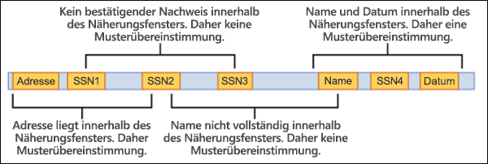

# <a name="learn-about-sensitive-information-types"></a><span data-ttu-id="db732-103">Weitere Informationen zu Typen vertraulicher Informationen</span><span class="sxs-lookup"><span data-stu-id="db732-103">Learn about sensitive information types</span></span>

<span data-ttu-id="db732-104">Das Identifizieren und Klassifizieren vertraulicher Elemente, die der Kontrolle Ihrer Organisation unterliegen, ist der erste Schritt in der [Informationsschutz-Abteilung.](./information-protection.md)</span><span class="sxs-lookup"><span data-stu-id="db732-104">Identifying and classifying sensitive items that are under your organizations control is the first step in the [Information Protection discipline](./information-protection.md).</span></span>  <span data-ttu-id="db732-105">Microsoft 365 bietet drei Möglichkeiten zum Identifizieren von Elementen, sodass sie klassifiziert werden können:</span><span class="sxs-lookup"><span data-stu-id="db732-105">Microsoft 365 provides three ways of identifying items so that they can be classified:</span></span>

- <span data-ttu-id="db732-106">manuell von Benutzern</span><span class="sxs-lookup"><span data-stu-id="db732-106">manually by users</span></span>
- <span data-ttu-id="db732-107">automatische Mustererkennung, z. B. Typen vertraulicher Informationen</span><span class="sxs-lookup"><span data-stu-id="db732-107">automated pattern recognition, like sensitive information types</span></span>
- [<span data-ttu-id="db732-108">Maschinelles Lernen</span><span class="sxs-lookup"><span data-stu-id="db732-108">machine learning</span></span>](classifier-learn-about.md)

<span data-ttu-id="db732-109">Typen vertraulicher Informationen sind musterbasierte Klassifizierer.</span><span class="sxs-lookup"><span data-stu-id="db732-109">Sensitive information types are pattern-based classifiers.</span></span> <span data-ttu-id="db732-110">Sie erkennen vertrauliche Informationen wie Sozialversicherungs-, Kreditkarten- oder Bankkontonummern, um vertrauliche Elemente zu identifizieren. Siehe [Entitätsdefinitionen für Typen vertraulicher Informationen.](sensitive-information-type-entity-definitions.md)</span><span class="sxs-lookup"><span data-stu-id="db732-110">They detect sensitive information like social security, credit card, or bank account numbers to identify sensitive items, see [Sensitive information types entity definitions](sensitive-information-type-entity-definitions.md)</span></span>

## <a name="sensitive-information-types-are-used-in"></a><span data-ttu-id="db732-111">Typen vertraulicher Informationen werden in</span><span class="sxs-lookup"><span data-stu-id="db732-111">Sensitive information types are used in</span></span>

- [<span data-ttu-id="db732-112">Richtlinien zur Verhinderung von Datenverlust</span><span class="sxs-lookup"><span data-stu-id="db732-112">Data loss prevention policies</span></span>](dlp-learn-about-dlp.md)
- [<span data-ttu-id="db732-113">Vertraulichkeitsbezeichnungen</span><span class="sxs-lookup"><span data-stu-id="db732-113">Sensitivity labels</span></span>](sensitivity-labels.md)
- [<span data-ttu-id="db732-114">Aufbewahrungsbezeichnungen</span><span class="sxs-lookup"><span data-stu-id="db732-114">Retention labels</span></span>](retention.md)
- [<span data-ttu-id="db732-115">Insider-Risikomanagement</span><span class="sxs-lookup"><span data-stu-id="db732-115">Insider risk management</span></span>](insider-risk-management.md)
- [<span data-ttu-id="db732-116">Kommunikationscompliance</span><span class="sxs-lookup"><span data-stu-id="db732-116">Communication compliance</span></span>](communication-compliance.md)
- [<span data-ttu-id="db732-117">Richtlinien für die automatische Kennzeichnung</span><span class="sxs-lookup"><span data-stu-id="db732-117">Auto-labelling policies</span></span>](apply-sensitivity-label-automatically.md#how-to-configure-auto-labeling-for-office-apps)
- [<span data-ttu-id="db732-118">Datenschutzverwaltung (Vorschau)</span><span class="sxs-lookup"><span data-stu-id="db732-118">Privacy management (preview)</span></span>](privacy-management.md)

## <a name="fundamental-parts-of-a-sensitive-information-type"></a><span data-ttu-id="db732-119">Grundlegende Teile eines vertraulichen Informationstyps</span><span class="sxs-lookup"><span data-stu-id="db732-119">Fundamental parts of a sensitive information type</span></span>

<span data-ttu-id="db732-120">Jede Entität des Vertraulichen Informationstyps wird durch die folgenden Felder definiert:</span><span class="sxs-lookup"><span data-stu-id="db732-120">Every sensitive information type entity is defined by these fields:</span></span>

- <span data-ttu-id="db732-121">Name: Wie auf den Vertraulichen Informationstyp verwiesen wird</span><span class="sxs-lookup"><span data-stu-id="db732-121">name: how the sensitive information type is referred to</span></span>
- <span data-ttu-id="db732-122">description: beschreibt, wonach der Typ vertraulicher Informationen sucht</span><span class="sxs-lookup"><span data-stu-id="db732-122">description: describes what the sensitive information type is looking for</span></span>
- <span data-ttu-id="db732-123">Muster: Ein Muster definiert, was ein vertraulicher Informationstyp erkennt.</span><span class="sxs-lookup"><span data-stu-id="db732-123">pattern: A pattern defines what a sensitive information type detects.</span></span> <span data-ttu-id="db732-124">Es besteht aus den folgenden Komponenten</span><span class="sxs-lookup"><span data-stu-id="db732-124">It consists of the following components</span></span>
    - <span data-ttu-id="db732-125">Primäres Element – das Hauptelement, nach dem der Typ vertraulicher Informationen sucht.</span><span class="sxs-lookup"><span data-stu-id="db732-125">Primary element – the main element that the sensitive information type is looking for.</span></span> <span data-ttu-id="db732-126">Es kann sich um einen **regulären Ausdruck** mit oder ohne Prüfsummenüberprüfung, eine **Schlüsselwortliste,** ein **Schlüsselwortwörterbuch** oder eine **Funktion sein.**</span><span class="sxs-lookup"><span data-stu-id="db732-126">It can be a **regular expression** with or without a checksum validation, a **keyword list**, a **keyword dictionary**, or a **function**.</span></span>
    - <span data-ttu-id="db732-127">Unterstützendes Element – Elemente, die als unterstützende Nachweise dienen und dazu beitragen, das Vertrauen der Übereinstimmung zu erhöhen.</span><span class="sxs-lookup"><span data-stu-id="db732-127">Supporting element – elements that act as supporting evidence that help in increasing the confidence of the match.</span></span> <span data-ttu-id="db732-128">Beispiel: Schlüsselwort "SSN" in der Nähe einer SSN-Nummer.</span><span class="sxs-lookup"><span data-stu-id="db732-128">For example, keyword “SSN” in proximity of an SSN number.</span></span> <span data-ttu-id="db732-129">Es kann sich um einen regulären Ausdruck mit oder ohne Prüfsummenüberprüfung, Schlüsselwortliste, Schlüsselwortwörterbuch oder Wörterbuch sein.</span><span class="sxs-lookup"><span data-stu-id="db732-129">It can be a regular expression with or without a checksum validation, keyword list, keyword dictionary.</span></span>
    - <span data-ttu-id="db732-130">Konfidenzniveau – Konfidenzniveau (hoch, mittel, niedrig) gibt an, wie viele unterstützende Nachweise zusammen mit dem primären Element gefunden wurden.</span><span class="sxs-lookup"><span data-stu-id="db732-130">Confidence Level - Confidence levels (high, medium, low) reflect how much supporting evidence was detected along with the primary element.</span></span> <span data-ttu-id="db732-131">Je mehr unterstützende Nachweise ein Element enthält, desto höher ist die Wahrscheinlichkeit, dass ein übereinstimmendes Element die vertraulichen Informationen enthält, nach denen Sie suchen.</span><span class="sxs-lookup"><span data-stu-id="db732-131">The more supporting evidence an item contains, the higher the confidence that a matched item contains the sensitive info you're looking for.</span></span>
    - <span data-ttu-id="db732-132">Näherung – Anzahl der Zeichen zwischen primärem und unterstützendem Element</span><span class="sxs-lookup"><span data-stu-id="db732-132">Proximity – Number of characters between primary and supporting element</span></span>



<span data-ttu-id="db732-134">Weitere Informationen zu Vertrauensstufen finden Sie in diesem Video.</span><span class="sxs-lookup"><span data-stu-id="db732-134">Learn more about confidence levels in this video</span></span>


 > [!VIDEO https://www.microsoft.com/videoplayer/embed/RE4Hx60]  

### <a name="example-sensitive-information-type"></a><span data-ttu-id="db732-135">Beispiel für vertraulichen Informationstyp</span><span class="sxs-lookup"><span data-stu-id="db732-135">Example sensitive information type</span></span>


## <a name="argentina-national-identity-dni-number"></a><span data-ttu-id="db732-136">Nationale Identität (DNI) für Argentinien</span><span class="sxs-lookup"><span data-stu-id="db732-136">Argentina national identity (DNI) number</span></span>

### <a name="format"></a><span data-ttu-id="db732-137">Format</span><span class="sxs-lookup"><span data-stu-id="db732-137">Format</span></span>

<span data-ttu-id="db732-138">Acht Ziffern, durch Punkte getrennt</span><span class="sxs-lookup"><span data-stu-id="db732-138">Eight digits separated by periods</span></span>

### <a name="pattern"></a><span data-ttu-id="db732-139">Muster</span><span class="sxs-lookup"><span data-stu-id="db732-139">Pattern</span></span>

<span data-ttu-id="db732-140">Acht Ziffern:</span><span class="sxs-lookup"><span data-stu-id="db732-140">Eight digits:</span></span>
- <span data-ttu-id="db732-141">Zwei Ziffern</span><span class="sxs-lookup"><span data-stu-id="db732-141">two digits</span></span>
- <span data-ttu-id="db732-142">ein Punkt</span><span class="sxs-lookup"><span data-stu-id="db732-142">a period</span></span>
- <span data-ttu-id="db732-143">drei Ziffern</span><span class="sxs-lookup"><span data-stu-id="db732-143">three digits</span></span>
- <span data-ttu-id="db732-144">ein Punkt</span><span class="sxs-lookup"><span data-stu-id="db732-144">a period</span></span>
- <span data-ttu-id="db732-145">drei Ziffern</span><span class="sxs-lookup"><span data-stu-id="db732-145">three digits</span></span>

### <a name="checksum"></a><span data-ttu-id="db732-146">Prüfsumme</span><span class="sxs-lookup"><span data-stu-id="db732-146">Checksum</span></span>

<span data-ttu-id="db732-147">Nein</span><span class="sxs-lookup"><span data-stu-id="db732-147">No</span></span>

### <a name="definition"></a><span data-ttu-id="db732-148">Definition</span><span class="sxs-lookup"><span data-stu-id="db732-148">Definition</span></span>

<span data-ttu-id="db732-149">Eine DLP-Richtlinie hat mittleres Vertrauen, dass diese Art vertraulicher Informationen erkannt wird, wenn innerhalb einer Näherung von 300 Zeichen:</span><span class="sxs-lookup"><span data-stu-id="db732-149">A DLP policy has medium confidence that it's detected this type of sensitive information if, within a proximity of 300 characters:</span></span>
- <span data-ttu-id="db732-150">Der reguläre Ausdruck Regex_argentina_national_id sucht Inhalte, die dem Muster entsprechen.</span><span class="sxs-lookup"><span data-stu-id="db732-150">The regular expression Regex_argentina_national_id finds content that matches the pattern.</span></span>
- <span data-ttu-id="db732-151">Es wird ein Schlüsselwort aus Keyword_argentina_national_id gefunden.</span><span class="sxs-lookup"><span data-stu-id="db732-151">A keyword from Keyword_argentina_national_id is found.</span></span>

```xml
<!-- Argentina National Identity (DNI) Number -->
<Entity id="eefbb00e-8282-433c-8620-8f1da3bffdb2" recommendedConfidence="75" patternsProximity="300">
   <Pattern confidenceLevel="75">
      <IdMatch idRef="Regex_argentina_national_id"/>
      <Match idRef="Keyword_argentina_national_id"/>
  </Pattern>
</Entity>
```

### <a name="keywords"></a><span data-ttu-id="db732-152">Schlüsselwörter</span><span class="sxs-lookup"><span data-stu-id="db732-152">Keywords</span></span>

#### <a name="keyword_argentina_national_id"></a><span data-ttu-id="db732-153">Keyword_argentina_national_id</span><span class="sxs-lookup"><span data-stu-id="db732-153">Keyword_argentina_national_id</span></span>

- <span data-ttu-id="db732-154">Argentina National Identity number</span><span class="sxs-lookup"><span data-stu-id="db732-154">Argentina National Identity number</span></span> 
- <span data-ttu-id="db732-155">Identität</span><span class="sxs-lookup"><span data-stu-id="db732-155">Identity</span></span> 
- <span data-ttu-id="db732-156">Nationale Identifikationskarte</span><span class="sxs-lookup"><span data-stu-id="db732-156">Identification National Identity Card</span></span> 
- <span data-ttu-id="db732-157">Dni</span><span class="sxs-lookup"><span data-stu-id="db732-157">DNI</span></span> 
- <span data-ttu-id="db732-158">Nationale NIC-Registrierung von Personen</span><span class="sxs-lookup"><span data-stu-id="db732-158">NIC National Registry of Persons</span></span> 
- <span data-ttu-id="db732-159">Documento Nacional de Identidad</span><span class="sxs-lookup"><span data-stu-id="db732-159">Documento Nacional de Identidad</span></span> 
- <span data-ttu-id="db732-160">Registro Nacional de las Personas</span><span class="sxs-lookup"><span data-stu-id="db732-160">Registro Nacional de las Personas</span></span> 
- <span data-ttu-id="db732-161">Identidad</span><span class="sxs-lookup"><span data-stu-id="db732-161">Identidad</span></span> 
- <span data-ttu-id="db732-162">Identificación</span><span class="sxs-lookup"><span data-stu-id="db732-162">Identificación</span></span> 

### <a name="more-on-confidence-levels"></a><span data-ttu-id="db732-163">Weitere Informationen zu Konfidenzniveaus</span><span class="sxs-lookup"><span data-stu-id="db732-163">More on confidence levels</span></span>

<span data-ttu-id="db732-164">In einer Entitätsdefinition des Vertraulichen Informationstyps gibt die **Konfidenzstufe** an, wie viel unterstützende Nachweise zusätzlich zum primären Element erkannt werden.</span><span class="sxs-lookup"><span data-stu-id="db732-164">In a sensitive information type entity definition, **confidence level** reflects how much supporting evidence is detected in addition to the primary element.</span></span> <span data-ttu-id="db732-165">Je mehr unterstützende Nachweise ein Element enthält, desto höher ist die Wahrscheinlichkeit, dass ein übereinstimmendes Element die vertraulichen Informationen enthält, nach denen Sie suchen.</span><span class="sxs-lookup"><span data-stu-id="db732-165">The more supporting evidence an item contains, the higher the confidence that a matched item contains the sensitive info you're looking for.</span></span> <span data-ttu-id="db732-166">Übereinstimmungen mit einem hohen Konfidenzniveau enthalten beispielsweise mehr unterstützende Nachweise in direkter Nähe des primären Elements, während Übereinstimmungen mit einem niedrigen Konfidenzniveau wenig bis gar keine unterstützenden Nachweise in der nähe enthalten würden.</span><span class="sxs-lookup"><span data-stu-id="db732-166">For example, matches with a high confidence level will contain more supporting evidence in close proximity of the primary element, whereas matches with a low confidence level would contain little to no supporting evidence in close proximity.</span></span> 

<span data-ttu-id="db732-167">Eine hohe Konfidenzstufe gibt die wenigsten falsch positiven Ergebnisse zurück, kann aber zu mehr falsch negativen Ergebnissen führen.</span><span class="sxs-lookup"><span data-stu-id="db732-167">A high confidence level returns the fewest false positives but might result in more false negatives.</span></span> <span data-ttu-id="db732-168">Niedrige oder mittlere Konfidenzniveaus geben mehr falsch positive Ergebnisse zurück, aber nur wenige bis null falsch negative Werte.</span><span class="sxs-lookup"><span data-stu-id="db732-168">Low or medium confidence levels returns more false positives but few to zero false negatives.</span></span>

- <span data-ttu-id="db732-169">**niedrige Konfidenz:** Der Wert von 65, übereinstimmende Elemente enthalten die wenigsten falsch negativen, aber die falsch positiven Ergebnisse.</span><span class="sxs-lookup"><span data-stu-id="db732-169">**low confidence**: Value of 65, matched items will contain the fewest false negatives but the most false positives.</span></span> <span data-ttu-id="db732-170">Niedrige Konfidenz gibt alle Übereinstimmungen mit niedriger, mittlerer und hoher Konfidenz zurück.</span><span class="sxs-lookup"><span data-stu-id="db732-170">Low confidence returns all low, medium, and high confidence matches.</span></span>
- <span data-ttu-id="db732-171">**Mittlere Konfidenz:** Der Wert von 75, übereinstimmende Elemente enthalten eine durchschnittliche Menge falsch positiver und falsch negativer Ergebnisse.</span><span class="sxs-lookup"><span data-stu-id="db732-171">**medium confidence**: Value of 75, matched items will contain an average amount of false positives and false negatives.</span></span> <span data-ttu-id="db732-172">Mittlere Konfidenz gibt alle mittleren und hohen Konfidenzüberstimmungen zurück.</span><span class="sxs-lookup"><span data-stu-id="db732-172">Medium confidence returns all medium, and high confidence matches.</span></span>  
- <span data-ttu-id="db732-173">**Hohe Konfidenz:** Der Wert von 85, übereinstimmende Elemente enthalten die wenigsten falsch positiven, aber die falsch negativen Werte.</span><span class="sxs-lookup"><span data-stu-id="db732-173">**high confidence**: Value of 85, matched items will contain the fewest false positives but the most false negatives.</span></span> <span data-ttu-id="db732-174">Hohe Konfidenz gibt nur Übereinstimmungen mit hoher Konfidenz zurück.</span><span class="sxs-lookup"><span data-stu-id="db732-174">High confidence only returns high confidence matches.</span></span>  

<span data-ttu-id="db732-175">Sie sollten Muster mit hoher Konfidenzstufe mit niedriger Anzahl verwenden, z. B. fünf bis zehn, und Muster mit niedriger Konfidenz mit höheren Zählungen, z. B. 20 oder mehr.</span><span class="sxs-lookup"><span data-stu-id="db732-175">You should use high confidence level patterns with low counts, say five to ten, and low confidence patterns with higher counts, say 20 or more.</span></span>

> [!NOTE]
> <span data-ttu-id="db732-176">Wenn Sie vorhandene Richtlinien oder benutzerdefinierte Typen vertraulicher Informationen (SITs) mithilfe von nummernbasierten Konfidenzniveaus definiert haben (auch als Genauigkeit bekannt), werden sie automatisch den drei diskreten Konfidenzniveaus zugeordnet. Geringes Vertrauen, mittleres Vertrauen und hohe Vertrauenswürdigkeit in der Benutzeroberfläche des Security @ Compliance Centers.</span><span class="sxs-lookup"><span data-stu-id="db732-176">If you have existing policies or custom sensitive information types (SITs) defined using number-based confidence levels (also know as accuracy), they will automatically be mapped to the three discrete confidence levels; low confidence, medium confidence, and high confidence, across the Security @ Compliance Center UI.</span></span>
> - <span data-ttu-id="db732-177">Alle Richtlinien mit minimaler Genauigkeit oder benutzerdefinierte SIT-Muster mit Konfidenzniveaus zwischen 76 und 100 werden einer hohen Zuverlässigkeit zugeordnet.</span><span class="sxs-lookup"><span data-stu-id="db732-177">All policies with minimum accuracy or custom SIT patterns with confidence levels of between 76 and 100 will be mapped to high confidence.</span></span> 
> - <span data-ttu-id="db732-178">Alle Richtlinien mit minimaler Genauigkeit oder benutzerdefinierte SIT-Muster mit Konfidenzniveaus zwischen 66 und 75 werden mittleren Konfidenzwerten zugeordnet.</span><span class="sxs-lookup"><span data-stu-id="db732-178">All policies with minimum accuracy or custom SIT patterns with confidence levels of between 66 and 75 will be mapped to medium confidence.</span></span>
> - <span data-ttu-id="db732-179">Alle Richtlinien mit minimaler Genauigkeit oder benutzerdefinierte SIT-Muster mit Konfidenzniveaus, die kleiner oder gleich 65 sind, werden einem niedrigen Konfidenzniveau zugeordnet.</span><span class="sxs-lookup"><span data-stu-id="db732-179">All policies with minimum accuracy or custom SIT patterns with confidence levels less than or equal to 65 will be mapped to low confidence.</span></span> 

## <a name="creating-custom-sensitive-information-types"></a><span data-ttu-id="db732-180">Benutzerdefinierte Typen vertraulicher Informationen erstellen</span><span class="sxs-lookup"><span data-stu-id="db732-180">Creating custom sensitive information types</span></span>

<span data-ttu-id="db732-181">Zum Erstellen von benutzerdefinierten Typen für vertrauliche Informationen im Security & Compliance Center stehen Ihnen mehrere Optionen zur Verfügung:</span><span class="sxs-lookup"><span data-stu-id="db732-181">To create custom sensitive information types in the Security & Compliance Center, you can choose from several options:</span></span>

- <span data-ttu-id="db732-182">**Verwenden der Benutzeroberfläche** Erstellen Sie benutzerdefinierte Typen vertraulicher Informationen mit der Benutzeroberfläche des Security & Compliance Centers.</span><span class="sxs-lookup"><span data-stu-id="db732-182">**Use the UI** You can set up a custom sensitive information type using the Security & Compliance Center UI.</span></span> <span data-ttu-id="db732-183">Mit dieser Methode können Sie reguläre Ausdrücke, Schlüsselwörter und Schlüsselwörterbücher verwenden.</span><span class="sxs-lookup"><span data-stu-id="db732-183">With this method, you can use regular expressions, keywords, and keyword dictionaries.</span></span> <span data-ttu-id="db732-184">Weitere Informationen finden Sie unter [Erstellen eines benutzerdefinierten Typs vertraulicher Informationen](create-a-custom-sensitive-information-type.md).</span><span class="sxs-lookup"><span data-stu-id="db732-184">To learn more, see [Create a custom sensitive information type](create-a-custom-sensitive-information-type.md).</span></span>

- <span data-ttu-id="db732-185">**EDM verwenden** Sie können benutzerdefinierte Typen vertraulicher Informationen mit Hilfe der Exact Data Match (EDM)-basierten Klassifizierung einrichten.</span><span class="sxs-lookup"><span data-stu-id="db732-185">**Use EDM** You can set up custom sensitive information types using Exact Data Match (EDM)-based classification.</span></span> <span data-ttu-id="db732-186">Mit dieser Methode können Sie anhand einer sicheren Datenbank, die sie regelmäßig aktualisieren können, einen dynamischen Typ vertraulicher Informationen erstellen.</span><span class="sxs-lookup"><span data-stu-id="db732-186">This method enables you to create a dynamic sensitive information type using a secure database that you can refresh periodically.</span></span> <span data-ttu-id="db732-187">Mehr Informationen unter[Erstellen eines benutzerdefinierten Typs vertraulicher Informationen mit genauer Datenübereinstimmungsklassifizierung](create-custom-sensitive-information-types-with-exact-data-match-based-classification.md).</span><span class="sxs-lookup"><span data-stu-id="db732-187">See [Create a custom sensitive information type with Exact Data Match based classification](create-custom-sensitive-information-types-with-exact-data-match-based-classification.md).</span></span>

- <span data-ttu-id="db732-188">**Verwenden von PowerShell** Erstellen Sie benutzerdefinierte Typen vertraulicher Informationen mit PowerShell.</span><span class="sxs-lookup"><span data-stu-id="db732-188">**Use PowerShell** You can set up custom sensitive information types using PowerShell.</span></span> <span data-ttu-id="db732-189">Diese Methode ist zwar komplexer als die Verwendung der Benutzeroberfläche, Sie haben aber mehr Konfigurationsoptionen.</span><span class="sxs-lookup"><span data-stu-id="db732-189">Although this method is more complex than using the UI, you have more configuration options.</span></span> <span data-ttu-id="db732-190">Mehr Informationen unter [Erstellen eines benutzerdefinierten Typs vertraulicher Informationen in Security & Compliance Center PowerShell](create-a-custom-sensitive-information-type-in-scc-powershell.md).</span><span class="sxs-lookup"><span data-stu-id="db732-190">See [Create a custom sensitive information type in Security & Compliance Center PowerShell](create-a-custom-sensitive-information-type-in-scc-powershell.md).</span></span>


> [!NOTE]
> <span data-ttu-id="db732-191">Verbesserte Konfidenzniveaus sind für die sofortige Verwendung innerhalb der Verhinderung von Datenverlust für Microsoft 365 Dienste, Microsoft Information Protection für Microsoft 365 Dienste, Kommunikationscompliance, Informationsgovernance und Datensatzverwaltung verfügbar.</span><span class="sxs-lookup"><span data-stu-id="db732-191">Improved confidence levels are available for immediate use within Data Loss Prevention for Microsoft 365 services, Microsoft Information Protection for Microsoft 365 services, Communication Compliance, Information Governance, and Records Management.</span></span>
> <span data-ttu-id="db732-192">Microsoft 365 Information Protection unterstützt jetzt Doppelbyte-Zeichensatzsprachen für:</span><span class="sxs-lookup"><span data-stu-id="db732-192">Microsoft 365 Information Protection now  supports double byte character set languages for:</span></span>
> - <span data-ttu-id="db732-193">Chinesisch (vereinfacht)</span><span class="sxs-lookup"><span data-stu-id="db732-193">Chinese (simplified)</span></span>
> - <span data-ttu-id="db732-194">Chinesisch (traditionell)</span><span class="sxs-lookup"><span data-stu-id="db732-194">Chinese (traditional)</span></span>
> - <span data-ttu-id="db732-195">Koreanisch</span><span class="sxs-lookup"><span data-stu-id="db732-195">Korean</span></span>
> - <span data-ttu-id="db732-196">Japanisch</span><span class="sxs-lookup"><span data-stu-id="db732-196">Japanese</span></span>
> 
> <span data-ttu-id="db732-197">Diese Unterstützung ist für vertrauliche Informationstypen verfügbar.</span><span class="sxs-lookup"><span data-stu-id="db732-197">This support is available for sensitive information types.</span></span> <span data-ttu-id="db732-198">Mehr dazu finden Sie in den [Versionshinweisen (Vorschau) zur Unterstützung des Informationsschutzes für Doppelbyte-Zeichensätze](mip-dbcs-relnotes.md).</span><span class="sxs-lookup"><span data-stu-id="db732-198">See, [Information protection support for double byte character sets release notes (preview)](mip-dbcs-relnotes.md) for more information.</span></span>

> [!TIP]
> <span data-ttu-id="db732-199">Um Muster zu erkennen, die chinesische/japanische Zeichen und einzelne Bytezeichen enthalten, oder um Muster zu erkennen, die Chinesisch/Japanisch und Englisch enthalten, definieren Sie zwei Varianten des Schlüsselworts oder regulären Ausdrucks.</span><span class="sxs-lookup"><span data-stu-id="db732-199">To detect patterns containing Chinese/Japanese characters and single byte characters or to detect patterns containing Chinese/Japanese and English, define two variants of the keyword or regex.</span></span>
> 
> <span data-ttu-id="db732-200">Verwenden Sie z. B. zwei Varianten des Schlüsselworts, um ein Schlüsselwort wie „机密的document“ zu erkennen; eine mit einem Leerzeichen zwischen dem japanischen und dem englischen Text und eine andere ohne Leerzeichen zwischen dem japanischen und dem englischen Text.</span><span class="sxs-lookup"><span data-stu-id="db732-200">For example, to detect a keyword like "机密的document", use two variants of the keyword; one with a space between the Japanese and English text and another without a space between the Japanese and English text.</span></span> <span data-ttu-id="db732-201">Daher sollten die Schlüsselwörter, die in SIT hinzugefügt werden sollen, „机密的 document“ und „机密的document“ lauten.</span><span class="sxs-lookup"><span data-stu-id="db732-201">So, the keywords to be added in the SIT should be "机密的 document" and "机密的document".</span></span> <span data-ttu-id="db732-202">Ebenso sollten zwei Varianten verwendet werden, um den Ausdruck „東京オリンピック2020“ zu erkennen; „東京オリンピック 2020“ und „東京オリンピック2020“.</span><span class="sxs-lookup"><span data-stu-id="db732-202">Similarly, to detect a phrase "東京オリンピック2020", two variants should be used; "東京オリンピック 2020" and "東京オリンピック2020".</span></span>
> 
> <span data-ttu-id="db732-p118">Achten Sie beim Erstellen eines regulären Ausdrucks mit einem Doppeltbyte-Bindestrich oder einem Doppeltbyte-Punkt darauf, beide Zeichen mit Escapezeichen zu versehen, so wie man einen Bindestrich oder einen Punkt in einem regulären Ausdruck mit Escapezeichen versehen würde. Hier ist ein Referenzbeispiel eines regulären Ausdrucks:</span><span class="sxs-lookup"><span data-stu-id="db732-p118">While creating a regex using a double byte hyphen or a double byte period, make sure to escape both the characters like one would escape a hyphen or period in a regex. Here is a sample regex for reference:</span></span>
>    - <span data-ttu-id="db732-205">(?<!\d)([４][０-９]{3}[\-?\－\t]\*[０-９]{4}</span><span class="sxs-lookup"><span data-stu-id="db732-205">(?<!\d)([４][０-９]{3}[\-?\－\t]\*[０-９]{4}</span></span>
>
> <span data-ttu-id="db732-206">Es wird empfohlen, die Zeichenfolgenüberstimmung anstelle der Wortüberstimmung in einer Schlüsselwortliste zu verwenden.</span><span class="sxs-lookup"><span data-stu-id="db732-206">We recommend using string match instead of word match in a keyword list.</span></span>

## <a name="for-further-information"></a><span data-ttu-id="db732-207">Weitere Informationen</span><span class="sxs-lookup"><span data-stu-id="db732-207">For further information</span></span>
- [<span data-ttu-id="db732-208">Entitätsdefinitionen für Typen vertraulicher Informationen</span><span class="sxs-lookup"><span data-stu-id="db732-208">Sensitive information type entity definitions</span></span>](sensitive-information-type-entity-definitions.md)
- [<span data-ttu-id="db732-209">Erstellen eines benutzerdefinierten vertraulichen Informationstyps</span><span class="sxs-lookup"><span data-stu-id="db732-209">Create a custom sensitive information type</span></span>](create-a-custom-sensitive-information-type.md)
- [<span data-ttu-id="db732-210">Erstellen eines benutzerdefinierten vertraulichen Informationstyps in PowerShell</span><span class="sxs-lookup"><span data-stu-id="db732-210">Create a custom sensitive information type in PowerShell</span></span>](create-a-custom-sensitive-information-type-in-scc-powershell.md)

<span data-ttu-id="db732-211">Informationen zur Verwendung vertraulicher Informationstypen zur Einhaltung von Datenschutzbestimmungen finden Sie unter [Bereitstellen des Informationsschutzes für Datenschutzbestimmungen mit Microsoft 365](../solutions/information-protection-deploy.md) (aka.ms/m365dataprivacy).</span><span class="sxs-lookup"><span data-stu-id="db732-211">To learn how to use sensitive information types to comply with data privacy regulations, see [Deploy information protection for data privacy regulations with Microsoft 365](../solutions/information-protection-deploy.md)  (aka.ms/m365dataprivacy).</span></span>

<!-- fwlink for this topic https://go.microsoft.com/fwlink/?linkid=2135644-->
