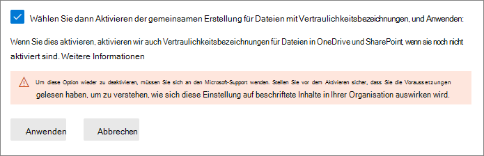
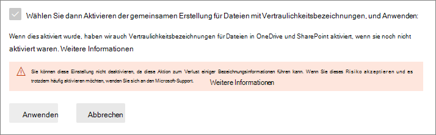

# <a name="enable-co-authoring-for-files-encrypted-with-sensitivity-labels"></a>Aktivieren Sie die gemeinsame Erstellung für Dateien, die mit Vertraulichkeitsbezeichnungen verschlüsselt sind

>*[Microsoft 365-Lizenzierungsleitfaden für Sicherheit und Compliance](https://aka.ms/ComplianceSD).*

> [!NOTE]
> Dieses Feature ist derzeit in der Vorschau und kann jederzeit geändert werden. 
>
> Aktivieren Sie dieses Feature in einem Testmandanten und nicht in einem Produktionsmandanten, aus folgendem Grund:
> - Dieses Feature nimmt Änderungen an den Bezeichnungen von Metadaten vor und nicht alle Apps auf allen Plattformen unterstützen diese Änderung derzeit
> - Sie können dieses Feature nicht selbst deaktivieren, nachdem es aktiviert wurde

Aktivieren Sie die Einstellung, um die [gemeinsame Erstellung](https://support.office.com/article/ee1509b4-1f6e-401e-b04a-782d26f564a4) für Office-Desktop-Apps zu unterstützen, sodass mehrere Benutzer diese Dokumente gleichzeitig bearbeiten können, wenn Dokumente mit [Vertraulichkeitsbeschriftungen](sensitivity-labels.md)gekennzeichnet und verschlüsselt werden.

Ohne diese Einstellung für Ihren Mandanten müssen Benutzer ein verschlüsseltes Dokument einsehen, das in SharePoint oder OneDrive gespeichert ist, wenn sie Office-Desktop-Apps verwenden. Infolgedessen können sie nicht in Echtzeit zusammenarbeiten. Oder sie müssen Office im Web verwenden, wenn [Vertraulichkeitsbezeichnungen für Office-Dateien in SharePoint und OneDrive aktiviert](sensitivity-labels-sharepoint-onedrive-files.md) sind.

Darüber hinaus führt die Aktivierung dieser Funktionalität dazu, dass [AutoSave](https://support.office.com/article/what-is-autosave-6d6bd723-ebfd-4e40-b5f6-ae6e8088f7a5) für diese bezeichneten und verschlüsselten Dateien unterstützt wird.

## <a name="metadata-changes-for-sensitivity-labels"></a>Metadatenänderungen für Vertraulichkeitsbezeichnungen

> [!IMPORTANT]
> Nachdem Sie die Einstellung für die gemeinsame Erstellung aktiviert haben, werden Bezeichnungsinformationen für unverschlüsselte Dateien nicht mehr unter benutzerdefinierten Eigenschaften gespeichert.
> 
> Aktivieren Sie diese Einstellung nicht, wenn Sie in Ihrer Organisation Apps, Dienste, Skripts oder Tools haben, die Bezeichnungsmetadaten lesen oder in den alten Speicherort schreiben.

Bevor Sie die Einstellung aktivieren, um die gemeinsame Erstellung für Office-Desktop-Apps zu unterstützen, müssen Sie wissen, dass diese Aktion Änderungen an den Bezeichnungsmetadaten vornimmt, die in Office-Dateien gespeichert und aus diesen gelesen werden.

Die Bezeichnungsmetadaten enthalten Informationen, die Ihren Mandanten und das angewendete Vertraulichkeitsbezeichnung identifizieren. Diese Einstellung ändert das Metadatenformat und den Speicherort für unverschlüsselte Dateien für Word, Excel und PowerPoint. Es gibt keine Änderungen an den Bezeichnungsmetadaten für verschlüsselte Dateien oder E-Mails.

Diese Änderung betrifft sowohl neu bezeichnete als auch bereits bezeichnete Dateien. Bei Verwendung von Apps und Diensten, welche die zusammenarbeitende Erstellung unterstützen:
- Bei neu beschrifteten Dateien werden nur das neue Format und der neue Speicherort für die Bezeichnungsmetadaten verwendet.
- Bei Dateien, die bereits bezeichnet sind, wird die Datei beim nächsten Öffnen und Speichern in das neue Format und den neuen Speicherort kopiert, wenn sie Metadaten im alten Format und Speicherort enthält.

Weitere Informationen zu dieser Metadatenänderung finden Sie in den folgenden Ressourcen:

- Blogbeitrag: [Bevorstehende Änderungen am Microsoft Information Protection-Metadatenspeicher](https://techcommunity.microsoft.com/t5/microsoft-security-and/upcoming-changes-to-microsoft-information-protection-metadata/ba-p/1904418)

- Öffnen von Spezifikationen: [2.6.3 Bezeichnungsinfos im Vergleich zu benutzerdefinierten Dokumenteigenschaften](https://docs.microsoft.com/openspecs/office_file_formats/ms-offcrypto/13939de6-c833-44ab-b213-e0088bf02341)

Aufgrund dieser Änderungen aktivieren Sie diese Einstellung nicht, wenn Sie in Ihrer Organisation über Apps, Dienste, Skripts oder Tools verfügen, die Bezeichnungsmetadaten lesen oder in den alten Speicherort schreiben. Sollten Sie es tun, sind dies einige Beispielfolgen:

- Ein bezeichnetes Dokument wird Benutzern als nicht bezeichnet angezeigt

- Ein Dokument zeigt Benutzern eine veraltete Bezeichnung an

- Gemeinsame Erstellung und AutoSave funktionieren für ein bezeichnetes und verschlüsseltes Dokument nicht, wenn ein anderer Benutzer es in einer Office-Desktop-App geöffnet hat, welche die neuen Bezeichnungsmetadaten nicht unterstützt

- Eine Exchange Online-Nachrichtenflussregel, die [Bezeichnungen als benutzerdefinierte Eigenschaften in Office-Anlagen identifiziert](https://docs.microsoft.com/azure/information-protection/configure-exo-rules#example-2-rule-that-applies-the-encrypt-only-option-to-emails-when-they-have-attachments-that-are-labeled-confidential--partners-and-these-emails-are-sent-outside-the-organization), verschlüsselt die E-Mail und den Anhang nicht oder verschlüsselt sie falsch

Im folgenden Abschnitt finden Sie eine Liste der Apps und Dienste, die diese Einstellung unterstützen, sowie die Änderungen an den Bezeichnungsmetadaten.

## <a name="prerequisites"></a>Voraussetzungen

Stellen Sie sicher, dass Sie die folgenden Voraussetzungen verstanden haben, bevor Sie dieses Feature aktivieren.

- Sie müssen für diese Vorschau einen Testmandanten verwenden.

- Sie müssen ein globaler Administrator sein, um dieses Feature aktivieren zu können.

- Vertraulichkeitsbezeichnungen müssen für [ Office-Dateien in SharePoint und OneDrive aktiviert](sensitivity-labels-sharepoint-onedrive-files.md) sein für den Mandanten. Wenn dieses Feature noch nicht aktiviert ist, wird es automatisch aktiviert, wenn Sie die Einstellung auswählen, mit der die gemeinsame Erstellung für Dateien mit Vertraulichkeitsbezeichnungen aktiviert werden soll.

- Alle Apps, Dienste und Betriebstools in Ihrem Mandanten müssen die neuen [Bezeichnungsmetadaten](#metadata-changes-for-sensitivity-labels) unterstützen:
    
    - **Microsoft 365 Apps for Enterprise:**
        - Windows: [Aktueller Kanal (Vorschau)](https://office.com/insider) mit minimalem Build 16.0.13801.20182 oder [Betakanal](https://office.com/insider) mit minimalem Build 16.0.13819.20006
        - macOS: [Betakanal](https://office.com/insider) mit minimalem Build 16.47.218.0
        - iOS: Wird noch nicht unterstützt
        - Android: Wird noch nicht unterstützt
    
    - **Unified Labeling-Client und -Scanner für Azure Information Protection:** 
        - Eine öffentliche Vorschau-Version (Mindestversion von 2.10.45.0), die Sie über das [Microsoft Download Center](https://aka.ms/aip-coauth-pp) und eine der im vorherigen Element aufgeführten Versionen von Microsoft 365 Apps for Enterprise für Windows installieren können.
    
    - **OneDrive-Synchronisation-App für Windows oder MacOS:**
        - Mindestversion von 19.002.0121.0008
    
    - **Verhinderung von Endpunktdatenverlust (Endpoint DLP):**
        - Windows 10 1809 mit KB 4601383
        - Windows 10 1903 und 1909 mit KB 4601380
        - Windows 10 2004 mit KB 4601382
    
    - **Apps und Dienste, die das Microsoft Information Protection SDK verwenden:** 
        - Mindestversion von 1.7 

Microsoft 365-Dienste unterstützen automatisch die neuen Bezeichnungsmetadaten, wenn Sie dieses Feature aktivieren. Beispiel:

- [Richtlinien für die automatische Bezeichnung](apply-sensitivity-label-automatically.md#how-to-configure-auto-labeling-policies-for-sharepoint-onedrive-and-exchange)
- [DLP-Richtlinien, die Vertraulichkeitsbezeichnungen als Bedingungen verwenden](dlp-sensitivity-label-as-condition.md)
- [Microsoft Cloud App Security ist so konfiguriert, dass Vertraulichkeitsbezeichnungen angewendet werden](https://docs.microsoft.com/cloud-app-security/best-practices#discover-classify-label-and-protect-regulated-and-sensitive-data-stored-in-the-cloud)

## <a name="limitations"></a>Einschränkungen

Stellen Sie sicher, dass Sie die folgenden Einschränkungen dieses Features verstanden haben, bevor Sie die Mandanteneinstellung für die gemeinsame Erstellung für Dateien aktivieren, die mit Vertraulichkeitsbezeichnungen verschlüsselt sind.

- Aufgrund der [Änderungen an den Bezeichnungsmetadaten](#metadata-changes-for-sensitivity-labels) müssen alle Apps, Dienste und Betriebstools in Ihrem Mandanten die neuen Bezeichnungsmetadaten unterstützen, um eine konsistente und zuverlässige Erfahrung mit Bezeichnungen zu erzielen.
    
    Spezifisch für Excel: Metadaten für eine Vertraulichkeitsbezeichnung, das keine Verschlüsselung anwendet, können aus einer Datei gelöscht werden, wenn jemand diese Datei mithilfe einer Excel-Version bearbeitet und speichert, welche die Metadatenänderungen für Vertraulichkeitsbezeichnungen nicht unterstützt.

- Die gemeinsame Erstellung und AutoSave werden nicht unterstützt und funktionieren nicht für bezeichnete und verschlüsselte Office-Dokumente, die eine der folgenden [Konfigurationen für die Verschlüsselung](encryption-sensitivity-labels.md#configure-encryption-settings) verwenden:
    - **Benutzer können Berechtigungen zuweisen, wenn sie die Bezeichnung anwenden** und das Kontrollkästchen **In Word, PowerPoint und Excel Benutzer auffordern, Berechtigungen anzugeben** ausgewählt ist. Diese Konfiguration wird manchmal als "benutzerdefinierte Berechtigungen" bezeichnet.
    - **Benutzerzugriff auf Inhalte läuft ab** ist auf einen anderen Wert als **Nie** eingestellt.
    - **Verschlüsselung mit Doppelschlüssel** ist ausgewählt.
    
    Bei Bezeichnungen mit einer dieser Verschlüsselungskonfigurationen werden die Bezeichnungen in Office-Apps angezeigt. Wenn Benutzer jedoch diese Bezeichnungen auswählen und niemand anderes das Dokument bearbeitet, werden sie gewarnt, dass das gemeinsame Erstellung und AutoSave nicht verfügbar sind. Wenn jemand anderes das Dokument bearbeitet, wird Benutzern eine Meldung angezeigt, dass die Bezeichnungen nicht angewendet werden können.

## <a name="known-issues-for-this-preview"></a>Bekannte Probleme für diese Vorschau

Diese Vorschau-Version des gemeinsamen Erstellens für Dateien, die mit Vertraulichkeitsbezeichnungen verschlüsselt sind, weist die folgenden bekannten Probleme auf:

- Benutzer können in Office für das Web keine Bezeichnungen für Word-, Excel- und PowerPoint-Dateien anwenden, die größer als 300 MB sind. Für diese Dateien können Sie die Office-Desktop-Apps verwenden, um eine Bezeichnung anzuwenden. Sie müssen jedoch die einzige Person sein, welche die Datei geöffnet hat.

- Wenn Sie [DLP-Richtlinien mit Vertraulichkeitsbezeichnungen als Bedingungen](dlp-sensitivity-label-as-condition.md) verwenden, werden unverschlüsselte Anhänge für E-Mails nicht unterstützt.

- Office-Apps für iOS und Android werden nicht unterstützt.

## <a name="how-to-enable-co-authoring-for-files-with-sensitivity-labels"></a>So aktivieren Sie die gemeinsame Erstellung für Dateien mit Vertraulichkeitsbezeichnungen

> [!CAUTION]
> Das Aktivieren dieser Einstellung ist eine unidirektionale Aktion. Während sich das Feature in der Vorschau befindet, testen Sie nur in einer Nicht-Produktionsumgebung, und erst, nachdem Sie die auf dieser Seite dokumentierten Metadatenänderungen, Voraussetzungen, Einschränkungen und bekannten Probleme gelesen und verstanden haben.

Während der Vorschau müssen Sie eine bestimmte URL verwenden, um auf diese Einstellung im Microsoft 365 Compliance Center zuzugreifen.

1. Melden Sie sich über den folgenden Link beim Microsoft 365 Compliance Center als globaler Administrator für Ihren Testmandanten an:
    
    ````
    https://compliance.microsoft.com/co-authoring_for_files_with_sensitivity_labels
    ````
    Über diesen Link gelangen Sie direkt zur Mandanteneinstellung, **Gemeinsame Erstellung für Dateien mit Vertraulichkeitsbezeichnungen**.

    > [!IMPORTANT]
    > Bevor Sie fortfahren, überprüfen Sie, ob Sie bei einem Testmandanten angemeldet sind, der Ihre Benutzer nicht beeinträchtigt: 
    >
    > Wählen Sie den Kreis mit Ihren Kontoinitialen oben rechts im Compliance Center aus und bestätigen Sie, dass der Name des Mandanten Ihren beabsichtigten Testmandanten anzeigt.
    
2. Lesen Sie die zusammenfassende Beschreibung, die Voraussetzungen, die zu erwartenden Ereignisse und die Warnung, dass Sie diese Einstellung nach dem Einschalten nicht deaktivieren können. Wählen Sie dann **Aktivieren der gemeinsamen Erstellung für Dateien mit Vertraulichkeitsbezeichnungen**, und **Anwenden**:
    
    

3. Warten Sie 24 Stunden, bis diese Einstellung in Ihrer Umgebung repliziert wurde, bevor Sie dieses neue Feature für die gemeinsame Erstellung testen.

## <a name="contact-support-if-you-need-to-disable-this-feature"></a>Wenden Sie sich an den Support, wenn Sie dieses Feature deaktivieren müssen

> [!IMPORTANT]
> Wenn Sie dieses Feature deaktivieren müssen, beachten Sie, dass Bezeichnungsinformationen verloren gehen können.

Nachdem Sie die gemeinsame Erstellung für Dateien mit Vertraulichkeitsbezeichnungen für Ihren Mandanten aktiviert haben, können Sie diese Einstellung nicht selbst deaktivieren. Aus diesem Grund ist es so wichtig, dass Sie die Voraussetzungen, Konsequenzen und Einschränkungen überprüfen und verstehen, bevor Sie diese Einstellung aktivieren. Aus diesem Grund empfehlen wir auch, dieses Feature nicht mit einem Produktionsmandanten, sondern mit einem Testmandanten zu testen.



Wie Sie auf dem Screenshot sehen, nachdem diese Einstellung aktiviert wurde, können Sie sich an den [Microsoft-Support](https://docs.microsoft.com/office365/admin/contact-support-for-business-products) wenden und das Deaktivieren dieser Einstellung anfordern. Diese Anfrage kann mehrere Tage dauern und Sie müssen nachweisen, dass Sie ein globaler Administrator für Ihren Mandanten sind. Gehen Sie davon aus, dass die üblichen Supportgebühren anfallen. 

Wenn ein Supporttechniker diese Einstellung für Ihren Mandanten deaktiviert:

- Apps und Dienste, welche die neuen Bezeichnungsmetadaten unterstützen, werden jetzt beim Lesen oder Speichern von Bezeichnungen auf das ursprüngliche Metadatenformat und den ursprünglichen Speicherort zurückgesetzt.

- Das neue Metadatenformat und der neue Speicherort für Office-Dokumente, die bei aktivierter Einstellung verwendet wurden, werden nicht in das ursprüngliche Format und den ursprünglichen Speicherort kopiert. Infolgedessen gehen diese Bezeichnungsinformationen für unverschlüsselte Word-, Excel- und PowerPoint-Dateien verloren.

- Die gemeinsame Erstellung und AutoSave funktionieren in Ihrem Mandanten nicht mehr.

- Vertraulichkeitsbezeichnungen bleiben für Office-Dateien in OneDrive und SharePoint aktiviert.
