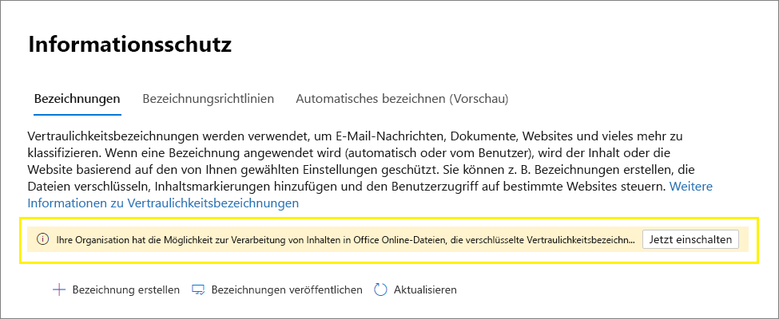

# <a name="enable-sensitivity-labels-for-office-files-in-sharepoint-and-onedrive"></a><span data-ttu-id="e2ddb-103">Aktivieren von Vertraulichkeitsbezeichnungen für Office-Dateien in SharePoint und OneDrive</span><span class="sxs-lookup"><span data-stu-id="e2ddb-103">Enable sensitivity labels for Office files in SharePoint and OneDrive</span></span>

><span data-ttu-id="e2ddb-104">*[Microsoft 365-Lizenzierungsleitfaden für Sicherheit und Compliance](https://aka.ms/ComplianceSD).*</span><span class="sxs-lookup"><span data-stu-id="e2ddb-104">*[Microsoft 365 licensing guidance for security & compliance](https://aka.ms/ComplianceSD).*</span></span>

<span data-ttu-id="e2ddb-105">Bevor Sie Vertraulichkeits Bezeichnungen für Office-Dateien in SharePoint und OneDrive aktivieren, können Sie Ihre [Vertraulichkeits Bezeichnungen](sensitivity-labels.md) nicht in Office im Internet anwenden.</span><span class="sxs-lookup"><span data-stu-id="e2ddb-105">Before you enable sensitivity labels for Office files in SharePoint and OneDrive, you can't apply your [sensitivity labels](sensitivity-labels.md) in Office on the web.</span></span> <span data-ttu-id="e2ddb-106">Die Schaltfläche " **Empfindlichkeit** " auf dem Menüband oder der zugewiesene Beschriftungsname auf der Statusleiste wird nicht angezeigt.</span><span class="sxs-lookup"><span data-stu-id="e2ddb-106">You don't see the **Sensitivity** button on the ribbon, or the applied label name on the status bar.</span></span> <span data-ttu-id="e2ddb-107">Wenn Sie außerdem Desktop-Apps zum Beschriften Ihrer Dateien verwenden und diese dann in SharePoint oder OneDrive speichern, kann der Dienst den Inhalt dieser Dateien nicht verarbeiten, wenn die Bezeichnung die Verschlüsselung angewendet hat.</span><span class="sxs-lookup"><span data-stu-id="e2ddb-107">In addition, if you use desktop apps to label your files and then save them on SharePoint or OneDrive, the service can't process the content of these files if the label applied encryption.</span></span> <span data-ttu-id="e2ddb-108">Die gemeinsame Dokumenterstellung, eDiscovery, Verhinderung von Datenverlust, die Suche und andere kollaborative Features funktionieren unter diesen Umständen nicht.</span><span class="sxs-lookup"><span data-stu-id="e2ddb-108">Coauthoring, eDiscovery, Data Loss Prevention, search, and other collaborative features won't work under these circumstances.</span></span>

<span data-ttu-id="e2ddb-109">Wenn Sie Sensitivitäts Bezeichnungen für Office-Dateien in SharePoint und OneDrive aktivieren, werden alle diese Funktionen aktiviert.</span><span class="sxs-lookup"><span data-stu-id="e2ddb-109">When you do enable sensitivity labels for Office files in SharePoint and OneDrive, all these capabilities are enabled.</span></span> <span data-ttu-id="e2ddb-110">Zusätzlich zur Anzeige von Sensitivitäts Bezeichnungen für Benutzer, für neue und geänderte Dateien, für die eine Vertraulichkeits Bezeichnung angewendet wurde, die die Verschlüsselung mit einem cloudbasierten Schlüssel enthält (und keine [Doppelschlüssel Verschlüsselung](double-key-encryption.md)verwendet):</span><span class="sxs-lookup"><span data-stu-id="e2ddb-110">In addition to displaying sensitivity labels to users, for new and changed files that have a sensitivity label applied that includes encryption with a cloud-based key  (and doesn't use [Double Key Encryption](double-key-encryption.md)):</span></span>

- <span data-ttu-id="e2ddb-111">Für Word-, Excel-und PowerPoint-Dateien erkennen SharePoint und OneDrive die Bezeichnung und können nun den Inhalt der verschlüsselten Datei verarbeiten.</span><span class="sxs-lookup"><span data-stu-id="e2ddb-111">For Word, Excel, and PowerPoint files, SharePoint and OneDrive recognize the label and can now process the contents of the encrypted file.</span></span>

- <span data-ttu-id="e2ddb-112">Wenn Sie diese Dateien aus SharePoint oder OneDrive herunterladen oder darauf zugreifen, werden die Vertraulichkeits Bezeichnung und alle Verschlüsselungseinstellungen von der Bezeichnung erzwungen und verbleiben bei der Datei, unabhängig davon, wo Sie gespeichert ist.</span><span class="sxs-lookup"><span data-stu-id="e2ddb-112">When you download or access these files from SharePoint or OneDrive, the sensitivity label and any encryption settings from the label are enforced and remain with the file, wherever it is stored.</span></span> <span data-ttu-id="e2ddb-113">Stellen Sie sicher, dass Sie Benutzeranleitungen zur Verwendung nur von Bezeichnungen zum Schutz von Dokumenten bereitstellen.</span><span class="sxs-lookup"><span data-stu-id="e2ddb-113">Ensure you provide user guidance to use only labels to protect documents.</span></span> <span data-ttu-id="e2ddb-114">Weitere Informationen finden Sie unter [Information Rights Management (IRM) Options and Sensitivity Labels](sensitivity-labels-office-apps.md#information-rights-management-irm-options-and-sensitivity-labels).</span><span class="sxs-lookup"><span data-stu-id="e2ddb-114">For more information, see [Information Rights Management (IRM) options and sensitivity labels](sensitivity-labels-office-apps.md#information-rights-management-irm-options-and-sensitivity-labels).</span></span>

- <span data-ttu-id="e2ddb-115">Wenn Benutzer beschriftete und verschlüsselte Dateien in SharePoint oder OneDrive hochladen, müssen Sie mindestens über die Berechtigung "anzeigen" für diese Dateien verfügen.</span><span class="sxs-lookup"><span data-stu-id="e2ddb-115">When users upload labeled and encrypted files to SharePoint or OneDrive, they must have at least view rights to those files.</span></span> <span data-ttu-id="e2ddb-116">Beispielsweise können Sie die Dateien außerhalb von SharePoint öffnen.</span><span class="sxs-lookup"><span data-stu-id="e2ddb-116">For example, they can open the files outside SharePoint.</span></span> <span data-ttu-id="e2ddb-117">Wenn Sie nicht über dieses mindestnutzungsrecht verfügen, ist der Upload erfolgreich, aber der Dienst erkennt die Bezeichnung nicht und kann den Dateiinhalt nicht verarbeiten.</span><span class="sxs-lookup"><span data-stu-id="e2ddb-117">If they don't have this minimum usage right, the upload is successful but the service doesn't recognize the label and can't process the file contents.</span></span>

- <span data-ttu-id="e2ddb-118">Verwenden Sie Office im Internet (Word, Excel, PowerPoint) zum Öffnen und Bearbeiten von Office-Dateien mit Vertraulichkeits Bezeichnungen, die Verschlüsselung anwenden.</span><span class="sxs-lookup"><span data-stu-id="e2ddb-118">Use Office on the web (Word, Excel, PowerPoint) to open and edit Office files that have sensitivity labels that apply encryption.</span></span> <span data-ttu-id="e2ddb-119">Die Berechtigungen, die der Verschlüsselung zugewiesen wurden, werden erzwungen.</span><span class="sxs-lookup"><span data-stu-id="e2ddb-119">The permissions that were assigned with the encryption are enforced.</span></span> <span data-ttu-id="e2ddb-120">Mit Word im Internet können Sie auch die automatische Kennzeichnung verwenden, wenn Sie diese Dokumente bearbeiten.</span><span class="sxs-lookup"><span data-stu-id="e2ddb-120">With Word on the web, you can also use auto-labeling when you edit these documents.</span></span>

- <span data-ttu-id="e2ddb-121">Externe Benutzer können mithilfe von Gastkonten auf Dokumente zugreifen, die mit Verschlüsselung versehen sind.</span><span class="sxs-lookup"><span data-stu-id="e2ddb-121">External users can access documents that are labeled with encryption by using guest accounts.</span></span> <span data-ttu-id="e2ddb-122">Weitere Informationen finden Sie unter [Support für externe Benutzer und beschriftete Inhalte](sensitivity-labels-office-apps.md#support-for-external-users-and-labeled-content).</span><span class="sxs-lookup"><span data-stu-id="e2ddb-122">For more information, see [Support for external users and labeled content](sensitivity-labels-office-apps.md#support-for-external-users-and-labeled-content).</span></span> 

- <span data-ttu-id="e2ddb-123">Office 365 eDiscovery unterstützt die Volltextsuche für diese Dateien und DLP-Richtlinien (Data Loss Prevention) unterstützen Inhalte in diesen Dateien.</span><span class="sxs-lookup"><span data-stu-id="e2ddb-123">Office 365 eDiscovery supports full-text search for these files and Data Loss Prevention (DLP) policies support content in these files.</span></span>

> [!NOTE]
> <span data-ttu-id="e2ddb-124">Wenn die Verschlüsselung mit einem lokalen Schlüssel (eine wichtige Verwaltungstopologie, die häufig als "eigenen Schlüssel halten" oder "Hyok" bezeichnet wird) oder mithilfe der [Doppelschlüssel Verschlüsselung](double-key-encryption.md)angewendet wurde, ändert sich das SharePoint-Verhalten bei der Verarbeitung des Dateiinhalts nicht.</span><span class="sxs-lookup"><span data-stu-id="e2ddb-124">If encryption has been applied with an on-premises key (a key management topology often referred to as "hold your own key" or HYOK), or by using [Double Key Encryption](double-key-encryption.md), the SharePoint behavior for processing the file contents doesn't change.</span></span>
>
> <span data-ttu-id="e2ddb-125">Das SharePoint-und OneDrive-Verhalten ändert sich auch bei vorhandenen Dateien an diesen Speicherorten, die mit einer Verschlüsselung mit einem einzelnen Azure-basierten Schlüssel versehen sind, nicht.</span><span class="sxs-lookup"><span data-stu-id="e2ddb-125">The SharePoint and OneDrive behavior also doesn't change for existing files in these locations that are labeled with encryption using a single Azure-based key.</span></span> <span data-ttu-id="e2ddb-126">Damit diese Dateien von den neuen Funktionen profitieren, nachdem Sie Vertraulichkeits Bezeichnungen für Office-Dateien in SharePoint und OneDrive aktiviert haben, müssen die Dateien entweder heruntergeladen und erneut hochgeladen oder bearbeitet werden.</span><span class="sxs-lookup"><span data-stu-id="e2ddb-126">For these files to benefit from the new capabilities after you enable sensitivity labels for Office files in SharePoint and OneDrive, the files must be either downloaded and uploaded again, or edited.</span></span> <span data-ttu-id="e2ddb-127">Sie werden dann beispielsweise in Such-und eDiscovery-Ergebnissen zurückgegeben.</span><span class="sxs-lookup"><span data-stu-id="e2ddb-127">For example, they will then be returned in search and eDiscovery results.</span></span>

<span data-ttu-id="e2ddb-128">Nachdem Sie Sensitivitäts Bezeichnungen für Office-Dateien in SharePoint und OneDrive aktiviert haben, stehen drei neue [Überwachungsereignisse](search-the-audit-log-in-security-and-compliance.md#sensitivity-label-activities) für die Überwachung von Sensitivitäts Bezeichnungen zur Verfügung, die auf Dokumente in SharePoint und OneDrive angewendet werden:</span><span class="sxs-lookup"><span data-stu-id="e2ddb-128">After you enable sensitivity labels for Office files in SharePoint and OneDrive, three new [audit events](search-the-audit-log-in-security-and-compliance.md#sensitivity-label-activities) are available for monitoring sensitivity labels that are applied to documents in SharePoint and OneDrive:</span></span>
- <span data-ttu-id="e2ddb-129">**Vertraulichkeitsbezeichnung wurde auf Datei angewendet**</span><span class="sxs-lookup"><span data-stu-id="e2ddb-129">**Applied sensitivity label to file**</span></span>
- <span data-ttu-id="e2ddb-130">**Auf Datei angewendete Vertraulichkeitsbezeichnung wurde geändert**</span><span class="sxs-lookup"><span data-stu-id="e2ddb-130">**Changed sensitivity label applied to file**</span></span>
- <span data-ttu-id="e2ddb-131">**Vertraulichkeitsbezeichnung wurde von Datei entfernt**</span><span class="sxs-lookup"><span data-stu-id="e2ddb-131">**Removed sensitivity label from file**</span></span>

<span data-ttu-id="e2ddb-132">Sehen Sie sich das folgende Video (kein Audio) an, um die neuen Funktionen in Aktion anzuzeigen:</span><span class="sxs-lookup"><span data-stu-id="e2ddb-132">Watch the following video (no audio) to see the new capabilities in action:</span></span>

> [!VIDEO https://www.microsoft.com/videoplayer/embed//RE4ornZ]

<span data-ttu-id="e2ddb-133">Sie haben immer die Wahl, um Vertraulichkeits Bezeichnungen für Office-Dateien in SharePoint und OneDrive ([Opt-out](#how-to-disable-sensitivity-labels-for-sharepoint-and-onedrive-opt-out)) zu jeder Zeit zu deaktivieren.</span><span class="sxs-lookup"><span data-stu-id="e2ddb-133">You always have the choice to disable sensitivity labels for Office files in SharePoint and OneDrive ([opt-out](#how-to-disable-sensitivity-labels-for-sharepoint-and-onedrive-opt-out)) at any time.</span></span>

<span data-ttu-id="e2ddb-134">Wenn Sie Dokumente in SharePoint derzeit mithilfe von SharePoint Information Rights Management (IRM) schützen, müssen Sie den Abschnitt [SharePoint Information Rights Management (IRM) and Sensitivity Labels](#sharepoint-information-rights-management-irm-and-sensitivity-labels) auf dieser Seite überprüfen.</span><span class="sxs-lookup"><span data-stu-id="e2ddb-134">If you are currently protecting documents in SharePoint by using SharePoint Information Rights Management (IRM), be sure to check the [SharePoint Information Rights Management (IRM) and sensitivity labels](#sharepoint-information-rights-management-irm-and-sensitivity-labels) section on this page.</span></span> 

## <a name="requirements"></a><span data-ttu-id="e2ddb-135">Anforderungen</span><span class="sxs-lookup"><span data-stu-id="e2ddb-135">Requirements</span></span>

<span data-ttu-id="e2ddb-136">Diese neuen Funktionen funktionieren nur mit [Vertraulichkeits Bezeichnungen](sensitivity-labels.md) .</span><span class="sxs-lookup"><span data-stu-id="e2ddb-136">These new capabilities work with [sensitivity labels](sensitivity-labels.md) only.</span></span> <span data-ttu-id="e2ddb-137">Wenn Sie derzeit über Azure Information Protection-Bezeichnungen verfügen, migrieren Sie Sie zunächst zu Sensitivitäts Bezeichnungen, sodass Sie diese Funktionen für neue Dateien, die Sie hochladen, aktivieren können.</span><span class="sxs-lookup"><span data-stu-id="e2ddb-137">If you currently have Azure Information Protection labels, first migrate them to sensitivity labels so that you can enable these features for new files that you upload.</span></span> <span data-ttu-id="e2ddb-138">Anweisungen finden Sie unter [How to migrate Azure Information Protection Labels to Unified Sensitivity Labels](https://docs.microsoft.com/azure/information-protection/configure-policy-migrate-labels).</span><span class="sxs-lookup"><span data-stu-id="e2ddb-138">For instructions, see [How to migrate Azure Information Protection labels to unified sensitivity labels](https://docs.microsoft.com/azure/information-protection/configure-policy-migrate-labels).</span></span>

<span data-ttu-id="e2ddb-139">Verwenden Sie die OneDrive-Synchronisierungs-App-Version 19.002.0121.0008 oder höher unter Windows und Version 19.002.0107.0008 oder höher unter Mac.</span><span class="sxs-lookup"><span data-stu-id="e2ddb-139">Use the OneDrive sync app version 19.002.0121.0008 or later on Windows, and version 19.002.0107.0008 or later on Mac.</span></span> <span data-ttu-id="e2ddb-140">Beide Versionen wurden am 28. Januar 2019 veröffentlicht und sind derzeit für alle Ringe freigegeben.</span><span class="sxs-lookup"><span data-stu-id="e2ddb-140">Both these versions were released January 28, 2019, and are currently released to all rings.</span></span> <span data-ttu-id="e2ddb-141">Weitere Informationen finden Sie in den [Anmerkungen zur OneDrive-Version](https://support.office.com/article/845dcf18-f921-435e-bf28-4e24b95e5fc0).</span><span class="sxs-lookup"><span data-stu-id="e2ddb-141">For more information, see the [OneDrive release notes](https://support.office.com/article/845dcf18-f921-435e-bf28-4e24b95e5fc0).</span></span> <span data-ttu-id="e2ddb-142">Nachdem Sie Sensitivitäts Bezeichnungen für Office-Dateien in SharePoint und OneDrive aktiviert haben, werden Benutzer, die eine ältere Version der Synchronisierungs-app ausführen, aufgefordert, Sie zu aktualisieren.</span><span class="sxs-lookup"><span data-stu-id="e2ddb-142">After you enable sensitivity labels for Office files in SharePoint and OneDrive, users who run an older version of the sync app are prompted to update it.</span></span>

## <a name="limitations"></a><span data-ttu-id="e2ddb-143">Einschränkungen</span><span class="sxs-lookup"><span data-stu-id="e2ddb-143">Limitations</span></span>

- <span data-ttu-id="e2ddb-144">SharePoint und OneDrive wenden keine Vertraulichkeits Bezeichnungen automatisch auf vorhandene Dateien an, die Sie bereits mithilfe von Azure Information Protection-Bezeichnungen verschlüsselt haben.</span><span class="sxs-lookup"><span data-stu-id="e2ddb-144">SharePoint and OneDrive don't automatically apply sensitivity labels to existing files that you've already encrypted using Azure Information Protection labels.</span></span> <span data-ttu-id="e2ddb-145">Führen Sie diese Aufgaben stattdessen aus, damit die Funktionen nach dem Aktivieren von Sensitivitäts Bezeichnungen für Office-Dateien in SharePoint und OneDrive funktionieren:</span><span class="sxs-lookup"><span data-stu-id="e2ddb-145">Instead, for the features to work after you enable sensitivity labels for Office files in SharePoint and OneDrive, complete these tasks:</span></span>
    
    1. <span data-ttu-id="e2ddb-146">Stellen Sie sicher, dass Sie [die Azure Information Protection-Bezeichnungen](https://docs.microsoft.com/azure/information-protection/configure-policy-migrate-labels) zu Sensitivitäts Bezeichnungen migriert und diese im Microsoft 365 Compliance Center oder in einer entsprechenden Bezeichnungs Verwaltungskonsole [veröffentlicht](create-sensitivity-labels.md#publish-sensitivity-labels-by-creating-a-label-policy) haben.</span><span class="sxs-lookup"><span data-stu-id="e2ddb-146">Make sure you have [migrated the Azure Information Protection labels](https://docs.microsoft.com/azure/information-protection/configure-policy-migrate-labels) to sensitivity labels and [published them](create-sensitivity-labels.md#publish-sensitivity-labels-by-creating-a-label-policy) from the Microsoft 365 compliance center, or equivalent labeling admin center.</span></span>
    
    2. <span data-ttu-id="e2ddb-147">Laden Sie die Dateien herunter, und laden Sie Sie dann in SharePoint hoch.</span><span class="sxs-lookup"><span data-stu-id="e2ddb-147">Download the files and then upload them to SharePoint.</span></span>

- <span data-ttu-id="e2ddb-148">SharePoint und OneDrive können keine verschlüsselten Dateien verarbeiten, wenn die Bezeichnung, die die Verschlüsselung angewendet hat, eine der folgenden [Konfigurationen für die Verschlüsselung](encryption-sensitivity-labels.md#configure-encryption-settings)aufweist:</span><span class="sxs-lookup"><span data-stu-id="e2ddb-148">SharePoint and OneDrive can't process encrypted files when the label that applied the encryption has any of the following [configurations for encryption](encryption-sensitivity-labels.md#configure-encryption-settings):</span></span>
    - <span data-ttu-id="e2ddb-149">**Zulassen, dass Benutzerberechtigungen zuweisen, wenn Sie die Bezeichnung anwenden** , und das Kontrollkästchen für **in Word, PowerPoint und Excel fordern Sie Benutzer zur Angabe von Berechtigungen aufgefordert** wird ausgewählt ist.</span><span class="sxs-lookup"><span data-stu-id="e2ddb-149">**Let users assign permissions when they apply the label** and the checkbox for **In Word, PowerPoint, and Excel, prompt users to specify permissions** is selected.</span></span> <span data-ttu-id="e2ddb-150">Diese Einstellung wird manchmal auch als "benutzerdefinierte Berechtigungen" bezeichnet.</span><span class="sxs-lookup"><span data-stu-id="e2ddb-150">This setting is sometimes referred to as "user-defined permissions".</span></span>
    - <span data-ttu-id="e2ddb-151">Der **Benutzer Zugriff auf Inhalts Ablauf** wird auf einen anderen Wert als **Never** festgelegt.</span><span class="sxs-lookup"><span data-stu-id="e2ddb-151">**User access to content expires** is set to a value other than **Never**.</span></span>
    - <span data-ttu-id="e2ddb-152">Die **Verschlüsselung mit doppeltem Schlüssel** wird ausgewählt.</span><span class="sxs-lookup"><span data-stu-id="e2ddb-152">**Double Key Encryption** is selected.</span></span>
    
    <span data-ttu-id="e2ddb-153">Bei Beschriftungen mit einer dieser Verschlüsselungs Konfigurationen werden die Bezeichnungen nicht für Benutzer in Office im Internet angezeigt.</span><span class="sxs-lookup"><span data-stu-id="e2ddb-153">For labels with any of these encryption configurations, the labels aren't displayed to users in Office on the web.</span></span> <span data-ttu-id="e2ddb-154">Darüber hinaus können die neuen Funktionen nicht mit beschrifteten Dokumenten verwendet werden, die bereits über diese Verschlüsselungseinstellungen verfügen.</span><span class="sxs-lookup"><span data-stu-id="e2ddb-154">Additionally, the new capabilities can't be used with labeled documents that already have these encryption settings.</span></span> <span data-ttu-id="e2ddb-155">Beispielsweise werden diese Dokumente nicht in den Suchergebnissen zurückgegeben, auch wenn Sie aktualisiert werden.</span><span class="sxs-lookup"><span data-stu-id="e2ddb-155">For example, these documents won't be returned in search results, even if they are updated.</span></span>

- <span data-ttu-id="e2ddb-156">Für ein verschlüsseltes Dokument, das Bearbeitungsberechtigungen für einen Benutzer gewährt, kann das Kopieren in den Webversionen der Office-Apps nicht blockiert werden.</span><span class="sxs-lookup"><span data-stu-id="e2ddb-156">For an encrypted document that grants edit permissions to a user, copying can't be blocked in the web versions of the Office apps.</span></span>

- <span data-ttu-id="e2ddb-157">Die Dokument Verfolgungs Website für Azure Information Protection wird nicht unterstützt.</span><span class="sxs-lookup"><span data-stu-id="e2ddb-157">The Azure Information Protection document tracking site is not supported.</span></span>

- <span data-ttu-id="e2ddb-158">Office-Desktop-Apps und-Mobile Apps unterstützen nicht die gemeinsame Dokumenterstellung für Dateien, die mit Verschlüsselung gekennzeichnet sind.</span><span class="sxs-lookup"><span data-stu-id="e2ddb-158">Office desktop apps and mobile apps don't support coauthoring for files that are labeled with encryption.</span></span> <span data-ttu-id="e2ddb-159">Diese apps öffnen weiterhin beschriftete und verschlüsselte Dateien im exklusiven Bearbeitungsmodus.</span><span class="sxs-lookup"><span data-stu-id="e2ddb-159">These apps continue to open labeled and encrypted files in exclusive editing mode.</span></span>

- <span data-ttu-id="e2ddb-160">Wenn ein Administratoreinstellungen für eine veröffentlichte Bezeichnung ändert, die bereits auf Dateien angewendet wurde, die auf den synchronisierungsclient der Benutzer heruntergeladen wurden, können Benutzer möglicherweise die an der Datei vorgenommenen Änderungen in Ihrem OneDrive-synchronisierungsordner nicht speichern.</span><span class="sxs-lookup"><span data-stu-id="e2ddb-160">If an admin changes settings for a published label that's already applied to files downloaded to users' sync client, users might be unable to save changes they make to the file in their OneDrive Sync folder.</span></span> <span data-ttu-id="e2ddb-161">Dieses Szenario bezieht sich auf Dateien, die mit Verschlüsselung versehen sind, und auch dann, wenn die Bezeichnungs Änderung von einer Bezeichnung stammt, die die Verschlüsselung nicht auf eine Bezeichnung angewendet hat, die die Verschlüsselung verwendet.</span><span class="sxs-lookup"><span data-stu-id="e2ddb-161">This scenario applies to files that are labeled with encryption, and also when the label change is from a label that didn't apply encryption to a label that does apply encryption.</span></span> <span data-ttu-id="e2ddb-162">Benutzer sehen einen [roten Kreis mit einem weißen Kreuz Symbol Fehler](https://support.office.com/article/what-do-the-onedrive-icons-mean-11143026-8000-44f8-aaa9-67c985aa49b3), und Sie werden aufgefordert, neue Änderungen als separate Kopie zu speichern.</span><span class="sxs-lookup"><span data-stu-id="e2ddb-162">Users see a [red circle with a white cross icon error](https://support.office.com/article/what-do-the-onedrive-icons-mean-11143026-8000-44f8-aaa9-67c985aa49b3), and they are asked to save new changes as a separate copy.</span></span> <span data-ttu-id="e2ddb-163">Stattdessen können Sie die Datei schließen und erneut öffnen oder Office im Internet verwenden.</span><span class="sxs-lookup"><span data-stu-id="e2ddb-163">Instead, they can close and reopen the file, or use Office on the web.</span></span>

- <span data-ttu-id="e2ddb-164">Wenn ein beschriftetes Dokument in SharePoint oder OneDrive und die Bezeichnung angewandte Verschlüsselung mithilfe eines Kontos aus einem Dienstprinzipalnamen hochgeladen wird, kann das Dokument nicht in Office im Internet geöffnet werden.</span><span class="sxs-lookup"><span data-stu-id="e2ddb-164">If a labeled document is uploaded to SharePoint or OneDrive and the label applied encryption by using an account from a service principal name, the document can't be opened in Office on the web.</span></span> <span data-ttu-id="e2ddb-165">Zu den Beispielszenarien zählen Microsoft Cloud-App-Sicherheit und eine Datei, die per e-Mail an Teams gesendet wird.</span><span class="sxs-lookup"><span data-stu-id="e2ddb-165">Example scenarios include Microsoft Cloud App Security and a file sent to Teams by email.</span></span>

- <span data-ttu-id="e2ddb-166">Benutzer können Speicherprobleme nach dem Wechseln in den Standbymodus oder in einen Ruhemodus haben, wenn anstelle von Office für das Internet der Desktop und der Mobile Apps für Word, Excel oder PowerPoint verwendet werden.</span><span class="sxs-lookup"><span data-stu-id="e2ddb-166">Users can experience save problems after going offline or into a sleep mode when instead of using Office for the web, they use the desktop and mobile apps for Word, Excel, or PowerPoint.</span></span> <span data-ttu-id="e2ddb-167">Wenn diese Benutzer Ihre Office-App-Sitzung fortsetzen und versuchen, Änderungen zu speichern, wird eine Fehlermeldung zum hochladen angezeigt, in der Sie eine Kopie speichern können, anstatt die Originaldatei zu speichern.</span><span class="sxs-lookup"><span data-stu-id="e2ddb-167">For these users, when they resume their Office app session and try to save changes, they see an upload failure message with an option to save a copy instead of saving the original file.</span></span> 

- <span data-ttu-id="e2ddb-168">Dokumente, die auf folgende Weise verschlüsselt wurden, können nicht in Office im Internet geöffnet werden:</span><span class="sxs-lookup"><span data-stu-id="e2ddb-168">Documents that have been encrypted in the following ways can't be opened in Office on the web:</span></span>
    - <span data-ttu-id="e2ddb-169">Verschlüsselung, die einen lokalen Schlüssel verwendet ("eigenen Schlüssel halten" oder Hyok)</span><span class="sxs-lookup"><span data-stu-id="e2ddb-169">Encryption that uses an on-premises key ("hold your own key" or HYOK)</span></span>
    - <span data-ttu-id="e2ddb-170">Verschlüsselung, die mithilfe der [Doppelschlüssel Verschlüsselung](double-key-encryption.md) angewendet wurde</span><span class="sxs-lookup"><span data-stu-id="e2ddb-170">Encryption that was applied by using [Double Key Encryption](double-key-encryption.md)</span></span>
    - <span data-ttu-id="e2ddb-171">Verschlüsselung, die unabhängig von einer Bezeichnung angewendet wurde, beispielsweisedurch direkte Anwendung einer Vorlage zum Schutz von Rechteverwaltung.</span><span class="sxs-lookup"><span data-stu-id="e2ddb-171">Encryption that was applied independently from a label, for example, by directly applying a Rights Management protection template.</span></span>

- <span data-ttu-id="e2ddb-172">Wenn Sie eine Bezeichnung löschen, die auf ein Dokument in SharePoint oder OneDrive angewendet wurde, anstatt die Beschriftung aus der entsprechenden Bezeichnungsrichtlinie zu entfernen, wird das Dokument beim Herunterladen nicht mit einer Bezeichnung oder einer Verschlüsselung versehen.</span><span class="sxs-lookup"><span data-stu-id="e2ddb-172">If you delete a label that's been applied to a document in SharePoint or OneDrive, rather than remove the label from the applicable label policy, the document when downloaded won't be labeled or encrypted.</span></span> <span data-ttu-id="e2ddb-173">Im Vergleich dazu bleibt das Dokument verschlüsselt, wenn das beschriftete Dokument außerhalb von SharePoint oder OneDrive gespeichert wird, wenn die Bezeichnung gelöscht wird.</span><span class="sxs-lookup"><span data-stu-id="e2ddb-173">In comparison, if the labeled document is stored outside SharePoint or OneDrive, the document remains encrypted if the label is deleted.</span></span> <span data-ttu-id="e2ddb-174">Beachten Sie, dass Sie zwar während einer Testphase Beschriftungen löschen können, es aber sehr selten ist, eine Bezeichnung in einer Produktionsumgebung zu löschen.</span><span class="sxs-lookup"><span data-stu-id="e2ddb-174">Note that although you might delete labels during a testing phase, it's very rare to delete a label in a production environment.</span></span>

## <a name="how-to-enable-sensitivity-labels-for-sharepoint-and-onedrive-opt-in"></a><span data-ttu-id="e2ddb-175">Aktivieren von Sensitivitäts Bezeichnungen für SharePoint und OneDrive (Opt-in)</span><span class="sxs-lookup"><span data-stu-id="e2ddb-175">How to enable sensitivity labels for SharePoint and OneDrive (opt-in)</span></span>

<span data-ttu-id="e2ddb-176">Sie können die neuen Funktionen mithilfe des Microsoft 365 Compliance Center oder mithilfe von PowerShell aktivieren.</span><span class="sxs-lookup"><span data-stu-id="e2ddb-176">You can enable the new capabilities by using the Microsoft 365 compliance center, or by using PowerShell.</span></span> <span data-ttu-id="e2ddb-177">Wie bei allen Konfigurationsänderungen auf Mandantenebene für SharePoint und OneDrive dauert es ungefähr 15 Minuten, bis die Änderung wirksam wird.</span><span class="sxs-lookup"><span data-stu-id="e2ddb-177">As with all tenant-level configuration changes for SharePoint and OneDrive, it takes about 15 minutes for the change to take effect.</span></span>

### <a name="use-the-compliance-center-to-enable-support-for-sensitivity-labels"></a><span data-ttu-id="e2ddb-178">Aktivieren der Unterstützung für Vertraulichkeits Bezeichnungen mithilfe des Compliance Centers</span><span class="sxs-lookup"><span data-stu-id="e2ddb-178">Use the compliance center to enable support for sensitivity labels</span></span>

<span data-ttu-id="e2ddb-179">Diese Option ist die einfachste Möglichkeit, um Vertraulichkeits Bezeichnungen für SharePoint und OneDrive zu aktivieren, Sie müssen sich jedoch als globaler Administrator für Ihren Mandanten anmelden.</span><span class="sxs-lookup"><span data-stu-id="e2ddb-179">This option is the easiest way to enable sensitivity labels for SharePoint and OneDrive, but you must sign in as a global administrator for your tenant.</span></span>

1. <span data-ttu-id="e2ddb-180">Melden Sie sich beim [Microsoft 365 Compliance Center](https://compliance.microsoft.com/) als globaler Administrator an, und navigieren Sie zu **Lösungs**  >  **Informationsschutz**</span><span class="sxs-lookup"><span data-stu-id="e2ddb-180">Sign in to the [Microsoft 365 compliance center](https://compliance.microsoft.com/) as a global administrator, and navigate to **Solutions** > **Information protection**</span></span>
    
    <span data-ttu-id="e2ddb-181">Wenn diese Option nicht sofort angezeigt wird, wählen Sie zunächst **Alle anzeigen** aus.</span><span class="sxs-lookup"><span data-stu-id="e2ddb-181">If you don't immediately see this option, first select **Show all**.</span></span> 

2. <span data-ttu-id="e2ddb-182">Wenn eine Meldung angezeigt wird, um die Möglichkeit zum Verarbeiten von Inhalt in Office Online-Dateien zu aktivieren, wählen Sie **jetzt aktivieren** aus:</span><span class="sxs-lookup"><span data-stu-id="e2ddb-182">If you see a message to turn on the ability to process content in Office online files, select **Turn on now**:</span></span>
    
    
    
    <span data-ttu-id="e2ddb-184">Der Befehl wird sofort ausgeführt, und wenn die Seite als nächstes aktualisiert wird, wird die Nachricht oder Schaltfläche nicht mehr angezeigt.</span><span class="sxs-lookup"><span data-stu-id="e2ddb-184">The command runs immediately and when the page is next refreshed, you no longer see the message or button.</span></span>

> [!NOTE]
> <span data-ttu-id="e2ddb-185">Wenn Sie über Microsoft 365 Multi-Geo verfügen, müssen Sie PowerShell verwenden, um diese Funktionen für alle geografischen Standorte zu aktivieren.</span><span class="sxs-lookup"><span data-stu-id="e2ddb-185">If you have Microsoft 365 Multi-Geo, you must use PowerShell to enable these capabilities for all your geo-locations.</span></span> <span data-ttu-id="e2ddb-186">Ausführliche Informationen finden Sie im nächsten Abschnitt.</span><span class="sxs-lookup"><span data-stu-id="e2ddb-186">See the next section for details.</span></span>

### <a name="use-powershell-to-enable-support-for-sensitivity-labels"></a><span data-ttu-id="e2ddb-187">Verwenden von PowerShell zum Aktivieren der Unterstützung für Vertraulichkeits Bezeichnungen</span><span class="sxs-lookup"><span data-stu-id="e2ddb-187">Use PowerShell to enable support for sensitivity labels</span></span>

<span data-ttu-id="e2ddb-188">Als Alternative zur Verwendung des Compliance Centers können Sie die Unterstützung für Sensitivitäts Bezeichnungen mithilfe des Cmdlets " [SPOTenant](https://docs.microsoft.com/powershell/module/sharepoint-online/set-spotenant) " aus SharePoint Online PowerShell aktivieren.</span><span class="sxs-lookup"><span data-stu-id="e2ddb-188">As an alternative to using the compliance center, you can enable support for sensitivity labels by using the [Set-SPOTenant](https://docs.microsoft.com/powershell/module/sharepoint-online/set-spotenant) cmdlet from SharePoint Online PowerShell.</span></span> 

<span data-ttu-id="e2ddb-189">Wenn Sie über Microsoft 365 Multi-Geo verfügen, müssen Sie PowerShell verwenden, um diese Unterstützung für alle geografischen Standorte zu aktivieren.</span><span class="sxs-lookup"><span data-stu-id="e2ddb-189">If you have Microsoft 365 Multi-Geo, you must use PowerShell to enable this support for all your geo-locations.</span></span>

#### <a name="prepare-the-sharepoint-online-management-shell"></a><span data-ttu-id="e2ddb-190">Vorbereiten der SharePoint Online Management-Shell</span><span class="sxs-lookup"><span data-stu-id="e2ddb-190">Prepare the SharePoint Online Management Shell</span></span>

<span data-ttu-id="e2ddb-191">Bevor Sie den PowerShell-Befehl ausführen, um Sensitivitäts Bezeichnungen für Office-Dateien in SharePoint und OneDrive zu aktivieren, stellen Sie sicher, dass Sie SharePoint Online Management Shell Version 16.0.19418.12000 oder höher ausführen.</span><span class="sxs-lookup"><span data-stu-id="e2ddb-191">Before you run the PowerShell command to enable sensitivity labels for Office files in SharePoint and OneDrive, ensure that you're running SharePoint Online Management Shell version 16.0.19418.12000 or later.</span></span> <span data-ttu-id="e2ddb-192">Wenn Sie bereits über die neueste Version verfügen, können Sie zum [nächsten Verfahren](#run-the-powershell-command-to-enable-support-for-sensitivity-labels) wechseln, um den PowerShell-Befehl auszuführen.</span><span class="sxs-lookup"><span data-stu-id="e2ddb-192">If you already have the latest version, you can skip to [next procedure](#run-the-powershell-command-to-enable-support-for-sensitivity-labels) to run the PowerShell command.</span></span>

1. <span data-ttu-id="e2ddb-193">Wenn Sie eine frühere Version der SharePoint-Online-Verwaltungsshell aus dem PowerShell-Katalog installiert haben, können Sie das Modul aktualisieren, indem Sie das folgende Cmdlet ausführen.</span><span class="sxs-lookup"><span data-stu-id="e2ddb-193">If you have installed a previous version of the SharePoint Online Management Shell from PowerShell gallery, you can update the module by running the following cmdlet.</span></span>

    ```PowerShell
    Update-Module -Name Microsoft.Online.SharePoint.PowerShell
    ```

2. <span data-ttu-id="e2ddb-194">Wenn Sie eine frühere Version der SharePoint Online Management Shell aus dem Microsoft Download Center installiert haben, können Sie auch zum **Hinzufügen oder Entfernen von Software** wechseln und die SharePoint Online Management Shell deinstallieren.</span><span class="sxs-lookup"><span data-stu-id="e2ddb-194">Alternatively, if you have installed a previous version of the SharePoint Online Management Shell from the Microsoft Download Center, you can also go to **Add or remove programs** and uninstall the SharePoint Online Management Shell.</span></span>

3. <span data-ttu-id="e2ddb-195">Wechseln Sie in einem Webbrowser zur Download Center-Seite, und [laden Sie die neueste SharePoint Online-Verwaltungsshell herunter](https://go.microsoft.com/fwlink/p/?LinkId=255251).</span><span class="sxs-lookup"><span data-stu-id="e2ddb-195">In a web browser, go to the Download Center page and [Download the latest SharePoint Online Management Shell](https://go.microsoft.com/fwlink/p/?LinkId=255251).</span></span>

4. <span data-ttu-id="e2ddb-196">Wählen Sie die gewünschte Sprache aus, und klicken Sie auf **Download**.</span><span class="sxs-lookup"><span data-stu-id="e2ddb-196">Select your language and then click **Download**.</span></span>

5. <span data-ttu-id="e2ddb-197">Wählen Sie zwischen der x64- und der x86-Version der MSI-Datei aus.</span><span class="sxs-lookup"><span data-stu-id="e2ddb-197">Choose between the x64 and x86 .msi file.</span></span> <span data-ttu-id="e2ddb-198">Laden Sie die x64-Datei herunter, wenn Sie die 64-Bit-Version von Windows oder die x86-Datei ausführen, wenn Sie die 32-Bit-Version ausführen.</span><span class="sxs-lookup"><span data-stu-id="e2ddb-198">Download the x64 file if you run the 64-bit version of Windows or the x86 file if you run the 32-bit version.</span></span> <span data-ttu-id="e2ddb-199">Wenn Sie nicht wissen, finden Sie unter [welche Version des Windows-Betriebssystems soll ich ausführen?](https://support.microsoft.com/help/13443/windows-which-operating-system)</span><span class="sxs-lookup"><span data-stu-id="e2ddb-199">If you don’t know, see [Which version of Windows operating system am I running?](https://support.microsoft.com/help/13443/windows-which-operating-system)</span></span>

6. <span data-ttu-id="e2ddb-200">Nachdem Sie die Datei heruntergeladen haben, führen Sie die Datei aus, und führen Sie die Schritte im Setup-Assistenten aus.</span><span class="sxs-lookup"><span data-stu-id="e2ddb-200">After you have downloaded the file, run the file and follow the steps in the Setup Wizard.</span></span>

#### <a name="run-the-powershell-command-to-enable-support-for-sensitivity-labels"></a><span data-ttu-id="e2ddb-201">Ausführen des PowerShell-Befehls zum Aktivieren der Unterstützung für Vertraulichkeits Bezeichnungen</span><span class="sxs-lookup"><span data-stu-id="e2ddb-201">Run the PowerShell command to enable support for sensitivity labels</span></span>

<span data-ttu-id="e2ddb-202">Verwenden Sie zum Aktivieren der neuen Funktionen das Cmdlet " [SPOTenant](https://docs.microsoft.com/powershell/module/sharepoint-online/set-spotenant) " mit dem Parameter " *EnableAIPIntegration* ":</span><span class="sxs-lookup"><span data-stu-id="e2ddb-202">To enable the new capabilities, use the [Set-SPOTenant](https://docs.microsoft.com/powershell/module/sharepoint-online/set-spotenant) cmdlet with the *EnableAIPIntegration* parameter:</span></span>

1. <span data-ttu-id="e2ddb-203">Stellen Sie eine Verbindung mit SharePoint her, indem Sie ein Arbeits-oder Schulkonto mit globalen Administrator-oder SharePoint-Administratorrechten in Microsoft 365 verwenden.</span><span class="sxs-lookup"><span data-stu-id="e2ddb-203">Using a work or school account that has global administrator or SharePoint admin privileges in Microsoft 365, connect to SharePoint.</span></span> <span data-ttu-id="e2ddb-204">Eine Anleitung dazu finden Sie unter [Erste Schritte mit der Microsoft Office SharePoint Online-Verwaltungsshell](https://docs.microsoft.com/powershell/sharepoint/sharepoint-online/connect-sharepoint-online).</span><span class="sxs-lookup"><span data-stu-id="e2ddb-204">To learn how, see [Getting started with SharePoint Online Management Shell](https://docs.microsoft.com/powershell/sharepoint/sharepoint-online/connect-sharepoint-online).</span></span>
    
    <span data-ttu-id="e2ddb-205">Hinweis: Wenn Sie über Microsoft 365 Multi-Geo verfügen, verwenden Sie den Parameter-URL mit [Connect-SPOService](https://docs.microsoft.com/powershell/module/sharepoint-online/connect-sposervice), und geben Sie die Website-URL SharePoint Online Administration Center für einen ihrer geografischen Standorte an.</span><span class="sxs-lookup"><span data-stu-id="e2ddb-205">Note: If you have Microsoft 365 Multi-Geo, use the -Url parameter with [Connect-SPOService](https://docs.microsoft.com/powershell/module/sharepoint-online/connect-sposervice), and specify the SharePoint Online Administration Center site URL for one of your geo-locations.</span></span>

2. <span data-ttu-id="e2ddb-206">Führen Sie den folgenden Befehl aus, und drücken Sie **Y** , um Folgendes zu bestätigen:</span><span class="sxs-lookup"><span data-stu-id="e2ddb-206">Run the following command and press **Y** to confirm:</span></span>

    ```PowerShell
    Set-SPOTenant -EnableAIPIntegration $true
    ```
3. <span data-ttu-id="e2ddb-207">Für Microsoft 365 Multi-Geo: Wiederholen Sie die Schritte 1 und 2 für jeden ihrer verbleibenden geografischen Standorte.</span><span class="sxs-lookup"><span data-stu-id="e2ddb-207">For Microsoft 365 Multi-Geo: Repeat steps 1 and 2 for each of your remaining geo-locations.</span></span>

## <a name="publishing-and-changing-sensitivity-labels"></a><span data-ttu-id="e2ddb-208">Veröffentlichen und Ändern von Vertraulichkeits Bezeichnungen</span><span class="sxs-lookup"><span data-stu-id="e2ddb-208">Publishing and changing sensitivity labels</span></span>

<span data-ttu-id="e2ddb-209">Beachten Sie beim Verwenden von Sensitivitäts Bezeichnungen mit SharePoint und OneDrive, dass Sie die Replikationszeit bei der Veröffentlichung neuer Sensitivitäts Bezeichnungen oder beim Aktualisieren vorhandener Sensitivitäts Bezeichnungen berücksichtigen müssen.</span><span class="sxs-lookup"><span data-stu-id="e2ddb-209">When you use sensitivity labels with SharePoint and OneDrive, keep in mind that you need to allow for replication time when you publish new sensitivity labels or update existing sensitivity labels.</span></span> <span data-ttu-id="e2ddb-210">Dies ist besonders wichtig für neue Bezeichnungen, die die Verschlüsselung anwenden.</span><span class="sxs-lookup"><span data-stu-id="e2ddb-210">This is especially important for new labels that apply encryption.</span></span>

<span data-ttu-id="e2ddb-211">Beispiel: Sie erstellen und veröffentlichen eine neue Sensitivitäts Bezeichnung, die die Verschlüsselung anwendet, und Sie wird sehr schnell in der Desktop-App eines Benutzers angezeigt.</span><span class="sxs-lookup"><span data-stu-id="e2ddb-211">For example: You create and publish a new sensitivity label that applies encryption and it very quickly appears in a user's desktop app.</span></span> <span data-ttu-id="e2ddb-212">Der Benutzer wendet diese Bezeichnung auf ein Dokument an und lädt diese dann in SharePoint oder OneDrive hoch.</span><span class="sxs-lookup"><span data-stu-id="e2ddb-212">The user applies this label to a document and then uploads it to SharePoint or OneDrive.</span></span> <span data-ttu-id="e2ddb-213">Wenn die Bezeichnungs Replikation für den Dienst nicht abgeschlossen wurde, werden die neuen Funktionen nicht auf das Dokument beim Hochladen angewendet.</span><span class="sxs-lookup"><span data-stu-id="e2ddb-213">If the label replication hasn't completed for the service, the new capabilities won't be applied to that document on upload.</span></span> <span data-ttu-id="e2ddb-214">Das Dokument wird daher nicht in der Suche oder für eDiscovery zurückgegeben, und das Dokument kann nicht in Office für das Internet geöffnet werden.</span><span class="sxs-lookup"><span data-stu-id="e2ddb-214">As a result, the document won't be returned in search or for eDiscovery and the document can't be opened in Office for the web.</span></span>  

<span data-ttu-id="e2ddb-215">Die folgenden Änderungen werden innerhalb einer Stunde repliziert: neue und gelöschte Vertraulichkeits Bezeichnungen und Richtlinieneinstellungen für Sensitivitäts Bezeichnungen, die angeben, welche Bezeichnungen in der Richtlinie enthalten sind.</span><span class="sxs-lookup"><span data-stu-id="e2ddb-215">The following changes replicate within one hour: New and deleted sensitivity labels, and sensitivity label policy settings that include which labels are in the policy.</span></span>

<span data-ttu-id="e2ddb-216">Die folgenden Änderungen werden innerhalb von 24 Stunden repliziert: Änderungen an Einstellungen für die Sensitivitäts Bezeichnung für vorhandene Bezeichnungen.</span><span class="sxs-lookup"><span data-stu-id="e2ddb-216">The following changes replicate within 24 hours: Changes to sensitivity label settings for existing labels.</span></span>

<span data-ttu-id="e2ddb-217">Da die Replikationsverzögerung nur eine Stunde für neue Sensitivitäts Bezeichnungen ist, wird das Szenario in dem Beispiel wahrscheinlich nicht ausgeführt.</span><span class="sxs-lookup"><span data-stu-id="e2ddb-217">Because the replication delay is only one hour for new sensitivity labels, you are unlikely to run into the scenario in the example.</span></span> <span data-ttu-id="e2ddb-218">Als Schutz wird jedoch empfohlen, neue Bezeichnungen zunächst nur für einige Testbenutzer zu veröffentlichen, eine Stunde zu warten und dann das Bezeichnungs Verhalten in SharePoint und OneDrive zu überprüfen.</span><span class="sxs-lookup"><span data-stu-id="e2ddb-218">But as a safeguard, we recommend publishing new labels to just a few test users first, wait for an hour, and then verify the label behavior on SharePoint and OneDrive.</span></span> <span data-ttu-id="e2ddb-219">Als letzten Schritt stellen Sie die Bezeichnung für mehr Benutzer zur Verfügung, indem Sie entweder der vorhandenen Bezeichnungsrichtlinie mehr Benutzer hinzufügen oder die Bezeichnung einer vorhandenen Bezeichnungsrichtlinie für Ihre Standardbenutzer hinzufügen.</span><span class="sxs-lookup"><span data-stu-id="e2ddb-219">As the final step, make the label available to more users by either adding more users to the existing label policy, or add the label to an existing label policy for your standard users.</span></span> <span data-ttu-id="e2ddb-220">Wenn die Standardbenutzer die Bezeichnung sehen, wurde Sie bereits mit SharePoint und OneDrive synchronisiert.</span><span class="sxs-lookup"><span data-stu-id="e2ddb-220">At the time your standard users see the label, it has already synchronized to SharePoint and OneDrive.</span></span>

## <a name="sharepoint-information-rights-management-irm-and-sensitivity-labels"></a><span data-ttu-id="e2ddb-221">SharePoint-Informationsrechteverwaltung (IRM) und Vertraulichkeits Bezeichnungen</span><span class="sxs-lookup"><span data-stu-id="e2ddb-221">SharePoint Information Rights Management (IRM) and sensitivity labels</span></span>

<span data-ttu-id="e2ddb-222">[SharePoint Information Rights Management (IRM)](set-up-irm-in-sp-admin-center.md) ist eine ältere Technologie zum Schutz von Dateien auf Listen-und Bibliotheksebene, indem beim Herunterladen von Dateien Verschlüsselung und Einschränkungen angewendet werden.</span><span class="sxs-lookup"><span data-stu-id="e2ddb-222">[SharePoint Information Rights Management (IRM)](set-up-irm-in-sp-admin-center.md) is an older technology to protect files at the list and library level by applying encryption and restrictions when files are downloaded.</span></span> <span data-ttu-id="e2ddb-223">Diese ältere Schutztechnologie wurde entwickelt, um zu verhindern, dass nicht autorisierte Benutzer die Datei öffnen, während Sie sich außerhalb von SharePoint befinden.</span><span class="sxs-lookup"><span data-stu-id="e2ddb-223">This older protection technology is designed to prevent unauthorized users from opening the file while it's outside SharePoint.</span></span>

<span data-ttu-id="e2ddb-224">Im Vergleich dazu bieten Sensitivitäts Beschriftungen zusätzlich zur Verschlüsselung die Schutzeinstellungen von visuellen Markierungen (Kopfzeilen, Fußzeilen, Wasserzeichen).</span><span class="sxs-lookup"><span data-stu-id="e2ddb-224">In comparison, sensitivity labels provide the protection settings of visual markings (headers, footers, watermarks) in addition to encryption.</span></span> <span data-ttu-id="e2ddb-225">Die Verschlüsselungseinstellungen unterstützen die gesamte Palette an [Nutzungsrechten](https://docs.microsoft.com/azure/information-protection/configure-usage-rights) , um zu beschränken, was Benutzer mit dem Inhalt tun können, und die gleichen Vertraulichkeits Bezeichnungen werden für [viele Szenarien](get-started-with-sensitivity-labels.md#common-scenarios-for-sensitivity-labels)unterstützt.</span><span class="sxs-lookup"><span data-stu-id="e2ddb-225">The encryption settings support the full range of [usage rights](https://docs.microsoft.com/azure/information-protection/configure-usage-rights) to restrict what users can do with the content, and the same sensitivity labels are supported for [many scenarios](get-started-with-sensitivity-labels.md#common-scenarios-for-sensitivity-labels).</span></span> <span data-ttu-id="e2ddb-226">Durch die Verwendung derselben Schutzmethode mit konsistenten Einstellungen für Arbeitslasten und apps ergibt sich eine konsistente Schutzstrategie.</span><span class="sxs-lookup"><span data-stu-id="e2ddb-226">Using the same protection method with consistent settings across workloads and apps results in a consistent protection strategy.</span></span>

<span data-ttu-id="e2ddb-227">Sie können jedoch beide Protection-Lösungen zusammen verwenden, und das Verhalten lautet wie folgt:</span><span class="sxs-lookup"><span data-stu-id="e2ddb-227">However, you can use both protection solutions together and the behavior is as follows:</span></span> 

- <span data-ttu-id="e2ddb-228">Wenn Sie eine Datei mit einer Vertraulichkeits Bezeichnung hochladen, die die Verschlüsselung anwendet, kann SharePoint den Inhalt dieser Dateien nicht verarbeiten, sodass die gemeinsame Erstellung, eDiscovery, DLP und die Suche für diese Dateien nicht unterstützt werden.</span><span class="sxs-lookup"><span data-stu-id="e2ddb-228">If you upload a file with a sensitivity label that applies encryption, SharePoint can't process the content of these files so coauthoring, eDiscovery, DLP, and search are not supported for these files.</span></span>

- <span data-ttu-id="e2ddb-229">Wenn Sie eine Datei mit Office im Internet bezeichnen, werden alle Verschlüsselungseinstellungen von der Bezeichnung erzwungen.</span><span class="sxs-lookup"><span data-stu-id="e2ddb-229">If you label a file using Office on the web, any encryption settings from the label are enforced.</span></span> <span data-ttu-id="e2ddb-230">Für diese Dateien werden die gemeinsame Dokumenterstellung, eDiscovery, DLP und die Suche unterstützt.</span><span class="sxs-lookup"><span data-stu-id="e2ddb-230">For these files, coauthoring, eDiscovery, DLP, and search are supported.</span></span>

- <span data-ttu-id="e2ddb-231">Wenn Sie eine Datei herunterladen, die mit Office im Internet gekennzeichnet ist, wird die Bezeichnung beibehalten, und alle Verschlüsselungseinstellungen von der Bezeichnung werden anstelle der IRM-Einschränkungseinstellungen erzwungen.</span><span class="sxs-lookup"><span data-stu-id="e2ddb-231">If you download a file that's labeled by using Office on the web, the label is retained and any encryption settings from the label are enforced rather than the IRM restriction settings.</span></span>

- <span data-ttu-id="e2ddb-232">Wenn Sie eine Office-oder PDF-Datei herunterladen, die nicht mit einer Vertraulichkeits Bezeichnung verschlüsselt wurde, werden IRM-Einstellungen angewendet.</span><span class="sxs-lookup"><span data-stu-id="e2ddb-232">If you download an Office or PDF file that isn't encrypted with a sensitivity label, IRM settings are applied.</span></span>

- <span data-ttu-id="e2ddb-233">Wenn Sie eine der zusätzlichen IRM-Bibliothekseinstellungen aktiviert haben, die verhindern, dass Benutzer Dokumente hochladen können, die IRM nicht unterstützen, werden diese Einstellungen erzwungen.</span><span class="sxs-lookup"><span data-stu-id="e2ddb-233">If you have enabled any of the additional IRM library settings, which includes preventing users from uploading documents that don't support IRM, these settings are enforced.</span></span>

<span data-ttu-id="e2ddb-234">Mit diesem Verhalten können Sie sicher sein, dass alle Office-und PDF-Dateien vor nicht autorisiertem Zugriff geschützt werden, wenn Sie heruntergeladen werden, auch wenn Sie nicht mit einer Bezeichnung versehen sind.</span><span class="sxs-lookup"><span data-stu-id="e2ddb-234">With this behavior, you can be assured that all Office and PDF files are protected from unauthorized access if they are downloaded, even if they aren't labeled.</span></span> <span data-ttu-id="e2ddb-235">Beschriftete Dateien, die hochgeladen werden, profitieren jedoch nicht von den neuen Funktionen.</span><span class="sxs-lookup"><span data-stu-id="e2ddb-235">However, labeled files that are uploaded won't benefit from the new capabilities.</span></span>


## <a name="search-for-documents-by-sensitivity-label"></a><span data-ttu-id="e2ddb-236">Suchen nach Dokumenten nach Sensitivitäts Bezeichnung</span><span class="sxs-lookup"><span data-stu-id="e2ddb-236">Search for documents by sensitivity label</span></span>    

<span data-ttu-id="e2ddb-237">Verwenden Sie die verwaltete Eigenschaft **InformationProtectionLabelId** , um nach allen Dokumenten in SharePoint oder OneDrive zu suchen, die eine bestimmte Vertraulichkeits Bezeichnung aufweisen.</span><span class="sxs-lookup"><span data-stu-id="e2ddb-237">Use the managed property **InformationProtectionLabelId** to find all documents in SharePoint or OneDrive that have a specific sensitivity label.</span></span> <span data-ttu-id="e2ddb-238">Verwenden Sie die folgende Syntax: `InformationProtectionLabelId:<GUID>`</span><span class="sxs-lookup"><span data-stu-id="e2ddb-238">Use the following syntax: `InformationProtectionLabelId:<GUID>`</span></span>

<span data-ttu-id="e2ddb-239">Um beispielsweise nach allen Dokumenten zu suchen, die als "vertraulich" bezeichnet wurden und diese Bezeichnung eine GUID von "8faca7b8-8d20-48a3-8ea2-0f96310a848e" aufweist, geben Sie Folgendes im Suchfeld ein:</span><span class="sxs-lookup"><span data-stu-id="e2ddb-239">For example, to search for all documents that have been labeled as "Confidential", and that label has a GUID of "8faca7b8-8d20-48a3-8ea2-0f96310a848e", in the search box, type:</span></span>

`InformationProtectionLabelId: 8faca7b8-8d20-48a3-8ea2-0f96310a848e`    

<span data-ttu-id="e2ddb-240">Verwenden Sie das [Get-Label-](https://docs.microsoft.com/powershell/module/exchange/get-label) Cmdlet, um die GUIDs für Ihre Vertraulichkeits Bezeichnungen abzurufen:</span><span class="sxs-lookup"><span data-stu-id="e2ddb-240">To get the GUIDs for your sensitivity labels, use the [Get-Label](https://docs.microsoft.com/powershell/module/exchange/get-label) cmdlet:</span></span>  

1. <span data-ttu-id="e2ddb-241">Stellen Sie [zunächst eine Verbindung mit Office 365 Security & Compliance Center PowerShell her](/powershell/exchange/office-365-scc/connect-to-scc-powershell/connect-to-scc-powershell).</span><span class="sxs-lookup"><span data-stu-id="e2ddb-241">First, [connect to Office 365 Security & Compliance Center PowerShell](/powershell/exchange/office-365-scc/connect-to-scc-powershell/connect-to-scc-powershell).</span></span> 
   
    <span data-ttu-id="e2ddb-242">Melden Sie sich beispielsweise in einer PowerShell-Sitzung, die Sie als Administrator ausführen, mit einem globalen Administratorkonto an.</span><span class="sxs-lookup"><span data-stu-id="e2ddb-242">For example, in a PowerShell session that you run as administrator, sign in with a global administrator account.</span></span>    

2. <span data-ttu-id="e2ddb-243">Führen Sie dann den folgenden Befehl aus:</span><span class="sxs-lookup"><span data-stu-id="e2ddb-243">Then run the following command:</span></span>  

    ```powershell   
    Get-Label |ft Name, Guid    
    ``` 

<span data-ttu-id="e2ddb-244">Weitere Informationen zur Verwendung von verwalteten Eigenschaften finden Sie unter [Verwalten des Suchschemas in SharePoint](https://docs.microsoft.com/sharepoint/manage-search-schema).</span><span class="sxs-lookup"><span data-stu-id="e2ddb-244">For more information about using managed properties, see [Manage the search schema in SharePoint](https://docs.microsoft.com/sharepoint/manage-search-schema).</span></span>

## <a name="how-to-disable-sensitivity-labels-for-sharepoint-and-onedrive-opt-out"></a><span data-ttu-id="e2ddb-245">Deaktivieren von Sensitivitäts Bezeichnungen für SharePoint und OneDrive (Opt-out)</span><span class="sxs-lookup"><span data-stu-id="e2ddb-245">How to disable sensitivity labels for SharePoint and OneDrive (opt-out)</span></span>

<span data-ttu-id="e2ddb-246">Wenn Sie diese neuen Funktionen deaktivieren, werden Dateien, die Sie nach dem Aktivieren von Sensitivitäts Bezeichnungen für SharePoint und OneDrive hochgeladen haben, weiterhin durch die Bezeichnung geschützt, da die Beschriftungseinstellungen weiterhin erzwungen werden.</span><span class="sxs-lookup"><span data-stu-id="e2ddb-246">If you disable these new capabilities, files that you uploaded after you enabled sensitivity labels for SharePoint and OneDrive continue to be protected by the label because the label settings continue to be enforced.</span></span> <span data-ttu-id="e2ddb-247">Wenn Sie Sensitivitäts Bezeichnungen auf neue Dateien anwenden, nachdem Sie diese neuen Funktionen deaktiviert haben, können die Volltextsuche, eDiscovery und die gemeinsame Dokumenterstellung nicht mehr verwendet werden.</span><span class="sxs-lookup"><span data-stu-id="e2ddb-247">When you apply sensitivity labels to new files after you disable these new capabilities, full-text search, eDiscovery, and coauthoring will no longer work.</span></span>

<span data-ttu-id="e2ddb-248">Um diese neuen Funktionen zu deaktivieren, müssen Sie PowerShell verwenden.</span><span class="sxs-lookup"><span data-stu-id="e2ddb-248">To disable these new capabilities, you must use PowerShell.</span></span> <span data-ttu-id="e2ddb-249">Verwenden Sie die SharePoint Online [-](https://docs.microsoft.com/powershell/module/sharepoint-online/set-spotenant) Verwaltungsshell und das Cmdlet "SPOTenant", und geben Sie den gleichen *EnableAIPIntegration* -Parameter wie im Abschnitt [Verwenden von PowerShell zum Aktivieren der Unterstützung für Sensitivitäts Bezeichnungen](#use-powershell-to-enable-support-for-sensitivity-labels) beschrieben an.</span><span class="sxs-lookup"><span data-stu-id="e2ddb-249">Using the SharePoint Online Management Shell and the [Set-SPOTenant](https://docs.microsoft.com/powershell/module/sharepoint-online/set-spotenant) cmdlet, specify the same *EnableAIPIntegration* parameter as described in the [Use PowerShell to enable support for sensitivity labels](#use-powershell-to-enable-support-for-sensitivity-labels) section.</span></span> <span data-ttu-id="e2ddb-250">Legen Sie dieses Mal den Parameterwert auf false fest, und drücken Sie **Y** , um Folgendes zu bestätigen:</span><span class="sxs-lookup"><span data-stu-id="e2ddb-250">But this time, set the parameter value to false and press **Y** to confirm:</span></span>

```PowerShell
Set-SPOTenant -EnableAIPIntegration $false
```

<span data-ttu-id="e2ddb-251">Wenn Sie über Microsoft 365 Multi-Geo verfügen, müssen Sie diesen Befehl für jeden ihrer geografischen Standorte ausführen.</span><span class="sxs-lookup"><span data-stu-id="e2ddb-251">If you have Microsoft 365 Multi-Geo, you must run this command for each of your geo-locations.</span></span>

## <a name="next-steps"></a><span data-ttu-id="e2ddb-252">Nächste Schritte</span><span class="sxs-lookup"><span data-stu-id="e2ddb-252">Next steps</span></span>

<span data-ttu-id="e2ddb-253">Nachdem Sie die Sensitivitäts Bezeichnungen für Office-Dateien in SharePoint und OneDrive aktiviert haben, sollten Sie diese Dateien automatisch mithilfe von Richtlinien mit automatischer Benennung bezeichnen.</span><span class="sxs-lookup"><span data-stu-id="e2ddb-253">After you've enabled sensitivity labels for Office files in SharePoint and OneDrive, consider automatically labeling these files by using auto-labeling policies.</span></span> <span data-ttu-id="e2ddb-254">Weitere Informationen finden Sie unter [Anwenden einer Vertraulichkeits Bezeichnung auf Inhalte automatisch](apply-sensitivity-label-automatically.md).</span><span class="sxs-lookup"><span data-stu-id="e2ddb-254">For more information, see [Apply a sensitivity label to content automatically](apply-sensitivity-label-automatically.md).</span></span>
