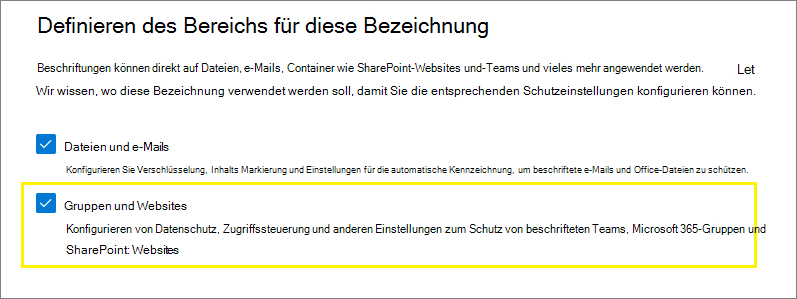

# <a name="use-sensitivity-labels-to-protect-content-in-microsoft-teams-microsoft-365-groups-and-sharepoint-sites"></a>Vertraulichkeitsbezeichnungen zum Schutz von Inhalten in Microsoft Teams, Microsoft 365-Gruppen und SharePoint-Websites verwenden

>*[Microsoft 365-Lizenzierungsleitfaden für Sicherheit und Compliance](/office365/servicedescriptions/microsoft-365-service-descriptions/microsoft-365-tenantlevel-services-licensing-guidance/microsoft-365-security-compliance-licensing-guidance).*

Zusätzlich zur Verwendung von [Vertraulichkeitsbezeichnungen](sensitivity-labels.md), um Dokumente und E-Mails zu klassifizieren und zu schützen, können Sie Vertraulichkeitsbezeichnungen auch verwenden, um Inhalte in den folgenden Containern zu schützen: Microsoft Teams-Websites, Microsoft 365-Gruppen ([vormals Office 365-Gruppen](https://techcommunity.microsoft.com/t5/microsoft-365-blog/office-365-groups-will-become-microsoft-365-groups/ba-p/1303601)) und SharePoint-Websites. Verwenden Sie für diese Klassifizierung und den Schutz auf Containerebene die folgenden Bezeichnungseinstellungen:

- Datenschutz (öffentlich oder privat) für Teamwebsites und Microsoft 365-Gruppen
- Zugriff externer Benutzer
- Externe Freigabe von SharePoint-Websites
- Zugriff von nicht verwalteten Geräten aus

> [!IMPORTANT]
> Die Einstellung **Zugriff von nicht verwalteten Geräten aus** funktioniert zusammen mit dem SharePoint-Feature [Zugriff von nicht verwalteten Geräten aus steuern](/sharepoint/control-access-from-unmanaged-devices). Sie müssen dieses abhängige SharePoint-Feature konfigurieren, um eine Vertraulichkeitsbezeichnung zu verwenden, in der diese Einstellung konfiguriert wurde. Weitere Informationen hierzu finden Sie in den nachfolgenden Anweisungen.

Wenn Sie diese Vertraulichkeitsbezeichnung auf einen unterstützten Container anwenden, wendet die Bezeichnung die Klassifizierung und die konfigurierten Schutzeinstellungen automatisch auf die Website oder Gruppe an.

Der Inhalt dieser Container erbt jedoch nicht die Beschriftungen für die Klassifizierung oder Einstellungen für Dateien und E-Mails, wie beispielsweise visuelle Markierungen oder Verschlüsselung. Aktivieren Sie[Vertraulichkeitsbezeichnungen für Office-Dateien in SharePoint und OneDrive](sensitivity-labels-sharepoint-onedrive-files.md), damit Benutzer Bezeichnungen auf ihre Dokumente in SharePoint- oder Teamwebsites anwenden können.

> [!NOTE]
> Vertraulichkeitsbezeichnungen für Container werden von Office 365-Content Delivery Networks (CDNs) nicht unterstützt.

## <a name="using-sensitivity-labels-for-microsoft-teams-microsoft-365-groups-and-sharepoint-sites"></a>Vertraulichkeitsbezeichnungen für Microsoft Teams, Microsoft 365-Gruppen und auf SharePoint-Websites verwenden

Bevor Sie Vertraulichkeitsbezeichnungen aktivieren und für die neuen Einstellungen konfigurieren, könnten Benutzer Vertraulichkeitsbezeichnungen in ihren Apps anzeigen und anwenden. Beispielsweise aus Word:


Nachdem Sie Vertraulichkeitsbezeichnungen für Container aktiviert und konfiguriert haben, können Benutzer Vertraulichkeitsbezeichnungen außerdem für Microsoft Team-Websites, Microsoft 365-Gruppen und SharePoint-Websites anzeigen und anwenden. Beispielsweise, wenn eine neue Teamwebsite in SharePoint erstellt wird:


## <a name="how-to-enable-sensitivity-labels-for-containers-and-synchronize-labels"></a>Aktivieren von Vertraulichkeitsbezeichnungen für Container und Synchronisieren von Bezeichnungen

1. Weil dieses Feature die Azure AD-Funktionen nutzt, führen Sie zum Aktivieren der Vertraulichkeitsbezeichnungen die Anleitungen in der Azure AD-Dokumentation aus: [Zuweisen von Vertraulichkeitsbezeichnungen zu Microsoft 365-Gruppen in Azure Active Directory (Vorschau)](/azure/active-directory/users-groups-roles/groups-assign-sensitivity-labels).

2. Sie müssen jetzt Ihre Vertraulichkeitsbezeichnungen mit Azure AD synchronisieren. Zuerst müssen Sie [eine Verbindung mit Security & Compliance Center PowerShell herstellen](/powershell/exchange/office-365-scc/connect-to-scc-powershell/connect-to-scc-powershell).

   Melden Sie sich beispielsweise in einer PowerShell-Sitzung, die Sie als Administrator ausführen, mit einem globalen Administratorkonto an.

3. Führen Sie dann den folgenden Befehl aus, damit Ihre Vertraulichkeitsbezeichnungen mit Microsoft 365-Gruppen verwendet werden können:

    ```powershell
    Execute-AzureAdLabelSync
    ```

## <a name="how-to-configure-groups-and-site-settings"></a>Konfigurieren von Gruppen und Websiteeinstellungen

Die Aktivierung von Vertraulichkeitsbezeichnungen für Container bedeutet, dass Sie nun Schutzeinstellungen für Gruppen und Websiten im Assistenten für Vertraulichkeitsbezeichnungen konfigurieren können. Wenn Sie diesen Support noch nicht aktiviert haben, sind die Einstellungen zwar im Assistenten sichtbar, können aber nicht konfiguriert werden.

1. Befolgen Sie die allgemeinen Anweisungen für die [Erstellung oder Bearbeitung einer Vertraulichkeitsbezeichnung](create-sensitivity-labels.md#create-and-configure-sensitivity-labels) und stellen Sie sicher, dass als Bereich für die Bezeichnung **Gruppen und Websiten** ausgewählt ist: 
    
    
    
    Wenn nur dieser Bereich für die Bezeichnung ausgewählt ist, wird die Bezeichnung nicht in Office-Apps angezeigt, sie Vetraulichkeitsbezeichnungen unterstützen, und kann nicht auf Dateien und E-Mails angewendet werden. Eine solche Trennung von Bezeichnungen kann zwar sowohl für Benutzer als auch Administratoren hilfreich sein, jedoch auch die Komplexität der Bereitstellung von Bezeichnungen erhöhen.
    
    Beispielsweise müssen Sie die [Reihenfolge Ihrer Bezeichnungen](sensitivity-labels.md#label-priority-order-matters) sorgfältig überprüfen, da SharePoint erkennt, wenn ein Dokument mit Vertraulichkeitsbezeichnung auf eine Seite mit Vertraulichkeitsbezeichnung hochgeladen wird. In diesem Szenario werden automatisch ein Überwachungsereignis und eine E-Mail generiert, wenn das Dokument eine Vertraulichkeitsbezeichnung mit höherer Priorität hat als die der Website. Weitere Informationen findem Sie im Abschnitt [Überwachung von Vertraulichkeitsbezeichnungsaktivitäten](#auditing-sensitivity-label-activities) auf dieser Seite. 

2. Wählen Sie dann auf der Seite **Definieren von Schutzeinstellungen für Gruppen und Websites** eine oder beide der verfügbaren Optionen aus:
    
    - **Einstellungen für den Datenschutz und Zugriff externer Benutzer**, um die Einstellungen für den **Datenschutz** und den **Zugriff externer Benutzer** zu konfigurieren.. 
    - **Einstellungen für den Gerätezugriff und die externe Freigabe**, um die Einstellungen **Externe Freigabe von bezeichneten SharePoint-Websites steuern** und **Zugriff von nicht verwalteten Geräten aus** zu konfigurieren..

3. Wenn Sie **Einstellungen für den Datenschutz und Zugriff externer Benutzer** ausgewählt haben, konfigurieren Sie nun die folgenden Einstellungen:
    
    - **Datenschutz**: Behalten Sie die Standardeinstellung **Öffentlich** bei, wenn Sie möchten, dass jeder in Ihrer Organisation auf die Teamwebsite oder Gruppe, für die diese Bezeichnung angewendet wird, zugreifen kann.
        
        Wählen Sie **Privat** aus, wenn Sie möchten, dass der Zugriff nur auf genehmigte Mitglieder in Ihrer Organisation beschränkt wird.
        
        Wählen Sie **Keine** aus, wenn Sie den Inhalt im Container mit Vertraulichkeitsbezeichnungen schützen möchten, die Benutzer aber trotzdem selbst Datenschutzeinstellungen konfigurieren können sollen.
        
        Die Einstellungen von **Öffentlich** oder **Privat** setzen und sperren die Datenschutzeinstellung, wenn Sie diese Bezeichnung auf den Container aufbringen. Die von Ihnen gewählte Einstellung ersetzt alle vorherigen Datenschutzeinstellungen, die für das Team oder die Gruppe konfiguriert wurden, und sperrt den Datenschutzwert, so dass er nur geändert werden kann, wenn zuvor die Vertraulichkeitsbezeichnung vom Container entfernt wird. Nachdem Sie die Vertraulichkeitsbezeichnung entfernt haben, bleibt die Datenschutzeinstellung der Bezeichnung erhalten, aber Benutzer können sie jetzt wieder ändern.
    
    - **Zugriff externer Benutzer**: Legen Sie fest, ob der Gruppenbesitzer [Gäste zur Gruppe hinzufügen](/office365/admin/create-groups/manage-guest-access-in-groups) kann.

4. Wenn Sie **Einstellungen für den Gerätezugriff und die externe Freigabe** ausgewählt haben, konfigurieren Sie nun die folgende Einstellungen:
    
    - **Externe Freigabe von bezeichneten SharePoint-Websites steuern**: Wählen Sie diese Option, um dann entweder die externe Freigabe für jede beliebige Person, neue und bestehende Gäste, bestehende Gäste oder nur Personen in Ihrer Organisation auszuwählen. Weitere Informationen zu diesen Konfigurationen und Einstellungen finden Sie in der SharePoint-Dokumentation [Externe Freigabe für eine Website aktivieren oder deaktivieren](/sharepoint/change-external-sharing-site).
    
    - **Zugriff von nicht verwalteten Geräten aus**: Diese Option verwendet das SharePoint-Feature, bei dem der bedingte Zugriff in Azure AD verwendet wird, um den Zugriff auf SharePoint- und OneDrive-Inhalte von nicht verwalteten Geräten aus zu sperren oder einzuschränken. Weitere Informationen finden Sie unter [Steuern des Zugriffs von nicht verwalteten Geräten aus](/sharepoint/control-access-from-unmanaged-devices) in der SharePoint-Dokumentation. Die Option, die Sie für diese Bezeichnungseinstellung festlegen, entspricht der Ausführung eines PowerShell-Befehls für eine Website, wie in den Schritten 3-5 im Abschnitt [Blockieren oder Einschränken des Zugriffs auf eine bestimmte SharePoint-Website oder OneDrive](/sharepoint/control-access-from-unmanaged-devices#block-or-limit-access-to-a-specific-sharepoint-site-or-onedrive) in der SharePoint-Anleitung beschrieben.
        
        Weitere Informationen finden Sie unter [Weitere Informationen zu den Abhängigkeiten für die Option „Nicht verwaltete Geräte“](#more-information-about-the-dependencies-for-the-unmanaged-devices-option) am Ende dieses Abschnitts.

> [!IMPORTANT]
> Wenn Sie eine Bezeichnung auf ein Team, eine Gruppe oder eine Website anwenden, werden nur diese Website- und Gruppeneinstellungen wirksam. Wenn der [Bereich der Bezeichnung](sensitivity-labels.md#label-scopes) Dateien und E-Mails umfasst, werden andere Bezeichnungseinstellungen wie Verschlüsselung und Inhaltskennzeichnung nicht auf die Inhalte innerhalb des Teams, der Gruppe oder der Website angewendet.

Wenn Ihre Vertraulichkeitskennzeichnung noch nicht veröffentlicht wurde, veröffentlichen Sie diese jetzt, indem Sie sie[einer Richtlinie für Vertraulichkeitskennzeichnungen hinzufügen](create-sensitivity-labels.md#publish-sensitivity-labels-by-creating-a-label-policy). Diejenigen Benutzer, denen eine Richtlinie zur Vertraulichkeitskennzeichnung zugeordnet ist, die diese Kennzeichnung beinhaltet, können diese für Websites und Gruppen auswählen.

##### <a name="more-information-about-the-dependencies-for-the-unmanaged-devices-option"></a>Weitere Informationen zu den Abhängigkeiten für die Option „Nicht verwaltete Geräte“

Wenn Sie die abhängige Richtlinie für den bedingten Zugriff für SharePoint nicht so konfigurieren, wie unter [App-erzwungene Einschränkungen](/sharepoint/app-enforced-restrictions) angeführt, ist die von Ihnen angegebene Option wirkungslos. Darüber hinaus hat sie keine Auswirkungen, wenn sie weniger stark einschränkt als eine konfigurierte Einstellung auf Mandanten-Ebene. Wenn Sie eine organisationsweite Einstellung für nicht verwaltete Geräte konfiguriert haben, wählen Sie eine identische oder restriktivere Bezeichnungseinstellung aus

Wenn Ihr Mandant beispielsweise für **Eingeschränkten, reinen Web-Zugriff zulassen** konfiguriert ist, hat die Bezeichnungseinstellung „Vollzugriff“ keine Auswirkungen, da sie weniger restriktiv ist. Wählen Sie für diese Mandantenebende die Bezeichnungseinstellung, die den Zugriff blockiert (stärker restriktiv) oder die Bezeichnungseinstellung für eingeschränkten Zugriff (diese entspricht der Mandanteneinstellung).

Da Sie die SharePoint-Einstellungen unabhängig von den Bezeichnungseinstellungen konfigurieren können, wird im Assistenten für die Vertraulichkeitsbezeichnung nicht überprüft, ob die Abhängigkeiten eingestellt sind. Diese Abhängigkeiten können konfiguriert werden, nachdem die Bezeichnung erstellt und veröffentlicht wurde, oder sogar, wenn die Bezeichnung bereits angewendet wurde. Wenn die Bezeichnung jedoch bereits angewendet wurde, wird die Bezeichnungseinstellung erst dann wirksam, wenn der Benutzer sich das nächste mal authentifiziert.

## <a name="sensitivity-label-management"></a>Verwaltung von Vertraulichkeitsbezeichnungen

Verwenden Sie die folgende Anleitung zum Erstellen, Ändern oder Löschen von Vertraulichkeitsbezeichnungen, die für Websites und Gruppen konfiguriert sind.

### <a name="creating-and-publishing-labels-that-are-configured-for-sites-and-groups"></a>Erstellen und Veröffentlichen von Bezeichnungen, die für Websites und Gruppen konfiguriert sind

Wenn eine neue Vertraulichkeitsbezeichnung erstellt und veröffentlicht wird, ist es innerhalb einer Stunde für Benutzer in Teams, Gruppen und Websites sichtbar. Wenn Sie jedoch eine vorhandene Bezeichnung ändern, kann es bis zu 24 Stunden dauern. Verwenden Sie die nachstehenden Anweisungen, um eine Bezeichnung für Ihre Benutzer zu veröffentlichen, wenn diese Bezeichnung für Website-und Gruppeneinstellungen konfiguriert ist:

1. Nachdem Sie die Vertraulichkeitsbezeichnung erstellt und konfiguriert haben, fügen Sie diese Bezeichnung zu einer Bezeichnungsrichtlinie hinzu, die nur für einige Testbenutzer gilt.

2. Warten Sie, bis die Änderung repliziert wurde:

   - Neue Bezeichnung: Warten Sie eine Stunde.
   - Vorhandene Bezeichnung: Warten Sie 24 Stunden.

3. Verwenden Sie nach Ablauf dieser Zeit ein Testbenutzerkonto, um ein Team, eine Microsoft 365-Gruppe oder eine SharePoint-Website mit der Bezeichnung zu erstellen, die Sie in Schritt 1 erstellt haben.

4. Wenn während des Erstellungsvorgangs keine Fehler auftreten, wissen Sie, dass Sie die Bezeichnung für alle Benutzer in Ihrem Mandanten veröffentlichen können.

### <a name="modifying-published-labels-that-are-configured-for-sites-and-groups"></a>Veröffentlichte Bezeichnungen ändern, die für Websites und Gruppen konfiguriert sind

Es wird empfohlen, die Website- und Gruppeneinstellungen für eine Vertraulichkeitsbezeichnung nicht zu ändern, nachdem sie auf Teams, Gruppen oder Websites angewendet wird. Denken Sie in diesem Fall daran, 24 Stunden zu warten, bis die Änderungen in alle Container mit der Bezeichnung übernommen wurden.

Wenn Ihre Änderungen die Einstellung **Zugriff für externe Benutzer** einschließen, gilt außerdem:

- Die neue Einstellung gilt für neue Benutzer, jedoch nicht für bestehende Benutzer. Wenn diese Einstellung beispielsweise zuvor ausgewählt war und Gastbenutzer auf die Website zugegriffen haben, können diese Gastbenutzer weiterhin auf die Website zugreifen, nachdem diese Einstellung in der Konfigurieren der Bezeichnungen deaktiviert wurde.

- Die Datenschutzeinstellungen für die Gruppeneigenschaften "hiddenMembership" und "roleEnabled" werden nicht aktualisiert.

### <a name="deleting-published-labels-that-are-configured-for-sites-and-groups"></a>Veröffentlichte Bezeichnungen löschen, die für Websites und Gruppen konfiguriert sind

Wenn Sie eine Vertraulichkeitsbezeichnung löschen, deren Website- und Gruppeneinstellungen aktiviert sind, und diese Bezeichnung in einer oder mehreren Bezeichnungsrichtlinien enthalten ist, kann dies zu Erstellungsfehlern für neue Teams, Gruppen und Websites führen. Folgen Sie dieser Anleitung, um dieses Problem zu vermeiden:

1. Entfernen Sie die Vertraulichkeitsbezeichnung aus allen Bezeichnungsrichtlinien, in denen die Bezeichnung enthalten ist.

2. Warten Sie eine Stunde.

3. Versuchen Sie nach dieser Wartezeit ein Team, eine Gruppe oder eine Website zu erstellen. Überprüfen Sie, dass die Bezeichnung nicht mehr angezeigt wird.

4. Wenn die Vertraulichkeitsbezeichnung nicht angezeigt wird, kann sie jetzt bedenkenlos geändert oder gelöscht werden.

## <a name="how-to-apply-sensitivity-labels-to-containers"></a>Anwenden von Vertraulichkeitsbezeichnungen auf Container

Jetzt können Sie die Vertraulichkeitsbezeichnung(en) auf folgende Container anwenden:

- [Microsoft 365-Gruppe in Azure AD](#apply-sensitivity-labels-to-microsoft-365-groups)
- [Microsoft-Teams-Teamwebsite](#apply-a-sensitivity-label-to-a-new-team)
- [Microsoft 365 Gruppe in Outlook im Web](#apply-a-sensitivity-label-to-a-new-group-in-outlook-on-the-web)
- [SharePoint-Website](#apply-a-sensitivity-label-to-a-new-site)

Sie können PowerShell verwenden, wenn Sie eine [Vertraulichkeitsbezeichnung auf mehrere Websites anwenden möchten](#use-powershell-to-apply-a-sensitivity-label-to-multiple-sites).

### <a name="apply-sensitivity-labels-to-microsoft-365-groups"></a>Anwenden von Vertraulichkeitsbezeichnungen auf Microsoft 365-Gruppen

Jetzt können Sie die Vertraulichkeitsbezeichnung(en) auf Microsoft 365-Gruppen anwenden. Kehren Sie für weitere Anweisungen zur Azure AD-Dokumentation zurück:

- [Zuweisen einer Bezeichnung zu einer neuen Gruppe im Azure-Portal](/azure/active-directory/users-groups-roles/groups-assign-sensitivity-labels#assign-a-label-to-a-new-group-in-azure-portal)

- [Zuweisen einer Bezeichnung zu einer vorhandenen Gruppe im Azure-Portal](/azure/active-directory/users-groups-roles/groups-assign-sensitivity-labels#assign-a-label-to-an-existing-group-in-azure-portal)

- [Entfernen einer Bezeichnung von einer vorhandenen Gruppe im Azure-Portal](/azure/active-directory/users-groups-roles/groups-assign-sensitivity-labels#remove-a-label-from-an-existing-group-in-azure-portal).

### <a name="apply-a-sensitivity-label-to-a-new-team"></a>Anwenden einer Vertraulichkeitsbezeichnung auf ein neues Team

Benutzer können Vertraulichkeitsbezeichnungen auswählen, wenn sie neue Teams in Microsoft Teams erstellen. Wenn sie die Bezeichnung aus der Dropdownliste **Vertraulichkeit** auswählen, kann sich die Datenschutzeinstellung entsprechend der Bezeichnungskonfiguration ändern. Abhängig von der für die Bezeichnung festgelegten Einstellung für den externen Benutzerzugriff können Benutzer Personen außerhalb der Organisation zum Team hinzufügen oder nicht.

[Weitere Informationen Vertraulichkeitsbezeichnungen für Teams](/microsoftteams/sensitivity-labels)


Nachdem Sie das Team erstellt haben, wird die Vertraulichkeitsbezeichnung in der oberen rechten Ecke aller Kanäle angezeigt.


Der Dienst wendet auf die Microsoft 365-Gruppe und die verbundene SharePoint-Teamwebsite automatisch dieselbe Vertraulichkeitsbezeichnung an.

### <a name="apply-a-sensitivity-label-to-a-new-group-in-outlook-on-the-web"></a>Anwenden einer Vertraulichkeitsbezeichnung auf eine neue Gruppe in Outlook im Web

Wenn Sie in Outlook im Web eine neue Gruppe erstellen, können Sie die Option **Vertraulichkeit** für veröffentlichte Bezeichnungen auswählen oder ändern:


### <a name="apply-a-sensitivity-label-to-a-new-site"></a>Anwenden einer Vertraulichkeitsbezeichnung auf eine neue Website

Administratoren und Endbenutzer können [beim Erstellen moderner Teamwebsites und Kommunikationswebsites](/sharepoint/create-site-collection) Vertraulichkeitsbezeichnungen auswählen, und **Erweiterte Einstellungen** erweitern:


In der Dropdownliste werden die Bezeichnungsnamen für die Auswahl angezeigt, und das Hilfesymbol zeigt alle Bezeichnungsnamen mit entsprechender QuickInfo an, was Benutzern dabei helfen kann, die richtige Bezeichnung auszuwählen.

Wenn die Bezeichnung angewendet wurde und Benutzer zur Website navigieren, werden der Name der Bezeichnung und die angewendeten Richtlinien angezeigt. So wurde dieser Website beispielsweise die Bezeichnung **Vertraulich** zugewiesen und die Datenschutzeinstellung auf **Privat** festgelegt:


### <a name="use-powershell-to-apply-a-sensitivity-label-to-multiple-sites"></a>Verwenden von PowerShell, um eine Vertraulichkeitsbezeichnung auf mehrere Websites anzuwenden

Sie können die Cmdlets [Set-SPOSite](/powershell/module/sharepoint-online/set-sposite) und [Set-SPOTenant](/powershell/module/sharepoint-online/set-spotenant) mit dem Parameter *SensitivityLabel* aus der aktuellen [SharePoint Online-Verwaltungsshell](/powershell/sharepoint/sharepoint-online/connect-sharepoint-online) verwenden, um eine Vertraulichkeitsbezeichnung auf mehrere Websites anzuwenden. Die Websites können eine beliebige SharePoint-Websitesammlung oder eine OneDrive-Website sein.

Stellen Sie sicher, dass Sie über die Version 16.0.19418.12000 oder höher der SharePoint Online-Verwaltungsshell verfügen.

1. Öffnen Sie eine PowerShell-Sitzung mit der Option **als Administrator ausführen**.

2. Wenn Sie die GUID ihrer Bezeichnung nicht kennen: [Stellen Sie eine Verbindung zur Security & Compliance Center-PowerShell her](/powershell/exchange/connect-to-scc-powershell), und rufen Sie die Liste der Vertraulichkeitsbezeichnungen und deren GUIDs ab.

   ```powershell
   Get-Label |ft Name, Guid
   ```

3. Stellen Sie anschließend [eine Verbindung mit SharePoint Online PowerShell her](/powershell/sharepoint/sharepoint-online/connect-sharepoint-online), und speichern Sie die GUID der Bezeichnung als Variable. Zum Beispiel:

   ```powershell
   $Id = [GUID]("e48058ea-98e8-4940-8db0-ba1310fd955e")
   ```

4. Erstellen Sie eine neue Variable, die mehrere Websites identifiziert, die eine bestimmte Zeichenfolge in ihrer URL gemeinsam haben. Zum Beispiel:

   ```powershell
   $sites = Get-SPOSite -IncludePersonalSite $true -Limit all -Filter "Url -like 'documents"
   ```

5. Führen Sie den folgenden Befehl aus, um die Bezeichnung auf diese Websites anzuwenden. Anhand unserer Beispiele:

   ```powershell
   $sites | ForEach-Object {Set-SPOTenant $_.url -SensitivityLabel $Id}
   ```

Mit dieser Reihe von Befehlen können Sie mehrere Websites in Ihrem Mandanten mit derselben Vertraulichkeitsbezeichnung beschriften. Daher verwenden Sie das Cmdlet „Set-SPOTenant“ anstelle des Cmdlets „Set-SPOSite“, das für die Konfiguration pro Website verwendet wird. Das Cmdlet „Set-SPOSite“ verwenden Sie hingegen, wenn Sie eine andere Bezeichnung auf bestimmte Websites anwenden müssen. Wiederholen Sie für jede dieser Websites den folgenden Befehl: `Set-SPOSite -Identity <URL> -SensitivityLabel "<labelguid>"`

## <a name="view-and-manage-sensitivity-labels-in-the-sharepoint-admin-center"></a>Vertraulichkeitsbezeichnungen im SharePoint Admin Center aufrufen und verwalten

Zum Anzeigen der angewendeten Vertraulichkeitsbezeichnungen verwenden Sie die Seite **Aktive Websites** im neuen SharePoint Admin Center. Möglicherweise müssen Sie zuerst die Spalte **Vertraulichkeit** hinzufügen:


Weitere Informationen zum Verwalten von Websites auf der Seite „Aktive Websites“ sowie zum Hinzufügen einer Spalte finden Sie unter [Verwalten von Websites im neuen SharePoint Admin Center](/sharepoint/manage-sites-in-new-admin-center).

Auf dieser Seite können Sie auch eine Bezeichnung ändern und anwenden:

1. Wählen Sie den Websitenamen aus, um den Detailbereich zu öffnen.

2. Wählen Sie die Registerkarte **Richtlinien** aus, und wählen Sie dann **Bearbeiten** für die Einstellung **Vertraulichkeit** aus.

3. Wählen Sie im Bereich **Vertraulichkeitseinstellung bearbeiten** die Vertraulichkeitsbezeichnung aus, die Sie auf die Website anwenden möchten, und wählen Sie dann **Speichern** aus.

## <a name="support-for-sensitivity-labels"></a>Support für Vertraulichkeitsbezeichnungen

Die folgenden Apps und Dienste unterstützen Vertraulichkeitsbezeichnungen, die für Websites und Gruppeneinstellungen konfiguriert sind:

- Admin Center:

  - SharePoint Admin Center
  - Azure Active Directory-Portal
  - Microsoft 365 Admin Center
  - Microsoft 365 Compliance Center, Microsoft 365 Security Center, Security & Compliance Center

- Benutzer-Apps und -Dienste:

  - SharePoint
  - Teams
  - Outlook im Web und für Windows, macOS, iOS und Android
  - Formulare
  - Stream
  - Planner 

Die folgenden Apps und Dienste unterstützen derzeit keine Vertraulichkeitsbezeichnungen, die für Websites und Gruppeneinstellungen konfiguriert sind:

- Admin Center:

  - Teams Admin Center
  - Exchange Admin-Center

- Benutzer-Apps und -Dienste:

  - Dynamics 365
  - Yammer
  - Project
  - Power BI

## <a name="classic-azure-ad-group-classification"></a>Klassische Azure AD-Gruppenklassifizierung

Microsoft 365 unterstützt die alten Klassifizierungen für neue Microsoft 365-Gruppen und SharePoint-Websites nicht mehr, wenn Sie Vertraulichkeitsbezeichnungen für Container aktivieren. Bestehende Gruppen und Websites, die Vertraulichkeitsbezeichnungen unterstützen, zeigen weiterhin die alten Klassifizierungswerte an, es sei denn, Sie konvertieren sie zur Verwendung von Vertraulichkeitsbezeichnungen.

Ein Beispiel dafür, wie Sie die alte Gruppenklassifizierung für Microsoft Office SharePoint Online verwendet haben könnten, finden Sie unter [Klassifizierung "moderner" Microsoft Office SharePoint Online-Websites](/sharepoint/dev/solution-guidance/modern-experience-site-classification).

Diese Klassifizierungen wurden konfiguriert, indem Azure AD PowerShell oder die PnP-Kernbibliothek verwendet und Werte für die Einstellung `ClassificationList` festgelegt wurden. Wenn in Ihrem Mandanten Klassifizierungswerte definiert sind, werden sie angezeigt, wenn Sie den folgenden Befehl aus dem [AzureADPreview PowerShell-Modul](https://www.powershellgallery.com/packages/AzureADPreview) ausführen:

```powershell
($setting["ClassificationList"])
```

Um Ihre alten Klassifizierungen in Vertraulichkeitsbezeichnungen umzuwandeln, führen Sie einen der folgenden Schritte aus:

- Verwenden vorhandener Bezeichnungen: Geben Sie die gewünschten Bezeichnungseinstellungen für Websites und Gruppen an, indem Sie bereits veröffentlichte Vertraulichkeitsbezeichnungen bearbeiten.

- Erstellen neuer Bezeichnungen: Geben Sie die gewünschten Bezeichnungseinstellungen für Websites und Gruppen an, indem Sie neue Vertraulichkeitsbezeichnungen mit den gleichen Namen wie Ihre bestehenden Klassifizierungen erstellen und veröffentlichen.

Gehen Sie dann wie folgt vor:

1. Verwenden Sie PowerShell, um die Vertraulichkeitsbezeichnungen mithilfe von Namenszuordnung auf vorhandene Microsoft 365-Gruppen und SharePoint-Websites anzuwenden. Entsprechende Anweisungen finden Sie im nächsten Abschnitt.

2. Entfernen Sie die alten Klassifizierungen der bestehenden Gruppen und Websites.

Sie können Benutzer zwar nicht daran hindern, neue Gruppen in Apps und Diensten, die noch keine Vertraulichkeitsbezeichnungen unterstützen, zu erstellen, aber Sie können wiederholt ein PowerShell-Skript ausführen, um nach neuen Gruppen zu suchen, die von Benutzern mit den alten Klassifizierungen erstellt wurden, und diese in Vertraulichkeitsbezeichnungen zu konvertieren.

Informationen zum Verwalten der Koexistenz von Vertraulichkeitsbezeichnungen und Azure AD-Klassifizierungen für Websites und Gruppen finden Sie unter [Azure Active Directory Klassifizierung und Vertraulichkeitsbezeichnungen für Microsoft 365-Gruppen](migrate-aad-classification-sensitivity-labels.md).

### <a name="use-powershell-to-convert-classifications-for-microsoft-365-groups-to-sensitivity-labels"></a>Verwenden von PowerShell, um Klassifizierungen für Microsoft 365-Gruppen in Vertraulichkeitsbezeichnungen zu konvertieren

1. Zuerst müssen Sie [eine Verbindung mit Security & Compliance Center PowerShell herstellen](/powershell/exchange/office-365-scc/connect-to-scc-powershell/connect-to-scc-powershell).

   Melden Sie sich beispielsweise bei einer PowerShell-Sitzung, die Sie als Administrator ausführen, mit einem globalen Administratorkonto an:

2. Führen Sie das Cmdlet [Get-Label](/powershell/module/exchange/get-label) aus, um die Liste der Vertraulichkeitsbezeichnungen und deren GUIDs abzurufen:

   ```powershell
   Get-Label |ft Name, Guid
   ```

3. Notieren Sie sich die GUIDs für die Vertraulichkeitsbezeichnungen, die Sie auf Ihre Microsoft 365-Gruppen anwenden möchten.

4. Anschließend müssen Sie in einem separaten Windows PowerShell-Fenster[ eine Verbindung mit Exchange Online PowerShell herstellen](/powershell/exchange/connect-to-exchange-online-powershell).

5. Verwenden Sie den folgenden Befehl als Beispiel, um die Liste der Gruppen abzurufen, die derzeit die Klassifizierung "Allgemein" aufweisen:

   ```PowerShell
   $Groups= Get-UnifiedGroup | Where {$_.classification -eq "General"}
   ```

6. Fügen Sie für jede Gruppe die neue Vertraulichkeitsbezeichnungs-GUID hinzu. Zum Beispiel:

    ```PowerShell
    foreach ($g in $groups)
    {Set-UnifiedGroup -Identity $g.Identity -SensitivityLabelId "457fa763-7c59-461c-b402-ad1ac6b703cc"}
    ```

7. Wiederholen Sie die Schritte 5 und 6 für die restlichen Gruppenklassifizierungen.

## <a name="auditing-sensitivity-label-activities"></a>Überwachen von Vertraulichkeitsbezeichnungsaktivitäten

> [!IMPORTANT]
> Wenn Sie Bezeichnungen trennen, indem Sie nur den Bereich **Gruppen und Websites** für Bezeichnungen auswählen, die Container schützen: Erwägen Sie aufgrund des Überwachungsereignisses **Vertraulichkeitskonflikt bei Dokument erkannt** und der E-Mail, die in diesem Abschnitt beschrieben wurden, [diese Bezeichnungen vor Bezeichnungen zu stellen](sensitivity-labels.md#label-priority-order-matters), für die der Bereich **Dateien und E-Mails** ausgewählt wurde. 

Wenn jemand ein Dokument auf eine Website hochlädt, die mit einer Vertraulichkeitsbezeichnung geschützt ist, und das Dokument eine Vertraulichkeitsbezeichnung mit [höherer Priorität](sensitivity-labels.md#label-priority-order-matters) als die auf die Website angewendete Vertraulichkeitsbezeichnung aufweist, wird diese Aktion nicht blockiert. Angenommen, Sie haben die Bezeichnung **Allgemein** auf eine SharePoint-Website angewendet, und jemand lädt ein Dokument mit der Bezeichnung **Vertraulich** auf diese Site hoch. Da eine Vertraulichkeitsbezeichnung mit einer höheren Priorität Inhalte kennzeichnet, die eine höhere Vertraulichkeitsstufe aufweisen, als Inhalte mit einer niedrigeren Priorität, könnte dies ein Sicherheitsrisiko darstellen.

Obwohl die Aktion nicht blockiert ist, wird sie überwacht und generiert automatisch eine E-Mail-Nachricht an die Person, die das Dokument hochgeladen hat und den Websiteadministrator. Als Resultat können der Benutzer und der Administrator Dokumente mit abweichender Bezeichnungspriorität identifizieren und bei Bedarf Maßnahmen ergreifen. Löschen oder verschieben Sie zum Beispiel das hochgeladene Dokument von der Website.

Es würde kein Sicherheitsrisiko darstellen, wenn die auf ein Dokument angewendete Vertraulichkeitsbezeichnung eine niedrigere Priorität aufweist als die auf die Website angewendete Vertraulichkeitsbezeichnung. Angenommen, ein Dokument, das als **Allgemein** bezeichnet ist, wird auf eine Website hochgeladen, die mit **Vertraulich** bezeichnet ist. In diesem Szenario wird kein Überwachungsereignis und keine E-Mail erzeugt.

Um das Überwachungsprotokoll nach diesem Ereignis zu durchsuchen, suchen Sie nach **Konflikt in Bezug auf die Vertraulichkeitsbezeichnung eines Dokuments** aus der Kategorie **Datei- und Seitenaktivitäten**.

Die automatisch generierte E-Mail-Nachricht enthält den Betreff **Inkompatible Vertraulichkeitskennzeichnung erkannt** und in der E-Mail-Nachricht wird der Konflikt der Kennzeichnung mit einem Link zum hochgeladenen Dokument und der Website erläutert. Sie enthält außerdem einen Link zur Dokumentation, in der erläutert wird, wie Benutzer die Vertraulichkeitskennzeichnung ändern können. Derzeit können diese automatisierten E-Mails nicht deaktiviert oder angepasst werden.

Wenn jemand einer Website oder Gruppe eine Vertraulichkeitsbezeichnung hinzufügt oder eine Vertraulichkeitsbezeichnung von einer Website oder Gruppe entfernt, werden diese Aktivitäten ebenfalls überwacht, jedoch wird nicht automatisch eine E-Mail erzeugt.

All diese Überwachungsereignisse sind in der Kategorie [Vertraulichkeitsbezeichnungsaktivitäten](search-the-audit-log-in-security-and-compliance.md#sensitivity-label-activities) zu finden. Anweisungen zum Durchsuchen des Überwachungsprotokolls finden Sie unter [Durchsuchen des Überwachungsprotokolls im Security & Compliance Center](search-the-audit-log-in-security-and-compliance.md).

## <a name="how-to-disable-sensitivity-labels-for-containers"></a>Deaktivieren von Vertraulichkeitsbezeichnungen für Container

Sie können Vertraulichkeitsbezeichnungen für Microsoft Teams, Office 365-Gruppen und SharePoint-Websites unter Verwendung der Anweisungen im Abschnitt [Aktivieren der Unterstützung von Vertraulichkeitsbezeichnungen in PowerShell](/azure/active-directory/users-groups-roles/groups-assign-sensitivity-labels#enable-sensitivity-label-support-in-powershell) deaktivieren. Wenn Sie das Feature jedoch deaktivieren möchten, geben Sie in Schritt 5 `$setting["EnableMIPLabels"] = "False"`an.

Diese Aktion sorgt dafür, dass all diese Einstellungen nicht mehr für Gruppen und Websites verfügbar sind, wenn Sie Vertraulichkeitsbezeichnungen erstellen oder bearbeiten. Außerdem wird zurückgesetzt, welche Eigenschaft Container für ihre Konfiguration verwenden. Wenn Sie Vertraulichkeitsbezeichnungen für Microsoft Teams, Microsoft 365-Gruppen und SharePoint-Websites aktivieren, wird die Eigenschaft, die aus **Klassifizierung** (für [Azure AD-Gruppen Klassifizierung](#classic-azure-ad-group-classification)) verwendet wird, auf **Vertraulichkeit** umgestellt. Wenn Sie Vertraulichkeitsbezeichnungen für Container deaktivieren, ignorieren Container die Eigenschaft „Vertraulichkeit“ und verwenden wieder die Eigenschaft „Klassifizierung“.

Das bedeutet, dass alle Bezeichnungseinstellungen von Websites und Gruppen, die zuvor auf Container angewendet wurden, nicht erzwungen werden und Container die Bezeichnungen nicht mehr anzeigen.

Wenn diesen Containern Azure AD-Klassifizierungswerte zugewiesen wurden, werden die Container wieder auf die Verwendung der Klassifizierungen zurückgesetzt. Beachten Sie, dass alle neuen Websites oder Gruppen, die nach der Aktivierung des Features erstellt wurden, keine Bezeichnung oder Klassifizierung aufweisen. Für diese Container und alle neuen Container können Sie jetzt Klassifizierungswerte anwenden. Weitere Informationen finden Sie unter [SharePoint "moderne" Website-Klassifizierung](/sharepoint/dev/solution-guidance/modern-experience-site-classification) und [Erstellen von Klassifizierungen für Office-Gruppen in Ihrer Organisation](../enterprise/manage-microsoft-365-groups-with-powershell.md).

## <a name="additional-resources"></a>Weitere Ressourcen

Sehen Sie sich das aufgezeichnete Webinar und die beantworteten Fragen zum Thema [Verwenden von Vertraulichkeitsbezeichnungen in Microsoft Teams, O365-Gruppen und SharePoint-Websites](https://techcommunity.microsoft.com/t5/security-privacy-and-compliance/using-sensitivity-labels-with-microsoft-teams-o365-groups-and/ba-p/1221885#M1380) an.

Dieses Webinar wurde aufgezeichnet, als das Feature sich noch in der Vorschau befindet, sodass Sie möglicherweise auf der Benutzeroberfläche einige Diskrepanzen bemerken. Die Informationen zu diesem Feature sind jedoch weiterhin korrekt und alle neuen Funktionen sind auf dieser Seite dokumentiert.