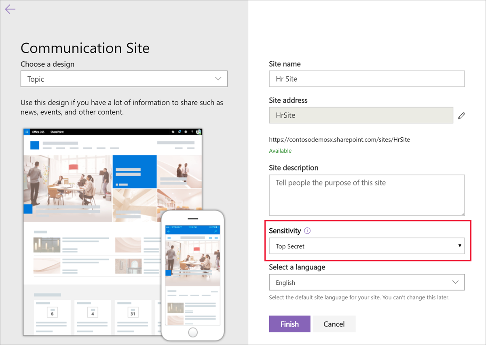

# <a name="use-sensitivity-labels-with-microsoft-teams-office-365-groups-and-sharepoint-sites-public-preview"></a>Verwenden von Vertraulichkeitsbezeichnungen für Microsoft Teams, Office 365-Gruppen und SharePoint-Websites (öffentliche Vorschau)

Wenn Sie Sensitivitäts Bezeichnungen im [Microsoft 365 Compliance Center](https://protection.office.com/)erstellen, können Sie diese nun auf Microsoft Teams, Office 365 Gruppen und SharePoint-Websites anwenden. Sie können den Beschriftungen Richtlinien zuordnen, um Sie zu steuern:

- Öffentliche/private Einstellungen
- Gastzugriff
- Zugriff von nicht verwalteten Geräten

Wenn Sie eine Bezeichnung auf ein Team oder eine Gruppe anwenden, gilt die Bezeichnung automatisch für die verbundene SharePoint-Teamwebsite und umgekehrt.

Nun können Sie auch Sensitivitäts Bezeichnungen für Office-Dateien in SharePoint und OneDrive aktivieren. [Weitere Informationen](sensitivity-labels-sharepoint-onedrive-files.md).

## <a name="about-the-public-preview-for-microsoft-teams-office-365-groups-and-sharepoint-sites"></a>Informationen zur öffentlichen Vorschau für Microsoft Teams, Office 365 Gruppen und SharePoint-Websites

Vertraulichkeits Bezeichnungen für Microsoft Teams, Office 365 Gruppen und SharePoint-Websites werden schrittweise für Mandanten bereitgestellt und können vor der endgültigen Version geändert werden.

Die öffentliche Vorschau funktioniert nicht mit Office 365 Inhalts Zustellungs Netzwerken (CDNs).

## <a name="overview"></a>Übersicht

Wenn Sie Vertraulichkeits Bezeichnungen veröffentlichen, haben Benutzer in Office 365 Zugriff auf dieselbe Liste von Bezeichnungen.

Diese Bilder zeigen:

- Wie die Liste angezeigt wird, wenn Sie eine neue Teamwebsite aus SharePoint erstellen

- Wenn Sie die Liste in Word anzeigen


## <a name="enable-this-preview-by-using-azure-powershell"></a>Aktivieren dieser Vorschau mithilfe von Azure PowerShell

1. Melden Sie sich mit Azure PowerShell als globaler Administrator bei Azure an. Anweisungen finden Sie unter [Anmelden mit Azure PowerShell](/powershell/azure/authenticate-azureps).

2. Führen Sie den folgenden Befehl aus:

```powershell
  Connect-AzureAD
  $setting=(Get-AzureADDirectorySetting | where -Property DisplayName -Value "Group.Unified" -EQ)
  if ($setting -eq $null)
  {
    $template = Get-AzureADDirectorySettingTemplate -Id 62375ab9-6b52-47ed-826b-58e47e0e304b
    $setting = $template.CreateDirectorySetting()
    $setting["EnableMIPLabels"] = "True"
    New-AzureADDirectorySetting -DirectorySetting $setting
  }
  else
  {
    $setting["EnableMIPLabels"] = "True"
    Set-AzureADDirectorySetting -Id $setting.Id -DirectorySetting $setting
  }
```

Office 365 verwendet die alten Klassifizierungen für neue Gruppen und SharePoint-Websites nicht mehr, wenn Sie diese Vorschau aktivieren. Wenn Sie [Azure AD Site Klassifizierung](/sharepoint/dev/solution-guidance/modern-experience-site-classification) ($Setting ["classificationlist"]) verwendet haben, zeigen vorhandene Gruppen und Websites weiterhin die alten Klassifizierungen an. Um die neuen Klassifizierungen anzuzeigen, konvertieren Sie Sie. Informationen zum Konvertieren dieser Website finden Sie unter [Wenn Sie klassische Azure AD Site Klassifizierung verwendet](#if-you-used-classic-azure-ad-site-classification)haben. 

## <a name="set-site-and-group-settings-when-you-create-or-edit-sensitivity-labels"></a>Festlegen von Standort-und Gruppeneinstellungen beim Erstellen oder Bearbeiten von Vertraulichkeits Bezeichnungen

Nachdem Sie die Vorschau aktiviert haben, führen Sie die folgenden Schritte aus, um Vertraulichkeits Bezeichnungen zu erstellen oder zu bearbeiten. Sie müssen diese Schritte ausführen, damit die neuen Sensitivitäts Bezeichnungen mit Websites und Gruppen arbeiten können, auch wenn bereits Beschriftungen definiert sind. Änderungen an diesen Einstellungen können bis zu 24 Stunden synchron dauern.

1. Wählen Sie im Microsoft 365 Compliance Center **Klassifizierungs** > **Sensitivitäts Bezeichnungen**aus.

2. Wählen Sie **Beschriftung erstellen**aus. Wenn Sie bereits über eine Bezeichnung verfügen, fahren Sie mit dem nächsten Schritt fort.

3. Wählen Sie die gewünschten Optionen aus, und wählen Sie dann auf der Registerkarte **Website und Gruppeneinstellungen** Folgendes aus:

    - Datenschutz (öffentlich/privat): Private bedeutet, dass nur genehmigte Mitglieder in Ihrer Organisation sehen können, was sich innerhalb der Gruppe befindet. Jeder andere in Ihrer Organisation kann nicht sehen, was in der Gruppe ist. [Weitere Informationen](https://support.office.com/article/36236e39-26d3-420b-b0ac-8072d2d2bedc)
    - Gastzugriff: Sie können steuern, ob Gäste zu einer Gruppe hinzugefügt werden können. [Informationen zum Verwalten des Gastzugriffs in Office 365 Gruppen](/office365/admin/create-groups/manage-guest-access-in-groups)
    - Nicht verwaltete Geräte: mit dieser Einstellung können Sie den Zugriff auf SharePoint-Inhalte von Geräten blockieren oder begrenzen, die in InTune nicht mit Hybrid-AD verbunden oder kompatibel sind. Wenn Sie nicht verwaltete Geräte auswählen, müssen Sie zu Azure AD gehen, um die Einrichtung der Richtlinie abzuschließen. Informationen finden Sie unter [Steuern des Zugriffs von nicht verwalteten Geräten](/sharepoint/control-access-from-unmanaged-devices).


> [!IMPORTANT]
> Nur die Standort-und Gruppeneinstellungen werden wirksam, wenn Sie eine Bezeichnung auf ein Team, eine Gruppe oder einen Standort anwenden. Andere Einstellungen wie Verschlüsselung und Inhalts Markierung werden nicht auf alle Inhalte innerhalb des Teams, der Gruppe oder der Website angewendet. Wenn Sie eine Bezeichnung erstellen und die Einstellungen für die Website und die Gruppe nicht aktivieren, ist die Bezeichnung auch dann verfügbar, wenn Benutzer Teams, Gruppen und Websites erstellen, es wird jedoch nichts tun, wenn Benutzer Sie anwenden.

[Informationen zum Veröffentlichen einer Vertraulichkeits Bezeichnung](/microsoft-365/compliance/sensitivity-labels#what-label-policies-can-do)

## <a name="troubleshoot-sensitivity-label-deployment"></a>Problembehandlung bei der Sensitivitäts Bezeichnungs Bereitstellung

Wenn beim Erstellen eines Teams oder Office 365 Gruppe Probleme auftreten, nachdem Sie diese Einstellungen aktiviert oder die Beschreibung einer Sensitivitäts Bezeichnung geändert haben, speichern Sie die Beschriftung, warten Sie einige Stunden, und versuchen Sie dann erneut, das Team oder die Office 365 Gruppe zu erstellen.

Wenn Sie die neue Sensitivitäts Bezeichnung immer noch nicht in SharePoint Online sehen können, wenden Sie sich umgehend an den Microsoft-Support.

## <a name="apply-a-sensitivity-label-to-a-new-team"></a>Anwenden einer Vertraulichkeits Bezeichnung auf ein neues Team

Benutzer können Sensitivitäts Bezeichnungen auswählen, wenn Sie neue Teams in Microsoft Teams erstellen. Wenn Sie die Empfindlichkeitsstufe auswählen, ändert sich die Datenschutzeinstellung bei Bedarf. Abhängig von der Einstellung für den Gastzugriff, die Sie für die Bezeichnung ausgewählt haben, können Benutzer Personen außerhalb der Organisation dem Team hinzufügen.


Nachdem Sie das Team erstellt haben, wird die Sensitivitäts Bezeichnung in der oberen rechten Ecke aller Kanäle angezeigt.


Der Dienst wendet die gleiche Vertraulichkeits Bezeichnung automatisch auf die Office 365 Gruppe und die verbundene SharePoint-Teamwebsite an.

## <a name="apply-a-sensitivity-label-to-a-new-group"></a>Anwenden einer Sensitivitäts Bezeichnung auf eine neue Gruppe

In Outlook im Internet enthält das Feld neue **Vertraulichkeit** veröffentlichte Bezeichnungen. Wenn Benutzer weitere Informationen wünschen, können Sie auf das Hilfesymbol klicken, um Details zu den verfügbaren Bezeichnungen und zugehörigen Richtlinien zu lesen.


## <a name="apply-a-sensitivity-label-to-a-new-site"></a>Anwenden einer Vertraulichkeits Bezeichnung auf eine neue Website

Administratoren und Endbenutzer können Sensitivitäts Bezeichnungen auswählen, wenn Sie moderne Teamwebsites und Kommunikationswebsites erstellen.

[Erfahren Sie, wie Sie eine Website im neuen SharePoint Admin Center erstellen.](/sharepoint/create-site-collection)

Wenn Benutzer moderne Team-und Kommunikationswebsites erstellen, ist standardmäßig bereits eine Vertraulichkeits Bezeichnung ausgewählt. Benutzer können das Hilfesymbol auswählen, um weitere Informationen zu den Beschriftungen zu erhalten.



Wenn Benutzer die Website durchsuchen, können Sie den Namen der Bezeichnung und die angewendeten Richtlinien anzeigen.


## <a name="manage-sensitivity-labels-in-the-sharepoint-admin-center"></a>Verwalten von Sensitivitäts Bezeichnungen im SharePoint Admin Center

Verwenden Sie zum Anzeigen und Bearbeiten der Bezeichnungen die Seite aktive Websites im neuen SharePoint Admin Center.


[Erfahren Sie mehr über das Verwalten von Websites im neuen SharePoint Admin Center](/sharepoint/manage-sites-in-new-admin-center).

## <a name="change-site-and-group-settings-for-a-label"></a>Ändern von Standort-und Gruppeneinstellungen für eine Bezeichnung

Als bewährte Methode sollten Sie die Einstellungen nicht ändern, nachdem Sie eine Bezeichnung auf mehrere Teams, Gruppen oder Websites angewendet haben. Wenn Sie eine Änderung vornehmen müssen, müssen Sie ein Azure AD PowerShell-Skript verwenden, um Updates manuell zu übernehmen. Mit dieser Methode wird sichergestellt, dass alle vorhandenen Teams, Websites und Gruppen die neue Einstellung erzwingen.

## <a name="support-for-the-new-sensitivity-labels"></a>Unterstützung für die neuen Sensitivitäts Bezeichnungen

Die folgenden apps und Dienste unterstützen die Sensitivitäts Bezeichnungen in dieser Vorschau:

- Microsoft 365 Compliance Center
- SharePoint
- Outlook im Web
- Teams
- SharePoint Admin Center
- Azure AD Admin Center

Sie können die folgenden apps und Dienste nicht verwenden, um Office 365 Gruppen mit den neuen Vertraulichkeits Bezeichnungen zu erstellen:

- Outlook für Mac
- Outlook Mobile  
- Outlook-Desktop für Windows
- Formulare  
- Dynamics 365  
- Yammer  
- Stream  
- Planner  
- Project  
- PowerBI  
- Teams-Verwaltungskonsole  
- Microsoft 365 Admin Center  
- Exchange Admin Center

## <a name="if-you-used-classic-azure-ad-site-classification"></a>Wenn Sie klassische Azure Ad Website Klassifizierung verwendet haben

Office 365 unterstützt die alten Klassifizierungen für neue Gruppen und SharePoint-Websites nicht mehr, wenn Sie diese Vorschau aktivieren. Vorhandene Gruppen und Websites zeigen jedoch weiterhin die alten Klassifizierungen an, es sei denn, Sie konvertieren Sie. Zu den alten Klassifizierungen gehören die von Ihnen festgelegte "moderne" Website Klassifizierung, möglicherweise über Azure AD PowerShell oder die PNP- `ClassificationList` Kernbibliothek, mit der die Werte für die Einstellung definiert wurden.

Beispielsweise in PowerShell:

```powershell
   ($setting["ClassificationList"])
```

Weitere Informationen zur alten Klassifizierungsmethode finden Sie unter [SharePoint "Modern" Site Classification](https://docs.microsoft.com/sharepoint/dev/solution-guidance/modern-experience-site-classification).

Basierend auf Ihrer aktuellen Bereitstellung haben Sie zwei Optionen, um Ihre alten Klassifizierungen in die neuen Klassifizierungen zu konvertieren.

### <a name="if-you-never-used-sensitivity-labels-unified-microsoft-information-protection-labels-for-files-and-email"></a>Wenn Sie für Dateien und e-Mails keine Sensitivitäts Bezeichnungen (Unified Microsoft Information Protection-Bezeichnungen) verwendet haben

Wir empfehlen, dass Sie wie folgt vorgehen:

1. Erstellen Sie neue Sensitivitäts Bezeichnungen im Microsoft 365 Compliance Center mit den gleichen Namen wie Ihre vorhandenen Klassifizierungen.
2. Verwenden Sie PowerShell, um die neuen Bezeichnungen auf vorhandene Office 365 Gruppen und SharePoint-Websites mithilfe der Namenszuordnung anzuwenden.
3. Löschen Sie die alten Klassifizierungen.

Apps und Dienste, die die neuen Sensitivitäts Bezeichnungen unterstützen, werden angezeigt. Sie erstellen neue Teams, Gruppen und Websites mit den neuen Bezeichnungen. Benutzer können weiterhin Gruppen aus apps und Diensten erstellen, die die neuen Bezeichnungen nicht unterstützen. Benutzer können diese Gruppen jedoch nicht mit einer Bezeichnung versehen. Verwenden Sie PowerShell, um die neuen Vertraulichkeits Bezeichnungen auf diese Gruppen anzuwenden.

Sie können Ihre alten Klassifizierungen beibehalten. Es wird jedoch dringend empfohlen, die neuen Vertraulichkeits Bezeichnungen für diese Gruppen mithilfe von PowerShell anzuwenden.

Apps und Dienste, die die neuen Sensitivitäts Bezeichnungen unterstützen, werden mit den neuen Beschriftungen erstellt. Wenn Benutzergruppen aus apps und Diensten erstellen, die die neuen Bezeichnungen nicht unterstützen, können Sie eine Klassifizierung auswählen.

### <a name="if-you-use-sensitivity-labels-unified-microsoft-information-protection-labels-for-files-and-email"></a>Wenn Sie für Dateien und e-Mails Vertraulichkeits Bezeichnungen (Unified Microsoft Information Protection-Bezeichnungen) verwenden

Sobald Sie diese Vorschau aktiviert haben, wechseln Sie zu jeder Bezeichnung im Microsoft 365 Compliance Center, und wenden Sie die gewünschten Richtlinien für Websites und Gruppen an. Benutzer beginnen mit dem Anzeigen vorhandener Beschriftungen für Websites und Gruppen.

### <a name="prepare-the-sharepoint-online-management-shell-before-you-relabel-office-365-groups"></a>Vorbereiten der SharePoint Online Verwaltungsshell vor dem neuetikettieren von Office 365 Gruppen

Vergewissern Sie sich vor dem Anwenden neuer Bezeichnungen, dass Sie die neueste SharePoint Online-Verwaltungsshell ausführen. Wenn Sie bereits über die neueste Version verfügen, können Sie [Office 365 Gruppen mit neuen Sensitivitäts Bezeichnungen neu bezeichnen](#relabel-office-365-groups-with-new-sensitivity-labels).

So bereiten Sie die SharePoint Online Management-Shell für die Vorschau vor:

1. Wenn Sie eine frühere Version der SharePoint Online-Verwaltungsshell installiert haben, wechseln Sie zu **Software hinzufügen oder entfernen** , und deinstallieren Sie "SharePoint Online Verwaltungsshell".

2. Wechseln Sie in einem Webbrowser zur Seite Download Center, und [Laden Sie die neueste SharePoint Online Verwaltungsshell herunter](https://go.microsoft.com/fwlink/p/?LinkId=255251).

3. Wählen Sie Ihre Sprache aus, und klicken Sie dann auf **herunterladen**.

4. Wählen Sie zwischen der Datei x64 und x86. msi aus. Laden Sie die x64-Datei herunter, wenn Sie die 64-Bit-Version von Windows oder die x86-Datei ausführen, wenn Sie die 32-Bit-Version ausführen. Wenn Sie nicht wissen, finden Sie unter [welche Version des Windows-Betriebssystems soll ich ausführen?](https://support.microsoft.com/help/13443/windows-which-operating-system).

5. Nachdem Sie die Datei heruntergeladen haben, führen Sie die Datei aus, und führen Sie die Schritte im Setup-Assistenten aus.

### <a name="relabel-office-365-groups-with-new-sensitivity-labels"></a>Neuetikettieren von Office 365 Gruppen mit neuen Sensitivitäts Bezeichnungen

1. Stellen Sie sicher, dass Sie die neueste Version der SharePoint Online Management-Shell verwenden. Anweisungen finden Sie unter [Prepare the SharePoint Online Management Shell, bevor Sie Office 365 Gruppen umetikettieren](#prepare-the-sharepoint-online-management-shell-before-you-relabel-office-365-groups).

2. Stellen Sie mithilfe eines Geschäfts-oder Schul Kontos mit globalen Administrator-oder SharePoint-Administratorrechten in Office 365 eine Verbindung mit SharePoint Online Verwaltungsshell her. Eine Anleitung dazu finden Sie unter [Erste Schritte mit der SharePoint Online-Verwaltungsshell](/powershell/sharepoint/sharepoint-online/connect-sharepoint-online).

3. Führen Sie den folgenden Befehl aus, um die Liste der Vertraulichkeits Bezeichnungen und deren GUIDs abzurufen.

    ```PowerShell
    Set-ExecutionPolicy RemoteSigned
    $UserCredential = Get-Credential
    $Session = New-PSSession -ConfigurationName Microsoft.Exchange -ConnectionUri https://ps.compliance.protection.outlook.com/powershell-liveid -Authentication Basic -AllowRedirection -Credential $UserCredential
    Import-PSSession $Session
    Get-Label |ft Name, Guid  
    ```

4. Notieren Sie sich die GUID für die Bezeichnung, die Sie überschreiben möchten. Beispielsweise die Bezeichnung "Allgemein".

5. Verwenden Sie den folgenden Befehl, um die Liste der Gruppen abzurufen, die die "allgemeine" Klassifizierung aufweisen. Wenn Sie diesen Befehl ausführen, stellen Sie eine Verbindung mit Exchange Online PowerShell her und führen das Cmdlet Get-Unifiedgroup aus.

   ```PowerShell
   Set-ExecutionPolicy RemoteSigned
   $UserCredential = Get-Credential
   $Session = New-PSSession -ConfigurationName Microsoft.Exchange -ConnectionUri https://outlook.office365.com/powershell-liveid/ -Credential $UserCredential -Authentication Basic -AllowRedirection
   Import-PSSession $Session
   ```

6. Fügen Sie für jede Gruppe die neue GUID der Sensitivitäts Bezeichnung hinzu.

    ```PowerShell
    foreach ($g in $groups)
    {Set-UnifiedGroup -Identity $g.Identity -SensitivityLabelId "457fa763-7c59-461c-b402-ad1ac6b703cc"}
    ```
