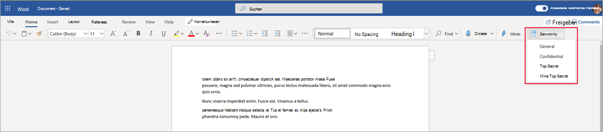
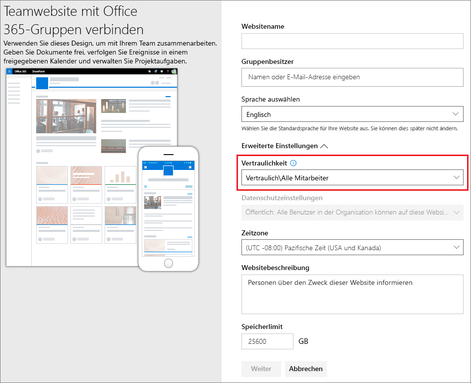
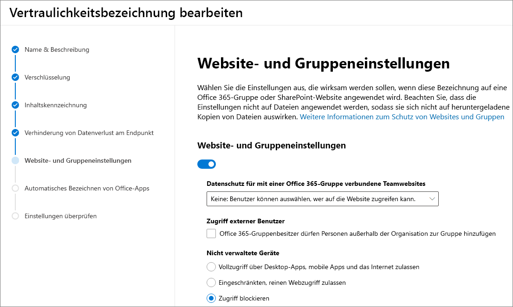
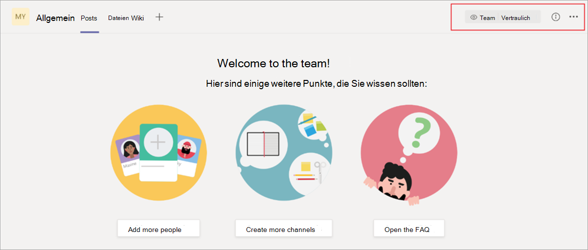
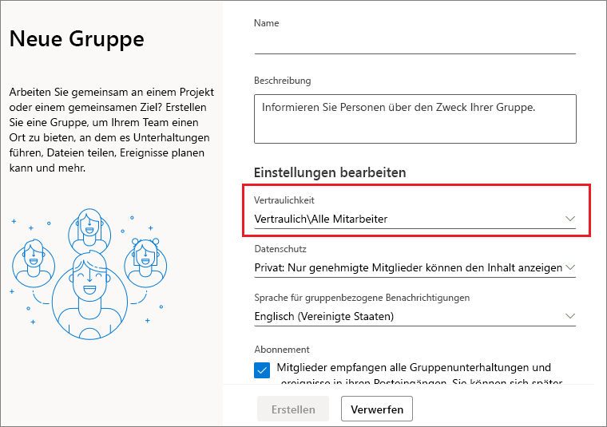
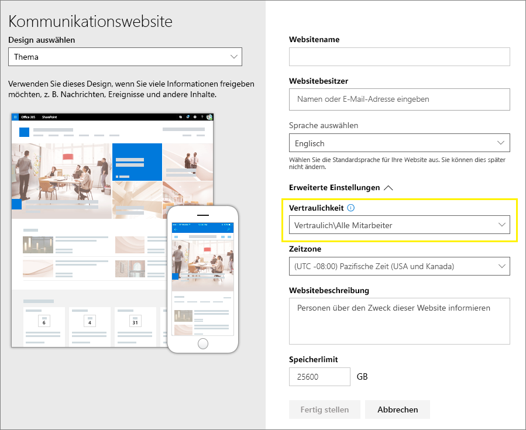
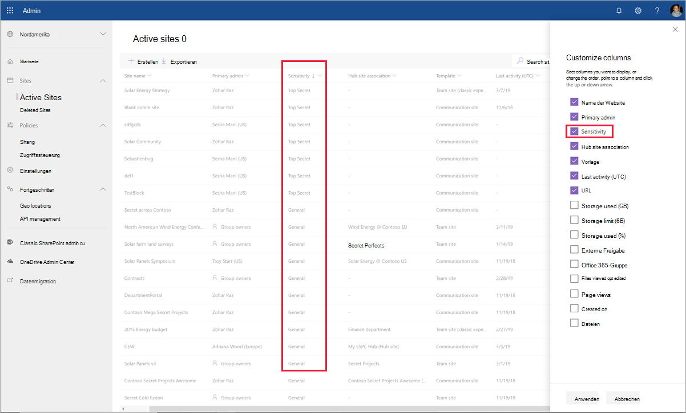

# <a name="use-sensitivity-labels-to-protect-content-in-microsoft-teams-microsoft-365-groups-and-sharepoint-sites-public-preview"></a>Verwenden von Vertraulichkeitsbezeichnungen zum Schutz von Inhalten in Microsoft Teams, Microsoft 365-Gruppen und SharePoint-Websites (öffentliche Vorschau)

>*[Microsoft 365-Lizenzierungsleitfaden für Sicherheit und Compliance](https://aka.ms/ComplianceSD).*

Wenn Sie im [Microsoft 365 Compliance Center](https://protection.office.com/) Vertraulichkeitsbezeichnungen erstellen, können Sie sie jetzt auf die folgenden Container anwenden: Microsoft Teams-Websites, Microsoft 365-Gruppen und SharePoint-Websites. Verwenden Sie die folgenden Bezeichnungseinstellungen zum Schutz von Inhalt in diesen Containern:

- Datenschutz (öffentlich oder privat) für mit einer Microsoft 365-Gruppe verbundene Teamwebsites
- Zugriff externer Benutzer
- Zugriff von nicht verwalteten Geräten aus 

Wenn Sie diese Bezeichnung auf einen unterstützten Container anwenden, wendet die Bezeichnung die konfigurierten Optionen automatisch auf die verbundene Website oder Gruppe an. 

Der Inhalt in diesen Containern erbt die Bezeichnung jedoch nicht für Einstellungen wie Bezeichnungsnamen, visuelle Markierungen oder Verschlüsselung. [Aktivieren Sie von Vertraulichkeitsbezeichnungen für Office-Dateien in SharePoint und OneDrive](sensitivity-labels-sharepoint-onedrive-files.md), damit Benutzer Bezeichnungen auf ihre Dokumente in SharePoint- oder Teamwebsites anwenden können.

## <a name="about-the-public-preview-for-microsoft-teams-microsoft-365-groups-and-sharepoint-sites"></a>Informationen zur öffentlichen Vorschau für Microsoft Teams, Microsoft 365-Gruppen und SharePoint-Websites

Vertraulichkeitsbezeichnungen für Microsoft Teams, Microsoft 365-Gruppen und SharePoint-Websites werden schrittweise für Mandanten bereitgestellt und können sich vor der endgültigen Version ändern. Diese öffentliche Vorschau kann nicht mit Office 365-Netzwerken für die Inhaltsübermittlung (Content Delivery Network, CDN) verwendet werden.

Bevor Sie diese Vorschau aktivieren und Vertraulichkeitsbezeichnungen für die neuen Einstellungen konfigurieren, können die Benutzer Vertraulichkeitsbezeichnungen in ihren Apps anzeigen und anwenden. Beispielsweise aus Word:



Nachdem Sie diese Vorschau aktiviert und konfiguriert haben, können Benutzer Vertraulichkeitsbezeichnungen außerdem für Microsoft Teams, Microsoft 365-Gruppen und SharePoint-Websites anzeigen und anwenden. Beispielsweise, wenn eine neue Teamwebsite in SharePoint erstellt wird:



## <a name="enable-this-preview-and-synchronize-labels"></a>Aktivieren dieser Vorschau und Synchronisieren von Bezeichnungen

1. Weil dieses Feature die Azure AD-Funktionen nutzt, führen Sie zum Aktivieren der Vorschau die Anleitungen in der Azure AD-Dokumentation aus: [Zuweisen von Vertraulichkeitsbezeichnungen zu Microsoft 365-Gruppen in Azure Active Directory (Vorschau)](https://docs.microsoft.com/azure/active-directory/users-groups-roles/groups-assign-sensitivity-labels).

2. [Stellen Sie jetzt eine Verbindung mit Office 365 Security & Compliance Center PowerShell her](/powershell/exchange/office-365-scc/connect-to-scc-powershell/connect-to-scc-powershell). 
    
    Melden Sie sich beispielsweise bei einer PowerShell-Sitzung, die Sie als Administrator ausführen, mit einem globalen Administratorkonto an:
    
    ```powershell
    Set-ExecutionPolicy RemoteSigned
    $UserCredential = Get-Credential
    $Session = New-PSSession -ConfigurationName Microsoft.Exchange -ConnectionUri https://ps.compliance.protection.outlook.com/powershell-liveid/ -Credential $UserCredential -Authentication Basic -AllowRedirection
    Import-PSSession $Session -DisableNameChecking
    ```

3. Führen Sie den folgenden Befehl aus, um Ihre Vertraulichkeitsbezeichnungen mit Azure AD zu synchronisieren, damit sie mit Microsoft 365-Gruppen verwendet werden können:
    
    ```powershell
    Execute-AzureAdLabelSync
    ```

## <a name="how-to-configure-site-and-group-settings-when-you-create-or-edit-sensitivity-labels"></a>Konfigurieren von Website- und Gruppeneinstellungen beim Erstellen oder Bearbeiten von Vertraulichkeitsbezeichnungen

Sie können jetzt Vertraulichkeitsbezeichnungen erstellen oder bearbeiten, die für Websites und Gruppen verfügbar sein sollen. Durch Aktivieren der Vorschau wird eine neue Seite im Assistenten für Vertraulichkeitsbezeichnungen verfügbar: **Website- und Gruppeneinstellungen**

Wenn Sie Hilfe beim Erstellen oder Bearbeiten einer Vertraulichkeitsbezeichnung benötigen, lesen Sie die Anweisungen unter [Erstellen und Konfigurieren von Vertraulichkeitsbezeichnungen](create-sensitivity-labels.md#create-and-configure-sensitivity-labels).

Auf dieser neuen Seite **Website- und Gruppeneinstellungen** können Sie die Einstellungen konfigurieren:

- **Datenschutz für mit Microsoft 365-Gruppen verbundene Teams-Websites**: Derzeit erfolgt das Rollout der Standardeinstellung **Keine. Benutzer kann wählen, wer auf die Website zugreifen kann** an die Mandanten. Behalten Sie diese Standardeinstellung bei, wenn Sie den Inhalt im Container mit Vertraulichkeitsbezeichnungen schützen möchten, die Benutzer aber trotzdem selbst Datenschutzeinstellungen konfigurieren können sollen.
    
    Wählen Sie **Öffentlich** oder**Privat** aus, um die Datenschutzeinstellung festzulegen und zu sperren, wenn Sie diese Bezeichnung auf den Container anwenden. Wählen Sie **Öffentlich** aus, wenn Sie möchten, dass jeder in Ihrer Organisation auf die Teamwebsite oder Gruppe, auf die diese Bezeichnung angewendet wird, zugreifen kann, und **Privat**, wenn Sie den Zugriff auf genehmigte Mitglieder in Ihrer Organisation beschränken möchten. 
    
    Die Einstellung **Öffentlich** oder **Privat** ersetzt alle für das Team oder die Gruppe möglicherweise früher konfigurierten Datenschutzeinstellungen und sperrt den Datenschutzwert, sodass er nur geändert werden kann, wenn zuvor die Vertraulichkeitsbezeichnung vom Container entfernt wurde. Nachdem Sie die Vertraulichkeitsbezeichnung entfernt haben, bleibt die Datenschutzeinstellung der Bezeichnung erhalten, aber Benutzer können sie jetzt wieder ändern.

- **Zugriff für externe Benutzer**: Steuern Sie, ob der Gruppenbesitzer [Gäste zur Gruppe hinzufügen](/office365/admin/create-groups/manage-guest-access-in-groups) kann.

- **Nicht verwaltete Geräte**: Erlauben Sie für [nicht verwaltete Geräte](/sharepoint/control-access-from-unmanaged-devices) vollen Zugriff oder nur Webzugriff, bzw. blockieren Sie den Zugriff vollständig. 



> [!IMPORTANT]
> Wenn Sie eine Bezeichnung auf ein Team, eine Gruppe oder eine Website anwenden, werden nur diese Website- und Gruppeneinstellungen wirksam. Andere Bezeichnungseinstellungen (z. B. Verschlüsselung und Inhaltskennzeichnung) werden nicht auf die Inhalte innerhalb des Teams, der Gruppen oder der Website angewendet.
> 
> Schrittweises Rollout für Mandanten: Wenn Benutzer Teams, Gruppen und Websites erstellen, stehen nur Bezeichnungen mit den Website- und Gruppeneinstellungen zur Auswahl. Wenn Sie derzeit eine Bezeichnung auf einen Container anwenden können, die Website- und Gruppeneinstellungen für die Bezeichnung jedoch nicht aktiviert sind, wird nur der Name der Bezeichnung auf den Container angewendet.

Wenn Ihre Vertraulichkeitskennzeichnung noch nicht veröffentlicht wurde, veröffentlichen Sie diese jetzt, indem Sie sie[einer Richtlinie für Vertraulichkeitskennzeichnungen hinzufügen](create-sensitivity-labels.md#publish-sensitivity-labels-by-creating-a-label-policy). Diejenigen Benutzer, denen eine Richtlinie zur Vertraulichkeitskennzeichnung zugeordnet ist, die diese Kennzeichnung beinhaltet, können diese für Websites und Gruppen auswählen.

Aus der Bezeichnungsrichtlinie gilt nur die Richtlinieneinstellung **Diese Bezeichnung standardmäßig auf Dokumente und E-Mail anwenden**, wenn Sie die Bezeichnung auf Container anwenden. Es werden keine anderen Richtlinieneinstellungen angewendet, beispielsweise obligatorische Bezeichnungen, das Anfordern von Benutzerbegründungen sowie ein Link zur benutzerdefinierten Hilfeseite.

## <a name="sensitivity-label-management"></a>Verwaltung von Vertraulichkeitsbezeichnungen

> [!WARNING]
> Das Erstellen, Ändern und Löschen von Vertraulichkeitsbezeichnungen, die Sie für Microsoft Teams, Microsoft 365-Gruppen und SharePoint-Websites verwenden, erfordert eine sorgfältige Abstimmung mit der Veröffentlichung von Bezeichnungsrichtlinien für Benutzer. 

Vermeiden Sie Erstellungsfehler für Websites und Gruppen, die sich auf alle Benutzer auswirken, indem Sie die nachstehenden Anweisungen beachten.

**Erstellen und Veröffentlichen von Bezeichnungen:**

Nach der Erstellung und Veröffentlichung einer Vertraulichkeitsbezeichnung kann es bis zu 24 Stunden dauern, bis die Bezeichnung für Benutzer in Teams, Gruppen und Websites sichtbar wird. Führen Sie die folgenden Schritte aus, um eine Bezeichnung für alle Benutzer im Mandanten zu veröffentlichen:

1. Erstellen Sie die Vertraulichkeitsbezeichnung, und veröffentlichen Sie sie nur für einige Benutzerkonten im Mandanten.

2. Warten Sie 24 Stunden.

3. Nach Ablauf dieser 24 Stunden erstellen Sie mit einem der in Schritt 1 angegebenen Benutzerkonten ein Team, eine Microsoft 365-Gruppe oder eine SharePoint-Website mit der in Schritt 1 erstellten Bezeichnung.

4. Wenn während des Erstellungsvorgangs für Schritt 3 keine Fehler auftreten, veröffentlichen Sie die Bezeichnung für alle Benutzer in Ihrem Mandanten. Wenn Fehler auftreten, wenden Sie sich an den [Microsoft-Support](https://docs.microsoft.com/office365/admin/contact-support-for-business-products).

**Ändern und Löschen von veröffentlichten Bezeichnungen:**

Wenn Sie eine Vertraulichkeitsbezeichnung, deren Website- und Gruppeneinstellungen aktiviert sind, ändern oder löschen, und diese Bezeichnung in einer oder mehreren Bezeichnungsrichtlinien enthalten ist, kann dies zu Erstellungsfehlern für alle Teams, Gruppen und Websites führen. Folgen Sie dieser Anleitung, um dieses Problem zu vermeiden:

1. Entfernen Sie die Vertraulichkeitsbezeichnung aus allen Bezeichnungsrichtlinien, in denen die Bezeichnung enthalten ist.

2. Warten Sie 48 Stunden.

3. Versuchen Sie nach 48 Stunden, ein Team, eine Gruppe oder eine Website zu erstellen, und vergewissern Sie sich, dass die Bezeichnung nicht mehr angezeigt wird.

4. Wenn die Vertraulichkeitsbezeichnung nicht angezeigt wird, können Sie sie jetzt bedenkenlos ändern oder löschen. Wird die Bezeichnung weiterhin angezeigt, wenden Sie sich an den [Microsoft-Support](https://docs.microsoft.com/office365/admin/contact-support-for-business-products).

## <a name="assign-sensitivity-labels-to-microsoft-365-groups"></a>Zuweisen von Vertraulichkeitsbezeichnungen zu Microsoft 365-Gruppen

Jetzt können Sie die Vertraulichkeitsbezeichnung(en) auf Microsoft 365-Gruppen anwenden. Kehren Sie für weitere Anweisungen zur Azure AD-Dokumentation zurück:

- [Zuweisen einer Bezeichnung zu einer neuen Gruppe im Azure-Portal](https://docs.microsoft.com/azure/active-directory/users-groups-roles/groups-assign-sensitivity-labels#assign-a-label-to-a-new-group-in-azure-portal)

-  [Zuweisen einer Bezeichnung zu einer vorhandenen Gruppe im Azure-Portal](https://docs.microsoft.com/azure/active-directory/users-groups-roles/groups-assign-sensitivity-labels#assign-a-label-to-an-existing-group-in-azure-portal)

-  [Entfernen einer Bezeichnung von einer vorhandenen Gruppe im Azure-Portal](https://docs.microsoft.com/azure/active-directory/users-groups-roles/groups-assign-sensitivity-labels#remove-a-label-from-an-existing-group-in-azure-portal).

## <a name="apply-a-sensitivity-label-to-a-new-team"></a>Anwenden einer Vertraulichkeitsbezeichnung auf ein neues Team

Benutzer können Vertraulichkeitsbezeichnungen auswählen, wenn sie neue Teams in Microsoft Teams erstellen. Wenn sie die Bezeichnung aus der Dropdownliste **Vertraulichkeit** auswählen, kann sich die Datenschutzeinstellung entsprechend der Bezeichnungskonfiguration ändern. Abhängig von der für die Bezeichnung festgelegten Einstellung für den externen Benutzerzugriff können Benutzer Personen außerhalb der Organisation zum Team hinzufügen oder nicht.

[Weitere Informationen Vertraulichkeitsbezeichnungen für Teams](https://docs.microsoft.com/microsoftteams/sensitivity-labels)


Nachdem Sie das Team erstellt haben, wird die Vertraulichkeitsbezeichnung in der oberen rechten Ecke aller Kanäle angezeigt.



Der Dienst wendet auf die Microsoft 365-Gruppe und die verbundene SharePoint-Teamwebsite automatisch dieselbe Vertraulichkeitsbezeichnung an.

## <a name="apply-a-sensitivity-label-to-a-new-group-in-outlook-on-the-web"></a>Anwenden einer Vertraulichkeitsbezeichnung auf eine neue Gruppe in Outlook im Web

Wenn Sie in Outlook im Web eine neue Gruppe erstellen, können Sie die Option **Vertraulichkeit** für veröffentlichte Bezeichnungen auswählen oder ändern:



## <a name="apply-a-sensitivity-label-to-a-new-site"></a>Anwenden einer Vertraulichkeitsbezeichnung auf eine neue Website

Administratoren und Endbenutzer können [beim Erstellen moderner Teamwebsites und Kommunikationswebsites](/sharepoint/create-site-collection) Vertraulichkeitsbezeichnungen auswählen, und **Erweiterte Einstellungen** erweitern:



In der Dropdownliste werden die Bezeichnungsnamen für die Auswahl angezeigt, und das Hilfesymbol zeigt alle Bezeichnungsnamen mit entsprechender QuickInfo an, was Benutzern dabei helfen kann, die richtige Bezeichnung auszuwählen.

Wenn die Bezeichnung angewendet wurde und Benutzer zur Website navigieren, werden der Name der Bezeichnung und die angewendeten Richtlinien angezeigt. So wurde dieser Website beispielsweise die Bezeichnung **Vertraulich** zugewiesen und die Datenschutzeinstellung auf **Privat** festgelegt:


## <a name="view-sensitivity-labels-in-the-sharepoint-admin-center"></a>Anzeigen von Vertraulichkeitsbezeichnungen im SharePoint Online Admin Center

Zum Anzeigen der angewendeten Vertraulichkeitsbezeichnungen verwenden Sie die Seite **Aktive Websites** im neuen SharePoint Admin Center. Möglicherweise müssen Sie zuerst die Spalte **Vertraulichkeit** hinzufügen:



[Weitere Informationen zum Verwalten von Websites im neuen SharePoint Admin Center](/sharepoint/manage-sites-in-new-admin-center).

## <a name="change-site-and-group-settings-for-a-label"></a>Ändern von Website- und Gruppeneinstellungen für eine Bezeichnung

Wenn Sie eine Änderung an den Website- und Gruppeneinstellungen für eine Bezeichnung vornehmen, müssen Sie die folgenden PowerShell-Befehle ausführen, damit Ihre Teams, Websites und Gruppen die neuen Einstellungen verwenden können. Es wird empfohlen, die Website- und Gruppeneinstellungen für eine Bezeichnung nicht zu ändern, nachdem Sie die Vertraulichkeitsbezeichnung auf mehrere Teams, Gruppen oder Websites angewendet haben.

1. Stellen Sie [zunächst eine Verbindung mit Office 365 Security & Compliance Center PowerShell her](/powershell/exchange/office-365-scc/connect-to-scc-powershell/connect-to-scc-powershell). 
    
    Melden Sie sich beispielsweise bei einer PowerShell-Sitzung, die Sie als Administrator ausführen, mit einem globalen Administratorkonto an:
    
    ```powershell
    Set-ExecutionPolicy RemoteSigned
    $UserCredential = Get-Credential
    $Session = New-PSSession -ConfigurationName Microsoft.Exchange -ConnectionUri https://ps.compliance.protection.outlook.com/powershell-liveid/ -Credential $UserCredential -Authentication Basic -AllowRedirection
    Import-PSSession $Session -DisableNameChecking
    ```

2. Führen Sie das Cmdlet [Get-Label](https://docs.microsoft.com/powershell/module/exchange/policy-and-compliance/get-label?view=exchange-ps) aus, um die Liste der Vertraulichkeitsbezeichnungen und deren GUIDs abzurufen:
    
    ```powershell
    Get-Label |ft Name, Guid
    ```

3. Notieren Sie sich die GUID für die Bezeichnung(en), die Sie geändert haben.

4. [Stellen Sie jetzt eine Verbindung mit Exchange Online PowerShell her](https://docs.microsoft.com/powershell/exchange/exchange-online/connect-to-exchange-online-powershell/connect-to-exchange-online-powershell?view=exchange-ps).
    
    Zum Beispiel:
    
    ```powershell
    $UserCredential = Get-Credential
    $Session = New-PSSession -ConfigurationName Microsoft.Exchange -ConnectionUri https://outlook.office365.com/powershell-liveid/ -Credential $UserCredential -Authentication Basic -AllowRedirection
    Import-PSSession $Session
    ```
    
5. Führen Sie das Cmdlet [Get-UnifiedGroup](https://docs.microsoft.com/powershell/module/exchange/users-and-groups/get-unifiedgroup?view=exchange-ps) aus. Geben Sie dabei die GUID der Bezeichnung anstelle der Beispiel-GUID "e48058ea-98e8-4940-8db0-ba1310fd955e" an: 
    
    ```powershell
    $Groups= Get-UnifiedGroup | Where {$_.SensitivityLabel  -eq "e48058ea-98e8-4940-8db0-ba1310fd955e"}
    ```

6. Wenden Sie die Vertraulichkeitsbezeichnung für jede Gruppe unter Verwendung der Bezeichnungs-GUID anstelle der Beispiel-GUID "e48058ea-98e8-4940-8db0-ba1310fd955e" erneut an:
    
    ```powershell
    foreach ($g in $groups)
    {Set-UnifiedGroup -Identity $g.Identity -SensitivityLabelId "e48058ea-98e8-4940-8db0-ba1310fd955e"}
    ```

## <a name="support-for-the-sensitivity-labels"></a>Unterstützung der Vertraulichkeitsbezeichnungen

Sie können die Vertraulichkeitsbezeichnungen, die Sie für die Website- und Gruppeneinstellungen konfiguriert haben, mit den folgenden Apps und Diensten verwenden:

- SharePoint Online
- Teams
- Outlook im Web
- SharePoint Admin Center
- Azure AD Admin Center

In folgenden anderen Apps und Diensten können Sie die Vertraulichkeitsbezeichnungen, die Sie für die Website- und Gruppeneinstellungen konfiguriert haben, derzeit nicht verwenden:

- Outlook für Mac
- Outlook Mobile
- Outlook Desktop für Windows
- Forms
- Dynamics 365
- Yammer
- Stream
- Planner
- Project
- PowerBI
- Teams Admin Center
- Microsoft 365 Admin Center
- Exchange Admin-Center


## <a name="classic-azure-ad-group-classification"></a>Klassische Azure AD-Gruppenklassifizierung

Wenn Sie diese Vorschau aktivieren, unterstützt Microsoft 365 die alten Klassifikationen für neue Office 365-Gruppen und SharePoint Online-Websites nicht mehr. Bestehende Gruppen und Sites zeigen jedoch weiterhin die alten Klassifizierungswerte an, es sei denn, Sie konvertieren sie zur Verwendung von Vertraulichkeitsbezeichnungen.

Ein Beispiel dafür, wie Sie die alte Gruppenklassifizierung für Microsoft Office SharePoint Online verwendet haben könnten, finden Sie unter [Klassifizierung "moderner" Microsoft Office SharePoint Online-Websites](https://docs.microsoft.com/sharepoint/dev/solution-guidance/modern-experience-site-classification).

Diese Klassifizierungen wurden konfiguriert, indem Azure AD PowerShell oder die PnP-Kernbibliothek verwendet und Werte für die Einstellung `ClassificationList` festgelegt wurden. Wenn in Ihrem Mandanten Klassifizierungswerte definiert sind, werden sie angezeigt, wenn Sie den folgenden Befehl aus dem [AzureADPreview PowerShell-Modul](https://www.powershellgallery.com/packages/AzureADPreview) ausführen:

```powershell
   ($setting["ClassificationList"])
```

Um Ihre alten Klassifizierungen in Vertraulichkeitsbezeichnungen umzuwandeln, führen Sie einen der folgenden Schritte aus:

- Verwenden vorhandener Bezeichnungen: Geben Sie die gewünschten Bezeichnungseinstellungen für Websites und Gruppen an, indem Sie bereits veröffentlichte Vertraulichkeitsbezeichnungen bearbeiten.

- Erstellen neuer Bezeichnungen: Geben Sie die gewünschten Bezeichnungseinstellungen für Websites und Gruppen an, indem Sie neue Vertraulichkeitsbezeichnungen mit den gleichen Namen wie Ihre bestehenden Klassifizierungen erstellen und veröffentlichen.

Gehen Sie dann wie folgt vor: 

1. Verwenden Sie PowerShell, um die Vertraulichkeitsbezeichnungen mithilfe von Namenszuordnung auf vorhandene Microsoft 365-Gruppen und SharePoint-Websites anzuwenden. Entsprechende Anweisungen finden Sie im nächsten Abschnitt.

2. Entfernen Sie die alten Klassifizierungen der bestehenden Gruppen und Websites.

Sie können Benutzer zwar nicht daran hindern, neue Gruppen in Apps und Diensten, die noch keine Vertraulichkeitsbezeichnungen unterstützen, zu erstellen, aber Sie können wiederholt ein PowerShell-Skript ausführen, um nach neuen Gruppen zu suchen, die von Benutzern mit den alten Klassifizierungen erstellt wurden, und diese in Vertraulichkeitsbezeichnungen zu konvertieren. 

#### <a name="use-powershell-to-convert-classifications-for-microsoft-365-groups-to-sensitivity-labels"></a>Verwenden von PowerShell, um Klassifizierungen für Microsoft 365-Gruppen in Vertraulichkeitsbezeichnungen zu konvertieren

1. Stellen Sie [zunächst eine Verbindung mit Office 365 Security & Compliance Center PowerShell her](/powershell/exchange/office-365-scc/connect-to-scc-powershell/connect-to-scc-powershell). 
    
    Melden Sie sich beispielsweise bei einer PowerShell-Sitzung, die Sie als Administrator ausführen, mit einem globalen Administratorkonto an:
    
    ```powershell
    Set-ExecutionPolicy RemoteSigned
    $UserCredential = Get-Credential
    $Session = New-PSSession -ConfigurationName Microsoft.Exchange -ConnectionUri https://ps.compliance.protection.outlook.com/powershell-liveid/ -Credential $UserCredential -Authentication Basic -AllowRedirection
    Import-PSSession $Session -DisableNameChecking
    ```

2. Führen Sie das Cmdlet [Get-Label](https://docs.microsoft.com/powershell/module/exchange/policy-and-compliance/get-label?view=exchange-ps) aus, um die Liste der Vertraulichkeitsbezeichnungen und deren GUIDs abzurufen:
    
    ```powershell
    Get-Label |ft Name, Guid
    ```

3. Notieren Sie sich die GUIDs für die Vertraulichkeitsbezeichnungen, die Sie auf Ihre Office 365-Gruppen anwenden möchten.

4. [Stellen Sie jetzt eine Verbindung mit Exchange Online PowerShell her](https://docs.microsoft.com/powershell/exchange/exchange-online/connect-to-exchange-online-powershell/connect-to-exchange-online-powershell?view=exchange-ps).
    
    Beispiel:
    
    ```powershell
    $UserCredential = Get-Credential
    $Session = New-PSSession -ConfigurationName Microsoft.Exchange -ConnectionUri https://outlook.office365.com/powershell-liveid/ -Credential $UserCredential -Authentication Basic -AllowRedirection
    Import-PSSession $Session
    ```

6. Notieren Sie sich die GUIDs für die Vertraulichkeitsbezeichnungen, die Sie auf Ihre Microsoft 365-Gruppen anwenden möchten.

7. Verwenden Sie den folgenden Befehl als Beispiel, um die Liste der Gruppen abzurufen, die derzeit die Klassifizierung "Allgemein" aufweisen:

   ```PowerShell
   $Groups= Get-UnifiedGroup | Where {$_.classification -eq "General"}
   ```

6. Fügen Sie für jede Gruppe die neue Vertraulichkeitsbezeichnungs-GUID hinzu. Zum Beispiel:

    ```PowerShell
    foreach ($g in $groups)
    {Set-UnifiedGroup -Identity $g.Identity -SensitivityLabelId "457fa763-7c59-461c-b402-ad1ac6b703cc"}
    ```

7. Wiederholen Sie die Schritte 5 und 6 für die restlichen Gruppenklassifizierungen.

## <a name="auditing-sensitivity-label-activities"></a>Überwachen von Vertraulichkeitsbezeichnungsaktivitäten

Wenn jemand ein Dokument auf eine Website hochlädt, die mit einer Vertraulichkeitsbezeichnung geschützt ist, und das Dokument eine Vertraulichkeitsbezeichnung mit [höherer Priorität](sensitivity-labels.md#label-priority-order-matters) als die auf die Website angewendete Vertraulichkeitsbezeichnung aufweist, wird diese Aktion nicht blockiert. Angenommen, Sie haben die Bezeichnung **Allgemein** auf eine SharePoint-Website angewendet, und jemand lädt ein Dokument mit der Bezeichnung **Vertraulich** auf diese Site hoch. Da eine Vertraulichkeitsbezeichnung mit einer höheren Priorität Inhalte kennzeichnet, die eine höhere Vertraulichkeitsstufe aufweisen, als Inhalte mit einer niedrigeren Priorität, könnte dies ein Sicherheitsrisiko darstellen.

Die Aktion wird zwar nicht blockiert, sie wird jedoch überwacht, sodass Sie Dokumente mit abweichender Bezeichnungspriorität identifizieren und bei Bedarf Maßnahmen ergreifen können. Löschen oder verschieben Sie zum Beispiel das hochgeladene Dokument von der Website. 

Es würde kein Sicherheitsrisiko darstellen, wenn die auf ein Dokument angewendete Vertraulichkeitsbezeichnung eine niedrigere Priorität aufweist als die auf die Website angewendete Vertraulichkeitsbezeichnung. Angenommen, ein Dokument, das als **Allgemein** bezeichnet ist, wird auf eine Website hochgeladen, die mit **Vertraulich** bezeichnet ist. In diesem Szenario wird kein Überwachungsereignis erzeugt.

Um das Überwachungsprotokoll nach diesem Ereignis zu durchsuchen, suchen Sie nach **Konflikt in Bezug auf die Vertraulichkeitsbezeichnung eines Dokuments** aus der Kategorie **Datei- und Seitenaktivitäten**. 

Wenn jemand einer Website oder Gruppe eine Vertraulichkeitsbezeichnung hinzufügt oder eine Vertraulichkeitsbezeichnung von einer Website oder Gruppe entfernt, werden diese Aktivitäten ebenfalls überwacht. Diese Ereignisse sind in der Kategorie [Vertraulichkeitsbezeichnungsaktivitäten](search-the-audit-log-in-security-and-compliance.md#sensitivity-label-activities) zu finden. 

Anweisungen zum Durchsuchen des Überwachungsprotokolls finden Sie unter [Durchsuchen des Überwachungsprotokolls im Security & Compliance Center](search-the-audit-log-in-security-and-compliance.md).

## <a name="troubleshoot-sensitivity-label-deployment"></a>Problembehandlung bei der Bereitstellung von Vertraulichkeitsbezeichnungen

Sie haben Probleme mit Vertraulichkeitsbezeichnungen für Microsoft Teams, Microsoft 365-Gruppen und SharePoint-Websites? Überprüfen Sie die Folgendes:

### <a name="labels-not-visible-after-publishing"></a>Bezeichnungen sind nach der Veröffentlichung nicht sichtbar
Wenn beim Erstellen einer Website oder einer Microsoft 365-Gruppe Probleme auftreten, nachdem Sie diese Einstellungen aktiviert oder aber den Namen oder die QuickInfo einer Vertraulichkeitsbezeichnung geändert haben, warten Sie nach dem Speichern der Bezeichnungsänderungen ein paar Stunden, und versuchen Sie dann, das Team oder die Gruppe erneut zu erstellen. Informationen hierzu finden Sie unter [Planen des Rollouts nach Erstellung oder Änderung einer Vertraulichkeitsbezeichnung](sensitivity-labels-sharepoint-onedrive-files.md#schedule-roll-out-after-you-create-or-change-a-sensitivity-label).

Wenn die neue Vertraulichkeitsbezeichnung in SharePoint Online weiterhin nicht angezeigt wird, wenden Sie sich an den [Microsoft-Support](https://docs.microsoft.com/office365/admin/contact-support-for-business-products).

### <a name="team-group-or-sharepoint-site-creation-errors"></a>Fehler beim Erstellen von Teams, Gruppen oder SharePoint-Websites
Wenn während der öffentlichen Vorschau Erstellungsfehler auftreten, können Sie Vertraulichkeitsbezeichnungen für Microsoft Teams, Microsoft 365-Gruppen und SharePoint-Websites unter Verwendung der Anweisungen im Abschnitt [Aktivieren der Unterstützung von Vertraulichkeitsbezeichnungen in PowerShell](https://docs.microsoft.com/azure/active-directory/users-groups-roles/groups-assign-sensitivity-labels#enable-sensitivity-label-support-in-powershell) deaktivieren. Um die Vorschau zu deaktivieren, müssen Sie jedoch in Schritt 5 die Funktion mit `$setting["EnableMIPLabels"] = "False"` deaktivieren.

## <a name="additional-resources"></a>Weitere Ressourcen

Sehen Sie sich das aufgezeichnete Webinar und die beantworteten Fragen zum Thema [Verwenden von Vertraulichkeitsbezeichnungen in Microsoft Teams, O365-Gruppen und SharePoint-Websites](https://techcommunity.microsoft.com/t5/security-privacy-and-compliance/using-sensitivity-labels-with-microsoft-teams-o365-groups-and/ba-p/1221885#M1380) an.

