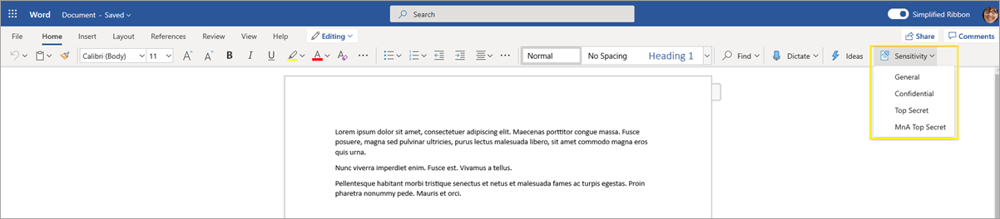
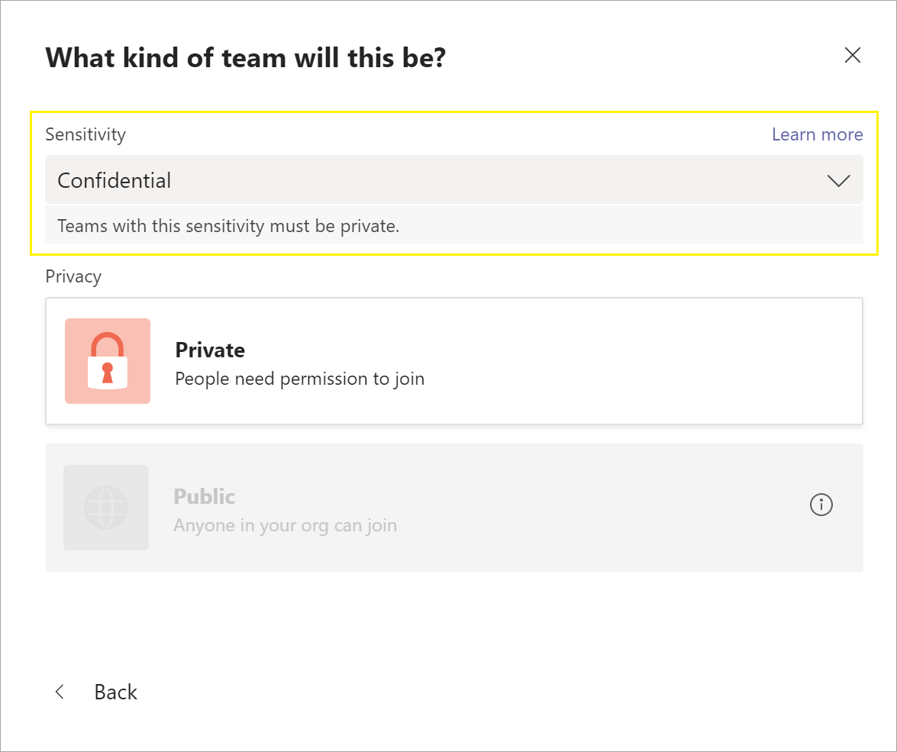
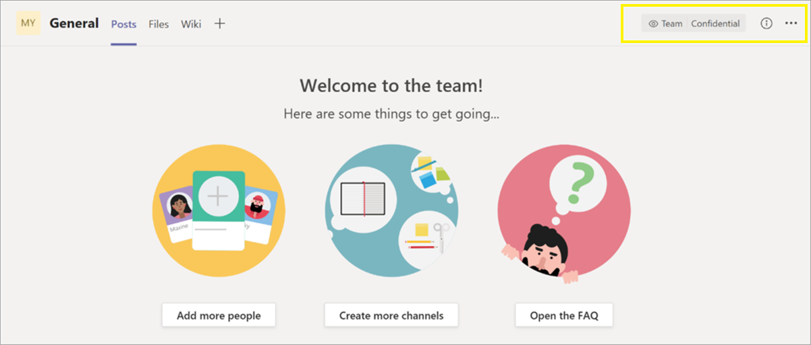

# <a name="use-sensitivity-labels-to-protect-content-in-microsoft-teams-microsoft-365-groups-and-sharepoint-sites"></a><span data-ttu-id="f67c3-103">Vertraulichkeitsbezeichnungen zum Schutz von Inhalten in Microsoft Teams, Microsoft 365-Gruppen und SharePoint-Websites verwenden</span><span class="sxs-lookup"><span data-stu-id="f67c3-103">Use sensitivity labels to protect content in Microsoft Teams, Microsoft 365 groups, and SharePoint sites</span></span>

><span data-ttu-id="f67c3-104">*[Microsoft 365-Lizenzierungsleitfaden für Sicherheit und Compliance](https://aka.ms/ComplianceSD).*</span><span class="sxs-lookup"><span data-stu-id="f67c3-104">*[Microsoft 365 licensing guidance for security & compliance](https://aka.ms/ComplianceSD).*</span></span>

<span data-ttu-id="f67c3-105">Zusätzlich zur Verwendung von [Vertraulichkeitsbezeichnungen](sensitivity-labels.md), um Dokumente und E-Mails zu klassifizieren und zu schützen, können Sie Vertraulichkeitsbezeichnungen auch verwenden, um Inhalte in den folgenden Containern zu schützen: Microsoft Teams-Websites, Microsoft 365-Gruppen ([vormals Office 365-Gruppen](https://techcommunity.microsoft.com/t5/microsoft-365-blog/office-365-groups-will-become-microsoft-365-groups/ba-p/1303601)) und SharePoint-Websites.</span><span class="sxs-lookup"><span data-stu-id="f67c3-105">In addition to using [sensitivity labels](sensitivity-labels.md) to classify and protect documents and emails, you can also use sensitivity labels to protect content in the following containers: Microsoft Teams sites, Microsoft 365 groups ([formerly Office 365 groups](https://techcommunity.microsoft.com/t5/microsoft-365-blog/office-365-groups-will-become-microsoft-365-groups/ba-p/1303601)), and SharePoint sites.</span></span> <span data-ttu-id="f67c3-106">Verwenden Sie für diese Klassifizierung und den Schutz auf Containerebene die folgenden Bezeichnungseinstellungen:</span><span class="sxs-lookup"><span data-stu-id="f67c3-106">For this container-level classification and protection, use the following label settings:</span></span>

- <span data-ttu-id="f67c3-107">Datenschutz (öffentlich oder privat) für Teamwebsites und Microsoft 365-Gruppen</span><span class="sxs-lookup"><span data-stu-id="f67c3-107">Privacy (public or private) of teams sites and Microsoft 365 groups</span></span>
- <span data-ttu-id="f67c3-108">Zugriff externer Benutzer</span><span class="sxs-lookup"><span data-stu-id="f67c3-108">External user access</span></span>
- <span data-ttu-id="f67c3-109">Zugriff von nicht verwalteten Geräten aus</span><span class="sxs-lookup"><span data-stu-id="f67c3-109">Access from unmanaged devices</span></span>

> [!IMPORTANT]
> <span data-ttu-id="f67c3-110">Die Einstellung **Zugriff von nicht verwalteten Geräten aus** funktioniert zusammen mit dem SharePoint-Feature [Zugriff von nicht verwalteten Geräten aus steuern ](/sharepoint/control-access-from-unmanaged-devices).</span><span class="sxs-lookup"><span data-stu-id="f67c3-110">The **Access from unmanaged devices** setting works in conjunction with the SharePoint feature to [control access from unmanaged devices](/sharepoint/control-access-from-unmanaged-devices).</span></span> <span data-ttu-id="f67c3-111">Sie müssen dieses abhängige SharePoint-Feature konfigurieren, um eine Vertraulichkeitsbezeichnung zu verwenden, in der diese Einstellung konfiguriert wurde.</span><span class="sxs-lookup"><span data-stu-id="f67c3-111">You must configure this dependent SharePoint feature to use a sensitivity label that has this setting configured.</span></span> <span data-ttu-id="f67c3-112">Weitere Informationen hierzu finden Sie in den nachfolgenden Anweisungen.</span><span class="sxs-lookup"><span data-stu-id="f67c3-112">Additional information is included in the instructions that follow.</span></span>

<span data-ttu-id="f67c3-113">Wenn Sie diese Vertraulichkeitsbezeichnung auf einen unterstützten Container anwenden, wendet die Bezeichnung die Klassifizierung und die konfigurierten Schutzeinstellungen automatisch auf die Website oder Gruppe an.</span><span class="sxs-lookup"><span data-stu-id="f67c3-113">When you apply this sensitivity label to a supported container, the label automatically applies the classification and configured protection settings to the site or group.</span></span>

<span data-ttu-id="f67c3-114">Der Inhalt dieser Container erbt jedoch nicht die Beschriftungen für die Klassifizierung oder Einstellungen für Dateien und E-Mails, wie beispielsweise visuelle Markierungen oder Verschlüsselung.</span><span class="sxs-lookup"><span data-stu-id="f67c3-114">Content in these containers however, do not inherit the labels for the classification or settings for files and emails, such as visual markings and encryption.</span></span> <span data-ttu-id="f67c3-115">Aktivieren Sie[Vertraulichkeitsbezeichnungen für Office-Dateien in SharePoint und OneDrive](sensitivity-labels-sharepoint-onedrive-files.md), damit Benutzer Bezeichnungen auf ihre Dokumente in SharePoint- oder Teamwebsites anwenden können.</span><span class="sxs-lookup"><span data-stu-id="f67c3-115">So that users can label their documents in SharePoint sites or team sites, make sure you've [enabled sensitivity labels for Office files in SharePoint and OneDrive](sensitivity-labels-sharepoint-onedrive-files.md).</span></span>

> [!NOTE]
> <span data-ttu-id="f67c3-116">Vertraulichkeitsbezeichnungen für Container werden von Office 365-Content Delivery Networks (CDNs) nicht unterstützt.</span><span class="sxs-lookup"><span data-stu-id="f67c3-116">Sensitivity labels for containers aren't supported with Office 365 Content Delivery Networks (CDNs).</span></span>

## <a name="using-sensitivity-labels-for-microsoft-teams-microsoft-365-groups-and-sharepoint-sites"></a><span data-ttu-id="f67c3-117">Vertraulichkeitsbezeichnungen für Microsoft Teams, Microsoft 365-Gruppen und auf SharePoint-Websites verwenden</span><span class="sxs-lookup"><span data-stu-id="f67c3-117">Using sensitivity labels for Microsoft Teams, Microsoft 365 groups, and SharePoint sites</span></span>

<span data-ttu-id="f67c3-118">Bevor Sie Vertraulichkeitsbezeichnungen aktivieren und für die neuen Einstellungen konfigurieren, könnten Benutzer Vertraulichkeitsbezeichnungen in ihren Apps anzeigen und anwenden.</span><span class="sxs-lookup"><span data-stu-id="f67c3-118">Before you enable sensitivity labels for containers and configure sensitivity labels for the new settings, users could see and apply sensitivity labels in their apps.</span></span> <span data-ttu-id="f67c3-119">Beispielsweise aus Word:</span><span class="sxs-lookup"><span data-stu-id="f67c3-119">For example, from Word:</span></span>



<span data-ttu-id="f67c3-121">Nachdem Sie Vertraulichkeitsbezeichnungen für Container aktiviert und konfiguriert haben, können Benutzer Vertraulichkeitsbezeichnungen außerdem für Microsoft Team-Websites, Microsoft 365-Gruppen und SharePoint-Websites anzeigen und anwenden.</span><span class="sxs-lookup"><span data-stu-id="f67c3-121">After you enable and configure sensitivity labels for containers, users can additionally see and apply sensitivity labels to Microsoft team sites, Microsoft 365 groups, and SharePoint sites.</span></span> <span data-ttu-id="f67c3-122">Beispielsweise, wenn eine neue Teamwebsite in SharePoint erstellt wird:</span><span class="sxs-lookup"><span data-stu-id="f67c3-122">For example, when you create a new team site from SharePoint:</span></span>


## <a name="how-to-enable-sensitivity-labels-for-containers-and-synchronize-labels"></a><span data-ttu-id="f67c3-124">Aktivieren von Vertraulichkeitsbezeichnungen für Container und Synchronisieren von Bezeichnungen</span><span class="sxs-lookup"><span data-stu-id="f67c3-124">How to enable sensitivity labels for containers and synchronize labels</span></span>

1. <span data-ttu-id="f67c3-125">Weil dieses Feature die Azure AD-Funktionen nutzt, führen Sie zum Aktivieren der Vertraulichkeitsbezeichnungen die Anleitungen in der Azure AD-Dokumentation aus: [Zuweisen von Vertraulichkeitsbezeichnungen zu Microsoft 365-Gruppen in Azure Active Directory (Vorschau)](https://docs.microsoft.com/azure/active-directory/users-groups-roles/groups-assign-sensitivity-labels).</span><span class="sxs-lookup"><span data-stu-id="f67c3-125">Because this feature uses Azure AD functionality, follow the instructions from the Azure AD documentation to enable sensitivity label support: [Assign sensitivity labels to Microsoft 365 groups in Azure Active Directory](https://docs.microsoft.com/azure/active-directory/users-groups-roles/groups-assign-sensitivity-labels).</span></span>

2. <span data-ttu-id="f67c3-126">Sie müssen jetzt Ihre Vertraulichkeitsbezeichnungen mit Azure AD synchronisieren.</span><span class="sxs-lookup"><span data-stu-id="f67c3-126">You now need to synchronize your sensitivity labels to Azure AD.</span></span> <span data-ttu-id="f67c3-127">Zuerst müssen Sie [eine Verbindung mit Security & Compliance Center PowerShell herstellen](/powershell/exchange/office-365-scc/connect-to-scc-powershell/connect-to-scc-powershell).</span><span class="sxs-lookup"><span data-stu-id="f67c3-127">First, [connect to Security & Compliance Center PowerShell](/powershell/exchange/office-365-scc/connect-to-scc-powershell/connect-to-scc-powershell).</span></span>

   <span data-ttu-id="f67c3-128">Melden Sie sich beispielsweise in einer PowerShell-Sitzung, die Sie als Administrator ausführen, mit einem globalen Administratorkonto an.</span><span class="sxs-lookup"><span data-stu-id="f67c3-128">For example, in a PowerShell session that you run as administrator, sign in with a global administrator account.</span></span>

3. <span data-ttu-id="f67c3-129">Führen Sie dann den folgenden Befehl aus, damit Ihre Vertraulichkeitsbezeichnungen mit Microsoft 365-Gruppen verwendet werden können:</span><span class="sxs-lookup"><span data-stu-id="f67c3-129">Then run the following command to ensure your sensitivity labels can be used with Microsoft 365 groups:</span></span>

    ```powershell
    Execute-AzureAdLabelSync
    ```

## <a name="how-to-configure-groups-and-site-settings"></a><span data-ttu-id="f67c3-130">Konfigurieren von Gruppen und Websiteeinstellungen</span><span class="sxs-lookup"><span data-stu-id="f67c3-130">How to configure groups and site settings</span></span>

<span data-ttu-id="f67c3-131">Die Aktivierung von Vertraulichkeitsbezeichnungen für Container bedeutet, dass Sie nun Schutzeinstellungen für Gruppen und Websiten im Assistenten für Vertraulichkeitsbezeichnungen konfigurieren können.</span><span class="sxs-lookup"><span data-stu-id="f67c3-131">Enabling sensitivity labels for containers means that you can now configure protection settings for groups and sites in the sensitivity labeling wizard.</span></span> <span data-ttu-id="f67c3-132">Wenn Sie diesen Support noch nicht aktiviert haben, sind die Einstellungen zwar im Assistenten sichtbar, können aber nicht konfiguriert werden.</span><span class="sxs-lookup"><span data-stu-id="f67c3-132">Until you enable this support, the settings are visible in the wizard but you can't configure them.</span></span>

1. <span data-ttu-id="f67c3-133">Befolgen Sie die allgemeinen Anweisungen für die [Erstellung oder Bearbeitung einer Vertraulichkeitsbezeichnung](create-sensitivity-labels.md#create-and-configure-sensitivity-labels) und stellen Sie sicher, dass als Bereich für die Bezeichnung **Gruppen und Websiten** ausgewählt ist:</span><span class="sxs-lookup"><span data-stu-id="f67c3-133">Follow the general instructions to [create or edit a sensitivity label](create-sensitivity-labels.md#create-and-configure-sensitivity-labels) and make sure you select **Groups & sites** for the label's scope:</span></span> 
    
    
    
    <span data-ttu-id="f67c3-135">Wenn nur dieser Bereich für die Bezeichnung ausgewählt ist, wird die Bezeichnung nicht in Office-Apps angezeigt, sie Vetraulichkeitsbezeichnungen unterstützen, und kann nicht auf Dateien und E-Mails angewendet werden.</span><span class="sxs-lookup"><span data-stu-id="f67c3-135">When only this scope is selected for the label, the label won't be displayed in Office apps that support sensitivity labels and can't be applied to files and emails.</span></span> <span data-ttu-id="f67c3-136">Eine solche Trennung von Bezeichnungen kann zwar sowohl für Benutzer als auch Administratoren hilfreich sein, jedoch auch die Komplexität der Bereitstellung von Bezeichnungen erhöhen.</span><span class="sxs-lookup"><span data-stu-id="f67c3-136">Having this separation of labels can be helpful for both users and administrators, but can also add to the complexity of your label deployment.</span></span>
    
    <span data-ttu-id="f67c3-137">Beispielsweise müssen Sie die [Reihenfolge Ihrer Bezeichnungen](sensitivity-labels.md#label-priority-order-matters) sorgfältig überprüfen, da SharePoint erkennt, wenn ein Dokument mit Vertraulichkeitsbezeichnung auf eine Seite mit Vertraulichkeitsbezeichnung hochgeladen wird.</span><span class="sxs-lookup"><span data-stu-id="f67c3-137">For example, you need to carefully review your [label ordering](sensitivity-labels.md#label-priority-order-matters) because SharePoint detects when a labeled document is uploaded to a labeled site.</span></span> <span data-ttu-id="f67c3-138">In diesem Szenario werden automatisch ein Überwachungsereignis und eine E-Mail generiert, wenn die Vertraulichkeitsbezeichnung des Dokuments eine höhere Priorität aufweist als die Bezeichnung der Seite.</span><span class="sxs-lookup"><span data-stu-id="f67c3-138">In this sceanrio, an audit event and email is automatically generated when the document has a higher priority sensitivity label than the site's label.</span></span> <span data-ttu-id="f67c3-139">Weitere Informationen findem Sie im Abschnitt [Überwachung von Vertraulichkeitsbezeichnungsaktivitäten](#auditing-sensitivity-label-activities) auf dieser Seite.</span><span class="sxs-lookup"><span data-stu-id="f67c3-139">For more information, see the [Auditing sensitivity label activities](#auditing-sensitivity-label-activities) section on this page.</span></span> 

2. <span data-ttu-id="f67c3-140">Wählen Sie dann auf der Seite**Definieren von Schutzeinstellungen für Gruppen und Websites** eine oder beide der verfügbaren Optionen aus:</span><span class="sxs-lookup"><span data-stu-id="f67c3-140">Then, on the **Define protection settings for groups and sites** page, select one or both of the available options:</span></span>
    
    - <span data-ttu-id="f67c3-141">**Einstellungen für den Datenschutz und Zugriff externer Benutzer**, um die Einstellungen für den **Datenschutz** und den **Zugriff externer Benutzer** zu konfigurieren..</span><span class="sxs-lookup"><span data-stu-id="f67c3-141">**Privacy and external user access settings** to configure the **Privacy** and **External users access** settings.</span></span> 
    - <span data-ttu-id="f67c3-142">**Einstellungen für den Gerätezugriff und die externe Freigabe**, um die Einstellung für den **Zugriff von nicht verwalteten Geräten aus** zu konfigurieren..</span><span class="sxs-lookup"><span data-stu-id="f67c3-142">**Device access and external sharing settings** to configure the **Access from unmanaged devices** setting.</span></span>

3. <span data-ttu-id="f67c3-143">Wenn Sie **Einstellungen für den Datenschutz und Zugriff externer Benutzer** ausgewählt haben, konfigurieren Sie nun die folgenden Einstellungen:</span><span class="sxs-lookup"><span data-stu-id="f67c3-143">If you selected **Privacy and external user access settings**, now configure the following settings:</span></span>
    
    - <span data-ttu-id="f67c3-144">**Datenschutz**: Behalten Sie die Standardeinstellung **Öffentlich** bei, wenn Sie möchten, dass jeder in Ihrer Organisation auf die Teamwebsite oder Gruppe, für die diese Bezeichnung angewendet wird, zugreifen kann.</span><span class="sxs-lookup"><span data-stu-id="f67c3-144">**Privacy**: Keep the default of **Public** if you want anyone in your organization to access the team site or group where this label is applied.</span></span>
        
        <span data-ttu-id="f67c3-145">Wählen Sie **Privat** aus, wenn Sie möchten, dass der Zugriff nur auf genehmigte Mitglieder in Ihrer Organisation beschränkt wird.</span><span class="sxs-lookup"><span data-stu-id="f67c3-145">Select **Private** if you want access to be restricted to only approved members in your organization.</span></span>
        
        <span data-ttu-id="f67c3-146">Wählen Sie **Keine** aus, wenn Sie den Inhalt im Container mit Vertraulichkeitsbezeichnungen schützen möchten, die Benutzer aber trotzdem selbst Datenschutzeinstellungen konfigurieren können sollen.</span><span class="sxs-lookup"><span data-stu-id="f67c3-146">Select **None** when you want to protect content in the container by using the sensitivity label, but still let users configure the privacy setting themselves.</span></span>
        
        <span data-ttu-id="f67c3-147">Die Einstellungen von **Öffentlich** oder **Privat** setzen und sperren die Datenschutzeinstellung, wenn Sie diese Bezeichnung auf den Container aufbringen.</span><span class="sxs-lookup"><span data-stu-id="f67c3-147">The settings of **Public** or **Private** set and lock the privacy setting when you apply this label to the container.</span></span> <span data-ttu-id="f67c3-148">Die von Ihnen gewählte Einstellung ersetzt alle vorherigen Datenschutzeinstellungen, die für das Team oder die Gruppe konfiguriert wurden, und sperrt den Datenschutzwert, so dass er nur geändert werden kann, wenn zuvor die Vertraulichkeitsbezeichnung vom Container entfernt wird.</span><span class="sxs-lookup"><span data-stu-id="f67c3-148">Your chosen setting replaces any previous privacy setting that might be configured for the team or group, and locks the privacy value so it can be changed only by first removing the sensitivity label from the container.</span></span> <span data-ttu-id="f67c3-149">Nachdem Sie die Vertraulichkeitsbezeichnung entfernt haben, bleibt die Datenschutzeinstellung der Bezeichnung erhalten, aber Benutzer können sie jetzt wieder ändern.</span><span class="sxs-lookup"><span data-stu-id="f67c3-149">After you remove the sensitivity label, the privacy setting from the label remains and users can now change it again.</span></span>
    
    - <span data-ttu-id="f67c3-150">**Zugriff externer Benutzer**: Legen Sie fest, ob der Gruppenbesitzer [Gäste zur Gruppe hinzufügen](/office365/admin/create-groups/manage-guest-access-in-groups) kann.</span><span class="sxs-lookup"><span data-stu-id="f67c3-150">**External user access**: Control whether the group owner can [add guests to the group](/office365/admin/create-groups/manage-guest-access-in-groups).</span></span>

4. <span data-ttu-id="f67c3-151">Wenn Sie \*\*Einstellungen für den Gerätezugriff und die externe Freigabe \*\* ausgewählt haben, konfigurieren Sie nun die folgende Einstellung:</span><span class="sxs-lookup"><span data-stu-id="f67c3-151">If you selected **Device access and external sharing setting**, now configure the following setting:</span></span>
    
    - <span data-ttu-id="f67c3-152">**Zugriff von nicht verwalteten Geräten aus**: Diese Option verwendet das SharePoint-Feature, bei dem der bedingte Zugriff in Azure AD verwendet wird, um den Zugriff auf SharePoint- und OneDrive-Inhalte von nicht verwalteten Geräten aus zu sperren oder einzuschränken.</span><span class="sxs-lookup"><span data-stu-id="f67c3-152">**Access from unmanaged devices**: This option uses the SharePoint feature that uses Azure AD conditional access to block or limit access to SharePoint and OneDrive content from unmanaged devices.</span></span> <span data-ttu-id="f67c3-153">Weitere Informationen finden Sie unter [Steuern des Zugriffs von nicht verwalteten Geräten aus](/sharepoint/control-access-from-unmanaged-devices) in der SharePoint-Dokumentation.</span><span class="sxs-lookup"><span data-stu-id="f67c3-153">For more information, see [Control access from unmanaged devices](/sharepoint/control-access-from-unmanaged-devices) from the SharePoint documentation.</span></span> <span data-ttu-id="f67c3-154">Die Option, die Sie für diese Bezeichnungseinstellung festlegen, entspricht der Ausführung eines PowerShell-Befehls für eine Website, wie in den Schritten 3-5 im Abschnitt [Blockieren oder Einschränken des Zugriffs auf eine bestimmte SharePoint-Website oder OneDrive](https://docs.microsoft.com/sharepoint/control-access-from-unmanaged-devices#block-or-limit-access-to-a-specific-sharepoint-site-or-onedrive) in der SharePoint-Anleitung beschrieben.</span><span class="sxs-lookup"><span data-stu-id="f67c3-154">The option you specify for this label setting is the equivalent of running a PowerShell command for a site, as described in steps 3-5 from the [Block or limit access to a specific SharePoint site or OneDrive](https://docs.microsoft.com/sharepoint/control-access-from-unmanaged-devices#block-or-limit-access-to-a-specific-sharepoint-site-or-onedrive) section from the SharePoint instructions.</span></span>
        
        <span data-ttu-id="f67c3-155">Weitere Informationen finden Sie unter [Weitere Informationen zu den Abhängigkeiten für die Option „Nicht verwaltete Geräte“](#more-information-about-the-dependencies-for-the-unmanaged-devices-option) am Ende dieses Abschnitts.</span><span class="sxs-lookup"><span data-stu-id="f67c3-155">For additional information, see [More information about the dependencies for the unmanaged devices option](#more-information-about-the-dependencies-for-the-unmanaged-devices-option) at the end of this section.</span></span>

> [!IMPORTANT]
> <span data-ttu-id="f67c3-156">Wenn Sie eine Bezeichnung auf ein Team, eine Gruppe oder eine Website anwenden, werden nur diese Website- und Gruppeneinstellungen wirksam.</span><span class="sxs-lookup"><span data-stu-id="f67c3-156">Only these site and group settings take effect when you apply the label to a team, group, or site.</span></span> <span data-ttu-id="f67c3-157">Wenn der [Bereich der Bezeichnung](sensitivity-labels.md#label-scopes) Dateien und E-Mails umfasst, werden andere Bezeichnungseinstellungen wie Verschlüsselung und Inhaltskennzeichnung nicht auf die Inhalte innerhalb des Teams, der Gruppe oder der Website angewendet.</span><span class="sxs-lookup"><span data-stu-id="f67c3-157">If the [label's scope](sensitivity-labels.md#label-scopes) includes files and emails, other label settings such as encryption and content marking aren't applied to the content within the team, group, or site.</span></span>

<span data-ttu-id="f67c3-158">Wenn Ihre Vertraulichkeitskennzeichnung noch nicht veröffentlicht wurde, veröffentlichen Sie diese jetzt, indem Sie sie[einer Richtlinie für Vertraulichkeitskennzeichnungen hinzufügen](create-sensitivity-labels.md#publish-sensitivity-labels-by-creating-a-label-policy).</span><span class="sxs-lookup"><span data-stu-id="f67c3-158">If your sensitivity label isn't already published, now publish it by [adding it to a sensitivity label policy](create-sensitivity-labels.md#publish-sensitivity-labels-by-creating-a-label-policy).</span></span> <span data-ttu-id="f67c3-159">Diejenigen Benutzer, denen eine Richtlinie zur Vertraulichkeitskennzeichnung zugeordnet ist, die diese Kennzeichnung beinhaltet, können diese für Websites und Gruppen auswählen.</span><span class="sxs-lookup"><span data-stu-id="f67c3-159">The users who are assigned a sensitivity label policy that includes this label will be able to select it for sites and groups.</span></span>

##### <a name="more-information-about-the-dependencies-for-the-unmanaged-devices-option"></a><span data-ttu-id="f67c3-160">Weitere Informationen zu den Abhängigkeiten für die Option „Nicht verwaltete Geräte“</span><span class="sxs-lookup"><span data-stu-id="f67c3-160">More information about the dependencies for the unmanaged devices option</span></span>

<span data-ttu-id="f67c3-161">Wenn Sie die abhängige Richtlinie für den bedingten Zugriff für SharePoint nicht so konfigurieren, wie unter [App-erzwungene Einschränkungen](https://docs.microsoft.com/sharepoint/app-enforced-restrictions) angeführt, ist die von Ihnen angegebene Option wirkungslos.</span><span class="sxs-lookup"><span data-stu-id="f67c3-161">If you don't configure the dependent conditional access policy for SharePoint as documented in [Use app-enforced restrictions](https://docs.microsoft.com/sharepoint/app-enforced-restrictions), the option you specify here will have no effect.</span></span> <span data-ttu-id="f67c3-162">Darüber hinaus hat sie keine Auswirkungen, wenn sie weniger stark einschränkt als eine konfigurierte Einstellung auf Mandanten-Ebene.</span><span class="sxs-lookup"><span data-stu-id="f67c3-162">Additionally, it will have no effect if it's less restrictive than a configured setting at the tenant level.</span></span> <span data-ttu-id="f67c3-163">Wenn Sie eine organisationsweite Einstellung für nicht verwaltete Geräte konfiguriert haben, wählen Sie eine identische oder restriktivere Bezeichnungseinstellung aus</span><span class="sxs-lookup"><span data-stu-id="f67c3-163">If you have configured an organization-wide setting for unmanaged devices, choose a label setting that's either the same or more restrictive</span></span>

<span data-ttu-id="f67c3-164">Wenn Ihr Mandant beispielsweise für **Eingeschränkten, reinen Web-Zugriff zulassen**konfiguriert ist, hat die Bezeichnungseinstellung „Vollzugriff“ keine Auswirkungen, da sie weniger restriktiv ist.</span><span class="sxs-lookup"><span data-stu-id="f67c3-164">For example, if your tenant is configured for **Allow limited, web-only access**, the label setting that allows full access will have no effect because it's less restrictive.</span></span> <span data-ttu-id="f67c3-165">Wählen Sie für diese Mandantenebende die Bezeichnungseinstellung, die den Zugriff blockiert (stärker restriktiv) oder die Bezeichnungseinstellung für eingeschränkten Zugriff (diese entspricht der Mandanteneinstellung).</span><span class="sxs-lookup"><span data-stu-id="f67c3-165">For this tenant-level setting, choose the label setting to block access (more restrictive) or the label setting for limited access (the same as the tenant setting).</span></span>

<span data-ttu-id="f67c3-166">Da Sie die SharePoint-Einstellungen unabhängig von den Bezeichnungseinstellungen konfigurieren können, wird im Assistenten für die Vertraulichkeitsbezeichnung nicht überprüft, ob die Abhängigkeiten eingestellt sind.</span><span class="sxs-lookup"><span data-stu-id="f67c3-166">Because you can configure the SharePoint settings separately from the label configuration, there's no check in the sensitivity label wizard that the dependencies are in place.</span></span> <span data-ttu-id="f67c3-167">Diese Abhängigkeiten können konfiguriert werden, nachdem die Bezeichnung erstellt und veröffentlicht wurde, oder sogar, wenn die Bezeichnung bereits angewendet wurde.</span><span class="sxs-lookup"><span data-stu-id="f67c3-167">These dependencies can be configured after the label is created and published, and even after the label is applied.</span></span> <span data-ttu-id="f67c3-168">Wenn die Bezeichnung jedoch bereits angewendet wurde, wird die Bezeichnungseinstellung erst dann wirksam, wenn der Benutzer sich das nächste mal authentifiziert.</span><span class="sxs-lookup"><span data-stu-id="f67c3-168">However, if the label is already applied, the label setting won't take effect until after the user next authenticates.</span></span>

## <a name="sensitivity-label-management"></a><span data-ttu-id="f67c3-169">Verwaltung von Vertraulichkeitsbezeichnungen</span><span class="sxs-lookup"><span data-stu-id="f67c3-169">Sensitivity label management</span></span>

<span data-ttu-id="f67c3-170">Verwenden Sie die folgende Anleitung zum Erstellen, Ändern oder Löschen von Vertraulichkeitsbezeichnungen, die für Websites und Gruppen konfiguriert sind.</span><span class="sxs-lookup"><span data-stu-id="f67c3-170">Use the following guidance for when you create, modify, or delete sensitivity labels that are configured for sites and groups.</span></span>

### <a name="creating-and-publishing-labels-that-are-configured-for-sites-and-groups"></a><span data-ttu-id="f67c3-171">Erstellen und Veröffentlichen von Bezeichnungen, die für Websites und Gruppen konfiguriert sind</span><span class="sxs-lookup"><span data-stu-id="f67c3-171">Creating and publishing labels that are configured for sites and groups</span></span>

<span data-ttu-id="f67c3-172">Wenn eine neue Vertraulichkeitsbezeichnung erstellt und veröffentlicht wird, ist es innerhalb einer Stunde für Benutzer in Teams, Gruppen und Websites sichtbar.</span><span class="sxs-lookup"><span data-stu-id="f67c3-172">When a new sensitivity label is created and published, it's visible for users in teams, groups, and sites within one hour.</span></span> <span data-ttu-id="f67c3-173">Wenn Sie jedoch eine vorhandene Bezeichnung ändern, kann es bis zu 24 Stunden dauern.</span><span class="sxs-lookup"><span data-stu-id="f67c3-173">However, if you modify an existing label, allow up to 24 hours.</span></span> <span data-ttu-id="f67c3-174">Verwenden Sie die nachstehenden Anweisungen, um eine Bezeichnung für Ihre Benutzer zu veröffentlichen, wenn diese Bezeichnung für Website-und Gruppeneinstellungen konfiguriert ist:</span><span class="sxs-lookup"><span data-stu-id="f67c3-174">Use the following guidance to publish a label for your users when that label is configured for site and group settings:</span></span>

1. <span data-ttu-id="f67c3-175">Nachdem Sie die Vertraulichkeitsbezeichnung erstellt und konfiguriert haben, fügen Sie diese Bezeichnung zu einer Bezeichnungsrichtlinie hinzu, die nur für einige Testbenutzer gilt.</span><span class="sxs-lookup"><span data-stu-id="f67c3-175">After you create and configure the sensitivity label, add this label to a label policy that applies to just a few test users.</span></span>

2. <span data-ttu-id="f67c3-176">Warten Sie, bis die Änderung repliziert wurde:</span><span class="sxs-lookup"><span data-stu-id="f67c3-176">Wait for the change to replicate:</span></span>

   - <span data-ttu-id="f67c3-177">Neue Bezeichnung: Warten Sie eine Stunde.</span><span class="sxs-lookup"><span data-stu-id="f67c3-177">New label: Wait for one hour.</span></span>
   - <span data-ttu-id="f67c3-178">Vorhandene Bezeichnung: Warten Sie 24 Stunden.</span><span class="sxs-lookup"><span data-stu-id="f67c3-178">Existing label: Wait for 24 hours.</span></span>

3. <span data-ttu-id="f67c3-179">Verwenden Sie nach Ablauf dieser Zeit ein Testbenutzerkonto, um ein Team, eine Microsoft 365-Gruppe oder eine SharePoint-Website mit der Bezeichnung zu erstellen, die Sie in Schritt 1 erstellt haben.</span><span class="sxs-lookup"><span data-stu-id="f67c3-179">After this wait period, use one of the test user accounts to create a team, Microsoft 365 group, or SharePoint site with the label that you created in step 1.</span></span>

4. <span data-ttu-id="f67c3-180">Wenn während des Erstellungsvorgangs keine Fehler auftreten, wissen Sie, dass Sie die Bezeichnung für alle Benutzer in Ihrem Mandanten veröffentlichen können.</span><span class="sxs-lookup"><span data-stu-id="f67c3-180">If there are no errors during this creation operation, you know it's safe to publish the label to all users in your tenant.</span></span>

### <a name="modifying-published-labels-that-are-configured-for-sites-and-groups"></a><span data-ttu-id="f67c3-181">Veröffentlichte Bezeichnungen ändern, die für Websites und Gruppen konfiguriert sind</span><span class="sxs-lookup"><span data-stu-id="f67c3-181">Modifying published labels that are configured for sites and groups</span></span>

<span data-ttu-id="f67c3-182">Es wird empfohlen, die Website- und Gruppeneinstellungen für eine Vertraulichkeitsbezeichnung nicht zu ändern, nachdem sie auf Teams, Gruppen oder Websites angewendet wird.</span><span class="sxs-lookup"><span data-stu-id="f67c3-182">As a best practice, don't change the site and group settings for a sensitivity label after the label has been applied to teams, groups, or sites.</span></span> <span data-ttu-id="f67c3-183">Denken Sie in diesem Fall daran, 24 Stunden zu warten, bis die Änderungen in alle Container mit der Bezeichnung übernommen wurden.</span><span class="sxs-lookup"><span data-stu-id="f67c3-183">If you do, remember to wait for 24 hours for the changes to replicate to all containers that have the label applied.</span></span>

<span data-ttu-id="f67c3-184">Wenn Ihre Änderungen die Einstellung**Zugriff für externe Benutzer** einschließen, gilt außerdem:</span><span class="sxs-lookup"><span data-stu-id="f67c3-184">In addition, if your changes include the **External users access** setting:</span></span>

- <span data-ttu-id="f67c3-185">Die neue Einstellung gilt für neue Benutzer, jedoch nicht für bestehende Benutzer.</span><span class="sxs-lookup"><span data-stu-id="f67c3-185">The new setting applies to new users but not to existing users.</span></span> <span data-ttu-id="f67c3-186">Wenn diese Einstellung beispielsweise zuvor ausgewählt war und Gastbenutzer auf die Website zugegriffen haben, können diese Gastbenutzer weiterhin auf die Website zugreifen, nachdem diese Einstellung in der Konfigurieren der Bezeichnungen deaktiviert wurde.</span><span class="sxs-lookup"><span data-stu-id="f67c3-186">For example, if this setting was previously selected and as a result, guest users accessed the site, these guest users can still access the site after this setting is cleared in the label configuration.</span></span>

- <span data-ttu-id="f67c3-187">Die Datenschutzeinstellungen für die Gruppeneigenschaften "hiddenMembership" und "roleEnabled" werden nicht aktualisiert.</span><span class="sxs-lookup"><span data-stu-id="f67c3-187">The privacy settings for the group properties hiddenMembership and roleEnabled aren't updated.</span></span>

### <a name="deleting-published-labels-that-are-configured-for-sites-and-groups"></a><span data-ttu-id="f67c3-188">Veröffentlichte Bezeichnungen löschen, die für Websites und Gruppen konfiguriert sind</span><span class="sxs-lookup"><span data-stu-id="f67c3-188">Deleting published labels that are configured for sites and groups</span></span>

<span data-ttu-id="f67c3-189">Wenn Sie eine Vertraulichkeitsbezeichnung löschen, deren Website- und Gruppeneinstellungen aktiviert sind, und diese Bezeichnung in einer oder mehreren Bezeichnungsrichtlinien enthalten ist, kann dies zu Erstellungsfehlern für neue Teams, Gruppen und Websites führen.</span><span class="sxs-lookup"><span data-stu-id="f67c3-189">If you delete a sensitivity label that has the site and group settings enabled, and that label is included in one or more label policies, this action can result in creation failures for new teams, groups, and sites.</span></span> <span data-ttu-id="f67c3-190">Folgen Sie dieser Anleitung, um dieses Problem zu vermeiden:</span><span class="sxs-lookup"><span data-stu-id="f67c3-190">To avoid this situation, use the following guidance:</span></span>

1. <span data-ttu-id="f67c3-191">Entfernen Sie die Vertraulichkeitsbezeichnung aus allen Bezeichnungsrichtlinien, in denen die Bezeichnung enthalten ist.</span><span class="sxs-lookup"><span data-stu-id="f67c3-191">Remove the sensitivity label from all label policies that include the label.</span></span>

2. <span data-ttu-id="f67c3-192">Warten Sie eine Stunde.</span><span class="sxs-lookup"><span data-stu-id="f67c3-192">Wait for one hour.</span></span>

3. <span data-ttu-id="f67c3-193">Versuchen Sie nach dieser Wartezeit ein Team, eine Gruppe oder eine Website zu erstellen. Überprüfen Sie, dass die Bezeichnung nicht mehr angezeigt wird.</span><span class="sxs-lookup"><span data-stu-id="f67c3-193">After this wait period, try creating a team, group, or site and confirm that the label is no longer visible.</span></span>

4. <span data-ttu-id="f67c3-194">Wenn die Vertraulichkeitsbezeichnung nicht angezeigt wird, kann sie jetzt bedenkenlos geändert oder gelöscht werden.</span><span class="sxs-lookup"><span data-stu-id="f67c3-194">If the sensitivity label isn't visible, you can now safely delete the label.</span></span>

## <a name="how-to-apply-sensitivity-labels-to-containers"></a><span data-ttu-id="f67c3-195">Anwenden von Vertraulichkeitsbezeichnungen auf Container</span><span class="sxs-lookup"><span data-stu-id="f67c3-195">How to apply sensitivity labels to containers</span></span>

<span data-ttu-id="f67c3-196">Jetzt können Sie die Vertraulichkeitsbezeichnung(en) auf folgende Container anwenden:</span><span class="sxs-lookup"><span data-stu-id="f67c3-196">You're now ready to apply the sensitivity label or labels to the following containers:</span></span>

- [<span data-ttu-id="f67c3-197">Microsoft 365-Gruppe in Azure AD</span><span class="sxs-lookup"><span data-stu-id="f67c3-197">Microsoft 365 group in Azure AD</span></span>](#apply-sensitivity-labels-to-microsoft-365-groups)
- [<span data-ttu-id="f67c3-198">Microsoft-Teams-Teamwebsite</span><span class="sxs-lookup"><span data-stu-id="f67c3-198">Microsoft Teams team site</span></span>](#apply-a-sensitivity-label-to-a-new-team)
- [<span data-ttu-id="f67c3-199">Microsoft 365 Gruppe in Outlook im Web</span><span class="sxs-lookup"><span data-stu-id="f67c3-199">Microsoft 365 group in Outlook on the web</span></span>](#apply-a-sensitivity-label-to-a-new-group-in-outlook-on-the-web)
- [<span data-ttu-id="f67c3-200">SharePoint-Website</span><span class="sxs-lookup"><span data-stu-id="f67c3-200">SharePoint site</span></span>](#apply-a-sensitivity-label-to-a-new-site)

<span data-ttu-id="f67c3-201">Sie können PowerShell verwenden, wenn Sie eine [Vertraulichkeitsbezeichnung auf mehrere Websites anwenden möchten](#use-powershell-to-apply-a-sensitivity-label-to-multiple-sites).</span><span class="sxs-lookup"><span data-stu-id="f67c3-201">You can use PowerShell if you need to [apply a sensitivity label to multiple sites](#use-powershell-to-apply-a-sensitivity-label-to-multiple-sites).</span></span>

### <a name="apply-sensitivity-labels-to-microsoft-365-groups"></a><span data-ttu-id="f67c3-202">Anwenden von Vertraulichkeitsbezeichnungen auf Microsoft 365-Gruppen</span><span class="sxs-lookup"><span data-stu-id="f67c3-202">Apply sensitivity labels to Microsoft 365 groups</span></span>

<span data-ttu-id="f67c3-203">Jetzt können Sie die Vertraulichkeitsbezeichnung(en) auf Microsoft 365-Gruppen anwenden.</span><span class="sxs-lookup"><span data-stu-id="f67c3-203">You're now ready to apply the sensitivity label or labels to Microsoft 365 groups.</span></span> <span data-ttu-id="f67c3-204">Kehren Sie für weitere Anweisungen zur Azure AD-Dokumentation zurück:</span><span class="sxs-lookup"><span data-stu-id="f67c3-204">Return to the Azure AD documentation for instructions:</span></span>

- [<span data-ttu-id="f67c3-205">Zuweisen einer Bezeichnung zu einer neuen Gruppe im Azure-Portal</span><span class="sxs-lookup"><span data-stu-id="f67c3-205">Assign a label to a new group in Azure portal</span></span>](https://docs.microsoft.com/azure/active-directory/users-groups-roles/groups-assign-sensitivity-labels#assign-a-label-to-a-new-group-in-azure-portal)

- [<span data-ttu-id="f67c3-206">Zuweisen einer Bezeichnung zu einer vorhandenen Gruppe im Azure-Portal</span><span class="sxs-lookup"><span data-stu-id="f67c3-206">Assign a label to an existing group in Azure portal</span></span>](https://docs.microsoft.com/azure/active-directory/users-groups-roles/groups-assign-sensitivity-labels#assign-a-label-to-an-existing-group-in-azure-portal)

- <span data-ttu-id="f67c3-207">[Entfernen einer Bezeichnung von einer vorhandenen Gruppe im Azure-Portal](https://docs.microsoft.com/azure/active-directory/users-groups-roles/groups-assign-sensitivity-labels#remove-a-label-from-an-existing-group-in-azure-portal).</span><span class="sxs-lookup"><span data-stu-id="f67c3-207">[Remove a label from an existing group in Azure portal](https://docs.microsoft.com/azure/active-directory/users-groups-roles/groups-assign-sensitivity-labels#remove-a-label-from-an-existing-group-in-azure-portal).</span></span>

### <a name="apply-a-sensitivity-label-to-a-new-team"></a><span data-ttu-id="f67c3-208">Anwenden einer Vertraulichkeitsbezeichnung auf ein neues Team</span><span class="sxs-lookup"><span data-stu-id="f67c3-208">Apply a sensitivity label to a new team</span></span>

<span data-ttu-id="f67c3-209">Benutzer können Vertraulichkeitsbezeichnungen auswählen, wenn sie neue Teams in Microsoft Teams erstellen.</span><span class="sxs-lookup"><span data-stu-id="f67c3-209">Users can select sensitivity labels when they create new teams in Microsoft Teams.</span></span> <span data-ttu-id="f67c3-210">Wenn sie die Bezeichnung aus der Dropdownliste **Vertraulichkeit** auswählen, kann sich die Datenschutzeinstellung entsprechend der Bezeichnungskonfiguration ändern.</span><span class="sxs-lookup"><span data-stu-id="f67c3-210">When they select the label from the **Sensitivity** dropdown, the privacy setting might change to reflect the label configuration.</span></span> <span data-ttu-id="f67c3-211">Abhängig von der für die Bezeichnung festgelegten Einstellung für den externen Benutzerzugriff können Benutzer Personen außerhalb der Organisation zum Team hinzufügen oder nicht.</span><span class="sxs-lookup"><span data-stu-id="f67c3-211">Depending on the external users access setting you selected for the label, users can or can't add people outside the organization to the team.</span></span>

[<span data-ttu-id="f67c3-212">Weitere Informationen Vertraulichkeitsbezeichnungen für Teams</span><span class="sxs-lookup"><span data-stu-id="f67c3-212">Learn more about sensitivity labels for Teams</span></span>](https://docs.microsoft.com/microsoftteams/sensitivity-labels)



<span data-ttu-id="f67c3-214">Nachdem Sie das Team erstellt haben, wird die Vertraulichkeitsbezeichnung in der oberen rechten Ecke aller Kanäle angezeigt.</span><span class="sxs-lookup"><span data-stu-id="f67c3-214">After you create the team, the sensitivity label appears in the upper-right corner of all channels.</span></span>



<span data-ttu-id="f67c3-216">Der Dienst wendet auf die Microsoft 365-Gruppe und die verbundene SharePoint-Teamwebsite automatisch dieselbe Vertraulichkeitsbezeichnung an.</span><span class="sxs-lookup"><span data-stu-id="f67c3-216">The service automatically applies the same sensitivity label to the Microsoft 365 group and the connected SharePoint team site.</span></span>

### <a name="apply-a-sensitivity-label-to-a-new-group-in-outlook-on-the-web"></a><span data-ttu-id="f67c3-217">Anwenden einer Vertraulichkeitsbezeichnung auf eine neue Gruppe in Outlook im Web</span><span class="sxs-lookup"><span data-stu-id="f67c3-217">Apply a sensitivity label to a new group in Outlook on the web</span></span>

<span data-ttu-id="f67c3-218">Wenn Sie in Outlook im Web eine neue Gruppe erstellen, können Sie die Option **Vertraulichkeit** für veröffentlichte Bezeichnungen auswählen oder ändern:</span><span class="sxs-lookup"><span data-stu-id="f67c3-218">In Outlook on the web, when you create a new group, you can select or change the **Sensitivity** option for published labels:</span></span>


### <a name="apply-a-sensitivity-label-to-a-new-site"></a><span data-ttu-id="f67c3-220">Anwenden einer Vertraulichkeitsbezeichnung auf eine neue Website</span><span class="sxs-lookup"><span data-stu-id="f67c3-220">Apply a sensitivity label to a new site</span></span>

<span data-ttu-id="f67c3-221">Administratoren und Endbenutzer können [beim Erstellen moderner Teamwebsites und Kommunikationswebsites](/sharepoint/create-site-collection) Vertraulichkeitsbezeichnungen auswählen, und **Erweiterte Einstellungen** erweitern:</span><span class="sxs-lookup"><span data-stu-id="f67c3-221">Admins and end users can select sensitivity labels when they [create modern team sites and communication sites](/sharepoint/create-site-collection), and expand **Advanced settings**:</span></span>


<span data-ttu-id="f67c3-223">In der Dropdownliste werden die Bezeichnungsnamen für die Auswahl angezeigt, und das Hilfesymbol zeigt alle Bezeichnungsnamen mit entsprechender QuickInfo an, was Benutzern dabei helfen kann, die richtige Bezeichnung auszuwählen.</span><span class="sxs-lookup"><span data-stu-id="f67c3-223">The dropdown box displays the label names for the selection, and the help icon displays all the label names with their tooltip, which can help users determine the correct label to apply.</span></span>

<span data-ttu-id="f67c3-224">Wenn die Bezeichnung angewendet wurde und Benutzer zur Website navigieren, werden der Name der Bezeichnung und die angewendeten Richtlinien angezeigt.</span><span class="sxs-lookup"><span data-stu-id="f67c3-224">When the label is applied, and users browse to the site, they see the name of the label and applied policies.</span></span> <span data-ttu-id="f67c3-225">So wurde dieser Website beispielsweise die Bezeichnung **Vertraulich** zugewiesen und die Datenschutzeinstellung auf **Privat** festgelegt:</span><span class="sxs-lookup"><span data-stu-id="f67c3-225">For example, this site has been labeled as **Confidential**, and the privacy setting is set to **Private**:</span></span>


### <a name="use-powershell-to-apply-a-sensitivity-label-to-multiple-sites"></a><span data-ttu-id="f67c3-227">Verwenden von PowerShell, um eine Vertraulichkeitsbezeichnung auf mehrere Websites anzuwenden</span><span class="sxs-lookup"><span data-stu-id="f67c3-227">Use PowerShell to apply a sensitivity label to multiple sites</span></span>

<span data-ttu-id="f67c3-228">Sie können die Cmdlets [Set-SPOSite](/powershell/module/sharepoint-online/set-sposite) und [Set-SPOTenant](/powershell/module/sharepoint-online/set-spotenant) mit dem Parameter*SensitivityLabel* aus der aktuellen [SharePoint Online-Verwaltungsshell](https://docs.microsoft.com/powershell/sharepoint/sharepoint-online/connect-sharepoint-online) verwenden, um eine Vertraulichkeitsbezeichnung auf mehrere Websites anzuwenden.</span><span class="sxs-lookup"><span data-stu-id="f67c3-228">You can use the [Set-SPOSite](/powershell/module/sharepoint-online/set-sposite) and [Set-SPOTenant](/powershell/module/sharepoint-online/set-spotenant) cmdlet with the *SensitivityLabel* parameter from the current [SharePoint Online Management Shell](https://docs.microsoft.com/powershell/sharepoint/sharepoint-online/connect-sharepoint-online) to apply a sensitivity label to many sites.</span></span> <span data-ttu-id="f67c3-229">Die Websites können eine beliebige SharePoint-Websitesammlung oder eine OneDrive-Website sein.</span><span class="sxs-lookup"><span data-stu-id="f67c3-229">The sites can be any SharePoint site collection, or a OneDrive site.</span></span>

<span data-ttu-id="f67c3-230">Stellen Sie sicher, dass Sie über die Version 16.0.19418.12000 oder höher der SharePoint Online-Verwaltungsshell verfügen.</span><span class="sxs-lookup"><span data-stu-id="f67c3-230">Make sure you have version 16.0.19418.12000 or later of the SharePoint Online Management Shell.</span></span>

1. <span data-ttu-id="f67c3-231">Öffnen Sie eine PowerShell-Sitzung mit der Option **als Administrator ausführen**.</span><span class="sxs-lookup"><span data-stu-id="f67c3-231">Open a PowerShell session with the **Run as Administrator** option.</span></span>

2. <span data-ttu-id="f67c3-232">Wenn Sie die GUID ihrer Bezeichnung nicht kennen: [Stellen Sie eine Verbindung zur Security & Compliance Center-PowerShell her](https://docs.microsoft.com/powershell/exchange/connect-to-scc-powershell), und rufen Sie die Liste der Vertraulichkeitsbezeichnungen und deren GUIDs ab.</span><span class="sxs-lookup"><span data-stu-id="f67c3-232">If you don't know your label GUID: [Connect to Security & Compliance Center PowerShell](https://docs.microsoft.com/powershell/exchange/connect-to-scc-powershell) and get the list of sensitivity labels and their GUIDs.</span></span>

   ```powershell
   Get-Label |ft Name, Guid
   ```

3. <span data-ttu-id="f67c3-233">Stellen Sie anschließend [eine Verbindung mit SharePoint Online PowerShell her](https://docs.microsoft.com/powershell/sharepoint/sharepoint-online/connect-sharepoint-online), und speichern Sie die GUID der Bezeichnung als Variable.</span><span class="sxs-lookup"><span data-stu-id="f67c3-233">Now [connect to SharePoint Online PowerShell](https://docs.microsoft.com/powershell/sharepoint/sharepoint-online/connect-sharepoint-online) and store your label GUID as a variable.</span></span> <span data-ttu-id="f67c3-234">Zum Beispiel:</span><span class="sxs-lookup"><span data-stu-id="f67c3-234">For example:</span></span>

   ```powershell
   $Id = [GUID]("e48058ea-98e8-4940-8db0-ba1310fd955e")
   ```

4. <span data-ttu-id="f67c3-235">Erstellen Sie eine neue Variable, die mehrere Websites identifiziert, die eine bestimmte Zeichenfolge in ihrer URL gemeinsam haben.</span><span class="sxs-lookup"><span data-stu-id="f67c3-235">Create a new variable that identifies multiple sites that have an identifying string in common in their URL.</span></span> <span data-ttu-id="f67c3-236">Zum Beispiel:</span><span class="sxs-lookup"><span data-stu-id="f67c3-236">For example:</span></span>

   ```powershell
   $sites = Get-SPOSite -IncludePersonalSite $true -Limit all -Filter "Url -like 'documents"
   ```

5. <span data-ttu-id="f67c3-237">Führen Sie den folgenden Befehl aus, um die Bezeichnung auf diese Websites anzuwenden.</span><span class="sxs-lookup"><span data-stu-id="f67c3-237">Run the following command to apply the label to these sites.</span></span> <span data-ttu-id="f67c3-238">Anhand unserer Beispiele:</span><span class="sxs-lookup"><span data-stu-id="f67c3-238">Using our examples:</span></span>

   ```powershell
   $sites | ForEach-Object {Set-SPOTenant $_.url -SensitivityLabel $Id}
   ```

<span data-ttu-id="f67c3-239">Wenn Sie unterschiedliche Bezeichnungen auf unterschiedliche Websites anwenden möchten, wiederholen Sie den folgenden Befehl für jede Website: `Set-SPOSite -Identity <URL> -SensitivityLabel "<labelguid>"`</span><span class="sxs-lookup"><span data-stu-id="f67c3-239">To apply different labels to different sites, repeat the following command for each site: `Set-SPOSite -Identity <URL> -SensitivityLabel "<labelguid>"`</span></span>

## <a name="view-and-manage-sensitivity-labels-in-the-sharepoint-admin-center"></a><span data-ttu-id="f67c3-240">Vertraulichkeitsbezeichnungen im SharePoint Admin Center aufrufen und verwalten</span><span class="sxs-lookup"><span data-stu-id="f67c3-240">View and manage sensitivity labels in the SharePoint admin center</span></span>

<span data-ttu-id="f67c3-241">Zum Anzeigen der angewendeten Vertraulichkeitsbezeichnungen verwenden Sie die Seite **Aktive Websites** im neuen SharePoint Admin Center.</span><span class="sxs-lookup"><span data-stu-id="f67c3-241">To view, sort, and search the applied sensitivity labels, use the **Active sites** page in the new SharePoint admin center.</span></span> <span data-ttu-id="f67c3-242">Möglicherweise müssen Sie zuerst die Spalte **Vertraulichkeit** hinzufügen:</span><span class="sxs-lookup"><span data-stu-id="f67c3-242">You might need to first add the **Sensitivity** column:</span></span>


<span data-ttu-id="f67c3-244">Weitere Informationen zum Verwalten von Websites auf der Seite „Aktive Websites“ sowie zum Hinzufügen einer Spalte finden Sie unter [Verwalten von Websites im neuen SharePoint Admin Center](/sharepoint/manage-sites-in-new-admin-center).</span><span class="sxs-lookup"><span data-stu-id="f67c3-244">For more information about managing sites from the Active sites page, including how to add a column, see [Manage sites in the new SharePoint admin center](/sharepoint/manage-sites-in-new-admin-center).</span></span>

<span data-ttu-id="f67c3-245">Auf dieser Seite können Sie auch eine Bezeichnung ändern und anwenden:</span><span class="sxs-lookup"><span data-stu-id="f67c3-245">You can also change and apply a label from this page:</span></span>

1. <span data-ttu-id="f67c3-246">Wählen Sie den Websitenamen aus, um den Detailbereich zu öffnen.</span><span class="sxs-lookup"><span data-stu-id="f67c3-246">Select the site name to open the details pane.</span></span>

2. <span data-ttu-id="f67c3-247">Wählen Sie die Registerkarte **Richtlinien** aus, und wählen Sie dann **Bearbeiten** für die Einstellung **Vertraulichkeit** aus.</span><span class="sxs-lookup"><span data-stu-id="f67c3-247">Select the **Policies** tab, and then select **Edit** for the **Sensitivity** setting.</span></span>

3. <span data-ttu-id="f67c3-248">Wählen Sie im Bereich **Vertraulichkeitseinstellung bearbeiten** die Vertraulichkeitsbezeichnung aus, die Sie auf die Website anwenden möchten, und wählen Sie dann **Speichern** aus.</span><span class="sxs-lookup"><span data-stu-id="f67c3-248">From the **Edit sensitivity setting** pane, select the sensitivity label you want to apply to the site, and then select **Save**.</span></span>

## <a name="support-for-sensitivity-labels"></a><span data-ttu-id="f67c3-249">Support für Vertraulichkeitsbezeichnungen</span><span class="sxs-lookup"><span data-stu-id="f67c3-249">Support for sensitivity labels</span></span>

<span data-ttu-id="f67c3-250">Die folgenden Apps und Dienste unterstützen Vertraulichkeitsbezeichnungen, die für Websites und Gruppeneinstellungen konfiguriert sind:</span><span class="sxs-lookup"><span data-stu-id="f67c3-250">The following apps and services support sensitivity labels configured for sites and group settings:</span></span>

- <span data-ttu-id="f67c3-251">Admin Center:</span><span class="sxs-lookup"><span data-stu-id="f67c3-251">Admin centers:</span></span>

  - <span data-ttu-id="f67c3-252">SharePoint Admin Center</span><span class="sxs-lookup"><span data-stu-id="f67c3-252">SharePoint admin center</span></span>
  - <span data-ttu-id="f67c3-253">Azure Active Directory-Portal</span><span class="sxs-lookup"><span data-stu-id="f67c3-253">Azure Active Directory portal</span></span>
  - <span data-ttu-id="f67c3-254">Microsoft 365 Compliance Center, Microsoft 365 Security Center, Security & Compliance Center</span><span class="sxs-lookup"><span data-stu-id="f67c3-254">Microsoft 365 compliance center, Microsoft 365 security center, Security & Compliance Center</span></span>

- <span data-ttu-id="f67c3-255">Benutzer-Apps und -Dienste:</span><span class="sxs-lookup"><span data-stu-id="f67c3-255">User apps and services:</span></span>

  - <span data-ttu-id="f67c3-256">SharePoint</span><span class="sxs-lookup"><span data-stu-id="f67c3-256">SharePoint</span></span>
  - <span data-ttu-id="f67c3-257">Teams</span><span class="sxs-lookup"><span data-stu-id="f67c3-257">Teams</span></span>
  - <span data-ttu-id="f67c3-258">Outlook im Web und für Windows, MacOS, iOS und Android</span><span class="sxs-lookup"><span data-stu-id="f67c3-258">Outlook on the web and for Windows, MacOS, iOS, and Android</span></span>
  - <span data-ttu-id="f67c3-259">Formulare</span><span class="sxs-lookup"><span data-stu-id="f67c3-259">Forms</span></span>
  - <span data-ttu-id="f67c3-260">Stream</span><span class="sxs-lookup"><span data-stu-id="f67c3-260">Stream</span></span>

<span data-ttu-id="f67c3-261">Die folgenden Apps und Dienste unterstützen derzeit keine Vertraulichkeitsbezeichnungen, die für Websites und Gruppeneinstellungen konfiguriert sind:</span><span class="sxs-lookup"><span data-stu-id="f67c3-261">The following apps and services don't currently support sensitivity labels configured for sites and group settings:</span></span>

- <span data-ttu-id="f67c3-262">Admin Center:</span><span class="sxs-lookup"><span data-stu-id="f67c3-262">Admin centers:</span></span>

  - <span data-ttu-id="f67c3-263">Microsoft 365 Admin Center</span><span class="sxs-lookup"><span data-stu-id="f67c3-263">Microsoft 365 admin center</span></span>
  - <span data-ttu-id="f67c3-264">Teams Admin Center</span><span class="sxs-lookup"><span data-stu-id="f67c3-264">Teams admin center</span></span>
  - <span data-ttu-id="f67c3-265">Exchange Admin-Center</span><span class="sxs-lookup"><span data-stu-id="f67c3-265">Exchange admin center</span></span>

- <span data-ttu-id="f67c3-266">Benutzer-Apps und -Dienste:</span><span class="sxs-lookup"><span data-stu-id="f67c3-266">User apps and services:</span></span>

  - <span data-ttu-id="f67c3-267">Dynamics 365</span><span class="sxs-lookup"><span data-stu-id="f67c3-267">Dynamics 365</span></span>
  - <span data-ttu-id="f67c3-268">Yammer</span><span class="sxs-lookup"><span data-stu-id="f67c3-268">Yammer</span></span>
  - <span data-ttu-id="f67c3-269">Planner</span><span class="sxs-lookup"><span data-stu-id="f67c3-269">Planner</span></span>
  - <span data-ttu-id="f67c3-270">Project</span><span class="sxs-lookup"><span data-stu-id="f67c3-270">Project</span></span>
  - <span data-ttu-id="f67c3-271">Power BI</span><span class="sxs-lookup"><span data-stu-id="f67c3-271">Power BI</span></span>

## <a name="classic-azure-ad-group-classification"></a><span data-ttu-id="f67c3-272">Klassische Azure AD-Gruppenklassifizierung</span><span class="sxs-lookup"><span data-stu-id="f67c3-272">Classic Azure AD group classification</span></span>

<span data-ttu-id="f67c3-273">Microsoft 365 unterstützt die alten Klassifizierungen für neue Microsoft 365-Gruppen und SharePoint-Websites nicht mehr, wenn Sie Vertraulichkeitsbezeichnungen für Container aktivieren.</span><span class="sxs-lookup"><span data-stu-id="f67c3-273">Microsoft 365 no longer supports the old classifications for new Microsoft 365 groups and SharePoint sites after you enable sensitivity labels for containers.</span></span> <span data-ttu-id="f67c3-274">Bestehende Gruppen und Websites, die Vertraulichkeitsbezeichnungen unterstützen, zeigen weiterhin die alten Klassifizierungswerte an, es sei denn, Sie konvertieren sie zur Verwendung von Vertraulichkeitsbezeichnungen.</span><span class="sxs-lookup"><span data-stu-id="f67c3-274">However, existing groups and sites that support sensitivity labels still display the old classification values until you convert them to use sensitivity labels.</span></span>

<span data-ttu-id="f67c3-275">Ein Beispiel dafür, wie Sie die alte Gruppenklassifizierung für Microsoft Office SharePoint Online verwendet haben könnten, finden Sie unter [Klassifizierung "moderner" Microsoft Office SharePoint Online-Websites](https://docs.microsoft.com/sharepoint/dev/solution-guidance/modern-experience-site-classification).</span><span class="sxs-lookup"><span data-stu-id="f67c3-275">As an example of how you might have used the old group classification for SharePoint, see [SharePoint "modern" sites classification](https://docs.microsoft.com/sharepoint/dev/solution-guidance/modern-experience-site-classification).</span></span>

<span data-ttu-id="f67c3-276">Diese Klassifizierungen wurden konfiguriert, indem Azure AD PowerShell oder die PnP-Kernbibliothek verwendet und Werte für die Einstellung `ClassificationList` festgelegt wurden.</span><span class="sxs-lookup"><span data-stu-id="f67c3-276">These classifications were configured by using Azure AD PowerShell or the PnP Core library and defining values for the `ClassificationList` setting.</span></span> <span data-ttu-id="f67c3-277">Wenn in Ihrem Mandanten Klassifizierungswerte definiert sind, werden sie angezeigt, wenn Sie den folgenden Befehl aus dem [AzureADPreview PowerShell-Modul](https://www.powershellgallery.com/packages/AzureADPreview) ausführen:</span><span class="sxs-lookup"><span data-stu-id="f67c3-277">If your tenant has classification values defined, they are shown when you run the following command from the [AzureADPreview PowerShell module](https://www.powershellgallery.com/packages/AzureADPreview):</span></span>

```powershell
($setting["ClassificationList"])
```

<span data-ttu-id="f67c3-278">Um Ihre alten Klassifizierungen in Vertraulichkeitsbezeichnungen umzuwandeln, führen Sie einen der folgenden Schritte aus:</span><span class="sxs-lookup"><span data-stu-id="f67c3-278">To convert your old classifications to sensitivity labels, do one of the following:</span></span>

- <span data-ttu-id="f67c3-279">Verwenden vorhandener Bezeichnungen: Geben Sie die gewünschten Bezeichnungseinstellungen für Websites und Gruppen an, indem Sie bereits veröffentlichte Vertraulichkeitsbezeichnungen bearbeiten.</span><span class="sxs-lookup"><span data-stu-id="f67c3-279">Use existing labels: Specify the label settings you want for sites and groups by editing existing sensitivity labels that are already published.</span></span>

- <span data-ttu-id="f67c3-280">Erstellen neuer Bezeichnungen: Geben Sie die gewünschten Bezeichnungseinstellungen für Websites und Gruppen an, indem Sie neue Vertraulichkeitsbezeichnungen mit den gleichen Namen wie Ihre bestehenden Klassifizierungen erstellen und veröffentlichen.</span><span class="sxs-lookup"><span data-stu-id="f67c3-280">Create new labels: Specify the label settings you want for sites and groups by creating and publishing new sensitivity labels that have the same names as your existing classifications.</span></span>

<span data-ttu-id="f67c3-281">Gehen Sie dann wie folgt vor:</span><span class="sxs-lookup"><span data-stu-id="f67c3-281">Then:</span></span>

1. <span data-ttu-id="f67c3-282">Verwenden Sie PowerShell, um die Vertraulichkeitsbezeichnungen mithilfe von Namenszuordnung auf vorhandene Microsoft 365-Gruppen und SharePoint-Websites anzuwenden.</span><span class="sxs-lookup"><span data-stu-id="f67c3-282">Use PowerShell to apply the sensitivity labels to existing Microsoft 365 groups and SharePoint sites by using name mapping.</span></span> <span data-ttu-id="f67c3-283">Entsprechende Anweisungen finden Sie im nächsten Abschnitt.</span><span class="sxs-lookup"><span data-stu-id="f67c3-283">See the next section for instructions.</span></span>

2. <span data-ttu-id="f67c3-284">Entfernen Sie die alten Klassifizierungen der bestehenden Gruppen und Websites.</span><span class="sxs-lookup"><span data-stu-id="f67c3-284">Remove the old classifications from the existing groups and sites.</span></span>

<span data-ttu-id="f67c3-285">Sie können Benutzer zwar nicht daran hindern, neue Gruppen in Apps und Diensten, die noch keine Vertraulichkeitsbezeichnungen unterstützen, zu erstellen, aber Sie können wiederholt ein PowerShell-Skript ausführen, um nach neuen Gruppen zu suchen, die von Benutzern mit den alten Klassifizierungen erstellt wurden, und diese in Vertraulichkeitsbezeichnungen zu konvertieren.</span><span class="sxs-lookup"><span data-stu-id="f67c3-285">Although you can't prevent users from creating new groups in apps and services that don't yet support sensitivity labels, you can run a recurring PowerShell script to look for new groups that users have created with the old classifications, and convert these to use sensitivity labels.</span></span>

<span data-ttu-id="f67c3-286">Informationen zum Verwalten der Koexistenz von Vertraulichkeitsbezeichnungen und Azure AD-Klassifizierungen für Websites und Gruppen finden Sie unter [Azure Active Directory Klassifizierung und Vertraulichkeitsbezeichnungen für Microsoft 365-Gruppen](migrate-aad-classification-sensitivity-labels.md).</span><span class="sxs-lookup"><span data-stu-id="f67c3-286">To help you manage the coexistence of sensitivity labels and Azure AD classifications for sites and groups, see [Azure Active Directory classification and sensitivity labels for Microsoft 365 groups](migrate-aad-classification-sensitivity-labels.md).</span></span>

### <a name="use-powershell-to-convert-classifications-for-microsoft-365-groups-to-sensitivity-labels"></a><span data-ttu-id="f67c3-287">Verwenden von PowerShell, um Klassifizierungen für Microsoft 365-Gruppen in Vertraulichkeitsbezeichnungen zu konvertieren</span><span class="sxs-lookup"><span data-stu-id="f67c3-287">Use PowerShell to convert classifications for Microsoft 365 groups to sensitivity labels</span></span>

1. <span data-ttu-id="f67c3-288">Zuerst müssen Sie [eine Verbindung mit Security & Compliance Center PowerShell herstellen](/powershell/exchange/office-365-scc/connect-to-scc-powershell/connect-to-scc-powershell).</span><span class="sxs-lookup"><span data-stu-id="f67c3-288">First, [connect to Security & Compliance Center PowerShell](/powershell/exchange/office-365-scc/connect-to-scc-powershell/connect-to-scc-powershell).</span></span>

   <span data-ttu-id="f67c3-289">Melden Sie sich beispielsweise bei einer PowerShell-Sitzung, die Sie als Administrator ausführen, mit einem globalen Administratorkonto an:</span><span class="sxs-lookup"><span data-stu-id="f67c3-289">For example, in a PowerShell session that you run as administrator, sign in with a global administrator account:</span></span>

2. <span data-ttu-id="f67c3-290">Führen Sie das Cmdlet [Get-Label](https://docs.microsoft.com/powershell/module/exchange/get-label) aus, um die Liste der Vertraulichkeitsbezeichnungen und deren GUIDs abzurufen:</span><span class="sxs-lookup"><span data-stu-id="f67c3-290">Get the list of sensitivity labels and their GUIDs by using the [Get-Label](https://docs.microsoft.com/powershell/module/exchange/get-label) cmdlet:</span></span>

   ```powershell
   Get-Label |ft Name, Guid
   ```

3. <span data-ttu-id="f67c3-291">Notieren Sie sich die GUIDs für die Vertraulichkeitsbezeichnungen, die Sie auf Ihre Microsoft 365-Gruppen anwenden möchten.</span><span class="sxs-lookup"><span data-stu-id="f67c3-291">Make a note of the GUIDs for the sensitivity labels you want to apply to your Microsoft 365 groups.</span></span>

4. <span data-ttu-id="f67c3-292">Anschließend müssen Sie in einem separaten Windows PowerShell-Fenster[ eine Verbindung mit Exchange Online PowerShell herstellen](https://docs.microsoft.com/powershell/exchange/connect-to-exchange-online-powershell).</span><span class="sxs-lookup"><span data-stu-id="f67c3-292">Now [connect to Exchange Online PowerShell](https://docs.microsoft.com/powershell/exchange/connect-to-exchange-online-powershell) in a separate Windows PowerShell window.</span></span>

5. <span data-ttu-id="f67c3-293">Verwenden Sie den folgenden Befehl als Beispiel, um die Liste der Gruppen abzurufen, die derzeit die Klassifizierung "Allgemein" aufweisen:</span><span class="sxs-lookup"><span data-stu-id="f67c3-293">Use the following command as an example to get the list of groups that currently have the classification of "General":</span></span>

   ```PowerShell
   $Groups= Get-UnifiedGroup | Where {$_.classification -eq "General"}
   ```

6. <span data-ttu-id="f67c3-294">Fügen Sie für jede Gruppe die neue Vertraulichkeitsbezeichnungs-GUID hinzu.</span><span class="sxs-lookup"><span data-stu-id="f67c3-294">For each group, add the new sensitivity label GUID.</span></span> <span data-ttu-id="f67c3-295">Zum Beispiel:</span><span class="sxs-lookup"><span data-stu-id="f67c3-295">For example:</span></span>

    ```PowerShell
    foreach ($g in $groups)
    {Set-UnifiedGroup -Identity $g.Identity -SensitivityLabelId "457fa763-7c59-461c-b402-ad1ac6b703cc"}
    ```

7. <span data-ttu-id="f67c3-296">Wiederholen Sie die Schritte 5 und 6 für die restlichen Gruppenklassifizierungen.</span><span class="sxs-lookup"><span data-stu-id="f67c3-296">Repeat steps 5 and 6 for your remaining group classifications.</span></span>

## <a name="auditing-sensitivity-label-activities"></a><span data-ttu-id="f67c3-297">Überwachen von Vertraulichkeitsbezeichnungsaktivitäten</span><span class="sxs-lookup"><span data-stu-id="f67c3-297">Auditing sensitivity label activities</span></span>

> [!IMPORTANT]
> <span data-ttu-id="f67c3-298">Wenn Sie Bezeichnungen trennen, indem Sie nur den Bereich **Gruppen und Websites** für Bezeichnungen auswählen, die Container schützen: Erwägen Sie aufgrund des Überwachungsereignisses **Vertraulichkeitskonflikt bei Dokument erkannt** und der E-Mail, die in diesem Abschnitt beschrieben wurden, [diese Bezeichnungen vor Bezeichnungen zu stellen](sensitivity-labels.md#label-priority-order-matters), für die der Bereich **Dateien und E-Mails** ausgewählt wurde.</span><span class="sxs-lookup"><span data-stu-id="f67c3-298">If you use label separation by selecting just the **Groups & sites** scope for labels that protect containers: Because of the **Detected document sensitivity mismatch** audit event and email described in this section, consider [ordering these labels](sensitivity-labels.md#label-priority-order-matters) before labels that have a scope for **Files & emails**.</span></span> 

<span data-ttu-id="f67c3-299">Wenn jemand ein Dokument auf eine Website hochlädt, die mit einer Vertraulichkeitsbezeichnung geschützt ist, und das Dokument eine Vertraulichkeitsbezeichnung mit [höherer Priorität](sensitivity-labels.md#label-priority-order-matters) als die auf die Website angewendete Vertraulichkeitsbezeichnung aufweist, wird diese Aktion nicht blockiert.</span><span class="sxs-lookup"><span data-stu-id="f67c3-299">If somebody uploads a document to a site that's protected with a sensitivity label and their document has a [higher priority](sensitivity-labels.md#label-priority-order-matters) sensitivity label than the sensitivity label applied to the site, this action isn't blocked.</span></span> <span data-ttu-id="f67c3-300">Angenommen, Sie haben die Bezeichnung **Allgemein** auf eine SharePoint-Website angewendet, und jemand lädt ein Dokument mit der Bezeichnung **Vertraulich** auf diese Site hoch.</span><span class="sxs-lookup"><span data-stu-id="f67c3-300">For example, you've applied the **General** label to a SharePoint site, and somebody uploads to this site a document labeled **Confidential**.</span></span> <span data-ttu-id="f67c3-301">Da eine Vertraulichkeitsbezeichnung mit einer höheren Priorität Inhalte kennzeichnet, die eine höhere Vertraulichkeitsstufe aufweisen, als Inhalte mit einer niedrigeren Priorität, könnte dies ein Sicherheitsrisiko darstellen.</span><span class="sxs-lookup"><span data-stu-id="f67c3-301">Because a sensitivity label with a higher priority identifies content that is more sensitivity than content that has a lower priority order, this situation could be a security concern.</span></span>

<span data-ttu-id="f67c3-302">Obwohl die Aktion nicht blockiert ist, wird sie überwacht und generiert automatisch eine E-Mail-Nachricht an die Person, die das Dokument hochgeladen hat und den Websiteadministrator.</span><span class="sxs-lookup"><span data-stu-id="f67c3-302">Although the action isn't blocked, it is audited and automatically generates an email to the person who uploaded the document and the site administrator.</span></span> <span data-ttu-id="f67c3-303">Als Resultat können der Benutzer und der Administrator Dokumente mit abweichender Bezeichnungspriorität identifizieren und bei Bedarf Maßnahmen ergreifen.</span><span class="sxs-lookup"><span data-stu-id="f67c3-303">As a result, both the user and administrators can identify documents that have this misalignment of label priority and take action if needed.</span></span> <span data-ttu-id="f67c3-304">Löschen oder verschieben Sie zum Beispiel das hochgeladene Dokument von der Website.</span><span class="sxs-lookup"><span data-stu-id="f67c3-304">For example, delete or move the uploaded document from the site.</span></span>

<span data-ttu-id="f67c3-305">Es würde kein Sicherheitsrisiko darstellen, wenn die auf ein Dokument angewendete Vertraulichkeitsbezeichnung eine niedrigere Priorität aufweist als die auf die Website angewendete Vertraulichkeitsbezeichnung.</span><span class="sxs-lookup"><span data-stu-id="f67c3-305">It wouldn't be a security concern if the document has a lower priority sensitivity label than the sensitivity label applied to the site.</span></span> <span data-ttu-id="f67c3-306">Angenommen, ein Dokument, das als **Allgemein** bezeichnet ist, wird auf eine Website hochgeladen, die mit **Vertraulich** bezeichnet ist.</span><span class="sxs-lookup"><span data-stu-id="f67c3-306">For example, a document labeled **General** is uploaded to a site labeled **Confidential**.</span></span> <span data-ttu-id="f67c3-307">In diesem Szenario wird kein Überwachungsereignis und keine E-Mail erzeugt.</span><span class="sxs-lookup"><span data-stu-id="f67c3-307">In this scenario, an auditing event and email aren't generated.</span></span>

<span data-ttu-id="f67c3-308">Um das Überwachungsprotokoll nach diesem Ereignis zu durchsuchen, suchen Sie nach **Konflikt in Bezug auf die Vertraulichkeitsbezeichnung eines Dokuments** aus der Kategorie **Datei- und Seitenaktivitäten**.</span><span class="sxs-lookup"><span data-stu-id="f67c3-308">To search the audit log for this event, look for **Detected document sensitivity mismatch** from the **File and page activities** category.</span></span>

<span data-ttu-id="f67c3-309">Die automatisch generierte E-Mail-Nachricht enthält den Betreff **Inkompatible Vertraulichkeitskennzeichnung erkannt** und in der E-Mail-Nachricht wird der Konflikt der Kennzeichnung mit einem Link zum hochgeladenen Dokument und der Website erläutert.</span><span class="sxs-lookup"><span data-stu-id="f67c3-309">The automatically generated email has the subject **Incompatible sensitivity label detected** and the email message explains the labeling mismatch with a link to the uploaded document and site.</span></span> <span data-ttu-id="f67c3-310">Sie enthält außerdem einen Link zur Dokumentation, in der erläutert wird, wie Benutzer die Vertraulichkeitskennzeichnung ändern können.</span><span class="sxs-lookup"><span data-stu-id="f67c3-310">It also contains a documentation link that explains how users can change the sensitivity label.</span></span> <span data-ttu-id="f67c3-311">Derzeit können diese automatisierten E-Mails nicht deaktiviert oder angepasst werden.</span><span class="sxs-lookup"><span data-stu-id="f67c3-311">Currently, these automated emails cannot be disabled or customized.</span></span>

<span data-ttu-id="f67c3-312">Wenn jemand einer Website oder Gruppe eine Vertraulichkeitsbezeichnung hinzufügt oder eine Vertraulichkeitsbezeichnung von einer Website oder Gruppe entfernt, werden diese Aktivitäten ebenfalls überwacht, jedoch wird nicht automatisch eine E-Mail erzeugt.</span><span class="sxs-lookup"><span data-stu-id="f67c3-312">When somebody adds or removes a sensitivity label to or from a site or group, these activities are also audited but without automatically generating an email.</span></span>

<span data-ttu-id="f67c3-313">All diese Überwachungsereignisse sind in der Kategorie [Vertraulichkeitsbezeichnungsaktivitäten](search-the-audit-log-in-security-and-compliance.md#sensitivity-label-activities) zu finden.</span><span class="sxs-lookup"><span data-stu-id="f67c3-313">All these auditing events can be found in the [Sensitivity label activities](search-the-audit-log-in-security-and-compliance.md#sensitivity-label-activities) category.</span></span> <span data-ttu-id="f67c3-314">Anweisungen zum Durchsuchen des Überwachungsprotokolls finden Sie unter [Durchsuchen des Überwachungsprotokolls im Security & Compliance Center](search-the-audit-log-in-security-and-compliance.md).</span><span class="sxs-lookup"><span data-stu-id="f67c3-314">For instructions to search the audit log, see [Search the audit log in the Security & Compliance Center](search-the-audit-log-in-security-and-compliance.md).</span></span>

## <a name="how-to-disable-sensitivity-labels-for-containers"></a><span data-ttu-id="f67c3-315">Deaktivieren von Vertraulichkeitsbezeichnungen für Container</span><span class="sxs-lookup"><span data-stu-id="f67c3-315">How to disable sensitivity labels for containers</span></span>

<span data-ttu-id="f67c3-316">Sie können Vertraulichkeitsbezeichnungen für Microsoft Teams, Office 365-Gruppen und SharePoint-Websites unter Verwendung der Anweisungen im Abschnitt [Aktivieren der Unterstützung von Vertraulichkeitsbezeichnungen in PowerShell](https://docs.microsoft.com/azure/active-directory/users-groups-roles/groups-assign-sensitivity-labels#enable-sensitivity-label-support-in-powershell) deaktivieren.</span><span class="sxs-lookup"><span data-stu-id="f67c3-316">You can turn off sensitivity labels for Microsoft Teams, Microsoft 365 groups, and SharePoint sites by using the same instructions from [Enable sensitivity label support in PowerShell](https://docs.microsoft.com/azure/active-directory/users-groups-roles/groups-assign-sensitivity-labels#enable-sensitivity-label-support-in-powershell).</span></span> <span data-ttu-id="f67c3-317">Wenn Sie das Feature jedoch deaktivieren möchten, geben Sie in Schritt 5 `$setting["EnableMIPLabels"] = "False"`an.</span><span class="sxs-lookup"><span data-stu-id="f67c3-317">However, to disable the feature, in step 5, specify `$setting["EnableMIPLabels"] = "False"`.</span></span>

<span data-ttu-id="f67c3-318">Diese Aktion sorgt dafür, dass all diese Einstellungen nicht mehr für Gruppen und Websites verfügbar sind, wenn Sie Vertraulichkeitsbezeichnungen erstellen oder bearbeiten. Außerdem wird zurückgesetzt, welche Eigenschaft Container für ihre Konfiguration verwenden.</span><span class="sxs-lookup"><span data-stu-id="f67c3-318">In addition to making all the settings unavailable for groups and sites when you create or edit sensitivity labels, this action reverts which property the containers use for their configuration.</span></span> <span data-ttu-id="f67c3-319">Wenn Sie Vertraulichkeitsbezeichnungen für Microsoft Teams, Microsoft 365-Gruppen und SharePoint-Websites aktivieren, wird die Eigenschaft, die aus **Klassifizierung** (für [Azure AD-Gruppen Klassifizierung](#classic-azure-ad-group-classification)) verwendet wird, auf **Vertraulichkeit**umgestellt.</span><span class="sxs-lookup"><span data-stu-id="f67c3-319">Enabling sensitivity labels for Microsoft Teams, Microsoft 365 groups, and SharePoint sites switches the property used from **Classification** (used for [Azure AD group classification](#classic-azure-ad-group-classification)) to **Sensitivity**.</span></span> <span data-ttu-id="f67c3-320">Wenn Sie Vertraulichkeitsbezeichnungen für Container deaktivieren, ignorieren Container die Eigenschaft „Vertraulichkeit“ und verwenden wieder die Eigenschaft „Klassifizierung“.</span><span class="sxs-lookup"><span data-stu-id="f67c3-320">When you disable sensitivity labels for containers, the containers ignore the Sensitivity property and use the Classification property again.</span></span>

<span data-ttu-id="f67c3-321">Das bedeutet, dass alle Bezeichnungseinstellungen von Websites und Gruppen, die zuvor auf Container angewendet wurden, nicht erzwungen werden und Container die Bezeichnungen nicht mehr anzeigen.</span><span class="sxs-lookup"><span data-stu-id="f67c3-321">This means that any label settings from sites and groups previously applied to containers won't be enforced, and containers no longer display the labels.</span></span>

<span data-ttu-id="f67c3-322">Wenn diesen Containern Azure AD-Klassifizierungswerte zugewiesen wurden, werden die Container wieder auf die Verwendung der Klassifizierungen zurückgesetzt.</span><span class="sxs-lookup"><span data-stu-id="f67c3-322">If these containers have Azure AD classification values applied to them, the containers revert to using the classifications again.</span></span> <span data-ttu-id="f67c3-323">Beachten Sie, dass alle neuen Websites oder Gruppen, die nach der Aktivierung des Features erstellt wurden, keine Bezeichnung oder Klassifizierung aufweisen.</span><span class="sxs-lookup"><span data-stu-id="f67c3-323">Be aware that any new sites or groups that were created after enabling the feature won't display a label or have a classification.</span></span> <span data-ttu-id="f67c3-324">Für diese Container und alle neuen Container können Sie jetzt Klassifizierungswerte anwenden.</span><span class="sxs-lookup"><span data-stu-id="f67c3-324">For these containers, and any new containers, you can now apply classification values.</span></span> <span data-ttu-id="f67c3-325">Weitere Informationen finden Sie unter [SharePoint "moderne" Website-Klassifizierung](https://docs.microsoft.com/sharepoint/dev/solution-guidance/modern-experience-site-classification) und [Erstellen von Klassifizierungen für Office-Gruppen in Ihrer Organisation](https://docs.microsoft.com/microsoft-365/enterprise/manage-microsoft-365-groups-with-powershell).</span><span class="sxs-lookup"><span data-stu-id="f67c3-325">For more information, see [SharePoint "modern" sites classification](https://docs.microsoft.com/sharepoint/dev/solution-guidance/modern-experience-site-classification) and [Create classifications for Office groups in your organization](https://docs.microsoft.com/microsoft-365/enterprise/manage-microsoft-365-groups-with-powershell).</span></span>

## <a name="additional-resources"></a><span data-ttu-id="f67c3-326">Weitere Ressourcen</span><span class="sxs-lookup"><span data-stu-id="f67c3-326">Additional resources</span></span>

<span data-ttu-id="f67c3-327">Sehen Sie sich das aufgezeichnete Webinar und die beantworteten Fragen zum Thema [Verwenden von Vertraulichkeitsbezeichnungen in Microsoft Teams, O365-Gruppen und SharePoint-Websites](https://techcommunity.microsoft.com/t5/security-privacy-and-compliance/using-sensitivity-labels-with-microsoft-teams-o365-groups-and/ba-p/1221885#M1380) an.</span><span class="sxs-lookup"><span data-stu-id="f67c3-327">See the webinar recording and answered questions for [Using Sensitivity labels with Microsoft Teams, O365 Groups and SharePoint Online sites](https://techcommunity.microsoft.com/t5/security-privacy-and-compliance/using-sensitivity-labels-with-microsoft-teams-o365-groups-and/ba-p/1221885#M1380).</span></span>

<span data-ttu-id="f67c3-328">Dieses Webinar wurde aufgezeichnet, als das Feature sich noch in der Vorschau befindet, sodass Sie möglicherweise auf der Benutzeroberfläche einige Diskrepanzen bemerken.</span><span class="sxs-lookup"><span data-stu-id="f67c3-328">This webinar was recorded when the feature was still in preview, so you might notice some discrepancies in the UI.</span></span> <span data-ttu-id="f67c3-329">Die Informationen zu diesem Feature sind jedoch weiterhin korrekt und alle neuen Funktionen sind auf dieser Seite dokumentiert.</span><span class="sxs-lookup"><span data-stu-id="f67c3-329">However, the information for this feature is still accurate, with any new capabilities documented on this page.</span></span>
