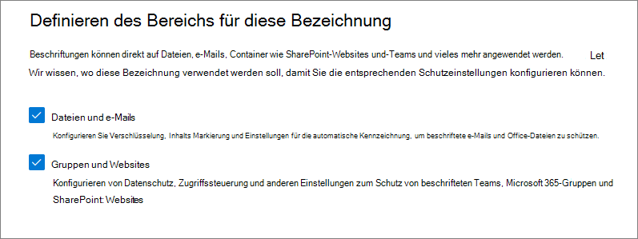
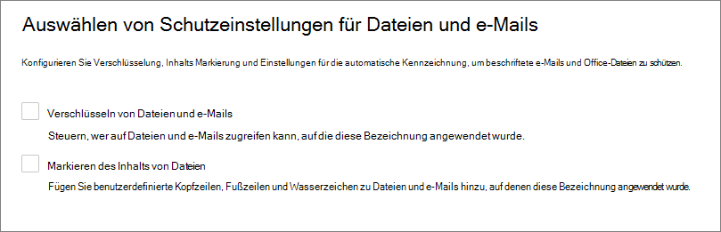
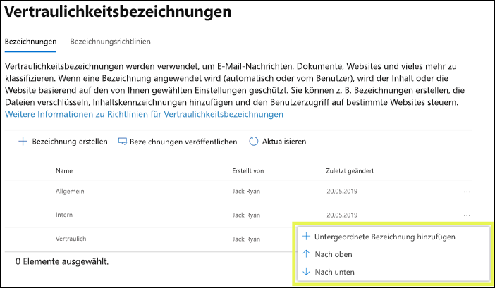
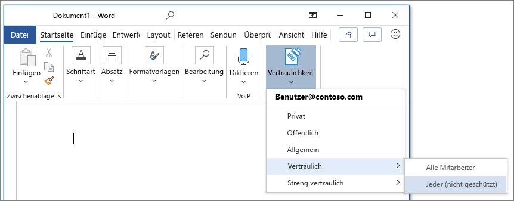
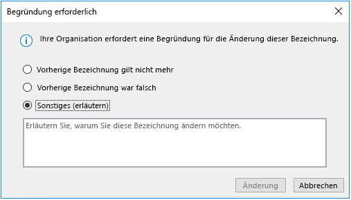
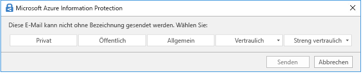

# Informationen zu Vertraulichkeitsbezeichnungen

>*[Microsoft 365-Lizenzierungsleitfaden für Sicherheit und Compliance](/office365/servicedescriptions/microsoft-365-service-descriptions/microsoft-365-tenantlevel-services-licensing-guidance/microsoft-365-security-compliance-licensing-guidance).*

> [!NOTE]
> Wenn Sie nach Informationen zu Vertraulichkeitsbezeichnungen suchen, die in Ihren Office-Anwendungen angezeigt werden, lesen Sie den Abschnitt [Vertraulichkeitsbezeichnungen auf Dateien und E-Mails in Office anwenden](https://support.microsoft.com/topic/apply-sensitivity-labels-to-your-files-and-email-in-office-2f96e7cd-d5a4-403b-8bd7-4cc636bae0f9).
>
> Die Informationen auf dieser Seite richten sich an IT-Administratoren, die diese Bezeichnungen erstellen und konfigurieren können.

Im Rahmen ihrer Arbeit müssen Personen in Ihrer Organisation mit anderen Personen innerhalb und außerhalb der Organisation zusammenarbeiten. Dies bedeutet, dass Inhalte nicht mehr durch eine Firewall geschützt sind – sie können zwischen verschiedenen Geräten, Apps und Diensten hin- und herbewegt werden. Dies soll auf sichere und geschützte Weise geschehen, die den geschäftlichen Anforderungen und Compliancerichtlinien Ihrer Organisation entspricht.

Mit Vertraulichkeitsbezeichnungen aus der Microsoft Information Protection-Lösung können Sie die Daten Ihrer Organisation klassifizieren und schützen und gleichzeitig sicherstellen, dass Produktivität und Zusammenarbeit der Benutzer nicht beeinträchtigt werden.

Hier ein Beispiel zur Anzeige verfügbarer Vertraulichkeitsbezeichnungen aus der Registerkarte **Start** im Menüband von Excel. In diesem Beispiel wird die angewendete Bezeichnung in der Statusleiste angezeigt:

Um Vertraulichkeitsbezeichnungen anwenden zu können müssen die Benutzer mit ihrem Microsoft 365-Geschäfts-, -Schul- oder -Unikonto angemeldet sein.

> [!NOTE]
> Für Mandanten der US-Regierung werden jetzt Vertraulichkeitsbezeichnungen für alle Plattformen unterstützt:
> - Für GCC- und GCC High-Umgebungen: Versionshinweise für [Office für Windows](/officeupdates/current-channel#version-2101-january-26) und [Office für Mac](/officeupdates/release-notes-office-for-mac#feature-updates-2)
> - Für DoD-Umgebungen: Versionshinweise für [Office für Windows](/officeupdates/current-channel#version-2103-march-30)
>
> Wenn Sie den Azure Information Protection-Client und -Scanner mit einheitlichen Bezeichnungen für diese Umgebungen verwenden, lesen Sie [Azure Information Protection Premium – Dienstbeschreibung für Behörden](/enterprise-mobility-security/solutions/ems-aip-premium-govt-service-description).

Sie können Vertraulichkeitsbezeichnungen zu Folgendem verwenden:
  
- **Bieten Sie Schutzeinstellungen, die Verschlüsselung und Inhaltsmarkierungen umfassen.** Z. B. können die Benutzer eine Vertraulichkeitsbezeichnung auf ein Dokument oder eine E-Mail anwenden, und durch diese Bezeichnung kann der Inhalt verschlüsselt und ein Vertraulichkeitswasserzeichen angewendet werden. Zu den Inhaltsmarkierungen gehören Kopf- und Fußzeilen sowie Wasserzeichen, und die Verschlüsselung kann auch einschränken, welche Aktionen autorisierte Personen an den Inhalten vornehmen können.

- **Schützen von Inhalten in Office-Apps auf verschiedenen Plattformen und Geräten.** Unterstützt von Word, Excel, PowerPoint und Outlook in den Office-Desktop-Anwendungen und Office im Web. Unterstützt auf Windows, MacOS, iOS, und Android.

- **Schützen von Inhalten in Drittanbieter-Apps und -Diensten** mithilfe von Microsoft Cloud App Security. Mit Cloud App Security (CAS) können Sie Inhalte in Drittanbieter-Apps und -Diensten wie z. B. SalesForce, Box oder DropBox erkennen, klassifizieren, beschriften und schützen, auch wenn die Drittanbieter-App oder der Dienst Vertraulichkeitsbezeichnungen nicht liest oder unterstützt.

- **Schützen von Containern**, die Teams, Microsoft 365-Gruppen und SharePoint-Seiten enthalten. Legen Sie beispielsweise Einstellungen für den Datenschutz, externen Benutzerzugriff und externe Freigabe und den Zugriff von nicht verwalteten Geräten aus fest.

- **Erweitern Sie Vertraulichkeitsbezeichnung auf Power BI**: Wenn Sie diese Funktion aktivieren, können Sie Kennzeichnungen in Power BI anwenden und anzeigen und Daten schützen, wenn sie außerhalb des Dienstes gespeichert werden.

- **Erweitern von Vertraulichkeitsbezeichnungen auf Ressourcen in Azure Purview**: Mit dieser Funktion (die sich aktuell noch in der Vorschau befindet) können Sie Ihre Vertraulichkeitsbezeichnungen auf Ressourcen wie SQL-Spalten, Dateien in Azure Blob Storage und mehr anwenden. 

- **Erweitern von Vertraulichkeitsbezeichnungen auf Drittanbieter-Apps und -Dienste**. Mit dem Microsoft Information Protection SDK können Drittanbieter-Apps Vertraulichkeitsbezeichnungen lesen und Schutzeinstellungen anwenden.

- **Klassifizieren von Inhalten ohne Verwendung von Schutzeinstellungen.** Sie können auch einfach eine Bezeichnung als Ergebnis der Klassifizierung des Inhalts zuweisen. Auf diese Weise erhalten die Benutzer eine visuelle Zuordnung der Klassifizierung zu den Bezeichnungen Ihrer Organisation. Sie können die Bezeichnungen verwenden, um Nutzungsberichte zu erstellen und Aktivitätsdaten für Ihre vertrauliche Inhalte anzuzeigen. Anhand dieser Informationen können Sie jederzeit auswählen, dass später Schutzeinstellungen angewendet werden.

In all diesen Fällen können Vertraulichkeitsbezeichnungen in Microsoft 365 Ihnen dabei helfen, die richtigen Maßnahmen für die entsprechenden Inhalte zu treffen. Mit Vertraulichkeitsbezeichnungen können Sie Daten organisationsweit klassifizieren und Schutzeinstellungen basierend auf dieser Klassifizierung durchsetzen.

Weitere Informationen zu diesen und anderen Szenarien, die von Vertraulichkeitsbezeichnungen unterstützt werden, finden Sie unter [Allgemeine Szenarien für Vertraulichkeitsbezeichnungen](get-started-with-sensitivity-labels.md#common-scenarios-for-sensitivity-labels). Es werden ständig neue Funktionen entwickelt, die Vertraulichkeitsbezeichnungen unterstützen. Daher kann es nützlich sein, die [Roadmap von Microsoft 365](https://aka.ms/MIPC/Roadmap) zu Rate zu ziehen.

## Bedeutung von Vertraulichkeitsbezeichnungen

Wenn Sie einem Dokument oder einer E-Mail eine Vertraulichkeitsbezeichnung zuweisen, gleicht dies einem auf den Inhalt angebrachten Stempel wie z. B.:

- **Anpassbar.** Speziell für Ihr Unternehmen und Ihre geschäftlichen Anforderungen können Sie Kategorien für verschiedene Ebenen von vertraulichen Inhalten in Ihrem Unternehmen erstellen. Sie können z. B. mit Bezeichnungen wie „Privat“, „Öffentlich“, „Allgemein“, „Vertraulich“ und „Hochgradig vertraulich“ beginnen.

- **Klartext.** Da die Bezeichnung in den Metadaten des Inhalts als Klartext gespeichert ist, können Apps und Dienste von Drittanbietern ihn lesen und dann bei Bedarf ihre eigenen Schutzaktionen anwenden.

- **Persistent.** Da die Beschriftung in den Metadaten für Dateien und E-Mails gespeichert wird, wandert die Beschriftung mit dem Inhalt mit, unabhängig davon, wo dieser gespeichert oder abgelegt wird. Die eindeutige Kennzeichnung wird zur Grundlage für die Anwendung und Durchsetzung der von Ihnen konfigurierten Richtlinien.

Für die Benutzer erscheint ein Vertraulichkeitsbezeichnung wie ein Tag auf den von ihnen verwendeten Apps und kann einfach in ihre bestehenden Arbeitsabläufe integriert werden.

Auf jedes Element, das Vertraulichkeitsbezeichnungen unterstützt, kann eine Vertraulichkeitsbezeichnung angewendet werden. Auf Dokumente und E-Mails kann sowohl eine Vertraulichkeitsbezeichnung als auch eine [Aufbewahrungsbezeichnung](retention.md#retention-labels) angewendet werden.

> [!div class="mx-imgBorder"]
> 

## Wirkung von Vertraulichkeitsbezeichnungen

Nachdem eine Vertraulichkeitsbezeichnung auf eine E-Mail oder ein Dokument angewendet wurde, werden alle konfigurierten Schutzeinstellungen für diese Bezeichnung auf den Inhalt erzwungen. Sie können eine Vertraulichkeitsbezeichnung konfigurieren, um:

- E-Mails und Dokumente **zu verschlüsseln**, um den Zugriff Unbefugter auf diese Daten zu verhindern. Sie können zusätzlich auswählen, welche Benutzer oder Gruppen über Berechtigungen zum Ausführen welcher Aktionen verfügen, und wie lange diese Berechtigungen gültig sind. Sie können z. B. festlegen, dass alle Benutzer in Ihrer Organisation ein Dokument ändern dürfen, während eine bestimmte Gruppe in einer anderen Organisation das Dokument nur ansehen kann. Alternativ können Sie, statt Berechtigungen durch einen Administrator zu definieren, Ihren Benutzern das Zuweisen von Berechtigungen für den Inhalt erlauben, wenn sie die Bezeichnung anwenden. 
    
    Weitere Informationen zu den Einstellungen für die **Verschlüsselungs** beim Erstellen oder Bearbeiten einer Vertraulichkeitsbezeichnung finden Sie unter [Einschränken des Zugriffs auf Inhalte mithilfe der Verschlüsselung in Vertraulichkeitsbezeichnungen](encryption-sensitivity-labels.md).

- **Markieren Sie die Inhalte** beim Verwenden von Office Apps durch Hinzufügen von Wasserzeichen, Kopf- oder Fußzeilen zu E-Mails oder Dokumenten, denen die Bezeichnung zugewiesen wurde. Wasserzeichen können nur auf Dokumente, nicht aber auf E-Mails angewendet werden. Beispielkopfzeile und Wasserzeichen:
    
    
    
    Müssen Sie überprüfen, wann Inhaltsmarkierungen angebracht werden? Siehe [Wenn Office-Apps Markierungen und Verschlüsselungen auf Inhalte anwenden](sensitivity-labels-office-apps.md#when-office-apps-apply-content-marking-and-encryption).
    
    Einige, aber nicht alle Apps unterstützen dynamische Markierungen mithilfe von Variablen. Fügen Sie z. B. den Bezeichnungsnamen oder den Dokumentnamen in die Kopf- oder Fußzeile oder das Wasserzeichen ein. Weitere Informationen finden Sie unter [Dynamische Markierungen mit Variablen](sensitivity-labels-office-apps.md#dynamic-markings-with-variables).
    
    Zeichenfolgenlängen: Wasserzeichen sind auf 255 Zeichen beschränkt. Kopf-und Fußzeilen sind (mit Ausnahme von Excel) auf 1024 Zeichen beschränkt. Bei Excel liegt der Höchstwert bei 255 Zeichen für Kopf-und Fußzeilen, aber in dieser Beschränkung sind nicht sichtbare Zeichen, wie z. B. Formatierungscodes, enthalten. Wenn dieser Wert erreicht ist, wird die eingegebene Zeichenfolge in Excel nicht angezeigt.

- **Schützen von Inhalten in Containern, z. B. Websites und Gruppen**, wenn Sie die Funktion aktivieren um [Vertraulichkeitsbezeichnungen für Microsoft Teams, Microsoft 365-Gruppen und SharePoint-Websites (Public Preview) zu verwenden](sensitivity-labels-teams-groups-sites.md).
    
    Sie können Schutzeinstellungen für Gruppen und Seiten erst konfigurieren, wenn Sie diese Funktion aktiviert haben. Diese Bezeichnungskonfiguration führt nicht dazu, dass Dokumente oder E-Mails automatisch mit Bezeichnungen versehen werden. Stattdessen werden die Inhalte geschützt, indem die Bezeichnungseinstellungen den Zugriff auf den Container steuern, in dem Inhalte gespeichert sind. Zu diesen Einstellungen gehören Einstellungen für den Datenschutz, externen Benutzerzugriff und externe Freigabe und den Zugriff von nicht verwalteten Geräten aus.

- **Bezeichnung automatisch auf Dateien und E-Mails anwenden oder eine Bezeichnung empfehlen.** Wählen Sie aus, wie vertrauliche Informationen identifiziert werden sollen, die Sie beschriftet haben wollen. Die Bezeichnung kann automatisch angewendet werden, oder Sie können die Benutzer auffordern, die von Ihnen empfohlene Bezeichnung anzuwenden. Wenn Sie eine Bezeichnung empfehlen, zeigt die Eingabeaufforderung einen von Ihnen ausgewählten Text an. Zum Beispiel:
    
    
    
    Weitere Informationen zu den Einstellungen für die **automatische Anwendung von Bezeichnungen für Dateien und E-Mails** beim Erstellen oder Bearbeiten einer Vertraulichkeitsbezeichnung finden Sie unter [Automatisches Anwenden einer Vertraulichkeitsbezeichnung auf Inhalte](apply-sensitivity-label-automatically.md) für Office-Apps und [Automatisches Bezeichnen Ihrer Daten in Azure Purview](/azure/purview/create-sensitivity-label).

### Bezeichnungsbereiche

Bei der Erstellung einer Vertraulichkeitsbezeichnung werden Sie gebeten, den Bereich dieser Bezeichnung zu konfigurieren. Dadurch werden zwei Dinge festgelegt:
- Welche Bezeichnungseinstellungen Sie für diese Bezeichnung konfigurieren können
- Wo die Bezeichnung für andere Benutzer sichtbar ist

Mit dieser Bereichskonfiguration können Sie Vertraulichkeitsbezeichnungen erstellen, die nur für Dokumente und E-Mails gelten, und nicht für Container ausgewählt werden können. Außerdem Vertraulichkeitsbezeichnungen, die nur für Container gelten, und nicht für Dokumente und E-Mails ausgewählt werden können. Neu können Sie jetzt (aktuell noch in der Vorschau) auch den Bereich für Azure Purview-Ressourcen auswählen_

Standardmäßig ist der Bereich **Dateien und E-Mails** immer ausgewählt. Die weiteren Bereiche werden standardmäßig ausgewählt, wenn die Features für Ihren Mandanten aktiviert sind:

- **Gruppen und Websites**: [Aktivieren von Vertraulichkeitsbezeichnungen für Container und Synchronisieren von Bezeichnungen](sensitivity-labels-teams-groups-sites.md#how-to-enable-sensitivity-labels-for-containers-and-synchronize-labels)

- **Azure Purview-Ressourcen (Vorschau)**: [Automatische Beschriftung Ihrer Inhalte in Azure Purview](/azure/purview/create-sensitivity-label)

Wenn Sie die Standardeinstellungen so ändern, dass nicht alle Bereiche ausgewählt sind, sehen Sie die erste Seite der Konfigurationseinstellungen für nicht ausgewählte Bereiche, können aber die Einstellungen nicht konfigurieren. Wenn beispielsweise der Bereich für Dateien und E-Mails nicht ausgewählt ist, können Sie die Optionen auf der nächsten Seite nicht auswählen:

Wählen Sie für diese Seiten mit nicht verfügbaren Optionen **Weiter** aus, um fortzufahren. Sie können aber auch **Zurück** auswählen, um den Bereich der Beschriftung zu ändern.

### Priorität der Bezeichnungen (Reihenfolge wesentlich)

Wenn Sie Ihre Vertraulichkeitsbezeichnungen in Ihrem Admin Center erstellen, werden sie in einer Liste auf der Registerkarte **Vertraulichkeit** auf der Seite **Bezeichnungen** angezeigt. In dieser Liste ist die Reihenfolge der Beschriftungen wichtig, da diese ihre Priorität widerspiegelt. Die restriktivste Vertraulichkeitsbezeichnung, z. B. Streng vertraulich, soll **am Ende** der Liste angezeigt werden, die am wenigsten restriktivste Vertraulichkeitsbezeichnung, z. B. Öffentlich, soll **am Anfang** der Liste angezeigt werden.

Sie können nur eine Vertraulichkeitsbezeichnung auf ein Element wie ein Dokument, eine E-Mail oder einen Container anwenden. Wenn Sie eine Option festlegen, die bestimmt, dass Benutzer eine Begründung für die Änderung der Bezeichnung zu einer niedrigeren Klassifizierung angeben müssen, werden in der Reihung dieser Liste die niedrigeren Klassifizierungen angegeben. Diese Option gilt jedoch nicht für Unterbezeichnungen.

Die Reihenfolge der Unterbezeichnungen wird allerdings mit [automatischen Bezeichnungen](apply-sensitivity-label-automatically.md) verwendet. Wenn Sie Bezeichnungen so konfigurieren, dass Sie automatisch oder als Empfehlung angewendet werden, können daraus mehrere Übereinstimmungen für mehrere Bezeichnungen resultieren. Anhand der Bezeichnungsreihenfolge wird die Bezeichnung ermittelt, die angewendet oder empfohlen werden soll: Die letzte vertrauliche Bezeichnung wird ausgewählt, und dann, falls zutreffend, die letzte Unterbezeichnung.

### Unterbezeichnungen (Gruppierungsbezeichnungen)

Mit Unterbezeichnungen können Sie eine oder mehrere Bezeichnungen unterhalb einer übergeordneten Bezeichnung gruppieren, die ein Benutzer in einer Office App sieht. Möglicherweise verwendet Ihre Organisation unter Vertraulich mehrere verschiedene Bezeichnungen für bestimmte Typen dieser Klassifizierung. In diesem Beispiel ist die übergeordnete Bezeichnung "Vertraulich" einfach eine Textbezeichnung ohne Schutzeinstellungen, und da sie Unterbezeichnungen hat, kann sie nicht auf Inhalte angewendet werden. Stattdessen müssen Benutzer "Vertraulich" wählen, um die Unterbezeichnungen anzuzeigen, und können dann eine Unterbezeichnung wählen, die sie auf den Inhalt anwenden möchten.

Unterbezeichnungen sind einfach eine Möglichkeit, Benutzern Bezeichnungen in logischen Gruppen zu bereitzustellen. Unterbezeichnungen erben keine Einstellungen von ihrer übergeordneten Bezeichnung. Wenn Sie eine Unterbezeichnung für einen Benutzer veröffentlichen, kann dieser Benutzer diese Unterbezeichnung auf den Inhalt anwenden, aber er kann nicht nur die übergeordnete Bezeichnung anwenden.

Wählen Sie keine übergeordnete Bezeichnung als Standardbezeichnung aus, und konfigurieren Sie keine übergeordnete Bezeichnung so, dass Sie automatisch angewendet (oder empfohlen) wird. Wenn Sie dies tun, wird die übergeordnete Bezeichnung nämlich nicht auf den Inhalt angewendet.

Beispiel für die Anzeige von Unterbeschriftungen für Benutzer:

### Bearbeiten oder Löschen einer Vertraulichkeitsbezeichnung

Wenn Sie eine Vertraulichkeitsbezeichnung aus Ihrem Admin Center löschen, wird die Bezeichnung nicht automatisch vom Inhalt entfernt und alle Schutzeinstellungen für den Inhalt werden weiterhin erzwungen.

Wenn Sie eine Vertraulichkeitsbezeichnung bearbeiten, wird die Version der Bezeichnung, die auf Inhalte angewendet wurde, für diese Inhalte erzwungen.

## Wirkung von Bezeichnungsrichtlinien

Nachdem Sie Ihre Vertraulichkeitsbezeichnungen erstellt haben, müssen Sie sie veröffentlichen, um sie Personen und Diensten in Ihrer Organisation zur Verfügung zu stellen. Die Vertraulichkeitsbezeichnungen können dann auf Office-Dokumente und E-Mails sowie weitere Elemente angewendet werden, für die Vertraulichkeitsbezeichnungen unterstützt werden. 

Im Gegensatz zu Aufbewahrungsbezeichnungen, die an Speicherorten wie allen Exchange-Postfächern veröffentlicht werden, werden Vertraulichkeitsbezeichnungen für Benutzer oder Gruppen veröffentlicht. Apps, für die Vertraulichkeitsbezeichnungen unterstützt werden, können sie diesen Benutzern und Gruppen als angewandte Bezeichnungen anzeigen, oder als Bezeichnungen, die angewandt werden können.

Wenn Sie eine Kennzeichnungsrichtlinie konfigurieren, können Sie:

- **Entscheiden, welchen Benutzern und Gruppen die Bezeichnungen angezeigt werden.** Die Bezeichnungen können für jeden spezifischen Benutzer oder jede E-Mail-fähige Sicherheits-, Verteiler- oder Microsoft 365-Gruppe (die eine [dynamische Mitgliedschaft](/azure/active-directory/users-groups-roles/groups-create-rule) in Azure AD haben kann) veröffentlicht werden.

- **Geben Sie eine Standardbezeichnung an** für neue Dokumente, unbeschriftete E-Mails und neue Container (wenn Sie [Vertraulichkeitsbezeichnungen für Microsoft Teams, Microsoft 365-Gruppen und SharePoint-Websites aktiviert haben](sensitivity-labels-teams-groups-sites.md)). Sie können für alle drei Arten von Elementen dieselbe Bezeichnung oder unterschiedliche Bezeichnungen angeben. Wenn Sie eine Standardbezeichnung für Dokumente angeben, wendet der vereinheitlichte Azure Information Protection-Client diese Bezeichnung auch auf vorhandene Dokumente ohne Bezeichnung an. Ein Benutzer kann die Standardbezeichnung immer ändern, wenn sie für sein Dokument oder seine E-Mail nicht die richtige Bezeichnung ist.
    
    Sie haben die Möglichkeit, eine als Basisniveau Standardbezeichnung von Schutzeinstellungen festzulegen, die auf alle Ihre Inhalte angewendet werden sollen. Ohne Benutzerschulungen und andere Steuerelemente kann diese Einstellung aber auch zu ungenauen Bezeichnungen führen. Normalerweise empfiehlt es sich nicht, eine Bezeichnung auszuwählen, die Verschlüsselung als Standardbezeichnung für Dokumente anwendet. So müssen z.B. viele Organisationen Dokumente an externe Benutzer freigeben, die möglicherweise nicht über Apps verfügen, welche die Verschlüsselung unterstützen, oder die möglicherweise kein Konto verwenden, das autorisiert werden kann. Weitere Informationen zu diesem Szenario finden Sie unter [gemeinsame Nutzung verschlüsselter Dokumente mit externen Benutzern](sensitivity-labels-office-apps.md#sharing-encrypted-documents-with-external-users).

- **Begründung für das Ändern einer Bezeichnung anfordern.** Sie können festlegen, dass ein Benutzer, der versucht, eine Bezeichnung zu entfernen oder durch eine Bezeichnung mit einer niedrigeren Ordnungszahl zu ersetzen, eine Begründung für diese Aktion angeben muss. Beispiel: Ein Benutzer öffnet ein Dokument mit der Bezeichnung "Vertraulich" (Ordnungszahl 3) und ersetzt diese Bezeichnung durch die Bezeichnung "Öffentlich" (Ordnungszahl 1). Administratoren können die Begründung zusammen mit der Änderung der Bezeichnung im [Aktivitäts-Explorer](data-classification-activity-explorer.md) lesen.

    

- **Fordern Sie die Benutzer auf, eine Bezeichnung anzuwenden** für Dokumente und E-Mails, nur für Dokumente und für Container. Diese Optionen werden auch obligatorische Bezeichnung genannt, und stellen sicher, dass eine Bezeichnung angewendet werden muss, bevor Benutzer Dokumente speichern, E-Mails senden oder neue Gruppen und Sites erstellen können.
    
    Die Bezeichnung kann vom Benutzer manuell, und zwar automatisch als Ergebnis einer von Ihnen konfigurierten Bedingung, oder standardmäßig zugewiesen werden (die oben beschriebene Option der Standardbezeichnung). Eine Beispielaufforderung, die in Outlook angezeigt wird, wenn ein Benutzer eine Bezeichnung zuweisen muss:

    
    
    > [!NOTE]
    > Obligatorische Bezeichnungen für Dokumente und E-Mails sind nicht für alle Anwendungen und Plattformen verfügbar. Weitere Informationen finden Sie unter [Von Benutzern fordern, dass sie eine Bezeichnung auf ihre E-Mails und Dokumente anwenden](sensitivity-labels-office-apps.md#require-users-to-apply-a-label-to-their-email-and-documents).
    
    Bei Containern muss beim Erstellen der Gruppe oder Site eine Bezeichnung zugewiesen werden.
    
    Erwägen Sie die Verwendung dieser Option, um dafür zu sorgen, dass Bezeichnungen in höherem Maß verwendet werden. Ohne Benutzerschulungen können diese Einstellungen jedoch zu ungenauen Bezeichnungen führen. Außerdem kann die obligatorische Kennzeichnung, sofern Sie keine entsprechende Standardbezeichnung festlegen, dazu führen, dass Ihre Benutzer mit den häufig auftretenden Eingabeaufforderungen frustriert sind.

- **Link zu einer benutzerdefinierten Hilfeseite bereitstellen.** Wenn Ihre Benutzer nicht genau wissen, was Vertraulichkeitsbezeichnungen bedeuten oder wie sie verwendet werden sollten, können Sie eine URL zu weiteren Informationen angeben, die unten im Menü der **Vertraulichkeitsbezeichnungen** in den Office-Apps angezeigt wird:

    

Nachdem Sie eine Bezeichnungsrichtlinie erstellt haben, die Benutzern und Gruppen neue Vertraulichkeitsbezeichnungen zuweist, sehen die Benutzer diese Bezeichnungen in ihren Office-Apps. Erlauben Sie bis zu 24 Stunden, bis die neuesten Änderungen in Ihrer gesamten Organisation repliziert wurden.

Es gibt keine Beschränkung für die Anzahl der Vertraulichkeitsbezeichnungen, die Sie erstellen und veröffentlichen können, mit einer Ausnahme: Wird bei der Bezeichnung Verschlüsselung angewendet, die Benutzer und Berechtigungen festlegt, werden mit dieser Konfiguration maximal 500 Bezeichnungen unterstützt. Allerdings gilt als bewährte Methode, um den Verwaltungsaufwand für die Administratoren und die Komplexität für die Benutzer zu verringern, die Anzahl der Bezeichnungen möglichst gering zu halten. Praxisnahe Bereitstellungen haben sich als weit weniger effektiv erwiesen, wenn Benutzer mehr als fünf Hauptbezeichnungen oder mehr als fünf Unterbezeichnungen pro Hauptbezeichnung zuordnen.

### Priorität der Bezeichnungsrichtlinien (Reihenfolge wesentlich)

Sie können Benutzern die Vertraulichkeitsbezeichnungen zur Verfügung stellen, indem Sie sie in einer Richtlinie zur Vertraulichkeitsbezeichnung veröffentlichen, die in einer Liste auf der Registerkarte **Vertraulichkeitsrichtlinien** auf der Seite **Bezeichnungsrichtlinien** angezeigt wird. Wie bei den Vertraulichkeitsbezeichnungen (siehe [Priorität der Bezeichnungen (Reihenfolge wesentlich)](#label-priority-order-matters)) ist auch die Reihenfolge der Richtlinien zur Vertraulichkeitskennzeichnung wichtig, da sie deren Priorität widerspiegelt. Die Bezeichnungsrichtlinie mit der niedrigsten Priorität wird **am Anfang** und jene mit der höchsten Priorität **am Ende** angezeigt.

Eine Bezeichnungsrichtlinie besteht aus:

- Einer Gruppe von Beschriftungen.
- Die Benutzer und Gruppen, denen die Richtlinien über die Bezeichnungen zugewiesen wird.
- Der Bereich der Richtlinie und die Richtlinieneinstellungen für diesen Bereich (wie eine Standardbezeichnung für Dateien und E-Mails).

Sie können einen Benutzer in mehrere Bezeichnungsrichtlinien einschließen, und der Benutzer erhält sämtliche Vertraulichkeitsbezeichnungen und Einstellungen aus diesen Richtlinien. Wenn es einen Konflikt bei Einstellungen aus mehreren Richtlinien gibt, werden die Einstellungen aus der Richtlinie mit der höchsten Priorität (niedrigste Position) angewendet. Mit anderen Worten: Die höchste Priorität hat für jede Einstellung Vorrang.

Wenn Ihnen die für einen Benutzer oder eine Gruppe erwartete Bezeichnungs oder Bezeichnungsrichtlinieneinstellung nicht angezeigt wird, überprüfen Sie die Reihenfolge der Vertraulichkeitsbezeichnungsrichtlinien. Möglicherweise müssen Sie die Richtlinie nach unten verschieben. Wenn Sie die Bezeichnungsrichtlinien neu anordnen möchten, wählen Sie eine Vertraulichkeits-Bezeichnungsrichtlinie aus > wählen Sie die drei Punkte auf der rechten Seite aus > bewegen Sie sie nach **unten** oder **oben**.

> [!NOTE]
> Zur Erinnerung: Wenn es bei einem Benutzer, der mehrere Richtlinien zugewiesen hat, einen Einstellungskonflikt gibt, wird die Einstellung aus der Richtlinie mit der höchsten Priorität (niedrigste Position) angewendet.

## Vertraulichkeitsbezeichnungen und Azure Information Protection

Wenn Sie Vertraulichkeitsbezeichnungen in Microsoft 365 Apps auf Windows-Computern verwenden, können Sie auswählen, ob Sie die in den Office-Apps integrierten Bezeichnungen oder den Azure Information Protection-Client verwenden wollen.

Die integrierte Bezeichnung wird in diesen Apps standardmäßig deaktiviert, wenn der Azure Information Protection-Client installiert ist. Weitere Informationen, einschließlich der Möglichkeit, dieses Standardverhalten zu ändern, finden Sie unter [Integrierter Bezeichnungs-Client und der Azure Information Protection-Client](sensitivity-labels-office-apps.md#office-built-in-labeling-client-and-the-azure-information-protection-client).

Auch wenn Sie integrierte Bezeichnungen in Office-Apps verwenden, können Sie außerdem den Azure Information Protection-Client mit einheitlichen Bezeichnungen mit Vertraulichkeitsbezeichnungen für Folgendes verwenden:

- Suchen und Erkennen sensibler Informationen, die lokal gespeichert sind, und (optional) Bezeichnen dieser Inhalte

- Rechtsklickoptionen im Datei-Explorer, mit denen Benutzer Bezeichnungen auf alle Dateitypen anwenden können

- Viewer zum Anzeigen von verschlüsselten Dateien für Text, Bilder oder PDF-Dokumente

- PowerShell-Modul zum Auffinden vertraulicher Informationen in lokalen Dateien sowie Anwenden oder Entfernen von Bezeichnungen und Verschlüsselung für diese Dateien

Wenn Sie noch nicht mit Azure Information Protection vertraut sind, oder wenn Sie ein vorhandener Azure Information Protection-Kunde sind und gerade Ihre Bezeichnungen migriert haben, finden Sie weitere Informationen unter [Auswählen des Bezeichnungsclients, der für Windows-Computer verwendet werden soll](/azure/information-protection/rms-client/use-client#choose-your-windows-labeling-solution) in der Dokumentation über Azure Information Protection.

### Azure Information Protection-Bezeichnungen

> [!NOTE]
> Die Unterstützung der Verwaltung von Azure Information Protection-Bezeichnungen im Azure-Portal wurde am **31. März 2021** eingestellt. Weitere Informationen finden Sie in der offiziellen [Benachrichtigung über die Einstellung](https://techcommunity.microsoft.com/t5/azure-information-protection/announcing-timelines-for-sunsetting-label-management-in-the/ba-p/1226179).

Wenn sich Ihr Mandant noch nicht auf der [einheitlichen Bezeichnungsplattform](/azure/information-protection/faqs#how-can-i-determine-if-my-tenant-is-on-the-unified-labeling-platform) befindet, müssen Sie zuerst „einheitliche Bezeichnungen“ aktivieren, bevor Sie Vertraulichkeitsbezeichnungen verwenden können. Anleitungen dazu finden Sie unter [So migrieren Sie Azure Information Protection-Bezeichnungen zu einheitlichen Vertraulichkeitsbezeichnungen](/azure/information-protection/configure-policy-migrate-labels). 

## Vertraulichkeitsbezeichnungen und der Microsoft Information Protection SDK

Da eine Vertraulichkeitsbezeichnung in den Metadaten eines Dokuments gespeichert wird, können Apps und Dienste von Drittanbietern diese Bezeichnungsmetadaten lesen und in diese schreiben, um die Bereitstellung Ihrer Bezeichnungen zu ergänzen. Darüber hinaus können Softwareentwickler das [Microsoft Information Protection SDK](/information-protection/develop/overview#microsoft-information-protection-sdk) verwenden, um die Bezeichnungs- und Verschlüsselungsfunktionen auf mehreren Plattformen vollständig zu unterstützen. Weitere Informationen hierzu finden Sie in der [Ankündigung der allgemeinen Verfügbarkeit im Blog der Tech-Community](https://techcommunity.microsoft.com/t5/Microsoft-Information-Protection/Microsoft-Information-Protection-SDK-Now-Generally-Available/ba-p/263144). 

Außerdem erfahren Sie mehr über [Partnerlösungen, die in Microsoft Information Protection integriert sind](https://techcommunity.microsoft.com/t5/Azure-Information-Protection/Microsoft-Information-Protection-showcases-integrated-partner/ba-p/262657).

## Bereitstellungsleitfaden

Informationen zur Bereitstellungsplanung und -anleitung, sowie Hinweise zu Lizenzinformationen, Berechtigungen und Bereitstellungsstrategien sowie eine Liste mit Ressourcen für unterstützte Szenarien und Endbenutzerdokumentation erhalten Sie unter [Erste Schritte mit Vertraulichkeitsbezeichnungen](get-started-with-sensitivity-labels.md).

Um zu erfahren, wie Vertraulichkeitsbezeichnungen verwendet werden, um Datenschutzbestimmungen einzuhalten, lesen Sie: [Bereitstellen des Informationsschutzes für Datenschutzbestimmungen mit Microsoft 365](../solutions/information-protection-deploy.md)  (aka.ms/m365dataprivacy).