# Übersicht über VertraulichkeitsbezeichnungenOverview of sensitivity labels

Im Rahmen ihrer Arbeit müssen Personen in Ihrer Organisation mit anderen Personen innerhalb und außerhalb der Organisation zusammenarbeiten. Dies bedeutet, dass Inhalte nicht mehr durch eine Firewall geschützt sind – sie können zwischen verschiedenen Geräten, Apps und Diensten hin- und herbewegt werden. Dies soll auf sichere und geschützte Weise geschehen, die den geschäftlichen Anforderungen und Compliancerichtlinien Ihrer Organisation entspricht.To get their work done, people in your organization collaborate with others both inside and outside the organization. This means that content no longer stays behind a firewall — it roams everywhere, across devices, apps, and services. And when it roams, you want it to do so in a secure, protected way that meets your organization’s business and compliance policies.

Mithilfe von Vertraulichkeitsbezeichnungen können Sie Ihre vertraulichen Inhalte klassifizieren und schützen, ohne dass die Produktivität Ihrer Mitarbeiter und deren Fähigkeit zur Zusammenarbeit behindert wird.With sensitivity labels, you can classify and help protect your sensitive content, without hindering your people’s productivity and ability to collaborate.

Beispiel für die Anzeige von Vertraulichkeitsbezeichnungen:Example showing sensitivity labels:

Vertraulichkeitsbezeichnungen werden ausschließlich für Mandanten in der globalen (öffentlichen) Cloud unterstützt.Sensitivity labels are only supported for tenants in the global (public) cloud. Vertraulichkeitsbezeichnungen werden derzeit nicht für Mandanten in anderen Clouds (z. B. [nationalen Clouds](https://docs.microsoft.com/azure/active-directory/develop/authentication-national-cloud)) unterstützt.Sensitivity labels aren't supported for tenants in other clouds such as [national clouds](https://docs.microsoft.com/azure/active-directory/develop/authentication-national-cloud).

Um Vertraulichkeitsbezeichnungen anwenden zu können müssen die Benutzer mit ihrem Geschäfts-, Schul- oder Unikonto bei Office angemeldet sein.To apply sensitivity labels, users must be signed in to Office with their work or school account.

Sie können Vertraulichkeitsbezeichnungen zu Folgendem verwenden:You can use sensitivity labels to:
  
- **Erzwingen von Schutzeinstellungen wie Verschlüsselung oder Wasserzeichen für bezeichnete Inhalte.** Z. B. können die Benutzer eine Vertraulichkeitsbezeichnung auf ein Dokument oder eine E-Mail anwenden, und durch diese Bezeichnung kann der Inhalt verschlüsselt und ein Vertraulichkeitswasserzeichen angewendet werden.**Enforce protection settings such as encryption or watermarks on labeled content.** For example, your users can apply a Confidential label to a document or email, and that label can encrypt the content and apply a Confidential watermark.

- **Schützen von Inhalten in Office-Apps auf verschiedenen Plattformen und Geräten.****Protect content in Office apps across different platforms and devices.** Eine Liste der unterstützten Apps finden Sie unter [Vertraulichkeitsbezeichnungen in Office-Apps](sensitivity-labels-office-apps.md).For a list of supported apps, see [Sensitivity labels in Office apps](sensitivity-labels-office-apps.md).

- **Verhindern, dass vertrauliche Inhalte Ihre Organisation auf Geräten unter Windows verlassen**, mithilfe von Microsoft Intune Endpoint Protection. Nachdem eine Vertraulichkeitsbezeichnung auf Inhalte auf einem Windows-Gerät angewendet wurde, kann Endpoint Protection verhindern, dass diese Inhalte in eine Drittanbieter-App, z. B. Twitter oder Gmail, oder auf Wechselmedien, z. B. ein USB-Laufwerk, kopiert werden.**Prevent sensitive content from leaving your organization on devices running Windows**, by using endpoint protection in Microsoft Intune. After a sensitivity label has been applied to content that resides on a Windows device, endpoint protection can prevent that content from being copied to a third-party app, such as Twitter or Gmail, or being copied to removable storage, such as a USB drive.

- **Schützen Sie Inhalte in Drittanbieter-Apps und -Diensten** mithilfe von Microsoft Cloud App Security.**Protect content in third-party apps and services**, by using Microsoft Cloud App Security. Mit Cloud App Security (CAS) können Sie Inhalte in Drittanbieter-Apps und -Diensten wie z. B. SalesForce, Box oder DropBox erkennen, klassifizieren, beschriften und schützen, auch wenn die Drittanbieter-App oder der Dienst Vertraulichkeitsbezeichnungen nicht liest oder unterstützt.With Cloud App Security, you can detect, classify, label, and protect content in third-party apps and services, such as SalesForce, Box, or DropBox, even if the third-party app or service does not read or support sensitivity labels.

- **Erweitern von Vertraulichkeitsbezeichnungen auf Drittanbieter-Apps und -Dienste.** Mit dem Microsoft Information Protection SDK können Drittanbieter-Apps auf [diesen Plattformen](https://docs.microsoft.com/information-protection/develop/overview#microsoft-information-protection-sdk) Vertraulichkeitsbezeichnungen lesen und Schutzeinstellungen anwenden.**Extend sensitivity labels to third-party apps and services.** With the Microsoft Information Protection SDK, third-party apps on [these platforms](https://docs.microsoft.com/information-protection/develop/overview#microsoft-information-protection-sdk) can read sensitivity labels and apply protection settings.

- **Klassifizieren von Inhalten ohne Verwendung von Schutzeinstellungen.****Classify content without using any protection settings.** Sie können auch einfach eine Klassifizierung für Inhalte (z. B. einen Aufkleber) zuweisen, die erhalten bleibt und mit wandert, wenn die Inhalte verwendet und freigegeben werden.You can also simply assign a classification to content (like a sticker) that persists and roams with the content as it's used and shared. Sie können diese Klassifizierung verwenden, um Nutzungsberichte zu generieren und Aktivitätsdaten für Ihre vertraulichen Inhalte anzuzeigen.You can use this classification to generate usage reports and see activity data for your sensitive content. Anhand dieser Informationen können Sie jederzeit auswählen, dass später Schutzeinstellungen angewendet werden.Based on this information, you can always choose to apply protection settings later.

In allen diesen Fällen können Ihnen Vertraulichkeitsbezeichnungen in Office 365 dabei helfen, die richtigen Aktionen an den richtigen Inhalten auszuführen.In all of these cases, retention labels can help you take the right actions on the right content. Mit Vertraulichkeitsbezeichnungen können Sie Daten organisationsweit klassifizieren und Schutzeinstellungen auf der Grundlage dieser Klassifizierung erzwingen.With sensitivity labels, you can classify data across your organization and enforce protection settings based on that classification.
  
Sie erstellen Vertraulichkeitsbezeichnungen im Microsoft 365 Compliance Center, Microsoft 365 Security Center oder Office 365 Security & Compliance Center unter **Klassifizierung** > **Vertraulichkeitsbezeichnungen**.You create sensitivity labels in the Microsoft 365 compliance center, Microsoft 365 security center, or Office 365 Security & Compliance Center under **Classification** > **Sensitivity labels**. Diese Vertraulichkeitsbezeichnungen können von Azure Information Protection, Office-Apps und Office 365-Diensten verwendet werden.These sensitivity labels can be used by Azure Information Protection, Office apps, and Office 365 services.

Azure Information Protection-Kunden können Ihre Azure Information Protection-Bezeichnungen in den anderen Admin Centern verwenden, damit Ihre Bezeichnungen mit dem Azure-Portal synchronisiert werden, falls Sie eine zusätzliche oder erweiterte Konfiguration ausgewählt haben.For Azure Information Protection customers, you can use your Azure Information Protection labels in the other admin centers, and your labels will be synced with the Azure portal in case you choose to perform additional or advanced configuration. **Azure Information Protection-Bezeichnungen und Office 365-Vertraulichkeitsbezeichnungen sind miteinander vollständig kompatibel.****Azure Information Protection labels and Office 365 sensitivity labels are fully compatible with each other.** Dies bedeutet z. B., wenn Sie Inhalte mit Azure Information Protection gekennzeichnet haben, müssen Sie Ihre Inhalte nicht klassifizieren oder neu bezeichnen.This means, for example, if you have content labeled by Azure Information Protection, you won’t need to reclassify or relabel your content.

## Bedeutung von VertraulichkeitsbezeichnungenWhat a sensitivity label is

Wenn Sie einem Dokument oder einer E-Mail eine Vertraulichkeitsbezeichnung zuweisen, hat diese ähnliche Eigenschaften wie ein Tag:When you assign a sensitivity label to a document or email, it’s simply like a tag that is:

- **Anpassbar.** Sie können Kategorien für unterschiedliche Stufen vertraulicher Inhalte in Ihrer Organisation erstellen, z. B. Privat, Öffentlich, Allgemein, Vertraulich und Streng vertraulich.**Customizable.** You can create categories for different levels of sensitive content in your organization, such as Personal, Public, General, Confidential, and Highly Confidential.

- **Klartext.****Clear text.** Da die Bezeichnung in den Metadaten des Inhalts als Klartext gespeichert ist, können Apps und Dienste von Drittanbietern ihn lesen und dann bei Bedarf ihre eigenen Schutzaktionen anwenden.Because the label is stored in clear text in the content's metadata, third-party apps and services can read it and then apply their own protective actions, if required.

- **Persistent.****Persistent.** Nachdem eine Vertraulichkeitsbezeichnung auf einen Inhalt angewendet wurde, bleibt diese Bezeichnung in den Metadaten der entsprechenden E-Mail oder des betreffenden Dokuments erhalten.Persistent. After you apply a sensitivity label to content, the label persists in the metadata of that email or document. This means the label roams with the content, including the protection settings, and becomes the basis for applying and enforcing policies. Dies bedeutet, dass die Bezeichnung mit dem Inhalt, einschließlich der Schutzeinstellungen, hin- und herbewegt werden, und diese Daten werden zur Basis für das Anwenden und Erzwingen von Richtlinien.Persistent. After a sensitivity label is applied to content, it persists in the metadata of that email or document. This means the label roams with the content, including the protection settings, and becomes the basis for applying and enforcing policies.

In Office-Apps wird eine Vertraulichkeitsbezeichnung einfach als Tag für eine E-Mail oder ein Dokument angezeigt.In the Office apps, a sensitivity label simply appears as a tag on an email or document.

Jedem Inhaltselement kann eine Vertraulichkeitsbezeichnung zugewiesen werden. Auf ein Element kann sowohl eine einzelne Vertraulichkeitsbezeichnung als auch eine einzelne [Aufbewahrungsbezeichnung](labels.md) angewendet werden.Each item of content can have a single sensitivity label applied to it. An item can have both a single sensitivity label and a single [retention label](labels.md) applied to it.

## Wirkung von VertraulichkeitsbezeichnungenWhat sensitivity labels can do

Zusätzlich zu E-Mails und Dokumenten stehen Vertraulichkeitsbezeichnungen in mehreren öffentlichen Vorschauversionen zur Verfügung.In addition to email and documents, sensitivity labels are available in multiple public preview releases. Weitere Informationen dazu, wie Vertraulichkeitsbezeichnungen für Dateien, Teams, Gruppen und Websites verwendet werden können, finden Sie in den folgenden Artikeln:For more information on what sensitivity labels can do for files, teams, groups, and sites, see these articles:

- [Aktivieren von Vertraulichkeitsbezeichnungen für Office-Dateien in SharePoint und OneDrive (öffentliche Vorschau)Enable sensitivity labels for Office files in SharePoint and OneDrive (public preview)](sensitivity-labels-sharepoint-onedrive-files.md)

- [Verwenden von Vertraulichkeitsbezeichnungen für Microsoft Teams, Office 365-Gruppen und SharePoint-Websites (öffentliche Vorschau)Use sensitivity labels with Microsoft Teams, Office 365 groups, and SharePoint sites (public preview)](sensitivity-labels-teams-groups-sites.md)

Nachdem eine Vertraulichkeitsbezeichnung auf eine E-Mail oder ein Dokument angewendet wurde, werden alle konfigurierten Schutzeinstellungen für diese Bezeichnung auf den Inhalt erzwungen.After a sensitivity label is applied to an email or document, the protection settings for that label are enforced on the content. With a sensitivity label, you can: Mit einer Vertraulichkeits Kennzeichnung können Sie folgende Aktionen auslösen:With a sensitivity label, you can:

- **Verschlüsseln** Sie nur E-Mails oder E-Mails und Dokumente.**Encrypt** email only or both email and documents. Sie können auswählen, welche Benutzer oder Gruppen über Berechtigungen zum Ausführen welcher Aktionen verfügen, und wie lange diese Berechtigungen gültig sind.You can choose which users or group have permissions to perform which actions and for how long. Sie können z. B. festlegen, dass Benutzer in einer bestimmten Domäne außerhalb Ihrer Organisation nach der Festlegung der Bezeichnung für den Inhalt nur sieben Tage lang berechtigt sind, den Inhalt zu überprüfen.For example, you can choose to allow users in a specific domain outside your organization to have permissions to review the content for only 7 days after the content is labeled. Alternativ können Sie, statt Berechtigungen selbst zuzuweisen, Ihren Benutzern das Zuweisen von Berechtigungen für den Inhalt erlauben, wenn sie die Bezeichnung anwenden.Alternatively, instead of assigning permissions yourself, you can allow your users to assign permissions to the content when they apply the label. Weitere Informationen finden Sie unter [Einschränken des Zugriffs auf Inhalte mithilfe der Verschlüsselung in Vertraulichkeitsbezeichnungen](encryption-sensitivity-labels.md).For more information, see [Restrict access to content by using encryption in sensitivity labels](encryption-sensitivity-labels.md).

- **Markieren Sie die Inhalte** durch Hinzufügen von benutzerdefinierten Wasserzeichen, Kopf- oder Fußzeilen zu E-Mails oder Dokumenten, denen die Bezeichnung zugewiesen wurde.**Mark the content** by adding custom watermarks, headers, or footers to email or documents that have the label applied. Wasserzeichen werden nur auf Dokumente und nicht auf E-Mails angewendet und sind auf 255 Zeichen beschränkt.You only apply watermarks to documents, not email, and they're limited to 255 characters. Kopf- und Fußzeilen sind darüber hinaus auf 1024 Zeichen beschränkt (mit Ausnahme von Excel, wo sie auf 255 oder weniger Zeichen beschränkt sind, abhängig davon, ob das Dokument andere Kopf- oder Fußzeilen enthält, sowie von anderen Faktoren).Also, headers and footers are limited to 1024 characters (except in Excel, where they're limited to 255 characters or fewer, depending on whether the document contains other headers or footers and other factors.)

    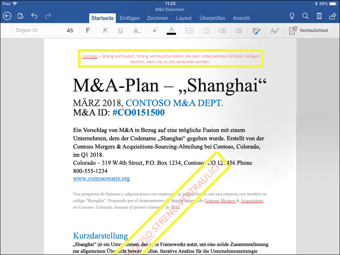

- **Verhindern Sie Datenverlust** durch Aktivieren des Endpunktschutzes in Intune.**Prevent data loss** by turning on endpoint protection in Intune. Wenn vertrauliche Inhalte heruntergeladen werden, können Sie den Verlust von Daten von Windows-Geräten verhindern.If sensitive content gets downloaded, you can help prevent the loss of data from Windows devices. So können beispielsweise mit Bezeichnungen versehene Inhalte nicht in Dropbox, Gmail oder auf ein USB-Laufwerk kopiert werden.For example, you can’t copy labeled content into Dropbox, Gmail, or a USB drive. Bevor Ihre Vertraulichkeitsbezeichnungen Windows Information Protection (WIP) nutzen können, müssen Sie zuerst eine App-Schutzrichtlinie im Azure-Portal erstellen.Before your sensitivity labels can use Windows Information Protection (WIP), you first need to create an app protection policy in the Azure portal. Weitere Informationen hierzu finden Sie unter [Wie Windows Information Protection Dateien mit einer Vertraulichkeitsbezeichnung schützt](https://docs.microsoft.com/windows/security/information-protection/windows-information-protection/how-wip-works-with-labels?branch=vsts17546553).For more information, see [How Windows Information Protection protects files with a sensitivity label](https://docs.microsoft.com/windows/security/information-protection/windows-information-protection/how-wip-works-with-labels?branch=vsts17546553).

- \*\*Automatisches Anwenden der Bezeichnung auf Inhalte anwenden, die vertrauliche Informationen enthalten. \*\* Sie können festlegen, für welchen Typ vertraulicher Informationen die Bezeichnung angewendet werden soll. Die Bezeichnung kann entweder automatisch angewendet werden oder Benutzer werden aufgefordert, die empfohlene Bezeichnung anzuwenden. Wenn Sie eine Bezeichnung empfehlen, wird in der Aufforderung der entsprechende Text angezeigt. Weitere Informationen finden Sie unter [Automatisches Anwenden einer Vertraulichkeitsbezeichnung auf Inhalte](apply-sensitivity-label-automatically.md).**Apply the label automatically to content that contains sensitive information.** You can choose what types of sensitive information that you want labeled, and the label can either be applied automatically, or you can prompt users to apply the label that you recommend. If you recommend a label, the prompt displays whatever text you choose. For more information, see [Apply a sensitivity label to content automatically](apply-sensitivity-label-automatically.md).

    

Alle diese Optionen sind verfügbar, wenn Sie eine Vertraulichkeitsbezeichnung erstellen:All of these options are available when you create a sensitivity label.

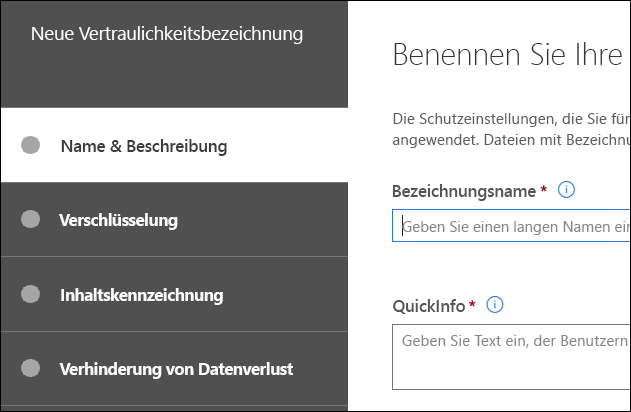

### Priorität der Bezeichnungen (Reihenfolge wesentlich)Label priority (order matters)

Wenn Sie Ihre Vertraulichkeitsbezeichnungen in Ihrem Admin Center erstellen, werden sie in einer Liste auf der Registerkarte **Vertraulichkeit** auf der Seite **Bezeichnungen** angezeigt.When you create your sensitivity labels, they appear in a list on the **Sensitivity** tab on the **Labels** page. In dieser Liste ist die Reihenfolge der Beschriftungen wichtig, da diese ihre Priorität widerspiegelt.In this list, the order of the labels is important because it reflects their priority. Die restriktivste Vertraulichkeitsbezeichnung, z. B. Streng vertraulich, soll **am Ende** der Liste angezeigt werden, die am wenigsten restriktivste Vertraulichkeitsbezeichnung, z. B. Öffentlich, soll **am Anfang** der Liste angezeigt werden.You want your most restrictive sensitivity label, such as Highly Confidential, to appear at the **bottom** of the list, and your least restrictive sensitivity label, such as Public, to appear at the **top**.

Sie können nur eine Vertraulichkeitsbezeichnung auf ein einzelnes Dokument oder eine E-Mail anwenden.You can only apply a single sensitivity label to a document or email. Wenn Sie festlegen, dass Benutzer eine Begründung für die Änderung der Bezeichnung zu einer niedrigeren Klassifizierung angeben müssen, werden in der Reihung dieser Liste die niedrigeren Klassifizierungen angegeben.If you require your users to provide a justification for changing the label to a lower classification, the order of this list identifies the lower classifications.

Die Priorität der Bezeichnungen gilt auch für Untertitel.Label priority also applies to sublabels.

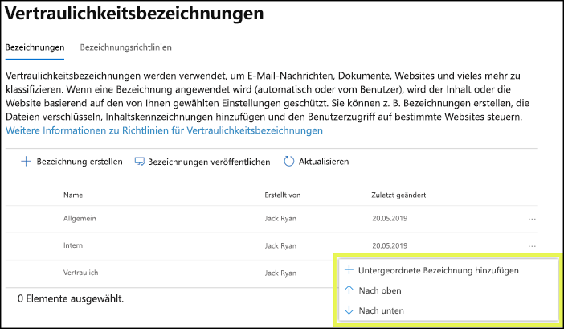

### Unterbezeichnungen (Gruppierungsbezeichnungen)Sublabels (grouping labels)

Mit Unterbezeichnungen können Sie ein oder mehrere Bezeichnungen unter einer übergeordneten Bezeichnung gruppieren, die ein Benutzer in einer Office-App sieht.With sublabels, you can group one or more labels below a parent label that a user sees in an Office app. Unter "Vertraulich" kann Ihr Unternehmen beispielsweise mehrere verschiedene Bezeichnungen für bestimmte Arten dieser Klassifizierung verwenden.For example, under Confidential, your organization might use several different labels for specific types of that classification. In diesem Beispiel ist die übergeordnete Bezeichnung "Vertraulich" einfach eine Textbezeichnung ohne Schutzeinstellungen, und da sie Unterbezeichnungen enthält, kann sie nicht auf Inhalt angewendet werden.In this example, the parent label Confidential is simply a text label with no protection settings, and because it has sublabels, it can’t be applied to content. Stattdessen müssen Benutzer "Vertraulich" auswählen, um die Unterbezeichnungen anzuzeigen, und können dann eine Unterbezeichnung auswählen, die auf Inhalt angewendet wird.Instead, users must choose Confidential to view the sublabels, and then they can choose a sublabel to apply to content.

Unterbezeichnungen sind einfach eine Möglichkeit, Benutzern Bezeichnungen in logischen Gruppen zu bereitzustellen.Sublabels are simply a way to present labels to users in logical groups. Unterbezeichnungen erben keine Einstellungen von ihrer übergeordneten Bezeichnung.Sublabels don’t inherit any settings from their parent label. Wenn Sie eine Unterbezeichnung für einen Benutzer veröffentlichen, kann dieser Benutzer diese Unterbezeichnung auf den Inhalt anwenden, aber er kann nicht nur die übergeordnete Bezeichnung anwenden.When you publish a sublabel for a user, that user can then apply that sublabel to content but can't apply just the parent label.

Übergeordnete Bezeichnungen sollten nicht als Standardbezeichnungen ausgewählt oder so konfiguriert werden, dass sie automatisch angewendet oder empfohlen werden, da eine übergeordnete Bezeichnung nicht auf Inhalte in Office-Apps angewendet wird, die den Azure Information Protection-Client mit einheitlichen Bezeichnungen verwenden.Don't choose a parent label as the default label (see next section), or configure a parent label to be auto-applied or recommended, because the parent label won't be applied to content in Office apps that use the Azure Information Protection unified labeling client.

Beispiel für die Anzeige von Unterbeschriftungen für Benutzer:Example of how sublabels display for users:

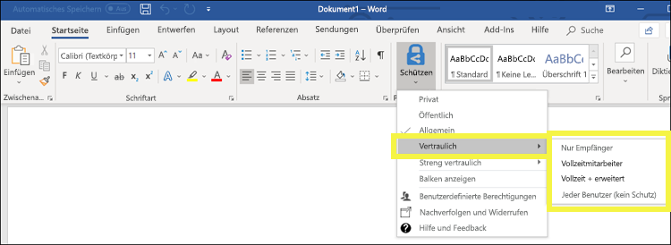

### Bearbeiten oder Löschen einer VertraulichkeitsbezeichnungEditing or deleting a sensitivity label

Beim Löschen einer Vertraulichkeitsbezeichnung wird diese nicht vom Inhalt entfernt und es werden alle Schutzeinstellungen weiterhin für den Inhalt erzwungen.If you delete a sensitivity label, the label is not removed from content, and any protection settings continue to be enforced on the content.

Wenn Sie eine Vertraulichkeitsbezeichnung bearbeiten, wird die Version der Bezeichnung, die auf Inhalte angewendet wurde, für diese Inhalte erzwungen.If you edit a sensitivity label, the version of the label that was applied to content is what’s enforced on that content.

## Wirkung von BezeichnungsrichtlinienWhat label policies can do

Nachdem Sie die Vertraulichkeitsbezeichnungen erstellt haben, müssen Sie sie veröffentlichen, um sie für Personen in Ihrer Organisation zur Anwendung auf Inhalte bereitzustellen. Im Gegensatz zu Aufbewahrungsbezeichnungen, die für Speicherorte, z. B. alle Exchange-Postfächer, veröffentlicht werden, werden Vertraulichkeitsbezeichnungen für Benutzer oder Gruppen veröffentlicht. Vertraulichkeitsbezeichnungen werden dann in Office-Apps für diese Benutzer und Gruppen angezeigt.After you create your sensitivity labels, you need to publish them, to make them available to people in your organization, who can then apply the labels to content. Unlike retention labels, which are published to locations, such as all Exchange mailboxes, sensitivity labels are published to users or groups. Sensitivity labels then appear in Office apps for those users and groups.

Mit einer Bezeichnungsrichtlinie können Sie Folgendes bewirken:With a label policy, you can:

- **Auswählen, welchen Benutzern und Gruppen die Bezeichnungen angezeigt werden.** Bezeichnungen können für E-Mail-aktivierte Sicherheitsgruppen, Verteilergruppen, Office 365-Gruppen oder dynamische Verteilergruppen veröffentlicht werden.**Choose which users and groups see the labels.** Labels can be published to any email-enabled security group, distribution group, Office 365 group, or dynamic distribution group.

- **Anwenden einer Standardbezeichnung** auf alle neuen Dokumente und E-Mails, die von den in der Bezeichnungsrichtlinie enthaltenen Benutzern und Gruppen erstellt werden. Durch diese Standardbezeichnung kann eine Basisstufe an Schutzeinstellungen festgelegt werden, die auf alle Ihre Inhalte angewendet werden soll.**Apply a default label** to all new documents and email created by the users and groups included in the label policy. This default label can set a base level of protection settings that you want applied to all your content.

- **Begründung für das Ändern einer Bezeichnung anfordern****Require a justification for changing a label.** Sie können festlegen, dass wenn Inhalte als vertraulich gekennzeichnet sind und ein Benutzer diese Bezeichnung entfernen oder durch eine niedrigere Klassifizierung (z. B. durch eine Bezeichnung als "öffentlich") ersetzen möchte, er eine Begründung für diese Aktion angeben muss.If content is marked Confidential and a user wants to remove that label or replace it with a lower classification, such as a label named Public, you can require that the user provide a justification when performing this action. Aktuell wird die Begründung nicht zur [Analyse der Bezeichnungen](label-analytics.md) an den Administrator gesendet.Currently, the justification reason isn't sent to [label analytics](label-analytics.md) for the admin to review. Allerdings sendet der [Azure Information Protection-Client für einheitliche Bezeichnungen](https://docs.microsoft.com/azure/information-protection/rms-client/aip-clientv2) diese Informationen an [Azure Information Protection-Analysen](https://docs.microsoft.com/azure/information-protection/reports-aip).However, the [Azure Information Protection unified labeling client](https://docs.microsoft.com/azure/information-protection/rms-client/aip-clientv2) sends this information to [Azure Information Protection analytics](https://docs.microsoft.com/azure/information-protection/reports-aip).

    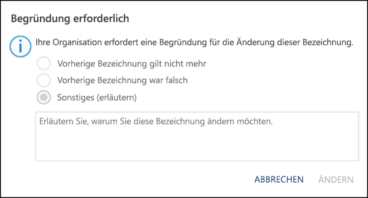

- \*\*Anfordern, dass Benutzer eine Bezeichnung auf E-Mails und Dokumente anwenden. \*\* Wenn Sie möchten, dass alle Inhalte des Benutzers mit Bezeichnungen versehen werden, können Sie festlegen, dass eine Bezeichnung auf alle gespeicherten Dokumente und gesendeten E-Mails angewendet werden muss. Die Bezeichnung kann durch den Benutzer manuell, automatisch als Ergebnis einer Bedingung oder standardmäßig zugewiesen werden (die beschriebene standardmäßige Bezeichnungsoption). Im Folgenden wird eine Eingabeaufforderung in Outlook angezeigt, wenn ein Benutzer eine Bezeichnung zuweisen muss.**Require users to apply a label to their email and documents.** If you want all of a user's content to be labeled, you can require that a label must be applied to all of their saved documents and sent emails. The label can be assigned manually by the user, automatically as a result of a condition, or be assigned by default (the default label option described above). Here's the prompt shown in Outlook when a user is required to assign a label.

    > [!NOTE]
    > Für die obligatorische Kennzeichnung ist ein Azure Information Protection-Abonnement erforderlich.Mandatory labeling requires an Azure Information Protection subscription. Um diese Funktion zu verwenden, müssen Sie entweder den [Azure Information Protection-Client](https://www.microsoft.com/download/details.aspx?id=53018) oder den höheren [Azure Information Protection-Client für einheitliche Bezeichnungen](https://docs.microsoft.com/azure/information-protection/rms-client/install-unifiedlabelingclient-app) herunterladen und installieren.To use this feature, you must download and install either the [Azure Information Protection client](https://www.microsoft.com/download/details.aspx?id=53018) or the later [Azure Information Protection unified labeling client](https://docs.microsoft.com/azure/information-protection/rms-client/install-unifiedlabelingclient-app). Darüber hinaus wird der Client nur unter Windows ausgeführt, sodass die Funktion derzeit nicht unter Mac, iOS und Android unterstützt wird.Also, the client runs only on Windows, so this feature is not yet supported on Mac, iOS, and Android.

    

- **Link zu einer benutzerdefinierten Hilfeseite bereitstellen****Provide help link to a custom help page.** Wenn Ihre Benutzer nicht genau wissen, was Vertraulichkeitsbezeichnungen bedeuten oder wie sie verwendet werden sollten, können Sie eine URL zu weiteren Informationen angeben, die unten im Menü der **Vertraulichkeitsbezeichnungen** in den Office-Apps angezeigt wird.If your users aren’t sure what your sensitivity labels mean or how they should be used, you can provide a Learn More URL that appears at the bottom of the **Sensitivity label** menu in the Office apps.

    

Nachdem Sie eine Bezeichnungsrichtlinie erstellt und Benutzern und Gruppen Vertraulichkeitsbezeichnungen zugewiesen haben, werden die Bezeichnungen diesen Personen innerhalb einer Stunde oder weniger in den Office-Apps angezeigt.After you create a label policy and assign sensitivity labels to users and groups, those people will see those labels available in the Office apps in an hour or less.

Es gibt keine Beschränkung für die Anzahl der Vertraulichkeitsbezeichnungen, die Sie erstellen und veröffentlichen können, mit einer Ausnahme: Wenn bei der die Bezeichnung Verschlüsselung angewendet wird, gibt es maximal 500 Bezeichnungen.There is no limit to the number of sensitivity labels that you can create and publish, with one exception: If the label applies encryption, there is a maximum of 500 labels. Allerdings gilt als bewährte Methode, um den Verwaltungsaufwand für die Administratoren und die Komplexität für die Benutzer zu verringern, die Anzahl der Bezeichnungen möglichst gering zu halten.However, as a best practice to minimize admin overheads and reduce complexity for your users, try to keep the number of labels to a minimum. Praxisnahe Bereitstellungen haben sich als weniger effektiv erwiesen, wenn Benutzer mehr als fünf Hauptbezeichnungen sowie mehr als fünf Unterbezeichnungen pro Hauptbezeichnung zuordnen.Real-word deployments have proved effectiveness to be reduced when users have more than five main labels and more than five sublabels per main label.

### Priorität der Bezeichnungsrichtlinien (Reihenfolge wesentlich)Label policy priority (order matters)

Sie können Benutzern die Vertraulichkeitsbezeichnungen zur Verfügung stellen, indem Sie sie in einer Richtlinie zur Vertraulichkeitsbezeichnung veröffentlichen, die in einer Liste auf der Registerkarte **Vertraulichkeitsrichtlinien** auf der Seite **Bezeichnungsrichtlinien** angezeigt wird.You make your sensitivity labels available to users by publishing them in a sensitivity label policy that appears in a list on the **Sensitivity policies** tab on the **Label policies** page. Wie bei den Vertraulichkeitsbezeichnungen (siehe [Priorität der Bezeichnungen (Reihenfolge wesentlich)](#label-priority-order-matters)) ist auch die Reihenfolge der Richtlinien zur Vertraulichkeitskennzeichnung wichtig, da sie deren Priorität widerspiegelt.Just like sensitivity labels (see [Label priority (order matters)](#label-priority-order-matters)), the order of the sensitivity label policies is important because it reflects their priority. Die Bezeichnungsrichtlinie mit der niedrigsten Priorität wird **am Anfang** und jene mit der höchsten Priorität **am Ende** angezeigt.The label policy with lowest priority is shown at the **top**, and the label policy with the highest priority is shown at the **bottom**.

Eine Bezeichnungsrichtlinie besteht aus:A label policy consists of:

- Einer Gruppe von Beschriftungen.A set of labels.
- Dem Bereich der Bezeichnungsrichtlinie, d. h. die Benutzer und Gruppen, die in der Richtlinie enthalten sind.The scope of the label policy, meaning the users and groups included in the policy.
- Die Einstellungen der oben beschriebenen Bezeichnungsrichtlinie (Standardbezeichnung, Ausrichtung, obligatorische Bezeichnung und Hilfe-Link).The settings of the label policy described above (default label, justification, mandatory label, and help link).

Sie können einen Benutzer in mehrere Bezeichnungsrichtlinien einschließen, und der Benutzer sieht sämtliche Vertraulichkeitsbezeichnungen aus diesen Richtlinien.You can include a user in multiple label policies, and the user will see all of the sensitivity labels from those policies. Ein Benutzer sieht jedoch nur die Richtlinieneinstellungen der Bezeichnungsrichtlinie mit der höchsten Priorität.However, a user will see the policy settings from only the label policy with the highest priority.

Wenn ein Benutzer oder eine Gruppe in Ihrer Organisation keine Option in der von Ihnen beabsichtigten Bezeichnungsrichtlinie sieht, z.B. eine Standard- oder obligatorische Bezeichnung, überprüfen Sie die Reihenfolge der Vertraulichkeits-Bezeichnungsrichtlinien.If a user or group in your organization is not seeing an option in the label policy that you intended, such as a default or mandatory label, check the order of the sensitivity label policies. Wenn Sie die Bezeichnungsrichtlinien neu anordnen möchten, wählen Sie eine Vertraulichkeits-Bezeichnungsrichtlinie aus > wählen Sie die drei Punkte auf der rechten Seite aus > bewegen Sie sie nach **unten** oder **oben**.To re-order the label policies, select a sensitivity label policy > choose the ellipsis on the right > **Move down** or **Move up**.

Prioritäten wirken sich zwar auf Vertraulichkeitsbezeichnungsrichtlinien aus, **nicht** jedoch auf Aufbewahrungsbezeichnungsrichtlinien.While priority matters for sensitivity label policies, it does **not** matter for retention label policies. Wie in [Grundsätze der Aufbewahrung oder was Vorrang hat](labels.md#the-principles-of-retention-or-what-takes-precedence) erklärt, können Inhalte mehreren Aufbewahrungsrichtlinien unterliegen.As explained in [The principles of retention, or what takes precedence?](labels.md#the-principles-of-retention-or-what-takes-precedence), content can be subject to multiple retention policies.

## Erste Schritte mit VertraulichkeitsbezeichnungenHow to get started with sensitivity labels

Die ersten Schritte mit Vertraulichkeitsbezeichnungen sind einfach:Getting started with sensitivity labels is a quick process:

1. **Definieren Sie die Bezeichnungen.****Define the labels.** Erstens: Sie möchten Ihre eigene Taxonomie zur Definition unterschiedlicher Vertraulichkeitsstufen von Inhalten erstellen.First, you want to establish your taxonomy for defining different sensitivity levels of content. Verwenden Sie allgemeine Namen oder Ausdrücke, die für Ihre Benutzer leicht verständlich sind.You should use common names or terms that make sense to your users. Sie können z. B. mit Bezeichnungen wie „Privat“, „Öffentlich“, „Allgemein“, „Vertraulich“ und „Hochgradig vertraulich“ beginnen.For example, you can start with labels such as Personal, Public, General, Confidential, and Highly Confidential. Sie können Unterbezeichnungen verwenden, um ähnliche Bezeichnungen nach Kategorien zu gruppieren.You can use sublabels to group similar labels by category. Außerdem ist beim Erstellen einer Bezeichnung eine QuickInfo erforderlich, die in den Office-Apps angezeigt wird, wenn ein Benutzer mit der Maus auf eine Bezeichnungs-Option im Menüband zeigt.Also, when you create a label, a tool tip is required, which appears in the Office apps when a user hovers over a label option on the Ribbon.

2. **Legen Sie fest, wozu jede einzelne Bezeichnung dient.****Define what each label can do.** Konfigurieren Sie danach die Schutzeinstellungen, die mit den einzelnen Bezeichnungen verknüpft werden sollen.Configure the protection settings you want associated with each label. Auf Inhalt mit niedriger Vertraulichkeit (z.B. die Bezeichnung „Allgemein“) wird beispielsweise nur eine Kopf- oder Fußzeile angewendet, während auf vertraulicheren Inhalt (z.B. die Bezeichnung „Vertraulich“) ein Wasserzeichen, Verschlüsselung und WIP angewendet werden, um dafür zu sorgen, dass nur privilegierte Benutzer darauf zugreifen können.Define what each label can do. Then, configure the protection settings you want associated with each label. For example, lower sensitivity content (a “General” label) might simply have a header or footer applied to it, while higher sensitivity content (a “Confidential” label) may have a watermark, encryption, and WIP applied to it, to help ensure that only privileged users can access it.

3. **Definieren Sie, wer die Bezeichnungen erhält.** Nachdem Sie die Bezeichnungen Ihrer Organisation definiert haben, veröffentlichen Sie sie in einer Bezeichnungsrichtlinie, die steuert, welche Benutzer und Gruppen diese Bezeichnungen anzeigen können. Eine einzelne Bezeichnung ist wieder verwendbar – Sie definieren sie einmal und können sie dann in mehreren, unterschiedlichen Benutzern zugewiesenen Bezeichnungsrichtlinien verwenden. Doch damit eine Bezeichnung Inhalten zugewiesen werden kann, müssen Sie die Bezeichnung zuerst veröffentlichen, sodass sie in Office-Apps und anderen Diensten verfügbar ist. Für den Anfang können Sie Ihre Vertraulichkeitsbezeichnungen testen, indem Sie sie nur einigen wenigen Personen zuweisen.**Define who gets the labels.** After you define your organization’s labels, you publish them in a label policy that controls which users and groups see those labels. A single label is reusable – you define it once, and then you can include it in several label policies assigned to different users. But in order for a label to be assigned to content, you must first publish that label so that it’s available in Office apps and other services. When just starting out, you can pilot your sensitivity labels by assigning them to just a few people.

Im Folgenden werden die grundlegenden Schritte des Administrators, des Benutzers und der Office-App bei der Erstellung von Vertraulichkeitsbezeichnungen beschrieben.Here’s the basic flow of what the admin, user, and Office app do to make sensitivity labels work.

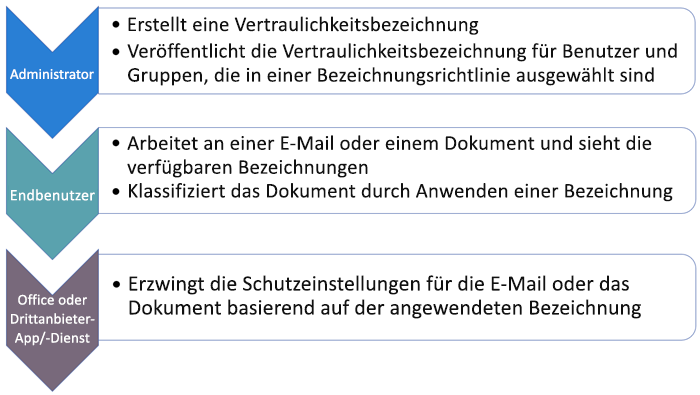

## Anzeige von VertraulichkeitsbezeichnungenWhere sensitivity labels can appear

Vertraulichkeitsbezeichnungen werden auf der Benutzeroberfläche von Office-Apps angezeigt.Sensitivity labels appear in the UI of Office apps. Verwenden Sie die folgenden Tabellen, um die aktuelle Verfügbarkeit von integrierten Bezeichnungen für bestimmte Apps und Plattformen anzuzeigen:To view the current availability for built-in labeling for specific apps and platforms, use the following tables:

- [Unterstützung der Funktion Vertraulichkeitsbezeichnungen in Word, Excel und PowerPointSupport for sensitivity label capabilities in Word, Excel, and PowerPoint](sensitivity-labels-office-apps.md#support-for-sensitivity-label-capabilities-in-word-excel-and-powerpoint)

- [Unterstützung der Funktion Vertraulichkeitsbezeichnungen in OutlookSupport for sensitivity label capabilities in Outlook](sensitivity-labels-office-apps.md#support-for-sensitivity-label-capabilities-in-outlook)

Wenn Sie den Assistenten für einheitliche Bezeichnungen von Azure Information Protection für Ihre Windows-Computer verwenden, stehen zusätzliche Funktionen für Vertraulichkeitsbezeichnungen zur Verfügung.If you use the Azure Information Protection unified labeling client for your Windows computers, additional features are available for sensitivity labels. Weitere Informationen finden Sie unter [Vergleichen der Bezeichnungs-Assistenten für Windows-Computer](https://docs.microsoft.com/azure/information-protection/rms-client/use-client#compare-the-labeling-clients-for-windows-computers).For more information, see [Compare the labeling clients for Windows computers](https://docs.microsoft.com/azure/information-protection/rms-client/use-client#compare-the-labeling-clients-for-windows-computers). 

### Office-Apps unter WindowsOffice apps on Windows

In Office-Apps auf Geräten unter Windows werden Vertraulichkeitsbezeichnungen auf der Schaltfläche **Vertraulichkeit** auf der Registerkarte **Start** im Menüband angezeigt.In Office apps on devices running Windows, sensitivity labels appear on the **Sensitivity** button, on the **Home** tab on the Ribbon. The label applied also appears in the Status bar at the bottom of the window. 

Wenn Sie die integrierte Bezeichnung verwenden, wird die angewendete Bezeichnung auch in der Statusleiste am unteren Rand des Fensters angezeigt:When you use built-in labeling, the label applied also appears in the Status bar at the bottom of the window:

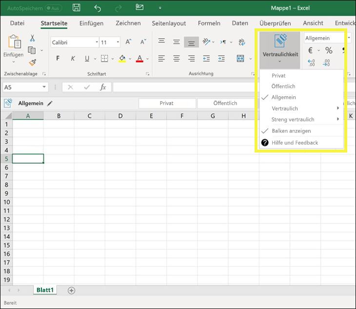

### Office-Apps im WebOffice apps on the web

Informationen zum Verwenden von Vertraulichkeitsbezeichnungen für Office-Apps im Web finden Sie unter [Anwenden von Vertraulichkeitsbezeichnungen auf Dokumente und E-Mails in Office – Web](https://support.office.com/article/2f96e7cd-d5a4-403b-8bd7-4cc636bae0f9).For information sensitivity labels with Office apps on the web, see [Apply sensitivity labels to your documents and email within Office - Web](https://support.office.com/article/2f96e7cd-d5a4-403b-8bd7-4cc636bae0f9).

### Office-Apps unter MacOffice apps on Mac

In Office-Apps auf Geräten unter Mac werden Vertraulichkeitsbezeichnungen auf der Schaltfläche **Vertraulichkeit** auf der Registerkarte **Start** im Menüband angezeigt.In Office apps on Mac devices, sensitivity labels appear on the **Sensitivity** button, on the **Home** tab on the Ribbon. The label applied also appears in the Status bar at the bottom of the window. Die angewendete Bezeichnung auch in der Statusleiste am unteren Rand des Fensters angezeigt:In Office apps on Android devices, sensitivity labels appear on the Sensitivity button, on the Home tab on the Ribbon. The label applied also appears in the Status bar at the bottom of the window.

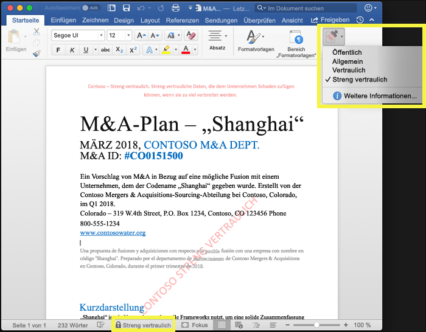

### Office-Apps unter iOSOffice apps on iOS

In Office-Apps auf Geräten unter iOS werden Vertraulichkeitsbezeichnungen auf der Schaltfläche **Vertraulichkeit** auf der Registerkarte **Start** im Menüband angezeigt.In Office apps on iOS devices, sensitivity labels appear on the **Sensitivity** button, on the **Home** tab on the Ribbon. The label applied also appears in the Status bar at the bottom of the window. Die angewendete Bezeichnung auch in der Statusleiste am unteren Rand des Fensters angezeigt:In Office apps on iOS devices, sensitivity labels appear on the Sensitivity button, on the Home tab on the Ribbon. The label applied also appears in the Status bar at the bottom of the window.

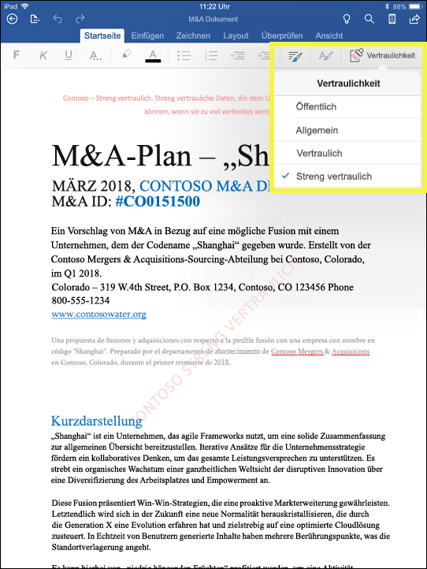

### Office-Apps unter AndroidOffice apps on Android

In Office-Apps auf Geräten unter Android werden Vertraulichkeitsbezeichnungen auf der Schaltfläche **Vertraulichkeit** auf der Registerkarte **Start** im Menüband angezeigt.In Office apps on Android devices, sensitivity labels appear on the **Sensitivity** button, on the **Home** tab on the Ribbon. The label applied also appears in the Status bar at the bottom of the window. Die angewendete Bezeichnung auch in der Statusleiste am unteren Rand des Fensters angezeigt:In Office apps on Android devices, sensitivity labels appear on the Sensitivity button, on the Home tab on the Ribbon. The label applied also appears in the Status bar at the bottom of the window.

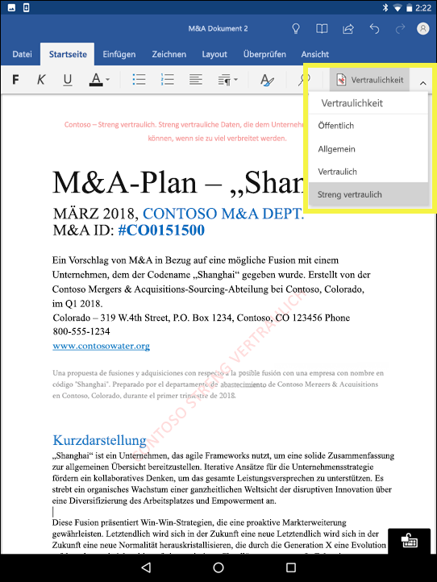

### Weitere Informationen zu Vertraulichkeitsbezeichnungen in Office-AppsMore information on sensitivity labels in Office apps

- [Anwenden von Vertraulichkeits-Beschriftungen auf Ihre Dokumente und E-Mails in OfficeApply sensitivity labels to your documents and email within Office](https://support.office.com/article/apply-sensitivity-labels-to-your-documents-and-email-within-office-2f96e7cd-d5a4-403b-8bd7-4cc636bae0f9)
- [Bekannte Probleme beim Anwenden von Vertraulichkeits-Beschriftungen auf Ihren Office-DateienKnown issues when you apply sensitivity labels to your Office files](https://support.office.com/article/known-issues-when-you-apply-sensitivity-labels-to-your-office-files-b169d687-2bbd-4e21-a440-7da1b2743edc)
- [Vertraulichkeitsbezeichnungen in Office-AppsSensitivity labels in Office apps](sensitivity-labels-office-apps.md)

## Funktionsweise von Vertraulichkeitsbezeichnungen zusammen mit vorhandenen Azure Information Protection-BezeichnungenHow sensitivity labels work with existing Azure Information Protection labels

Azure Information Protection-Benutzer können Inhalte unter Windows mithilfe des Assistenten für einheitliche Bezeichnungen von Azure Information Protection Azure klassifizieren und beschriften.Azure Information Protection users are currently able to classify and label content on Windows by using the Azure Information Protection unified labeling client. Existing Azure Information Protection labels work seamlessly with new sensitivity labels. This means you can: Bestehende Azure Information Protection-Bezeichnungen arbeiten nahtlos mit neuen Vertraulichkeitsbezeichnungen zusammen, die auch als einheitliche Bezeichnungen bekannt sind.Existing Azure Information Protection labels work seamlessly with new sensitivity labels, also known as unified labels. Dies bedeutet, dass Sie Folgendes tun können:This means you can only move forward.

- Ihre vorhandenen Azure Information Protection-Bezeichnungen für Dokumente und E-Mails beibehalten.Keep your existing Azure Information Protection labels on documents and email.
- Ihre vorhandene Azure Information Protection-Bezeichnungskonfiguration beibehalten.Keep your existing Azure Information Protection label configuration.

Wenn Sie Azure Information Protection-Bezeichnungen verwenden, weil Ihr Mandant noch nicht auf der [vereinheitlichten Bezeichnungs-Plattform](https://docs.microsoft.com/azure/information-protection/faqs#how-can-i-determine-if-my-tenant-is-on-the-unified-labeling-platform)ist, empfehlen wir, dass Sie das Erstellen neuer Bezeichnungen in anderen Admin Centern vermeiden, bis Sie die einheitliche Bezeichnungen aktiviert haben.If you are using Azure Information Protection labels because your tenant isn't yet on the [unified labeling platform](https://docs.microsoft.com/azure/information-protection/faqs#how-can-i-determine-if-my-tenant-is-on-the-unified-labeling-platform), we recommend that you avoid creating new labels in other admin centers until you activate unified labeling. Weitere Informationen zu diesem Vorgang finden Sie unter [Wie kann man Azure Information Protection-Bezeichnungen zu einheitlichen Vertraulichkeitsbezeichnungen migrieren](https://docs.microsoft.com/azure/information-protection/configure-policy-migrate-labels).For more information about this process, see [How to migrate Azure Information Protection labels to unified sensitivity labels](https://docs.microsoft.com/azure/information-protection/configure-policy-migrate-labels). 

> [!NOTE]
>  Die Unterstützung der Verwaltung von Bezeichnungen für Azure Information Protection-Bezeichnungen im Azure-Portal wird ab dem**31. März 2021**eingestellt.Label management for Azure Information Protection labels in the Azure portal is being deprecated **March 31, 2021**. Weitere Informationen finden Sie in der offiziellen [Benachrichtigung über die Einstellung](https://techcommunity.microsoft.com/t5/azure-information-protection/deprecation-notice-azure-information-protection-classic-client/ba-p/1092108).Learn more in the official [deprecation notice](https://techcommunity.microsoft.com/t5/azure-information-protection/deprecation-notice-azure-information-protection-classic-client/ba-p/1092108).

## Vertraulichkeitsbezeichnungen und der Azure Information Protection-ClientSensitivity labels and the Azure Information Protection client

Office 365 ProPlus-Apps deaktivieren die integrierte Bezeichnung für Vertraulichkeitsbezeichnungen in Office Windows-Apps automatisch, wenn der Azure Information Protection-Client installiert ist.Office 365 ProPlus apps automatically turn off built-in labeling for sensitivity labels in Office Windows apps if the Azure Information Protection client is installed.
Um dieses Standardverhalten so zu ändern, dass Sie die integrierte Bezeichnung verwenden können, siehe[Informationen zu den in Office integrierten Bezeichnungs-Assistenten](sensitivity-labels-office-apps.md#about-the-office-built-in-labeling-client).To change this default behavior so that you can use built-in labeling, see [About the Office built-in labeling client](sensitivity-labels-office-apps.md#about-the-office-built-in-labeling-client).

## Schützen von Inhalten auf Windows-Geräten mithilfe von Microsoft Intune Endpoint ProtectionProtect content on Windows devices by using endpoint protection in Microsoft Intune

Wenn Sie eine Vertraulichkeitsbezeichnung erstellen, haben Sie die Möglichkeit, Windows mitzuteilen, dass Dateien mit dieser Bezeichnung gegen Datenverlust geschützt werden müssen, wenn dieser Inhalt auf Windows-Geräten gespeichert ist.When you create a sensitivity label, you have the option to tell Windows that files with this label need to be protected against data leakage when this content is stored on Windows devices. Mithilfe dieser Option können Sie sicherstellen, dass Inhalte mit dieser Bezeichnung nur in genehmigte Speicherorte geteilt oder kopiert werden können, auch wenn Sie an einem Endpunkt gespeichert sind.This option can help ensure that content with this label can be shared or copied only to sanctioned locations, even when it’s stored on an endpoint. Im Wesentlichen wird durch das Aktivieren dieser Option für eine Vertraulichkeitsbezeichnung Windows mitgeteilt, dass dies besonders wichtige Daten sind, die zusätzliche Verwendungseinschränkungen erfordern.In essence, turning on this option for a sensitivity label tells Windows that this is extra critical data that warrants additional usage constraints.

Wenn Sie diese Option aktivieren, kann Windows Vertraulichkeitsbezeichnungen in Dokumenten lesen, verstehen, und behandeln sowie Windows Informationen Protection (WIP) automatisch auf Inhalte anwenden, unabhängig davon, wie sie auf ein verwaltetes Windows-Gerät gelangen. Dies trägt zum Schutz von mit Bezeichnungen versehenen Dateien vor unbeabsichtigtem Zugriff, mit oder ohne Verschlüsselung bei.When you turn on this option, Windows can read, understand, and act on sensitivity labels in documents and automatically apply Windows Information Protection (WIP) on content, no matter how it reaches a managed Windows device. This helps protect labeled files from accidental leakage, with or without applying encryption.

Windows kann z. B. erkennen, dass einem Word-Dokument auf dem Computer eines Benutzers die Bezeichnung „Vertraulich“ zugewiesen wurde, und WIP kann eine App-Schutzrichtlinie anwenden, um das Kopieren oder Freigeben der Daten von diesem Gerät an einen beliebigen Ort außerhalb des Netzwerks (z. B. ein persönliches OneDrive, persönliche E-Mail-Konten, soziale Medien oder USB-Laufwerke) zu verhindern.For example, Windows can understand that a Word document residing on a user’s machine has a Confidential label applied to it, and WIP can apply an app protection policy to prevent the copying or sharing of the data to any non-work location from that device (such as a personal OneDrive, personal email accounts, social media, or USB drives).

Wenn ein Benutzer versucht, mit Bezeichnungen versehene Inhalte in ein persönliches Gmail-Konto hochzuladen, wird die folgende Meldung angezeigt.If a user attempts to upload labeled content to a personal Gmail account, they see this message.

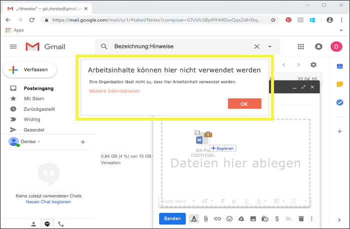

Und wenn ein Benutzer versucht, mit Bezeichnungen versehene Inhalte auf einem USB-Laufwerk zu speichern, wird die folgende Meldung angezeigt:And if a user attempts to save labeled content to a USB drive, they see this message.

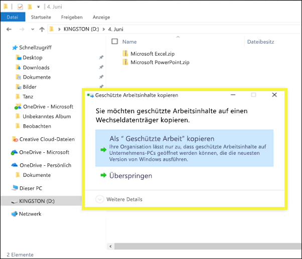

### Wichtige Voraussetzungen für die Nutzung von WIPImportant prerequisites for using WIP

Bevor die Vertraulichkeitsbezeichnungen WIP verwenden können, müssen Sie zuerst die hier beschriebenen Voraussetzungen erfüllen: [Wie Windows Information Protection Dateien mit einer Vertraulichkeitsbezeichnung schützt](https://docs.microsoft.com/windows/security/information-protection/windows-information-protection/how-wip-works-with-labels?branch=vsts17546553). In diesem Thema werden die folgenden Voraussetzungen beschrieben:Before your sensitivity labels can use WIP, you first need to do the prerequisites described here: [How Windows Information Protection protects files with a sensitivity label](https://docs.microsoft.com/windows/security/information-protection/windows-information-protection/how-wip-works-with-labels?branch=vsts17546553). This topic describes the following prerequisites:

- Stellen Sie sicher, dass Windows 10, Version 1809 oder höher, ausgeführt wird.Make sure you're running Windows 10, version 1809 or later.
- [Einrichten von Microsoft Defender Advanced Threat Protection (Microsoft Defender ATP)](https://docs.microsoft.com/windows/security/threat-protection/), das Inhalte für einer Bezeichnung scannt und den entsprechenden WIP-Schutz anwendet.[Set up Microsoft Defender Advanced Threat Protection (Microsoft Defender ATP)](https://docs.microsoft.com/windows/security/threat-protection/), which scans content for a label and applies the corresponding WIP protection. ATP führt einige Aktionen unabhängig von WIP aus, wie beispielsweise die Meldung von Anomalien.ATP performs some actions independently from WIP, such as reporting anomalies.
- Erstellen Sie eine WIP-Richtlinie (Windows Informationen Protection), die auf Endpunktgeräte angewendet wird:Create a Windows Information Protection (WIP) policy that applies to endpoint devices. You can do this in either of these locations:

  - [Erstellen einer WIP-Richtlinie (Windows Information Protection) mit MDM mithilfe des Azure-Portals für Microsoft IntuneCreate a Windows Information Protection (WIP) policy with MDM using the Azure portal for Microsoft Intune](https://docs.microsoft.com/windows/security/information-protection/windows-information-protection/create-wip-policy-using-intune-azure)
  - [Erstellen und Bereitstellen einer WIP-Richtlinie (Windows Information Protection) mit System Center Configuration ManagerCreate and deploy a Windows Information Protection (WIP) policy using System Center Configuration Manager](https://docs.microsoft.com/windows/security/information-protection/windows-information-protection/create-wip-policy-using-sccm)

## Schützen von Inhalten in Drittanbieter-Apps und -Diensten mithilfe von Microsoft Cloud App SecurityProtect content in third-party apps and services by using Microsoft Cloud App Security

Schützen von Inhalten in Drittanbieter-Apps und -Diensten mithilfe von Cloud App Security (CAS)Protect content in third-party apps and services by using Cloud App Security (CAS). Mit CAS können Sie Inhalte in Drittanbieter-Diensten und -Apps wie z. B. SalesForce, Box oder Dropbox erkennen, klassifizieren, mit Bezeichnungen versehen und schützen.With CAS, you can detect, classify, label, and protect content in third-party services and apps, such as SalesForce, Box, or Dropbox. Z. B. wird eine Vertraulichkeitsbezeichnung möglicherweise von Dropbox nicht verstanden, aber CAS kann mit Bezeichnungen versehene Inhalte auch an diesem Speicherort schützen.For example, Dropbox might not understand a sensitivity label, but CAS can reach out and protect labeled content in that location.

Weitere Informationen finden Sie unter [Automatisches Anwenden von Azure Information Protection-Klassifizierungsbezeichnungen](https://docs.microsoft.com/cloud-app-security/use-case-information-protection).For more information, see [Automatically apply Azure Information Protection classification labels](https://docs.microsoft.com/cloud-app-security/use-case-information-protection).

### Wichtige Voraussetzungen für die Nutzung von CASImportant prerequisites for using CAS

Damit Ihre Vertraulichkeitsbezeichnungen CAS verwenden können, müssen Sie zuerst die hier beschriebenen Voraussetzungen erfüllen: [Automatisches Anwenden von Azure Information Protection-Klassifizierungsbezeichnungen](https://docs.microsoft.com/cloud-app-security/use-case-information-protection).Before your sensitivity labels can use CAS, you first need to do the prerequisites described here: [Automatically apply Azure Information Protection classification labels](https://docs.microsoft.com/cloud-app-security/use-case-information-protection). In diesem Thema werden die folgenden Voraussetzungen beschrieben:This topic describes the following prerequisites:

- [Aktivieren Sie Cloud App Security und Azure Information Protection](https://docs.microsoft.com/cloud-app-security/azip-integration) für Ihren Mandanten.[Enable Cloud App Security and Azure Information Protection](https://docs.microsoft.com/cloud-app-security/azip-integration) for your tenant.
- [Verbinden Sie die App](https://docs.microsoft.com/cloud-app-security/enable-instant-visibility-protection-and-governance-actions-for-your-apps) mit Cloud App Security.[Connect the app](https://docs.microsoft.com/cloud-app-security/enable-instant-visibility-protection-and-governance-actions-for-your-apps) to Cloud App Security.

## Erweitern von Vertraulichkeitsbezeichnungen auf Drittanbieter-Apps und -Dienste mithilfe des Microsoft Information Protection SDKExtend sensitivity labels to third-party apps and services by using the Microsoft Information Protection SDK

Da eine Vertraulichkeitsbezeichnung als Klartext in den Metadaten des Dokuments gespeichert wird, können Drittanbieter-Apps und -Dienste die Identifizierung und den Schutz von Inhalten mit einer solchen Bezeichnung unterstützen. Die Unterstützung in anderen Apps und Diensten wird ständig erweitert.Because a sensitivity label is persisted as clear text in the metadata of a document, third-party apps and services can choose to support identifying and protecting content that contains such a label. Support in other apps and services is always expanding.

Mit dem [Microsoft Information Protection SDK](https://docs.microsoft.com/information-protection/develop/) können Apps und Dienste von Drittanbietern Vertraulichkeitsbezeichnungen lesen und anwenden sowie Schutz auf Dokumente anwenden.With the [Microsoft Information Protection SDK](https://docs.microsoft.com/information-protection/develop/), third-party apps and services can read and apply sensitivity labels and protection to documents. Das SDK unterstützt Apps auf [diesen Plattformen](https://docs.microsoft.com/information-protection/develop/overview#microsoft-information-protection-sdk).The SDK supports apps on [these platforms](https://docs.microsoft.com/information-protection/develop/overview#microsoft-information-protection-sdk).

Mithilfe des SDK können Sie Inhalte in einer Weise klassifizieren und schützen, die mit anderen Microsoft Information Protection-Apps und -Diensten wie Office-Apps, Office 365-Diensten, dem Azure Information Protection-Scanner, Microsoft Cloud App Security und anderen Partnerlösungen funktioniert. Hier finden Sie z. B. Informationen über die [Unterstützung für Vertraulichkeitsbezeichnungen in Adobe Acrobat](https://techcommunity.microsoft.com/t5/Azure-Information-Protection/Starting-October-use-Adobe-Acrobat-Reader-for-PDFs-protected-by/ba-p/262738).Using the SDK, you can label and protect content in a way that works with other Microsoft Information Protection apps and services, such as Office apps, Office 365 services, the Azure Information Protection scanner, Microsoft Cloud App Security, and several other partner solutions. For example, learn more about [support for sensitivity labels in Adobe Acrobat](https://techcommunity.microsoft.com/t5/Azure-Information-Protection/Starting-October-use-Adobe-Acrobat-Reader-for-PDFs-protected-by/ba-p/262738).

Weitere Informationen zum Microsoft Information Protection SDK finden Sie in der [Ankündigung im Tech Community-Blog](https://techcommunity.microsoft.com/t5/Microsoft-Information-Protection/Microsoft-Information-Protection-SDK-Now-Generally-Available/ba-p/263144). Sie finden auch Informationen zu [Partnerlösungen, die in Microsoft Information Protection integriert sind](https://techcommunity.microsoft.com/t5/Azure-Information-Protection/Microsoft-Information-Protection-showcases-integrated-partner/ba-p/262657).To learn more about the Microsoft Information Protection SDK, see the [announcement on the Tech Community blog](https://techcommunity.microsoft.com/t5/Microsoft-Information-Protection/Microsoft-Information-Protection-SDK-Now-Generally-Available/ba-p/263144). You can also learn about [partner solutions that are integrated with Microsoft Information Protection](https://techcommunity.microsoft.com/t5/Azure-Information-Protection/Microsoft-Information-Protection-showcases-integrated-partner/ba-p/262657).

## Für das Erstellen von Vertraulichkeitsbezeichnungen erforderliche BerechtigungenPermissions required to create sensitivity labels

Mitglieder Ihres Complianceteams, die Vertraulichkeitsbezeichnungen erstellen, benötigen Berechtigungen für das Microsoft 365 Compliance Center, das Microsoft 365 Security Center oder das Office 365 Security & Compliance Center.Members of your compliance team who will create sensitivity labels need permissions to the Microsoft 365 compliance center, Microsoft 365 security center, or Office 365 Security & Compliance Center. Standardmäßig hat Ihr Mandantenadministrator Zugriff auf diese Admin Center und kann Compliance Officer und anderen Personen Zugriff gewähren, ohne ihnen alle Berechtigungen eines Mandantenadministrators zu erteilen. Um diesen delegierten eingeschränkten Administratorzugriff zu erhalten, tun Sie Folgendes: Gehen Sie zur Seite **Berechtigungen** des jeweiligen Admin Centers und fügen Sie dann der Rollengruppe **Complianceadministrator** oder **Sicherheitsadministrator** Mitglieder hinzu.By default, your tenant admin has access to these admin centers and can give compliance officers and other people access, without giving them all of the permissions of a tenant admin. To do this, we recommend that you go to the **Permissions** page of one of these admin centers, and then add members to the **Compliance Administrator** or **Security Administrator** role group.

Weitere Informationen finden Sie unter [Gewähren des Zugriffs auf das Office 365 Security & Compliance Center](https://docs.microsoft.com/microsoft-365/security/office-365-security/grant-access-to-the-security-and-compliance-center).For more information, see [Give users access to the Office 365 Security & Compliance Center](https://docs.microsoft.com/microsoft-365/security/office-365-security/grant-access-to-the-security-and-compliance-center).

Diese Berechtigungen sind nur erforderlich, um Bezeichnungen und eine Bezeichnungsrichtlinie zu erstellen und anzuwenden. Für die Durchsetzung von Richtlinien ist kein Zugriff auf Inhalte erforderlich.These permissions are required only to create and apply labels and a label policy. Policy enforcement does not require access to the content.