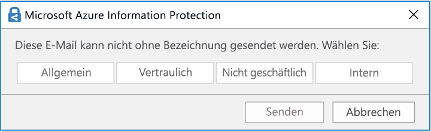
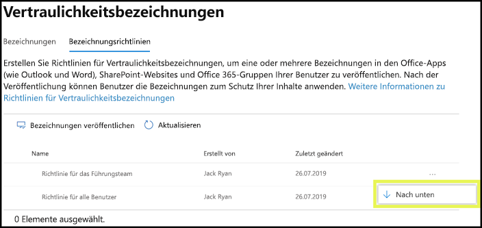

# Übersicht über Vertraulichkeitsbezeichnungen

Im Rahmen ihrer Arbeit müssen Personen in Ihrer Organisation mit anderen Personen innerhalb und außerhalb der Organisation zusammenarbeiten. Dies bedeutet, dass Inhalte nicht mehr durch eine Firewall geschützt sind – sie können zwischen verschiedenen Geräten, Apps und Diensten hin- und herbewegt werden. Dies soll auf sichere und geschützte Weise geschehen, die den geschäftlichen Anforderungen und Compliancerichtlinien Ihrer Organisation entspricht.

Mithilfe von Vertraulichkeitsbezeichnungen können Sie die vertraulichen Inhalte Ihrer Organisation klassifizieren und schützen, ohne dass die Produktivität Ihrer Mitarbeiter und deren Fähigkeit zur Zusammenarbeit behindert wird.

Hier ein Beispiel zur Anzeige verfügbarer Vertraulichkeitsbezeichnungen aus der Registerkarte **Start** im Menüband von Excel. In diesem Beispiel wird die angewendete Bezeichnung in der Statusleiste angezeigt:

Vertraulichkeitsbezeichnungen werden ausschließlich für Mandanten in der globalen (öffentlichen) Cloud unterstützt. Vertraulichkeitsbezeichnungen werden derzeit nicht für Mandanten in anderen Clouds (z. B. [nationalen Clouds](https://docs.microsoft.com/azure/active-directory/develop/authentication-national-cloud)) unterstützt.

> [!NOTE]
> Vertraulichkeitsbezeichnungen sind in US Government Community (GCC)-Organisationen noch nicht verfügbar.

Um Vertraulichkeitsbezeichnungen anwenden zu können müssen die Benutzer mit ihrem Geschäfts-, Schul- oder Unikonto bei Office angemeldet sein.

Sie können Vertraulichkeitsbezeichnungen zu Folgendem verwenden:
  
- **Erzwingen von Schutzeinstellungen wie Verschlüsselung oder Wasserzeichen für bezeichnete Inhalte.** Z. B. können die Benutzer eine Vertraulichkeitsbezeichnung auf ein Dokument oder eine E-Mail anwenden, und durch diese Bezeichnung kann der Inhalt verschlüsselt und ein Vertraulichkeitswasserzeichen angewendet werden.

- **Schützen von Inhalten in Office-Apps auf verschiedenen Plattformen und Geräten.** Eine Liste der unterstützten Apps finden Sie unter [Vertraulichkeitsbezeichnungen in Office-Apps](sensitivity-labels-office-apps.md).

- **Verhindern, dass vertrauliche Inhalte Ihre Organisation auf Geräten mit Windows verlassen, indem Sie Endpoint Protection in Microsoft Intune verwenden**. Nachdem eine Vertraulichkeitsbezeichnung auf Inhalte auf einem Windows-Gerät angewendet wurde, kann Endpoint Protection verhindern, dass diese Inhalte in eine Drittanbieter-App, z. B. Twitter oder Gmail kopiert werden. Dies funktioniert auch bei Wechselmedien, wie beispielweise einem USB-Laufwerk.

- **Schützen von Inhalten in Drittanbieter-Apps und -Diensten** mithilfe von Microsoft Cloud App Security. Mit Cloud App Security (CAS) können Sie Inhalte in Drittanbieter-Apps und -Diensten wie z. B. SalesForce, Box oder DropBox erkennen, klassifizieren, beschriften und schützen, auch wenn die Drittanbieter-App oder der Dienst Vertraulichkeitsbezeichnungen nicht liest oder unterstützt.

- **Erweitern von Vertraulichkeitsbezeichnungen auf Drittanbieter-Apps und -Dienste**. Mit dem Microsoft Information Protection SDK können Drittanbieter-Apps Vertraulichkeitsbezeichnungen lesen und Schutzeinstellungen anwenden.

- **Klassifizieren von Inhalten ohne Verwendung von Schutzeinstellungen.** Sie können auch einfach eine Klassifizierung für Inhalte (z. B. einen Aufkleber) zuweisen, die erhalten bleibt und mit wandert, wenn die Inhalte verwendet und freigegeben werden. Sie können diese Klassifizierung verwenden, um Nutzungsberichte zu generieren und Aktivitätsdaten für Ihre vertraulichen Inhalte anzuzeigen. Anhand dieser Informationen können Sie jederzeit auswählen, dass später Schutzeinstellungen angewendet werden.

In allen diesen Fällen können Ihnen Vertraulichkeitsbezeichnungen in Microsoft 365 dabei helfen, die richtigen Aktionen an den richtigen Inhalten auszuführen. Mit Vertraulichkeitsbezeichnungen können Sie Daten organisationsweit klassifizieren und Schutzeinstellungen auf der Grundlage dieser Klassifizierung erzwingen.

## Bedeutung von Vertraulichkeitsbezeichnungen

Wenn Sie einem Dokument oder einer E-Mail eine Vertraulichkeitsbezeichnung zuweisen, gleicht dies einem auf den Inhalt angebrachten Stempel wie z. B.:

- **Anpassbar.** Sie können Kategorien für unterschiedliche Stufen vertraulicher Inhalte in Ihrer Organisation erstellen, z. B. Privat, Öffentlich, Allgemein, Vertraulich und Streng vertraulich.

- **Klartext.** Da die Bezeichnung in den Metadaten des Inhalts als Klartext gespeichert ist, können Apps und Dienste von Drittanbietern ihn lesen und dann bei Bedarf ihre eigenen Schutzaktionen anwenden.

- **Persistent.** Nachdem eine Vertraulichkeitsbezeichnung auf einen Inhalt angewendet wurde, wird diese Bezeichnung in den Metadaten der entsprechenden E-Mail oder des betreffenden Dokuments gespeichert. Dies bedeutet, dass die Bezeichnung mit dem Inhalt, einschließlich der Schutzeinstellungen, hin- und herbewegt werden, und diese Daten werden zur Basis für das Anwenden und Erzwingen von Richtlinien.

In Office-Apps wird eine Vertraulichkeitsbezeichnung Benutzern wie ein Tag für eine E-Mail oder ein Dokument angezeigt.

Jedem Inhaltselement kann eine Vertraulichkeitsbezeichnung zugewiesen werden. Auf ein Element kann sowohl eine einzelne Vertraulichkeitsbezeichnung als auch eine einzelne [Aufbewahrungsbezeichnung](labels.md) angewendet werden.

> [!div class="mx-imgBorder"]
> 

## Wirkung von Vertraulichkeitsbezeichnungen

Zusätzlich zu E-Mails und Dokumenten stehen Vertraulichkeitsbezeichnungen in mehreren öffentlichen Vorschauversionen zur Verfügung. Weitere Informationen dazu, wie Vertraulichkeitsbezeichnungen für Dateien, Teams, Gruppen und Websites verwendet werden können, finden Sie in den folgenden Artikeln:

- [Aktivieren von Vertraulichkeitsbezeichnungen für Office-Dateien in SharePoint und OneDrive (öffentliche Vorschau)](sensitivity-labels-sharepoint-onedrive-files.md)

- [Verwenden von Vertraulichkeitsbezeichnungen für Microsoft Teams, Office 365-Gruppen und SharePoint-Websites (öffentliche Vorschau)](sensitivity-labels-teams-groups-sites.md)

Nachdem eine Vertraulichkeitsbezeichnung auf eine E-Mail oder ein Dokument angewendet wurde, werden alle konfigurierten Schutzeinstellungen für diese Bezeichnung auf den Inhalt erzwungen. Mit einer Vertraulichkeitsbezeichnung können Sie folgende Aktionen auslösen:

- **Verschlüsseln** Sie nur E-Mails oder E-Mails und Dokumente. Sie können auswählen, welche Benutzer oder Gruppen über Berechtigungen zum Ausführen welcher Aktionen verfügen, und wie lange diese Berechtigungen gültig sind. Sie können z. B. festlegen, dass Benutzer in einer bestimmten Gruppe in einer anderen Organisation nach der Festlegung der Bezeichnung für den Inhalt nur sieben Tage lang berechtigt sind, den Inhalt zu überprüfen. Alternativ können Sie, statt Berechtigungen durch einen Administrator zu definieren, Ihren Benutzern das Zuweisen von Berechtigungen für den Inhalt erlauben, wenn sie die Bezeichnung anwenden. Weitere Informationen finden Sie unter [Einschränken des Zugriffs auf Inhalte mithilfe der Verschlüsselung in Vertraulichkeitsbezeichnungen](encryption-sensitivity-labels.md).

- **Markieren Sie die Inhalte** beim Verwenden von Office Apps durch Hinzufügen von Wasserzeichen, Kopf- oder Fußzeilen zu E-Mails oder Dokumenten, denen die Bezeichnung zugewiesen wurde. Wasserzeichen können nur auf Dokumente, nicht aber auf E-Mails angewendet werden und sind auf 255 Zeichen beschränkt. Kopf-und Fußzeilen sind (mit Ausnahme von Excel) auf 1024 Zeichen beschränkt.  Bei Excel liegt der Höchstwert bei 255 Zeichen für Kopf-und Fußzeilen, aber in dieser Beschränkung sind nicht sichtbare Zeichen, wie z. B. Formatierungscodes, enthalten. Wenn dieser Wert erreicht ist, wird die eingegebene Zeichenfolge in Excel nicht angezeigt. Informationen darüber, wann die Inhaltskennzeichnungen angewendet werden, finden Sie unter [Wann wendet Office 365 die Inhaltskennzeichnung und -verschlüsselung auf Inhalte an](sensitivity-labels-office-apps.md#when-office-365-applies-content-marking-and-encryption-to-content).
    
    

- **Verhindern Sie Datenverlust** durch Aktivieren des Endpunktschutzes in Intune. Wenn vertrauliche Inhalte heruntergeladen werden, können Sie den Verlust von Daten von Windows-Geräten verhindern. So können beispielsweise mit Bezeichnungen versehene Inhalte nicht in Dropbox, Gmail oder auf ein USB-Laufwerk kopiert werden. Bevor Ihre Vertraulichkeitsbezeichnungen Windows Information Protection (WIP) nutzen können, müssen Sie zuerst eine App-Schutzrichtlinie im Azure-Portal erstellen. Weitere Informationen hierzu finden Sie unter [Wie Windows Information Protection Dateien mit einer Vertraulichkeitsbezeichnung schützt](https://docs.microsoft.com/windows/security/information-protection/windows-information-protection/how-wip-works-with-labels?branch=vsts17546553).

- **Automatisches Anwenden der Bezeichnung auf Inhalte anwenden, die vertrauliche Informationen enthalten. ** Sie können festlegen, für welchen Typ vertraulicher Informationen die Bezeichnung angewendet werden soll. Die Bezeichnung kann entweder automatisch angewendet werden oder Benutzer werden aufgefordert, die empfohlene Bezeichnung anzuwenden. Wenn Sie eine Bezeichnung empfehlen, wird in der Aufforderung der entsprechende Text angezeigt. Weitere Informationen finden Sie unter [Automatisches Anwenden einer Vertraulichkeitsbezeichnung auf Inhalte](apply-sensitivity-label-automatically.md).

    

### Priorität der Bezeichnungen (Reihenfolge wesentlich)

Wenn Sie Ihre Vertraulichkeitsbezeichnungen in Ihrem Admin Center erstellen, werden sie in einer Liste auf der Registerkarte **Vertraulichkeit** auf der Seite **Bezeichnungen** angezeigt. In dieser Liste ist die Reihenfolge der Beschriftungen wichtig, da diese ihre Priorität widerspiegelt. Die restriktivste Vertraulichkeitsbezeichnung, z. B. Streng vertraulich, soll **am Ende** der Liste angezeigt werden, die am wenigsten restriktivste Vertraulichkeitsbezeichnung, z. B. Öffentlich, soll **am Anfang** der Liste angezeigt werden.

Sie können nur eine Vertraulichkeitsbezeichnung auf ein einzelnes Dokument oder eine E-Mail anwenden. Wenn Sie eine Option festlegen, die bestimmt, dass Benutzer eine Begründung für die Änderung der Bezeichnung zu einer niedrigeren Klassifizierung angeben müssen, werden in der Reihung dieser Liste die niedrigeren Klassifizierungen angegeben. Diese Option gilt jedoch nicht für Unterbezeichnungen.

Die Reihenfolge der Unterbezeichnungen wird allerdings mit [automatischen Bezeichnungen](apply-sensitivity-label-automatically.md) verwendet. Wenn Sie Bezeichnungen so konfigurieren, dass Sie automatisch oder als Empfehlung angewendet werden, können daraus mehrere Übereinstimmungen für mehrere Bezeichnungen resultieren. Anhand der Bezeichnungsreihenfolge wird die Bezeichnung ermittelt, die angewendet oder empfohlen werden soll: Die letzte vertrauliche Bezeichnung wird ausgewählt, und dann, falls zutreffend, die letzte Unterbezeichnung.

### Unterbezeichnungen (Gruppierungsbezeichnungen)

Mit Unterbezeichnungen können Sie ein oder mehrere Bezeichnungen unter einer übergeordneten Bezeichnung gruppieren, die ein Benutzer in einer Office-App sieht. Unter "Vertraulich" kann Ihr Unternehmen beispielsweise mehrere verschiedene Bezeichnungen für bestimmte Arten dieser Klassifizierung verwenden. In diesem Beispiel ist die übergeordnete Bezeichnung "Vertraulich" einfach eine Textbezeichnung ohne Schutzeinstellungen, und da sie Unterbezeichnungen enthält, kann sie nicht auf Inhalt angewendet werden. Stattdessen müssen Benutzer "Vertraulich" auswählen, um die Unterbezeichnungen anzuzeigen, und können dann eine Unterbezeichnung auswählen, die auf Inhalt angewendet wird.

Unterbezeichnungen sind einfach eine Möglichkeit, Benutzern Bezeichnungen in logischen Gruppen zu bereitzustellen. Unterbezeichnungen erben keine Einstellungen von ihrer übergeordneten Bezeichnung. Wenn Sie eine Unterbezeichnung für einen Benutzer veröffentlichen, kann dieser Benutzer diese Unterbezeichnung auf den Inhalt anwenden, aber er kann nicht nur die übergeordnete Bezeichnung anwenden.

Übergeordnete Bezeichnungen sollten nicht als Standardbezeichnungen ausgewählt oder so konfiguriert werden, dass sie automatisch angewendet oder empfohlen werden, da eine übergeordnete Bezeichnung nicht auf Inhalte in Office-Apps angewendet wird, die den Azure Information Protection-Client mit einheitlichen Bezeichnungen verwenden.

Beispiel für die Anzeige von Unterbeschriftungen für Benutzer:

### Bearbeiten oder Löschen einer Vertraulichkeitsbezeichnung

Wenn Sie eine Vertraulichkeitsbezeichnung aus Ihrem Admin Center löschen, wird die Bezeichnung nicht automatisch vom Inhalt entfernt und alle Schutzeinstellungen für den Inhalt werden weiterhin erzwungen.

Wenn Sie eine Vertraulichkeitsbezeichnung bearbeiten, wird die Version der Bezeichnung, die auf Inhalte angewendet wurde, für diese Inhalte erzwungen.

## Wirkung von Bezeichnungsrichtlinien

Nachdem Sie Ihre Vertraulichkeitsbezeichnungen erstellt haben, müssen Sie diese veröffentlichen, um Sie für Personen und Dienste in Ihrer Organisation zur Verfügung zu stellen. Die Vertraulichkeitsbezeichnungen können dann auf Dokumente und E-Mails angewendet werden. Im Gegensatz zu Aufbewahrungsbezeichnungen, die an Speicherorten wie allen Exchange-Postfächern veröffentlicht werden, werden Vertraulichkeitsbezeichnungen für Benutzer oder Gruppen veröffentlicht. Die Vertraulichkeitsbezeichnungen werden dann in Office Apps für diese Benutzer und Gruppen angezeigt.

Mit einer Bezeichnungsrichtlinie können Sie Folgendes bewirken:

- **Entscheiden, welchen Benutzern und Gruppen die Bezeichnungen angezeigt werden.** Bezeichnungen können für jegliche E-Mail-aktivierte Sicherheitsgruppen, Office 365-Gruppen oder dynamische Verteilergruppen veröffentlicht werden.

- **Eine Standardbezeichnung** auf alle neuen Dokumente und E-Mails anwenden, die von den in der Bezeichnungsrichtlinie enthaltenen Benutzern und Gruppen erstellt wurden. Sie haben die Möglichkeit, eine als Basisniveau Standardbezeichnung von Schutzeinstellungen festzulegen, die auf alle Ihre Inhalte angewendet werden sollen. Ohne Benutzerschulungen und andere Steuerelemente kann diese Einstellung aber auch zu ungenauen Bezeichnungen führen. 

- **Begründung für das Ändern einer Bezeichnung anfordern.** Sie können festlegen, dass, wenn Inhalte als vertraulich gekennzeichnet sind und ein Benutzer diese Bezeichnung entfernen oder durch eine niedrigere Klassifizierung (z. B. durch eine Bezeichnung als "öffentlich") ersetzen möchte, er eine Begründung für diese Aktion angeben muss. Aktuell wird die Begründung nicht zur [Analyse der Bezeichnungen](label-analytics.md) an den Administrator gesendet. Allerdings sendet der [Azure Information Protection-Client für einheitliche Bezeichnungen](https://docs.microsoft.com/azure/information-protection/rms-client/aip-clientv2) diese Informationen an [Azure Information Protection-Analysen](https://docs.microsoft.com/azure/information-protection/reports-aip).

    

- **Von Benutzern fordern, dass sie eine Bezeichnung auf ihre E-Mails und Dokumente anwenden**. Dies wird auch obligatorische Bezeichnung genannt: Sie können festlegen, dass eine Bezeichnung angewendet werden muss, bevor Benutzer Dokumente speichern und E-Mails senden können. Nutzen Sie diese Option, um dafür zu sorgen, dass Bezeichnungen in höherem Maß verwendet werden. Die Bezeichnung kann vom Benutzer manuell, und zwar automatisch als Ergebnis einer von Ihnen konfigurierten Bedingung, oder standardmäßig zugewiesen werden (die oben beschriebene Standardbezeichnung). Die Aufforderung, die in Outlook angezeigt wird, wenn ein Benutzer eine Bezeichnung zuweisen muss, sieht so aus:

    
    
    > [!NOTE]
    > Für die obligatorische Bezeichnung ist ein Azure Information Protection-Abonnement erforderlich. Wenn Sie diese Funktion verwenden möchten, müssen Sie den [Assistent für einheitliche Bezeichnungen von Azure Information Protection](https://docs.microsoft.com/azure/information-protection/rms-client/install-unifiedlabelingclient-app) installieren. Dieser Assistent kann nur unter Windows ausgeführt werden, sodass die Funktion derzeit nicht unter Mac, iOS und Android unterstützt wird.

- **Link zu einer benutzerdefinierten Hilfeseite bereitstellen** Wenn Ihre Benutzer nicht genau wissen, was Vertraulichkeitsbezeichnungen sind oder wie sie verwendet werden sollten, können Sie eine URL zu weiteren Informationen angeben, die unten im Menü der **Vertraulichkeitsbezeichnungen** in den Office-Apps angezeigt wird:

    

Nachdem Sie eine Bezeichnungsrichtlinie erstellt haben, die Benutzern und Gruppen Vertraulichkeitsbezeichnungen zuweist, kann es bis zu 24 Stunden dauern, bis die Bezeichnungen in den Office-Anwendungen der Benutzer angezeigt werden.

Es gibt keine Beschränkung für die Anzahl der Vertraulichkeitsbezeichnungen, die Sie erstellen und veröffentlichen können, mit einer Ausnahme: Wenn bei der die Bezeichnung Verschlüsselung angewendet wird, gibt es maximal 500 Bezeichnungen. Allerdings gilt als bewährte Methode, um den Verwaltungsaufwand für die Administratoren und die Komplexität für die Benutzer zu verringern, die Anzahl der Bezeichnungen möglichst gering zu halten. Praxisnahe Bereitstellungen haben sich als weit weniger effektiv erwiesen, wenn Benutzer mehr als fünf Hauptbezeichnungen oder mehr als fünf Unterbezeichnungen pro Hauptbezeichnung zuordnen.

### Priorität der Bezeichnungsrichtlinien (Reihenfolge wesentlich)

Sie können Benutzern die Vertraulichkeitsbezeichnungen zur Verfügung stellen, indem Sie sie in einer Richtlinie zur Vertraulichkeitsbezeichnung veröffentlichen, die in einer Liste auf der Registerkarte **Vertraulichkeitsrichtlinien** auf der Seite **Bezeichnungsrichtlinien** angezeigt wird. Wie bei den Vertraulichkeitsbezeichnungen (siehe [Priorität der Bezeichnungen (Reihenfolge wesentlich)](#label-priority-order-matters)) ist auch die Reihenfolge der Richtlinien zur Vertraulichkeitskennzeichnung wichtig, da sie deren Priorität widerspiegelt. Die Bezeichnungsrichtlinie mit der niedrigsten Priorität wird **am Anfang** und jene mit der höchsten Priorität **am Ende** angezeigt.

Eine Bezeichnungsrichtlinie besteht aus:

- Einer Gruppe von Beschriftungen.
- Dem Bereich der Bezeichnungsrichtlinie, d. h. die Benutzer und Gruppen, die in der Richtlinie enthalten sind.
- Die Einstellungen der oben beschriebenen Bezeichnungsrichtlinie (Standardbezeichnung, Ausrichtung, obligatorische Bezeichnung und Hilfe-Link).

Sie können einen Benutzer in mehrere Bezeichnungsrichtlinien einschließen, und der Benutzer sieht sämtliche Vertraulichkeitsbezeichnungen aus diesen Richtlinien. Ein Benutzer sieht jedoch nur die Richtlinieneinstellungen der Bezeichnungsrichtlinie mit der höchsten Priorität.

Wenn Ihnen die für einen Benutzer oder eine Gruppe erwartete Bezeichnungs oder Bezeichnungsrichtlinieneinstellung nicht angezeigt wird und Sie 24 Stunden gewartet haben, überprüfen Sie die Reihenfolge der Vertraulichkeitsbezeichnungsrichtlinien. Wenn Sie die Bezeichnungsrichtlinien neu anordnen möchten, wählen Sie eine Vertraulichkeits-Bezeichnungsrichtlinie aus > wählen Sie die drei Punkte auf der rechten Seite aus > bewegen Sie sie nach **unten** oder **oben**.

Wenn Sie zusätzlich zu Vertraulichkeits- auch Aufbewahrungsbezeichnungen verwenden, ist es wichtig, dass Vorrang für Vertraulichkeits-, nicht jedoch für [Aufbewahrungsbezeichnungsrichtlinien](labels.md#the-principles-of-retention-or-what-takes-precedence) von Bedeutung ist.

## Vertraulichkeitsbezeichnungen und Azure Information Protection

Wenn Sie Bezeichnungen mit Azure Information Protection bereitgestellt haben, machen Sie sich mit den folgenden Abschnitten vertraut, bevor Sie mit der Verwendung von Vertraulichkeitsbezeichnungen beginnen.

### Azure Information Protection-Bezeichnungen

Wenn Sie Azure Information Protection-Bezeichnungen verwenden, weil Ihr Mandant noch nicht auf der [vereinheitlichten Bezeichnungs-Plattform](https://docs.microsoft.com/azure/information-protection/faqs#how-can-i-determine-if-my-tenant-is-on-the-unified-labeling-platform)ist, empfehlen wir, dass Sie das Erstellen von Vertraulichkeitsbezeichnungen vermeiden, bis Sie die einheitlichen Bezeichnungen aktiviert haben. In diesem Szenario sind die Bezeichnungen, die Sie im Azure-Portal sehen, Azure Information Protection-Bezeichnungen anstelle von Vertraulichkeitsbezeichnungen. Diese Bezeichnungen können vom Azure Information Protection-Client (Classic) auf Windows-Computern verwendet werden, aber nicht von Geräten, auf denen macOS, iOS oder Android ausgeführt wird. Um dieses Problem zu beheben, [überführen Sie diese Bezeichnungen](/azure/information-protection/configure-policy-migrate-labels) in Vertraulichkeitsbezeichnungen. 

Die Metadaten beider Bezeichnungstypen sind kompatibel, sodass Sie Dokumente und E-Mails nach Abschluss der Migration nicht erneut kennzeichnen müssen.

### Azure Information Protection-Clients

Wenn Sie Vertraulichkeitsbezeichnungen in Office 365 ProPlus-Apps auf Windows-Computern verwenden, haben Sie die Wahl, einen Azure Information Protection-Client oder die in Office integrierte Bezeichnung zu verwenden. 

Die integrierte Bezeichnung wird in diesen Apps standardmäßig deaktiviert, wenn der Azure Information Protection-Client installiert ist. Weitere Informationen dazu finden Sie unter [Der in Office integrierte Bezeichnungs-Client](sensitivity-labels-office-apps.md#about-the-office-built-in-labeling-client).

Wenn Sie Hilfe bei der Entscheidung für den zu verwendenden Kennzeichnungs Client benötigen, lesen Sie [Auswählen eines Bezeichnungs-Clients für Windows-Computer](https://docs.microsoft.com/azure/information-protection/rms-client/use-client#choose-which-labeling-client-to-use-for-windows-computers) aus der Dokumentation zu Azure Information Protection aus.

## Vertraulichkeitsbezeichnungen und Microsoft Cloud App Security

Mit Cloud App Security (CAS) können Sie Inhalte in Drittanbieter-Diensten und -Apps wie z. B. SalesForce, Box oder Dropbox erkennen, klassifizieren, mit Bezeichnungen versehen und schützen. 

Cloud App Security arbeitet sowohl mit Azure Information Protection-Bezeichnungen als auch mit Vertraulichkeitsbezeichnungen zusammen:

- Wenn die Bezeichnungs-Admin Center dieselben Bezeichnungen wie im Azure-Portal aufweisen, werden Vertraulichkeitsbezeichnungen verwendet. Um diese Bezeichnungen in der Cloud App Security auszuwählen, muss mindestens eine Bezeichnung für mindestens einen Benutzer [veröffentlicht](create-sensitivity-labels.md#publish-sensitivity-labels-by-creating-a-label-policy) werden.

- Wenn die Bezeichnungs-Admin Center nicht über die gleichen Bezeichnungen wie im Azure-Portal verfügen: Vertraulichkeitsbezeichnungen werden nicht aus den Bezeichnungs-Admin Center verwendet. Stattdessen werden Azure Information Protection-Bezeichnungen aus dem Azure-Portal abgerufen.

Eine Anleitung, wie Sie Cloud App Security mit diesen Bezeichnungen verwenden können, finden Sie unter [Automatisches Anwenden von Klassifizierungdbezeichnungen für Azure Information Protection](https://docs.microsoft.com/cloud-app-security/use-case-information-protection).

## Vertraulichkeitsbezeichnungen und der Microsoft Information Protection SDK

Da eine Vertraulichkeitsbezeichnung als Klartext in den Metadaten des Dokuments gespeichert wird, können Drittanbieter-Apps und -Dienste die Identifizierung und den Schutz von Inhalten mit einer solchen Bezeichnung unterstützen. Die Unterstützung in anderen Apps und Diensten wird ständig erweitert.

Mit dem [Microsoft Information Protection SDK](https://docs.microsoft.com/information-protection/develop/overview#microsoft-information-protection-sdk) können Apps und Dienste von Drittanbietern Vertraulichkeitsbezeichnungen lesen und anwenden sowie Schutz auf Dokumente anwenden. Weitere Informationen hierzu finden Sie in der [Ankündigung im Blog der Tech-Community](https://techcommunity.microsoft.com/t5/Microsoft-Information-Protection/Microsoft-Information-Protection-SDK-Now-Generally-Available/ba-p/263144). 

Außerdem erfahren Sie mehr über [Partnerlösungen, die in Microsoft Information Protection integriert sind](https://techcommunity.microsoft.com/t5/Azure-Information-Protection/Microsoft-Information-Protection-showcases-integrated-partner/ba-p/262657).

## Erste Schritte mit Vertraulichkeitsbezeichnungen

1. **Erstellen Sie die Bezeichnungen.** Erstellen und benennen Sie Ihre Vertraulichkeitsbezeichnungen gemäß der Klassifizierungstaxonomie Ihrer Organisation für unterschiedliche Vertraulichkeitsstufen von Inhalten. Verwenden Sie allgemeine Namen oder Ausdrücke, die für Ihre Benutzer leicht verständlich sind. Wenn Sie noch nicht über eine festgelegte Taxonomie verfügen, können Sie mit Bezeichnungen wie "Privat", "Öffentlich", "Allgemein", "Vertraulich" und "Hoch vertraulich" beginnen. Danach können Sie Unterbezeichnungen verwenden, um ähnliche Bezeichnungen nach Kategorien zu gruppieren. Verwenden Sie beim Erstellen einer Bezeichnung den QuickInfo-Text, um die Benutzer bei der Auswahl der geeigneten Bezeichnung zu unterstützen.

2. **Legen Sie fest, wozu jede einzelne Bezeichnung dient.** Konfigurieren Sie die Schutzeinstellungen, die mit den einzelnen Bezeichnungen verknüpft werden sollen. Für Inhalte mit niedriger Vertraulichkeit (z.B. die Bezeichnung „Allgemein“) können Sie beispielsweise nur eine Kopf- oder Fußzeile benutzen, während auf vertraulichere Inhalt (z.B. die Bezeichnung „Vertraulich“) ein Wasserzeichen, Verschlüsselung und Endpoint Protection angewendet werden sollte.

3. **Veröffentlichen Sie die Bezeichnungen.** Nachdem Sie die Vertraulichkeitsbezeichnungen konfiguriert haben, können Sie sie mithilfe einer Bezeichnungsrichtlinie veröffentlichen. Legen Sie fest, welche Benutzer und Gruppen die Bezeichnungen haben sollen und welche Richtlinieneinstellungen verwendet werden. Eine einzelne Bezeichnung kann wiederverwendet werden, d. h. Sie definieren eine Bezeichnung nur einmal und können sie anschließend in mehrere Bezeichnungsrichtlinien einfügen, die unterschiedlichen Benutzern zugewiesen sind. So könnten Sie beispielsweise mit Vertraulichkeitsbezeichnungen beginnen, indem Sie nur wenigen Benutzern eine Kennzeichnungsrichtlinie zuweisen. Wenn Sie dann bereit sind, die Bezeichnungen für Ihre gesamte Organisation bereitzustellen, können Sie eine neue Bezeichnungsrichtlinie für Ihre Bezeichnungen erstellen und dieses Mal alle Benutzer angeben.

Allgemeiner Prozess für den Administrator, die Benutzer und die Office-Apps bei der Nutzung von Vertraulichkeitsbezeichnungen:

Sie können jetzt [Vertraulichkeitsbezeichnungen und deren Richtlinien erstellen und konfigurieren](create-sensitivity-labels.md). 

Weitere Informationen zum Verwenden von Vertraulichkeitsbezeichnungen für Office-Apps finden Sie unter [Vertraulichkeitsbezeichnungen in Office-Apps](sensitivity-labels-office-apps.md).