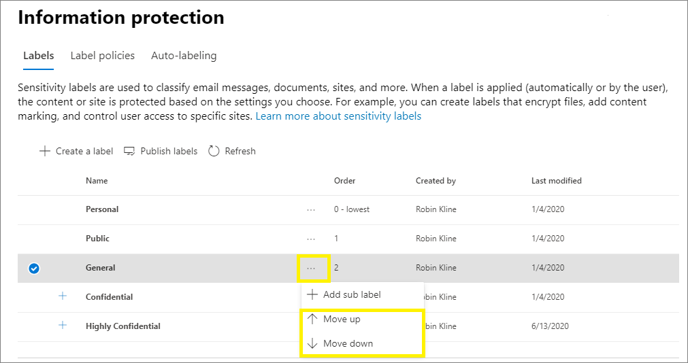

# Informationen zu VertraulichkeitsbezeichnungenLearn about sensitivity labels

>*[Microsoft 365-Lizenzierungsleitfaden für Sicherheit und Compliance](https://aka.ms/ComplianceSD).**[Microsoft 365 licensing guidance for security & compliance](https://aka.ms/ComplianceSD).*

> [!NOTE]
> Wenn Sie nach Informationen zu Vertraulichkeitsbezeichnungen suchen, die in Ihren Office-Anwendungen angezeigt werden, lesen Sie den Abschnitt [Vertraulichkeitsbezeichnungen auf Dateien und E-Mails in Office anwenden](https://support.microsoft.com/topic/apply-sensitivity-labels-to-your-files-and-email-in-office-2f96e7cd-d5a4-403b-8bd7-4cc636bae0f9).If you're looking for information about sensitivity labels that you see in your Office apps, see [Apply sensitivity labels to your files and email in Office](https://support.microsoft.com/topic/apply-sensitivity-labels-to-your-files-and-email-in-office-2f96e7cd-d5a4-403b-8bd7-4cc636bae0f9).
>
> Die Informationen auf dieser Seite richten sich an IT-Administratoren, die diese Bezeichnungen erstellen und konfigurieren können.The information on this page is for IT administrators who can create and configure those labels.

Im Rahmen ihrer Arbeit müssen Personen in Ihrer Organisation mit anderen Personen innerhalb und außerhalb der Organisation zusammenarbeiten. Dies bedeutet, dass Inhalte nicht mehr durch eine Firewall geschützt sind – sie können zwischen verschiedenen Geräten, Apps und Diensten hin- und herbewegt werden. Dies soll auf sichere und geschützte Weise geschehen, die den geschäftlichen Anforderungen und Compliancerichtlinien Ihrer Organisation entspricht.To get their work done, people in your organization collaborate with others both inside and outside the organization. This means that content no longer stays behind a firewall—it can roam everywhere, across devices, apps, and services. And when it roams, you want it to do so in a secure, protected way that meets your organization's business and compliance policies.

Mit Vertraulichkeitsbezeichnungen aus der Microsoft Information Protection-Lösung können Sie die Daten Ihrer Organisation klassifizieren und schützen und gleichzeitig sicherstellen, dass Produktivität und Zusammenarbeit der Benutzer nicht beeinträchtigt werden.Sensitivity labels from the Microsoft Information Protection solution let you classify and protect your organization's data, while making sure that user productivity and their ability to collaborate isn't hindered.

Hier ein Beispiel zur Anzeige verfügbarer Vertraulichkeitsbezeichnungen aus der Registerkarte **Start** im Menüband von Excel.Example showing available sensitivity labels in Excel, from the **Home** tab on the Ribbon. In diesem Beispiel wird die angewendete Bezeichnung in der Statusleiste angezeigt:In this example, the applied label displays on the status bar:

Um Vertraulichkeitsbezeichnungen anwenden zu können müssen die Benutzer mit ihrem Microsoft 365-Geschäfts-, -Schul- oder -Unikonto angemeldet sein.To apply sensitivity labels, users must be signed in with their Microsoft 365 work or school account.

> [!NOTE]
> Vertraulichkeitsbezeichnungen werden neu für Mandanten der US-Regierung (GCC und GCC-H) unterstützt.Sensitivity labels are newly supported For US Government tenants (GCC and GCC-H). Weitere Informationen finden Sie in den Anmerkungen zu dieser Version von Microsoft 365 Apps for Enterprise, [Version 2101: 26. Januar](https://docs.microsoft.com/officeupdates/current-channel#version-2101-january-26).For more information, see the release notes for Microsoft 365 Apps for enterprise, [Version 2101: January 26](https://docs.microsoft.com/officeupdates/current-channel#version-2101-january-26).
>
> Informationen zum Azure Information Protection-Client und -Scanner mit einheitlichen Bezeichnungen finden Sie unter [Azure Information Protection Premium – Dienstbeschreibung für Behörden](https://docs.microsoft.com/enterprise-mobility-security/solutions/ems-aip-premium-govt-service-description).For the Azure Information Protection unified labeling client and scanner, see [Azure Information Protection Premium Government Service Description](https://docs.microsoft.com/enterprise-mobility-security/solutions/ems-aip-premium-govt-service-description).

Sie können Vertraulichkeitsbezeichnungen zu Folgendem verwenden:You can use sensitivity labels to:
  
- **Bieten Sie Schutzeinstellungen, die Verschlüsselung und Inhaltsmarkierungen umfassen.****Provide protection settings that include encryption and content markings.** Z. B. können die Benutzer eine Vertraulichkeitsbezeichnung auf ein Dokument oder eine E-Mail anwenden, und durch diese Bezeichnung kann der Inhalt verschlüsselt und ein Vertraulichkeitswasserzeichen angewendet werden.For example, apply a "Confidential" label to a document or email, and that label encrypts the content and applies a "Confidential" watermark. Zu den Inhaltsmarkierungen gehören Kopf- und Fußzeilen sowie Wasserzeichen, und die Verschlüsselung kann auch einschränken, welche Aktionen autorisierte Personen an den Inhalten vornehmen können.Content markings include headers and footers as well as watermarks, and encryption can also restrict what actions authorized people can take on the content.

- **Schützen von Inhalten in Office-Apps auf verschiedenen Plattformen und Geräten.****Protect content in Office apps across different platforms and devices.** Unterstützt von Word, Excel, PowerPoint und Outlook in den Office-Desktop-Anwendungen und Office im Web.Supported by Word, Excel, PowerPoint, and Outlook on the Office desktop apps and Office on the web. Unterstützt auf Windows, MacOS, iOS, und Android.Supported on Windows, macOS, iOS, and Android.

- **Schützen von Inhalten in Drittanbieter-Apps und -Diensten** mithilfe von Microsoft Cloud App Security.**Protect content in third-party apps and services** by using Microsoft Cloud App Security. Mit Cloud App Security (CAS) können Sie Inhalte in Drittanbieter-Apps und -Diensten wie z. B. SalesForce, Box oder DropBox erkennen, klassifizieren, beschriften und schützen, auch wenn die Drittanbieter-App oder der Dienst Vertraulichkeitsbezeichnungen nicht liest oder unterstützt.With Cloud App Security, you can detect, classify, label, and protect content in third-party apps and services, such as SalesForce, Box, or DropBox, even if the third-party app or service does not read or support sensitivity labels.

- **Schützen von Containern**, die Teams, Microsoft 365-Gruppen und SharePoint-Seiten enthalten.**Protect containers** that include Teams, Microsoft 365 Groups, and SharePoint sites. Legen Sie beispielsweise Einstellungen für den Datenschutz, externen Benutzerzugriff und externe Freigabe und den Zugriff von nicht verwalteten Geräten aus fest.For example, set privacy settings, external user access and external sharing, and access from unmanaged devices.

- **Erweitern Sie Vertraulichkeitsbezeichnung auf Power BI**: Wenn Sie diese Funktion aktivieren, können Sie Kennzeichnungen in Power BI anwenden und anzeigen und Daten schützen, wenn sie außerhalb des Dienstes gespeichert werden.**Extend sensitivity labels to Power BI**: When you turn on this capability, you can apply and view labels in Power BI, and protect data when it's saved outside the service.

- **Erweitern von Vertraulichkeitsbezeichnungen auf Ressourcen in Azure Purview**: Mit dieser Funktion (die sich aktuell noch in der Vorschau befindet) können Sie Ihre Vertraulichkeitsbezeichnungen auf Ressourcen wie SQL-Spalten, Dateien in Azure Blob Storage und mehr anwenden.**Extend sensitivity labels to assets in Azure Purview**: When you turn on this capability, currently in preview, you can apply your sensitivity labels to assets such as SQL columns, files in Azure Blob Storage, and more. 

- **Erweitern von Vertraulichkeitsbezeichnungen auf Drittanbieter-Apps und -Dienste**.**Extend sensitivity labels to third-party apps and services.** Mit dem Microsoft Information Protection SDK können Drittanbieter-Apps Vertraulichkeitsbezeichnungen lesen und Schutzeinstellungen anwenden.Using the Microsoft Information Protection SDK, third-party apps can read sensitivity labels and apply protection settings.

- **Klassifizieren von Inhalten ohne Verwendung von Schutzeinstellungen.****Classify content without using any protection settings.** Sie können auch einfach eine Bezeichnung als Ergebnis der Klassifizierung des Inhalts zuweisen.You can also simply assign a label as a result of classifying the content. Auf diese Weise erhalten die Benutzer eine visuelle Zuordnung der Klassifizierung zu den Bezeichnungen Ihrer Organisation. Sie können die Bezeichnungen verwenden, um Nutzungsberichte zu erstellen und Aktivitätsdaten für Ihre vertrauliche Inhalte anzuzeigen.This provides users with a visual mapping of classification to your organization's label names, and can use the labels to generate usage reports and see activity data for your sensitive content. Anhand dieser Informationen können Sie jederzeit auswählen, dass später Schutzeinstellungen angewendet werden.Based on this information, you can always choose to apply protection settings later.

In allen diesen Fällen können Ihnen Vertraulichkeitsbezeichnungen in Microsoft 365 dabei helfen, die richtigen Aktionen an den richtigen Inhalten auszuführen.In all these cases, sensitivity labels in Microsoft 365 can help you take the right actions on the right content. Mit Vertraulichkeitsbezeichnungen können Sie Daten organisationsweit klassifizieren und Schutzeinstellungen auf der Grundlage dieser Klassifizierung erzwingen.With sensitivity labels, you can classify data across your organization, and enforce protection settings based on that classification.

Weitere Informationen zu diesen und anderen Szenarien, die von Vertraulichkeitsbezeichnungen unterstützt werden, finden Sie unter [Allgemeine Szenarien für Vertraulichkeitsbezeichnungen](get-started-with-sensitivity-labels.md#common-scenarios-for-sensitivity-labels).For more information about these and other scenarios that are supported by sensitivity labels, see [Common scenarios for sensitivity labels](get-started-with-sensitivity-labels.md#common-scenarios-for-sensitivity-labels). Es werden ständig neue Funktionen entwickelt, die Vertraulichkeitsbezeichnungen unterstützen. Daher kann es nützlich sein, die [Roadmap von Microsoft 365](https://aka.ms/MIPC/Roadmap) zu Rate zu ziehen.New features are being developed all the time that support sensitivity labels, so you might also find it useful to reference the [Microsoft 365 roadmap](https://aka.ms/MIPC/Roadmap).

## Bedeutung von VertraulichkeitsbezeichnungenWhat a sensitivity label is

Wenn Sie einem Dokument oder einer E-Mail eine Vertraulichkeitsbezeichnung zuweisen, gleicht dies einem auf den Inhalt angebrachten Stempel wie z. B.:When you assign a sensitivity label to content, it's like a stamp that's applied and is:

- **Anpassbar.****Customizable.** Speziell für Ihr Unternehmen und Ihre geschäftlichen Anforderungen können Sie Kategorien für verschiedene Ebenen von vertraulichen Inhalten in Ihrem Unternehmen erstellen.Specific to your organization and business needs, you can create categories for different levels of sensitive content in your organization. Sie können z. B. mit Bezeichnungen wie „Privat“, „Öffentlich“, „Allgemein“, „Vertraulich“ und „Hochgradig vertraulich“ beginnen.For example, Personal, Public, General, Confidential, and Highly Confidential.

- **Klartext.****Clear text.** Da die Bezeichnung in den Metadaten des Inhalts als Klartext gespeichert ist, können Apps und Dienste von Drittanbietern ihn lesen und dann bei Bedarf ihre eigenen Schutzaktionen anwenden.Because a label is stored in clear text in the metadata for files and emails, third-party apps and services can read it and then apply their own protective actions, if required.

- **Persistent.****Persistent.** Da die Beschriftung in den Metadaten für Dateien und E-Mails gespeichert wird, wandert die Beschriftung mit dem Inhalt mit, unabhängig davon, wo dieser gespeichert oder abgelegt wird.Because the label is stored in metadata for files and emails, the label roams with the content, no matter where it's saved or stored. Die eindeutige Kennzeichnung wird zur Grundlage für die Anwendung und Durchsetzung der von Ihnen konfigurierten Richtlinien.The unique label identification becomes the basis for applying and enforcing the policies that you configure.

Für die Benutzer erscheint ein Vertraulichkeitsbezeichnung wie ein Tag auf den von ihnen verwendeten Apps und kann einfach in ihre bestehenden Arbeitsabläufe integriert werden.When viewed by users, a sensitivity label appears like a tag on apps that they use and can be easily integrated into their existing workflows.

Auf jedes Element, das Vertraulichkeitsbezeichnungen unterstützt, kann eine Vertraulichkeitsbezeichnung angewendet werden.Each item that supports sensitivity labels can have a single sensitivity label applied to it. Auf Dokumente und E-Mails kann sowohl eine Vertraulichkeitsbezeichnung als auch eine [Aufbewahrungsbezeichnung](retention.md#retention-labels) angewendet werden.Documents and emails can have both a sensitivity label and a [retention label](retention.md#retention-labels) applied to them.

> [!div class="mx-imgBorder"]
> 

## Wirkung von VertraulichkeitsbezeichnungenWhat sensitivity labels can do

Nachdem eine Vertraulichkeitsbezeichnung auf eine E-Mail oder ein Dokument angewendet wurde, werden alle konfigurierten Schutzeinstellungen für diese Bezeichnung auf den Inhalt erzwungen.After a sensitivity label is applied to an email or document, any configured protection settings for that label are enforced on the content. Sie können eine Vertraulichkeitsbezeichnung konfigurieren, um:You can configure a sensitivity label to:

- E-Mails und Dokumente **zu verschlüsseln**, um den Zugriff Unbefugter auf diese Daten zu verhindern.**Encrypt** emails and documents to prevent unauthorized people from accessing this data. Sie können zusätzlich auswählen, welche Benutzer oder Gruppen über Berechtigungen zum Ausführen welcher Aktionen verfügen, und wie lange diese Berechtigungen gültig sind.You can additionally choose which users or group have permissions to perform which actions and for how long. Sie können z. B. festlegen, dass alle Benutzer in Ihrer Organisation ein Dokument ändern dürfen, während eine bestimmte Gruppe in einer anderen Organisation das Dokument nur ansehen kann.For example, you can choose to allow all users in your organization to modify a document while a specific group in another organization can only view it. Alternativ können Sie, statt Berechtigungen durch einen Administrator zu definieren, Ihren Benutzern das Zuweisen von Berechtigungen für den Inhalt erlauben, wenn sie die Bezeichnung anwenden.Alternatively, instead of administrator-defined permissions, you can allow your users to assign permissions to the content when they apply the label. 
    
    Weitere Informationen zu den Einstellungen für die **Verschlüsselungs** beim Erstellen oder Bearbeiten einer Vertraulichkeitsbezeichnung finden Sie unter [Einschränken des Zugriffs auf Inhalte mithilfe der Verschlüsselung in Vertraulichkeitsbezeichnungen](encryption-sensitivity-labels.md).For more information about the **Encryption** settings when you create or edit a sensitivity label, see [Restrict access to content by using encryption in sensitivity labels](encryption-sensitivity-labels.md).

- **Markieren Sie die Inhalte** beim Verwenden von Office Apps durch Hinzufügen von Wasserzeichen, Kopf- oder Fußzeilen zu E-Mails oder Dokumenten, denen die Bezeichnung zugewiesen wurde.**Mark the content** when you use Office apps, by adding watermarks, headers, or footers to email or documents that have the label applied. Wasserzeichen können nur auf Dokumente, nicht aber auf E-Mails angewendet werden.Watermarks can be applied to documents but not email. Beispielkopfzeile und Wasserzeichen:Example header and watermark:
    
    
    
    Müssen Sie überprüfen, wann Inhaltsmarkierungen angebracht werden?Need to check when content markings are applied? Siehe [Wenn Office-Apps Markierungen und Verschlüsselungen auf Inhalte anwenden](sensitivity-labels-office-apps.md#when-office-apps-apply-content-marking-and-encryption).See [When Office apps apply content marking and encryption](sensitivity-labels-office-apps.md#when-office-apps-apply-content-marking-and-encryption).
    
    Einige, aber nicht alle Apps unterstützen dynamische Markierungen mithilfe von Variablen.Some, but not all apps support dynamic markings by using variables. Fügen Sie z. B. den Bezeichnungsnamen oder den Dokumentnamen in die Kopf- oder Fußzeile oder das Wasserzeichen ein.For example, insert the label name or document name into the header, footer, or watermark. Weitere Informationen finden Sie unter [Dynamische Markierungen mit Variablen](sensitivity-labels-office-apps.md#dynamic-markings-with-variables).For more information, see [Dynamic markings with variables](sensitivity-labels-office-apps.md#dynamic-markings-with-variables).
    
    Zeichenfolgenlängen: Wasserzeichen sind auf 255 Zeichen beschränkt.String lengths: Watermarks are limited to 255 characters. Kopf-und Fußzeilen sind (mit Ausnahme von Excel) auf 1024 Zeichen beschränkt.Headers and footers are limited to 1024 characters, except in Excel. Bei Excel liegt der Höchstwert bei 255 Zeichen für Kopf-und Fußzeilen, aber in dieser Beschränkung sind nicht sichtbare Zeichen, wie z. B. Formatierungscodes, enthalten.Excel has a total limit of 255 characters for headers and footers but this limit includes characters that aren't visible, such as formatting codes. Wenn dieser Wert erreicht ist, wird die eingegebene Zeichenfolge in Excel nicht angezeigt.If that limit is reached, the string you enter is not displayed in Excel.

- **Schützen von Inhalten in Containern, z. B. Websites und Gruppen**, wenn Sie die Funktion aktivieren um [Vertraulichkeitsbezeichnungen für Microsoft Teams, Microsoft 365-Gruppen und SharePoint-Websites (Public Preview) zu verwenden](sensitivity-labels-teams-groups-sites.md).**Protect content in containers such as sites and groups** when you enable the capability to [use sensitivity labels with Microsoft Teams, Microsoft 365 groups, and SharePoint sites](sensitivity-labels-teams-groups-sites.md).
    
    Sie können Schutzeinstellungen für Gruppen und Seiten erst konfigurieren, wenn Sie diese Funktion aktiviert haben.You can't configure protection settings for groups and sites until you enable this capability. Diese Bezeichnungskonfiguration führt nicht dazu, dass Dokumente oder E-Mails automatisch mit Bezeichnungen versehen werden. Stattdessen werden die Inhalte geschützt, indem die Bezeichnungseinstellungen den Zugriff auf den Container steuern, in dem Inhalte gespeichert sind.This label configuration doesn't result in documents or emails being automatically labeled but instead, the label settings protect content by controlling access to the container where content can be stored. Zu diesen Einstellungen gehören Einstellungen für den Datenschutz, externen Benutzerzugriff und externe Freigabe und den Zugriff von nicht verwalteten Geräten aus.These settings include privacy settings, external user access and external sharing, and access from unmanaged devices.

- **Bezeichnung automatisch auf Dateien und E-Mails anwenden oder eine Bezeichnung empfehlen.****Apply the label automatically to files and emails, or recommend a label.** Wählen Sie aus, wie vertrauliche Informationen identifiziert werden sollen, die Sie beschriftet haben wollen. Die Bezeichnung kann automatisch angewendet werden, oder Sie können die Benutzer auffordern, die von Ihnen empfohlene Bezeichnung anzuwenden.Choose how to identify sensitive information that you want labeled, and the label can be applied automatically, or you can prompt users to apply the label that you recommend. Wenn Sie eine Bezeichnung empfehlen, zeigt die Eingabeaufforderung einen von Ihnen ausgewählten Text an.If you recommend a label, the prompt displays whatever text you choose. Zum Beispiel:For example:
    
    
    
    Weitere Informationen zu den Einstellungen für die **automatische Anwendung von Bezeichnungen für Dateien und E-Mails** beim Erstellen oder Bearbeiten einer Vertraulichkeitsbezeichnung finden Sie unter [Automatisches Anwenden einer Vertraulichkeitsbezeichnung auf Inhalte](apply-sensitivity-label-automatically.md) für Office-Apps und [Automatisches Bezeichnen Ihrer Daten in Azure Purview](https://docs.microsoft.com/azure/purview/create-sensitivity-label).For more information about the **Auto-labeling for files and emails** settings when you create or edit a sensitivity label, see [Apply a sensitivity label to content automatically](apply-sensitivity-label-automatically.md) for Office apps, and [Automatically label your data in Azure Purview](https://docs.microsoft.com/azure/purview/create-sensitivity-label).

### BezeichnungsbereicheLabel scopes

Bei der Erstellung einer Vertraulichkeitsbezeichnung werden Sie gebeten, den Bereich dieser Bezeichnung zu konfigurieren. Dadurch werden zwei Dinge festgelegt:When you create a sensitivity label, you're asked to configure the label's scope which determines two things:
- Welche Bezeichnungseinstellungen Sie für diese Bezeichnung konfigurieren könnenWhich label settings you can configure for that label
- Wo die Bezeichnung für andere Benutzer sichtbar istWhere the label will be visible to users

Mit dieser Bereichskonfiguration können Sie Vertraulichkeitsbezeichnungen erstellen, die nur für Dokumente und E-Mails gelten, und nicht für Container ausgewählt werden können.This scope configuration lets you have sensitivity labels that are just for documents and emails and can't be selected for containers. Außerdem Vertraulichkeitsbezeichnungen, die nur für Container gelten, und nicht für Dokumente und E-Mails ausgewählt werden können.And similarly, sensitivity labels that are just for containers and can't be selected for documents and emails. Neu können Sie jetzt (aktuell noch in der Vorschau) auch den Bereich für Azure Purview-Ressourcen auswählen_New, and currently in preview, you can also select the scope for Azure Purview assets:

Standardmäßig ist der Bereich **Dateien und E-Mails** immer ausgewählt.By default, the **Files & emails** scope is always selected. Die weiteren Bereiche werden standardmäßig ausgewählt, wenn die Features für Ihren Mandanten aktiviert sind:The other scopes are selected by default when the features are enabled for your tenant:

- **Gruppen und Websites**: [Aktivieren von Vertraulichkeitsbezeichnungen für Container und Synchronisieren von Bezeichnungen](sensitivity-labels-teams-groups-sites.md#how-to-enable-sensitivity-labels-for-containers-and-synchronize-labels)**Groups & sites**: [Enable sensitivity labels for containers and synchronize labels](sensitivity-labels-teams-groups-sites.md#how-to-enable-sensitivity-labels-for-containers-and-synchronize-labels)

- **Azure Purview-Ressourcen (Vorschau)**: [Automatische Beschriftung Ihrer Inhalte in Azure Purview](https://go.microsoft.com/fwlink/?linkid=2148989)**Azure Purview assets (preview)**: [Automatically label your content in Azure Purview](https://go.microsoft.com/fwlink/?linkid=2148989)

Wenn Sie die Standardeinstellungen so ändern, dass nicht alle Bereiche ausgewählt sind, sehen Sie die erste Seite der Konfigurationseinstellungen für nicht ausgewählte Bereiche, können aber die Einstellungen nicht konfigurieren.If you change the defaults so not all scopes are selected, you see the first page of the configuration settings for scopes you haven't selected, but you can't configure the settings. Wenn beispielsweise der Bereich für Dateien und E-Mails nicht ausgewählt ist, können Sie die Optionen auf der nächsten Seite nicht auswählen:For example, if the scope for files and emails is not selected, you can't select the options on the next page:

Wählen Sie für diese Seiten mit nicht verfügbaren Optionen **Weiter** aus, um fortzufahren.For these pages that have unavailable options, select **Next** to continue. Sie können aber auch **Zurück** auswählen, um den Bereich der Beschriftung zu ändern.Or, select **Back** to change the label's scope.

### Priorität der Bezeichnungen (Reihenfolge wesentlich)Label priority (order matters)

Wenn Sie Ihre Vertraulichkeitsbezeichnungen in Ihrem Admin Center erstellen, werden sie in einer Liste auf der Registerkarte **Vertraulichkeit** auf der Seite **Bezeichnungen** angezeigt.When you create your sensitivity labels in your admin center, they appear in a list on the **Sensitivity** tab on the **Labels** page. In dieser Liste ist die Reihenfolge der Beschriftungen wichtig, da diese ihre Priorität widerspiegelt.In this list, the order of the labels is important because it reflects their priority. Die restriktivste Vertraulichkeitsbezeichnung, z. B. Streng vertraulich, soll **am Ende** der Liste angezeigt werden, die am wenigsten restriktivste Vertraulichkeitsbezeichnung, z. B. Öffentlich, soll **am Anfang** der Liste angezeigt werden.You want your most restrictive sensitivity label, such as Highly Confidential, to appear at the **bottom** of the list, and your least restrictive sensitivity label, such as Public, to appear at the **top**.

Sie können nur eine Vertraulichkeitsbezeichnung auf ein Element wie ein Dokument, eine E-Mail oder einen Container anwenden.You can apply just one sensitivity label to an item such as a document, email, or container. Wenn Sie eine Option festlegen, die bestimmt, dass Benutzer eine Begründung für die Änderung der Bezeichnung zu einer niedrigeren Klassifizierung angeben müssen, werden in der Reihung dieser Liste die niedrigeren Klassifizierungen angegeben.If you set an option that requires your users to provide a justification for changing a label to a lower classification, the order of this list identifies the lower classifications. Diese Option gilt jedoch nicht für Unterbezeichnungen.However, this option does not apply to sublabels.

Die Reihenfolge der Unterbezeichnungen wird allerdings mit [automatischen Bezeichnungen](apply-sensitivity-label-automatically.md) verwendet.The ordering of sublabels is used with [automatic labeling](apply-sensitivity-label-automatically.md), though. Wenn Sie Bezeichnungen so konfigurieren, dass Sie automatisch oder als Empfehlung angewendet werden, können daraus mehrere Übereinstimmungen für mehrere Bezeichnungen resultieren.When you configure labels to be applied automatically or as a recommendation, multiple matches can result for more than one label. Anhand der Bezeichnungsreihenfolge wird die Bezeichnung ermittelt, die angewendet oder empfohlen werden soll: Die letzte vertrauliche Bezeichnung wird ausgewählt, und dann, falls zutreffend, die letzte Unterbezeichnung.To determine the label to apply or recommend, the label ordering is used: The last sensitive label is selected, and then if applicable, the last sublabel.

### Unterbezeichnungen (Gruppierungsbezeichnungen)Sublabels (grouping labels)

Mit Unterbezeichnungen können Sie ein oder mehrere Bezeichnungen unter einer übergeordneten Bezeichnung gruppieren, die ein Benutzer in einer Office-App sieht.With sublabels, you can group one or more labels below a parent label that a user sees in an Office app. Unter "Vertraulich" kann Ihr Unternehmen beispielsweise mehrere verschiedene Bezeichnungen für bestimmte Arten dieser Klassifizierung verwenden.For example, under Confidential, your organization might use several different labels for specific types of that classification. In diesem Beispiel ist die übergeordnete Bezeichnung "Vertraulich" einfach eine Textbezeichnung ohne Schutzeinstellungen, und da sie Unterbezeichnungen enthält, kann sie nicht auf Inhalt angewendet werden.In this example, the parent label Confidential is simply a text label with no protection settings, and because it has sublabels, it can't be applied to content. Stattdessen müssen Benutzer "Vertraulich" auswählen, um die Unterbezeichnungen anzuzeigen, und können dann eine Unterbezeichnung auswählen, die auf Inhalt angewendet wird.Instead, users must choose Confidential to view the sublabels, and then they can choose a sublabel to apply to content.

Unterbezeichnungen sind einfach eine Möglichkeit, Benutzern Bezeichnungen in logischen Gruppen zu bereitzustellen.Sublabels are simply a way to present labels to users in logical groups. Unterbezeichnungen erben keine Einstellungen von ihrer übergeordneten Bezeichnung.Sublabels don't inherit any settings from their parent label. Wenn Sie eine Unterbezeichnung für einen Benutzer veröffentlichen, kann dieser Benutzer diese Unterbezeichnung auf den Inhalt anwenden, aber er kann nicht nur die übergeordnete Bezeichnung anwenden.When you publish a sublabel for a user, that user can then apply that sublabel to content but can't apply just the parent label.

Wählen Sie keine übergeordnete Bezeichnung als Standardbezeichnung aus, und konfigurieren Sie keine übergeordnete Bezeichnung so, dass Sie automatisch angewendet (oder empfohlen) wird.Don't choose a parent label as the default label, or configure a parent label to be automatically applied (or recommended). Wenn Sie dies tun, wird die übergeordnete Bezeichnung nämlich nicht auf den Inhalt angewendet.If you do, the parent label won't be applied to content.

Beispiel für die Anzeige von Unterbeschriftungen für Benutzer:Example of how sublabels display for users:

### Bearbeiten oder Löschen einer VertraulichkeitsbezeichnungEditing or deleting a sensitivity label

Wenn Sie eine Vertraulichkeitsbezeichnung aus Ihrem Admin Center löschen, wird die Bezeichnung nicht automatisch vom Inhalt entfernt und alle Schutzeinstellungen für den Inhalt werden weiterhin erzwungen.If you delete a sensitivity label from your admin center, the label is not automatically removed from content, and any protection settings continue to be enforced on content that had that label applied.

Wenn Sie eine Vertraulichkeitsbezeichnung bearbeiten, wird die Version der Bezeichnung, die auf Inhalte angewendet wurde, für diese Inhalte erzwungen.If you edit a sensitivity label, the version of the label that was applied to content is what's enforced on that content.

## Wirkung von BezeichnungsrichtlinienWhat label policies can do

Nachdem Sie Ihre Vertraulichkeitsbezeichnungen erstellt haben, müssen Sie diese veröffentlichen, um sie für Personen und Dienste in Ihrer Organisation zur Verfügung zu stellen.After you create your sensitivity labels, you need to publish them, to make them available to people and services in your organization. Die Vertraulichkeitsbezeichnungen können dann auf Office-Dokumente und E-Mails sowie weitere Elemente angewendet werden, für die Vertraulichkeitsbezeichnungen unterstützt werden.The sensitivity labels can then be applied to Office documents and emails, and other items that support sensitivity labels. 

Im Gegensatz zu Aufbewahrungsbezeichnungen, die an Speicherorten wie allen Exchange-Postfächern veröffentlicht werden, werden Vertraulichkeitsbezeichnungen für Benutzer oder Gruppen veröffentlicht.Unlike retention labels, which are published to locations such as all Exchange mailboxes, sensitivity labels are published to users or groups. Apps, für die Vertraulichkeitsbezeichnungen unterstützt werden, können sie diesen Benutzern und Gruppen als angewandte Bezeichnungen anzeigen, oder als Bezeichnungen, die angewandt werden können.Apps that support sensitivity labels can then display them to those users and groups as applied labels, or as labels that they can apply.

Wenn Sie eine Kennzeichnungsrichtlinie konfigurieren, können Sie:When you configure a label policy, you can:

- **Entscheiden, welchen Benutzern und Gruppen die Bezeichnungen angezeigt werden.****Choose which users and groups see the labels.** Die Bezeichnungen können für jeden spezifischen Benutzer oder jede E-Mail-fähige Sicherheits-, Verteiler- oder Microsoft 365-Gruppe (die eine [dynamische Mitgliedschaft](https://docs.microsoft.com/azure/active-directory/users-groups-roles/groups-create-rule) in Azure AD haben kann) veröffentlicht werden.Labels can be published to any specific user or email-enabled security group, distribution group, or Microsoft 365 group (which can have [dynamic membership](https://docs.microsoft.com/azure/active-directory/users-groups-roles/groups-create-rule)) in Azure AD.

- **Wenden Sie eine Standardbezeichnung** auf alle neuen Dokumente und unbeschrifteten E-Mails an, die von den in der Bezeichnungsrichtlinie enthaltenen Benutzern und Gruppen erstellt wurden, und dieselbe oder eine andere Standardbezeichnung für Container (wenn Sie [Vertraulichkeitsbezeichnungen für Microsoft Teams, Microsoft 365-Gruppen und SharePoint-Sites aktiviert haben](sensitivity-labels-teams-groups-sites.md)).**Apply a default label** to all new documents and unlabeled emails created by the users and groups included in the label policy, and the same or different default label to containers (if you've [enabled sensitivity labels for Microsoft Teams, Microsoft 365 groups, and SharePoint sites](sensitivity-labels-teams-groups-sites.md)). Mit dieser Einstellung wendet der Azure Information Protection-Client für einheitliche Bezeichnungen die Standardbezeichnung auf vorhandene Dokumente an, die nicht gekennzeichnet sind.With this setting, the Azure Information Protection unified labeling client also applies the default label to existing documents that are unlabeled. Ein Benutzer kann die Standardbezeichnung immer ändern, wenn sie für sein Dokument oder seine E-Mail nicht die richtige Bezeichnung ist.Users can always change the default label if it's not the right label for their document or email.
    
    Sie haben die Möglichkeit, eine als Basisniveau Standardbezeichnung von Schutzeinstellungen festzulegen, die auf alle Ihre Inhalte angewendet werden sollen.Consider using a default label to set a base level of protection settings that you want applied to all your content. Ohne Benutzerschulungen und andere Steuerelemente kann diese Einstellung aber auch zu ungenauen Bezeichnungen führen.However, without user training and other controls, this setting can also result in inaccurate labeling. Normalerweise empfiehlt es sich nicht, eine Bezeichnung auszuwählen, die Verschlüsselung als Standardbezeichnung für Dokumente anwendet.It's usually not a good idea to select a label that applies encryption as a default label to documents. So müssen z.B. viele Organisationen Dokumente an externe Benutzer freigeben, die möglicherweise nicht über Apps verfügen, welche die Verschlüsselung unterstützen, oder die möglicherweise kein Konto verwenden, das autorisiert werden kann.For example, many organizations need to send and share documents with external users who might not have apps that support the encryption or they might not use an account that can be authorized. Weitere Informationen zu diesem Szenario finden Sie unter [gemeinsame Nutzung verschlüsselter Dokumente mit externen Benutzern](sensitivity-labels-office-apps.md#sharing-encrypted-documents-with-external-users).For more information about this scenario, see [Sharing encrypted documents with external users](sensitivity-labels-office-apps.md#sharing-encrypted-documents-with-external-users).

- **Begründung für das Ändern einer Bezeichnung anfordern.****Require a justification for changing a label.** Sie können festlegen, dass ein Benutzer, der versucht, eine Bezeichnung zu entfernen oder durch eine Bezeichnung mit einer niedrigeren Ordnungszahl zu ersetzen, eine Begründung für diese Aktion angeben muss.If a user tries to remove a label or replace it with a label that has a lower-order number, you can require the user provides a justification to perform this action. Beispiel: Ein Benutzer öffnet ein Dokument mit der Bezeichnung "Vertraulich" (Ordnungszahl 3) und ersetzt diese Bezeichnung durch die Bezeichnung "Öffentlich" (Ordnungszahl 1).For example, a user opens a document labeled Confidential (order number 3) and replaces that label with one named Public (order number 1). Administratoren können die Begründung zusammen mit der Änderung der Bezeichnung im [Aktivitäts-Explorer](data-classification-activity-explorer.md) lesen.Administrators can read the justification reason along with the label change in [activity explorer](data-classification-activity-explorer.md).

    

- **Fordern Sie Benutzer dazu auf, eine Bezeichnung** mit einer Option für E-Mails und Dokumente und einer weiteren für Container anzuwenden.**Require users to apply a label** with one option for email and documents, and another for containers. Diese Optionen werden auch obligatorische Bezeichnung genannt, und stellen sicher, dass eine Bezeichnung angewendet werden muss, bevor Benutzer Dokumente speichern, E-Mails senden oder neue Gruppen und Sites erstellen können.Also known as mandatory labeling, these options ensure a label must be applied before users can save documents and send emails, and create new groups or sites.
    
    Die Bezeichnung kann vom Benutzer manuell, und zwar automatisch als Ergebnis einer von Ihnen konfigurierten Bedingung, oder standardmäßig zugewiesen werden (die oben beschriebene Option der Standardbezeichnung).For documents and emails, a label can be assigned manually by the user, automatically as a result of a condition that you configure, or be assigned by default (the default label option previously described). Eine Beispielaufforderung, die in Outlook angezeigt wird, wenn ein Benutzer eine Bezeichnung zuweisen muss, lautet:An example prompt shown in Outlook when a user is required to assign a label:

    
    
    > [!NOTE]
    > Obligatorische Bezeichnungen für Dokumente und E-Mails sind nicht für alle Anwendungen und Plattformen verfügbar.Mandatory labeling for documents and emails isn't available for all apps or all platforms. Weitere Informationen finden Sie unter [Von Benutzern fordern, dass sie eine Bezeichnung auf ihre E-Mails und Dokumente anwenden](sensitivity-labels-office-apps.md#require-users-to-apply-a-label-to-their-email-and-documents).For more information, see [Require users to apply a label to their email and documents](sensitivity-labels-office-apps.md#require-users-to-apply-a-label-to-their-email-and-documents).
    
    Bei Containern muss beim Erstellen der Gruppe oder Site eine Bezeichnung zugewiesen werden.For containers, a label must be assigned at the time the group or site is created.
    
    Erwägen Sie die Verwendung dieser Option, um dafür zu sorgen, dass Bezeichnungen in höherem Maß verwendet werden.Consider using this option to help increase your labeling coverage. Ohne Benutzerschulungen können diese Einstellungen jedoch zu ungenauen Bezeichnungen führen.However, without user training, these settings can result in inaccurate labeling. Außerdem kann die obligatorische Kennzeichnung, sofern Sie keine entsprechende Standardbezeichnung festlegen, dazu führen, dass Ihre Benutzer mit den häufig auftretenden Eingabeaufforderungen frustriert sind.In addition, unless you also set a corresponding default label, mandatory labeling can frustrate your users with the frequent prompts.

- **Link zu einer benutzerdefinierten Hilfeseite bereitstellen****Provide help link to a custom help page.** Wenn Ihre Benutzer nicht genau wissen, was Vertraulichkeitsbezeichnungen sind oder wie sie verwendet werden sollten, können Sie eine URL zu weiteren Informationen angeben, die unten im Menü der **Vertraulichkeitsbezeichnungen** in den Office-Apps angezeigt wird:If your users aren't sure what your sensitivity labels mean or how they should be used, you can provide a Learn More URL that appears at the bottom of the **Sensitivity label** menu in the Office apps:

    

Nachdem Sie eine Bezeichnungsrichtlinie erstellt haben, die Benutzern und Gruppen neue Vertraulichkeitsbezeichnungen zuweist, sehen die Benutzer diese Bezeichnungen in ihren Office-Apps.After you create a label policy that assigns new sensitivity labels to users and groups, users start to see those labels in their Office apps. Erlauben Sie bis zu 24 Stunden, bis die neuesten Änderungen in Ihrer gesamten Organisation repliziert wurden.Allow up to 24 hours for the latest changes to replicate throughout your organization.

Es gibt keine Beschränkung für die Anzahl der Vertraulichkeitsbezeichnungen, die Sie erstellen und veröffentlichen können, mit einer Ausnahme: Wenn bei der die Bezeichnung Verschlüsselung angewendet wird, gibt es maximal 500 Bezeichnungen, die Sie erstellen können.There is no limit to the number of sensitivity labels that you can create and publish, with one exception: If the label applies encryption, there is a maximum of 500 labels that you can create. Allerdings gilt als bewährte Methode, um den Verwaltungsaufwand für die Administratoren und die Komplexität für die Benutzer zu verringern, die Anzahl der Bezeichnungen möglichst gering zu halten.However, as a best practice to lower admin overheads and reduce complexity for your users, try to keep the number of labels to a minimum. Praxisnahe Bereitstellungen haben sich als weit weniger effektiv erwiesen, wenn Benutzer mehr als fünf Hauptbezeichnungen oder mehr als fünf Unterbezeichnungen pro Hauptbezeichnung zuordnen.Real-world deployments have proved effectiveness to be noticeably reduced when users have more than five main labels or more than five sublabels per main label.

### Priorität der Bezeichnungsrichtlinien (Reihenfolge wesentlich)Label policy priority (order matters)

Sie können Benutzern die Vertraulichkeitsbezeichnungen zur Verfügung stellen, indem Sie sie in einer Richtlinie zur Vertraulichkeitsbezeichnung veröffentlichen, die in einer Liste auf der Registerkarte **Vertraulichkeitsrichtlinien** auf der Seite **Bezeichnungsrichtlinien** angezeigt wird.You make your sensitivity labels available to users by publishing them in a sensitivity label policy that appears in a list on the **Sensitivity policies** tab on the **Label policies** page. Wie bei den Vertraulichkeitsbezeichnungen (siehe [Priorität der Bezeichnungen (Reihenfolge wesentlich)](#label-priority-order-matters)) ist auch die Reihenfolge der Richtlinien zur Vertraulichkeitskennzeichnung wichtig, da sie deren Priorität widerspiegelt.Just like sensitivity labels (see [Label priority (order matters)](#label-priority-order-matters)), the order of the sensitivity label policies is important because it reflects their priority. Die Bezeichnungsrichtlinie mit der niedrigsten Priorität wird **am Anfang** und jene mit der höchsten Priorität **am Ende** angezeigt.The label policy with lowest priority is shown at the **top**, and the label policy with the highest priority is shown at the **bottom**.

Eine Bezeichnungsrichtlinie besteht aus:A label policy consists of:

- Einer Gruppe von Beschriftungen.A set of labels.
- Die Benutzer und Gruppen, denen die Richtlinien über die Bezeichnungen zugewiesen wird.The users and groups that will be assigned the policy with labels.
- Der Bereich der Richtlinie und die Richtlinieneinstellungen für diesen Bereich (wie eine Standardbezeichnung für Dateien und E-Mails).The scope of the policy and policy settings for that scope (such as default label for files and emails).

Sie können einen Benutzer in mehrere Bezeichnungsrichtlinien einschließen, und der Benutzer sieht sämtliche Vertraulichkeitsbezeichnungen aus diesen Richtlinien.You can include a user in multiple label policies, and the user will see all the sensitivity labels from those policies. Ein Benutzer sieht jedoch nur die Richtlinieneinstellungen der Bezeichnungsrichtlinie mit der höchsten Priorität.However, a user gets the policy settings from only the label policy with the highest priority.

Wenn Ihnen die für einen Benutzer oder eine Gruppe erwartete Bezeichnungs oder Bezeichnungsrichtlinieneinstellung nicht angezeigt wird, überprüfen Sie die Reihenfolge der Vertraulichkeitsbezeichnungsrichtlinien.If you're not seeing the label or label policy setting that you expect for a user or group, check the order of the sensitivity label policies. Wenn Sie die Bezeichnungsrichtlinien neu anordnen möchten, wählen Sie eine Vertraulichkeits-Bezeichnungsrichtlinie aus > wählen Sie die drei Punkte auf der rechten Seite aus > bewegen Sie sie nach **unten** oder **oben**.To reorder the label policies, select a sensitivity label policy > choose the ellipsis on the right > **Move down** or **Move up**.

Wenn Sie zusätzlich zu Vertraulichkeits- auch Aufbewahrungsbezeichnungen verwenden, ist es wichtig, dass Vorrang für Vertraulichkeits-, nicht jedoch für [Aufbewahrungsbezeichnungen](retention.md#the-principles-of-retention-or-what-takes-precedence) von Bedeutung ist.If you use retention labels in addition to sensitivity labels, it's important to remember that priority matters for sensitivity label policies, but not for [retention labels](retention.md#the-principles-of-retention-or-what-takes-precedence).

## Vertraulichkeitsbezeichnungen und Azure Information ProtectionSensitivity labels and Azure Information Protection

Wenn Sie Bezeichnungen mit Azure Information Protection bereitgestellt haben, machen Sie sich mit den folgenden Abschnitten vertraut, bevor Sie mit der Verwendung von Vertraulichkeitsbezeichnungen beginnen.If you have deployed labels with Azure Information Protection, use the following sections for guidance before you start to use sensitivity labels.

### Azure Information Protection-BezeichnungenAzure Information Protection labels

> [!NOTE]
> Die Unterstützung der Verwaltung von Azure Information Protection-Bezeichnungen im Azure-Portal wird ab dem **31. März 2021** eingestellt.Label management for Azure Information Protection labels in the Azure portal is being deprecated **March 31, 2021**. Weitere Informationen finden Sie in der offiziellen [Benachrichtigung über die Einstellung](https://techcommunity.microsoft.com/t5/azure-information-protection/announcing-timelines-for-sunsetting-label-management-in-the/ba-p/1226179).Learn more from the official [deprecation notice](https://techcommunity.microsoft.com/t5/azure-information-protection/announcing-timelines-for-sunsetting-label-management-in-the/ba-p/1226179).

Wenn Sie Azure Information Protection-Bezeichnungen verwenden, weil Ihr Mandant noch nicht auf der [vereinheitlichten Bezeichnungs-Plattform](https://docs.microsoft.com/azure/information-protection/faqs#how-can-i-determine-if-my-tenant-is-on-the-unified-labeling-platform)ist, empfehlen wir, dass Sie das Erstellen von Vertraulichkeitsbezeichnungen vermeiden, bis Sie die einheitlichen Bezeichnungen aktiviert haben.If you are using Azure Information Protection labels because your tenant isn't yet on the [unified labeling platform](https://docs.microsoft.com/azure/information-protection/faqs#how-can-i-determine-if-my-tenant-is-on-the-unified-labeling-platform), we recommend that you avoid creating sensitivity labels until you activate unified labeling. In diesem Szenario sind die Bezeichnungen, die Sie im Azure-Portal sehen, Azure Information Protection-Bezeichnungen anstelle von Vertraulichkeitsbezeichnungen.In this scenario, the labels you see in the Azure portal are Azure Information Protection labels rather than sensitivity labels. Diese Bezeichnungen können vom Azure Information Protection-Client (Classic) auf Windows-Computern verwendet werden, aber nicht von Geräten, auf denen macOS, iOS oder Android ausgeführt wird.These labels can be used by the Azure Information Protection client (classic) on Windows computers, but can't be used by devices running macOS, iOS, or Android. Um dieses Problem zu beheben, [überführen Sie diese Bezeichnungen](/azure/information-protection/configure-policy-migrate-labels) in Vertraulichkeitsbezeichnungen.To resolve this, [migrate these labels](/azure/information-protection/configure-policy-migrate-labels) to sensitivity labels. 

Die Metadaten beider Bezeichnungstypen sind kompatibel, sodass Sie Dokumente und E-Mails nach Abschluss der Migration nicht erneut kennzeichnen müssen.The metadata applied by both sets of labels are compatible, so you don't need to relabel documents and emails when the migration is complete.

### Azure Information Protection-ClientsAzure Information Protection clients

Wenn Sie Vertraulichkeitsbezeichnungen in Microsoft 365 Apps for Enterprise-Apps auf Windows-Computern verwenden, können Sie auswählen, ob ein Azure Information Protection-Client oder die in Office integrierte Bezeichnung verwendet werden soll.When you use sensitivity labels in Microsoft 365 Apps for enterprise apps on Windows computers, you have a choice of using an Azure Information Protection client, or use labeling that's built into Office.

Die integrierte Bezeichnung wird in diesen Apps standardmäßig deaktiviert, wenn der Azure Information Protection-Client installiert ist.By default, built-in labeling is turned off in these apps when the Azure Information Protection client is installed. Weitere Informationen, einschließlich der Möglichkeit, dieses Standardverhalten zu ändern, finden Sie unter [Integrierter Bezeichnungs-Client und der Azure Information Protection-Client](sensitivity-labels-office-apps.md#office-built-in-labeling-client-and-the-azure-information-protection-client).For more information, including how to change this default behavior, see [Office built-in labeling client and the Azure Information Protection client](sensitivity-labels-office-apps.md#office-built-in-labeling-client-and-the-azure-information-protection-client).

Auch wenn Sie integrierte Bezeichnungen in Office-Apps verwenden, können Sie außerdem den Azure Information Protection-Client mit einheitlichen Bezeichnungen mit Vertraulichkeitsbezeichnungen für Folgendes verwenden:Even when you use built-in labeling in Office apps, you can also use the Azure Information Protection unified labeling client with sensitivity labels for the following:

- Suchen und Erkennen sensibler Informationen, die lokal gespeichert sind, und (optional) Bezeichnen dieser InhalteA scanner to discover sensitive information that's stored on-premises, and then optionally, label that content

- Rechtsklickoptionen im Datei-Explorer, mit denen Benutzer Bezeichnungen auf alle Dateitypen anwenden könnenRight-click options in File Explorer for users to apply labels to all file types

- Viewer zum Anzeigen von verschlüsselten Dateien für Text, Bilder oder PDF-DokumenteA viewer to display encrypted files for text, images, or PDF documents

- PowerShell-Modul zum Auffinden vertraulicher Informationen in lokalen Dateien sowie Anwenden oder Entfernen von Bezeichnungen und Verschlüsselung für diese DateienA PowerShell module to discover sensitive information in files on premises, and apply or remove labels and encryption from these files.

Wenn Sie noch nicht mit Azure Information Protection vertraut sind, oder wenn Sie ein vorhandener Azure Information Protection-Kunde sind und gerade Ihre Bezeichnungen migriert haben, finden Sie weitere Informationen unter [Auswählen des Bezeichnungsclients, der für Windows-Computer verwendet werden soll](https://docs.microsoft.com/azure/information-protection/rms-client/use-client#choose-your-windows-labeling-solution) in der Dokumentation über Azure Information Protection.If you are new to Azure Information Protection, or if you are an existing Azure Information Protection customer who has recently migrated your labels, see [Choose your Windows labeling solution](https://docs.microsoft.com/azure/information-protection/rms-client/use-client#choose-your-windows-labeling-solution) from the Azure Information Protection documentation.

## Vertraulichkeitsbezeichnungen und Microsoft Cloud App SecuritySensitivity labels and Microsoft Cloud App Security

Mit Cloud App Security (CAS) können Sie Inhalte in Drittanbieter-Diensten und -Apps wie z. B. SalesForce, Box oder Dropbox erkennen, klassifizieren, mit Bezeichnungen versehen und schützen.By using Cloud App Security (CAS), you can discover, classify, label, and protect content in third-party services and apps, such as SalesForce, Box, or Dropbox. 

Cloud App Security arbeitet sowohl mit Azure Information Protection-Bezeichnungen als auch mit Vertraulichkeitsbezeichnungen zusammen:Cloud App Security works with both Azure Information Protection labels and sensitivity labels:

- Wenn die Bezeichnungs-Admin Center über ein oder mehrere Vertraulichkeitsbezeichnungen verfügen, die mindestens für einen Benutzer [veröffentlicht](create-sensitivity-labels.md#publish-sensitivity-labels-by-creating-a-label-policy) wurden: Es werden Vertraulichkeitsbezeichnungen verwendet.If the labeling admin centers have one or more sensitivity labels [published](create-sensitivity-labels.md#publish-sensitivity-labels-by-creating-a-label-policy) to at least one user: Sensitivity labels are used.

- Wenn die Bezeichnungs-Admin Center über keine veröffentlichten Vertraulichkeitsbezeichnungen verfügen: Es werden Azure Information Protection-Bezeichnungen verwendet.If the labeling admin centers don't have sensitivity labels published: Azure Information Protection labels are used.

Eine Anleitung, wie Sie Cloud App Security mit diesen Bezeichnungen verwenden können, finden Sie unter [Azure Information Protection-Integration](https://docs.microsoft.com/cloud-app-security/azip-integration).For instructions to use Cloud App Security with these labels, see [Azure Information Protection integration](https://docs.microsoft.com/cloud-app-security/azip-integration).

## Vertraulichkeitsbezeichnungen und der Microsoft Information Protection SDKSensitivity labels and the Microsoft Information Protection SDK

Da eine Vertraulichkeitsbezeichnung in den Metadaten eines Dokuments als Klartext gespeichert wird, können Apps und Dienste von Drittanbietern diese Bezeichnungsmetadaten lesen und in diese schreiben, um die Bereitstellung Ihrer Bezeichnungen zu ergänzen.Because a sensitivity label is stored as clear text in the metadata of a document, third-party apps and services can read from and write to this labeling metadata to supplement your labeling deployment. Darüber hinaus können Softwareentwickler das [Microsoft Information Protection SDK](https://docs.microsoft.com/information-protection/develop/overview#microsoft-information-protection-sdk) verwenden, um die Bezeichnungs- und Verschlüsselungsfunktionen auf mehreren Plattformen vollständig zu unterstützen.Additionally, software developers can use the [Microsoft Information Protection SDK](https://docs.microsoft.com/information-protection/develop/overview#microsoft-information-protection-sdk) to fully support labeling and encryption capabilities across multiple platforms. Weitere Informationen hierzu finden Sie in der [Ankündigung der allgemeinen Verfügbarkeit im Blog der Tech-Community](https://techcommunity.microsoft.com/t5/Microsoft-Information-Protection/Microsoft-Information-Protection-SDK-Now-Generally-Available/ba-p/263144).To learn more, see the [General Availability announcement on the Tech Community blog](https://techcommunity.microsoft.com/t5/Microsoft-Information-Protection/Microsoft-Information-Protection-SDK-Now-Generally-Available/ba-p/263144). 

Außerdem erfahren Sie mehr über [Partnerlösungen, die in Microsoft Information Protection integriert sind](https://techcommunity.microsoft.com/t5/Azure-Information-Protection/Microsoft-Information-Protection-showcases-integrated-partner/ba-p/262657).You can also learn about [partner solutions that are integrated with Microsoft Information Protection](https://techcommunity.microsoft.com/t5/Azure-Information-Protection/Microsoft-Information-Protection-showcases-integrated-partner/ba-p/262657).

## BereitstellungsleitfadenDeployment guidance

Informationen zur Bereitstellungsplanung und -anleitung, sowie Hinweise zu Lizenzinformationen, Berechtigungen und Bereitstellungsstrategien sowie eine Liste mit Ressourcen für unterstützte Szenarien und Endbenutzerdokumentation erhalten Sie unter [Erste Schritte mit Vertraulichkeitsbezeichnungen](get-started-with-sensitivity-labels.md).For deployment planning and guidance that includes licensing information, permissions, deployment strategy, a list of supported scenarios, and end-user documentation, see [Get started with sensitivity labels](get-started-with-sensitivity-labels.md).
