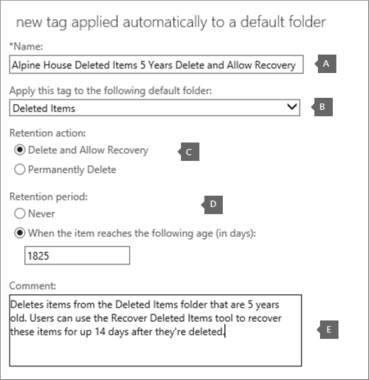

# <a name="set-up-an-archive-and-deletion-policy-for-mailboxes-in-your-organization"></a>Einrichten einer Archivierungs- und Löschrichtlinie für Postfächer in Ihrer Organisation

In Microsoft 365 können Administratoren eine Archivierungs- und Löschrichtlinie erstellen, die Elemente automatisch in das Archivpostfach eines Benutzers verschiebt und Elemente automatisch aus dem Postfach löscht. Der Administrator erstellt dazu eine Aufbewahrungsrichtlinie, die Postfächern zugewiesen ist, und verschiebt Elemente nach einem bestimmten Zeitraum in das Archivpostfach eines Benutzers und löscht auch Elemente aus dem Postfach, nachdem sie eine bestimmte Altersgrenze erreicht haben. Die eigentlichen Regeln, die festlegen, welche Elemente verschoben oder gelöscht werden und wann dies geschieht, werden als Aufbewahrungstags bezeichnet. Aufbewahrungstags sind mit einer Aufbewahrungsrichtlinie verknüpft, die wiederum dem Postfach eines Benutzers zugewiesen ist. Ein Aufbewahrungstag wendet Aufbewahrungseinstellungen auf einzelne Nachrichten und Ordner im Postfach eines Benutzers an. Sie definiert, wie lange eine Nachricht im Postfach verbleibt und welche Aktion ausgeführt wird, wenn die Nachricht das angegebene Aufbewahrungszeitalter erreicht. Wenn eine Nachricht ihr Aufbewahrungszeitalter erreicht, wird sie entweder in das Archivpostfach des Benutzers verschoben oder gelöscht.
  
Mit den Schritten in diesem Artikel wird eine Archivierungs- und Aufbewahrungsrichtlinie für eine fiktive Organisation namens "Alpine House" eingerichtet. Das Einrichten dieser Richtlinie umfasst die folgenden Aufgaben:
  
- Aktivieren eines Archivpostfachs für jeden Benutzer in der Organisation. Dies bietet Benutzern zusätzlichen Postfachspeicher und ist erforderlich, damit eine Aufbewahrungsrichtlinie Elemente in das Archivpostfach verschieben kann. Außerdem können Benutzer Archivinformationen speichern, indem Elemente in ihr Archivpostfach verschoben werden.

- Erstellen von drei benutzerdefinierten Aufbewahrungstags mit folgenden Aufgaben:

  - Elemente, die 3 Jahre alt sind, werden automatisch in das Archivpostfach des Benutzers verschoben. Durch das Verschieben von Elementen in das Archivpostfach wird Speicherplatz im primären Postfach eines Benutzers frei.

  - Löscht automatisch Elemente, die 5 Jahre alt sind, aus dem Ordner Gelöschte Elemente. Dadurch wird auch Speicherplatz im primären Postfach des Benutzers frei. Benutzer können diese Elemente bei Bedarf wiederherstellen. Weitere Informationen finden Sie in der Fußnote [im](#more-information) Abschnitt Weitere Informationen. 

  - Löscht automatisch (und dauerhaft) Elemente, die 7 Jahre alt sind, sowohl aus dem primären als auch aus dem Archivpostfach. Aufgrund von Compliancebestimmungen müssen einige Organisationen E-Mails für einen bestimmten Zeitraum beibehalten. Nach Ablauf dieses Zeitraums möchte eine Organisation diese Elemente möglicherweise endgültig entfernen.

- Erstellen einer neuen Aufbewahrungsrichtlinie und Hinzufügen der neuen benutzerdefinierten Aufbewahrungstags. Darüber hinaus fügen Sie der neuen Aufbewahrungsrichtlinie auch integrierte Aufbewahrungstags hinzu. Dies umfasst persönliche Tags, die Benutzer Elementen in ihrem Postfach zuweisen können. Sie fügen außerdem ein Aufbewahrungstag hinzu, das Elemente aus dem Ordner "Wiederherstellbare Elemente" im primären Postfach des Benutzers in den Ordner "Wiederherstellbare Elemente" in ihrem Archivpostfach verschiebt. Dadurch wird Speicherplatz im Ordner "Wiederherstellbare Elemente" eines Benutzers freigegeben, wenn das Postfach in der Warteschleife platziert wird.

Sie können einige oder alle Schritte in diesem Artikel ausführen, um eine Archiv- und Löschrichtlinie für Postfächer in Ihrer eigenen Organisation zu erstellen. Es wird empfohlen, diesen Prozess auf einigen Postfächern zu testen, bevor Sie ihn für alle Postfächer in Ihrer Organisation implementieren.
  
## <a name="before-you-set-up-an-archive-and-deletion-policy"></a>Vor dem Einrichten einer Archiv- und Löschrichtlinie

- Sie müssen ein globaler Administrator in Ihrer Organisation sein, um die Schritte in diesem Thema ausführen zu können. 

- Wenn Sie ein neues Benutzerkonto erstellen und dem Benutzer eine Exchange Online-Lizenz zuweisen, wird automatisch ein Postfach für den Benutzer erstellt. Wenn das Postfach erstellt wird, wird ihm automatisch eine Standardaufbewahrungsrichtlinie mit dem Namen Standard-MRM-Richtlinie zugewiesen. In diesem Artikel erstellen Sie eine neue Aufbewahrungsrichtlinie und weisen sie dann Benutzerpostfächern zu, und ersetzen dabei die Standard-MRM-Richtlinie. Einem Postfach kann immer nur eine Aufbewahrungsrichtlinie zugewiesen werden.

- Weitere Informationen zu Aufbewahrungstags und Aufbewahrungsrichtlinien in Exchange Online finden Sie unter [Aufbewahrungstags und Aufbewahrungsrichtlinien](/exchange/security-and-compliance/messaging-records-management/retention-tags-and-policies).

## <a name="step-1-enable-archive-mailboxes-for-users"></a>Schritt 1: Aktivieren von Archivpostfächern für Benutzer

Der erste Schritt besteht im Aktivieren des Archivpostfachs für jeden Benutzer in Ihrer Organisation. Das Archivpostfach eines Benutzers muss aktiviert sein, damit ein Aufbewahrungstag mit der Aufbewahrungsaktion "In Archiv verschieben" das Element nach Ablauf des Aufbewahrungszeitraums verschieben kann.
  
> [!NOTE]
> Sie können Archivpostfächer während dieses Vorgangs jederzeit aktivieren, solange sie zu einem bestimmten Zeitpunkt aktiviert sind, bevor Sie den Vorgang abschließen. Wenn ein Archivpostfach nicht aktiviert ist, werden keine Aktionen für Elemente ergriffen, denen eine Archiv- oder Löschrichtlinie zugewiesen ist.
  
1. Wechseln Sie zu [https://protection.office.com](https://protection.office.com).

2. Melden Sie sich mit Ihrem globalen Administratorkonto an.
    
3. Wechseln Sie im Security & Compliance Center zu **Information Governance** \> **Archive**.

    Eine Liste der Postfächer in Ihrer Organisation wird angezeigt und gibt an, ob das entsprechende Archivpostfach aktiviert oder deaktiviert ist.

4. Wählen Sie alle Postfächer aus, indem Sie auf das  erste In der Liste klicken, die Umschalttaste drücken und dann auf das letzte in der Liste klicken.

    > [!TIP]
    > In diesem Schritt wird davon ausgegangen, dass keine Archivpostfächer aktiviert sind. Wenn Postfächer mit aktivierten Archiven aktiviert  sind, halten Sie die STRG-TASTE gedrückt, und klicken Sie auf jedes Postfach mit einem deaktivierten Archivpostfach. Sie können auch auf den Spaltenkopf **Archivpostfach** klicken, um die Zeilen basierend darauf zu sortieren, ob das Archivpostfach aktiviert oder deaktiviert ist, um die Auswahl von Postfächern zu vereinfachen.
  
5. Klicken Sie im Detailbereich unter **Massenbearbeitung** auf **Aktivieren**.

    Es wird eine Warnung angezeigt, dass Elemente, die älter als zwei Jahre sind, in das neue Archivpostfach verschoben werden. Dies liegt daran, dass die Standardaufbewahrungsrichtlinie, der beim Erstellen ein neues Benutzerpostfach zugewiesen wurde, über ein Standardrichtlinientag für das Archiv verfügt, das ein Aufbewahrungsalter von 2 Jahren hat. Das standardrichtlinientag für das benutzerdefinierte Archiv, das Sie in Schritt 2 erstellen, hat ein Aufbewahrungsalter von 3 Jahren. Das bedeutet, dass Elemente, die älter als 3 Jahre sind, in das Archivpostfach verschoben werden.

6. Klicken **Sie auf Ja,** um die Warnmeldung zu schließen und den Prozess zum Aktivieren des Archivpostfachs für jedes ausgewählte Postfach zu starten.

7. Klicken Sie nach Abschluss des Vorgangs auf **Aktualisieren,** um die Liste auf der  **zu** aktualisieren.

    Das Archivpostfach ist für alle Benutzer in Ihrer Organisation aktiviert.

    

## <a name="step-2-create-new-retention-tags-for-the-archive-and-deletion-policies"></a>Schritt 2: Erstellen neuer Aufbewahrungstags für die Archiv- und Löschrichtlinien

In diesem Schritt erstellen Sie die drei benutzerdefinierten Aufbewahrungstags, die zuvor beschrieben wurden.
  
- Alpine House 3 Year Move to Archive (custom archive policy)

- Alpine House 7 Year PermanentLy Delete (benutzerdefinierte Löschrichtlinie)

- Alpine House Deleted Items 5 Years Delete and Allow Recovery (benutzerdefiniertes Tag für den Ordner "Gelöschte Elemente")

Zum Erstellen neuer Aufbewahrungstags verwenden Sie das Exchange Admin Center (EAC) in Ihrer Exchange Online-Organisation. Verwenden Sie unbedingt die klassische Version der EAC.
  
1. Wechseln Sie [https://admin.protection.outlook.com/ecp/](https://admin.protection.outlook.com/ecp/) zu, und melden Sie sich mit Ihren Anmeldeinformationen an.
  
2. Wechseln Sie in der EAC zu **Aufbewahrungstags für die**  >  **Complianceverwaltung**

    Eine Liste der Aufbewahrungstags für Ihre Organisation wird angezeigt.

### <a name="create-a-custom-archive-default-policy-tag"></a>Erstellen eines benutzerdefinierten Standardrichtlinientags für Das Archiv
  
Zuerst erstellen Sie ein benutzerdefiniertes Standardrichtlinientag (Default Policy Tag, DPT), das Elemente nach 3 Jahren in das Archivpostfach verschiebt.
  
1. Klicken Sie **auf der** Seite Aufbewahrungstags auf **Neues Tag** Neues Symbol, und wählen Sie dann automatisch auf das gesamte Postfach angewendet aus  **(Standard).**

2. Füllen Sie **auf der Seite Neues Tag, das automatisch auf das gesamte Postfach angewendet wird (Standard),** die folgenden Felder aus: 

    
  
   1. **Name** Geben Sie einen Namen für das neue Aufbewahrungstag ein. 

   2. **Aufbewahrungsaktion** Wählen **Sie In Archiv verschieben** aus, um Elemente nach Ablauf des Aufbewahrungszeitraums in das Archivpostfach zu verschieben.

   3. **Aufbewahrungszeitraum** Wählen Sie Wenn das Element das folgende Alter **(in Tagen)** erreicht, und geben Sie dann die Dauer des Aufbewahrungszeitraums ein. In diesem Szenario werden Elemente nach 1095 Tagen (3 Jahren) in das Archivpostfach verschoben.

   4. **Kommentar** (Optional) Geben Sie einen Kommentar ein, der den Zweck des benutzerdefinierten Aufbewahrungstags erläutert.

3. Klicken **Sie auf Speichern,** um die benutzerdefinierte Archiv-DPT zu erstellen.

    Das neue Archiv-DPT wird in der Liste der Aufbewahrungstags angezeigt.

### <a name="create-a-custom-deletion-default-policy-tag"></a>Erstellen eines benutzerdefinierten Lösch-Standardrichtlinientags
  
Als Nächstes erstellen Sie eine weitere benutzerdefinierte DPT, aber diese richtlinie ist eine Löschrichtlinie, die Elemente nach 7 Jahren endgültig löscht.
  
1. Klicken Sie **auf der** Seite Aufbewahrungstags auf **Neues Tag** Neues Symbol, und wählen Sie dann automatisch auf das gesamte Postfach angewendet aus  **(Standard).**

2. Füllen Sie **auf der Seite Neues Tag, das automatisch auf das gesamte Postfach angewendet wird (Standard),** die folgenden Felder aus: 

    
  
   1. **Name** Geben Sie einen Namen für das neue Aufbewahrungstag ein. 

   2. **Aufbewahrungsaktion** Wählen **Sie Dauerhaft löschen aus,** um Elemente aus dem Postfach zu löschen, wenn der Aufbewahrungszeitraum abläuft.

   3. **Aufbewahrungszeitraum** Wählen Sie Wenn das Element das folgende Alter **(in Tagen)** erreicht, und geben Sie dann die Dauer des Aufbewahrungszeitraums ein. In diesem Szenario werden Elemente nach 2555 Tagen (7 Jahre) gelöscht.

   4. **Kommentar** (Optional) Geben Sie einen Kommentar ein, der den Zweck des benutzerdefinierten Aufbewahrungstags erläutert. 

3. Klicken **Sie auf Speichern,** um die benutzerdefinierte Lösch-DPT zu erstellen. 

    Das neue Lösch-DPT wird in der Liste der Aufbewahrungstags angezeigt.

### <a name="create-a-custom-retention-policy-tag-for-the-deleted-items-folder"></a>Erstellen eines benutzerdefinierten Aufbewahrungsrichtlinientags für den Ordner "Gelöschte Elemente"
  
Das letzte Aufbewahrungstag, das Sie erstellen, ist ein benutzerdefiniertes Aufbewahrungsrichtlinientag (Retention Policy Tag, RPT) für den Ordner Gelöschte Elemente. Dieses Tag löscht Elemente im Ordner Gelöschte Elemente nach 5 Jahren und bietet einen Wiederherstellungszeitraum, in dem Benutzer das Tool Gelöschte Elemente wiederherstellen zum Wiederherstellen eines Elements verwenden können.
  
1. Klicken Sie **auf der** Seite Aufbewahrungstags auf **Neues Tag** Neues Symbol, und wählen Sie dann automatisch auf einen  **Standardordner angewendet aus.**

2. Füllen Sie auf der Seite Neues **Tag, das automatisch auf eine Standardordnerseite** angewendet wird, die folgenden Felder aus:

    
  
   1. **Name** Geben Sie einen Namen für das neue Aufbewahrungstag ein. 

   2. **Anwenden dieses Tags auf den folgenden Standardordner** Wählen Sie in der Dropdownliste **Gelöschte Elemente aus.**

   3. **Aufbewahrungsaktion** Wählen **Sie Löschen und Wiederherstellung** zulassen aus, um Elemente nach Ablauf des Aufbewahrungszeitraums zu löschen, benutzern jedoch die Wiederherstellung eines gelöschten Elements innerhalb des Aufbewahrungszeitraums für gelöschte Elemente (standardmäßig 14 Tage) zu ermöglichen.

   4. **Aufbewahrungszeitraum** Wählen Sie Wenn das Element das folgende Alter **(in Tagen)** erreicht, und geben Sie dann die Dauer des Aufbewahrungszeitraums ein. In diesem Szenario werden Elemente nach 1825 Tagen (5 Jahre) gelöscht.

   5. **Kommentar** (Optional) Geben Sie einen Kommentar ein, der den Zweck des benutzerdefinierten Aufbewahrungstags erläutert. 

3. Klicken **Sie auf Speichern,** um das benutzerdefinierte RPT für den Ordner "Gelöschte Elemente" zu erstellen.

    Das neue RPT wird in der Liste der Aufbewahrungstags angezeigt.

## <a name="step-3-create-a-new-retention-policy"></a>Schritt 3: Erstellen einer neuen Aufbewahrungsrichtlinie

Nachdem Sie die benutzerdefinierten Aufbewahrungstags erstellt haben, besteht der nächste Schritt in der Erstellung einer neuen Aufbewahrungsrichtlinie und dem Hinzufügen der Aufbewahrungstags. Sie fügen die drei benutzerdefinierten Aufbewahrungstags, die Sie in Schritt 2 erstellt haben, und die integrierten Tags hinzu, die im ersten Abschnitt erwähnt wurden. In Schritt 4 weisen Sie diese neue Aufbewahrungsrichtlinie Benutzerpostfächern zu.
  
1. Wechseln Sie in der EAC zu **Aufbewahrungsrichtlinien für die**  >  **Complianceverwaltung.**

2. Klicken Sie **auf der Seite** Aufbewahrungsrichtlinien auf Neues **Symbol**  .

3. Geben Sie **im Feld Name** einen Namen für die neue Aufbewahrungsrichtlinie ein. Beispiel: **Richtlinie für das Archiv und löschen von "Alpine House".**

4. Klicken **Sie unter Aufbewahrungstags** auf **Neues**  hinzufügen.

    Eine Liste der Aufbewahrungstags in Ihrer Organisation wird angezeigt. Beachten Sie, dass die benutzerdefinierten Tags, die Sie in Schritt 2 erstellt haben, angezeigt werden.

5. Fügen Sie die 9 Aufbewahrungstags hinzu, die im folgenden Screenshot hervorgehoben sind (diese Tags werden im Abschnitt Weitere Informationen ausführlicher [beschrieben).](#more-information) Wenn Sie ein Aufbewahrungstag hinzufügen möchten, wählen Sie es aus, und klicken Sie dann auf **Hinzufügen.**

    
  
    > [!TIP]
    > Sie können mehrere Aufbewahrungstags  auswählen, indem Sie die STRG-TASTE gedrückt halten und dann auf jedes Tag klicken. 
  
6. Nachdem Sie die Aufbewahrungstags hinzugefügt haben, klicken Sie auf **OK**.

7. Klicken Sie **auf der Seite Neue** Aufbewahrungsrichtlinie auf **Speichern,** um die neue Richtlinie zu erstellen.

    Die neue Aufbewahrungsrichtlinie wird in der Liste angezeigt. Wählen Sie sie aus, um die mit ihr verknüpften Aufbewahrungstags im Detailbereich anzuzeigen.

    
  
## <a name="step-4-assign-the-new-retention-policy-to-user-mailboxes"></a>Schritt 4: Zuweisen der neuen Aufbewahrungsrichtlinie zu Benutzerpostfächern

Wenn ein neues Postfach erstellt wird, wird ihm standardmäßig eine Aufbewahrungsrichtlinie mit dem Namen Standard-MRM-Richtlinie zugewiesen. In diesem Schritt ersetzen Sie diese Aufbewahrungsrichtlinie (da einem Postfach nur eine Aufbewahrungsrichtlinie zugewiesen werden kann), indem Sie die neue Aufbewahrungsrichtlinie, die Sie in Schritt 3 erstellt haben, den Benutzerpostfächern in Ihrer Organisation zuweisen. In diesem Schritt wird davon ausgegangen, dass Sie die neue Richtlinie allen Postfächern in Ihrer Organisation zuweisen.
  
1. Wechseln Sie in der EAC zu **Empfänger**  >  **Postfächer**.

    Eine Liste aller Benutzerpostfächer in Ihrer Organisation wird angezeigt.

2. Wählen Sie alle Postfächer aus, indem Sie auf das  erste In der Liste klicken, die Umschalttaste drücken und dann auf das letzte in der Liste klicken. 

3. Klicken Sie im Detailbereich auf der rechten Seite der EAC unter **Massenbearbeitung** auf **Weitere Optionen**.

4. Klicken Sie unter **Aufbewahrungsrichtlinie** auf **Aktualisieren**.

5. Wählen Sie **auf** der Seite  Aufbewahrungsrichtlinie massen zuweisen in der Dropdownliste Aufbewahrungsrichtlinie auswählen die Aufbewahrungsrichtlinie aus, die Sie in Schritt 3 erstellt haben. Beispiel: **"Alpine House Archive and Retention Policy" ( Archiv- und Aufbewahrungsrichtlinie für das Alpenhaus**).

6. Klicken **Sie auf Speichern,** um die neue Aufbewahrungsrichtlinienzuweisung zu speichern.

7. Gehen Sie wie folgt vor, um zu überprüfen, ob die neue Aufbewahrungsrichtlinie Postfächern zugewiesen wurde:

   1. Wählen Sie auf der Seite **Postfächer** ein Postfach aus, und klicken Sie dann auf **Bearbeiten**  .

   2. Klicken Sie auf der Seite Postfacheigenschaften für den ausgewählten Benutzer auf **Postfachfeatures**.

   Der Name der neuen Richtlinie, die dem Postfach zugewiesen ist, wird in der Dropdownliste **Aufbewahrungsrichtlinie** angezeigt.

## <a name="optional-step-5-run-the-managed-folder-assistant-to-apply-the-new-settings"></a>(Optional) Schritt 5: Ausführen des Assistenten für verwaltete Ordner zum Anwenden der neuen Einstellungen

Nachdem Sie die neue Aufbewahrungsrichtlinie auf Postfächer in Schritt 4 angewendet haben, kann es in Exchange Online bis zu 7 Tage dauern, bis die neuen Aufbewahrungseinstellungen auf die Postfächer angewendet werden. Dies liegt daran, dass ein Prozess namens Assistent für *verwaltete* Ordner Postfächer mindestens einmal alle 7 Tage verarbeitet. Anstatt auf die Ausführung des Assistenten für verwaltete Ordner zu warten, können Sie dies erzwingen, indem Sie das **Cmdlet Start-ManagedFolderAssistant** in Exchange Online PowerShell ausführen.

 **Was geschieht, wenn Sie den Assistenten für verwaltete Ordner ausführen?** Sie wendet die Einstellungen in der Aufbewahrungsrichtlinie an, indem Elemente im Postfach überprüft und ermittelt werden, ob sie der Aufbewahrung unterliegen. Anschließend werden Aufbewahrungselemente mit dem entsprechenden Aufbewahrungstag gestempelt und dann die angegebene Aufbewahrungsaktion für Elemente ausgeführt, die ihr Aufbewahrungsalter über dem Aufbewahrungszeitraum hinaus abgelaufen sind.
  
Im Folgenden finden Sie die Schritte zum Herstellen einer Verbindung mit Exchange Online PowerShell, und führen Sie dann den Assistenten für verwaltete Ordner für jedes Postfach in Ihrer Organisation aus.

1. [Stellen Sie eine Verbindung mit Exchange Online PowerShell her](/powershell/exchange/connect-to-exchange-online-powershell).
  
2. Führen Sie die folgenden beiden Befehle aus, um den Assistenten für verwaltete Ordner für alle Benutzerpostfächer in Ihrer Organisation zu starten.

    ```powershell
    $Mailboxes = Get-Mailbox -ResultSize Unlimited -Filter {RecipientTypeDetails -eq "UserMailbox"}
    ```

    ```powershell
    $Mailboxes.Identity | Start-ManagedFolderAssistant
    ```

Das ist alles. Sie haben eine Archiv- und Löschrichtlinie für die Organisation "Alpenhaus" eingerichtet.

> [!NOTE]
> Wie bereits erwähnt, verarbeitet der Assistent für verwaltete Ordner Postfächer mindestens einmal alle 7 Tage. Es ist also möglich, dass ein Postfach häufiger vom Assistenten für verwaltete Ordner verarbeitet werden kann. Außerdem können Administratoren nicht vorhersagen, wie lange ein Postfach das nächste Mal vom Assistenten für verwaltete Ordner verarbeitet wird. Dies ist ein Grund, warum Sie es möglicherweise manuell ausführen möchten. Wenn Sie jedoch vorübergehend verhindern möchten, dass der Assistent für verwaltete Ordner die neuen Aufbewahrungseinstellungen auf ein Postfach anwenden kann, können Sie den Befehl ausführen, um die Verarbeitung eines Postfachs durch den Assistenten für verwaltete Ordner vorübergehend zu `Set-Mailbox -ElcProcessingDisabled $true` deaktivieren. Führen Sie den Befehl aus, um den Assistenten für verwaltete Ordner für ein Postfach erneut `Set-Mailbox -ElcProcessingDisabled $false` zu aktivieren. Wenn ein Postfachbenutzer über ein deaktiviertes Konto verfügt, verarbeiten wir die Verschieben von Elementen zum Archivieren für dieses Postfach nicht.
  
## <a name="optional-step-6-make-the-new-retention-policy-the-default-for-your-organization"></a>(Optional) Schritt 6: Festlegen der neuen Aufbewahrungsrichtlinie als Standard für Ihre Organisation

In Schritt 4 müssen Sie die neue Aufbewahrungsrichtlinie vorhandenen Postfächern zuweisen. Sie können Exchange Online jedoch so konfigurieren, dass die neue Aufbewahrungsrichtlinie neuen Postfächern zugewiesen wird, die in Zukunft erstellt werden. Verwenden Sie dazu Exchange Online PowerShell, um den Standardpostfachplan Ihrer Organisation zu aktualisieren. Ein *Postfachplan* ist eine Vorlage, die Eigenschaften für neue Postfächer automatisch konfiguriert.  In diesem optionalen Schritt können Sie die aktuelle Aufbewahrungsrichtlinie, die dem Postfachplan zugewiesen ist (standardmäßig die Standard-MRM-Richtlinie), durch die Aufbewahrungsrichtlinie ersetzen, die Sie in Schritt 3 erstellt haben. Nachdem Sie den Postfachplan aktualisiert haben, wird die neue Aufbewahrungsrichtlinie neuen Postfächern zugewiesen.

1. [Stellen Sie eine Verbindung mit Exchange Online PowerShell her](/powershell/exchange/connect-to-exchange-online-powershell).

2. Führen Sie den folgenden Befehl aus, um Informationen zu den Postfachplänen in Ihrer Organisation anzeigen.

    ```powershell
    Get-MailboxPlan | Format-Table DisplayName,RetentionPolicy,IsDefault
    ```

    Notieren Sie sich den Postfachplan, der als Standard festgelegt ist.

3. Führen Sie den folgenden Befehl aus, um die neue Aufbewahrungsrichtlinie zuzuordnen, die Sie in Schritt 3 erstellt haben (z. B. "Almhausarchiv" und **"Aufbewahrungsrichtlinie")** dem Standardpostfachplan. In diesem Beispiel wird davon ausgegangen, dass der Name des Standardpostfachplans **ExchangeOnlineEnterprise ist.**

    ```powershell
    Set-MailboxPlan "ExchangeOnlineEnterprise" -RetentionPolicy "Alpine House Archive and Retention Policy"
    ```

4. Sie können den Befehl in Schritt 2 erneut ausführen, um zu überprüfen, ob die dem Standardpostfachplan zugewiesene Aufbewahrungsrichtlinie geändert wurde.

## <a name="more-information"></a>Weitere Informationen

- Wie wird das Aufbewahrungsalter berechnet? Das Aufbewahrungszeitalter von Postfachelementen wird ab dem Zustellungsdatum oder dem Erstellungsdatum für Elemente wie Entwürfe von Nachrichten berechnet, die nicht gesendet, aber vom Benutzer erstellt werden. Wenn der Assistent für verwaltete Ordner Elemente in einem Postfach verarbeitet, werden alle Elemente, die Aufbewahrungstags mit der Aufbewahrungsaktion Löschen und Wiederherstellung zulassen oder Endgültig löschen aufweisen, mit einem Start- und einem Ablaufdatum gestempelt. Elemente mit einem Archivtag werden mit einem Verschiebedatum gestempelt. 

- Die folgende Tabelle enthält weitere Informationen zu jedem Aufbewahrungstag, das der benutzerdefinierten Aufbewahrungsrichtlinie hinzugefügt wird, die durch Ausführen der Schritte in diesem Thema erstellt wurde.

    | Aufbewahrungstag | Was dieses Tag macht | Integrierter oder benutzerdefinierter Benutzer? | Typ |
    |:-----|:-----|:-----|:-----|
    |Alpine House 3 Year Move to Archive  <br/> |Verschiebt Elemente, die 1095 Tage (3 Jahre) alt sind, in das Archivpostfach.  <br/> |Custom (Siehe [Schritt 2: Erstellen neuer Aufbewahrungstags für die Archiv- und Löschrichtlinien](#step-2-create-new-retention-tags-for-the-archive-and-deletion-policies))  <br/> |Standardrichtlinientag (Archiv); Dieses Tag wird automatisch auf das gesamte Postfach angewendet.  <br/> |
    |Alpine House 7 Year Permanent Delete  <br/> |Löscht Elemente im primären Postfach oder im Archivpostfach dauerhaft, wenn sie 7 Jahre alt sind.  <br/> |Custom (Siehe [Schritt 2: Erstellen neuer Aufbewahrungstags für die Archiv- und Löschrichtlinien](#step-2-create-new-retention-tags-for-the-archive-and-deletion-policies))  <br/> |Standardrichtlinientag (Löschen); Dieses Tag wird automatisch auf das gesamte Postfach angewendet.  <br/> |
    |Alpine House Deleted Items 5 Years Delete and Allow Recovery  <br/> |Löscht Elemente aus dem Ordner Gelöschte Elemente, die 5 Jahre alt sind. Benutzer können diese Elemente bis zu 14 Tage nach dem Löschen wiederherstellen.<sup>\*</sup> <br/> |Custom (Siehe [Schritt 2: Erstellen neuer Aufbewahrungstags für die Archiv- und Löschrichtlinien](#step-2-create-new-retention-tags-for-the-archive-and-deletion-policies))  <br/> |Aufbewahrungsrichtlinientag (Gelöschte Elemente); Dieses Tag wird automatisch auf Elemente im Ordner Gelöschte Elemente angewendet.  <br/> |
    |Wiederherstellbare Elemente 14 Tage In Archiv verschieben  <br/> |Verschiebt Elemente, die sich seit 14 Tagen im Ordner "Wiederherstellbare Elemente" befinden, in den Ordner "Wiederherstellbare Elemente" im Archivpostfach.  <br/> |Integriert  <br/> |Aufbewahrungsrichtlinientag (Wiederherstellbare Elemente); Dieses Tag wird automatisch auf Elemente im Ordner "Wiederherstellbare Elemente" angewendet.  <br/> |
    |Junk-E-Mail  <br/> |Löscht Elemente, die sich seit 30 Tagen im Junk-E-Mail-Ordner befinden, dauerhaft. Benutzer können diese Elemente bis zu 14 Tage nach dem Löschen wiederherstellen.<sup>\*</sup> <br/> |Integriert  <br/> |Aufbewahrungsrichtlinientag (Junk-E-Mail); Dieses Tag wird automatisch auf Elemente im Junk-E-Mail-Ordner angewendet.  <br/> |
    |1 Monat, löschen  <br/> |Löscht Elemente, die 30 Tage alt sind, dauerhaft. Benutzer können diese Elemente bis zu 14 Tage nach dem Löschen wiederherstellen.<sup>\*</sup> <br/> |Integriert  <br/> |Persönlich; Dieses Tag kann von Benutzern angewendet werden.  <br/> |
    |1 Jahr, löschen  <br/> |Löscht Elemente, die 365 Tage alt sind, dauerhaft. Benutzer können diese Elemente bis zu 14 Tage nach dem Löschen wiederherstellen.<sup>\*</sup> <br/> |Integriert  <br/> |Persönlich; Dieses Tag kann von Benutzern angewendet werden.  <br/> |
    |Nie löschen  <br/> |Dieses Tag verhindert, dass Elemente von einer Aufbewahrungsrichtlinie gelöscht werden.  <br/> |Integriert  <br/> |Persönlich; Dieses Tag kann von Benutzern angewendet werden.  <br/> |
    |Persönlich, 1 Jahre, in Archiv verschieben  <br/> |Verschiebt Elemente nach 1 Jahr in das Archivpostfach.  <br/> |Integriert  <br/> |Persönlich; Dieses Tag kann von Benutzern angewendet werden.  <br/> |

    > <sup>\*</sup> Benutzer können das Tool Gelöschte Elemente wiederherstellen in Outlook und Outlook im Web (früher als Outlook Web App bezeichnet) verwenden, um ein gelöschtes Element innerhalb des Aufbewahrungszeitraums für gelöschte Elemente wiederhergestellt zu werden, der standardmäßig 14 Tage in Exchange Online beträgt. Ein Administrator kann Windows PowerShell, um den Aufbewahrungszeitraum für gelöschte Elemente auf maximal 30 Tage zu erhöhen. Weitere Informationen finden Sie unter: [Wiederherstellen](https://support.office.com/article/49e81f3c-c8f4-4426-a0b9-c0fd751d48ce) gelöschter Elemente in Outlook für Windows und Ändern des Aufbewahrungszeitraums für gelöschte Elemente [für ein Postfach in Exchange Online](https://www.microsoft.com/?ref=go)
  
- Die Verwendung des Aufbewahrungstags "Wiederherstellbare Elemente **14** Tage In Archiv verschieben" hilft, Speicherplatz im Ordner "Wiederherstellbare Elemente" im primären Postfach des Benutzers frei zu machen. Dies ist nützlich, wenn das Postfach eines Benutzers in der Warteschleife platziert wird, was bedeutet, dass das Postfach des Benutzers niemals endgültig gelöscht wird. Ohne das Verschieben von Elementen in das Archivpostfach ist es möglich, dass das Speicherkontingent für den Ordner "Wiederherstellbare Elemente" im primären Postfach erreicht wird. Weitere Informationen dazu und wie Sie dies vermeiden können, finden Sie unter Erhöhen des Kontingents für wiederherstellbare Elemente [für Postfächer, die im](./increase-the-recoverable-quota-for-mailboxes-on-hold.md)Archiv gespeichert sind.