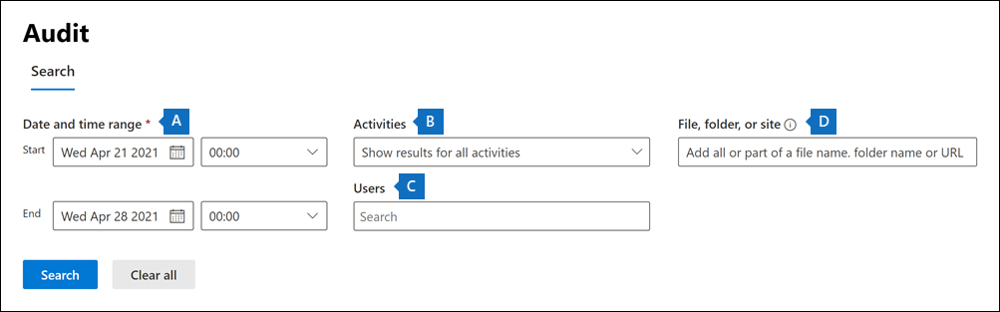

# Einrichten der Standardüberwachung in Microsoft 365

Mit der grundlegenden Microsoft 365 können Sie nach Überwachungsdatensätzen für Aktivitäten suchen, die in den verschiedenen Microsoft 365 von Benutzern und Administratoren ausgeführt werden. Da die Standardüberwachung für die meisten Microsoft 365 und Office 365-Organisationen standardmäßig aktiviert ist, müssen Sie nur einige Weniges tun, bevor Sie und andere Personen in Ihrer Organisation das Überwachungsprotokoll durchsuchen können.

In diesem Artikel werden die folgenden Schritte erläutert, die zum Einrichten der Standardüberwachung erforderlich sind.

Diese Schritte umfassen die Sicherstellung der richtigen Organisationsabonnements und Benutzerlizenzierung, die erforderlich sind, um Überwachungsdatensätze zu generieren und zu erhalten, und das Zuweisen von Berechtigungen zu Teammitgliedern ihrer Sicherheitsvorgänge, IT- und Compliance- und Rechtsteams, damit das Überwachungsprotokoll durchsucht werden kann.

Weitere Informationen finden Sie unter [Grundlegende Überwachung in Microsoft 365](auditing-solutions-overview.md#basic-auditing).

## Schritt 1: Überprüfen des Organisationsabonnements und der Benutzerlizenzierung

Für die Lizenzierung für die Standardüberwachung ist das entsprechende Organisationsabonnement erforderlich, das Zugriff auf das Suchtool für Überwachungsprotokolle und die Benutzerlizenzierung bietet, die zum Protokollieren und Beibehalten von Überwachungsdatensätzen erforderlich ist.

Wenn eine überwachte Aktivität von einem Benutzer oder Administrator ausgeführt wird, wird ein Überwachungsdatensatz erstellt und im Überwachungsprotokoll Ihrer Organisation gespeichert. In der Standardüberwachung werden Überwachungsdatensätze 90 Tage lang im Überwachungsprotokoll aufbewahrt und durchsucht.

Eine Liste der Abonnement- und Lizenzierungsanforderungen für die Standardüberwachung finden Sie unter [Auditing solutions in Microsoft 365](auditing-solutions-overview.md#licensing-requirements).

## Schritt 2: Zuweisen von Berechtigungen zum Durchsuchen des Überwachungsprotokolls

Administratoren und Mitgliedern von Untersuchungsteams muss die Rolle View-Only Überwachungsprotokolle oder Überwachungsprotokolle in Exchange Online, um das Überwachungsprotokoll zu durchsuchen. Standardmäßig sind diese Rollen im Exchange Admin Center zugewiesen den Rollengruppen „Complianceverwaltung“ und „Organisationsverwaltung“ auf der Seite **Berechtigungen**. Globale Administratoren in Office 365 und Microsoft 365 werden automatisch als Mitglieder der Rollengruppe Organisationsverwaltung in Exchange Online. Damit ein Benutzer die Möglichkeit hat, das Überwachungsprotokoll mit minimalen Rechten zu durchsuchen, können Sie in Exchange Online eine benutzerdefinierte Rollengruppe erstellen, ihr die Rollen "Überwachungsprotokolle nur anzeigen" oder "Überwachungsprotokolle" hinzufügen und den Benutzer dann als Mitglied der neuen Rollengruppe hinzufügen. Weitere Informationen finden Sie unter [Verwalten von Rollengruppen in Exchange Online](/Exchange/permissions-exo/role-groups).

Der folgende Screenshot zeigt die beiden überwachungsbezogenen Rollen, die der Rollengruppe "Organisationsverwaltung" im Exchange zugewiesen sind.

## Schritt 3: Durchsuchen des Überwachungsprotokolls

Jetzt können Sie das Überwachungsprotokoll im compliance center Microsoft 365 durchsuchen.

1. Wechseln Sie zu, und melden Sie sich mit einem Konto an, dem die <https://compliance.microsoft.com> entsprechenden Überwachungsberechtigungen zugewiesen wurden.

2. Klicken Sie im linken Navigationsbereich Microsoft 365 Compliance Center auf **Alle** anzeigen und dann auf **Überwachung**.

3. Konfigurieren Sie **auf** der Seite Überwachung die Suche unter Verwendung der folgenden Bedingungen auf **der** Registerkarte Suchen. 

   

   1. **Datums- und Uhrzeitbereich**. Wählen Sie einen Datums- und Uhrzeitbereich aus, um die Ereignisse anzuzeigen, die innerhalb dieses Zeitraums aufgetreten sind. Das Datum und die Uhrzeit werden in Ortszeit angezeigt. Die letzten sieben Tage sind standardmäßig ausgewählt.
  
   2. **Aktivitäten**. Wählen Sie die aktivitäten aus, nach der gesucht werden soll. Verwenden Sie das Suchfeld, um nach Aktivitäten zu suchen, die der Liste hinzugefügt werden. Eine Teilliste der überwachten Aktivitäten finden Sie unter [Audited activities](search-the-audit-log-in-security-and-compliance.md#audited-activities). Lassen Sie dieses Feld leer, um Einträge für alle überwachten Aktivitäten zurückzukehren.
  
   3. **Benutzer**.  Klicken Sie in dieses Feld, und geben Sie den Namen der Benutzer ein, für die Suchergebnisse angezeigt werden sollen. Die Überwachungsprotokolleinträge für die ausgewählten Aktivitäten, die von den benutzern ausgeführt werden, die Sie in diesem Feld auswählen, werden in der Liste der Ergebnisse angezeigt. Lassen Sie dieses Feld leer, um die Einträge für alle Benutzer (und Dienstkonten) in Ihrer Organisation zurückzugeben.
  
   4. **Datei, Ordner oder Website**. Geben Sie einen oder alle Datei- oder Ordnernamen ein, um nach Aktivitäten im Zusammenhang mit der Ordnerdatei zu suchen, die das angegebene Schlüsselwort enthält. Sie können auch die URL einer Datei oder eines Ordners verwenden. Wenn Sie eine URL einer Datei oder eines Ordners verwenden, stellen Sie sicher, dass sie den vollständigen URL-Pfad eingeben oder wenn Sie einen Teil der URL eingeben, keine Sonderzeichen oder Leerzeichen enthalten. Lassen Sie dieses Feld leer, um Einträge für alle Dateien und Ordner in Ihrer Organisation zurückzugeben.

4. Klicken Sie **auf Suchen,** um die Suche ausführen zu können.

Es wird eine neue Seite angezeigt, die zeigt, dass die Überwachungsprotokollsuche ausgeführt wird. Nach Abschluss der Suche werden Überwachungsdatensätze auf der Seite angezeigt. Klicken Sie auf einen Datensatz, um eine Flyoutseite mit detaillierten Eigenschaften anzeigen zu können.

Ausführlichere Anweisungen finden Sie unter [Durchsuchen des Überwachungsprotokolls im Compliance Center](search-the-audit-log-in-security-and-compliance.md).
