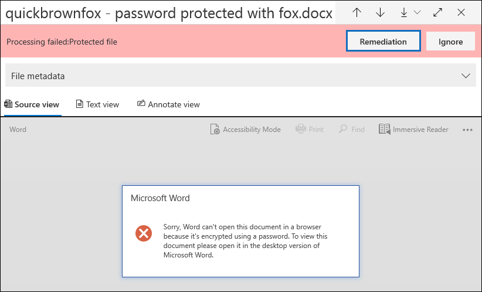

# Korrektur von Fehlern einzelner Elemente

Durch die Fehlerkorrektur können erweiterte eDiscovery-Benutzerdaten Probleme beheben, durch die verhindert wird, dass Advanced eDiscovery die Inhalte ordnungsgemäß verarbeitet. Beispielsweise können Dateien, die kennwortgeschützt sind, nicht verarbeitet werden, da diese Dateien gesperrt oder verschlüsselt sind. Zuvor konnten Sie Fehler in Massen mithilfe [dieses Workflows](error-remediation-when-processing-data-in-advanced-ediscovery.md)nur beheben. Manchmal ist es jedoch nicht sinnvoll, Fehler in mehreren Dateien zu beheben, wenn Sie sich nicht sicher sind, ob eine dieser Dateien auf den Fall reagiert, den Sie untersuchen. Es ist auch möglicherweise nicht sinnvoll, Fehler zu beheben, bevor Sie die Datei Metadaten (beispielsweise den Dateispeicherort oder die Zugriffsberechtigung) überprüfen konnten, damit Sie Vorabentscheidungen zur Reaktionsfähigkeit treffen können. Ein neues Feature namens " *Single Item Error Remediation* " gibt eDiscovery-Managern die Möglichkeit, die Metadaten von Dateien mit einem Verarbeitungsfehler anzuzeigen und den Fehler bei Bedarf direkt in der Überprüfungsgruppe zu beheben. In diesem Artikel wird erläutert, wie Sie Dateien mit Verarbeitungsfehlern in einem Überprüfungs Satz identifizieren, ignorieren und korrigieren.

## Identifizieren von Dokumenten mit Fehlern

Dokumente mit Verarbeitungsfehlern in einem Überprüfungs Satz werden nun identifiziert (mit einem Banner). Sie können den Fehler korrigieren oder ignorieren. Der folgende Screenshot zeigt das Fehler Banner Verarbeitung für ein Word-Dokument in einem Überprüfungs Sätze, die kennwortgeschützt sind. Beachten Sie außerdem, dass Sie die Datei Metadaten von Dokumenten mit Verarbeitungsfehlern anzeigen können.

Sie können auch nach Dokumenten mit Verarbeitungsfehlern suchen, indem Sie die **Verarbeitungsstatus** Bedingung beim [Abfragen der Dokumente in einem Überprüfungs Satz](review-set-search.md)verwenden.

### Fehler ignorieren

Sie können einen Verarbeitungsfehler ignorieren, indem Sie im Fehler Banner Verarbeitung auf **ignorieren** klicken. Wenn Sie einen Fehler ignorieren, wird das Dokument aus dem [Fehler Behebungs Workflow des Massen Fehlers](error-remediation-when-processing-data-in-advanced-ediscovery.md)entfernt. Nachdem ein Fehler ignoriert wurde, ändert sich die Farbe des Dokument Banners und gibt an, dass der Verarbeitungsfehler ignoriert wurde. Sie können die Entscheidung, den Fehler zu ignorieren, jederzeit rückgängig machen, indem Sie auf **Rückgängig**klicken.

Sie können auch nach allen Dokumenten suchen, bei denen ein Verarbeitungsfehler aufgetreten ist, der bei der Abfrage von Dokumenten in einem Überprüfungs Satz mit der Bedingung *ignorierte Verarbeitungsfehler* ignoriert wurde.

## Korrigieren eines Dokuments mit Fehlern

In einigen Fällen müssen Sie möglicherweise einen Verarbeitungsfehler in Dokumenten korrigieren (durch Entfernen eines Kennworts, Entschlüsseln einer verschlüsselten Datei oder Wiederherstellung eines beschädigten Dokuments) und dann das korrigierte Dokument dem Überprüfungs-Datensatz hinzufügen. Auf diese Weise können Sie das Fehlerdokument zusammen mit den anderen Dokumenten in der Überprüfungsgruppe überprüfen und exportieren. 

Führen Sie die folgenden Schritte aus, um ein einzelnes Dokument zu korrigieren:

1. Klicken Sie auf Download**Original** herunterladen, um eine Kopie der Datei auf einen lokalen Computer herunterzuladen. **** > 

   

2. Beheben Sie den Fehler in der Datei offline. Für verschlüsselte Dateien, für die eine Entschlüsselungssoftware erforderlich ist, müssen Sie entweder das Kennwort angeben und die Datei speichern oder einen Kennwortcracker verwenden, um den Kennwortschutz zu entfernen. Nachdem Sie die Datei behoben haben, fahren Sie mit dem nächsten Schritt fort.

3. Wählen Sie in der Überprüfungsgruppe die Datei mit dem Verarbeitungsfehler aus, den Sie behoben haben, und klicken Sie dann auf **Korrektur**.

   

4. Klicken Sie auf **Durchsuchen**, wechseln Sie zum Speicherort der korrigierten Datei auf Ihrem lokalen Computer, und wählen Sie dann die Datei aus.

   

    Nachdem Sie die korrigierte Datei ausgewählt haben, wird Sie automatisch in den Überprüfungs-Datensatz hochgeladen. Sie können den Verarbeitungsstatus der Datei nachverfolgen.

    

   Nach Abschluss der Verarbeitung können Sie das korrigierte Dokument anzeigen.

    

Weitere Informationen dazu, was geschieht, wenn ein Dokument korrigiert wird, finden Sie unter [Was geschieht, wenn Dateien behoben werden](error-remediation.md#what-happens-when-files-are-remediated).

## Suchen nach korrigierten Dokumenten

Sie können nach allen Dokumenten in einem Überprüfungs Satzes suchen, die mithilfe der Bedingung **Schlüsselwörter** korrigiert wurden, und die folgende Eigenschaft: Wert Paar: **IsFromErrorRemediation: true**angeben. Diese Eigenschaft steht auch in der Exportdatei zum Exportieren zur Verfügung, wenn Sie Dokumente aus einem Überprüfungs Sätzen exportieren.
