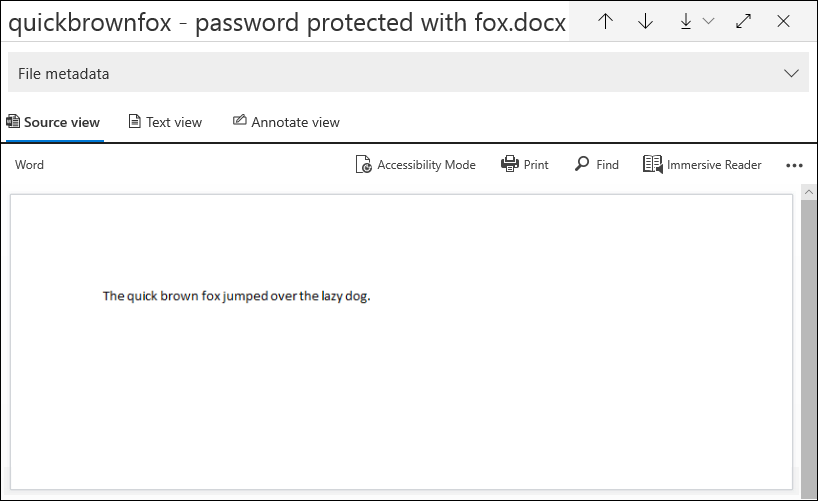

# Behebung einzelner Elemente in Advanced eDiscoverySingle item error remediation in Advanced eDiscovery

Die Fehlerbehebung Advanced eDiscovery Benutzern die Möglichkeit, Datenprobleme zu beheben, die verhindern, dass Advanced eDiscovery Inhalte ordnungsgemäß verarbeiten.Error remediation gives Advanced eDiscovery users the ability to rectify data issues that prevent Advanced eDiscovery from properly processing the content. Beispielsweise können kennwortgeschützte Dateien nicht verarbeitet werden, da diese Dateien gesperrt oder verschlüsselt sind.For example, files that are password protected can't be processed because those files are locked or encrypted. Bisher konnten Sie Fehler nur in Massen beheben, indem Sie diesen [Workflow verwenden.](error-remediation-when-processing-data-in-advanced-ediscovery.md)Previously, you could only remediate errors in bulk by using [this workflow](error-remediation-when-processing-data-in-advanced-ediscovery.md). Manchmal ist es jedoch nicht sinnvoll, Fehler in mehreren Dateien zu beheben, wenn Sie nicht sicher sind, ob eine dieser Dateien auf den fall reagiert, den Sie untersuchen.But sometimes, it doesn't make sense to remediate errors in multiple files when you’re unsure if any of those files are responsive to the case you’re investigating. Es ist möglicherweise auch nicht sinnvoll, Fehler zu beheben, bevor Sie die Dateimetadaten (z. B. Dateispeicherort oder Zugriff) überprüfen können, um Ihnen bei der Entscheidung über die Reaktionsfähigkeit zu helfen.It also might not make sense to remediate errors before you’ve had a chance to review the file metadata (such as file location or who had access) to help you make up-front decisions about responsiveness. Ein neues  Feature, das als Fehlerbehebung für einzelne Elemente bezeichnet wird, ermöglicht eDiscovery-Managern, die Metadaten von Dateien mit einem Verarbeitungsfehler zu sehen und den Fehler gegebenenfalls direkt im Überprüfungssatz zu beheben.A new feature called *single item error remediation* gives eDiscovery managers the ability to view the metadata of files with a processing error and if necessary remediate the error directly in the review set. In diesem Artikel wird erläutert, wie Dateien mit Verarbeitungsfehlern in einem Überprüfungssatz identifiziert, ignoriert und behoben werden.The article discusses how to identify, ignore, and remediate files with processing errors in a review set.

## Identifizieren von Dokumenten mit FehlernIdentify documents with errors

Dokumente mit Verarbeitungsfehlern in einem Überprüfungssatz werden jetzt identifiziert (mit einem Banner).Documents with processing errors in a review set are now identified (with a banner). Sie können den Fehler beheben oder ignorieren.You can remediate or ignore the error. Der folgende Screenshot zeigt das Verarbeitungsfehlerbanner für ein Word-Dokument in einem kennwortgeschützten Überprüfungssatz.The following screenshot shows the processing error banner for a Word document in a review set that is password-protected. Beachten Sie außerdem, dass Sie die Dateimetadaten von Dokumenten mit Verarbeitungsfehlern anzeigen können.Also notice that you can view the file metadata of documents with processing errors.

Sie können auch nach Dokumenten mit Verarbeitungsfehlern suchen, indem Sie die **Statusbedingung Processing** verwenden, wenn Sie die Dokumente [in einem Überprüfungssatz abfragen.](review-set-search.md)You can also search for documents that have processing errors by using the **Processing status** condition when [querying the documents in a review set](review-set-search.md).

### Fehler ignorierenIgnore errors

Sie können einen Verarbeitungsfehler ignorieren, indem Sie im Verarbeitungsfehlerbanner auf **Ignorieren** klicken.You can ignore a processing error by clicking **Ignore** in the processing error banner. Wenn Sie einen Fehler ignorieren, wird das Dokument aus dem [Massenfehlerbehebungsworkflow entfernt.](error-remediation-when-processing-data-in-advanced-ediscovery.md)When you ignore an error, the document is removed from the [bulk error remediation workflow](error-remediation-when-processing-data-in-advanced-ediscovery.md). Nachdem ein Fehler ignoriert wurde, ändert das Dokumentbanner die Farbe und gibt an, dass der Verarbeitungsfehler ignoriert wurde.After an error is ignored, the document banner changes color and indicates that the processing error was ignored. Sie können jederzeit die Entscheidung rückgängig machen, um den Fehler zu ignorieren, indem Sie auf **Wiederherstellen klicken.**At any time, you can revert the decision to ignore the error by clicking **Revert**.

Sie können auch nach allen Dokumenten suchen, bei denen ein Verarbeitungsfehler aufgetreten ist, der ignoriert wurde, indem Sie die Bedingung *Ignorierte* Verarbeitungsfehler beim Abfragen von Dokumenten in einem Überprüfungssatz verwenden.You can also search for all documents that had a processing error that was ignored by using the *Ignored processing errors* condition when querying documents in a review set.

## Korrigieren eines Dokuments mit FehlernRemediate a document with errors

Manchmal müssen Sie möglicherweise einen Verarbeitungsfehler in Dokumenten beheben (indem Sie ein Kennwort entfernen, eine verschlüsselte Datei entschlüsseln oder ein beschädigtes Dokument wiederherstellen) und dann das behobene Dokument dem Überprüfungssatz hinzufügen.Sometimes you may be required to remediate a processing error in documents (by removing a password, decrypting an encrypted file, or recovering a corrupted document) and then add the remediated document to the review set. Auf diese Weise können Sie das Fehlerdokument zusammen mit den anderen Dokumenten im Überprüfungssatz überprüfen und exportieren.This allows you to review and export the error document together with the other documents in the review set. 

Führen Sie die folgenden Schritte aus, um ein einzelnes Dokument zu sanieren:To remediate a single document, follow these steps:

1. Klicken **Sie auf Original** herunterladen, um eine Kopie der Datei auf einen lokalen Computer  >   herunterzuladen.Click **Download** > **Download original** to download a copy of the file to a local computer.

   

2. Beheben Sie den Fehler in der Datei offline.Remediate the error in the file offline. Für verschlüsselte Dateien, die Entschlüsselungssoftware erfordern würden, um den Kennwortschutz zu entfernen, geben Sie entweder das Kennwort an, und speichern Sie die Datei, oder verwenden Sie einen Kennwortknacker.For encrypted files, that would require decryption software, to remove password protection, either provide the password and save the file or use a password cracker. Nachdem Sie die Datei behoben haben, fahren Sie mit dem nächsten Schritt fort.After you remediate the file, go to the next step.

3. Wählen Sie im Überprüfungssatz die Datei mit dem von Ihnen behobenen Verarbeitungsfehler aus, und klicken Sie dann auf **Beheben**.In the review set, select the file with the processing error that you remediated, and then  click **Remediation**.

   

4. Klicken **Sie auf Durchsuchen,** wechseln Sie zum Speicherort der behobenen Datei auf dem lokalen Computer, und wählen Sie dann die Datei aus.Click **Browse**, go to the location of the remediated file on your local computer, and then select the file.

   

    Nachdem Sie die gelöschte Datei ausgewählt haben, wird sie automatisch in den Überprüfungssatz hochgeladen.After selecting the remediated file, it is automatically uploaded to the review set. Sie können den Verarbeitungsstatus der Datei nachverfolgen.You can track the processing status of the file.

    

   Nach Abschluss der Verarbeitung können Sie das behobene Dokument anzeigen.After processing is completed, you can view the remediated document.

    

Weitere Informationen dazu, was geschieht, wenn ein Dokument behoben wird, finden Sie unter Was geschieht, wenn Dateien [behoben werden.](error-remediation-when-processing-data-in-advanced-ediscovery.md#what-happens-when-files-are-remediated)For more information about what happens when a document is remediated, see [What happens when files are remediated](error-remediation-when-processing-data-in-advanced-ediscovery.md#what-happens-when-files-are-remediated).

## Suchen nach behobenen DokumentenSearch for remediated documents

Sie können nach allen Dokumenten in einem Überprüfungssatz suchen, die mithilfe der **Keywords-Bedingung** behoben wurden, und das folgende Property:Value-Paar angeben: **IsFromErrorRemediation:true**.You can search for all documents in a review set that were remediated by using the **Keywords** condition and specifying the following property:value pair: **IsFromErrorRemediation:true**. Diese Eigenschaft ist auch in der Exportladedatei verfügbar, wenn Sie Dokumente aus einem Überprüfungssatz exportieren.This property is also available in the export load file when you export documents from a review set.
