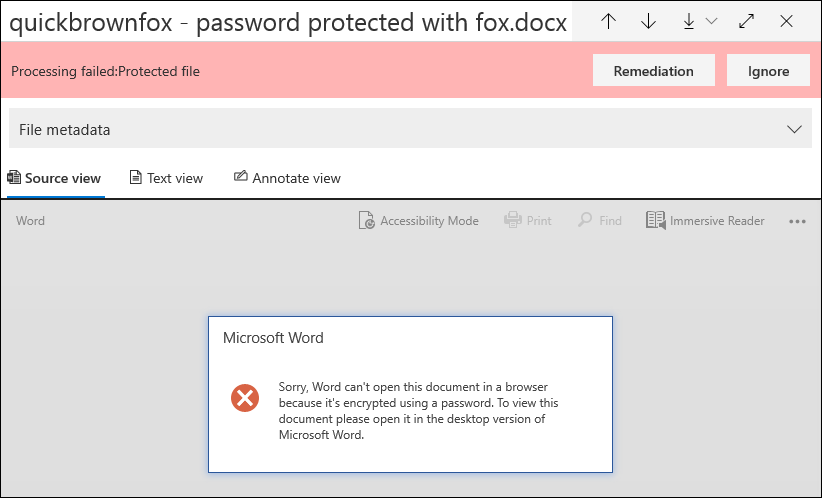
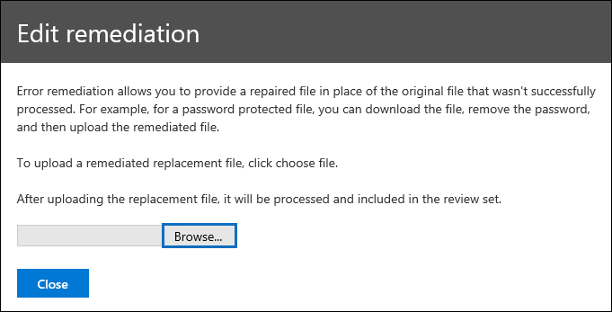

# Fehlerbehebung einzelner Elemente in Advanced eDiscoverySingle item error remediation in Advanced eDiscovery

Durch die Fehlerkorrektur können erweiterte eDiscovery-Benutzerdaten Probleme beheben, durch die verhindert wird, dass Advanced eDiscovery die Inhalte ordnungsgemäß verarbeitet.Error remediation gives Advanced eDiscovery users the ability to rectify data issues that prevent Advanced eDiscovery from properly processing the content. Beispielsweise können Dateien, die kennwortgeschützt sind, nicht verarbeitet werden, da diese Dateien gesperrt oder verschlüsselt sind.For example, files that are password protected can't be processed because those files are locked or encrypted. Zuvor konnten Sie Fehler in Massen mithilfe [dieses Workflows](error-remediation-when-processing-data-in-advanced-ediscovery.md)nur beheben.Previously, you could only remediate errors in bulk by using [this workflow](error-remediation-when-processing-data-in-advanced-ediscovery.md). Manchmal ist es jedoch nicht sinnvoll, Fehler in mehreren Dateien zu beheben, wenn Sie sich nicht sicher sind, ob eine dieser Dateien auf den Fall reagiert, den Sie untersuchen.But sometimes, it doesn't make sense to remediate errors in multiple files when you’re unsure if any of those files are responsive to the case you’re investigating. Es ist auch möglicherweise nicht sinnvoll, Fehler zu beheben, bevor Sie die Datei Metadaten (beispielsweise den Dateispeicherort oder die Zugriffsberechtigung) überprüfen konnten, damit Sie Vorabentscheidungen zur Reaktionsfähigkeit treffen können.It also might not make sense to remediate errors before you’ve had a chance to review the file metadata (such as file location or who had access) to help you make up-front decisions about responsiveness. Ein neues Feature namens " *Single Item Error Remediation* " gibt eDiscovery-Managern die Möglichkeit, die Metadaten von Dateien mit einem Verarbeitungsfehler anzuzeigen und den Fehler bei Bedarf direkt in der Überprüfungsgruppe zu beheben.A new feature called *single item error remediation* gives eDiscovery managers the ability to view the metadata of files with a processing error and if necessary remediate the error directly in the review set. In diesem Artikel wird erläutert, wie Sie Dateien mit Verarbeitungsfehlern in einem Überprüfungs Satz identifizieren, ignorieren und korrigieren.The article discusses how to identify, ignore, and remediate files with processing errors in a review set.

## Identifizieren von Dokumenten mit FehlernIdentify documents with errors

Dokumente mit Verarbeitungsfehlern in einem Überprüfungs Satz werden nun identifiziert (mit einem Banner).Documents with processing errors in a review set are now identified (with a banner). Sie können den Fehler korrigieren oder ignorieren.You can remediate or ignore the error. Der folgende Screenshot zeigt das Fehler Banner Verarbeitung für ein Word-Dokument in einem Überprüfungs Sätze, die kennwortgeschützt sind.The following screenshot shows the processing error banner for a Word document in a review set that is password-protected. Beachten Sie außerdem, dass Sie die Datei Metadaten von Dokumenten mit Verarbeitungsfehlern anzeigen können.Also notice that you can view the file metadata of documents with processing errors.

Sie können auch nach Dokumenten mit Verarbeitungsfehlern suchen, indem Sie die **Verarbeitungsstatus** Bedingung beim [Abfragen der Dokumente in einem Überprüfungs Satz](review-set-search.md)verwenden.You can also search for documents that have processing errors by using the **Processing status** condition when [querying the documents in a review set](review-set-search.md).

### Fehler ignorierenIgnore errors

Sie können einen Verarbeitungsfehler ignorieren, indem Sie im Fehler Banner Verarbeitung auf **ignorieren** klicken.You can ignore a processing error by clicking **Ignore** in the processing error banner. Wenn Sie einen Fehler ignorieren, wird das Dokument aus dem [Fehler Behebungs Workflow des Massen Fehlers](error-remediation-when-processing-data-in-advanced-ediscovery.md)entfernt.When you ignore an error, the document is removed from the [bulk error remediation workflow](error-remediation-when-processing-data-in-advanced-ediscovery.md). Nachdem ein Fehler ignoriert wurde, ändert sich die Farbe des Dokument Banners und gibt an, dass der Verarbeitungsfehler ignoriert wurde.After an error is ignored, the document banner changes color and indicates that the processing error was ignored. Sie können die Entscheidung, den Fehler zu ignorieren, jederzeit rückgängig machen, indem Sie auf **Rückgängig** klicken.At any time, you can revert the decision to ignore the error by clicking **Revert**.

Sie können auch nach allen Dokumenten suchen, bei denen ein Verarbeitungsfehler aufgetreten ist, der bei der Abfrage von Dokumenten in einem Überprüfungs Satz mit der Bedingung *ignorierte Verarbeitungsfehler* ignoriert wurde.You can also search for all documents that had a processing error that was ignored by using the *Ignored processing errors* condition when querying documents in a review set.

## Korrigieren eines Dokuments mit FehlernRemediate a document with errors

In einigen Fällen müssen Sie möglicherweise einen Verarbeitungsfehler in Dokumenten korrigieren (durch Entfernen eines Kennworts, Entschlüsseln einer verschlüsselten Datei oder Wiederherstellung eines beschädigten Dokuments) und dann das korrigierte Dokument dem Überprüfungs-Datensatz hinzufügen.Sometimes you may be required to remediate a processing error in documents (by removing a password, decrypting an encrypted file, or recovering a corrupted document) and then add the remediated document to the review set. Auf diese Weise können Sie das Fehlerdokument zusammen mit den anderen Dokumenten in der Überprüfungsgruppe überprüfen und exportieren.This allows you to review and export the error document together with the other documents in the review set. 

Führen Sie die folgenden Schritte aus, um ein einzelnes Dokument zu korrigieren:To remediate a single document, follow these steps:

1. Klicken **Sie** auf Download  >  **Original** herunterladen, um eine Kopie der Datei auf einen lokalen Computer herunterzuladen.Click **Download** > **Download original** to download a copy of the file to a local computer.

   

2. Beheben Sie den Fehler in der Datei offline.Remediate the error in the file offline. Für verschlüsselte Dateien, für die eine Entschlüsselungssoftware erforderlich ist, müssen Sie entweder das Kennwort angeben und die Datei speichern oder einen Kennwortcracker verwenden, um den Kennwortschutz zu entfernen.For encrypted files, that would require decryption software, to remove password protection, either provide the password and save the file or use a password cracker. Nachdem Sie die Datei behoben haben, fahren Sie mit dem nächsten Schritt fort.After you remediate the file, go to the next step.

3. Wählen Sie in der Überprüfungsgruppe die Datei mit dem Verarbeitungsfehler aus, den Sie behoben haben, und klicken Sie dann auf **Korrektur**.In the review set, select the file with the processing error that you remediated, and then  click **Remediation**.

   

4. Klicken Sie auf **Durchsuchen**, wechseln Sie zum Speicherort der korrigierten Datei auf Ihrem lokalen Computer, und wählen Sie dann die Datei aus.Click **Browse**, go to the location of the remediated file on your local computer, and then select the file.

   

    Nachdem Sie die korrigierte Datei ausgewählt haben, wird Sie automatisch in den Überprüfungs-Datensatz hochgeladen.After selecting the remediated file, it is automatically uploaded to the review set. Sie können den Verarbeitungsstatus der Datei nachverfolgen.You can track the processing status of the file.

    

   Nach Abschluss der Verarbeitung können Sie das korrigierte Dokument anzeigen.After processing is completed, you can view the remediated document.

    

Weitere Informationen dazu, was geschieht, wenn ein Dokument korrigiert wird, finden Sie unter [Was geschieht, wenn Dateien behoben werden](error-remediation-when-processing-data-in-advanced-ediscovery.md#what-happens-when-files-are-remediated).For more information about what happens when a document is remediated, see [What happens when files are remediated](error-remediation-when-processing-data-in-advanced-ediscovery.md#what-happens-when-files-are-remediated).

## Suchen nach korrigierten DokumentenSearch for remediated documents

Sie können nach allen Dokumenten in einem Überprüfungs Satzes suchen, die mithilfe der Bedingung **Schlüsselwörter** korrigiert wurden, und die folgende Eigenschaft: Wert Paar: **IsFromErrorRemediation: true** angeben.You can search for all documents in a review set that were remediated by using the **Keywords** condition and specifying the following property:value pair: **IsFromErrorRemediation:true**. Diese Eigenschaft steht auch in der Exportdatei zum Exportieren zur Verfügung, wenn Sie Dokumente aus einem Überprüfungs Sätzen exportieren.This property is also available in the export load file when you export documents from a review set.
