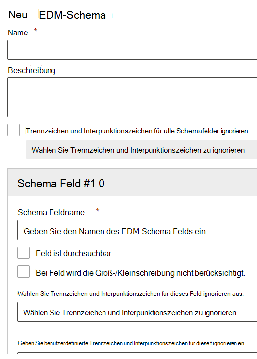

# Verwenden Sie den Assistenten für das Schema exakter Datenübereinstimmung und vertrauliche Informationstypen.Use the Exact Data Match Schema and Sensitive Information Type Wizard

[Das Erstellen eines benutzerdefinierten Typs vertraulicher Informationen mit auf genauer Datenübereinstimmung (Exact Data Match, EDM) basierender Klassifizierung](create-custom-sensitive-information-types-with-exact-data-match-based-classification.md) umfasst mehrere Schritte.[Creating a custom sensitive information type with Exact Data Match (EDM) based classification](create-custom-sensitive-information-types-with-exact-data-match-based-classification.md)  involves many steps.  Sie können diesen Assistenten verwenden, um Ihre Schema- und SIT-Musterdateien (Sensitive Information Type, Sit)-Musterdateien (Regelpaket) zu erstellen, um den Prozess zu vereinfachen.You can use this wizard to create your schema and sensitive information type (SIT) pattern (rule package) files to help simplify the process.

> [!NOTE]
> Der Assistent für das Schema genauer Datenübereinstimmung und vertraulicher Informationstypen ist nur für die World Wide- und GCC-Cloud verfügbar.The Exact Data Match Schema and Sensitive Information Type Wizard is only available for the World Wide and GCC clouds only.

Der Assistent kann verwendet werden an Stelle von:This wizard can be used instead of the:

- [Definieren des Schemas für Ihre Datenbank mit vertraulichen InformationenDefine the schema for your database of sensitive information](create-custom-sensitive-information-types-with-exact-data-match-based-classification.md#define-the-schema-for-your-database-of-sensitive-information)
- [Richten Sie ein Muster (Regelpaket) einSet up a pattern (rule package)](create-custom-sensitive-information-types-with-exact-data-match-based-classification.md#set-up-a-rule-package)

Schritte für [Teil 1: Einrichten der EDM-basierten Klassifizierung](create-custom-sensitive-information-types-with-exact-data-match-based-classification.md#part-1-set-up-edm-based-classification).steps in [Part 1: Set up EDM-based classification](create-custom-sensitive-information-types-with-exact-data-match-based-classification.md#part-1-set-up-edm-based-classification).

## VoraussetzungenPre-requisites

1. Machen Sie sich mit den Schritten vertraut, um einen benutzerdefinierten vertraulichen Informationstyp mit dem EDM-[Workflow auf einen Blick](create-custom-sensitive-information-types-with-exact-data-match-based-classification.md#the-work-flow-at-a-glance) zu erstellen.Familiarize yourself with the steps to create a custom sensitive information type with EDM [work flow at a glance](create-custom-sensitive-information-types-with-exact-data-match-based-classification.md#the-work-flow-at-a-glance).

2. Führen Sie die Schritte im Abschnitt [Vertrauliche Daten im .csv-Format speichern](create-custom-sensitive-information-types-with-exact-data-match-based-classification.md#save-sensitive-data-in-csv-format) durch.Perform the steps in the [Save sensitive data in .csv format](create-custom-sensitive-information-types-with-exact-data-match-based-classification.md#save-sensitive-data-in-csv-format) section.

## Verwenden Sie den Assistenten für das Schema für exakte Datenübereinstimmung und Muster vertraulicher InformationstypenUse the exact data match schema and sensitive information type pattern wizard

1. Wechseln Sie im Microsoft 365 Compliance Center Ihres Mandaten zu **Datenklassifizierung** > **Genaue Datenübereinstimmung**.In the Microsoft 365 Compliance center for your tenant go to **Data classification** > **Exact data matches**.

2. Wählen Sie **EDM-Schema erstellen**, um das Flyout des Assistenten für die Schema-Konfiguration zu öffnen.Choose **Create EDM schema** to open the schema wizard configuration flyout.

3. Geben Sie einen geeigneten **Namen** und eine **Beschreibung** ein.Fill in an appropriate **Name** and **Description**.

4. Wählen Sie **Trennzeichen und Interpunktionszeichen für alle Schemafelder** ignorieren aus, wenn Sie dieses Verhalten wünschen.Choose **Ignore delimiters and punctuation for all schema fields** if you want that behavior. Weitere Informationen zum Konfigurieren von EDM zum Ignorieren von Groß- und Kleinschreibung oder Trennzeichen finden Sie unter [Erstellen eines benutzerdefinierten vertraulichen Informationstyps mit einer EDM-basierten Klassifizierung (Exact Data Match).](create-custom-sensitive-information-types-with-exact-data-match-based-classification.md)To learn more about configuring EDM to ignore case or delimiters, see [Creating a custom sensitive information type with Exact Data Match (EDM) based classification](create-custom-sensitive-information-types-with-exact-data-match-based-classification.md).

5. Geben Sie die gewünschten Werte ein für Ihr **Schemafeld #1** und fügen Sie wenn notwendig weitere Felder ein.Fill in your desired values for your **Schema field #1** and add more fields as needed. 

> [!IMPORTANT]
> Mindestens eines, aber nicht mehr als fünf Ihrer Schemafelder müssen als durchsuchbar gekennzeichnet sein.At least one, but no more than five of your schema fields must be designated as searchable.

6. Wählen Sie Speichern aus.Choose save. Ihr Schema wird jetzt aufgeführt sein.Your schema will now be listed.

7. Wählen Sie **Vertrauliche EDM-Informationstypen** und **Erstellen von vertraulichen EDM-Informationstypen**, um den Assistenten für die Konfigurations von vertraulichen Informationstypen zu öffnen.Choose **EDM sensitive info types** and **Create EDM sensitive info type** to open the sensitive info type configuration wizard.

8. Wählen Sie **Auswahl eines bestehenden EDM-Schemas** und wählen Sie dann das Schema aus, das Sie in den Schritten 2–6 der Liste erstellt haben.Choose **Choose an existing EDM schema** and choose the schema you created in steps 2-6 from the list.

9. Wählen Sie **Weiter** und dann **Muster erstellen**.Choose **Next** and choose **Create pattern**.

10. Wählen Sie das **Konfidenzniveau** und das **Primäre Element** aus.Choose the **Confidence level** and **Primary element**.  Weitere Informationen zum Konfigurieren eines Musters finden Sie unter [Erstellen eines vertraulichen Informationstyps im Compliance-Center](create-a-custom-sensitive-information-type.md)To learn more about configuring a pattern, see [Create a custom sensitive information type in the Compliance Center](create-a-custom-sensitive-information-type.md)

11.  Wählen Sie den **Vertraulicher Informationstyp des primären Elementes**, um ihn zuzuordnen.Choose the **Primary element's sensitive info type** to associate it with. Weitere Informationen über die verfügbaren vertraulichen Informationstypen finden Sie unter [Entitätsdefinitionen für vertrauliche Informationstypen](sensitive-information-type-entity-definitions.md).See [Sensitive Information Type Entity Definitions](sensitive-information-type-entity-definitions.md) to learn more about the available sensitive information types.

12. Klicken Sie auf **Fertig**.Choose **Done**.

13. Wählen Sie ihre gewünschten **Konfidenzniveau und Zeichennähe**.Choose your desired **Confidence level and character proximity**.  Dies wird der Standardwert sein für sämtliche vertraulichen EDM-InformationstypenThis will be the default value for the whole EDM sensitive info type

13. Wählen Sie **"Muster erstellen"** aus, wenn Sie zusätzliche Muster für ihren vertraulichen EDM-Informationstyp erstellen möchten.Choose **Create pattern** if you want to create additional patterns for your EDM sensitive info type.

14. Wählen Sie **Weiter** und geben Sie einen **Namen** und eine **Beschreibung für Administratoren** ein.Choose **Next** and fill in a **Name** and **Description for admins**.

15. Überprüfen Sie und wählen Sie dann **Übermitteln** aus.Review and choose **Submit**.

Sie können ein Muster für vertrauliche Informationstypen löschen oder bearbeiten, indem Sie es auswählen, wodurch die Steuerelemente für das Löschen und Bearbeiten angezeigt werden.You can delete or edit the sensitive information type pattern by selecting it which surfaces the edit and delete controls.

> [!IMPORTANT]
> Wenn Sie ein Schema entfernen möchten, dieses aber bereits mit einem vertraulichen EDM-Informationstyp verbunden ist, dann müssen Sie zuerst den vertraulichen EDM-Informationstyp löschen, um das Schema löschen zu können.If you want to remove a schema, and it is already associated with an EDM sensitive info type, you must first delete the EDM sensitive info type, then you can delete the schema.

## Schritte nach der ErstellungPost creation steps

Nachdem Sie diesen Assistenten für die Erstellung der EDM-Schema- und -Musterdateien (Regelpaket) verwendet haben, müssen Sie trotzdem noch die Schritte in [Teil 2: Hashing und Hochladen der vertraulichen Daten](create-custom-sensitive-information-types-with-exact-data-match-based-classification.md#part-2-hash-and-upload-the-sensitive-data) durchführen, bevor Sie den benutzerdefinierten vertraulichen EDM-Informationstyp verwenden können.After you have used this wizard to create your EDM schema and pattern (rule package) files, you still have to perform the steps in [Part 2: Hash and upload the sensitive data](create-custom-sensitive-information-types-with-exact-data-match-based-classification.md#part-2-hash-and-upload-the-sensitive-data) before you can use the EDM custom sensitive information type.

Nachdem Sie überprüft haben, ob Die Tabelle mit vertraulichen Informationen ordnungsgemäß hochgeladen wurde, können Sie testen, ob sie ordnungsgemäß funktioniert.After verifying that your sensitive information table has correctly been uploaded, you can test that it's working properly.

1. Öffnen **Sie Compliance**  >  **Center-Datenklassifizierung**  >  **vertraulicher Informationstypen.**Open **Compliance center** > **Data classification** > **Sensitive Information Types**.
2. Wählen Sie Ihre EDM SIT aus der Liste aus, und wählen Sie dann im Flyoutbereich **"Testen"** aus.Select your EDM SIT from the list and then select **Test** in the flyout pane. 
3. Hochladen ein Element, das zu erkennende Daten enthält, z. B. erstellen Sie ein Element, das einige der Daten in der Tabelle mit vertraulichen Informationen enthält.Upload an item that contains data you want to detect, for example create an item that contains some of the data in your sensitive information table. Wenn Sie das konfigurierbare Übereinstimmungsfeature in Ihrem Schema verwendet haben, um ignorierte Trennzeichen zu definieren, stellen Sie sicher, dass das Element Beispiele mit und ohne diese Trennzeichen enthält.If you used the configurable match feature in your schema to define ignored delimiters, make sure the item includes examples with and without those delimiters.
4. Nachdem die Datei hochgeladen und gescannt wurde, überprüfen Sie, ob Übereinstimmungen mit Ihrer EDM SIT gefunden wurden.After the file has been uploaded and scanned, check for matches to your EDM SIT.
5. Wenn die **Testfunktion** in der SIT eine Übereinstimmung erkennt, stellen Sie sicher, dass sie nicht gekürzt oder nicht richtig extrahiert wird.If the **Test** function in the SIT detects a match, check that it is not trimming it or extracting it incorrectly. Beispielsweise durch Extrahieren einer Teilzeichenfolge der vollständigen Zeichenfolge, die erkannt werden soll, oder Durchlesen des ersten Worts in einer Zeichenfolge mit mehreren Wörtern oder Hinzufügen zusätzlicher Symbole oder Zeichen in die Extraktion.For example by extracting only a substring of the full string it is supposed to detect, or picking up only the first word in a multi-word string, or including extra symbols or characters in the extraction. Siehe [Sprache für reguläre Ausdrücke – Kurzübersicht](/dotnet/standard/base-types/regular-expression-language-quick-reference) für die Sprachreferenz für reguläre Ausdrücke.See [Regular Expression Language - Quick Reference](/dotnet/standard/base-types/regular-expression-language-quick-reference) for the regular expression language reference. 

### ProblembehandlungTroubleshooting

Wenn Sie keine Übereinstimmungen finden, versuchen Sie Folgendes:If you don't find any matches, try the following:
- Vergewissern Sie sich, dass Ihre vertraulichen Daten korrekt hochgeladen wurden, indem Sie die Befehle verwenden, die in [den Anleitungen zum Hochladen Ihrer vertraulichen Daten mit dem EDM-Tool](create-custom-sensitive-information-types-with-exact-data-match-based-classification.md)erläutert sind.Confirm that your sensitive data was uploaded correctly using the commands explained in [the guidance for uploading your sensitive data using the EDM tool](create-custom-sensitive-information-types-with-exact-data-match-based-classification.md).
- Überprüfen Sie, ob die von Ihnen in das Element eingegebenen Beispiele in der Tabelle mit vertraulichen Informationen vorhanden sind und dass die ignorierten Trennzeichen korrekt sind.Check that the examples you entered in the item are present in your sensitive information table and that the ignored delimiters are correct.
- **Testen** Sie die SIT, die Sie beim Konfigurieren des primären Elements in den einzelnen Mustern verwendet haben.**Test** the SIT you used when you configured the primary element in each of your patterns. Dadurch wird bestätigt, dass die SIT den Beispielen im Element entsprechen kann.This will confirm that the SIT is able to match the examples in the item. 
  -  Wenn die SIT, die Sie für ein primäres Element im EDM-Typ ausgewählt haben, keine Übereinstimmung im Element findet oder weniger Übereinstimmungen findet als erwartet, überprüfen Sie, ob sie Trennzeichen und Trennzeichen unterstützt, die im Inhalt vorhanden sind.If the SIT you selected for a primary element in the EDM type doesn't find a match in the item or finds fewer matches than you expected, check that it supports separators and delimiters that exist in the content. Achten Sie darauf, die ignorierten Trennzeichen einzuschließen, die in Ihrem Schema definiert sind.Be sure to include the ignored delimiters defined in your schema. 
  -  Wenn die **Testfunktion** überhaupt keine Inhalte erkennt, überprüfen Sie, ob die ausgewählte SIT Anforderungen für zusätzliche Schlüsselwörter oder andere Überprüfungen enthält.If the **Test** function does not detect any content at all, check if the SIT you selected includes requirements for additional keywords or other validations. Die integrierten SITs finden Sie unter [Entitätsdefinitionen für vertrauliche Informationstypen,](sensitive-information-type-entity-definitions.md) um zu überprüfen, welche Mindestanforderungen für die Übereinstimmung mit den einzelnen Typen erfüllt sind.For the built-in SITs, see [Sensitive information types entity definitions](sensitive-information-type-entity-definitions.md) to verify what the minimum requirements are for matching each type.
