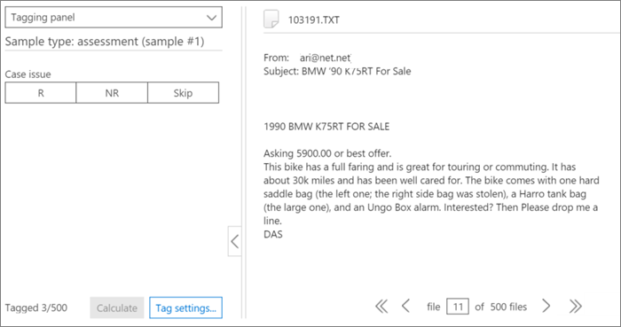

# Tagging und Bewertung im Relevanzmodul in Advanced eDiscoveryTagging and Assessment in the Relevance module in Advanced eDiscovery
  
In diesem Abschnitt wird das Verfahren für die Bewertung im Relevanzmodul in Advanced eDiscovery beschrieben.This section describes the procedure for Assessment in the Relevance module in Advanced eDiscovery.
  
## Durchführen von Bewertungsschulungen und -analysenPerforming Assessment training and analysis

1. Klicken Sie **auf der Registerkarte \> Relevanzspur** auf **Bewertung,** um die Fallbewertung zu starten.In the **Relevance \> Track** tab, click **Assessment** to start case assessment.

    In diesem Verfahren wird beispielsweise ein Beispielbewertungssatz von 500 Dateien erstellt, und die Registerkarte **Tag** wird angezeigt, die den Tagging-Bereich, den angezeigten Dateiinhalt und andere Taggingoptionen enthält.For example purposes in this procedure, a sample assessment set of 500 files is created and the **Tag** tab is displayed, which contains the Tagging panel, displayed file content and other tagging options. 

    
  
2. Überprüfen Sie jede Datei im Beispiel, bestimmen Sie die Relevanz der Datei für jedes Fallproblem, und markieren Sie die Datei mithilfe der Schaltflächen Relevanz (R), Nicht relevant (NR) und Überspringen im Bereich **Tagging.**Review each file in the sample, determine the file's relevance for each case issue, and tag the file using the Relevance (R), Not relevant (NR) and Skip buttons in the **Tagging panel** pane. 

    > [!NOTE]
    >  Für die Bewertung sind 500 markierte Dateien erforderlich.Assessment requires 500 tagged files. Wenn Dateien "übersprungen" werden, erhalten Sie weitere Zu markierende Dateien.If files are "skipped", you will receive more files to tag. 
  
3. Klicken Sie nach dem Taggen aller Dateien im Beispiel auf **Berechnen**.After tagging all files in the sample, click **Calculate**.

    Der aktuelle Fehlerrand und der Aktuelle Fehlerreichtheit der Bewertung werden berechnet und auf der Registerkarte **Relevanzspur** mit erweiterten Details pro Problem angezeigt, wie unten gezeigt.The Assessment current error margin and richness are calculated and displayed in the **Relevance Track** tab, with expanded details per issue, as shown below. Weitere Details zu diesem Dialogfeld finden Sie im Abschnitt [Überprüfung der Bewertungsergebnisse.](#reviewing-assessment-results)More details about this dialog are described in the [Reviewing assessment results](#reviewing-assessment-results) section.

    
  
    > [!TIP]
    > Standardmäßig wird empfohlen, mit dem standardmäßigen Nächsten Schritt fortzufahren, wenn der Bewertungsfortschrittsindikator für das Problem abgeschlossen ist, der angibt, dass das Bewertungsbeispiel überprüft wurde und genügend relevante Dateien markiert wurden.By default, we recommend that you proceed to the default Next step when the Assessment progress indicator for the issue has completed, indicating that the assessment sample was reviewed and sufficient relevant files were tagged. > Wenn Sie andernfalls die Ergebnisse  der Registerkarte Nachverfolgen anzeigen und den Fehlerrand  und den nächsten Schritt steuern möchten, klicken Sie auf Neben nächstem Schritt **ändern,** wählen Sie Bewertung fortsetzen **aus,** und klicken Sie dann auf **OK**.> Otherwise, if you want to view the **Track** tab results and control the margin of error and the next step, click **Modify** adjacent to **Next Step**, select **Continue assessment**, and then click **OK**.
  
4. Klicken **Sie rechts** neben dem Kontrollkästchen **Bewertung** auf Ändern, um Bewertungsparameter pro Problem anzeigen und angeben zu können.Click **Modify** to the right of the **Assessment** check box to view and specify assessment parameters per issue. Wie **im folgenden Beispiel gezeigt,** wird ein Bewertungsebenendialogfeld für jedes Problem angezeigt:An **Assessment level** dialog for each issue is displayed, as shown in the following example: 

    
  
    Die folgenden Parameter für das Problem werden im Dialogfeld Bewertungsebene berechnet **und** angezeigt:The following parameters for the issue are calculated and displayed in the **Assessment level** dialog: 

    **Zielfehlermarge für Rückrufschätzungen**: Basierend auf diesem Wert wird die geschätzte Anzahl zusätzlicher Dateien berechnet, die für die Überprüfung erforderlich sind.**Target error margin for recall estimates**: Based on this value, the estimated number of additional files necessary to review is calculated. Die für den Rückruf verwendete Marge ist größer als 75 % und mit einem Konfidenzniveau von 95 %.The margin used for recall is greater than 75% and with a 95% confidence level.

    **Zusätzliche Bewertungsdateien erforderlich:** Gibt an, wie viele weitere Dateien erforderlich sind, wenn die Anforderungen der aktuellen Fehlerspanne nicht erfüllt wurden.**Additional assessment files required**: Indicates how many more files are necessary if the current error margin's requirements have not been met. 

5. So passen Sie den aktuellen Fehlerrand an, und sehen Sie sich die Auswirkungen verschiedener Fehlerränder (pro Problem) an:To adjust the current error margin and see the effect of different error margins (per issue):

6. Wählen Sie **in der Liste** Problem auswählen ein Problem aus.In the **Select issue** list, select an issue. 

7. Geben **Sie unter Zielfehlermarge für Rückrufschätzungen** einen neuen Wert ein.In **Target error margin for recall estimates**, enter a new value.

8. Klicken **Sie auf Werte aktualisieren,** um die Auswirkungen der Anpassungen zu sehen.Click **Update values** to see the impact of the adjustments. 

9. Klicken **Sie im** Dialogfeld **Bewertungsebene** auf Erweitert, um die folgenden zusätzlichen Parameter und Details anzuzeigen:Click **Advanced** in the **Assessment level** dialog to see the following additional parameters and details: 

    
  
    - **Geschätzter Reichhaltiger**: Geschätzter Reichhaltiger Wert gemäß den aktuellen Bewertungsergebnissen**Estimated richness**: Estimated richness according to the current assessment results

    - **Für den angenommenen Rückruf**: Standardmäßig gilt die Zielfehlermarge für Rückrufe über 75 %.**For assumed recall**: By default, the target error margin applies to recall above 75%. Klicken **Sie auf Bearbeiten,** wenn Sie diesen Parameter ändern und den Fehlerrand für einen anderen Bereich von Rückrufwerten steuern möchten.Click **Edit** if you want to change this parameter and control the margin of error on a different range of recall values. 

    - **Konfidenzniveau:** Standardmäßig beträgt die empfohlene Fehlermarge für die Konfidenz 95 %.**Confidence level**: By default, the recommended error margin for confidence is 95%. Klicken **Sie auf Bearbeiten,** wenn Sie diesen Parameter ändern möchten.Click **Edit** if you want to change this parameter.

    - **Erwartete Richness-Fehlermarge**: Angesichts der aktualisierten Werte ist dies der erwartete Fehlerrand des Richness-Werts, nachdem alle zusätzlichen Bewertungsdateien überprüft wurden.**Expected richness error margin**: Given the updated values, this is the expected margin of error of the richness, after all additional assessment files are reviewed.

    - **Zusätzliche Bewertungsdateien erforderlich:** Angesichts der aktualisierten Werte die Anzahl der zusätzlichen Bewertungsdateien, die überprüft werden müssen, um das Ziel zu erreichen.**Additional assessment files required**: Given the updated values, the number of additional assessment files that need to be reviewed to reach the target.

    - **Gesamtbewertungsdateien erforderlich:** Angesichts der aktualisierten Werte sind die Gesamtbewertungsdateien für die Überprüfung erforderlich.**Total assessment files required**: Given the updated values, total assessment files required for review.

    - **Erwartete Anzahl relevanter** Dateien in der Bewertung: Angesichts der aktualisierten Werte die erwartete Anzahl relevanter Dateien in der gesamten Bewertung, nachdem alle zusätzlichen Bewertungsdateien überprüft wurden.**Expected number of relevant files in assessment**: Given the updated values, the expected number of relevant files in the entire assessment after all additional assessment files are reviewed.

10. Klicken **Sie auf Werte neu berechnen,** wenn Parameter geändert werden.Click **Recalculate values**, if parameters are changed. Wenn sie fertig sind, klicken Sie bei einem Problem auf  **OK,** um die Änderungen zu speichern (oder Weiter, wenn mehrere Probleme zu überprüfen oder zu ändern sind und dann **Fertig stellen**).When you're done, if there is one issue, click **OK** to save the changes (or **Next** when there are multiple issues to review or modify and then **Finish**). 

    Wenn mehrere Probleme auftreten, nachdem alle Probleme überprüft  oder angepasst wurden, wird ein Bewertungsdialogfeld angezeigt, wie im folgenden Beispiel gezeigt.When there are multiple issues, after all issues have been reviewed or adjusted, an **Assessment level: summary** dialog is displayed, as shown in the following example. 

    
  
    Fahren Sie nach erfolgreichem Abschluss der Bewertung mit der nächsten Stufe der Relevanzschulung fort.On successful completion of assessment, proceed to the next stage in Relevance training.

## Überprüfen der BewertungsergebnisseReviewing assessment results

Nachdem ein Bewertungsbeispiel markiert wurde, werden die Bewertungsergebnisse berechnet und auf der Registerkarte Relevanzspur angezeigt.After an Assessment sample is tagged, the assessment results are calculated and displayed in the Relevance Track tab.
  
Die folgenden Ergebnisse werden in der erweiterten Titelanzeige angezeigt:The following results are displayed in the expanded Track display:
  
- Bewertung der aktuellen Fehlerspanne für RückrufschätzungenAssessment current error margin for recall estimates

- Geschätzter ReichhaltigerEstimated richness

- Zusätzliche Bewertungsdateien erforderlich (zur Überprüfung)Additional assessment files required (for review)

Die aktuelle Fehlerspanne der Bewertung ist die von Advanced eDiscovery empfohlene Fehlerspanne.The Assessment current error margin is the error margin recommended by Advanced eDiscovery. Die nummer, die für die "Zusätzlichen Bewertungsdateien erforderlich" angezeigt wird, entspricht dieser Empfehlung.The number displayed for the "Additional assessment files required" corresponds to that recommendation.
  
Der Bewertungsfortschrittsindikator zeigt den Abschluss der Bewertung an, wenn die aktuelle Fehlerspanne angegeben wird.The Assessment progress indicator shows the level of completion of the assessment, given the current error margin. Wenn die Bewertung im Gange ist, tagg der Benutzer ein weiteres Bewertungsbeispiel.When assessment is underway, the user will tag another assessment sample.
  
Wenn der Bewertungsfortschrittsindikator die Bewertung als abgeschlossen anschaut, bedeutet dies, dass die Bewertungsbeispielüberprüfung abgeschlossen wurde und ausreichend relevante Dateien markiert wurden.When the assessment progress indicator shows assessment as complete, that means the assessment sample review was completed and sufficient relevant files were tagged. 
  
Die erweiterte Titelanzeige zeigt den empfohlenen nächsten Schritt, die Bewertungsstatistiken und den Zugriff auf detaillierte Ergebnisse.The expanded Track display shows the recommended next step, the assessment statistics, and access to detailed results.
  
Wenn der Reichhaltige sehr gering ist, ist die Anzahl zusätzlicher Bewertungsdateien sehr hoch, um eine minimale Anzahl relevanter Dateien zu erreichen, um nützliche Statistiken zu erstellen.When richness is very low, the number of additional assessment files needed to reach a minimal number of relevant files to produce useful statistics is very high. Advanced eDiscovery empfiehlt dann den Wechsel zu Schulungen.Advanced eDiscovery will then recommend moving on to training. Der Bewertungsfortschrittsindikator wird schattiert, und es sind keine Statistiken verfügbar.The assessment progress indicator will be shaded, and no statistics will be available.
  
Wenn es keine statistische Stabilisierung gibt, gibt es Ergebnisse mit einem niedrigeren Genauigkeits- und Zuverlässigkeitsgrad.In the absence of statistically based stabilization, there will be results with a lower level of accuracy and confidence level. Diese Ergebnisse können jedoch verwendet werden, um relevante Dateien zu finden, wenn Sie den Prozentsatz der gefundenen relevanten Dateien nicht kennen müssen.However, these results can be used to find relevant files when you do not need to know the percentage of relevant files found. Auf ähnliche Weise kann dieser Status verwendet werden, um Probleme mit geringem Reichhaltigem zu trainieren, wobei Relevanzergebnisse den Zugriff auf Dateien beschleunigen können, die für ein bestimmtes Problem relevant sind.Similarly, this status can be used to train issues with low richness, where Relevance scores can accelerate access to files relevant to a specific issue.
  
> [!TIP]
> Auf der **Registerkarte \> Relevanzspur,** erweiterte Problemanzeige, sind die folgenden Anzeigeoptionen verfügbar:In the **Relevance \> Track** tab, expanded issue display, the following viewing options are available: 
> 
> Der empfohlene nächste Schritt, z. B. **Nächster Schritt: Tagging**  kann (pro Problem) umgangen werden, indem rechts auf die Schaltfläche Ändern geklickt wird und dann im nächsten Schritt ein anderer Schritt ausgewählt **wird.**The recommended next step, such as **Next step: Tagging** can be bypassed (per issue) by clicking the **Modify** button to its right, and then selecting an different step in the **Next step**. Wenn der Bewertungsfortschrittsindikator noch nicht abgeschlossen ist, ist die Bewertung die nächste empfohlene Option, um mehr Bewertungsdateien zu kennzeichnen und die Genauigkeit der Statistiken zu erhöhen.When the assessment progress indicator has not completed, assessment will be the next recommended option, to tag more assessment files and increase statistics accuracy. 
> 
> Sie können die Fehlermarge ändern und deren Auswirkungen bewerten, indem Sie im Dialogfeld Bewertungsebene auf **Ändern** **klicken,** die Fehlermarge Ziel für Rückrufschätzungen ändern und auf Werte **aktualisieren klicken.**You can change the error margin and assess its impact, by clicking **Modify**, and in the **Assessment level dialog**, changing the **Target error margin for recall estimates**, and clicking **Update values**. Darüber hinaus können Sie in diesem Dialogfeld erweiterte Optionen anzeigen, indem Sie auf **Erweitert klicken.**Also, in this dialog, you can view advanced options, by clicking **Advanced**. 
> 
> Sie können zusätzliche Bewertungsebenenstatistiken und deren Auswirkungen anzeigen, indem Sie auf **Anzeigen klicken.**You can view additional assessment level statistics and their impact by clicking **View**. Im Dialogfeld "Detailergebnisse" sind Statistiken pro Problem verfügbar, wenn mindestens 500 markierte Bewertungsdateien vorhanden sind und mindestens 18 Dateien als relevant für das Problem gekennzeichnet sind.In the displayed Detail results dialog, statistics are available per issue, when there are at least 500 tagged assessment files and at least 18 files are tagged as Relevant for the issue. 
