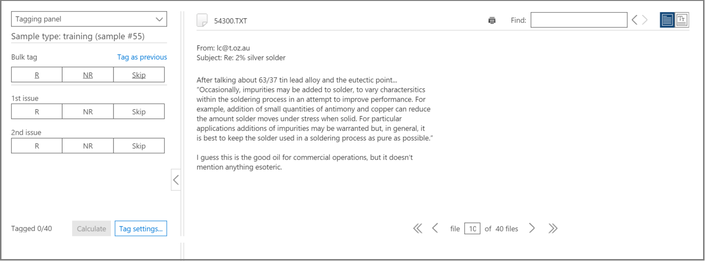

# Tagging- und Relevanzschulungen in Advanced eDiscoveryTagging and Relevance training in Advanced eDiscovery
  
In diesem Artikel wird das Verfahren zum Arbeiten mit dem Relevanzschulungsmodul in Advanced eDiscovery beschrieben.This article describes the procedure for working with the Relevance training module in Advanced eDiscovery.
  
Nachdem die Bewertung in Advanced eDiscovery abgeschlossen wurde und Sie die Relevanzschulungsphase eingeben, wird ein Schulungsbeispiel mit 40 Dateien zur Kennzeichnung auf die Registerkarte Tag gebracht.After Assessment is completed in Advanced eDiscovery, and you enter the Relevance training stage, a training sample of 40 files is brought into the Tag tab for tagging.
  
## Durchführen von RelevanzschulungenPerforming Relevance training

1. Auf der **Registerkarte \> Relevanztag** wird der Tagging-Bereich standardmäßig im linken Bereich angezeigt, und die Beispieldateien werden nach und nach zum Markieren angezeigt.In the **Relevance \> Tag** tab, the Tagging pane is displayed by default in the left pane and the sample files are displayed, one at a time for tagging.

    
  
    Auf der **Registerkarte Tag** wird der Anzeigename der Datei angezeigt.In the **Tag** tab, the file's display name is shown. Dies kann der Pfad, der E-Mail-Betreff, der Titel oder der benutzerdefinierte Name sein.This could be the path, email subject, title, or user-defined name. Die ID, der Dateipfad oder der Textpfad können durch Klicken mit der rechten Maustaste auf den Pfad der Datei kopiert werden.The ID, file path or text path can be copied by right-clicking on the file's path.

    Die  Tag-Tab-Tagging-Statistik zeigt die Dateibeispielnummer (oben im linken Bereich), die Anzahl der aktuell angezeigten Datei aus den Gesamtzahl der Dateien im Beispiel (unten im rechten Bereich) und die aktuelle Gesamtanzahl markierter Dateien im Beispiel (unten im linken Bereich), die sich beim Taggen von Dateien ändert.The **Tag** tab tagging statistics show the file sample number (at the top of the left pane), the number of the currently displayed file out of the total files in the sample (bottom of right pane), and the current total number of tagged files in the sample (bottom of the left pane), which changes as you tag files. Dies gilt für alle Relevanztags, die durchgeführt werden, ob in Assessment, Training, Catch-up oder Test.This applies for any Relevance tagging done, whether in Assessment, Training, Catch-up, or Test.

    Symbole, die das Vorhandensein von Kommentaren, Tags und Familiendateien angeben, werden in der Dateiansicht in einer Leiste über der Datei angezeigt.Icons indicating the existence of comments, tags, and family files are displayed in the file view in a bar above the file.

2. Bestimmen Sie die Relevanz der Datei für das Fallproblem, und markieren Sie die Datei mithilfe der Schaltflächen für das Tagging-Optionssymbol oder tastenkombinationen, wie in der folgenden Tabelle dargestellt:Determine the file's relevance for the case issue and tag the file using either the Tagging option icon buttons or keyboard shortcuts, as shown in the following table:

   |**Taggingoption****Tagging option**|**Beschreibung****Description**|**Tastenkombination****Keyboard shortcut**|**Tastenkombination zum Massentagieren (bei mehreren Problemen)****Bulk tagging keyboard shortcut (for multiple issues)**|
   |-----|-----|-----|-----|
   |RR    |RelevantRelevant    |ZZ    |`Shift + Z`    |
   |NRNR    |Nicht relevantNot relevant    |XX    |`Shift + X`    |
   |ÜberspringenSkip    |ÜberspringenSkip    |CC    |`Shift + A`    |
   |||||

   - Wenn mehrere Probleme für eine Datei vorhanden sind, wird die Auswahl nach dem Kennzeichnen eines Problems zum nächsten Problem (falls vorhanden) bewegt.When multiple issues exist for a file, after tagging one issue, the selection moves to the next issue (if any).  

   - Schlüsselwörter, die vom Administrator oder Fallmanager beim Hervorheben von Schlüsselwörtern (Stichwörter für relevanzeinrichtung hervorgehoben) definiert wurden, werden (in angegebenen Farben) angezeigt, um relevante Dateien beim Markieren \> zu identifizieren.Keywords that were defined by the Administrator or Case manager when highlighting keywords (Relevance setup \> Highlighted keywords), will be displayed (in specified colors) to help identify relevant files while tagging. Wenn ein Schlüsselwort eine doppelte Unterstreichung hat, kann auf es geklickt werden, um eine QuickInfo mit der Beschreibung des Schlüsselworts angezeigt zu werden.If a keyword has a double underline, it can be clicked to display a tool-tip with the keyword's description.

     Klicken Sie optional auf der **Registerkarte Tag** auf **Tag-Einstellungen,** um die folgenden Optionen festlegen:Optionally, in the **Tag** tab, click **Tag settings** to set the following options:

      
  
   - **Massentag**: Verwenden Sie diese Option, um mehrere Probleme für eine Datei zuzuordnen, indem Sie **Alle** auswählen, um das Tag für die ausgewählte Datei für alle Probleme (Überschreibungen bereits markierter Probleme) oder durch Auswählen des Rests, um das Tag auf die verbleibenden nicht markierten Probleme anzuwenden. **Bulk tag**: Use this option to assign multiple issues for a file by selecting **All** to set the tag for the selected file for all issues (overrides already tagged issues) or by selecting **The rest** to apply the tag to the remaining untagged issues. Die ausgewählte Option bleibt für alle Fälle dieses Benutzers wirksam, bis sie von diesem Benutzer geändert wurde (die Einstellung gilt pro Benutzer für alle Fälle des Benutzers).The selected option remains in effect for all of this user's cases until changed by that user (setting is per user for all the user's cases).

   - **Autotag**: Aktivieren Sie dieses Kontrollkästchen, um andere Probleme für eine Datei nach einem einzelnen relevanten Tagging als Nicht relevant zu setzen.**Auto tag**: Select this check box to set other issues for a file as Not relevant after a single Relevant tagging.

   - **Automatischer Fortschritt**: Aktivieren Sie dieses Kontrollkästchen, um die angezeigte Dateiauswahl in die nächste Datei zu verschieben, wenn das letzte oder nur das letzte problem ohne Kennzeichnung kennzeichnen wird.**Auto advance**: Select this check box to move the displayed file selection to the next file when tagging the last or only untagged issue.

    Übersprungene Dateien werden für Relevanzschulungs- und Relevanzbewertungszwecke nicht berücksichtigt.Skipped files will not be considered for Relevance training and Relevance scoring purposes.

3. Freitextkommentare, die einer Datei zugeordnet sind, können über die Option **Kommentar** in der Dropdownliste des linken Bereichs angezeigt und bearbeitet werden.Free-text comments, associated with a file, can be viewed and edited via the **Comment** option in the left pane drop-down list. (optional)(optional)

4. Richtlinien für das Tagging können angezeigt werden, indem Sie in der Dropdownliste des linken Bereichs die Option **Kennzeichnungsrichtlinien** auswählen.Guidelines for tagging can be viewed by selecting the **Tagging guidelines** option in the left pane drop-down list.

5. Nachdem Sie das Taggen aller Dateien in der Liste abgeschlossen haben und bereit sind, die Ergebnisse zu berechnen, klicken Sie auf **Berechnen**.After you finish tagging all files in the list and are ready to calculate the results, click **Calculate**. Die **Registerkarte Nachverfolgen** wird angezeigt.The **Track** tab is displayed.  

## Arbeiten mit der BeispieldateienlisteWorking with the sample files list

In der Beispieldateienliste können Sie eine Liste der Dateien in einem Schulungsbeispiel anzeigen und verschiedene Aktionen für eine oder mehrere Dateien ausführen.The sample files list allows you to view a list of the files in a training sample and perform various actions on one or more files. Auf der **Registerkarte Relevanztag** zeigt der linke Bereich Beispieldateien eine Liste der Beispieldateien für die Verarbeitung mit \>  Assessment-, Schulungs-, Nachhol- und Inkonsistenzenprozessen an. In the **Relevance** \> **Tag** tab, the **Sample files** left pane displays a list of sample files for processing with Assessment, Training, Catch-up, and Inconsistencies processes.
  
1. Wählen Sie auf der Registerkarte **\> Relevanztag** die Beispieldateien in der Dropdownliste linker Bereich aus.In the **Relevance \> Tag** tab, select the Sample files in the left pane drop-down list. Die Beispieldateien werden im linken Bereich aufgelistet.The sample files are listed in the left pane.

    
  
2. Wählen Sie eine bestimmte Beispiel- oder Dateinummer aus, indem Sie ihre Nummer in die Felder **Beispiel** oder **Datei** eingeben oder auswählen.Select a specific sample or file number by entering or selecting its number in the **Sample** or **File** boxes.

   - Eine Dateisequenznummer wird in der linken Spalte der angezeigten Dateiliste auf der **Registerkarte Tag** aufgeführt. Durch Klicken auf die Kopfzeile wird die ursprüngliche angezeigte Reihenfolge der Dateien in die ursprüngliche Reihenfolge zurückgegeben.A file sequence number is listed in the left column of the displayed file list on the **Tag** tab. By clicking the header, the original displayed order of the files returns to its original order.

   - Wenn Sie auf eine Dateizeile klicken, wird ihr Inhalt im rechten Bereich angezeigt.Clicking on a file row displays its content in the right pane.

   - Navigieren Sie zwischen Dateien im aktuellen Beispiel mithilfe der unteren Menüleistenoptionen.Navigate between files in the current sample by using the lower menu bar options. Darüber hinaus stehen Navigationstastaturverknüpfungen zur Verfügung:In addition, navigational keyboard shortcuts are available:
  
     - So wechseln Sie zur ersten Datei im Beispiel: `Shift + Ctrl + <`To go to the first file in the sample: `Shift + Ctrl + <`

     - So wechseln Sie zur vorherigen Datei im Beispiel: `Shift + <`To go to the previous file in the sample: `Shift + <`

     - So wechseln Sie zur nächsten Datei im Beispiel: `Shift + >`To go to the next file in the sample: `Shift + >`

     - So wechseln Sie zur letzten Datei im Beispiel: `Shift + Ctrl + >`To go to the last file in the sample: `Shift + Ctrl + >`
