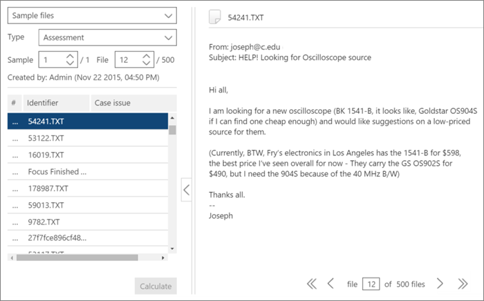

# Tagging- und Relevanzschulungen in Advanced eDiscovery
  
In diesem Artikel wird das Verfahren zum Arbeiten mit dem Relevanzschulungsmodul in Advanced eDiscovery beschrieben.
  
Nachdem die Bewertung in Advanced eDiscovery abgeschlossen wurde und Sie die Relevanzschulungsphase eingeben, wird ein Schulungsbeispiel mit 40 Dateien zur Kennzeichnung auf die Registerkarte Tag gebracht.
  
## Durchführen von Relevanzschulungen

1. Auf der **Registerkarte \> Relevanztag** wird der Tagging-Bereich standardmäßig im linken Bereich angezeigt, und die Beispieldateien werden nach und nach zum Markieren angezeigt.

    
  
    Auf der **Registerkarte Tag** wird der Anzeigename der Datei angezeigt. Dies kann der Pfad, der E-Mail-Betreff, der Titel oder der benutzerdefinierte Name sein. Die ID, der Dateipfad oder der Textpfad können durch Klicken mit der rechten Maustaste auf den Pfad der Datei kopiert werden.

    Die  Tag-Tab-Tagging-Statistik zeigt die Dateibeispielnummer (oben im linken Bereich), die Anzahl der aktuell angezeigten Datei aus den Gesamtzahl der Dateien im Beispiel (unten im rechten Bereich) und die aktuelle Gesamtanzahl markierter Dateien im Beispiel (unten im linken Bereich), die sich beim Taggen von Dateien ändert. Dies gilt für alle Relevanztags, die durchgeführt werden, ob in Assessment, Training, Catch-up oder Test.

    Symbole, die das Vorhandensein von Kommentaren, Tags und Familiendateien angeben, werden in der Dateiansicht in einer Leiste über der Datei angezeigt.

2. Bestimmen Sie die Relevanz der Datei für das Fallproblem, und markieren Sie die Datei mithilfe der Schaltflächen für das Tagging-Optionssymbol oder tastenkombinationen, wie in der folgenden Tabelle dargestellt:

   |**Taggingoption**|**Beschreibung**|**Tastenkombination**|**Tastenkombination zum Massentagieren (bei mehreren Problemen)**|
   |-----|-----|-----|-----|
   |R    |Relevant    |Z    |`Shift + Z`    |
   |NR    |Nicht relevant    |X    |`Shift + X`    |
   |Überspringen    |Überspringen    |C    |`Shift + A`    |
   |||||

   - Wenn mehrere Probleme für eine Datei vorhanden sind, wird die Auswahl nach dem Kennzeichnen eines Problems zum nächsten Problem (falls vorhanden) bewegt.  

   - Schlüsselwörter, die vom Administrator oder Fallmanager beim Hervorheben von Schlüsselwörtern (Stichwörter für relevanzeinrichtung hervorgehoben) definiert wurden, werden (in angegebenen Farben) angezeigt, um relevante Dateien beim Markieren \> zu identifizieren. Wenn ein Schlüsselwort eine doppelte Unterstreichung hat, kann auf es geklickt werden, um eine QuickInfo mit der Beschreibung des Schlüsselworts angezeigt zu werden.

     Klicken Sie optional auf der **Registerkarte Tag** auf **Tag-Einstellungen,** um die folgenden Optionen festlegen:

      
  
   - **Massentag**: Verwenden Sie diese Option, um mehrere Probleme für eine Datei zuzuordnen, indem Sie **Alle** auswählen, um das Tag für die ausgewählte Datei für alle Probleme (Überschreibungen bereits markierter Probleme) oder durch Auswählen des Rests, um das Tag auf die verbleibenden nicht markierten Probleme anzuwenden.  Die ausgewählte Option bleibt für alle Fälle dieses Benutzers wirksam, bis sie von diesem Benutzer geändert wurde (die Einstellung gilt pro Benutzer für alle Fälle des Benutzers).

   - **Autotag**: Aktivieren Sie dieses Kontrollkästchen, um andere Probleme für eine Datei nach einem einzelnen relevanten Tagging als Nicht relevant zu setzen.

   - **Automatischer Fortschritt**: Aktivieren Sie dieses Kontrollkästchen, um die angezeigte Dateiauswahl in die nächste Datei zu verschieben, wenn das letzte oder nur das letzte problem ohne Kennzeichnung kennzeichnen wird.

    Übersprungene Dateien werden für Relevanzschulungs- und Relevanzbewertungszwecke nicht berücksichtigt.

3. Freitextkommentare, die einer Datei zugeordnet sind, können über die Option **Kommentar** in der Dropdownliste des linken Bereichs angezeigt und bearbeitet werden. (optional)

4. Richtlinien für das Tagging können angezeigt werden, indem Sie in der Dropdownliste des linken Bereichs die Option **Kennzeichnungsrichtlinien** auswählen.

5. Nachdem Sie das Taggen aller Dateien in der Liste abgeschlossen haben und bereit sind, die Ergebnisse zu berechnen, klicken Sie auf **Berechnen**. Die **Registerkarte Nachverfolgen** wird angezeigt.  

## Arbeiten mit der Beispieldateienliste

In der Beispieldateienliste können Sie eine Liste der Dateien in einem Schulungsbeispiel anzeigen und verschiedene Aktionen für eine oder mehrere Dateien ausführen. Auf der **Registerkarte Relevanztag** zeigt der linke Bereich Beispieldateien eine Liste der Beispieldateien für die Verarbeitung mit \>  Assessment-, Schulungs-, Nachhol- und Inkonsistenzenprozessen an. 
  
1. Wählen Sie auf der Registerkarte **\> Relevanztag** die Beispieldateien in der Dropdownliste linker Bereich aus. Die Beispieldateien werden im linken Bereich aufgelistet.

    
  
2. Wählen Sie eine bestimmte Beispiel- oder Dateinummer aus, indem Sie ihre Nummer in die Felder **Beispiel** oder **Datei** eingeben oder auswählen.

   - Eine Dateisequenznummer wird in der linken Spalte der angezeigten Dateiliste auf der **Registerkarte Tag** aufgeführt. Durch Klicken auf die Kopfzeile wird die ursprüngliche angezeigte Reihenfolge der Dateien in die ursprüngliche Reihenfolge zurückgegeben.

   - Wenn Sie auf eine Dateizeile klicken, wird ihr Inhalt im rechten Bereich angezeigt.

   - Navigieren Sie zwischen Dateien im aktuellen Beispiel mithilfe der unteren Menüleistenoptionen. Darüber hinaus stehen Navigationstastaturverknüpfungen zur Verfügung:
  
     - So wechseln Sie zur ersten Datei im Beispiel: `Shift + Ctrl + <`

     - So wechseln Sie zur vorherigen Datei im Beispiel: `Shift + <`

     - So wechseln Sie zur nächsten Datei im Beispiel: `Shift + >`

     - So wechseln Sie zur letzten Datei im Beispiel: `Shift + Ctrl + >`
