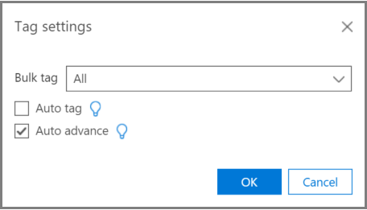

# Tagging und Relevanz Training in Advanced eDiscoveryTagging and Relevance training in Advanced eDiscovery
  
In diesem Artikel wird das Verfahren zum Arbeiten mit dem Modul zur Relevanz-Schulung in Advanced eDiscovery beschrieben.This article describes the procedure for working with the Relevance training module in Advanced eDiscovery.
  
Nachdem die Bewertung in Advanced eDiscovery abgeschlossen wurde und Sie die Relevanz-Schulungsphase eingeben, wird ein Schulungs Beispiel mit 40-Dateien in die Tag-Registerkarte für die Markierung von Tags gebracht.After Assessment is completed in Advanced eDiscovery, and you enter the Relevance training stage, a training sample of 40 files is brought into the Tag tab for tagging.
  
## Durchführen von Relevanz-SchulungenPerforming Relevance training

1. Auf der **Register \> Karte relevanztag** wird der Bereich Tagging standardmäßig im linken Bereich angezeigt, und die Beispieldateien werden jeweils einzeln für die Markierung angezeigt.In the **Relevance \> Tag** tab, the Tagging pane is displayed by default in the left pane and the sample files are displayed, one at a time for tagging.

    
  
    Auf der Registerkarte **Tag** wird der Anzeigename der Datei angezeigt.In the **Tag** tab, the file's display name is shown. Hierbei kann es sich um den Pfad, den e-Mail-Betreff, den Titel oder den benutzerdefinierten Namen handeln.This could be the path, email subject, title, or user-defined name. Die ID, der Dateipfad oder der Textpfad können kopiert werden, indem Sie mit der rechten Maustaste auf den Pfad der Datei klicken.The ID, file path or text path can be copied by right-clicking on the file's path.

    Die Kennzeichnung der **Tags** -Registerkarten Statistik zeigt die Datei Beispiel Nummer (oben im linken Bereich), die Nummer der aktuell angezeigten Datei aus den Gesamtdateien im Beispiel (unten im rechten Bereich) und die aktuelle Gesamtzahl der getaggten Dateien im Beispiel (unten im linken Bereich) an, die sich beim Markieren von Dateien ändert.The **Tag** tab tagging statistics show the file sample number (at the top of the left pane), the number of the currently displayed file out of the total files in the sample (bottom of right pane), and the current total number of tagged files in the sample (bottom of the left pane), which changes as you tag files. Dies gilt für alle durchgeführten Relevanz-Markierungen, sei es bei der Bewertung, Schulung, Aufholjagd oder Test.This applies for any Relevance tagging done, whether in Assessment, Training, Catch-up, or Test.

    Symbole, die das vorhanden sein von Kommentaren, Tags und Familiendateien angeben, werden in der Datei Ansicht in einer Leiste oberhalb der Datei angezeigt.Icons indicating the existence of comments, tags, and family files are displayed in the file view in a bar above the file.

2. Ermitteln Sie die Relevanz der Datei für das Fall Problem, und markieren Sie die Datei mit den Symbolschaltflächen für die Markierungsoption oder mit den Tastenkombinationen, wie in der folgenden Tabelle dargestellt:Determine the file's relevance for the case issue and tag the file using either the Tagging option icon buttons or keyboard shortcuts, as shown in the following table:

   |**Tagging-Option****Tagging option**|**Beschreibung****Description**|**Tastenkombination****Keyboard shortcut**|**Tastenkombination für Massen Markierungen (für mehrere Probleme)****Bulk tagging keyboard shortcut (for multiple issues)**|
   |-----|-----|-----|-----|
   |RR    |RelevantenRelevant    |ZZ    |`Shift + Z`    |
   |NrNR    |Nicht relevantNot relevant    |XX    |`Shift + X`    |
   |ÜberspringenSkip    |ÜberspringenSkip    |CC    |`Shift + A`    |
   |||||

   - Wenn mehrere Probleme für eine Datei vorhanden sind, wird die Auswahl nach der Kennzeichnung eines Problems zum nächsten Problem (sofern vorhanden) verschoben.When multiple issues exist for a file, after tagging one issue, the selection moves to the next issue (if any).  

   - Schlüsselwörter, die vom Administrator oder Fall-Manager beim Hervorheben von Stichwörtern definiert wurden (Relevanz \> -Setup markierte Schlüsselwörter), werden (in bestimmten Farben) angezeigt, um relevante Dateien beim Tagging zu identifizieren.Keywords that were defined by the Administrator or Case manager when highlighting keywords (Relevance setup \> Highlighted keywords), will be displayed (in specified colors) to help identify relevant files while tagging. Wenn ein Schlüsselwort doppelt unterstrichen ist, kann auf dieses geklickt werden, um einen QuickInfo mit der Beschreibung des Schlüsselwortes anzuzeigen.If a keyword has a double underline, it can be clicked to display a tool-tip with the keyword's description.

     Klicken Sie optional auf der Registerkarte **Tag** auf **Tag-Einstellungen** , um die folgenden Optionen festzulegen:Optionally, in the **Tag** tab, click **Tag settings** to set the following options:

      
  
   - **Massentag**: Verwenden Sie diese Option, um mehrere Probleme für eine Datei zuzuweisen, indem Sie **alle** auswählen, um das Tag für die ausgewählte Datei für alle Probleme (Überschreibt bereits markierte Probleme) festzulegen, oder indem Sie **den Rest** auswählen, um das Tag auf die verbleibenden nicht markierten Probleme anzuwenden.**Bulk tag**: Use this option to assign multiple issues for a file by selecting **All** to set the tag for the selected file for all issues (overrides already tagged issues) or by selecting **The rest** to apply the tag to the remaining untagged issues. Die ausgewählte Option bleibt für alle Fälle dieses Benutzers gültig, bis Sie von diesem Benutzer geändert wird (Einstellung ist pro Benutzer für alle Fälle des Benutzers).The selected option remains in effect for all of this user's cases until changed by that user (setting is per user for all the user's cases).

   - **Auto-Tag**: Aktivieren Sie dieses Kontrollkästchen, um andere Probleme für eine Datei nach einem einzelnen relevanten Tagging als nicht relevant festzulegen.**Auto tag**: Select this check box to set other issues for a file as Not relevant after a single Relevant tagging.

   - **Auto Advance**: Aktivieren Sie dieses Kontrollkästchen, um die angezeigte Dateiauswahl in die nächste Datei zu verlagern, wenn Sie das letzte oder nur unmarkierte Problem markieren.**Auto advance**: Select this check box to move the displayed file selection to the next file when tagging the last or only untagged issue.

    Übersprungene Dateien werden nicht für Relevanz Training und Relevanz Scoring Zwecke berücksichtigt.Skipped files will not be considered for Relevance training and Relevance scoring purposes.

3. Freitextkommentare, die einer Datei zugeordnet sind, können über die Option **Kommentar** in der Dropdownliste im linken Bereich angezeigt und bearbeitet werden.Free-text comments, associated with a file, can be viewed and edited via the **Comment** option in the left pane drop-down list. (optional)(optional)

4. Richtlinien für die Markierung können angezeigt werden, indem Sie in der Dropdownliste Linker Bereich die Option **Markierungs Richtlinien** auswählen.Guidelines for tagging can be viewed by selecting the **Tagging guidelines** option in the left pane drop-down list.

5. Nachdem Sie die Markierung aller Dateien in der Liste abgeschlossen haben und die Ergebnisse berechnen können, klicken Sie auf **berechnen**.After you finish tagging all files in the list and are ready to calculate the results, click **Calculate**. Die Registerkarte **Track** wird angezeigt.The **Track** tab is displayed.  

## Arbeiten mit der Liste "Beispieldateien"Working with the sample files list

In der Liste mit den Beispieldateien können Sie eine Liste der Dateien in einem Schulungs Beispiel anzeigen und verschiedene Aktionen für eine oder mehrere Dateien ausführen.The sample files list allows you to view a list of the files in a training sample and perform various actions on one or more files. Auf der  \> Registerkarte "Relevanz- **Tag** " wird im linken Bereich " **Sample Files** " eine Liste der Beispieldateien zur Verarbeitung mit den Prozessen "Assessment", "Training", "Catch-up" und "Inkonsistenzen" angezeigt.In the **Relevance** \> **Tag** tab, the **Sample files** left pane displays a list of sample files for processing with Assessment, Training, Catch-up, and Inconsistencies processes.
  
1. Wählen Sie auf der Registerkarte **Relevanz- \> Tag** die Beispieldateien in der Dropdownliste Linker Bereich aus.In the **Relevance \> Tag** tab, select the Sample files in the left pane drop-down list. Die Beispieldateien werden im linken Bereich aufgelistet.The sample files are listed in the left pane.

    
  
2. Wählen Sie eine bestimmte Stichprobe oder Dateinummer aus, indem Sie die entsprechende Nummer in den Feldern **Sample** oder **File** eingeben oder auswählen.Select a specific sample or file number by entering or selecting its number in the **Sample** or **File** boxes.

   - In der linken Spalte der Liste angezeigter Dateien auf der Registerkarte **Tag** wird eine Dateisequenz Nummer aufgeführt. Durch Klicken auf die Kopfzeile kehrt die ursprüngliche Reihenfolge der Dateien in die ursprüngliche Reihenfolge zurück.A file sequence number is listed in the left column of the displayed file list on the **Tag** tab. By clicking the header, the original displayed order of the files returns to its original order.

   - Durch Klicken auf eine Datei Zeile wird der Inhalt im rechten Bereich angezeigt.Clicking on a file row displays its content in the right pane.

   - Navigieren zwischen Dateien im aktuellen Beispiel mithilfe der untergeordneten Menüleistenoptionen.Navigate between files in the current sample by using the lower menu bar options. Darüber hinaus stehen Navigationstasten Kombinationen zur Verfügung:In addition, navigational keyboard shortcuts are available:
  
     - So wechseln Sie zur ersten Datei im Beispiel: `Shift + Ctrl + <`To go to the first file in the sample: `Shift + Ctrl + <`

     - So wechseln Sie zur vorherigen Datei im Beispiel: `Shift + <`To go to the previous file in the sample: `Shift + <`

     - So wechseln Sie zur nächsten Datei im Beispiel: `Shift + >`To go to the next file in the sample: `Shift + >`

     - So wechseln Sie zur letzten Datei im Beispiel: `Shift + Ctrl + >`To go to the last file in the sample: `Shift + Ctrl + >`
