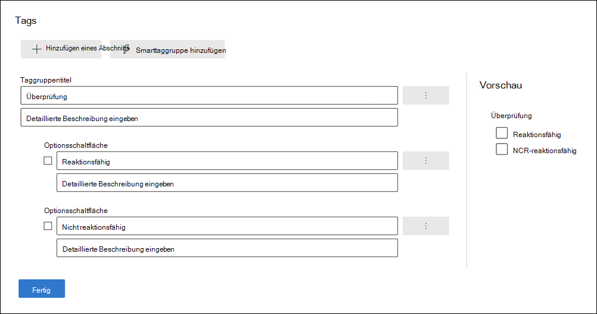
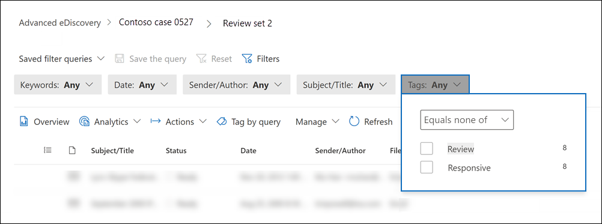

# Markieren von Dokumenten in einem Prüfdateisatz in Advanced eDiscoveryTag documents in a review set in Advanced eDiscovery

Das Organisieren von Inhalten in einem Prüfdateisatz ist wichtig, um verschiedene Workflows im eDiscovery-Prozess abzuschließen.Organizing content in a review set is important to complete various workflows in the eDiscovery process. Dies umfasst Folgendes:This includes:

- Culling von unnötigen InhaltenCulling unnecessary content

- Identifizieren relevanter InhalteIdentifying relevant content

- Identifizieren von Inhalten, die von einem Experten oder Anwalt überprüft werden müssenIdentifying content that must be reviewed by an expert or attorney

Wenn Experten, Anwälte oder andere Benutzer Inhalte in einem Prüfdateisatz überprüfen, können ihre Ansichten zu den Inhalten mithilfe von Tags erfasst werden.When experts, attorneys, or other users review content in a review set, their opinions related to the content can be captured by using tags. Wenn z. B. der Zweck darin besteht, unnötige Inhalte zu entfernen, kann ein Benutzer Dokumente mit einem Tag wie z. B. "nicht reaktionsfähig" markieren.For example, if the intent is to cull unnecessary content, a user can tag documents with a tag such as "non-responsive". Nachdem Inhalte überprüft und markiert wurden, kann eine Prüfdateisatzsuche erstellt werden, um alle Inhalte auszuschließen, die als "nicht reaktionsfähig" gekennzeichnet sind.After content has been reviewed and tagged, a review set search can be created to exclude any content tagged as "non-responsive". Dadurch werden die nicht reaktionsfähigen Inhalte aus den nächsten Schritten im eDiscovery-Workflow entfernt.This process eliminates the non-responsive content from the next steps in the eDiscovery workflow. Der Tagging-Bereich in einem Prüfdateisatz kann für jeden Fall angepasst werden, sodass die Tags den beabsichtigten Überprüfungsworkflow für den Fall unterstützen.The tagging panel in a review set can be customized for every case so that the tags support the intended review workflow for the case.

> [!NOTE]
> Der Bereich von Tags ist ein Advanced eDiscovery Fall.The scope of tags is an Advanced eDiscovery case. Das bedeutet, dass ein Fall nur einen Satz von Tags enthalten kann, die Prüfer zum Markieren von Dokumenten mit Prüfdateisatz verwenden können.That means a case can only have one set of tags that reviewers can use to tag review set documents. Sie können keinen anderen Satz von Tags für die Verwendung in verschiedenen Prüfdateisätzen im selben Fall einrichten.You can't set up a different set of tags for use in different review sets in the same case.

## TagtypenTag types

Advanced eDiscovery bietet zwei Arten von Tags:Advanced eDiscovery provides two types of tags:

- **Single Choice Tags:** Beschränkt Prüfer auf die Auswahl eines einzelnen Tags innerhalb einer Gruppe.**Single choice tags**: Restricts reviewers to selecting a single tag within a group. Diese Arten von Tags können nützlich sein, um sicherzustellen, dass Prüfer keine widersprüchlichen Tags wie "reaktionsfähig" und "nicht reaktionsfähig" auswählen.These types of tags can be useful to ensure that reviewers don't select conflicting tags such as "responsive" and "non-responsive". Einzelne Auswahltags werden als Optionsfelder angezeigt.Single choice tags appear as radio buttons.

- **Multiple Choice-Tags:** Rezensionen erlauben, mehrere Tags innerhalb einer Gruppe auszuwählen.**Multiple choice tags**: Allow reviews to select multiple tags within a group. Diese Arten von Tags werden als Kontrollkästchen angezeigt.These types of tags appear as checkboxes.

## Tag-StrukturTag structure

Zusätzlich zu den Tagtypen kann die Struktur der Organisation von Tags im Tag-Bereich verwendet werden, um das Tagging von Dokumenten intuitiver zu gestalten.In addition to the tag types, the structure of how tags are organized in the tag panel can be used to make tagging documents more intuitive. Tags sind nach Abschnitten gruppiert.Tags are grouped by sections. Die Suche nach Prüfdateisatz unterstützt die Möglichkeit, nach Tag und Nach-Tag-Abschnitt zu suchen.Review set search supports the ability to search by tag and by tag section. Dies bedeutet, dass Sie eine Prüfdateisatzsuche erstellen können, um Dokumente abzurufen, die mit einem beliebigen Tag in einem Abschnitt markiert sind.This means you can create a review set search to retrieve documents tagged with any tag in a section.

Sie können Tags weiter organisieren, indem Sie sie in einem Abschnitt verschachteln.You can further organize tags by nesting them within a section. Wenn beispielsweise privilegierte Inhalte identifiziert und markiert werden sollen, kann die Schachtelung verwendet werden, um deutlich zu machen, dass ein Bearbeiter ein Dokument als "Privileged" markieren und den Typ der Berechtigung auswählen kann, indem das entsprechende geschachtelte Tag überprüft wird.For example, if the intent is to identify and tag privileged content, nesting can be used to make it clear that a reviewer can tag a document as "Privileged" and select the type of privilege by checking the appropriate nested tag.

## Erstellen von TagsCreate tags

Bevor Sie Tags auf Dokumente im Prüfdateisatz anwenden, müssen Sie eine Tagstruktur erstellen.Before applying tags to documents in the review set, you need to create a tag structure.

1. Öffnen Sie einen Prüfdateisatz, navigieren Sie zur Befehlsleiste, und wählen Sie **Tag nach Abfrage** aus.Open a review set and navigate to the command bar and select **Tag by query**.

2. Wählen Sie im Bereich "Tagging" die Option **"Tag verwalten" aus.**In the tagging panel, select **Manage tag options**

3. Wählen Sie **"Tag hinzufügen" aus.**Select **Add tag section**.

4. Geben Sie einen Taggruppentitel und eine optionale Beschreibung ein, und klicken Sie dann auf **"Speichern".**Type a tag group title and an optional description, and then click **Save**.

5. Wählen Sie das Dropdownmenü mit drei Punkten neben dem Taggruppentitel aus, und klicken Sie auf das **Kontrollkästchen "Hinzufügen"** oder **auf die Schaltfläche "Option hinzufügen".**Select the triple dot dropdown menu next to the tag group title and click **Add check box** or **Add option button**.

6. Geben Sie einen Namen und eine Beschreibung für das Kontrollkästchen oder die Optionsschaltfläche ein.Type a name and description for the checkbox or option button.

7. Wiederholen Sie diesen Vorgang, um neue Tagabschnitte, Tagoptionen und Kontrollkästchen zu erstellen.Repeat this process to create new tag sections, tag options, and checkboxes.

   

## Anwenden von TagsApplying tags

Wenn die Tagstruktur vorhanden ist, können Prüfer Tags auf Dokumente in einem Prüfdateisatz anwenden.With the tag structure in place, reviewers can apply tags to documents in a review set. Es gibt zwei verschiedene Möglichkeiten zum Anwenden von Tags:There are two different ways to apply tags:

- Tag-DateienTag files

- Tag nach AbfrageTag by query

### Tag-DateienTag files

Unabhängig davon, ob Sie ein einzelnes Element oder mehrere Elemente in einem Prüfdateisatz auswählen, können Sie Tags auf ihre Auswahl anwenden, indem Sie auf der Befehlsleiste auf **"Tag"-Dateien** klicken.Whether you select a single item or several items in a review set, you can apply tags to their selection by clicking **Tag files** in the command bar. Im Tagging-Bereich können Sie ein Tag auswählen, das automatisch auf die ausgewählten Dokumente angewendet wird.In the tagging panel, you can select a tag and it is automatically applied to the selected documents.

> [!NOTE]
> Tags werden nur auf ausgewählte Elemente in der Liste der Elemente angewendet.Tags will be applied only to selected items in the list of items.

### Tag nach AbfrageTag by query

Mit tagging by query können Sie Tags auf alle Elemente anwenden, die von einer Filterabfrage angezeigt werden, die derzeit im Prüfdateisatz angewendet wird.Tagging by query lets you apply tags to all items displayed by a filter query that's currently applied in the review set.

1. Heben Sie die Auswahl aller Elemente im Prüfdateisatz auf, wechseln Sie zur Befehlsleiste, und wählen Sie **Tag nach Abfrage** aus.Unselect all items in the review set and go to the command bar and select **Tag by query**.

2. Wählen Sie im Tagging-Bereich das Tag aus, das Sie anwenden möchten.In the tagging panel, select the tag that you want to apply.

3. Unter der Dropdownliste **"Tagauswahl"** gibt es drei Optionen, die festlegen, auf welche Elemente das Tag angewendet werden soll.Under the **Tag selection** dropdown, there are three options that dictate which items to apply the tag to.

   - **Elemente, die mit der angewendeten Abfrage übereinstimmen:** Wendet Tags auf bestimmte Elemente an, die den Filterabfragebedingungen entsprechen.**Items that match applied query**: Applies tags to specific items that match the filter query conditions.

   - **Zugeordnete Familienelemente einschließen:** Wendet Tags auf bestimmte Elemente an, die den Filterabfragebedingungen und den zugehörigen Familienelementen entsprechen.**Include associated family items**: Applies tags to specific items that match the filter query conditions and their associated family items. *Familienelemente* sind Elemente, die denselben FamilyId-Metadatenwert verwenden.*Family items* are items that share the same FamilyId metadata value.  

   - **Zugeordnete Unterhaltungselemente einschließen:** Wendet Tags auf Elemente an, die den Filterabfragebedingungen und den zugehörigen Unterhaltungselementen entsprechen.**Include associated conversation items**: Applies tags to items that match the filter query conditions and their associated conversation items. *Unterhaltungselemente* sind Elemente, die dieselben ConversationId-Metadatenwerte verwenden.*Conversation items* are items that share the same ConversationId metadata values.

   

4. Klicken Sie auf **"Taggingauftrag starten",** um den Taggingauftrag auszulösen.Click **Start tagging job** to trigger the tagging job.

## TagfilterTag filter

Verwenden Sie den Tagfilter im Prüfdateisatz, um Elemente basierend auf der Markierung eines Elements schnell zu finden oder aus den Abfrageergebnissen auszuschließen.Use the tag filter in review set to quickly find or exclude items from the query results based on how an item is tagged. 

1. Wählen Sie **Filter** aus, um den Filterbereich zu erweitern.Select **Filters** to expand the filter panel.

2. Auswählen und Erweitern **von Elementeigenschaften.**Select and expand **Item properties**.

3. Scrollen Sie nach unten, um den Filter **"Tag"** zu suchen, aktivieren Sie das Kontrollkästchen, und klicken Sie dann auf **"Fertig".**Scroll down to find the filter named **Tag**, select the checkbox, and then click **Done**.

4. Führen Sie einen der folgenden Schritte aus, um Elemente mit einem bestimmten Tag in eine Abfrage einzuschließen oder auszuschließen:To include or exclude items with a specific tag from a query, do one of the following:

   - **Elemente einschließen:** Wählen Sie den Tagwert aus, und wählen Sie im Dropdownmenü **"Gleich"** aus.**Include items**: Select the tag value and select **Equal any of** in the dropdown menu.

      OderOr

   - **Elemente ausschließen:** Wählen Sie den Tagwert aus, und wählen Sie **"Gleich" im** Dropdownmenü aus.**Exclude items**: Select the tag value and select **Equals none of** in dropdown menu.

     

> [!NOTE]
> Aktualisieren Sie die Seite unbedingt, um sicherzustellen, dass der Tagfilter die neuesten Änderungen an der Tagstruktur anzeigt.Be sure to refresh the page to ensure that the tag filter displays the latest changes to the tag structure.
