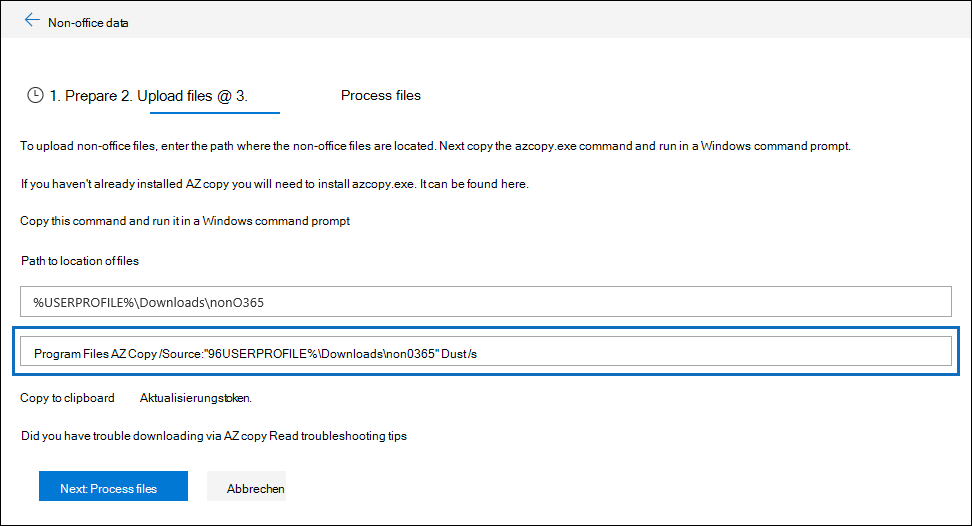

# Behandeln von AzCopy in Advanced eDiscoveryTroubleshoot AzCopy in Advanced eDiscovery

Beim Laden von Nicht-Microsoft 365-Daten oder Dokumenten zur Fehlerbehebung in Advanced eDiscovery stellt die Benutzeroberfläche einen Azure AzCopy-Befehl bereit, der Parameter mit dem Speicherort der Dateien, die Sie hochladen möchten, und dem Azure-Speicherort enthält, in den die Dateien hochgeladen werden.When loading non-Microsoft 365 data or documents for error remediation in Advanced eDiscovery, the user interface supplies an Azure AzCopy command that contains parameters with the location of where the files that you want to upload are stored and the Azure storage location that the files will be uploaded to. Um Ihre Dokumente hochzuladen, kopieren Sie diesen Befehl und führen ihn dann in einer Eingabeaufforderung auf Dem lokalen Computer aus.To upload your documents, you copy this command and then run it in a Command Prompt on your local computer.  Der folgende Screenshot zeigt ein Beispiel für einen AzCopy-Befehl:The follow screenshot shows an example of an AzCopy command:

Normalerweise funktioniert der bereitgestellte Befehl, wenn Sie ihn ausführen.Usually the command that's provided works when you run it. Es kann jedoch Fälle gibt, in denen der angezeigte Befehl nicht erfolgreich ausgeführt wird.However, there may be cases when the command that's displayed will not run successfully. Hier sind einige mögliche Gründe.Here's a few possible reasons.

## Die unterstützte Version von AzCopy wird nicht auf dem lokalen Computer installiert.The supported version of AzCopy isn't installed on the local computer

Zu diesem Zeitpunkt müssen Sie AzCopy v8.1 verwenden, um Nicht-Microsoft 365-Daten in Advanced eDiscovery zu laden.At this time, you must use AzCopy v8.1 to load non-Microsoft 365 data in Advanced eDiscovery. Der Befehl AzCopy, der auf  der Seite Dateien hochladen angezeigt wird, der im vorherigen Screenshot angezeigt wird, gibt einen Fehler zurück, wenn Sie AzCopy v8.1 nicht verwenden.The AzCopy command that's displayed on the **Upload files** page shown in the previous screenshot returns an error if you're not using AzCopy v8.1. Informationen zur Installation dieser Version finden Sie [unter Übertragen von Daten mit azCopy v8.1 unter Windows](/previous-versions/azure/storage/storage-use-azcopy).To install this version, see [Transfer data with the AzCopy v8.1 on Windows](/previous-versions/azure/storage/storage-use-azcopy).

## AzCopy ist nicht auf dem lokalen Computer oder nicht am Standardspeicherort installiertAzCopy isn't installed on the local computer or it's not installed in the default location

Wenn AzCopy nicht installiert oder an einem anderen Speicherort als dem Standardinstallationsspeicherort (d. h. ) installiert ist, wird möglicherweise der folgende Fehler angezeigt, wenn Sie den `%ProgramFiles(x86)%` Befehl AzCopy ausführen:If AzCopy isn't installed or it's installed in a location other than the default install location (which is `%ProgramFiles(x86)%`), you may receive the following error when you run the AzCopy command:

> Das System kann den angegebenen Pfad nicht finden.The system cannot find the path specified.

Wenn AzCopy nicht auf dem lokalen Computer installiert ist, finden Sie Installationsinformationen unter Übertragen von Daten mit [azCopy v8.1 unter Windows](/previous-versions/azure/storage/storage-use-azcopy).If AzCopy isn't installed on the local computer, you can find installation information in [Transfer data with the AzCopy v8.1 on Windows](/previous-versions/azure/storage/storage-use-azcopy). Stellen Sie sicher, dass sie am Standardspeicherort installiert wird.Be sure to install it in the default location.

Wenn AzCopy installiert ist, aber an einem anderen Speicherort als dem Standardspeicherort installiert ist, können Sie den Befehl kopieren, in eine Textdatei einfügen und dann den Pfad zum Speicherort ändern, an dem AzCopy installiert ist.If AzCopy is installed, but it's installed in a location different than the default location, you can copy the command, paste it to a text file, and then change the path to the location where AzCopy is installed. Wenn sich Azcopy beispielsweise in befindet, können Sie den ersten Teil des Befehls in `%ProgramFiles%` `%ProgramFiles(x86)%\Microsoft SDKs\Azure\AzCopy.exe` `%ProgramFiles%\Microsoft SDKs\Azure\AzCopy` ändern.For example, if Azcopy is located in `%ProgramFiles%`, then you can change the first part of the command from `%ProgramFiles(x86)%\Microsoft SDKs\Azure\AzCopy.exe` to `%ProgramFiles%\Microsoft SDKs\Azure\AzCopy`. Nachdem Sie diese Änderung geändert haben, kopieren Sie sie aus der Textdatei, und führen Sie sie dann als Eingabeaufforderung aus.After you make this change, copy it from the text file and then run it a Command Prompt.

> [!TIP]
> Wenn AzCopy an einem anderen Speicherort als dem Standardinstallationsspeicherort installiert ist, sollten Sie es deinstallieren und dann erneut am Standardspeicherort installieren.If AzCopy is installed in a location other then the default install location, consider uninstalling it and then re-installing it in the default location. Dies wird dazu beitragen, dieses Problem in Zukunft zu verhindern.This will help prevent this issue in the future.